# خواننده تلگرام

<!-- TOP_NAV START -->

<a href="https://github.com/robinsmarketonline/aio-downloader/blob/main/telegram/content/archive_1.md" style="display:inline-block; padding:6px 12px; margin:0 4px; background-color:#2ea44f; color:white; text-decoration:none; border-radius:4px; font-weight:bold;">صفحه بعد</a>

<!-- TOP_NAV END -->

<!-- MSG START -->

---
📅 بروزرسانی: 1405/02/26 11:04
---

## saministamm — post 62945

آموزش اتصال : 1- از قسمت Options وارد More Options بشید 2- گزینه ی Beast Mode حتما فعال باشه 3- گام بعدی از قسمت Connection Protocol گزینه ی CDN Fronting رو انتخاب کنید و بعد وارد صفحه ی اصلی بشید و Start رو بزنید کمی منتظر بمونید متصل میشه✅ توجه: اگر…

## saministamm — post 62944

میشهه نحوه وصل شدن به شیر خورشید بگی

## saministamm — post 62943

𝗣𝘀𝗶𝗽𝗵𝗼𝗻✅

Host:37.202.232.125
Port:1080

@saministamm

## saministamm — post 62942

وصله

104.88.70.105 92.123.10.153 96.16.248.152 104.83.197.160 96.16.248.133 96.16.249.54 96.16.248.162 173.222.249.155 184.87.193.138 96.6.34.243 96.17.96.7 96.16.248.137 104.110.191.32 184.51.97.129 104.116.98.32 184.87.193.139 184.84.221.34 96.16.248.139 96.16.249.52 88.221.0.39 96.16.249.28 96.16.248.142 96.17.72.48 104.117.76.106 104.109.128.163 96.17.72.51 96.17.72.75 104.109.250.11 104.115.39.202 96.16.249.38 184.85.134.164 104.76.210.6 104.117.76.16 104.117.76.8 184.84.81.125 23.66.101.71 96.16.248.177 92.123.10.217 184.85.155.41 88.221.0.52 173.222.146.221 184.51.102.248 96.17.72.80 96.17.72.58 173.222.249.146 104.115.39.104 96.17.72.57 173.222.249.153 173.222.108.57 96.17.72.10 23.67.142.129 173.222.108.49 88.221.0.58 96.16.248.182 104.110.191.39 104.110.191.41 96.16.248.159 96.16.248.156 96.16.248.153 104.110.191.14 88.221.0.38 88.221.0.44 104.108.86.50 96.7.105.201 96.16.248.166 173.222.249.160 96.16.248.183 88.221.0.56 184.51.102.88 96.16.249.23 88.221.0.50 104.68.103.205 96.16.248.170 104.116.96.159 96.16.249.20 88.221.0.36 96.17.180.45 96.16.249.11 96.16.248.181 104.83.197.135 173.222.108.120 23.64.59.9 92.122.16.5 104.120.56.96 104.117.76.147 92.123.10.232 184.86.103.159 104.117.76.137 104.117.76.145 104.117.76.139 104.117.76.114 104.69.81.4 104.117.76.104 104.117.76.99 104.117.76.179 104.117.76.153 104.120.90.56 104.117.76.90 104.117.76.91 96.6.33.250 104.117.76.67 104.117.76.72 104.117.76.64 104.117.76.57 104.117.76.58 104.117.76.19 184.86.103.20 184.86.103.12 184.86.103.23 184.86.103.14 184.86.103.19 173.223.109.20 96.17.96.31 104.76.220.65 173.222.148.49 184.51.96.7 104.76.220.42 184.51.149.33 104.108.238.182 104.80.48.203 92.122.17.9 92.123.8.93 104.76.210.216 104.76.220.112 23.64.224.224 173.222.168.212 173.222.168.191 92.123.8.87 92.123.10.140 184.51.102.58 184.51.102.177 104.76.220.170 104.76.220.168 92.122.6.109 173.223.29.67 92.123.8.100 23.65.117.219 173.222.148.43 23.75.23.33 184.86.103.223 184.86.103.217 184.86.103.196 23.67.129.53 184.86.103.139 184.86.103.142 104.108.237.97 184.86.103.13 104.112.135.94 23.64.59.26 92.122.9.160 104.120.80.245 173.223.239.52 92.122.1.249 173.222.116.88 96.16.249.50 96.16.249.33 96.16.249.60 96.16.248.151 96.16.248.145 96.16.248.148 96.16.248.176 96.16.248.136 96.16.248.154 96.16.248.143 92.123.8.77 104.124.165.104 96.16.249.12 96.16.248.155 96.16.248.179 96.16.248.171 96.16.248.147 96.16.248.144 23.65.124.89 96.16.249.9 23.65.124.88 96.16.249.16 96.16.249.6 96.16.248.174 96.16.248.167 96.16.248.164 92.123.8.99 92.123.8.94 23.65.124.104 92.123.8.74 23.65.124.91 23.65.124.106 23.65.124.105 104.108.231.170 23.66.101.79 184.85.137.131 104.120.82.77 104.120.77.233 23.64.12.168 104.120.89.53
104.120.76.148

## saministamm — post 62941

لیست جدید آی‌پی برنامه شیر و خورشید

23.73.2.141
104.83.5.202
23.67.136.200
23.67.136.202
23.65.119.52
96.16.122.70
92.122.166.236
92.122.166.234
92.122.166.237
104.110.138.190
173.222.200.5
184.51.252.36
184.51.252.38
104.83.5.208
96.16.122.146
96.17.206.214
92.122.166.197
104.94.100.73
104.83.15.66
88.221.213.81
172.239.57.117
104.117.76.40
184.51.252.4
96.17.207.30
96.16.122.83
96.16.122.150
23.73.207.11
96.16.122.77
96.17.207.155
92.123.189.82
96.16.122.82
96.16.122.66
96.7.218.219
96.16.122.137
184.51.252.157
92.123.189.41
184.86.251.12
96.16.122.154
96.16.122.157
184.51.252.152
96.17.207.12
23.79.48.162

## saministamm — post 62940

امروز May 16 روز جهانی پسره.

## saministamm — post 62939

آیپی جدید :

144.76.1.88
138.201.54.122
95.216.69.37
2.19.204.19
2.19.204.87
2.19.204.137
2.19.204.144
2.19.204.145
2.19.204.170
2.19.204.184
2.19.204.185
2.19.204.202
2.19.204.210
2.19.204.211
92.122.123.128
65.109.34.234
94.130.70.160
63.141.252.203
94.130.50.12
50.7.5.83
142.54.178.211
94.130.33.41
2.19.204.217
2.19.204.218
2.19.204.225
2.19.204.232
2.19.204.234
2.19.204.240
2.19.204.249
2.19.204.250
2.19.204.251
2.19.205.8
2.19.205.9
2.19.205.11
2.19.205.27
2.19.205.33
2.19.205.34
2.19.205.40
2.19.205.41
2.19.205.42
2.19.205.49
2.19.205.50
2.19.205.58
2.19.205.59
2.19.205.64
2.19.205.65
2.19.205.82
2.19.205.83
2.19.205.88
2.19.205.97
2.19.205.98
2.19.205.105
184.31.169.195
184.31.169.252
184.31.170.97
184.31.170.185

@saministamm 
🚀

## Skyportall — post 10741

  <a href="telegram/content/Skyportall_10741_1778916887.webm" target="_blank">🎬 Download video</a>

خب جیگرای من 
😑 ایا همچنان وصلید ؟
با هاست و پورتی که گذاشتم یا آی‌پی های آخر
من خودم هنوز وصلم

## ConfigWireguard — post 31745

  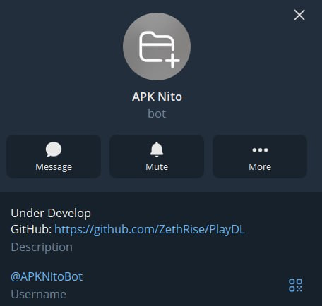

📥دانلود اپلیکیشن‌های اندروید از گوگل پلی با اینترنت داخلی

از طریق این پروژه، میتونید ربات تلگرامی‌ای رو ران کنید که به راحتی لینک گوگل پلی شما رو تبدیل به لینک داخلی میکنه:
https://github.com/ZethRise/PlayDL

این هم نمونه ربات پیاده‌سازی شده:
https://t.me/APKNitoBot

✉️ @MatinSenPaii

## ircfspace — post 2344

  

رفتن هرچی که تهش Hub داشته فیلتر کردن؛ حتی گیت‌هاب.
قوه عاقله‌س دیگه!

🔗 ᴡᴇʙꜱɪᴛᴇ • ᴠᴘɴʜᴜʙ • ɢɪᴛʜᴜʙᴍɪʀʀᴏʀ
@ircfspace

## ircfspace — post 2343

  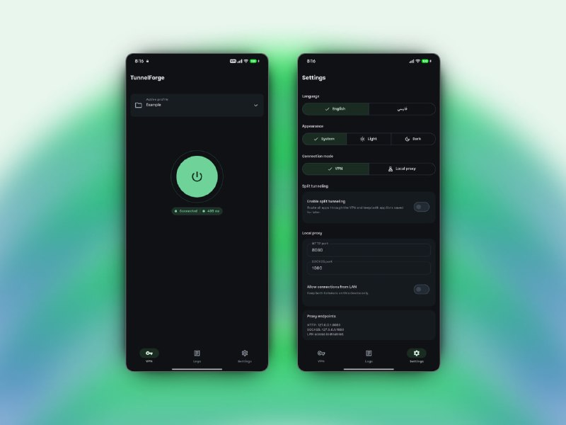

اپ متن‌باز و رایگان TunnelForge یک کلاینت L2TP برای اندروید هست، که از امکاناتی مثل حالت VPN برای کل دستگاه، حالت پروکسی با پشتیبانی از پروتکل‌های HTTP و SOCKS5، مسیریابی، پشتیبانی از چندین پروفایل همراه با ذخیره‌سازی اطلاعات لاگین، بررسی وضعیت اتصال، امکان استفاده از DNS سفارشی و تنظیم مقدار MTU برخورداره.

👉 github.com/evokelektrique/tunnel-forge/releases/latest

🔗 ᴡᴇʙꜱɪᴛᴇ • ᴠᴘɴʜᴜʙ • ɢɪᴛʜᴜʙᴍɪʀʀᴏʀ
@ircfspace

## ircfspace — post 2342

  

یه آسیب‌پذیری جدید به اسم YellowKey در سیستم‌عامل ویندوز پیدا شده که توی بعضی شرایط میشه BitLocker ویندوز ۱۱ رو با یه فلش USB دور زد؛ البته فقط وقتی مهاجم به خود دستگاه دسترسی فیزیکی داشته باشه. برای کمتر شدن ریسک بهتره ویندوز و BIOS آپدیت باشن، سیستم کامل Shutdown بشه نه Sleep، و برای BitLocker رمز یا PIN قبل از بوت فعال بشه.

🔗 ᴡᴇʙꜱɪᴛᴇ • ᴠᴘɴʜᴜʙ • ɢɪᴛʜᴜʙᴍɪʀʀᴏʀ
@ircfspace

## ircfspace — post 2341

  

قیمت استارلینک مینی به ۲۰۰ دلار رسیده که فعلا اشتراکش هم رایگانه. کنترل اینترنت با اینترنت پرو و قیمت‌های کذایی یه توهم زودگذر هست!

© imanraisii

🔗 ᴡᴇʙꜱɪᴛᴇ • ᴠᴘɴʜᴜʙ • ɢɪᴛʜᴜʙᴍɪʀʀᴏʀ
@ircfspace

## ircfspace — post 2340

  

در هفتاد و هشتمین روز از قطع سراسری اینترنت، از جدیدترین روش ترکیبی عبور از فیلترینگ با ذکر "لعنت بر جمهوری اسلامی" رونمایی شد. 😁

🔗 ᴡᴇʙꜱɪᴛᴇ • ᴠᴘɴʜᴜʙ • ɢɪᴛʜᴜʙᴍɪʀʀᴏʀ
@ircfspace

## ircfspace — post 2339

  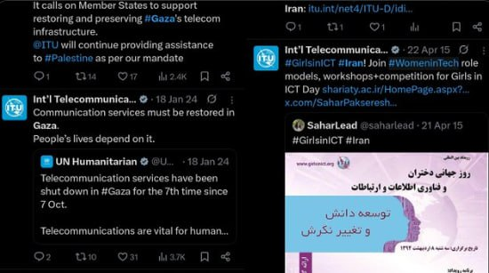

هشتگ از تبعیض بگو!
اینترنت غزه که قطع میشه، اتحادیه بین‌المللی مخابرات میاد محکومش می‌کنه، ولی وقتی که اینترنت ایران برای نزدیک ۳ ماه قطع میشه، سکوت مطلق! ۱۰ ساله در مورد ایران توییت نزده!

© markpash

🔗 ᴡᴇʙꜱɪᴛᴇ • ᴠᴘɴʜᴜʙ • ɢɪᴛʜᴜʙᴍɪʀʀᴏʀ
@ircfspace

## ircfspace — post 2338

  

بعد حساب این الاغ [توی ایکس] بسته میشه، داد میزنه که آزادی بیان نیست...

© AminSabeti

🔗 ᴡᴇʙꜱɪᴛᴇ • ᴠᴘɴʜᴜʙ • ɢɪᴛʜᴜʙᴍɪʀʀᴏʀ
@ircfspace

## ircfspace — post 2337

تقابل اینترنت و امنیت یه دروغ بزرگه. مردم نه‌تنها دسترسی به اینترنت رو به امنیت کذایی شما ترجیح میدن، بلکه هر چیز دیگری که خلاف ترجیحات شما باشه رو هم به انتخاب و تصمیم شما ترجیح میدن. شما هیچوقت جسارت برگزاری همه‌پرسی در هیچ موضوعی رو ندارید.

© vahidfarid

🔗 ᴡᴇʙꜱɪᴛᴇ • ᴠᴘɴʜᴜʙ • ɢɪᴛʜᴜʙᴍɪʀʀᴏʀ
@ircfspace

## ircfspace — post 2336

ستاد فضای مجازی با مدیریت دکتر عارف در اولین روز کاری برای افزایش رفاه مردم و تحقق وعده‌های دولت وفاق ملی، گیت‌هابو فیلتر کرد.

© pey_74

🔗 ᴡᴇʙꜱɪᴛᴇ • ᴠᴘɴʜᴜʙ • ɢɪᴛʜᴜʙᴍɪʀʀᴏʀ
@ircfspace

## Zel2oVPN — post 2815

✅New iP

2.22.21.152
95.101.23.82
23.215.0.164
23.197.161.35
184.28.230.87
23.220.128.221
96.17.207.142
23.50.131.18
23.36.162.209
23.219.3.212
23.223.245.150
96.16.122.59
23.2.13.138
23.2.13.144
96.17.207.135
23.220.113.51
96.17.72.41
23.203.185.105
95.101.35.83
2.21.239.23
23.54.210.170
23.215.60.73
95.101.181.125
23.192.237.222
23.200.143.71
23.58.222.98
125.56.219.8
104.80.49.118
96.16.122.158
2.21.239.10
96.16.122.65
95.101.23.170
104.111.202.158
23.2.13.201
92.123.102.104
23.58.222.139
2.17.147.89
96.17.178.132
23.49.248.6
23.222.30.64
23.55.110.70
23.2.13.153
173.222.105.65
23.200.143.73
23.201.217.14
23.55.110.200
95.101.23.25
23.37.206.186
173.222.105.42
95.101.29.12
88.221.92.177
23.50.131.132
184.86.251.27
2.16.244.11
2.16.27.71
2.19.10.30
104.121.12.86
23.73.207.16
2.18.190.26
96.16.122.149
23.201.217.150
95.101.23.168
96.17.207.162
96.16.122.48
95.101.35.73
23.192.237.208
80.67.82.179
96.17.207.154
2.21.89.66
2.18.190.27
95.100.156.147
23.192.46.51
104.76.220.137
23.36.162.198
23.37.197.128
96.17.207.143
23.36.162.208
23.36.162.202
23.200.143.88
23.55.110.46
23.55.110.143
173.222.105.18
2.23.176.166
23.44.10.10
104.126.37.171
23.55.155.169
23.210.123.174
104.117.76.26
23.46.188.168
23.58.222.147
95.101.200.63
125.56.219.32
23.192.237.209
95.101.29.54
23.46.230.118
96.17.207.153
184.25.52.200
23.202.156.203
23.36.162.196
96.16.122.145
23.33.126.163
95.101.29.30
23.36.162.215
23.39.249.249
2.21.239.29
23.210.73.136
104.126.37.161
23.2.13.186
23.50.131.160
23.219.138.200
96.16.122.153
104.117.76.146
23.38.49.97
2.19.196.105
96.16.122.141
104.78.170.186
96.17.222.31
23.41.37.129
23.2.13.227
23.222.126.108
2.20.255.113
2.17.251.98
23.2.13.152
95.101.23.27
2.21.239.21
23.211.49.252
88.221.168.5
104.103.90.156
23.79.20.249
88.221.132.162
23.59.235.208
23.60.69.118
23.46.188.71
104.122.212.92
23.219.1.4
23.57.43.195
184.51.252.135
2.22.6.68
23.217.11.56
95.100.69.108
23.40.63.69

✅همراه اول تست شده
یبار برنامه رو کلیر دیتا کنید بذارید حالت پرواز بعدش ای پی هارو بزنید استارت کنید

🟢➜@Zel2oVPN

## Zel2oVPN — post 2814

✅VayDNS+SSH [S129]

slipnet-enc://AVzrJ3QfcQ1KLxqTTtHxDXFQrnUfA0vxu+redj4dvu9gdZjxoSmOc3C9q+ZIzHIsXU38iWLjcKfF7ZZV4v2fMiWgLy4myIVamonht1We0o2V/8/Pc5qUo/wC9kOy0edFcSabt9leK51cfHOehh4gKNpaohud29x7flq2tsk4l/DDuaR2/0QlJmnEE96+8KzZ9EUYkFJ/OIyTAwpmNydGRPTRz/Bu+vzzP0pwqMUWzicVWHF715fYsmRwS3IBaynRDZQgmppYtKDx7LT+0VQ+oeUd710YS+leo+CC6e2OJdn1s8gtDXTEh7McILALqI1Pvg+bCqKMFm2CF7VkxZsuywkM5+ma+okxPIDdMsDLY0ziPrdlwUIiN/0ZiEEp87jNYwow5XPLkZDvCFD1MOeg+I3NKnDSclNTA4h+xCqzVCOXhrOoLCOHx6NgLeMwEoEjJasNwUeIWKZyk8gj1o/ahE8Gza6f+zfZBjQqz85YlRnvmx4Hh8XLq/H4UEvffNSW/rkHhLLZB3B727TAAAlMMVacJn9A8NvmiPoLU91z2Xktho47YIr3rysahoCW53FTlZK+QMmgvHE4orKDHL3VmNqmI0H5OYXiyv43A9+gFzZ8v99r3yrzWXW2jwDoGSI/cDSNwDMTVOdofYOGvFs26lqo6Jtn9seKuzlKn7OlgP8l1iM3aAD0QaylO5q6AG1dme99hUsJFGPZ7zpTQatTt3YJRzBrSiJaag43qn3XZjZ6OQdfqnRZd+kB7Kghdfof3PboCP+Nr8cX0EZbrope2BwHPGo2Pf/kgW3V/Q==

📱کانفیگ اسلیپ

📱مخصوص نسخه جدید  2.5.3

📱دانلود نسخه جدید

📱تنظیمات پیشنهادی

https://t.me/socks?server=127.0.0.1&port=10880&user=%40Zel2oVPN

☑➜@Zel2oVPN

## Zel2oVPN — post 2813

✅ VayDNS+SSH [S128]

slipnet-enc://AesHiZllDpFgFyPev76PboYqpMCtObnF9qxXBXVeJ3QsK7hmvbapaYHxozZQpwBI4ZIOlsvAoVEkou0s6MzrQ8RnWMSpp3Di959jrZIQfLTNV8WC1WJobce2tI+8qS0ssyXw8xCN/oEVGtC2mGBr7jidmKlkAoRmJImHf0+OZSX3FKJZjOKnqnmHM4KXnNWlZd/wGar2BwnoaZlZHt6EpSE/x4fub9a+eZ6i8FqF8iuZkS8APat3xHRfyOX0D1Plf4KLtOPThoW//F4yXTqg7aeHtRDz8fYDLaG4huY9v0aqM/wpVIBytKYDr2RL/R6X5dWDfMC9qydRBaseaVSlv9TWeZIDByOG5LzwTA2M6JX+/Pgtq3zOHG4H723mYxO7Fa0UBFrpNpMgtevQcw1JdCgHshFoqGuUrRgjSP8R2BAY591qIttUziEhNG6vDRyV2OwYX/HQZYJ4GWFQFu/b+lhV11sOgtfjqHEjS4irJ/S25RaiKG8qjY/RDjmoj2e4WvvMJflX6QTqOpSS7FzitHSURHx9EKMWKdIYxLGsxGGsb7BkIG0o5jzSIUhIda3dpDky0ABP5DGPJBdeDL81dhvLpZn4g2oQW01fDMUi9If++4PqMUjy7OSjKxJlwaPbWcijVea6qktoNPKcEmKrMyX+3mAtVPXASse9lNfkrj9je3y0ZGvLFewMocseY7M6GDFk9BN0A0cQoYhGyhNGtzLZPb0+tUwcbJ7o3bjZ0MELmmt9I3Zel9E0OGmmmbq1UpbnNZtqMkTFAylmJjTDX5Dq05xilA+IvUcH

📱کانفیگ اسلیپ

📱مخصوص نسخه جدید  2.5.3

📱دانلود نسخه جدید

📱تنظیمات پیشنهادی

https://t.me/socks?server=127.0.0.1&port=10880&user=%40Zel2oVPN

☑➜@Zel2oVPN

## Zel2oVPN — post 2812

CDN IPS :

151.101.64.223
151.101.0.223
151.101.128.223
151.101.192.223
92.122.123.128
2.16.186.20
2.16.186.31
2.16.186.44
2.16.186.58
2.16.186.69
2.16.186.81
2.19.204.19
2.19.204.87
2.19.204.137
2.19.204.144
2.19.204.145
2.19.204.170
2.19.204.184
2.19.204.185
2.19.204.202
2.19.204.210
2.19.204.211
2.19.204.217
2.19.204.218
2.19.204.225
2.19.204.232
2.19.204.234
2.19.204.240
2.19.204.249
2.19.204.250
2.19.204.251
2.19.205.8
2.19.205.9
2.19.205.11
2.19.205.27
2.19.205.33
2.19.205.34
2.19.205.40
2.19.205.41
2.19.205.42
2.19.205.49
2.19.205.50
2.19.205.58
2.19.205.59
2.19.205.64
2.19.205.65
2.19.205.82
2.19.205.83
2.19.205.88
2.19.205.97
2.19.205.98
2.19.205.105
2.22.151.4
2.22.151.9
2.22.151.12
2.22.151.13
2.22.151.15
2.22.151.17
2.22.151.20
2.22.151.22
2.22.151.23
2.22.151.32
2.22.151.36
2.22.151.37
2.22.151.39
2.22.151.47
2.22.151.51
2.22.151.53
2.22.151.54
2.22.151.58
2.22.151.60
2.22.151.62
2.22.151.135
2.22.151.138
2.22.151.139
2.22.151.141
2.22.151.142
2.22.151.143
2.22.151.144
2.22.151.146
2.22.151.149
2.22.151.150
2.22.151.151
2.22.151.152
2.22.151.153
2.22.151.154
2.22.151.155
2.22.151.156
2.22.151.157
2.22.151.158
2.22.151.159
2.22.151.161
2.22.151.162
2.22.151.163
2.22.151.164
2.22.151.168
2.22.151.169
2.22.151.170
2.22.151.171
2.22.151.173
2.22.151.175
2.22.151.179
2.22.151.181
2.22.151.182
2.22.151.183
2.22.151.184
2.22.151.185
2.22.151.186
2.22.151.188
2.22.151.189
2.22.151.190
2.22.151.191
2.22.151.193
2.22.151.194
2.22.151.195
23.32.5.18
23.32.5.44
23.32.5.71
23.32.5.96
23.32.5.118
23.32.5.141
23.32.5.167
23.32.5.193
23.32.5.214
23.32.5.236
23.53.35.146
23.53.35.158
23.53.35.171
23.53.35.182
23.53.35.194
23.53.35.207
23.67.253.11
23.67.253.24
23.67.253.55
23.67.253.77
23.67.253.101
23.67.253.120
23.195.81.72
23.195.81.84
23.195.81.96
23.195.81.108
50.7.5.83
63.141.252.203
65.109.34.234
92.122.123.128
94.130.13.19
94.130.33.41
94.130.50.12
94.130.70.160
95.216.69.37
96.16.97.82
96.16.97.104
96.16.97.126
96.16.97.148
96.16.97.169
96.16.97.191
104.124.148.191
104.124.148.203
138.201.54.122
142.54.178.211
144.76.1.88
184.26.163.12
184.26.163.24
184.26.163.38
184.26.163.51
184.26.163.66
184.26.163.79
184.31.169.195
184.31.169.252
184.31.170.97
184.31.170.185
184.50.87.22
184.50.87.44
184.50.87.66
184.50.87.88

Irancell ✅

هربار میخواید IP عوض کنید یکبار باید کلیر دیتا بزنید حتما
چون ظاهرا برنامه IP های قبلی رو کَش میکنه و برای همین برای خیلیا وصل نمیشه
🟢➜@Zel2oVPN

## Zel2oVPN — post 2811

✅New iP

92.122.123.128
65.109.34.234
94.130.70.160
63.141.252.203
94.130.50.12
50.7.5.83
142.54.178.211
94.130.33.41
144.76.1.88
138.201.54.122
95.216.69.37
2.19.204.19
2.19.204.87
2.19.204.137
2.19.204.144
2.19.204.145
2.19.204.170
2.19.204.184
2.19.204.185
2.19.204.202
2.19.204.210
2.19.204.211
2.19.204.217
2.19.204.218
2.19.204.225
2.19.204.232
2.19.204.234
2.19.204.240
2.19.204.249
2.19.204.250
2.19.204.251
2.19.205.8
2.19.205.9
2.19.205.11
2.19.205.27
2.19.205.33
2.19.205.34
2.19.205.40
2.19.205.41
2.19.205.42
2.19.205.49
2.19.205.50
2.19.205.58
2.19.205.59
2.19.205.64
2.19.205.65
2.19.205.82
2.19.205.83
2.19.205.88
2.19.205.97
2.19.205.98
2.19.205.105
184.31.169.195
184.31.169.252
184.31.170.97
2.16.53.11

🟢➜@Zel2oVPN

## Zel2oVPN — post 2810

⚡ Psiphon proxy

Host : 37.202.232.125
Port : 1080

🟢➜@Zel2oVPN

## Zel2oVPN — post 2809

✅VayDNS [S127]

slipnet-enc://AWxWSMrJZkz0Hm/m4MZe1TQ8UHPtnFFafQK4+0LTLNIP7icyZhgeFjGfobDBADh8izpZAFSOWszjAtAnK8LqGPV7uMVUtdKviywpeAjBKIe/5s3sx1DOho+xraQs7Bt2jl08ujPB3f3zzg1PD5Yr8O2fev6nHmuz0tGad5E7TDKwkTtNhxZI9QppRkUaLiDOgeFt2FEQCJIomokLAKJxTgZ+Phf13VF5aR5XJz3zQ+19R8FpVUzwiZzrv8NucK9WXOmhOLSQiDvfh+14TC3DbBNpIoPE5kMBGir9zxhLzfcqzaw4/QjGNmI6ygiZG2coQNPgBHlQVAEgDjSYZufng6OLpw4JqVAjjlnIoGssmvs5xG3zFSpSpSWI4HnQez1S+iq5twu5Wvp+NzAVjbYBQSsBaOAeEBzMndXbAe/sB313nMFbICgolaKbVoKvkgA7jvTvuHC7vwgvbsetKXf0ZLUiFwv50gcq9IPNySlAgXu3Mp5oExlahMHRldR8JnZljraa6PUDooLHMPObB3YwN7KO11fbvjAqTQuMK8z1uxr2gPbNCxRATOKQtFjLikPFxh5OZuWLzy/QtAh4spxjzyEyw8ywsZg1AeOrfTkCz+y9GGwaYVdgcHjtYikwBS572JN9PoauUJh47Q6uNh0JqvMzaBdpZe34iK+c0xlBaXixraH3LqxTx6kTLvxwVftI++MQpuOeegM9EfR3RtDVwuHSeraNmfTmkMkwIpZWldTYNGtf8suJFG89zVnromAXMCM0NvkLYS10yX6ZjonET5x+fyRQUHNzZL9cAGYf

📱کانفیگ اسلیپ

📱مخصوص نسخه جدید  2.5.3

📱دانلود نسخه جدید

📱تنظیمات پیشنهادی

https://t.me/socks?server=127.0.0.1&port=10880&user=%40Zel2oVPN

🟢➜@Zel2oVPN

## Zel2oVPN — post 2808

✅VayDNS+SSH [S126]

slipnet-enc://AbIeXUVx5ZZNe0Vu8a47I8/vDGlnb4+LlvHtgmmTX9Gt1iSwjdLiocUuMQPsO+hJv6vMZkawMYdxWfoSadIG7F/nsEIpXMHQY8CMDWsaa4at8x6rnOFUeKVjLV6Ys8F5Ozz63GzB+azhJBWR5ZGqQvIo5bzxPddociqlMjUBhYigPM691NIt3zzYbC3BRtb9r7eNMA8uNoeadZz71ZOF49ZGt0UUnL5OLQrxSmMCpOQFimLEbYExCw8vB2GpnlEnfWqCocjqUZTDgSRODfcvU5XujMbxGUAgrhX7ZE9yAcpRkphNG4OoGfoay10HWQ334H9I3HXmThpUfL+HOeOsCQp65SUvO/U9Kc5XbNgkA3Ml+0UYbCACnfgO7KqIGz3tCEYGLLiPGNuLSA6tmfABthPuyY4NnY3DzfPl9/5D3C7wtEmyTPNELAOCUo+ncFI2a3jDgpxY2vgBKOa+itqVJ4APoKSJ/HXA29oqZs7giGyMxGwv91ItY9Eb5YrdO1lcszqkEn1whfufBhOUbwtrODD13UKwnYs1z5vhbiZfd4rqmZVQR1L7OrdEPmrPOLOsmb0HNcYQoCnUH0tgeRn2oRZuMBxm6kkEPz1DLx5pZjM6Sb/nkSJeBHT2mUE0cGoVN0UUjocAgyFPVLXcbVoWo1kH7IoQOlwyYNt168vUMU1EMxnxZocsfiv1iEX6rNquP/47DJ+VYJ+oxfCl76/nhUVaW1deWBa2vaq2z6RyY4sJGUSmuPMG/0BSrRXHrtUN+nyDxDaEueLuiQbgINtYLk4VcYmu/izoOP2+KFrcSxuM/+Eb54eH6a8KI0Nw6Y6Y1thFbFqwuxN3T6v+M/K5lS2D33SVT1g=

📱کانفیگ اسلیپ

📱مخصوص نسخه جدید  2.5.3

📱دانلود نسخه جدید

📱تنظیمات پیشنهادی

https://t.me/socks?server=127.0.0.1&port=10880&user=%40Zel2oVPN

☑➜@Zel2oVPN

## Zel2oVPN — post 2807

✅VayDNS [S125]

slipnet-enc://AbRoGFFYMbRq1vkaZyq0INpKv3fFWd4Q76/vTYzerj8TcrLpVLKtzN3g5b3KgyPl5oM63WjFsuuuYNaaFWGyVvGDb698Ie7V3EfSv+u7BLYtOyFgNX7tt9bqiAS6bRTNksmflZ6VkOzc2S0c79yaSYJJOwzbV8hXY60JGuAR7IS2JrxwKV1kvu6fvka1fTV+lQmJtX8KjsqcpXxv1q4hTxW/utQB9LLoTMEeY2rZeCryZcltyhnOZD2zF2KulK6K1o4q9/g/jBca2A8w2DVz7EPlerx0EPYlBKJGpqicWN/fNXKkMZTuqH3eFwyBmz3i/st1Ivf30e7903TN/ARmo/iB4uIsO8lZnFmtLZRWN0d3vMBds/iFd/Va7rOyMOjvxEwmjAgNXcp3ovc68EaqCyYwyU0kW5MXxoqgNdRSv8RGWG6llRQBiJ5kO5GSvlwNL8Du+RnH0Hwho0ZP5zS+ZbvYU57txBay2WNyS2JK3ONdRf+Y+F9RsjV1W3XgwS51j+gmF/th5pfubul8fA2atqKqdu8kHAob7qJ7GpEDCZhLdKhWP/c5to1FK+qC/fKb/Rv7HAYSdhD//QJ7uscc3LBmGb9PSWHiEWQwEbsxxYYIQ58ydl3V8qVULxsOrrj6RJ5jNDkBXuPOROf69GY0RXrVoqvL5fguQp1Gs6iXFyu4JQaRt9iBEnjyyWW2U5jC239pw8fYj2TmVhZP4LfPHoeVq7uRKXS86H71bf0s8MYT3mFGX0Ep7aZU4vm026OcU0AMrs34qA0KNmmo1p1hcCEMWn8tRt2i3RV7/D1i8wEN

📱کانفیگ اسلیپ

📱مخصوص نسخه جدید  2.5.3

📱دانلود نسخه جدید

📱تنظیمات پیشنهادی

https://t.me/socks?server=127.0.0.1&port=10880&user=%40Zel2oVPN

☑➜@Zel2oVPN

## whitedns — post 652

WhiteDns-Windows-Setup.exe

## whitedns — post 651

White DNS pinned «⚠️ اعلان مهم 📢 تمام تبلیغاتی 📰 که در این کانال قرار می‌گیرند، هیچ ارتباطی با ما ندارند 🚫 و ما هیچ‌گونه مسئولیتی در قبال محتوای آگهی‌ها، معاملات، خرید و فروش، یا هر نوع کلاهبرداری احتمالی 🎭 قبول نمی‌کنیم. دلیلش ساده است: ما هیچ کنترلی روی تبلیغات ارسال‌شده…»

## whitedns — post 650

⚠️ اعلان مهم 📢

تمام تبلیغاتی 📰 که در این کانال قرار می‌گیرند، هیچ ارتباطی با ما ندارند 🚫 و ما هیچ‌گونه مسئولیتی در قبال محتوای آگهی‌ها، معاملات، خرید و فروش، یا هر نوع کلاهبرداری احتمالی 🎭 قبول نمی‌کنیم.

دلیلش ساده است: ما هیچ کنترلی روی تبلیغات ارسال‌شده نداریم 🤷‍♂️. این تبلیغات به صورت خودکار توسط خود تلگرام در کانال گذاشته می‌شوند 🤖

مسئولیت هرگونه تعامل، پرداخت یا ارتباط با آگهی‌دهنده، کاملاً بر عهده خود کاربران 👥 است

@whitedns

## whitedns — post 649

  <a href="https://t.me/whitedns/649" target="_blank">📎 Download file</a>

نسخه 1.0.3

یک آپدیت متمرکز بر پایداری است. در این نسخه پایداری اتصال بهتر شده، مپ شدن تنظیمات Advanced اصلاح شده، تفاوت بین SOCKS5 و System Proxy شفاف‌تر شده، و احتمال حالتی که برنامه Connected باشد ولی سایت‌ها باز نشوند کمتر شده است.

WhiteDns Windows v1.0.3
- راهنمای سریع تست

لطفا برای تست اول این تنظیمات را استفاده کنید:

1. برنامه را باز کنید.
2. وارد بخش Connect شوید.
3. گزینه Proxy Mode را روی System proxy بگذارید.
4. وارد بخش Advanced شوید.
5. گزینه Transport preset را روی Balanced بگذارید.
6. این موارد را بررسی کنید:
- Compression = off
- Base64-encode data = Off
- DNS listener enabled = Off
- SOCKS5 authentication = Off
- Packet duplication = 0
7. در صورت نیاز ذخیره کنید و سپس Connect بزنید.

اگر سایت ها ناپایدار بودند یا باز نشدند:
- فقط همین یک مورد را تغییر دهید:
- Transport preset = Stable Iran

لطفا این موارد را گزارش کنید:
- آیا اتصال با موفقیت انجام شد؟
- آیا یوتیوب و سایت های عادی باز شدند؟
- از چه Proxy Mode استفاده کردید؟
- سرعت مرور مناسب بود یا نه؟
- آیا برنامه یا سایتی بود که با وجود Connected بودن کار نکند؟
@whitedns

## whitedns — post 648

  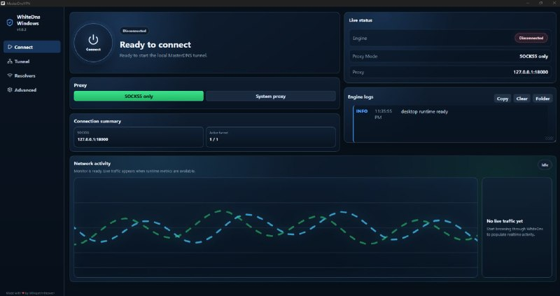

📷 Photo

## whitedns — post 647

🔠
🔠
🔠
🔠
🔠
🔠
🔠
🔠 .

## mirzapanel — post 1322

پنل نسخه رایگان بزودی. ...

## Spotify_Porteghali — post 12411

دارم آیپی هارو تست می‌کنم ، ببینم چیزی متصل میشه همون لحظه براتون میزارم .

اگر که دیروز‌ رو کلا نتونستید با " شیرو خورشید " متصل بشید بهتره که این کارارو انجام بدید .

## Spotify_Porteghali — post 12410

- کانفیگِ جدید برایِ SlipNet -
تست شده با 
🛜 همراه اول ( حتما با بقیه ی اینترنت ها چک کنید )

slipnet-enc://AflMGPdvydexGYAi27KZVCquDav9zklqXhtjqGgUJgRYm/JFw09vfVu4aSsKwRfK9SBHNN3/ZSf55JMmToHVIPZdutfM/+949d7N7ihmSOISCgNtd9naVFrRz8btWcNisJ+kk6etgwDboHFZlAqZ7REx1247xt5tH9c9GjE42zghnJJDW36/pIE1fqmY2HWq95Q7V3hlg6yEvxzd+q/JK5ydhgwdrD2Dd1C6UX/9hVaFUFhp5dAT3YCWW1TJgnknOagre47n62A0yJ9FtA/nja+zC/BeVxnoZuw24Cf1QF5IgqdDCZwe93DCUqP8HkVnJ4G1LMz3m1dgfyFmajqUUzltY6FihC9izpBQZrnOYBolQ4T0Ee9aSX3Pi+S8ZdXf7BMPhgBT6gsm1SWA2xjWDtu0YV3DXllrhwSNyCytKl3XlGnWtOvh+vE4hcetaBwaKfXDyOHzhDdf9LBhd72tQbEROMZudJWHGeGnM73l/1gjS89x4xWp7XWnIog3hSGJqkgFxZsqVGnk31p/NhjJHfio/R+w9aeZsgjal3IkPya9bbk92clKNOHdw0LE2d2CmSXUbgeN6wO7cIk2/sVVGV73DL7osZl/Wyv3ftHp1aVw3FcHsaCVUqQlDCw2iWh7k9TqqoQbAig4andxrOW/+14r22jiX/eu7Nbj72rEY2uBmAlklvFF87xzvaL36pXifIawUnZjbZFQHe1iY5l8M6nqVFlaWLHL2f66WrFqRQtQqMMpw6wvqb1AkI3eJM0HkvoNpdo1EAJMH9LN4QTq5W4cHYvvxMI=

💬 لینکِ دانلودِ مستقیمِ بدونِ فیلترِ اپلیکیشنِ SlipNet 
💬

💬 تنظیماتِ پیشنهادی برایِ SlipNet 
💬

⚪️حتما از تنظیمات VPN MTU رو رویِ 512 بگذارید و تنظیمات رو ذخیره کنید .

⚪️زمانی که کانفیگ رو ادد کردید قبل از اتصال رویِ علامتِ مداد کنارِ کانفیگ بزنید و DNS Query Size رو هم یکبار رویِ 50 بزارید و تست کنید و هم یکبار 60 بزارید و متصل بشید .

⚪️حتما از تنظیمات گزینه‌ ی Proxy-only Mode رو‌ فعال کنید . بعد از اینکه کانفیگ متصل شد ، به یکی از پروکسی هایِ زیر در تلگرام متصل شَوید .

🔗 : https://t.me/socks?server=127.0.0.1&port=10880

🔗 : https://t.me/socks?server=0.0.0.0&port=10880

🆔 @Spotify_Porteghali 🍊

↰  بزرگترین خانواده اسپاتیفای در کشور  ↱

## JynMarket — post 2291

  <a href="https://t.me/JynMarket/2291" target="_blank">📎 Download file</a>

ShirOKhorshid-2026.05.14.apk

## TirexNet — post 3879

دوستان چند روش که اتصال به شیر و خورشید بهتر میکنه 1-خاموش کردن data saver 2-عوض کردن apn به هر اسمی 3-خاموش روشن کردن مکرر سایفون و حالت هواپیما 4-تمام برنامه های حکومتی و دولتی ایرانی رو don't tunnel apps بزارید تو شیر و خورشید

## TirexNet — post 3878

دوستان چند روش که اتصال به شیر و خورشید بهتر میکنه
1-خاموش کردن data saver
2-عوض کردن apn به هر اسمی
3-خاموش روشن کردن مکرر سایفون و حالت هواپیما
4-تمام برنامه های حکومتی و دولتی ایرانی رو don't tunnel apps بزارید تو شیر و خورشید

## TirexNet — post 3877

mOhAmMaD_Th:

23.65.119.52
23.73.2.141
104.110.138.190
104.83.5.202
92.122.166.236
92.122.166.234
92.122.166.237
96.16.122.70
23.67.136.200
23.67.136.202

خواستم بگم الان این تعداد ایپی رو اسکن کردم سالم بودن

با ایرانسل زدم وصل شدم درجا خواستید بزارید چنل بقیه دوستان هم استفاده کنن

#ارسالی

Channel: T.me/TirexNet

## TirexNet — post 3876

سلام اینجوری تست کنید شیر و خورشید رو ( اینترنت روشن باشه بزارین رو حالت پرواز بازش کنین بزنین استارت بعد از حالت پرواز در بیارین ۳۰ ، ۴۰ ثانیه بعد وصل میشه ) ایرانسل
این آی پی ها سرعت عالی من وصلم

184.24.77.42 184.24.77.32 184.24.77.5 184.24.77.7 184.24.77.16 184.24.77.36 184.24.77.21 184.24.77.11 185.200.232.49 185.200.232.50 185.200.232.42 185.200.232.41 23.48.23.186 23.48.23.133 23.48.23.195 23.48.23.178 184.24.77.29 104.78.170.186 96.17.222.31 23.41.37.129 23.2.13.227 23.222.126.108 2.20.255.113 2.17.251.98 23.2.13.152 95.101.23.27 2.21.239.21 23.211.49.252 88.221.168.5 104.103.90.156 23.79.20.249 88.221.132.162 23.59.235.208 23.60.69.118 23.46.188.71 104.122.212.92 23.219.1.4 23.57.43.195 184.51.252.135 2.22.6.68 23.217.11.56 95.100.69.108 23.40.63.69 185.200.232.49 185.200.232.50 185.200.232.42 185.200.232.41 184.24.77.42 184.24.77.32 184.24.77.5 184.24.77.7 184.24.77.16 184.24.77.36 184.24.77.21 184.24.77.11 23.48.23.186 23.48.23.133 23.48.23.195 23.48.23.178 184.24.77.29 96.16.122.74 104.109.250.232 92.123.104.7 104.110.191.57 104.83.5.82 92.122.166.168 104.83.5.65 104.121.0.17 104.66.70.133 92.122.166.146 23.73.2.161 92.122.73.138 92.122.166.141 96.16.122.55 104.81.108.51 23.72.248.214 104.126.37.185 104.83.5.201 104.83.5.216 92.123.104.67 104.83.5.203 96.17.207.151 88.221.168.138 96.17.207.149 104.81.108.10 23.73.2.148 92.122.166.175 172.237.127.6 104.81.104.13 96.17.207.137 92.123.112.7 96.16.122.75 96.16.122.70 92.122.166.182 104.109.128.153 104.96.143.134 23.73.2.141 104.83.5.202 23.67.136.200 23.67.136.202 23.65.119.52 92.122.166.236 92.122.166.234 92.122.166.237 104.110.138.190 173.222.200.5 184.51.252.36 184.51.252.38 104.83.5.208 96.16.122.146 96.17.206.214 92.122.166.197 104.94.100.73 104.83.15.66 88.221.213.81 172.239.57.117 104.117.76.40 184.51.252.4 96.17.207.30 96.16.122.83 96.16.122.150 23.73.207.11 96.16.122.77 96.17.207.155 92.123.189.82 96.16.122.82 96.16.122.66 96.7.218.219 96.16.122.137 184.51.252.157 92.123.189.41 184.86.251.12 96.16.122.154 184.51.252.152 96.17.207.12 23.79.48.162 151.101.0.223 151.101.128.223 151.101.192.223 65.109.34.234 151.101.64.223 142.54.178.211 104.103.90.156 23.79.20.249 88.221.132.162 23.59.235.208 23.60.69.118 23.46.188.71 104.122.212.92 23.219.1.4 23.57.43.195 184.51.252.135 2.22.6.68 23.217.11.56 95.100.69.108 23.40.63.69 2.23.168.47 2.23.170.80 2.23.168.144 2.23.168.213 2.23.168.174 2.23.169.111 2.23.168.96 185.200.232.49 185.200.232.41 2.23.169.105 2.23.168.7 2.23.169.207 185.200.232.50 185.200.232.42
23.54.210.170
23.44.201.206
23.220.163.205
23.209.46.33
23.10.34.11
23.39.185.35
23.32.152.106
23.218.232.181
23.206.188.212
2.21.2.89
23.208.222.120
23.48.203.248
23.44.201.136
23.44.201.151
23.44.201.149
2.21.2.58
23.3.90.48
23.44.201.41
2.19.204.184
23.218.232.188
23.44.201.12
23.212.253.227
23.201.31.155
23.220.163.203
23.44.201.185
23.52.116.66
23.44.201.17
23.62.54.24
23.218.239.132
23.39.149.69
23.52.40.147
23.58.95.144
2.16.244.58
23.212.253.137
2.17.106.176
23.62.54.137
2.17.106.5
23.203.134.233
23.212.253.232
23.206.188.197
23.44.201.170
23.54.127.39
23.214.170.83
23.52.40.89
23.55.176.73
23.202.229.140
23.215.56.61
2.17.106.166
23.222.126.108
184.25.85.224
23.1.241.123
23.3.90.43

#ارسالی

Channel: T.me/TirexNet

## TirexNet — post 3874

Active Dns
Slipnet Irancell

2.188.21.100, 2.189.44.44, 2.188.21.120, 2.188.21.90, 2.188.21.240, 2.188.21.190, 2.188.21.200

Channel: T.me/TirexNet

## TirexNet — post 3873

متصل

151.101.64.223
151.101.0.223
151.101.128.223
151.101.192.223
92.122.123.128
2.16.186.20
2.16.186.31
2.16.186.44
2.16.186.58
2.16.186.69
2.16.186.81
2.19.204.19
2.19.204.87
2.19.204.137
2.19.204.144
2.19.204.145
2.19.204.170
2.19.204.184
2.19.204.185
2.19.204.202
2.19.204.210
2.19.204.211
2.19.204.217
2.19.204.218
2.19.204.225
2.19.204.232
2.19.204.234
2.19.204.240
2.19.204.249
2.19.204.250
2.19.204.251
2.19.205.8
2.19.205.9
2.19.205.11
2.19.205.27
2.19.205.33
2.19.205.34
2.19.205.40
2.19.205.41
2.19.205.42
2.19.205.49
2.19.205.50
2.19.205.58
2.19.205.59
2.19.205.64
2.19.205.65
2.19.205.82
2.19.205.83
2.19.205.88
2.19.205.97
2.19.205.98
2.19.205.105
2.22.151.4
2.22.151.9
2.22.151.12
2.22.151.13
2.22.151.15
2.22.151.17
2.22.151.20
2.22.151.22
2.22.151.23
2.22.151.32
2.22.151.36
2.22.151.37
2.22.151.39
2.22.151.47
2.22.151.51
2.22.151.53
2.22.151.54
2.22.151.58
2.22.151.60
2.22.151.62
2.22.151.135
2.22.151.138
2.22.151.139
2.22.151.141
2.22.151.142
2.22.151.143
2.22.151.144
2.22.151.146
2.22.151.149
2.22.151.150
2.22.151.151
2.22.151.152
2.22.151.153
2.22.151.154
2.22.151.155
2.22.151.156
2.22.151.157
2.22.151.158
2.22.151.159
2.22.151.161
2.22.151.162
2.22.151.163
2.22.151.164
2.22.151.168
2.22.151.169
2.22.151.170
2.22.151.171
2.22.151.173
2.22.151.175
2.22.151.179
2.22.151.181
2.22.151.182
2.22.151.183
2.22.151.184
2.22.151.185
2.22.151.186
2.22.151.188
2.22.151.189
2.22.151.190
2.22.151.191
2.22.151.193
2.22.151.194
2.22.151.195
23.32.5.18
23.32.5.44
23.32.5.71
23.32.5.96
23.32.5.118
23.32.5.141
23.32.5.167
23.32.5.193
23.32.5.214
23.32.5.236
23.53.35.146
23.53.35.158
23.53.35.171
23.53.35.182
23.53.35.194
23.53.35.207
23.67.253.11
23.67.253.24
23.67.253.55
23.67.253.77
23.67.253.101
23.67.253.120
23.195.81.72
23.195.81.84
23.195.81.96
23.195.81.108
50.7.5.83
63.141.252.203
65.109.34.234
92.122.123.128
94.130.13.19
94.130.33.41
94.130.50.12
94.130.70.160
95.216.69.37
96.16.97.82
96.16.97.104
96.16.97.126
96.16.97.148
96.16.97.169
96.16.97.191
104.124.148.191
104.124.148.203
138.201.54.122
142.54.178.211
144.76.1.88
184.26.163.12
184.26.163.24
184.26.163.38
184.26.163.51
184.26.163.66
184.26.163.79
184.31.169.195
184.31.169.252
184.31.170.97
184.31.170.185
184.50.87.22
184.50.87.44
184.50.87.66
184.50.87.88

Channel: T.me/TirexNet

## asrnovin_ir — post 10340

اومدن هرچیزی که آخرش hub داره رو بستن
مثل GitHub 🤦‍♂

## MatinSenPaii — post 3087

  

📥دانلود اپلیکیشن‌های اندروید از گوگل پلی با اینترنت داخلی

از طریق این پروژه، میتونید ربات تلگرامی‌ای رو ران کنید که به راحتی لینک گوگل پلی شما رو تبدیل به لینک داخلی میکنه:
https://github.com/ZethRise/PlayDL

این هم نمونه ربات پیاده‌سازی شده:
https://t.me/APKNitoBot

✉️ @MatinSenPaii

## MatinSenPaii — post 3086

  <a href="https://t.me/MatinSenPaii/3086" target="_blank">📎 Download file</a>

نسخه 1.0.3

یک آپدیت متمرکز بر پایداری است. در این نسخه پایداری اتصال بهتر شده، مپ شدن تنظیمات Advanced اصلاح شده، تفاوت بین SOCKS5 و System Proxy شفاف‌تر شده، و احتمال حالتی که برنامه Connected باشد ولی سایت‌ها باز نشوند کمتر شده است.

WhiteDns Windows v1.0.3
- راهنمای سریع تست

لطفا برای تست اول این تنظیمات را استفاده کنید:

1. برنامه را باز کنید.
2. وارد بخش Connect شوید.
3. گزینه Proxy Mode را روی System proxy بگذارید.
4. وارد بخش Advanced شوید.
5. گزینه Transport preset را روی Balanced بگذارید.
6. این موارد را بررسی کنید:
- Compression = off
- Base64-encode data = Off
- DNS listener enabled = Off
- SOCKS5 authentication = Off
- Packet duplication = 0
7. در صورت نیاز ذخیره کنید و سپس Connect بزنید.

اگر سایت ها ناپایدار بودند یا باز نشدند:
- فقط همین یک مورد را تغییر دهید:
- Transport preset = Stable Iran

لطفا این موارد را گزارش کنید:
- آیا اتصال با موفقیت انجام شد؟
- آیا یوتیوب و سایت های عادی باز شدند؟
- از چه Proxy Mode استفاده کردید؟
- سرعت مرور مناسب بود یا نه؟
- آیا برنامه یا سایتی بود که با وجود Connected بودن کار نکند؟
@whitedns

## MatinSenPaii — post 3085

اینها رو یکی از بچه‌های توییتر جمع‌آوری کرده و منم واسه‌ی شما می‌ذارم. آیپی برای شیر و خورشیده، بخش sni رو خالی بذارید. خیلیا تونسته بودن وصل بشن باهاشون: 2.16.27.71 2.16.244.11 2.17.147.89 2.17.251.98 2.18.190.26 2.18.190.27 2.19.10.30 2.19.196.105 2.20.255.113…

## MatinSenPaii — post 3084

اینها رو یکی از بچه‌های توییتر جمع‌آوری کرده و منم واسه‌ی شما می‌ذارم.
آیپی برای شیر و خورشیده،
بخش sni رو خالی بذارید.
خیلیا تونسته بودن وصل بشن باهاشون:
2.16.27.71
2.16.244.11
2.17.147.89
2.17.251.98
2.18.190.26
2.18.190.27
2.19.10.30
2.19.196.105
2.20.255.113
2.21.89.66
2.21.239.10
2.21.239.21
2.21.239.23
2.21.239.29
2.22.6.68
2.22.21.152
2.23.176.166
23.2.13.138
23.2.13.144
185.200.232.50
23.2.13.152
23.2.13.153
23.2.13.186
23.2.13.201
23.2.13.227
23.33.126.163
23.36.162.196
23.36.162.198
23.36.162.202
23.36.162.208
23.36.162.209
23.36.162.215
23.37.197.128
23.37.206.186
23.38.49.97
23.39.249.249
23.40.63.69
23.41.37.129
23.44.10.10
23.58.222.147
23.59.235.208
23.60.69.118
23.65.119.52
23.67.136.200
23.67.136.202
23.72.248.214
23.73.2.141
23.73.2.148
23.73.2.161
23.73.207.11
23.73.207.16
23.79.20.249
23.79.48.162
23.192.46.51
23.192.237.208
23.192.237.209
23.192.237.222
23.197.161.35
23.200.143.71
80.67.82.179
88.221.92.177
88.221.132.162
88.221.168.5
88.221.168.138
88.221.213.81
92.122.73.138
92.122.166.141
92.122.166.146
92.122.166.175
92.122.166.182
92.122.166.197
92.122.166.234
92.122.166.236
92.122.166.237
92.123.102.104
92.123.104.7
92.123.104.67
92.123.112.7
92.123.189.41
92.123.189.82
95.100.69.108
95.100.156.147
95.101.23.25
95.101.23.27
95.101.23.82
95.101.23.168
95.101.23.170
95.101.29.12
95.101.29.30
95.101.29.54
95.101.35.73
95.101.35.83
95.101.181.125
95.101.200.63
96.7.218.219
96.16.122.48
96.16.122.55
96.16.122.59
104.83.5.65
104.83.5.82
104.83.5.201
104.83.5.202
104.83.5.203
104.83.5.208
104.83.5.216
104.83.15.66
104.94.100.73
104.96.143.134
104.103.64.7
104.103.90.156
104.109.128.153
104.109.250.232
104.110.138.190
104.110.191.57
104.111.202.158
104.117.76.26
104.117.76.40
184.24.77.32
184.24.77.36
184.24.77.42
184.25.52.200
184.28.230.87
184.51.252.4
184.51.252.36
184.51.252.38
184.51.252.135
184.51.252.152
184.51.252.157
184.86.251.12
184.86.251.27
185.200.232.41
185.200.232.42
185.200.232.49

## MatinSenPaii — post 3083

نمیفهمم چرا هر متد جدیدی میاد و هر راه جدیدی باز میشه، یه لگد به گیتهابِ بدبخت می‌زنن
انگار فیلترچی می‌خواد ما رو تنبیه کنه😂 داره میگه دفعه‌ی بعدی گوگل رو هم فیلتر میکنما، حواستون باشه این سری عصبانیم کردین

## archivetell — post 5014

🚀 ربات PlayDL: دانلود مستقیم و بدون دردسر از گوگل‌پلی به تلگرام!

---

رفقا سلام! ✋
دانلود برنامه از گوگل‌پلی برای ما ایرانیا همیشه با مکافات همراهه؛ یا تحریمیم، یا فیلتره، یا فایل‌ها به صورت چند تیکه (Split APK) دانلود می‌شن و رو گوشی نصب نمی‌شن!

امروز سورس یه ربات تلگرامی پایتونی به‌شدت کاربردی به اسم PlayDL رو بهتون معرفی می‌کنیم که این مشکل رو ریشه‌ای حل کرده (کاملاً مناسب برای استفاده روی نت ملی و دور زدن تحریم‌ها).

✨ کارهای خفنی که این ربات انجام می‌ده:
🔸 ادغام خودکار فایل‌ها: لینک گوگل پلی رو بهش می‌دید؛ اگه اپلیکیشن چند تکه (Split) باشه، خودش همه رو دانلود می‌کنه، به کمک ابزارهای داخلی به هم می‌چسبوندشون و یه فایل .apk تر و تمیز و آماده‌ی نصب بهتون تحویل می‌ده.
🔸 دور زدن فیلترینگ: چون فایل رو روی سرورهای خودش دانلود و بعد تو تلگرام آپلود می‌کنه، می‌تونید فایل نهایی رو با سرعت بالا و بدون نیاز به فیلترشکن دانلود کنید.
🔸 هوشمند و خودکار: قابلیت نصب اتوماتیک پیش‌نیازها و پشتیبانی از دانلودرهای قدرتمندی مثل gplaydl و apkeep رو داره.

🤖 نمونه ربات فعال و آماده (برای کاربرای عادی):
اگر سرور شخصی ندارید که خودتون سورس رو ران کنید، یه ربات آماده و رایگان از همین پروژه بالا اومده که همین الان می‌تونید ازش استفاده کنید و برنامه‌هاتون رو بگیرید:
👉 @APKNitoBot

🛠 برای برنامه‌نویس‌ها و ادمین‌ها:
سورس این پروژه با Python 3.13 و Aiogram نوشته شده. برای ران کردنش روی سرور شخصی به MongoDB، جاوا 17 و البته Telegram Bot API Local Server نیاز دارید. دستورات نصب کامل داخل گیت‌هابش هست.

🔗 لینک سورس اصلی پروژه در گیت‌هاب:
https://github.com/ZethRise/PlayDL
(با تشکر از متین عزیز بابت معرفی این پروژه)

📌 #ربات #تلگرام #گوگل_پلی #نت_ملی #دانلودر #پایتون #PlayDL

🔵 @ArchiveTell | 𝔹𝕒𝕔𝕙𝕖𝕝𝕠𝕣⚡️

## archivetell — post 5007

  <a href="telegram/content/archivetell_5007_1778916891.mp4" target="_blank">🎬 Download video</a>

Gemini Intelligence For Android

شرکت گوگل در کنفرانس I/O 2026، ابزارهای هوش مصنوعی جدیدی را برای خودکارسازی وظایف در دستگاه‌های تلفن همراه معرفی نمود. این قابلیت‌ها شامل موارد زیر می‌باشند:

• خودکارسازی فرآیندهای چندمرحله‌ای (از جمله رزرو سفر و انتقال لیست‌ها از برنامه یادداشت‌برداری به سبد خرید فروشگاه‌ها)
• ارائه خلاصه‌ای از صفحات وب و تکمیل خودکار فرم‌ها در مرورگر کروم
• تبدیل گفتار به متن ساختاریافته در کیبورد Gboard (با استفاده از ابزار Rambler و پشتیبانی از چندین زبان)
• ایجاد ویجت‌های سفارشی دسکتاپ بر اساس ورودی متنی (قابلیت Create My Widget)

اولین دستگاه‌های سازگار با این فناوری، گوشی‌های سامسونگ گلکسی S26 و گوگل پیکسل 10 می‌باشند که در فصل تابستان عرضه خواهند شد. تا پایان سال جاری، این قابلیت‌ها به ساعت‌های هوشمند، رایانه‌های شخصی، هدست‌ها و سیستم‌های رسانه‌ای خودرو نیز گسترش خواهند یافت.

@ArchiveTell

## archivetell — post 5006

  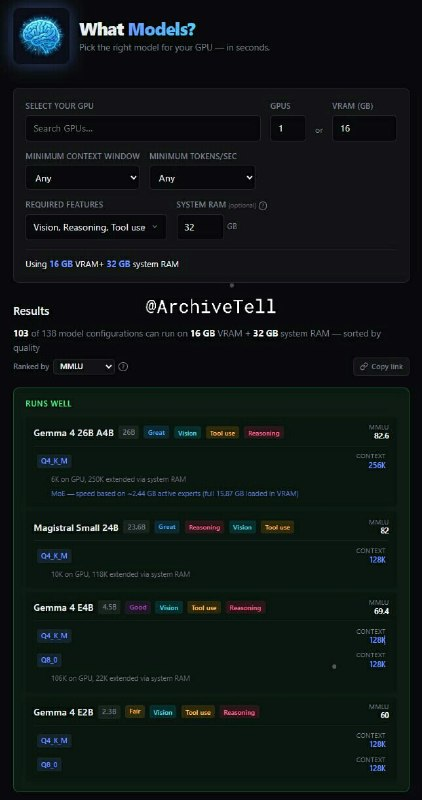

WhatModels

ماشین حساب آنلاین برای انتخاب مدل‌های هوش مصنوعی متناسب با سخت‌افزار شما

@ArchiveTell

## Break_The_Barriers — post 1597

پسورد جدید جهت اتصال به کانفیگ‌های کانال تاریخ: ٢۶ اردی‌بهشت‌ماه بر روی علامت مداد 🖋️ کانفیگ بزنید و در انتهای تنظیمات، در بخش Credentials، پسورد را وارد کنید. Password: R2oV7LqZxF1M9cWa @break_the_barriers

## Break_The_Barriers — post 1596

کانفیگ NULL + SSH سرور یک و دو رو با ریزالورها و تنظیمات زیر تست کنید. DNS Resolver: 2.188.21.130:53,2.188.21.200:53,2.188.21.90:53,2.188.21.190:53,2.188.21.100:53,2.188.21.120:53,2.188.21.240:53 SlipNet: MTU: 1500 MAX Channels: 64 Config: VayDNS NULL…

---
📅 بروزرسانی: 1405/02/26 03:38
---

## xsfilterrnet — post 3432

سری سوم

vless://Telegram-Parsashonam@104.198.14.52:443?mode=auto&path=%2Fp4r34m&security=tls&alpn=h2%2Chttp%2F1.1&encryption=none&extra=%7B%22xPaddingBytes%22%3A%2210-50%22%2C%22xPaddingObfsMode%22%3Atrue%2C%22xPaddingKey%22%3A%22Parsashonam%22%2C%22xPaddingHeader%22%3A%22Parsashonam%22%2C%22scMaxEachPostBytes%22%3A1000000%2C%22headers%22%3A%7B%22x-host%22%3A%22netlify.parsashonam.sbs%3A444%22%7D%7D&insecure=1&host=wallweb.hydradllvip.info&fp=chrome&type=xhttp&allowInsecure=1&sni=95.216.69.37#telegram%3A%20%40wallweb%20%E2%9D%A4%EF%B8%8F%F0%9F%8C%B9

vless://Telegram-Parsashonam@104.198.14.52:443?mode=auto&path=%2Fp4r34m&security=tls&alpn=h2%2Chttp%2F1.1&encryption=none&extra=%7B%22xPaddingBytes%22%3A%2210-50%22%2C%22xPaddingObfsMode%22%3Atrue%2C%22xPaddingKey%22%3A%22Parsashonam%22%2C%22xPaddingHeader%22%3A%22Parsashonam%22%2C%22scMaxEachPostBytes%22%3A1000000%2C%22headers%22%3A%7B%22x-host%22%3A%22netlify.parsashonam.sbs%3A444%22%7D%7D&insecure=1&host=wallweb.hydradllvip.info&fp=chrome&type=xhttp&allowInsecure=1&sni=94.130.13.19#telegram%3A%20%40wallweb%20%F0%9F%92%95%F0%9F%8C%B9

## xsfilterrnet — post 3431

سری دوم

vless://Telegram-Parsashonam@104.198.14.52:443?mode=auto&path=%2Fp4r34m&security=tls&alpn=h2%2Chttp%2F1.1&encryption=none&extra=%7B%22xPaddingBytes%22%3A%2210-50%22%2C%22xPaddingObfsMode%22%3Atrue%2C%22xPaddingKey%22%3A%22Parsashonam%22%2C%22xPaddingHeader%22%3A%22Parsashonam%22%2C%22scMaxEachPostBytes%22%3A1000000%2C%22headers%22%3A%7B%22x-host%22%3A%22netlify.parsashonam.sbs%3A444%22%7D%7D&insecure=1&host=wallweb.hydradllvip.info&fp=chrome&type=xhttp&allowInsecure=1&sni=50.7.5.83#telegram%3A%20%40wallweb%20%F0%9F%92%95

vless://%40IR_NETLIFY@104.198.14.52:443?mode=auto&path=%2FIR_NETLIFY&security=tls&alpn=h2%2Chttp%2F1.1&encryption=none&extra=%7B%22xPaddingBytes%22%3A%221-1%22%2C%22xPaddingObfsMode%22%3Atrue%2C%22scMaxEachPostBytes%22%3A%221000000%22%2C%22xPaddingKey%22%3A%22iran%22%2C%22xPaddingHeader%22%3A%22iran%22%2C%22headers%22%3A%7B%22x-host%22%3A%22http%3A%2F%2Fsub.abolup.online%3A444%22%7D%7D&insecure=1&host=wallweb.hydradllvip.info&fp=chrome&type=xhttp&allowInsecure=1&sni=94.130.50.12#telegram%3A%20%40wallweb%20%F0%9F%8C%9F

🔰Channel : @WallWeb

## xsfilterrnet — post 3430

کانفیگ ویتوری
دانلود نزنید همه استفاده کنند
بدید بچهایی که وصل نیستند❤️

vless://%40IR_NETLIFY@104.198.14.52:443?mode=auto&path=%2FIR_NETLIFY&security=tls&alpn=h2%2Chttp%2F1.1&encryption=none&extra=%7B%22xPaddingBytes%22%3A%221-1%22%2C%22xPaddingObfsMode%22%3Atrue%2C%22scMaxEachPostBytes%22%3A%221000000%22%2C%22xPaddingKey%22%3A%22iran%22%2C%22xPaddingHeader%22%3A%22iran%22%2C%22headers%22%3A%7B%22x-host%22%3A%22http%3A%2F%2Fsub.abolup.online%3A444%22%7D%7D&insecure=1&host=wallweb.hydradllvip.info&fp=chrome&type=xhttp&allowInsecure=1&sni=95.216.69.37#telegram%3A%20%40wallweb%20%F0%9F%9A%80%F0%9F%98%8D

vless://%40IR_NETLIFY@104.198.14.52:443?mode=auto&path=%2FIR_NETLIFY&security=tls&alpn=h2%2Chttp%2F1.1&encryption=none&extra=%7B%22xPaddingBytes%22%3A%221-1%22%2C%22xPaddingObfsMode%22%3Atrue%2C%22scMaxEachPostBytes%22%3A%221000000%22%2C%22xPaddingKey%22%3A%22iran%22%2C%22xPaddingHeader%22%3A%22iran%22%2C%22headers%22%3A%7B%22x-host%22%3A%22http%3A%2F%2Fsub.abolup.online%3A444%22%7D%7D&insecure=1&host=wallweb.hydradllvip.info&fp=chrome&type=xhttp&allowInsecure=1&sni=142.54.178.211#telegram%3A%20%40wallweb%20%F0%9F%9A%80

🔰Channel : @WallWeb

## xsfilterrnet — post 3428

  <a href="telegram/content/xsfilterrnet_3428_1778890082.mp4" target="_blank">🎬 Download video</a>

👑 آموزش vpn شیر و خورشید همراه با یه سری بهینه سازی ها این ویدیو بیشتر برای تغییر ip کانفیگ های(پولی،سرورلس و..) به درد میخوره برای تغییر لوکیشن و برای دسترسی بیشتر به ابزار ها و رفع محدودیت هایی مثل:
Chatgpt
Gemini
و بسیاری از سایت ها...

Ip:
127.0.0.1

Port:
10808

بهترین لوکیشن ها:

🇳🇱 هلند

🇩🇪 آلمان

🇫🇮 فنلاند

🇺🇸 آمریکا

🍎(در رابطه با ios با v2box و سایفون میتونید اکی کنید)

@xsfilterrnet 
👑

## saministamm — post 62938

95.38.201.199
5.144.129.174
37.191.76.110
81.12.72.218
80.191.243.226
79.175.169.59
5.160.13.85
185.137.25.214
81.91.145.2
92.246.144.179
193.148.67.117
217.219.39.77

لیست جدید DNS برای شیر و خورشید
@saministamm
✉️

## saministamm — post 62937

شیر و خورشید متصل تست شده :

184.30.157.239
95.101.35.66
23.207.210.74
23.207.210.84
23.207.210.79
23.207.210.69
23.207.210.77
2.22.210.51
2.22.144.34
23.14.136.174
23.215.2.5
23.55.110.48
2.23.167.185
23.47.124.86
2.17.211.193
2.23.168.47

@saministamm
✉️

## Skyportall — post 10740

  <a href="telegram/content/Skyportall_10740_1778890084.webm" target="_blank">🎬 Download video</a>

شب همتون بخیر 
♥️

## Skyportall — post 10739

بعضیا دایرکت گفتن به این شکل وصلن. Proxy http + edge ip + beast mode یعنی بیست مود روشن ایپی هم که میزاری براش + یه هاست و پورت مناسب. @Skyportall

## Skyportall — post 10738

سیم کارت شاتل خیلی خوب وصل میشه گفتم بگم ک بچه ها اگر دارن استفاده کنن

## Skyportall — post 10737

  <a href="telegram/content/Skyportall_10737_1778890084.webm" target="_blank">🎬 Download video</a>

خیلی تشکر مرسی عالی وصل

## Skyportall — post 10736

خیلی تشکر مرسی عالی وصل

## Skyportall — post 10735

ایرانسل وصللل،مرسیییی

## Skyportall — post 10734

همون روش اول که گذاشتمو میفرمایند.

## Skyportall — post 10733

حتی بهتره بگم که سرعت خیلی اوکیه
دمت گرمه

## Skyportall — post 10732

  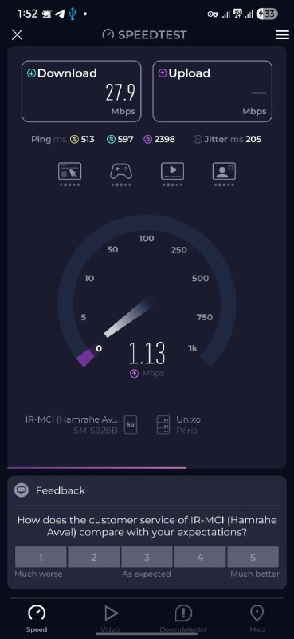

📷 Photo

## Skyportall — post 10731

بعضیا دایرکت گفتن به این شکل وصلن.
Proxy http + edge ip + beast mode

یعنی بیست مود روشن
ایپی هم که میزاری براش
+ یه هاست و پورت مناسب.

@Skyportall

## Skyportall — post 10730

  <a href="telegram/content/Skyportall_10730_1778890085.webm" target="_blank">🎬 Download video</a>

بنازمممم وصل شد رو همراه اول رایتل برام کار نداد ولی همراه اول ثانیه ای زد دمت گرم❤️

## Skyportall — post 10729

بنازمممم وصل شد رو همراه اول
رایتل برام کار نداد ولی همراه اول ثانیه ای زد دمت گرم❤️

## Skyportall — post 10728

ممنون.
😊 نظرات مختلفه طبیعیه.
دیگه مثل روز اول نیست شرایط خیلی محدودیت بیشتر شده متاسفانه

## Skyportall — post 10727

ناموسن بت ایمان آوردم😂😂😂 عجیبه ولی منم خاموشش کردم این لیسته وصل شد واسم رایتلم
از صب آیپی میزدم نمیاورد
کاش زود قطع نشه داداش

## Skyportall — post 10726

وصل نشد:)

## Skyportall — post 10725

  <a href="telegram/content/Skyportall_10725_1778890085.webm" target="_blank">🎬 Download video</a>

23.65.119.52 96.16.122.70 92.122.166.236 92.122.166.234 92.122.166.237 104.110.138.190 173.222.200.5 184.51.252.36 184.51.252.38 104.83.5.208 23.73.2.141 104.83.5.202 23.67.136.200 23.67.136.202 96.16.122.146 96.17.206.214 92.122.166.197 104.94.100.73 104.83.15.66…

## Skyportall — post 10724

  <a href="telegram/content/Skyportall_10724_1778890085.webm" target="_blank">🎬 Download video</a>

23.65.119.52
96.16.122.70
92.122.166.236
92.122.166.234
92.122.166.237
104.110.138.190
173.222.200.5
184.51.252.36
184.51.252.38
104.83.5.208
23.73.2.141
104.83.5.202
23.67.136.200
23.67.136.202
96.16.122.146
96.17.206.214
92.122.166.197
104.94.100.73
104.83.15.66
88.221.213.81
172.239.57.117
104.117.76.40
184.51.252.4
96.17.207.30
96.16.122.83
96.16.122.150
23.73.207.11
96.16.122.77
96.17.207.155
92.123.189.82
96.17.207.12
23.79.48.162
96.16.122.82
96.16.122.66
96.7.218.219
96.16.122.137
184.51.252.157
92.123.189.41
184.86.251.12
96.16.122.154
96.16.122.157
184.51.252.152
184.24.77.42
184.24.77.32
184.24.77.5
184.24.77.7
184.24.77.16
184.24.77.36
184.24.77.21
184.24.77.11
185.200.232.49
185.200.232.50
185.200.232.42
185.200.232.41
23.48.23.186
23.48.23.133
23.48.23.195
23.48.23.178
184.24.77.29
2.22.250.149
23.58.193.140
23.48.23.151
2.19.126.81
23.202.138.125
23.43.237.239
104.112.146.82
23.2.13.136
72.246.28.37
2.18.63.49
2.16.53.11
2.16.53.50
2.16.19.136
104.78.170.186
96.17.222.31
23.41.37.129
23.2.13.227
23.222.126.108
2.20.255.113
2.17.251.98
23.2.13.152
95.101.23.27
2.21.239.21
23.211.49.252
88.221.168.5
104.103.90.156
23.79.20.249
88.221.132.162
23.59.235.208
23.60.69.118
23.46.188.71
104.122.212.92
23.219.1.4
23.57.43.195
184.51.252.135
2.22.6.68
23.217.11.56
95.100.69.108
23.40.63.69
185.200.232.49
185.200.232.50
185.200.232.42
185.200.232.41
184.24.77.42
184.24.77.32
184.24.77.5
184.24.77.7
184.24.77.16
184.24.77.36
184.24.77.21
184.24.77.11
23.48.23.186
23.48.23.133
23.48.23.195
23.48.23.178
184.24.77.29
96.16.122.74
104.109.250.232
92.123.104.7
104.110.191.57
104.83.5.82
92.122.166.168
104.83.5.65
104.121.0.17
104.66.70.133
92.122.166.146
23.73.2.161
92.122.73.138
92.122.166.141
96.16.122.55
104.81.108.51
23.72.248.214
104.126.37.185
104.83.5.201
104.83.5.216
92.123.104.67
104.83.5.203
96.17.207.151
88.221.168.138
96.17.207.149
104.81.108.10
23.73.2.148
92.122.166.175
172.237.127.6
104.81.104.13
96.17.207.137
92.123.112.7
96.16.122.75
96.16.122.70
92.122.166.182
104.109.128.153
104.96.143.134
23.73.2.141
104.83.5.202
23.67.136.200
23.67.136.202
23.65.119.52
92.122.166.236
92.122.166.234
92.122.166.237
104.110.138.190
173.222.200.5
184.51.252.36
184.51.252.38
104.83.5.208
96.16.122.146
96.17.206.214
92.122.166.197
104.94.100.73
104.83.15.66
88.221.213.81
172.239.57.117
104.117.76.40
184.51.252.4
96.17.207.30
96.16.122.83
96.16.122.150
23.73.207.11
96.16.122.77
96.17.207.155
92.123.189.82
96.16.122.82
96.16.122.66
96.7.218.219
96.16.122.137
184.51.252.157
92.123.189.41
184.86.251.12
96.16.122.154
184.51.252.152
96.17.207.12
23.79.48.162
151.101.0.223
151.101.128.223
151.101.192.223
65.109.34.234
151.101.64.223
142.54.178.211
104.103.90.156
23.79.20.249
88.221.132.162
23.59.235.208
23.60.69.118
23.46.188.71
104.122.212.92
23.219.1.4
23.57.43.195
184.51.252.135
2.22.6.68
23.217.11.56
95.100.69.108
23.40.63.69
185.200.232.49
185.200.232.64
23.2.13.227
185.200.232.49
92.123.104.7
92.123.104.67
88.221.168.138
104.81.108.10
184.51.252.38
184.51.252.4
104.117.76.40
65.109.34.234
142.54.178.211
185.200.232.49
92.123.104.7
185.200.232.64
88.221.168.138
184.51.252.38
92.123.104.67
104.81.108.10
184.51.252.4
65.109.34.234
104.117.76.40

⚠️ نکته ای که باید رعایت کنید اینه حالت Beast مود حتما خاموش شه.

⚠️ حالت هواپیما بذارید دربیارید.

سرعت: فعلا روی ایرانسل خوب
✅

⚡️ @Skyportall

## Skyportall — post 10723

بالاخره بعد چند ساعت تست یه لیست آی‌پی تمیز میفرستم الان وصلم باهاش

## Skyportall — post 10722

  <a href="telegram/content/Skyportall_10722_1778890086.webm" target="_blank">🎬 Download video</a>

vless://f6366748-0cec-4079-88c8-3b3f697409af@snapp.ir:2052?path=%2F&security=none&encryption=none&host=morgh.cpiu.ir&type=ws#%40Skyportall

متصل- حجم محدود ( میشه ترکیب زد)
😞

## whitedns — post 646

🔶 خبرهای خوب:

۱. عبدالکریم، دوست بلوچ ما، تونست اپلیکیشن WhiteDNS را با کار تیمی دوستان راه بندازه
و وصل بشه 🎉
🗣 صدای خودشون، ۱۴۰۵.۰۲.۲۶، ۰۱:۵۲ ایران

۲. من داستان عبدالکریم روشندل را به Pedi جان در @WhiteDNS منتقل کردم، و دو درخواست مطرح کردم:

الف. داشتن رابط کاربری (user interface) پارسی در اپلیکیشن WhiteDNS.

ب. افزودن راهنمای پارسی به گیت‌هاب پروژه برای استفاده روشندلان با کمک ScreenReader.
ایشون از ایده‌ها استقبال کرد، ولی به زمان نیاز دارند.

⚪️ هدف دلی ما اینه که کاربرها خودکفا و مستقل باشند.

🫂 #همدلی #ایران

💛 @WhiteDNS
🆔 @SOSIranConnect

## whitedns — post 645

🔠
🔠
🔠
🔠
🔠
🔠
🔠
🔠

## JynMarket — post 2289

https://t.me/MhsenivxFamilygp

بیاید گپمون کلی ادم انلاینن حرف بزنیم

## TirexNet — post 3872

آقا حلالت این کانفیگ اسلیپنت عجب سرعتی داره.

## TirexNet — post 3871

آقا حلالت این کانفیگ اسلیپنت عجب سرعتی داره.

## TirexNet — post 3870

متصله ، رایتل ، سریع لاگین شد برام

185.200.232.43  
185.200.232.40
167.82.48.223
151.101.128.223
185.200.232.49
185.200.232.50
185.200.232.42
185.200.232.41
184.24.77.42
184.24.77.32
184.24.77.5
184.24.77.7
184.24.77.16
184.24.77.36
184.24.77.21
184.24.77.11
23.48.23.186
23.48.23.133
23.48.23.195
23.48.23.178
184.24.77.29

## TirexNet — post 3869

23.15.2.16
23.41.187.81
2.21.173.66
23.34.124.87
23.2.13.138
23.41.37.35
23.41.187.4
2.21.173.147
23.36.15.40
23.1.241.121
23.3.68.8
23.13.181.57
2.22.251.41
2.22.145.86
2.22.144.39
2.22.114.156
23.2.13.193
2.21.240.21
23.2.13.185
2.22.112.63
23.1.228.190
23.3.68.72
23.36.20.220
23.2.191.21
2.22.255.53
2.22.112.208
23.13.172.218
2.21.240.102
2.23.97.112
23.32.238.209
23.41.187.10
23.35.112.224
2.22.255.42
2.23.227.214
23.35.104.27
2.22.251.9
23.3.68.152
2.21.173.26
23.14.132.202
2.23.89.205
23.35.104.9
2.21.173.57
23.35.208.5
23.36.137.50
2.22.5.215
2.22.89.140
23.32.29.97
2.21.240.73
2.22.113.123
2.22.31.96
2.22.145.29
23.15.111.112
23.34.126.70
23.40.229.58
2.23.210.15
23.1.228.182
23.35.134.38
2.21.173.64
2.22.255.60
23.40.10.24
23.32.29.89
2.22.255.167
2.22.145.20
23.34.194.172
23.39.148.245
23.14.137.56
2.23.246.164
23.35.100.176
2.22.144.25
23.35.104.193
2.23.176.169
2.21.173.42
2.23.154.33
23.40.102.212
23.1.228.148
2.23.167.226
23.2.13.147
23.35.29.178
23.41.38.102
2.21.240.107
2.23.168.250
23.2.77.119
2.22.89.18
23.40.10.25
2.22.145.70
23.1.228.150
2.21.217.101
2.23.227.213
23.35.148.187
2.21.173.115
2.21.134.81
2.21.240.130
23.39.223.147
2.23.49.97
23.2.16.35
2.23.167.144
23.40.179.10
23.12.157.101
23.39.184.199
2.21.173.25
23.34.126.20
2.23.97.152
23.1.241.90
2.22.255.34
23.1.241.91
2.23.41.22
2.22.151.151
2.22.255.24
23.2.185.71
2.21.134.77
23.2.13.155
23.36.208.48
2.22.31.90
2.22.31.97
2.23.167.138
2.22.144.27
23.35.148.156
23.15.141.238
2.22.144.26
2.22.31.104
2.22.255.32
23.36.162.73
23.1.228.179
23.13.155.131
23.2.13.137
23.34.125.115
23.35.104.58
2.22.255.57
23.41.37.243
23.36.15.32
23.35.30.25
23.15.241.218
2.21.243.220
23.35.148.149
2.23.90.148
23.12.156.115
2.21.240.19
2.21.240.100
2.22.251.62
23.3.89.97
23.32.238.177
185.200.232.8
185.200.232.9
185.200.232.11
185.200.232.16
185.200.232.17
185.200.232.19
185.200.232.24
185.200.232.25
185.200.232.26
185.200.232.34
185.200.232.56
185.200.232.57
185.200.232.58
185.200.232.64
185.200.232.65
185.200.232.66
185.200.232.67
23.39.185.35
23.32.152.106
23.218.232.181
23.206.188.212
2.21.2.89
23.208.222.120
23.48.203.248
23.44.201.136
84.26.13.91
23.54.210.170
23.44.201.206
23.220.163.205
23.209.46.33
23.10.34.11
23.44.201.151
23.44.201.149
2.21.2.58
23.3.90.48
23.44.201.41
2.19.204.184
23.218.232.188
23.44.201.12
23.212.253.227
23.201.31.155
23.220.163.203
23.62.54.24
23.218.239.132
23.52.40.147
23.58.95.144
2.16.244.58
23.212.253.137
2.17.106.176
23.62.54.137
2.17.106.5
23.203.134.233
23.212.253.232
23.206.188.197
23.44.201.170
23.54.127.39
23.214.170.83
23.52.40.89
23.55.176.73
23.202.229.140
23.215.56.61
2.17.106.166
184.25.85.224

آیپی شیر و خورشید
#ارسالی‌مردم
@TirexNet

## TirexNet — post 3868

داداش درود
من نت سامانتل دارم
با یکی از اینا وصلم⬇️⬇️⬇️⬇️
اما نمیدونم کدومشه

## TirexNet — post 3867

2.188.21.200, 2.188.21.90, 2.188.21.120, 2.188.21.100, 2.188.21.190
ایرانسل
Dns Resolver slipnet
Query length 76 تست شده

## TirexNet — post 3866

درود داداش من همراه وصل Null اسکن کردم 2.188.21.190:53,2.188.21.100:53,2.188.21.90:53 این ۳ تا اوکی شد و وصل شد واسم

## TirexNet — post 3865

درود داداش من همراه وصل
Null اسکن کردم

2.188.21.190:53,2.188.21.100:53,2.188.21.90:53

این ۳ تا اوکی شد و وصل شد واسم

## TirexNet — post 3864

184.24.77.42 184.24.77.32 184.24.77.5 184.24.77.7 184.24.77.16 184.24.77.36 184.24.77.21 184.24.77.11 23.48.23.186 23.48.23.133 23.48.23.195 23.48.23.178 184.24.77.29 185.200.232.49 185.200.232.50 185.200.232.42 185.200.232.41 185.200.232.43 185.200.232.40

## TirexNet — post 3863

184.24.77.42
184.24.77.32
184.24.77.5
184.24.77.7
184.24.77.16
184.24.77.36
184.24.77.21
184.24.77.11
23.48.23.186
23.48.23.133
23.48.23.195
23.48.23.178
184.24.77.29
185.200.232.49
185.200.232.50
185.200.232.42
185.200.232.41
185.200.232.43
185.200.232.40

## TirexNet — post 3862

2.22.250.149,23.58.193.140,23.48.23.151,2.19.126.81,23.202.138.125,23.43.237.239,104.112.146.82,23.2.13.136,72.246.28.37,2.18.63.49,2.16.53.11,2.16.53.50,2.16.19.136,184.24.77.42,184.24.77.32,184.24.77.5,184.24.77.7,184.24.77.16,184.24.77.36,184.24.77.21,184.24.77.11,185.200.232.49,185.200.232.50,185.200.232.42,185.200.232.41,23.48.23.186,23.48.23.133,23.48.23.195,23.48.23.178,184.24.77.29,185.200.232.8,185.200.232.43,185.200.232.40,185.143.232.122,185.200.232.9,185.200.232.11,185.200.232.16,185.200.232.17,185.200.232.19,185.200.232.24,185.200.232.25,185.200.232.26,185.200.232.34
آیپی شیر و خورشید
@TirexNet

## TirexNet — post 3861

آموزش اسکن دی ان اس ریزالور |scan dns Resolver پیش نیاز : 1-از کانفیگ اسلیپ نتی که بهش وصل هستید یک کپی بگیرید { 1-1سه نقطه روی هم 1-2 گزینه دومی Export 1-3 گزینه سمت چپ copy} 2-کانفیگ اسلیپ نتی که بهش وصل هستید ادیت کنید (خودکار روی کانفیگ رو بزنید )…

## TirexNet — post 3860

آموزش اسکن دی ان اس ریزالور |scan dns Resolver

پیش نیاز :

1-از کانفیگ اسلیپ نتی که بهش وصل هستید یک کپی بگیرید {
1-1سه نقطه روی هم
1-2 گزینه دومی Export
1-3 گزینه سمت چپ copy}
2-کانفیگ اسلیپ نتی که بهش وصل هستید ادیت کنید (خودکار روی کانفیگ رو بزنید ) و قسمت DNS Resolver رو کپی کنید و ی جا ذخیره کنید .
4-کانفیگ قبل شروع آموزش خاموش باشه

آموزش :
1-کانفیگ کپی شده را وارد کنید
2-دکمه ادیت کانفیگ را بزنید
3-قسمت scan for working Resolver بزنید
4-بالا گزینه simple را به advanced تغییر بدید
4- قسمت configuration گزینه هارو به این مقادیر بچینید {
Port 53
Timeout 3000
Worker 50
Transport :udp
Shuffle ip :روشن
Test nearby ips(/24 subnet):خاموش
E2e time out 15000
E2e concurrency 10
{
5-قسمت Resolver List را به این مقادیر تغییر بدید {
رو بخش custom بزنید
داخل اون قسمت که میتونید تایپ کنید این رو قرار بدید

2.188.21.240:53,2.188.21.120:53,2.188.21.130:53,2.188.21.190:53,2.188.21.90:53,2.188.21.200:53,2.189.44.44:53,10.185.68.113:53
2.188.21.240:53,2.188.21.120:53,2.188.21.130:53,2.188.21.190:53,2.188.21.90:53,2.188.21.200:53,2.189.44.44:53,10.185.68.113:53
2.189.44.44:53,10.185.68.113:53,10.185.68.114:53,10.185.68.113:53,2.189.44.44:53,2.188.21.200:53
10.185.68.113:53,94.184.10.135:53,94.184.10.133:53,85.185.1.10:53,80.210.44.184:53,2.187.33.174:53,84.241.44.106:53,185.136.180.221:53
2.188.21.0/24
2.189.44.0/24
84.2.41.0/24

6-گزینه load ip را بزنید
7- گزینه start scan را بزنید
(بمونید اسکن تموم شه اون خط اول )
8- بعد تموم شدن اسکن اول گزینه test tunnel را انتخاب کنید
گزینه های سمت چپ پایین رو به
e2e |+1|probes
تغییر بدید
(بمونید اسکن دوم تموم شه )
9-بالا گزینه کپی رو انتخاب کنید (دو صفحه روی هم)
10- گزینه e2e passed را بزنید و حاصل رو ی جا ذخیره کنید .
11-دوباره برگردید به صفحه و ۸ dns از بالا به پایین که پینگ سبز کمتری دارن انتخاب کنید
12- بالا سمت راست apply بزنید
13- گزینه ✅️ را بزنید و کانفیگ رو تست کنید
نکته :

1-این کار را روی کانفیگ فعال انجام بدید
2-اگه وصل نشدید یا سخت وصل شدید
کانفیگ رو ادیت بزنید و query length را روی سایز های مختلف (76,93,101,131,140,253 ) تست کنید

@TirexNet

## TirexNet — post 3859

سرور اول ( اسلیپ نت ) 🎃 همه اپراتور ها ( Vaydns+Ssh+Socks ) NULL سرور دوم ( اسلیپ نت ) 🐍 ترجیحا همراه اول (Vaydns+Ssh ) NULL | CNAME | SRV | CAA | NS | NULL ترجیحا همراه اول ( Vaydns+Socks ) NULL | NULL آموزش کامل | تنظیمات جدید | تنظیمات جدید …

## asrnovin_ir — post 10339

یه سری با اکانت از کشور های مختلف پیام میدن خلیج البصره 😂 نمی‌دونم چرا برا من این پیام ها میاد ولی:
من از همینجا اعلام میکنم خلیج همیشه فارسه ❤️

## TheVPNMethod — post 725

یه چیزی امروز متوجه شدم، از امروز صبح وقتی با دیتای موبایل آیپی اسکن می‌کنید یا حتی وقتی آیپی‌های زیادی وارد شیر و خورشید می‌کنید و شیر و خورشید اسکن میکنه و دنبال اتصال می‌گرده اپراتور شبکه می‌فهمه و آیپی شمارو بلاک می‌کنه! وقتی این اتفاق بیوفته بعدش شما…

## TheVPNMethod — post 724

حاجی من ۱ ساعت پیش هر آیپی تو چنلا میزدم وصل میشد ولی الان هرکاری میکنم نمیشه
چیکار بکنم؟

## DigiGozar — post 9230

بات روشن میمونه فعلا
برای اپدیت اف میکنیم که خبر میدیم
❤️
( آپدیت فردا اعمال میشه )

## MatinSenPaii — post 3082

طرف بله و روبیکا نصب کرده بعد میاد توییت میزنه که اپ شیر و خورشید(که اوپن سورسه همه کدهاش وسط گیت‌هابه) بو داره نصب نکنید امنیتش پایینه🫩
امنیت؟
با من شوخی میکنی؟

## MatinSenPaii — post 3080

  <a href="telegram/content/MatinSenPaii_3080_1778890086.mp4" target="_blank">🎬 Download video</a>

اینا چیه درست کردین😂😂

## MatinSenPaii — post 3079

خبر خوب:
نسخه‌ی اولیه‌ی WhiteDNS برای IOS منتشر شد:
https://testflight.apple.com/join/GfUqXrFz

## MatinSenPaii — post 3078

این آیپی‌ها رو موفق شدم از سرتاسر توییتر جمع‌آوری کنم برای شیر و خورشید، این بخش‌اش: https://t.me/MatinSenPaii/3070 کافیه که با کاما(,) پشت هم وارد کنین: 2.22.250.149 23.58.193.140 23.48.23.151 2.19.126.81 23.202.138.125 23.43.237.239 104.112.146.82 23.2.13.136…

## archivetell — post 5005

لینک داخلی شیر و خورشید ، دو تا آپلودسنتر

دانلود

دانلود

@ArchiveTell

## archivetell — post 5004

سامانتل راحت وصله..

## archivetell — post 5003

سامانتل این کد رو داخل ترموکس بزنید هر چی پیدا کرد کپی کنید داخل شیر و خورشید 100% وصله: for i in $(seq 1 254); do ping -c 1 -W 1 185.200.232.$i >/dev/null && echo "185.200.232.$i" done

## archivetell — post 5000

ArchiveTel pinned «سامانتل این کد رو داخل ترموکس بزنید هر چی پیدا کرد کپی کنید داخل شیر و خورشید 100% وصله: for i in $(seq 1 254); do ping -c 1 -W 1 185.200.232.$i >/dev/null && echo "185.200.232.$i" done»

## archivetell — post 4999

همراه اول شیر و خورشید

184.24.77.42 184.24.77.32 184.24.77.5 184.24.77.7 184.24.77.16 184.24.77.36 184.24.77.21 184.24.77.11 185.200.232.49 185.200.232.50 185.200.232.42 185.200.232.41 23.48.23.186 23.48.23.133 23.48.23.195 23.48.23.178 184.24.77.29 104.78.170.186 96.17.222.31 23.41.37.129 23.2.13.227 23.222.126.108 2.20.255.113 2.17.251.98 23.2.13.152 95.101.23.27 2.21.239.21 23.211.49.252 88.221.168.5 104.103.90.156 23.79.20.249 88.221.132.162 23.59.235.208 23.60.69.118 23.46.188.71 104.122.212.92 23.219.1.4 23.57.43.195 184.51.252.135 2.22.6.68 23.217.11.56 95.100.69.108 23.40.63.69 185.200.232.49 185.200.232.50 185.200.232.42 185.200.232.41 184.24.77.42 184.24.77.32 184.24.77.5 184.24.77.7 184.24.77.16 184.24.77.36 184.24.77.21 184.24.77.11 23.48.23.186 23.48.23.133 23.48.23.195 23.48.23.178 184.24.77.29 96.16.122.74 104.109.250.232 92.123.104.7 104.110.191.57 104.83.5.82 92.122.166.168 104.83.5.65 104.121.0.17 104.66.70.133 92.122.166.146 23.73.2.161 92.122.73.138 92.122.166.141 96.16.122.55 104.81.108.51 23.72.248.214 104.126.37.185 104.83.5.201 104.83.5.216 92.123.104.67 104.83.5.203 96.17.207.151 88.221.168.138 96.17.207.149 104.81.108.10 23.73.2.148 92.122.166.175 172.237.127.6 104.81.104.13 96.17.207.137 92.123.112.7 96.16.122.75 96.16.122.70 92.122.166.182 104.109.128.153 104.96.143.134 23.73.2.141 104.83.5.202 23.67.136.200 23.67.136.202 23.65.119.52 92.122.166.236 92.122.166.234 92.122.166.237 104.110.138.190 173.222.200.5 184.51.252.36 184.51.252.38 104.83.5.208 96.16.122.146 96.17.206.214 92.122.166.197 104.94.100.73 104.83.15.66 88.221.213.81 172.239.57.117 104.117.76.40 184.51.252.4 96.17.207.30 96.16.122.83 96.16.122.150 23.73.207.11 96.16.122.77 96.17.207.155 92.123.189.82 96.16.122.82 96.16.122.66 96.7.218.219 96.16.122.137 184.51.252.157 92.123.189.41 184.86.251.12 96.16.122.154 184.51.252.152 96.17.207.12 23.79.48.162 151.101.0.223 151.101.128.223 151.101.192.223 65.109.34.234 151.101.64.223 142.54.178.211 104.103.90.156 23.79.20.249 88.221.132.162 23.59.235.208 23.60.69.118 23.46.188.71 104.122.212.92 23.219.1.4 23.57.43.195 184.51.252.135 2.22.6.68 23.217.11.56 95.100.69.108 23.40.63.69 2.23.168.47 2.23.170.80 2.23.168.144 2.23.168.213 2.23.168.174 2.23.169.111 2.23.168.96 185.200.232.49 185.200.232.41 2.23.169.105 2.23.168.7 2.23.169.207 185.200.232.50 185.200.232.42



## archivetell — post 4998

سامانتل
این کد رو داخل ترموکس بزنید هر چی پیدا کرد کپی کنید داخل شیر و خورشید 100% وصله:

for i in $(seq 1 254); do
ping -c 1 -W 1 185.200.232.$i >/dev/null && echo "185.200.232.$i"
done

## archivetell — post 4997

for i in $(seq 1 254); do
    ping -c 1 -W 1 x.x.x.$i >/dev/null && echo "x.x.x.$i"
done

بزنید ترموکس رنج بدین ببینید چی میده ایرانسل (جای x ایپی بذارید)

رنج پست های قبل گذاشتم

## hamvex — post 2581

🌐آموزش کامل دور زدن فیلترینگ با متود CDN-Fronting (فول تانل)(اندروید) اتصال بدون نیاز به v2rayNG و نصب سرتیفیکیت 
🎬 https://youtube.com/shorts/ryOBAnGGyyU?si=Sd6k2NKBH149fxSK 
🐱 https://github.com/shirokhorshid/shirokhorshid-android 
⬇️
🔄 https://uplod.…

## Break_The_Barriers — post 1595

کانفیگ NULL + SSH سرور یک و دو رو با ریزالورها و تنظیمات زیر تست کنید.

DNS Resolver:

2.188.21.130:53,2.188.21.200:53,2.188.21.90:53,2.188.21.190:53,2.188.21.100:53,2.188.21.120:53,2.188.21.240:53

SlipNet:

MTU: 1500
MAX Channels: 64

Config:

VayDNS NULL + SSH

Resolver Mode: Reliable
Query Lenght: 151

@break_the_barriers

---
📅 بروزرسانی: 1405/02/26 00:17
---

## xsfilterrnet — post 3427

  <a href="telegram/content/xsfilterrnet_3427_1778878062.webm" target="_blank">🎬 Download video</a>

خوشحال میشم #گروه چنل رو داشته باشید رفقا
🥳
اگر سوالی یا در مورد روش دارید میتونید بپرسید یا بقیه کمکتون کنن

https://t.me/xsfilternetchat

## saministamm — post 62936

Am tunnel

udp://185.208.174.167

Frequency : 3,5

Irancell
✅

## saministamm — post 62935

CDN edge IPs

151.101.192.223
151.101.64.223
151.101.0.223
151.101.66.137
151.101.2.137

CDN SNI hostname
python.org
@saministamm
☑️

## saministamm — post 62934

آیپی متصل جدید :

79.175.169.59
5.144.129.174
37.191.76.110
217.219.39.77
81.91.145.2
80.191.243.226
37.98.105.146
81.12.72.218
193.148.67.117
95.38.201.199
92.246.144.179
185.137.25.214
5.160.13.85

@saministamm ☑️

## saministamm — post 62933

تست کنید متصله
✔️

84.26.13.91
23.54.210.170
23.44.201.206
23.220.163.205
23.209.46.33
23.10.34.11
23.39.185.35
23.32.152.106
23.218.232.181
23.206.188.212
2.21.2.89
23.208.222.120
23.48.203.248
23.44.201.136
23.44.201.151
23.44.201.149
2.21.2.58
23.3.90.48
23.44.201.41
2.19.204.184
23.218.232.188
23.44.201.12
23.212.253.227
23.201.31.155
23.220.163.203
23.44.201.185
23.52.116.66
23.44.201.17
23.62.54.24
23.218.239.132
23.39.149.69
23.52.40.147
23.58.95.144
2.16.244.58
23.212.253.137
2.17.106.176
23.62.54.137
2.17.106.5
23.203.134.233
23.212.253.232
23.206.188.197
23.44.201.170
23.54.127.39
23.214.170.83
23.52.40.89
23.55.176.73
23.202.229.140
23.215.56.61
2.17.106.166
23.222.126.108
184.25.85.224
23.1.241.123
23.3.90.43


Channel | @saministamm
🚀

## saministamm — post 62932

  <a href="https://t.me/saministamm/62932" target="_blank">📎 Download file</a>

کانفیگ اینجکتور 
🚀

@saministamm 
🚀

## saministamm — post 62931

متصل :

2.21.134.89
2.19.204.217
96.16.122.149
172.237.127.6
96.16.53.158
23.55.163.135
2.19.205.64
23.73.2.148
2.17.147.11
2.19.204.240
184.51.252.36

@saministamm
☑️

## saministamm — post 62926

چندتا ایپی تمیز شیروخورشید:

184.24.77.42
184.24.77.32
184.24.77.5
184.24.77.7
184.24.77.16
184.24.77.36
184.24.77.21
184.24.77.11
185.200.232.49
185.200.232.50
185.200.232.42
185.200.232.41
23.48.23.186
23.48.23.133
23.48.23.195
23.48.23.178
184.24.77.29
2.22.250.149
23.58.193.140
23.48.23.151
2.19.126.81
23.202.138.125
23.43.237.239
104.112.146.82
23.2.13.136
72.246.28.37
2.18.63.49
2.16.53.11
2.16.53.50
2.16.19.136

channel : @saministamm
🚀

## saministamm — post 62925

2.21.240.109
2.19.205.9
184.29.29.114
23.40.179.157
23.219.36.68
23.210.73.157
184.24.232.70
2.20.12.79
2.20.12.73
23.210.73.143
23.43.85.43
23.210.73.141
23.210.73.133
2.19.217.103
23.213.158.4
2.21.2.34
2.22.255.47
23.196.4.131
23.41.36.7
23.44.201.142
23.210.73.159
23.10.42.234
23.212.249.200
23.196.130.35
23.197.216.67
23.40.179.30
23.215.0.49
23.207.136.194
2.19.193.224
2.21.2.8
23.44.201.148
23.48.203.245
23.48.203.243
23.61.213.197
23.210.216.149
23.196.4.146
2.21.2.33
23.1.241.91
2.21.2.105
23.207.154.92
23.218.218.19
2.20.12.81
23.49.248.25
23.194.127.60
23.37.84.183
23.49.248.38
23.3.89.123
23.196.4.151
23.44.201.138
23.34.82.20
23.199.2.41
95.100.170.51
2.20.12.69
23.210.73.169
23.49.248.8
23.3.91.162
23.210.73.136
23.44.201.135
23.9.23.57
2.19.204.87
23.3.91.155
23.219.1.4
23.53.13.168
23.213.158.25
23.34.59.17
23.210.73.162
23.3.91.163
2.19.204.242
23.219.36.101
23.213.158.17
23.213.158.15
23.213.158.12
23.213.158.9
23.210.216.148
2.19.204.186
23.222.125.60
23.209.72.38
23.44.209.184
23.207.194.10
23.11.35.158
23.202.229.14
23.193.109.144
23.213.158.5
23.213.158.6
23.44.201.133
23.219.1.8
23.206.173.27
23.209.72.140
2.19.204.251
23.213.158.11
2.19.117.157
2.20.12.99
2.23.97.8
23.221.241.87
23.212.251.19
2.23.237.154
23.44.209.57
23.206.173.11
95.100.170.146
23.196.14.122
2.22.255.29
2.20.12.75
23.210.216.145
2.19.204.187
23.222.30.64
23.63.84.202
23.212.251.7
23.212.251.8
23.219.36.71
23.206.173.43
184.26.129.28
23.44.201.144
23.204.10.217
23.210.216.136
23.48.203.187
23.45.96.209
23.56.162.208
2.21.2.59
23.200.86.240
23.47.112.185
23.48.224.76
2.21.2.18
23.53.35.196
23.53.127.109
23.44.201.143
2.20.12.77
23.33.90.150
2.19.204.234
23.59.235.6
2.19.117.105
23.3.91.164
23.210.73.153
23.53.43.51
23.211.49.25
2.21.2.73
2.21.2.50

ایرانسل تست شده✅.

## saministamm — post 62922

حلالتونننننن
وصله با سرعت عالییی برای اولین بار بعد از دیشب وصل شدم😂
اینستا مث هلو میاد🔥

## saministamm — post 62921

مخابرات وصله اون که فرستادید دمت گرم

## saministamm — post 62920

آقا وصله همراه اول

## hamedvpns — post 18876

خب عزیزان بریم سمت بحث شیرین
WhiteDNS 🔥

تو نسخه جدیدش چند تا امکانات عالی اضافه شده که خیلی کاربردی هستن و باعث بهبود اتصال و عملکرد میشن .

حتماً نسخه ۱.۴.۰ رو نصب داشته باشید .

چون میخوام به این موضوعات جدید بپردازم تا همه بتونید راحت متصل بشید باهاش .

لینک دانلود نسخه جدید 👉

❤️ اشتراک گذاری یادتون نره 🌈

..
‌‌@hamedvpns ☑️

لایک   |   Like 👍❤️
اشتراک بزارین   |   Share ⭐

## hamedvpns — post 18875

🚨ᑎΞᗯ ᑌᑭᗪᗩTΞ
🚀 نسخه جدید منتشر شد برای lilendian0x00/xray-knife:

✅ Xray-knife v10.0.0 (v10.0.0)

## What's New

**In short:** Added TUN feature and also made proxy command cleaner and improved UX

### 🌐 Host-Wide TUN Capture (new mode)
- New `proxy tun` subcommand (Linux only, root). Creates a TUN interface, replaces the host's default route, and forwards every outbound packet through the rotating proxy.
- Captures *everything* leaving the host — not just apps wired through SOCKS or namespaced via `proxy app`.
- Safe defaults: TUN CIDR is `198.18.0.0/15` (RFC 2544, won't collide wi...
(متن کامل در گیت‌هاب)

🔗 مشاهده در گیت‌هاب
𓄂𓆃

## hamedvpns — post 18874

🚨ᑎΞᗯ ᑌᑭᗪᗩTΞ
🚀 نسخه جدید منتشر شد برای Happ-proxy/happ-android:

✅ 3.21.0 (3.21.0)

* App widget redesign
* Optimizations of subscriptions' statuses evaluation performance and stability
* Added option to customize subscriptions' request timeout
* Improved ping for hysteria configs
* Improved support for Android TV' navigation for 'excluded routes', 'vpn settings' and 'logs' screens
* Set fixed duration for TV's snackbars
* Fixed logs block during xray config building
* Fixed hysteria sni and udpHop params
* Fixed servers list spring animation during servers' updates
* ...
(متن کامل در گیت‌هاب)

🔗 مشاهده در گیت‌هاب
𓄂𓆃

## ConfigWireguard — post 31744

دوتا فیلترشکن با هم بایپس کنی وصل میشن نه که نمیشن
اما روش یچیزیش مشکل داشت پاک کردم با عرض معذرت 🙏

## Zel2oVPN — post 2806

IP-mtn⚡️✅

2.23.7.25
2.16.106.34
2.17.251.104
23.55.110.67
23.216.77.62
23.216.77.63
23.216.77.71
23.48.203.186
23.219.36.80
23.56.109.144
96.16.53.161
96.16.122.156
185.200.232.43
185.200.232.40
96.16.122.60
184.51.97.129

✅ایرانسل وصلم باهاش
هر ای پی میزنم واسم وصل میشه 😐 تا حالا ۲ گیگ دانلود زدم با سرعت ۲ مگ😐

☑➜@Zel2oVPN

## Zel2oVPN — post 2805

✅New IP

184.24.77.42
184.24.77.32
184.24.77.5
184.24.77.7
184.24.77.16
184.24.77.36
184.24.77.21
184.24.77.11
185.200.232.49
185.200.232.50
185.200.232.42
185.200.232.41
23.48.23.186
23.48.23.133
23.48.23.195
23.48.23.178
184.24.77.29
2.22.250.149
23.58.193.140
23.48.23.151
2.19.126.81
23.202.138.125
23.43.237.239
104.112.146.82
23.2.13.136
72.246.28.37
2.18.63.49
2.16.53.11
2.16.53.50
2.16.19.136

☑➜@Zel2oVPN

## Zel2oVPN — post 2804

IP⚡️ irancell

2.22.21.152
95.101.23.82
23.215.0.164
23.197.161.35
184.28.230.87
23.220.128.221
96.17.207.142
23.50.131.18
23.36.162.209
23.219.3.212
23.223.245.150
96.16.122.59
23.2.13.138
23.2.13.144
96.17.207.135
23.220.113.51
96.17.72.41
23.203.185.105
95.101.35.83
2.21.239.23
23.54.210.170
23.215.60.73
95.101.181.125
23.192.237.222
23.200.143.71
23.58.222.98
125.56.219.8
104.80.49.118
96.16.122.158
2.21.239.10
96.16.122.65
95.101.23.170
104.111.202.158
23.2.13.201
92.123.102.104
23.58.222.139
2.17.147.89
96.17.178.132
23.49.248.6
23.222.30.64
23.55.110.70
23.2.13.153
173.222.105.65
23.200.143.73
23.201.217.14
23.55.110.200
95.101.23.25
23.37.206.186
173.222.105.42
95.101.29.12
88.221.92.177
23.50.131.132
184.86.251.27
2.16.244.11
2.16.27.71
2.19.10.30
104.121.12.86
23.73.207.16
2.18.190.26
96.16.122.149
23.201.217.150
95.101.23.168
96.17.207.162
96.16.122.48
95.101.35.73
23.192.237.208
80.67.82.179
96.17.207.154
2.21.89.66
2.18.190.27
95.100.156.147
23.192.46.51
104.76.220.137
23.36.162.198
23.37.197.128
96.17.207.143
23.36.162.208
23.36.162.202
23.200.143.88
23.55.110.46
23.55.110.143
173.222.105.18
2.23.176.166
23.44.10.10
104.126.37.171
23.55.155.169
23.210.123.174
104.117.76.26
23.46.188.168
23.58.222.147
95.101.200.63
125.56.219.32
23.192.237.209
95.101.29.54
23.46.230.118
96.17.207.153
184.25.52.200
23.202.156.203
23.36.162.196
96.16.122.145
23.33.126.163
95.101.29.30
23.36.162.215
23.39.249.249
2.21.239.29
23.210.73.136
104.126.37.161
23.2.13.186
23.50.131.160
23.219.138.200
96.16.122.153
104.117.76.146
23.38.49.97
2.19.196.105
96.16.122.141
104.78.170.186
96.17.222.31
23.41.37.129
23.2.13.227
23.222.126.108
2.20.255.113
2.17.251.98
23.2.13.152
95.101.23.27
2.21.239.21
23.211.49.252
88.221.168.5
104.103.90.156
23.79.20.249
88.221.132.162
23.59.235.208
23.60.69.118
23.46.188.71
104.122.212.92
23.219.1.4
23.57.43.195
184.51.252.135
2.22.6.68
23.217.11.56
95.100.69.108
23.40.63.69
185.200.232.49
185.200.232.50
185.200.232.42
185.200.232.41
184.24.77.42
184.24.77.32
184.24.77.5
184.24.77.7
184.24.77.16
184.24.77.36
184.24.77.21
184.24.77.11
23.48.23.186
23.48.23.133
23.48.23.195
23.48.23.178
184.24.77.29
96.16.122.74
104.109.250.232
92.123.104.7
104.110.191.57
104.83.5.82
92.122.166.168
104.83.5.65
104.121.0.17
104.103.64.7
104.66.70.133
92.122.166.146
23.73.2.161
92.122.73.138
92.122.166.141
96.16.122.55
104.81.108.51
23.72.248.214
104.126.37.185
104.83.5.201
104.83.5.216
92.123.104.67
104.83.5.203
96.17.207.151
88.221.168.138
96.17.207.149
104.81.108.10
23.73.2.148
92.122.166.175
172.237.127.6
104.81.104.13
96.17.207.137
92.123.112.7
96.16.122.75
96.17.207.142
96.17.207.143
92.122.166.182
104.109.128.153
104.96.143.134
23.73.2.141
104.83.5.202
23.67.136.200
23.67.136.202
23.65.119.52
96.16.122.70
92.122.166.236
92.122.166.234
92.122.166.237
104.110.138.190
173.222.200.5
184.51.252.36
184.51.252.38
104.83.5.208
96.16.122.146
96.17.206.214
92.122.166.197
104.94.100.73
104.83.15.66
88.221.213.81
172.239.57.117
104.117.76.40
184.51.252.4
96.17.207.30
96.16.122.83
96.16.122.150
23.73.207.11
96.16.122.77
96.17.207.155
92.123.189.82
96.16.122.82
96.16.122.66
96.7.218.219
96.16.122.137
184.51.252.157
92.123.189.41
184.86.251.12
96.16.122.154
184.51.252.152
96.17.207.12
23.79.48.162

☑➜@Zel2oVPN

## Zel2oVPN — post 2803

✅New iP

2.17.251.98
2.20.255.113
2.21.239.21
2.22.6.68
2.23.168.7
2.23.168.47
2.23.168.96
2.23.168.144
2.23.168.174
2.23.168.213
2.23.169.105
2.23.169.111
2.23.169.207
2.23.170.80
23.2.13.152
23.2.13.227
23.40.63.69
23.41.37.129
23.46.188.71
23.48.23.133
23.48.23.178
23.48.23.186
23.48.23.195
23.57.43.195
23.59.235.208
23.60.69.118
23.65.119.52
23.67.136.202
23.67.136.200
23.72.248.214
23.73.2.141
23.73.2.148
23.73.2.161
23.79.20.249
23.79.48.162
23.73.207.11
23.211.49.252
23.217.11.56
23.219.1.4
23.222.126.108
65.109.34.234
88.221.132.162
88.221.168.5
88.221.168.138
88.221.213.81
92.122.73.138
92.122.166.141
92.122.166.146
92.122.166.168
92.122.166.175
92.122.166.182
92.122.166.197
92.122.166.234
92.122.166.236
92.122.166.237
92.123.104.7
92.123.104.67
92.123.112.7
92.123.189.41
92.123.189.82
95.100.69.108
95.101.23.27
96.7.218.219
96.16.122.55
96.16.122.66
96.16.122.70
96.16.122.74
96.16.122.75
96.16.122.77
96.16.122.82
96.16.122.83
96.16.122.137
96.16.122.146
96.16.122.150
96.16.122.154
96.17.206.214
96.17.207.12
96.17.207.30
96.17.207.137
96.17.207.149
96.17.207.151
96.17.207.155
96.17.222.31
104.66.70.133
104.78.170.186
104.81.104.13
104.81.108.10
104.81.108.51
104.83.5.65
104.83.5.82
104.83.5.201
104.83.5.202
104.83.5.203
104.83.5.208
104.83.5.216
104.83.15.66
104.94.100.73
104.96.143.134
104.103.90.156
104.109.128.153
104.109.250.232
104.110.138.190
104.110.191.57
104.117.76.40
104.121.0.17
104.122.212.92
104.126.37.185
142.54.178.211
151.101.0.223
151.101.64.223
151.101.128.223
151.101.192.223
172.237.127.6
172.239.57.117
173.222.200.5
184.24.77.5
184.24.77.7
184.24.77.11
184.24.77.16
184.24.77.21
184.24.77.29
184.24.77.32
184.24.77.36
184.24.77.42
184.51.252.4
184.51.252.36
184.51.252.38
184.51.252.135
184.51.252.157
184.51.252.152
184.86.251.12
185.200.232.41
185.200.232.42
185.200.232.49
185.200.232.50


رو همراه اول تست شده

☑➜@Zel2oVPN

## mirzapanel — post 1321

  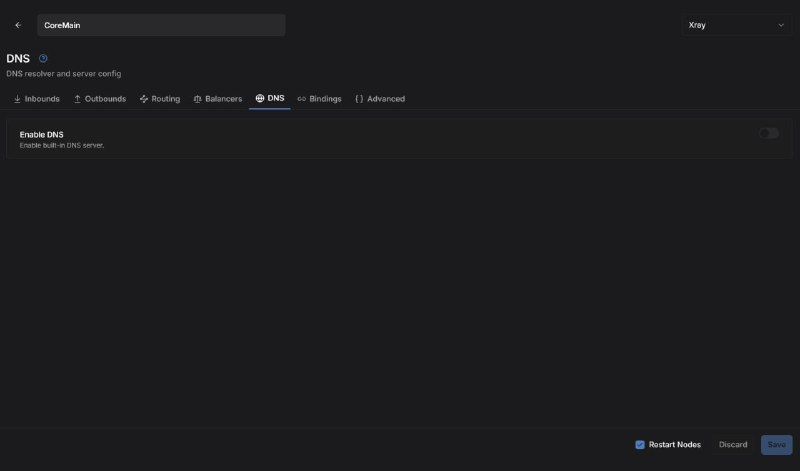

در آپدیت آزمایشی پنل پاسارگارد بخش تنظیم اینباند اضافه شده است که مشابه سنایی و دیگر پنل ها نیاز به تنظیم کد xray نیست و خیلی راحت می توانید تنظیمات انجام دهید

## Spotify_Porteghali — post 12409

یه لیست آیپیِ جدیدِ تست شده برایِ " شیرو خورشید " ، با سرعتِ بالا : 184.24.77.42 184.24.77.32 184.24.77.5 184.24.77.7 184.24.77.16 184.24.77.36 184.24.77.21 184.24.77.11 185.200.232.49 185.200.232.50 185.200.232.42 185.200.232.41 23.48.23.186 23.48.23.133…

## Spotify_Porteghali — post 12408

یه لیست آیپیِ جدیدِ تست شده برایِ " شیرو خورشید " ، با سرعتِ بالا :

184.24.77.42
184.24.77.32
184.24.77.5
184.24.77.7
184.24.77.16
184.24.77.36
184.24.77.21
184.24.77.11
185.200.232.49
185.200.232.50
185.200.232.42
185.200.232.41
23.48.23.186
23.48.23.133
23.48.23.195
23.48.23.178
184.24.77.29
2.22.250.149
23.58.193.140
23.48.23.151
2.19.126.81
23.202.138.125
23.43.237.239
104.112.146.82
23.2.13.136
72.246.28.37
2.18.63.49
2.16.53.11
2.16.53.50
2.16.19.136

💬 لینکِ دانلودِ داخلی و نحوه اتصال در اندروید 
💬

💬 نحوه اتصال در آیفون 
💬

+ تا زمانی که اتصال‌تون با سرعتِ خووب برقرار هست نیازی نیست که آیپی رو عوض کنید و آیپی هایِ جدید رو تست کنید .

🆔 @Spotify_Porteghali 🍊

↰  بزرگترین خانواده اسپاتیفای در کشور  ↱

## Spotify_Porteghali — post 12407

یه لیست آیپیِ جدیدِ تست شده برایِ " شیرو خورشید " ، با سرعتِ بالا : 2.17.251.98 2.20.255.113 2.21.239.21 2.22.6.68 2.23.168.7 2.23.168.47 2.23.168.96 2.23.168.144 2.23.168.174 2.23.168.213 2.23.169.105 2.23.169.111 2.23.169.207 2.23.170.80 23.2.13.152 23.2.13.227…

## Spotify_Porteghali — post 12406

یه لیست آیپیِ جدیدِ تست شده برایِ " شیرو خورشید " ، با سرعتِ بالا :

2.17.251.98
2.20.255.113
2.21.239.21
2.22.6.68
2.23.168.7
2.23.168.47
2.23.168.96
2.23.168.144
2.23.168.174
2.23.168.213
2.23.169.105
2.23.169.111
2.23.169.207
2.23.170.80
23.2.13.152
23.2.13.227
23.40.63.69
23.41.37.129
23.46.188.71
23.48.23.133
23.48.23.178
23.48.23.186
23.48.23.195
23.57.43.195
23.59.235.208
23.60.69.118
23.65.119.52
23.67.136.202
23.67.136.200
23.72.248.214
23.73.2.141
23.73.2.148
23.73.2.161
23.79.20.249
23.79.48.162
23.73.207.11
23.211.49.252
23.217.11.56
23.219.1.4
23.222.126.108
65.109.34.234
88.221.132.162
88.221.168.5
88.221.168.138
88.221.213.81
92.122.73.138
92.122.166.141
92.122.166.146
92.122.166.168
92.122.166.175
92.122.166.182
92.122.166.197
92.122.166.234
92.122.166.236
92.122.166.237
92.123.104.7
92.123.104.67
92.123.112.7
92.123.189.41
92.123.189.82
95.100.69.108
95.101.23.27
96.7.218.219
96.16.122.55
96.16.122.66
96.16.122.70
96.16.122.74
96.16.122.75
96.16.122.77
96.16.122.82
96.16.122.83
96.16.122.137
96.16.122.146
96.16.122.150
96.16.122.154
96.17.206.214
96.17.207.12
96.17.207.30
96.17.207.137
96.17.207.149
96.17.207.151
96.17.207.155
96.17.222.31
104.66.70.133
104.78.170.186
104.81.104.13
104.81.108.10
104.81.108.51
104.83.5.65
104.83.5.82
104.83.5.201
104.83.5.202
104.83.5.203
104.83.5.208
104.83.5.216
104.83.15.66
104.94.100.73
104.96.143.134
104.103.90.156
104.109.128.153
104.109.250.232
104.110.138.190
104.110.191.57
104.117.76.40
104.121.0.17
104.122.212.92
104.126.37.185
142.54.178.211
151.101.0.223
151.101.64.223
151.101.128.223
151.101.192.223
172.237.127.6
172.239.57.117
173.222.200.5
184.24.77.5
184.24.77.7
184.24.77.11
184.24.77.16
184.24.77.21
184.24.77.29
184.24.77.32
184.24.77.36
184.24.77.42
184.51.252.4
184.51.252.36
184.51.252.38
184.51.252.135
184.51.252.157
184.51.252.152
184.86.251.12
185.200.232.41
185.200.232.42
185.200.232.49
185.200.232.50

💬 لینکِ دانلودِ داخلی و نحوه اتصال در اندروید 
💬

💬 نحوه اتصال در آیفون 
💬

+ تا زمانی که اتصال‌تون با سرعتِ خووب برقرار هست نیازی نیست که آیپی رو عوض کنید و آیپی هایِ جدید رو تست کنید .

🆔 @Spotify_Porteghali 🍊

↰  بزرگترین خانواده اسپاتیفای در کشور  ↱

## JynMarket — post 2287

ShirOKhorshid-2026.05.14.apk

## TirexNet — post 3858

10.185.68.113:53,94.184.10.135:53,94.184.10.133:53,85.185.1.10:53,80.210.44.184:53,2.187.33.174:53,84.241.44.106:53,185.136.180.221:53
همراه اول
Dns Resolver slipnet
@TirexNet

## TirexNet — post 3857

2.189.44.44:53,10.185.68.113:53,10.185.68.114:53,10.185.68.113:53,2.189.44.44:53,2.188.21.200:53
همراه اول
Dns Resolver slipnet
@TirexNet

## TirexNet — post 3856

2.188.21.240:53,2.188.21.120:53,2.188.21.130:53,2.188.21.190:53,2.188.21.90:53,2.188.21.200:53,2.189.44.44:53,10.185.68.113:53

همراه اول
Dns Resolver slipnet
@TirexNet

## TirexNet — post 3855

Host > 37.202.232.125 Port > 1080 پروکسی سایفون راهنمای اتصال: Options > Proxy settings > use the following host اینم وصله

## TirexNet — post 3854

Host > 37.202.232.125
Port > 1080
پروکسی سایفون

راهنمای اتصال:
Options > Proxy settings > use the following host

اینم وصله

## TirexNet — post 3852

2.188.21.190:53,2.188.21.100:53,2.188.21.90:53
مودم مخابرات
Dns Resolver slipnet

## TirexNet — post 3851

2.188.21.200, 2.188.21.90, 2.188.21.120, 2.188.21.100, 2.188.21.190

ایرانسل
Dns Resolver slipnet
Query length 76 تست شده

## TirexNet — post 3850

2.188.21.200:53,2.188.21.120:53,2.188.21.190:53

ایرانسل
Dns Resolver slipnet

## TirexNet — post 3849

متصل همه اپراتور ها

104.88.70.105 92.123.10.153 96.16.248.152 104.83.197.160 96.16.248.133 96.16.249.54 96.16.248.162 173.222.249.155 184.87.193.138 96.6.34.243 96.17.96.7 96.16.248.137 104.110.191.32 184.51.97.129 104.116.98.32 184.87.193.139 184.84.221.34 96.16.248.139 96.16.249.52 88.221.0.39 96.16.249.28 96.16.248.142 96.17.72.48 104.117.76.106 104.109.128.163 96.17.72.51 96.17.72.75 104.109.250.11 104.115.39.202 96.16.249.38 184.85.134.164 104.76.210.6 104.117.76.16 104.117.76.8 184.84.81.125 23.66.101.71 96.16.248.177 92.123.10.217 184.85.155.41 88.221.0.52 173.222.146.221 184.51.102.248 96.17.72.80 96.17.72.58 173.222.249.146 104.115.39.104 96.17.72.57 173.222.249.153 173.222.108.57 96.17.72.10 23.67.142.129 173.222.108.49 88.221.0.58 96.16.248.182 104.110.191.39 104.110.191.41 96.16.248.159 96.16.248.156 96.16.248.153 104.110.191.14 88.221.0.38 88.221.0.44 104.108.86.50 96.7.105.201 96.16.248.166 173.222.249.160 96.16.248.183 88.221.0.56 184.51.102.88 96.16.249.23 88.221.0.50 104.68.103.205 96.16.248.170 104.116.96.159 96.16.249.20 88.221.0.36 96.17.180.45 96.16.249.11 96.16.248.181 104.83.197.135 173.222.108.120 23.64.59.9 92.122.16.5 104.120.56.96 104.117.76.147 92.123.10.232 184.86.103.159 104.117.76.137 104.117.76.145 104.117.76.139 104.117.76.114 104.69.81.4 104.117.76.104 104.117.76.99 104.117.76.179 104.117.76.153 104.120.90.56 104.117.76.90 104.117.76.91 96.6.33.250 104.117.76.67 104.117.76.72 104.117.76.64 104.117.76.57 104.117.76.58 104.117.76.19 184.86.103.20 184.86.103.12 184.86.103.23 184.86.103.14 184.86.103.19 173.223.109.20 96.17.96.31 104.76.220.65 173.222.148.49 184.51.96.7 104.76.220.42 184.51.149.33 104.108.238.182 104.80.48.203 92.122.17.9 92.123.8.93 104.76.210.216 104.76.220.112 23.64.224.224 173.222.168.212 173.222.168.191 92.123.8.87 92.123.10.140 184.51.102.58 184.51.102.177 104.76.220.170 104.76.220.168 92.122.6.109 173.223.29.67 92.123.8.100 23.65.117.219 173.222.148.43 23.75.23.33 184.86.103.223 184.86.103.217 184.86.103.196 23.67.129.53 184.86.103.139 184.86.103.142 104.108.237.97 184.86.103.13 104.112.135.94 23.64.59.26 92.122.9.160 104.120.80.245 173.223.239.52 92.122.1.249 173.222.116.88 96.16.249.50 96.16.249.33 96.16.249.60 96.16.248.151 96.16.248.145 96.16.248.148 96.16.248.176 96.16.248.136 96.16.248.154 96.16.248.143 92.123.8.77 104.124.165.104 96.16.249.12 96.16.248.155 96.16.248.179 96.16.248.171 96.16.248.147 96.16.248.144 23.65.124.89 96.16.249.9 23.65.124.88 96.16.249.16 96.16.249.6 96.16.248.174 96.16.248.167 96.16.248.164 92.123.8.99 92.123.8.94 23.65.124.104 92.123.8.74 23.65.124.91 23.65.124.106 23.65.124.105 104.108.231.170 23.66.101.79 184.85.137.131 104.120.82.77 104.120.77.233 23.64.12.168 104.120.89.53
104.120.76.148

Channel: T.me/TirexNet

## TirexNet — post 3848

متصل

184.24.77.42
184.24.77.32
184.24.77.5
184.24.77.7
184.24.77.16
184.24.77.36
184.24.77.21
184.24.77.11
185.200.232.49
185.200.232.50
185.200.232.42
185.200.232.41
23.48.23.186
23.48.23.133
23.48.23.195
23.48.23.178
184.24.77.29
2.22.250.149
23.58.193.140
23.48.23.151
2.19.126.81
23.202.138.125
23.43.237.239
104.112.146.82
23.2.13.136
72.246.28.37
2.18.63.49
2.16.53.11
2.16.53.50
2.16.19.136
2.23.7.25
2.16.106.34
2.17.251.104
23.55.110.67
23.216.77.62
23.216.77.63
23.216.77.71
23.48.203.186
23.219.36.80
23.56.109.144
96.16.53.161
96.16.122.156
185.200.232.43
185.200.232.40
96.16.122.60
184.51.97.129

Channel: T.me/TirexNet

## TirexNet — post 3847

متصل

184.24.77.5
184.24.77.7
184.24.77.11
184.24.77.16
184.24.77.21
184.24.77.29
184.24.77.32
2.17.251.98
2.20.255.113
2.21.239.21
2.22.6.68
2.23.168.7
2.23.168.47
2.23.168.96
2.23.168.144
2.23.168.174
2.23.168.213
2.23.169.105
2.23.169.111
2.23.169.207
2.23.170.80
23.2.13.152
23.2.13.227
23.40.63.69
23.41.37.129
23.46.188.71
23.48.23.133
23.48.23.178
23.48.23.186
23.48.23.195
23.57.43.195
23.59.235.208
23.60.69.118
23.65.119.52
23.67.136.202
23.67.136.200
23.72.248.214
23.73.2.141
23.73.2.148
23.73.2.161
23.79.20.249
23.79.48.162
23.73.207.11
23.211.49.252
23.217.11.56
23.219.1.4
23.222.126.108
65.109.34.234
88.221.132.162
88.221.168.5
88.221.168.138
88.221.213.81
92.122.73.138
92.122.166.141
92.122.166.146
92.122.166.168
92.122.166.175
92.122.166.182
92.122.166.197
92.122.166.234
92.122.166.236
92.122.166.237
92.123.104.7
92.123.104.67
92.123.112.7
92.123.189.41
92.123.189.82
95.100.69.108
95.101.23.27
96.7.218.219
96.16.122.55
96.16.122.66
96.16.122.70
96.16.122.74
96.16.122.75
96.16.122.77
96.16.122.82
96.16.122.83
96.16.122.137
96.16.122.146
96.16.122.150
96.16.122.154
96.17.206.214
96.17.207.12
96.17.207.30
96.17.207.137
96.17.207.149
96.17.207.151
96.17.207.155
96.17.222.31
104.66.70.133
104.78.170.186
104.81.104.13
104.81.108.10
104.81.108.51
104.83.5.65
104.83.5.82
104.83.5.201
104.83.5.202
104.83.5.203
104.83.5.208
104.83.5.216
104.83.15.66
104.94.100.73
104.96.143.134
104.103.90.156
104.109.128.153
104.109.250.232
104.110.138.190
104.110.191.57
104.117.76.40
104.121.0.17
104.122.212.92
104.126.37.185
142.54.178.211
151.101.0.223
151.101.64.223
151.101.128.223
151.101.192.223
172.237.127.6
172.239.57.117
173.222.200.5
184.24.77.36
184.24.77.42
184.51.252.4
184.51.252.36
184.51.252.38
184.51.252.135
184.51.252.157
184.51.252.152
184.86.251.12
185.200.232.41
185.200.232.42
185.200.232.49
185.200.232.50

Channel: T.me/TirexNet

## TirexNet — post 3846

https://uplod.ir/hephpo5emkav/document_2026-05-15_18-24-10_7640186111603507216._.htm
سایفون آپدیت 465

## TirexNet — post 3845

همراه اول

184.24.77.42
184.24.77.32
184.24.77.5
184.24.77.7
184.24.77.16
184.24.77.36
184.24.77.21
184.24.77.11
185.200.232.49
185.200.232.50
185.200.232.42
185.200.232.41
23.48.23.186
23.48.23.133
23.48.23.195
23.48.23.178
184.24.77.29
2.22.250.149
23.58.193.140
23.48.23.151
2.19.126.81
23.202.138.125
23.43.237.239
104.112.146.82
23.2.13.136
72.246.28.37
2.18.63.49
2.16.53.11
2.16.53.50
2.16.19.136

Channel: T.me/TirexNet

## TirexNet — post 3844

ایرانسل

2.22.21.152
95.101.23.82
23.215.0.164
23.197.161.35
184.28.230.87
23.220.128.221
96.17.207.142
23.50.131.18
23.36.162.209
23.219.3.212
23.223.245.150
96.16.122.59
23.2.13.138
23.2.13.144
96.17.207.135
23.220.113.51
96.17.72.41
23.203.185.105
95.101.35.83
2.21.239.23
23.54.210.170
23.215.60.73
95.101.181.125
23.192.237.222
23.200.143.71
23.58.222.98
125.56.219.8
104.80.49.118
96.16.122.158
2.21.239.10
96.16.122.65
95.101.23.170
104.111.202.158
23.2.13.201
92.123.102.104
23.58.222.139
2.17.147.89
96.17.178.132
23.49.248.6
23.222.30.64
23.55.110.70
23.2.13.153
173.222.105.65
23.200.143.73
23.201.217.14
23.55.110.200
95.101.23.25
23.37.206.186
173.222.105.42
95.101.29.12
88.221.92.177
23.50.131.132
184.86.251.27
2.16.244.11
2.16.27.71
2.19.10.30
104.121.12.86
23.73.207.16
2.18.190.26
96.16.122.149
23.201.217.150
95.101.23.168
96.17.207.162
96.16.122.48
95.101.35.73
23.192.237.208
80.67.82.179
96.17.207.154
2.21.89.66
2.18.190.27
95.100.156.147
23.192.46.51
104.76.220.137
23.36.162.198
23.37.197.128
96.17.207.143
23.36.162.208
23.36.162.202
23.200.143.88
23.55.110.46
23.55.110.143
173.222.105.18
2.23.176.166
23.44.10.10
104.126.37.171
23.55.155.169
23.210.123.174
104.117.76.26
23.46.188.168
23.58.222.147
95.101.200.63
125.56.219.32
23.192.237.209
95.101.29.54
23.46.230.118
96.17.207.153
184.25.52.200
23.202.156.203
23.36.162.196
96.16.122.145
23.33.126.163
95.101.29.30
23.36.162.215
23.39.249.249
2.21.239.29
23.210.73.136
104.126.37.161
23.2.13.186
23.50.131.160
23.219.138.200
96.16.122.153
104.117.76.146
23.38.49.97
2.19.196.105
96.16.122.141
104.78.170.186
96.17.222.31
23.41.37.129
23.2.13.227
23.222.126.108
2.20.255.113
2.17.251.98
23.2.13.152
95.101.23.27
2.21.239.21
23.211.49.252
88.221.168.5
104.103.90.156
23.79.20.249
88.221.132.162
23.59.235.208
23.60.69.118
23.46.188.71
104.122.212.92
23.219.1.4
23.57.43.195
184.51.252.135
2.22.6.68
23.217.11.56
95.100.69.108
23.40.63.69
.:
104.103.65.50
104.103.64.7
95.101.78.171
95.101.78.184
95.101.78.25
23.50.185.91
95.101.78.241
2.20.110.49
104.103.65.5
95.101.78.154
95.101.78.152
2.16.53.50
95.101.78.194
2.16.53.11
2.16.19.136
95.101.35.91
95.101.78.232
2.16.19.129
2.23.168.254
95.101.35.104
2.20.114.102
23.50.176.34
95.101.35.113
23.34.75.229
95.101.35.59
95.101.35.106
2.16.20.51
104.103.65.74
2.23.168.144
23.221.28.57
2.21.2.144
95.101.35.96
2.20.110.34
95.101.35.88
2.23.169.249
95.101.35.80
2.23.168.213
95.101.35.64
2.23.170.80
95.101.35.90
2.21.2.200
95.101.35.218
95.101.35.72
95.101.35.67
2.21.2.169
2.21.2.131
2.21.2.130
2.16.221.116
92.123.106.208
95.101.35.186
2.16.221.84
23.221.28.5
2.16.220.194
95.101.35.112
95.101.133.42
95.101.35.107
95.101.35.240
2.21.2.128
23.59.29.16
2.23.169.12
95.101.35.81
95.101.35.74
2.21.2.113
2.21.2.97
2.21.2.98
95.101.35.105
95.101.35.99
92.123.106.11
95.101.78.217
92.123.106.96
2.21.2.112
2.23.169.111
95.101.35.83
23.208.64.159
2.23.168.96
95.101.35.98
2.21.2.107
92.123.106.90
95.101.35.73
2.21.2.91
95.101.35.82
23.208.64.169
2.21.2.106
95.101.35.75
2.21.2.122
2.21.2.115
2.21.2.89
95.101.35.66
95.101.35.65
2.21.2.120
2.21.2.96
2.21.2.99
2.21.2.90
2.21.2.104
2.21.2.123
92.123.106.97
2.21.2.129
2.21.2.121
95.101.133.82
2.23.168.7
184.29.80.206
23.205.48.170
23.59.29.113
2.23.169.207
2.23.169.105
23.197.216.67
2.21.2.114
23.59.29.58
23.221.29.76
2.21.2.105
23.221.29.120
23.208.65.203
2.21.2.19
23.221.30.96
2.23.168.250
95.101.133.131
23.12.128.124
2.21.2.24
2.21.2.33
2.21.2.26
23.205.49.151
2.21.2.58
2.21.2.18
2.21.2.82
2.21.2.81
2.21.2.43
2.21.2.16
2.21.2.34
2.21.2.32
184.86.117.219
2.21.2.17
23.34.65.80
23.208.65.40
2.21.2.11
2.21.2.41
2.21.2.25
2.21.2.27
2.21.2.40
2.21.2.10
2.21.2.9
23.12.234.159
2.21.2.75
23.205.48.8
2.21.2.65
2.21.2.67
2.21.2.64
2.21.2.59
2.21.2.74
23.58.95.146
2.21.2.48
23.208.65.107
2.21.2.35
23.208.66.125
2.21.2.80
2.21.2.56

Channel: T.me/TirexNet

## asrnovin_ir — post 10338

  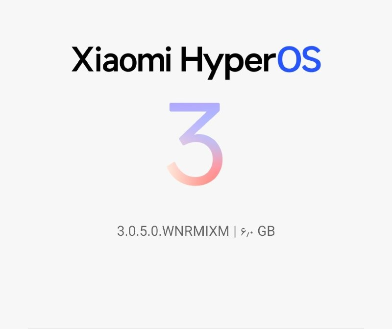

دو میلیون ناقابل هزینه آپدیت گوشی 😂
تازه قیمت رو منصفانه حساب کردم

## sirhishamtradinghub — post 3692

  

With these tools of war, you only have two choices: either you conquer the market, or the market destroys you forever.

What’s your watchlist tools 🛠️ 📉 ?

## khabarpro — post 1193

IP✅

2.23.7.25
2.16.106.34
2.17.251.104
23.55.110.67
23.216.77.62
23.216.77.63
23.216.77.71
23.48.203.186
23.219.36.80
23.56.109.144
96.16.53.161
96.16.122.156
185.200.232.43
185.200.232.40
96.16.122.60
184.51.97.129

@khabarpro

## khabarpro — post 1192

🤩قیمت ها به مدت محدود تخفیف خورد

کانفیگ با حجم ۳ گیگ = ۱٫۴۰۰٫۰۰۰

قیمت ویژه فقط ۷۵۰٫۰۰۰ تومان

✅ آیپی ثابت
✅ مخصوص ترید و گیم
✅ دارای لینک ساب
✅ بدون محدودیت زمان
✅ بدون‌محدودیت کاربر
✅ بدون ضریب

جهت سفارش پیام بدید

@m5008060

## TheVPNMethod — post 723

روش های عجیب غریبی که با CDN بچه‌ها وصل میشن رو توی گروه میگن 😁 تست کنید ببینید چخبره.
t.me/VPNMethods

## MatinSenPaii — post 3077

این آیپی‌ها رو موفق شدم از سرتاسر توییتر جمع‌آوری کنم برای شیر و خورشید، این بخش‌اش:
https://t.me/MatinSenPaii/3070
کافیه که با کاما(,) پشت هم وارد کنین:

2.22.250.149
23.58.193.140
23.48.23.151
2.19.126.81
23.202.138.125
23.43.237.239
104.112.146.82
23.2.13.136
72.246.28.37
2.18.63.49
2.16.53.11
2.16.53.50
2.16.19.136
184.24.77.42
184.24.77.32
184.24.77.5
184.24.77.7
184.24.77.16
184.24.77.36
184.24.77.21
184.24.77.11
185.200.232.49
185.200.232.50
185.200.232.42
185.200.232.41
23.48.23.186
23.48.23.133
23.48.23.195
23.48.23.178
184.24.77.29185.200.232.8
185.200.232.43  
185.200.232.40
185.143.232.122
185.200.232.9
185.200.232.11
185.200.232.16
185.200.232.17
185.200.232.19
185.200.232.24
185.200.232.25
185.200.232.26
185.200.232.34
185.200.232.40
185.200.232.42

## MatinSenPaii — post 3076

دور زدن فیلترینگ با کانفیگ سرورلس با ترکیب nekobox و v2rayng

## MatinSenPaii — post 3074

اگر با شیر و خورشید وصل می‌شید، گزینه‌ی Share proxy on network رو فعال کنید. سپس به یه WiFi وصل بشید و کانکت کنید VPN رو.
بعدش با هر دستگاه دیگه‌ای اگر این کانفیگ رو بزنید(با توجه به عدد و پورت خودتون تغییر بدید):
socks://Og==@192.168.1.147:46597#ShirOKhorshid-MatinSenPIi
و توی گوشی آیفون(با Streisand)، مک‌بوک(با V2Box)، و هر دستگاهی که کلاینت V2ray با پشتیبانی از Socks داره می‌تونید وصل بشید.

## archivetell — post 4996

آیپی های بالا با سامانتل راحت وصله

## archivetell — post 4995

برای گرفتن پینگ ساده از ip های بالا داخل ترموکس:
یک فایل ips.txt ایجاد کنید و ای پی ها رو بریزید داخل اون با دستور زیر:
cat > ips.txt

حالا ای پی ها رو پیست کنید و یک اینتر بزنید بعد ctrl + d

Create a script file (e.g., ping_script.sh):

nano ping_script.sh

Paste the following content into the file:

#!/bin/bash
while read -r ip; do
    if ping -c 1 -W 1 "$ip" > /dev/null; then
        echo "$ip is UP"
    else
        echo "$ip is DOWN"
    fi
done < ips.txt

Save and exit (Ctrl + O, Enter, Ctrl + X).

Make it executable and run it:

chmod +x ping_script.sh
./ping_script.sh

## archivetell — post 4994

رایتل و سامانتل شیر و خورشید

185.200.232.43  
185.200.232.40
167.82.48.223
151.101.128.223
185.200.232.49
185.200.232.50
185.200.232.42
185.200.232.41
184.24.77.42
184.24.77.32
184.24.77.5
184.24.77.7
184.24.77.16
184.24.77.36
184.24.77.21
184.24.77.11
23.48.23.186
23.48.23.133
23.48.23.195
23.48.23.178
184.24.77.29

## archivetell — post 4993

رایتل و سامانتل شیر و خورشید

185.200.232.41
184.24.77.42
184.24.77.32
184.24.77.5
184.24.77.7
184.24.77.16
184.24.77.36
184.24.77.21
184.24.77.11
23.48.23.186
23.48.23.133
23.48.23.195
23.48.23.178
184.24.77.29
185.200.232.43  
185.200.232.40
167.82.48.223
151.101.128.223
185.200.232.49
185.200.232.50
185.200.232.42

## archivetell — post 4991

  <a href="https://t.me/archivetell/4991" target="_blank">📎 Download file</a>

مدیریت پروژه GitHub
در ترمینال VSCode

در این آموزش با تمام دستورات ضروری Git برای بروزرسانی، حذف، ادغام، و مدیریت کامل پروژه‌هایتان در GitHub آشنا می‌شوید — مستقیم از ترمینال VSCode.

@ArchiveTell

## hamvex — post 2580

متود MITM-PSIPHON و CDN FRONTING(شیروخورشید) رو وصلین؟

اگه وصلین کانفیگ یا آیپی که استفاده میکنین بعلاوه اپراتوری که باهاش وصل شدین و تایم انتظار برای اتصال رو داخل یه پیام زیر این پست کامنت کنین بقیه استفاده کنن

## hamvex — post 2579

هر آیپی میزنید وصل نمیشه نه؟
اینا همه کارمای خیانت به ZYRLN و MHR-CFW ه
دیروز که وصل بودین باید ورکراتونو میساختین

## networkti — post 357

📱 آموزش کار با برنامه دفید (Thefeed): برای دریافت آخرین نسخه و کانفیگ‌ها، به کانال زیر بروید و برنامه را نصب‌ کنید و لینک کانفیگ را کپی کنید: @thefeedconfig ورود به برنامه: ۱. برنامه را باز کنید و زبان را انتخاب نمایید. ۲. در قسمت مشخص شده (thefeed://...)،…

## Break_The_Barriers — post 1593

I feel emotionally exhausted.

## Break_The_Barriers — post 1592

یک خرید آنلاین دارم؛ به این فکر می‌کنم که چه‌قدر باید اینترنت صرف کنم، تا بتونم چیزی که می‌خوام رو پیدا کنم و خریدم رو انجام بدم!

بعد می‌گن سر هر چیزی به آخوند فحش نده.

---
📅 بروزرسانی: 1405/02/25 20:02
---

## xsfilterrnet — post 3425

  <a href="telegram/content/xsfilterrnet_3425_1778862735.mp4" target="_blank">🎬 Download video</a>

🍷
دور زدن فیلترینگ با کانفیگ سرورلس با ترکیب nekobox و v2rayng

• 
🔶 لینک کانفیگ nekobox
• https://pastebin.com/raw/rWeHKSt3
• 
🔶 لینک داخلی کانفیگ nekobox
• https://seup.shop/t/exks1

• 
🔐 لینک کانفیگ V2rayNg
• https://pastebin.com/raw/Yfymhyy5
• 
🔐 لینک داخلی کانفیگ‌ V2rayNg
• https://seup.shop/t/k9mmj

❗️ هر دو کلاینت رو، رو حالتvpnبزارید .

📥 لینک داخلی ویدیوها
• 🎥 https://seup.shop/f/uns5
• 🎥 https://seup.shop/f/v4jx
• 𝕏 Irvictorious kian
• @ConfigWireguard 
💎
• @xsfilterrnet 
👑

## xsfilterrnet — post 3424

{
"remarks": "ServLess frag tlshello",
"log": {
"access": "",
"error": "",
"loglevel": "none",
"dnsLog": false
},
"dns": {
"tag": "dns",
"hosts": {
"cloudflare-dns.com": [
"208.67.222.222",
"172.67.73.38",
"104.19.155.92",
"172.67.73.163",
"104.18.155.42",
"104.16.124.175",
"104.16.248.249",
"104.16.249.249",
"104.26.13.8"
],
"domain:lichess.org": ["youtube.com"]
},
"servers": ["https://cloudflare-dns.com/dns-query"]
},
"inbounds": [
{
"domainOverride": ["http", "tls"],
"protocol": "socks",
"tag": "socks-in",
"listen": "0.0.0.0",
"port": 10808,
"settings": {
"auth": "noauth",
"udp": true,
"userLevel": 8
},
"sniffing": {
"enabled": true,
"destOverride": ["http", "tls"]
}
},
{
"protocol": "http",
"tag": "http-in",
"listen": "0.0.0.0",
"port": 10809,
"settings": {
"userLevel": 8
},
"sniffing": {
"enabled": true,
"destOverride": ["http", "tls"]
}
}
],
"outbounds": [
{
"protocol": "freedom",
"tag": "fragment-out",
"domainStrategy": "UseIP",
"sniffing": {
"enabled": true,
"destOverride": ["http", "tls"]
},
"settings": {
"fragment": {
"packets": "tlshello",
"length": "10-20",
"interval": "10-20"
}
},
"streamSettings": {
"sockopt": {
"tcpNoDelay": true,
"tcpKeepAliveIdle": 100,
"mark": 255,
"domainStrategy": "UseIP"
}
}
},
{
"protocol": "dns",
"tag": "dns-out"
},
{
"protocol": "vless",
"tag": "fakeproxy-out",
"domainStrategy": "",
"settings": {
"vnext": [
{
"address": "127.0.0.1",
"port": 2080,
"users": [
{
"encryption": "none",
"flow": "",
"id": "UUID",
"level": 8,
"security": "auto"
}
]
}
]
},
"streamSettings": {
"network": "ws",
"security": "tls",
"tlsSettings": {
"allowInsecure": false,
"alpn": ["h2", "http/1.1"],
"fingerprint": "randomized",
"publicKey": "",
"serverName": "google.com",
"shortId": "",
"show": false,
"spiderX": ""
},
"wsSettings": {
"headers": {
"Host": "google.com"
},
"path": "/"
}
},
"mux": {
"concurrency": 8,
"enabled": false
}
}
],
"policy": {
"levels": {
"8": {
"connIdle": 300,
"downlinkOnly": 1,
"handshake": 4,
"uplinkOnly": 1
}
},
"system": {
"statsOutboundUplink": true,
"statsOutboundDownlink": true
}
},
"routing": {
"domainStrategy": "IPIfNonMatch",
"rules": [
{
"inboundTag": ["socks-in", "http-in"],
"type": "field",
"port": "53",
"outboundTag": "dns-out",
"enabled": true
},
{
"inboundTag": ["socks-in", "http-in"],
"type": "field",
"port": "0-65535",
"outboundTag": "fragment-out",
"enabled": true
}
],
"strategy": "rules"
},
"stats": {}
}

🍷سرور less مثل این که روی بعضی اپراتور ها مجدد وصل شده لطفا داخل V2rayng بزنید و نتیجه پینگ و تست رو به من بگید اگر متصل بود آموزشش رو بزارم واستون
🫰

@xsfilterrnet 
👑

## saministamm — post 62919

151.101.192.223
151.101.64.223
151.101.0.223
151.101.66.137
151.101.2.137

## saministamm — post 62918

185.200.232.43
185.200.232.40

آیپی جدید
بزنید اتصال بعد حالت هواپیما بزنید بعد دوثانیه در بیارید وصل میشه
ایرانسل تست شده.

## saministamm — post 62917

مخابرات تست کنید 
🚀

2.23.168.47
2.23.170.80
2.23.168.144
2.23.168.213
2.23.168.174
2.23.169.111
2.23.168.96
185.200.232.49
185.200.232.41
2.23.169.105
2.23.168.7
2.23.169.207
185.200.232.50
185.200.232.42

## saministamm — post 62912

185.200.232.43  
185.200.232.40
167.82.48.223
151.101.128.223
185.200.232.49
185.200.232.50
185.200.232.42
185.200.232.41
184.24.77.42
184.24.77.32
184.24.77.5
184.24.77.7
184.24.77.16
184.24.77.36
184.24.77.21
184.24.77.11
23.48.23.186
23.48.23.133
23.48.23.195
23.48.23.178
184.24.77.29

همراه اول بعد ۴ دیقه متصل شد.
✅

## saministamm — post 62909

ایرانسل وصله :

CDN Edge IPs: 151.101.192.223
CDN SNI Hostname: python.org‎

توی همون قسمت More Options هستش
- @saministamm

## saministamm — post 62908

همراه اول اینو بزنید
2.19.204.145
sni :
pypi.org

@saministamm 
🚀

## saministamm — post 62907

184.86.251.26
96.16.122.133
96.16.53.152
96.16.53.147
96.16.122.152
104.126.37.162
23.73.0.64
96.16.122.141
104.117.76.10
96.16.53.158
92.123.157.46
104.81.175.248
96.16.122.75
96.17.207.142
96.17.207.143
92.122.166.182
104.109.128.153
104.96.143.134
23.73.2.141
104.83.5.202
23.67.136.200
23.67.136.202
23.65.119.52
96.16.122.70
92.122.166.236
92.122.166.234
92.122.166.237
104.110.138.190
173.222.200.5
184.51.252.36
184.51.252.38
2.23.227.196
2.17.147.11
2.18.64.9
2.18.64.4
2.18.64.5
2.22.114.98
95.100.153.184
95.101.27.196
2.17.96.131
95.101.137.74
95.101.78.25
2.23.245.35
2.16.168.107
2.17.100.250
2.16.245.188
2.17.100.130
95.100.110.28
2.22.89.43
2.18.63.33
95.100.153.186
2.22.151.140
95.100.177.68
95.101.61.215
95.101.27.71
2.23.227.218
2.23.227.209
2.23.227.221
2.17.100.218
2.17.97.198
95.101.27.101
2.17.240.5
2.16.106.222
95.101.234.87
2.21.33.113
23.194.20.27
95.101.38.176
95.101.35.113
2.17.100.225
2.16.168.214
2.17.113.121
2.23.227.212
2.23.227.219
23.212.110.218
95.101.35.96
2.17.96.158
2.16.168.208
2.16.245.174
2.16.245.173
23.192.237.219
2.17.152.213
2.17.100.200
2.22.112.208
2.23.172.114
2.23.227.199
2.23.227.215
2.21.134.89
2.17.100.136
2.23.90.148
95.101.111.168
23.219.79.75
2.16.168.122
2.16.168.123
95.100.177.112
23.192.24.7
23.12.157.106
2.16.245.133
23.52.22.3
2.17.147.218
23.216.134.80
23.55.163.135
23.46.188.71
2.17.100.169
95.101.234.88
2.22.151.152
2.17.241.119
95.101.122.131
95.101.111.161
2.21.245.14
2.18.172.59
95.101.234.90
23.11.41.157
95.101.38.158
2.16.164.34
2.16.164.89
23.73.2.148
92.122.166.175
172.237.127.6
104.81.104.13
96.17.207.137
92.123.112.7 
104.83.5.208
96.16.122.146
96.17.206.214
92.122.166.197
104.94.100.73
104.83.15.66
88.221.213.81
172.239.57.117
104.117.76.40
184.51.252.4
96.17.207.30
96.16.122.83
96.16.122.150
23.73.207.11
96.16.122.77
96.17.207.155
92.123.189.82
96.16.122.82
96.16.122.66
96.7.218.219
96.16.122.137
184.51.252.157
92.123.189.41
184.86.251.12
96.16.122.154
96.16.122.157
184.51.252.152
96.17.207.12
23.79.48.162
96.16.122.74
104.109.250.232
92.123.104.7
104.110.191.57
184.51.233.146
173.222.201.77
96.16.53.134
96.16.122.140
184.51.252.135
172.234.24.211
96.16.122.149
104.122.213.129
104.103.72.97
104.103.65.5
104.83.5.210
104.117.76.152
104.83.5.176

@saministamm

## saministamm — post 62906

آیپی های جدید بزنید وصله :

95.101.35.66
2.19.51.178
2.22.112.199
2.21.243.221
23.50.131.109
23.58.223.195
2.22.210.51
2.20.45.81
23.36.15.81
2.20.254.224
2.22.144.18
2.22.144.25
23.58.223.194
23.207.210.79
23.55.48.128
184.30.157.239
23.1.254.154
23.207.210.84
23.39.249.249
23.214.144.96
2.20.255.17
2.20.187.19
23.55.96.244
23.219.79.77
23.207.210.77
23.215.2.22
23.47.124.153
2.17.112.88
23.46.188.175
2.22.151.181
23.210.253.96
23.215.21.144
23.50.104.247
23.47.124.158
23.207.210.74
23.56.206.140
23.50.99.15
2.22.144.29
2.19.181.9
23.207.210.69
2.20.45.82
2.21.243.203
23.50.132.51
2.21.173.25
2.20.187.56
2.22.31.177
2.22.144.12
23.53.40.130
2.19.126.159
2.19.126.143
2.22.144.39
23.211.236.207
2.19.126.98
2.23.167.138
2.22.96.176
184.25.24.202
23.14.136.174
2.22.144.34
23.215.2.5
2.21.173.50
2.21.173.64
2.17.211.193
2.23.168.47
2.20.253.73
2.22.151.147
23.50.131.132
23.55.110.48
2.19.126.93
2.19.126.92
2.19.126.90
2.16.1.210
2.23.167.185
23.55.110.58
2.19.126.94

## saministamm — post 62905

✨ پروکسی متصل :

https://t.me/socks?server=2.184.205.44&@saministamm&port=10808&user=@saministamm&pass=@saministamm&user2=Pariya

## saministamm — post 62904

متصل و خوب جدید :

23.221.28.5
23.44.201.206
23.220.163.205
23.209.46.33
23.10.34.11
23.39.185.35
23.32.152.106
23.218.232.181
23.206.188.212
2.21.2.89
23.208.222.120
23.48.203.248
23.44.201.136
23.44.201.151
23.44.201.149
2.21.2.58
23.3.90.48
23.44.201.41
2.19.204.184
23.218.232.188
23.44.201.12
23.212.253.227
23.201.31.155
23.220.163.203
23.44.201.185
23.52.116.66
23.44.201.17
23.62.54.24
23.218.239.132
23.39.149.69
23.52.40.147
23.58.95.144
2.16.244.58
23.212.253.137
2.17.106.176
23.62.54.137
2.17.106.5
23.203.134.233
23.212.253.232
23.206.188.197
23.44.201.170
23.54.127.39
23.214.170.83
23.52.40.89
23.55.176.73
23.202.229.140
23.215.56.61
2.17.106.166
23.222.126.108
184.25.85.224
23.1.241.123
23.3.90.43
184.26.13.91
23.54.210.170

@saministamm ✉️

## saministamm — post 62903

همراه :

92.122.123.128
2.19.204.87
2.19.204.137
2.19.204.144
2.19.204.145
2.19.204.170
2.19.204.184
2.19.204.185
2.19.204.202
2.19.204.210
92.122.123.128
65.109.34.234
94.130.70.160
63.141.252.203
94.130.50.12
50.7.5.83
142.54.178.211
94.130.33.41
144.76.1.88
138.201.54.122
95.216.69.37
94.130.13.19

## saministamm — post 62902

جدید ترین آیپی :

2.22.21.152
95.101.23.82
23.215.0.164
23.197.161.35
184.28.230.87
23.220.128.221
96.17.207.142
23.50.131.18
23.36.162.209
23.219.3.212
23.223.245.150
96.16.122.59
23.2.13.138
23.2.13.144
96.17.207.135
23.220.113.51
96.17.72.41
23.203.185.105
95.101.35.83
2.21.239.23
23.54.210.170
23.215.60.73
95.101.181.125
23.192.237.222
23.200.143.71
23.58.222.98
125.56.219.8
104.80.49.118
96.16.122.158
2.21.239.10
96.16.122.65
95.101.23.170
104.111.202.158
23.2.13.201
92.123.102.104
23.58.222.139
2.17.147.89
96.17.178.132
23.49.248.6
23.222.30.64
23.55.110.70
23.2.13.153
173.222.105.65
23.200.143.73
23.201.217.14
23.55.110.200
95.101.23.25
23.37.206.186
173.222.105.42
95.101.29.12
88.221.92.177
23.50.131.132
184.86.251.27
2.16.244.11
2.16.27.71
2.19.10.30
104.121.12.86
23.73.207.16
2.18.190.26
96.16.122.149
23.201.217.150
95.101.23.168
96.17.207.162
96.16.122.48
95.101.35.73
23.192.237.208
80.67.82.179
96.17.207.154
2.21.89.66
2.18.190.27
95.100.156.147
23.192.46.51
104.76.220.137
23.36.162.198
23.37.197.128
96.17.207.143
23.36.162.208
23.36.162.202
23.200.143.88
23.55.110.46
23.55.110.143
173.222.105.18
2.23.176.166
23.44.10.10
104.126.37.171
23.55.155.169
23.210.123.174
104.117.76.26
23.46.188.168
23.58.222.147
95.101.200.63
125.56.219.32
23.192.237.209
95.101.29.54
23.46.230.118
96.17.207.153
184.25.52.200
23.202.156.203
23.36.162.196
96.16.122.145
23.33.126.163
95.101.29.30
23.36.162.215
23.39.249.249
2.21.239.29
23.210.73.136
104.126.37.161
23.2.13.186
23.50.131.160
23.219.138.200
96.16.122.153
104.117.76.146
23.38.49.97
2.19.196.105
96.16.122.141
104.78.170.186
96.17.222.31
23.41.37.129
23.2.13.227
23.222.126.108
2.20.255.113
2.17.251.98
23.2.13.152
95.101.23.27
2.21.239.21
23.211.49.252
88.221.168.5
104.103.90.156
23.79.20.249
88.221.132.162
23.59.235.208
23.60.69.118
23.46.188.71
104.122.212.92
23.219.1.4
23.57.43.195
184.51.252.135
2.22.6.68
23.217.11.56
95.100.69.108
23.40.63.69

@saministamm 
☀️

## saministamm — post 62901

امروز روز جهانی گل دادن به کسیه که دوسش دارید
🌹.

## saministamm — post 62900

آیپی جدید برای ایرانسل :

185.200.232.49
185.200.232.50
185.200.232.42
185.200.232.41
184.24.77.42
184.24.77.32
184.24.77.5
184.24.77.7
184.24.77.16
184.24.77.36
184.24.77.21
184.24.77.11
23.48.23.186
23.48.23.133
23.48.23.195
23.48.23.178
184.24.77.29
2.22.21.152
95.101.23.82
23.215.0.164
23.197.161.35
184.28.230.87
23.220.128.221
96.17.207.142
23.50.131.18
23.36.162.209
23.219.3.212
23.223.245.150
96.16.122.59
23.2.13.138
23.2.13.144
96.17.207.135
23.220.113.51
96.17.72.41
23.203.185.105
95.101.35.83
2.21.239.23
23.54.210.170
23.215.60.73
95.101.181.125
23.192.237.222
23.200.143.71
23.58.222.98
125.56.219.8
104.80.49.118
96.16.122.158
2.21.239.10
96.16.122.65
95.101.23.170
104.111.202.158
23.2.13.201
92.123.102.104
23.58.222.139
2.17.147.89
96.17.178.132
23.49.248.6
23.222.30.64
23.55.110.70
23.2.13.153
173.222.105.65
23.200.143.73
23.201.217.14
23.55.110.200
95.101.23.25
23.37.206.186
173.222.105.42
95.101.29.12
88.221.92.177
23.50.131.132
184.86.251.27
2.16.244.11
2.16.27.71
2.19.10.30
104.121.12.86
23.73.207.16
2.18.190.26
96.16.122.149
23.201.217.150
95.101.23.168
96.17.207.162
96.16.122.48
95.101.35.73
23.192.237.208
80.67.82.179
96.17.207.154
2.21.89.66
2.18.190.27
95.100.156.147
23.192.46.51
104.76.220.137
23.36.162.198
23.37.197.128
96.17.207.143
23.36.162.208
23.36.162.202
23.200.143.88
23.55.110.46
23.55.110.143
173.222.105.18
2.23.176.166
23.44.10.10
104.126.37.171
23.55.155.169
23.210.123.174
104.117.76.26
23.46.188.168
23.58.222.147
95.101.200.63
125.56.219.32
23.192.237.209
95.101.29.54
23.46.230.118
96.17.207.153
184.25.52.200
23.202.156.203
23.36.162.196
96.16.122.145
23.33.126.163
95.101.29.30
23.36.162.215
23.39.249.249
2.21.239.29
23.210.73.136
104.126.37.161
23.2.13.186
23.50.131.160
23.219.138.200
96.16.122.153
104.117.76.146
23.38.49.97
2.19.196.105
96.16.122.141
104.78.170.186
96.17.222.31
23.41.37.129
23.2.13.227
23.222.126.108
2.20.255.113
2.17.251.98
23.2.13.152
95.101.23.27
2.21.239.21
23.211.49.252
88.221.168.5
104.103.90.156
23.79.20.249
88.221.132.162
23.59.235.208
23.60.69.118
23.46.188.71
104.122.212.92
23.219.1.4
23.57.43.195
184.51.252.135
2.22.6.68
23.217.11.56
95.100.69.108
185.200.232.49
185.200.232.50
185.200.232.42
185.200.232.41
184.24.77.42
184.24.77.32
184.24.77.5
184.24.77.7
184.24.77.16
184.24.77.36
184.24.77.21
184.24.77.11
23.48.23.186
23.48.23.133
23.48.23.195
23.48.23.178
184.24.77.29
23.40.63.69

✨ @saministamm 
✨

## saministamm — post 62898

2.19.204.225 2.19.204.232 2.19.204.234 2.19.204.240 2.19.204.249 2.19.204.250 2.19.204.251 2.19.205.8 2.19.205.9 2.19.205.11 2.19.205.27 2.19.205.33 2.19.205.34 2.19.205.40 2.19.205.41 2.19.205.42 2.19.205.49 2.19.205.50 2.19.205.58 2.19.205.59 2.19.205.64…

## saministamm — post 62897

آیپی جدید : 185.200.232.40 185.200.232.43

## saministamm — post 62891

2.21.134.89
2.19.204.217
96.16.122.149
172.237.127.6
96.16.53.158
23.55.163.135
2.19.205.64
23.73.2.148
2.17.147.11
2.19.204.240
184.51.252.36

ایرانسل تست شده 
🚀

@saministamm 
🚀

## saministamm — post 62888

2.22.250.149
23.58.193.140
23.48.23.151
2.19.126.81
23.202.138.125
23.43.237.239
104.112.146.82
23.2.13.136
72.246.28.37
2.18.63.49
2.16.53.11
2.16.53.50
2.16.19.136
2.19.205.58
2.19.205.59
2.19.205.64
2.19.205.65
2.19.205.82
2.19.205.83
92.122.123.128
65.109.34.234
94.130.70.160
63.141.252.203
94.130.50.12
50.7.5.83
142.54.178.211
94.130.33.41
144.76.1.88
138.201.54.122
95.216.69.37
2.19.204.19
2.19.204.87
2.19.204.137
2.19.204.144
2.19.204.145
2.19.204.170
2.19.204.184
2.19.204.185
2.19.204.202
2.19.204.210
2.19.204.211
2.19.204.217
2.19.204.218
2.19.204.225
2.19.204.232
2.19.204.234
2.19.204.240
2.19.204.249
2.19.204.250
2.19.204.251
2.19.205.8
2.19.205.9
2.19.205.11
2.19.205.27
2.19.205.33
2.19.205.34
2.19.205.40
2.19.205.41
2.19.205.42
2.19.205.49
2.19.205.50
2.19.205.88
2.19.205.97
2.19.205.98
2.19.205.105
184.31.169.195
184.31.169.252
184.31.170.97
184.31.170.185
212.71.238.39

تست شده با مودم

🚀 @saministamm

## saministamm — post 62886

آیپی جدید همراه اول :

2.22.250.149
23.58.193.140
23.48.23.151
2.19.126.81
23.202.138.125
23.43.237.239
104.112.146.82
23.2.13.136
72.246.28.37
2.18.63.49
2.16.53.11
2.16.53.50
2.16.19.136

@saministamm 
🚀

## saministamm — post 62885

  <a href="telegram/content/saministamm_62885_1778862738.webm" target="_blank">🎬 Download video</a>

AM Tunnel<SuperDNS
✨

udp://185.208.174.167

فرکانس: 5

## Skyportall — post 10721

این taha رفیق منه
الکی میگه
کانالو خودم دادم بهش

## Skyportall — post 10720

  <a href="telegram/content/Skyportall_10720_1778862739.mp4" target="_blank">🎬 Download video</a>

🎬 Video

## Skyportall — post 10719

عشق
❤️

## Skyportall — post 10718

ایشالا صد کایی مشتی خیلییی کارت درسته و مسئولیت پذیری از وقتی پنج شش کا بودی میشناسمت چنلت پینه

## Skyportall — post 10717

منی که از وقتی آهنگ میزاشتی هستم🙂‍↔️🙂‍↔️🙂‍↔️
عشقی حقیقتا

## Skyportall — post 10716

  <a href="telegram/content/Skyportall_10716_1778862740.webm" target="_blank">🎬 Download video</a>

بهبه چنل 33K شده.
شاید عدد بزرگی نباشه ولی برای من که از ۸۰۰ نفر تا الان بدون هیچچچ تبلیغی چنلمو بالا اوردم و فقط هدفم این بود دور هم بتونیم این خفقان قطعی نتو تحمل کنیم، حضور این همه عدد برام ارزشمنده. بوس بهتون
🤩

## Skyportall — post 10712

  <a href="telegram/content/Skyportall_10712_1778862741.webm" target="_blank">🎬 Download video</a>

2.22.250.149
23.58.193.140
23.48.23.151
2.19.126.81
23.202.138.125
23.43.237.239
104.112.146.82
23.2.13.136
72.246.28.37
2.18.63.49
2.16.53.11
2.16.53.50
2.16.19.136
2.19.205.58
2.19.205.59
2.19.205.64
2.19.205.65
2.19.205.82
2.19.205.83
92.122.123.128
65.109.34.234
94.130.70.160
63.141.252.203
94.130.50.12
50.7.5.83
142.54.178.211
94.130.33.41
144.76.1.88
138.201.54.122
95.216.69.37
2.19.204.19
2.19.204.87
2.19.204.137
2.19.204.144
2.19.204.145
2.19.204.170
2.19.204.184
2.19.204.185
2.19.204.202
2.19.204.210
2.19.204.211
2.19.204.217
2.19.204.218
2.19.204.225
2.19.204.232
2.19.204.234
2.19.204.240
2.19.204.249
2.19.204.250
2.19.204.251
2.19.205.8
2.19.205.9
2.19.205.11
2.19.205.27
2.19.205.33
2.19.205.34
2.19.205.40
2.19.205.41
2.19.205.42
2.19.205.49
2.19.205.50
2.19.205.88
2.19.205.97
2.19.205.98
2.19.205.105
184.31.169.195
184.31.169.252
184.31.170.97
184.31.170.185
212.71.238.39

تست شده با مودم

⚡️
➡️ @Skyportall

## Skyportall — post 10711

  <a href="telegram/content/Skyportall_10711_1778862742.webm" target="_blank">🎬 Download video</a>

2.22.21.152
95.101.23.82
23.215.0.164
23.197.161.35
184.28.230.87
23.220.128.221
96.17.207.142
23.50.131.18
23.36.162.209
23.219.3.212
23.223.245.150
96.16.122.59
23.2.13.138
23.2.13.144
96.17.207.135
23.220.113.51
96.17.72.41
23.203.185.105
95.101.35.83
2.21.239.23
23.54.210.170
23.215.60.73
95.101.181.125
23.192.237.222
23.200.143.71
23.58.222.98
125.56.219.8
104.80.49.118
96.16.122.158
2.21.239.10
96.16.122.65
95.101.23.170
104.111.202.158
23.2.13.201
92.123.102.104
23.58.222.139
2.17.147.89
96.17.178.132
23.49.248.6
23.222.30.64
23.55.110.70
23.2.13.153
173.222.105.65
23.200.143.73
23.201.217.14
23.55.110.200
95.101.23.25
23.37.206.186
173.222.105.42
95.101.29.12
88.221.92.177
23.50.131.132
184.86.251.27
2.16.244.11
2.16.27.71
2.19.10.30
104.121.12.86
23.73.207.16
2.18.190.26
96.16.122.149
23.201.217.150
95.101.23.168
96.17.207.162
96.16.122.48
95.101.35.73
23.192.237.208
80.67.82.179
96.17.207.154
2.21.89.66
2.18.190.27
95.100.156.147
23.192.46.51
104.76.220.137
23.36.162.198
23.37.197.128
96.17.207.143
23.36.162.208
23.36.162.202
23.200.143.88
23.55.110.46
23.55.110.143
173.222.105.18
2.23.176.166
23.44.10.10
104.126.37.171
23.55.155.169
23.210.123.174
104.117.76.26
23.46.188.168
23.58.222.147
95.101.200.63
125.56.219.32
23.192.237.209
95.101.29.54
23.46.230.118
96.17.207.153
184.25.52.200
23.202.156.203
23.36.162.196
96.16.122.145
23.33.126.163
95.101.29.30
23.36.162.215
23.39.249.249
2.21.239.29
23.210.73.136
104.126.37.161
23.2.13.186
23.50.131.160
23.219.138.200
96.16.122.153
104.117.76.146
23.38.49.97
2.19.196.105
96.16.122.141
104.78.170.186
96.17.222.31
23.41.37.129
23.2.13.227
23.222.126.108
2.20.255.113
2.17.251.98
23.2.13.152
95.101.23.27
2.21.239.21
23.211.49.252
88.221.168.5
104.103.90.156
23.79.20.249
88.221.132.162
23.59.235.208
23.60.69.118
23.46.188.71
104.122.212.92
23.219.1.4
23.57.43.195
184.51.252.135
2.22.6.68
23.217.11.56
95.100.69.108
23.40.63.69
185.200.232.49
185.200.232.50
185.200.232.42
185.200.232.41
184.24.77.42
184.24.77.32
184.24.77.5
184.24.77.7
184.24.77.16
184.24.77.36
184.24.77.21
184.24.77.11
23.48.23.186
23.48.23.133
23.48.23.195
23.48.23.178
184.24.77.29
96.16.122.74
104.109.250.232
92.123.104.7
104.110.191.57
104.83.5.82
92.122.166.168
104.83.5.65
104.121.0.17
104.103.64.7
104.66.70.133
92.122.166.146
23.73.2.161
92.122.73.138
92.122.166.141
96.16.122.55
104.81.108.51
23.72.248.214
104.126.37.185
104.83.5.201
104.83.5.216
92.123.104.67
104.83.5.203
96.17.207.151
88.221.168.138
96.17.207.149
104.81.108.10
23.73.2.148
92.122.166.175
172.237.127.6
104.81.104.13
96.17.207.137
92.123.112.7
96.16.122.75
96.17.207.142
96.17.207.143
92.122.166.182
104.109.128.153
104.96.143.134
23.73.2.141
104.83.5.202
23.67.136.200
23.67.136.202
23.65.119.52
96.16.122.70
92.122.166.236
92.122.166.234
92.122.166.237
104.110.138.190
173.222.200.5
184.51.252.36
184.51.252.38
104.83.5.208
96.16.122.146
96.17.206.214
92.122.166.197
104.94.100.73
104.83.15.66
88.221.213.81
172.239.57.117
104.117.76.40
184.51.252.4
96.17.207.30
96.16.122.83
96.16.122.150
23.73.207.11
96.16.122.77
96.17.207.155
92.123.189.82
96.16.122.82
96.16.122.66
96.7.218.219
96.16.122.137
184.51.252.157
92.123.189.41
184.86.251.12
96.16.122.154
184.51.252.152
96.17.207.12
23.79.48.162

تست شده با همراه اول
🛜

⚡️
➡️ @Skyportall

## Skyportall — post 10710

  <a href="telegram/content/Skyportall_10710_1778862743.webm" target="_blank">🎬 Download video</a>

184.86.251.26 96.16.122.133 96.16.53.152 96.16.53.147 96.16.122.152 104.126.37.162 23.73.0.64 96.16.122.141 104.117.76.10 96.16.53.158 92.123.157.46 104.81.175.248 96.16.122.75 96.17.207.142 96.17.207.143 92.122.166.182 104.109.128.153 104.96.143.134 23.73.2.141 104.83.5.202 23.67.136.200 23.67.136.202 23.65.119.52 96.16.122.70 92.122.166.236 92.122.166.234 92.122.166.237 104.110.138.190 173.222.200.5 184.51.252.36 184.51.252.38 2.23.227.196 2.17.147.11 2.18.64.9 2.18.64.4 2.18.64.5 2.22.114.98 95.100.153.184 95.101.27.196 2.17.96.131 95.101.137.74 95.101.78.25 2.23.245.35 2.16.168.107 2.17.100.250 2.16.245.188 2.17.100.130 95.100.110.28 2.22.89.43 2.18.63.33 95.100.153.186 2.22.151.140 95.100.177.68 95.101.61.215 95.101.27.71 2.23.227.218 2.23.227.209 2.23.227.221 2.17.100.218 2.17.97.198 95.101.27.101 2.17.240.5 2.16.106.222 95.101.234.87 2.21.33.113 23.194.20.27 95.101.38.176 95.101.35.113 2.17.100.225 2.16.168.214 2.17.113.121 2.23.227.212 2.23.227.219 23.212.110.218 95.101.35.96 2.17.96.158 2.16.168.208 2.16.245.174 2.16.245.173 23.192.237.219 2.17.152.213 2.17.100.200 2.22.112.208 2.23.172.114 2.23.227.199 2.23.227.215 2.21.134.89 2.17.100.136 2.23.90.148 95.101.111.168 23.219.79.75 2.16.168.122 2.16.168.123 95.100.177.112 23.192.24.7 23.12.157.106 2.16.245.133 23.52.22.3 2.17.147.218 23.216.134.80 23.55.163.135 23.46.188.71 2.17.100.169 95.101.234.88 2.22.151.152 2.17.241.119 95.101.122.131 95.101.111.161 2.21.245.14 2.18.172.59 95.101.234.90 23.11.41.157 95.101.38.158 2.16.164.34 2.16.164.89 23.73.2.148 92.122.166.175 172.237.127.6 104.81.104.13 96.17.207.137 92.123.112.7? 104.83.5.208 96.16.122.146 96.17.206.214 92.122.166.197 104.94.100.73 104.83.15.66 88.221.213.81 172.239.57.117 104.117.76.40 184.51.252.4 96.17.207.30 96.16.122.83 96.16.122.150 23.73.207.11 96.16.122.77 96.17.207.155 92.123.189.82 96.16.122.82 96.16.122.66 96.7.218.219 96.16.122.137 184.51.252.157 92.123.189.41 184.86.251.12 96.16.122.154 96.16.122.157 184.51.252.152 96.17.207.12 23.79.48.162 96.16.122.74 104.109.250.232 92.123.104.7 104.110.191.57 184.51.233.146 173.222.201.77 96.16.53.134 96.16.122.140 184.51.252.135 172.234.24.211 96.16.122.149 104.122.213.129 104.103.72.97 104.103.65.5 104.83.5.210 104.117.76.152 104.83.5.176

تست شده با ایرانسل
🛜

⚡️
➡️ @Skyportall

## hamedvpns — post 18872

  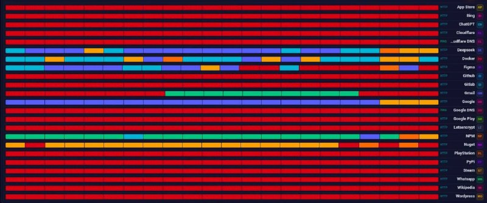

به خاطر روش جدید اتصال ، تقریبا تمام سایت‌هایی که وایت‌لیست شده بود ، به خصوص گیت‌هاب ، بسته شدن .

..

## ConfigWireguard — post 31742

  <a href="telegram/content/ConfigWireguard_31742_1778862744.mp4" target="_blank">🎬 Download video</a>

دور زدن فیلترینگ با کانفیگ سرورلس با ترکیب nekobox و v2rayng

• 🗒️ لینک کانفیگ nekobox
• https://pastebin.com/raw/rWeHKSt3
• 🗒️ لینک داخلی کانفیگ nekobox
• https://seup.shop/t/exks1

• 🗒️ لینک کانفیگ V2rayNg
• https://pastebin.com/raw/Yfymhyy5
• 🗒️ لینک داخلی کانفیگ‌ V2rayNg
• https://seup.shop/t/k9mmj

🔸 هر دو کلاینت رو، رو حالتvpnبزارید .

📥 لینک داخلی nekobox
▫️NekoBox — v1.4.2 (armv8 / armv7)
📥 لینک داخلی ویدیوها
• 🎥 https://seup.shop/f/uns5
• 🎥 https://seup.shop/f/v4jx
• 𝕏 Irvictorious kian
• @ConfigWireguard

## ConfigWireguard — post 31741

Telegram Version 12.7.3
لینک دانلود داخلی
نسخه سایت تلگرام (دایرکت)

https://c224731.parspack.net/c224731/tg/Telegram_direct_v12.7.3.zip

## ConfigWireguard — post 31740

WhiteDNS-1.4.0-universal.apk

## ConfigWireguard — post 31739

📱 آموزش کار با برنامه دفید (Thefeed)

برای دریافت آخرین نسخه و کانفیگ‌ها، به کانال زیر بروید و برنامه را نصب‌ کنید و لینک کانفیگ را کپی کنید:
@thefeedconfig

ورود به برنامه:
۱. برنامه را باز کنید و زبان را انتخاب نمایید.
۲. در قسمت مشخص شده (thefeed://...)، کانفیگ کپی شده را وارد کرده و دکمه «وارد کردن» را بزنید تا ثبت شود.

عملکرد برنامه:
پس از وارد کردن اولین کانفیگ، برنامه ریزالورهای موجود در کانفیگ را بررسی کرده (چند دقیقه طول میکشد) و سپس لیست کانال‌ها را دریافت می‌کند. شما می‌توانید کانال‌ها را باز کرده، پست‌ها را مشاهده و عکس، ویدیو، ویس و فایل‌ها را دانلود کنید.

نکته: لیست کانال‌ها فقط توسط سازنده کانفیگ قابل تغییر است. (جلو تر یک‌روش دیگر برای کانال های دلخواه شما نیز نوشته ام)

افزودن کانفیگ جدید:
در صفحه اصلی با زدن دکمه + می‌توانید کانفیگ جدید وارد کنید یا کانفیگ‌های موجود دیگر را فعال نمایید.

🛠️ بخش ریزالور ها:
در این بخش می‌توانید ریزالورها را مدیریت کنید. دکمه‌ای به نام «بانک ریزالور» وجود دارد که لیست کامل را نمایش می‌دهد. همچنین یک لیست فعال به نام Default وجود دارد که پس از بررسی اولیه، ریزالورهای فعال را در خود نگه می‌دارد. شما می‌توانید برای اینترنت‌های مختلف، لیست‌های فعال متفاوتی داشته باشید. و با زدن دکمه «بررسی مجدد»، می‌توانید از بانک ریزالور فعال برای اینترنت خود را پیدا کرده و به لیست جدید اضافه کنید.

🔍 بخش پیدا کردن ریزالور:
این بخش بسیار مهم است. با استفاده از یک لیست پیش‌فرض ۵۰ هزارتایی، می‌توانید ریزالورهایی که برای اینترنت شما کار می‌کنند را پیدا کنید (زمانی که سرعت برنامه کم شده بود و یا کار‌ نمی‌کرد).
روش کار:
۱. وارد بخش شوید.
۲. دکمه بارگذاری لیست پیش‌فرض را بزنید.
۳. دکمه شروع اسکن را بزنید.
۴. برنامه شروع به پیدا کردن می‌کند. وقتی حدود ۱۰ تا ریزالور پیدا شد، توقف را بزنید و سپس دکمه «افزودن به لیست فعال» را بزنید.
*توجه:* حتماً باید VPN خاموش باشد.

📺 بخش کانال‌های دلخواه (teleMirror):
این بخش کاملاً از قسمت‌های قبلی جداست و مکانیزم متفاوتی دارد. این بخش از طریق سرویس‌های گوگل، پیام و عکس کانال‌های عمومی تلگرام را می‌آورد و نمایش می‌دهد.
*محدودیت‌ها:* این بخش نمی‌تواند ویدیو پخش کند یا فایل دانلود کند (به خاطر محدودیت‌های گوگل). همچنین برخی کانال‌های عمومی اجازه اشتراک‌گذاری در سایت را نمی‌دهند، و پست هایشان در این قسمت نمایش داده نمی‌شود.
نکته مهم: این بخش فقط زمانی کار می‌کند که گوگل در دسترس باشد. اگر گوگل مسدود شود، فقط قسمت اصلی برنامه (معرفی شده در اول پست) کار خواهد کرد. همچنین سرویس‌های گوگل محدودیت تعداد درخواست دارند که ممکن است شما را محدود کنند.
🔔 برای اخبار پروژه حتما کانال اصلی را دنبال کنید:
@networkti

## ConfigWireguard — post 31738

ی اسکریپت bash خودکار برای اسکن ip های Cloudflare و Akamai چون گیت هاب بسته بود میخواستم تبدیلش کنم به یک خط که از اونجا فراخوان بزنی و کامل خودش هم اپدیت کنه هم شروع کنه به اسکن که فعلا فیلترها #!/data/data/com.termux/files/usr/bin/bash set -euo pipefail…

## ConfigWireguard — post 31737

ی اسکریپت bash خودکار برای اسکن ip های Cloudflare و Akamai چون گیت هاب بسته بود میخواستم تبدیلش کنم به یک خط که از اونجا فراخوان بزنی و کامل خودش هم اپدیت کنه هم شروع کنه به اسکن که فعلا فیلترها

#!/data/data/com.termux/files/usr/bin/bash
set -euo pipefail

if ! command -v python3 &> /dev/null; then
    echo -e "\e[32mPython3 not found. Installing...\e[0m"
    pkg update -y && pkg install python -y
fi

outputFile="clean_ips.txt"

rawList=$(cat <<'EOF'
92.123.102.43
2.19.204.0/24
2.19.205.0/24
92.123.0.0/16
23.200.0.0/16
184.31.169.0/24
184.31.170.0/24
23.218.0.0/16
104.64.0.0/12
2.16.0.0/14
EOF
)

rm -f "$outputFile"
touch "$outputFile"
tmpIPs="$(mktemp)"
trap 'rm -f "$tmpIPs"' EXIT

echo -e "\e[33m[1/2] --- Generating Smart Samples from Ranges ---\e[0m"

while IFS= read -r line; do
    line=$(echo "$line" | xargs)
    [[ -z "$line" || "$line" == "#"* ]] && continue

    if [[ "$line" == *"/"* ]]; then
        ipBase="${line%%/*}"
        mask="${line##*/}"
        IFS='.' read -r o1 o2 o3 o4 <<<"$ipBase"

        if (( mask >= 24 )); then
            prefix="$o1.$o2.$o3"
            for i in {1..254}; do
                echo "$prefix.$i" >> "$tmpIPs"
            done
        else
            echo -e "\e[90mSampling 500 IPs from large range: $line\e[0m"
            for n in {1..500}; do
                r2=$o2; [[ $mask -le 16 ]] && r2=$((RANDOM % 255))
                r3=$((RANDOM % 255))
                r4=$(( (RANDOM % 253) + 1 ))
                echo "$o1.$r2.$r3.$r4" >> "$tmpIPs"
            done
        fi
    else
        echo "$line" >> "$tmpIPs"
    fi
done <<< "$rawList"

sort -u "$tmpIPs" -o "$tmpIPs"
total_count=$(wc -l < "$tmpIPs")

echo -e "\e[36m[2/2] --- Starting Parallel Scan ($total_count IPs) ---\e[0m"
echo -e "\e[35mMax Workers: 10 | Timeout: 600ms | Results: LIVE sorted\e[0m\n"

python3 -u - <<'PY' "$tmpIPs" "$outputFile"
import sys, time, socket
from concurrent.futures import ThreadPoolExecutor, as_completed

ip_file, out_file = sys.argv[1], sys.argv[2]
TIMEOUT = 0.6
PORT = 443
MAX_WORKERS = 10
results = []

def save_results():
    results.sort(key=lambda x: x[0])
    with open(out_file, "w") as f:
        for ms, ip in results:
            f.write(f"{ip}\n")

def test_ip(ip):
    start_time = time.perf_counter()
    try:
        sock = socket.socket(socket.AF_INET, socket.SOCK_STREAM)
        sock.settimeout(TIMEOUT)
        result = sock.connect_ex((ip, PORT))
        if result == 0:
            elapsed = int((time.perf_counter() - start_time) * 1000)
            sock.close()
            return (True, ip, elapsed)
        sock.close()
    except:
        pass
    return (False, ip, None)

with open(ip_file, "r") as f:
    ips = [line.strip() for line in f if line.strip()]

try:
    with ThreadPoolExecutor(max_workers=MAX_WORKERS) as executor:
        future_to_ip = {executor.submit(test_ip, ip): ip for ip in ips}
        
        for future in as_completed(future_to_ip):
            ok, ip, ms = future.result()
            if ok:
                print(f" \033[32m[OK]\033[0m {ip} \033[90m({ms} ms)\033[0m")
                results.append((ms, ip))
                save_results()

except KeyboardInterrupt:
    print("\n\n\033[33mStop requested by user.\033[0m")
finally:
    print(f"\n--- Scan Finished. Found {len(results)} clean IPs. ---")
    print(f"Results saved in: {out_file}")
PY

## Zel2oVPN — post 2802

✅New iP

84.26.13.91
23.54.210.170
23.44.201.206
23.220.163.205
23.209.46.33
23.10.34.11
23.39.185.35
23.32.152.106
23.218.232.181
23.206.188.212
2.21.2.89
23.208.222.120
23.48.203.248
23.44.201.136
23.44.201.151
23.44.201.149
2.21.2.58
23.3.90.48
23.44.201.41
2.19.204.184
23.218.232.188
23.44.201.12
23.212.253.227
23.201.31.155
23.220.163.203
23.44.201.185
23.52.116.66
23.44.201.17
23.62.54.24
23.218.239.132
23.39.149.69
23.52.40.147
23.58.95.144
2.16.244.58
23.212.253.137
2.17.106.176
23.62.54.137
2.17.106.5
23.203.134.233
23.212.253.232
23.206.188.197
23.44.201.170
23.54.127.39
23.214.170.83
23.52.40.89
23.55.176.73
23.202.229.140
23.215.56.61
2.17.106.166
23.222.126.108
184.25.85.224
23.1.241.123
23.3.90.43

✅اینم تست شده ایرانسل وصلم
یبار کلیر دیتا کنید دوباره تنظیم کنید ای پی رو بزنید واس خودم زیر ۵ ثانیه وصل میشه

☑➜@Zel2oVPN

## Zel2oVPN — post 2801

✅New iP

185.200.232.43
185.200.232.40
96.16.122.152
104.126.37.162
23.73.0.64
96.16.122.141
104.117.76.10
96.16.53.158
92.123.157.46
104.81.175.248
2.19.205.64
23.73.2.148
2.17.147.11
2.19.204.240
23.44.201.185
23.52.116.66
23.44.201.17
184.51.252.36

✅تست شده با ایرانسل وصلم

هرچی ای پی دارین پاک کنید این جدیدارو قرار بدین sni خالی باشه
ای پی رو قرار دادین یه حالت پرواز بذارید تست کنید

☑➜@Zel2oVPN

## Zel2oVPN — post 2800

✅VayDNS+SSH [S124]

slipnet-enc://AX0l5hDrKiPnBUk6F1HfOWL78LOxIh/AOVr5C/P8Tc197HBg67FRTUqegyME+YUEL5LrRv+NnwrCu7PeLHuxkkVTrNbtgBljpCx+lvdON2WRMMS3uOVBS4hMGN1l5dMwLWWPv/JoXfOkmmJQPF2SxWEA216wAvLRxh5K1VR5O1xrLlYrZdsG76A7vyaFRpQHCyu8Do2dxYlHRrbYMPwl60e9bzvwZl4EeXbAXZOo1Z4mLcrL/JR/wxFOy1rBYp7OajkeXTA67eJsRrKzDK8WhdoFVMOHX0LyuNHoyXv79BeyQcCytA0rN88r85OgNnfvOIttw8akYyNcZIucTv+OPaFS4VwuGQdpoKY27cHV6uiRKmHkn1K1qA4Cbm7QfggiiV1Ij0aHjQFNL9vPDeucJSLRkvyp5r52wq4vKO2tvdbwKpyzQLZ2FKFKANgaq2HUk/p72USRsd1UqNsNSZGCgPnTBb2d0OEh3NCOl9zx9jjM597jhwvuqSz4pJVnHudP72IEWBpIIzpMI8THnfuOs4+syjhrxOxWFQ5Vb2mWXIT0n+6ylVlcQ3YKjuwwuOBtkKWJMXh6mRTk1yTfOEF9erkP9ZGwYVtDAzBfJp+PdMwHVzTIf9PiAtEh8MsFYKDPW6VQZ51Lrxjp2FRTqXB6D1QF7VitUc0Zp0WlrUqc+zWKJBH7eD0MCOimKRpLpItxvQ13ShqJW9JlvxI1N7J3sKirYF+OAZMflU307+NLEOyuTqB8hKNC3IJ9ewS9vkYMxZlIFUs+RrVsN/tUUmHNy58oH3mZZrGYnLYn

📱کانفیگ اسلیپ

📱مخصوص نسخه جدید  2.5.3

📱دانلود نسخه جدید

📱تنظیمات پیشنهادی

https://t.me/socks?server=127.0.0.1&port=10880&user=%40Zel2oVPN

☑➜@Zel2oVPN

## Zel2oVPN — post 2798

✅New iP

2.21.134.89
2.19.204.217
96.16.122.149
172.237.127.6
96.16.53.158
23.55.163.135
2.19.205.64
23.73.2.148
2.17.147.11
2.19.204.240
184.51.252.36

✅ایرانسل وصلم تست شده
Sni
خالی باشه دوستان

☑➜@Zel2oVPN

## Zel2oVPN — post 2797

185.94.98.34
2.189.44.68
185.44.36.216
185.137.25.146
94.232.173.28
185.142.158.162
217.219.162.200
185.88.178.196
178.252.143.130
134.255.206.206
80.75.7.2
134.255.206.205
185.53.142.174
89.32.197.226
185.37.55.30
77.238.111.234
31.214.169.244
80.71.149.62
185.109.61.27
62.60.197.83
185.88.178.177
178.252.128.66
158.58.184.147
5.202.252.30
74.63.24.205
74.63.24.211
216.147.121.134
74.63.24.210
46.209.209.209
217.66.203.211
74.80.77.246
80.191.221.26
2.189.44.98
216.147.121.98
164.138.17.122
207.211.215.145
151.232.36.4
185.208.175.228
2.188.21.58
108.162.192.0
172.64.32.0
80.191.163.249
173.245.58.0
78.39.234.140
185.208.183.29
2.188.21.138
2.188.21.70
2.188.21.46
185.255.91.60
66.185.123.243
2.189.44.85
2.189.44.82
2.189.44.83
2.189.44.86
2.189.44.84
2.189.44.14
74.80.77.247
109.107.159.45
2.189.44.92
2.189.44.94
2.189.44.91
2.189.44.93
2.189.44.90
78.157.41.60
193.178.200.3
46.32.31.30
185.208.174.167
85.185.157.181
77.238.123.179
185.141.105.139
5.160.140.16
5.160.227.78
185.53.141.230
185.105.101.1
37.255.223.218
85.133.129.242
78.38.174.2
37.191.95.70
74.80.77.244
74.80.77.245
93.118.109.213
194.61.120.143
121.127.46.65
93.126.5.205
5.160.137.130
2.180.21.241
82.114.164.226

ریزالور لیست مخصوص WhiteDNS

☑➜@Zel2oVPN

## Zel2oVPN — post 2796

✅New iP

2.22.250.149
23.58.193.140
23.48.23.151
2.19.126.81
23.202.138.125
23.43.237.239
104.112.146.82
23.2.13.136
72.246.28.37
2.18.63.49
2.16.53.11
2.16.53.50
2.16.19.136
2.19.205.58
2.19.205.59
2.19.205.64
2.19.205.65
2.19.205.82
2.19.205.83
92.122.123.128
65.109.34.234
94.130.70.160
63.141.252.203
94.130.50.12
50.7.5.83
142.54.178.211
94.130.33.41
144.76.1.88
138.201.54.122
95.216.69.37
2.19.204.19
2.19.204.87
2.19.204.137
2.19.204.144
2.19.204.145
2.19.204.170
2.19.204.184
2.19.204.185
2.19.204.202
2.19.204.210
2.19.204.211
2.19.204.217
2.19.204.218
2.19.204.225
2.19.204.232
2.19.204.234
2.19.204.240
2.19.204.249
2.19.204.250
2.19.204.251
2.19.205.8
2.19.205.9
2.19.205.11
2.19.205.27
2.19.205.33
2.19.205.34
2.19.205.40
2.19.205.41
2.19.205.42
2.19.205.49
2.19.205.50
2.19.205.88
2.19.205.97
2.19.205.98
2.19.205.105
184.31.169.195
184.31.169.252
184.31.170.97
184.31.170.185
212.71.238.39

همراه اول تست شده

☑➜@Zel2oVPN

## Zel2oVPN — post 2795

✅New iP

2.21.134.89 2.19.204.217 96.16.122.149 172.237.127.6 96.16.53.158 23.55.163.135 2.19.205.64 23.73.2.148 2.17.147.11 2.19.204.240 184.51.252.36

ایرانسل تست شده

☑➜@Zel2oVPN

## Zel2oVPN — post 2793

سرور اهدایی

〰️〰️〰️〰️〰️〰️〰️〰️〰️〰️〰️〰️
🇹🇷 Turkey Server 1
Domain:  v1.abolfazlshahi.cloud
Key: a4c5649c628ac1103ad55c5208e0d74d
〰️〰️〰️〰️〰️〰️〰️〰️〰️〰️〰️〰️
🇹🇷 Turkey Server 2
Domain:  v2.abolfazlshahi.cloud
Key: 965a568dccef58af7afb86e8ee55eea6
〰️〰️〰️〰️〰️〰️〰️〰️〰️〰️〰️〰️

☑➜@Zel2oVPN

## Zel2oVPN — post 2792

WhiteDNS-1.4.0-universal.apk

## whitedns — post 643

  <a href="telegram/content/whitedns_643_1778862747.mp4" target="_blank">🎬 Download video</a>

🍷
دور زدن فیلترینگ با کانفیگ سرورلس با ترکیب nekobox و v2rayng

• 
✅ لینک کانفیگ nekobox
• https://pastebin.com/raw/rWeHKSt3
• 
✅ لینک داخلی کانفیگ nekobox
• https://seup.shop/t/exks1

• 
✅ لینک کانفیگ V2rayNg
• https://pastebin.com/raw/Yfymhyy5
• 
✅ لینک داخلی کانفیگ‌ V2rayNg
• https://seup.shop/t/k9mmj

❗️ هر دو کلاینت رو، رو حالتvpnبزارید .

📥 لینک داخلی ویدیوها
• 🎥 https://seup.shop/f/uns5
• 🎥 https://seup.shop/f/v4jx
• 𝕏 Irvictorious kian
• @ConfigWireguard 
💎
• @xsfilterrnet 
👑

## whitedns — post 642

White DNS pinned «
💥
💥
💥
💥
💥
💥
💥 برای تبادل نظر و همگرایی در گروه ما عوض شوید 🔄👥 @whitedns_group 
🌐»

## whitedns — post 641

💥
💥
💥
💥
💥
💥
💥

برای تبادل نظر و همگرایی در گروه ما عوض شوید
🔄👥

@whitedns_group 
🌐

## whitedns — post 639

لیست ۱۰۰ ریزالور که طول ۲۴ ساعت گذشته به سرور های WhiteDNS وصل شدند

185.94.98.34
2.189.44.68
185.44.36.216
185.137.25.146
94.232.173.28
185.142.158.162
217.219.162.200
185.88.178.196
178.252.143.130
134.255.206.206
80.75.7.2
134.255.206.205
185.53.142.174
89.32.197.226
185.37.55.30
77.238.111.234
31.214.169.244
80.71.149.62
185.109.61.27
62.60.197.83
185.88.178.177
178.252.128.66
158.58.184.147
5.202.252.30
74.63.24.205
74.63.24.211
216.147.121.134
74.63.24.210
46.209.209.209
217.66.203.211
74.80.77.246
80.191.221.26
2.189.44.98
216.147.121.98
164.138.17.122
207.211.215.145
151.232.36.4
185.208.175.228
2.188.21.58
108.162.192.0
172.64.32.0
80.191.163.249
173.245.58.0
78.39.234.140
185.208.183.29
2.188.21.138
2.188.21.70
2.188.21.46
185.255.91.60
66.185.123.243
2.189.44.85
2.189.44.82
2.189.44.83
2.189.44.86
2.189.44.84
2.189.44.14
74.80.77.247
109.107.159.45
2.189.44.92
2.189.44.94
2.189.44.91
2.189.44.93
2.189.44.90
78.157.41.60
193.178.200.3
46.32.31.30
185.208.174.167
85.185.157.181
77.238.123.179
185.141.105.139
5.160.140.16
5.160.227.78
185.53.141.230
185.105.101.1
37.255.223.218
85.133.129.242
78.38.174.2
37.191.95.70
74.80.77.244
74.80.77.245
93.118.109.213
194.61.120.143
121.127.46.65
93.126.5.205
5.160.137.130
2.180.21.241
82.114.164.226

@WhiteDNS

## Spotify_Porteghali — post 12405

یه لیست آیپیِ جدیدِ تست شده برایِ " شیرو خورشید " ، با سرعتِ بالا : 23.73.2.141 104.83.5.202 23.67.136.200 23.67.136.202 23.65.119.52 96.16.122.70 92.122.166.236 92.122.166.234 92.122.166.237 104.110.138.190 173.222.200.5 184.51.252.36 184.51.252.38 104.83.5.208…

## Spotify_Porteghali — post 12404

یه لیست آیپیِ جدیدِ تست شده برایِ " شیرو خورشید " ، با سرعتِ بالا :

23.73.2.141
104.83.5.202
23.67.136.200
23.67.136.202
23.65.119.52
96.16.122.70
92.122.166.236
92.122.166.234
92.122.166.237
104.110.138.190
173.222.200.5
184.51.252.36
184.51.252.38
104.83.5.208
96.16.122.146
96.17.206.214
92.122.166.197
104.94.100.73
104.83.15.66
88.221.213.81
172.239.57.117
104.117.76.40
184.51.252.4
96.17.207.30
96.16.122.83
96.16.122.150
23.73.207.11
96.16.122.77
96.17.207.155
92.123.189.82
96.16.122.82
96.16.122.66
96.7.218.219
96.16.122.137
184.51.252.157
92.123.189.41
184.86.251.12
96.16.122.154
96.16.122.157
184.51.252.152
96.17.207.12
23.79.48.162

💬 لینکِ دانلودِ داخلی و نحوه اتصال در اندروید 
💬

💬 نحوه اتصال در آیفون 
💬

+ تا زمانی که اتصال‌تون با سرعتِ خووب برقرار هست نیازی نیست که آیپی رو عوض کنید و آیپی هایِ جدید رو تست کنید .

🆔 @Spotify_Porteghali 🍊

↰  بزرگترین خانواده اسپاتیفای در کشور  ↱

## Spotify_Porteghali — post 12403

یه لیست آیپیِ جدیدِ تست شده برایِ " شیرو خورشید " ، با سرعتِ بالا : 185.200.232.43   185.200.232.40 167.82.48.223 151.101.128.223 185.200.232.49 185.200.232.50 185.200.232.42 185.200.232.41 184.24.77.42 184.24.77.32 184.24.77.5 184.24.77.7 184.24.77.16 184.24.77.36…

## Spotify_Porteghali — post 12402

یه لیست آیپیِ جدیدِ تست شده برایِ " شیرو خورشید " ، با سرعتِ بالا :

185.200.232.43  
185.200.232.40
167.82.48.223
151.101.128.223
185.200.232.49
185.200.232.50
185.200.232.42
185.200.232.41
184.24.77.42
184.24.77.32
184.24.77.5
184.24.77.7
184.24.77.16
184.24.77.36
184.24.77.21
184.24.77.11
23.48.23.186
23.48.23.133
23.48.23.195
23.48.23.178
184.24.77.29

💬 لینکِ دانلودِ داخلی و نحوه اتصال در اندروید 
💬

💬 نحوه اتصال در آیفون 
💬

+ تا زمانی که اتصال‌تون با سرعتِ خووب برقرار هست نیازی نیست که آیپی رو عوض کنید و آیپی هایِ جدید رو تست کنید .

🆔 @Spotify_Porteghali 🍊

↰  بزرگترین خانواده اسپاتیفای در کشور  ↱

## Spotify_Porteghali — post 12401

یه لیست آیپیِ جدیدِ تست شده برایِ " شیرو خورشید " ، با سرعتِ بالا : 84.26.13.91 23.54.210.170 23.44.201.206 23.220.163.205 23.209.46.33 23.10.34.11 23.39.185.35 23.32.152.106 23.218.232.181 23.206.188.212 2.21.2.89 23.208.222.120 23.48.203.248 …

## Spotify_Porteghali — post 12400

یه لیست آیپیِ جدیدِ تست شده برایِ " شیرو خورشید " ، با سرعتِ بالا :

84.26.13.91
23.54.210.170
23.44.201.206
23.220.163.205
23.209.46.33
23.10.34.11
23.39.185.35
23.32.152.106
23.218.232.181
23.206.188.212
2.21.2.89
23.208.222.120
23.48.203.248
23.44.201.136
23.44.201.151
23.44.201.149
2.21.2.58
23.3.90.48
23.44.201.41
2.19.204.184
23.218.232.188
23.44.201.12
23.212.253.227
23.201.31.155
23.220.163.203
23.44.201.185
23.52.116.66
23.44.201.17
23.62.54.24
23.218.239.132
23.39.149.69
23.52.40.147
23.58.95.144
2.16.244.58
23.212.253.137
2.17.106.176
23.62.54.137
2.17.106.5
23.203.134.233
23.212.253.232
23.206.188.197
23.44.201.170
23.54.127.39
23.214.170.83
23.52.40.89
23.55.176.73
23.202.229.140
23.215.56.61
2.17.106.166
23.222.126.108
184.25.85.224
23.1.241.123
23.3.90.43

💬 لینکِ دانلودِ داخلی و نحوه اتصال در اندروید 
💬

💬 نحوه اتصال در آیفون 
💬

+ تا زمانی که اتصال‌تون با سرعتِ خووب برقرار هست نیازی نیست که آیپی رو عوض کنید و آیپی هایِ جدید رو تست کنید .

🆔 @Spotify_Porteghali 🍊

↰  بزرگترین خانواده اسپاتیفای در کشور  ↱

## Spotify_Porteghali — post 12399

💬 لینکِ دانلودِ مستقیمِ داخلی ( بدونِ فیلتر ) وی پی ان ها و کلاینت هایِ اندروید که این چند روز کارآمد و متصل بودند 
💬 
⚪️Psiphon [ v 453 ] : https://punkpaste.ir/f/Psiphon-v-453-Spotif-zmesls 
⚪️Psiphon ( Mod ) [ v 462 ] : https://punkpaste.ir/f/Psiphon-Mod…

## Spotify_Porteghali — post 12398

💬 لینکِ دانلودِ مستقیمِ داخلی ( بدونِ فیلتر ) وی پی ان ها و کلاینت هایِ اندروید که این چند روز کارآمد و متصل بودند 
💬

⚪️Psiphon [ v 453 ] : https://punkpaste.ir/f/Psiphon-v-453-Spotif-zmesls

⚪️Psiphon ( Mod ) [ v 462 ] : https://punkpaste.ir/f/Psiphon-Mod-v-462-Sp-s2jge6

⚪️V2RayNG [ v 2.1.7 ] : https://punkpaste.ir/f/V2rayNG-v-2-1-7-Spot-jt2q4i

⚪️V2RayN ( Windows ) [ v 7.20.4 ] : https://punkpaste.ir/f/V2rayN-Windows-64-v--cv5zzo

⚪️NapsternetV [ v 123.1 ] : https://punkpaste.ir/f/NapsternetV-v-123-1--bkv7fz

⚪️SlipNet [ v 2.5.3 ] : https://punkpaste.ir/f/SlipNet-v-2-5-3-Spot-ttsh8j

⚪️SlipStream ( Windows ) : https://punkpaste.ir/f/SlipStream-Windows-6-k11c95

⚪️V2Box [ v 5.0.3 ] : https://punkpaste.ir/f/V2Box-v-5-0-3-Spotif-rkigc4

⚪️Happ [ v 3.18.1 ] : https://punkpaste.ir/f/Happ-v-3-18-1-Spotif-i9dp5r

⚪️OpenVPN  [ v 3.3.2 ] : https://punkpaste.ir/f/OpenVPN-Connect-v-3--drnglr

⚪️HTTP Injector [ v 6.5.0 ] : https://punkpaste.ir/f/HTTP-Injector-v-6-5--rd4aoc

⚪️NetMod [ v 3.2.8 ] : https://punkpaste.ir/f/NetMod-v-3-2-8-Spoti-regvcv

⚪️ShirOKhorshid [ v 2026.3.17 ] : https://punkpaste.ir/f/ShirOKhorshid-v-2026-uaqcp5

⚪️AM Tunnel Pro [ v 28.0 ] : https://punkpaste.ir/f/AM-TUNNEL-Pro-v-28-0-c1xkqo

⚪️AM Tunnel Lite : [ v 2.0 ] : https://punkpaste.ir/f/AM-TUNNEL-LITE-v-2-0-zrthvb

⚪️MasterDNS [ v 1.0.9 ] : https://punkpaste.ir/f/MasterDns-v-1-0-9-Sp-rg4jip

⚪️WireGuard [ v 1.0.20 ] : https://punkpaste.ir/f/WireGuard-v-1-0-20-S-cfgc0s

⚪️WhiteDNS [ v 1.1.0 ] : https://punkpaste.ir/f/WhiteDNS-v-1-1-0-Spo-qfiuzc

⚪️Every Proxy [ v 12.7 ] : https://punkpaste.ir/f/Every-Proxy-v-12-7-S-w9220z

⚪️NetShare [ v 2.5.50 ] : https://punkpaste.ir/f/NetShare-v-2-5-50-Sp-w8ero2

🔴خیلی مهم : حتما لینک رو کپی کنید و در مرورگر Chrome جایگذاری کنید و دانلود کنید ؛ لینک ها با همه ی اینترنت ها بدونِ نیاز به وی پی ان کار می‌کنند .

+ اعتبارِ لینک هایِ دانلود : 24 ساعت [ لینک ها آپدیت می شود . ]

🆔 @Spotify_Porteghali 🍊

↰  بزرگترین خانواده اسپاتیفای در کشور  ↱

## Spotify_Porteghali — post 12397

اگر که چند ساعت گذشته و نتونستید به هیچ آیپیِ جدیدی در " شیرو خورشید " متصل بشید ، از تنظیماتِ گوشی اول برنامه رو Clear Data کنید و بعد حذف کنید و دوباره نصب کنید و از نو آیپی هایِ جدید تست کنید .
با این روش یه تعدادی از عزیزانی که چند ساعتی موفق به اتصال نشده بودند ، دوباره متصل شدند .

🆔 @Spotify_Porteghali 🍊

↰  بزرگترین خانواده اسپاتیفای در کشور  ↱

## Spotify_Porteghali — post 12396

اگر که آیپیِ جدیدی نزاشتم چون چند ساعتی هست که هنوز چیزی متصل نشده ، دارم تست می‌کنم ، اگر که چیزی وصل بشه میزارم حتما .

## JynMarket — post 2285

‼️بهترین vpn گیگی 180 هزار تومان
‼️ 
👀اگر تا اخر شب بات رو با زیر مجموعه معرفی کنید ۱۰ درصد پورسانت هم دریافت میکنید اگر تا اخر شب تعداد قابل توجهی سرویس فروختیم از فردا با همین قیمت یا کمتر شروع میکنیم
🙂 برای خرید روی دکمه زیر کلیک کنید
❤

## JynMarket — post 2284

  

‼️بهترین vpn گیگی 180 هزار تومان
‼️

👀اگر تا اخر شب بات رو با زیر مجموعه معرفی کنید ۱۰ درصد پورسانت هم دریافت میکنید
اگر تا اخر شب تعداد قابل توجهی سرویس فروختیم از فردا با همین قیمت یا کمتر شروع میکنیم
🙂
برای خرید روی دکمه زیر کلیک کنید
❤

## JynMarket — post 2283

🌟 سرور اسلیپ نت جدید slipnet-enc://AS6F6/+8zu9VF75KiPpRg2Cik4I9mcwTdkGIwzVQr8KV7dankQYCNHYRS8lLu8myX4WMPfPjUsY1GWqyL3dz9ERRQ1JkbfyHyOg1isbLzMEkli9AmMamI+b5lpjfBYky1a5ZrNZu3/Wo61aQGFM+MWmoawM2Vm40H5XaVchvdFiC0+qd8IUO0Glqjp/u/V56b+mnkPfYToOwWh8FC4m3D/ImvMuD…

## JynMarket — post 2282

🌟 سرور اسلیپ نت جدید

slipnet-enc://AS6F6/+8zu9VF75KiPpRg2Cik4I9mcwTdkGIwzVQr8KV7dankQYCNHYRS8lLu8myX4WMPfPjUsY1GWqyL3dz9ERRQ1JkbfyHyOg1isbLzMEkli9AmMamI+b5lpjfBYky1a5ZrNZu3/Wo61aQGFM+MWmoawM2Vm40H5XaVchvdFiC0+qd8IUO0Glqjp/u/V56b+mnkPfYToOwWh8FC4m3D/ImvMuDA5kRbOBAIojcCNA3dtKFCcfO2gxidU+neC07sAgoc9OPOb0I6hvwDRAdQPxGXJaV74XoFFhHicIxwA6JK5ii/ACwIpFgzcfadK9+3xMyoVtHFq9l1PgRFYi0eLkE7HglmhFQdu0um9N+VHfjWfclrHOMkI58faCHZEuOQmxVaJ/7I5UVOZs+xY33pohR7Y91r/to4IfR9onRGyeWGJm9rOVbiqFleXeOUZuetg1nFxrDxGFPKWDrLqZ05Vn58lEKfaOaXLfNPV4py/eUBBF5JiGNro1mhAWhF877iJyzmmxmjnXF64aUQ4eQPWfk4svf1CByAUI57blM3rP1z+L+paRVSPu/Kh3oP9rwZiLNXTKESKrb3SWDvkqAGBanzag+DrwWisSYLrV2OuLDzwIlRQwXUfI+ywaMu1xA5t3yVVy4yCEzJ0zxB6FSIRsT9Xpm1u/1TvUz0SMsiulR6JCFjy3EBGVnQPvOi4Av75/fLfrQM0DmMNRgAHpNxePzMpKwrLBwP/Vyo/Q=

🔗 اموزش استفاده - دانلود برنامه موردنیاز

## JynMarket — post 2281

⚠️ اگه برای بعضیا شیر و خورشید دیگه وصل نمیشه، این کارارو انجام بدید 
👇
یک‌بار اپلیکیشن رو Clear Cache کنید
دوباره IP ها رو وارد و تست کنید
اگه باز هم وصل نشد، اینترنت رو تغییر بدید 
📶
@JynMarket

## JynMarket — post 2280

  <a href="https://t.me/JynMarket/2280" target="_blank">📎 Download file</a>

ShirOKhorshid-2026.05.14.apk

## TirexNet — post 3843

متصل

2.19.204.249
2.19.204.250
2.19.204.251
2.19.205.8
2.19.205.9
2.19.205.11
2.19.205.27
2.19.205.33
2.19.205.34
2.19.205.40
2.19.205.41
2.19.205.42
2.19.205.49
2.19.205.50
2.19.205.58
2.19.205.59
2.19.205.64
2.19.205.65
2.19.205.82
2.19.205.83
2.19.205.88
2.19.205.97
2.19.205.98
2.19.205.105
151.101.64.223
151.101.0.223
151.101.128.223
151.101.192.223
92.122.123.128
2.19.204.87
2.19.204.137
2.19.204.144
2.19.204.145
2.19.204.170
2.19.204.184
2.19.204.185
2.19.204.202
2.19.204.210
2.19.204.225
185.200.232.41
2.19.204.232
2.19.204.234
2.19.204.240

Channel: T.me/TirexNet

## TirexNet — post 3842

وصل

2.19.204.186
2.19.205.88
92.123.8.91

Channel: T.me/TirexNet

## TirexNet — post 3841

دگم نباش :
قسمت ۵۹
قسمت ۶۰
قسمت ۶۱
قسمت ۶۲

کومان :
اپدیت استودیو
اعذاب ۳
چایی کدوم کشور دنیا بهتره؟
تو انباری کومان چی پیدا میشه؟
ولاگ تولد ایمان با سوپرایز ویژه

## TirexNet — post 3840

تست کنید

23.220.163.203
23.44.201.185
23.52.116.66
23.44.201.17
23.62.54.24
23.218.239.132
23.39.149.69
23.52.40.147
23.58.95.144
2.16.244.58
84.26.13.91
23.54.210.170
23.44.201.206
23.220.163.205
23.209.46.33
23.10.34.11
23.39.185.35
23.32.152.106
23.218.232.181
23.206.188.212
2.21.2.89
23.208.222.120
23.48.203.248
23.44.201.136
23.44.201.151
23.44.201.149
2.21.2.58
23.3.90.48
23.44.201.41
2.19.204.184
23.218.232.188
23.44.201.12
23.212.253.227
23.201.31.155

Channel: T.me/TirexNet

## TirexNet — post 3839

متصل

96.16.122.75
96.17.207.142
96.17.207.143
92.122.166.182
104.109.128.153
104.96.143.134
23.73.2.141
104.83.5.202
23.67.136.200
23.67.136.202
23.65.119.52
96.16.122.70
92.122.166.236
92.122.166.234
92.122.166.237
104.110.138.190
173.222.200.5
184.51.252.36
184.51.252.38
2.23.227.196
2.17.147.11
2.18.64.9
2.18.64.4
2.18.64.5
2.22.114.98
95.100.153.184
95.101.27.196
2.17.96.131
95.101.137.74
95.101.78.25
2.23.245.35
2.16.168.107
2.17.100.250
2.16.245.188
2.17.100.130
95.100.110.28
2.22.89.43
2.18.63.33
95.100.153.186
2.22.151.140
95.100.177.68
95.101.61.215
95.101.27.71
2.23.227.218
2.23.227.209
2.23.227.221
2.17.100.218
2.17.97.198
95.101.27.101
2.17.240.5
2.16.106.222
95.101.234.87
2.21.33.113
23.194.20.27
95.101.38.176
95.101.35.113
2.17.100.225
2.16.168.214
2.17.113.121
2.23.227.212
2.23.227.219
23.212.110.218
95.101.35.96
2.17.96.158
2.16.168.208
2.16.245.174
2.16.245.173
23.192.237.219
2.17.152.213
2.17.100.200
2.22.112.208
2.23.172.114
2.23.227.199
2.23.227.215
2.21.134.89
2.17.100.136
2.23.90.148
95.101.111.168
23.219.79.75
2.16.168.122
2.16.168.123
95.100.177.112
23.192.24.7
23.12.157.106
2.16.245.133
23.52.22.3
2.17.147.218
23.216.134.80
23.55.163.135
23.46.188.71
2.17.100.169
95.101.234.88
2.22.151.152
2.17.241.119
95.101.122.131
95.101.111.161
2.21.245.14
2.18.172.59
95.101.234.90
23.11.41.157
95.101.38.158
2.16.164.34
2.16.164.89
23.73.2.148
92.122.166.175
172.237.127.6
104.81.104.13
96.17.207.137
92.123.112.7 
104.83.5.208
96.16.122.146
96.17.206.214
92.122.166.197
104.94.100.73
104.83.15.66
88.221.213.81
172.239.57.117
104.117.76.40
184.51.252.4
96.17.207.30
96.16.122.83
96.16.122.150
23.73.207.11
96.16.122.77
96.17.207.155
92.123.189.82
96.16.122.82
96.16.122.66
96.7.218.219
96.16.122.137
184.51.252.157
92.123.189.41
184.86.251.12
96.16.122.154
96.16.122.157
184.51.252.152
96.17.207.12
23.79.48.162
96.16.122.74
104.109.250.232
92.123.104.7
104.110.191.57
184.51.233.146
173.222.201.77
96.16.53.134
96.16.122.140
184.51.252.135
172.234.24.211
96.16.122.149
104.122.213.129
104.103.72.97
104.103.65.5
104.83.5.210
104.117.76.152
104.83.5.176
184.86.251.26
96.16.122.133
96.16.53.152
96.16.53.147
96.16.122.152
104.126.37.162
23.73.0.64
96.16.122.141
104.117.76.10
96.16.53.158
92.123.157.46
104.81.175.248

Channel: T.me/TirexNet

## TirexNet — post 3838

حاجی من صبح قسمت پروتکل تو شیروخورشید گذاشتم رو خودکار یه دوساعتی وصل بودم ولی الان برام قطع شد به بقیه بگو این کاربکنن شاید وصل شدن

## TirexNet — post 3837

2.22.250.149 23.58.193.140 23.48.23.151 2.19.126.81 23.202.138.125 23.43.237.239 104.112.146.82 23.2.13.136 72.246.28.37 2.18.63.49 2.16.53.11 2.16.53.50 2.16.19.136 2.19.205.58 2.19.205.59 2.19.205.64 2.19.205.65 2.19.205.82 2.19.205.83 92.122.123.128 65.109.34.234…

## TirexNet — post 3836

همراه اول

2.22.250.149
23.58.193.140
23.48.23.151
2.19.126.81
23.202.138.125
23.43.237.239
104.112.146.82
23.2.13.136
72.246.28.37
2.18.63.49
2.16.53.11
2.16.53.50
2.16.19.136

Channel: T.me/TirexNet

## TirexNet — post 3835

تست کنید

23.214.170.83
23.52.40.89
23.55.176.73
23.202.229.140
23.215.56.61
2.17.106.166
23.222.126.108
184.25.85.224
23.1.241.123
23.3.90.43
84.26.13.91
23.54.210.170
23.44.201.206
23.220.163.205
23.209.46.33
23.10.34.11
23.39.185.35
23.32.152.106
23.218.232.181
23.206.188.212
2.21.2.89
23.208.222.120
23.48.203.248
23.44.201.136
23.44.201.151
23.44.201.149
2.21.2.58
23.3.90.48
23.44.201.41
2.19.204.184
23.218.232.188
23.44.201.12
23.212.253.227
23.201.31.155
23.220.163.203
23.44.201.185
23.52.116.66
23.44.201.17
23.62.54.24
23.218.239.132
23.39.149.69
23.52.40.147
23.58.95.144
2.16.244.58
23.212.253.137
2.17.106.176
23.62.54.137
2.17.106.5
23.203.134.233
23.212.253.232
23.206.188.197
23.44.201.170
23.54.127.39

Channel: T.me/TirexNet

## TirexNet — post 3834

ین دوتا هنوز وایت لیست هستن، چک کنید ببینید میتونید باهاشون وصل بشید یا نه.

sophos . com > 185.200.232.27, 185.200.232.16 > Akamai
www . mathworks . com > 2.23.169.12 > Akamai

## TirexNet — post 3833

2.22.250.149 23.58.193.140 23.48.23.151 2.19.126.81 23.202.138.125 23.43.237.239 104.112.146.82 23.2.13.136 72.246.28.37 2.18.63.49 2.16.53.11 2.16.53.50 2.16.19.136 2.19.205.58 2.19.205.59 2.19.205.64 2.19.205.65 2.19.205.82 2.19.205.83 92.122.123.128 65.109.34.234…

## TirexNet — post 3832

2.22.250.149
23.58.193.140
23.48.23.151
2.19.126.81
23.202.138.125
23.43.237.239
104.112.146.82
23.2.13.136
72.246.28.37
2.18.63.49
2.16.53.11
2.16.53.50
2.16.19.136
2.19.205.58
2.19.205.59
2.19.205.64
2.19.205.65
2.19.205.82
2.19.205.83
92.122.123.128
65.109.34.234
94.130.70.160
63.141.252.203
94.130.50.12
50.7.5.83
142.54.178.211
94.130.33.41
144.76.1.88
138.201.54.122
95.216.69.37
2.19.204.19
2.19.204.87
2.19.204.137
2.19.204.144
2.19.204.145
2.19.204.170
2.19.204.184
2.19.204.185
2.19.204.202
2.19.204.210
2.19.204.211
2.19.204.217
2.19.204.218
2.19.204.225
2.19.204.232
2.19.204.234
2.19.204.240
2.19.204.249
2.19.204.250
2.19.204.251
2.19.205.8
2.19.205.9
2.19.205.11
2.19.205.27
2.19.205.33
2.19.205.34
2.19.205.40
2.19.205.41
2.19.205.42
2.19.205.49
2.19.205.50
2.19.205.88
2.19.205.97
2.19.205.98
2.19.205.105
184.31.169.195
184.31.169.252
184.31.170.97
184.31.170.185
212.71.238.39

## TirexNet — post 3831

184.86.251.26 96.16.122.133 96.16.53.152 96.16.53.147 96.16.122.152 104.126.37.162 23.73.0.64 96.16.122.141 104.117.76.10 96.16.53.158 92.123.157.46 104.81.175.248 96.16.122.75 96.17.207.142 96.17.207.143 92.122.166.182 104.109.128.153 104.96.143.134…

## TirexNet — post 3830

184.86.251.26
96.16.122.133
96.16.53.152
96.16.53.147
96.16.122.152
104.126.37.162
23.73.0.64
96.16.122.141
104.117.76.10
96.16.53.158
92.123.157.46
104.81.175.248
96.16.122.75
96.17.207.142
96.17.207.143
92.122.166.182
104.109.128.153
104.96.143.134
23.73.2.141
104.83.5.202
23.67.136.200
23.67.136.202
23.65.119.52
96.16.122.70
92.122.166.236
92.122.166.234
92.122.166.237
104.110.138.190
173.222.200.5
184.51.252.36
184.51.252.38
2.23.227.196
2.17.147.11
2.18.64.9
2.18.64.4
2.18.64.5
2.22.114.98
95.100.153.184
95.101.27.196
2.17.96.131
95.101.137.74
95.101.78.25
2.23.245.35
2.16.168.107
2.17.100.250
2.16.245.188
2.17.100.130
95.100.110.28
2.22.89.43
2.18.63.33
95.100.153.186
2.22.151.140
95.100.177.68
95.101.61.215
95.101.27.71
2.23.227.218
2.23.227.209
2.23.227.221
2.17.100.218
2.17.97.198
95.101.27.101
2.17.240.5
2.16.106.222
95.101.234.87
2.21.33.113
23.194.20.27
95.101.38.176
95.101.35.113
2.17.100.225
2.16.168.214
2.17.113.121
2.23.227.212
2.23.227.219
23.212.110.218
95.101.35.96
2.17.96.158
2.16.168.208
2.16.245.174
2.16.245.173
23.192.237.219
2.17.152.213
2.17.100.200
2.22.112.208
2.23.172.114
2.23.227.199
2.23.227.215
2.21.134.89
2.17.100.136
2.23.90.148
95.101.111.168
23.219.79.75
2.16.168.122
2.16.168.123
95.100.177.112
23.192.24.7
23.12.157.106
2.16.245.133
23.52.22.3
2.17.147.218
23.216.134.80
23.55.163.135
23.46.188.71
2.17.100.169
95.101.234.88
2.22.151.152
2.17.241.119
95.101.122.131
95.101.111.161
2.21.245.14
2.18.172.59
95.101.234.90
23.11.41.157
95.101.38.158
2.16.164.34
2.16.164.89
23.73.2.148
92.122.166.175
172.237.127.6
104.81.104.13
96.17.207.137
92.123.112.7 
104.83.5.208
96.16.122.146
96.17.206.214
92.122.166.197
104.94.100.73
104.83.15.66
88.221.213.81
172.239.57.117
104.117.76.40
184.51.252.4
96.17.207.30
96.16.122.83
96.16.122.150
23.73.207.11
96.16.122.77
96.17.207.155
92.123.189.82
96.16.122.82
96.16.122.66
96.7.218.219
96.16.122.137
184.51.252.157
92.123.189.41
184.86.251.12
96.16.122.154
96.16.122.157
184.51.252.152
96.17.207.12
23.79.48.162
96.16.122.74
104.109.250.232
92.123.104.7
104.110.191.57
184.51.233.146
173.222.201.77
96.16.53.134
96.16.122.140
184.51.252.135
172.234.24.211
96.16.122.149
104.122.213.129
104.103.72.97
104.103.65.5
104.83.5.210
104.117.76.152
104.83.5.176

Channel: T.me/TirexNet

## TirexNet — post 3829

حقیقتا قطع شدن دیگه
ایپی جدید دستم برسه واستون قرار میدم

## TirexNet — post 3828

متصل

2.19.205.58
2.19.205.59
2.19.205.64
2.19.205.65
2.19.205.82
2.19.205.83
92.122.123.128
65.109.34.234
94.130.70.160
63.141.252.203
94.130.50.12
50.7.5.83
142.54.178.211
94.130.33.41
144.76.1.88
138.201.54.122
95.216.69.37
2.19.204.19
2.19.204.87
2.19.204.137
2.19.204.144
2.19.204.145
2.19.204.170
2.19.204.184
2.19.204.185
2.19.204.202
2.19.204.210
2.19.204.211
2.19.204.217
2.19.204.218
2.19.204.225
2.19.204.232
2.19.204.234
2.19.204.240
2.19.204.249
2.19.204.250
2.19.204.251
2.19.205.8
2.19.205.9
2.19.205.11
2.19.205.27
2.19.205.33
2.19.205.34
2.19.205.40
2.19.205.41
2.19.205.42
2.19.205.49
2.19.205.50
2.19.205.88
2.19.205.97
2.19.205.98
2.19.205.105
184.31.169.195
184.31.169.252
184.31.170.97
184.31.170.185

Channel: T.me/TirexNet

## TirexNet — post 3827

وصله

184.86.251.26
96.16.122.133
96.16.53.152
96.16.53.147
96.16.122.152
104.126.37.162
23.73.0.64
96.16.122.141
104.117.76.10
96.16.53.158
92.123.157.46
104.81.175.248
96.16.122.75
96.17.207.142
96.17.207.143
92.122.166.182
104.109.128.153
104.96.143.134
23.73.2.141
104.83.5.202
23.67.136.200
23.67.136.202
23.65.119.52
96.16.122.70
92.122.166.236
92.122.166.234
92.122.166.237
104.110.138.190
173.222.200.5
184.51.252.36
184.51.252.38
2.23.227.196
2.17.147.11
2.18.64.9
2.18.64.4
2.18.64.5
2.22.114.98
95.100.153.184
95.101.27.196
2.17.96.131
95.101.137.74
95.101.78.25
2.23.245.35
2.16.168.107
2.17.100.250
2.16.245.188
2.17.100.130
95.100.110.28
2.22.89.43
2.18.63.33
95.100.153.186
2.22.151.140
95.100.177.68
95.101.61.215
95.101.27.71
2.23.227.218
2.23.227.209
2.23.227.221
2.17.100.218
2.17.97.198
95.101.27.101
2.17.240.5
2.16.106.222
95.101.234.87
2.21.33.113
23.194.20.27
95.101.38.176
95.101.35.113
2.17.100.225
2.16.168.214
2.17.113.121
2.23.227.212
2.23.227.219
23.212.110.218
95.101.35.96
2.17.96.158
2.16.168.208
2.16.245.174
2.16.245.173
23.192.237.219
2.17.152.213
2.17.100.200
2.22.112.208
2.23.172.114
2.23.227.199
2.23.227.215
2.21.134.89
2.17.100.136
2.23.90.148
95.101.111.168
23.219.79.75
2.16.168.122
2.16.168.123
95.100.177.112
23.192.24.7
23.12.157.106
2.16.245.133
23.52.22.3
2.17.147.218
23.216.134.80
23.55.163.135
23.46.188.71
2.17.100.169
95.101.234.88
2.22.151.152
2.17.241.119
95.101.122.131
95.101.111.161
2.21.245.14
2.18.172.59
95.101.234.90
23.11.41.157
95.101.38.158
2.16.164.34
2.16.164.89
23.73.2.148
92.122.166.175
172.237.127.6
104.81.104.13
96.17.207.137
92.123.112.7 
104.83.5.208
96.16.122.146
96.17.206.214
92.122.166.197
104.94.100.73
104.83.15.66
88.221.213.81
172.239.57.117
104.117.76.40
184.51.252.4
96.17.207.30
96.16.122.83
96.16.122.150
23.73.207.11
96.16.122.77
96.17.207.155
92.123.189.82
96.16.122.82
96.16.122.66
96.7.218.219
96.16.122.137
184.51.252.157
92.123.189.41
184.86.251.12
96.16.122.154
96.16.122.157
184.51.252.152
96.17.207.12
23.79.48.162
96.16.122.74
104.109.250.232
92.123.104.7
104.110.191.57
184.51.233.146
173.222.201.77
96.16.53.134
96.16.122.140
184.51.252.135
172.234.24.211
96.16.122.149
104.122.213.129
104.103.72.97
104.103.65.5
104.83.5.210
104.117.76.152
104.83.5.176

Channel: T.me/TirexNet

## TirexNet — post 3826

متصل

104.126.37.162
23.73.0.64
96.16.122.141
104.117.76.10
96.16.53.158
92.123.157.46
104.81.175.248
23.58.222.136
23.73.2.148
92.122.166.175
172.237.127.6
104.81.104.13
96.17.207.137
92.123.112.7
96.16.122.75
96.17.207.142
96.17.207.143
92.122.166.182
104.109.128.153
104.96.143.134
23.73.2.141
104.83.5.202
23.67.136.200
23.67.136.202
23.65.119.52
96.16.122.70
92.122.166.236
92.122.166.234
92.122.166.237
104.110.138.190
173.222.200.5
184.51.252.36
184.51.252.38
104.83.5.208
96.16.122.146
96.17.206.214
92.122.166.197
104.94.100.73
104.83.15.66
88.221.213.81
172.239.57.117
104.117.76.40
184.51.252.4
96.17.207.30
96.16.122.83
96.16.122.150
23.73.207.11
96.16.122.77
96.17.207.155
92.123.189.82
96.16.122.82
96.16.122.66
96.7.218.219
96.16.122.137
184.51.252.157
92.123.189.41
184.86.251.12
96.16.122.154
96.16.122.157
184.51.252.152
96.17.207.12
23.79.48.162
96.16.122.74
104.109.250.232
92.123.104.7
104.110.191.57
184.51.233.146
173.222.201.77
96.16.53.134
96.16.122.140
184.51.252.135
172.234.24.211
96.16.122.149
104.122.213.129
104.103.72.97
104.103.65.5
104.83.5.210
104.117.76.152
104.83.5.176
184.86.251.26
96.16.122.133
96.16.53.152
96.16.53.147
96.16.122.152

Channel: T.me/TirexNet

## icoandidoupdate — post 2235

🔹ترامپ: میتوانیم نیروگاه‌های ایران را تنها در دو روز از بین ببریم

اگر ایران اورانیوم های غنی شده خودش رو تحویل نده وارد ایران میشیم

## asrnovin_ir — post 10336

  <a href="telegram/content/asrnovin_ir_10336_1778862752.webm" target="_blank">🎬 Download video</a>

⭕️ فروش ویژه اشتراک ChatGpt Plus
🤖و Gemini Ai Pro
✨

❤️
❤️ فعال‌سازی اشتراک پریمیوم قانونی ChatGpt و Gemini در سریع ترین زمان ممکن

📌خرید اکانت Gemini Ai Pro یک ساله فقط
💵850 هزار تومان

📌خرید اکانت اختصاصی ChatGpt Plus فقط
💵880 هزار تومان

🆕 همچنین اشتراک Super Grok 
🤖 , Kiro Pro و
🤖 Claude Ai Pro نیز در ربات موجود میباشد.

⚡️  دسترسی حرفه‌ای به Super Grok، ChatGPT Plus و Gemini Pro؛ با مدل‌های پیشرفته‌تر، پاسخ‌های سریع‌تر، تحقیق عمیق، ساخت تصویر و ویدئو، تحلیل فایل، کدنویسی هوشمند و امکانات ویژه برای تولید محتوا، کار و آموزش.

⏱ فعال‌سازی سریع ،آنی و مطمئن از طریق ربات فروش 

🛍 جهت خرید همین الان ربات مارو استارت کن و خریدت را انجام بده.

💸 @SubMarketAi_bot

🔈Channel:@SubMarket_IR

## asrnovin_ir — post 10334

🔥گوشی اختصاصی ترامپ بالاخره داره عرضه میشه!

🔴بعد از کلی تأخیر و وعده‌های عقب‌افتاده،
شرکت Trump Mobile اعلام کرده اولین سری گوشی T1 Phone از هفته آینده به خریدارا تحویل داده میشه
این گوشی قرار بود خیلی وقت پیش وارد بازار بشه،
ولی تاریخ عرضش چندبار عقب افتاد و حتی بعضی مشخصاتش هم وسط راه تغییر کرد

🗣️مدیرعامل ترامپ موبایل هم گفته:
«تمام این تأخیرها ارزشش رو داشته چون محصول نهایی فوق‌العاده‌ست.»
#ترامپ #تکنولوژی #موبایل

## sirhishamtradinghub — post 3691

  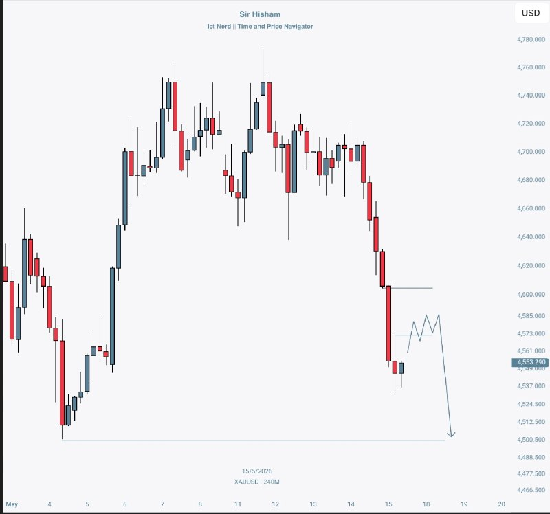

$XAUUSD H4 outlook Bullish narrative.

## sirhishamtradinghub — post 3690

  

Most traders think scaling is about better strategy, but it’s really about capital limits affecting execution. Small accounts often underuse even strong strategies.

@GoatFunded 40% discount is an efficiency boost that making it cheaper to access larger capital so your strategy can perform closer to its true potential and Growth.

Use code ‘’BOGO40’’ to claim the offer.

Sign up here : checkout.goatfundedtrader.com/aff/Sirhisham/

## khabarpro — post 1191

IP✅متصل

23.58.222.136
23.73.2.148
92.122.166.175
172.237.127.6
104.81.104.13
96.17.207.137
92.123.112.7
96.16.122.75
96.17.207.142
96.17.207.143
92.122.166.182
104.109.128.153
104.96.143.134
23.73.2.141
104.83.5.202
23.67.136.200
23.67.136.202
23.65.119.52
96.16.122.70
92.122.166.236
92.122.166.234
92.122.166.237
104.110.138.190
173.222.200.5
184.51.252.36
184.51.252.38
104.83.5.208
96.16.122.146
96.17.206.214
92.122.166.197
104.94.100.73
104.83.15.66
88.221.213.81
172.239.57.117
104.117.76.40
184.51.252.4
96.17.207.30
96.16.122.83
96.16.122.150
23.73.207.11
96.16.122.77
96.17.207.155
92.123.189.82
96.16.122.82
96.16.122.66
96.7.218.219
96.16.122.137
184.51.252.157
92.123.189.41
184.86.251.12
96.16.122.154
96.16.122.157
184.51.252.152
96.17.207.12
23.79.48.162
96.16.122.74
104.109.250.232
92.123.104.7
104.110.191.57
184.51.233.146
173.222.201.77
96.16.53.134
96.16.122.140
184.51.252.135
172.234.24.211
96.16.122.149
104.122.213.129
104.103.72.97
104.103.65.5
104.83.5.210
104.117.76.152
104.83.5.176
184.86.251.26
96.16.122.133
96.16.53.152
96.16.53.147
96.16.122.152
104.126.37.162
23.73.0.64
96.16.122.141
104.117.76.10
96.16.53.158
92.123.157.46
104.81.175.248

@khabarpro

## Pvpn_Ez — post 121

سلام.
فروش و تمدید سرویس روزانه تا اطلاع بعدی بسته‌است.
از واریز خودداری کنید.

## TheVPNMethod — post 722

— لوکیشن اتصال (Select server region) در شیر و خورشید رو بذارید روی United Kingdom سریع‌تر متصل میشه و سرعت بهتره. — لیست جدید آیپی تست شده، وصل! — برای متود CDN—Fronting! 2.22.21.152 95.101.23.82 23.215.0.164 23.197.161.35 184.28.230.87 23.220.128.221 96.17.207.142…

## TheVPNMethod — post 721

نت‌بلاکس: در پی تداوم قطع اینترنت در ایران، بخش زیادی از مردم از ارتباطات آنلاین و تعامل با جهان محروم شده‌اند و نگرانی‌ها درباره پیامدهای روانی و سلامت‌روان افزایش یافته است.

— نت‌بلاکس نمیدونه تو ایران سلامت‌روان شوخی‌ای بیش‌ نیست!

## TheVPNMethod — post 720

— آموزش متود جدید CDN—Fronting! دانلود آموزش ویدئویی + آپدیت برنامه شیر و خورشید با لینک داخلی: https://uploadkon.ir/uploads/f35115_26CDN—GUID.zip ZIP Password: @TheVPNMethod لیست آیپی های تمیز: 23.221.28.5 23.44.201.206 23.220.163.205 23.209.46.33 23.10.34.11…

## TheVPNMethod — post 719

یه چیزی امروز متوجه شدم، از امروز صبح وقتی با دیتای موبایل آیپی اسکن می‌کنید یا حتی وقتی آیپی‌های زیادی وارد شیر و خورشید می‌کنید و شیر و خورشید اسکن میکنه و دنبال اتصال می‌گرده اپراتور شبکه می‌فهمه و آیپی شمارو بلاک می‌کنه! وقتی این اتفاق بیوفته بعدش شما حتی به اینترنت ملی هم نمی‌تونید وصل بشید! باید چند بار حالت پرواز بزنید تا آیپی‌تون عوض بشه تا دوباره ارتباط برقرار بشه. به‌نظرم با اینترنت موبایل نه از طریق ترموکس نه هیچ روش دیگه ای اسکن نکنید. فقط با وای‌فای و ویندوز انجام بدید.
— @TheVPNMethod

## TheVPNMethod — post 718

  <a href="https://t.me/TheVPNMethod/718" target="_blank">📎 Download file</a>

آموزش ساده اسکن آیپی‌های تمیز
بصورت PDF + فایل‌ها و برنامه‌های لازم.
دانلود کامل ZIP با لینک داخلی:
https://uploadkon.ir/uploads/fb0515_26Scan–IP–GUID.zip
ZIP Password: @TheVPNMethod
— @TheVPNMethod

## TheVPNMethod — post 717

الان آموزش کامل اسکنر رو میزارم. ویندوز!

## TheVPNMethod — post 716

انقدر که دیروز پست گذاشتم آموزش گرفتم ادیت کردم و...، از دیشب انگشت شصتم همینجوری مدام عصبش داره تیک میزنه :)

## ggtech93 — post 749

  <a href="https://t.me/ggtech93/749" target="_blank">📎 Download file</a>

📎 Document

## ggtech93 — post 748

  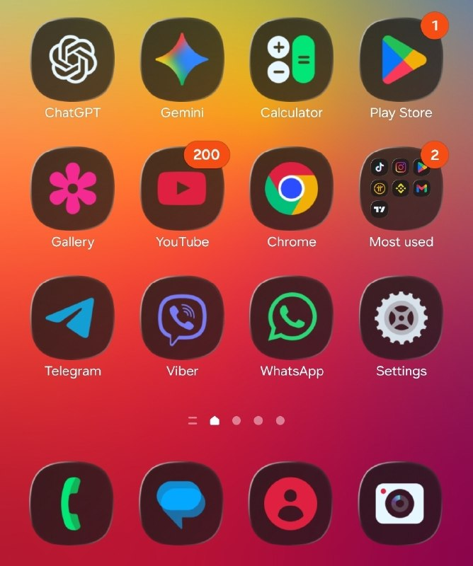

Glassify Color icon pack
Over 28,000 icons.
Get it here ❤️⬇️

## DigiGozar — post 9228

جمنای هم از این به بعد به راحتی بالا میاد
🤖
✅

## DigiGozar — post 9227

بات بازه میتونید خریدتون رو انجام بدید.

✅
شماره کارت به مدت ۱۰ دقیقه توسط خود بات نشون داده میشه
سرعتمون هم بسیار رفته بالا
🚀

🤖> @DigiGozarVPNBot

## DigiGozar — post 9226

ثابتی: وزیر ارتباطات اسامی فیلترشکن فروش‌ها را اعلام کند باید برای مدیریت درست فضای مجازی دست از روش فعلی و افراط و تفریط برداریم ضمن اینکه بارها از وزیر ارتباطات خواسته‌ایم تا اسامی فیلترشکن فروش‌ها را اعلام کند اما هنوز پاسخی نشنیده‌ایم

## DigiGozar — post 9225

ثابتی: وزیر ارتباطات اسامی فیلترشکن فروش‌ها را اعلام کند
باید برای مدیریت درست فضای مجازی دست از روش فعلی و افراط و تفریط برداریم ضمن اینکه بارها از وزیر ارتباطات خواسته‌ایم تا اسامی فیلترشکن فروش‌ها را اعلام کند اما هنوز پاسخی نشنیده‌ایم

## DigiGozar — post 9224

گپ جوین باشید

https://t.me/DigiGozarGP

## DigiGozar — post 9222

سرعتمون برگشته🔥

شرمنده ایم بابت قطعی های پیش امده🙏

## DigiGozar — post 9221

  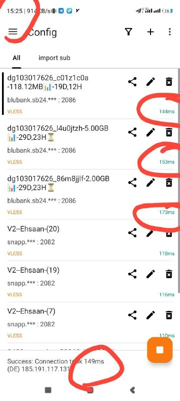

📷 Photo

## DigiGozar — post 9218

  <a href="telegram/content/DigiGozar_9218_1778862758.mp4" target="_blank">🎬 Download video</a>

سرعت برگشت بعد تلاش های فراوان😂🌹 عشق کنید مارم دعا کنید😂❤️ بات بازه میتونید خرید بزنید @DigiGozarVPNBot

## DigiGozar — post 9217

سرعت برگشت بعد تلاش های فراوان😂🌹
عشق کنید مارم دعا کنید😂❤️

بات بازه میتونید خرید بزنید
@DigiGozarVPNBot

## MatinSenPaii — post 3072

  <a href="telegram/content/MatinSenPaii_3072_1778862759.mp4" target="_blank">🎬 Download video</a>

🍷
دور زدن فیلترینگ با کانفیگ سرورلس با ترکیب nekobox و v2rayng

• 
✅ لینک کانفیگ nekobox
• https://pastebin.com/raw/rWeHKSt3
• 
✅ لینک داخلی کانفیگ nekobox
• https://seup.shop/t/exks1

• 
✅ لینک کانفیگ V2rayNg
• https://pastebin.com/raw/Yfymhyy5
• 
✅ لینک داخلی کانفیگ‌ V2rayNg
• https://seup.shop/t/k9mmj

❗️ هر دو کلاینت رو، رو حالتvpnبزارید .

📥 لینک داخلی ویدیوها
• 🎥 https://seup.shop/f/uns5
• 🎥 https://seup.shop/f/v4jx
• 𝕏 Irvictorious kian
• @ConfigWireguard 
💎
• @xsfilterrnet 
👑

## MatinSenPaii — post 3071

  

Kharabam:
‏این دوتا هنوز وایت لیست هستن، چک کنید ببینید میتونید باهاشون وصل بشید یا نه.

sophos . com > 185.200.232.27, 185.200.232.16 > Akamai
www . mathworks . com > 2.23.169.12 > Akamai
برای mathworks حتما www بذارید.

## MatinSenPaii — post 3070

  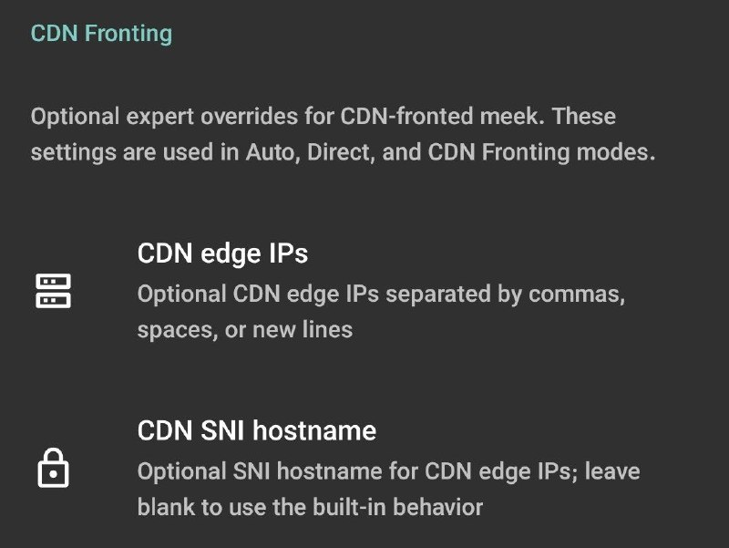

یکی از دوستان توییتر روی ایرانسل با این دوتا روی شیر و خورشید وصله کاملا اوکی:
CDN Edge IPs: 151.101.192.223
CDN SNI Hostname: python.org‎
توی همون قسمت More Options هستش

## MatinSenPaii — post 3069

  <a href="https://t.me/MatinSenPaii/3069" target="_blank">📎 Download file</a>

سرور رایگان

## MatinSenPaii — post 3068

  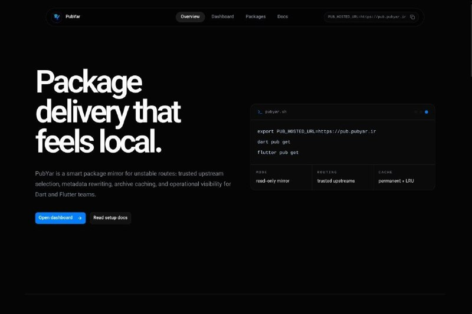

دانلود راحت‌تر پکیج‌های Dart و Flutter

وقتی "pub.dev" کند یا ناپایدار می‌شه، PubYar کمک می‌کنه پکیج‌ها سریع‌تر و مطمئن‌تر دانلود بشن.

پاب‌یار فقط یک mirror ساده نیست،
مسیرها و DNSهای مختلف رو بررسی می‌کنه و بهترین راه دانلود رو برای "flutter pub get" انتخاب می‌کنه.

مناسب توسعه‌دهنده‌های Flutter و Dart

PubYar.ir

## archivetell — post 4989

آیپی تمیز شیر و خورشید همراه اول

23.54.210.170
23.44.201.206
23.220.163.205
23.209.46.33
23.10.34.11
23.39.185.35
23.32.152.106
23.218.232.181
23.206.188.212
2.21.2.89
23.208.222.120
23.48.203.248
23.44.201.136
23.44.201.151
23.44.201.149
2.21.2.58
23.3.90.48
23.44.201.41
2.19.204.184
23.218.232.188
23.44.201.12
23.212.253.227
23.201.31.155
23.220.163.203
23.44.201.185
23.52.116.66
23.44.201.17
23.62.54.24
23.218.239.132
23.39.149.69
23.52.40.147
23.58.95.144
2.16.244.58
23.212.253.137
2.17.106.176
23.62.54.137
2.17.106.5
23.203.134.233
23.212.253.232
23.206.188.197
23.44.201.170
23.54.127.39
23.214.170.83
23.52.40.89
23.55.176.73
23.202.229.140
23.215.56.61
2.17.106.166
23.222.126.108
184.25.85.224
23.1.241.123
23.3.90.43

## archivetell — post 4988

  <a href="https://t.me/archivetell/4988" target="_blank">📎 Download file</a>

500 تا آیپی اسکن شده توسط یکی از ممبرای عزیز برای شیر خورشید

همه نتا

## archivetell — post 4987

خودتون آیپی اسکن کنید با این روش ها..

## archivetell — post 4986

اسکنر برای آی پی تمیز https://github.com/seramo/sni-scanner

## archivetell — post 4985

اسکنر برای آی پی تمیز
https://github.com/seramo/sni-scanner

## archivetell — post 4984

  <a href="https://t.me/archivetell/4984" target="_blank">📎 Download file</a>

اینا هم اسکن کنید..

## archivetell — post 4982

  <a href="https://t.me/archivetell/4982" target="_blank">📎 Download file</a>

رنج آیپی akamai واسه اسکن

## archivetell — post 4981

  <a href="https://t.me/archivetell/4981" target="_blank">📎 Download file</a>

اسکنر TCP رنج ایپی های Akamai
فایل hosts.txt رو کنارش بذارید و روی هر سیستم عاملی با پایتون اجراش کنید (ورودی ایپی تکی و ایپی رنج ساپورت میکنه)
- قابلیت تشخیص NAT از اتصال واقعی بر اساس پینگ
- سرعت ورکر رو میشه تنظیم کرد
- قابلیت بهینه سازی تایم اسکن
- خروجی رو توی فایل vali.txt میده.
بدون پیش نیاز...

## archivetell — post 4980

  <a href="https://t.me/archivetell/4980" target="_blank">📎 Download file</a>

🔹سورس اسکنر اختصاصی تیم پرشیا ❤️

🟢این سورس اسکنر sni و Cdn هست و با بهترین قابلیت ها نوشته شده است☑️

💡اموزش نصب در کامپیوتر:

🔹اول فایل را دانلود کرده سپس استخراج کنید
🔹سپس رو محل فایل کلیک کرده ترمینال را باز کرده و در ان این دستور را بنویسید:

pip install -r requirements.txt

🔹سپس این دستور را بنویسید:

python sni_web.py

🔹بعدش صفحه باز میشه و میتونید اسکن را شروع کنید

🟢🟢🟢🟢🟢🟢🟢🟢🟢🟢🟢🟢
⏺️اموزش نصب در گوشی با برنامه termux

🔹اول وارد برنامه ترموکس شده و پکیچ های پایتون نصب کنید
🔹سپس دستور زیر را وارد کنید

git clone https://github.com/DevMoEiN/SNI-Radar.git

🔹سپس این دستور:

cd SNI-Radar

🟢بعد این:

pip install flask

🔹و در اخر این:

python sni_web.py

⏺️سپس این را در کروم تایپ کنید:
http://127.0.0.1:10808

## archivetell — post 4979

📌نحوه اسکن آیپی‌‌های Akamai در ترموکس :

1⃣به یک فیلترشکن متصل بشید و ​ترموکس را باز کنید و این ۳ خط را کپی کنید و اینتر بزنید تا ابزارهای لازم نصب بشن :
pkg update && pkg upgrade -y
pkg install nmap -y
termux-setup-storage

اگر پیغامی برای دسترسی به فایل‌ها اومد، Allow را بزنید.

2⃣​حالا فیلترشکن رو خاموش کنید و دستور زیر رو بزنید :

nmap -p 443 --open -T4 2.16.0.0/1
8

‼️من در دستور از رنج آیپی 2.16.0.0/18  استفاده کردم و 4 آیپی وایتی که اسکن کرد رو براتون گذاشتم، شما میتونید اون رنج‌ رو پاک کنید و از این مخزن گیت‌هاب، سایر رنج‌ها رو در دستور جایگذاری کنید :
https://github.com/platformbuilds/Akamai-ASN-and-IPs-List

بعد از پایان اسکن، ​هر جا نوشته بود Nmap scan report for و زیرش نوشته بود 443/tcp open یعنی اون آیپی‌ وایته و باید کپیش کنید
.

بهتره رنج‌های کوچک رو اسکن کنید، اسکن رنج‌آیپی‌های بزرگ، ساعت‌ها زمان میبره

## archivetell — post 4978

جهت اسکن آیپی های fastly یا akami یا هر آیپی / رنجی که میخواین میتونید از ریپوی زیر استفاده کنید
https://github.com/penhandev/IP-Scanner

## archivetell — post 4977

  <a href="https://t.me/archivetell/4977" target="_blank">📎 Download file</a>

اسکنر آیپی

قابلیت هاش:
1. چک کردن ایپی معمولی
2. چک کردن رنج ایپی Fastly و Akamai
3. بصورت دستی اضافه کردن ایپی یا رنج
4. بصورت فایل اضافه کردن .txt و .json
5. ماکسیموم پینگ گذاشتن واسش مثلا زیر 180ms
6. ایپی های که داخل چنلا میزارن بندازید توش اسکن کنه

منبع : پای پکیج

## archivetell — post 4976

  <a href="https://t.me/archivetell/4976" target="_blank">📎 Download file</a>

برنامه Akamai IP Scanner

۱. لیست رنج‌های هدف (با پشتیبانی از تمام فرمت‌ها مثل 16/ یا 24/) را در فایل ips.txt قرار دهید. (پیشفرض قرار داده شده)

۲. روی فایل scan.ps1 راست‌کلیک کرده و گزینه Run with PowerShell را برای شروع اسکن انتخاب کنید.

۳. بهترین آی‌پی‌ها به‌صورت لحظه‌ای در clean_ips.txt ذخیره می‌شوند (هر زمان مایل بودید می‌توانید اسکن را متوقف کنید).

## archivetell — post 4974

آپلودسنتر

https://files.bokhary.fun/dump/

@ArchiveTell

## archivetell — post 4973

لینک داخلی شیر و خورشید ، دو تا آپلودسنتر

دانلود

دانلود

@ArchiveTell

## archivetell — post 4969

Telegram.apk

## archivetell — post 4968

آیپی تمیز شیر و خورشید

2.21.134.89
2.19.204.217
96.16.122.149
172.237.127.6
96.16.53.158
23.55.163.135
2.19.205.64
23.73.2.148
2.17.147.11
2.19.204.240
184.51.252.36

## archivetell — post 4967

ایرانسل تست شده شیر و خورشید

185.200.232.49
185.200.232.50
185.200.232.42
185.200.232.41
184.24.77.42
184.24.77.32
184.24.77.5
184.24.77.7
184.24.77.16
184.24.77.36
184.24.77.21
184.24.77.11
23.48.23.186
23.48.23.133
23.48.23.195
23.48.23.178
184.24.77.29
2.22.21.152
95.101.23.82
23.215.0.164
23.197.161.35
184.28.230.87
23.220.128.221
96.17.207.142
23.50.131.18
23.36.162.209
23.219.3.212
23.223.245.150
96.16.122.59
23.2.13.138
23.2.13.144
96.17.207.135
23.220.113.51
96.17.72.41
23.203.185.105
95.101.35.83
2.21.239.23
23.54.210.170
23.215.60.73
95.101.181.125
23.192.237.222
23.200.143.71
23.58.222.98
125.56.219.8
104.80.49.118
96.16.122.158
2.21.239.10
96.16.122.65
95.101.23.170
104.111.202.158
23.2.13.201
92.123.102.104
23.58.222.139
2.17.147.89
96.17.178.132
23.49.248.6
23.222.30.64
23.55.110.70
23.2.13.153
173.222.105.65
23.200.143.73
23.201.217.14
23.55.110.200
95.101.23.25
23.37.206.186
173.222.105.42
95.101.29.12
88.221.92.177
23.50.131.132
184.86.251.27
2.16.244.11
2.16.27.71
2.19.10.30
104.121.12.86
23.73.207.16
2.18.190.26
96.16.122.149
23.201.217.150
95.101.23.168
96.17.207.162
96.16.122.48
95.101.35.73
23.192.237.208
80.67.82.179
96.17.207.154
2.21.89.66
2.18.190.27
95.100.156.147
23.192.46.51
104.76.220.137
23.36.162.198
23.37.197.128
96.17.207.143
23.36.162.208
23.36.162.202
23.200.143.88
23.55.110.46
23.55.110.143
173.222.105.18
2.23.176.166
23.44.10.10
104.126.37.171
23.55.155.169
23.210.123.174
104.117.76.26
23.46.188.168
23.58.222.147
95.101.200.63
125.56.219.32
23.192.237.209
95.101.29.54
23.46.230.118
96.17.207.153
184.25.52.200
23.202.156.203
23.36.162.196
96.16.122.145
23.33.126.163
95.101.29.30
23.36.162.215
23.39.249.249
2.21.239.29
23.210.73.136
104.126.37.161
23.2.13.186
23.50.131.160
23.219.138.200
96.16.122.153
104.117.76.146
23.38.49.97
2.19.196.105
96.16.122.141
104.78.170.186
96.17.222.31
23.41.37.129
23.2.13.227
23.222.126.108
2.20.255.113
2.17.251.98
23.2.13.152
95.101.23.27
2.21.239.21
23.211.49.252
88.221.168.5
104.103.90.156
23.79.20.249
88.221.132.162
23.59.235.208
23.60.69.118
23.46.188.71
104.122.212.92
23.219.1.4
23.57.43.195
184.51.252.135
2.22.6.68
23.217.11.56
95.100.69.108
185.200.232.49
185.200.232.50
185.200.232.42
185.200.232.41
184.24.77.42
184.24.77.32
184.24.77.5
184.24.77.7
184.24.77.16
184.24.77.36
184.24.77.21
184.24.77.11
23.48.23.186
23.48.23.133
23.48.23.195
23.48.23.178
184.24.77.29
23.40.63.69

## archivetell — post 4966

  <a href="https://t.me/archivetell/4966" target="_blank">📎 Download file</a>

12.7.3 (6750)

Directly downloadable from telegram.org/android

## networkti — post 356

⚠️ مراقب تبلیغاتی که بقیه توی کانال من میذارن باشید

تلگرام اجازه خاموش کردن تبلیغات رو نمیده و هر کسی با کمی پول میتونه توی کانال تبلیغ کنه

معمولا تبلیغات فیلترشکن کلاهبرداریه و باید مراقب باشید

📍 شکل تبلیغات اینجوریه که مثل یک پست هست ولی یکم رنگش فرق داره و کنارش نوشته Ad

## networkti — post 355

اخبار این روش شیر و خورشید و اسکنرش و بقیه چیزهاشو میتونید از کانال متین سنپای و چندتا کانال دیگه که توی کانفیگ‌ فیلترشکن دفید هم هستند چک کنید

من نمیرسم دیگه ای پی پیدا کنم واسش

## networkti — post 352

95.101.137.74 95.101.78.25 2.23.245.35 2.16.168.107 2.17.100.250 2.16.245.188 2.17.100.130 95.100.110.28 2.22.89.43 2.18.63.33 95.100.153.186 2.22.151.140 95.100.177.68 95.101.61.215 95.101.27.71 2.23.227.218 2.23.227.209 2.23.227.221 2.17.100.218 2.17.97.198 95.101.27.101 2.17.240.5 2.16.106.222 95.101.234.87 2.21.33.113 23.194.20.27 95.101.38.176 95.101.35.113 2.17.100.225 2.16.168.214 2.17.113.121 2.23.227.212 2.23.227.219 23.212.110.218 95.101.35.96 2.17.96.158 2.16.168.208 2.16.245.174 2.16.245.173 23.192.237.219 2.17.152.213 2.17.100.200 2.22.112.208 2.23.172.114 2.23.227.199 2.23.227.215 2.21.134.89 2.17.100.136 2.23.90.148 95.101.111.168 23.219.79.75 2.16.168.122 2.16.168.123 95.100.177.112 23.192.24.7 23.12.157.106 2.16.245.133 23.52.22.3 2.17.147.218 23.216.134.80 23.55.163.135 23.46.188.71 2.17.100.169 95.101.234.88 2.22.151.152 2.17.241.119 95.101.122.131 95.101.111.161 2.21.245.14 2.18.172.59 95.101.234.90 23.11.41.157 95.101.38.158

## networkti — post 350

اگر شیر و خورشید وصل نمی‌شود، طبق راهنمای زیر عمل کنید. وارد بخش Options اپلیکیشن 
👑 شوید، گزینه‌ی More Options را انتخاب کنید و در قسمت CDN Edge IPs، آی‌پی زیر و در قسمت CDN SNI Hostname، نام دامنه زیر را وارد کرده و OK را بزنید. CDN Edge IPs: 151.101.192.223…

---
📅 بروزرسانی: 1405/02/25 13:34
---

## vpn_xvpn_ch — post 406

شماره کامنت هایی که برنده شدن 😉

## saministamm — post 62881

تست کنید وصله :

84.26.13.91
23.54.210.170
23.44.201.206
23.220.163.205
23.209.46.33
23.10.34.11
23.39.185.35
23.32.152.106
23.218.232.181
23.206.188.212
2.21.2.89
23.208.222.120
23.48.203.248
23.44.201.136
23.44.201.151
23.44.201.149
2.21.2.58
23.3.90.48
23.44.201.41
2.19.204.184
23.218.232.188
23.44.201.12
23.212.253.227
23.201.31.155
23.220.163.203
23.44.201.185
23.52.116.66
23.44.201.17
23.62.54.24
23.218.239.132
23.39.149.69
23.52.40.147
23.58.95.144
2.16.244.58
23.212.253.137
2.17.106.176
23.62.54.137
2.17.106.5
23.203.134.233
23.212.253.232
23.206.188.197
23.44.201.170
23.54.127.39
23.214.170.83
23.52.40.89
23.55.176.73
23.202.229.140
23.215.56.61
2.17.106.166
23.222.126.108
184.25.85.224
23.1.241.123
23.3.90.43

## saministamm — post 62880

آی‌پی هات خیلی خوبه خدا خیرت بده

## saministamm — post 62879

جدید:

CDN Edge IPs: 167.82.48.223

CDN SNI Hostname: goojehbadenjoon.kashk

@saministamm

## saministamm — post 62878

آموزش اتصال : 1- از قسمت Options وارد More Options بشید 2- گزینه ی Beast Mode حتما فعال باشه 3- گام بعدی از قسمت Connection Protocol گزینه ی CDN Fronting رو انتخاب کنید و بعد وارد صفحه ی اصلی بشید و Start رو بزنید کمی منتظر بمونید متصل میشه✅ توجه: اگر…

## saministamm — post 62877

سلام من تازه نصب کردم بلد نیستم وصل شم میشه شات بدی بهم چکار باید بکنم؟

## saministamm — post 62876

اینو با همراه اول ما تست کردیم وصله شما هم با هر نتی هستید وصل کنید.

104.88.70.105 92.123.10.153 96.16.248.152 104.83.197.160 96.16.248.133 96.16.249.54 96.16.248.162 173.222.249.155 184.87.193.138 96.6.34.243 96.17.96.7 96.16.248.137 104.110.191.32 184.51.97.129 104.116.98.32 184.87.193.139 184.84.221.34 96.16.248.139 96.16.249.52 88.221.0.39 96.16.249.28 96.16.248.142 96.17.72.48 104.117.76.106 104.109.128.163 96.17.72.51 96.17.72.75 104.109.250.11 104.115.39.202 96.16.249.38 184.85.134.164 104.76.210.6 104.117.76.16 104.117.76.8 184.84.81.125 23.66.101.71 96.16.248.177 92.123.10.217 184.85.155.41 88.221.0.52 173.222.146.221 184.51.102.248 96.17.72.80 96.17.72.58 173.222.249.146 104.115.39.104 96.17.72.57 173.222.249.153 173.222.108.57 96.17.72.10 23.67.142.129 173.222.108.49 88.221.0.58 96.16.248.182 104.110.191.39 104.110.191.41 96.16.248.159 96.16.248.156 96.16.248.153 104.110.191.14 88.221.0.38 88.221.0.44 104.108.86.50 96.7.105.201 96.16.248.166 173.222.249.160 96.16.248.183 88.221.0.56 184.51.102.88 96.16.249.23 88.221.0.50 104.68.103.205 96.16.248.170 104.116.96.159 96.16.249.20
88.221.0.36
96.17.180.45
96.16.249.11
96.16.248.181 104.83.197.135 173.222.108.120
23.64.59.9
92.122.16.5
104.120.56.96 104.117.76.147 92.123.10.232 184.86.103.159 104.117.76.137 104.117.76.145 104.117.76.139 104.117.76.114
104.69.81.4
104.117.76.104 104.117.76.99 104.117.76.179 104.117.76.153 104.120.90.56 104.117.76.90 104.117.76.91
96.6.33.250
104.117.76.67 104.117.76.72 104.117.76.64 104.117.76.57 104.117.76.58 104.117.76.19 184.86.103.20 184.86.103.12 184.86.103.23 184.86.103.14 184.86.103.19 173.223.109.20
96.17.96.31
104.76.220.65 173.222.148.49
184.51.96.7
104.76.220.42 184.51.149.33 104.108.238.182 104.80.48.203
92.122.17.9
92.123.8.93
104.76.210.216 104.76.220.112 23.64.224.224 173.222.168.212 173.222.168.191 92.123.8.87
92.123.10.140 184.51.102.58 184.51.102.177 104.76.220.170 104.76.220.168 92.122.6.109
173.223.29.67
92.123.8.100
23.65.117.219 173.222.148.43
23.75.23.33
184.86.103.223 184.86.103.217 184.86.103.196 23.67.129.53 184.86.103.139 184.86.103.142 104.108.237.97 184.86.103.13 104.112.135.94
23.64.59.26
92.122.9.160 104.120.80.245 173.223.239.52 92.122.1.249 173.222.116.88 96.16.249.50
96.16.249.3
96.16.249.60
96.16.248.151 96.16.248.145 96.16.248.148 96.16.248.176 96.16.248.136 96.16.248.154 96.16.248.143
92.123.8.77 104.124.165.104 96.16.249.12
96.16.248.155 96.16.248.179 96.16.248.171 96.16.248.147 96.16.248.144
23.65.124.89
96.16.249.9
23.65.124.88
96.16.249.16
96.16.249.6
96.16.248.174 96.16.248.167 96.16.248.164
92.123.8.99
92.123.8.94
23.65.124.104
92.123.8.74
23.65.124.91
23.65.124.106 23.65.124.105 104.108.231.170 23.66.101.79 184.85.137.131 104.120.82.77 104.120.77.233 23.64.12.168
104.120.89.53
104.120.76.148

@saministamm 
🚀

## saministamm — post 62874

96.16.122.75
96.17.207.142
96.17.207.143
92.122.166.182
104.109.128.153
104.96.143.134
23.73.2.141
104.83.5.202
23.67.136.200
23.67.136.202
23.65.119.52
96.16.122.70
92.122.166.236
92.122.166.234
92.122.166.237
104.110.138.190
173.222.200.5
184.51.252.36
184.51.252.38
2.23.227.196
2.17.147.11
2.18.64.9
2.18.64.4
2.18.64.5
2.22.114.98
95.100.153.184
95.101.27.196
2.17.96.131
95.101.137.74
95.101.78.25
2.23.245.35
2.16.168.107
2.17.100.250
2.16.245.188
2.17.100.130
95.100.110.28
2.22.89.43
2.18.63.33
95.100.153.186
2.22.151.140
95.100.177.68
95.101.61.215
95.101.27.71
2.23.227.218
2.23.227.209
2.23.227.221
2.17.100.218
2.17.97.198
95.101.27.101
2.17.240.5
2.16.106.222
95.101.234.87
2.21.33.113
23.194.20.27
95.101.38.176
95.101.35.113
2.17.100.225
2.16.168.214
2.17.113.121
2.23.227.212
2.23.227.219
23.212.110.218
95.101.35.96
2.17.96.158
2.16.168.208
2.16.245.174
2.16.245.173
23.192.237.219
2.17.152.213
2.17.100.200
2.22.112.208
2.23.172.114
2.23.227.199
2.23.227.215
2.21.134.89
2.17.100.136
2.23.90.148
95.101.111.168
23.219.79.75
2.16.168.122
2.16.168.123
95.100.177.112
23.192.24.7
23.12.157.106
2.16.245.133
23.52.22.3
2.17.147.218
23.216.134.80
23.55.163.135
23.46.188.71
2.17.100.169
95.101.234.88
2.22.151.152
2.17.241.119
95.101.122.131
95.101.111.161
2.21.245.14
2.18.172.59
95.101.234.90
23.11.41.157
95.101.38.158
2.16.164.34
2.16.164.89
23.73.2.148
92.122.166.175
172.237.127.6
104.81.104.13
96.17.207.137
92.123.112.7
104.83.5.208
96.16.122.146
96.17.206.214
92.122.166.197
104.94.100.73
104.83.15.66
88.221.213.81
172.239.57.117
104.117.76.40
184.51.252.4
96.17.207.30
96.16.122.83
96.16.122.150
23.73.207.11
96.16.122.77
96.17.207.155
92.123.189.82
96.16.122.82
96.16.122.66
96.7.218.219
96.16.122.137
184.51.252.157
92.123.189.41
184.86.251.12
96.16.122.154
96.16.122.157
184.51.252.152
96.17.207.12
23.79.48.162
96.16.122.74
104.109.250.232
92.123.104.7
104.110.191.57
184.51.233.146
173.222.201.77
96.16.53.134
96.16.122.140
184.51.252.135
172.234.24.211
96.16.122.149
104.122.213.129
104.103.72.97
104.103.65.5
104.83.5.210
104.117.76.152
104.83.5.176
184.86.251.26
96.16.122.133
96.16.53.152
96.16.53.147
96.16.122.152
104.126.37.162
23.73.0.64
96.16.122.141
104.117.76.10
96.16.53.158
92.123.157.46
104.81.175.248

ایپی های CDN جدید برای شیر و خورشید 
☀️

تست شده با ایرانسل 
✅

@saministamm 
✉️

## saministamm — post 62873

یه ترکیبی هم میزارم برای اونایی که شیر و خورشید واسشون وصل نمیشه.

vless://bbc68258-173b-4f0f-b126-f7aac6bb2db3@adler-1g.adelshoop.net:80?security=none&allowInsecure=0&encryption=none&type=ws&path=/#t.me/saministamm💎

## saministamm — post 62872

آیپی جدید : 185.200.232.40 185.200.232.43

## saministamm — post 62871

2.19.205.40
2.19.204.19
2.19.204.87
2.19.204.137
2.19.204.144
2.19.204.145
2.19.204.170
2.19.204.184
2.19.204.185
2.19.204.202
2.19.204.210
2.19.204.211
2.19.204.217
2.19.204.218
2.19.204.225
2.19.204.232
2.19.204.234
2.19.204.240
2.19.204.249
2.19.204.250
2.19.204.251
2.19.205.8
2.19.205.9
2.19.205.11
2.19.205.27
2.19.205.33
2.19.205.34
2.19.205.40
2.19.205.41
2.19.205.42
2.19.205.49
2.19.205.50
2.19.205.58
2.19.205.59
2.19.205.64
2.19.205.65
2.19.205.82
2.19.205.83
2.19.205.88
2.19.205.97
2.19.205.98
2.19.205.105
184.31.169.195
184.31.169.252
184.31.170.97
184.31.170.185
2.19.204.19
2.19.204.87
2.19.204.137
2.19.204.144
2.19.204.145
2.19.204.170
2.19.204.184
2.19.204.185
2.19.204.202
2.19.204.210
2.19.204.211
2.19.204.217
2.19.204.218
2.19.204.225
2.19.204.232
2.19.204.234
2.19.204.240
2.19.204.249
2.19.204.250
2.19.204.251
2.19.205.8
2.19.205.9
2.19.205.11
2.19.205.27
2.19.205.33
2.19.205.34
2.19.205.40
2.19.205.41
2.19.205.42
2.19.205.49
2.19.205.50
2.19.205.58
2.19.205.59
2.19.205.64
2.19.205.65
2.19.205.82
2.19.205.83
2.19.205.88
2.19.205.97
2.19.205.98
2.19.205.105
184.31.169.195
184.31.169.252
184.31.170.97
184.31.170.185

تست کنید همه نوع نت وصله 
✨

@saministamm 
🚀

## saministamm — post 62870

## saministamm — post 62869

همراه اول وصله مرسی

## saministamm — post 62868

  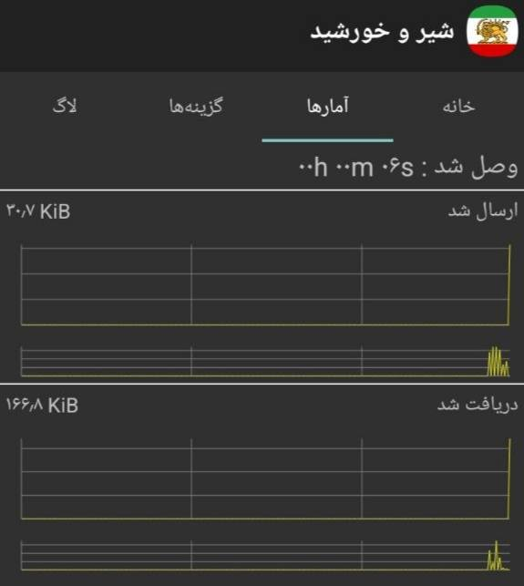

تست کنید جدیده : 151.101.0.223 151.101.128.223 151.101.192.223 65.109.34.234 151.101.64.223 142.54.178.211 2.16.53.50 2.16.53.11 95.101.133.82 95.101.133.42 104.103.65.50 2.23.168.47 104.103.64.7 2.23.168.254 2.23.168.144 2.23.169.249 2.23.169.42 2.23.170.80…

## saministamm — post 62867

تست کنید جدیده :

151.101.0.223
151.101.128.223
151.101.192.223
65.109.34.234
151.101.64.223
142.54.178.211
2.16.53.50
2.16.53.11
95.101.133.82
95.101.133.42
104.103.65.50
2.23.168.47
104.103.64.7
2.23.168.254
2.23.168.144
2.23.169.249
2.23.169.42
2.23.170.80
104.103.65.5
95.101.133.131
104.103.65.74
2.16.20.51
23.221.28.57
23.221.29.29
23.221.28.5
2.23.169.111
2.23.168.96
2.23.169.12
2.23.168.174
2.23.168.7
184.84.221.34
2.23.41.22
185.200.232.49
185.200.232.50
185.200.232.42
185.200.232.41
184.24.77.42
184.24.77.32
184.24.77.5
184.24.77.7
184.24.77.16
184.24.77.36
184.24.77.21
184.24.77.11
23.48.23.186
23.48.23.133
23.48.23.195
23.48.23.178
184.24.77.29

## saministamm — post 62862

اقا خدا خیرت بده خواب از چشام داره میباره دارم میمیرم از بی خوابی ولی این سه چار ساعته وصله نمیتونم از اینستا بیام بیرون 😂

## saministamm — post 62861

اقا خدا خیرت بده خواب از چشام داره میباره دارم میمیرم از بی خوابی ولی این سه چار ساعته وصله نمیتونم از اینستا بیام بیرون 😂

## saministamm — post 62860

آیپی جدید :
185.200.232.40
185.200.232.43

## saministamm — post 62859

⚡️لیست جدید آیپی برای شیر و خورشید

151.101.0.223
151.101.128.223
151.101.192.223
65.109.34.234
151.101.64.223
142.54.178.211
2.16.53.50
2.16.53.11
95.101.133.82
95.101.133.42
104.103.65.50
2.23.168.47
104.103.64.7
2.23.168.254
2.23.168.144
2.23.169.249
2.23.169.42
2.23.170.80
104.103.65.5
95.101.133.131
104.103.65.74
2.16.20.51
23.221.28.57
23.221.29.29
23.221.28.5
2.23.169.111
2.23.168.96
2.23.169.12
2.23.168.174
2.23.168.7
184.84.221.34
2.23.41.22
185.200.232.49
185.200.232.50
185.200.232.42
185.200.232.41
184.24.77.42
184.24.77.32
184.24.77.5
184.24.77.7
184.24.77.16
184.24.77.36
184.24.77.21
184.24.77.11
23.48.23.186
23.48.23.133
23.48.23.195
23.48.23.178
184.24.77.29

🔥 @saministamm

## saministamm — post 62857

تست کنید 185.200.232.49 185.200.232.50 185.200.232.42 185.200.232.41 184.24.77.42 184.24.77.32 184.24.77.5 184.24.77.7 184.24.77.16 184.24.77.36 184.24.77.21 184.24.77.11 23.48.23.186 23.48.23.133 23.48.23.195 23.48.23.178 184.24.77.29

## saministamm — post 62856

  

ما که باهاش اینستا هم رفتیم

## Skyportall — post 10708

منم با همراه وصلم بهشون

## Skyportall — post 10707

اره این جدیده که گذاشتی وصله
بوس

## Skyportall — post 10706

  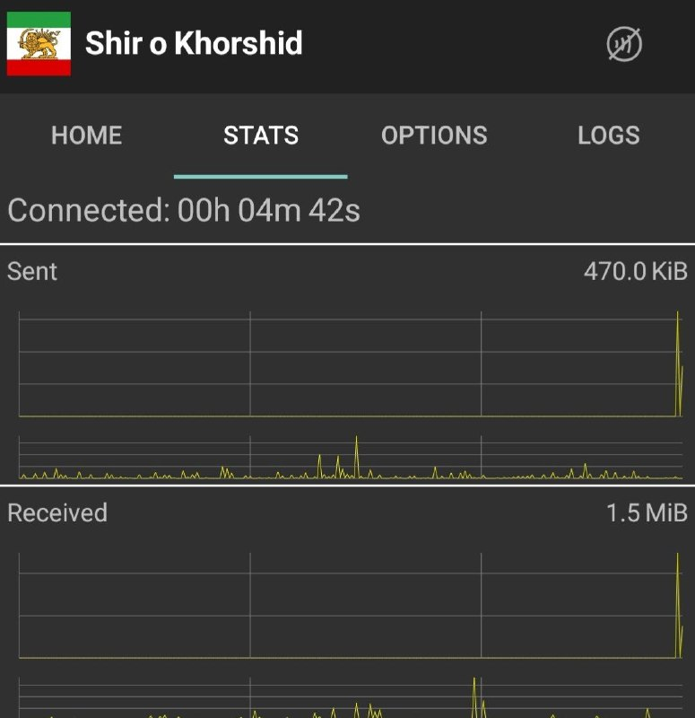

185.200.232.43 185.200.232.40 برای شیر و خورشید بزنید. همین الان زدم بعد ۲ ۳ دقیقه وصل شد. سرعت:متوسط @Skyportall

## Skyportall — post 10705

185.200.232.43 185.200.232.40 برای شیر و خورشید بزنید. همین الان زدم بعد ۲ ۳ دقیقه وصل شد. سرعت:متوسط @Skyportall

## Skyportall — post 10704

185.200.232.43
185.200.232.40

برای شیر و خورشید بزنید. همین الان زدم بعد ۲ ۳ دقیقه وصل شد.
سرعت:متوسط

@Skyportall

## Skyportall — post 10703

vless://538c7c92-9bb6-4294-8250-b224fb95fc78@2.144.21.44:443?path=%2Fcity%2Fsetting%3Fed%3D2560&security=tls&alpn=h2&encryption=none&insecure=0&host=roncomi.pages.dev&fp=chrome&type=ws&allowInsecure=0&sni=roncomi.pages.dev#Skyportall

ترکیبی هم بزنید حجمیه

## hamedvpns — post 18871

بفرما اینارو الان تست کردم و اوکی هستن ✅

الان نصف تلگرام پر میشه از این لیست 😁

2.23.168.47
2.23.168.254
2.23.169.42
2.23.168.250
185.200.232.17
2.23.170.80
185.200.232.67
185.200.232.19
185.200.232.9
185.200.232.26
185.200.232.40
185.200.232.43
2.23.168.174
2.23.169.207
185.200.232.59
185.200.232.65
185.200.232.32
185.200.232.34
2.23.168.96
2.23.169.105
185.200.232.25
185.200.232.42
185.200.232.58
185.200.232.49
185.200.232.11
185.200.232.66
2.23.169.12
185.200.232.8
2.23.168.213
185.200.232.56
185.200.232.16
185.200.232.50
185.200.232.57
185.200.232.41
2.23.168.7
185.200.232.27
185.200.232.64
185.200.232.24
2.23.169.111
2.23.168.144
2.23.169.249

برای خودم متصل نمیشن شاید برای شما متصل شد .

تست کنید لطفا

❤️ اشتراک گذاری یادتون نره 🌈

..
‌‌@hamedvpns ☑️

لایک   |   Like 👍❤️
اشتراک بزارین   |   Share ⭐️

## hamedvpns — post 18866

  <a href="https://t.me/hamedvpns/18866" target="_blank">📎 Download file</a>

سلام به همه دوستان نسخه جدید WhiteDNS آماده شد. ممنون از همه کسانی که نسخه‌های قبلی رو نصب کردند، تست گرفتند، لاگ فرستادند و با فیدبک‌هاشون کمک کردند مشکلات رو پیدا و برطرف کنیم 🙏 🤖 دانلود نسخه یونیورسال از سرور های داخلی 🔴 ویدیو آموزشی استفاده از اپلیکیشن…

## hamedvpns — post 18865

  

سلام به همه دوستان

نسخه جدید WhiteDNS آماده شد. ممنون از همه کسانی که نسخه‌های قبلی رو نصب کردند، تست گرفتند، لاگ فرستادند و با فیدبک‌هاشون کمک کردند مشکلات رو پیدا و برطرف کنیم 🙏

🤖 دانلود نسخه یونیورسال از سرور های داخلی

🔴 ویدیو آموزشی استفاده از اپلیکیشن
🔴 گروه اصلی شمامل تاپیک ریزالور، سوال های متداول، آموزش و ریزالور

تمرکز اصلی این نسخه روی ساده‌تر شدن اتصال و پیدا کردن بهترین تنظیم برای هر کاربر بوده است. هدف این بود که WhiteDNS قبل از اتصال، چند کانفیگ مختلف را با Parallel Test بررسی کند، بهترین گزینه را از نظر سرعت و کیفیت انتخاب کند، و کاربران بدون نیاز به گشتن دنبال Resolver، با لیست پیش‌فرض ۴۵۰۰+ Resolver داخل اپ سریع‌تر اسکن کنند و راحت‌تر وصل شوند.

تغییرات این نسخه:

✅ نسخه اپلیکیشن به 1.4.0 ارتقا پیدا کرده
✅ قابلیت Parallel Test برای تست هم‌زمان چند تنظیم مختلف قبل از اتصال اضافه شده
✅ حالا WhiteDNS می‌تواند قبل از اتصال، چند حالت اتصال را هم‌زمان بررسی کند
✅ اپ سرعت و Ping هر تنظیم را تست می‌کند و بهترین گزینه را برای همان اتصال انتخاب می‌کند
✅ قابلیت Parallel Test هم برای Proxy Mode و هم برای Full VPN قابل استفاده است
✅ در حالت Full VPN، اپ اول بهترین تنظیم را با Parallel Test پیدا می‌کند و بعد اتصال VPN نهایی را روشن می‌کند
✅ نتایج Parallel Test بعد از اتصال داخل صفحه اصلی نمایش داده می‌شود
✅ می‌توانید تنظیم موفق Parallel Test را با نام دلخواه ذخیره کنید
✅ چند تنظیم آماده WhiteDNS برای تست سریع اضافه شده
✅ می‌توانید پروفایل‌های تنظیمات پیشرفته خودتان را هم وارد Parallel Test کنید
✅ بیش از 4500 Resolver داخل اپ قرار گرفته تا برای اسکن و اتصال راحت‌تر استفاده شود
✅ لیست Resolver پیش‌فرض داخل اپ کامل‌تر شده
✅ پروفایل Default Resolver اضافه شده تا اپ همیشه یک لیست آماده Resolver داشته باشد
✅ امکان اسکن مستقیم لیست Resolver پیش‌فرض اضافه شده
✅ اسکن فایل‌های بزرگ Resolver سبک‌تر و بهتر انجام می‌شود
✅ ریزالورهای تکراری یا قبلاً پیدا‌شده بهتر کنار گذاشته می‌شوند
✅ شمارش Resolverهای سالم و ردشده در اسکن دقیق‌تر شده
✅ اگر پروفایل اسکن سرور یا کلید نداشته باشد، اپ واضح‌تر جلوی شروع اسکن را می‌گیرد
✅ ویرایش سرور، Resolver و تنظیمات از صفحه اصلی راحت‌تر شده
✅ امکان حذف پروفایل‌های اتصال تکراری اضافه شده
✅ پروفایل Default Resolver از حذف یا جابه‌جایی اشتباهی محافظت می‌شود
✅ هشدار باتری حالا قابل بستن است
✅ نمایش سرعت، مصرف اینترنت و آمار اتصال دقیق‌تر شده
✅ تنظیمات پیشرفته برای اتصال‌های کندتر و مسیرهای سنگین‌تر بهتر تنظیم شده
✅ وارد کردن و خروجی گرفتن فایل‌های TOML با گزینه‌های جدید کامل‌تر شده
✅ هسته داخلی StormDNS به‌روزرسانی شده

تنظیماتی که به صورت اتوماتیک انتخاب میشوند، تمرکز روی سرعت و کیفیت دارد. امکان افزایش مصرف اینترنت شما با کانفیگ انتخاب شده می‌باشد. اگر نگران این موضوع هستید تنظیمات را مرور کرده و مقدار Upload Dup را کمتر کنید.

⚠️⚠️⚠️⚠️⚠️

حجم کپی از کانال ما واقعاً باورنکردنیه؛ در حدی که آدم شک می‌کنه شاید ما ناخواسته برای بعضی دوستان واحد تولید محتوا راه انداختیم.

کمترین کاری که می‌تونید انجام بدید، انتشار همین پست یا حداقل ذکر منبع کانال ماست. باور کنید نوشتن منبع، اینترنت رو خراب نمی‌کنه و از اعتبار شما هم کم نمی‌کنه.

همراهان عزیز WhiteDNS،

اگر دیدید کانالی بدون ذکر منبع مطالب ما رو کپی کرده، لطفاً با احترام منبع اصلی رو بهشون یادآوری کنید. شاید فقط فراموش کردن؛ کپی‌کردن زیاد آدم رو خسته می‌کنه.

@WhiteDNS

## hamedvpns — post 18864

  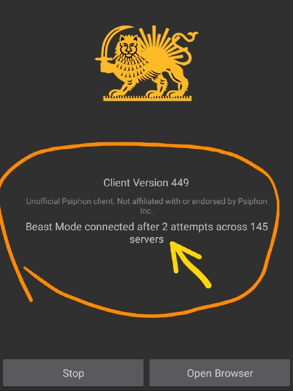

کی از من کمتر هست 😉😁

اسکرین بدین ببینم 😎

## hamedvpns — post 18863

سرور جدید WhiteDNS

Domain :
v.whitedns.space

Encryption Key :
bad99364093861634030e96f11fe3132

سرور خیلی پرقدرتی هست ، زاپاس داشته باشیم بهتره ، الان آی‌پی‌ها قطع شد زود میتونید با این سرور وصل بشین عالی هست .

منبع : @whitedns

❤️ اشتراک گذاری یادتون نره 🌈

..
‌‌@hamedvpns ☑️

لایک   |   Like 👍❤️
اشتراک بزارین   |   Share ⭐

## hamedvpns — post 18862

دو تا آیپی مخصوص تمامی نت ها

آموزش استفاده از این روش 👉

نیاز به sni host نیست

فقط آیپی ها رو بزنید کافیه 😎

185.200.232.43
185.200.232.40

بزنید شیر و خورشید حالشو ببرید ✅

❤️ اشتراک گذاری یادتون نره 🌈

..
‌‌@hamedvpns ☑️

لایک   |   Like 👍❤️
اشتراک بزارین   |   Share ⭐

## hamedvpns — post 18861

خب یکی ببینه از دیروز ب اینور درصد اتصال ب نت تو ایران چقدر شده 😂😂

هنوز آیپی ها پرقدرت متصل هستن .

## ConfigWireguard — post 31736

WhiteDns-Windows-Setup.exe

## ConfigWireguard — post 31735

نسخه ۱.۰.۲ 🔄 WhiteDns Windows آموزش خیلی مقدماتی و ساده برای استفاده از این نسخه سرور جدید WhiteDNS Domain: v.whitedns.space Encryption Key: bad99364093861634030e96f11fe3132 @whitedns

## ConfigWireguard — post 31734

لینک داخلی آخرین نسخه برنامه های کاربردی

برنامه V2Box
برنامه وایرگارد
برنامه اینجکتور
فیلترشکن رستم
برنامه OpenVPN
برنامه MahsaNG
فیلترشکن BDNET
فیلترشکن PurVPN
برنامه NPVTunnel
برنامه Master DNS
برنامه Happ اندروید
برنامه Happ ویندوز
برنامه V2rayNG اندروید
برنامه V2rayN و‌یندوز
فیلترشکن سایفون اندروید
فیلترشکن سایفون ویندوز 
فیلترشکن  Am Tunnel Pro
فیلترشکن  Am Tunnel Lite
برنامه تلگرام نسخه گوگل پلی
@ConfigWireguard

## ConfigWireguard — post 31733

  <a href="https://t.me/ConfigWireguard/31733" target="_blank">📎 Download file</a>

اسکنر بسیار پرسرعت Masscan برای اسکن آیپی‌های Akamai:

• دستور رو بزنید:

sudo masscan 2.16.0.0/13 -p443 --rate=500 -Ss -Pn

جای اون رنج هر کدوم از رنجای زیر (رنجای آکامای هستن) رو میتونید استفاده کنید:

104.64.0.0/10
23.32.0.0/11
23.192.0.0/11
23.0.0.0/12
172.224.0.0/12
2.16.0.0/13
23.72.0.0/13
172.232.0.0/13
184.24.0.0/13
23.64.0.0/14

ریت هم می‌تونید زیاد کنید

https://github.com/robertdavidgraham/masscan

این خود پروژه
ویندوز هم داره

کل رنجای آکامای هم اتچ کردم با فلگ
-iL
میتونی بدی بهش

همشون رو هم ۵ ۶ ساعت بیشتر طول نمیکشن (خیلی زیادن)

## ConfigWireguard — post 31728

  <a href="https://t.me/ConfigWireguard/31728" target="_blank">📎 Download file</a>

سلام به همه دوستان نسخه جدید WhiteDNS آماده شد. ممنون از همه کسانی که نسخه‌های قبلی رو نصب کردند، تست گرفتند، لاگ فرستادند و با فیدبک‌هاشون کمک کردند مشکلات رو پیدا و برطرف کنیم 🙏 🤖 لینک دانلود سرور داخلی نسخه یونیورسال 🔴 ویدیو آموزشی استفاده از اپلیکیشن…

## ConfigWireguard — post 31727

  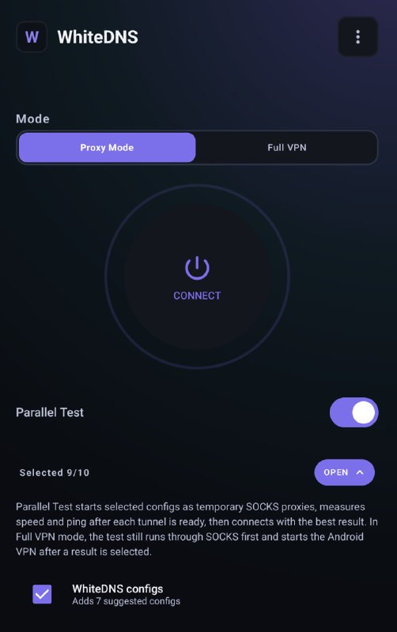

سلام به همه دوستان

نسخه جدید WhiteDNS آماده شد. ممنون از همه کسانی که نسخه‌های قبلی رو نصب کردند، تست گرفتند، لاگ فرستادند و با فیدبک‌هاشون کمک کردند مشکلات رو پیدا و برطرف کنیم 🙏

🤖 لینک دانلود سرور داخلی نسخه یونیورسال

🔴 ویدیو آموزشی استفاده از اپلیکیشن
🔴 گروه اصلی شمامل تاپیک ریزالور، سوال های متداول، آموزش و ریزالور

تمرکز اصلی این نسخه روی ساده‌تر شدن اتصال و پیدا کردن بهترین تنظیم برای هر کاربر بوده است. هدف این بود که WhiteDNS قبل از اتصال، چند کانفیگ مختلف را با Parallel Test بررسی کند، بهترین گزینه را از نظر سرعت و کیفیت انتخاب کند، و کاربران بدون نیاز به گشتن دنبال Resolver، با لیست پیش‌فرض ۴۵۰۰+ Resolver داخل اپ سریع‌تر اسکن کنند و راحت‌تر وصل شوند.

✅ نسخه اپلیکیشن به 1.4.0 ارتقا پیدا کرده
✅ قابلیت Parallel Test برای تست هم‌زمان چند تنظیم مختلف قبل از اتصال اضافه شده
✅ حالا WhiteDNS می‌تواند قبل از اتصال، چند حالت اتصال را هم‌زمان بررسی کند
✅ اپ سرعت و Ping هر تنظیم را تست می‌کند و بهترین گزینه را برای همان اتصال انتخاب می‌کند
✅ قابلیت Parallel Test هم برای Proxy Mode و هم برای Full VPN قابل استفاده است
✅ در حالت Full VPN، اپ اول بهترین تنظیم را با Parallel Test پیدا می‌کند و بعد اتصال VPN نهایی را روشن می‌کند
✅ نتایج Parallel Test بعد از اتصال داخل صفحه اصلی نمایش داده می‌شود
✅ می‌توانید تنظیم موفق Parallel Test را با نام دلخواه ذخیره کنید
✅ چند تنظیم آماده WhiteDNS برای تست سریع اضافه شده
✅ می‌توانید پروفایل‌های تنظیمات پیشرفته خودتان را هم وارد Parallel Test کنید
✅ بیش از 4500 Resolver داخل اپ قرار گرفته تا برای اسکن و اتصال راحت‌تر استفاده شود
✅ لیست Resolver پیش‌فرض داخل اپ کامل‌تر شده
✅ پروفایل Default Resolver اضافه شده تا اپ همیشه یک لیست آماده Resolver داشته باشد
✅ امکان اسکن مستقیم لیست Resolver پیش‌فرض اضافه شده
✅ اسکن فایل‌های بزرگ Resolver سبک‌تر و بهتر انجام می‌شود
✅ ریزالورهای تکراری یا قبلاً پیدا‌شده بهتر کنار گذاشته می‌شوند
✅ شمارش Resolverهای سالم و ردشده در اسکن دقیق‌تر شده
✅ اگر پروفایل اسکن سرور یا کلید نداشته باشد، اپ واضح‌تر جلوی شروع اسکن را می‌گیرد
✅ ویرایش سرور، Resolver و تنظیمات از صفحه اصلی راحت‌تر شده
✅ امکان حذف پروفایل‌های اتصال تکراری اضافه شده
✅ پروفایل Default Resolver از حذف یا جابه‌جایی اشتباهی محافظت می‌شود
✅ هشدار باتری حالا قابل بستن است
✅ نمایش سرعت، مصرف اینترنت و آمار اتصال دقیق‌تر شده
✅ تنظیمات پیشرفته برای اتصال‌های کندتر و مسیرهای سنگین‌تر بهتر تنظیم شده
✅ وارد کردن و خروجی گرفتن فایل‌های TOML با گزینه‌های جدید کامل‌تر شده
✅ هسته داخلی StormDNS به‌روزرسانی شده

تنظیماتی که به صورت اتوماتیک انتخاب میشوند، تمرکز روی سرعت و کیفیت دارد. امکان افزایش مصرف اینترنت شما با کانفیگ انتخاب شده می‌باشد. اگر نگران این موضوع هستید تنظیمات را مرور کرده و مقدار Upload Dup را کمتر کنید.

⚠️⚠️⚠️⚠️⚠️

حجم کپی از کانال ما واقعاً باورنکردنیه؛ در حدی که آدم شک می‌کنه شاید ما ناخواسته برای بعضی دوستان واحد تولید محتوا راه انداختیم.

کمترین کاری که می‌تونید انجام بدید، انتشار همین پست یا حداقل ذکر منبع کانال ماست. باور کنید نوشتن منبع، اینترنت رو خراب نمی‌کنه و از اعتبار شما هم کم نمی‌کنه.

همراهان عزیز WhiteDNS،

اگر دیدید کانالی بدون ذکر منبع مطالب ما رو کپی کرده، لطفاً با احترام منبع اصلی رو بهشون یادآوری کنید. شاید فقط فراموش کردن؛ کپی‌کردن زیاد آدم رو خسته می‌کنه.

@WhiteDNS

## ConfigWireguard — post 31726

آموزش اسکن آی‌پی‌های تمیز شیرو خورشید یا همون Akamai در Termux

1⃣ نصب ابزارها (به VPN متصل شوید)
ابتدا Termux را باز کنید و دستورات زیر را وارد کنید
pkg update && pkg upgrade -y
pkg install nmap -y
termux-setup-storage  
اگر پنجره دسترسی به حافظه نمایش داده شد، گزینه Allow را بزنید

2⃣ شروع اسکن ( VPN را خاموش کنید)
دستور زیر را برای اسکن وارد کنید

nmap -p 443 --open -T4 2.16.0.0/18
  
می‌توانید از رنج‌های زیر نیز استفاده کنید:
   • 104.64.0.0/10
   • 23.32.0.0/11
   • 23.192.0.0/11
   • 23.0.0.0/12
   • 172.224.0.0/12
   • 2.16.0.0/13
   • 23.72.0.0/13
   • 172.232.0.0/13
   • 184.24.0.0/13
   • 23.64.0.0/14
https://github.com/platformbuilds/Akamai-ASN-and-IPs-List

نکته مهم درباره زمان اسکن

• برای سرعت بیشتر، از رنج‌های کوچک (مثل /24) استفاده کنید.
• اسکن رنج‌های بزرگ ممکن است چندین ساعت طول بکشد.

نحوه شناسایی آی‌پی‌های فعال
• بعد از پایان اسکن، به دنبال خطوط زیر بگردید:
Nmap scan report for [آی‌پی مورد نظر]
PORT    STATE SERVICE
443/tcp open  https
• هر جا 443/tcp open نوشته شده بود، آی‌پی را ذخیره کنید.

## ConfigWireguard — post 31725

185.200.232.43   185.200.232.40 شیروخورشید رایتل

## ConfigWireguard — post 31724

185.143.232.122
185.200.232.43  
185.200.232.40
شیروخورشید مخابرات

## ConfigWireguard — post 31723

شیر و خورشید همه نتا 185.200.232.8 185.200.232.9 185.200.232.11 185.200.232.16 185.200.232.17 185.200.232.19 185.200.232.24 185.200.232.25 185.200.232.26 185.200.232.34 185.200.232.40 185.200.232.42 185.200.232.43 185.200.232.49 185.200.232.56 185.200.232.57…

## ConfigWireguard — post 31722

شیر و خورشید همه نتا

185.200.232.8
185.200.232.9
185.200.232.11
185.200.232.16
185.200.232.17
185.200.232.19
185.200.232.24
185.200.232.25
185.200.232.26
185.200.232.34
185.200.232.40
185.200.232.42
185.200.232.43
185.200.232.49
185.200.232.56
185.200.232.57
185.200.232.58
185.200.232.64
185.200.232.65
185.200.232.66
185.200.232.67

## ConfigWireguard — post 31721

  <a href="https://t.me/ConfigWireguard/31721" target="_blank">📎 Download file</a>

Whitedns windows v1.0.2

## ConfigWireguard — post 31720

نسخه ۱.۰.۲ 🔄 WhiteDns Windows

آموزش خیلی مقدماتی و ساده برای استفاده از این نسخه

سرور جدید WhiteDNS

Domain: v.whitedns.space
Encryption Key: bad99364093861634030e96f11fe3132

@whitedns

## ConfigWireguard — post 31719

  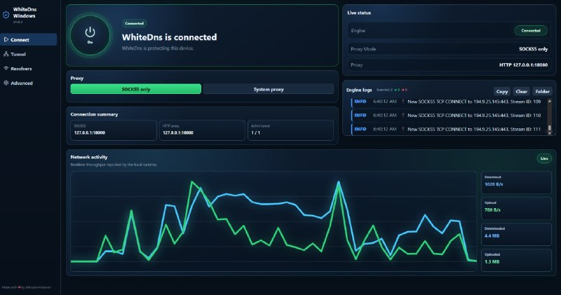

نسخه ۱.۰.۲ 🔄 WhiteDns Windows

🔥🔥🔥🔥

نسخه ۱.۰.۲ بر پایداری، قابلیت استفاده و تشخیص‌های بسیار قوی‌تر رزولور تمرکز دارد. 🛠

این بروزرسانی مشکل آکاردئون را در بخش تنظیمات پیشرفته اصلاح می‌کند تا بخش‌ها با قابلیت اطمینان بیشتری باز و بسته شوند و چیدمان تنظیمات رفتار سازگارتری داشته باشد. همچنین اسکنر رزولور را با یک حالت اسکن پیشرفته جدید بهبود می‌بخشد که رزولورها را به روشی واقع‌گرایانه‌تر و آگاه به تونل، با استفاده از دامنه فعال تونل آزمایش می‌کند، از جمله بررسی‌های DNS بدون کش، قابلیت EDNS0، یکپارچگی NXDOMAIN، مدیریت زیردامنه‌های تو در تو و جستجوهای پروب به شکل تونل. 🌐

تجربه نتایج اسکن نیز بهبود یافت. اکنون خروجی با اطمینان بیشتری کار می‌کند، مرتب‌سازی به درستی عمل می‌کند و نتایج صادر شده اکنون بهتر با آنچه در رابط کاربری نمایش داده می‌شود مطابقت دارند. جزئیات اضافی اسکن مانند امتیاز، دامنه پروب و قابلیت مشاهده بار EDNS اضافه شد تا رزولورهای قوی‌تر را با دقت بیشتری شناسایی کنید. 📊✨

@whitedns

## ConfigWireguard — post 31718

🛡️NetTools Pro
ابزار جامع شبکه، امنیت و عبور از فیلترینگ پیشرفته

✨ ویژگی‌های کلیدی

🔗 کلاینت VPN حرفه‌ای
- پشتیبانی از پروتکل‌های VLESS، VMess، Shadowsocks، Trojan، Hysteria2، TUIC، WireGuard، SOCKS، HTTP
- حالت TUN (هدایت کل ترافیک سیستم) + Kill Switch
- قابلیت Traffic Mimicry – شبیه‌سازی ترافیک به‌عنوان یک سایت عادی (مثل آپارات)
- زنجیره‌سازی Pre‑VPN – عبور از IP تمیز دیتاسنتر ایران قبل از سرور نهایی

⚡ اسکنرهای قدرتمند
- اسکنر Cloudflare – پیدا کردن سریع‌ترین IPهای کلودفلر برای Worker شما
- اسکنر دیتاسنتر ایران – یافتن IPهای تمیز ایرانی برای Pre‑VPN
- اسکنر پورت (TCP، SYN Stealth، UDP) + تشخیص سیستم‌عامل و دستگاه
- DNS Scanner – اندازه‌گیری تأخیر و اعتبارسنجی DNSSEC
- Fastly Scanner – اسکن IPهای لبه CDN Fastly

🛡️ ابزارهای ضد فیلتر
- حالت اضطراری (Anti‑Filter) – زنجیره بقای چندلایه: DNS → Tor → Psiphon → WireGuard → اسکنر CF
- پیش‌پردازشگر ترافیک محلی – تغییر شکل ترافیک برای تقلید از سایت‌های لیست سفید
- WARP (AmneziaWG) – اتصال از طریق Cloudflare WARP با درایور ضد DPI
- Psiphon + Tor – اجرای مخفی و مدیریت شده

🎮 حالت گیمینگ
- شتاب‌دهنده سیستم (بستن فرآیندهای سنگین پس‌زمینه)
- تثبیت‌کننده پینگ با الگوریتم FEC
- بهینه‌ساز NAT و DNS مخصوص بازی

🌍 ابزارهای DNS پیشرفته
- تغییر DNS با یک کلیک (پشتیبانی از DoH، DoT، IPv4)
- Split DNS – مسیریابی دامنه‌های خاص به DNS متفاوت
- DNS Hunter – پیدا کردن سریع‌ترین DNS برای یک دامنه خاص

- پیام‌رسان امن داخلی ، چت خودمیزبان با رمزنگاری سرتاسری (TLS 1.3 + AES‑256‑GCM)
- کشف خودکار دستگاه‌ها در LAN
- تغییر User‑Agent + پرچم‌های ضد اثرانگشت (غیرفعال‌سازی WebRTC، Canvas، WebGL)
- مسدودسازی تبلیغات از طریق hosts
- حالت Tor یک‌کلیک
- قابلیت نصب پلاگین از فایل ZIP یا فروشگاه آنلاین
- شاخص کیفیت شبکه (۰-۱۰۰)
- نمودار زنده سرعت دانلود/آپلود
- نمایش مسیر بسته‌ها + وضعیت لحظه‌ای سرویس‌ها
- رمزنگاری ذخیره‌سازی AES‑256‑GCM برای کانفیگ‌ها و تنظیمات
- به‌روزرسانی خودکار هسته‌ها (Xray، GoodbyeDPI)

⚠️ نیازمند ویندوز + دسترسی ادمین برای قابلیت‌های پیشرفته

✅ همه‌چی یکجا – VPN + اسکنر + ابزار ضد DPI + DNS + گیمینگ + چت امن
✅ متن‌باز و رایگان
✅ نسخه قابل حمل– بدون نیاز به نصب، اجرا از هر پوشه

🌐 لینک پروژه
https://github.com/Devtahas/CG_BPB/releases
📥 لینک دانلود داخلی
💻 NetTools_Pro_Release.zip 132.9 MB

## Zel2oVPN — post 2791

  <a href="https://t.me/Zel2oVPN/2791" target="_blank">📎 Download file</a>

📎 Document

## Zel2oVPN — post 2790

✅New iP 185.200.232.43 185.200.232.40 تست شده متصل Sni خالی باشه ☑➜@Zel2oVPN

## Zel2oVPN — post 2788

✅New iP

2.23.168.47
2.23.168.254
2.23.169.42
2.23.168.250
185.200.232.17
2.23.170.80
185.200.232.67
185.200.232.19
185.200.232.9
185.200.232.26
185.200.232.40
185.200.232.43
2.23.168.174
2.23.169.207
185.200.232.59
185.200.232.65
185.200.232.32
185.200.232.34
2.23.168.96
2.23.169.105
185.200.232.25
185.200.232.42
185.200.232.58
185.200.232.49
185.200.232.11
185.200.232.66
2.23.169.12
185.200.232.8
2.23.168.213
185.200.232.56
185.200.232.16
185.200.232.50
185.200.232.57
185.200.232.41
2.23.168.7
185.200.232.27
185.200.232.64
185.200.232.24
2.23.169.111
2.23.168.144
2.23.169.249

✅تست کنید ایرانسل متصله ری اکشن بزنید

☑➜@Zel2oVPN

## Zel2oVPN — post 2787

New iP

185.200.232.8
185.200.232.9
185.200.232.11
185.200.232.16
185.200.232.17
185.200.232.19
185.200.232.24
185.200.232.25
185.200.232.26
185.200.232.34
185.200.232.40
185.200.232.42
185.200.232.43
185.200.232.49
185.200.232.56
185.200.232.57
185.200.232.58
185.200.232.64
185.200.232.65
185.200.232.66
185.200.232.67

✅زمان بدید بهش وصله خودم وصلم باهاش ایرانسل

☑➜@Zel2oVPN

## Zel2oVPN — post 2786

  <a href="https://t.me/Zel2oVPN/2786" target="_blank">📎 Download file</a>

96.16.122.75 96.17.207.142 96.17.207.143 92.122.166.182 104.109.128.153 104.96.143.134 23.73.2.141 104.83.5.202 23.67.136.200 23.67.136.202 23.65.119.52 96.16.122.70 92.122.166.236 92.122.166.234 92.122.166.237 104.110.138.190 173.222.200.5…

## Zel2oVPN — post 2785

96.16.122.75
96.17.207.142
96.17.207.143
92.122.166.182
104.109.128.153
104.96.143.134
23.73.2.141
104.83.5.202
23.67.136.200
23.67.136.202
23.65.119.52
96.16.122.70
92.122.166.236
92.122.166.234
92.122.166.237
104.110.138.190
173.222.200.5
184.51.252.36
184.51.252.38
2.23.227.196
2.17.147.11
2.18.64.9
2.18.64.4
2.18.64.5
2.22.114.98
95.100.153.184
95.101.27.196
2.17.96.131
95.101.137.74
95.101.78.25
2.23.245.35
2.16.168.107
2.17.100.250
2.16.245.188
2.17.100.130
95.100.110.28
2.22.89.43
2.18.63.33
95.100.153.186
2.22.151.140
95.100.177.68
95.101.61.215
95.101.27.71
2.23.227.218
2.23.227.209
2.23.227.221
2.17.100.218
2.17.97.198
95.101.27.101
2.17.240.5
2.16.106.222
95.101.234.87
2.21.33.113
23.194.20.27
95.101.38.176
95.101.35.113
2.17.100.225
2.16.168.214
2.17.113.121
2.23.227.212
2.23.227.219
23.212.110.218
95.101.35.96
2.17.96.158
2.16.168.208
2.16.245.174
2.16.245.173
23.192.237.219
2.17.152.213
2.17.100.200
2.22.112.208
2.23.172.114
2.23.227.199
2.23.227.215
2.21.134.89
2.17.100.136
2.23.90.148
95.101.111.168
23.219.79.75
2.16.168.122
2.16.168.123
95.100.177.112
23.192.24.7
23.12.157.106
2.16.245.133
23.52.22.3
2.17.147.218
23.216.134.80
23.55.163.135
23.46.188.71
2.17.100.169
95.101.234.88
2.22.151.152
2.17.241.119
95.101.122.131
95.101.111.161
2.21.245.14
2.18.172.59
95.101.234.90
23.11.41.157
95.101.38.158
2.16.164.34
2.16.164.89
23.73.2.148
92.122.166.175
172.237.127.6
104.81.104.13
96.17.207.137
92.123.112.7
104.83.5.208
96.16.122.146
96.17.206.214
92.122.166.197
104.94.100.73
104.83.15.66
88.221.213.81
172.239.57.117
104.117.76.40
184.51.252.4
96.17.207.30
96.16.122.83
96.16.122.150
23.73.207.11
96.16.122.77
96.17.207.155
92.123.189.82
96.16.122.82
96.16.122.66
96.7.218.219
96.16.122.137
184.51.252.157
92.123.189.41
184.86.251.12
96.16.122.154
96.16.122.157
184.51.252.152
96.17.207.12
23.79.48.162
96.16.122.74
104.109.250.232
92.123.104.7
104.110.191.57
184.51.233.146
173.222.201.77
96.16.53.134
96.16.122.140
184.51.252.135
172.234.24.211
96.16.122.149
104.122.213.129
104.103.72.97
104.103.65.5
104.83.5.210
104.117.76.152
104.83.5.176
184.86.251.26
96.16.122.133
96.16.53.152
96.16.53.147
96.16.122.152
104.126.37.162
23.73.0.64
96.16.122.141
104.117.76.10
96.16.53.158
92.123.157.46
104.81.175.248

یه تست بزنید

☑➜@Zel2oVPN

## Zel2oVPN — post 2784

✔️VayDNS [S123]

slipnet-enc://AcTkFygyRAg/jWYLRXsXoy0v0ARJQRSMqUWzLr+3i0zmBg767HhPdDXb4FsmlkWhug5yX1/6NDNAHK0gNjGLY+JoGBqhNTzJjSEIiqVpMAM7Ep4SJdnuQZtqbm8yDQRpTsOhUDDiugL+mznyVY2V/8FfP4O9VQTQ0CRnQE7EBD6byR5+XCkCm+i0vzW/bRs58l28zhgsGnP6/x5N5hspeJDsyED5LXw0A3hdJtvKqBhL10JkYpWMIaL5SPZPbYQSe8M6KPc25g4DT8Ckct5gTcsQta8XOaOeZyP6nutcFr2NNurVofDVv19Y5hZrlkycLAxSOqqQffzIUACX4z6U0PuBUhLSCzzflvkSBF9YVb3efHfqLPMz+fbM9lPq3ys73GW0xlb7rXI+eBR3qlZNX8wNGxQmGYd/WHKARVdixPnnW3XPqja7E7H8BRmUL/DAQiys4VBly7gNW1Y1Hsahz1sNUkD0e4AbXFjGh+dtBAjREcxM5zeU4LccH2adl5s3VenhjFjawJhnkNPG/ZIVCNwqj/OLYiQnkH0BN2RSu5aqkRY5ybskuprkyaDoiofvF08F8+CW2eFF/Wc7V8wsD8J3k31T3E1l6zzpjkL/0QfCCiVKbPXYrwMjzxJfZLFIzYVfJAQ6fJxyfcjSgBy1i1Qnhm3tpGL+yDxmaIpuyycPDS/oaeSLx/ZukZkCbB6jnxNu3sIBf3X2l3R0ZwIledfY/T1wE9ZzU8r0R+1I0lnnnzyt9ay+OPnvEJ5yZfYHmDJeZkygCHNxWFhHjVt5RPPb+FnRQjm5vVm4eBANsEc0zQ==

📱کانفیگ اسلیپ

📱مخصوص نسخه جدید  2.5.3

📱دانلود نسخه جدید

📱تنظیمات پیشنهادی

https://t.me/socks?server=127.0.0.1&port=10880&user=%40Zel2oVPN

☑➜@Zel2oVPN

## Zel2oVPN — post 2783

✅DNSTT [S122]

slipnet-enc://AWCcGoJdouUFVVOD6mFIqBtFubj9OlRSBLxNrds/ryFRRLRlrYlH37WPUxlt5tYZbNuznhFLqou5aacehjKpUWqMocd3cil0dI4ig2daMb0la1DI5UOr3+eK5J2X8KNIh8FBhWzxptyehnKRjmMSNnXRzANcpHW3y40jXgxNk+s+j0JkJDMJw36+g/lJnrno6qx/C90URnHjar8sp+qNS3fss5QUQ4G2V+BUzE1e1gB9QeJqlnmkiVSy1ICTT1IWoGphD6SwnWrI13ZN3LHHaUsypdH0/LRvH3HKi60d4qeu45HINvtPQh5nWsomI8QjSaDGPfbbu8uQVTLeWBpOkCWIXrhUAY7xhy/QyovWp2fWXCcV6opxin8GhkWse7+7K6OUHJJTEKs7MeJE0h4/1dV5LrUFcx8+DOo8o79LAULkiz3dZ5pMhZaJzrw2wbds115uS9LV8802wLJtrwhc1CvZw+trVgXexBJGU8loldsfuuz5vBk+L6edUqCDHerHkJBLf0hP5ubLSg51e0E86lF6mk5hrdsY7Nlm4xZeUYjKd6DoeVvnAyb09g1i4dHGv0XckkU6DCqT8oNqFs4RqrPrNwSkXkKEggCoAeI1bANLFsQGZm5mh6nzFhoiIzdAaYp2tVA0a1WJ2RSngVadpYKPG/cqRh4d/6r7ZKLG3CM6iiqbDHJrFvvtTIx9TRdDBYEWHJ+rDYWMA3UAU+EnVmo80rphxllgzHthf63furURqVucREO08BQPGY7gL0vpLDSTwDyyqUrshcdxvVQS9IK49gxPoSFmmFQKiwKTn0M=

📱کانفیگ اسلیپ

📱مخصوص نسخه جدید  2.5.3

📱دانلود نسخه جدید

📱تنظیمات پیشنهادی

https://t.me/socks?server=127.0.0.1&port=10880&user=%40Zel2oVPN

☑➜@Zel2oVPN

## Zel2oVPN — post 2782

✅New iP

185.200.232.43
185.200.232.40

تست شده متصل
Sni خالی باشه

☑➜@Zel2oVPN

## whitedns — post 636

سرور اهدایی از رسول عزیز از تیم وایت دی ان اس

Name: H3 (Germany)
Domain: v.eshkaftak.vip
Encryption Key: 8705eb75abeedcd99001ef8d01cf9fad

Name: Serbia
Domain: v3.eshkaftak.vip
Encryption Key: 8705eb75abeedcd99001ef8d01cf9fad

Name: Turkey
Domain: v4.eshkaftak.vip
Encryption Key: 8705eb75abeedcd99001ef8d01cf9fad

Name: USA
Domain: v5.eshkaftak.vip
Encryption Key: 8705eb75abeedcd99001ef8d01cf9fad

Name: Switzerland
Domain: v6.eshkaftak.vip
Encryption Key: 8705eb75abeedcd99001ef8d01cf9fad

Name: RMFT g1-7
Domain: g1-7.rmft.tech
Encryption Key: a337e9fa75161c44bebe7d717da36afc

## whitedns — post 635

سرور اهدایی از چنل @Masir_Sefid

لطفا از چنل دوستان اهدا کننده سرور حمایت کنید.

Name: @Masir_Sefid🕊(1)
Domain: v1.masir-sefid-1.shop
Encryption Key: Telegram-Channel--->@Masir_Sefid
Encryption Method: xor

Name: @Masir_Sefid🕊(2)
Domain: v2.masir-sefid-1.shop
Encryption Key: Telegram-Channel--->@Masir_Sefid
Encryption Method: xor

Name: @Masir_Sefid🕊(3)
Domain: v3.masir-sefid-1.shop
Encryption Key: Telegram-Channel--->@Masir_Sefid

Name: @Masir_Sefid🕊(4)
Domain: v4.masir-sefid-1.shop
Encryption Key: Telegram-Channel--->@Masir_Sefid
Encryption Method: xor

Name: @Masir_Sefid🕊(5)
Domain: v5.masir-sefid-1.shop
Encryption Key: Telegram-Channel--->@Masir_Sefid
Encryption Method: xor

## whitedns — post 633

سرور اهدایی از چنل @pythash

لطفا از چنل دوستان اهدا کننده سرور حمایت کنید.

〰️〰️〰️〰️〰️〰️〰️〰️〰️〰️〰️〰️
🇹🇷 Turkey Server 1
Domain: v1.abolfazlshahi.cloud
Key: a4c5649c628ac1103ad55c5208e0d74d
〰️〰️〰️〰️〰️〰️〰️〰️〰️〰️〰️〰️
🇹🇷 Turkey Server 2
Domain: v2.abolfazlshahi.cloud
Key: 965a568dccef58af7afb86e8ee55eea6
〰️〰️〰️〰️〰️〰️〰️〰️〰️〰️〰️〰️

@WhiteDNS

## whitedns — post 631

درحال حاضر نزدیک ۱۰۰۰ نفر فقط به سرور ما متصل هستند. سرور تا نزدیک ۲۴۰۰ نفر میتونه کاربر بدون افت کیفیت رو پشتیبانی کنه.

جدا از سرور های ما، سرور های اهدایی باقی چنل ها مثل مسیر سفید هم هست. ویدیو آموزش سرور اختصاصی هم پست های بالاتر گذاشتیم.

@WhiteDNS

## whitedns — post 630

  <a href="telegram/content/whitedns_630_1778839481.mp4" target="_blank">🎬 Download video</a>

سرور جدید WhiteDNS

Domain: v.whitedns.site
Encryption Key: bad99364093861634030e96f11fe3132

🔴 ویدیو آموزشی استفاده از اپلیکیشن
🔴 گروه اصلی شمامل تاپیک ریزالور، سوال های متداول، آموزش و ریزالور

⚠️⚠️⚠️⚠️⚠️

حجم کپی از کانال ما واقعاً باورنکردنیه؛ در حدی که آدم شک می‌کنه شاید ما ناخواسته برای بعضی دوستان واحد تولید محتوا راه انداختیم.

کمترین کاری که می‌تونید انجام بدید، انتشار همین پست یا حداقل ذکر منبع کانال ماست. باور کنید نوشتن منبع، اینترنت رو خراب نمی‌کنه و از اعتبار شما هم کم نمی‌کنه.

همراهان عزیز WhiteDNS،

اگر دیدید کانالی بدون ذکر منبع مطالب ما رو کپی کرده، لطفاً با احترام منبع اصلی رو بهشون یادآوری کنید. شاید فقط فراموش کردن؛ کپی‌کردن زیاد آدم رو خسته می‌کنه.

@WhiteDNS

## whitedns — post 625

  <a href="https://t.me/whitedns/625" target="_blank">📎 Download file</a>

سلام به همه دوستان نسخه جدید WhiteDNS آماده شد. ممنون از همه کسانی که نسخه‌های قبلی رو نصب کردند، تست گرفتند، لاگ فرستادند و با فیدبک‌هاشون کمک کردند مشکلات رو پیدا و برطرف کنیم 🙏 🤖 دانلود نسخه یونیورسال از سرور های داخلی 🔴 ویدیو آموزشی استفاده از اپلیکیشن…

## whitedns — post 624

  

سلام به همه دوستان

نسخه جدید WhiteDNS آماده شد. ممنون از همه کسانی که نسخه‌های قبلی رو نصب کردند، تست گرفتند، لاگ فرستادند و با فیدبک‌هاشون کمک کردند مشکلات رو پیدا و برطرف کنیم 🙏

🤖 دانلود نسخه یونیورسال از سرور های داخلی

🔴 ویدیو آموزشی استفاده از اپلیکیشن
🔴 گروه اصلی شمامل تاپیک ریزالور، سوال های متداول، آموزش و ریزالور

تمرکز اصلی این نسخه روی ساده‌تر شدن اتصال و پیدا کردن بهترین تنظیم برای هر کاربر بوده است. هدف این بود که WhiteDNS قبل از اتصال، چند کانفیگ مختلف را با Parallel Test بررسی کند، بهترین گزینه را از نظر سرعت و کیفیت انتخاب کند، و کاربران بدون نیاز به گشتن دنبال Resolver، با لیست پیش‌فرض ۴۵۰۰+ Resolver داخل اپ سریع‌تر اسکن کنند و راحت‌تر وصل شوند.

تغییرات این نسخه:

✅ نسخه اپلیکیشن به 1.4.0 ارتقا پیدا کرده
✅ قابلیت Parallel Test برای تست هم‌زمان چند تنظیم مختلف قبل از اتصال اضافه شده
✅ حالا WhiteDNS می‌تواند قبل از اتصال، چند حالت اتصال را هم‌زمان بررسی کند
✅ اپ سرعت و Ping هر تنظیم را تست می‌کند و بهترین گزینه را برای همان اتصال انتخاب می‌کند
✅ قابلیت Parallel Test هم برای Proxy Mode و هم برای Full VPN قابل استفاده است
✅ در حالت Full VPN، اپ اول بهترین تنظیم را با Parallel Test پیدا می‌کند و بعد اتصال VPN نهایی را روشن می‌کند
✅ نتایج Parallel Test بعد از اتصال داخل صفحه اصلی نمایش داده می‌شود
✅ می‌توانید تنظیم موفق Parallel Test را با نام دلخواه ذخیره کنید
✅ چند تنظیم آماده WhiteDNS برای تست سریع اضافه شده
✅ می‌توانید پروفایل‌های تنظیمات پیشرفته خودتان را هم وارد Parallel Test کنید
✅ بیش از 4500 Resolver داخل اپ قرار گرفته تا برای اسکن و اتصال راحت‌تر استفاده شود
✅ لیست Resolver پیش‌فرض داخل اپ کامل‌تر شده
✅ پروفایل Default Resolver اضافه شده تا اپ همیشه یک لیست آماده Resolver داشته باشد
✅ امکان اسکن مستقیم لیست Resolver پیش‌فرض اضافه شده
✅ اسکن فایل‌های بزرگ Resolver سبک‌تر و بهتر انجام می‌شود
✅ ریزالورهای تکراری یا قبلاً پیدا‌شده بهتر کنار گذاشته می‌شوند
✅ شمارش Resolverهای سالم و ردشده در اسکن دقیق‌تر شده
✅ اگر پروفایل اسکن سرور یا کلید نداشته باشد، اپ واضح‌تر جلوی شروع اسکن را می‌گیرد
✅ ویرایش سرور، Resolver و تنظیمات از صفحه اصلی راحت‌تر شده
✅ امکان حذف پروفایل‌های اتصال تکراری اضافه شده
✅ پروفایل Default Resolver از حذف یا جابه‌جایی اشتباهی محافظت می‌شود
✅ هشدار باتری حالا قابل بستن است
✅ نمایش سرعت، مصرف اینترنت و آمار اتصال دقیق‌تر شده
✅ تنظیمات پیشرفته برای اتصال‌های کندتر و مسیرهای سنگین‌تر بهتر تنظیم شده
✅ وارد کردن و خروجی گرفتن فایل‌های TOML با گزینه‌های جدید کامل‌تر شده
✅ هسته داخلی StormDNS به‌روزرسانی شده

تنظیماتی که به صورت اتوماتیک انتخاب میشوند، تمرکز روی سرعت و کیفیت دارد. امکان افزایش مصرف اینترنت شما با کانفیگ انتخاب شده می‌باشد. اگر نگران این موضوع هستید تنظیمات را مرور کرده و مقدار Upload Dup را کمتر کنید.

⚠️⚠️⚠️⚠️⚠️

حجم کپی از کانال ما واقعاً باورنکردنیه؛ در حدی که آدم شک می‌کنه شاید ما ناخواسته برای بعضی دوستان واحد تولید محتوا راه انداختیم.

کمترین کاری که می‌تونید انجام بدید، انتشار همین پست یا حداقل ذکر منبع کانال ماست. باور کنید نوشتن منبع، اینترنت رو خراب نمی‌کنه و از اعتبار شما هم کم نمی‌کنه.

همراهان عزیز WhiteDNS،

اگر دیدید کانالی بدون ذکر منبع مطالب ما رو کپی کرده، لطفاً با احترام منبع اصلی رو بهشون یادآوری کنید. شاید فقط فراموش کردن؛ کپی‌کردن زیاد آدم رو خسته می‌کنه.

@WhiteDNS

## whitedns — post 623

  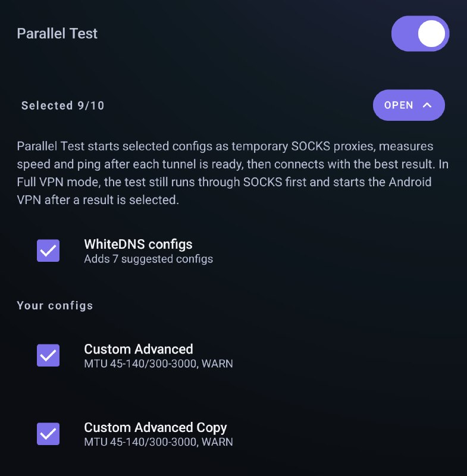

ورژن ۱.۴.۰ کلاینت اندروید WhiteDNS به‌زودی منتشر می‌شود. در این نسخه سعی کردیم کار شما را راحت‌تر کنیم و اتصال سریع‌تر و ساده‌تر انجام شود.

در این ورژن، اپ به‌صورت خودکار ۷ تنظیم مختلف را با قابلیت Parallel Test بررسی می‌کند و در نهایت بهترین کانفیگ را از نظر سرعت و کیفیت برای شما انتخاب می‌کند.

همچنین بیش از ۴۵۰۰ Resolver که قبلاً داخل بات و گروه منتشر شده بود، به‌عنوان لیست پیش‌فرض داخل اپ قرار گرفته است تا بدون نیاز به گشتن دنبال لیست، بتوانید مستقیم اسکن را شروع کنید و راحت‌تر وصل شوید.

## whitedns — post 622

  

سرور جدید WhiteDNS

Domain: v.whitedns.space
Encryption Key: bad99364093861634030e96f11fe3132

از همه کانال‌ها و دوستانی که این لیست رو بازنشر می‌کنند خواهش می‌کنیم حداقل سهم و همکاری‌شون این باشه که کانال ما رو به عنوان منبع ذکر کنند. این داده‌ها با زمان، هزینه و اسکن گسترده جمع‌آوری شده، نه با جادو و دعای نیمه‌شب.

این بزرگترین سرور ما هستش. ۱۲ هسته سی‌پی‌يو و ۲۴ گیگ رم.

✈️هر مشکلی هست، از سمت اختلال شبکه، تنظیمات و ریزالور ها هستش.

@WhiteDNS

## Spotify_Porteghali — post 12395

یه لیست آیپیِ جدیدِ تست شده برایِ " شیرو خورشید " ، با سرعتِ بالا : 185.200.232.43 185.200.232.40 
💬 لینکِ دانلودِ داخلی و نحوه اتصال در اندروید 
💬 
💬 نحوه اتصال در آیفون 
💬 + تا زمانی که اتصال‌تون با سرعتِ خووب برقرار هست نیازی نیست که آیپی رو عوض کنید و…

## Spotify_Porteghali — post 12394

یه لیست آیپیِ جدیدِ تست شده برایِ " شیرو خورشید " ، با سرعتِ بالا :

185.200.232.43
185.200.232.40

💬 لینکِ دانلودِ داخلی و نحوه اتصال در اندروید 
💬

💬 نحوه اتصال در آیفون 
💬

+ تا زمانی که اتصال‌تون با سرعتِ خووب برقرار هست نیازی نیست که آیپی رو عوض کنید و آیپی هایِ جدید رو تست کنید .

🆔 @Spotify_Porteghali 🍊

↰  بزرگترین خانواده اسپاتیفای در کشور  ↱

## NamazVPN — post 35547

─────────── VLESS ───────────

🔗 vless://406e983f-22b9-4cb2-ab19-7b3968be0f07@starlink.tino2020.com:443?mode=auto&path=%2F&security=tls&alpn=h2%2Chttp%2F1.1&encryption=none&insecure=1&fp=chrome&type=xhttp&allowInsecure=1&sni=starlink.tino2020.com#%F0%9F%87%AB%F0%9F%87%AEFinland%2C%20Helsinki%20%7C%20%F0%9F%8C%90%20IP%3A%202a01%3A4f9%3Ac014%3A827e%3A%3A1%20%7C%20%E2%8F%B3ping%3A6602.12ms%20%7C%20%F0%9F%93%A2%20%40NamazVPN

📍 🇫🇮 Finland, Helsinki
⏱️ 6602.12ms

📢 @NamazVPN

## NamazVPN — post 35546

─────────── VLESS ───────────

🔗 vless://b4fdc761-6ba9-4309-9bf0-41bd4c80936c@185.143.233.5:2087?path=%2F&security=tls&encryption=none&insecure=0&host=p1.sesrsa.com&fp=firefox&type=ws&allowInsecure=0&sni=sub.sesrsa.com#%F0%9F%87%B9%F0%9F%87%B7T%C3%BCrkiye%2C%20Istanbul%20%7C%20%F0%9F%8C%90%20IP%3A%2093.114.98.84%20%7C%20%E2%8F%B3ping%3A488.62ms%20%7C%20%F0%9F%93%A2%20%40NamazVPN

📍 🇹🇷 Türkiye, Istanbul
⏱️ 488.62ms

📢 @NamazVPN

## NamazVPN — post 35545

─────────── VLESS ───────────

🔗 vless://39be71cd-4578-4b23-8000-73c9855c7a07@185.24.253.107:443?security=tls&type=xhttp&headerType=&path=&host=cdn.gapfilm.org&mode=auto&extra=%7B%22scMaxEachPostBytes%22%3A+1000000%2C+%22scMaxConcurrentPosts%22%3A+100%2C+%22scMinPostsIntervalMs%22%3A+30%2C+%22xPaddingBytes%22%3A+%22100-1000%22%2C+%22noGRPCHeader%22%3A+false%7D&sni=cdn.gapfilm.org&fp=chrome&pcs=610792abc1380f3fe53381ed3ba0c1a6a71a893755106d729b9d80e5930ae8be&allowInsecure=1#%F0%9F%87%AB%F0%9F%87%AEFinland%2C%20Helsinki%20%7C%20%F0%9F%8C%90%20IP%3A%20104.28.222.14%20%7C%20%E2%8F%B3ping%3A886.81ms%20%7C%20%F0%9F%93%A2%20%40NamazVPN

📍 🇫🇮 Finland, Helsinki
⏱️ 886.81ms

📢 @NamazVPN

## NamazVPN — post 35544

─────────── SS ───────────

🔗 ss://MjAyMi1ibGFrZTMtYWVzLTI1Ni1nY206NFlOWFJZUHNSR0NyY2Z3ZXVrNy9IWUN4UnhnOEE2YU1wZG1YQU1ucnViaz06MDYrN0NmeUZZRnF0V3lucTdLWVRodXFyNmpOTXg1bFpqRk1ibjc4NWJMdz0@94.183.173.225:443#Unknown%20%7C%20%F0%9F%8C%90%20IP%3A%20N%2FA%20%7C%20%E2%8F%B3ping%3A4162.16ms%20%7C%20%F0%9F%93%A2%20%40NamazVPN

📍
⏱️ 4162.16ms

📢 @NamazVPN

## NamazVPN — post 35543

─────────── VLESS ───────────

🔗 vless://4ff29686-f37e-4647-b0cd-a68b748136d4@185.24.253.108:443?security=tls&type=xhttp&headerType=&path=&host=cdn.gapfilm.org&mode=auto&extra=%7B%22scMaxEachPostBytes%22%3A+1000000%2C+%22scMaxConcurrentPosts%22%3A+100%2C+%22scMinPostsIntervalMs%22%3A+30%2C+%22xPaddingBytes%22%3A+%22100-1000%22%2C+%22noGRPCHeader%22%3A+false%7D&sni=cdn.gapfilm.org&fp=chrome&pcs=610792abc1380f3fe53381ed3ba0c1a6a71a893755106d729b9d80e5930ae8be&allowInsecure=1#%F0%9F%87%AB%F0%9F%87%AEFinland%2C%20Helsinki%20%7C%20%F0%9F%8C%90%20IP%3A%20104.28.222.14%20%7C%20%E2%8F%B3ping%3A695.44ms%20%7C%20%F0%9F%93%A2%20%40NamazVPN

📍 🇫🇮 Finland, Helsinki
⏱️ 695.44ms

📢 @NamazVPN

## NamazVPN — post 35542

─────────── VLESS ───────────

🔗 vless://fab79bc8-0b97-4483-ab89-450cec9e324c@193.151.155.162:443?security=tls&type=xhttp&headerType=&path=&host=cdn.gapfilm.org&mode=auto&extra=%7B%22scMaxEachPostBytes%22%3A+1000000%2C+%22scMaxConcurrentPosts%22%3A+100%2C+%22scMinPostsIntervalMs%22%3A+30%2C+%22xPaddingBytes%22%3A+%22100-1000%22%2C+%22noGRPCHeader%22%3A+false%7D&sni=cdn.gapfilm.org&fp=chrome&pcs=610792abc1380f3fe53381ed3ba0c1a6a71a893755106d729b9d80e5930ae8be&allowInsecure=1#%F0%9F%87%A9%F0%9F%87%AAGermany%2C%20Leipzig%20%7C%20%F0%9F%8C%90%20IP%3A%20104.28.207.215%20%7C%20%E2%8F%B3ping%3A599.1ms%20%7C%20%F0%9F%93%A2%20%40NamazVPN

📍 🇩🇪 Germany, Leipzig
⏱️ 599.1ms

📢 @NamazVPN

## TirexNet — post 3825

دوستان آیپی هارو دارن فیلتر میکنن

## TirexNet — post 3824

185.200.232.8
185.200.232.9
185.200.232.11
185.200.232.16
185.200.232.17
185.200.232.19
185.200.232.24
185.200.232.25
185.200.232.26
185.200.232.34
185.200.232.40
185.200.232.42
185.200.232.43
185.200.232.49
185.200.232.56
185.200.232.57
185.200.232.58
185.200.232.64
185.200.232.65
185.200.232.66
185.200.232.67

## TirexNet — post 3819

  <a href="https://t.me/TirexNet/3819" target="_blank">📎 Download file</a>

چند کانفیگ سایفون‌هلپر متصل.

تمام اینها صرفا با تغییر ip یا sni در کانفیگهای

force-fastly, force-akamai

که در
https://t.me/projectXhttp/354790

قرار داده شده بدست آمده.

## TirexNet — post 3818

  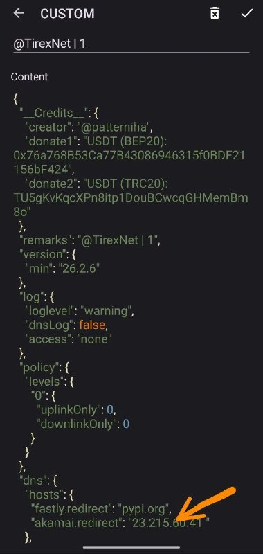

@TirexNet.json

## TirexNet — post 3817

متصل

96.16.122.75
96.17.207.142
96.17.207.143
92.122.166.182
104.109.128.153
104.96.143.134
23.73.2.141
104.83.5.202
23.67.136.200
23.67.136.202
23.65.119.52
96.16.122.70
92.122.166.236
92.122.166.234
92.122.166.237
104.110.138.190
173.222.200.5
184.51.252.36
184.51.252.38
2.23.227.196
2.17.147.11
2.18.64.9
2.18.64.4
2.18.64.5
2.22.114.98
95.100.153.184
95.101.27.196
2.17.96.131
95.101.137.74
95.101.78.25
2.23.245.35
2.16.168.107
2.17.100.250
2.16.245.188
2.17.100.130
95.100.110.28
2.22.89.43
2.18.63.33
95.100.153.186
2.22.151.140
95.100.177.68
95.101.61.215
95.101.27.71
2.23.227.218
2.23.227.209
2.23.227.221
2.17.100.218
2.17.97.198
95.101.27.101
2.17.240.5
2.16.106.222
95.101.234.87
2.21.33.113
23.194.20.27
95.101.38.176
95.101.35.113
2.17.100.225
2.16.168.214
2.17.113.121
2.23.227.212
2.23.227.219
23.212.110.218
95.101.35.96
2.17.96.158
2.16.168.208
2.16.245.174
2.16.245.173
23.192.237.219
2.17.152.213
2.17.100.200
2.22.112.208
2.23.172.114
2.23.227.199
2.23.227.215
2.21.134.89
2.17.100.136
2.23.90.148
95.101.111.168
23.219.79.75
2.16.168.122
2.16.168.123
95.100.177.112
23.192.24.7
23.12.157.106
2.16.245.133
23.52.22.3
2.17.147.218
23.216.134.80
23.55.163.135
23.46.188.71
2.17.100.169
95.101.234.88
2.22.151.152
2.17.241.119
95.101.122.131
95.101.111.161
2.21.245.14
2.18.172.59
95.101.234.90
23.11.41.157
95.101.38.158
2.16.164.34
2.16.164.89
23.73.2.148
92.122.166.175
172.237.127.6
104.81.104.13
96.17.207.137
92.123.112.7
104.83.5.208
96.16.122.146
96.17.206.214
92.122.166.197
104.94.100.73
104.83.15.66
88.221.213.81
172.239.57.117
104.117.76.40
184.51.252.4
96.17.207.30
96.16.122.83
96.16.122.150
23.73.207.11
96.16.122.77
96.17.207.155
92.123.189.82
96.16.122.82
96.16.122.66
96.7.218.219
96.16.122.137
184.51.252.157
92.123.189.41
184.86.251.12
96.16.122.154
96.16.122.157
184.51.252.152
96.17.207.12
23.79.48.162
96.16.122.74
104.109.250.232
92.123.104.7
104.110.191.57
184.51.233.146
173.222.201.77
96.16.53.134
96.16.122.140
184.51.252.135
172.234.24.211
96.16.122.149
104.122.213.129
104.103.72.97
104.103.65.5
104.83.5.210
104.117.76.152
104.83.5.176
184.86.251.26
96.16.122.133
96.16.53.152
96.16.53.147
96.16.122.152
104.126.37.162
23.73.0.64
96.16.122.141
104.117.76.10
96.16.53.158
92.123.157.46
104.81.175.248

Channel: T.me/TirexNet

## TirexNet — post 3816

مخابرات

185.200.232.43
185.200.232.40

Channel: T.me/TirexNet

## TirexNet — post 3815

خودم الان با این وصلم همراه اول👇 23.208.65.40 104.103.65.50 2.23.168.47 23.215.60.41 2.21.2.9 2.21.2.10 2.16.221.37 95.101.35.112 2.23.168.250 2.21.2.91 2.21.2.34 2.21.2.104 2.23.169.105 2.16.20.51 2.16.53.11 2.16.53.50 2.16.19.136 Channel: T.me/TirexNet

## papFransiz — post 475

Amir.Hadayati (𝑃𝐴𝑃.𝐹𝑅𝐴𝑁𝑆ı𝑍) pinned «مطالب منتقل شدند به گروه. با تشکر»

## sirhishamtradinghub — post 3689

Forex moved hard today from Asian into London.

Main reason looks like a mix of strong USD buying after hot US inflation data, rising bond yields, and growing geopolitical tension pushing markets into risk off mode.

Money rotated heavily into the dollar, and London session came in to add more momentum to the move.

Nothing random just fundamentals driving strong displacement.

Do you have any idea ? 💡

## sirhishamtradinghub — post 3688

  

You agree or not ?

## sirhishamtradinghub — post 3687

Good morning everyone

## khabarpro — post 1190

🤩قیمت ها به مدت محدود تخفیف خورد

کانفیگ با حجم ۳ گیگ = ۱٫۴۰۰٫۰۰۰

قیمت ویژه امروز فقط ۷۵۰٫۰۰۰ تومان

دارای لینک ساب
بدون محدودیت زمان
بدون‌محدودیت کاربر
بدون ضریب

جهت سفارش پیام بدید

@m5008060

## TheVPNMethod — post 715

دیروز گفتم که برید کاراتونو انجام بدید گفتید انرژی منفی نده 😁 بهرحال فدای سرتون، آیپی هنوزم پیدا میشه تک و توک.

## TheVPNMethod — post 714

وصلید؟

## TheVPNMethod — post 713

سلام و درود

## MatinSenPaii — post 3067

گوگل من روی همراه اول یه بیست دقیقه‌ای بسته بود.
نمیدونم دارن چه گندی می‌زنن باز

## MatinSenPaii — post 3065

سرور رایگان

## MatinSenPaii — post 3064

ورژن جدید White DNS با یه سرعتی ریزالور اسکن می‌کنه که آدم باورش نمیشه

## MatinSenPaii — post 3063

نسخه ۱.۰.۲ 🔄 WhiteDns Windows

آموزش خیلی مقدماتی و ساده برای استفاده از این نسخه
@whitedns

## archivetell — post 4952

شاید واستون سوال باشه که چرا پترنیها اینقدر تلاش میکنه واسه پیدا کردن این متد ها چون حکومت نتونه وایت لیست رو به راحتی اجرا کنه و فشار زیادی وارد بشه روی فیلترینگ

## archivetell — post 4951

تازه اسکن شده سرعت فضایی 💥 :
شیر و خورشید؛
84.26.13.91
23.54.210.170
23.44.201.206
23.220.163.205
23.209.46.33
23.10.34.11
23.39.185.35
23.32.152.106
23.218.232.181
23.206.188.212
2.21.2.89
23.208.222.120
23.48.203.248
23.44.201.136
23.44.201.151
23.44.201.149
2.21.2.58
23.3.90.48
23.44.201.41
2.19.204.184
23.218.232.188
23.44.201.12
23.212.253.227
23.201.31.155
23.220.163.203
23.44.201.185
23.52.116.66
23.44.201.17
23.62.54.24
23.218.239.132
23.39.149.69
23.52.40.147
23.58.95.144
2.16.244.58
23.212.253.137
2.17.106.176
23.62.54.137
2.17.106.5
23.203.134.233
23.212.253.232
23.206.188.197
23.44.201.170
23.54.127.39
23.214.170.83
23.52.40.89
23.55.176.73
23.202.229.140
23.215.56.61
2.17.106.166
23.222.126.108
184.25.85.224
23.1.241.123
23.3.90.43

بزنید عشق کنید ری اکشن هم یادتون نره❤️

## archivetell — post 4950

شاید واستون سوال باشه که چرا پترنیها اینقدر تلاش میکنه واسه پیدا کردن این متد ها

چون حکومت نتونه وایت لیست رو به راحتی اجرا کنه و فشار زیادی وارد بشه روی فیلترینگ

## archivetell — post 4949

  

🔴قیمت جهانی استارلینک مینی با تخفیف به زیر ۲۰۰دلار (۳۶میلیون تومن) رسیده و پایین‌تر هم میاد. سایز دیشش هم اندازه‌ی یه کاغذ A4 هس و براحتی همه جا مخفی میشه و با وضعیت ایران هیچ رقمه نمیشه جلوی موج قاچاقش رو گرفت.

حالا بیا جلو اینم بگیر😎
@ArchiveTell

## archivetell — post 4948

نتلیفای بای بای

@ArchiveTell

## archivetell — post 4947

  <a href="https://t.me/archivetell/4947" target="_blank">📎 Download file</a>

اینا هم اسکن کنید..

## archivetell — post 4945

  <a href="https://t.me/archivetell/4945" target="_blank">📎 Download file</a>

رنج آیپی akamai واسه اسکن

## archivetell — post 4944

  <a href="https://t.me/archivetell/4944" target="_blank">📎 Download file</a>

اسکنر TCP رنج ایپی های Akamai
فایل hosts.txt رو کنارش بذارید و روی هر سیستم عاملی با پایتون اجراش کنید (ورودی ایپی تکی و ایپی رنج ساپورت میکنه)
- قابلیت تشخیص NAT از اتصال واقعی بر اساس پینگ
- سرعت ورکر رو میشه تنظیم کرد
- قابلیت بهینه سازی تایم اسکن
- خروجی رو توی فایل vali.txt میده.
بدون پیش نیاز...

## archivetell — post 4943

ایرانسل ، همراه اول و رایتل شیر و خورشید تست کنید 185.200.232.40 185.200.232.43

## archivetell — post 4942

شیر و خورشید

151.101.0.223
151.101.128.223
151.101.192.223
65.109.34.234
151.101.64.223
142.54.178.211
2.16.53.50
2.16.53.11
95.101.133.82
95.101.133.42
104.103.65.50
2.23.168.47
104.103.64.7
2.23.168.254
2.23.168.144
2.23.169.249
2.23.169.42
2.23.170.80
104.103.65.5
95.101.133.131
104.103.65.74
2.16.20.51
23.221.28.57
23.221.29.29
23.221.28.5
2.23.169.111
2.23.168.96
2.23.169.12
2.23.168.174
2.23.168.7
184.84.221.34
2.23.41.22
185.200.232.49
185.200.232.50
185.200.232.42
185.200.232.41
184.24.77.42
184.24.77.32
184.24.77.5
184.24.77.7
184.24.77.16
184.24.77.36
184.24.77.21
184.24.77.11
23.48.23.186
23.48.23.133
23.48.23.195
23.48.23.178
184.24.77.29

## archivetell — post 4941

  <a href="https://t.me/archivetell/4941" target="_blank">📎 Download file</a>

🔹سورس اسکنر اختصاصی تیم پرشیا ❤️

🟢این سورس اسکنر sni و Cdn هست و با بهترین قابلیت ها نوشته شده است☑️

💡اموزش نصب در کامپیوتر:

🔹اول فایل را دانلود کرده سپس استخراج کنید
🔹سپس رو محل فایل کلیک کرده ترمینال را باز کرده و در ان این دستور را بنویسید:

pip install -r requirements.txt

🔹سپس این دستور را بنویسید:

python sni_web.py

🔹بعدش صفحه باز میشه و میتونید اسکن را شروع کنید

🟢🟢🟢🟢🟢🟢🟢🟢🟢🟢🟢🟢
⏺️اموزش نصب در گوشی با برنامه termux

🔹اول وارد برنامه ترموکس شده و پکیچ های پایتون نصب کنید
🔹سپس دستور زیر را وارد کنید

git clone https://github.com/DevMoEiN/SNI-Radar.git

🔹سپس این دستور:

cd SNI-Radar

🟢بعد این:

pip install flask

🔹و در اخر این:

python sni_web.py

⏺️سپس این را در کروم تایپ کنید:
http://127.0.0.1:10808

## archivetell — post 4940

ایرانسل ، همراه اول و رایتل شیر و خورشید تست کنید 185.200.232.40 185.200.232.43

## archivetell — post 4939

شیر و خورشید همه نتا

185.200.232.8
185.200.232.9
185.200.232.11
185.200.232.16
185.200.232.17
185.200.232.19
185.200.232.24
185.200.232.25
185.200.232.26
185.200.232.34
185.200.232.40
185.200.232.42
185.200.232.43
185.200.232.49
185.200.232.56
185.200.232.57
185.200.232.58
185.200.232.64
185.200.232.65
185.200.232.66
185.200.232.67

## archivetell — post 4938

سامانتل شیر و خورشید

184.24.77.42
184.24.77.32
184.24.77.5
184.24.77.7
184.24.77.16
184.24.77.36
184.24.77.21
184.24.77.11
23.48.23.186
23.48.23.133
23.48.23.195
23.48.23.178
184.24.77.29
185.200.232.49
185.200.232.50
185.200.232.42
185.200.232.41

## archivetell — post 4937

سایت های وایت لیست شده رو بستن تا بتونن جلوی این متد رو بگیرن..

## archivetell — post 4936

ایرانسل ، همراه اول و رایتل

شیر و خورشید تست کنید

185.200.232.40
185.200.232.43

## archivetell — post 4935

🔥 متصل

https://raw.githubusercontent.com/IR-NETLIFY/NETLIFY/refs/heads/main/IR%20NETLIFY%20SUB

## hamvex — post 2578

  <a href="telegram/content/hamvex_2578_1778839491.mp4" target="_blank">🎬 Download video</a>

🎬 Video

## hamvex — post 2577

🌐آموزش کامل دور زدن فیلترینگ با متود CDN-Fronting (فول تانل)(اندروید) اتصال بدون نیاز به v2rayNG و نصب سرتیفیکیت 
🎬 https://youtube.com/shorts/ryOBAnGGyyU?si=Sd6k2NKBH149fxSK 
🐱 https://github.com/shirokhorshid/shirokhorshid-android 
⬇️
🔄 https://c79557…

## Break_The_Barriers — post 1591

این‌قدر با عجله تایپ کرده که پولش رو نقد کنه، همه‌اش رو غلط نوشته.

## Break_The_Barriers — post 1590

  

این اکانت نه تنها طرفدار پهلوی نیست، بلکه صاحبش قطعاً آخونده.

## Break_The_Barriers — post 1589

اون زمانی که @patterniha روش sni spoof رو معرفی کرد، گفتم ایول، الآن هم همین‌طور.

کاری کرد که مثال بارز این ضرب المثل شد:

«دیگی که واسه ما نجوشه، می‌خوایم سر سگ توش بجوشه»

هرچی وایت داشتن مجبور شدن ببندن و خودشون هم لنگ بمونن.

## Break_The_Barriers — post 1586

بعد همون کانال، 130 هزار تا دنبال کننده داره. :))

بعد می‌گید چرا می‌گی «ایرانی»

خب به‌خاطر همین کارهاتون.

## Break_The_Barriers — post 1585

ادمین کانال maznet فقط یک صفحه باز گذاشته و اختصاص داده به کانال من، در لحظه کپی می‌کنه و می‌ذاره.

شما یک سر برو کانالش، ده پونزده تا پست آخرش مال منه.

## Break_The_Barriers — post 1583

یک‌نفر: این آقا تشنه است، براش یک لیوان آب بیارید.

ایرانی: فکر نمی‌کنید تهیه یک پلاکارد «من تشنه هستم» کمک بهتری باشه؟

## Break_The_Barriers — post 1582

دوستی هم از روی نیت خیر(ان‌شاءالله!) نوشته بود که من می‌خوام کمک کنم، چی‌کار کنم؟

ریپلای داده بودن که برای بچه‌های ایران تیک آبی بخر. 😂🤦🏻‍♂️

بچه‌های ایران تیک آبی نمی‌خوان،
اینترنت می‌خوان!

## Break_The_Barriers — post 1581

تیک آبی توییتر که با پول خریدند، بهشون توهم داده که شخص خاصی هستند و همه باید از اون‌ها تبعیت کنند!

## Break_The_Barriers — post 1580

یک‌سری هم هستند که خودشون هیچ آورده‌ای ندارند، اما تا دلتون بخواد به همه‌چیز مشکوکن و در مورد همه‌چیز نظر می‌دن!

مثال؟ ایرادهایی که از اپ شیر و خورشید در توییتر گرفتن رو نگاه بی‌اندازید.

بس کن ایرانی.

## Break_The_Barriers — post 1579

کمی زمان بدید بهش، وصل می‌‌شه.

تست کردم و الآن دارم باهاش پیام می‌دم.

## Break_The_Barriers — post 1578

اگر شیر و خورشید برای شما وصل نمی‌شود، طبق راهنمای زیر عمل کنید.

وارد بخش Options ⚙️ اپلیکیشن شوید، گزینه‌ی More Options را انتخاب کنید و در قسمت CDN Edge IPs، لیست زیر را وارد کرده و OK را بزنید.

185.200.232.8
185.200.232.9
185.200.232.11
185.200.232.16
185.200.232.17
185.200.232.19
185.200.232.24
185.200.232.25
185.200.232.26
185.200.232.34
185.200.232.40
185.200.232.42
185.200.232.43
185.200.232.49
185.200.232.56
185.200.232.57
185.200.232.58
185.200.232.64
185.200.232.65
185.200.232.66
185.200.232.67

در نهایت به صفحه‌ی اصلی بازگشته و Start را بزنید.

@break_the_barriers

---
📅 بروزرسانی: 1405/02/25 03:46
---

## vpn_xvpn_ch — post 405

  <a href="telegram/content/vpn_xvpn_ch_405_1778804160.mp4" target="_blank">🎬 Download video</a>

شماره کامنت هایی که برنده شدن 😉

## xsfilterrnet — post 3423

🤝یه شفاف سازی در مورد کاندوئیت داخل ‎شیر و خورشید یا Mahsang از خارج کشور در این زمان هیچ تاثیری نداره و فقط در یه صورت میشه متصل شد به روش کاندویت ‎کانفیگ پولی(رانتی) داشته باشه طرف مقابل و متصل باشه و فقط برای تغییر لوکیشن از کاندوئیت میتونه استفاده کنه!🤷‍♂️

خلاصه فقط جهت تغییر لوکیشن یا ثابت شده ip کمک میکنه
❗️

@xsfilterrnet 
👑

## saministamm — post 62845

## saministamm — post 62844

لیست جدید ای پی برای برنامه شیر و خورشید

184.26.13.91
23.54.210.170
23.44.201.206
23.220.163.205
23.209.46.33
23.10.34.11
23.39.185.35
23.32.152.106
23.218.232.181
23.206.188.212
2.21.2.89
23.208.222.120
23.48.203.248
23.44.201.136
23.44.201.151
23.44.201.149
2.21.2.58
23.3.90.48
23.44.201.41
2.19.204.184
23.218.232.188
23.44.201.12
23.212.253.227
23.201.31.155
23.220.163.203
23.44.201.185
23.52.116.66
23.44.201.17
23.62.54.24
23.218.239.132
23.39.149.69
23.52.40.147
23.58.95.144
2.16.244.58
23.212.253.137
2.17.106.176
23.62.54.137
2.17.106.5
23.203.134.233
23.212.253.232
23.206.188.197
23.44.201.170
23.54.127.39
23.214.170.83
23.52.40.89
23.55.176.73
23.202.229.140
23.215.56.61
2.17.106.166
23.222.126.108
184.25.85.224
23.1.241.123
23.3.90.43

@saministamm 🚀

## saministamm — post 62843

• ایپی و هاست شیر و خورشید

84.17.46.53

- هاست:
a.optnmstr.com

@saministamm 🚀

## saministamm — post 62842

برای برنامه شیر و خورشید
IP :
151.101.192.223
151.101.64.223

Sni :
python.org

@saministamm

## saministamm — post 62841

✨ شیرخورشید با همراه اول بزنید.

23.208.65.40
104.103.65.50
2.23.168.47
23.215.60.41
2.21.2.9
2.21.2.10
2.16.221.37
95.101.35.112
2.23.168.250
2.21.2.91
2.21.2.34
2.21.2.104
2.23.169.105
2.16.20.51
2.16.53.11
2.16.53.50
2.16.19.136

@saministamm ☑️

## saministamm — post 62840

جدید متصل :

151.101.0.223
151.101.128.223
151.101.192.223
65.109.34.234
151.101.64.223
142.54.178.211
2.16.53.50
2.16.53.11
95.101.133.82
95.101.133.42
104.103.65.50
2.23.168.47
104.103.64.7
2.23.168.254
2.23.168.144
2.23.169.249
2.23.169.42
2.23.170.80
104.103.65.5
95.101.133.131
104.103.65.74
2.16.20.51
23.221.28.57
23.221.29.29
23.221.28.5
2.23.169.111
2.23.168.96
2.23.169.12
2.23.168.174
2.23.168.7
184.84.221.34
2.23.41.22

@saministamm
☑️

## saministamm — post 62839

## saministamm — post 62836

ShirOKhorshid-2026.05.14.apk

## saministamm — post 62835

ShirOKhorshid-2026.05.14.apk

## saministamm — post 62834

ShirOKhorshid-2026.05.14.apk

## saministamm — post 62832

@saministamm telegram
184.26.13.91
23.54.210.170
23.44.201.206
23.220.163.205
23.209.46.33
23.10.34.11
23.39.185.35
23.32.152.106
23.218.232.181
23.206.188.212
2.21.2.89
23.208.222.120
23.48.203.248
23.44.201.136
23.44.201.151
23.44.201.149
2.21.2.58
23.3.90.48
23.44.201.41
2.19.204.184
23.218.232.188
23.44.201.12
23.212.253.227
23.201.31.155
23.220.163.203
23.44.201.185
23.52.116.66
23.44.201.17
23.62.54.24
23.218.239.132
23.39.149.69
23.52.40.147
23.58.95.144
2.16.244.58
23.212.253.137
2.17.106.176
23.62.54.137
2.17.106.5
23.203.134.233
23.212.253.232
23.206.188.197
23.44.201.170
23.54.127.39
23.214.170.83
23.52.40.89
23.55.176.73
23.202.229.140
23.215.56.61
2.17.106.166
23.222.126.108
184.25.85.224
23.1.241.123
23.3.90.43

آیپی برای کلاینت شیر و خورشید

@saministamm

## Skyportall — post 10702

  <a href="telegram/content/Skyportall_10702_1778804162.webm" target="_blank">🎬 Download video</a>

مردم دیگه خستمه
🤩

شبتون بخیر.
🍭

## Skyportall — post 10701

92.122.123.128
65.109.34.234
94.130.70.160
63.141.252.203
94.130.50.12
50.7.5.83
142.54.178.211
94.130.33.41
144.76.1.88
تست رو همراه اول
🛜

⚡️ @Skyportall

## Skyportall — post 10700

151.101.128.223
python.org
حتماً host name هم وارد کنید بچه ها ، بعد ۱ دقیقه متصل با بهترین سرعت رو همه نت ها.

## Skyportall — post 10699

حدود ۸۰۰ تا اسکن کردم تا سرعت بهتر پیدا کنم ۴۷ تاش سالم دراومد
🗿
فیلترچی سگ پدر.

## hamedvpns — post 18856

  <a href="https://t.me/hamedvpns/18856" target="_blank">📎 Download file</a>

چند کانفیگ سایفون‌هلپر متصل.

تمام اینها صرفا با تغییر ip یا sni در کانفیگهای

force-fastly, force-akamai

که در
https://t.me/projectXhttp/354790

قرار داده شده بدست آمده.

با تشکر از

@MatinSenPaii

اشتراک گذاری یادتون نره 💚

‌‌@hamedvpns ☑️

لایک   |   Like 👍❤️
اشتراک بزارین   |   Share ⭐

## hamedvpns — post 18855

New IP and Host ✅

بزنید و تست کنید ، قسمت هاست از پایتون استفاده کنید با آیپی های زیر باید جواب بده .

CDN SNI Hostname :
python.org 👈👈

CDN EDGE IPS :

151.101.64.223
151.101.0.223
151.101.128.223
151.101.192.223
92.122.123.128
2.16.186.20
2.16.186.31
2.16.186.44
2.16.186.58
2.16.186.69
2.16.186.81
2.19.204.19
2.19.204.87
2.19.204.137
2.19.204.144
2.19.204.145
2.19.204.170
2.19.204.184
2.19.204.185
2.19.204.202
2.19.204.210
2.19.204.211
2.19.204.217
2.19.204.218
2.19.204.225
2.19.204.232
2.19.204.234
2.19.204.240
2.19.204.249
2.19.204.250
2.19.204.251
2.19.205.8
2.19.205.9
2.19.205.11
2.19.205.27
2.19.205.33
2.19.205.34
2.19.205.40
2.19.205.41
2.19.205.42
2.19.205.49
2.19.205.50
2.19.205.58
2.19.205.59
2.19.205.64
2.19.205.65
2.19.205.82
2.19.205.83
2.19.205.88
2.19.205.97
2.19.205.98
2.19.205.105
2.22.151.4
2.22.151.9
2.22.151.12
2.22.151.13
2.22.151.15
2.22.151.17
2.22.151.20
2.22.151.22
2.22.151.23
2.22.151.32
2.22.151.36
2.22.151.37
2.22.151.39
2.22.151.47
2.22.151.51
2.22.151.53
2.22.151.54
2.22.151.58
2.22.151.60
2.22.151.62
2.22.151.135
2.22.151.138
2.22.151.139
2.22.151.141
2.22.151.142
2.22.151.143
2.22.151.144
2.22.151.146
2.22.151.149
2.22.151.150
2.22.151.151
2.22.151.152
2.22.151.153
2.22.151.154
2.22.151.155
2.22.151.156
2.22.151.157
2.22.151.158
2.22.151.159
2.22.151.161
2.22.151.162
2.22.151.163
2.22.151.164
2.22.151.168
2.22.151.169
2.22.151.170
2.22.151.171
2.22.151.173
2.22.151.175
2.22.151.179
2.22.151.181
2.22.151.182
2.22.151.183
2.22.151.184
2.22.151.185
2.22.151.186
2.22.151.188
2.22.151.189
2.22.151.190
2.22.151.191
2.22.151.193
2.22.151.194
2.22.151.195
23.32.5.18
23.32.5.44
23.32.5.71
23.32.5.96
23.32.5.118
23.32.5.141
23.32.5.167
23.32.5.193
23.32.5.214
23.32.5.236
23.53.35.146
23.53.35.158
23.53.35.171
23.53.35.182
23.53.35.194
23.53.35.207
23.67.253.11
23.67.253.24
23.67.253.55
23.67.253.77
23.67.253.101
23.67.253.120
23.195.81.72
23.195.81.84
23.195.81.96
23.195.81.108
50.7.5.83
63.141.252.203
65.109.34.234
92.122.123.128
94.130.13.19
94.130.33.41
94.130.50.12
94.130.70.160
95.216.69.37
96.16.97.82
96.16.97.104
96.16.97.126
96.16.97.148
96.16.97.169
96.16.97.191
104.124.148.191
104.124.148.203
138.201.54.122
142.54.178.211
144.76.1.88
184.26.163.12
184.26.163.24
184.26.163.38
184.26.163.51
184.26.163.66
184.26.163.79
184.31.169.195
184.31.169.252
184.31.170.97
184.31.170.185
184.50.87.22
184.50.87.44
184.50.87.66
184.50.87.88

- برای استفاده از این لیست باید Hostname ذکر شده رو وارد کنید ، برای مابقی ایپی لیست ها نیازی نداره حتما حذفش کنید.

❤️ اشتراک گذاری یادتون نره 💚

‌‌@hamedvpns ☑️

لایک   |   Like 👍❤️
اشتراک بزارین   |   Share ⭐

## ConfigWireguard — post 31717

Shirokhorshid
cdn edge ips:
151.101.128.223
151.101.192.223
151.101.64.223
151.101.0.223
cdn sni hostname:
python.org

## ConfigWireguard — post 31716

MitM Domin Fronting این پروژه یک روش برای دور زدن محدودیت‌های اینترنتی است که با ترکیب دو تکنیکMITM (Man-in-the-Middle) و Domain Fronting کار می‌کند این ابزار با جعل هویت سرور، داده‌های رمزگذاری‌نشده را از مرورگر دریافت کرده و سپس با استفاده از SNI جعلی به…

## ConfigWireguard — post 31711

  <a href="https://t.me/ConfigWireguard/31711" target="_blank">📎 Download file</a>

چند کانفیگ سایفون‌هلپر متصل.

تمام اینها صرفا با تغییر ip یا sni در کانفیگهای
force-fastly, force-akamai
@patterniha

## ConfigWireguard — post 31710

IP: 167.82.48.223
sni: files.pythonhosted.org

شیر و خورشید

## Zel2oVPN — post 2781

New iP

23.208.65.40
104.103.65.50
2.23.168.47
23.215.60.41
2.21.2.9
2.21.2.10
2.16.221.37
95.101.35.112
2.23.168.250
2.21.2.91
2.21.2.34
2.21.2.104
2.23.169.105
2.16.20.51
2.16.53.11
2.16.53.50
2.16.19.136

تست شده sni خالی باشه
☑➜@Zel2oVPN

## Zel2oVPN — post 2780

New ip

151.101.0.223
151.101.128.223
151.101.192.223
65.109.34.234
151.101.64.223
142.54.178.211
2.16.53.50
2.16.53.11
95.101.133.82
95.101.133.42
104.103.65.50
2.23.168.47
104.103.64.7
2.23.168.254
2.23.168.144
2.23.169.249
2.23.169.42
2.23.170.80
104.103.65.5
95.101.133.131
104.103.65.74
2.16.20.51
23.221.28.57
23.221.29.29
23.221.28.5
2.23.169.111
2.23.168.96
2.23.169.12
2.23.168.174
2.23.168.7
184.84.221.34
2.23.41.22

تست شده متصل فقط sni رو خالی بذارید♥️

☑➜@Zel2oVPN

## Zel2oVPN — post 2779

IP✅
⚙CDN SNI Hostname: python.org

151.101.192.223

تست شده متصل

☑➜@Zel2oVPN

## Zel2oVPN — post 2778

آیپی
84.17.46.53

میزبان
a.optnmstr.com

آیپی
13.227.192.92
میزبان
docs.mapbox.com

☑➜@Zel2oVPN

## Zel2oVPN — post 2777

CDN Edge IPs:
167.82.48.223

CDN SNI Hostname: files.pythonhosted.org

خودم وصلم باهاش تست شده

☑➜@Zel2oVPN

## whitedns — post 621

StormDNS-Setup-Guide.mp4

## whitedns — post 620

  <a href="https://t.me/whitedns/620" target="_blank">📎 Download file</a>

دوستان عزیز سلام

یک فیلم آموزشی آماده کردم برای نحوه راه‌اندازی سرور شخصی StormDNS/MasterDNS

دانلود سرور داخلی
https://guardts.ir/f/3c4216b2ea16

✍️ آموزش متنی
پیش‌نیاز:‌ تهیه سرور و دامنه خارج از ایران

1️⃣ آماده‌سازی DNS
ابتدا یک ساب‌دامین کوتاه بسازید و آن را به نیم‌سروری وصل کنید که به IP سرور شما اشاره می‌کند.
مثال:

ns.example.com A 1.2.3.4
v.example.com NS ns.example.com

توضیح:

ns.example.com

باید به IP سرور شما وصل باشد.

v.example.com

باید به عنوان Subdomain Delegation به ns.example.com اشاره کند.

یعنی تمام درخواست‌های DNS مربوط به v.example.com به سرور شما ارسال می‌شود. اینترنت هم بالاخره یک جایی باید بفهمد با خودش چند چند است.

2️⃣ نصب سرور
روی سرور لینوکسی خود، دستور زیر را اجرا کنید:

bash <(curl -Ls https://raw.githubusercontent.com/nullroute1970/StormDNS/main/server_linux_install.sh)

بعد از نصب و اجرای سرور، برنامه به صورت خودکار کلید رمزنگاری فعال را نمایش می‌دهد.
همچنین این کلید داخل فایل زیر ذخیره می‌شود:

encrypt_key.txt

برای مشاهده کلید می‌توانید از دستور زیر استفاده کنید:

cat encrypt_key.txt

3️⃣ موارد موردنیاز برای اتصال کلاینت
بعد از راه‌اندازی، برای ساخت پروفایل یا اتصال کلاینت معمولاً به این اطلاعات نیاز دارید:

Domain: v.example.com
Encryption Key: مقدار داخل encrypt_key.txt
Server IP: 1.2.3.4

لینک داخلی:
https://guardts.ir/f/3c4216b2ea16

@WhiteDNS

## mirzapanel — post 1320

  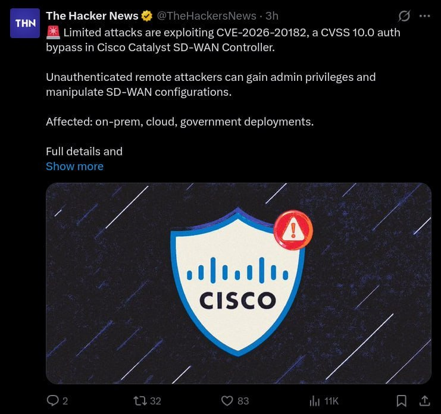

این مشکل امنیتی بعدی تو سیسکو
🤣

## mirzapanel — post 1319

  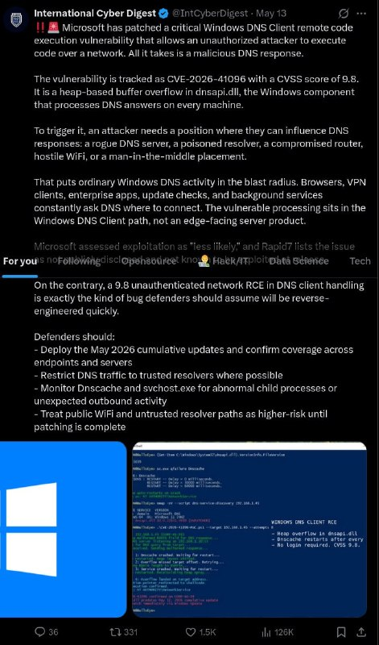

باگ بعدی: یه باگ 18 ساله از nginx پابلیک شد.

## NamazVPN — post 35541

─────────── VLESS ───────────

🔗 vless://b8aead42-eaf7-4d2e-90a4-b97135bbde26@5.145.114.132:41794?type=tcp&encryption=none&security=none#%F0%9F%87%BA%F0%9F%87%B8United%20States%20%7C%20%F0%9F%8C%90%20IP%3A%202.27.22.187%20%7C%20%E2%8F%B3ping%3A1684.44ms%20%7C%20%F0%9F%93%A2%20%40NamazVPN

📍 🇺🇸 United States
⏱️ 1684.44ms

📢 @NamazVPN

## NamazVPN — post 35540

─────────── VLESS ───────────

🔗 vless://b8aead42-eaf7-4d2e-90a4-b97135bbde26@5.145.114.132:41794?type=tcp&encryption=none&security=none#%F0%9F%87%BA%F0%9F%87%B8United%20States%20%7C%20%F0%9F%8C%90%20IP%3A%202.27.22.187%20%7C%20%E2%8F%B3ping%3A834.76ms%20%7C%20%F0%9F%93%A2%20%40NamazVPN

📍 🇺🇸 United States
⏱️ 834.76ms

📢 @NamazVPN

## NamazVPN — post 35539

─────────── VLESS ───────────

🔗 vless://26a905ec-c32e-47b8-98eb-b3b8992759ce@185.231.181.30:56756?encryption=none&type=tcp&security=none#%F0%9F%87%B9%F0%9F%87%B7T%C3%BCrkiye%20%7C%20%F0%9F%8C%90%20IP%3A%20213.142.134.155%20%7C%20%E2%8F%B3ping%3A2869.36ms%20%7C%20%F0%9F%93%A2%20%40NamazVPN

📍 🇹🇷 Türkiye
⏱️ 2869.36ms

📢 @NamazVPN

## NamazVPN — post 35538

─────────── VMESS ───────────

🔗 vmess://eyJhZGQiOiJjaXAuc2FsaW1vcmUuY29tIiwiYWlkIjoiMCIsImhvc3QiOiJjaXAuc2FsaW1vcmUuY29tIiwiaWQiOiJlNzk4ZWYyMS1iZGJjLTRmNjItODIzNC03ZDAzNWE4Y2QzZjAiLCJuZXQiOiJ3cyIsInBhdGgiOiIvd3MvIiwicG9ydCI6IjQ0MyIsInBzIjoi8J+HqfCfh6pHZXJtYW55IHwg8J+MkCBJUDogODQuMjAwLjE3Ljc1IHwg4o+zcGluZzo2MDcxLjA4bXMgfCDwn5OiIEBOYW1helZQTiIsInNjeSI6ImF1dG8iLCJzbmkiOiIiLCJ0bHMiOiJ0bHMiLCJ0eXBlIjoibm9uZSIsInYiOiIyIn0=

📍 🇩🇪 Germany
⏱️ 6071.08ms

📢 @NamazVPN

## TirexNet — post 3814

وقتی همه با شیرخورشید وصلن من با MitM وصلم همیشه متفاوت باش😪

## TirexNet — post 3813

سرور اول ( اسلیپ نت ) 🎃 همه اپراتور ها ( Vaydns+Ssh+Socks ) NULL سرور دوم ( اسلیپ نت ) 🐍 ترجیحا همراه اول (Vaydns+Ssh ) NULL | CNAME | SRV | CAA | NS | NULL ترجیحا همراه اول ( Vaydns+Socks ) NULL | NULL آموزش کامل | تنظیمات جدید | تنظیمات جدید Channel:…

## TirexNet — post 3812

  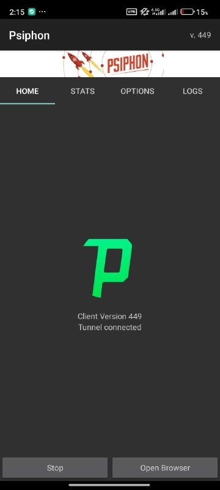

وقتی همه با شیرخورشید وصلن من با MitM وصلم
همیشه متفاوت باش😪

## TirexNet — post 3811

آیپی

151.101.192.223
151.101.64.223
151.101.0.223
151.101.66.137
151.101.2.137

میزبان

www.python.org

Channel: T.me/TirexNet

## TirexNet — post 3810

  <a href="https://t.me/TirexNet/3810" target="_blank">📎 Download file</a>

با متود Psiphon+MitM وصل بشید.

تست کنید بگید بهم
وصل بود بازم بزارم

## TirexNet — post 3809

آموزش خلاصه شده اسکن آیپی تمیز برای اپ شیر و خورشید مرحله اول ترموکس رو نصب میکنید و فیلترشکن روشن میکنید و دستور های زیر رو به ترتیب وارد میکنید ( یکیشو وارد کنید تموم شد بعدی بزنید ) 1. pkg update && pkg upgrade -y 2. pkg install nmap -y 3. termux-setup…

## TirexNet — post 3808

متصل

172.239.57.117
104.117.76.40
184.51.252.4
96.17.207.30
96.16.122.83
96.16.122.150
23.73.207.11
96.16.122.77
96.17.207.155
92.123.189.82
96.16.122.82
96.16.122.66
96.7.218.219
96.16.122.137
184.51.252.157
92.123.189.41
184.86.251.12
96.16.122.154
96.16.122.157
184.51.252.152
96.17.207.12
23.79.48.162
96.16.122.74
104.109.250.232
92.123.104.7
104.110.191.57
104.83.5.82
92.122.166.168
104.83.5.65
104.121.0.17
104.103.64.7
104.66.70.133
92.122.166.146
23.73.2.161
92.122.73.138
92.122.166.141
96.16.122.55
104.81.108.51
23.72.248.214
104.126.37.185
104.83.5.201
104.83.5.216
92.123.104.67
104.83.5.203
96.17.207.151
88.221.168.138
96.17.207.149
104.81.108.10
23.73.2.148
92.122.166.175
172.237.127.6
104.81.104.13
96.17.207.137
92.123.112.7
96.16.122.75
96.17.207.142
96.17.207.143
92.122.166.182
104.109.128.153
104.96.143.134
23.73.2.141
104.83.5.202
23.67.136.200
23.67.136.202
23.65.119.52
96.16.122.70
92.122.166.236
92.122.166.234
92.122.166.237
104.110.138.190
173.222.200.5
184.51.252.36
184.51.252.38
104.83.5.208
96.16.122.146
96.17.206.214
92.122.166.197
104.94.100.73
104.83.15.66
88.221.213.81

Channel: T.me/TirexNet

## TirexNet — post 3807

آموزش خلاصه شده اسکن آیپی تمیز برای اپ شیر و خورشید

مرحله اول

ترموکس رو نصب میکنید و فیلترشکن روشن میکنید و دستور های زیر رو به ترتیب وارد میکنید ( یکیشو وارد کنید تموم شد بعدی بزنید )

1. pkg update && pkg upgrade -y

2. pkg install nmap -y

3. termux-setup-storage

بجای گزینه ۳ بهتره از تنظیمات اپ کل دسترسی رو ب ترموکس بدین

مرحله دوم

الان میریم سراغ اسکن

فیلترشکن رو خاموش کنید

دستور زیر رو وارد میکنید

nmap -p 443 --open -T4 2.16.0.0/18

میتونید بجای 2.16.0.0/18 از رنج های زیر استفاده کنید.

104.64.0.0/10
23.32.0.0/11
23.192.0.0/11
23.0.0.0/12
172.224.0.0/12
2.16.0.0/13
23.72.0.0/13
172.232.0.0/13
184.24.0.0/13
23.64.0.0/14

نکته

نحوه شناسایی آیپی‌های فعال 👇

بعد از پایان اسکن، به دنبال خطوط زیر بگردید:

    Nmap scan report for [آی‌پی مورد نظر]
  PORT    STATE SERVICE
  443/tcp open  https
 

هر جا 443/tcp open نوشته شده بود، آن آی‌پی را ذخیره کنید.

Channel: T.me/TirexNet

## TirexNet — post 3806

بازگشت همه به سوی اسلیپه😂😂
هر وقت آیپی ها قطع میشن با اسلیپ میام تلگرام برشون میدارم

## TirexNet — post 3805

ما که با اسلیپ وصلیم ✌🏻🥀

## TirexNet — post 3804

ما که با اسلیپ وصلیم ✌🏻🥀

## TirexNet — post 3803

خودم الان با این وصلم همراه اول👇 23.208.65.40 104.103.65.50 2.23.168.47 23.215.60.41 2.21.2.9 2.21.2.10 2.16.221.37 95.101.35.112 2.23.168.250 2.21.2.91 2.21.2.34 2.21.2.104 2.23.169.105 2.16.20.51 2.16.53.11 2.16.53.50 2.16.19.136 Channel: T.me/TirexNet

## TirexNet — post 3802

خودم الان با این وصلم همراه اول👇

23.208.65.40
104.103.65.50
2.23.168.47
23.215.60.41
2.21.2.9
2.21.2.10
2.16.221.37
95.101.35.112
2.23.168.250
2.21.2.91
2.21.2.34
2.21.2.104
2.23.169.105
2.16.20.51
2.16.53.11
2.16.53.50
2.16.19.136

Channel: T.me/TirexNet

## TirexNet — post 3801

  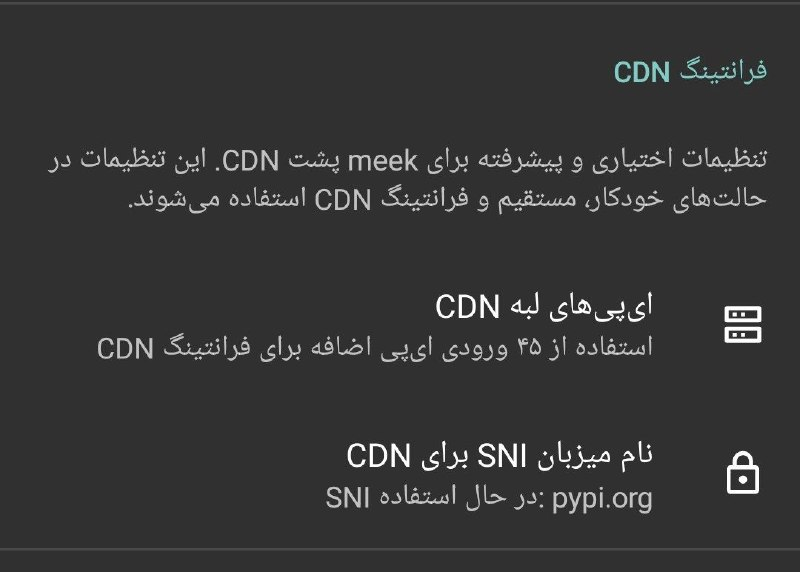

قابل توجه دوستان که نمیدونن میزبان کدومه

## TirexNet — post 3800

آیپی
84.17.46.53

میزبان
a.optnmstr.com

آیپی
13.227.192.92
میزبان
docs.mapbox.com

Channel: T.me/TirexNet

## TirexNet — post 3799

آیپی
167.82.48.223

میزبان

files.pythonhosted.org

Channel: T.me/TirexNet

## TirexNet — post 3798

آیپی Cdn
151.101.128.223

میزبان
python.org

بزنید وصل شه یک دیقه صبرکنید

## TirexNet — post 3797

هرکی وصل نیست جدیدارو امتحان کنه
اگه وصل نیستین قبلیارو پاک کنین جدیدارو بزنین حتما

## TirexNet — post 3796

متصل

151.101.64.223
151.101.0.223
151.101.128.223
151.101.192.223
92.122.123.128
2.16.186.20
2.16.186.31
2.16.186.44
2.16.186.58
2.16.186.69
2.16.186.81
2.19.204.19
2.19.204.87
2.19.204.137
2.19.204.144
2.19.204.145
2.19.204.170
2.19.204.184
2.19.204.185
2.19.204.202
2.19.204.210
2.19.204.211
2.19.204.217
2.19.204.218
2.19.204.225
2.19.204.232
2.19.204.234
2.19.204.240
2.19.204.249
2.19.204.250
2.19.204.251
2.19.205.8
2.19.205.9
2.19.205.11
2.19.205.27
2.19.205.33
2.19.205.34
2.19.205.40
2.19.205.41
2.19.205.42
2.19.205.49
2.19.205.50
2.19.205.58
2.19.205.59
2.19.205.64
2.19.205.65
2.19.205.82
2.19.205.83
2.19.205.88
2.19.205.97
2.19.205.98
2.19.205.105
2.22.151.4
2.22.151.9
2.22.151.12
2.22.151.13
2.22.151.15
2.22.151.17
2.22.151.20
2.22.151.22
2.22.151.23
2.22.151.32
2.22.151.36
2.22.151.37
2.22.151.39
2.22.151.47
2.22.151.51
2.22.151.53
2.22.151.54
2.22.151.58
2.22.151.60
2.22.151.62
2.22.151.135
2.22.151.138
2.22.151.139
2.22.151.141
2.22.151.142
2.22.151.143
2.22.151.144
2.22.151.146
2.22.151.149
2.22.151.150
2.22.151.151
2.22.151.152
2.22.151.153
2.22.151.154
2.22.151.155
2.22.151.156
2.22.151.157
2.22.151.158
2.22.151.159
2.22.151.161
2.22.151.162
2.22.151.163
2.22.151.164
2.22.151.168
2.22.151.169
2.22.151.170
2.22.151.171
2.22.151.173
2.22.151.175
2.22.151.179
2.22.151.181
2.22.151.182
2.22.151.183
2.22.151.184
2.22.151.185
2.22.151.186
2.22.151.188
2.22.151.189
2.22.151.190
2.22.151.191
2.22.151.193
2.22.151.194
2.22.151.195
23.32.5.18
23.32.5.44
23.32.5.71
23.32.5.96
23.32.5.118
23.32.5.141
23.32.5.167
23.32.5.193
23.32.5.214
23.32.5.236
23.53.35.146
23.53.35.158
23.53.35.171
23.53.35.182
23.53.35.194
23.53.35.207
23.67.253.11
23.67.253.24
23.67.253.55
23.67.253.77
23.67.253.101
23.67.253.120
23.195.81.72
23.195.81.84
23.195.81.96
23.195.81.108
50.7.5.83
63.141.252.203
65.109.34.234
92.122.123.128
94.130.13.19
94.130.33.41
94.130.50.12
94.130.70.160
95.216.69.37
96.16.97.82
96.16.97.104
96.16.97.126
96.16.97.148
96.16.97.169
96.16.97.191
104.124.148.191
104.124.148.203
138.201.54.122
142.54.178.211
144.76.1.88
184.26.163.12
184.26.163.24
184.26.163.38
184.26.163.51
184.26.163.66
184.26.163.79
184.31.169.195
184.31.169.252
184.31.170.97
184.31.170.185
184.50.87.22
184.50.87.44
184.50.87.66
184.50.87.88

Channel: T.me/TirexNet

## KalbodTeam — post 2111

❤️آپدیت جدید شیر و خورشید 
👑 شیر و خورشید یه آپدیت خیلی خیلی خفن از دیروز منتشر کرده که با دیدن ویدیو خیلی ساده میتونید وصل بشید. 
⚙️ More Options 
▶️ Connection Protocol 
▶️ CDN Fronting 
⚙️ More Options 
▶️ CDN Fronting 
▶️ CDN edge IPs: 151.101.192.223 
⚙️…

## KalbodTeam — post 2110

  <a href="telegram/content/KalbodTeam_2110_1778804169.mp4" target="_blank">🎬 Download video</a>

❤️آپدیت جدید شیر و خورشید

👑 شیر و خورشید یه آپدیت خیلی خیلی خفن از دیروز منتشر کرده که با دیدن ویدیو خیلی ساده میتونید وصل بشید.

⚙️ More Options 
▶️ Connection Protocol 
▶️ CDN Fronting

⚙️ More Options 
▶️ CDN Fronting 
▶️ CDN edge IPs:

151.101.192.223

⚙️ More Options 
▶️ CDN Fronting 
▶️ CDN SNI Hostname:

python.org

✅لینک دانلود آخرین نسخه از گیتهاب

@KalbodTeam

## KalbodTeam — post 2109

تست

## DigiGozar — post 9216

کل کسایی که اشتباه واریز کرده بودنم موجودیشون اضافه شد
✅

اشتباه بزنید به هیچ وجه دیگه پذیرفته نیست
❌

## DigiGozar — post 9215

سرعت سرورا تقریبا پایدار و خوب شده
🚀
فردا سرور رو تحویل بگیریم بهتر هم میشه

ربات هم روشنه میتونید خرید بزنید
✅

## MatinSenPaii — post 3062

  <a href="https://t.me/MatinSenPaii/3062" target="_blank">📎 Download file</a>

Last side:
متین جان اینم نسخه gui مس اسکن خیلی کار کردن باهاش راحت تره

قبل شروع اسکن باید winpcap-4.13.exe نصب بشه روی سیستم(سرچ و دانلود کنید از گوگل)

## MatinSenPaii — post 3061

  <a href="https://t.me/MatinSenPaii/3061" target="_blank">📎 Download file</a>

اسکنر بسیار پرسرعت Masscan برای اسکن آیپی‌های Akamai:

یکی از دوستان این رو نوشته و خواست بدون انتشار اسمش منتشر کنم این رو:

متین اسکنر سم و پینگ خیلی کندن

از masscan استفاده کنن چند هزارتا در ثانیه اسکن میکنه، من راحت تو ۵ ۶ دقه ۹۰ تا آیپی پیدا کردم

دراپ ریتش ولی رو نرخای بالا زیاد میشه.

کپی از چتای خودم:

چجوری اسکن کنیم؟‌ اگر masscan داشته باشید خیلی کار راحته صرفا این دستور رو بزنید:

sudo masscan 2.16.0.0/13 -p443 --rate=500 -Ss -Pn

جای اون رنج هر کدوم از رنجای زیر (رنجای آکامای هستن) رو میتونید استفاده کنید:

104.64.0.0/10
23.32.0.0/11
23.192.0.0/11
23.0.0.0/12
172.224.0.0/12
2.16.0.0/13
23.72.0.0/13
172.232.0.0/13
184.24.0.0/13
23.64.0.0/14

ریت هم می‌تونید زیاد کنید

https://github.com/robertdavidgraham/masscan

این خود پروژه
ویندوز هم داره

کل رنجای آکامای هم اتچ کردم با فلگ
-iL
میتونی بدی بهش

همشون رو هم ۵ ۶ ساعت بیشتر طول نمیکشن (خیلی زیادن)

## MatinSenPaii — post 3056

  <a href="https://t.me/MatinSenPaii/3056" target="_blank">📎 Download file</a>

چند کانفیگ سایفون‌هلپر متصل.

تمام اینها صرفا با تغییر ip یا sni در کانفیگهای

force-fastly, force-akamai

که در
https://t.me/projectXhttp/354790

قرار داده شده بدست آمده.

## MatinSenPaii — post 3055

برای اسکنر آیپی که خیلی‌هاتون پرسیده بودید دایرکت، ساده‌ترین راه اینه توی ترمینال(چه cmd ویندوز چه ترمینال termux) بنویسید
ping 20.20.20.20(آیپی مورد نظر)
حالا اگر اسکنر هوشمند بخواید، میتونید از پروژه سم استفاده کنید که اصلش برای کلودفلره، اما میتونید کلا لیست آیپی بدید اسکن کنه:
https://github.com/SamNet-dev/cfray

## archivetell — post 4933

  <a href="telegram/content/archivetell_4933_1778804174.mp4" target="_blank">🎬 Download video</a>

🎬 Video

## archivetell — post 4931

CDN Edge IPs:

151.101.0.223
151.101.128.223
151.101.192.223
65.109.34.234
151.101.64.223
142.54.178.211
2.16.53.50
2.16.53.11
95.101.133.82
95.101.133.42
104.103.65.50
2.23.168.47
104.103.64.7
2.23.168.254
2.23.168.144
2.23.169.249
2.23.169.42
2.23.170.80
104.103.65.5
95.101.133.131
104.103.65.74
2.16.20.51
23.221.28.57
23.221.29.29
23.221.28.5
2.23.169.111
2.23.168.96
2.23.169.12
2.23.168.174
2.23.168.7
184.84.221.34
2.23.41.22

CDN SNI Hostname:
python.org

## archivetell — post 4930

  <a href="telegram/content/archivetell_4930_1778804175.webm" target="_blank">🎬 Download video</a>

⭐
184.50.87.44

🫥 SNI Hostname: python.org

## archivetell — post 4929

  <a href="https://t.me/archivetell/4929" target="_blank">📎 Download file</a>

کانفیگ مستقیم MitM-DomainFronting-v16: https://github.com/patterniha/MITM-DomainFronting/releases/tag/v16 تغییرات: باز کردن موقت سایت github

## archivetell — post 4928

CDN SNI Hostname: pypi.org

Ip : 151.101.64.223

CDN SNI Hostname: a.optnmstr.com

Ip : 84.17.46.53

CDN SNI Hostname: docs.mapbox.com

Ip : 13.227.192.92

## archivetell — post 4927

کانفیگ مستقیم MitM-DomainFronting-v16:
https://github.com/patterniha/MITM-DomainFronting/releases/tag/v16

تغییرات:
باز کردن موقت سایت github

## archivetell — post 4926

📌نحوه اسکن آیپی‌‌های Akamai در ترموکس :

1⃣به یک فیلترشکن متصل بشید و ​ترموکس را باز کنید و این ۳ خط را کپی کنید و اینتر بزنید تا ابزارهای لازم نصب بشن :
pkg update && pkg upgrade -y
pkg install nmap -y
termux-setup-storage

اگر پیغامی برای دسترسی به فایل‌ها اومد، Allow را بزنید.

2⃣​حالا فیلترشکن رو خاموش کنید و دستور زیر رو بزنید :

nmap -p 443 --open -T4 2.16.0.0/1
8

‼️من در دستور از رنج آیپی 2.16.0.0/18  استفاده کردم و 4 آیپی وایتی که اسکن کرد رو براتون گذاشتم، شما میتونید اون رنج‌ رو پاک کنید و از این مخزن گیت‌هاب، سایر رنج‌ها رو در دستور جایگذاری کنید :
https://github.com/platformbuilds/Akamai-ASN-and-IPs-List

بعد از پایان اسکن، ​هر جا نوشته بود Nmap scan report for و زیرش نوشته بود 443/tcp open یعنی اون آیپی‌ وایته و باید کپیش کنید
.

بهتره رنج‌های کوچک رو اسکن کنید، اسکن رنج‌آیپی‌های بزرگ، ساعت‌ها زمان میبره

## archivetell — post 4925

🌐
184.26.163.51
CDN SNI Hostname: python.org

## archivetell — post 4924

CDN Edge IPs:
167.82.48.223

CDN SNI Hostname: files.pythonhosted.org

## archivetell — post 4923

CDN Edge IPs:
151.101.64.223

CDN SNI Hostname:
pypi.org

## archivetell — post 4922

CDN edge IPs :
151.101.128.223

CDN SNI Hostname :
python.org

## archivetell — post 4921

CDN edge IPs :
151.101.0.223

CDN SNI Hostname :
  www.python.org

## networkti — post 349

اگر شیر و خورشید وصل نمی‌شود، طبق راهنمای زیر عمل کنید. وارد بخش Options اپلیکیشن 
👑 شوید، گزینه‌ی More Options را انتخاب کنید و در قسمت CDN Edge IPs، آی‌پی زیر و در قسمت CDN SNI Hostname، نام دامنه زیر را وارد کرده و OK را بزنید. CDN Edge IPs: 151.101.192.223…

## networkti — post 348

ShirOKhorshid-2026.05.14.apk

## networkti — post 347

برای اسکنر آیپی که خیلی‌هاتون پرسیده بودید دایرکت، ساده‌ترین راه اینه توی ترمینال(چه cmd ویندوز چه ترمینال termux) بنویسید
ping 20.20.20.20(آیپی مورد نظر)
حالا اگر اسکنر هوشمند بخواید، میتونیت از پروژه سم استفاده کنید که اصلش برای کلودفلره، اما میتونید کلا لیست آیپی بدید اسکن کنه:
https://github.com/SamNet-dev/cfray

## Break_The_Barriers — post 1576

  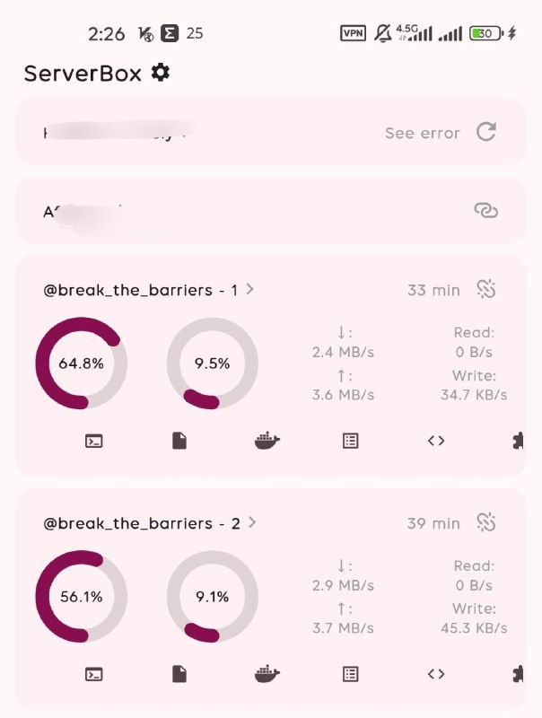

📷 Photo

## Break_The_Barriers — post 1575

آی‌پی هر دو سرور بلاک شده بودند، مجبور به تعویض شدم.

در حال‌حاضر up and running هستند.

## Break_The_Barriers — post 1574

👑

CDN Edge IPs: 167.82.48.223
CDN SNI Hostname: files.pythonhosted.org

<!-- MSG END -->

<!-- NAV START -->

<a href="https://github.com/robinsmarketonline/aio-downloader/blob/main/telegram/content/archive_1.md" style="display:inline-block; padding:6px 12px; margin:0 4px; background-color:#2ea44f; color:white; text-decoration:none; border-radius:4px; font-weight:bold;">صفحه بعد</a>

<!-- NAV END -->
