# خواننده تلگرام

<!-- TOP_NAV START -->

<!-- TOP_NAV END -->

<!-- MSG START -->

---
📅 بروزرسانی: 1405/02/24 19:53
---

## vpn_xvpn_ch — post 402

برای تست متود جدید (اشتراک لایت) به 30 نفر از اعضای کانال به قید قرعه اشتراک رایگان اختصاصی بدیم؟!🤔

## khosrow_v2ray — post 761

ShirOKhorshid-2026.05.14.apk

## khosrow_v2ray — post 760

  <a href="https://t.me/khosrow_v2ray/760" target="_blank">📎 Download file</a>

🛡مهم: اگر این نسخه رو نصب کنید دیگه دردسر ستاپ کردن MITM و... ندارید!
این نسخه حدودا یک ساعت پیش توسط برنامه‌نویس شیر و خورشید آپدیت شد و به راحتی می‌تونید طبق این آموزش بهش وصل بشید:
1- وارد اپلیکیشن شیر و خورشید(آخرین نسخه که امروز منتشر شده) می‌شید
2- وارد بخش Options میشید از نوار بالا
3- روی More Options کلیک میکنید
4- گزینه‌ی Connection Protocol رو قرار میدید روی CDN Fronting
5- میرید و عادی کانکت میشید و به راحتی وصل میشه!

## xsfilterrnet — post 3421

  <a href="telegram/content/xsfilterrnet_3421_1778775787.mp4" target="_blank">🎬 Download video</a>

نحوه اتصال با اپلیکشن شیروخورشید
⚡️

حتما نسخه اخر رو نصب داشته باشید
حالت پروکسی خاموش باشه

قسمت connection protocol  رو بذارید
cdn Fronting

قسمت cdn edge ips
92.123.102.43

قسمت CDN sni hostname
pypi.org

📥 لینک دانلود داخلی اپلیکشن شیرخورشید

https://github.com/nscl5/dl/raw/main/dl/ShirOKhorshid-2026.05.14.apk

https://uplod.ir/ag653dlw6hsu/ShirOKhorshid-2026.05.14._.htm

https://files.bokhary.fun/dump/%23%23%20Apps%20%23%23/ShirOKhorshid-2026.05.14.apk

📥 لینک داخلی ویدیو 🎥
@ConfigWireguard
• @xsfilterrnet

## xsfilterrnet — post 3420

  <a href="telegram/content/xsfilterrnet_3420_1778775788.mp4" target="_blank">🎬 Download video</a>

🍷آموزش Psiphon + MitM (فعلا روی اندروید، ویندوز هم مشابه است)

ابتدا آخرین ورژن برنامه v2rayNG رو  دانلود و نصب کنید.
لینک‌داخلی:
▫️v2rayNG — v2.1.7 (armv8 / armv7)

حال نیاز به یک سرتیفیکیت شخصی دارید برای اینکار میتوانید همان فایلهای mycert.crt, mycert.key را که در ویندوز ایجاد کردید را به گوشی خود منتقل کنید و از همان‌ها استفاده کنید یا اینکه به طور مثال میتوانید به طور مستقیم از سایت
https://regery.com/en/security/ssl-tools/self-signed-certificate-generator
آموزش نصب سرتیفیکت

کانفیگ
Psiphon-helper@patterniha.json
را ذخیره کرده و سپس از طریق گزینه‌‌ی import from locally وارد برنامهv2rayNG کنید و اجرا کنید همچنین دقت کنید که Enable Hev TUN FEATURE در تنظیمات v2rayNG فعال باشد و همچنین پورت پیشفرض 10808 را تغییر نداده باشید.

📥 لینک داخلی ویدیو
🎬 MitMd+Psiphon.mp4 5.1MB
• @patterniha
• @xsfilterrnet
• @ConfigWireguard

## xsfilterrnet — post 3419

  <a href="telegram/content/xsfilterrnet_3419_1778775790.mp4" target="_blank">🎬 Download video</a>

⚡️MitM Domin Fronting
⚡️
این پروژه یک روش برای دور زدن محدودیت‌های اینترنتی است که با ترکیب دو تکنیکMITM (Man-in-the-Middle) و Domain Fronting کار می‌کند.

این ابزار با جعل هویت سرور، داده‌های رمزگذاری‌نشده را از مرورگر دریافت کرده و سپس با استفاده از SNI جعلی به سرور اصلی می‌فرستد. در حال حاضر فقط برای برخی سرویس‌های خاص مثل گوگل (به جز یوتیوب و جمینای)، Reddit، GitHub و سرویس‌های پشت Vercel و Fastly کار می‌کند. اجرا روی ویندوز، لینوکس، مک و اندروید (بدون روت) ممکن است، اما نیاز به نصب گواهی امنیتی شخصی (سرتیفیکیت) دارد و امنیت آن کاملاً به حفظ کلید خصوصی شما وابسته است.

نکته کلیدی: این روش کانفیگ کلی اینترنت را زنده نمی‌کند، فقط دسترسی مستقیم به چند سرویس خاص را فراهم می‌سازد.(برای دانلود فایل از گیتهاب)

https://github.com/patterniha/MITM-DomainFronting
لینک کانفیگ
https://github.com/patterniha/MITM-DomainFronting/blob/b130393a6ba53a0853d59e56dc1e3c893e0f3725/Xray-config/MITM-DomainFronting.json

📥 لینک داخلی اموزش نصب سرتیفیکت
🎬 MitM.mp4 7.9MB
• @patterniha
• @xsfilterrnet
• @ConfigWireguard

## xsfilterrnet — post 3418

psiphon-helper@patterniha.json

## saministamm — post 62812

۵ تا اختصاصی 40 گیگ NPV آماده کردم واستون میزارم رفیقاتونم وصل کنید عشقا🤍. https://t.me/zeus_Vpne https://t.me/zeus_Vpne

## saministamm — post 62811

اره وصله منم امتحان کردم

## saministamm — post 62810

من وصل شدم سرعتش خوبه اینستا رو هم بالا میاره عالیه

## saministamm — post 62809

من تست کردم اوکی شد برام

## saministamm — post 62808

حاجییی وصل شدم مرسی

## saministamm — post 62807

ShirOKhorshid-2026.05.14.apk

## saministamm — post 62806

۵ تا اختصاصی 40 گیگ NPV آماده کردم واستون میزارم رفیقاتونم وصل کنید عشقا🤍. https://t.me/zeus_Vpne https://t.me/zeus_Vpne

## saministamm — post 62804

۵ تا اختصاصی 40 گیگ NPV آماده کردم واستون میزارم رفیقاتونم وصل کنید عشقا🤍.
https://t.me/zeus_Vpne
https://t.me/zeus_Vpne

## saministamm — post 62803

🚨روزنامه اعتماد آنلاین:

اینترنت بین الملل خرداد ماه وصل میشه.

## saministamm — post 62802

دمت گرممممم سمی😍😍
وصل شدممم

## saministamm — post 62801

داداش دمت گرم وصل شد

## saministamm — post 62800

ShirOKhorshid-2026.05.14.apk

## saministamm — post 62799

ShirOKhorshid-2026.05.14.apk

## saministamm — post 62798

  <a href="https://t.me/saministamm/62798" target="_blank">📎 Download file</a>

فایل دانلود برنامه ی شیر و خورشید برای اندروید :

- فضای این برنامه کاملا شبیه سایفون هستش ولی با قابلیت CDN که باعث شده بدون کانفیگ ترکیبی درحال حاضر اتصال پایدار تری نسبت به سایفون و دیگر روش های رایگان ارائه بده

کانال ما : @saministamm
" آموزش اتصال پست بعدی "

## saministamm — post 62797

Tarkibi V2+ Psiphon
vless://9ea9e54b-d4da-4773-855a-e5371e4da946@snapp.ir:80?path=%2F&security=none&encryption=none&host=hubfile.zpax.ir&type=ws#@saministamm

## saministamm — post 62796

## saministamm — post 62793

پروکسی های متصل :
https://t.me/proxy?server=195.254.165.252&port=25565&secret=dd79e344818749bd7ac519130220c25d09

https://t.me/proxy?server=195.254.165.253&port=25565&secret=dd79e344818749bd7ac519130220c25d09

https://t.me/proxy?server=195.254.165.249&port=25565&secret=dd79e344818749bd7ac519130220c25d09

## saministamm — post 62792

🚀 𝗣𝘀𝗶𝗽𝗵𝗼𝗻 𝗣𝗿𝗼𝘅𝘆

Host:
87.107.54.147

Port:
8888

@saministamm

## saministamm — post 62791

vless://9ea9e54b-d4da-4773-855a-e5371e4da946@snapp.ir:80?path=%2F&security=none&encryption=none&host=hubfile.zpax.ir&type=ws#@saministamm
V2rayng + Psiphon

## saministamm — post 62790

Psiphon or shir o khorshid⚡️

Host: 81.91.147.147
Port:10443

@saministamm

## Skyportall — post 10678

سرعتش رو یوتیوب بچها فرستادن

## Skyportall — post 10677

  <a href="telegram/content/Skyportall_10677_1778775792.mp4" target="_blank">🎬 Download video</a>

🎬 Video

## Skyportall — post 10676

داش بنظرت این لیست ایپی تا کی دووم میاره

## Skyportall — post 10675

داش بنظرت این لیست ایپی تا کی دووم میاره

## Skyportall — post 10674

به کمک آیپی های فایل آخر که گذاشتید وصل شدم. تنظیماتم همون که نوشتید خطمم ایرانسل

## Skyportall — post 10673

  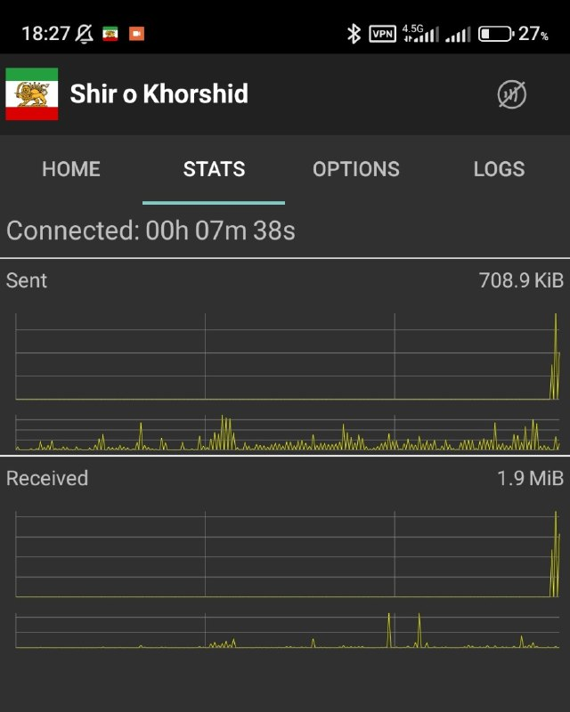

به کمک آیپی های فایل آخر که گذاشتید وصل شدم.
تنظیماتم همون که نوشتید
خطمم ایرانسل

## Skyportall — post 10672

  <a href="telegram/content/Skyportall_10672_1778775794.webm" target="_blank">🎬 Download video</a>

سلام وقت بخیر این روش شیرو خورشید ویدیو اموزشی داره !؟

## Skyportall — post 10671

سلام وقت بخیر
این روش شیرو خورشید ویدیو اموزشی داره !؟

## Skyportall — post 10670

  <a href="https://t.me/Skyportall/10670" target="_blank">📎 Download file</a>

🔴این فایل حاوی 5142 آیپی وایت Akamai هست.

فقط Select All کنید و همشو کپی کنید، وارد تنظیمات شیروخورشید بشید، آیپی‌ها رو در کادر CDN edge IPs وارد کنید.

حتما Connection Protocol روی CDN Fronting باشه.

⚡️ @Skyportall

## Skyportall — post 10669

همچنان وصله
✅

## Skyportall — post 10665

  <a href="telegram/content/Skyportall_10665_1778775794.webm" target="_blank">🎬 Download video</a>

بچه ها همگی وصلن خداروشکر. تنبلی نکنید روش رایگانه محدودیتم نداره میتونید به کارتون برسید
😊

همه شاتارو نفرستادم دیگه خیلی زیاد بودن. ممنون از دایرکتاتون
❤️

دونیت به پترنیها عزیز و حمایت ازشون یادتون نره اگه شرایطشو دارید

## Skyportall — post 10664

  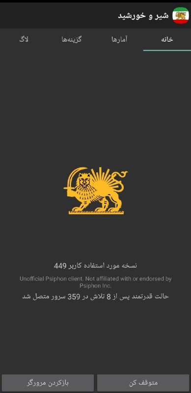

ایرانسل

## Skyportall — post 10663

  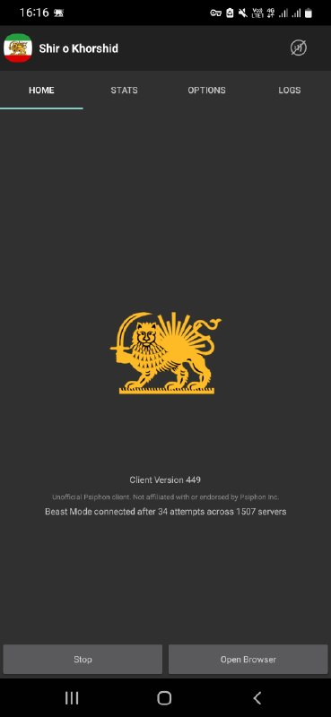

عالیه داداش سرعت عالی همه چی باز میکنه ❤️
من همراه هستم

## Skyportall — post 10662

  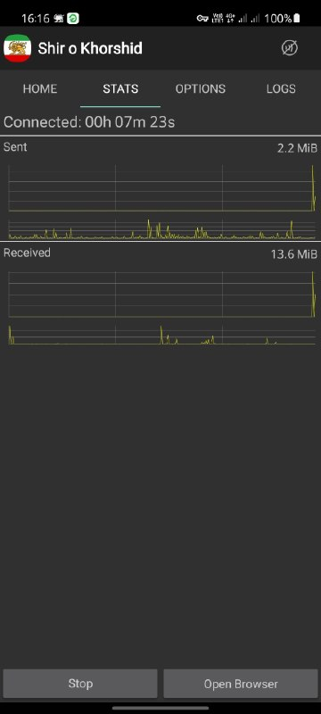

رو همراه

## Skyportall — post 10661

وای مرسی واقعا
سرعتشم خیلی خوبه یوتیوب و اسپایتفای میاره
حداقل دیگه میتونم به کارام برسم💔

## Skyportall — post 10660

من با شیر و خورشید همین الان وصلم اینستا رو هم راحت با سرعت خوب میاره

## Skyportall — post 10659

خط همراه اول هستن

## Skyportall — post 10658

  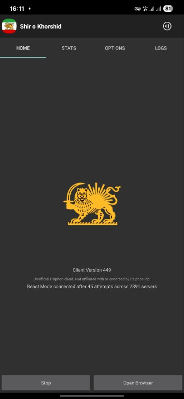

📷 Photo

## Skyportall — post 10657

psiphon-helper@patterniha.json

## Skyportall — post 10656

  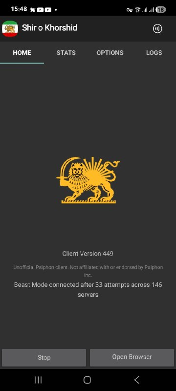

دم سازندش گرم متصله

توی قسمت cdn edge ips یه ایپی وارد کنید

## hamedvpns — post 18848

انگار صاحب تلگرام منم هر چی میزارم تو ثانیه دوم در 100 کانال پخش شده چه خبره اینجا همه صاحب کانال هستن انگار

آغا من اعضای معمولی میخوام ن صاحب کانال

## hamedvpns — post 18847

اینا اوکی بود برام

قسمت sni host رو پاک کنید فقط این آیپی ها رو بزنید کافیه .

2.19.204.194
2.19.204.210
2.19.205.9
2.19.204.202
2.19.205.82
2.19.205.58

بی‌صدا تست کنید .

## hamedvpns — post 18846

  <a href="telegram/content/hamedvpns_18846_1778775797.mp4" target="_blank">🎬 Download video</a>

نحوه اتصال با اپلیکشن شیروخورشید

حتما نسخه اخر رو نصب داشته باشید
حالت پروکسی خاموش باشه

قسمت connection protocol  رو بذارید
cdn Fronting

قسمت cdn edge ips
92.123.102.43

قسمت CDN sni hostname
pypi.org

📥 لینک دانلود داخلی اپلیکشن شیرخورشید

https://github.com/nscl5/dl/raw/main/dl/ShirOKhorshid-2026.05.14.apk

https://uplod.ir/ag653dlw6hsu/ShirOKhorshid-2026.05.14._.htm

https://uploadkon.ir/uploads/47a614_26Shir-2026-05-14-2.rar

https://files.bokhary.fun/dump/%23%23%20Apps%20%23%23/ShirOKhorshid-2026.05.14.apk
@ConfigWireguard

❤️ اشتراک گذاری یادتون نره 🌈

‌‌@hamedvpns ☑️

لایک   |   Like 👍❤️
اشتراک بزارین   |   Share ⭐️

## hamedvpns — post 18844

آپدیت جدید شیر و خورشید :

https://uplod.ir/ag653dlw6hsu/ShirOKhorshid-2026.05.14._.htm

https://github.com/nscl5/dl/raw/main/dl/ShirOKhorshid-2026.05.14.apk

https://files.bokhary.fun/dump/%23%23%20Apps%20%23%23/ShirOKhorshid-2026.05.14.apk

https://punkpaste.ir/f/ShirOKhorshid-2026-0-kfbv0z

همش یکسانه هر کدوم راحت هستید بزنید.

‌‌@hamedvpns ☑️

لایک   |   Like 👍❤️
اشتراک بزارین   |   Share ⭐

## hamedvpns — post 18843

لینک دانلود داخلی شیر و خورشید:

https://punkpaste.ir/f/ShirOKhorshid-2026-0-91bfdn

لینک دانلود داخلی سایفون :

https://punkpaste.ir/f/Psiphon-y3n8em

‌‌@hamedvpns ☑️

لایک   |   Like 👍❤️
اشتراک بزارین   |   Share ⭐

## hamedvpns — post 18842

  <a href="https://t.me/hamedvpns/18842" target="_blank">📎 Download file</a>

کانفیگ جدید v2rayNG برای
متود Psiphon—MITM

آموزش متود و موارد مورد نیاز 👉

❤️ اشتراک گذاری یادتون نره 🌈

..
‌‌@hamedvpns ☑️

لایک   |   Like 👍❤️
اشتراک بزارین   |   Share ⭐

## hamedvpns — post 18841

در حرکتی که فقط از چپا میتونید ببینید اتوبوس تیم فوتبال جمهوری اسلامی رو با شعار مرگ بر آمریکا بدرقه کردن تا بره آمریکا 😄

@PiknikAnalyst

## hamedvpns — post 18840

کانفیگ ترکیبی ویتورای با سایفون ✅

آموزش اتصال ترکیبی 👉👉

حتما ترکیبی متصل بشید .

vless://93ad8297-fad9-46e7-a0ca-6b91fcf36c10@s4.tehranionliine.ir:80?type=ws&path=%2F&security=none#💎Aman_vpn

تست شده و متصل هست 💯

ارسالی امیرحسین ❤️
@Aman_vpn

..
‌‌@hamedvpns ☑️

لایک   |   Like 👍❤️
اشتراک بزارین   |   Share ⭐️

## ConfigWireguard — post 31696

  <a href="https://t.me/ConfigWireguard/31696" target="_blank">📎 Download file</a>

Akamai IP Scanner

۱. لیست رنج‌های هدف (با پشتیبانی از تمام فرمت‌ها مثل 16/ یا 24/) را در فایل ips.txt قرار دهید. (پیشفرض قرار داده شده)

۲. روی فایل scan.ps1 راست‌کلیک کرده و گزینه Run with PowerShell را برای شروع اسکن انتخاب کنید.

۳. بهترین آی‌پی‌ها به‌صورت لحظه‌ای در clean_ips.txt ذخیره می‌شوند (هر زمان مایل بودید می‌توانید اسکن را متوقف کنید).
آیپی های سالم رو میتونید داخل بخش
CDN EDGE IPS
برنامه شیر و خورشید وارد کنید سرعتش بهتر میشه

## ConfigWireguard — post 31695

روی سرور ایتالیا خوب وصل میشه
Cdn edge IPs:

92.122.123.128
2.19.204.87
2.19.204.137
2.19.204.144
2.19.204.145
2.19.204.170
2.19.204.184
2.19.204.185
2.19.204.202
2.19.204.210

## ConfigWireguard — post 31694

نحوه اتصال با اپلیکشن شیروخورشید حتما نسخه اخر رو نصب داشته باشید حالت پروکسی خاموش باشه قسمت connection protocol  رو بذارید cdn Fronting قسمت cdn edge ips 92.123.102.43 قسمت CDN sni hostname یکی از اینا pypi.org a248.e.akamai.net 📥 لینک دانلود داخلی…

## ConfigWireguard — post 31693

  <a href="telegram/content/ConfigWireguard_31693_1778775799.mp4" target="_blank">🎬 Download video</a>

نحوه اتصال با اپلیکشن شیروخورشید

حتما نسخه اخر رو نصب داشته باشید
حالت پروکسی خاموش باشه

قسمت connection protocol  رو بذارید
cdn Fronting

قسمت cdn edge ips
92.123.102.43

قسمت CDN sni hostname یکی از اینا
pypi.org
a248.e.akamai.net

📥 لینک دانلود داخلی اپلیکشن شیرخورشید

https://github.com/nscl5/dl/raw/main/dl/ShirOKhorshid-2026.05.14.apk

https://uplod.ir/ag653dlw6hsu/ShirOKhorshid-2026.05.14._.htm

https://files.bokhary.fun/dump/%23%23%20Apps%20%23%23/ShirOKhorshid-2026.05.14.apk

📥 لینک داخلی ویدیو 🎥
@ConfigWireguard

## ConfigWireguard — post 31692

MitM Domin Fronting این پروژه یک روش برای دور زدن محدودیت‌های اینترنتی است که با ترکیب دو تکنیکMITM (Man-in-the-Middle) و Domain Fronting کار می‌کند این ابزار با جعل هویت سرور، داده‌های رمزگذاری‌نشده را از مرورگر دریافت کرده و سپس با استفاده از SNI جعلی به…

## ConfigWireguard — post 31691

  <a href="telegram/content/ConfigWireguard_31691_1778775800.mp4" target="_blank">🎬 Download video</a>

آموزش Psiphon + MitM (فعلا روی اندروید، ویندوز هم مشابه است)

ابتدا آخرین ورژن برنامه v2rayNG رو  دانلود و نصب کنید.
لینک‌داخلی:
▫️v2rayNG — v2.1.7 (armv8 / armv7)

حال نیاز به یک سرتیفیکیت شخصی دارید برای اینکار میتوانید همان فایلهای mycert.crt, mycert.key را که در ویندوز ایجاد کردید را به گوشی خود منتقل کنید و از همان‌ها استفاده کنید یا اینکه به طور مثال میتوانید به طور مستقیم از سایت
https://regery.com/en/security/ssl-tools/self-signed-certificate-generator
آموزش نصب سرتیفیکت

کانفیگ
Psiphon-helper@patterniha.json
را ذخیره کرده و سپس از طریق گزینه‌‌ی import from locally وارد برنامهv2rayNG کنید و اجرا کنید همچنین دقت کنید که Enable Hev TUN FEATURE در تنظیمات v2rayNG فعال باشد و همچنین پورت پیشفرض 10808 را تغییر نداده باشید.
📥 لینک داخلی ویدیو
🎬 MitMd+Psiphon.mp4 5.1MB
📱 Psiphon v462 Mod.apk 25.1MB
📱 PsiphonAndroid.apk 21.9MB
💻 psiphon3.exe 9.9MB
• @patterniha
• @ConfigWireguard

## ConfigWireguard — post 31690

  <a href="telegram/content/ConfigWireguard_31690_1778775802.mp4" target="_blank">🎬 Download video</a>

MitM Domin Fronting
این پروژه یک روش برای دور زدن محدودیت‌های اینترنتی است که با ترکیب دو تکنیکMITM (Man-in-the-Middle) و Domain Fronting کار می‌کند

این ابزار با جعل هویت سرور، داده‌های رمزگذاری‌نشده را از مرورگر دریافت کرده و سپس با استفاده از SNI جعلی به سرور اصلی می‌فرستد. در حال حاضر فقط برای برخی سرویس‌های خاص مثل گوگل (به جز یوتیوب و جمینای)، Reddit، GitHub و سرویس‌های پشت Vercel و Fastly کار می‌کند. اجرا روی ویندوز، لینوکس، مک و اندروید (بدون روت) ممکن است، اما نیاز به نصب گواهی امنیتی شخصی (سرتیفیکیت) دارد و امنیت آن کاملاً به حفظ کلید خصوصی شما وابسته است.

نکته کلیدی: این روش کانفیگ کلی اینترنت را زنده نمی‌کند، فقط دسترسی مستقیم به چند سرویس خاص را فراهم می‌سازد.(برای دانلود فایل از گیتهاب)

https://github.com/patterniha/MITM-DomainFronting
لینک کانفیگ
https://github.com/patterniha/MITM-DomainFronting/blob/b130393a6ba53a0853d59e56dc1e3c893e0f3725/Xray-config/MITM-DomainFronting.json
📥 لینک داخلی اموزش نصب سرتیفیکت
🎬 MitM.mp4 7.9MB
• @patterniha
• @ConfigWireguard

## ircfspace — post 2335

  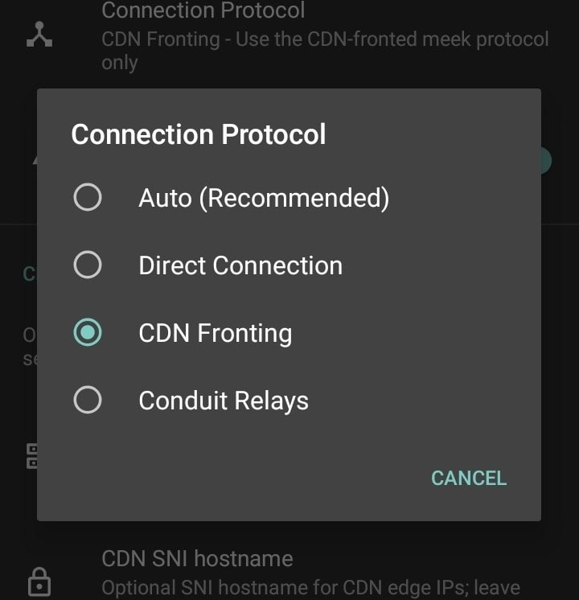

روش MITM در آپدیت جدید از اپ اندروید #شیروخورشید گنجونده شده و می‌تونین بدون دردسر ازش استفاده کنین.
برای استفاده بعد از نصب یا بروزرسانی، باید وارد Options، سپس More Options و بخش Connection Protocol شده و CDN Fronting رو انتخاب کنین.
همینطور در قسمت CDN edge IPs اگر IPهای وایت‌لیست شده Akamai رو بذارید، سرعت اتصال بهتر میشه.

👉 github.com/shirokhorshid/shirokhorshid-android/releases/latest
💡 t.me/PersianGithubMirror/4954
© PawnToPromotion, mahdavi

🔗 ᴡᴇʙꜱɪᴛᴇ • ᴠᴘɴʜᴜʙ • ɢɪᴛʜᴜʙᴍɪʀʀᴏʀ
@ircfspace

## ircfspace — post 2334

نحوه اتصال رایگان و نامحدود به اینترنت آزاد با متد ترکیبی MITM + Psiphon

👉 github.com/patterniha/MITM-DomainFronting
© patterniha, MatinSenPaii

🔗 ᴡᴇʙꜱɪᴛᴇ • ᴠᴘɴʜᴜʙ • ɢɪᴛʜᴜʙᴍɪʀʀᴏʀ
@ircfspace

## Zel2oVPN — post 2774

iP جدید

2.23.227.196
2.17.147.11
2.18.64.9
2.18.64.4
2.18.64.5
2.22.114.98
95.100.153.184
95.101.27.196
2.17.96.131
95.101.137.74
95.101.78.25
2.23.245.35
2.16.168.107
2.17.100.250
2.16.245.188
2.17.100.130
95.100.110.28
2.22.89.43
2.18.63.33
95.100.153.186
2.22.151.140
95.100.177.68
95.101.61.215
95.101.27.71
2.23.227.218
2.23.227.209
2.23.227.221
2.17.100.218
2.17.97.198
95.101.27.101
2.17.240.5
2.16.106.222
95.101.234.87
2.21.33.113
23.194.20.27
95.101.38.176
95.101.35.113
2.17.100.225
2.16.168.214
2.17.113.121
2.23.227.212
2.23.227.219
23.212.110.218
95.101.35.96
2.17.96.158
2.16.168.208
2.16.245.174
2.16.245.173
23.192.237.219
2.17.152.213
2.17.100.200
2.22.112.208
2.23.172.114
2.23.227.199
2.23.227.215
2.21.134.89
2.17.100.136
2.23.90.148
95.101.111.168
23.219.79.75
2.16.168.122
2.16.168.123
95.100.177.112
23.192.24.7
23.12.157.106
2.16.245.133
23.52.22.3
2.17.147.218
23.216.134.80
23.55.163.135
23.46.188.71
2.17.100.169
95.101.234.88
2.22.151.152
2.17.241.119
95.101.122.131
95.101.111.161
2.21.245.14
2.18.172.59
95.101.234.90
23.11.41.157
95.101.38.158
2.16.164.34
2.16.164.89

✅ حواستون باشه قسمت CDN sni خالی باشه

☑➜@Zel2oVPN

## Zel2oVPN — post 2773

iP جدید
✅همه رو کپی کنید بزنید خودش به ای پی متصل وصل میشه فقط حواستون باشه که CDN sni خالی باشه

2.19.204.225
2.19.204.232
2.19.204.234
2.19.204.240
2.19.204.249
2.19.204.250
2.19.204.251
2.19.205.8
2.19.205.9
2.19.205.11
2.19.205.27
2.19.205.33
2.19.205.34
2.19.205.40
2.19.205.41
2.19.205.42
2.19.205.49
2.19.205.50
2.19.205.58
2.19.205.59
2.19.205.64
2.19.205.65
2.19.205.82
2.19.205.83
2.19.205.88
2.19.205.97
2.19.205.98
2.19.205.105

☑➜@Zel2oVPN 

## Zel2oVPN — post 2772

2.19.204.251

2.19.204.225

این ای پی رو ایرانسل متصله وصلم باهاش ♥️

فقط ای پی رو بزنید و sni رو پاک کنید

☑➜@Zel2oVPN

## Zel2oVPN — post 2771

92.123.102.43
ایپی

a248.e.akamai.net
نام میزبان

اونایی  ک وصل شدن و دوباره وصل نمیشن اینو تست کنن

☑➜@Zel2oVPN

## Zel2oVPN — post 2770

iP شیر و خورشید

92.122.123.128
2.19.204.87
2.19.204.137
2.19.204.144
2.19.204.145
2.19.204.170
2.19.204.184
2.19.204.185
2.19.204.202
2.19.204.210

Sni hostname

pypi.org

☑➜@Zel2oVPN

## Zel2oVPN — post 2769

  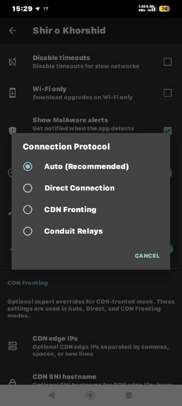

فیلترینگ با متود CDN-Fronting (فول تانل)(اندروید) اتصال بدون نیاز به v2rayNG و نصب سرتیفیکیت مخصوص برنامه شیر و خورشید چند آیپی قابل استفاده : 151.101.64.223 151.101.0.223 151.101.128.223 151.101.192.223 ☑➜@Zel2oVPN

## Zel2oVPN — post 2768

ShirOKhorshid-[@Zel2oVPN].apk

## Zel2oVPN — post 2767

  <a href="https://t.me/Zel2oVPN/2767" target="_blank">📎 Download file</a>

اپدیت جدید شیر و خورشید

نسخه: 2026.05.14

لینک دانلود داخلی

☑➜@Zel2oVPN

## Zel2oVPN — post 2766

  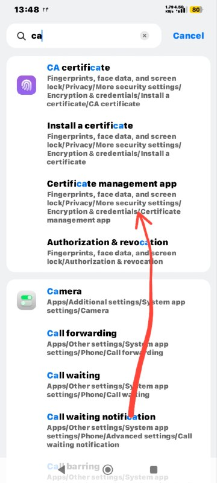

این آموزش فقط برای اونایی هس که نگران به خطر افتادن اطلاعاتشون هسن و میخوان مجوز نصب شده رو پاک کنن ♥️
اینم برای اونایی که زبان گوشیشون انگلیسی هس وارد تنظیمات میشین تو قسمت جستجو ca رو سرچ میکنید بعدش گزینه ای که علامت زدم روش ضربه میزنید
بعدش وارد قسمت Trusted credentials میشید
بعدش تمام مجوز های خود گوشی براتون بالا میاد با مجوز های system کاری نداشته باشید روی گزینه user ضربه بزنید بعدش مجوز نصب کرده رو پاک کنید و تمام♥️

آموزش حذف مجوز به زبان فارسی

خیلیا با این آموزش وصل شدن یه عده هم نگران بودن چجوری حذفش کنن منم لازم دونسم آموزشش رو بذارم با تشکر

☑➜@Zel2oVPN

## Zel2oVPN — post 2765

پروکسی سایفون ϟ 𝐏𝐬𝐢𝐩𝐡𝐨𝐧 𝐏𝐫𝐨𝐱𝐲

Ip : 81.91.147.147
Port : 10443

Ip : 87.107.54.147
Port : 8888

اولی بهتر و سریع تر وصل می‌شه.  دومی خیلی ناپایدار هستش 🙏

‼️ در بخش options -> proxy settings وارد بشه

☑➜@Zel2oVPN

## Zel2oVPN — post 2764

✔️VayDNS [S121]

slipnet-enc://Aa0nOVZ1Llc91ZftFiZY3aY7hS58yMTsVHWZYlmTMAmDp+aBTNQDpnJRwsXzI2LanLGyvdgd7HwbdH8cwC4iZCFN6V9Z1IPNRtqyRMD4yBk4Xb7eQlzzJT108pJw8Hk2KTKfG91dWn0zCoXpbDaCqvb44TlKbqR+bszsUzmsVjYopzjiqAzLQEC+tm3q0tLpRvuNmYhLJK1BFD+pMg1h6c1jsivwQkZuPPPyOWncf91nryRozRF8c+lyaDp6NENyjYLekya6fI8eoDXjBLw6YAi21YOlHmI32gW+38t9PT4eJ2wfoLzOVoN5iPOhB7uXzNEtupDBBvpB6bexZ1QVWEFEwNmgVThsGB+3nY2nqo1hA55mVDYgmS4CYYvh9oHkGtPnDbahyCJ5S7LujUSBfOYXsahlUx/mcFKiZeN150aEVVnFDk3MHYHslP3pNVAGJrgfVpNLh4bTmdSckCWDvRpinrJqqr+8uRorD76dz203K0jLgimZbcP2b1W1KsVW2i2EHcqCcMgFCR4CWStlTtSxnCFR1FUybMANq9nmUcT1TB5l+eJbFIkFhX/+bvXQNBYoV78jtFrs7gatPFWX9sMyF+Jxbv1sXocbR9IlhTaDDsN5wVFS4ms9LKgoTobd5jDuHMEoGx7D/MNqERjp0aSq7kOBL495Qi3xyjUeztQ/ZXNeCbWO2m/03Xb7qInY

📱کانفیگ اسلیپ

📱مخصوص نسخه جدید  2.5.3

📱دانلود نسخه جدید

📱تنظیمات پیشنهادی

https://t.me/socks?server=127.0.0.1&port=10880&user=%40Zel2oVPN

☑➜@Zel2oVPN

## Zel2oVPN — post 2763

سرور StormDNS✅
مناسب برای WhiteDNS◽️

stormdns://eyJzY2hlbWEiOiJ3aGl0ZWRucy5wcm9maWxlIiwidmVyc2lvbiI6MSwicHJvZmlsZSI6eyJuYW1lIjoiQE1hc2lyX1NlZmlk8J-ViigxKSIsInNlcnZlciI6eyJkb21haW4iOiJ2MS5tYXNpci1zZWZpZC0xLnNob3AiLCJlbmNyeXB0aW9uX2tleSI6IlRlbGVncmFtLUNoYW5uZWwtLS0-QE1hc2lyX1NlZmlkIiwiZW5jcnlwdGlvbl9tZXRob2QiOjF9fX0
stormdns://eyJzY2hlbWEiOiJ3aGl0ZWRucy5wcm9maWxlIiwidmVyc2lvbiI6MSwicHJvZmlsZSI6eyJuYW1lIjoiQE1hc2lyX1NlZmlk8J-ViigyKSIsInNlcnZlciI6eyJkb21haW4iOiJ2Mi5tYXNpci1zZWZpZC0xLnNob3AiLCJlbmNyeXB0aW9uX2tleSI6IlRlbGVncmFtLUNoYW5uZWwtLS0-QE1hc2lyX1NlZmlkIiwiZW5jcnlwdGlvbl9tZXRob2QiOjF9fX0
stormdns://eyJzY2hlbWEiOiJ3aGl0ZWRucy5wcm9maWxlIiwidmVyc2lvbiI6MSwicHJvZmlsZSI6eyJuYW1lIjoiQE1hc2lyX1NlZmlk8J-ViigzKSIsInNlcnZlciI6eyJkb21haW4iOiJ2My5tYXNpci1zZWZpZC0xLnNob3AiLCJlbmNyeXB0aW9uX2tleSI6IlRlbGVncmFtLUNoYW5uZWwtLS0-QE1hc2lyX1NlZmlkIiwiZW5jcnlwdGlvbl9tZXRob2QiOjF9fX0
stormdns://eyJzY2hlbWEiOiJ3aGl0ZWRucy5wcm9maWxlIiwidmVyc2lvbiI6MSwicHJvZmlsZSI6eyJuYW1lIjoiQE1hc2lyX1NlZmlk8J-Viig0KSIsInNlcnZlciI6eyJkb21haW4iOiJ2NC5tYXNpci1zZWZpZC0xLnNob3AiLCJlbmNyeXB0aW9uX2tleSI6IlRlbGVncmFtLUNoYW5uZWwtLS0-QE1hc2lyX1NlZmlkIiwiZW5jcnlwdGlvbl9tZXRob2QiOjF9fX0
stormdns://eyJzY2hlbWEiOiJ3aGl0ZWRucy5wcm9maWxlIiwidmVyc2lvbiI6MSwicHJvZmlsZSI6eyJuYW1lIjoiQE1hc2lyX1NlZmlk8J-Viig1KSIsInNlcnZlciI6eyJkb21haW4iOiJ2NS5tYXNpci1zZWZpZC0xLnNob3AiLCJlbmNyeXB0aW9uX2tleSI6IlRlbGVncmFtLUNoYW5uZWwtLS0-QE1hc2lyX1NlZmlkIiwiZW5jcnlwdGlvbl9tZXRob2QiOjF9fX0

☑➜@Zel2oVPN

## Zel2oVPN — post 2762

ریزالور جدید✅

103.215.223.64
109.125.169.20
109.230.89.139
109.230.91.227
109.230.91.228
109.230.91.229
109.238.187.193
134.255.206.206
151.234.161.241
164.138.17.122
176.65.241.236
178.252.133.115
178.252.143.133
178.252.170.218
178.252.178.205
185.106.147.227
185.125.248.57
185.125.248.58
185.126.5.40
185.126.5.41
185.128.138.2
185.129.170.75
185.140.240.94
185.140.242.134
185.145.8.254
185.155.14.130
185.164.74.247
185.181.180.235
185.206.229.32
185.206.229.36
185.208.183.29
185.224.179.186
185.229.31.77
185.53.142.174
185.66.224.24
185.66.228.26
185.66.229.138
185.88.153.12
185.88.178.196
185.94.96.161
188.121.157.181
188.136.162.211
188.136.208.244
188.212.22.141
188.75.95.22
2.179.166.58
2.179.179.185
2.180.31.171
2.187.35.19
2.188.162.71
2.188.162.72
2.188.162.76
2.188.162.77
2.188.162.78
2.188.166.74
2.188.166.75
2.188.166.78
2.188.214.203
2.188.218.178
2.189.1.10
2.189.1.12
2.189.1.13
2.189.1.14
2.189.1.15
2.189.1.19
2.189.1.1
2.189.1.2
212.16.86.112
212.33.206.102
212.33.206.152
213.176.123.5
213.176.29.136
213.207.195.146
213.207.198.254
217.144.107.162
217.219.34.49
217.219.34.66
31.214.169.254
31.7.70.68
31.7.78.205
37.148.100.151
37.148.13.183
37.148.23.20
37.148.35.89
37.156.146.147
37.191.76.110
37.191.93.221
37.191.93.222
37.255.221.16
37.255.240.167
37.32.10.135
37.32.127.133
37.75.244.51
37.75.244.52
45.159.112.79
45.81.17.27
45.81.19.11
45.92.94.189
45.92.94.208
46.100.134.21
46.100.55.232
46.100.55.67
46.100.58.243
46.100.9.184
46.148.32.174
46.209.157.19
46.209.157.22
46.209.240.130
46.209.241.81
46.209.48.3
46.209.48.4
46.209.48.5
46.209.92.54
46.245.78.84
46.245.98.133
46.34.165.60
46.34.165.63
5.159.51.2
5.159.51.30
5.159.55.55
5.160.115.130
5.160.118.186
5.160.13.82
5.160.13.85
5.160.13.86
5.160.242.48
5.160.32.158
5.160.38.78
5.160.43.195
5.160.78.238
5.160.79.219
5.160.79.56
5.160.90.86
5.190.209.10
5.202.177.196
5.202.177.197
5.202.182.222
5.202.248.119
5.202.248.74
5.202.53.21
5.238.192.85
5.239.245.240
5.239.245.245
5.239.245.249
5.239.245.250
62.60.196.11
62.60.197.83
77.104.115.161
77.104.115.162
77.104.126.43
77.237.82.2
77.237.85.193
77.238.123.179
78.38.174.30
78.39.112.50
78.39.50.234
78.39.98.28
79.175.151.56
79.175.172.98
80.191.163.251
80.191.221.14
80.191.221.19
80.191.221.22
80.191.221.28
80.191.221.30
80.191.221.32
80.191.221.61
80.191.223.247
80.191.241.194
80.191.255.18
80.191.40.147
80.210.29.71
80.210.40.54
80.210.41.48
80.75.9.252
81.12.109.19
81.12.60.10
81.12.65.135
81.12.71.10
81.12.72.234
81.12.98.2
81.12.99.101
81.12.99.102
81.12.99.104
81.16.116.138
81.16.126.112
81.28.38.179
81.28.57.2
81.28.60.98
81.90.145.121
81.91.156.186
82.99.249.230
84.241.60.28
85.133.160.236
85.133.160.240
85.133.162.44
85.133.184.69
85.185.105.104
85.185.75.75
85.198.31.113
87.107.139.254
87.107.16.222
87.107.18.1
87.107.18.22
87.107.44.2
87.107.45.9
87.107.65.78
87.248.138.33
87.248.151.59
89.46.218.24
89.46.219.179
89.46.219.180
91.212.252.48
91.243.160.166
91.243.175.140
91.92.124.88
91.92.185.232
91.92.186.50
92.242.216.150
92.246.147.81
93.114.104.185
93.118.108.195
93.118.122.247
93.118.148.30
93.118.160.189
93.118.166.195
94.182.198.30
94.182.214.34
94.182.54.5
94.182.56.254
94.183.52.95
94.183.95.208
95.80.184.15

☑➜@Zel2oVPN

## whitedns — post 616

نسخه ۱.۰.۲ 🔄 WhiteDns Windows

آموزش خیلی مقدماتی و ساده برای استفاده از این نسخه
@whitedns

## whitedns — post 615

  <a href="https://t.me/whitedns/615" target="_blank">📎 Download file</a>

Whitedns windows v1.0.2

## whitedns — post 614

  

نسخه ۱.۰.۲ 🔄 WhiteDns Windows

🔥
🔥
🔥
🔥

نسخه ۱.۰.۲ بر پایداری، قابلیت استفاده و تشخیص‌های بسیار قوی‌تر رزولور تمرکز دارد. 🛠

این بروزرسانی مشکل آکاردئون را در بخش تنظیمات پیشرفته اصلاح می‌کند تا بخش‌ها با قابلیت اطمینان بیشتری باز و بسته شوند و چیدمان تنظیمات رفتار سازگارتری داشته باشد. همچنین اسکنر رزولور را با یک حالت اسکن پیشرفته جدید بهبود می‌بخشد که رزولورها را به روشی واقع‌گرایانه‌تر و آگاه به تونل، با استفاده از دامنه فعال تونل آزمایش می‌کند، از جمله بررسی‌های DNS بدون کش، قابلیت EDNS0، یکپارچگی NXDOMAIN، مدیریت زیردامنه‌های تو در تو و جستجوهای پروب به شکل تونل. 🌐

تجربه نتایج اسکن نیز بهبود یافت. اکنون خروجی با اطمینان بیشتری کار می‌کند، مرتب‌سازی به درستی عمل می‌کند و نتایج صادر شده اکنون بهتر با آنچه در رابط کاربری نمایش داده می‌شود مطابقت دارند. جزئیات اضافی اسکن مانند امتیاز، دامنه پروب و قابلیت مشاهده بار EDNS اضافه شد تا رزولورهای قوی‌تر را با دقت بیشتری شناسایی کنید. 📊✨

@whitedns

## whitedns — post 612

(موقت)

تنظیمات کلاینت Whitedns اندروید

همراه و رایتل و اپتل و مخابرات

یکی از اعضای عزیزی کانال "ارام " زحمت این کار کشیدید که از ایشون تشکر میکنیم

@whitedns

## whitedns — post 611

  <a href="https://t.me/whitedns/611" target="_blank">📎 Download file</a>

🛡مهم: اگر این نسخه رو نصب کنید دیگه دردسر ستاپ کردن MITM و... ندارید!
این نسخه حدودا یک ساعت پیش توسط برنامه‌نویس شیر و خورشید آپدیت شد و به راحتی می‌تونید طبق این آموزش بهش وصل بشید:
1- وارد اپلیکیشن شیر و خورشید(آخرین نسخه که امروز منتشر شده) می‌شید
2- وارد بخش Options میشید از نوار بالا
3- روی More Options کلیک میکنید
4- گزینه‌ی Connection Protocol رو قرار میدید روی CDN Fronting
5- میرید و عادی کانکت میشید و به راحتی وصل میشه!

## whitedns — post 610

  <a href="https://t.me/whitedns/610" target="_blank">📎 Download file</a>

☠️ آموزش اتصال رایگان و نامحدود به اینترنت با متد ترکیبی MITM + Psiphon 
⚡️لینک‌های داخلی جهت دانلود: https://guardts.ir/f/db4006f1197c و https://uploadgirl.ir/d/1f4fb76a-c869-494a-b439-b11cb8d35947 (شامل فایلهای V2rayNG، کلاینت شیر و خورشید، ویدئو آموزشی،…

## whitedns — post 608

☠️ آموزش اتصال رایگان و نامحدود به اینترنت با متد ترکیبی MITM + Psiphon

⚡️لینک‌های داخلی جهت دانلود: https://guardts.ir/f/db4006f1197c و https://uploadgirl.ir/d/1f4fb76a-c869-494a-b439-b11cb8d35947 (شامل فایلهای V2rayNG، کلاینت شیر و خورشید، ویدئو آموزشی، V2rayN و فایل Certificate Generator و خود فایل Json پترنیها)

لینک پروژه اصلی: https://github.com/patterniha/MITM-DomainFronting

⭐️توی این ویدئو بهتون یاد میدم که چطوری با استفاده از متد ترکیبی سایفون(کلاینت شیر و خورشید) + کانفیگ دامین فرانتینگ پترنیها، به اینترنت بین‌الملل وصل بشید!

⚠️ پیش‌نیازها و نکات مهم:

1️⃣ این ویدئو هیچ پیش نیازی نداره

✉️ تماشا در تلگرام

📹 تماشا در یوتوب

💰 دونیت

## mirzapanel — post 1318

## mirzapanel — post 1317

  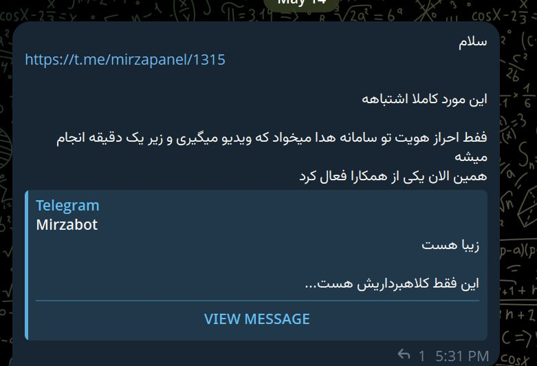

زیبا هست این فقط کلاهبرداریش هست بد صحبت کردنای پشتیبان شون به کنار داغون ترین اپراتور موجود تو ایرانه

## mirzapanel — post 1316

  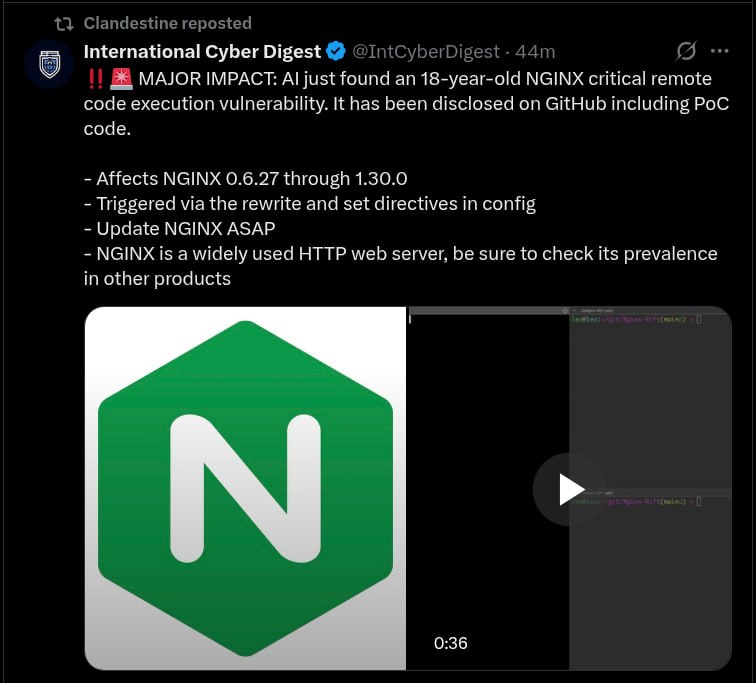

باگ بعدی:

یه باگ 18 ساله از nginx پابلیک شد.

## erfanandroid — post 88597

سررررور با ساب بدون ضریب کسی خواست بگه
قیمتا کاهشی شده امروز ولی هنوز خیلی مونده برای همه قابل دسترس باشه بتونن حجم بالا بخرن

@aloerfan

## erfanandroid — post 88596

نمیدونم داستان روبیکا چیه
یهو میوی تو نشست های فعال میبینی یه safari تو اکانتته
حتی دلیت هم نمیشه
حتی نمیتونی رمز دوعاملی فعال کنی براش
تنها راهش دلیت اکانت کردن این برنامه مزخرفه

@erfanandroid

## Spotify_Porteghali — post 12380

لینکِ دانلود داخلی سالم هست ، چند ثانیه صبر کنید که بالا بیاد .

این آیپی ها با ایرانسل 
🛜 تست شده و سرعتِ خیلی بالایی داره ، می‌‌تونید با اینترنت هایِ دیگه ام چک کنید .

متاسفانه این برنامه برایِ کاربرانِ IOS قابلِ استفاده نیست .

تا متصل هستید حتما استفاده کنید و دانلود هایِ ضروری رو انجام بدید و برنامه هایی که میخواید آپدیت کنید رو آپدیت‌شون رو انجام بدید .

## Spotify_Porteghali — post 12379

یه لیست آیپیِ جدیدِ تست شده برایِ " شیرو خورشید " ، با سرعتِ بالا :

2.23.227.196
2.17.147.11
2.18.64.9
2.18.64.4
2.18.64.5
2.22.114.98
95.100.153.184
95.101.27.196
2.17.96.131
95.101.137.74
95.101.78.25
2.23.245.35
2.16.168.107
2.17.100.250
2.16.245.188
2.17.100.130
95.100.110.28
2.22.89.43
2.18.63.33
95.100.153.186
2.22.151.140
95.100.177.68
95.101.61.215
95.101.27.71
2.23.227.218
2.23.227.209
2.23.227.221
2.17.100.218
2.17.97.198
95.101.27.101
2.17.240.5
2.16.106.222
95.101.234.87
2.21.33.113
23.194.20.27
95.101.38.176
95.101.35.113
2.17.100.225
2.16.168.214
2.17.113.121
2.23.227.212
2.23.227.219
23.212.110.218
95.101.35.96
2.17.96.158
2.16.168.208
2.16.245.174
2.16.245.173
23.192.237.219
2.17.152.213
2.17.100.200
2.22.112.208
2.23.172.114
2.23.227.199
2.23.227.215
2.21.134.89
2.17.100.136
2.23.90.148
95.101.111.168
23.219.79.75
2.16.168.122
2.16.168.123
95.100.177.112
23.192.24.7
23.12.157.106
2.16.245.133
23.52.22.3
2.17.147.218
23.216.134.80
23.55.163.135
23.46.188.71
2.17.100.169
95.101.234.88
2.22.151.152
2.17.241.119
95.101.122.131
95.101.111.161
2.21.245.14
2.18.172.59
95.101.234.90
23.11.41.157
95.101.38.158
2.16.164.34
2.16.164.89

🆔 @Spotify_Porteghali 🍊

↰  بزرگترین خانواده اسپاتیفای در کشور  ↱

## Spotify_Porteghali — post 12378

💬 روشِ جدیدِ اتصال با کلاینتِ " شیرو خورشید " 
💬 برایِ اتصال به جدیدترین نسخه ی شیرو خورشید [ 2026.5.14 ] نیاز دارید . 🔗 : https://punkpaste.ir/f/ShirOKhorshid-v-2026-ntrhkz + اعتبارِ لینکِ دانلود : 24 ساعت - واردِ برنامه بشید و از قسمتِ Options ، گزینه…

## Spotify_Porteghali — post 12377

💬 روشِ جدیدِ اتصال با کلاینتِ " شیرو خورشید " 
💬 برایِ اتصال به جدیدترین نسخه ی شیرو خورشید [ 2026.5.14 ] نیاز دارید . 🔗 : https://punkpaste.ir/f/ShirOKhorshid-v-2026-ntrhkz + اعتبارِ لینکِ دانلود : 24 ساعت - واردِ برنامه بشید و از قسمتِ Options ، گزینه…

## Spotify_Porteghali — post 12376

💬 روشِ جدیدِ اتصال با کلاینتِ " شیرو خورشید " 
💬

برایِ اتصال به جدیدترین نسخه ی شیرو خورشید [ 2026.5.14 ] نیاز دارید .

🔗 : https://punkpaste.ir/f/ShirOKhorshid-v-2026-ntrhkz

+ اعتبارِ لینکِ دانلود : 24 ساعت

- واردِ برنامه بشید و از قسمتِ Options ، گزینه ی More Options رو انتخاب کنید . در این صفحه Beast Mode رو روشن کنید و رویِ Connection Protocol بزنید و CDN Fronting رو انتخاب کنید . سپس رویِ CDN Edge IP's بزنید و آیپی هایِ پایین رو کپی کنید و در کادرِ باز شده جایگذاری کنید و ذخیره کنید . بعد به صفحه ی اصلی برگردید و اتصال رو بزنید .

92.122.123.128
65.109.34.234
94.130.70.160
63.141.252.203
94.130.50.12
50.7.5.83
142.54.178.211
94.130.33.41
144.76.1.88
138.201.54.122
95.216.69.37
2.19.204.19
2.19.204.87
2.19.204.137
2.19.204.144
2.19.204.145
2.19.204.170
2.19.204.184
2.19.204.185
2.19.204.202
2.19.204.210
2.19.204.211
2.19.204.217
2.19.204.218
2.19.204.225
2.19.204.232
2.19.204.234
2.19.204.240
2.19.204.249
2.19.204.250
2.19.204.251
2.19.205.8
2.19.205.9
2.19.205.11
2.19.205.27
2.19.205.33
2.19.205.34
2.19.205.40
2.19.205.41
2.19.205.42
2.19.205.49
2.19.205.50
2.19.205.58
2.19.205.59
2.19.205.64
2.19.205.65
2.19.205.82
2.19.205.83
2.19.205.88
2.19.205.97
2.19.205.98
2.19.205.105
184.31.169.195
184.31.169.252
184.31.170.97
184.31.170.185

آیپی هایِ جدید هم به زودی گذاشته میشه .

🆔 @Spotify_Porteghali 🍊

↰  بزرگترین خانواده اسپاتیفای در کشور  ↱

## Spotify_Porteghali — post 12375

💬 لینکِ دانلودِ مستقیمِ داخلی ( بدونِ فیلتر ) وی پی ان ها و کلاینت هایِ اندروید که این چند روز کارآمد و متصل بودند 
💬 
⚪️Psiphon [ v 453 ] : https://uploadgirl.ir/d/b49bdf83-a631-4ad5-a7f6-6cc6947ecb14 
⚪️Psiphon ( Mod ) [ v 462 ] : https://uploadgirl.ir/d/9cee5a46…

## Spotify_Porteghali — post 12374

💬 لینکِ دانلودِ مستقیمِ داخلی ( بدونِ فیلتر ) وی پی ان ها و کلاینت هایِ اندروید که این چند روز کارآمد و متصل بودند 
💬

⚪️Psiphon [ v 453 ] : https://uploadgirl.ir/d/b49bdf83-a631-4ad5-a7f6-6cc6947ecb14

⚪️Psiphon ( Mod ) [ v 462 ] : https://uploadgirl.ir/d/9cee5a46-bb0b-4fa8-b40a-58f9ad8b60a2

⚪️V2RayNG [ v 2.1.7 ] : https://uploadgirl.ir/d/9887ff28-9ab1-410f-a3b9-c803d084faa8

⚪️V2RayN ( Windows ) [ v 7.20.4 ] : https://uploadgirl.ir/d/f94e1ae3-f8ea-442a-b72b-28b0e4de2cb0

⚪️NapsternetV [ v 123.1 ] : https://uploadgirl.ir/d/09770c00-ae98-4a68-afea-da718c99e39d

⚪️SlipNet [ v 2.5.3 ] : https://uploadgirl.ir/d/636b72e8-ccca-44f3-a053-88448c6d6bee

⚪️SlipStream ( Windows ) : https://uploadgirl.ir/d/16be2da5-89af-4c85-8758-fb3e57c207fc

⚪️V2Box [ v 5.0.3 ] : https://uploadgirl.ir/d/f5c6153a-b441-48f8-9702-28f50b2dca4e

⚪️Happ [ v 3.18.1 ] : https://uploadgirl.ir/d/fa761b35-6154-42f3-858c-d8d8069a31ca

⚪️OpenVPN  [ v 3.3.2 ] : https://uploadgirl.ir/d/619abfad-b745-4f85-8b74-b304c2e9bd68

⚪️HTTP Injector [ v 6.5.0 ] : https://uploadgirl.ir/d/a0fe534e-6ae5-4124-b8d6-54f4ded6db89

⚪️NetMod [ v 3.2.8 ] : https://uploadgirl.ir/d/0097de40-eb46-4ee2-bf11-320e093b7122

⚪️ShirOKhorshid [ v 2026.3.17 ] : https://uploadgirl.ir/d/1d8ca1a1-4e53-4fc1-851d-cfae3961d8bf

⚪️AM Tunnel Pro [ v 28.0 ] : https://uploadgirl.ir/d/646d4cb5-91d0-41b3-9c0f-420cf4b3cd16

⚪️AM Tunnel Lite : [ v 2.0 ] : https://uploadgirl.ir/d/3863d503-0b03-4d6c-8758-aa5c4d28050c

⚪️MasterDNS [ v 1.0.9 ] : https://uploadgirl.ir/d/df11a76b-ef32-4c60-9dd2-eee5516003eb

⚪️WireGuard [ v 1.0.20 ] : https://uploadgirl.ir/d/48355544-ae63-4a18-b0df-f9833f76a179

⚪️WhiteDNS [ v 1.1.0 ] : https://uploadgirl.ir/d/b11d9438-a00e-45de-b6e3-d6a42e2f5313

⚪️Every Proxy [ v 12.7 ] : https://uploadgirl.ir/d/e945a795-1092-45f9-8f40-1a5957f2319c

⚪️NetShare [ v 2.5.50 ] : https://uploadgirl.ir/d/9d491261-1a4b-4708-bee9-2ad90eb9f150

🔴خیلی مهم : حتما لینک رو کپی کنید و در مرورگر Chrome جایگذاری کنید و دانلود کنید ؛ لینک ها با همه ی اینترنت ها بدونِ نیاز به وی پی ان کار می‌کنند .

+ اعتبارِ لینک هایِ دانلود : 24 ساعت [ لینک ها آپدیت می شود . ]

🆔 @Spotify_Porteghali 🍊

↰  بزرگترین خانواده اسپاتیفای در کشور  ↱

## King_network7 — post 30753

  <a href="https://t.me/King_network7/30753" target="_blank">📎 Download file</a>

✅ 4796 آیپی اسکن شده Akamai برای استفاده در "شیر و خورشید"

تمام آیپی ها رو کپی کنید و در قسمت CDN edge IPs قرار بدید

⚙️ OPTIONS > More Options

👈🏻 توضیحات + لینک دانلود برنامه

➰➰➰➰➰
#️⃣ #vpn #android
🆔 @King_Network7

## King_network7 — post 30752

  <a href="https://t.me/King_network7/30752" target="_blank">📎 Download file</a>

✅ برای استفاده از متود سایفون در گوشی بدون نیاز به v2ray و نصب سرتیفیکت، نسخه کاستوم شده سایفون (شیر و خورشید) رو نصب کنید

⚙️ تنظیمات برنامه:
در بخش More Option تیک Beast Mode رو بزنید و Connection Protocol رو روی CDN Fronting قرار بدید

⬇️ لینک دانلود داخلی برنامه
⬇️ لینک گیت هاب پروژه

⭕️روش این برنامه مثل اینکه قطع شده (اگه وصل هستین قطع نکنید)

➰➰➰➰➰
#️⃣ #vpn #android
🆔 @King_Network7

## JynMarket — post 2275

  <a href="https://t.me/JynMarket/2275" target="_blank">📎 Download file</a>

📣 اگه برای بعضیا اتصال انجام نشد، یه راه‌حل خیلی ساده هست 
👇 وارد بخش «Cdn edge IPs» بشید و تمام IP های زیر رو وارد کنید، بعد دوباره کانکت بزنید 
🚀 2.23.227.196 2.17.147.11 2.18.64.9 2.18.64.4 2.18.64.5 2.22.114.98 95.100.153.184 95.101.27.196 2.17.96.131…

## JynMarket — post 2274

ShirOKhorshid-2026.05.14.apk

## JynMarket — post 2273

ShirOKhorshid-2026.05.14.apk

## JynMarket — post 2272

  <a href="https://t.me/JynMarket/2272" target="_blank">📎 Download file</a>

✔️ متود جدید
مراحل اتصال:
وارد آخرین نسخه‌ی اپ شیر و خورشید بشید
از نوار بالا برید داخل بخش Options
روی More Options بزنید
گزینه‌ی Connection Protocol رو روی CDN Fronting قرار بدید
برگردید و مثل همیشه کانکت کنید 
✨
بدون تنظیمات پیچیده، بدون دردسر، راحت وصل میشه 
🔥
لینک دانلود داخلی:
https://punkpaste.ir/f/ShirOKhorshid-2026-0-ghmata

## JynMarket — post 2271

  <a href="https://t.me/JynMarket/2271" target="_blank">📎 Download file</a>

🔗 تک کانفیگ متصل
🔑 Password: @JynMarket

## NamazVPN — post 35529

─────────── VLESS ───────────

🔗 vless://803aba73-e0ce-469d-a308-141ccee0b369@185.143.234.235:2086?encryption=none&security=none&type=ws&host=sync.arasbaran-co.ir&path=%2F#%F0%9F%87%A6%F0%9F%87%BAAustralia%20%7C%20%F0%9F%8C%90%20IP%3A%20176.65.140.202%20%7C%20%E2%8F%B3ping%3A498.2ms%20%7C%20%F0%9F%93%A2%20%40NamazVPN

📍 🇦🇺 Australia
⏱️ 498.2ms

📢 @NamazVPN

## NamazVPN — post 35528

─────────── VLESS ───────────

🔗 vless://803aba73-e0ce-469d-a308-141ccee0b369@185.143.234.235:2086?encryption=none&security=none&type=ws&host=sync.arasbaran-co.ir&path=%2F#%F0%9F%87%A9%F0%9F%87%AAGermany%2C%20Frankfurt%20am%20Main%20%7C%20%F0%9F%8C%90%20IP%3A%20135.136.19.237%20%7C%20%E2%8F%B3ping%3A572.79ms%20%7C%20%F0%9F%93%A2%20%40NamazVPN

📍 🇩🇪 Germany, Frankfurt am Main
⏱️ 572.79ms

📢 @NamazVPN

## NamazVPN — post 35527

─────────── VLESS ───────────

🔗 vless://92659e76-1966-4f63-b0c6-d128713e6027@188.121.110.15:8080?type=tcp&encryption=none&security=none#%F0%9F%87%B7%F0%9F%87%B4Romania%2C%20Bucharest%20%7C%20%F0%9F%8C%90%20IP%3A%2080.96.112.192%20%7C%20%E2%8F%B3ping%3A946.51ms%20%7C%20%F0%9F%93%A2%20%40NamazVPN

📍 🇷🇴 Romania, Bucharest
⏱️ 946.51ms

📢 @NamazVPN

## NamazVPN — post 35526

واسه پروکسی تلگرام هم کاراشو کردم
فقط باید تست شه
بعد جا به جایی سرور ربات کانال تست اونم شروع میکنم

## NamazVPN — post 35525

تبلیغ این کانال رو تو روبیکا دیدم 😁

## NamazVPN — post 35524

─────────── VLESS ───────────

🔗 vless://78c0fb12-1f19-43c4-bc9e-b65335d40b7a@62.3.42.160:41110?type=tcp&encryption=none&security=none#%F0%9F%87%A9%F0%9F%87%AAGermany%2C%20Nuremberg%20%7C%20%F0%9F%8C%90%20IP%3A%202a01%3A4f8%3A1c1b%3A1855%3A%3A1%20%7C%20%E2%8F%B3ping%3A1314.96ms%20%7C%20%F0%9F%93%A2%20%40NamazVPN

📍 🇩🇪 Germany, Nuremberg
⏱️ 1314.96ms

📢 @NamazVPN

## NamazVPN — post 35523

─────────── VLESS ───────────

🔗 vless://78c0fb12-1f19-43c4-bc9e-b65335d40b7a@62.3.42.160:41110?type=tcp&encryption=none&security=none#%F0%9F%87%A9%F0%9F%87%AAGermany%2C%20Nuremberg%20%7C%20%F0%9F%8C%90%20IP%3A%2091.107.249.246%20%7C%20%E2%8F%B3ping%3A499.49ms%20%7C%20%F0%9F%93%A2%20%40NamazVPN

📍 🇩🇪 Germany, Nuremberg
⏱️ 499.49ms

📢 @NamazVPN

## NamazVPN — post 35522

─────────── VLESS ───────────

🔗 vless://78c0fb12-1f19-43c4-bc9e-b65335d40b7a@62.3.42.160:41110?type=tcp&encryption=none&security=none#%F0%9F%87%B9%F0%9F%87%B7T%C3%BCrkiye%2C%20Istanbul%20%7C%20%F0%9F%8C%90%20IP%3A%202a12%3Abec4%3A1d40%3A89ad%3A%3A1%20%7C%20%E2%8F%B3ping%3A484.47ms%20%7C%20%F0%9F%93%A2%20%40NamazVPN

📍 🇹🇷 Türkiye, Istanbul
⏱️ 484.47ms

📢 @NamazVPN

## NamazVPN — post 35521

─────────── VLESS ───────────

🔗 vless://09c237d0-5578-4311-b3e2-44cdb6b9e1c1@snapp.ir:8880?type=ws&encryption=none&path=%2FFredxhunter&host=pico.fxneon.ir&security=none#%F0%9F%87%A9%F0%9F%87%AAGermany%20%7C%20%F0%9F%8C%90%20IP%3A%20185.204.169.10%20%7C%20%E2%8F%B3ping%3A5163.09ms%20%7C%20%F0%9F%93%A2%20%40NamazVPN

📍 🇩🇪 Germany
⏱️ 5163.09ms

📢 @NamazVPN

## NamazVPN — post 35520

─────────── VLESS ───────────

🔗 vless://09c237d0-5578-4311-b3e2-44cdb6b9e1c1@snapp.ir:8880?type=ws&encryption=none&path=%2FFredxhunter&host=pico.fxneon.ir&security=none#%F0%9F%87%A9%F0%9F%87%AAGermany%2C%20Frankfurt%20am%20Main%20%7C%20%F0%9F%8C%90%20IP%3A%2094.143.231.243%20%7C%20%E2%8F%B3ping%3A4297.3ms%20%7C%20%F0%9F%93%A2%20%40NamazVPN

📍 🇩🇪 Germany, Frankfurt am Main
⏱️ 4297.3ms

📢 @NamazVPN

## NamazVPN — post 35519

─────────── VLESS ───────────

🔗 vless://4f0dc846-e6f2-4145-a508-c1c6a2a70b32@wazir.kingotiran.site:41355?encryption=none&security=none&type=tcp#%F0%9F%87%A9%F0%9F%87%AAGermany%2C%20Frankfurt%20am%20Main%20%7C%20%F0%9F%8C%90%20IP%3A%2045.157.234.179%20%7C%20%E2%8F%B3ping%3A2979.08ms%20%7C%20%F0%9F%93%A2%20%40NamazVPN

📍 🇩🇪 Germany, Frankfurt am Main
⏱️ 2979.08ms

📢 @NamazVPN

## NamazVPN — post 35518

─────────── VMESS ───────────

🔗 vmess://eyJhZGQiOiIxODUuMTQzLjIzNC4yMzUiLCJhaWQiOiIwIiwiaG9zdCI6IkZSQTAwMy5taWRhc25ldC53b3JrIiwiaWQiOiI4YzAzNThjMC01ZjRjLTQ4OWYtOTY5Mi02NGY1ODk5NTdiNTciLCJuZXQiOiJ3cyIsInBhdGgiOiIvIiwicG9ydCI6IjgwIiwicHMiOiJVbmtub3duIHwg8J+MkCBJUDogTi9BIHwg4o+zcGluZzoxMTM0LjEzbXMgfCDwn5OiIEBOYW1helZQTiIsInNjeSI6ImF1dG8iLCJzbmkiOiIiLCJ0bHMiOiIiLCJ0eXBlIjoiLS0tIiwidiI6IjIifQ==

📍
⏱️ 1134.13ms

📢 @NamazVPN

## NamazVPN — post 35517

─────────── VLESS ───────────

🔗 vless://fb4fe777-d70c-412a-9914-f5a6e3d4a7e9@45.81.16.109:13526?security=none&encryption=none&headerType=none&type=tcp#Unknown%20%7C%20%F0%9F%8C%90%20IP%3A%20N%2FA%20%7C%20%E2%8F%B3ping%3A4169.25ms%20%7C%20%F0%9F%93%A2%20%40NamazVPN

📍
⏱️ 4169.25ms

📢 @NamazVPN

## NamazVPN — post 35516

─────────── VLESS ───────────

🔗 vless://b0d6a0a7-d0fa-4a57-b635-44fe96824414@45.81.16.109:13526?security=none&encryption=none&headerType=none&type=tcp#%F0%9F%87%B1%F0%9F%87%BALuxembourg%20%7C%20%F0%9F%8C%90%20IP%3A%2031.184.246.82%20%7C%20%E2%8F%B3ping%3A2689.14ms%20%7C%20%F0%9F%93%A2%20%40NamazVPN

📍 🇱🇺 Luxembourg
⏱️ 2689.14ms

📢 @NamazVPN

## NamazVPN — post 35515

─────────── VLESS ───────────

🔗 vless://d19d5da7-49f8-477b-9ffb-7e9d2360f5ea@45.81.16.109:13526?type=tcp&security=none&encryption=none#Unknown%20%7C%20%F0%9F%8C%90%20IP%3A%20N%2FA%20%7C%20%E2%8F%B3ping%3A3949.39ms%20%7C%20%F0%9F%93%A2%20%40NamazVPN

📍
⏱️ 3949.39ms

📢 @NamazVPN

## NamazVPN — post 35514

─────────── VLESS ───────────

🔗 vless://17dc0915-ad44-4c67-a5b2-a8af54783fed@185.50.38.194:51853?type=tcp&security=none&encryption=none#Unknown%20%7C%20%F0%9F%8C%90%20IP%3A%20N%2FA%20%7C%20%E2%8F%B3ping%3A2571.73ms%20%7C%20%F0%9F%93%A2%20%40NamazVPN

📍
⏱️ 2571.73ms

📢 @NamazVPN

## NamazVPN — post 35513

─────────── VLESS ───────────

🔗 vless://3cebf594-1084-45b8-91fe-15ab4f525841@185.143.233.233:443?path=%2Fvoip&security=tls&encryption=none&insecure=1&host=pishparda.ir&fp=chrome&type=ws&allowInsecure=1&sni=pishparda.ir#%F0%9F%87%A6%F0%9F%87%B9Austria%2C%20Langenzersdorf%20%7C%20%F0%9F%8C%90%20IP%3A%20205.147.201.214%20%7C%20%E2%8F%B3ping%3A3031.23ms%20%7C%20%F0%9F%93%A2%20%40NamazVPN

📍 🇦🇹 Austria, Langenzersdorf
⏱️ 3031.23ms

📢 @NamazVPN

## NamazVPN — post 35512

─────────── VLESS ───────────

🔗 vless://06fbbe8a-dc5e-46ef-b9f7-657ea1c63aaa@45.81.16.109:13526?type=tcp&security=none&encryption=none#%F0%9F%87%B1%F0%9F%87%BALuxembourg%20%7C%20%F0%9F%8C%90%20IP%3A%2031.184.246.82%20%7C%20%E2%8F%B3ping%3A1594.96ms%20%7C%20%F0%9F%93%A2%20%40NamazVPN

📍 🇱🇺 Luxembourg
⏱️ 1594.96ms

📢 @NamazVPN

## NamazVPN — post 35511

─────────── VLESS ───────────

🔗 vless://369bb0e9-f721-49a1-9e92-94bec2c95453@dl2.maxsteation.ir:80?encryption=none&host=dl2.maxsteation.ir&path=%2Fjs&security=none&type=ws#Unknown%20%7C%20%F0%9F%8C%90%20IP%3A%20N%2FA%20%7C%20%E2%8F%B3ping%3A3587.47ms%20%7C%20%F0%9F%93%A2%20%40NamazVPN

📍
⏱️ 3587.47ms

📢 @NamazVPN

## NamazVPN — post 35510

─────────── VLESS ───────────

🔗 vless://4d61f677-07b5-4d63-ad23-b9e53de535c9@185.155.9.151:42135?type=tcp&security=none&encryption=none#Unknown%20%7C%20%F0%9F%8C%90%20IP%3A%20N%2FA%20%7C%20%E2%8F%B3ping%3A1385.25ms%20%7C%20%F0%9F%93%A2%20%40NamazVPN

📍
⏱️ 1385.25ms

📢 @NamazVPN

## TirexNet — post 3770

متصل 23.221.28.5 23.44.201.206 23.220.163.205 23.209.46.33 23.10.34.11 23.39.185.35 23.32.152.106 23.218.232.181 23.206.188.212 2.21.2.89 23.208.222.120 23.48.203.248 23.44.201.136 23.44.201.151 23.44.201.149 2.21.2.58 23.3.90.48 23.44.201.41…

## TirexNet — post 3769

نحوه اتصال رایگان و نامحدود به اینترنت آزاد با متد ترکیبی MITM + Psiphon

👉 github.com/patterniha/MITM-DomainFronting
© patterniha, MatinSenPaii

🔗 ᴡᴇʙꜱɪᴛᴇ • ᴠᴘɴʜᴜʙ • ɢɪᴛʜᴜʙᴍɪʀʀᴏʀ
@ircfspace

## TirexNet — post 3768

#ارسالی‌مردم

## TirexNet — post 3767

2.19.204.225 2.19.204.232 2.19.204.234 2.19.204.240 2.19.204.249 2.19.204.250 2.19.204.251 2.19.205.8 2.19.205.9 2.19.205.11 2.19.205.27 2.19.205.33 2.19.205.34 2.19.205.40 2.19.205.41 2.19.205.42 2.19.205.49 2.19.205.50 2.19.205.58 2.19.205.59 2.19.205.64…

## TirexNet — post 3766

2.19.204.225
2.19.204.232
2.19.204.234
2.19.204.240
2.19.204.249
2.19.204.250
2.19.204.251
2.19.205.8
2.19.205.9
2.19.205.11
2.19.205.27
2.19.205.33
2.19.205.34
2.19.205.40
2.19.205.41
2.19.205.42
2.19.205.49
2.19.205.50
2.19.205.58
2.19.205.59
2.19.205.64
2.19.205.65
2.19.205.82
2.19.205.83
2.19.205.88
2.19.205.97
2.19.205.98
2.19.205.105
2.22.151.4
23.67.253.11
23.67.253.24
23.67.253.55
23.67.253.77
23.67.253.101
23.67.253.120
23.53.35.146
23.53.35.158
23.53.35.171
23.53.35.182
23.53.35.194
23.53.35.207
184.26.163.12
184.26.163.24
184.26.163.38
184.26.163.51
184.26.163.66
184.26.163.79
2.16.186.20
2.16.186.31
2.16.186.44
2.16.186.58
2.16.186.69
2.16.186.81
23.195.81.72
23.195.81.84
23.195.81.96
23.195.81.108
104.124.148.191
104.124.148.203
23.32.5.18
23.32.5.44
23.32.5.71
23.32.5.96
23.32.5.118
23.32.5.141
23.32.5.167
23.32.5.193
23.32.5.214
23.32.5.236
96.16.97.82
96.16.97.104
96.16.97.126
96.16.97.148
96.16.97.169
96.16.97.191
184.50.87.22
184.50.87.44
184.50.87.66
184.50.87.88
92.122.123.128
2.19.204.87
2.19.204.137
2.19.204.144
2.19.204.145
2.19.204.170
2.19.204.184
2.19.204.185
2.19.204.202
2.19.204.210
138.201.54.122
2.22.151.4
2.22.151.9
2.22.151.12
2.22.151.13
2.22.151.15
2.22.151.17
2.22.151.20
2.22.151.22
2.22.151.23
2.22.151.32
2.22.151.36
2.22.151.37
2.22.151.39
2.22.151.47
2.22.151.51
2.22.151.53
2.22.151.54
2.22.151.58
2.22.151.60
2.22.151.62
2.22.151.135
2.22.151.138
2.22.151.139
2.22.151.141
2.22.151.142
2.22.151.143
2.22.151.144
2.22.151.146
2.22.151.149
2.22.151.150
2.22.151.151
2.22.151.152
2.22.151.153
2.22.151.154
2.22.151.155
2.22.151.156
2.22.151.157
2.22.151.158
2.22.151.159
2.22.151.161
2.22.151.162
2.22.151.163
2.22.151.164
2.22.151.168
2.22.151.169
2.22.151.170
2.22.151.171
2.22.151.173
2.22.151.175
2.22.151.179
2.22.151.181
2.22.151.182
2.22.151.183
2.22.151.184
2.22.151.185
2.22.151.186
2.22.151.188
2.22.151.189
2.22.151.190
2.22.151.191
2.22.151.193
2.22.151.194
2.22.151.195
2.22.151.4
2.22.151.9
2.22.151.12
2.22.151.13
2.22.151.15
2.22.151.17
2.22.151.20
2.22.151.22
2.22.151.23
2.22.151.32
2.22.151.36
2.22.151.37
2.22.151.39
2.22.151.47
2.22.151.51
2.22.151.53
2.22.151.54
2.22.151.58
2.22.151.60
2.22.151.62
2.22.151.135
2.22.151.138
2.22.151.139
2.22.151.141
2.22.151.142
2.22.151.143
2.22.151.144
2.22.151.146
2.22.151.149
2.22.151.150
2.22.151.151
2.22.151.152
2.22.151.153
2.22.151.154
2.22.151.155
2.22.151.156
2.22.151.157
2.22.151.158
2.22.151.159
2.22.151.161
2.22.151.162
2.22.151.163
2.22.151.164
2.22.151.168
2.22.151.169
2.22.151.170
2.22.151.171
2.22.151.173
2.22.151.175
2.22.151.179
2.22.151.181
2.22.151.182
2.22.151.183
2.22.151.184
2.22.151.185
2.22.151.186
2.22.151.188
2.22.151.189
2.22.151.190
2.22.151.191
2.22.151.193
2.22.151.194
2.22.151.195
2.22.151.4
23.67.253.11
23.67.253.24
23.67.253.55
23.67.253.77
23.67.253.101
23.67.253.120
23.53.35.146
23.53.35.158
23.53.35.171
23.53.35.182
23.53.35.194
23.53.35.207
184.26.163.12
184.26.163.24
184.26.163.38
184.26.163.51
184.26.163.66
184.26.163.79
2.16.186.20
2.16.186.31
2.16.186.44
2.16.186.58
2.16.186.69
2.16.186.81
23.195.81.72
23.195.81.84
23.195.81.96
23.195.81.108
104.124.148.191
104.124.148.203
23.32.5.18
23.32.5.44
23.32.5.71
23.32.5.96
23.32.5.118
23.32.5.141
23.32.5.167
23.32.5.193
23.32.5.214
23.32.5.236
96.16.97.82
96.16.97.104
96.16.97.126
96.16.97.148
96.16.97.169
96.16.97.191
184.50.87.22
184.50.87.44
184.50.87.66
184.50.87.88
92.122.123.128
2.19.204.87
2.19.204.137
2.19.204.144
2.19.204.145
2.19.204.170
2.19.204.184
2.19.204.185
2.19.204.202
2.19.204.210
138.201.54.122
2.22.151.4
2.22.151.9
2.22.151.12
2.22.151.13
2.22.151.15
2.22.151.17
2.22.151.20
2.22.151.22
2.22.151.23
2.22.151.32
2.22.151.36
2.22.151.37
2.22.151.39
2.22.151.47
2.22.151.51
2.22.151.53
2.22.151.54
2.22.151.58
2.22.151.60
2.22.151.62
2.22.151.135
2.22.151.138

Channel: T.me/TirexNet

## TirexNet — post 3765

الان با این وصلم

## TirexNet — post 3764

2.19.204.19 2.19.204.87 2.19.204.137 2.19.204.144 2.19.204.145 2.19.204.170 2.19.204.184 2.19.204.185 2.19.204.202 2.19.204.210 2.19.204.211 2.19.204.217 2.19.204.218 2.19.204.225 2.19.204.232 2.19.204.234 2.19.204.240 2.19.204.249 2.19.204.250 2.19.204.251…

## TirexNet — post 3763

2.19.204.19
2.19.204.87
2.19.204.137
2.19.204.144
2.19.204.145
2.19.204.170
2.19.204.184
2.19.204.185
2.19.204.202
2.19.204.210
2.19.204.211
2.19.204.217
2.19.204.218
2.19.204.225
2.19.204.232
2.19.204.234
2.19.204.240
2.19.204.249
2.19.204.250
2.19.204.251
2.19.205.8
2.19.205.9
2.19.205.11
2.19.205.27
2.19.205.33
2.19.205.34
2.19.205.40
2.19.205.41
2.19.205.42
2.19.205.49
2.19.205.50
2.19.205.58
2.19.205.59
2.19.205.64
2.19.205.65
2.19.205.82
2.19.205.83
2.19.205.88
2.19.205.97
2.19.205.98
2.19.205.105
184.31.169.195
184.31.169.252
184.31.170.97
184.31.170.185
2.19.204.225
2.19.204.232
2.19.204.234
2.19.204.240
2.19.204.249
2.19.204.250
2.19.204.251
2.19.205.8
2.19.205.9
2.19.205.11
2.19.205.27
2.19.205.33
2.19.205.34
2.19.205.40
2.19.205.41
2.19.205.42
2.19.205.49
2.19.205.50
2.19.205.58
2.19.205.59
2.19.205.64
2.19.205.65
2.19.205.82
2.19.205.83
2.19.205.88
2.19.205.97
2.19.205.98
2.19.205.105
23.50.131.139
23.50.131.142
2.22.31.185
23.58.222.152
2.21.243.227
23.58.223.186
2.19.126.99
2.21.239.22
23.59.65.253
23.55.110.83
2.22.31.97
23.55.110.72
23.211.135.156
2.22.104.90
2.22.144.9
2.20.45.26
2.21.69.217
23.209.208.88
23.58.223.179
2.21.243.224
2.19.126.75
23.50.131.154
2.21.173.115
23.211.135.138

Channel: T.me/TirexNet

## TirexNet — post 3762

ایپی های متصل دیگه 2.19.204.225 2.19.204.232 2.19.204.234 2.19.204.240 2.19.204.249 2.19.204.250 2.19.204.251 2.19.205.8 2.19.205.9 2.19.205.11 2.19.205.27 2.19.205.33 2.19.205.34 2.19.205.40 2.19.205.41 2.19.205.42 2.19.205.49 2.19.205.50 2.19.205.58 2.19.205.59…

## TirexNet — post 3761

akamai-scanned-ip.txt

## TirexNet — post 3760

akamai-scanned-ip.txt

## TirexNet — post 3759

tx@tirexnet.txt

## TirexNet — post 3758

ایول، جدیده سه سوته وصلید

## TirexNet — post 3757

  <a href="https://t.me/TirexNet/3757" target="_blank">📎 Download file</a>

کانفیگ داخلشو وارد ویتوری کنید و با روش Psiphon+MitM وصل شین

## TirexNet — post 3756

https://punkpaste.ir/f/v2rayNG-2-1-7-arm64--rf0kqw

دانلود با نت ملی

## TirexNet — post 3754

جیسونش ایراد داشت

## TirexNet — post 3752

الان کانفیگ جیسون میزارم واسه کسایی که با ترکیب ویتوری سایفون میزدن

## TirexNet — post 3751

  <a href="https://t.me/TirexNet/3751" target="_blank">📎 Download file</a>

لیست چند هزارتایی آیپی های تمیز.
منبع the vpn method
@TirexNet

## TirexNet — post 3749

ایپی های متصل جدید 92.122.123.128 2.19.204.87 2.19.204.137 2.19.204.144 2.19.204.145 2.19.204.170 2.19.204.184 2.19.204.185 2.19.204.202 2.22.151.4 2.22.151.9 2.22.151.12 2.22.151.13 2.22.151.15 2.22.151.17 2.22.151.20 2.22.151.22 2.22.151.23 2.22.151.32…

## TirexNet — post 3748

ایپی های متصل جدید

92.122.123.128
2.19.204.87
2.19.204.137
2.19.204.144
2.19.204.145
2.19.204.170
2.19.204.184
2.19.204.185
2.19.204.202
2.22.151.4
2.22.151.9
2.22.151.12
2.22.151.13
2.22.151.15
2.22.151.17
2.22.151.20
2.22.151.22
2.22.151.23
2.22.151.32
2.22.151.36
2.22.151.37
2.22.151.39
2.22.151.47
2.22.151.51
2.22.151.53
2.22.151.54
2.22.151.58
2.22.151.60
2.22.151.62
2.22.151.135
2.22.151.138
2.22.151.139
2.22.151.141
2.22.151.142
2.22.151.143
2.22.151.144
2.22.151.146
2.22.151.149
2.22.151.150
2.22.151.151
2.22.151.152
2.22.151.153
2.22.151.154
2.22.151.155
2.22.151.156
2.22.151.157
2.22.151.158
2.22.151.159
2.22.151.161
2.22.151.162
2.22.151.163
2.22.151.164
2.22.151.168
2.22.151.169
2.22.151.170
2.22.151.171
2.22.151.173
2.22.151.175
2.22.151.179
2.22.151.181
2.22.151.182
2.22.151.183
2.22.151.184
2.22.151.185
2.22.151.186
2.22.151.4
2.22.151.9
2.22.151.12
2.22.151.13
2.22.151.15
2.22.151.17
2.22.151.20
2.22.151.22
2.22.151.23
2.22.151.32
2.22.151.36
2.22.151.37
2.22.151.39
2.22.151.47
2.22.151.51
2.22.151.53
2.22.151.54
2.22.151.58
2.22.151.60
2.22.151.62
2.22.151.135
2.22.151.138
2.22.151.139
2.22.151.141
2.22.151.142
2.22.151.143
2.22.151.144
2.22.151.146
2.22.151.149
2.22.151.150
2.22.151.151
2.22.151.152
2.22.151.153
2.22.151.154
2.22.151.155
2.22.151.156
2.22.151.157
2.22.151.158
2.22.151.159
2.22.151.161
2.22.151.162
2.22.151.163
2.22.151.164
2.22.151.168
2.22.151.169
2.22.151.170
2.22.151.171
2.22.151.173
2.22.151.175
2.22.151.179
2.22.151.181
2.22.151.182
2.22.151.183
2.22.151.184
2.22.151.185
2.22.151.186
2.22.151.188
2.22.151.189
2.22.151.190
2.22.151.191
2.22.151.193
2.22.151.194
2.22.151.195
2.19.204.19
2.19.204.87
2.19.204.137
2.19.204.144
2.19.204.145
2.19.204.170
2.19.204.184
2.19.204.185
2.19.204.202
2.19.204.210
2.19.204.211
2.19.204.217
2.19.204.218
2.19.204.225
2.19.204.232
2.19.204.234
2.19.204.240
2.19.204.249
2.19.204.250
2.19.204.251
2.19.205.8
2.19.205.9
2.19.205.11
2.19.205.27
2.19.205.33
2.19.205.34
2.19.205.40
2.19.205.41
2.19.205.42
2.19.205.49
2.19.205.50
2.19.205.58
2.19.205.59
2.19.205.64
2.19.205.65
2.19.205.82
2.19.205.83
2.19.205.88
2.19.205.97
2.19.205.98
2.19.205.105
184.31.169.195
184.31.169.252
184.31.170.97
184.31.170.185
2.22.151.4
23.67.253.11
23.67.253.24
23.67.253.55
23.67.253.77
23.67.253.101
23.67.253.120
23.53.35.146
23.53.35.158
23.53.35.171
23.53.35.182
23.53.35.194
23.53.35.207
184.26.163.12
184.26.163.24
184.26.163.38
184.26.163.51
184.26.163.66
184.26.163.79
2.16.186.20
2.16.186.31
2.16.186.44
2.16.186.58
2.16.186.69
2.16.186.81
23.195.81.72
23.195.81.84
23.195.81.96
23.195.81.108
104.124.148.191
104.124.148.203
23.32.5.18
23.32.5.44
23.32.5.71
23.32.5.96
23.32.5.118
23.32.5.141
23.32.5.167
23.32.5.193
23.32.5.214
23.32.5.236
96.16.97.82
96.16.97.104
96.16.97.126
96.16.97.148
96.16.97.169
96.16.97.191
184.50.87.22
184.50.87.44
184.50.87.66
184.50.87.88
92.122.123.128
92.122.123.128
2.22.151.188
2.22.151.189
2.22.151.190
2.22.151.191
2.22.151.193
2.22.151.194
2.22.151.195
2.19.204.210

Channel: T.me/TirexNet

## sirhishamtradinghub — post 3684

There’s nothing more painful and frustrating than framing your setup, but price refuses to tap your order, and you miss the trade. Then you watch it play out all the way to TP. 💔📈

## sirhishamtradinghub — post 3683

  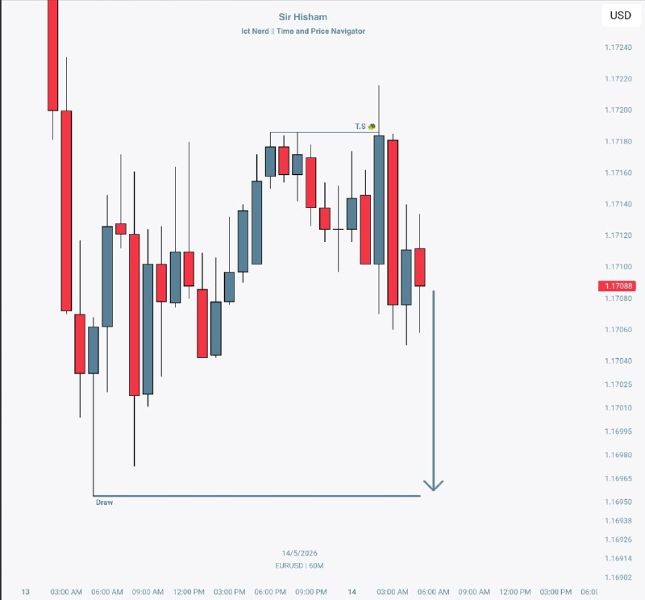

$EURUSD H1 Framework I'm Bearish 👀

## TheVPNMethod — post 701

— آموزش متود جدید CDN—Fronting! دانلود آموزش ویدئویی + آپدیت برنامه شیر و خورشید با لینک داخلی: https://punkpaste.ir/f/CDN-Fronting-xi5yp6 ZIP Password: @TheVPNMethod لیست آیپی های تمیز: 23.221.28.5 23.44.201.206 23.220.163.205 23.209.46.33 23.10.34.11…

## TheVPNMethod — post 700

اوضاع اوکیه؟ برم یه استراحتی کنم.

## TheVPNMethod — post 699

لیست آیپی تست شده، وصل!
برای متود CDN—Fronting!
همه رو یک‌جا کپی و در شیروخورشید پیست کنید.

2.23.227.196
2.17.147.11
2.18.64.9
2.18.64.4
2.18.64.5
2.22.114.98
95.100.153.184
95.101.27.196
2.17.96.131
95.101.137.74
95.101.78.25
2.23.245.35
2.16.168.107
2.17.100.250
2.16.245.188
2.17.100.130
95.100.110.28
2.22.89.43
2.18.63.33
95.100.153.186
2.22.151.140
95.100.177.68
95.101.61.215
95.101.27.71
2.23.227.218
2.23.227.209
2.23.227.221
2.17.100.218
2.17.97.198
95.101.27.101
2.17.240.5
2.16.106.222
95.101.234.87
2.21.33.113
23.194.20.27
95.101.38.176
95.101.35.113
2.17.100.225
2.16.168.214
2.17.113.121
2.23.227.212
2.23.227.219
23.212.110.218
95.101.35.96
2.17.96.158
2.16.168.208
2.16.245.174
2.16.245.173
23.192.237.219
2.17.152.213
2.17.100.200
2.22.112.208
2.23.172.114
2.23.227.199
2.23.227.215
2.21.134.89
2.17.100.136
2.23.90.148
95.101.111.168
23.219.79.75
2.16.168.122
2.16.168.123
95.100.177.112
23.192.24.7
23.12.157.106
2.16.245.133
23.52.22.3
2.17.147.218
23.216.134.80
23.55.163.135
23.46.188.71
2.17.100.169
95.101.234.88
2.22.151.152
2.17.241.119
95.101.122.131
95.101.111.161
2.21.245.14
2.18.172.59
95.101.234.90
23.11.41.157
95.101.38.158
2.16.164.34
2.16.164.89

— @TheVPNMethod

## TheVPNMethod — post 696

  <a href="https://t.me/TheVPNMethod/696" target="_blank">📎 Download file</a>

لیست چند هزارتایی آیپی های تمیز
برای متود CDN—Fronting
این فایل رو باز کنید از توش‌ یه تعداد آیپی کپی کنید وارد برنامه شیر و خورشید کنید.
— @TheVPNMethod

## TheVPNMethod — post 690

آموزش متود جدید CDN—Fronting دانلود آموزش ویدئویی + آپدیت برنامه شیر و خورشید با لینک داخلی: https://punkpaste.ir/f/CDN-Fronting-xi5yp6 ZIP Password: @TheVPNMethod لیست آیپی های تمیز: 92.122.123.128 2.19.204.87 2.19.204.137 2.19.204.144 2.19.204.145 2.19.204.170…

## TheVPNMethod — post 689

همچنان قوی وصله! 🔥

## TheVPNMethod — post 688

  <a href="telegram/content/TheVPNMethod_688_1778775811.mp4" target="_blank">🎬 Download video</a>

آموزش متود جدید CDN—Fronting
دانلود آموزش ویدئویی + آپدیت برنامه شیر و خورشید با لینک داخلی:
https://punkpaste.ir/f/CDN-Fronting-xi5yp6

ZIP Password: @TheVPNMethod
لیست آیپی های تمیز:

92.122.123.128
2.19.204.87
2.19.204.137
2.19.204.144
2.19.204.145
2.19.204.170
2.19.204.184
2.19.204.185
2.19.204.202
2.19.204.210

— @TheVPNMethod

## TheVPNMethod — post 687

بچه‌ها چرتو پرتارو گوش ندید که نمیدونم شیر و خورشید امن نیست و فلان، متود CDN—Fronting سالهاست که هست، ۲۰۱۵ اومد و یه روش خوب بود، چین‌و روسیه هم زیاد درگیر بودن ولی خب جلوشو گرفتن.
اینجام الان فعلا رو CDN Akamai اوکیه.
ولی بزودی احتمالاً جلوش گرفته میشه یا سرعتش به شدت افت می‌کنه.

فعلاً استفاده کنید تا ببینیم چی میشه.

## TheVPNMethod — post 686

سرعت گااادیانو کاستاکورتا 🔥

## TheVPNMethod — post 685

— آموزش متود جدید CDN—Fronting! دانلود آموزش ویدئویی + آپدیت برنامه شیر و خورشید با لینک داخلی: https://punkpaste.ir/f/CDN-Fronting-xi5yp6 ZIP Password: @TheVPNMethod لیست آیپی های تمیز: 23.221.28.5 23.44.201.206 23.220.163.205 23.209.46.33 23.10.34.11…

## TheVPNMethod — post 684

The VPN Method pinned a video

## TheVPNMethod — post 683

وصل شدید باهاش؟

## TheVPNMethod — post 681

بنازم شیر و خورشید کارتونو راحت کرد.

## TheVPNMethod — post 679

— آموزش متود جدید CDN—Fronting! دانلود آموزش ویدئویی + آپدیت برنامه شیر و خورشید با لینک داخلی: https://punkpaste.ir/f/CDN-Fronting-xi5yp6 ZIP Password: @TheVPNMethod لیست آیپی های تمیز: 23.221.28.5 23.44.201.206 23.220.163.205 23.209.46.33 23.10.34.11…

## TheVPNMethod — post 678

  <a href="telegram/content/TheVPNMethod_678_1778775813.mp4" target="_blank">🎬 Download video</a>

— آموزش متود جدید CDN—Fronting!

دانلود آموزش ویدئویی + آپدیت برنامه شیر و خورشید با لینک داخلی:
https://punkpaste.ir/f/CDN-Fronting-xi5yp6

ZIP Password: @TheVPNMethod

لیست آیپی های تمیز:
23.221.28.5
23.44.201.206
23.220.163.205
23.209.46.33
23.10.34.11
23.39.185.35
23.32.152.106
23.218.232.181
23.206.188.212
2.21.2.89
23.208.222.120
23.48.203.248
23.44.201.136
23.44.201.151
23.44.201.149
2.21.2.58
23.3.90.48
23.44.201.41
2.19.204.184
23.218.232.188
23.44.201.12
23.212.253.227
23.201.31.155
23.220.163.203
23.44.201.185
23.52.116.66
23.44.201.17
23.62.54.24
23.218.239.132
23.39.149.69
23.52.40.147
23.58.95.144
2.16.244.58
23.212.253.137
2.17.106.176
23.62.54.137
2.17.106.5
23.203.134.233
23.212.253.232
23.206.188.197
23.44.201.170
23.54.127.39
23.214.170.83
23.52.40.89
23.55.176.73
23.202.229.140
23.215.56.61
2.17.106.166
23.222.126.108
184.25.85.224
23.1.241.123
23.3.90.43
184.26.13.91
23.54.210.170

— @TheVPNMethod

## TheVPNMethod — post 677

صبر کنید جالب شد.

## TheVPNMethod — post 673

وصلید؟

## TheVPNMethod — post 672

روش پاک کردن سرتیفیکیت قدیمی.
https://t.me/VPNMethods/21469

## TheVPNMethod — post 671

✅ آموزش کامل و امن تولید سرتیفیکیت برای Psiphon + MitM (با Termux) — این آموزش مخصوص کسانی نوشته شده که می‌خواهند امن‌ترین روش ممکن را برای تولید سرتیفیکیت شخصی استفاده کنند. — هشدارهای مهم: این سرتیفیکیت قدرت زیادی دارد. اگر کلید خصوصی (mycert.key) لو برود،…

## TheVPNMethod — post 670

✅ آموزش کامل و امن تولید سرتیفیکیت برای Psiphon + MitM (با Termux) — این آموزش مخصوص کسانی نوشته شده که می‌خواهند امن‌ترین روش ممکن را برای تولید سرتیفیکیت شخصی استفاده کنند. — هشدارهای مهم: این سرتیفیکیت قدرت زیادی دارد. اگر کلید خصوصی (mycert.key) لو برود،…

## DigiGozar — post 9210

بات هم بازه✅

## DigiGozar — post 9209

  <a href="telegram/content/DigiGozar_9209_1778775814.webm" target="_blank">🎬 Download video</a>

مشکل حل شد
🚀
مشکل دیتابیس حل شد
✅

سرعت به دلیل اختلال کمی پایینه بزودی اون هم حل میشه

تمام چت های پشتیبانی حذف شدن خلوت بشه بتونیم جواب بدیم

اگه رسید پرداختتون تایید نشده
عکس رسید/مبلغ/آیدی عددی خودتون رو
با #رسید بفرستید تا رسیدگی بشه

در غیر این صورت پاسخی داده نمیشه
❌

## DigiGozar — post 9207

گروه هم باز شده
https://t.me/DigiGozarGP

## DigiGozar — post 9205

درحال رفع مشکل سرعت و دیتابیس هستیم صبور باشید
🫥

## DigiGozar — post 9204

  <a href="telegram/content/DigiGozar_9204_1778775815.webm" target="_blank">🎬 Download video</a>

الان روال میشه 
💅

## DigiGozar — post 9203

  <a href="telegram/content/DigiGozar_9203_1778775815.webm" target="_blank">🎬 Download video</a>

دوستانی که اکانت هاشون رو تمدید/جدید خریداری کردن و از پنل پاک شده پشتیبانی پیام بدن جدید بگیرن تمدید و اکلنت های جدید روی دیتابیس ثبت نشده اگر اکانتتون قدیمی بوده حجمتون تموم شده و از پنل پاک شده پشتیبانی پیام ندید!

## DigiGozar — post 9202

دوستانی که اکانت هاشون رو تمدید/جدید خریداری کردن و از پنل پاک شده پشتیبانی پیام بدن جدید بگیرن

تمدید و اکلنت های جدید روی دیتابیس ثبت نشده

اگر اکانتتون قدیمی بوده حجمتون تموم شده و از پنل پاک شده پشتیبانی پیام ندید!

## ByGFW — post 2309

پیرو متد هایی که جدید اومده بسیار مراقب باشید نصب سرتیفیکیت غیر رسمی ممکنه امنیت شمارو به خطر بندازه. آموزشش رو میزارم با مسئولیت خودتون استفاده کنید.

## ByGFW — post 2308

پیرو متد هایی که جدید اومده بسیار مراقب باشید
نصب سرتیفیکیت غیر رسمی ممکنه امنیت شمارو به خطر بندازه.

آموزشش رو میزارم با مسئولیت خودتون استفاده کنید.

## MatinSenPaii — post 3051

اگر حمایت‌های پارتنرم نبود، مدتها پیش سلامت روانم رو از دست داده بودم حقیقتا. و اصلا بعد از دی‌ماه نمیتونستم هیچ کدوم از آموزش‌ها رو استارت بزنم و شاید از مبارزه ناامید شده بودم. تشکر ویژه از شما، بانو
❤️

## MatinSenPaii — post 3050

خب گویا آی‌پی دیفالتی که پشت جیسون بودش رو زدن. مجددا موش و گربه بازی سر آیپی و sni تمیز.
Pypi رو زدن،
خود python.org بذارید باید اوکی بشه. همینطور از آیپی های این پست استفاده کنید:
https://t.me/MatinSenPaii/3040?single

## MatinSenPaii — post 3049

اگر حمایت‌های پارتنرم نبود، مدتها پیش سلامت روانم رو از دست داده بودم حقیقتا. و اصلا بعد از دی‌ماه نمیتونستم هیچ کدوم از آموزش‌ها رو استارت بزنم و شاید از مبارزه ناامید شده بودم.
تشکر ویژه از شما، بانو
❤️

## MatinSenPaii — post 3048

  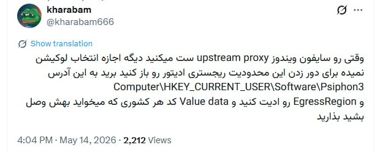

Kharabam:
وقتی رو سایفون ویندوز upstream proxy ست میکنید دیگه اجازه انتخاب لوکیشن نمیده برای دور زدن این محدودیت ریجستری ادیتور رو باز کنید برید به این آدرس
Computer\HKEY_CURRENT_USER\Software\Psiphon3
و EgressRegion رو ادیت کنید و Value data کد هر کشوری که میخواید بهش وصل بشید بذارید

## MatinSenPaii — post 3047

اگر به ارور Upstream proxy میخورید، یعنی پورت رو دقیقا اونی که توی ویدئو گفتم ست نکردید. یا توی بخش مناسبی نزدید. باید مو به مو چیزایی که گفتم انجام بشه دوستان

## MatinSenPaii — post 3046

روی ویندوز از این آموزش استفاده کنید:
https://t.me/MatinSenPaii/3035
روی اندروید مستقیم وصل میشید با این اپ:
https://t.me/MatinSenPaii/3038

## MatinSenPaii — post 3045

Matin SenPai pinned a file

## MatinSenPaii — post 3044

  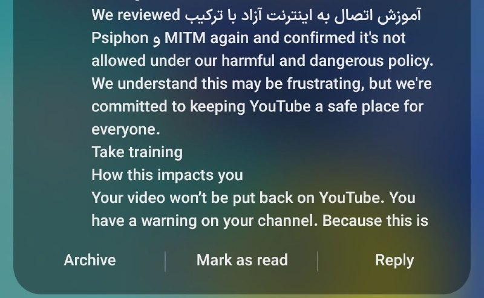

یوتوب ویدئو رو پاک کرد به علت محتوای خطرناک و آسیب زا به منم استرایک زد😐

## MatinSenPaii — post 3043

یوتوب ویدئو رو پاک کرد به علت محتوای خطرناک و آسیب زا به منم استرایک زد😐

## MatinSenPaii — post 3042

  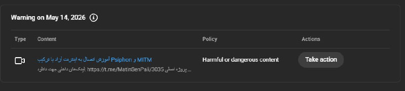

یوتوب ویدئو رو پاک کرد به علت محتوای خطرناک و آسیب زا به منم استرایک زد😐

## MatinSenPaii — post 3041

Matin SenPai pinned a video

## MatinSenPaii — post 3039

ShirOKhorshid-2026.05.14.apk

## MatinSenPaii — post 3038

  <a href="https://t.me/MatinSenPaii/3038" target="_blank">📎 Download file</a>

🛡مهم: اگر این نسخه رو نصب کنید دیگه دردسر ستاپ کردن MITM و... ندارید!
این نسخه حدودا یک ساعت پیش توسط برنامه‌نویس شیر و خورشید آپدیت شد و به راحتی می‌تونید طبق این آموزش بهش وصل بشید:
1- وارد اپلیکیشن شیر و خورشید(آخرین نسخه که امروز منتشر شده) می‌شید
2- وارد بخش Options میشید از نوار بالا
3- روی More Options کلیک میکنید
4- گزینه‌ی Connection Protocol رو قرار میدید روی CDN Fronting
5- میرید و عادی کانکت میشید و به راحتی وصل میشه!

## MatinSenPaii — post 3037

حالا دیدین متد ترکیبی سایفون افسانه نبود و واقعا وصل میشد؟🤣🤣🤣🤣🤣

## MatinSenPaii — post 3036

دوستان عزیز، خواهش میکنم به DNS بها بدید. معلوم نیست کی مجددا متدهای حال حاضر رو می‌بندن. از نرم‌افزار و آموزش‌های @WhiteDNS استفاده کنید و الان که اینترنتتون شاید اوکی تر باشه، نصب و ستاپ کنید

## MatinSenPaii — post 3035

☠️ آموزش اتصال رایگان و نامحدود به اینترنت با متد ترکیبی MITM + Psiphon

⚡️لینک‌های داخلی جهت دانلود: https://guardts.ir/f/db4006f1197c و https://uploadgirl.ir/d/1f4fb76a-c869-494a-b439-b11cb8d35947 (شامل فایلهای V2rayNG، کلاینت شیر و خورشید، ویدئو آموزشی، V2rayN و فایل Certificate Generator و خود فایل Json پترنیها)

لینک پروژه اصلی: https://github.com/patterniha/MITM-DomainFronting

⭐️توی این ویدئو بهتون یاد میدم که چطوری با استفاده از متد ترکیبی سایفون(کلاینت شیر و خورشید) + کانفیگ دامین فرانتینگ پترنیها، به اینترنت بین‌الملل وصل بشید!

⚠️ پیش‌نیازها و نکات مهم:

1️⃣ این ویدئو هیچ پیش نیازی نداره

✉️ تماشا در تلگرام

📹 تماشا در یوتوب

💰 دونیت

## MatinSenPaii — post 3034

چه حالی میده رایگان وصل بودن
📚 از زمان SNI Spoof اینو تجربه نکردم خدایی

## MatinSenPaii — post 3033

بی‌زحمت لینک سایت‌های داخلی برای آپلود(هرسایتی که میشناسید اوکیه) واسم بفرستید، تا زمانی که ویدئو حاضر شد واستون همزمان به همراه کلاینت شیر و خورشید و فایل جیسون و ... روی چندین جا آپلود کنم:
https://t.me/MatinSenPaii?direct

## MatinSenPaii — post 3032

## purnet — post 15254

تولد توسعه دهنده purvpn و با یک روز تاخیر تبریک میگم.
خودش فک کنم یادش رفته🎂❤️

## archivetell — post 4893

ایرانسل تست شده

2.19.204.225

## archivetell — post 4891

  <a href="https://t.me/archivetell/4891" target="_blank">📎 Download file</a>

برنامه Akamai IP Scanner

۱. لیست رنج‌های هدف (با پشتیبانی از تمام فرمت‌ها مثل 16/ یا 24/) را در فایل ips.txt قرار دهید. (پیشفرض قرار داده شده)

۲. روی فایل scan.ps1 راست‌کلیک کرده و گزینه Run with PowerShell را برای شروع اسکن انتخاب کنید.

۳. بهترین آی‌پی‌ها به‌صورت لحظه‌ای در clean_ips.txt ذخیره می‌شوند (هر زمان مایل بودید می‌توانید اسکن را متوقف کنید).

## archivetell — post 4890

ایرانسل تست شده

2.19.204.251

## archivetell — post 4889

  <a href="https://t.me/archivetell/4889" target="_blank">📎 Download file</a>

لیست چند هزار تایی ip تمیز akamai

شیر و خورشید

CDN SNI hostname خالی بذار

CDN edge IPs :

این آیپی ها رو بذار

## archivetell — post 4888

2.22.151.4
23.67.253.11
23.67.253.24
23.67.253.55
23.67.253.77
23.67.253.101
23.67.253.120
23.53.35.146
23.53.35.158
23.53.35.171
23.53.35.182
23.53.35.194
23.53.35.207
184.26.163.12
184.26.163.24
184.26.163.38
184.26.163.51
184.26.163.66
184.26.163.79
2.16.186.20
2.16.186.31
2.16.186.44
2.16.186.58
2.16.186.69
2.16.186.81
23.195.81.72
23.195.81.84
23.195.81.96
23.195.81.108
104.124.148.191
104.124.148.203
23.32.5.18
23.32.5.44
23.32.5.71
23.32.5.96
23.32.5.118
23.32.5.141
23.32.5.167
23.32.5.193
23.32.5.214
23.32.5.236
96.16.97.82
96.16.97.104
96.16.97.126
96.16.97.148
96.16.97.169
96.16.97.191
184.50.87.22
184.50.87.44
184.50.87.66
184.50.87.88
92.122.123.128
2.19.204.87
2.19.204.137
2.19.204.144
2.19.204.145
2.19.204.170
2.19.204.184
2.19.204.185
2.19.204.202
2.19.204.210
138.201.54.122
2.22.151.4
2.22.151.9
2.22.151.12
2.22.151.13
2.22.151.15
2.22.151.17
2.22.151.20
2.22.151.22
2.22.151.23
2.22.151.32
2.22.151.36
2.22.151.37
2.22.151.39
2.22.151.47
2.22.151.51
2.22.151.53
2.22.151.54
2.22.151.58
2.22.151.60
2.22.151.62
2.22.151.135
2.22.151.138
2.22.151.139
2.22.151.141
2.22.151.142
2.22.151.143
2.22.151.144
2.22.151.146
2.22.151.149
2.22.151.150
2.22.151.151
2.22.151.152
2.22.151.153
2.22.151.154
2.22.151.155
2.22.151.156
2.22.151.157
2.22.151.158
2.22.151.159
2.22.151.161
2.22.151.162
2.22.151.163
2.22.151.164
2.22.151.168
2.22.151.169
2.22.151.170
2.22.151.171
2.22.151.173
2.22.151.175
2.22.151.179
2.22.151.181
2.22.151.182
2.22.151.183
2.22.151.184
2.22.151.185
2.22.151.186
2.22.151.188
2.22.151.189
2.22.151.190
2.22.151.191
2.22.151.193
2.22.151.194
2.22.151.195

ایرانسل وصله ولی ضعیف

## archivetell — post 4886

شیر و خورشید CDN SNI hostname خالی بذار CDN edge IPs : 2.19.204.225 2.19.204.232 2.19.204.234 2.19.204.240 2.19.204.249 2.19.204.250 2.19.204.251 2.19.205.8 2.19.205.9 2.19.205.11 2.19.205.27 2.19.205.33 2.19.205.34 2.19.205.40 2.19.205.41 2.19.205.42…

## archivetell — post 4884

میگن رو ایرانسل اکامی رو زدن ، وصلید؟

## archivetell — post 4882

شیر و خورشید CDN SNI hostname خالی بذار CDN edge IPs : 2.19.204.225 2.19.204.232 2.19.204.234 2.19.204.240 2.19.204.249 2.19.204.250 2.19.204.251 2.19.205.8 2.19.205.9 2.19.205.11 2.19.205.27 2.19.205.33 2.19.205.34 2.19.205.40 2.19.205.41 2.19.205.42…

## archivetell — post 4881

شیر و خورشید CDN SNI hostname خالی بذار CDN edge IPs : 92.122.123.128 2.19.204.87 2.19.204.137 2.19.204.144 2.19.204.145 2.19.204.170 2.19.204.184 2.19.204.185 2.19.204.202 2.19.204.210 138.201.54.122

## archivetell — post 4880

فعلا در این کانال صرفا مطالب مهم و پین‌های گروه @ProjectXHTTP گذاشته می شود. /// اگر کارهای بنده باعث شده گره ای از مشکلات شما باز شود ممنون میشم حمایتی هم از اینجانب بکنید: USDT (BEP20): 0x76a768B53Ca77B43086946315f0BDF21156bF424 USDT (TRC20): TU5…

## archivetell — post 4879

فعلا در این کانال صرفا مطالب مهم و پین‌های گروه

@ProjectXHTTP

گذاشته می شود.

///

اگر کارهای بنده باعث شده گره ای از مشکلات شما باز شود ممنون میشم حمایتی هم از اینجانب بکنید:

USDT (BEP20): 0x76a768B53Ca77B43086946315f0BDF21156bF424

USDT (TRC20): TU5gKvKqcXPn8itp1DouBCwcqGHMemBm8o

## archivetell — post 4878

شیر و خورشید

CDN SNI hostname خالی بذار

CDN edge IPs :
92.122.123.128
2.19.204.87
2.19.204.137
2.19.204.144
2.19.204.145
2.19.204.170
2.19.204.184
2.19.204.185
2.19.204.202
2.19.204.210
138.201.54.122

## archivetell — post 4876

  <a href="https://t.me/archivetell/4876" target="_blank">📎 Download file</a>

سایفون میتواند هم از طریق akamai و هم از طریق fastly متصل شود.

این دو کانفیگ سایفون را مجبور میکند که از طریق akamai یا fastly متصل شود.

در کانفیگ akamai شما نیاز به یک ip سفید و در کانفیگ fastly نیاز به یک sni سفید دارید که میتوانید در صورت نیاز آن را در کانفیگ ها تغییر دهید.

گرچه دومین‌فرانتینگ های استفاده شده به اپ شیر و خورشید اضافه شده اما با استفاده از هسته Xray-core شما از ویژگی های متعددی مثل "فینگرپرینت کروم" و "happyEyeballs" و ... برخوردار هستید.

پروژه های دیگری در راه است حمایت فراموش نشه

@patterniha

## archivetell — post 4874

منتظر ایران نتلیفای باشین، از معجزاتش زنده کردن مرده هاست
ایشالا که خبری بشه

## archivetell — post 4873

🎯 خلاصه و جمع‌بندی متدهای امروز (سایفون + دامین فرانتینگ)

---

رفقا سلام! ✋ امروز یه رگبار پیام تو کانال داشتیم درباره متد جدید و می‌دونم ممکنه با دیدن این همه فایل و ربات و کد، خیلیا گیج شده باشن که «بالاخره کدوم رو باید انجام بدیم؟!»

بیاین خیلی عامیانه و تروتمیز جمع‌بندی کنیم که دقیقاً بدونید باید چیکار کنید:

🔥 راحت‌ترین و سریع‌ترین راه (بدون هیچ دردسری!)
اگر حوصله درگیری با فایل و سرتیفیکیت و تنظیمات پیچیده رو ندارید، فقط نسخه آپدیت‌شده‌ی برنامه «شیر و خورشید» رو نصب کنید.
تو این آپدیت، فقط کافیه پروتکل اتصال رو بذارید روی "فرانتینگ cdn". تمام! برنامه خودش وصل می‌شه و نیازی به گرفتن سرتیفیکیت، برنامه V2ray و وارد کردن کانفیگ نیست.

📱 روش دستی برای اندروید (V2rayNG)
اگه دوست دارید خودتون متد رو دستی پیاده کنید:
۱. دریافت گواهینامه: باید دو تا کلید بگیرید (یا از سایت regery.com، یا ربات‌های تلگرامی مثل @CrtGen7Bot). در نهایت باید دو تا فایل به اسم‌های mycert.key و mycert.crt داشته باشید.
۲. نصب در گوشی: تو تنظیمات گوشی CA certificate رو سرچ کنید و فایل mycert.crt رو اونجا نصب کنید.
۳. تنظیمات V2rayNG: برید تو بخش assets files برنامه و اون دو تا فایل رو اضافه کنید. بعدش طبق آموزش قبلی، سایفون رو بهش متصل کنید.

💻 روش راحت برای ویندوز
برای ویندوز ابزار آماده PsiphonOverMITM کار رو راحت کرده:
۱. فایل زیپ پروژه رو از گیت‌هاب دانلود و اکسترکت کنید.
۲. روی فایل Run-PsiphonOverMITM.bat راست‌کلیک کرده و Run as Administrator رو بزنید.
۳. برنامه سایفون رو باز کنید، برید تو Settings و تو بخش Upstream Proxy این مشخصات رو وارد کنید:
Hostname: 127.0.0.1
Port: 20808
۴. تغییرات رو تایید کنید تا متصل بشه.

⚠️ اون آموزش طولانی SSL سرور ایران چی بود؟
پستی که درباره انتقال فایل‌های fullchain و privkey به سرور داخل بود، فقط و فقط مخصوص ادمین‌ها و کسانیه که سرور شخصی دارن. اگر شما یک کاربر عادی هستید، اون پست رو کاملاً نادیده بگیرید!

💡 نتیجه‌گیری: اولویت اول برای اینکه گیج نشید و سریع وصل بشید، همون دانلود نسخه جدید "شیر و خورشید" و گذاشتنش روی حالت "فرانتینگ cdn" هست. لذتش رو ببرید! ✌️

📌 #آموزش #سایفون #دامین_فرانتینگ #نت_ملی #تونل #شیر_و_خورشید

ArchiveTell |

## archivetell — post 4872

🚀 آموزش اتصال رایگان به اینترنت آزاد (ترکیب Psiphon + دامین فرانتینگ پترنیها)

---

رفقا سلام! ✋ امروز یه متد به‌شدت خفن، بدون پیش‌نیاز و کاملاً رایگان براتون داریم که با ترکیب کلاینت سایفون (شیر و خورشید) و کانفیگ‌های دامین فرانتینگِ پترنیها کار می‌کنه و اینترنت آزاد رو براتون میاره.

این روش برای وب‌گردی، اینستاگرام و تلگرام عالیه (البته برای گیم آنلاین پیشنهاد نمی‌شه). تمام فایل‌های مورد نیاز هم از قبل آماده شده و لینک‌هاش پایین پست هست! 👇

🖥 آموزش برای ویندوز (V2rayN)
1️⃣ نصب V2rayN: برنامه V2rayN رو باز کنید (اگه ارور داد، Runtime و Framework نسخه ۶ به بالا رو نصب کنید).
2️⃣ ساخت سرتیفیکیت: فایل Certificate Generator (موجود در فایل‌های دانلود) رو داخل پوشه bin تو مسیر V2rayN کپی و اجرا کنید تا دو فایل جدید ساخته بشه.
3️⃣ نصب سرتیفیکیت: روی فایل mycert راست‌کلیک کنید، Install Certificate رو بزنید. مسیر Local Machine و بعد Trusted Root Certification Authorities رو انتخاب کنید تا نصب بشه.
4️⃣ تنظیمات V2rayN:
🔸 برنامه رو باز کنید، از Configuration گزینه Add Custom Configuration رو بزنید. یه اسم بذارید، فایل Json پترنیها رو Browse کنید و Core type رو روی Xray بذارید.
🔸 تو مسیر Settings ➔ Option Settings، پورت Mux رو حتماً روی 10808 تنظیم کنید.
🔸 کانفیگ رو انتخاب، Enter بزنید و وضعیت سیستم رو روی Clear System Proxy بذارید.
5️⃣ تنظیمات کلاینت شیر و خورشید: برنامه رو باز کنید، برید تو Settings. قسمت Upstream Proxy، هاست رو 127.0.0.1 و پورت رو 10808 قرار بدید و استارت کنید.

📱 آموزش برای اندروید (V2rayNG)
1️⃣ پیش‌نیازها: نصب آخرین نسخه V2rayNG و کلاینت سایفون (شیر و خورشید).
2️⃣ نصب سرتیفیکیت: تو تنظیمات گوشی CA Certificate رو سرچ کنید و فایل mycert.crt (موجود در فایل‌های دانلود) رو نصب کنید.
3️⃣ تنظیمات V2rayNG:
🔸 فایل‌های سرتیفیکیت رو تو نرم‌افزار Add کنید.
🔸 فایل کانفیگ JSON رو با زدن دکمه + و Import from local وارد برنامه کنید.
🔸 تو تنظیمات، پورت (Local Proxy Port) رو روی 10808 و Mode رو روی Proxy Only قرار بدید و کانفیگ رو استارت بزنید.
4️⃣ تنظیمات کلاینت (شیر و خورشید):
🔸 وارد Options ➔ VPN Settings بشید، تیک Don't tunnel selected apps رو بزنید و V2rayNG رو از تونل خارج کنید.
🔸 تو بخش Proxy Settings، گزینه Connect through an HTTP Proxy رو انتخاب کنید. هاست رو 127.0.0.1 و پورت رو 10808 بذارید و استارت رو بزنید.

📥 لینک‌های دانلود و منابع مورد نیاز:
تمام فایل‌ها (V2rayN، V2rayNG، کلاینت شیر و خورشید، Certificate Generator و فایل Json پترنیها) رو می‌تونید از لینک‌های زیر بردارید:
🔗 لینک دانلود مستقیم فایل‌ها در تلگرام:
https://t.me/MatinSenPaii/3035
🔗 لینک پروژه اصلی در گیت‌هاب:
https://github.com/therealaleph/Maste...
📺 ویدیوی آموزشی کامل در یوتیوب:
https://youtu.be/M3kZxw1M3vE

(اگر این روش براتون مفید بود، می‌تونید از توسعه‌دهنده این متد از طریق لینک matinsenpai.pages.dev حمایت کنید ☕️)

📌 #آموزش #سایفون #دامین_فرانتینگ #نت_ملی #تونل #رایگان #Psiphon #V2rayN

🔵 @ArchiveTell | 𝔹𝕒𝕔𝕙𝕖𝕝𝕠𝕣⚡️

## archivetell — post 4871

## 🚀 آموزش اشتراک‌گذاری اینترنت آزاد روی هات‌سپات (بدون نیاز به نصب برنامه‌ روی گوشی دوم!)

اگر می‌خواهید اینترنت فیلترشده را از لپ‌تاپ به گوشی یا دستگاه‌های دیگر منتقل کنید، به‌طوری که بقیه فقط با وصل شدن به وای‌فای شما به اینترنت بین‌الملل دسترسی داشته باشند، این روش بهترین گزینه است.

### 🛠 پیش‌نیازها:
1. لپ‌تاپ دارای کارت شبکه وای‌فای.
2. برنامه v2rayN (نسخه جدید).
3. فعال بودن یک کانفیگ سالم.

### 🟢 مرحله اول: تنظیمات v2rayN
ابتدا باید قابلیت عبور ترافیک از هسته برنامه را فعال کنید:
1. برنامه v2rayN را باز کنید.
2. از منوی پایین، روی آیکون برنامه راست کلیک کرده و System Proxy را روی حالت Set System Proxy قرار دهید (آیکون برنامه قرمز/رنگ روشن می‌شود).

3. گزینه TUN Mode را در قسمت پایین برنامه فعال کنید. این کار باعث می‌شود تمام ترافیک سیستم وارد تونل شود.

### 📡 مرحله دوم: فعال‌سازی Hotspot ویندوز
1. در ویندوز به بخش Settings و سپس Network & Internet بروید.
2. وارد قسمت Mobile Hotspot شوید و آن را On کنید.

3. نام (SSID) و رمز عبور را تنظیم کنید.

### 🔗 مرحله سوم: اشتراک‌گذاری آداپتور (مرحله طلایی)
حالا باید جادوی اصلی را انجام دهید تا اینترنتِ "تونل شده" به هات‌سپات منتقل شود:
1. به مسیر زیر در کنترل پنل بروید:
Control Panel > Network and Internet > Network Connections

2. در اینجا لیست کارت‌های شبکه را می‌بینید. کارتی را پیدا کنید که مربوط به v2ray است (معمولاً نامی مثل nekoray-tun یا v2ray-tun یا Sing-box دارد).

3. روی آن راست‌کلیک کرده و Properties را بزنید.

4. به تب Sharing بروید.

5. تیک گزینه اول یعنی Allow other network users to connect through... را بزنید.

6. در کادر پایین آن، نام آداپتور مربوط به هات‌سپات خود را انتخاب کنید (معمولاً با نامی شبیه Local Area Connection* X یا Microsoft Wi-Fi Direct Virtual Adapter ظاهر می‌شود).

7. روی OK کلیک کنید.

### ✅ نتیجه نهایی
حالا هر دستگاهی (گوشی، تلویزیون، کنسول) که به هات‌سپات لپ‌تاپ شما وصل شود، بدون نیاز به هیچ اپلیکیشن اضافی یا تنظیم پروکسی، مستقیماً به اینترنت آزاد متصل خواهد بود. 🌐

💡 نکته مهم: اگر بعد از این کار اینترنت قطع شد، یک‌بار هات‌سپات و v2ray را خاموش و روشن کنید تا آی‌پی‌ها به‌درستی ست شوند.

@ArchiveTell

## archivetell — post 4870

ما بزرگ بودیم..
با من در نیفتید

## hamvex — post 2571

🌐آموزش کامل دور زدن فیلترینگ با متود CDN-Fronting (فول تانل)(اندروید) اتصال بدون نیاز به v2rayNG و نصب سرتیفیکیت 
🐱 https://github.com/shirokhorshid/shirokhorshid-android 
⬇️
🔄 https://www.uploadina.com/a7a08c93f7bada88/CDN-Fronting.mp4 (لینک دانلود داخلی…

## hamvex — post 2570

🌐آموزش کامل دور زدن فیلترینگ با متود CDN-Fronting (فول تانل)(اندروید) اتصال بدون نیاز به v2rayNG و نصب سرتیفیکیت 
🐱 https://github.com/shirokhorshid/shirokhorshid-android 
⬇️
🔄 https://www.uploadina.com/a7a08c93f7bada88/CDN-Fronting.mp4 (لینک دانلود داخلی…

## hamvex — post 2569

وصلین؟

## hamvex — post 2568

🗣️ خیلی از عزیزانی هستن که از ابتدای قطعی اینترنت حتی یکبار هم نتونستن وصل بشن این شامل خونواده ،دوستان ،آشناها و حتی اون بنده خدایی که تو گروهای روبیکا ، بله یا ایتا دنبال پروکسی واسه صرفا یه آپدیتینگ تلگرام میگرده میشه پس اگه میبینین تو چنل یا بقیه چنلا…

## hamvex — post 2565

🌐آموزش کامل دور زدن فیلترینگ با متود CDN-Fronting (فول تانل)(اندروید)

اتصال بدون نیاز به v2rayNG و نصب سرتیفیکیت

🐱
https://github.com/shirokhorshid/shirokhorshid-android

⬇️
🔄
https://www.uploadina.com/a7a08c93f7bada88/CDN-Fronting.mp4 (لینک دانلود داخلی ویدئو)
Pass : @hamvex

⬇️
👩‍💻
https://www.uploadina.com/file_password.html?file=1b1bf6b51ca93050 (لینک دانلود داخلی شیروخورشید)
Pass : @hamvex

🔹حتما آخرین نسخه نرم‌افزار شیروخورشید رو نصب داشته باشید.

🔺چند آیپی قابل استفاده :
همه آیپی‌هارو با هم کپی و پیست کنید تو بخش CDN edge IPs

151.101.64.223
151.101.0.223
151.101.128.223
151.101.192.223
92.122.123.128
2.16.186.20
2.16.186.31
2.16.186.44
2.16.186.58
2.16.186.69
2.16.186.81
2.19.204.19
2.19.204.87
2.19.204.137
2.19.204.144
2.19.204.145
2.19.204.170
2.19.204.184
2.19.204.185
2.19.204.202
2.19.204.210
2.19.204.211
2.19.204.217
2.19.204.218
2.19.204.225
2.19.204.232
2.19.204.234
2.19.204.240
2.19.204.249
2.19.204.250
2.19.204.251
2.19.205.8
2.19.205.9
2.19.205.11
2.19.205.27
2.19.205.33
2.19.205.34
2.19.205.40
2.19.205.41
2.19.205.42
2.19.205.49
2.19.205.50
2.19.205.58
2.19.205.59
2.19.205.64
2.19.205.65
2.19.205.82
2.19.205.83
2.19.205.88
2.19.205.97
2.19.205.98
2.19.205.105
2.22.151.4
2.22.151.9
2.22.151.12
2.22.151.13
2.22.151.15
2.22.151.17
2.22.151.20
2.22.151.22
2.22.151.23
2.22.151.32
2.22.151.36
2.22.151.37
2.22.151.39
2.22.151.47
2.22.151.51
2.22.151.53
2.22.151.54
2.22.151.58
2.22.151.60
2.22.151.62
2.22.151.135
2.22.151.138
2.22.151.139
2.22.151.141
2.22.151.142
2.22.151.143
2.22.151.144
2.22.151.146
2.22.151.149
2.22.151.150
2.22.151.151
2.22.151.152
2.22.151.153
2.22.151.154
2.22.151.155
2.22.151.156
2.22.151.157
2.22.151.158
2.22.151.159
2.22.151.161
2.22.151.162
2.22.151.163
2.22.151.164
2.22.151.168
2.22.151.169
2.22.151.170
2.22.151.171
2.22.151.173
2.22.151.175
2.22.151.179
2.22.151.181
2.22.151.182
2.22.151.183
2.22.151.184
2.22.151.185
2.22.151.186
2.22.151.188
2.22.151.189
2.22.151.190
2.22.151.191
2.22.151.193
2.22.151.194
2.22.151.195
23.32.5.18
23.32.5.44
23.32.5.71
23.32.5.96
23.32.5.118
23.32.5.141
23.32.5.167
23.32.5.193
23.32.5.214
23.32.5.236
23.53.35.146
23.53.35.158
23.53.35.171
23.53.35.182
23.53.35.194
23.53.35.207
23.67.253.11
23.67.253.24
23.67.253.55
23.67.253.77
23.67.253.101
23.67.253.120
23.195.81.72
23.195.81.84
23.195.81.96
23.195.81.108
50.7.5.83
63.141.252.203
65.109.34.234
92.122.123.128
94.130.13.19
94.130.33.41
94.130.50.12
94.130.70.160
95.216.69.37
96.16.97.82
96.16.97.104
96.16.97.126
96.16.97.148
96.16.97.169
96.16.97.191
104.124.148.191
104.124.148.203
138.201.54.122
142.54.178.211
144.76.1.88
184.26.163.12
184.26.163.24
184.26.163.38
184.26.163.51
184.26.163.66
184.26.163.79
184.31.169.195
184.31.169.252
184.31.170.97
184.31.170.185
184.50.87.22
184.50.87.44
184.50.87.66
184.50.87.88

🔺برای بخش CDN sni hostname هم سایت زیر رو قرار بدید (اینو نزارید هم وصل میشه)
python.org

🔖از طریق حالت خودکار و اتصال مستقیم هم میتونید وصل شید

## hamvex — post 2564

تیم فعال شیروخورشید
یه آپدیت خفن 
🔥

## hamvex — post 2563

  <a href="https://t.me/hamvex/2563" target="_blank">📎 Download file</a>

🌐 آموزش کامل دور زدن فیلترینگ با متود MITM + PSIPHON (فول تانل)(اندروید) 
🎬 https://youtu.be/C0Xr8bmhAow?si=mRxXRmQIh0jm1Xs0 
🐱 https://github.com/patterniha 
⬇️
🔄 https://uplod.ir/eyn04g87pgzo/MITM_PSIPHON.mp4.htm ( لینک دانلود داخلی) Pass : @hamvex 
🔻Creator…

## hamvex — post 2557

🌐 آموزش کامل دور زدن فیلترینگ با متود MITM + PSIPHON (فول تانل)(اندروید) 
🎬 https://youtu.be/C0Xr8bmhAow?si=mRxXRmQIh0jm1Xs0 
🐱 https://github.com/patterniha 
⬇️
🔄 https://uplod.ir/eyn04g87pgzo/MITM_PSIPHON.mp4.htm ( لینک دانلود داخلی) Pass : @hamvex 
🔻Creator…

## networkti — post 342

تعداد زیادی ای پی‌وایت لیست برای روش جدیده توی گوشی با مرورگر بازش کنید و یک تعدادیشو کپی کنید و توی برنامه شیر و خورشید توی قسمت CDN edge IPs وارد کنید و بزنید وصل میشه (اول شیرو خورشید رو که بالا فرستادم نصب کنید و طبق اموزشی که زیرش نوشته مراحل رو پیش…

## networkti — post 341

ShirOKhorshid-2026.05.14.apk

## networkti — post 340

تعداد زیادی ای پی‌وایت لیست برای روش جدیده

توی گوشی با مرورگر بازش کنید و یک تعدادیشو کپی کنید و توی برنامه شیر و خورشید توی قسمت
CDN edge IPs
وارد کنید و بزنید وصل میشه

(اول شیرو خورشید رو که بالا فرستادم نصب کنید و طبق اموزشی که زیرش نوشته مراحل رو پیش برید و بعد اینکاری که الان گفتم رو انجام بدید)

## networkti — post 339

  <a href="https://t.me/networkti/339" target="_blank">📎 Download file</a>

📎 Document

## networkti — post 338

کانال من یدونه عرزشی مادر طبقاتی داره که هی ری اکشن بر عکس میزنه 
🤣

## networkti — post 335

Mahdavi:
در قسمت CDN edge IPs اگه IP های وایت لیست شده آکامای رو بذارید سرعت اتصال بهتر میشه.

Kharabam:

63 تا IP وایت لیست Akamai:

2.22.151.4
2.22.151.9
2.22.151.12
2.22.151.13
2.22.151.15
2.22.151.17
2.22.151.20
2.22.151.22
2.22.151.23
2.22.151.32
2.22.151.36
2.22.151.37
2.22.151.39
2.22.151.47
2.22.151.51
2.22.151.53
2.22.151.54
2.22.151.58
2.22.151.60
2.22.151.62
2.22.151.135
2.22.151.138
2.22.151.139
2.22.151.141
2.22.151.142
2.22.151.143
2.22.151.144
2.22.151.146
2.22.151.149
2.22.151.150
2.22.151.151
2.22.151.152
2.22.151.153
2.22.151.154
2.22.151.155
2.22.151.156
2.22.151.157
2.22.151.158
2.22.151.159
2.22.151.161
2.22.151.162
2.22.151.163
2.22.151.164
2.22.151.168
2.22.151.169
2.22.151.170
2.22.151.171
2.22.151.173
2.22.151.175
2.22.151.179
2.22.151.181
2.22.151.182
2.22.151.183
2.22.151.184
2.22.151.185
2.22.151.186
2.22.151.188
2.22.151.189
2.22.151.190
2.22.151.191
2.22.151.193
2.22.151.194
2.22.151.195

## networkti — post 334

ShirOKhorshid-2026.05.14.apk

## networkti — post 333

  <a href="https://t.me/networkti/333" target="_blank">📎 Download file</a>

🛡مهم: اگر این نسخه رو نصب کنید دیگه دردسر ستاپ کردن MITM و... ندارید!
این نسخه حدودا یک ساعت پیش توسط برنامه‌نویس شیر و خورشید آپدیت شد و به راحتی می‌تونید طبق این آموزش بهش وصل بشید:
1- وارد اپلیکیشن شیر و خورشید(آخرین نسخه که امروز منتشر شده) می‌شید
2- وارد بخش Options میشید از نوار بالا
3- روی More Options کلیک میکنید
4- گزینه‌ی Connection Protocol رو قرار میدید روی CDN Fronting
5- میرید و عادی کانکت میشید و به راحتی وصل میشه!

## networkti — post 332

کانال متین سنپای داره آموزش یک روش جدید وصل شدن رایگان با سرعت بالا رو آماده میکنه:

https://t.me/MatinSenPaii

کانال متین رو میتونید از توی کانفیگ‌ مخصوص فیلترشکن TheFeed هم چک کنید تا وقتی آموزش رو گذاشت استفاده کنید.

## Break_The_Barriers — post 1559

  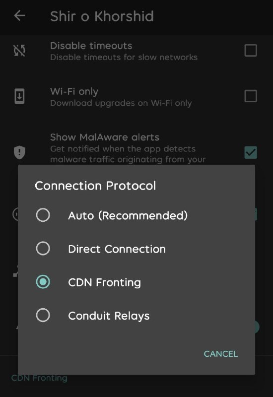

فقط کافیه اپلیکیشن رو نصب کنید، ابتدا وارد Options بشید و سپس More Options رو انتخاب کنید.

در قسمت Connection Protocol، گزینه‌ی CDN Fronting رو انتخاب کنید و در انتها به صفحه‌ی اصلی بازگشته و Start را بزنید.

@break_the_barriers

## Break_The_Barriers — post 1558

  <a href="https://t.me/Break_The_Barriers/1558" target="_blank">📎 Download file</a>

نسخه 2026.05.14 کلاینت ShiroKhorshid Android منتشر شد.

در این آپدیت، قابلیت CDN Domain Fronting مستقیماً به هسته برنامه اضافه شده و دیگر نیازی به xray، cert و تنظیمات جانبی نیست.

GitHub: https://github.com/shirokhorshid/shirokhorshid-android

لینک دانلود دانلود داخلی، بدون نیاز به فیلترشکن:

https://punkpaste.ir/f/ShirOKhorshid-2026-0-ghmata

تشکر ویژه از @patterniha 🫂❤️

@break_the_barriers

---
📅 بروزرسانی: 1405/02/24 11:41
---

## vpn_xvpn_ch — post 401

‼️ شرایط جدید اشتراک و تعرفه ها ‼️ 🟢 تعرفه اشتراک VIP 📋 ثبت سفارش از 1 تا 20 گیگ 💸 قیمت هر گیگ 450،000 🔵 تعرفه اشتراک PRO 📋 ثبت سفارش از 1 تا 20 گیگ 💸 قیمت هر گیگ 230،000 💳 پرداخت به صورت کارت به کارت / تتر ⭕ اشتراک ها تا آخرین لحظه تضمین عودت وجه دارند…

## xsfilterrnet — post 3417

  <a href="https://t.me/xsfilterrnet/3417" target="_blank">📎 Download file</a>

🍷آموزش Psiphon + MitM (فعلا روی اندروید، ویندوز هم مشابه است):

۱. اول اینکه واقعا نیازی به MitM نبود اگه خود سایفون یسری امکاناتو داشت ولی به هر حال نداره و نیاز به MitM هست.

۲. حتما از آخرین ورژن psiphon و v2rayNG استفاده کنید همچنین فایلهای جئو رو در v2rayNG اپدیت کنید.
۳. قسمت MitM فقط برای سایفون استفاده میشه و بنابراین با این روش کل گوشی شما تونل میشه
۴. نحوه اضافه کردن سرتیفیکیت به سیستم و v2rayNG مشابه MitM-DomainFronting هست و بنابراین اگر قبلا این کار را انجام دادید نیاز به تکرار آن ندارید. (راهنمای ایجاد و اضافه کردن سرتیفیکیت به سيستم و v2rayNG در readme پروژه MitM-DomainFronting وجود دارد)
۵. کانفیگ psiphon-helper@patterniha_v1
را وارد برنامه v2rayNG کنید و v2rayNG را در حالت proxy only اجرا کنید، دقت کنید در صورتی که میخواهید از کانفیگ دیگری بدون سایفون استفاده کنید باید دوباره از vpn mode استفاده کنید.
۶. در تنظیمات سایفون و در قسمت proxy settings مقدار
127.0.0.1  10808
را وارد کنید.
۷. در تنظیمات سایفون در قسمت vpn settings گزینه don't tunnel selected apps را انتخاب کنید و برنامه v2rayNG را مستثنی کنید.
۸. سایفون را اجرا کنید و در صورت اتصال کل گوشی شما تونل میشود.
۹. در کانفیگ psiphon-helper@patterniha_v1
به جای ایپی ...92 میتوانید از هر ایپی دیگری که متعلق به akamai باشد استفاده کنید.
۱۰. حمایت لطفا فراموش نشه همچنان پروژه های زیادی در راستای دسترسی آزاد مردم به اینترنت در نظر دارم، آدرس های ولت بنده در کانال شخصی بنده موجود هست

@patterniha 
💎
@xsfilterrnet 
👑

## saministamm — post 62789

ترکیبی متصل :
vless://9ea9e54b-d4da-4773-855a-e5371e4da946@snapp.ir:80?path=%2F&security=&encryption=none&host=hubfile.zpax.ir&type=ws#saministamm

## saministamm — post 62788

🚨وزیر آموزش‌وپرورش:
امتحانات نهایی ۲ هفته بعد از عادی شدن شرایط و پایان جنگ برگزار خواهند شد. ضمن اینکه در استان‌ها تصمیم‌گیری دربارۀ نحوۀ برگزاری امتحانات برعهدۀ استانداران خواهد بود.
@saministamm

## saministamm — post 62787

🔴 امروز May 14 روز جهانی عشق های مجازی و آنلاینه.

## saministamm — post 62786

پروکسی متصل :

tg://proxy?server=95.217.235.33&port=443&secret=dd104462821249bd7ac519130220c25d09

## saministamm — post 62785

یه عده همون 57 فهمیدن
یه عده با کشتار 66 فهمیدن
یه عده بعد از 88 فهمیدن
یه عده با کشتار 96 فهمیدن
یه عده آبان 98
یه عده هم 1401
بقیه هم 1404
اونیکه تا الان نفهمیده نونش تو نفهمیدنه.

## saministamm — post 62784

• پروکسی تلگرام

tg://proxy?server=178.104.81.34&port=4455&secret=dd104462821249bd7ac519130220c25d09

-همراه اول و ایرانسل پینگ میده٬ برای بهتر شدن کیفیتش با سرورای رایگان ترکیبش کنید.

@saministamm

## Skyportall — post 10644

psiphon-helper@patterniha.json

## Skyportall — post 10643

  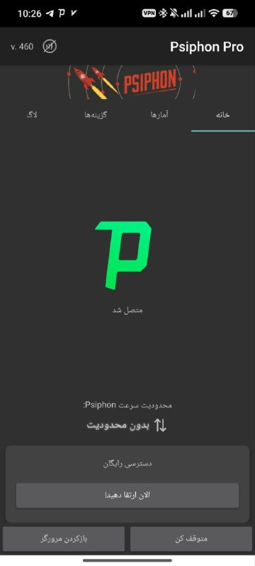

دمتون گرم وصل شد

## Skyportall — post 10642

  <a href="telegram/content/Skyportall_10642_1778746309.webm" target="_blank">🎬 Download video</a>

📌آموزش متود جدید ترکیب سایفون+ MitN به زبان ساده.
✅

🌟قبلش برید سایت زیر و یک سرتیفیکیت شخصی ایجاد کنید. (سایت با vpn باز میشه.)

https://regery.com/en/security/ssl-tools/self-signed-certificate-generator

🌟یک cert و key جدید بسازید و بعد داخل فایل‌منیجر گوشی، اسم فایل‌ها رو ادیت کنید تا دقیقا این شکلی بشن :
"mycert.crt"
"mycert.key"

🌟داخل ویتوری روی سه خط بزنید و گرینه assets files رو بزنید و دو تا کلیدی که گرفتید اضافه کنید

🌟همون بخش، روی آیکون ابرشکل بالا بزنید و صبر کنید تا geo آپدیت بشه. باید vpn روشن باشه.

برید تنظیمات گوشی و سرچ کنید:
CA certificate

🌟بزنید روی install و فایل mycert.crt رو از پوشه دانلودها نصب کنید

1. جدید ترین تسخه V2rayNG و Psiphon رو نصب داشته باشید

2. این فایل رو به ویتوری اد کنید
- ویتوری حالت proxy mode باشه.

3.در تنظیمات سایفون قسمت proxy settings مقدار رو به این شکل تنظیم کنید
127.0.0.1
10808

4. سایفون رو اجرا کنید

( میتونید از هر ایپی که متعلق به akamai هست استفاده کنید)

😘 اگر توضیحات بالا براتون کافی نبود. دایرکت بگید ویدیوش بفرستم
🕺

روش ساده اس. سرعتشم خوبه فعلا.
✅

⚡️ @Skyportall

## hamedvpns — post 18839

آغایون داداشا خانوما این ویتورای رو نصب کنید لطفا

https://t.me/hamedvpns/18793

## hamedvpns — post 18838

  <a href="telegram/content/hamedvpns_18838_1778746309.mp4" target="_blank">🎬 Download video</a>

آموزش تصویری کامل و ساده
متود Psiphon—MITM
سرعت: عالی
حجم: نامحدود!
پیش‌نیاز: هیچی!!!

اگر نتوانید وارد سایتش بشید من کد تا دلتون بخواد میتونم در اختیارتون قرار بدم پس نگران نباشید .

سایت مورد نیاز اول ویدیو برای دریافت سرتیفیکیت:
https://regery.com/en/security/ssl-tools/self-signed-certificate-generator
دانلود ZIP آموزش تصویری + پی دی اف + کانفیگ لازم با لینک داخلی :
https://uploadgirl.ir/d/de707acd-2595-4357-9cbe-ae670a0ddc40

ZIP Password : @TheVPNMethod

تمامی مراحل در فایل pdf خیلی عالی توضیح داده شده 😎

لینک دانلود داخلی سایفون!
لینک دانلود داخلی v2rayNG!
— More: @TheVPNMethod

❤️ اشتراک گذاری یادتون نره 🌈
..
‌‌@hamedvpns ☑️

لایک   |   Like 👍❤️
اشتراک بزارین   |   Share ⭐️

## hamedvpns — post 18837

دوستای سامانتل و شاتل و رایتل و اپتل خب بریم برای کانفیگ‌های شما اول از همه

همه صد در صد ویتورای دارید میدونم .

اما نظر منو بخواین سعی کنید EXclave نصب کنید ، چون میتونید باهاش بهتر متصل بشید .

یکی از دوستان با همراه‌اول تست کرد در برنامه Happ و خیلی خوب براش کار کرد.

3 تا ساب لینک براتون میزارم که راحت میتونید داخل برنامه خودتون بزنید و متصل بشید .

لینک ها از گیتهاب هستند :

https://raw.githubusercontent.com/IR-NETLIFY/NETLIFY/refs/heads/main/IR_NETLIFY_SUB_new.txt

https://raw.githubusercontent.com/IR-NETLIFY/NETLIFY/refs/heads/main/IR_NETLIFY_SUB.txt

https://raw.githubusercontent.com/IR-NETLIFY/NETLIFY/refs/heads/main/test_1.0.4.txt

❤️ اشتراک گذاری یادتون نره 🌈

‌‌@hamedvpns ☑️

لایک   |   Like 👍❤️
اشتراک بزارین   |   Share ⭐️

## hamedvpns — post 18832

  <a href="https://t.me/hamedvpns/18832" target="_blank">📎 Download file</a>

نسخه ۱.۳.۰ وایتDNS

✅ حالا می‌توانید فایل Resolver وارد کنید و اپ خودش Resolverهای سالم را جدا کند
✅ نتیجه اسکن به‌صورت خودکار داخل پروفایل‌های Resolver ذخیره می‌شود
✅ امکان توقف اسکن و ادامه دادن آن از همان‌جایی که مانده اضافه شده
✅ سرعت اسکن قابل تنظیم شده تا بین سرعت بیشتر و مصرف باتری کمتر انتخاب کنید
✅ وضعیت اسکن با تعداد کل، سالم، ردشده و میزان پیشرفت واضح‌تر نمایش داده می‌شود
✅ می‌توانید برای اسکن، پروفایل سرور جداگانه انتخاب کنید
✅ اگر پروفایل اسکن سرور یا کلید نداشته باشد، اپ واضح‌تر هشدار می‌دهد
✅ امکان خروجی گرفتن تنظیمات پیشرفته به فایل advanced_settings.toml اضافه شده
✅ خروجی گرفتن و اشتراک‌گذاری فایل‌ها امن‌تر و تمیزتر شده

لینک دانلود داخلی :
https://dl.toolschi.com/view.php?f=e15bcec825298e4c.zip

🔗 GitHub :
https://github.com/iampedii/WhiteDNS/releases/tag/1.3.0

از همراهی و حمایت شما ممنونیم ❤️

‌‌@hamedvpns ☑️

لایک   |   Like 👍❤️
اشتراک بزارین   |   Share ⭐

## hamedvpns — post 18831

🚨ᑎΞᗯ ᑌᑭᗪᗩTΞ
🚀 نسخه جدید منتشر شد برای masterking32/MasterDnsVPN:

✅ Release v2026.05.10.180256-27c7e11 (v2026.05.10.180256-27c7e11)

Changes since v2026.05.04.123456-38b73de:

Automated release created by workflow run 25635856673 for commit 27c7e11ce9eb51d7db36b34188502e524a3184db

### Commits
- Add badges to README for project visibility ([ae4a40d](https://github.com/masterking32/MasterDnsVPN/commit/ae4a40db27a514b12388afa23a88b67d82bdecaf))
- Update README.MD ([dd1c223](https://github.com/masterking32/MasterDnsVPN/commit/dd1c223ca26be7ab043b2b3701a04482ca3088ab))
- Added new balancers to logs. ([4c45fe6](https://github.com/...
(متن کامل در گیت‌هاب)

🔗 مشاهده در گیت‌هاب
𓄂𓆃

## hamedvpns — post 18830

🚨ᑎΞᗯ ᑌᑭᗪᗩTΞ
🚀 نسخه جدید منتشر شد برای lilendian0x00/xray-knife:

✅ Xray-knife v9.12.1 (v9.12.1)

# What's New
---------------
Fix: timestamps are now written in a stable RFC-style format (`_time_format=sqlite`) and stored in UTC.

🔗 مشاهده در گیت‌هاب
𓄂𓆃

## hamedvpns — post 18829

🚨ᑎΞᗯ ᑌᑭᗪᗩTΞ
🚀 نسخه جدید منتشر شد برای Devtahas/CG_BPB:

✅ v10.0 (v10.0)

**Full Changelog**: https://github.com/Devtahas/CG_BPB/compare/v9.9...v10.0
نسخه ی تستی برای عموم منشتر شد
بر اساس تست هایی که انجام شده برای اینترنت مخابرات و وای فای اوکی بوده و وصل شده
ممنون میشم باگ های نرم افزار رو بهمون گزارش بدین❤
اگه به هر دلیلی نمیتونید از گیت های دانلود کنید از لینک زیر استفاده کنید:
https://scorpian.ir/proxy/asset/Devtahas/CG_BPB/418708295

🔗 مشاهده در گیت‌هاب
𓄂𓆃

## ConfigWireguard — post 31689

  <a href="https://t.me/ConfigWireguard/31689" target="_blank">📎 Download file</a>

آموزش Psiphon + MitM (فعلا روی اندروید، ویندوز هم مشابه است):

۱. اول اینکه واقعا نیازی به MitM نبود اگه خود سایفون یسری امکاناتو داشت ولی به هر حال نداره و نیاز به MitM هست.

۲. حتما از آخرین ورژن psiphon و v2rayNG استفاده کنید همچنین فایلهای جئو رو در v2rayNG اپدیت کنید.
۳. قسمت MitM فقط برای سایفون استفاده میشه و بنابراین با این روش کل گوشی شما تونل میشه
۴. نحوه اضافه کردن سرتیفیکیت به سیستم و v2rayNG مشابه MitM-DomainFronting هست و بنابراین اگر قبلا این کار را انجام دادید نیاز به تکرار آن ندارید. (راهنمای ایجاد و اضافه کردن سرتیفیکیت به سيستم و v2rayNG در readme پروژه MitM-DomainFronting وجود دارد)
۵. کانفیگ psiphon-helper@patterniha_v1
را وارد برنامه v2rayNG کنید و v2rayNG را در حالت proxy only اجرا کنید، دقت کنید در صورتی که میخواهید از کانفیگ دیگری بدون سایفون استفاده کنید باید دوباره از vpn mode استفاده کنید.
۶. در تنظیمات سایفون و در قسمت proxy settings مقدار
127.0.0.1  10808
را وارد کنید.
۷. در تنظیمات سایفون در قسمت vpn settings گزینه don't tunnel selected apps را انتخاب کنید و برنامه v2rayNG را مستثنی کنید.
۸. سایفون را اجرا کنید و در صورت اتصال کل گوشی شما تونل میشود.
۹. در کانفیگ psiphon-helper@patterniha_v1
به جای ایپی ...92 میتوانید از هر ایپی دیگری که متعلق به akamai باشد استفاده کنید.
۱۰. حمایت لطفا فراموش نشه همچنان پروژه های زیادی در راستای دسترسی آزاد مردم به اینترنت در نظر دارم، آدرس های ولت بنده در کانال شخصی بنده موجود هست
@patterniha

## ConfigWireguard — post 31688

PSI_Tracker "DEY Warrior"

یک اسکنر حرفه‌ای پروکسی برای محیط‌های با سانسور شدید
همه تست‌ها از طریق خود پروکسی انجام میشه → حتی با مسدود بودن DNS، ICMP و سایت‌های خارجی کار می‌کنه

⚡ قابلیت‌های محوری:

🎭 شبیه‌سازی Psiphon – OSSH، Meek، Fronted TLS

📊 امتیازدهی سه‌محوره:
• General (مصارف روزمره) ← ۵۰ امتیاز
• PSI (سازگاری با Psiphon) ← ۵۵ امتیاز
• Generic Viability (مناسب V2Ray/VPN) ← ۵۰ امتیاز

🏷️ دسته‌بندی: DEAD → MARGINAL → ALIVE → TUNNEL_OK → CDN_REACHABLE → PSIPHON_LIKELY → FULLY_READY

🛡️ نظارت دو فازی: چک IPهای ثابت + نمونه‌برداری از پروکسی‌های خودت

⏯️ کنترل: P = مکث | R = ادامه | M = ذخیره و خروج

🔄 ادامه خودکار اسکن از جایی که قطع شده

🛑 توقف خودکار بعد از پیدا کردن N تا پروکسی زنده (--max-alive)

🔐 پشتیبانی از احراز هویت (تک یا فایل passlist.txt)

📥 ورودی انعطاف‌پذیر: لیست پروکسی | CIDR | بازه خط فاصله | پورت‌های متعدد

🕵️ تشخیص ناشناس بودن (ELITE/ANONYMOUS/TRANSPARENT)

🧱 تشخیص دیوار پرداخت (Captive Portal)

📡 تشخیص DNS-over-SOCKS

🧪 تست HTTP پیشرفته: POST/PUT/DELETE، کوکی، Referrer، Gzip

🛠️ نصب و اجرا:
1️⃣ Python 3.7+
2️⃣ pip install tqdm colorama requests PySocks
3️⃣ اجرای launcher.bat
4️⃣ انتخاب حالت: Q=سریع | D=عمیق | F=کامل | C=سفارشی

📄 خروجی‌ها:

• alive_proxies.txt – جزئیات کامل (۲۰+ ستون)
• proxy_urls.txt – آدرس آماده با امتیاز و برچسب
• tcp_open_proxies.txt – پورت باز بدون پروتکل شناسایی شده
•
scan_progress.json – نقطه بازگشت برای ادامه اسکن

💡 نکات کلیدی:

• پروکسی‌های کند → شانس دوم + برچسب SLOW_OK
• پینگ > ۵۰۰۰ ms → اخطار HEAVY_LOAD (حذف نمی‌شه)
• تمام تست‌ها از طریق خود پروکسی انجام میشه
• سازگار با ویندوز، لینوکس، مک

توسعه دهنده @SulgX :
نسخه ویندوزی که آماده استفاده شده تقریبا و تا همین الان یه سری مشکلات رو داشتم چک میکردم
برای استفاده داخل ترموکس هم اوکیه

این برای دسترسی ترموکس به فایل های گوشی:
termux-setup-storage
این برای نصب پکیج ها:
pkg update && pkg upgrade -y
این برای نصب پایتون روی ترموکس:
pkg install python -y
این برای نصب پکیج های مخصوص اسکنر:
pip install requests PySocks tqdm colorama
این برای مسیریابی:( فایل اسکنر و فایل پراکسی لیست من تو این آدرسه شما هم برای خودتونو بزنید:)
cd /storage/Download/test
اینم دستور نهایی برای اسکن:(انواع مختلفی از اسکن رو هم داریم که داخل گیتهاب پروژه میشه یاد گرفت و پیش رفت)

python psi_tracker.py --list my_ips.txt --threads 50 --timeout 60

🎗️ تقدیم به ارواح نامیرای ایران – دی ۱۴۰۴
📎 github.com/SulgX/PSI_Tracker
📥 لینک دانلود داخلی
💻 ProxyScanner.Windows.10.11.exe 16.4 MB

## ConfigWireguard — post 31687

🟡 روزنامه خورشید
📰 جنگ، فناوری، فرهنگ و سرگرمی
📚 شماره ۵۱ / چهارشنبه ۲۳ اردیبهشت ۲۵۸۵
📌 کپی فایل روزنامه بر همگان آزاد است.

🔻 دانلود مستقیم:
https://seup.shop/l/zynbi

🔻 لینک جایگزین:
https://punkpaste.ir/f/Khorshid-51-23022585-5n9uxb

🔻 دانلود شماره قبلی:
https://seup.shop/l/js9o7

## ircfspace — post 2333

روز هفتاد و ششم از قطع اینترنت.
معاون دفتر پزشکیان گفته "درصورت برگزاری همه‌پرسی، مردم امنیت را به اینترنت ترجیح می‌دهند".

وقتی گفته میشه هدف از قطع سراسری اینترنت و خاموشی دیجیتال مساله امنیت نیست، دقیقا مطرح شدن همین اراجیفه که به جای نظر مردم به افکار عمومی تحمیل میکنن.
زمان زیادی از کشتار دی‌ماه نگذشته. به جای این چیز خوریا، بهتره یه همه‌پرسی بذارن تا وضعیت مشروعیت جمهوری اسلامی دستشون بیاد!

🔗 ᴡᴇʙꜱɪᴛᴇ • ᴠᴘɴʜᴜʙ • ɢɪᴛʜᴜʙᴍɪʀʀᴏʀ
@ircfspace

## Zel2oVPN — post 2761

  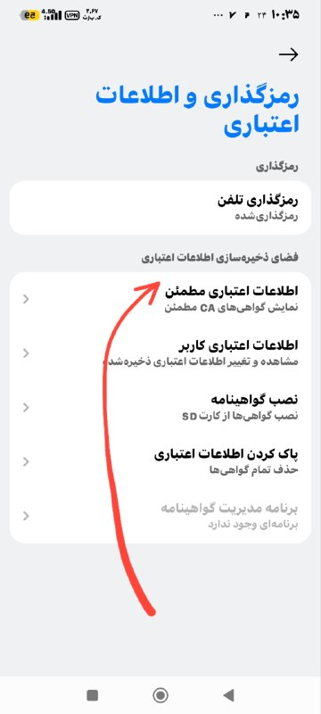

خیلیا نگران حذف مجوزی هستن که تو اون متود بالا نصبش کردن وارد تنظیمات میشین بعدش سرچ میکنید رمزگذاری بعدش وارد این قسمت میشین روی اطلاعات اعتباری مطمئن کلیک میکنید همه مجوز هارو میاره براتون با مجوزای سیستم کاری نداشته باشین از اون بالا روی کاربر کلیک کنید بعدش مجوز نصب شده رو حذف کنید و تمام ♥️

☑➜@Zel2oVPN

## Zel2oVPN — post 2760

سرور جدید WhiteDNS

Domain: v.whitedns.space
Encryption Key: bad99364093861634030e96f11fe3132

☑➜@Zel2oVPN

## Zel2oVPN — post 2759

دوستان این متود جدید هس خیلیا با ایرانسل و همراه اول بهش وصل شدن امیدوارم برای همه جواب بده ♥️

☑➜@Zel2oVPN

## Zel2oVPN — post 2758

  <a href="https://t.me/Zel2oVPN/2758" target="_blank">📎 Download file</a>

1. این فایل رو به ویتوری اد کنید‌
2. ویتوری رو بزارید روی حالت پروکسی مود
3. داخل سایفون برنامه ویتوری رو don't tunnel کنید.
4. این پروکسی رو داخل سایفون تنظیم کنید
127.0.0.1
10808
5. وصل بشید

☑➜@Zel2oVPN

## Zel2oVPN — post 2757

  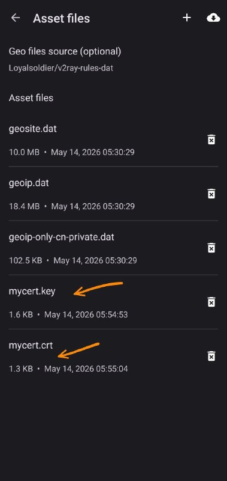

داخل ویتوری روی سه خط بزنید و گرینه assets files رو بزنید و دو تا کلیدی که گرفتید اضافه کنید

☑➜@Zel2oVPN

## Zel2oVPN — post 2756

  

متوود جدید ترکیبی پترنیها + سایفون
متود ترکیبی Psiphon + MitM

1. برنامه ویتوری رو نصب کنید

https://dardi.ir/download.php?code=ZNpGiKxz

2. برید به این سایت و یک نام دلخواه وارد کنید و بزنید روی ذره بین. دوتا کلید میده بزنید روی دانلود.
https://regery.com/en/security/ssl-tools/self-signed-certificate-generator

اسم هر دو فایل رو بزارید mycert.key و mycert.crt. اگه گفت همچین نامی هست اول یه نام دیگه بزارید بعد دوباره عوض کنید

3. برید تنظیمات گوشی و سرچ کنید:
CA certificate

بزنید روی install و فایل mycert.crt رو از پوشه دانلودها نصب کنید

☑➜@Zel2oVPN

## Zel2oVPN — post 2755

✔️ DNSTT [S120]

slipnet-enc://AZGKkYKMROz7i0uvid9HkhsAAQr84kHZok1xZCMKkm9SZ6LlVKoHAbh0XsoOdc4fzNuomhTnTqPZKN9dLM1R8RfXOlYswCJeyD+KheNSTg7AlhXeRnSNCsQ7C/fHUBCWRYOG5SapuOT5gpTf4rrfGdNcXaGQplSXt9jhF4zjFqCnfxORNELyYMa5nN6AiI2ru9D+6DO60kHjp8OQH8n/9OZKaMKEz/rm4az8BEU4hFlHXuB79iUGvwKVqmT2gSJXyMgQeOSKNdfu4ARhfGCCiXEIHrXQFUXoB/igAKF7+B3YCvcIcj8M3vpTpKCXCMeYZH99Dt429ndV3tDeb/GY87MxkWap6qNCiv4T+o4QWS6X/CIDeCeN+/hskBQ1TqpfKg4oE79AR665SQiLzQY2jeiElwXrLccq9DXpjEMgToC5CpxUCZIhT/OlLwLmOAOSTo/UM0OQ3G+U/J+YzZXgiXoEn4mDwmGFTwUJn7H+3dqiG0Lp5DfkMxSeD757dZ7QwLnIfOA/h+c/tEW8Y/e1DYGoirKdt6Vad6hVU4OBJy5JZspMdhmcUYrUDOoLU1RtQU4vaDTOFwpH3DjC6MlmBQYbLB3U8/mQKJFkkN6Em/l9+v6BZLPfjSz3y77nafB2YLDAsgGn3PumJcUaS/aXGhTaUfJb02DAWYwQFipTnriAO7b9W6R57BxPNYSTvUGsp6n5XiYW81jhUOf7caDR04jo/Ilgnxy5O2jy30isb2Ib6wQzdI4B58YjucRR9KfidnkeSIRcTcokxWCP2DuLRWQVMvlRheA+fAjlw9Y=

📱کانفیگ اسلیپ

📱مخصوص نسخه جدید  2.5.3

📱دانلود نسخه جدید

📱تنظیمات پیشنهادی

https://t.me/socks?server=127.0.0.1&port=10880&user=%40Zel2oVPN

☑➜@Zel2oVPN

## Zel2oVPN — post 2754

  <a href="https://t.me/Zel2oVPN/2754" target="_blank">📎 Download file</a>

اپدیت جدید whiteDNS

نسخه 1.3.0

لینک دانلود داخلی

☑➜@Zel2oVPN

## Zel2oVPN — post 2753

✔️VayDNS [S119]

slipnet-enc://AXjc3nBVld1zwi1JyV1hCHfs2vpWbgOv3KVS0d8XAWyFJNVDJ6V6bI8STlKWq2v5LjZlthAyDV+kjOH+WX0oVnjLNfT1YagfopXGaaL2RY5i1K9IQoICB0snaxvpRDyWoHxzPSI+R0V0t8ehpWlyM7jR25t1y1ct6FOLwEpJntieD2NkHhJxz0npJEriW1adOjFoPPy2/n07eW2bqinvHc6l65t2IAjnDzRrctx/rq4RedT//ARVfka+FzP/IXiYSKwm1GoX1WAoZ3/7CQkNrlOqjgt/5yfLDzQRBHKWyr3SXsL25/aU9zbYFuE3WgJ0bKGeHmfAKWnZieEkqHsQW5t1LM+8tAwf9PmlXLetbeAEk811bCbLd3RQTFXlcLXx5pZjwY+sd2/+KAbHqAk9PngHes0YQf98MnHZreTEwP14twNNH8Yy3VQPotM7m/3GLXNKV7qu89eFMyIH0An/m8koGDvlo3U4sGcfFl0/WwZSCc5d1NUyuBrzuE5TtoLcAY63fn71hsK87o5SIDyiFGFfj6SpH20PCaxQOeJJWKW6RtIFBFZf+3hrcduTMuW5DbFoQ5UUBoK0bHUEdCCvpADQWoDPcZJyCXzijWA01Ulfzv0Uh/XDNQ/uFOq8TwzPSwh3D9oTq0I+ff7nN2xQqq0Be/zX1igtnQRGv1tjiRPWvK2DukSHn0JsBkEZ9FdiAsB0akoafx45nAKdgXKguZtH

📱کانفیگ اسلیپ

📱مخصوص نسخه جدید  2.5.3

📱دانلود نسخه جدید

📱تنظیمات پیشنهادی

https://t.me/socks?server=127.0.0.1&port=10880&user=%40Zel2oVPN

☑➜@Zel2oVPN

## Zel2oVPN — post 2752

✅VayDNS [S118]

slipnet-enc://AaEjRygJm8CHZio3Orfik44rhU6pVvLGX6N0+6fgacgMPn1JquW8q/YpED0q+OCgBxynHIyt1/1F7IQ6lFbZA0ADzB8dLEuWLkzwgk8yUJL73ZuiVqo2kgwiS6m1SCw7bccFyeZZulZMZ7PbqF1+5ODOTh24kcYFlivr4KVLhSEOtbwyB8tJ16gIeWj2N7eO4UcKuDC4tK8mgy0YUVjtmzLXlUDJWhFLljdX8P2gTWlsiEGVzWFnjGJVUYyd6D48z3XCbe3B8WsgKO51EJ5BviWO/buLwoFBWYDMos5D31macJyto+f3d1i1XrbeRnqh+EHcenTSuouoEUJh0Bw3ihsqSMyC/7Tf7JvdoMByst10Z1Z0kspEqSeHhiD735xntHoKocr+E7k9rVTcuVeT8RwKxDuRxda9uisM7HN/9E+QwOUeFlX0zYkbxu3nSX5Hi3eNv9dtHF0x9J5VrlX1h2gzZ0L0ssCdc0k5637Q5NWWUvqzG7ZLBA63SDD3k29xf5jlcdCvpSwOJi2xFuQIl2naVO0tUYOzMoSQqcHksjXTtV6A8cP27pHM75pELCB0afb8kMUlK1YF6zNkpSMZBHVhqDDP568lR7NwAOzTXjmMYlszeTHm1XoUfq7ETJT47kpVz+qbGjagqoOKsNWltVO4ej6Y4HnYbMpFDlB7jx/kudOp39URxXZ3EhuGho2U9Z9jCIfjckmNlNcn6TjKOh/mtHD2a4BW0dU+rhxnZPX9MSL62fDqhdm1dPqszSUSaQ==

📱کانفیگ اسلیپ

📱مخصوص نسخه جدید  2.5.3

📱دانلود نسخه جدید

📱تنظیمات پیشنهادی

https://t.me/socks?server=127.0.0.1&port=10880&user=%40Zel2oVPN

☑➜@Zel2oVPN

## whitedns — post 606

  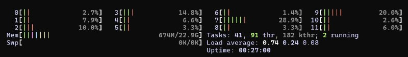

سرور جدید WhiteDNS

Domain: v.whitedns.space
Encryption Key: bad99364093861634030e96f11fe3132

از همه کانال‌ها و دوستانی که این لیست رو بازنشر می‌کنند خواهش می‌کنیم حداقل سهم و همکاری‌شون این باشه که کانال ما رو به عنوان منبع ذکر کنند. این داده‌ها با زمان، هزینه و اسکن گسترده جمع‌آوری شده، نه با جادو و دعای نیمه‌شب.

این بزرگترین سرور ما هستش. ۱۲ هسته سی‌پی‌يو و ۲۴ گیگ رم.

✈️هر مشکلی هست، از سمت اختلال شبکه، تنظیمات و ریزالور ها هستش.

@WhiteDNS

## whitedns — post 602

📢 اطلاعیه مهم برای کاربران WhiteDNS

دوستان عزیز،

برای بهبود کیفیت اتصال و افزایش پایداری سرویس، تمام سرورهای فعلی WhiteDNS به‌زودی پاک‌سازی و جایگزین خواهند شد.

✅ سرورهای جدید به‌زودی از طریق همین کانال در اختیار شما قرار می‌گیرند.

تا زمان انتشار سرورهای جدید، لطفاً فقط به سرورهایی متصل شوید کهآدرس آن‌ها whitedns.shop نیست.

یعنی فعلاً از اتصال به سرورهای دارای دامنه زیر خودداری کنید:

whitedns.shop

ممنون که همراه ما هستید 🤍
@WhiteDNS

## whitedns — post 601

  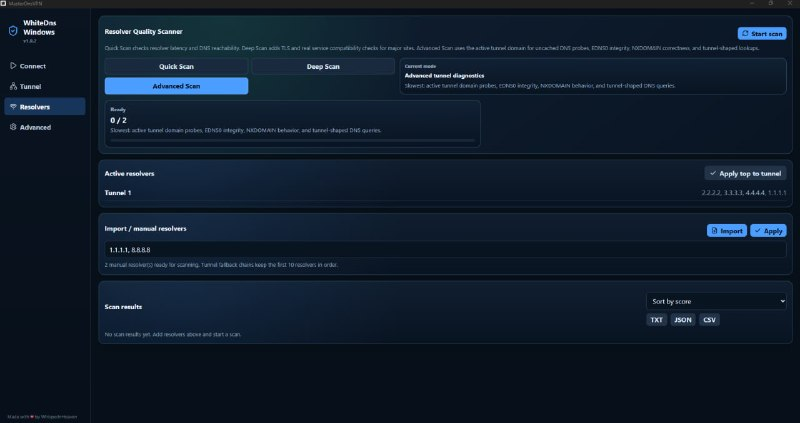

نسخه ۱.۰.۲ 🔄 WhiteDns Windows

به زودی.................
🔥
🔥
🔥
🔥

نسخه ۱.۰.۲ بر پایداری، قابلیت استفاده و تشخیص‌های بسیار قوی‌تر رزولور تمرکز دارد. 🛠

این بروزرسانی مشکل آکاردئون را در بخش تنظیمات پیشرفته اصلاح می‌کند تا بخش‌ها با قابلیت اطمینان بیشتری باز و بسته شوند و چیدمان تنظیمات رفتار سازگارتری داشته باشد. همچنین اسکنر رزولور را با یک حالت اسکن پیشرفته جدید بهبود می‌بخشد که رزولورها را به روشی واقع‌گرایانه‌تر و آگاه به تونل، با استفاده از دامنه فعال تونل آزمایش می‌کند، از جمله بررسی‌های DNS بدون کش، قابلیت EDNS0، یکپارچگی NXDOMAIN، مدیریت زیردامنه‌های تو در تو و جستجوهای پروب به شکل تونل. 🌐

تجربه نتایج اسکن نیز بهبود یافت. اکنون خروجی با اطمینان بیشتری کار می‌کند، مرتب‌سازی به درستی عمل می‌کند و نتایج صادر شده اکنون بهتر با آنچه در رابط کاربری نمایش داده می‌شود مطابقت دارند. جزئیات اضافی اسکن مانند امتیاز، دامنه پروب و قابلیت مشاهده بار EDNS اضافه شد تا رزولورهای قوی‌تر را با دقت بیشتری شناسایی کنید. 📊✨

@whitedns

## whitedns — post 593

  <a href="https://t.me/whitedns/593" target="_blank">📎 Download file</a>

سلام به همه دوستان

نسخه جدید WhiteDNS آماده شد. ممنون از همه کسانی که نسخه‌های قبلی رو نصب کردند، تست گرفتند، لاگ فرستادند و با فیدبک‌هاشون کمک کردند مشکلات رو پیدا و برطرف کنیم 🙏

تمرکز اصلی این نسخه روی اسکن Resolverها، مدیریت ساده‌تر پروفایل‌ها و پایدارتر شدن اتصال در خود WhiteDNS بوده است. هدف این بود که کاربران راحت‌تر Resolverهای سالم را پیدا کنند، نتیجه اسکن را ذخیره و دوباره استفاده کنند، و اتصال Proxy یا Full VPN در پس‌زمینه و بعد از قطع‌و‌وصل شدن مطمئن‌تر بماند. در کنار این موارد، امنیت خروجی‌ها، بکاپ و اشتراک‌گذاری فایل‌ها هم بهتر شده است.

✅ نسخه اپلیکیشن به 1.3.0 ارتقا پیدا کرده
✅ بخش جدید Scan برای بررسی و پیدا کردن Resolverهای سالم اضافه شده
✅ حالا می‌توانید فایل Resolver وارد کنید و اپ خودش Resolverهای سالم را جدا کند
✅ نتیجه اسکن به‌صورت خودکار داخل پروفایل‌های Resolver ذخیره می‌شود
✅ می‌توانید نتیجه اسکن را با نام دلخواه به عنوان Resolver Profile جدید ذخیره کنید
✅ Resolverهایی که قبلاً سالم شناخته شده‌اند دوباره بی‌دلیل اسکن نمی‌شوند
✅ امکان توقف اسکن و ادامه دادن آن از همان‌جایی که مانده اضافه شده
✅ سرعت اسکن قابل تنظیم شده تا بین سرعت بیشتر و مصرف باتری کمتر انتخاب کنید
✅ وضعیت اسکن با تعداد کل، سالم، ردشده و میزان پیشرفت واضح‌تر نمایش داده می‌شود
✅ می‌توانید برای اسکن، پروفایل سرور جداگانه انتخاب کنید
✅ اگر پروفایل اسکن سرور یا کلید نداشته باشد، اپ واضح‌تر هشدار می‌دهد
✅ حالت روشن، تاریک و خودکار برای ظاهر اپ اضافه شده
✅ مدیریت پروفایل‌های اتصال، Resolver و تنظیمات پیشرفته مرتب‌تر و راحت‌تر شده
✅ امکان وارد کردن تنظیمات پیشرفته از فایل یا متن TOML اضافه شده
✅ امکان خروجی گرفتن تنظیمات پیشرفته به فایل advanced_settings.toml اضافه شده
✅ خروجی گرفتن و اشتراک‌گذاری فایل‌ها امن‌تر و تمیزتر شده

https://dl.toolschi.com/view.php?f=e15bcec825298e4c.zip

🔗 GitHub:
https://github.com/iampedii/WhiteDNS/releases/tag/1.3.0

از همراهی و حمایت شما ممنونیم ❤️

## mirzapanel — post 1315

ایرانسل خوب روش کلاه برداری بلده

میاد لینک پرداخت اینترنت پرو رو پیامک میکنه و ازتون ۲۲۰۰ میگیره

بعد میگه برو احراز هویت کن اطلاعات شرکتت بزن

اون موقع دیگه به من چه که شرکت نداری یا احرازت نمیکنه و ۲۲۰۰ هم میخوره می‌ره

کلا ایرانسل اول پول میگیره بعد احراز هویت می‌کنه

چقدره دزدن که خودشون پیام میدن که اینترنت پرو شما تایید شد که پول رو فوری بدی

## erfanandroid — post 88595

  <a href="https://t.me/erfanandroid/88595" target="_blank">📎 Download file</a>

🟢🟢صرافی ال بنک بهترین صرافی حال حاضر هستش که با وضعیت اینترنت ایران سازگاره و همه ارزارو داره تقریبا

دانلود مستقیم از گوگل پلی👇

https://play.google.com/store/apps/details?id=com.superchain.lbankgoogle

هرکسی با کد رفرال من ثبت نام کرد و ترید میکنه UID اکانتشو بفرسته بش تخفیف خوبی میدم واسه vpn
و درضمن 30% کارمزد کمتر میدین تو معاملات با این کد رفرال

کد رفرال: 5L582

@erfanandroid

## Spotify_Porteghali — post 12373

- کانفیگِ جدید برایِ SlipNet -
تست شده با 
🛜 همراه اول ( حتما با بقیه ی اینترنت ها چک کنید )

slipnet-enc://AU1KZP8t3JAtWp1D9o63rqdHC+iYWfGnovbDvgGiZmg8QqDOb4EdbPuceuk5JTjxEJjvqKfcvCfQxx3RZIwIOKfI/+oJapG1ijVlVmSWponrqGd7a2eRVIGQX30QWj53EN+yiRNMTdtWGFhu/as04426Sms+11kq8GPcTjMF9q+PClioYU5LLW4XaBv/pWhFS+XqcdamSFtDLbMki/jp2rUxqb1IAjxEIE0AndMuucBRpusa9/FPVbHS+W9OTFMzEW8YsYhmLCYG7AQHx0kGELTg65kwx+TsrKNmcAk2IDEWYEWTpnhTKOSPFyuFVHaCmEuxHbaFaXNkipUKrXQbOEtgDir6uIEuCgcsW5Rl5hGigC3BL2LjUCCibdcSmvLDnjWIcjChI4HsfWmCBPtojyZsbgiHm/dr8kLi0zWWnvj2AX3a1Vt4bURHpzOn3h/rrZS1JKxmdwvmfuuhMndIpXpwzHpSfGbIcjPXLzIWHCuIGtjjpspQgw61Gg4/EYXsHWJHRZwuB9phtG0lKY8cOCYHfHR3uRRBpglfklFWGOeSkGGMUAXrEiFUF5aXUODV1GmIY8dpUQuCb34Fcw0hcxv2D+dN9p63sg2xpowoxpkOoeIfefFR+aoX/js+yVJZFGd2UhgykHJqtgbtmlLeRz/z8jn/J6cQZBNcZqCRaol/s6BFZcknGrmMmgZbLWGd5esxMt9eczH/vlQeyIdJDqyR

💬 لینکِ دانلودِ مستقیمِ بدونِ فیلترِ اپلیکیشنِ SlipNet 
💬

💬 تنظیماتِ پیشنهادی برایِ SlipNet 
💬

⚪️حتما از تنظیمات VPN MTU رو رویِ 512 بگذارید و تنظیمات رو ذخیره کنید .

⚪️زمانی که کانفیگ رو ادد کردید قبل از اتصال رویِ علامتِ مداد کنارِ کانفیگ بزنید و DNS Query Size رو هم یکبار رویِ 50 بزارید و تست کنید و هم یکبار 60 بزارید و متصل بشید .

⚪️حتما از تنظیمات گزینه‌ ی Proxy-only Mode رو‌ فعال کنید . بعد از اینکه کانفیگ متصل شد ، به یکی از پروکسی هایِ زیر در تلگرام متصل شَوید .

🔗 : https://t.me/socks?server=127.0.0.1&port=10880

🔗 : https://t.me/socks?server=0.0.0.0&port=10880

🆔 @Spotify_Porteghali 🍊

↰  بزرگترین خانواده اسپاتیفای در کشور  ↱

## Spotify_Porteghali — post 12372

  

پروکسی مخصوص نت ملی 
🛜 مخابرات و 
🛜 همراه اول : https://t.me/socks?server=194.9.56.121&port=10838 🆔 @Spotify_Porteghali 🍊 ↰  بزرگترین خانواده اسپاتیفای در کشور  ↱

## Spotify_Porteghali — post 12371

پروکسی مخصوص نت ملی

🛜 مخابرات و 
🛜 همراه اول :

https://t.me/socks?server=194.9.56.121&port=10838

🆔 @Spotify_Porteghali 🍊

↰  بزرگترین خانواده اسپاتیفای در کشور  ↱

## Spotify_Porteghali — post 12370

پروکسی مخصوص نت ملی 
🛜 مخابرات و 
🛜 همراه اول : https://t.me/socks?server=185.239.106.84&port=1082&user=MAMAD&pass=667222222268888777 🆔 @Spotify_Porteghali 🍊 ↰  بزرگترین خانواده اسپاتیفای در کشور  ↱

## Spotify_Porteghali — post 12369

پروکسی مخصوص نت ملی

🛜 مخابرات و 
🛜 همراه اول :

https://t.me/socks?server=185.239.106.84&port=1082&user=MAMAD&pass=667222222268888777

🆔 @Spotify_Porteghali 🍊

↰  بزرگترین خانواده اسپاتیفای در کشور  ↱

## King_network7 — post 30751

🔰 آموزش اتصال به نت بین المل با متود سایفون

◾️ ربات ایجاد گواهی (Certificate):
@CrtGen7Bot

⬇️ لینک‌ دانلود داخلی V2ray
⬇️ لینک‌ دانلود داخلی سایفون
⬇️ لینک‌ دانلود داخلی کانفیگ
⬇️ لینک‌ دانلود داخلی آموزش

❓ توی گوشی هم روش تقریبا به همین صورت هست، سرتیفیکیت دریافتی رو در تنظیمات CA certificate نصب کنید و داخل بخش Assets برنامه v2ray اضافه کنید. حالت رو روی proxy mode بزارید و کانفیگ رو اضافه کنید و متصل بشید. داخل سایفون هم ابتدا برنامه v2ray رو از حالت تانل خارج کنید و بعد پروکسی رو ست کنید.

➰➰➰➰➰
#️⃣ #vpn #windows
🆔 @King_Network7

## King_network7 — post 30750

## JynMarket — post 2270

🌟 سرور اسلیپ نت جدید

slipnet-enc://AfnD1nJahX2kGwe75YpRwSGOxziQXdoFBxFzwNMZJcMyHLsFijZ8W5PE44mATn5Ks1q89gTT3l/f3k/8tvixXQawQCt6Qg0gwOuQGcOHHm4IS79v3t7nso9kPpqyqs24c29PoFZTVGtTYDtUYB25UranPtX9H2RB8VZq+Ct107i7uwvN7be2lyLEWk3RFQlxZlt4GuamvkPh8pH1ZP0y7MmoSOPQVDhK8z6qvqzXSM9ztzbmbvtjlciz8RwQ1mhV51lvKjk6Om0nfKuH398LfcH6GO7edfE0bv6tpGuVk9rBcUrPAHJGI/oVPv3KkwpTWZ6MwyeFGBkt/XcY/N3yr0uCTsnLU6OT+UyTigOjKqXj9WhrGEG/5lE+i+hRvHftwOjrWXkC62guQZ8VmupQdeJe1Ct2+ETuL+tIFRhO43VSYd6reb5feNfqBo4D48V94ejC2v5Arf+itOlgT/2AM8eTGsSejB/JAJubS1XetAAtXYq2UewodknG1tXjf7e3T77pp+fXsh+d9WNbc2keuBq4Hbu64NIH0gvzptKuxLHR6Fyn+hSzz5AcA9MKuWBmv6bS/uqhxkTMkYBDp9a5DK8PFNq7w+jlt69kyMx7ZDgWXFvAtObPxLl1tQhV2+q0WyduIiigQ6fVFxQaBUo2qQynq6otNtFLxiKUgiaMyJ8GiVzFpp4Du4uENe93nrc6KCqC9mm+NXg=

🔗 اموزش استفاده - دانلود برنامه موردنیاز

## NamazVPN — post 35508

─────────── VLESS ───────────

🔗 vless://4e68a800-e49b-4180-9f3e-64324d0214d8@45.81.16.109:13526?type=tcp&security=none&encryption=none#%F0%9F%87%B1%F0%9F%87%BALuxembourg%20%7C%20%F0%9F%8C%90%20IP%3A%2031.184.246.82%20%7C%20%E2%8F%B3ping%3A797.88ms%20%7C%20%F0%9F%93%A2%20%40NamazVPN

📍 🇱🇺 Luxembourg
⏱️ 797.88ms

📢 @NamazVPN

## NamazVPN — post 35507

سرور ربات داره تموم میشه
احتمالا دو سه روزی فعالیت کم یا متوقف میشه

## NamazVPN — post 35506

─────────── VLESS ───────────

🔗 vless://adb7b238-97d4-4843-9cd8-3e9bdcbdad72@185.143.233.5:2083?encryption=none&fp=firefox&host=p1.sesrsa.com&path=%2F&security=tls&sni=sub.sesrsa.com&type=ws#%F0%9F%87%A9%F0%9F%87%AAGermany%2C%20Falkenstein%20%7C%20%F0%9F%8C%90%20IP%3A%202a01%3A4f8%3Ac014%3A8d11%3A%3A1%20%7C%20%E2%8F%B3ping%3A1525.41ms%20%7C%20%F0%9F%93%A2%20%40NamazVPN

📍 🇩🇪 Germany, Falkenstein
⏱️ 1525.41ms

📢 @NamazVPN

## NamazVPN — post 35505

─────────── VLESS ───────────

🔗 vless://69c363e4-2d88-4336-af5d-f48d689a338d@185.143.233.5:2083?path=%2F&security=tls&encryption=none&insecure=0&host=p1.sesrsa.com&fp=firefox&type=ws&allowInsecure=0&sni=sub.sesrsa.com#%F0%9F%87%B3%F0%9F%87%B1The%20Netherlands%2C%20Amsterdam%20%7C%20%F0%9F%8C%90%20IP%3A%2045.252.181.54%20%7C%20%E2%8F%B3ping%3A694.68ms%20%7C%20%F0%9F%93%A2%20%40NamazVPN

📍 🇳🇱 The Netherlands, Amsterdam
⏱️ 694.68ms

📢 @NamazVPN

## NamazVPN — post 35504

─────────── VLESS ───────────

🔗 vless://1653b0a8-839e-4ce1-91b5-df4ec0fbfd88@185.143.235.253:80?path=%2F&security=none&encryption=none&host=ss.oppobot.ir&type=ws#Unknown%20%7C%20%F0%9F%8C%90%20IP%3A%20N%2FA%20%7C%20%E2%8F%B3ping%3A2918.23ms%20%7C%20%F0%9F%93%A2%20%40NamazVPN

📍
⏱️ 2918.23ms

📢 @NamazVPN

## TirexNet — post 3715

سرور اول ( اسلیپ نت ) 🎃 همه اپراتور ها ( Vaydns+Ssh+Socks ) NULL سرور دوم ( اسلیپ نت ) 🐍 ترجیحا همراه اول (Vaydns+Ssh ) NULL | CNAME | SRV | CAA | NS | NULL ترجیحا همراه اول ( Vaydns+Socks ) NULL | NULL آموزش کامل | تنظیمات جدید | تنظیمات جدید Channel:…

## papFransiz — post 471

دیشب با یه نفری آشنا شدم... که پشت سیستم فیلترینگه همونای که خیلی فحش میخورن...

جالبیش اینجاست این شخص از فعال کامیونیتی VPN... هست و خودش کلی راه می‌سازه و میده بیرون بعد خودش می‌بنده تشون....

## asrnovin_ir — post 10329

کانال یوتیوبم رو دارم کامل حذف میکنم
دلیلش به خاطر یه سری مشکلاتی هست که از سمت خود یوتیوب پیش اومده .
و خب شاید کانال جدیدم رو با محتوای بهتر و حرفه ای تر در آینده بسازم و زمانی اینکار شدنیه که همه مردم عزیز ایران به اینترنت بین الملل دسترسی کامل پیدا کنند.
همچنان در تلگرام فعالیتمون رو ادامه میدیم ❤️

## asrnovin_ir — post 10328

  <a href="telegram/content/asrnovin_ir_10328_1778746316.webm" target="_blank">🎬 Download video</a>

اگه یه سایت میخوای که بدون سانسور فیلم و سریال ببینی و با اینترنت ملی هم راحت بالا بیاد وقتشه بری سراغ پارادوکس موویز 
😎
🔥

✅ آرشیوی با بیش از 40 هزار فیلم و سریال

✅ بدون سانسور و حذفیات 🚫
❌

✅ اپلیکیشن اندروید + Android TV 
🤖

✅ دانلود و پخش آنلاین حتی در آیفون
🍏

✅ قابل دسترس حتی در اینترنت ملی

✅ پشتیبانی 24 ساعته 💬
📞

همین الان وارد شو 
😉
👇

## sirhishamtradinghub — post 3682

  

Gem 💎

## sirhishamtradinghub — post 3681

Good morning everyone

## Pvpn_Ez — post 119

* سرویس عادی حجمی - گیگی 200 هزارتومن
بدون محدودیت زمانی - 5 روز ضمانت بازگشت وجه
حداقل خرید 3 گیگابایت

## TheVPNMethod — post 661

وپن فروشا فعلا ساکتن 😁

## TheVPNMethod — post 658

آموزش تصویری کامل و ساده متود Psiphon—MITM سرعت: عالی حجم: نامحدود! پیش‌نیاز: هیچی!!! نکته مهم نهایی!!! برنامه v2rayNG باید تونل نشه! گزینه Don't tunnel selected apps بزنید و برنامه v2rayNG رو انتخاب کنید! سایت مورد نیاز اول ویدیو برای دریافت سرتیفیکیت: h…

## TheVPNMethod — post 657

آموزش تصویری کامل و ساده متود Psiphon—MITM سرعت: عالی حجم: نامحدود! پیش‌نیاز: هیچی!!! نکته مهم نهایی!!! برنامه v2rayNG باید تونل نشه! گزینه Don't tunnel selected apps بزنید و برنامه v2rayNG رو انتخاب کنید! سایت مورد نیاز اول ویدیو برای دریافت سرتیفیکیت: h…

## TheVPNMethod — post 652

شیر کنید همه وصل شن !!! 🔥🔥🔥

## TheVPNMethod — post 649

  <a href="telegram/content/TheVPNMethod_649_1778746318.mp4" target="_blank">🎬 Download video</a>

آموزش تصویری کامل و ساده
متود Psiphon—MITM
سرعت: عالی
حجم: نامحدود!
پیش‌نیاز: هیچی!!!

نکته مهم نهایی!!! برنامه v2rayNG باید تونل نشه! گزینه Don't tunnel selected apps بزنید و برنامه v2rayNG رو انتخاب کنید!

سایت مورد نیاز اول ویدیو برای دریافت سرتیفیکیت:
https://regery.com/en/security/ssl-tools/self-signed-certificate-generator
دانلود ZIP آموزش تصویری + پی دی اف + کانفیگ لازم با لینک داخلی:
https://uploadgirl.ir/d/de707acd-2595-4357-9cbe-ae670a0ddc40

ZIP Password: @TheVPNMethod
لینک دانلود داخلی سایفون!
لینک دانلود داخلی v2rayNG!
— More: @TheVPNMethod

## TheVPNMethod — post 647

  <a href="https://t.me/TheVPNMethod/647" target="_blank">📎 Download file</a>

آموزش کامل و ساده
متود Psiphon—MITM
بصورت PDF
سرعت: عالی
حجم: نامحدود!
پیش‌نیاز: هیچی!!!

## TheVPNMethod — post 643

پترنیها چه کردی پترنیها، متود جدید رو دارم آموزشش رو میگیرم. میاد بالا بزودی بمب خالص !!! 🔥

## TheVPNMethod — post 642

بابا بنازم.

## TheVPNMethod — post 641

آموزش ساده پروژه جدید برای دانلود از تلگرام و یوتیوب و گوگل پلی و... بیاد بالا ؟!

## DigiGozar — post 9201

نمایش مقدار باقی مانده ربات مشکل داره!
به زودی حل خواهیم کرد لطفا عجله نکنید

## MatinSenPaii — post 3031

قطع و وصلی داره ها، اما هر 5 دقیقه، 10 ثانیه قطعه مثلا
برای گیم شاید عالی نباشه، اما وبگردی، اینستاگرام، تلگرام، توییتر و هوش مصنوعی‌ها همه اوکین

## MatinSenPaii — post 3030

  

این هم روی گوشی(تمام باگ‌ها و مشکلاتی که توی گروه‌ها گفته شده بود رو در آوردم و دسته‌بندی کردم و خودم امتحان کردم)
این پست هم با همین متد داره فرستاده میشه
🕶️

## MatinSenPaii — post 3029

  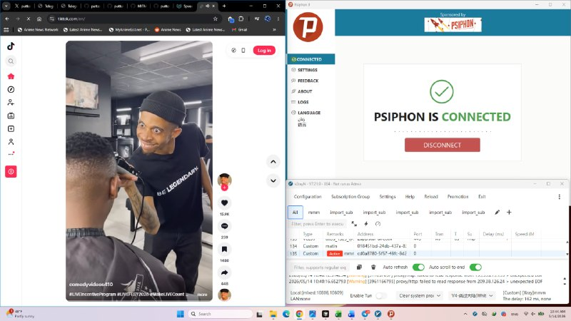

برای یه روش کاملا رایگان، بدون نیاز به سرور، بدون نیاز به اکانت گوگل، بدون نیاز به شماره حساب خارجی و هیچی، سرعتش عالیه. آموزشش رو می‌ذارم واستون. خیلی ساده‌ست
با تشکر از @patterniha

## archivetell — post 4853

آموزش ویندوز هم مثل اندرویده..

لینک داخلی آخرین نسخه سایفون ویندوز

لینک داخلی آخرین نسخه V2rayn ویندوز

@ArchiveTell

## archivetell — post 4852

v2rayNG 2.1.7 لینک داخلی دانلود با این نسخه وصل شید.. اینم لینک داخلی سایفون واسه اونایی که نصب ندارن @ArchiveTell

## archivetell — post 4851

متوود جدید ترکیبی پترنیها + سایفون متود ترکیبی Psiphon + MitM 1. برنامه ویتوری رو نصب کنید https://urldl.ir/download/499338 2. برید به این سایت و یک نام دلخواه وارد کنید و بزنید روی ذره بین. دوتا کلید میده بزنید روی دانلود. https://regery.com/en/security/ssl…

## archivetell — post 4850

v2rayNG 2.1.7 لینک داخلی

دانلود

با این نسخه وصل شید..

اینم لینک داخلی سایفون واسه اونایی که نصب ندارن

@ArchiveTell

## archivetell — post 4849

ArchiveTel pinned a photo

## archivetell — post 4846

  <a href="https://t.me/archivetell/4846" target="_blank">📎 Download file</a>

1. این فایل رو به ویتوری اد کنید‌
2. ویتوری رو بزارید روی حالت پروکسی مود
3. داخل سایفون برنامه ویتوری رو don't tunnel کنید.
4. این پروکسی رو داخل سایفون تنظیم کنید
127.0.0.1
10808
5. وصل بشید

@ArchiveTell

## archivetell — post 4845

  

داخل ویتوری روی سه خط بزنید و گرینه assets files رو بزنید و دو تا کلیدی که گرفتید اضافه کنید

@ArchiveTell

## archivetell — post 4844

  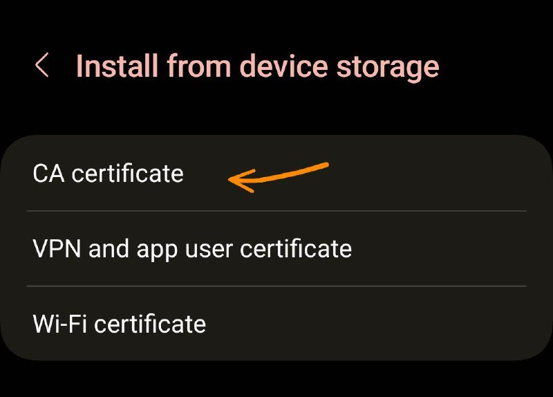

متوود جدید ترکیبی پترنیها + سایفون
متود ترکیبی Psiphon + MitM

1. برنامه ویتوری رو نصب کنید
https://urldl.ir/download/499338

2. برید به این سایت و یک نام دلخواه وارد کنید و بزنید روی ذره بین. دوتا کلید میده بزنید روی دانلود.
https://regery.com/en/security/ssl-tools/self-signed-certificate-generator

اسم هر دو فایل رو بزارید mycert.key و mycert.crt. اگه گفت همچین نامی هست اول یه نام دیگه بزارید بعد دوباره عوض کنید

3. برید تنظیمات گوشی و سرچ کنید:
CA certificate

بزنید روی install و فایل mycert.crt رو از پوشه دانلودها نصب کنید

@ArchiveTell

## archivetell — post 4842

  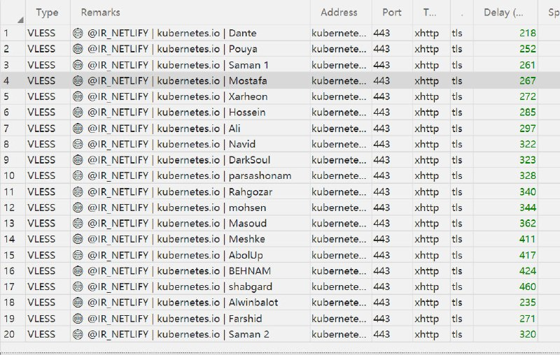

🚀 20 سرور با قدرت متصل

📌 فایل برنامه
📌 لینک سایت

☕️ اموزش ساخت دامنه نتلیفای

🔵 @IR_NETLIFY

## hamvex — post 2555

𝑭𝑰𝑹𝑺𝑻 𝑯𝑨𝑴 pinned a video

## hamvex — post 2554

ری‌اکشن یادتون نره
به اشتراک بزارید همه وصل شن

## hamvex — post 2553

🌐 آموزش کامل دور زدن فیلترینگ با متود MITM + PSIPHON (فول تانل)(اندروید)

🎬
https://youtu.be/C0Xr8bmhAow?si=mRxXRmQIh0jm1Xs0

🐱
https://github.com/patterniha

⬇️
🔄
https://uplod.ir/eyn04g87pgzo/MITM_PSIPHON.mp4.htm ( لینک دانلود داخلی)
Pass : @hamvex

🔻Creator : @patterniha

## hamvex — post 2552

👍 آموزش کامل متود MITM + Psiphon روی اندروید با این متود کل گوشی تانل می‌شود نه فقط مرورگر 
✅ 
📝 پیش‌نیازها: 
📱 آخرین ورژن Psiphon https://uplod.ir/z1wfbcp3dvla/Psiphon-v-460.zip.htm Pass : @hamvex 
🔐آخرین ورژن v2rayNG https://uplod.ir/grf5sue1h69d/v2rayNG…

## hamvex — post 2551

𝑭𝑰𝑹𝑺𝑻 𝑯𝑨𝑴 pinned «
👍 آموزش کامل متود MITM + Psiphon روی اندروید با این متود کل گوشی تانل می‌شود نه فقط مرورگر 
✅ 
📝 پیش‌نیازها: 
📱 آخرین ورژن Psiphon https://uplod.ir/z1wfbcp3dvla/Psiphon-v-460.zip.htm Pass : @hamvex 
🔐آخرین ورژن v2rayNG https://uplod.ir/grf5sue1h69d/v2rayNG…»

## hamvex — post 2550

👍 آموزش کامل متود MITM + Psiphon روی اندروید با این متود کل گوشی تانل می‌شود نه فقط مرورگر 
✅ 
📝 پیش‌نیازها: 
📱 آخرین ورژن Psiphon https://uplod.ir/z1wfbcp3dvla/Psiphon-v-460.zip.htm Pass : @hamvex 
🔐آخرین ورژن v2rayNG https://uplod.ir/grf5sue1h69d/v2rayNG…

## hamvex — post 2548

  <a href="https://t.me/hamvex/2548" target="_blank">📎 Download file</a>

📎 Document

## hamvex — post 2546

👍 آموزش کامل متود MITM + Psiphon روی اندروید

با این متود کل گوشی تانل می‌شود نه فقط مرورگر 
✅

📝 پیش‌نیازها:

📱 آخرین ورژن Psiphon
https://uplod.ir/z1wfbcp3dvla/Psiphon-v-460.zip.htm
Pass : @hamvex

🔐آخرین ورژن v2rayNG
https://uplod.ir/grf5sue1h69d/v2rayNG-2.1.7-universal.zip.htm
Pass : @hamvex

🖥 مراحل:

🔢 تهیه و نصب سرتیفیکیت
اگر قبلاً سرتیفیکیت دارید یا اینکه در ویندوز mycert.crt و mycert.key ساختید، فقط منتقل کنید و به مرحله 1.2 برید.

● اگر سرتیفیکیت ندارید
↗️

📎مرحله 1.1 : ایجاد سرتیفیکیت

🔺برید به سایت زیر
https://regery.com/en/security/ssl-tools/self-signed-certificate-generator

🔺یک نام دلخواه در قسمت سرچ وارد کنید و سرچ کنید

🔺دو فایل دریافت می‌کنید که باید هر دو رو دانلود کنید

🔺فایل‌های دانلود شده را پیدا کرده و مجددا نام‌گذاری کنید(به فرمت کاری نداشته باشید اسم جفتشون باید mycert باشه به شکل زیر):
certificate.crt → mycert.crt
private.key → mycert.key

📎مرحله 1.2: نصب سرتیفیکیت در اندروید
• تنظیمات (Settings)  ↓
• امنیت و حریم خصوصی (Security & privacy)  ↓
• رمزگذاری و اعتبارنامه‌ها (Encryption & Credentials)  ↓
• نصب گواهی (Install a certificate)  ↓
• گواهی مرجع (CA Certificate)  ↓
• به هر حال نصب کن Install anyway  ↓
• انتخاب فایل mycert.crt

🔹اگر این مسیر پیدا نشد: در Search تنظیمات گوشی CA Certificate رو جستجو کنید

🔢 تنظیم v2rayNG

📎مرحله 2.1 : اضافه کردن فایل‌های سرتیفیکیت

🔺نرم افزار v2rayNG رو باز کنید

🔺در صفحه اصلی، سه خط (☰) رو ضربه بزنید

🔺گزینه "Asset Files" رو انتخاب کنید

🔺علامت "+" رو بزنید و "Add Files" رو انتخاب کنید

🔺هر دو فایل mycert.crt و mycert.key رو اضافه کنید.

📎مرحله 2.2 : وارد کردن کانفیگ

🔺در صفحه اصلی v2rayNG، "+" رو بزنید

🔺گزینه "Import from locally" رو انتخاب کنید

🔺کانفیگ Psiphon-Helper رو وارد کنید (پست بعدی)

📎مرحله 2.3 : تنظیمات ترکیبی

🔺وارد Settings نرم‌افزار بشید

🔺بخش Mode رو روی "Proxy Only" تنظیم کنید
بخش Local Proxy Port روی 10808 باشه

📎مرحله 2.4 : فعال‌سازی

🔺نرم‌افزار v2rayNG رو "Connect" کنید.

🔢 تنظیم Psiphon

📎مرحله 3.1 : تنظیم Proxy

🔺نرم‌افزار Psiphon را باز کنید

🔺به Options بخش Proxy Settings برید

🔺گزینه‌ Connect proxy upstream through رو فعال کنید

🔺گزینه Use following settings رو فعال کنید
مقادیر را وارد کنید:

آدرس (Address): 127.0.0.1
پورت (Port): 10808

📎مرحله 3.2 : استثنا کردن v2rayNG

🔺برید به Options بخش VPN Settings

🔺گزینه "Don't tunnel selected apps" رو انتخاب کنید

🔺نرم‌افزار v2rayNG رو به لیست استثنا اضافه کنید

🔢 اتصال نهایی
ترتیب اتصال (بسیار مهم)
↗️

🔺ابتدا v2rayNG :
نرم‌افزار v2rayNG رو در حالت "Proxy Only" روشن کنید

🔺سپس Psiphon:
نرم‌افزار Psiphon را باز کنید
دکمه "Start" رو بزنید

🔻 سازنده: @patterniha

🔺آدرس ولت تو بیوش هست ازش حمایت کنید.

## hamvex — post 2545

⌛راه اندازی MITM Domain Fronting روی اندورید 
🖥 ویدئوی آموزشی : http://kalbod-team.ir/f/41df6390cbf84bd6 Pass : @hamvex 
🔢 دانلود v2rayNG http://kalbod-team.ir/f/fe2bc07e3df848f2 Pass : @hamvex 
🔢تهیه سرتیفیکیت شخصی به یه سرتیفیکیت شخصی نیاز دارید. دو روش…

## Break_The_Barriers — post 1557

بالای ١ ترابایت ترافیک، فقط طی ١۴ ساعت از زمان ریست سرورها ثبت شده.

## Break_The_Barriers — post 1556

  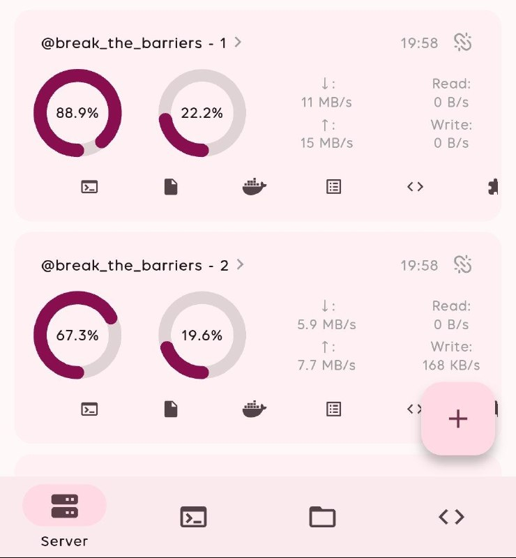

صبح به‌خیر ایرانی. 
✌️

این اعداد برای متد DNS، یعنی اتصال خیلی‌ها.

## Break_The_Barriers — post 1555

  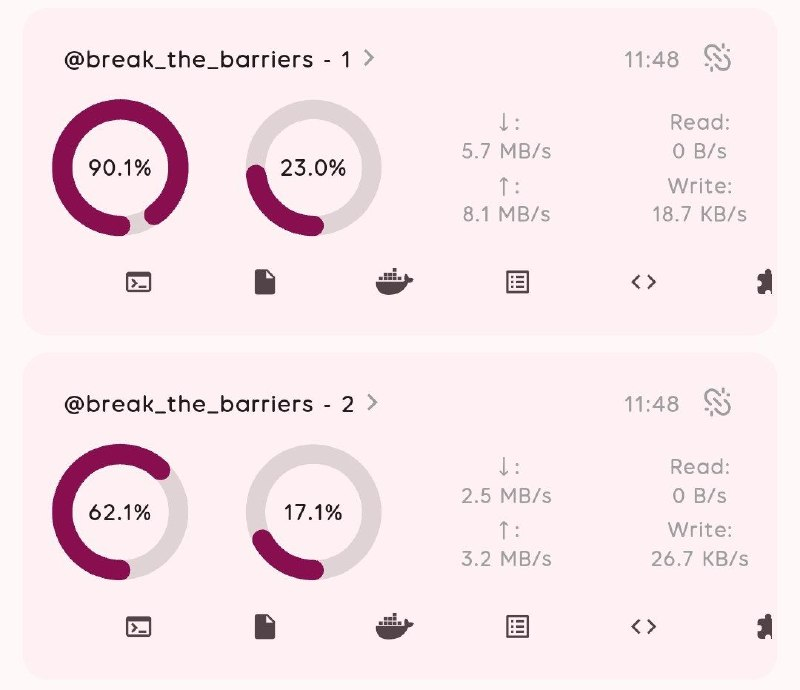

دست از سر سرور یک بردارید. 😂🤦🏻‍♂️

---
📅 بروزرسانی: 1405/02/24 01:27
---

## vpn_xvpn_ch — post 400

امشب ایونت نداریم به دلیل بسته شدن متود تانلینگ
ولی به جاش آفر روی اشتراک ها داریم
اشتراک پایه گیگی 370
اشتراک اقتصادی گیگی 170
خرید ↙️
@vpn_xvpn

## vpn_xvpn_ch — post 399

نت همراه اول به شدت اختلال داره اگر مشکل اتصال دارید از یه نت دیگه استفاده کنید
اختلال از سمت همراه اول هستش و سرور مشکلی نداره

## xsfilterrnet — post 3416

🍷خیلی از دوستان لطف دارن به بنده من کوچیک همتونم واقعا هیچ کاری من برای شما نمیکنم و فقط کمی سعی میکنم دسترسی شما رفقا رو بیشتر کنم خیلی از دوستان لطف دارن و میخوان حمایت و دونیت کنن میخوام بگم من حقیر هیچ درخواست دونیتی از شما ندارم چون فقط دوست دارم کسایی که دونیت شن ارزش حمایت دارن به خاطر همین سعی میکنم کسایی که واقعا زحمت میکشن حداقل واسه دسترسی مردم شبانه روز میکنن حمایت شن
🍷

خوشحال میشم به جای امثال من از بچهای که ۲۴ رایگان زحمت میکشن حمایت کنید
مثل:
https://t.me/Break_The_Barriers

https://t.me/whitedns

👑کوچیک شما امیرپارسا به امید روزی که #اینترنت واسه هممون یه ارزو نباشه و فقط یه حق روزمره ما باشه و بلاخره تو کوچه ما هم عروسی میشه...
😉

@xsfilterrnet 
👑

## saministamm — post 62782

ترکیبی وصل :

socks://Og@proxyanonymous1.pahlavi.dpdns.org:1080#saministamm

## saministamm — post 62781

  

بلاخره رویای املت خوردن تموم شد؛
این شما و این املت قسطی.

## saministamm — post 62780

ترکیبی تست کنید.
socks://telegram-saministamm@185.231.183.229:80#%40%43%6F%6E%66%69%78%69%6F

## saministamm — post 62779

پروکسی بزنید :

tg://proxy?server=157.180.69.178&port=8080&secret=dd104462821249bd7ac519130220c25d09

## saministamm — post 62762

پروکسی متصل :

https://t.me/socks?server=proxyanonymous1.pahlavi.dpdns.org&@DeathBedText&port=1080&user=@DeathBedText&pass=@DeathBedText&user2=Pariya

## saministamm — post 62761

socks://ZXJtaWE6RXJtaWEzNDcyIw@185.231.183.229:80#https://t.me/saministamm

ترکیبی با سایفون وصله ✅

## saministamm — post 62759

Slipnet

slipnet-enc://AWGvTxN1rlLEuNL4dqvAE5wRk0CSxRNYEH0jpeEi+IbK9VqiiO24ChvzzxFWCdqL42ILtxJemQ/G7CaWXcDgIamJ0nV4MwnviJ2GVHgLUDshcEiy0eHROEkHGKI3/JW7qRtQDZyXfIwBAGkk//E4KThRv7yevOeAWLgzyEqHWQaW1FehPBhyeGFd9Xhvs0/H3pJbYPCQwNZSBqhc6hqzjcdict4KgmQNVCkGIrPTea4Sg4Xh3UtH4z0XeCg9jjQlcf4V+lOC8QV5fcJBYOP0b5m/k6R4Jzaban5Zjm0y5jR261pxXVy20MC4QHweykhrKupS1BjAEaKc2CYwt8M/pykaY3NPR4LelwUy5NCUKvqH4Kbgf2K5vKUVw3Ubnk5jVpsrCPyD2qMetFYUgEL2qLAgDxn367XPWUPanXyw89mYs132yms1zPF++xNN3ZrzWGHiTQncRSt/rF/oZpENC3iua073WPx8N1PJoH9hjIQcUM8zdsustzRY4+6YMF8pVsR7Ga+uWH56tWkdBIzUo/Lrvx1PCuw5lQBUTmRr/qCFv0oOTLNjJQ1g27PuxuT9a6laAKRMAEzkgZV6U8lweg+NX9LY1wiSoXEQVAq1u9IgR1H/EXH9U/91oVCcDptqwNxcdkSbmN+sFEKaMx9Z4zOW55M1Auz5s/JVVGqPEFwhWIk2i+p/Kyz3cp4+QNhjyZ7BX02bFWkNtQBNlgVwZaTn1vq0Yrw6mH2SSeCCi3Qz/gs4Rz+qn2Dwqsr/HRP5mcOl0KdfvfdpndqFAJgi/xs=

@saministamm

## saministamm — post 62758

پروکسی متصل :

https://t.me/socks?server=193.151.148.116&port=9090

## Skyportall — post 10641

vless://ec8ed3e2-f2b9-42eb-add4-bc5c88d69caa@cdn.tiopmfikg.ir:8080?path=%2F&security=none&encryption=none&host=cdn.tiopmfikg.ir&type=ws#%40Skyportall

💙V2ray
➕psiphon
📱

⚡️ @Skyportall

## hamedvpns — post 18827

نت‌هایی که فردا براشون کانفیگ ها قابل اتصال خواهند بود :

سامانتل و شاتل و رایتل و اپتل

هستند .

دوستدار شما همون حامد همیشگی ❤️

## hamedvpns — post 18826

فردا آمادگی داشته باشید میریم برای کانفیگ های متصل

🚨فقط از همه خواهش خواهم کرد که داخل روبیکا ارسال نکنند🚨

لایک هم یادتون نره به پست ها بزنید 😎

با تشکر حامد همیشگی شما 🤕

## hamedvpns — post 18825

پسری ک خونشون رو گُسَله کنسله

## hamedvpns — post 18824

پسری ک زلزله نگار نداره کنسله

## hamedvpns — post 18823

من براش موج انفجار بودم

اما اون زلزله دوس داشت

## ConfigWireguard — post 31686

  <a href="https://t.me/ConfigWireguard/31686" target="_blank">📎 Download file</a>

🚀 انتشار اولین نسخه ویندوز WhiteDNS

نسخه WhiteDNS Windows V1.0.1 منتشر شد.

این اولین نسخه رسمی ویندوز WhiteDNS است؛ نسخه‌ای که برای شبکه‌های سخت، محدود و فیلترشده طراحی شده تا اتصال پایدارتر، سبک‌تر و قابل‌اعتمادتر فراهم کند.

در این نسخه تلاش کردیم هسته‌ی ارتباطی WhiteDNS را برای ویندوز آماده کنیم و امکانات اصلی را در اختیار کاربران قرار دهیم:

• انتقال ترافیک از طریق DNS Tunnel با سربار پایین و پایداری بهتر
• پشتیبانی از چند مسیر اتصال از طریق چند Resolver و Tunnel
• تشخیص سلامت Resolverها و غیرفعال‌سازی یا فعال‌سازی خودکار مسیرها
• مدیریت هوشمند MTU برای حفظ پایداری اتصال در شبکه‌های ضعیف
• بهینه‌سازی جریان اتصال برای SOCKS4 و SOCKS5
• سرویس DNS محلی و قابلیت کش DNS سمت کلاینت
• پشتیبانی از روش‌های رمزنگاری مختلف مثل AES، ChaCha20 و XOR
• استفاده از Wintun Adapter برای ساخت اتصال VPN در ویندوز
• مدیریت Route و DNS به‌صورت خودکار
• رابط کاربری دسکتاپ با امکان ساخت پروفایل، ذخیره‌سازی امن، Import/Export، ویرایش ساده و پیشرفته، نمودار زنده، لاگ‌ها و تنظیمات

این نسخه شروع مسیر WhiteDNS روی ویندوز است و مثل همیشه با کمک فیدبک‌های شما بهتر و پایدارتر خواهد شد.

اگر تست کردید، لطفاً نتیجه اتصال، لاگ‌ها و مشکلات احتمالی را با ما به اشتراک بگذارید تا نسخه‌های بعدی دقیق‌تر و قوی‌تر منتشر شوند.

لینک داخلی :
https://uplod.ir/8h2n22ficr8f/WhiteDns-Windows-Setup.exe.htm

Special thanks to Masterdns ❤️ for their amazing work - without them non of this was possible

@WhiteDNS

## Spotify_Porteghali — post 12368

احتمالا اگر که مشکلی پیش نیاد از فرداشب چالش هارو شروع می‌کنیم و هر شبی که چالش گذاشتیم به 3 نفر کانفیگِ یک گیگی میدیم . ببینیم وضعیت چطور پیش میره ، حتما اگر که شرایطش بود به صورتِ متوالی خیلی از شب ها برگذار می‌کنیم ؛ تا ازین طریق کاربرانِ ios هم بتونن شرکت کنند . حتما هر موقعی که برگذار بشه از قبلش اعلام می‌کنیم .

## Spotify_Porteghali — post 12367

پروکسی مخصوص نت ملی 
🛜 مخابرات : https://t.me/socks?server=proxyanonymous1.pahlavi.dpdns.org&port=1080 🆔 @Spotify_Porteghali 🍊 ↰  بزرگترین خانواده اسپاتیفای در کشور  ↱

## Spotify_Porteghali — post 12366

پروکسی مخصوص نت ملی

🛜 مخابرات :

https://t.me/socks?server=proxyanonymous1.pahlavi.dpdns.org&port=1080

🆔 @Spotify_Porteghali 🍊

↰  بزرگترین خانواده اسپاتیفای در کشور  ↱

## Spotify_Porteghali — post 12365

75 روز از قطعیِ اینترنت در ایران می‌گذرد . این در حالیست که هیچ نشانه ای از زمانِ اتصالِ دوباره ی اینترنت هم نیست .

## Spotify_Porteghali — post 12364

  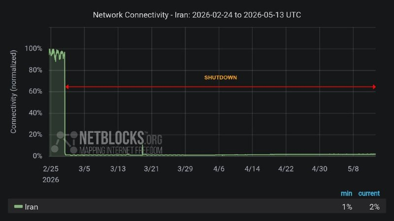

75 روز از قطعیِ اینترنت در ایران می‌گذرد .
این در حالیست که هیچ نشانه ای از زمانِ اتصالِ دوباره ی اینترنت هم نیست .

## King_network7 — post 30749

  <a href="https://t.me/King_network7/30749" target="_blank">📎 Download file</a>

◾️برنامه استفاده شده در آموزش بالا

⬇️ لینک دانلود داخلی
⬇️ لینک گیت هاب

🆔 @King_Network7

## King_network7 — post 30748

🔰 آموزش جستجو و دانلود از یوتیوب / تبدیل لینک خارجی به داخلی بدون VPN

⚡️ امکانات نسخه جدید برنامه:
● جستجو ویدیو و دانلود از یوتیوب بدون VPN
● امکان آپلود در مخزن گیت هاب، ریلیز گیت هاب، گوگل درایو
● دانلودر داخلی، تبدیل چند لینک، ویرایش و مدیریت فایل ها و...

⬇️ لینک دانلود داخلی آموزش

💢 اگه از نسخه قبلی برنامه استفاده کردید اونو حذف کنید، مخازن گیت هاب هم حذف کنید و توکن جدید با دسترسی های توضیح داده شده بسازید

➰➰➰➰➰
#️⃣ #windows #learn
🆔 @King_Network7

## King_network7 — post 30747

## JynMarket — post 2269

ما توی پیام‌رسان های ایرانی هیچ فعالیتی نداریم هرجا دیدید دارن به این اسم فعالیت میکنن ریپورت بدید چنلش رو و لفت بدید ✨

## JynMarket — post 2268

  <a href="https://t.me/JynMarket/2268" target="_blank">📎 Download file</a>

🔗 تک کانفیگ متصل
🔑 Password: @JynMarket

## JynMarket — post 2267

یادش بخیر قدیما ری اکشن میزدید 
🐸

## JynMarket — post 2266

🌟 سرور اسلیپ نت جدید

slipnet-enc://AVdX8x++YtHW1gmYsftc/MwEiWjIKg/nOmt6yLhPdehqLTJ+txo4TEV24NCoVDPgzenYxZ4q/xFtSQHF8jJQjeIBnCLtYgq7eZ1O6YQBFE2Hii6OnAf8uwLjiAY8tBq7dljYLRJknD+rwDjxw75DY5WKnm9y4BZDEg2AWwWPCshRxrctwFXA3YwrmaMXo4SYjRFXq/QVXTdDEAp6BcAThGy0Z8QBiLcvJvfvqhsVsJCB6EJd5i54ctpZQs+5IMQkRLU7vO13c1BFvGKhRrrLrOo3+03Chd519LQAEx3hKYGk0azxosOgqksasvwCd6BhJuAJTviws1whw5cT32olz+hu67BVAX+qT+ntAFhpThu8sZBdVGV4vZyEGTuLMneU4PlbY3z1VYYNeU4KK45QtXcu6zu0dOrcir26ESaXDo/SGniYU1ZHOM4Fx1LVcNc6W6h1ycgPVgJNy3T/XoN888Jq8JaRMpQAcR+mzzDKIfp9GTffwTrbU+VoVrmvYD58K4UCfcRTry7ZmxIHi6QeFCjjzugkvlOwMirjczLd2cZsNlUF1AAE5+NtSKFhAw5B5Wh56UXhhpo2WWga5DRc8gwcFK4R3bezaW4rlk4kApzHtu+kk/j3iDUooLhAIKv+nU2ptiXyEEOykBTwzpcB+nMHx1RswbOTWGbtwQga3Zmm7wS7nlM+9nPKTTag7ijP9v+bIjb1hCkeIZQPhk4lCW56

🔗 اموزش استفاده - دانلود برنامه موردنیاز

## JynMarket — post 2265

🌟 سرور اسلیپ نت جدید

slipnet-enc://AYVud9v67vUsjOeh01MWgkQr2uERtKaaZqxu337osQgKRrCLvp6lzj48tHSfPrWxCzb++T9lB6E6FLDssDjUSgca0wH5dWSsvlU1Cc+pYl7hlL3ba/KsZSfJxAjI3IdsOPukwQOaLKN9Y7sONYjVTP/BU0tNYw31AYMjkfTwPL6xPpVUpctfwVAZCbgd2X4OXCscqYY3MtBjeAJmt5iE3bbDZpLBv8B7n78l7G5yKYXHqi3PS9FJ3Uncd8LYX07qR+05NhWDMuILAnAJPWmR7590KhCHhxOT1y1sBEt7PAGu36Rd3otvbJg6rMjUL92CydO/hkPy+mJn9IAJXZeoEIaLuNr/xx0mHBNRW6qgNDjELXTvORQHkhq2NldxO6puIZ6AYer+nGOMmVFHleiVV+TLUaUaHePscX/2zqrns1B5vTui0djqqjJ2tKS3ujhlW3L/mTE67ADvp03E5yzixac1UsDMRyO69CliGEEDsF/7m0wH0wOhNTmKP5MHj8ZAJ4awZ49SpqcELizKw8EQDSoIQnutzvBOGEIyqzBmmqkhPCLaSk6XxTvh+7XTFwWIg0vRVnIiAUJEjmnYMx026V79owvbez7zgERYelhHV+HBOBpwW+reXE74JjyXrPa9pQObYOSJ4dJ6E03KwWyt6kNNx5Dc0OFMYz9bbueXNqXrGZW0ohXwmY2/PX0DHQ2XOToqr0Mp2CW9vS8wyKjJs4olbYVyaampTypVJ3l8YDeGY731Fu7Td/c3DmeDo7o=

🔗 اموزش استفاده - دانلود برنامه موردنیاز

## JynMarket — post 2264

  <a href="telegram/content/JynMarket_2264_1778709449.webm" target="_blank">🎬 Download video</a>

ری اکشناتون کم شده ها 
🙅‍♂️

## JynMarket — post 2263

🌟 سرور اسلیپ نت جدید

slipnet-enc://AcZ8/wC4z5lFhpj+ypWA8repzwsJCnGwGkwj/g0Ygfe4UhnxXd1MDcRH3rX+GiI2Pck2x0XzKXlrRJfPUXl8au0/wBLy4F5MWhWABFgsmUZcHV63ft/1KFRb69tWHmjPKTuyBsBfGwsT73j/oVvh0UXvpQd2zuQNPdp2wX9DMFFZ/euQjBW452Fv2sL5cN3rQ/hwxX5ZiaqWAb8AKfaHw6wUclW8vlI+e5EmffbOrZuV9geNw1PRi//Ym14WR42TxPRV6X6qzvak5ElCq1b5y4RVBw++K5t39Vivs3S21bEkQedgsoudPCG32VWKP30zYElKQDSdr6iry4fCr7CU8x20JcJwpBFvDaB/M8VRSejaMqYrTlnbDamIDj9ZqRNSsivan69qhB+a4Q1/31RHADIbHONm3PCErMa7gx0Gc865TLKZIkNRM2ew7usPqb9cPHQdVoJkKL2wsoo4zM61cu8JSt7ZP3VaiCs/2hy3G/txpYNAuvqabb978O3WIiS6pZmyWiC0HKZAzovYv07FSYOTrF4pSvwBow6QunMCVvrVZyPC9BUpD5sCyszKwZ7tP2kObsAV7AxsDOWbprjJl71OKIEvy58G3TIxgPRBe0RlkjYGaMNp3QbeNl+7PdFG2sHS1hE2OCFmCR/bQKbJya4duquZ+1TFrDRfPYR79ZYysMyJzhW0Uykc4pp042itlQN1mP2/jwac0HPrPxYaVv6ho9lq9OmZjEkUBiaxy4Y/0hpS5jirXHMXaEEbL3Z/zGgPYkZn2A==

🔗 اموزش استفاده - دانلود برنامه موردنیاز

## JynMarket — post 2260

  <a href="https://t.me/JynMarket/2260" target="_blank">📎 Download file</a>

🔗 تک کانفیگ متصل
🔑 Password: @JynMarket

## JynMarket — post 2258

  

‼️بهترین vpn گیگی 180 هزار تومان
‼️

👀اگر تا اخر شب بات رو با زیر مجموعه معرفی کنید ۱۰ درصد پورسانت هم دریافت میکنید
اگر تا اخر شب تعداد قابل توجهی سرویس فروختیم از فردا با همین قیمت یا کمتر شروع میکنیم
🙂
برای خرید روی دکمه زیر کلیک کنید
❤

## NamazVPN — post 35503

─────────── VLESS ───────────

🔗 vless://71d11816-51b5-4a79-95db-842272f83a70@snapp.ir:8080?encryption=none&security=none&type=ws&headerType=none&path=%2F&host=M2.snllshop.ir#Unknown%20%7C%20%F0%9F%8C%90%20IP%3A%20N%2FA%20%7C%20%E2%8F%B3ping%3A8228.97ms%20%7C%20%F0%9F%93%A2%20%40NamazVPN

📍
⏱️ 8228.97ms

📢 @NamazVPN

## NamazVPN — post 35502

─────────── VLESS ───────────

🔗 vless://3b71be10-6c10-45e9-95e6-e469f7a0ae63@aparatrat1.info:2083?encryption=none&type=tcp#Unknown%20%7C%20%F0%9F%8C%90%20IP%3A%20N%2FA%20%7C%20%E2%8F%B3ping%3A6066.3ms%20%7C%20%F0%9F%93%A2%20%40NamazVPN

📍
⏱️ 6066.3ms

📢 @NamazVPN

## NamazVPN — post 35501

─────────── VLESS ───────────

🔗 vless://3b71be10-6c10-45e9-95e6-e469f7a0ae63@aparatrat1.info:2083?encryption=none&type=tcp#Unknown%20%7C%20%F0%9F%8C%90%20IP%3A%20N%2FA%20%7C%20%E2%8F%B3ping%3A3593.13ms%20%7C%20%F0%9F%93%A2%20%40NamazVPN

📍
⏱️ 3593.13ms

📢 @NamazVPN

## NamazVPN — post 35500

─────────── VLESS ───────────

🔗 vless://b66aac77-8338-471e-a656-86e273c5b012@185.50.38.17:434?type=tcp&security=none&encryption=none#Unknown%20%7C%20%F0%9F%8C%90%20IP%3A%20N%2FA%20%7C%20%E2%8F%B3ping%3A1538.33ms%20%7C%20%F0%9F%93%A2%20%40NamazVPN

📍
⏱️ 1538.33ms

📢 @NamazVPN

## NamazVPN — post 35499

─────────── VLESS ───────────

🔗 vless://176d74cd-f98f-42e2-a8ec-1079fde79ba7@185.50.38.17:434?type=tcp&security=none&encryption=none#%F0%9F%87%A9%F0%9F%87%AAGermany%2C%20Falkenstein%20%7C%20%F0%9F%8C%90%20IP%3A%2091.107.188.149%20%7C%20%E2%8F%B3ping%3A2262.88ms%20%7C%20%F0%9F%93%A2%20%40NamazVPN

📍 🇩🇪 Germany, Falkenstein
⏱️ 2262.88ms

📢 @NamazVPN

## NamazVPN — post 35498

─────────── VLESS ───────────

🔗 vless://34618eca-1f71-4c54-a6dc-edb80a14310c@45.81.16.109:13526?type=tcp&security=none&encryption=none#%F0%9F%87%B1%F0%9F%87%BALuxembourg%20%7C%20%F0%9F%8C%90%20IP%3A%2031.184.246.82%20%7C%20%E2%8F%B3ping%3A1487.54ms%20%7C%20%F0%9F%93%A2%20%40NamazVPN

📍 🇱🇺 Luxembourg
⏱️ 1487.54ms

📢 @NamazVPN

## NamazVPN — post 35497

─────────── VLESS ───────────

🔗 vless://9ca03324-2619-47ed-bed8-72a466a4d382@snapp.ir:8080?path=%2F&security=&encryption=none&host=midas.starferi.ir&type=ws#Unknown%20%7C%20%F0%9F%8C%90%20IP%3A%20N%2FA%20%7C%20%E2%8F%B3ping%3A6971.82ms%20%7C%20%F0%9F%93%A2%20%40NamazVPN

📍
⏱️ 6971.82ms

📢 @NamazVPN

## NamazVPN — post 35496

─────────── VLESS ───────────

🔗 vless://d7bd6165-fd37-4843-ad0a-3a1dbae0e5f0@185.143.233.5:2083?path=%2F&security=tls&encryption=none&insecure=0&host=p1.sesrsa.com&fp=firefox&type=ws&allowInsecure=0&sni=sub.sesrsa.com#%F0%9F%87%B3%F0%9F%87%B1The%20Netherlands%2C%20Amsterdam%20%7C%20%F0%9F%8C%90%20IP%3A%20104.28.219.137%20%7C%20%E2%8F%B3ping%3A8148.51ms%20%7C%20%F0%9F%93%A2%20%40NamazVPN

📍 🇳🇱 The Netherlands, Amsterdam
⏱️ 8148.51ms

📢 @NamazVPN

## NamazVPN — post 35495

─────────── VLESS ───────────

🔗 vless://d7bd6165-fd37-4843-ad0a-3a1dbae0e5f0@185.143.233.5:2083?encryption=none&fp=firefox&host=p1.sesrsa.com&path=%2F&security=tls&sni=sub.sesrsa.com&type=ws#Unknown%20%7C%20%F0%9F%8C%90%20IP%3A%20N%2FA%20%7C%20%E2%8F%B3ping%3A3438.68ms%20%7C%20%F0%9F%93%A2%20%40NamazVPN

📍
⏱️ 3438.68ms

📢 @NamazVPN

## NamazVPN — post 35494

─────────── VLESS ───────────

🔗 vless://62699a63-f16e-4c8c-bb86-40e3031bf7fc@arvancloud.ir:80?encryption=none&host=samrexnet.ir&path=/&security=none&type=ws#Unknown%20%7C%20%F0%9F%8C%90%20IP%3A%20N%2FA%20%7C%20%E2%8F%B3ping%3A927.69ms%20%7C%20%F0%9F%93%A2%20%40NamazVPN

📍
⏱️ 927.69ms

📢 @NamazVPN

## NamazVPN — post 35493

─────────── VLESS ───────────

🔗 vless://75bb0d63-2b70-49d9-8b6a-952add3e21c5@snapp.ir:80?path=/&security=none&encryption=none&host=iranfuture.musicritmic.ir&type=ws#Unknown%20%7C%20%F0%9F%8C%90%20IP%3A%20N%2FA%20%7C%20%E2%8F%B3ping%3A3114.17ms%20%7C%20%F0%9F%93%A2%20%40NamazVPN

📍
⏱️ 3114.17ms

📢 @NamazVPN

## NamazVPN — post 35492

─────────── VLESS ───────────

🔗 vless://91a4b5e5-8000-436c-8c0b-201b1eac9974@185.50.38.194:51853?type=tcp&security=none&encryption=none#Unknown%20%7C%20%F0%9F%8C%90%20IP%3A%20N%2FA%20%7C%20%E2%8F%B3ping%3A2410.14ms%20%7C%20%F0%9F%93%A2%20%40NamazVPN

📍
⏱️ 2410.14ms

📢 @NamazVPN

## NamazVPN — post 35491

─────────── VLESS ───────────

🔗 vless://91a4b5e5-8000-436c-8c0b-201b1eac9974@185.50.38.194:51853?type=tcp&security=none&encryption=none#Unknown%20%7C%20%F0%9F%8C%90%20IP%3A%20N%2FA%20%7C%20%E2%8F%B3ping%3A2410.14ms%20%7C%20%F0%9F%93%A2%20%40NamazVPN

📍
⏱️ 2410.14ms

📢 @NamazVPN

## TirexNet — post 3714

2.188.21.240:53,2.188.21.120:53,2.188.21.130:53,2.188.21.190:53,2.188.21.90:53,2.188.21.200:53,2.189.44.44:53,10.185.68.113:53

## TirexNet — post 3713

89.34.176.54:53,2.188.21.200:53,2.188.21.190:53,10.185.68.114:53
Dns Resolver

## TirexNet — post 3712

ستینگ پیشنهادی (تست شده همراه اول )
Proxy Only
Auto reconnect
Http proxy
Disable quic
Vpn mtu 1280
Worker default
Cipher Auto
Max tunnel 64
Dns fallback

## TirexNet — post 3711

سرور اول ( اسلیپ نت ) 🎃

همه اپراتور ها ( Vaydns+Ssh+Socks )

NULL

سرور دوم ( اسلیپ نت ) 🐍

ترجیحا همراه اول (Vaydns+Ssh )

NULL | CNAME | SRV | CAA | NS | NULL

ترجیحا همراه اول ( Vaydns+Socks )

NULL | NULL

آموزش کامل | تنظیمات جدید | تنظیمات جدید

Channel: T.me/TirexNet

## TirexNet — post 3710

کانفیگ استفاده شده (کانفیگ ۹ tirexnet)

slipnet-enc://ASiJoYsUZrFiFf16FL5pdeu6G4NH1BLQqRvXuiuJusaPl/dg8sXiR11LUNVLiHDhZcKV5pVKstzhJWPc+3MyVYp155Z/NLM3lx+Rv91Vk5SgePQi2GkPm18bXSM4ykN1rPi4V3Ixb4Tf7nLHVvM2ifrJcxi87BXFGwaijEh22+B1YkxgHWqeq75UIU34I1y8HiEEJF4cvCossSHceMF2EBXfOdfH9Ahy7y324zZqvqpf8TXMsPu2AW/vH50JjFnAoeiOKweemVnRlyPtYhv2+eIg2X2qMkWE2iA6sk8Ov1RKEwiE5/8lHLW6Dfg1cg369EAcGoYlWlIFU1EWRRdfHYT/7VTZDqgA5lBcq2uyNjXtqico4jap7RSIUzPDouHMObLowxXnsMcxoBdXCSGv1vidmnHo48mj6M5JCyOy11HSgm7NGyGh7Jz3kdBqzFzi1iPDjmO3ntgbOZXu9Y9rVxcgGloE7I2dJg3LoAOIwXTQf7rCUQyFnUhv18G0y9OslNmJwcShYI/FSOzGrylUxDMdlpCz9r3xV/u49ki/WPdv4aZXvbtA9KxQ/7SbE7I4cBZoEavfJ6/Z+yfk5fBzkixs+Az84ryII0AYUl8V1Vn8DqliL5soE8fLF+bRcXo9g/8FxizVckWQVO7182d9inqfX1H4rqp/AUgzac1Q+UdtSmjPExA97c4DI0dXswrtStWKOZUx6qKwMZDl+ixjYG5Ny1wCRMInLiNGfEHR1SlKvH9g31Zhk2gG5rw+uVUoIIc=

## TirexNet — post 3709

سلام وقت بخیر
تنظیمات برای اینترنت مخابرات:
Proxy-mode ✅
Disable QUIC ✅
MTU :580
Append http proxy to vpn ✅
Cipher : Auto
Compression ✅
Max channels: 10
Prevent Dns fallback ✅

تنظیمات کانفیگ:
Resolver mode: Fast
Spread count: 5
DNS query size: Full Capacity

سرعت بالایی نمیده ولی تلگرامو استیبل تر میاره

## TirexNet — post 3708

سرور اول بعد ۲ روز ۱ ترا سرور دوم بعد ۸ روز ۵ ترا مجموع ۶ ترا مصرف داشتن هر گیگ ۲۰۰ تومن بزاریم میشه ۱ میلیارد و ۲۰۰ میلیون ولی هزینه این سرور ها هرکدوم ۱ میلیون و ۳۵۰ هزار تومن که جفتش میشه ۲۷۰۰ و هرترابایت ترافیک هم ۱۲۵ هزار میخرم و میشه ۷۵۰ تومن و درجمع…

## TirexNet — post 3706

سرور اول بعد ۲ روز ۱ ترا
سرور دوم بعد ۸ روز ۵ ترا
مجموع ۶ ترا مصرف داشتن
هر گیگ ۲۰۰ تومن بزاریم
میشه ۱ میلیارد و ۲۰۰ میلیون
ولی هزینه این سرور ها هرکدوم ۱ میلیون و ۳۵۰ هزار تومن که جفتش میشه ۲۷۰۰ و هرترابایت ترافیک هم ۱۲۵ هزار میخرم و میشه ۷۵۰ تومن و درجمع میشه ۳۴۵۰
یعنی با ۳ میلیون و ۴۵۰ هزار تومن درمجموع ۱ میلیارد و ۲۰۰ میلیون اجازه ندادم مردم پول به کانفیگ بدن!

توصیه من به شما
تا حد امکان پول به ویتوری ندین
مگر درمواقع ضرور

اگه سرور میتونین بخرین و اسکریپت ران کنین روش چه بهتر چارنفرو وصل میکنین با هزینه پایین

و اینم بگم بهتون هرکی خواست براتون اسلیپ نت بفروشه بیشتر از ۳۰۰ نخرین برا یک کاربر
بیشتر از اون ارزش نداره و جیبتون خالی میکنن فقط

## icoandidoupdate — post 2234

💵این BTC میتونه تا قیمت 77K اصلاح بخوره بعدش میره برای تارگت 85K 😍

## asrnovin_ir — post 10327

  <a href="telegram/content/asrnovin_ir_10327_1778709451.webm" target="_blank">🎬 Download video</a>

👀خسارت قطعی اینترنت از تصور هم بیشتر بوده!

"طبق برآورد انجمن بلاکچین، حدود 75 روز اختلال و قطعی اینترنت باعث شده بین ۳۰۰ تا ۷۰۰ هزار میلیارد تومان به اقتصاد دیجیتال ایران خسارت وارد بشه"

بیشترین ضربه هم خورده به:
فریلنسرها،
فروشگاه‌های آنلاین،
استارتاپ‌ها
و کسب‌وکارهای کوچیکی که وابسته به اینترنت بین‌المللی بودن

💡امیدی به اتصال اینترنت بین الملل برای عموم رو دارید ؟!
#اینترنت #اقتصاد_دیجیتال #تکنولوژی

## asrnovin_ir — post 10326

🛍 خرید اشتراک gemini pro تنها با 299 هزار تومان در پریم استور.

اقتصادی ترین گزینه حال حاضر

❔ چرا پریم استور؟
🕖تحویل سریع (بین 1 تا 3 ساعت)
🔒  بدون نیاز به اطلاعات و لاگین حساب شما
ضمانت کامل 30 روز
علاوه بر جمنای، اشتراک سرویس‌های زیر هم برای خرید موجود است:

(Claude • Chatgpt plus, go  • Grok • Perplexity • Cursor • Leonardo • Gemini ultra •.....)

🛒 شروع خرید از طریق ربات :
🤖 @prem_store_bot

🌐 وب سایت | 💡 کانال تلگرام | 💬 ارتباط با پشتیبانی

## sirhishamtradinghub — post 3680

## sirhishamtradinghub — post 3679

  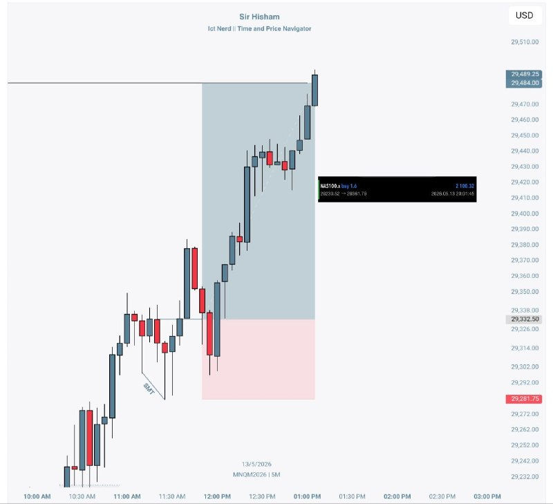

NQ delivered full target.
Time and price are inseparable.

## KalbodTeam — post 2107

خواستم بابت کم شدن فعالیت چنل ازتون عذرخواهی کنم.

توی این مدت، تا جایی که از دستم برمی‌اومد سعی کردم کمک‌حال مردم باشم؛ چه با آموزش‌ها، چه کانفیگ‌ها و چه راهنمایی‌هایی که داخل چنل می‌ذاشتم.

اما مدتیه شرایط زندگی برام سخت‌تر شده. برای اینکه بتونم خرج روزمره و زندگی‌مو دربیارم، رفتم سر کار توی کافه و روزی حدود ۱۲ ساعت اونجام. وقتی برمی‌گردم خونه واقعاً دیگه توان و حوصله‌ای برام نمی‌مونه. از طرفی مریضی، فشارهای زندگی شخصی و مشکلات مختلف هم روی هم تلمبار شده و همین باعث شده از فضای مجازی و چنل فاصله بگیرم.

با این حال، چنل و آدم‌هایی که اینجا هستن برام مهمن. اگر فعالیت کمتر شده، از بی‌اهمیتی یا بی‌خیالی نیست؛ فقط واقعاً این مدت از نظر جسمی و ذهنی تحت فشار هستم.

امیدوارم درک کنید. سعی می‌کنم تو یه موقعیت خوب دوباره آموزش‌ها، کانفیگ‌ها و کمک‌هایی که از دستم برمیاد رو ادامه بدم.

ممنونم از همراهی و صبوری‌تون.

## KalbodTeam — post 2106

درود دوستان

## TheVPNMethod — post 640

آموزش ساده پروژه جدید برای دانلود از تلگرام و یوتیوب و گوگل پلی و...

بیاد بالا ؟!

## TheVPNMethod — post 638

در هیچی معلوم نیست ترین حالت ممکنیم
دیگه از این وضعیت حالم بهم میخوره!

## ggtech93 — post 743

  <a href="https://t.me/ggtech93/743" target="_blank">📎 Download file</a>

📎 Document

## ggtech93 — post 742

  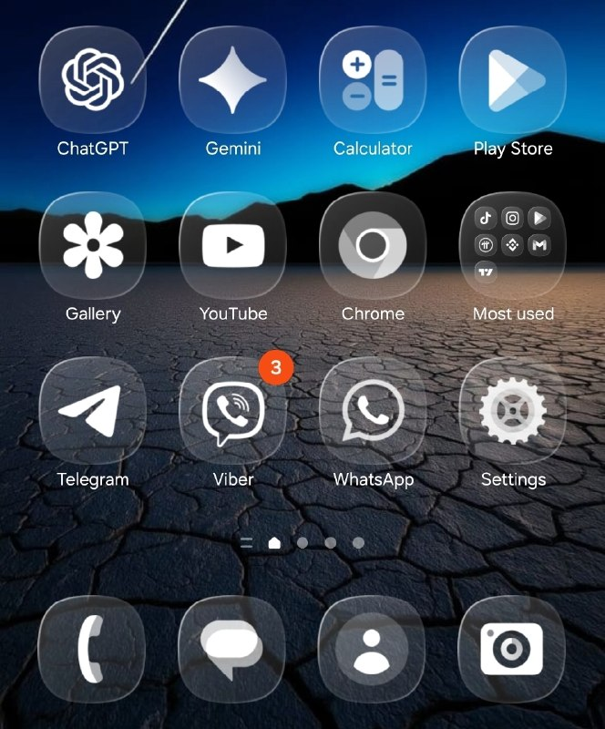

Glassify Glass icon pack ❤️
Over 28,000 icons
Playstore price 3.49$
Get Apk free here ⬇️⬇️⬇️
GGTECH ❤️

## ggtech93 — post 741

What is happening 🤣

## DigiGozar — post 9200

دوستانی که بعضی کانفیگاشون قطع شده حجمشون تموم شده و از رو پنل حذف شده لطفا بخاطر این پیام ندید پشتیبانی🙏🌹

اگه تازه خریداری کردید مشکل داشته پیام بدید حل میکنیم
❤️‍🔥

## DigiGozar — post 9199

خوب خرید بزنید که یه سورپرایز داریم داخل ربات ( مینی اپ اضافه میشه )
ریالی هم موقته پس تا میتونید خرید بزنید.

## DigiGozar — post 9197

  <a href="telegram/content/DigiGozar_9197_1778709453.webm" target="_blank">🎬 Download video</a>

کانفیگ شد ۲۰۰ هزار تومان آقااااااااااا 
👋

## DigiGozar — post 9196

بریم برای گیگی ۲۰۰*

## archivetell — post 4841

  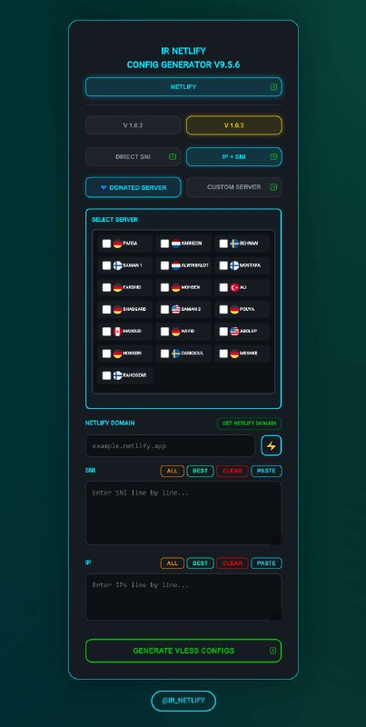

🔆 سایت و برنامه کانفیگ ساز آپدیت شدند

📌 فایل برنامه
📌 لینک سایت

🌐 اضافه شدن سرور های تازه نفس
( اهدایی عزیزان❤️ )

🔺اضافه شدن کانفیگ ساز قدیمی

☕️ اموزش ساخت دامنه نتلیفای

🔵 @IR_NETLIFY

## archivetell — post 4840

🔥 بهترین ابزارهای تحقیق، جستجو و تحلیل اطلاعات با هوش مصنوعی

1) Perplexity – جستجو، تحقیق و تحلیل سریع با منابع معتبر
لینک: https://perplexity.ai
____

2) ChatGPT Search – پاسخ‌های عمیق، تحلیل داده و جستجوی هوشمند
لینک: https://chat.openai.com
____

3) Andi Search – موتور جستجوی مکالمه‌ای با نتایج دقیق و خلاصه‌شده
لینک: https://andisearch.com
____

4) You.com – جستجو، خلاصه‌سازی، تولید محتوا و ابزارهای هوش مصنوعی
لینک: https://you.com
____

5) Scite AI – تحلیل مقالات علمی، ارجاعات و منابع معتبر
لینک: https://scite.ai

@ArchiveTell

## networkti — post 331

📱 آموزش کار با برنامه دفید (Thefeed):
برای دریافت آخرین نسخه و کانفیگ‌ها، به کانال زیر بروید و برنامه را نصب‌ کنید و لینک کانفیگ را کپی کنید:
@thefeedconfig

ورود به برنامه:
۱. برنامه را باز کنید و زبان را انتخاب نمایید.
۲. در قسمت مشخص شده (thefeed://...)، کانفیگ کپی شده را وارد کرده و دکمه «وارد کردن» را بزنید تا ثبت شود.

عملکرد برنامه:
پس از وارد کردن اولین کانفیگ، برنامه ریزالورهای موجود در کانفیگ را بررسی کرده (چند دقیقه طول میکشد) و سپس لیست کانال‌ها را دریافت می‌کند. شما می‌توانید کانال‌ها را باز کرده، پست‌ها را مشاهده و عکس، ویدیو، ویس و فایل‌ها را دانلود کنید.

نکته: لیست کانال‌ها فقط توسط سازنده کانفیگ قابل تغییر است. (جلو تر یک‌روش دیگر برای کانال های دلخواه شما نیز نوشته ام)

افزودن کانفیگ جدید:
در صفحه اصلی با زدن دکمه + می‌توانید کانفیگ جدید وارد کنید یا کانفیگ‌های موجود دیگر را فعال نمایید.

🛠️ بخش ریزالور ها:
در این بخش می‌توانید ریزالورها را مدیریت کنید. دکمه‌ای به نام «بانک ریزالور» وجود دارد که لیست کامل را نمایش می‌دهد. همچنین یک لیست فعال به نام Default وجود دارد که پس از بررسی اولیه، ریزالورهای فعال را در خود نگه می‌دارد. شما می‌توانید برای اینترنت‌های مختلف، لیست‌های فعال متفاوتی داشته باشید. و با زدن دکمه «بررسی مجدد»، می‌توانید از بانک ریزالور فعال برای اینترنت خود را پیدا کرده و به لیست جدید اضافه کنید.

🔍 بخش پیدا کردن ریزالور:
این بخش بسیار مهم است. با استفاده از یک لیست پیش‌فرض ۵۰ هزارتایی، می‌توانید ریزالورهایی که برای اینترنت شما کار می‌کنند را پیدا کنید (زمانی که سرعت برنامه کم شده بود و یا کار‌ نمی‌کرد).
روش کار:
۱. وارد بخش شوید.
۲. دکمه بارگذاری لیست پیش‌فرض را بزنید.
۳. دکمه شروع اسکن را بزنید.
۴. برنامه شروع به پیدا کردن می‌کند. وقتی حدود ۱۰ تا ریزالور پیدا شد، توقف را بزنید و سپس دکمه «افزودن به لیست فعال» را بزنید.
*توجه:* حتماً باید VPN خاموش باشد.

📺 بخش کانال‌های دلخواه (teleMirror):
این بخش کاملاً از قسمت‌های قبلی جداست و مکانیزم متفاوتی دارد. این بخش از طریق سرویس‌های گوگل، پیام و عکس کانال‌های عمومی تلگرام را می‌آورد و نمایش می‌دهد.
*محدودیت‌ها:* این بخش نمی‌تواند ویدیو پخش کند یا فایل دانلود کند (به خاطر محدودیت‌های گوگل). همچنین برخی کانال‌های عمومی اجازه اشتراک‌گذاری در سایت را نمی‌دهند، و پست هایشان در این قسمت نمایش داده نمی‌شود.
نکته مهم: این بخش فقط زمانی کار می‌کند که گوگل در دسترس باشد. اگر گوگل مسدود شود، فقط قسمت اصلی برنامه (معرفی شده در اول پست) کار خواهد کرد. همچنین سرویس‌های گوگل محدودیت تعداد درخواست دارند که ممکن است شما را محدود کنند.

🔔 برای اخبار پروژه حتما کانال اصلی را دنبال کنید:
@networkti

## Break_The_Barriers — post 1554

برای استفاده از کانفیگ‌های رایگان کانال، پست پین شده رو ببینید.

## Break_The_Barriers — post 1552

لازم بود دوباره یادآوری کنم که من «وی‌پی‌ان فروش» نیستم!(البته ایرادی هم در این مورد نمی‌بینم).

این طرح صرفاً برای حمایت از سرپا موندن سرورهای رایگان کانال راه‌اندازی شد.(و البته به درخواست خودتون!)

## Break_The_Barriers — post 1551

✅ سرورهای اختصاصی(با ظرفیت محدود) با متدهای DNS Tunneling راه‌اندازی شدند.

شما سرعت و پایداری خیلی بهتری خواهید داشت و بخشی از هزینه‌ها هم صرف سرورهای پابلیک کانال @break_the_barriers می‌شه، تا کانفیگ‌های رایگان اون‌جا هم حفظ بشه.

در واقع یک‌جورهایی win-win می‌شه:

✅ اتصال بهتر برای شما + کمک به اتصال دیگران

اگر با این ایده موافق هستید، بهم دایرکت بدید و کانفیگ اختصاصی خودتون رو تهیه کنید. 📩

## Break_The_Barriers — post 1550

درود، ارادت.

دوستانی که راه پرداخت تومان نیاز داشتند برای تهیه کانفیگ اختصاصی یا دونیت، می‌تونید با استفاده از @SwapWalletBot به‌صورت تومان، مطمئن و امن، ارز دیجیتال خریداری کنید.

یک ثبت‌نام ساده داره و بعد می‌تونید خرید و انتقال ارز رو خیلی راحت انجام بدید.

## Break_The_Barriers — post 1549

اگر موافق شرایط زیر هستید، لطفاً دایرکت بدید و کانفیگ اختصاصی خودتون رو داشته باشید.

✅ پروتکل‌های VayDNS، DNSTT، Slipstream مناسب کلاینت اندروید SlipNet

✅ گاهی ریزالورهای فعال رو براتون می‌ذارم، اما هم‌چنان نیاز به اسکن خواهید داشت.

✅ سرویس تک کاربره است.

✅ هر نفر یوزرنیم و پسورد اختصاصی خودش رو داره.

✅ ترافیک نامحدوده.

✅ محدودیت زمانی ١ ماه دارید.(زمان پرداخت سرورها یک‌ماهه است.)

💲 هزینه معادل ۴ دلار با ارز دیجیتال، که بخشی این مبلغ می‌ره برای راه‌اندازی سرورهای رایگان.

⚠️ قبل از هرگونه واریز، دایرکت بدید و باهام هماهنگ کنید. ⚠️

t.me/lets_pass_pro?direct

@lets_pass_pro

---
📅 بروزرسانی: 1405/02/23 20:13
---

## saministamm — post 62753

slipnet-enc://AYm8lORWn/jtDii8v4D49li/3zlcvlkc4g3RBA+vUwOizD6B+sJlTRgUC28JDr4OzaE8ZYcmQrs6hW65gRb+fXGegey7a1SCr9vuQFalBkKSwDMFshyLkrsRpvGw4M4IYMHBSCf1T3OQi1o6DWkn0QiRCvXYeLQb/vBoQ5UbzbXFGgl6MejKdIl4GYPeMqO/nukBtL4nU6tFEgufdBZVjz9mJerMmQHqdwWPqqG5S5v09EcAkKxBw7XDwzMR890Tg/QwM58hPaz7ZoseE8fTUniX9ORCcn7YHGXOo1HDBhZQi+e4/nYq3d5QuO7MMcbC8fgbyCvlqq/6FIl/1QYcWdx7z+k4RpimDTuBBOcj2s+DNLXkW7aRxFouq/mYHXRROZ1nT+B6yGn1bAhhfwN+9fv6ABbYxoD5NNK7GPfoD3GguDE88TcrlT+k9JIapJ8Q3dD2vIro8O1KxglADYie7eChbzS8jRzZkAvgAHFtgBB8OJCbXIzYfJbt+76Oe4VFZ67XhLc7Bb+oVtgpeLI02kguNjACnUYI3gqArSei507T5wR7fawqz9GJvXCz7+frsVQf1/Y+Ykeni45pMYbc88Q3qkPfZLWqiGJlRoKMc1eVQ3ujcM6wvjHTzh5Ri97wbJxzE7vnGjgc+wT8XJe0UsbcewqsqUQvEB6SzUemeVOyR4OOoh64rh5Ah/G62oBfNzfMRDAIjmC4ezZHRGASGq2Pk4DULy5jTGN7ShVnukjhXi4XnxkEWIuC0HbudlM8SnUgJCjz6C4y6ibeY/i2b0e35kveLpLJ9fWGCNQFjmYtfRRSIF97yC2fdUkE/2Z1smWQ3HCbeS8TJXtRJMIY9JRerzJhpw06cGXnFgbySmOqlb+ew1RBaWZ2SWzDp54=
Slipnet Service (Vaydns)🔥
Connect with or without proxy:
https://t.me/socks?server=127.0.0.1&port=10880&user=%40XGvpn

بعد از اتصال به یکی از این پروکسیا وصل شید و تو تلگرام چند دقیقه صبر کنید
https://t.me/socks?server=0.0.0.0&port=10880&user=%40saministamm

https://t.me/socks?server=127.0.0.1&port=10880&user=%40saministamm

## saministamm — post 62752

همچنان با ترکیبی هاتون پرقدرت وصلم

## saministamm — post 62751

ترکیبی بزنید وصله :
socks://ZXJtaWE6RXJtaWEzNDcyIw@185.231.183.229:80#%40@saministamm

## saministamm — post 62750

https://t.me/proxy?server=77.42.79.76&port=4455&secret=dd104462821249bd7ac519130220c25d09

پروکسی متصل

## saministamm — post 62749

ترکیبی بزنید :
vless://9365476e-75f4-4dab-93aa-e2b8918a9ba1@Snapp.ir:80?host=down.speedtell.ir&path=%2F&security=none&type=ws#saministamm%F0%9F%93%8A-0M%E2%8F%B3

## saministamm — post 62748

پروکسی
https://t.me/socks?server=188.121.103.101&port=1080

## saministamm — post 62747

V2rayng + Psiphon

socks://Og@62.220.126.92:32302#https://t.me/saministamm

socks://Og@62.220.126.92:30871#https://t.me/saministamm

🦋 Channel : @saministamm

## saministamm — post 62746

ترکیب کنید وصله :

vless://6bbccb5c-97bb-4856-a0a2-032f632bc66e@org17.okala.click:55017?security=reality&encryption=none&pbk=vxdmULi_cO7dha2aQnsjSViARO15hvI9HWyo0pVPlkQ&headerType=none&fp=chrome&type=tcp&sni=www.digikala.com&sid=c385#%40saministamm

## saministamm — post 62732

پروکسی متصل :

https://t.me/proxy?server=77.42.79.76&port=4455&secret=dd104462821249bd7ac519130220c25d09

## saministamm — post 62731

  <a href="https://t.me/saministamm/62731" target="_blank">📎 Download file</a>

پسووردش :
@saministamm
سرور نپسترنت | npv
دانلود نکنید بقیه وصل بمونن.
سرور نپسترنت متصل تست شده✅
channel : @saministamm✉️

## saministamm — post 62730

Tarkibi nis (proxy psiphon)
Host: 37.32.15.207
Port: 8888

Host: 193.151.131.61
Port: 1111

Host: 45.82.136.180
Port: 22888

Host: 87.107.54.147
Port: 8888

## saministamm — post 62728

Slipnet:VayDNS🇩🇪

slipnet-enc://AbPeZ6NgOZzRGr0b1TbTRfq0GigsQPCOB3XJ5xsuJdmy9kPiXCuDEW5u453FfyqTgWxbcrwl3ApCViW5h+RhqCT/aRDeAlJ3/1HkHnO3RhI88UnW/Skg6URVaKhKJQfbMzVmN1+96cPTpvdhbHvJJaROAi5zmgJ9iKqBW5nem5FUuEF2LR4sYawvMhajeJnyWkNk5OONh6Zl3zDPkyOrNSBgrHvHrMOyJ4vdsRdmqhekF2QwZ6RPe/cMA+cjBK9uK9UjDZZpJ1QxQrVw3pM3QmVaxMC5QOwZ5GuttSovIkzcNIqIA/NqouFxggCvLvwT/ToLNAu2qvqC3GuM2TXvgPJzqvMGhmpgNYvaypR+vqZqK5ZSNLSZHfqQbdUv995ERRQlfvwvyAk2nZnfel8DPCmEIj1uaJqU+CdHVrDe6tn9wJ8kAHb9KETPGFZYY0IzMSqjH8pkKXjejjx4ZJ3Jvb+9YkiqjOMAFuZjkUQNi5XlwsOAU6mrecQXIukPJ9yl5aIjrLPOGA9S7hkzJfkeof6F8JZKqVg9VVVEAEkEuuXt8hVCdnj+YofHMH0JTqIs4HmLP3UVWAvzKJUAzrXbkjXpPdJCnakqlY3iuQHytaXdKSeH4jL49u5aFxcro+WPPTH6HVsARX6JKVZWHAfrX2GSCH5uFY9oPqp6WGCI/n8=

## saministamm — post 62727

پروکسی متصل :

https://t.me/proxy?server=q.hq-1337.win&port=443&secret=ee84ea5a1d188a32e3905389660fa0bfab706574726f766963682e7275

## saministamm — post 62726

  <a href="https://t.me/saministamm/62726" target="_blank">📎 Download file</a>

کانفیگ انژکتور ❤️‍🔥.

## saministamm — post 62725

{"remarks":"Telegram : https://t.me/saministamm 🦅","log":{"loglevel":"warning"},"inbounds":[{"tag":"socks","port":10808,"protocol":"socks","settings":{"auth":"noauth","udp":true,"userLevel":8},"sniffing":{"enabled":true,"destOverride":["http","tls"],"routeOnly":false}}],"outbounds":[{"tag":"proxy","protocol":"socks","settings":{"servers":[{"address":"62.220.126.92","ota":false,"port":32302,"level":8}]},"streamSettings":{"network":"tcp"},"mux":{"enabled":false,"concurrency":-1,"xudpConcurrency":8,"xudpProxyUDP443":""}},{"tag":"direct","protocol":"freedom","settings":{"domainStrategy":"UseIP"},"mux":{"enabled":false,"concurrency":8,"xudpConcurrency":8,"xudpProxyUDP443":""}},{"tag":"block","protocol":"blackhole","settings":{"response":{"type":"http"}},"mux":{"enabled":false,"concurrency":8,"xudpConcurrency":8,"xudpProxyUDP443":""}}],"dns":{"servers":["1.1.1.1"],"hosts":{"domain:googleapis.cn":"googleapis.com","dns.alidns.com":["223.5.5.5","223.6.6.6","2400:3200::1","2400:3200:baba::1"],"one.one.one.one":["1.1.1.1","1.0.0.1","2606:4700:4700::1111","2606:4700:4700::1001"],"dot.pub":["1.12.12.12","120.53.53.53"],"dns.google":["8.8.8.8","8.8.4.4","2001:4860:4860::8888","2001:4860:4860::8844"],"dns.quad9.net":["9.9.9.9","149.112.112.112","2620:fe::fe","2620:fe::9"],"common.dot.dns.yandex.net":["77.88.8.8","77.88.8.1","2a02:6b8::feed:0ff","2a02:6b8:0:1::feed:0ff"]}},"routing":{"domainStrategy":"IPIfNonMatch","rules":[{"type":"field","ip":["1.1.1.1"],"outboundTag":"proxy","port":"53"},{"type":"field","ip":["223.5.5.5"],"outboundTag":"direct","port":"53"}]}}

ترکیبی با سایفون وصله.

## saministamm — post 62724

  <a href="https://t.me/saministamm/62724" target="_blank">📎 Download file</a>

پسووردش :
@saministamm
سرور نپسترنت | npv
دانلود نکنید بقیه وصل بمونن.
سرور نپسترنت متصل تست شده
✅
channel : @saministamm
✉️

## saministamm — post 62723

سلام من همش با ترکیبی هاتون وصلم عالیه بیشتر بزارید

## saministamm — post 62722

Psiphon + v2ray ترکیب

vless://94ee6556-b081-4f64-a710-0cd07127fae2@sub.tahashopglry.ir:443?path=%2Fapi456&security=tls&alpn=h2%2Chttp%2F1.1&encryption=none&host=dl.tahashopglry.ir&fp=chrome&type=ws&sni=dl.tahashopglry.ir#saministamm%20555

## saministamm — post 62721

🔴 معاون ارتباطات مخابرات: اینتر‌نت بین‌المللی حتماً برمی‌گرده.

## saministamm — post 62720

ترکیب کنید وصله :

vless://6a2405d9-61e2-4c74-a638-b2e2899e1995@snapp.ir:80?path=%2F&security=none&encryption=none&host=pa1.ghostantaniehh.ir&type=ws#%F0%9F%94%B5%E2%9A%AA%EF%B8%8F%40saministamm%C2%B9%E2%81%B7%C2%B2

## hamedvpns — post 18822

بعد از اسکن بیش از 60,000 آی‌پی، تعداد 435 ریزالور سالم و قابل استفاده پیدا شد.

لیست این ریزالورها حالا از طریق ربات زیر در دسترسه :

@dns_resolvers_bot

برای دریافت لیست، وارد ربات شوید و دستور زیر را ارسال کنید :

/dns_master

بعد از ارسال دستور، می‌تونید لیست ریزالورها رو دریافت کنید یا فایل آماده رو دانلود کنید.

از همه کانال‌ها و دوستانی که این لیست رو بازنشر می‌کنند خواهش می‌کنیم حداقل سهم و همکاری‌شون این باشه که کانال ما رو به عنوان منبع ذکر کنند. این داده‌ها با زمان، هزینه و اسکن گسترده جمع‌آوری شده، نه با جادو و دعای نیمه‌شب.

Source : @WhiteDNS 👈👈 منبع

@WhiteDNS

❤️ اشتراک گذاری یادتون نره 🌈

‌‌@hamedvpns ☑️

لایک   |   Like 👍❤️
اشتراک بزارین   |   Share ⭐️

## hamedvpns — post 18821

  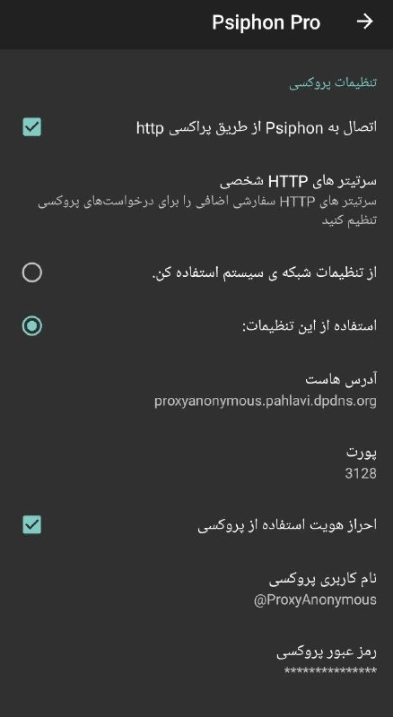

پروکسی اختصاصی برای سایفون ✅

ارسالی کانال انونیموس 😎

آیپی :
proxyanonymous.pahlavi.dpdns.org
پورت :
3128
یوزرنیم :
@ProxyAnonymous
پسورد :
@ProxyAnonymous
..

❤️ اشتراک گذاری یادتون نره 🌈

‌‌@hamedvpns ☑️

لایک   |   Like 👍❤️
اشتراک بزارین   |   Share ⭐️

## hamedvpns — post 18820

  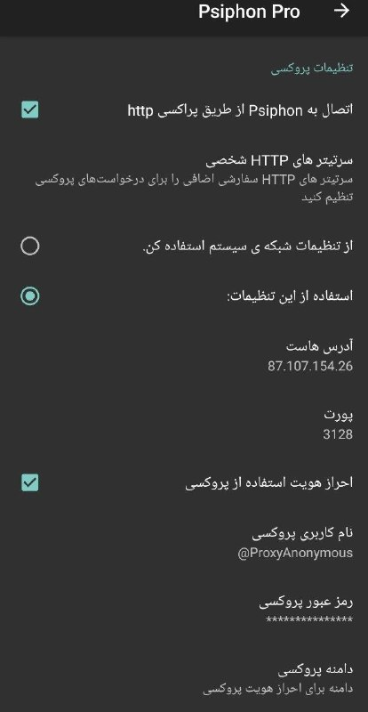

پروکسی اختصاصی برای سایفون ✅

ارسالی کانال انونیموس 😎

آیپی :
87.107.154.26
پورت :
3128
یوزرنیم :
@ProxyAnonymous
پسورد :
@ProxyAnonymous

..
❤️ اشتراک گذاری یادتون نره 🌈

‌‌@hamedvpns ☑️

لایک   |   Like 👍❤️
اشتراک بزارین   |   Share ⭐️

## hamedvpns — post 18819

  <a href="https://t.me/hamedvpns/18819" target="_blank">📎 Download file</a>

🚀 انتشار اولین نسخه ویندوز WhiteDNS

نسخه WhiteDNS Windows V1.0.1 منتشر شد.

این اولین نسخه رسمی ویندوز WhiteDNS است؛ نسخه‌ای که برای شبکه‌های سخت، محدود و فیلترشده طراحی شده تا اتصال پایدارتر، سبک‌تر و قابل‌اعتمادتر فراهم کند.

• انتقال ترافیک از طریق DNS Tunnel با سربار پایین و پایداری بهتر
• پشتیبانی از چند مسیر اتصال از طریق چند Resolver و Tunnel
• تشخیص سلامت Resolverها و غیرفعال‌سازی یا فعال‌سازی خودکار مسیرها
• مدیریت هوشمند MTU برای حفظ پایداری اتصال در شبکه‌های ضعیف
• بهینه‌سازی جریان اتصال برای SOCKS4 و SOCKS5
• سرویس DNS محلی و قابلیت کش DNS سمت کلاینت
• پشتیبانی از روش‌های رمزنگاری مختلف مثل AES، ChaCha20 و XOR
• استفاده از Wintun Adapter برای ساخت اتصال VPN در ویندوز
• مدیریت Route و DNS به‌صورت خودکار
• رابط کاربری دسکتاپ با امکان ساخت پروفایل، ذخیره‌سازی امن، Import/Export، ویرایش ساده و پیشرفته، نمودار زنده، لاگ‌ها و تنظیمات

.
لینک دانلود داخلی :
https://uplod.ir/8h2n22ficr8f/WhiteDns-Windows-Setup.exe.htm

@WhiteDNS

‌‌@hamedvpns ☑️

لایک   |   Like 👍❤️
اشتراک بزارین   |   Share ⭐

## ircfspace — post 2332

  

سخنگوی کمیسیون فرهنگی مجلس: امروز پیامرسان‌های داخلی گوی رقابت را از پیامرسان‌های خارجی گرفتند. 🤡

🔗 ᴡᴇʙꜱɪᴛᴇ • ᴠᴘɴʜᴜʙ • ɢɪᴛʜᴜʙᴍɪʀʀᴏʀ
@ircfspace

## ircfspace — post 2331

  

۷۵ روز از قطع اینترنت گذشت؛ همزمان درآمد یک کانال فروش فیلترشکن از ۱ میلیون دلار گذشت!

© mosi115

🔗 ᴡᴇʙꜱɪᴛᴇ • ᴠᴘɴʜᴜʙ • ɢɪᴛʜᴜʙᴍɪʀʀᴏʀ
@ircfspace

## ircfspace — post 2330

  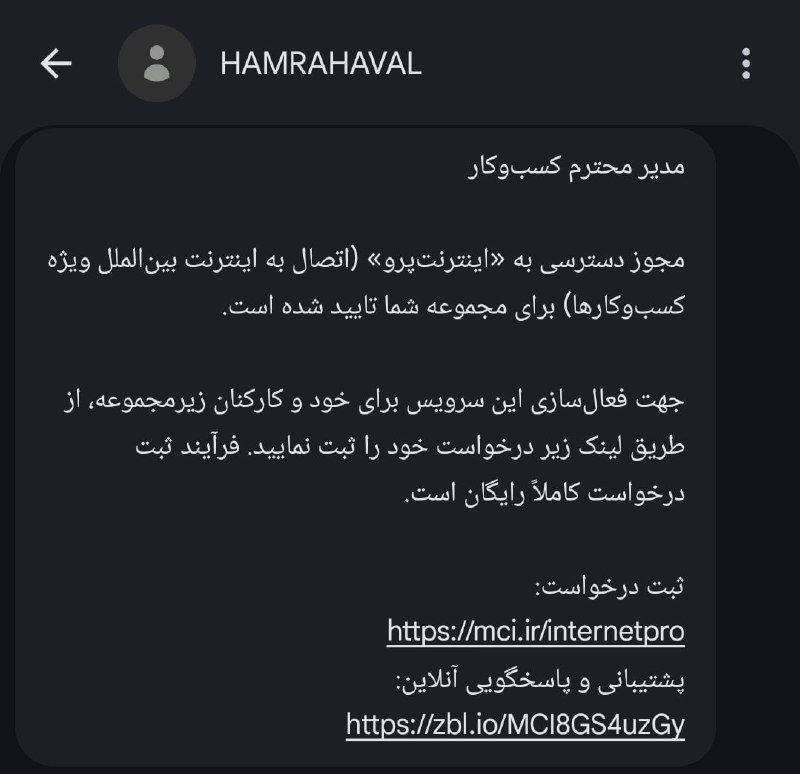

به نظر میاد مرحله‌ی جدیدی از #اینترنت_طبقاتی شروع شده؛ دیگه خجالت هم نمیکشن. قدم به قدم دسترسی برخی افراد و کسب و کارها وصل میشه، تا عموم مردم به عصر بدون اینترنت و بدون هوش مصنوعی برگردن.

© vahidfarid

🔗 ᴡᴇʙꜱɪᴛᴇ • ᴠᴘɴʜᴜʙ • ɢɪᴛʜᴜʙᴍɪʀʀᴏʀ
@ircfspace

## ircfspace — post 2329

سی‌ان‌ان در گزارشی نوشته #اینترنت_طبقاتی در ایران خشم و نارضایتی عمومی رو شعله‌ور کرده و به نمادی از نابرابری ساختاری در جمهوری اسلامی تبدیل شده ...

🔗 ᴡᴇʙꜱɪᴛᴇ • ᴠᴘɴʜᴜʙ • ɢɪᴛʜᴜʙᴍɪʀʀᴏʀ
@ircfspace

## ircfspace — post 2328

قوه قضائیه در یک کشور مردم سالار آنجایی که حقوق مردم با تصمیمات دولت یا نهادهای امنیتی نقض می‌شود واکنش نشان میدهد. در ایران رئیس این قوه نه تنها حق مردم در دسترسی به اینترنت و کسب و کار مردم برایش مهم نبوده، بلکه چندبار شاکی شده چرا اینترنت پرو را سختگیرانه نداده‌اید!

© alirezashirazi

🔗 ᴡᴇʙꜱɪᴛᴇ • ᴠᴘɴʜᴜʙ • ɢɪᴛʜᴜʙᴍɪʀʀᴏʀ
@ircfspace

## ircfspace — post 2327

  <a href="telegram/content/ircfspace_2327_1778690598.mp4" target="_blank">🎬 Download video</a>

اگر هکر بودین و میخواستین بانکهای جمهوری اسلامی رو هک کنین، سرورتون رو کجا میذاشتین؟
علی کیافی‌فر، متخصص امنیت اطلاعات: در جنگ دوازده‌روزه، نوبیتکس، بانک پاسارگاد، بانک سپه و بانک مرکزی از داخل خود ایران هک شدند. مثلاً نوبیتکس توسط یک سرور زامبی واقع در یک مدرسه‌ی علمیه خواهران قم هک شد.

قطع اینترنت امنیت رو کمتر میکنه و نه بیشتر. سیستم‌ها نمی‌تونن آپدیت امنیتی بگیرن، سرتیفیکیت‌ها expire میشن، ابزارهای دفاعی (فایروال، آنتی‌ویروس) از کار می‌افتن و هکرها (داخلی یا خارجی) راحت‌تر کار می‌کنن، چون نظارت و لاگ‌گیری مختل میشه.

© farhad_mottaghi

🔗 ᴡᴇʙꜱɪᴛᴇ • ᴠᴘɴʜᴜʙ • ɢɪᴛʜᴜʙᴍɪʀʀᴏʀ
@ircfspace

## ircfspace — post 2326

  

آگهی یک دفتر پیشخوان دولت برای فروش #اینترنت_پرو

© mamlekate

🔗 ᴡᴇʙꜱɪᴛᴇ • ᴠᴘɴʜᴜʙ • ɢɪᴛʜᴜʙᴍɪʀʀᴏʀ
@ircfspace

## Zel2oVPN — post 2751

StormDNS Server Configs

〰️〰️〰️〰️〰️〰️〰️〰️〰️〰️〰️〰️
🇹🇷 Turkey Server 1
Domain:  v1.abolfazlshahi.cloud
Key: a4c5649c628ac1103ad55c5208e0d74d
〰️〰️〰️〰️〰️〰️〰️〰️〰️〰️〰️〰️
🇹🇷 Turkey Server 2
Domain:  v2.abolfazlshahi.cloud
Key: 965a568dccef58af7afb86e8ee55eea6
〰️〰️〰️〰️〰️〰️〰️〰️〰️〰️〰️〰️

☑➜@Zel2oVPN

## Zel2oVPN — post 2750

پروفایل جدید whiteDnS

stormdns://eyJzY2hlbWEiOiJ3aGl0ZWRucy5wcm9maWxlIiwidmVyc2lvbiI6MSwicHJvZmlsZSI6eyJuYW1lIjoiQE1hc2lyX1NlZmlk8J-ViigxKSIsInNlcnZlciI6eyJkb21haW4iOiJ2MS5tYXNpci1zZWZpZC5zaG9wIiwiZW5jcnlwdGlvbl9rZXkiOiJUZWxlZ3JhbS1DaGFubmVsLS0tPkBNYXNpcl9TZWZpZCIsImVuY3J5cHRpb25fbWV0aG9kIjoxfX19
stormdns://eyJzY2hlbWEiOiJ3aGl0ZWRucy5wcm9maWxlIiwidmVyc2lvbiI6MSwicHJvZmlsZSI6eyJuYW1lIjoiQE1hc2lyX1NlZmlk8J-ViigyKSIsInNlcnZlciI6eyJkb21haW4iOiJ2Mi5tYXNpci1zZWZpZC5zaG9wIiwiZW5jcnlwdGlvbl9rZXkiOiJUZWxlZ3JhbS1DaGFubmVsLS0tPkBNYXNpcl9TZWZpZCIsImVuY3J5cHRpb25fbWV0aG9kIjoxfX19
stormdns://eyJzY2hlbWEiOiJ3aGl0ZWRucy5wcm9maWxlIiwidmVyc2lvbiI6MSwicHJvZmlsZSI6eyJuYW1lIjoiQE1hc2lyX1NlZmlk8J-ViigzKSIsInNlcnZlciI6eyJkb21haW4iOiJ2My5tYXNpci1zZWZpZC5zaG9wIiwiZW5jcnlwdGlvbl9rZXkiOiJUZWxlZ3JhbS1DaGFubmVsLS0tPkBNYXNpcl9TZWZpZCIsImVuY3J5cHRpb25fbWV0aG9kIjoxfX19
stormdns://eyJzY2hlbWEiOiJ3aGl0ZWRucy5wcm9maWxlIiwidmVyc2lvbiI6MSwicHJvZmlsZSI6eyJuYW1lIjoiQE1hc2lyX1NlZmlk8J-Viig0KSIsInNlcnZlciI6eyJkb21haW4iOiJ2NC5tYXNpci1zZWZpZC5zaG9wIiwiZW5jcnlwdGlvbl9rZXkiOiJUZWxlZ3JhbS1DaGFubmVsLS0tPkBNYXNpcl9TZWZpZCIsImVuY3J5cHRpb25fbWV0aG9kIjoxfX19
stormdns://eyJzY2hlbWEiOiJ3aGl0ZWRucy5wcm9maWxlIiwidmVyc2lvbiI6MSwicHJvZmlsZSI6eyJuYW1lIjoiQE1hc2lyX1NlZmlk8J-Viig1KSIsInNlcnZlciI6eyJkb21haW4iOiJ2NS5tYXNpci1zZWZpZC5zaG9wIiwiZW5jcnlwdGlvbl9rZXkiOiJUZWxlZ3JhbS1DaGFubmVsLS0tPkBNYXNpcl9TZWZpZCIsImVuY3J5cHRpb25fbWV0aG9kIjoxfX19

لینک دانلود white DNS

☑➜@Zel2oVPN

## Zel2oVPN — post 2749

✅VayDNS [S117]

slipnet-enc://AXU+h6QfN8qWZDNdCXSFwXZj98+0sJFhBsmwo/KRs8nNiAaFn7EA0kEgLeMviTGhc9LVKCu85H4VnsJxSLfCoNwaenQ1bPFKk80UOPdZ/x/+P8U2DwUIbqA0CpWK7/3GROg6AroYFMTZRn1+23z4/knLirbFeyND4w5KzjcfFDDL0uUPRH3EPjOrVSJGD6bTG3PmfOS6NOtHkvUG4EUtu6yuIsqIiJyaQFVwxfAzGUp/aVgW/ZJZT4bffSCryZGcoQSD6UZndg3ez8nB1MXjPnIX0pKcDc707mzDLg1349oz3k7XJdm/eN4VtfvSt9mfYYoSk8KP5rplfbrHftedKQwPCaWwvN4nod17dvSOHqnUhzfd9wUPPImuR5/S7wLT/wXJmFrd5/tzOPSOAoQsCun13SatAujX/VVMNahsdKrmGaeDwSCla1gGHJFiJlhRo2Y9j4aXOyA007nilcAp04HBmxjG72s3XBvBzAyChr5mrDH/8IgI1djBGGM10vKBZBjIGCbYNwMhGkkSLPm75slDMGC9Lb3n0jwxCY6v3t6GbnSYQsuB49y+3vfqo3eK3j2wKVk8XVbgOCmuesLRcrVnnSHR9l4POxFLoKuDXZyOFJnxuL1kVhZLSdK9jTL/+51RqymB0iQumVZqmpEAFJIr/tHNjy7jrGCqlg3FjxYau3zSZbuD2w3iho3OxV0aazZ7OoP//mCIy9YyWpTRD+ddIn5vHj5PtNmdaH+Y8Fmb9nvqBhoZLwfyYHTEl3mNaw/5rlTbl5unOh/P0CYYOse/QJ6pvt1s5HplMg==

📱کانفیگ اسلیپ

📱مخصوص نسخه جدید  2.5.3

📱دانلود نسخه جدید

📱تنظیمات پیشنهادی

https://t.me/socks?server=127.0.0.1&port=10880&user=%40Zel2oVPN

☑➜@Zel2oVPN

## whitedns — post 589

#موقت

دوستان عزیز که با اپ میتونن وصل بشن اما چیزی براشون لود نمیشه.

تنظیمات زیر رو در بخش Advance Settings تغییر بدید و لطفا نتیجه رو اعلام کنید.

لفا دقت کنید، ریزالور سالم و کانفیگ مناسب داشته باشید.

مود پراکسی یا فول وی پی ان بذاری و فقط تلگرام رو انتخاب کنید.

Min Upload: 72
Max Upload: 700

Min Download: 250
Max Download: 1100

Resolver Timeout: 6.0
Resolver Retries: 6
Resolver Parallel: 150

Logs Timeout: 3.0
Logs Retries: 4
Logs Parallel: 64

RX/TX Workers: 4
Process Workers: 16
Packet Timeout: 5
Idle Poll: 0.015

TX Channel: 2048
RX Channel: 2048
UDP Pool: 128
Stream Queue: 256
Orphan Queue: 64
DNS Fragments: 256

SOCKS UDP Timeout: 30.0
Terminal Retain: 45.0
Cancelled Retain: 120.0

Retry Base: 1.2
Retry Step: 15
Retry Linear: 5
Retry Max: 90
Busy Retry: 90

Listen IP: 127.0.0.1
Listen Port: 10886

HTTP Proxy: On
HTTP Port: 10887

SOCKS5 Auth: Off

Balancing Strategy: Least Loss

Upload Dup: 1
Download Dup: 2

Upload Compress: LZ4
Download Compress: LZ4

Base Encode Data: Off

Ping Watchdog: 60

Traffic Warming: On
Warmup Probes: 4
Keepalive: 5

Log Level: WARN

در ورژن بعدی اپ، ایمپورت تنظیمات اضافه خواهد شد

@WhiteDNS

## whitedns — post 588

بعد از اسکن بیش از 60,000 آی‌پی، تعداد 435 ریزالور سالم و قابل استفاده پیدا شد.

لیست این ریزالورها حالا از طریق ربات زیر در دسترسه:

@dns_resolvers_bot

برای دریافت لیست، وارد ربات شوید و دستور زیر را ارسال کنید:

/dns_master

بعد از ارسال دستور، می‌تونید لیست ریزالورها رو دریافت کنید یا فایل آماده رو دانلود کنید.

از همه کانال‌ها و دوستانی که این لیست رو بازنشر می‌کنند خواهش می‌کنیم حداقل سهم و همکاری‌شون این باشه که کانال ما رو به عنوان منبع ذکر کنند. این داده‌ها با زمان، هزینه و اسکن گسترده جمع‌آوری شده، نه با جادو و دعای نیمه‌شب.

Source: @WhiteDNS

@WhiteDNS

## whitedns — post 587

سرور اهدایی از چنل @pythash

از چنل اهدا کننده سرور حمایت کنید.

〰️〰️〰️〰️〰️〰️〰️〰️〰️〰️〰️〰️
🇹🇷 Turkey Server 1
Domain:
v1.abolfazlshahi.cloud
Key:
a4c5649c628ac1103ad55c5208e0d74d
〰️〰️〰️〰️〰️〰️〰️〰️〰️〰️〰️〰️
🇹🇷 Turkey Server 2
Domain:
v2.abolfazlshahi.cloud
Key:
965a568dccef58af7afb86e8ee55eea6
〰️〰️〰️〰️〰️〰️〰️〰️〰️〰️〰️〰️

@WhiteDNS

## whitedns — post 586

✔️پروفایل های مخصوص وایت دی ان اس ورژن رسمی (WhiteDNS)

❤️تاریخ بروزرسانی : ۲۳ اردیبهشت

👾لینک دانلود کلاینت :

1️⃣ WhiteDNS 1.2.0

⬅️نحوه ی اضافه کردن پروفایل ها

⬅️فیلم اموزش وایت دی ان اس

👍تنظیمات مخصوص وایت دی ان اس

👌آموزش ترکیب با برنامه ی نکوباکس

👍آموزش ترکیب با برنامه npv (پیشنهادی)

stormdns://eyJzY2hlbWEiOiJ3aGl0ZWRucy5wcm9maWxlIiwidmVyc2lvbiI6MSwicHJvZmlsZSI6eyJuYW1lIjoiQE1hc2lyX1NlZmlk8J-ViigxKSIsInNlcnZlciI6eyJkb21haW4iOiJ2MS5tYXNpci1zZWZpZC5zaG9wIiwiZW5jcnlwdGlvbl9rZXkiOiJUZWxlZ3JhbS1DaGFubmVsLS0tPkBNYXNpcl9TZWZpZCIsImVuY3J5cHRpb25fbWV0aG9kIjoxfX19
stormdns://eyJzY2hlbWEiOiJ3aGl0ZWRucy5wcm9maWxlIiwidmVyc2lvbiI6MSwicHJvZmlsZSI6eyJuYW1lIjoiQE1hc2lyX1NlZmlk8J-ViigyKSIsInNlcnZlciI6eyJkb21haW4iOiJ2Mi5tYXNpci1zZWZpZC5zaG9wIiwiZW5jcnlwdGlvbl9rZXkiOiJUZWxlZ3JhbS1DaGFubmVsLS0tPkBNYXNpcl9TZWZpZCIsImVuY3J5cHRpb25fbWV0aG9kIjoxfX19
stormdns://eyJzY2hlbWEiOiJ3aGl0ZWRucy5wcm9maWxlIiwidmVyc2lvbiI6MSwicHJvZmlsZSI6eyJuYW1lIjoiQE1hc2lyX1NlZmlk8J-ViigzKSIsInNlcnZlciI6eyJkb21haW4iOiJ2My5tYXNpci1zZWZpZC5zaG9wIiwiZW5jcnlwdGlvbl9rZXkiOiJUZWxlZ3JhbS1DaGFubmVsLS0tPkBNYXNpcl9TZWZpZCIsImVuY3J5cHRpb25fbWV0aG9kIjoxfX19
stormdns://eyJzY2hlbWEiOiJ3aGl0ZWRucy5wcm9maWxlIiwidmVyc2lvbiI6MSwicHJvZmlsZSI6eyJuYW1lIjoiQE1hc2lyX1NlZmlk8J-Viig0KSIsInNlcnZlciI6eyJkb21haW4iOiJ2NC5tYXNpci1zZWZpZC5zaG9wIiwiZW5jcnlwdGlvbl9rZXkiOiJUZWxlZ3JhbS1DaGFubmVsLS0tPkBNYXNpcl9TZWZpZCIsImVuY3J5cHRpb25fbWV0aG9kIjoxfX19
stormdns://eyJzY2hlbWEiOiJ3aGl0ZWRucy5wcm9maWxlIiwidmVyc2lvbiI6MSwicHJvZmlsZSI6eyJuYW1lIjoiQE1hc2lyX1NlZmlk8J-Viig1KSIsInNlcnZlciI6eyJkb21haW4iOiJ2NS5tYXNpci1zZWZpZC5zaG9wIiwiZW5jcnlwdGlvbl9rZXkiOiJUZWxlZ3JhbS1DaGFubmVsLS0tPkBNYXNpcl9TZWZpZCIsImVuY3J5cHRpb25fbWV0aG9kIjoxfX19

✉️Channel | @Masir_Sefid | کانال
✉️

## whitedns — post 585

  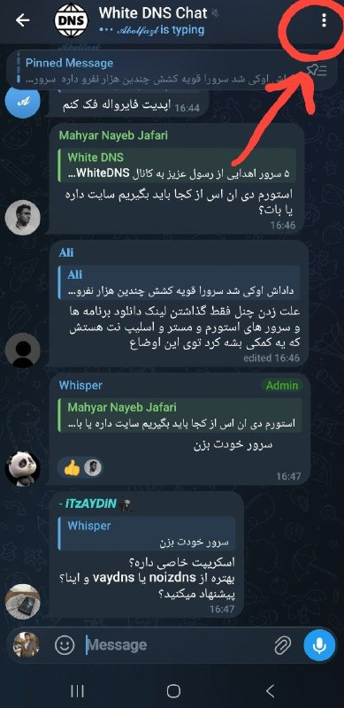

دوستان سلام

تلگرام قابلیتی به نام Search دارد. لطفاً قبل از پرسیدن هر سؤال، چند لحظه وقت بگذارید و ابتدا در کانال و سپس در گروه جستجو کنید.

تعداد سؤال‌های تکراری به‌قدری زیاد شده که دیگر قابل مدیریت نیست و واقعاً آزاردهنده شده است. این روند فقط زمان و انرژی را هدر می‌دهد.

زمانی که باید برای کارهای مهم‌تری مثل توسعهٔ اپلیکیشن‌ها و بررسی موارد جدید صرف کنیم، متأسفانه مجبوریم آن را برای پاسخ دادن به سؤال‌های تکراری و غیرضروری اختصاص دهیم.

اکیدا از پرسیدن سوالات تکراری خودداری کنید

@whitedns

## whitedns — post 584

  <a href="https://t.me/whitedns/584" target="_blank">📎 Download file</a>

🚀 انتشار اولین نسخه ویندوز WhiteDNS

نسخه WhiteDNS Windows V1.0.1 منتشر شد.

این اولین نسخه رسمی ویندوز WhiteDNS است؛ نسخه‌ای که برای شبکه‌های سخت، محدود و فیلترشده طراحی شده تا اتصال پایدارتر، سبک‌تر و قابل‌اعتمادتر فراهم کند.

در این نسخه تلاش کردیم هسته‌ی ارتباطی WhiteDNS را برای ویندوز آماده کنیم و امکانات اصلی را در اختیار کاربران قرار دهیم:

• انتقال ترافیک از طریق DNS Tunnel با سربار پایین و پایداری بهتر
• پشتیبانی از چند مسیر اتصال از طریق چند Resolver و Tunnel
• تشخیص سلامت Resolverها و غیرفعال‌سازی یا فعال‌سازی خودکار مسیرها
• مدیریت هوشمند MTU برای حفظ پایداری اتصال در شبکه‌های ضعیف
• بهینه‌سازی جریان اتصال برای SOCKS4 و SOCKS5
• سرویس DNS محلی و قابلیت کش DNS سمت کلاینت
• پشتیبانی از روش‌های رمزنگاری مختلف مثل AES، ChaCha20 و XOR
• استفاده از Wintun Adapter برای ساخت اتصال VPN در ویندوز
• مدیریت Route و DNS به‌صورت خودکار
• رابط کاربری دسکتاپ با امکان ساخت پروفایل، ذخیره‌سازی امن، Import/Export، ویرایش ساده و پیشرفته، نمودار زنده، لاگ‌ها و تنظیمات

این نسخه شروع مسیر WhiteDNS روی ویندوز است و مثل همیشه با کمک فیدبک‌های شما بهتر و پایدارتر خواهد شد.

اگر تست کردید، لطفاً نتیجه اتصال، لاگ‌ها و مشکلات احتمالی را با ما به اشتراک بگذارید تا نسخه‌های بعدی دقیق‌تر و قوی‌تر منتشر شوند.

لینک داخلی :
https://uplod.ir/8h2n22ficr8f/WhiteDns-Windows-Setup.exe.htm

Special thanks to Masterdns ❤️ for their amazing work - without them non of this was possible

@WhiteDNS

## whitedns — post 583

  

📷 Photo

## mirzapanel — post 1314

  <a href="telegram/content/mirzapanel_1314_1778690603.webm" target="_blank">🎬 Download video</a>

🚨
🚨
🚨
🚨
🚨
🚨

خوب باگ بعدی هم در اومد whmcs سیستم مدیریت و اتوماسیون هاستینگ ها یه باگ امنیتی در اومده هر چه سریع تر اگر از whmcs استفاده میکنید whmcs خود را آپدیت کنید

منبع

## mirzapanel — post 1313

اپل تو افعانستان نمایندگی افتتاح کرده راسته ؟
😐

## mirzapanel — post 1312

کیفیت سرور ایران ؟

سرور (آروان) گرفتم برای یه کار شخصی غیر vpn یه ذره فشار میاد روی سرور کلا سرور خاموش میشه
🤣

## erfanandroid — post 88594

سرور اسلیپ نت تست شده رو ایرانسل

slipnet-enc://AZEaFL4T6EUzwViRnN+14v3+MOxtm43FWeeb/hTIVjLzruSIwHDwf29JeQnDU1ZfKqE6BJUkMAV9obqhsJmLH81GhPln+o8gMYaH9rik1Lxq47IyQ/7hN3x+Q3mMp5aYbrNO1T46PaUuQdakOVC3iAviGA7QcZvrWQXgU/cncOiUwAou98HZmf1baHt7zZA31elORdr5GUUIixrGulFiIKgf8AxVbTeb+aosRfZjxkOx8oRnIUgTXrZtbd718jDF4kW4XnfNGrJpTffIMXv+JHXaUhQ8r4dM6NofjjNLha7GuMsW588sIIYK5sWxPbzr1Qx48d3C+Qy/7qDCaBIZjOVjim/rujFeYW0RRhnypOYFeF8+j3Go1pAg0c9v1TixAjslsW6ek61m9tZG7rvDnMpxQaIvQ7qM042CHcYKfAfpBjq7SkH0wzwHnvcvM3HO3Lb73pFqBRsJUMrstSOlt7vfGr1Kc8zud4pOu8r1LedmzNnlVH37lqHV/s25EqaRT3sKDNuXLlylnK0OxWCtIOZPXHu0IbhWiHe2suuB9WDiK9d0FLQKuMdsc5q8bfnGyuIA6ZWqrPaaZ+LkyFE/DNacQnXl8OTNdesLFtFAa3wzfryRijgbCGQCrevMgSFNZ+lsJTT0Huss8V/zaqhfoKVbybajWjzoHbJexmQAxPhUqZpJHNggcndmBrg3nmiD5jV8L6ZGln62eLH99pel8+U568mofFHvYMfagdEQt9j0y+cVBceH82VCrbRjKLfYlA==

@erfanandroid

## Spotify_Porteghali — post 12363

🚀 اتصال پایدار، سریع و بدون دردسر 🚀 ✅ بدون قطعی ✅ بدون افت سرعت حتی در ساعات شلوغ ✅ ضمانت بازگشت وجه در صورت قطعی 💎 کانفیگ مخصوص نت ملی 🔹 از گیگی ۲۵۰ هزار تومان 🔸 برای مشاهده اطلاعات بیشتر ایدی کانال: @Vpn_Rush 📩 جهت خرید و ثبت سفارش آیدی پشتیبانی : …

## Spotify_Porteghali — post 12362

  

🚀 اتصال پایدار، سریع و بدون دردسر 🚀

✅ بدون قطعی
✅ بدون افت سرعت حتی در ساعات شلوغ
✅ ضمانت بازگشت وجه در صورت قطعی

💎 کانفیگ مخصوص نت ملی
🔹 از گیگی ۲۵۰ هزار تومان

🔸 برای مشاهده اطلاعات بیشتر ایدی کانال:
@Vpn_Rush

📩 جهت خرید و ثبت سفارش آیدی پشتیبانی :
@RushVpn_Support

## Spotify_Porteghali — post 12361

  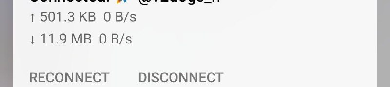

- کانفیگِ جدید برایِ SlipNet - تست شده با 
🛜 همراه اول ( حتما با بقیه ی اینترنت ها چک کنید ) slipnet-enc://ARN8dcFLs6pMT3aRYo3u7hhh2h9J6UOKBiVw8A5C7Nff/Sw0Ky0WEI7A6C38IqlWJ2aT+vO49vchbulF9LnWmdPPExAkPUJhYBvmDAZi3Bshg+k9NYhZ4138FmC5d2sVJVGVAKAseuupyBc7zeD0…

## Spotify_Porteghali — post 12360

- کانفیگِ جدید برایِ SlipNet -
تست شده با 
🛜 همراه اول ( حتما با بقیه ی اینترنت ها چک کنید )

slipnet-enc://ARN8dcFLs6pMT3aRYo3u7hhh2h9J6UOKBiVw8A5C7Nff/Sw0Ky0WEI7A6C38IqlWJ2aT+vO49vchbulF9LnWmdPPExAkPUJhYBvmDAZi3Bshg+k9NYhZ4138FmC5d2sVJVGVAKAseuupyBc7zeD0D+yVLmP9ojKu59CQ9RkJCFJcNSuoGmUVwo0nVbCDMJP5fjmJSfNL2KVPNupcs5toKLaeg94QsYh1Ie3TsQwV5u7/ROzwtV1cPW5l70+46+A1pQwtv7LwBX3KYX6aKl6q3p5KvkG7X+iyJEw+gYN03uqT88s/0je+v1Raigd+swv4ICVUmqSPFWeHBGIXmZbie76QEY61Ro4msFSCZn87YEes8PWUYEIYTa9cW2sC+5i8RE10pZP9WEH2TkwRhRlNQmz44821EN22NSpGpPOjXG1i6Gssqkubi+aolt3cWVr6YET4GqeacpfvByL/H6uKB6uY+nMJu/vJnr9JxRjmSmz5bLKZW/du7teRsdiV+gJqiQyLFBwK0jhnRTKO2maLWTjctqGEqZr8In+3rSEVMYSXFEd88rVfSNMBLplTuP15a7x00CWU5tQ4nxDI3PerBzAO1H3imySgHTX6efrObcXfgnR+6kwMsJLs1w5KDWxGSiQL/4SgkVeK1tzv04CNkREmo93NJyPQF5n6z9cuCDEfMlHwdDuQzfkyoqHbsepn+kDPDJkAxcSu9PjPiFa+ZHRXd/jSPU+UqPZMXpVArxt8RYbdH05BhaIP12mIltGPM5S0mCtsD/UGx/w+sQujYg==

💬 لینکِ دانلودِ مستقیمِ بدونِ فیلترِ اپلیکیشنِ SlipNet 
💬

💬 تنظیماتِ پیشنهادی برایِ SlipNet 
💬

⚪️حتما از تنظیمات VPN MTU رو رویِ 512 بگذارید و تنظیمات رو ذخیره کنید .

⚪️زمانی که کانفیگ رو ادد کردید قبل از اتصال رویِ علامتِ مداد کنارِ کانفیگ بزنید و DNS Query Size رو هم یکبار رویِ 50 بزارید و تست کنید و هم یکبار 60 بزارید و متصل بشید .

⚪️حتما از تنظیمات گزینه‌ ی Proxy-only Mode رو‌ فعال کنید . بعد از اینکه کانفیگ متصل شد ، به یکی از پروکسی هایِ زیر در تلگرام متصل شَوید .

🔗 : https://t.me/socks?server=127.0.0.1&port=10880

🔗 : https://t.me/socks?server=0.0.0.0&port=10880

🆔 @Spotify_Porteghali 🍊

↰  بزرگترین خانواده اسپاتیفای در کشور  ↱

## Spotify_Porteghali — post 12359

- کانفیگِ جدید برایِ SlipNet -
تست شده با 
🛜 همراه اول ( حتما با بقیه ی اینترنت ها چک کنید )

slipnet-enc://AXeLjmVF650Gicycs3TNXANCaGiArkU3l3Cd8vRiWF45oOlXR+9RNcoSRZ/7b/y2MluNJ9fSuCjucC4KWd0pQ18KHGya3CeQ4isesRoyZevb3TUDx3S/ALoQ9FDEBIlzyWE6rvlh4vB703gjjIIxgaWxWJtbeYuL8yf4NuamKQOah2x52KpUoxumc8opPFyl0dU6fCozO4Kh5UQs4EOdBG4MdRp80Ka2T0W2Tb7Q1OuhkhSSYoonvdWJS8zjeuy8QD/U7VQfykxmAEGmoUC3DaeDAqCgsrSQEUB9Tj3mIFSGhVQmWMDjuh3/vGm6jgt7Bqmf9Cp0DB81N6YxMgVD6BHfsghuHar3iUwKn/S9Xsg3JXb+2r1tUZr/xY+ziuenuYl60bYoT6TrN0n+XYJ3WbYLBvIFW+MS/ke1RqN4Jh+1z/9ZDXPpNH0L0Rlneez79L2THAHFkdWP4E4A1VZHc8VmliHJgDMIfk3vM2Sm4VTqVDo3/eDyo2BWSH0xLGlgSL4HS2LX9aT8MUVkTuRUajgWXexXDKzpwoZ1KiQ8W5RJBPO3hEMOilLj0SICtBq63yIp8orB3UH/YmF7mXrRztEgWvIRgAMDEHYi1UJkyHAHP2rSjXNqVcIXL+7hxPo7I5u21SOHS498ZrbYiS9PZu/Zaay170F+dNQF3w2aKBHgv0mw

💬 لینکِ دانلودِ مستقیمِ بدونِ فیلترِ اپلیکیشنِ SlipNet 
💬

💬 تنظیماتِ پیشنهادی برایِ SlipNet 
💬

⚪️حتما از تنظیمات VPN MTU رو رویِ 512 بگذارید و تنظیمات رو ذخیره کنید .

⚪️زمانی که کانفیگ رو ادد کردید قبل از اتصال رویِ علامتِ مداد کنارِ کانفیگ بزنید و DNS Query Size رو هم یکبار رویِ 50 بزارید و تست کنید و هم یکبار 60 بزارید و متصل بشید .

⚪️حتما از تنظیمات گزینه‌ ی Proxy-only Mode رو‌ فعال کنید . بعد از اینکه کانفیگ متصل شد ، به یکی از پروکسی هایِ زیر در تلگرام متصل شَوید .

🔗 : https://t.me/socks?server=127.0.0.1&port=10880

🔗 : https://t.me/socks?server=0.0.0.0&port=10880

🆔 @Spotify_Porteghali 🍊

↰  بزرگترین خانواده اسپاتیفای در کشور  ↱

## JynMarket — post 2252

ترکیبی سایفون

vless://94ee6556-b081-4f64-a710-0cd07127fae2@sub.tahashopglry.ir:443?path=%2Fapi456&security=tls&alpn=h2%2Chttp%2F1.1&encryption=none&insecure=0&host=dl.tahashopglry.ir&fp=chrome&type=ws&allowInsecure=0&sni=dl.tahashopglry.ir#%40JynMarket

@JynMarket

## JynMarket — post 2251

  <a href="telegram/content/JynMarket_2251_1778690605.webm" target="_blank">🎬 Download video</a>

@JynMarket.npvt

## JynMarket — post 2250

  <a href="https://t.me/JynMarket/2250" target="_blank">📎 Download file</a>

🔗 تک کانفیگ متصل
🔑 Password: @JynMarket

## JynMarket — post 2249

‏شما زمانی که بتونین از ترس تنهایی عبور کنین اون موقع متوجه میشین که ۹۰ درصد از آدمای اطرافتون بود و نبودشون تفاوت چندانی توی زندگیتون نداره و حتی قطع ارتباط باهاشون میتونه اقدام بسیار مفیدی توی زندگیتون باشه.

## NamazVPN — post 35490

─────────── VLESS ───────────

🔗 vless://086ea932-23ce-402d-969c-8ac02325ce42@185.143.233.5:2083?encryption=none&type=ws&security=tls&path=%2F&host=p1.sesrsa.com&sni=sub.sesrsa.com&fp=firefox&allowInsecure=1#%F0%9F%87%A9%F0%9F%87%AAGermany%2C%20Falkenstein%20%7C%20%F0%9F%8C%90%20IP%3A%202a01%3A4f8%3Ac014%3A8d11%3A%3A1%20%7C%20%E2%8F%B3ping%3A4799.47ms%20%7C%20%F0%9F%93%A2%20%40NamazVPN

📍 🇩🇪 Germany, Falkenstein
⏱️ 4799.47ms

📢 @NamazVPN

## NamazVPN — post 35489

─────────── VLESS ───────────

🔗 vless://086ea932-23ce-402d-969c-8ac02325ce42@185.143.233.5:2083?encryption=none&fp=firefox&host=p1.sesrsa.com&path=%2F&security=tls&sni=sub.sesrsa.com&type=ws#%F0%9F%87%A9%F0%9F%87%AAGermany%2C%20Falkenstein%20%7C%20%F0%9F%8C%90%20IP%3A%2049.13.49.100%20%7C%20%E2%8F%B3ping%3A2167.28ms%20%7C%20%F0%9F%93%A2%20%40NamazVPN

📍 🇩🇪 Germany, Falkenstein
⏱️ 2167.28ms

📢 @NamazVPN

## NamazVPN — post 35488

─────────── VLESS ───────────

🔗 vless://15b47ab1-a49b-48b2-8d31-774294fe0711@185.143.235.204:443?encryption=none&security=tls&type=ws&headerType=none&path=%2F1041&host=p1.massivegamesl01l1l01.ir&sni=p1.massivegamesl01l1l01.ir&fp=firefox&alpn=h3%2Ch2%2Chttp%2F1.1&allowInsecure=1#%F0%9F%87%B3%F0%9F%87%B1The%20Netherlands%2C%20Amsterdam%20%7C%20%F0%9F%8C%90%20IP%3A%20188.116.23.82%20%7C%20%E2%8F%B3ping%3A8987.9ms%20%7C%20%F0%9F%93%A2%20%40NamazVPN

📍 🇳🇱 The Netherlands, Amsterdam
⏱️ 8987.9ms

📢 @NamazVPN

## NamazVPN — post 35487

─────────── VLESS ───────────

🔗 vless://8c79b452-cd58-4f35-a1a7-b37fe798c821@185.143.233.5:2083?path=%2F&security=tls&encryption=none&host=p1.sesrsa.com&fp=firefox&type=ws&sni=sub.sesrsa.com#Unknown%20%7C%20%F0%9F%8C%90%20IP%3A%20N%2FA%20%7C%20%E2%8F%B3ping%3A11061.77ms%20%7C%20%F0%9F%93%A2%20%40NamazVPN

📍
⏱️ 11061.77ms

📢 @NamazVPN

## NamazVPN — post 35486

─────────── VLESS ───────────

🔗 vless://8c79b452-cd58-4f35-a1a7-b37fe798c821@185.143.233.5:2083?path=%2F&security=tls&encryption=none&host=p1.sesrsa.com&fp=firefox&type=ws&sni=sub.sesrsa.com#%F0%9F%87%A9%F0%9F%87%AAGermany%2C%20Falkenstein%20%7C%20%F0%9F%8C%90%20IP%3A%2049.13.49.100%20%7C%20%E2%8F%B3ping%3A3702.06ms%20%7C%20%F0%9F%93%A2%20%40NamazVPN

📍 🇩🇪 Germany, Falkenstein
⏱️ 3702.06ms

📢 @NamazVPN

## NamazVPN — post 35485

─────────── VLESS ───────────

🔗 vless://8c79b452-cd58-4f35-a1a7-b37fe798c821@185.143.233.5:2083?path=%2F&security=tls&encryption=none&host=p1.sesrsa.com&fp=firefox&type=ws&sni=sub.sesrsa.com#%F0%9F%87%A9%F0%9F%87%AAGermany%2C%20Falkenstein%20%7C%20%F0%9F%8C%90%20IP%3A%202a01%3A4f8%3Ac014%3A8d11%3A%3A1%20%7C%20%E2%8F%B3ping%3A2937.13ms%20%7C%20%F0%9F%93%A2%20%40NamazVPN

📍 🇩🇪 Germany, Falkenstein
⏱️ 2937.13ms

📢 @NamazVPN

## NamazVPN — post 35484

─────────── VLESS ───────────

🔗 vless://8c79b452-cd58-4f35-a1a7-b37fe798c821@185.143.233.5:2083?path=%2F&security=tls&encryption=none&host=p1.sesrsa.com&fp=firefox&type=ws&sni=sub.sesrsa.com#Unknown%20%7C%20%F0%9F%8C%90%20IP%3A%20N%2FA%20%7C%20%E2%8F%B3ping%3A2279.4ms%20%7C%20%F0%9F%93%A2%20%40NamazVPN

📍
⏱️ 2279.4ms

📢 @NamazVPN

## NamazVPN — post 35483

─────────── VLESS ───────────

🔗 vless://8c79b452-cd58-4f35-a1a7-b37fe798c821@185.143.233.5:2083?path=%2F&security=tls&encryption=none&insecure=0&host=p1.sesrsa.com&fp=firefox&type=ws&allowInsecure=0&sni=sub.sesrsa.com#%F0%9F%87%A9%F0%9F%87%AAGermany%2C%20Falkenstein%20%7C%20%F0%9F%8C%90%20IP%3A%202a01%3A4f8%3Ac014%3A8d11%3A%3A1%20%7C%20%E2%8F%B3ping%3A5703.61ms%20%7C%20%F0%9F%93%A2%20%40NamazVPN

📍 🇩🇪 Germany, Falkenstein
⏱️ 5703.61ms

📢 @NamazVPN

## NamazVPN — post 35482

─────────── VLESS ───────────

🔗 vless://279fea58-52e3-47aa-a3bd-829daf89b3b6@193.151.155.162:443?security=tls&type=xhttp&headerType=&path=&host=cdn.gapfilm.org&mode=auto&extra=%7B%22scMaxEachPostBytes%22%3A+1000000%2C+%22scMaxConcurrentPosts%22%3A+100%2C+%22scMinPostsIntervalMs%22%3A+30%2C+%22xPaddingBytes%22%3A+%22100-1000%22%2C+%22noGRPCHeader%22%3A+false%7D&sni=cdn.gapfilm.org&fp=chrome&pcs=610792abc1380f3fe5#Unknown%20%7C%20%F0%9F%8C%90%20IP%3A%20N%2FA%20%7C%20%E2%8F%B3ping%3A3396.44ms%20%7C%20%F0%9F%93%A2%20%40NamazVPN

📍
⏱️ 3396.44ms

📢 @NamazVPN

## NamazVPN — post 35481

─────────── VLESS ───────────

🔗 vless://279fea58-52e3-47aa-a3bd-829daf89b3b6@193.151.155.162:443?security=tls&type=xhttp&headerType=&path=&host=cdn.gapfilm.org&mode=auto&extra=%7B%22scMaxEachPostBytes%22%3A+1000000%2C+%22scMaxConcurrentPosts%22%3A+100%2C+%22scMinPostsIntervalMs%22%3A+30%2C+%22xPaddingBytes%22%3A+%22100-1000%22%2C+%22noGRPCHeader%22%3A+false%7D&sni=cdn.gapfilm.org&fp=chrome&pcs=610792abc1380f3fe5#Unknown%20%7C%20%F0%9F%8C%90%20IP%3A%20N%2FA%20%7C%20%E2%8F%B3ping%3A3127.1ms%20%7C%20%F0%9F%93%A2%20%40NamazVPN

📍
⏱️ 3127.1ms

📢 @NamazVPN

## NamazVPN — post 35480

─────────── VLESS ───────────

🔗 vless://279fea58-52e3-47aa-a3bd-829daf89b3b6@193.151.155.162:443?security=tls&type=xhttp&headerType=&path=&host=cdn.gapfilm.org&mode=auto&extra=%7B%22scMaxEachPostBytes%22%3A+1000000%2C+%22scMaxConcurrentPosts%22%3A+100%2C+%22scMinPostsIntervalMs%22%3A+30%2C+%22xPaddingBytes%22%3A+%22100-1000%22%2C+%22noGRPCHeader%22%3A+false%7D&sni=cdn.gapfilm.org&fp=chrome&pcs=610792abc1380f3fe5#Unknown%20%7C%20%F0%9F%8C%90%20IP%3A%20N%2FA%20%7C%20%E2%8F%B3ping%3A8419.69ms%20%7C%20%F0%9F%93%A2%20%40NamazVPN

📍
⏱️ 8419.69ms

📢 @NamazVPN

## NamazVPN — post 35479

─────────── VLESS ───────────

🔗 vless://279fea58-52e3-47aa-a3bd-829daf89b3b6@193.151.155.162:443?security=tls&type=xhttp&headerType=&path=&host=cdn.gapfilm.org&mode=auto&extra=%7B%22scMaxEachPostBytes%22%3A+1000000%2C+%22scMaxConcurrentPosts%22%3A+100%2C+%22scMinPostsIntervalMs%22%3A+30%2C+%22xPaddingBytes%22%3A+%22100-1000%22%2C+%22noGRPCHeader%22%3A+false%7D&sni=cdn.gapfilm.org&fp=chrome&pcs=610792abc1380f3fe5#Unknown%20%7C%20%F0%9F%8C%90%20IP%3A%20N%2FA%20%7C%20%E2%8F%B3ping%3A2955.55ms%20%7C%20%F0%9F%93%A2%20%40NamazVPN

📍
⏱️ 2955.55ms

📢 @NamazVPN

## NamazVPN — post 35478

─────────── VLESS ───────────

🔗 vless://8c79b452-cd58-4f35-a1a7-b37fe798c821@185.143.233.5:2083?path=%2F&security=tls&encryption=none&insecure=0&host=p1.sesrsa.com&fp=firefox&type=ws&allowInsecure=0&sni=sub.sesrsa.com#%F0%9F%87%A9%F0%9F%87%AAGermany%2C%20Falkenstein%20%7C%20%F0%9F%8C%90%20IP%3A%2049.13.49.100%20%7C%20%E2%8F%B3ping%3A3972.01ms%20%7C%20%F0%9F%93%A2%20%40NamazVPN

📍 🇩🇪 Germany, Falkenstein
⏱️ 3972.01ms

📢 @NamazVPN

## NamazVPN — post 35477

─────────── VLESS ───────────

🔗 vless://8c79b452-cd58-4f35-a1a7-b37fe798c821@185.143.233.5:2083?path=%2F&security=tls&encryption=none&insecure=0&host=p1.sesrsa.com&fp=firefox&type=ws&allowInsecure=0&sni=sub.sesrsa.com#%F0%9F%87%A9%F0%9F%87%AAGermany%2C%20Falkenstein%20%7C%20%F0%9F%8C%90%20IP%3A%2049.13.49.100%20%7C%20%E2%8F%B3ping%3A2386.33ms%20%7C%20%F0%9F%93%A2%20%40NamazVPN

📍 🇩🇪 Germany, Falkenstein
⏱️ 2386.33ms

📢 @NamazVPN

## NamazVPN — post 35476

─────────── VLESS ───────────

🔗 vless://9063333b-40a9-49ac-9cec-81fb7f4b9f86@37.32.20.64:19271?encryption=none&type=tcp#%F0%9F%87%B3%F0%9F%87%B1The%20Netherlands%2C%20Amsterdam%20%7C%20%F0%9F%8C%90%20IP%3A%2094.183.151.74%20%7C%20%E2%8F%B3ping%3A4487.6ms%20%7C%20%F0%9F%93%A2%20%40NamazVPN

📍 🇳🇱 The Netherlands, Amsterdam
⏱️ 4487.6ms

📢 @NamazVPN

## NamazVPN — post 35475

─────────── VLESS ───────────

🔗 vless://553ecd9f-9075-448c-8a72-ddee5bc565ce@admins.digimobile.bond:443?path=/testingpath22&security=tls&alpn=h2,http/1.1&encryption=none&insecure=0&fp=chrome&type=ws&allowInsecure=0#%F0%9F%87%B9%F0%9F%87%B7T%C3%BCrkiye%2C%20Istanbul%20%7C%20%F0%9F%8C%90%20IP%3A%20213.142.149.188%20%7C%20%E2%8F%B3ping%3A6265.99ms%20%7C%20%F0%9F%93%A2%20%40NamazVPN

📍 🇹🇷 Türkiye, Istanbul
⏱️ 6265.99ms

📢 @NamazVPN

## NamazVPN — post 35470

─────────── VLESS ───────────

🔗 vless://6bbccb5c-97bb-4856-a0a2-032f632bc66e@org17.okala.click:55017?encryption=none&type=tcp&security=reality&headerType=none&sni=www.digikala.com&fp=chrome&allowInsecure=1&pbk=vxdmULi_cO7dha2aQnsjSViARO15hvI9HWyo0pVPlkQ&sid=c385#%F0%9F%87%AB%F0%9F%87%AEFinland%2C%20Helsinki%20%7C%20%F0%9F%8C%90%20IP%3A%202a01%3A4f9%3Ac011%3A3c78%3A%3A1%20%7C%20%E2%8F%B3ping%3A7457.05ms%20%7C%20%F0%9F%93%A2%20%40NamazVPN

📍 🇫🇮 Finland, Helsinki
⏱️ 7457.05ms

📢 @NamazVPN

## TirexNet — post 3705

چند تا نکته دیگه 👇 فراموش کردم بگم حتما اسلیپ نت رو حالت پروکسی مود باشه من صبح اینقد باهاش اینستا رفتم وصل شدنشم بستگی ب کانفیگتون داره منظور من از یکسان کردن پورت Listen Port داخل اسلیپ نت و این کانفیگ زیر 👇 socks5://127.0.0.1:10880/#%40TirexNet داخل…

## TirexNet — post 3695

  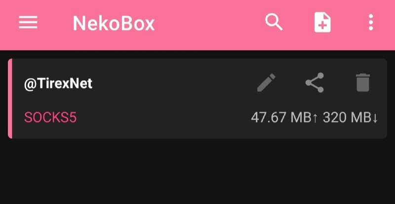

چند تا نکته دیگه 👇

فراموش کردم بگم
حتما اسلیپ نت رو حالت پروکسی مود باشه
من صبح اینقد باهاش اینستا رفتم
وصل شدنشم بستگی ب کانفیگتون داره
منظور من از یکسان کردن پورت

Listen Port داخل اسلیپ نت

و این کانفیگ زیر 👇

socks5://127.0.0.1:10880/#%40TirexNet

داخل اسلیپ نت Listen Port هرچی بود جای 10880 کانفیگ بالا وارد کنید ینی 10880 رو پاک کنید بجاش اون پورت رو بزنید و وارد نکوباکس کنید.

اگه کانفیگ درحالت عادی وصل باشه با این متود هم وصل میشه
یبار حالت عادیشو تست کنید مطمعن بشید وصله

پورته مهم نیس هرچی بود بزنید فقط یکسان باشن

بازم میگم

اگه شرایط نتی شما خوب هست
کانفیگتون خلوته و باهاش راحت تلگرام باز میشه

این متود واسه اینه بتونید رو حالت Vpn بگردین تو تلگرام و اینستا
طبق تصویر هم خودم باهاش اینستا رفتم

اگه دیتا جابجا نمیکنه یک بار پست رو بخونید
اگه ضعیفه کانفیگتون کانفیگ قوی بردارین

کانفیگ چنل ما خیلیا وصلن بهش طبیعیه تو اینرتایم روز نتونید برید اینستا

ولی کانفیگای شخصیتون یا حتی کسایی ک ازم اختصاصی تهیه کردن میتونن این متود رو تست کنن

## asrnovin_ir — post 10325

رشیدی‌کوچی: دود اینترنت پرو به چشم تصمیم‌گیران می‌رود

جلال رشیدی‌کوچی، نماینده سابق مجلس با اشاره به اعلام سخنگوی دولت درباره توزیع اینترنت پرو طبق مصوبه شورای عالی امنیت ملی:

به نظر من، احتمالا در ابتدا وزارت ارتباطات پیشنهاد ایجاد این اینترنت را داده و سپس در شورای عالی امنیت ملی تصویب شده، اما اجرای آن، از دست در رفته است.

قرار بوده تنها افراد خاصی در ازای ثبت مشخصات‌شان، اینترنت پرو دریافت کنند، نه اینکه هر کسی که به جایی وصل است، یک پولی بدهد و اینترنت پرو بگیرد.

به نظر می‌رسد یکی از اهداف توزیع اینترنت پرو، تامین بودجه دولت است.

چطور است که ما کف خیابان به مردم اعتماد داریم، اما در فضای مجازی به آنان بی‌اعتماد هستیم؟

از هر زاویه‌ای به مصوبه تخصیص اینترنت پرو نگاه کنیم، می‌بینیم سرتاسر ایراد است و به زودی، دود آن به چشم تصمیم‌گیران خواهد رفت./جماران

## sirhishamtradinghub — post 3678

  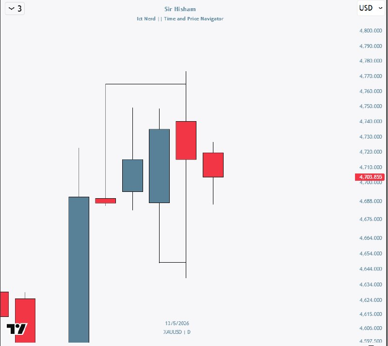

$XAUUSD Daily bias is just 50/50 currently.
The choice is to have a good patience or take unnecessarily action.

## sirhishamtradinghub — post 3677

Good morning everyone

## khabarpro — post 1167

🔴نیویورک تایمز:

قصد ترامپ از تغییر نام عملیات «خشم حماسی» به «چکش سنگین» این است که یک عملیات جدید 60 روزه حمله به ایران شروع کند.

@khabarpro

## khabarpro — post 1166

slipnet-enc://AYIo6tkFmIJJTVGR7fmDNhtTBxpEeEoAFEpzyT5N8a+b/sDoLxoz/tkQkXYHaaX88vdPL6CIvTjPvk2EO7AZqN1pL8M83Ek1FVPBd7x5c3gGvwCaM0RM4PYyg08xNxCXjb4J/Lm+OEVCD1Q4uGAnujF39pQN672Zomk0NrVT0H6ddbIxgkDWbamVDVvY7Alo/z62eE37rcqrB1vuCkw8NPWZGVMXZ1J13SnnI1KaMx1fAnI/MoDJFU9NTcuray/hI+YfyHzamiLOe4b1X2A2LfmK83J1GEfBSAJ150sv1AJxErqopxTv9vlOFJjgtEqEF75NRsaPS4I07jLvGFZjemQqf/MigKYlVtBx74Zn/PGjW64ffdwtVVLJlUs6Xh0JeNYSa1z/W7i19FLGNlk+KfJYl0GDuhIWcIH7oYKTuhewWMne3zPkP8VaolO8Cy9lliBsuU2i67ES/Ut7RHV+htJa4ihNbI6ZzcSWFXfyB1GD7+h0gGofodTYjgVovtC8oZNtN5g+ur0fjT3gx8xhezI9iI5LpaH7dkZqZCvomngXdxIXgVw0+u6H9+coDi6zFbB0xEjPAqoRWi7CD+Wn+/NNqwhog2OIsYpgx1uvwRr0cvsveOKb6LV9Efa1Bn0o79LPju5PHX33SY831SCtgTietCU5nsAcCRQtzniBNEsnMowCVciWKULMJqDLSSk19Us9EBx93K995+BoBIbscplyaolO0J4EMrLLyTxaOTZ9a7hWtrbj1K5HkOyGlHVz0eqiNs1Kv6Zerp/2ufIcdWC+F28Wui8=

## TheVPNMethod — post 636

گروپ ایز اوپن.
https://t.me/VPNMethods

## DigiGozar — post 9195

  <a href="telegram/content/DigiGozar_9195_1778690607.webm" target="_blank">🎬 Download video</a>

- پرداخت ریالی فعال شد 
👑
فروش در دسترس هستش.

سرعتم خیلی بیشتر شده
🔥
کارت داخل ربات دردسترس هستش.

## DigiGozar — post 9194

واریزیایی ک مشکل داشتن امشب ادد میشن صبور باشید
❤️‍🔥

## MatinSenPaii — post 3028

دوستان عزیز که با اپ میتونن وصل بشن اما چیزی براشون لود نمیشه.

## purnet — post 15253

💥✅سلام خدمت همه دوستان

دونیت راه اندازی شد.

ادرس دونیت:

https://purnet.ir/donate

همچنین میتونین از منو بخش حمایت از توسعه دهنده به همین صفحه هدایت بشین.

مبالغ هر چقد جم شد به اسپانسر داده میشه

و ایشون هم سعی میکنن به صرفه ترین سرورها رو خریداری کنن.

مشارکت اختیاری هست

و هر کس بلحاظ مالی

توانایی پرداخت داره حتی ب میزان کم میتونه شرکت کنه.

دونیت تکمیل هم نشه بازم مبالغ به اسپانسر واریز و اسکرین شات خرید متعاقبا پین خواهد شد.

## archivetell — post 4839

  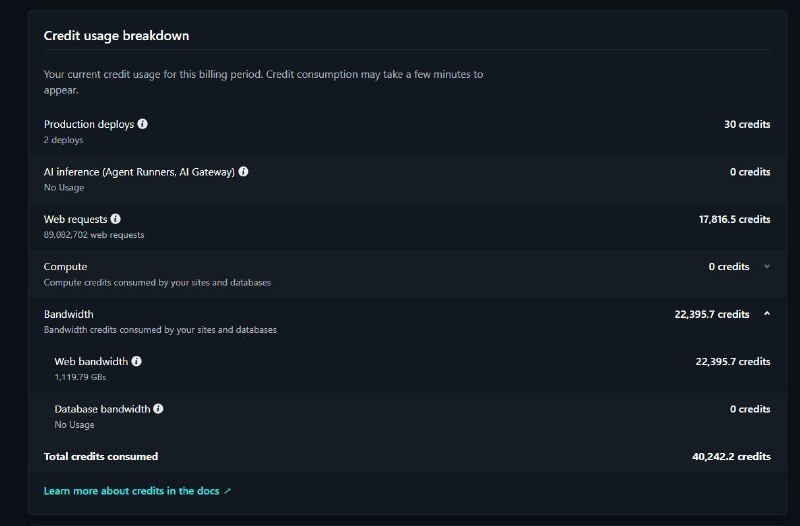

🚀 ساب های کانال آپدیت شدند 🔺 لینک ها تغییری نکرده فقط اپدیت کنید 🔥 ساب جدید https://raw.githubusercontent.com/IR-NETLIFY/NETLIFY/refs/heads/main/IR_NETLIFY_SUB_new.txt 🚀 ساب قبلی https://raw.githubusercontent.com/IR-NETLIFY/NETLIFY/refs/heads/main/IR_NETLIFY_SUB.txt…

## archivetell — post 4838

رفع ارور No Internet در ویندوز وقتی اینترنت قطع یا محدود میشه، ویندوز ممکنه اتصال وای‌فای رو ناپایدار نشون بده یا مدام پیام No Internet بده. این روش فقط بررسی اینترنت توسط ویندوز رو غیرفعال می‌کنه و ممکنه مشکل نمایش اشتباه اتصال رو کمتر کنه. مسیر: Win +…

## archivetell — post 4837

رفع ارور No Internet در ویندوز

وقتی اینترنت قطع یا محدود میشه، ویندوز ممکنه اتصال وای‌فای رو ناپایدار نشون بده یا مدام پیام No Internet بده.

این روش فقط بررسی اینترنت توسط ویندوز رو غیرفعال می‌کنه و ممکنه مشکل نمایش اشتباه اتصال رو کمتر کنه.

مسیر:
Win + R :فشردن کلید
regedit :وارد کردن عبارت
بعد برید به:
HKEY_LOCAL_MACHINE\SYSTEM\CurrentControlSet\Services\NlaSvc\Parameters\Internet

مقدار زیر رو روی 0 بذارید:
EnableActiveProbing

بعد سیستم رو ری‌استارت کنید.

برای برگشت به حالت قبل، مقدار رو دوباره روی 1 قرار بدید.

@archivetell

## archivetell — post 4836

👀کروم اندروید رسماً هوشمند شد!

"گوگل جمنای رو کامل وارد مرورگر Chrome روی اندروید کرده و حالا مرورگر میتونه خیلی از کارهارو خودش انجام بده"
مثلاً:
فرم پر کنه،
خرید انجام بده،
صفحه‌ها رو خلاصه کنه،
یا حتی از داخل عکس‌ها اطلاعات استخراج کنه
📌یه دکمه مخصوص Gemini هم کنار نوار آدرس اضافه شده که باهاش میتونی مستقیم درباره محتوای همون صفحه سؤال بپرسی!

🗣️ولی قسمت عجیب ماجرا اینجاست:
جمنای فقط داخل مرورگر نیست…
به سرویس‌های گوگل هم وصله!
یعنی میتونه:
» رویداد اضافه کنه به Calendar
» لیست خرید بفرسته به Keep
» داخل Gmail دنبال اطلاعات بگرده
عملاً کروم داره تبدیل میشه به یه دستیار واقعی که به‌جای کاربر وب‌گردی میکنه

@archivetell

## archivetell — post 4835

رادار وضعیت اینترنت

http://radar.chabokan.net/

@archivetell

## archivetell — post 4834

ArchiveTel pinned a photo

## archivetell — post 4833

  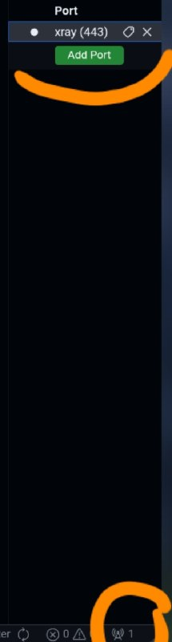

🚀 میگی g2ray ساختم وصل نمیشه؟؟🚀

دوستان، اگر بعد از اجرای G2RAY در گیت‌هاب کداسپیس برای اتصال مشکل دارید، این آموزش کوتاه رو مرحله به مرحله انجام بدید تا کانفیگتون بدون مشکل وصل بشه:

1️⃣ اجرای سرویس: ابتدا پروژه رو در GitHub Codespaces ران کنید تا اسکریپت اجرا بشه و پیام G2RAY - XRAY SERVICE INITIALIZED رو در ترمینال ببینید.

2️⃣ پابلیک کردن پورت (مهم‌ترین مرحله ⚠️):
به‌صورت پیش‌فرض، گیت‌هاب پورت‌ها رو پرایوت (Private) نگه می‌داره. این یعنی کلاینت شما به‌جای اتصال به پروکسی، پشت صفحه لاگین گیت‌هاب گیر می‌کنه!
* پایین صفحه سمت راست، روی تب Ports (آیکون آنتن) کلیک کنید.
* پورت 443 رو پیدا کنید.
* روی اون کلیک راست کنید (یا نگه دارید) و گزینه Port Visibility رو از حالت Private به Public تغییر بدید.

4️⃣ آپدیت هسته Xray (Xray Core):
چون این کانفیگ از پروتکل جدید xhttp استفاده می‌کنه، حتما کلاینت آپدیت کنید. قدیمیا این پروتکل رو نمی‌شناسند.

✅ کانفیگ رو کپی کنید، توی برنامه ایمپورت کنید و متصل بشید. لذت ببرید! ✌️
@archivetell

## archivetell — post 4832

۱۰ دقیقس دارم پست مینویسم، ارسال رو زدم تلگرام کرش کرد. درباره g2ray میخاستم بگم که میگین وصل نمیشه‌.

ولی نمیگم دیگه

## archivetell — post 4828

  

آپدیت جدید UI جمینای با الهام از open ai

@ArchiveTell

## archivetell — post 4827

لینک داخلی آخرین نسخه Happ اندروید

دانلود

@ArchiveTell

## archivetell — post 4826

🚀 ساب های کانال آپدیت شدند 🔺 لینک ها تغییری نکرده فقط اپدیت کنید 🔥 ساب جدید https://raw.githubusercontent.com/IR-NETLIFY/NETLIFY/refs/heads/main/IR_NETLIFY_SUB_new.txt 🚀 ساب قبلی https://raw.githubusercontent.com/IR-NETLIFY/NETLIFY/refs/heads/main/IR_NETLIFY_SUB.txt…

## archivetell — post 4825

🚀 ساب های کانال آپدیت شدند

🔺 لینک ها تغییری نکرده فقط اپدیت کنید

🔥 ساب جدید
https://raw.githubusercontent.com/IR-NETLIFY/NETLIFY/refs/heads/main/IR_NETLIFY_SUB_new.txt

🚀 ساب قبلی
https://raw.githubusercontent.com/IR-NETLIFY/NETLIFY/refs/heads/main/IR_NETLIFY_SUB.txt

🚀 ساب های متغیر رندوم ( با فیلترشکن باز کنید )

https://sub.ir-netlify.workers.dev/new

https://sub.ir-netlify.workers.dev/

⚠️ : ساب قدیمی نیاز به اهدای دامنه داره شدیدا لطفا ورژن 1.0.2 پروژه رو دپلوی کنید و دامنه نتلیفای اش رو بدید دایرکت t.me/IR_NETLIFY?direct

🔵 @IR_NETLIFY

## archivetell — post 4824

VaultGram

یک ربات تلگرامی برای ذخیره‌سازی امن فایل‌هاست.

@VaultGramStorageBot

- فایل‌ها در «حساب خزانه» جداگانه نگهداری می‌شوند؛ حتی اگر حساب اصلی‌تان حذف یا مسدود شود، داده‌ها ناپدید نمی‌شوند. 
- رسانه‌ها (عکس/ویدیو) و اسناد (ZIP, RAR, Docs) در پوشه‌های مخصوص خود سازماندهی می‌شوند. 
- با نام کاربری و رمز عبور حساب خزانه می‌توانید از هر حساب تلگرامی به این فایل‌ها دسترسی داشته باشید. 
- یک کلیک کافی است تا تمام محتوا را بازیابی کنید. 

به‌صورت کلی، VaultGram داده‌های شما را به‌صورت مستقل، منظم و با حریم خصوصی بالا نگه می‌دارد.

@ArchiveTell

## archivetell — post 4823

ClonethBot

رباتی برای ساخت هوش مصنوعی شخصی در تلگرام

@clonethbot

- مدل‌ها: شامل Minimax M2.5 و Nemotron 3؛ هر دو بدون نیاز به کلید API کار می‌کنند.
- پاسخ‌ها: نامحدود و رایگان؛ می‌توانید به‌صورت مستقیم در چت با ربات گفت‌وگو کنید.
- راه‌اندازی: فقط کافی است ربات را به‌عنوان منبع مدل انتخاب کنید و از دستورات ساده برای تنظیم پارامترها استفاده کنید.

برای شروع، ربات را در تلگرام پیدا کنید و دستور /start را بفرستید.

@ArchiveTell

## archivetell — post 4822

📌ربات برای ssh زدن به سرور:

@EazySSH_bot

@ArchiveTell

## archivetell — post 4820

  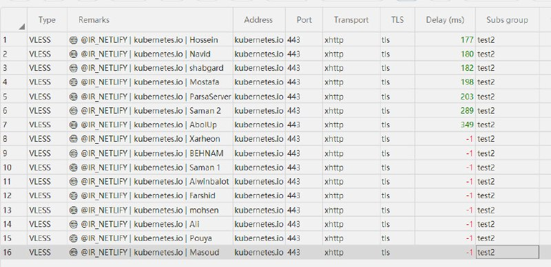

🔆 سایت و برنامه کانفیگ ساز آپدیت شدند

📌 فایل برنامه
📌 لینک سایت

🚀 وصل شدیم (بقیه سرور ها هم بزودی فیکس میشن)

🔵 @IR_NETLIFY

## Break_The_Barriers — post 1548

  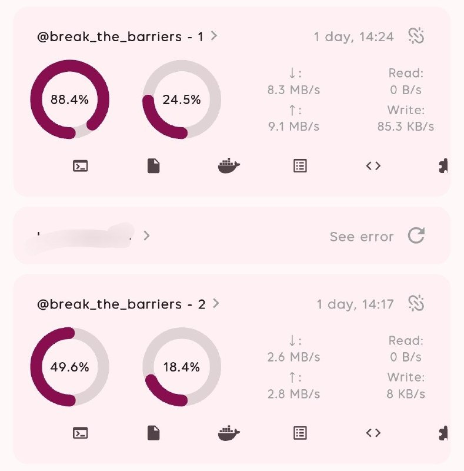

لطفاً از سرور دو استفاده کنید!

## Break_The_Barriers — post 1546

پسورد جدید جهت اتصال به کانفیگ‌های کانال تاریخ: ٢٣ اردی‌بهشت‌ماه بر روی علامت مداد 🖋️ کانفیگ بزنید و در انتهای تنظیمات، در بخش Credentials، پسورد را وارد کنید. Password: R2oV7LqZxF1M9cWa @break_the_barriers

---
📅 بروزرسانی: 1405/02/23 11:53
---

## vpn_xvpn_ch — post 398

شبتون بخیر 🌹

## vpn_xvpn_ch — post 397

👥 تعداد اعضای کانال : 1022
📊 حجم ترافیک کلی : 105 گیگ
📊 حجم ترافیک مصرف شده : 140 گیگ⛔

## vpn_xvpn_ch — post 396

@vpn_xvpn_ch.npvt

## vpn_xvpn_ch — post 395

🧨 یه آفر جدید داریم🧨 🚫 اشتراک پایه 7 گیگ = 3،150،000 🔥 اشتراک پایه 7 گیگ = 1،900،000 ✅ فقط 10 عدد موجود

## vpn_xvpn_ch — post 394

@vpn_xvpn_ch.npvt

## vpn_xvpn_ch — post 393

@vpn_xvpn_ch.npvt

## vpn_xvpn_ch — post 392

🧨 یه آفر جدید داریم🧨

🚫 اشتراک پایه 7 گیگ = 3،150،000

🔥 اشتراک پایه 7 گیگ = 1،900،000

✅ فقط 10 عدد موجود

## xsfilterrnet — post 3415

🍷نتلیفای
‏با تغییر xPaddingBytes به 1-1 دوباره انگار کار میکنه مرسی از دوست عزیزی که مشکل رو پیدا و حل کرد.

تغییر هم باید سمت سرور باشه هم سمت کلاینت تو کانفیگ

با این روش مجدد میتونید متصل شید بهش
⚡️

@xsfilterrnet

## saministamm — post 62717

پروکسی تست کنید :
https://t.me/socks?server=188.121.103.101&port=1080
@saministamm.

## Skyportall — post 10638

vless://974361ea-6d56-46d6-b0e3-283b7c46e9ea@185.143.233.200:80?path=%2Fshorts&security=none&encryption=mlkem768x25519plus.native.0rtt.G7jF1YzVPaQRjTxtpT6mSTGsOyHT4YMz9s_6o-6C9BA&host=filimo.com.Mylinked.org&type=ws#%40Skyportall

💙V2ray
➕psiphon
📱

⚡️ @Skyportall

## hamedvpns — post 18817

  <a href="https://t.me/hamedvpns/18817" target="_blank">📎 Download file</a>

کانفیگ مورد نیاز برای روش اتصال با کلش‌متا و flclash

نصب برنامه کلش‌متا و Flclash 👉👉

داخل کلش متا یا Flclash وارد کنید و متصل بشید.

سپس وارد گوگل‌پلی یا یوتیوب بشید ببینید باز میشه براتون یا نه .

ویدیو‌ها و فایل ها قابل پخش و دانلود نیستند اما برا اونها هم روشی دارم .

❤️ اشتراک گذاری یادتون نره 🌈

‌‌@hamedvpns ☑️

لایک   |   Like 👍❤️
اشتراک بزارین   |   Share ⭐️

## hamedvpns — post 18816

لینک دانلود برنامه‌های Flclash و ClashMeta

برای اندروید و ویندوز

برای دانلود از گیتهاب دیگر نیازی به چیزی نخواهید داشت.

جهت دانلود از یوتیوب و فروشگاه‌پلی هم راه خواهم گفت تا اول بتونید با این روش باز کنید به کلیپ یا فایل خود دسترسی داشته باشید بعد همون رو با ربات یا سایت یا برنامه‌ای دیگر دانلود کنید .

Flclash :

arm64-v8a
https://uplod.ir/ejwt0iz2xdcj/FlClash-0.8.92-android-arm64-v8a._.htm
بعد از دانلود کافیه تغییر نام بزنید و در آخر اسمش apk. اضافه کنید.

armv7
https://uplod.ir/ym40ytakipvw/FlClash-0.8.92-android-armeabi-v7a._.htm
بعد از دانلود کافیه تغییر نام بزنید و در آخر اسمش apk. اضافه کنید.

PC
https://uplod.ir/71enhfysq3lm/FlClash-0.8.92-windows-amd64-setup.exe.htm
فقط کافیه آخر اسم حرف .htm را پاک کنید 👆👆

ClashMeta :

arm64-v8a
https://uplod.ir/fx3q44wjc77e/cmfa-2.11.27-meta-arm64-v8a-release._.htm
بعد از دانلود کافیه تغییر نام بزنید و در آخر اسمش apk. اضافه کنید.

armv7
https://uplod.ir/ccdlsa9x0b93/cmfa-2.11.27-meta-armeabi-v7a-release._.htm
بعد از دانلود کافیه تغییر نام بزنید و در آخر اسمش apk. اضافه کنید.

Universal
https://uplod.ir/g1tm9tnog71n/cmfa-2.11.27-meta-universal-release._.htm
بعد از دانلود کافیه تغییر نام بزنید و در آخر اسمش apk. اضافه کنید.

PC : Not

❤️ اشتراک گذاری یادتون نره 🌈

‌‌@hamedvpns ☑️

لایک   |   Like 👍❤️
اشتراک بزارین   |   Share ⭐️

## hamedvpns — post 18815

کیا کلش متا و flclash نصب دارند همین الان الان زود بگن !!!

## hamedvpns — post 18814

خب دوستان بریم کم کم آماده بشیم برای روش نظرسنجی که گفتم 😎

## hamedvpns — post 18813

## hamedvpns — post 18812

  <a href="telegram/content/hamedvpns_18812_1778660618.mp4" target="_blank">🎬 Download video</a>

آموژش نسخه جدید Whitedns 📲✨
🎬 amozesh whitedns.mp4 7.7MB

✅ نسخه اپلیکیشن به 1.2.0 ارتقا پیدا کرده 🚀

✅ حالت Full VPN کامل‌تر و پایدارتر شده 🔒

✅ حالا DNS هم داخل خود WhiteDNS مدیریت می‌شود 🌐

✅ دیگر برای باز شدن سایت‌ها و اپ‌ها نیازی به NekoBox، NVPN یا ترفندهای مشابه ندارید 🚫

✅ مشکل وصل بودن VPN ولی باز نشدن بعضی سایت‌ها و اپ‌ها برطرف شده ✅

✅ صفحه اصلی ساده‌تر شده و انتخاب سرور، Resolver و نوع تنظیمات راحت‌تر انجام می‌شود 🎯

✅ اگر سرور یا Resolver درست تنظیم نشده باشد، اپ واضح‌تر نشان می‌دهد چه چیزی کم است ⚠️

✅ می‌توانید تنظیمات پیشرفته را با نام دلخواه ذخیره کنید 💾

✅ امکان ساخت چند پروفایل تنظیمات پیشرفته اضافه شده 📂

✅ می‌توانید هر زمان بین پروفایل‌های ذخیره‌شده تنظیمات پیشرفته جابه‌جا شوید 🔄

✅ بعد از اتصال، نام پروفایل سرور، Resolver و تنظیمات فعال نمایش داده می‌شود 📋

✅ امکان خروجی گرفتن فایل client_config.toml از داخل اپ اضافه شده 📄

@whitedns

❤️ اشتراک گذاری یادتون نره 🌈

‌‌@hamedvpns ☑️

لایک   |   Like 👍❤️
اشتراک بزارین   |   Share ⭐

## ConfigWireguard — post 31685

  <a href="telegram/content/ConfigWireguard_31685_1778660622.webm" target="_blank">🎬 Download video</a>

🗓️ 75 روز ⌚ 0 ساعت و 30 دقیقه از زمان خاموشی اینترنت جهانی در ایران میگذره 😞

## ircfspace — post 2324

  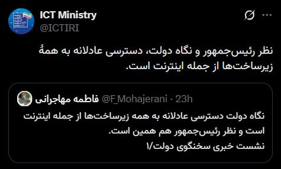

فعلا دسترسی آزاد به اینترنت در متن سخنرانی‌های رییس‌جمهور و هیات دولت برقرار شده! 🤡

🔗 ᴡᴇʙꜱɪᴛᴇ • ᴠᴘɴʜᴜʙ • ɢɪᴛʜᴜʙᴍɪʀʀᴏʀ
@ircfspace

## ircfspace — post 2323

تعداد کاربران اینترنت پرو کمتر از نیم‌میلیون نفر است!

تا امروز یک اپراتور با ارسال بیش از ۴ میلیون پیامک، برای بیش از ۴۵۰ هزار سیمکارت، #اینترنت_پرو فعال کرده و اپراتور دیگر با ارسال بیش از ۵۰۰ هزار پیامک، حدود ۴۰ هزار کاربر پرو فعال دارد.

© aghplt

🔗 ᴡᴇʙꜱɪᴛᴇ • ᴠᴘɴʜᴜʙ • ɢɪᴛʜᴜʙᴍɪʀʀᴏʀ
@ircfspace

## ircfspace — post 2322

  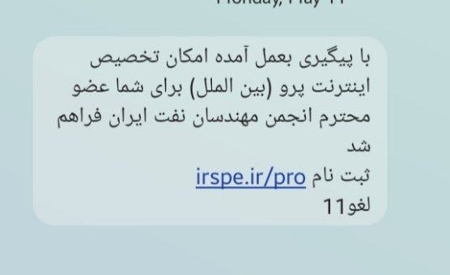

انجمن مهندسان نفت برای دریافت #اینترنت_پرو واجد شرایط شد.

۷۵ روزه اینترنت رو به بهانه امنیت به روی میلیون‌ها ایرانی بستن و هرکی که کار و زندگیش به اینترنت وابسته بود به خاک سیاه نشوندن، تا #اینترنت_طبقاتی رو اجرا کنن. مدیونین اگر فکر کنین کیسه دوختن!

🔗 ᴡᴇʙꜱɪᴛᴇ • ᴠᴘɴʜᴜʙ • ɢɪᴛʜᴜʙᴍɪʀʀᴏʀ
@ircfspace

## ircfspace — post 2321

بدتر از قطعی اینترنت فکر اینه که سالها درس خوندی، دکتر و مهندس و محقق و پژوهشگر شدی، بعد واسه کار علمی دسترسی به اینترنت بین‌الملل نداری؛ اونوقت حمید رسایی با حول و حوش دو کلاس سواد برات تصمیم میگیره تو اینترنت نداشته باشی، تازه خودشم تو ایکس وله!!!

© NiHa_Mehr

🔗 ᴡᴇʙꜱɪᴛᴇ • ᴠᴘɴʜᴜʙ • ɢɪᴛʜᴜʙᴍɪʀʀᴏʀ
@ircfspace

## Zel2oVPN — post 2744

✅VayDNS [S116]

slipnet-enc://AY82m9dWqUykkKO78Ea6oP+/j9pf33sSqiffl9In7PfUZLoOX9m/JaWIaTXbx0OepA4d7Zh6oGOt0XQ2NGzIdv+4SL2+f3688so8Hn0WYDTGioCJuAc4gsScLpnDcVdbLawlZE43eGxKR2e9ybY1KzW8HlU99OmblipjCo4UR+hejxyUtr3ukV5zM6p4p7jYexPUuXGu60/rPTCyd3v80w6/7Mw9xufwdlrXPIqm85R1WaDT4DFa9clEsBcT8D/1yi5Lq5qkRLzCjYl70iOyyDacIsYxnc3iFmPMOFRROfbhm7TmUMFqCKcI1x+u0k5WjaYd7RUE1tLsCDHmDzSkbbgoNWZTAY0+9zlJ3IHZf9pHaxzfHgPb90zjJ/2BXnp7tWHwvUI1vuBlJfRcek9DJR4l1mYbTmWSTT7RUQtA9cIYVsM8Nwpk0rjVYafCYNpSgel/oL4ZPfe+P2PlYaLNZCH325XECc7hvTwduKCJUFisWMGh9CXcrq3Cwu3jSG1X0DYjjkh2mBUhMRbMbxmsHCNiWP4gvE0Ad3FtE+uV3RN7CAC+OblIsc9GcY3wi5UaYwPGhvrSVFvYZY84f8PFh5fEYcRdhNCVs1CPSBSVJiFcjHL5bOnZpnoT5erFBZAszTbh01O93dR3FdvZY5LExaz+OUDGCt8LT80F5DmnH/2pkhXao3q5JZu76FnmwIZKvwyPdXmVtZ5KnNkF7RlrYV8bVpE5A8ksM4xesh479vDqKwEKtshkWzo/GgMQMw9XlSM27E1QiQNLB3w=

📱کانفیگ اسلیپ

📱مخصوص نسخه جدید  2.5.3

📱دانلود نسخه جدید

📱تنظیمات پیشنهادی

https://t.me/socks?server=127.0.0.1&port=10880&user=%40Zel2oVPN

☑➜@Zel2oVPN

## Zel2oVPN — post 2743

✅ VayDNS [S115]

slipnet-enc://AbcQiLpe8HiQ1PrLcsoAbBze7KFD6WYSzNx6KsRC/fN8ebik9t6PSSEln/i1meaTUoDqQX5CSgAMbyG8NKuxI16HKYnOrRfjOyPp2VQ/ZFHwHgKzFXBJiYB5ebiAHCjSeBNsUtzLPQmAXIBIyfcNEgxNd1rE+7uk22ou4HaJdMWgkOVIeACBGy7pyccQqbttzj/EST5lGgtFvvx9/Wf85TPRkoz/nT8ghFB0+OhE2FHocqaY9cnB9h4elj4e5KV0Gxd7bU6fniWfMDaZDdfWYFhzk/GJVef7G91fAHAmkPuuZ8yPYKVR7NJ+DXr0WUZJKJbBZY+Y2l9FwXd+5a0qi3uOSYulfIjv9nFvL5EffTkWmwoiCB7wLGsTOqzrslJNpS1xm39aP7hF2XgMb+OsrrqYZtYxBQONQIF4DWEHlPRR+ZbbsFLgDyFqZG9UaXm9c7QIq3qKcmRx7YS19hlglkeezI08FmJcBgSBfy1Bcf6gicOV2XkX+VKnTD/4NOhUjpRt2+uNA1zonZKYWmCJQJDnU1wFUwHCsyL/RfHKi3y1ZRcdzGqOp5QtqONXgd3uX32kkh+pploFx0wisqDUONvGjwf4HgdCypnMZrbiY+Nuj1VPK+x9qLwjq5RHoIZsGEZf6tTvgsTRhULM3TFDLE3IqN87mbCxUy9vYlaL+FxNuQGar/TD8RjI29363HVKzGRRjbJw6ZhGchwfnJcQfA==

📱کانفیگ اسلیپ

📱مخصوص نسخه جدید  2.5.3

📱دانلود نسخه جدید

📱تنظیمات پیشنهادی

https://t.me/socks?server=127.0.0.1&port=10880&user=%40Zel2oVPN

☑➜@Zel2oVPN

## Zel2oVPN — post 2742

✅VayDNS [S114]

slipnet-enc://AfTo00TOqNzikMc1N0JtGWAWwklsm/m5Fsto07Rh+CupQK/zAxaPN1riADs+uJ4Qk0nE5oyR6/jREYLym5vcaHUKJQDTqK2OtAyB65PzzYOkAIAZVlt7RCcb82ev0vtS/cxdgf2Mqz0iLIDtwi9IyT6rScXbSRBaMQu5pyR/WGFffzLuu3yHYIhjrsPnAVMB+DLzVIs6TrQ3ir1n7DYwJn+ZMRsuUs40d55M5Vp5ZfjZ3a2XVftjq7Bq+76Fb0SvFShNv5MQFfDAUsfk2HbysVQe4N4ISgj9iNghKMPhtxLKz0eoBoDi7x8nI9CGoe8jaZ/U6x1d66o/v8jEJB7Np1yLGN+d4Y4H5Qdv2whoZCbj0sT5dMVfjaH66WpMQWK1US14NhK0rrQQl1PouZ2fV2Cwslpvc1p4K3oUQMoj0lyIQqanVW0o3sXXUqi5qQ3Na/REpLVmO6jzGDRDNUmpdFkv4iPMjFQ7orVauuPdtwvzkpYPnoslD6OC+vv42Z1PxiPjRapLtFDJHcPrMrm3NFLmce4zDMy+Pix4szp+eNd3YTiJ95/CXf93IFLMI8yMyIWFGdJdocYsJgyhDeD3wl3YMRLBgX+peIKbsWzPqakACJ+zbahfo1TYJK6/0vjnulVG3TE/WHLgNrfX8E5iCUQm4VhpV7BucMB8K9xJ9q+hrMfVdqOJ1CIlFZY5k+DobXM0r1WSm7nHIFoWQRCm0uBS3VEsNcXhOZTSPtDuwe7pYu6I48wMcxUDG+gi1BHG2l6Ce/9jV5V2yioI+K8p

📱کانفیگ اسلیپ

📱مخصوص نسخه جدید  2.5.3

📱دانلود نسخه جدید

📱تنظیمات پیشنهادی

https://t.me/socks?server=127.0.0.1&port=10880&user=%40Zel2oVPN

☑➜@Zel2oVPN

## Zel2oVPN — post 2741

✅VayDNS+SSH [S113]

slipnet-enc://AbohxS+YaS7Y3FxAq9Br/5yk62aZJUz2jdudKyysowSe245zefV5qlORRUQbdgovoLJLfy6X3zFpgQiP7bfAGE/FcWkqz5lkM9RiR+WrZ4xBu3XKuTrHn7aTvnIFU9He4LZprX7+WaYmOcoPU/E03+bV1BbzCxknjkOi+pDMLCHbCq6phvKu7ZGt0X9SEAvZ9JMxL2pyY01BbgXtXXoGYVmP8t4LAkfgaTSeIUuXaLyPH4Ns7nBq7TK4UB+YQYuAA+iWXFo0jeTo2SooYgZR6ap4dr50QD0asWMjG8hO3dWg+h1RR9HUVz9xzcQd8fwA21qmDYrCwF7YN8+OuzkAe+L2x/zfa8Y+Plnh/mNJ3LcswDOW4+yzJk1WqkFxtevoi9zlen3utbe3NpWXg8AzNSm11imwztdrfImk8yf8vOYEyTx7uLUA0YZtAw0SHqag7N4mAPJ0xhF6sj4bpPyCfCUsvh6iu57YazCUTvem2+XroCY2v91XMe75o9NJuihVIs6vOnvMvEAcukmfCklW37iLe9uIxA3FeOT/gkh/7GKH0tbSUwVdG+E6MuGEQwWb7tJAbOXHycpu1JVVA/Py1njeCboOkNTqfquvsE/fbzJJvUEDw4njSMJ5v+hIf1Jjsl0GmOgrGW9yzxXpKbpX177OYWnyAvataBq0iV1xhZeCOKeNi/X2zRR2XX4bzgeogywm+tz8jYffgCQOzBPLLpHenqASv81Qmv4xE+kSniRiOLNSc1m5gD48ZbWbueQY4eE+0rZ3WDnh0pdQEjQrtseMySPzbL6/psp6PhBLzowJkTRm9lNMqQ8SAvjd4uno7j5LtS0ig+HE

📱کانفیگ اسلیپ

📱مخصوص نسخه جدید  2.5.3

📱دانلود نسخه جدید

📱تنظیمات پیشنهادی

https://t.me/socks?server=127.0.0.1&port=10880&user=%40Zel2oVPN

☑➜@Zel2oVPN

## whitedns — post 582

  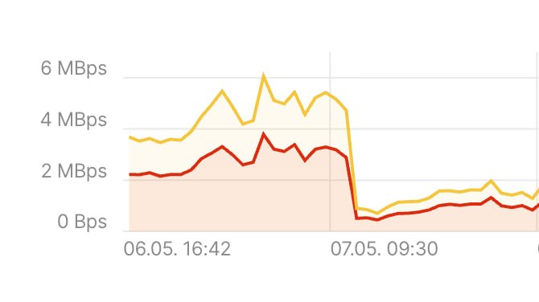

دوستان عزیز،

یک نکته مهم را لازم دیدیم با شما به اشتراک بگذاریم.

بر اساس بررسی‌هایی که انجام دادیم، فیلترینگ دامنه‌های عمومی همیشه به‌صورت کامل و یکسان انجام نمی‌شود. در واقع این محدودیت‌ها معمولاً به‌شکل منطقه‌ای و بسته به اپراتور، مسیر شبکه و Resolverهایی که استفاده می‌شوند متفاوت است. اینترنت هم طبق معمول تصمیم گرفته مثل یک موجود عصبی رفتار کند.

برای مثال، اگر به وضعیت سرورهای WhiteDNS در تصویر دقت کنید، میزان لود شبکه یکی از سرورهای ما از حدود 4Mbps به نزدیک 400Kbps کاهش پیدا کرده است. این یعنی در بعضی مسیرها یا اپراتورها، دسترسی به برخی دامنه‌ها محدودتر شده یا کیفیت ارتباط افت کرده است.

به همین دلیل، ممکن است روی بعضی از سرورها تعداد Resolverهای کمتری دریافت کنید یا کیفیت Resolverها نسبت به قبل پایین‌تر باشد.

ما در حال بررسی راهکاری هستیم تا بتوانیم دامنه‌های سرورها را به‌صورت روزانه به‌روزرسانی کنیم و کیفیت اتصال را پایدارتر نگه داریم.

تا زمان آماده شدن این راهکار، می‌توانید از سرورهای کانال همکار ما، @Masir_Sefid، که در پست قبلی معرفی کردیم استفاده کنید.

تمام سرورهای ما و سرورهای کانال همکار، به‌صورت مداوم مانیتور می‌شوند تا در صورت افت کیفیت یا مشکل اتصال، سریع‌تر بتوانیم وضعیت را بررسی و اصلاح کنیم.

ممنون از همراهی و گزارش‌های دقیق شما 🤍

@WhiteDNS

## whitedns — post 581

✔️سرور مستر دی ان اس (MasterDNS)

❤️تاریخ بروزرسانی : ۲۳ اردبیهشت

Domin 1: v1.masir-sefid.shop

Domin 2: v2.masir-sefid.shop

Domin 3: v3.masir-sefid.shop

Domin 4: v4.masir-sefid.shop

Domin 5: v5.masir-sefid.shop
Key : Telegram-Channel--->@Masir_Sefid

👾 لینک دانلود کلاینت ها :
MasterDNS GG | MasterDNS HN
WhiteDNS 1.2.0

اگه وصل شدین ری اکشن برید بدونم
❤️

✉️Channel | @Masir_Sefid | کانال
✉️

## whitedns — post 580

  

امکان دانلود کل ریزالور ها به ربات @dns_resolvers_bot اضافه شد

@WhiteDNS

## Spotify_Porteghali — post 12358

💬 لینکِ دانلودِ مستقیمِ داخلی ( بدونِ فیلتر ) وی پی ان ها و کلاینت هایِ اندروید که این چند روز کارآمد و متصل بودند 
💬 
⚪️Psiphon [ v 453 ] : https://punkpaste.ir/f/Psiphon-v-453-Spotif-1gbnma 
⚪️Psiphon ( Mod ) [ v 462 ] : https://punkpaste.ir/f/Psiphon-Mod…

## Spotify_Porteghali — post 12357

💬 لینکِ دانلودِ مستقیمِ داخلی ( بدونِ فیلتر ) وی پی ان ها و کلاینت هایِ اندروید که این چند روز کارآمد و متصل بودند 
💬

⚪️Psiphon [ v 453 ] : https://punkpaste.ir/f/Psiphon-v-453-Spotif-1gbnma

⚪️Psiphon ( Mod ) [ v 462 ] : https://punkpaste.ir/f/Psiphon-Mod-v-462-Sp-wp26x3

⚪️V2RayNG [ v 2.1.7 ] : https://punkpaste.ir/f/V2rayNG-v-2-1-7-Spot-s677ol

⚪️V2RayN ( Windows ) [ v 7.20.4 ] : https://punkpaste.ir/f/V2rayN-Windows-64-v--igs81c

⚪️NapsternetV [ v 123.1 ] : https://punkpaste.ir/f/NapsternetV-v-123-1--gfsice

⚪️SlipNet [ v 2.5.3 ] : https://punkpaste.ir/f/SlipNet-v-2-5-3-Spot-0ou2rk

⚪️SlipStream ( Windows ) : https://punkpaste.ir/f/SlipStream-Windows-6-ddn0qt

⚪️V2Box [ v 5.0.3 ] : https://punkpaste.ir/f/V2Box-v-5-0-3-Spotif-d03m6x

⚪️Happ [ v 3.18.1 ] : https://punkpaste.ir/f/Happ-v-3-18-1-Spotif-mqbzfr

⚪️OpenVPN  [ v 3.3.2 ] : https://punkpaste.ir/f/OpenVPN-Connect-v-3--eue4ww

⚪️HTTP Injector [ v 6.5.0 ] : https://punkpaste.ir/f/HTTP-Injector-v-6-5--zzhcby

⚪️NetMod [ v 3.2.8 ] : https://punkpaste.ir/f/NetMod-v-3-2-8-Spoti-35hvqy

⚪️ShirOKhorshid [ v 2026.3.17 ] : https://punkpaste.ir/f/ShirOKhorshid-v-2026-781llx

⚪️AM Tunnel Pro [ v 28.0 ] : https://punkpaste.ir/f/AM-TUNNEL-Pro-v-28-0-n2xjmg

⚪️AM Tunnel Lite : [ v 2.0 ] : https://punkpaste.ir/f/AM-TUNNEL-LITE-v-2-0-y325mm

⚪️MasterDNS [ v 1.0.9 ] : https://punkpaste.ir/f/MasterDns-v-1-0-9-Sp-z58k11

⚪️WireGuard [ v 1.0.20 ] : https://punkpaste.ir/f/WireGuard-v-1-0-20-S-80q8vj

⚪️WhiteDNS [ v 1.1.0 ] : https://punkpaste.ir/f/WhiteDNS-v-1-1-0-Spo-8gruhs

⚪️Every Proxy [ v 12.7 ] : https://punkpaste.ir/f/Every-Proxy-v-12-7-S-ypu92j

⚪️NetShare [ v 2.5.50 ] : https://punkpaste.ir/f/NetShare-v-2-5-50-Sp-66mr6e

🔴خیلی مهم : حتما لینک رو کپی کنید و در مرورگر Chrome جایگذاری کنید و دانلود کنید ؛ لینک ها با همه ی اینترنت ها بدونِ نیاز به وی پی ان کار می‌کنند .

+ اعتبارِ لینک هایِ دانلود : 24 ساعت [ لینک ها آپدیت می شود . ]

🆔 @Spotify_Porteghali 🍊

↰  بزرگترین خانواده اسپاتیفای در کشور  ↱

## JynMarket — post 2248

  <a href="telegram/content/JynMarket_2248_1778660624.webm" target="_blank">🎬 Download video</a>

از این به بعد سعی میکنم کمتر npv هایی که به زور وصل میشنو بزارم 
🖱️ بیشتر اسلیپ نت و برنامه هایی که واسه تلگرام سرعت معقولی دارن

## JynMarket — post 2247

  <a href="telegram/content/JynMarket_2247_1778660624.webm" target="_blank">🎬 Download video</a>

🌟 سرور اسلیپ نت جدید slipnet-enc://Af4gSOifBaUMP+poVCePiVy/mAZUwDrP95W30wathvACF3QYES+P5EPP6nMjqX65hOSCxfhEfOBCw9Q/37QFSX+ysi+nr5zebGFCLivPCrFh9igpWUYrYbY1/QSycGHlMgCyWfMelcirZTx3tg92TPLZRFi82+OlHW2cuzjM3SUx1WXMDRDQHuwVDkaM0ffOUUIk1RjGsEInp0OPhEy8zh/VKHmv…

## JynMarket — post 2246

🌟 سرور اسلیپ نت جدید

slipnet-enc://Af4gSOifBaUMP+poVCePiVy/mAZUwDrP95W30wathvACF3QYES+P5EPP6nMjqX65hOSCxfhEfOBCw9Q/37QFSX+ysi+nr5zebGFCLivPCrFh9igpWUYrYbY1/QSycGHlMgCyWfMelcirZTx3tg92TPLZRFi82+OlHW2cuzjM3SUx1WXMDRDQHuwVDkaM0ffOUUIk1RjGsEInp0OPhEy8zh/VKHmvNGGBZp0NVL1G0OCM7biF0anvZ6WU96Ath/49DQY8Jz4fyN+rMKewjHsKDyHsiYVVkFRcWrx4BhnamMaZ5FuQwLhbp1Jx0QeqxZiXvp64d0FfWV2+ug1MprlUZgFygcaVoXzdwEh5Lh4cAIvie5IuajILGKExYyQZ0G0hq5h6Apf9FyxDaYcmI1B0+0V9CzF6dGJMypeK5Yg6uRPau7lDVpswIZNAvd+cNjXtqoeXqqS4nHXWZyHARZE25MLLNaJkckKu22tbkMbTGkpFMlsrXlEW3CPpcZOJIlFLvGvTsfJhOHIk6jIuLrLz9XfCJwCAjNIetuZuRQcZmWDEnZhGKRViLwiq4yfrQogGdCDTiZewYeUHlnIHnC3760SRC1xA/kpwwSonrhLJc+p8wrG7bWQX1InaBMhO4RPcstrnCYolj15y1ow3s6gHd5yRm81cH7G898GYJBscQ0dr

🔗 اموزش استفاده - دانلود برنامه موردنیاز

## JynMarket — post 2245

🌟 سرور اسلیپ نت جدید

slipnet-enc://AX7DFPxhCg133kMNoOClrnbTAZhEfvDGzCPliU4EJtjxKNQExajlkToXlxa0j3WXl1tjrAiBDlBBFoWdMdZ/Tyxu+lGD009pRE5A0N0Koj8P/cCxCeVzxnHUkKl8utIowb2njuGCj/w4w2h+wr7pwYucJO746b1Hwr44+VRTqUgO/CGUgGHmK1V9bsydzTCmjsrtnC279IRhTa8MqU0ibh0Uqgt0LcT+V7LKng6BqDGP00Af6xt8Gal14SSzxgkMxO86X0Q3wTQo2nedqMYxgTkDU/Q7iyaRK0IPPTI0kE/IO0Jyc6tsD0Lt3ucYZ3yhFbwNSxlkVDccs3yQeQKum3KHEHc6wudGBCbo+Q/ZqHnovkn7yWlsENklLCdRYDdQqgqSI0GuUTOnLe3hnZRqklfYLS8ECLxP10AsVbP6amkQAuSxj6rvz6jveOQ1yDKB0cqNxdYhCRp0yT/J1Qejhxh5zkOUOko/13yRRtjyIpfQl/nhJAvolpfTFuGy49PXdCttjr8kyxMRqhrPpSyOOtWJm3lEXUk0JGHflgBTbXQA+KuF3wXEc0ihsiKjZlGvostmQWs5uwZZfX+p/nSv/dWWegmLt+REXsmF4FKAe0H1B1f45Y/v5KBKMwK38bTLylkruSfDWOuDHcKwR2OIinfQ7g2PpYDOPYcowJF5a8e2uSesWOLTmqrlJLo5d2lp2DL+zpVn7HnIKk+zJ6MYiNRxyTxTcOJrkNm21lfPplBxFCBhqczqfB5vUlQ98pbizs2Ksc2uP6nBfEX4FrkoZ6Q=

🔗 اموزش استفاده - دانلود برنامه موردنیاز

## JynMarket — post 2244

ترکیبی سایفون متصل تست شده

vless://5f4e1b9e-5e3c-4101-a802-0a44ff942909@185.143.233.235:80?security=none&encryption=none&host=d.nsa03.com&type=ws#%40JynMarket

@JynMarket

## TirexNet — post 3693

آموزش ترکیب Slipnet با NekoBox 🐊

میتونم بگم بهترین متود ترکیبیه
فوق العاده اتصالتون رو بهینه میکنه و از سایفون و بقیه چیزا بهتره.

آموزش متنی:

ابتدا از منوی همبرگری به قسمت Settings رفته و Apps Vpn Mode را انتخاب کنید و تیکش رو فعال کنید.

حالت روی Proxy قرار بدین و برنامه هایی که میخواین از فیلتری دربیان رو انتخاب میکنید.

و وصل میشید و دیگه نیازی به پروکسی نیست.

کانفیگ مورد نیاز:
socks5://127.0.0.1:10880/#%40TirexNet

برنامه نکوباکس:

نسخه v8a
https://dl.toolschi.com/view.php?f=08e134a18824a43a.zip

نسخه v7a
https://dl.toolschi.com/view.php?f=f25ae8518482070b.zip

نکته:

در اسلیپ نت باید Listen Port شما 10880 باشه ( اگه هم نبود مهم نیست کافیه تو کانفیگ پورتش رو با پورت اسلیپ نت یکسان کنید)
اگه نمیدونید Listen Port کجاس تو همون تنظیمات برنامه برید پیدا میکنید.

من باهاش اینستا میرم
از Vpn Mode خود اسلیپ نت بهتر کارمیکنه.

## DigiGozar — post 9190

فردا احتمال زیاد به مدت محدود پرداخت ریالی باز میشه
🔥

## MatinSenPaii — post 3027

  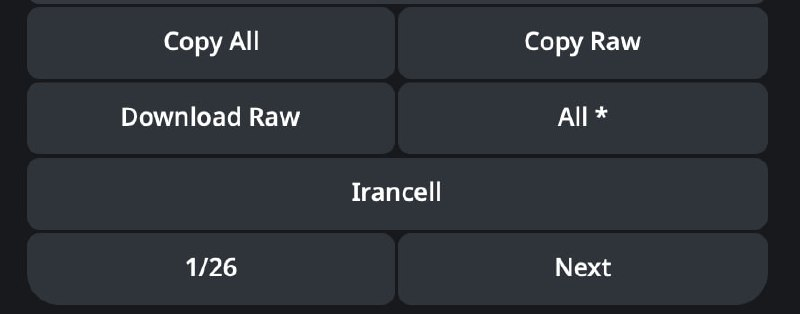

امکان دانلود کل ریزالور ها به ربات @dns_resolvers_bot اضافه شد

@WhiteDNS

## purnet — post 15252

اختلال تو ترکیبی
سایفون و دی ان اس ربطی ب نسخه جدید نداره
بهتره لوکیشن مشخص کنین.
این اختلال قبلا هم افتاده بود

✅✅✅نسخه جدید purvpn 13

https://punkpaste.ir/f/PurVpn-122946-4sv0mv

ممنون از کاربر با عکس پروفایل رضا شاه که زحمت اپلود و کشیدن

## archivetell — post 4819

دوستان ، تغییر نتلیفای کسایی که قطع شدن
نمیدونم با این تغییر چقدر دووم داشته باشه من که فعلا وصلم.

یه تغییری باید سمت سرور و کلاینت بدید
اگه سرور ندارید صبر کنید صاحب سرور انجام بده خبر بده

سمت سرور :
اگه پنل ثنایی دارید ، قسمت inbound
یه فیلد هست نوشته
padding bytes :
و خالیه شما بکنیدش 1-1
اینجوری میشه :

padding bytes : 1-1

اگرم xray دستی نصب کردید و پنل ندارید باید فایل config.json ادیت کنید زیر path همینو اضاف کنید که احتمالا بلد باشه هرکی دستی نصب کرده.

حالا سمت کلاینت :
کانفیگتون رو ادیت کنید (علامت مداد)
زیر path
عنوانش نوشته Xhttp extra raw JSON...
داخلش اینو بنویسید یا اضاف کنید

{ "xPaddingBytes": "1-1" }

اگر خالی نیست هم همچین فرمتی میشه(البته من از فرمت بالا استفاده کردم این پایینی رو یکی از بچه ها فرستاده تست نکردم) :

{"headers":{"x-host":"netlify.parsashonam.sbs:444"},"xPaddingBytes":"1-1","scMaxEachPostBytes":"1000000"}

## archivetell — post 4818

نتلیفای وصل

kubernetes.io ، 50.7.5.83

65.109.34.234 ، kustomize.sigs.k8s.io

@ArchiveTell

## archivetell — post 4817

👾 لیست دانلود برنامه ها با نت ملی

1️⃣ WhiteDNS 1.1.0 (نسخه ی رسمی)

4️⃣ NekoBox v8a ● NekoBox v7a 1.4.2

7️⃣ The Feed 0.17.5

📱 Telegram(گوگل پلی) 12.7.2

📱 Telegram(رسمی) 12.7.2

📱 Telegram(Windows) 12.7.2

📱Whatsapp 2‌.26‌.17.‌72

💬Instagram v415.0.0.36.76

👑 ShiroKhorshid 2026.03.17

5️⃣ Mhrv Rs v1.9.14

📶 Npv 123

📶 V2box 5.3.4

📶 V2ray Ng 2.18

📶 V2ray Ng (Windows)

3️⃣Am tunnle(pro) 37

3️⃣Am tunnle(lite)

🕊 Slipnet 2.5.3

2️⃣ Masterdns 1.0.9

📶 Open vpn 3.71

📱 Happ 3.20.4

💻 Happ(Windows)

📶 Psiphon 462

📶 Psiphon (Windows)

8️⃣ Bd net 104

6️⃣Mahsang 15

📶 http injector 6.5.0

📶 Wireguard 1.0.20260315

## archivetell — post 4816

لینک داخلی V2rayn ویندوز

دانلود

@ArchiveTell

## archivetell — post 4815

به زودی جنگ میشه..
دارن همه راه ها رو میبندن تا دوباره فقط آیپی های وایت وصل بمونن و قیمت رو ببرن بالا

## archivetell — post 4814

جدیدترین سریال ها

https://www.nilfgaard.top

@ArchiveTell

## archivetell — post 4813

یه سری گفتن نتلیفای وصل شده دوباره ولی برای من نشده. برای دوستانی که از نتلیفای لعنتی رکب خوردن:

(شکن ظاهرا تو این قطعی نقشی نداشته ولی از کجا معلوم پشت پرده یه صحبت ریزی کرده باشن!)

یه راه حل موقت (امیدوارم آدما‌ی نتلیفای اینجا نباشن) که کانفیگ رو دوباره زنده میکنه ولی Pros and Cons خودش رو داره از این قراره: PaddingBytes رو توی کانفیگ غیر فعال کنید و کانفیگتون به کار می‌افته طبق مراحل زیر. قبل از هرچیز: من اینا رو با شکن تست کردم و جواب داد ولی شما باید خودتون اینو تست کنید. اساسا ایده‌ی xPaddingBytes برای مبارزه با DPI بوده و شاید این روش مناسب نباشه.

۱. برای سمت کلاینت v2Ray، این بخش رو به XHTTP Extra Raw Json کانفیگ اضافه کنید تا پدینگ بشه فقط یک بایت. (و بعد مطابق معمول کانفیگ رو به صورت لینک یا JSON بفرستید برای بقیه)

{ "xPaddingBytes": "1-1" }

همچنین ظاهرا ویژگی‌های ظاهری پدینگ هم قابل تغییر و رندوم کردن هست (پیش‌فرض فقط ۱۰۰ الی ۱۰۰۰ تا X). با این من راهی پیدا نکردم که پدینگ رو کامل خاموش کنه از سمت کلاینت.

۲. مهم: قاعدتا باید سمت سرور هم همین تغییر رو بدید، چون سرور Xray حداقل تا نسخه‌ی 26.3.27 حتما چک می‌کنه که کلاینت این پدینگ رو با سایز درست (که پیش فرض اندازه‌ی ۱۰۰ تا ۱۰۰۰ بایت هست) داشته باشه. دو راه پیش روی من بود، یا این تنظیم رو توی سرور عوض کنم (و از اون ور هم سایز پدینگ بشه ۱ بایت)، یا کلا سرور رو پچ کنم (و البته ظاهرا یه درخواست از طرف توسعه‌دهنده‌ها هم هست برای Xray Xhttp که الزام داشتن پدینگ از سمت سرور برای کلاینت رو حذف کنه).

من سرور رو پچ کردم چرا که می‌خواستم رفتار سرور عوض نشه (و نتلیفای حداقل هنوز رفتار سرور براش مهم نیست یعنی پدینگ‌های از سمت سرور رو کاری نداره)، شما می‌تونید تلاش کنید که xPaddingBytes رو توی تنظیمات سرور بذارید "1-1" مشابه کلاینت (من با پنل ثنایی و اینا کار نکردم، یحتمل از اونجا هم میشه این تنظیم رو داد).

اگر می‌خواید مثل من پچ کنید، مشابه تغییر branch پایین (نه main) بیلد کنید برای لینوکس یا غیره و باینری رو جایگزین کنید (فورک از ورژن 26.3.27). بیلد کار پنج دیقس، از AI بپرسید.
🔹 به هیچ وجه باینری از کسی نگیرید! خودتون بیلد کنید.
https://github.com/Sprimesson/Xray-core/tree/feature/no-xpadding-checks

اگر میخواید پچ نکنید و بجاش کانفیگ سرور رو با کلاینت یکی کنید (من تست نکردم) باید ذیل xhttpSettings توی config.json همین اضافه شه مثلا:

"xhttpSettings": {
"path": "/s1",
"xPaddingBytes": "1-1"
}

۳. یه موضوع دیگه که من به نظرم مهمه: من کانفیگ‌هام دو تا نسخه داره Normal و Slow. توی Slow، تاخیر توی ارسال POST اضافه کردم و این باعث میشه پینگ کانفیگ بره بالا ولی روی سرعت آپلود تاثیر ملموسی نداره (برای دانلود هم به نظر میاد فرقی نداره). استفاده از Slow باعث میشه تعداد ریکوئست به نتلیفای لعنتی (که سرگردنه وایساده و قیمت گیگی/ریکوئستی‌ش از رقباش که اونم حرومزادن و دامین فرانتینگ رو بستن بالاتره) کمتر بشه و به عبارتی اقتصادی‌تر باشه. مثال برای XHTTP Extra Raw JSON:

{
"xPaddingBytes": "1-1",
"scMaxEachPostBytes": "4000000",
"scMinPostsIntervalMs": "500-1000",
"scMaxBufferedPosts": 30,
"scStreamUpServerSecs": -1,
"xmux": {
"maxConnections": 3,
"hMaxRequestTimes": 0,
"hMaxReusableSecs": 0,
"hKeepAlivePeriod": -1
}
}

این JSON ها وارد لینک کانفیگ میشن و مشکلی نیست.

Source

## Break_The_Barriers — post 1544

پسورد فعلی ساعت ١۴ منقضی می‌شه.

## Break_The_Barriers — post 1543

  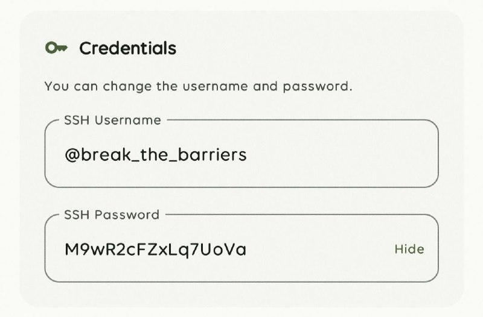

پسورد جدید جهت اتصال به کانفیگ‌های کانال

تاریخ: ٢٣ اردی‌بهشت‌ماه

بر روی علامت مداد 🖋️ کانفیگ بزنید و در انتهای تنظیمات، در بخش Credentials، پسورد را وارد کنید.

Password: R2oV7LqZxF1M9cWa

@break_the_barriers

---
📅 بروزرسانی: 1405/02/23 01:33
---

## vpn_xvpn_ch — post 391

  <a href="https://t.me/vpn_xvpn_ch/391" target="_blank">📎 Download file</a>

کانفیگ رایگان داریم ولی به دلیل سو استفاده دوستان مجددا به صورت ناسرعت پر محدود
@vpn_xvpn_ch

## saministamm — post 62716

  <a href="telegram/content/saministamm_62716_1778623425.webm" target="_blank">🎬 Download video</a>

سرعت موشک
🚀
پینگ زیر 150 
⭐
قیمت عالی گیگی 
💸 199 
💸
چنلشون
👇
@Vpn_star5
بابت ثبت سفارش به آیدی زیر پیام بدید
💥
@Star_Admin5 
✅

## saministamm — post 62715

پروکسی متصل :

https://t.me/proxy?server=194.120.230.199&port=25565&secret=dd79e344818749bd7ac519130220c25d09

## saministamm — post 62709

🚨تهران دوباره لرزید.

## saministamm — post 62702

🔴رسمی ؛ کرج هم زلزله اومده.

## saministamm — post 62701

🚨 هم اکنون زلزله تهران را لرزاند.

## saministamm — post 62700

🚨 هم اکنون زلزله تهران را لرزاند.

## saministamm — post 62699

پروکسی وصل :

tg://proxy?server=95.217.235.33&port=443&secret=dd104462821249bd7ac519130220c25d09

## saministamm — post 62698

ترکیبی وصله :
vless://f0cfea8e-afc8-411c-9879-860f8a5203c7@varzesh3.com:80?path=%2F&security=none&encryption=none&host=proto.helexm.ir&type=ws#%40saministamm

## saministamm — post 62696

🚨 صداوسیما:
الوعده وفا؛ داریم اینترنت اونایی که کسب‌وکار دارن یا تو فضای مجازی فعالیت می‌کنن رو وصل می‌کنیم(بهشون سیم‌کارت پرو میدن) که برن عشق کنن.

## saministamm — post 62695

ترکیب کنید وصله عشقا :

vless://272d7c53-64f9-4eee-a7d3-4616d15ebd78@www.varzesh3.com:2082?path=%2F&security=&encryption=none&host=server1.mizbanertebatfarda.ir&type=ws#saministamm%20Time%205G%20%F0%9F%87%AB%F0%9F%87%AE

@saministamm 
✅

## saministamm — post 62688

پروکسی متصل :

tg://proxy?server=62.238.27.70&port=443&secret=dd104462821249bd7ac519130220c25d09

## saministamm — post 62687

ترکیبی متصل :
vless://7ed47b2b-3654-436e-8b34-7bdf03854164@aparatrat1.info:2083?security=&encryption=none&headerType=&type=tcp#saministamm

## Skyportall — post 10637

  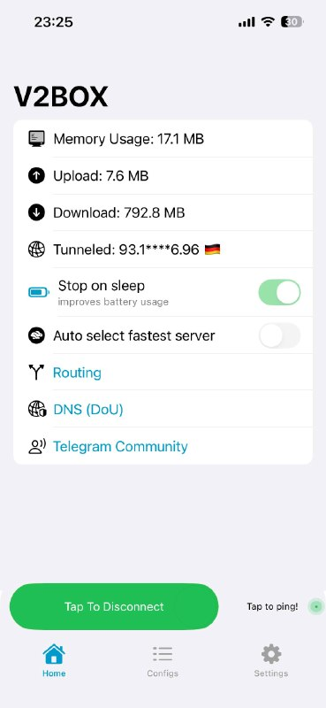

کانفیگ یکی مونده به آخر که نوشتی قطعه ، همچنان دارم استفاده میکنمش ✌🏻 دمت گرم ♥️

## Skyportall — post 10636

  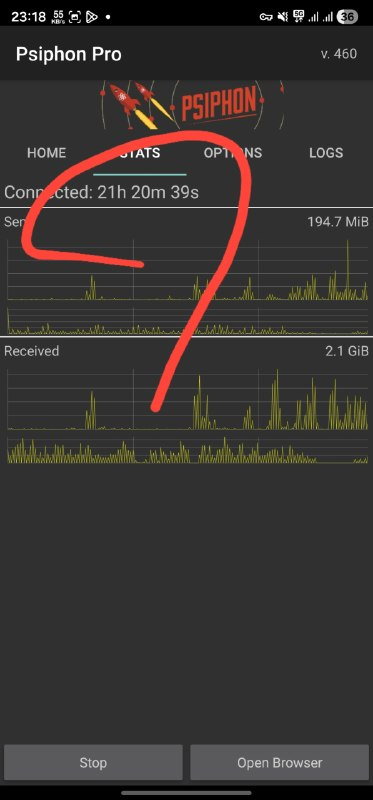

دمت‌ گرم‌ هنوز وصله

## Skyportall — post 10627

تا الان وصل بود

## Skyportall — post 10626

  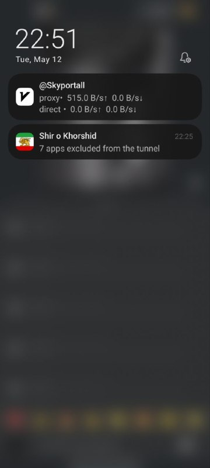

📷 Photo

## Skyportall — post 10625

  <a href="telegram/content/Skyportall_10625_1778623428.webm" target="_blank">🎬 Download video</a>

نمیدونم این مدت اینستاگرام سر زدید یا نه ولی بشدت خرید، فروش و داشتن سیمکارت پرو داره توش عادی سازی میشه. بمیرید دیگه

## Skyportall — post 10624

نمیدونم این مدت اینستاگرام سر زدید یا نه ولی بشدت خرید، فروش و داشتن سیمکارت پرو داره توش عادی سازی میشه.
بمیرید دیگه

## Skyportall — post 10623

vless://c597953b-c891-df7e-1cba-fbb3c9353a11@snapp.ir:443?path=%2F&security=tls&alpn=h2%2Chttp%2F1.1&encryption=none&insecure=1&fp=chrome&type=ws&allowInsecure=1&sni=main.fasrgobar.ir#%40Skyportall

⚡️ @Skyportall

## Skyportall — post 10622

  <a href="telegram/content/Skyportall_10622_1778623428.webm" target="_blank">🎬 Download video</a>

vless://51c399b9-f103-1965-c7bd-914a08d34dfc@snapp.ir:443?path=%2F&security=tls&alpn=h2%2Chttp%2F1.1&encryption=none&insecure=1&fp=chrome&type=ws&allowInsecure=1&sni=main.fasrgobar.ir#%40Skyportall
وصله
✅

⚡️ @Skyportall
قطع شد
😭

## Skyportall — post 10621

vless://7c85ea94-c75b-46e4-a3c9-e39a9791a33b@cdn4.yazdfa.ir:8080?path=%2F&security=none&encryption=none&type=ws#%40Skyportall

ترکیبی هم میشه زد
✅

قطع شد
🤓

## hamedvpns — post 18810

  

اپ متن‌باز و رایگان TunnelX برای زمانی ساخته شده که کاربر نمیخواد تمام ترافیک در سیستم‌عامل ویندوز از VPN عبور کنه.

با این برنامه میشه فقط برنامه‌هایی مثل مرورگر، تلگرام ، ابزارهای توسعه یا برنامه‌های مشخص دیگه رو وارد تانل کرد و بقیه ترافیک سیستم رو روی اینترنت عادی نگه داشت.

👉 github.com/MaxiFan/TunnelX/releases/latest

🔗 ᴡᴇʙꜱɪᴛᴇ • ᴠᴘɴʜᴜʙ • ɢɪᴛʜᴜʙᴍɪʀʀᴏʀ
@ircfspace

لینک دانلود داخلی :
https://uplod.ir/tqiyspcuyy0y/TunnelX-v1.2.24-standalone-compressed.exe.htm

رمز عبور : hamedvpns 👉👉
بعد از دانلود تغییر نام بزنید و از آخر نام فایل حرف .htm را حذف کنید .

❤️اشتراک‌گذاری یادتون نره🌈
..
‌‌@hamedvpns ☑️

لایک   |   Like 👍❤️
اشتراک بزارین   |   Share ⭐

## ConfigWireguard — post 31684

NekoBox PC  v5.11.14
بروزرسانی جدید کلاینت نکوباکس برای دسکتاپ
https://github.com/qr243vbi/nekobox
📥 لینک دانلود داخلی
💻 nekobox-5.11.14-windows-arm64-installer.exe 43.9 MB
💻 nekobox-5.11.14-windows64-installer.exe 47.3 MB
💻 nekobox-5.11.14-windows32-installer.exe 37.2 MB
@ConfigWireguard

## Zel2oVPN — post 2740

✅VayDNS [S112]

slipnet-enc://Afa5+JLHEKTQgzD86s05EkNQAAJ1srGkpoM/6qeQJt2ddHU30mqZ0W+rGPwxSiCMM5mKvUljDFPwU4Bt+KHEHWXiG5qU/6QYQp1NdEARankmjSklZH2abKOegWEm5C4gg1Y53shJxsS3FkgUFXFAyNGAp/86tQUL9EYkwP+bYzcD4Lqng1UFxunUFmH7urjrkg+BFFW2NTCAyih+zj2bo8aesQsjc2d/uMdNAmkBZfq7dHXOmqRXeFrilJIkPdfXDbd70Dplrw/PtZ2qnSBGQrHBwl1yijyUMVI58eOgRzP0CayqOO+WsQR4/TeuS6ewVg/lfHF+HxcJamr0YTw9rY2ypE6hmAfx8gsObsHMvxUPhGtThAdPc7mvlLkuCYTII6ws3j6VuHhbFMh4wGwym3cn33NS7qE9aSf+Qhw3dixGiRxXSG1+qawIfixm3DycainZW5EvpnQ36n7FdPhDK/brz2S62Ay/Lh+a7w1iLygM+Da7ckU2Wy74OU6GT0S63SHF0PwE2PV2c08GgqHycOmUN/m31TUYoKZOkTAYBn3skTZtaw6P5ouwqrvgg6gTWQxq0WdwCVaM4h+abbNM/lE6nP1GJND/wVm1ddDPAtnJNsUcfyfBGrt/+omr0ou2PkvgplQrCCl/ESgiyiE+83PaLsH0Nz2BrOvxVK+By9WT/N4jYQhCA8MHn1I1vIYRUYR7ZK43zJvmD/sFHkcFc5AG9rmNwuWSqym1Wkb5NEmiw4G1IdvAfNkViyYXguqLWVD5S8vRgadpqfYIFbNYwxM=

📱کانفیگ اسلیپ

📱مخصوص نسخه جدید  2.5.3

📱دانلود نسخه جدید

📱تنظیمات پیشنهادی

https://t.me/socks?server=127.0.0.1&port=10880&user=%40Zel2oVPN

☑➜@Zel2oVPN

## Zel2oVPN — post 2739

✅DNSTT [S111]

slipnet-enc://Aae0nR20CytmyoHCZuBnuxzf8FW5Iz2pEFZwo/SW2u9+2yqDNoIRGtd2Xbe/jGyEGK1GLdkbmC/6IZPNF9pe1v5Z6QAmOQCYAhwi/VHUGUjJ1vKvpiBD8RQLEA5eURrw4jP/YJwiLDmbs6+G0oEQJStoqu2i1g0C+k6WF2GeKIJGHdo3sH+KpUI8CEMdiCV3owosEj10KZXQ2SseWVXJzqaEuavE6ewijXFeSkHaLWMHIGmwaf50P8NylJu3RvPkM/Xw+Ei6FsE/sVCGuykYJz1hg/JERd+Y4db0EO8VJioLTPhHMUxKlFQvpdvO5girZ0a9NoAgkx2W5m4fLgW09nJNq/tBl5gqcekI5dyLES4lvtXKiXGJwIxY1cizWWSKVBlPiBL5YfQWaWrn/VerAXheJC7QCGyzZ2fypA3QPO4xwpIzlAnFOfSXqqYEOgCccBt26eDBOAUzDtVGu2ofUnj+A8ifDjCVv8414lnvxii9aYRKUu/u49yvrRb2nuAYqQf3JMjPUQdSMAkSZDTgkeDztGYttzAgkdhzVgk4YNgXtaNs0aMbuyD/xOYXBg1Z/7vGW+QNyYWU/h+cc+1G6SfSNHd4GhkBlMrSWrj966dgLseh1k6c2YwtA0PplCGJ8CvEvCCqhnqGap+jhfF0mgdaV7SnTr9TCoptuovRzyto7H40RlLDusjuFFYhzE/oNGAF1eF1fkhPb7E46lk7f1g/UM5w9/D6yt2/lC9/ajSnse7ja+WO+DnYRX7kHIiceRaygii1DdMjxvYjxDV4rnYYxvJDyfeiS2NnuI//+pA=

📱کانفیگ اسلیپ

📱مخصوص نسخه جدید  2.5.3

📱دانلود نسخه جدید

📱تنظیمات پیشنهادی

https://t.me/socks?server=127.0.0.1&port=10880&user=%40Zel2oVPN

☑➜@Zel2oVPN

## mirzapanel — post 1311

موشک بهتر بود این اپدیت بدرد نمیخوره😁

## mirzapanel — post 1310

خواهیم دید چه میشود ( سونامی ).

## mirzapanel — post 1309

خواهیم دید چه میشود ( سونامی ).

## mirzapanel — post 1308

دقایقی پیش زمین‌لرزه‌ای تهران را لرزاند خدا داره با همه چی ما رو تست میکنه دیگه 😁

## mirzapanel — post 1307

دقایقی پیش زمین‌لرزه‌ای تهران را لرزاند

خدا داره با همه چی ما رو تست میکنه دیگه 😁

## erfanandroid — post 88593

نترسید خبری نیست
یه عطسه ریز بوده زلزله در حد استرس نبوده

@erfanandroid

## Spotify_Porteghali — post 12356

یه سری از عزیزان پیام داده بودند که خیلی از پست هایی که میزارید اکثرا رویِ اندروید قابل استفاده هستند و برنامه هاشون برای آیفون نیست .
برایِ همین در صورتی که امکانش باشه و مشکلی پیش نیاد ، سعی می‌کنیم در شب هایِ آینده ، یه سری چالش تویِ کانال بزاریم و هر شب به چند نفر کانفیگِ شخصی بدیم .

لینک هایِ برنامه هارو هم فردا آپدیت می‌کنم و خدمتتون میزارم 🙏🏻❤️

## NamazVPN — post 35469

─────────── VLESS ───────────

🔗 vless://11dc69cb-59c1-483e-ac8d-f9132158c04e@snapp.ir:8080?path=%2F&security=&encryption=none&host=sayanstoree.tel.goleij.ir&type=ws#Unknown%20%7C%20%F0%9F%8C%90%20IP%3A%20N%2FA%20%7C%20%E2%8F%B3ping%3A2257.17ms%20%7C%20%F0%9F%93%A2%20%40NamazVPN

📍
⏱️ 2257.17ms

📢 @NamazVPN

## NamazVPN — post 35468

─────────── VLESS ───────────

🔗 vless://799f939b-964b-4416-84ac-18a6ace7fe70@camp.nahidapp.com:443?encryption=none&type=ws&security=tls&path=%2FIF_VPN_Bot&host=camp.nahidapp.com&sni=camp.nahidapp.com&allowInsecure=0#Unknown%20%7C%20%F0%9F%8C%90%20IP%3A%20N%2FA%20%7C%20%E2%8F%B3ping%3A4744.97ms%20%7C%20%F0%9F%93%A2%20%40NamazVPN

📍
⏱️ 4744.97ms

📢 @NamazVPN

## NamazVPN — post 35467

─────────── VLESS ───────────

🔗 vless://310c5497-a397-4027-a125-6fdd19b6dbb0@13.249.2.122:443?path=%2Fws&security=tls&encryption=none&insecure=1&host=d2px6pq37f3xn3.cloudfront.net&fp=chrome&type=ws&allowInsecure=1&sni=13.249.2.122#Unknown%20%7C%20%F0%9F%8C%90%20IP%3A%20N%2FA%20%7C%20%E2%8F%B3ping%3A1909.92ms%20%7C%20%F0%9F%93%A2%20%40NamazVPN

📍
⏱️ 1909.92ms

📢 @NamazVPN

## NamazVPN — post 35466

─────────── VLESS ───────────

🔗 vless://b19ae83e-dbd0-4903-8360-742a4ddf3239@185.24.253.108:443?security=tls&type=xhttp&headerType=&path=&host=cdn.gapfilm.org&mode=auto&extra=%7B%22scMaxEachPostBytes%22%3A+1000000%2C+%22scMaxConcurrentPosts%22%3A+100%2C+%22scMinPostsIntervalMs%22%3A+30%2C+%22xPaddingBytes%22%3A+%22100-1000%22%2C+%22noGRPCHeader%22%3A+false%7D&sni=cdn.gapfilm.org&fp=chrome&pcs=610792abc1380f3fe53381ed3ba0c1a6a71a893755106d729b9ررز#Unknown%20%7C%20%F0%9F%8C%90%20IP%3A%20N%2FA%20%7C%20%E2%8F%B3ping%3A8790.16ms%20%7C%20%F0%9F%93%A2%20%40NamazVPN

📍
⏱️ 8790.16ms

📢 @NamazVPN

## NamazVPN — post 35465

─────────── VLESS ───────────

🔗 vless://b19ae83e-dbd0-4903-8360-742a4ddf3239@185.24.253.108:443?security=tls&type=xhttp&headerType=&path=&host=cdn.gapfilm.org&mode=auto&extra=%7B%22scMaxEachPostBytes%22%3A+1000000%2C+%22scMaxConcurrentPosts%22%3A+100%2C+%22scMinPostsIntervalMs%22%3A+30%2C+%22xPaddingBytes%22%3A+%22100-1000%22%2C+%22noGRPCHeader%22%3A+false%7D&sni=cdn.gapfilm.org&fp=chrome&pcs=610792abc1380f3fe53381ed3ba0c1a6a71a893755106d729b9ررز#Unknown%20%7C%20%F0%9F%8C%90%20IP%3A%20N%2FA%20%7C%20%E2%8F%B3ping%3A8757.65ms%20%7C%20%F0%9F%93%A2%20%40NamazVPN

📍
⏱️ 8757.65ms

📢 @NamazVPN

## NamazVPN — post 35464

─────────── VLESS ───────────

🔗 vless://1f67e7b4-30e7-4dfb-a34c-1e7e92cd77d8@62.60.185.15:443?type=tcp&encryption=none&security=none#%F0%9F%87%B9%F0%9F%87%B7T%C3%BCrkiye%2C%20Istanbul%20%7C%20%F0%9F%8C%90%20IP%3A%20213.142.149.81%20%7C%20%E2%8F%B3ping%3A4588.73ms%20%7C%20%F0%9F%93%A2%20%40NamazVPN

📍 🇹🇷 Türkiye, Istanbul
⏱️ 4588.73ms

📢 @NamazVPN

## NamazVPN — post 35463

─────────── VLESS ───────────

🔗 vless://1f67e7b4-30e7-4dfb-a34c-1e7e92cd77d8@62.60.185.15:443?type=tcp&encryption=none&security=none#%F0%9F%87%B9%F0%9F%87%B7T%C3%BCrkiye%2C%20Istanbul%20%7C%20%F0%9F%8C%90%20IP%3A%20213.142.149.81%20%7C%20%E2%8F%B3ping%3A1132.69ms%20%7C%20%F0%9F%93%A2%20%40NamazVPN

📍 🇹🇷 Türkiye, Istanbul
⏱️ 1132.69ms

📢 @NamazVPN

## NamazVPN — post 35462

─────────── VLESS ───────────

🔗 vless://1f67e7b4-30e7-4dfb-a34c-1e7e92cd77d8@62.60.185.15:443?type=tcp&encryption=none&security=none#%F0%9F%87%B9%F0%9F%87%B7T%C3%BCrkiye%2C%20Istanbul%20%7C%20%F0%9F%8C%90%20IP%3A%20213.142.149.81%20%7C%20%E2%8F%B3ping%3A880.74ms%20%7C%20%F0%9F%93%A2%20%40NamazVPN

📍 🇹🇷 Türkiye, Istanbul
⏱️ 880.74ms

📢 @NamazVPN

## NamazVPN — post 35461

─────────── VLESS ───────────

🔗 vless://f9b873a6-aa8e-4424-b0d4-1589e4d4bbcb@snapp.ir:8080?encryption=none&host=dldisk.nr2coren.ir&path=%2F&security=none&type=ws#Unknown%20%7C%20%F0%9F%8C%90%20IP%3A%20N%2FA%20%7C%20%E2%8F%B3ping%3A4814.41ms%20%7C%20%F0%9F%93%A2%20%40NamazVPN

📍
⏱️ 4814.41ms

📢 @NamazVPN

## NamazVPN — post 35460

─────────── VLESS ───────────

🔗 vless://0f72c0c3-7bcd-4e26-b75e-3e5f4b3416ea@snapp.ir:80?path=%2F&security=none&encryption=none&host=iranfuture.musicritmic.ir&type=ws#Unknown%20%7C%20%F0%9F%8C%90%20IP%3A%20N%2FA%20%7C%20%E2%8F%B3ping%3A6278.1ms%20%7C%20%F0%9F%93%A2%20%40NamazVPN

📍
⏱️ 6278.1ms

📢 @NamazVPN

## NamazVPN — post 35459

─────────── VLESS ───────────

🔗 vless://22e60128-48d5-47e0-9d6c-8eea01c9dc32@snapp.ir:80?path=%2F&security=none&encryption=none&host=iranfuture.musicritmic.ir&type=ws#Unknown%20%7C%20%F0%9F%8C%90%20IP%3A%20N%2FA%20%7C%20%E2%8F%B3ping%3A4446.27ms%20%7C%20%F0%9F%93%A2%20%40NamazVPN

📍
⏱️ 4446.27ms

📢 @NamazVPN

## NamazVPN — post 35458

─────────── VLESS ───────────

🔗 vless://22e60128-48d5-47e0-9d6c-8eea01c9dc32@snapp.ir:80?path=%2F&security=none&encryption=none&host=iranfuture.musicritmic.ir&type=ws#Unknown%20%7C%20%F0%9F%8C%90%20IP%3A%20N%2FA%20%7C%20%E2%8F%B3ping%3A3616.23ms%20%7C%20%F0%9F%93%A2%20%40NamazVPN

📍
⏱️ 3616.23ms

📢 @NamazVPN

## NamazVPN — post 35457

─────────── VLESS ───────────

🔗 vless://b0d62285-3afc-499b-890a-ed5044547b17@snapp.ir:80?encryption=none&host=iranfuture.musicritmic.ir&path=%2F&security=none&type=ws#%F0%9F%87%B8%F0%9F%87%A8Seychelles%20%7C%20%F0%9F%8C%90%20IP%3A%2045.131.214.136%20%7C%20%E2%8F%B3ping%3A5236.17ms%20%7C%20%F0%9F%93%A2%20%40NamazVPN

📍 🇸🇨 Seychelles
⏱️ 5236.17ms

📢 @NamazVPN

## NamazVPN — post 35456

─────────── VLESS ───────────

🔗 vless://32643935-3061-4639-a131-663135643430@185.143.234.15:80?path=%2Fl%2Fw%2FaXD2QyDdS6vRQpxs%3Fed%3D2047&security=&encryption=none&host=dl.tgmovie.bond&type=ws#Unknown%20%7C%20%F0%9F%8C%90%20IP%3A%20N%2FA%20%7C%20%E2%8F%B3ping%3A4219.02ms%20%7C%20%F0%9F%93%A2%20%40NamazVPN

📍
⏱️ 4219.02ms

📢 @NamazVPN

## NamazVPN — post 35455

─────────── VLESS ───────────

🔗 vless://39356264-3535-4137-a435-356265356235@185.143.234.16:80?path=%2Fl%2Fw%2FaXD2QyDdS6vRQpxs%3Fed%3D2047&security=&encryption=none&host=dl.tgmovie.bond&type=ws#%F0%9F%87%AD%F0%9F%87%BAHungary%20%7C%20%F0%9F%8C%90%20IP%3A%2087.229.100.130%20%7C%20%E2%8F%B3ping%3A2097.57ms%20%7C%20%F0%9F%93%A2%20%40NamazVPN

📍 🇭🇺 Hungary
⏱️ 2097.57ms

📢 @NamazVPN

## NamazVPN — post 35454

─────────── VLESS ───────────

🔗 vless://cf2becd1-17ee-4531-932e-93f397a5920f@snapp.ir:80?security=none&allowInsecure=0&encryption=none&type=ws&host=1.jojo.avenflow.ir&path=/?ed%3D2080#%F0%9F%87%A9%F0%9F%87%AAGermany%2C%20Falkenstein%20%7C%20%F0%9F%8C%90%20IP%3A%202a01%3A4f8%3Ac010%3A5511%3A%3A1%20%7C%20%E2%8F%B3ping%3A7072.08ms%20%7C%20%F0%9F%93%A2%20%40NamazVPN

📍 🇩🇪 Germany, Falkenstein
⏱️ 7072.08ms

📢 @NamazVPN

## sirhishamtradinghub — post 3676

  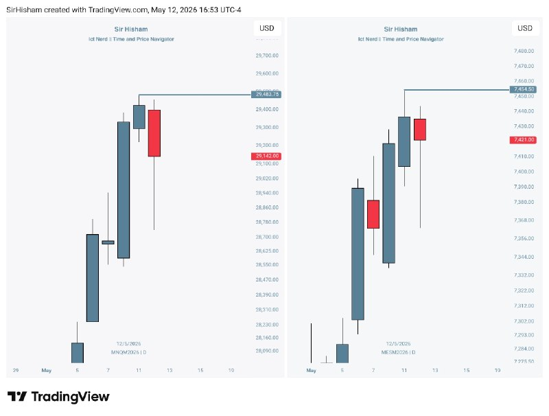

What do you expect NQ price tomorrow ? 🤔

As price candle closed anyhow like this.

But still bias is Bullish, so Any idea ?💡 👀

Still bullish 👍

Bearish 👎

## ggtech93 — post 740

  <a href="https://t.me/ggtech93/740" target="_blank">📎 Download file</a>

📎 Document

## ggtech93 — post 739

  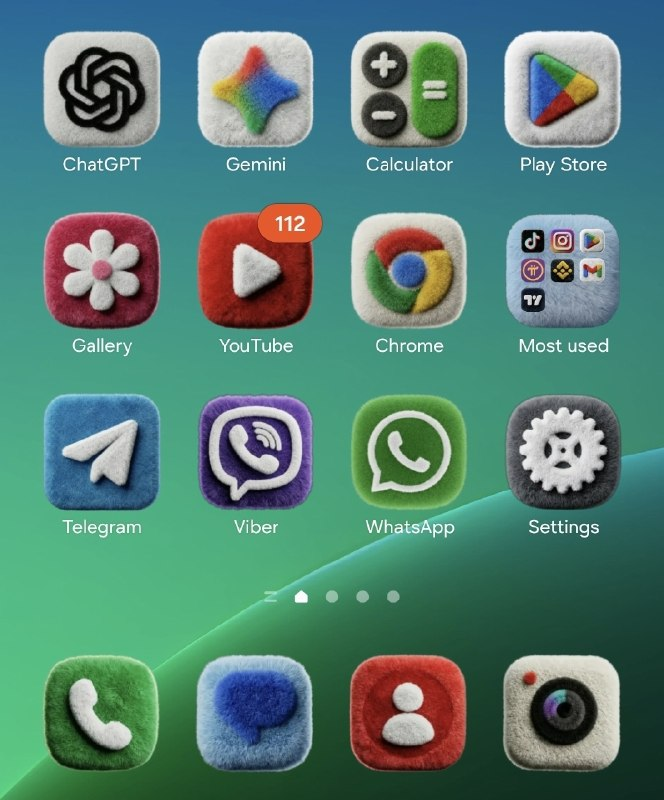

Fluffy 3D icon pack
Latest version (patched). ⬇️⬇️

## DigiGozar — post 9189

فردا احتمال زیاد به مدت محدود پرداخت ریالی باز میشه
🔥

## DigiGozar — post 9188

فردا احتمال زیاد به مدت محدود پرداخت ریالی باز میشه
🔥

## MatinSenPaii — post 3026

  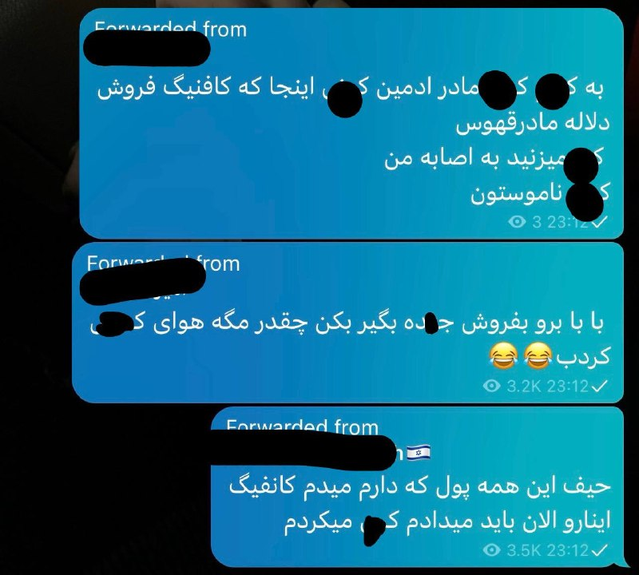

حرفی نمیمونه.من خجالت میکشم که هموطن اینام!

## MatinSenPaii — post 3022

تجربه و علم نشون داده شخصی که تجربه‌ی توجه زیاد رسانه‌ای نداره، و مطلبی رو آموزش میده یا توییتی می‌زنه و اون مطلب وایرال می‌شه، مغزش عملا دوپامین رو با هویت اشتباه میگیره. اینجا مغز فکر میکنه که خب لابد «من خاصم»، نه اینکه «محتوایی که گذاشتم خوب بود. مردم…

## MatinSenPaii — post 3021

تجربه و علم نشون داده شخصی که تجربه‌ی توجه زیاد رسانه‌ای نداره، و مطلبی رو آموزش میده یا توییتی می‌زنه و اون مطلب وایرال می‌شه، مغزش عملا دوپامین رو با هویت اشتباه میگیره. اینجا مغز فکر میکنه که خب لابد «من خاصم»، نه اینکه «محتوایی که گذاشتم خوب بود. مردم…

## archivetell — post 4811

aio‑downloader اسکریپت AIO Downloader یه ابزار متن‌باز و کاربردی برای دانلود فایل و محتوا از سرویس‌هایی مثل یوتیوب، گیت‌هاب، اینستاگرام، ایکس، تلگرام، گوگل‌پلی، تیک‌تاک، پینترست، ساندکلود و ... هست، که فرایند دانلود رو از طریق GitHub Actions انجام میده. این…

## archivetell — post 4810

aio‑downloader

اسکریپت AIO Downloader یه ابزار متن‌باز و کاربردی برای دانلود فایل و محتوا از سرویس‌هایی مثل یوتیوب، گیت‌هاب، اینستاگرام، ایکس، تلگرام، گوگل‌پلی، تیک‌تاک، پینترست، ساندکلود و ... هست، که فرایند دانلود رو از طریق GitHub Actions انجام میده.
این ابزار طوری طراحی شده که در شرایط محدودیت شدید اینترنت و وایت‌لیست فعلی بتونه بسیاری از فایل‌ها و لینک‌ها رو دریافت کنه، بدون اینکه نیاز باشه سیستم یا سرور شخصی برای دانلود داشته باشین.

با توجه به اینکه این پروژه به GitHub Actions متکیه، بهتره برای استفاده ازش از اکانت اصلی گیت‌هاب استفاده نکنین و ترجیحاً یک اکانت جداگانه بسازین.
لینک پروژه:

https://github.com/ProAlit/aio-downloader

## archivetell — post 4802

  

نتلیفای بای بای @ArchiveTell

## archivetell — post 4800

تا ۱۰ روز دیگه جنگ میشه..

## archivetell — post 4798

نتلیفای بای بای

@ArchiveTell

## archivetell — post 4797

سایت های موزیک بدون فیلتر

http://toogoosh.com

https://rozmusic.com/

https://upmusics.com/category/single-tracks/

https://musics-fa.com/download-songs/

https://bir-music.com/

https://biamusic.ir/

https://mahanmusic.net/top-songs/

https://radio.biato.in/

http://Sptfy.ir

@ArchiveTell

## archivetell — post 4796

گیف : نتلیفای برگرد

## archivetell — post 4794

فیلم و سریال بدون سانسور

Movieyaab.ir

f2mux.top

www.myf2mi.top

@ArchiveTell

## archivetell — post 4793

سایت داخلی برای دانلود frimware ios

https://ipsw.top/

@ArchiveTell

## archivetell — post 4792

چطوری تشخیص دهیم سرور شما اسپوف خور هست؟

روی سرور مقصدت بزن
tcpdump icmp

بعد روی سرور ایرانت بزن

iptables -t nat -A POSTROUTING -d TARGET-IP -j SNAT --to-source SPOOF-IP
ping -c 10 TARGET-IP

تارگت ایپی ایپی سرور مقصده،
اسپوف آیپی ایپی ای که سفیده میخوای اسپوفش کنی

اگه تو ترمینال سرور مقصدت پکت ها اومد و ایپی جعلی روشون بود ایرانت میتونه اسپوف بزنه اگه هیچی نیومد تو tcpdump اسپوف خور نیست.

@ArchiveTell

## archivetell — post 4791

ربات جمنای

@Gemini_PV_bot

@NewGeminiAi_bot

@ArchiveTell

## archivetell — post 4790

ربات های هوش مصنوعی همه مدل ها

@chat_llm_100_bot

@GPT4Telegrambot

@GratomicAiBOT

@GPT4_Unlimit_bot

@GPT4AgentsBot

@grok_gidbot

@ChatGPT_grok4bot

@ChatGPT_General_Bot

@Javidiran_bot

@ArchiveTell

## archivetell — post 4789

  <a href="https://t.me/archivetell/4789" target="_blank">📎 Download file</a>

🚀 دانلودر حرفه‌ای و پرسرعت یوتیوب مستقیم به گوگل درایو! (بدون مصرف حجم اینترنت) خسته شدید از سایت‌های پر از تبلیغ، قطعی‌های مکرر و محدودیت سرعت برای دانلود از یوتیوب؟ ما یک اسکریپت اختصاصی و هوشمند برای محیط Google Colab آماده کردیم که به شما اجازه میده ویدیوها،…

## Break_The_Barriers — post 1540

  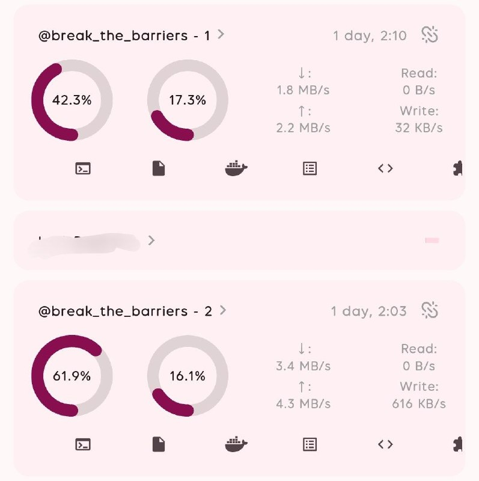

خوب وصلید ها. 
🥳

## Break_The_Barriers — post 1539

  <a href="telegram/content/Break_The_Barriers_1539_1778623435.mp4" target="_blank">🎬 Download video</a>

«ایرانی کله‌خر»

کیفیت رو خیلی آوردم پایین تا حجم کم‌تری داشته باشه، امیدوارم بتونید تماشا کنید.

از این پیج:

https://www.instagram.com/hap_thebard?igsh=MXA3ZXg5MHZpdDRwNA==

## Break_The_Barriers — post 1538

تازه من سرویس های رایگان دیگه رو هم تست میکنم از قبیل masterdns/stormdns و mhr و سایر
(البته استفاده اصلیم سرور های شما روی اسلیپ هست)
و بگم که از امروز صبح storm که داغون شده و کانفیگای پابلیک slip هم اکثرا فقط upload میدن و دانلود نمیدن (یا زیر 1 کیلوبایت) و حتی سرور های socks هم خیلیاشون همینطور شدن، ولی ssh های شما پرقدرت تر از قبل وصلن 💪 💪

## Break_The_Barriers — post 1537

گیر کردیم رو نوزده. 
🫠

## Break_The_Barriers — post 1536

برای من
روی null socks وصل هست
خیلی خوب هم جواب میده

دست به گیرنده هاتون نزنید
برای اونا که تلویزیون سیاه و سفید دارن

تیم سمت راست ایران هست که با null خیلی خوب جواب گرفته

## Break_The_Barriers — post 1535

سلام
این فاکتورها رو جدای از این‌که منطقی هست یا نه، تست کنید:
App:

MTU: 1500
MAX Channels: 64

Config:

Resolver Mode: Reliable
Query Lenght: 253
or
DNS Query Size: Fastest

این تنظیمات بر‌ای من کار کرد. نت ایرانسل

## Break_The_Barriers — post 1534

Null
Aaaa
Cname
Caa
Ns

همه وصله روی ssh و ساکس

## Break_The_Barriers — post 1533

:)))))

## Break_The_Barriers — post 1532

حاجی ناموسا دست نزن بهش، مام دست ب گیرنده نمی زنیم
با null میرم یوتوب

## Break_The_Barriers — post 1531

آیا سرورها رو مجدد ستاپ بکنم و فقط اون رکوردهایی که جواب می‌دن رو بذارم؟

دستی به سر و روی کانال بکشم. 
🤔

## Break_The_Barriers — post 1530

این فاکتورها رو جدای از این‌که منطقی هست یا نه، تست کنید:
App:

MTU: 1500
MAX Channels: 64

Config:

Resolver Mode: Reliable
Query Lenght: 253
or
DNS Query Size: Fastest

---
📅 بروزرسانی: 1405/02/22 21:10
---

## vpn_xvpn_ch — post 390

ایونت امشب تمومه چون سرور نداریم 😂

## vpn_xvpn_ch — post 389

  

خب موفق شدیم با حجم ترافیک غیر عادی سرور
و با موفقیت مسدود کنیم
😂😂

## vpn_xvpn_ch — post 388

👥 تعداد اعضای کانال : 971
📊 حجم ترافیک کلی : 275 گیگ
📊 حجم ترافیک مصرف شده : 240 گیگ
🔄 به روز رسانی بعدی ساعت 00:00

## vpn_xvpn_ch — post 387

  

ببینید وصله ولی دارید دانلود سنگین انجام میدید بقیه نمیتونن کانکت شن

## vpn_xvpn_ch — post 386

👥 تعداد اعضای کانال : 967
📊 حجم ترافیک کلی : 255 گیگ
📊 حجم ترافیک مصرف شده : 102 گیگ
🔄 به روز رسانی بعدی ساعت 23:30

## vpn_xvpn_ch — post 385

  <a href="https://t.me/vpn_xvpn_ch/385" target="_blank">📎 Download file</a>

کانفیگ رایگان داریم ولی به دلیل سو استفاده دوستان مجددا به صورت ناسرعت پر محدود
@vpn_xvpn_ch

## vpn_xvpn_ch — post 384

جدید میزارم این پرواز کرد

## vpn_xvpn_ch — post 382

👥 تعداد اعضای کانال : 957
📊 حجم ترافیک کلی : 205 گیگ
📊 حجم ترافیک مصرف شده :0 گیگ
🔄 به روز رسانی بعدی ساعت 23:00

## vpn_xvpn_ch — post 381

ایونت امشب ساعت 10:30 شروع میشه

## vpn_xvpn_ch — post 380

شبتون بخیر 🌹

## vpn_xvpn_ch — post 379

👥 تعداد اعضای کانال : 916 📊 حجم ترافیک کلی : 356 گیگ 📊 حجم ترافیک مصرف شده :360 گیگ⛔

## vpn_xvpn_ch — post 378

👥 تعداد اعضای کانال : 916
📊 حجم ترافیک کلی : 356 گیگ
📊 حجم ترافیک مصرف شده :360 گیگ⛔

## vpn_xvpn_ch — post 377

دانلود سنگین نکنید بقیه هم بتونن استفاده کنند

## vpn_xvpn_ch — post 376

👥 تعداد اعضای کانال : 912
📊 حجم ترافیک کلی : 336 گیگ
📊 حجم ترافیک مصرف شده :242 گیگ
🔄 به روز رسانی بعدی ساعت 02:00

## vpn_xvpn_ch — post 375

  <a href="https://t.me/vpn_xvpn_ch/375" target="_blank">📎 Download file</a>

کانفیگ رایگان داریم ولی به دلیل سو استفاده دوستان مجددا به صورت ناسرعت پر محدود
@vpn_xvpn_ch

## vpn_xvpn_ch — post 374

کانفیگ جدید همزمان با بروز رسانی ساعت 01:30

## vpn_xvpn_ch — post 373

👥 تعداد اعضای کانال : 890
📊 حجم ترافیک کلی : 226 گیگ
📊 حجم ترافیک مصرف شده : 160 گیگ
🔄 به روز رسانی بعدی ساعت 01:00

## vpn_xvpn_ch — post 372

  <a href="https://t.me/vpn_xvpn_ch/372" target="_blank">📎 Download file</a>

کانفیگ رایگان داریم ولی به دلیل سو استفاده دوستان مجددا به صورت ناسرعت پر محدود 😂
@vpn_xvpn_ch

## vpn_xvpn_ch — post 371

🎁 @vpn_xvpn_ch.npvt

## vpn_xvpn_ch — post 370

  

نزدیک 100 مگابایت بر ثانیه دارید دانلود میکنید بعد میگین کنده 😑😂

## khosrow_v2ray — post 759

  

دوستان یک نکته راجع به این قضیه سعی کنید از تلگرام اپ استفاده نکنید چون خیلی ریکوئست می‌ده و لیمیت گوگل اسکریپتتون سریع تموم می‌شه اگر از تلگرام وب استفاده کنید خیلی بیشتر می‌شه ازش کار کشید یوتیوب و اینا هم اوکی‌ان کاملا @khosrow_v2ray

## khosrow_v2ray — post 758

درود برای متد mhr-cfw و mhr-cfw-go براتون یه سرور خارج ران کردیم که طی تست‌های خودمون سرعتش از متد Goose خیلی بالاتر و قابل تحمل‌تر بود. برای راه‌اندازی، مثل روش Goose ابتدا وارد script.google.com می‌شید و این اسکریپت رو دیپلوی می‌کنید: const AUTH_KEY =…

## khosrow_v2ray — post 757

## khosrow_v2ray — post 756

عذرخواهی می‌کنم بخاطر عجله‌ای شدن این مورد
لطفا اگر این مورد رو تست کردید بهمون فیدبک بدید که ببینیم خروجیش چطوریه
برای یوتیوب و ایکس و تلگرام وب و این‌ها باید خوب جواب بده
اگر خوب بود سرور اضافه می‌کنیم و براش آموزش مفصل‌تر می‌سازیم ❤️️️️️️️

@khosrow_v2ray

## khosrow_v2ray — post 755

  <a href="https://t.me/khosrow_v2ray/755" target="_blank">📎 Download file</a>

درود برای متد mhr-cfw و mhr-cfw-go براتون یه سرور خارج ران کردیم که طی تست‌های خودمون سرعتش از متد Goose خیلی بالاتر و قابل تحمل‌تر بود. برای راه‌اندازی، مثل روش Goose ابتدا وارد script.google.com می‌شید و این اسکریپت رو دیپلوی می‌کنید: const AUTH_KEY =…

## khosrow_v2ray — post 754

درود
برای متد mhr-cfw و mhr-cfw-go براتون یه سرور خارج ران کردیم که طی تست‌های خودمون سرعتش از متد Goose خیلی بالاتر و قابل تحمل‌تر بود.

برای راه‌اندازی، مثل روش Goose ابتدا وارد script.google.com می‌شید و این اسکریپت رو دیپلوی می‌کنید:

const AUTH_KEY = "@khosrow_v2ray";
const WORKER_URL = "http://65.109.214.96:8080";

const SKIP_HEADERS = {
host: 1, connection: 1, "content-length": 1,
"transfer-encoding": 1, "proxy-connection": 1, "proxy-authorization": 1,
};

function doPost(e) {
try {
var req = JSON.parse(e.postData.contents);
if (req.k !== AUTH_KEY) return _json({ e: "unauthorized" });

if (Array.isArray(req.q)) return _doBatch(req.q);
return _doSingle(req);

} catch (err) {
return _json({ e: String(err) });
}
}

function _doSingle(req) {
if (!req.u || typeof req.u !== "string" || !req.u.match(/^https?:\/\//i)) {
return _json({ e: "bad url" });
}

var payload = _buildWorkerPayload(req);

var resp = UrlFetchApp.fetch(WORKER_URL, {
method: "post",
contentType: "application/json",
payload: JSON.stringify(payload),
muteHttpExceptions: true,
followRedirects: true
});

try {
return _json(JSON.parse(resp.getContentText()));
} catch (e) {
return _json({ e: "invalid worker response", raw: resp.getContentText() });
}
}

function _doBatch(items) {
var fetchArgs = [];
var errorMap = {};

for (var i = 0; i < items.length; i++) {
var item = items[i];

if (!item.u || typeof item.u !== "string" || !item.u.match(/^https?:\/\//i)) {
errorMap[i] = "bad url";
continue;
}

var payload = _buildWorkerPayload(item);

fetchArgs.push({
_i: i,
_o: {
url: WORKER_URL,
method: "post",
contentType: "application/json",
payload: JSON.stringify(payload),
muteHttpExceptions: true,
followRedirects: true
}
});
}

var responses = [];
if (fetchArgs.length > 0) {
responses = UrlFetchApp.fetchAll(fetchArgs.map(function(x) { return x._o; }));
}

var results = [];
var rIdx = 0;

for (var i = 0; i < items.length; i++) {
if (errorMap.hasOwnProperty(i)) {
results.push({ e: errorMap[i] });
} else {
var resp = responses[rIdx++];
try {
results.push(JSON.parse(resp.getContentText()));
} catch (e) {
results.push({ e: "invalid worker response", raw: resp.getContentText() });
}
}
}

return _json({ q: results });
}

function _buildWorkerPayload(req) {
var headers = {};

if (req.h && typeof req.h === "object") {
for (var k in req.h) {
if (req.h.hasOwnProperty(k) && !SKIP_HEADERS[k.toLowerCase()]) {
headers[k] = req.h[k];
}
}
}

return {
u: req.u,
m: (req.m || "GET").toUpperCase(),
h: headers,
b: req.b || null,
ct: req.ct || null,
r: req.r !== false
};
}

function doGet(e) {
return HtmlService.createHtmlOutput(
"<!DOCTYPE html><html><head><title>My App</title></head>" +
'<body style="font-family:sans-serif;max-width:600px;margin:40px auto">' +
"<h1>Relay Active</h1>
Cloudflare Worker routing enabled.
" +
"</body></html>"
);
}

function _json(obj) {
return ContentService
.createTextOutput(JSON.stringify(obj))
.setMimeType(ContentService.MimeType.JSON);
}

بعد وارد فایل json تنظیمات mhr-cfw یا mhr-cfw-go می‌شید و اسکریپت آی‌دیتون رو ست می‌کنید
بعد داخل هر اپ v2rayای دارید اضافه می‌کنید پروکسیش رو سیستم پراکسی می‌کنید و رمز auth key رو برابر با آی‌دی کانال می‌ذارید

@khosrow_v2ray

و وارد یوتیوب، تلگرام وب، توییتر (ایکس) یا وبسایت‌های دیگه می‌شید
تا چند دقیقه دیگه یک ویدیو مختصر براش می‌ذارم

@khosrow_v2ray

## khosrow_v2ray — post 753

برای متد Goose، یه سرور خارج براتون ران کردیم که بتونید فقط با دیپلوی کردن اسکریپت روی گوگل اسکریپتز، متصل بشید صرفا وارد script.google.com بشید و این رو دیپلوی کنید: const RELAY_URL = 'http://65.109.214.96:8443/tunnel'; function doPost(e) { bumpInvocationCount_();…

## khosrow_v2ray — post 752

  <a href="telegram/content/khosrow_v2ray_752_1778607647.mp4" target="_blank">🎬 Download video</a>

برای متد Goose، یه سرور خارج براتون ران کردیم که بتونید فقط با دیپلوی کردن اسکریپت روی گوگل اسکریپتز، متصل بشید صرفا وارد script.google.com بشید و این رو دیپلوی کنید: const RELAY_URL = 'http://65.109.214.96:8443/tunnel'; function doPost(e) { bumpInvocationCount_();…

## khosrow_v2ray — post 751

لطفا تست کنید و نتیجه رو بهمون بگید
اگر اوکی باشه، چندتا سرور خارجی دیگه هم اد می‌کنیم ❤️️️

@khosrow_v2ray

## khosrow_v2ray — post 750

ویندوز:
https://guardnet.ir/f/4a8c7f607701
لینوکس:
https://guardnet.ir/f/9aa54edf7817
مک:
https://guardnet.ir/f/547feaf5174a

@khosrow_v2ray

## khosrow_v2ray — post 747

  <a href="https://t.me/khosrow_v2ray/747" target="_blank">📎 Download file</a>

کلاینت‌های Goose برای ویندوز، لینوکس و مک‌ (سری M)

@khosrow_v2ray

## khosrow_v2ray — post 746

برای متد Goose، یه سرور خارج براتون ران کردیم که بتونید فقط با دیپلوی کردن اسکریپت روی گوگل اسکریپتز، متصل بشید
صرفا وارد script.google.com بشید و این رو دیپلوی کنید:

const RELAY_URL = 'http://65.109.214.96:8443/tunnel';

function doPost(e) {
bumpInvocationCount_();
const payload = (e && e.postData && e.postData.contents) || '';
const resp = UrlFetchApp.fetch(RELAY_URL, {
method: 'post',
contentType: 'text/plain',
payload: payload,
muteHttpExceptions: true,
followRedirects: false,
deadline: 30,
});
return ContentService
.createTextOutput(resp.getContentText())
.setMimeType(ContentService.MimeType.TEXT);
}

function doGet() {
const props = PropertiesService.getScriptProperties();
const today = pacificDateKey_();
const count = parseInt(props.getProperty('count_' + today) || '0', 10);
const out = { ok: true, date: today, count: count };
return ContentService
.createTextOutput(JSON.stringify(out))
.setMimeType(ContentService.MimeType.JSON);
}

function pacificDateKey_() {
return Utilities.formatDate(new Date(), 'America/Los_Angeles', 'yyyy-MM-dd');
}

function bumpInvocationCount_() {
try {
const props = PropertiesService.getScriptProperties();
const today = pacificDateKey_();
const key = 'count_' + today;
const raw = props.getProperty(key);
if (raw === null) {
pruneStaleCounts_(props, today);
}
const cur = raw === null ? 0 : parseInt(raw, 10);
props.setProperty(key, String(cur + 1));
} catch (err) {
}
}

function pruneStaleCounts_(props, today) {
const keys = props.getKeys();
const keep = 'count_' + today;
for (let i = 0; i < keys.length; i++) {
const k = keys[i];
if (k.indexOf('count_') === 0 && k !== keep) {
props.deleteProperty(k);
}
}
}

و بعد فایل کلاینت Goose مربوط به سیستم عاملتون رو دانلود کنید، اکسترکت کنید، یه فایل به نام client_config.json بسازید و بعد این رو بندازید توش:

{
"debug_timing": false,
"socks_host": "127.0.0.1",
"socks_port": 1080,
"google_host": "216.239.38.120",
"sni": ["www.google.com", "mail.google.com", "accounts.google.com"],
"script_keys": [
"PUT_YOUR_SCRIPT_ID_HERE"
],
"tunnel_key": "89a4d4fff740c82077fa205a15b145c93bd559ee39d5e4910b35968433b0498d"
}

صرفا script key خودتون که دیپلوی کردید رو بندازید توش

بعد روی کلاینت v2rayای که دارید این پراکسی ساکس رو اد می‌کنید:

socks5://127.0.0.1:1080

سیستم پراکسی می‌کنید و در نهایت وارد https://myip.ms می‌شید و آی‌پیتون باید آلمان شده باشه

@khosrow_v2ray

## khosrow_v2ray — post 744

  

Goose–Relay–VPN.pdf

## khosrow_v2ray — post 743

این هم ویدئوی آموزشیش:
https://t.me/iaghapour/2563

## khosrow_v2ray — post 741

  <a href="https://t.me/khosrow_v2ray/741" target="_blank">📎 Download file</a>

آموزش کامل
متود Goose–Relay–VPN
بصورت PDF
سرعت: بهتر از MHRV
حجم: مشابه MHRV
پیش‌نیاز: نیاز به سرور خارج دارد،
اما نیازی به MITM و سرتیفیکیت ندارد.
گیتهاب پروژه:
https://github.com/Kianmhz/GooseRelayVPN

## khosrow_v2ray — post 740

آموزش دانلود ویدیوهای یوتیوب و همچنین فایل بدون محدودیت حجم با استفاده از sandbox در گیت‌هاب نکته: برای اینکه بتونید از این استفاده کنید باید روی اینترنتتون گیت‌هاب باز باشه که الان روی اکثر اینترنت‌ها باز و اوکی هست استفاده از این روش خیلی ساده هست ریپو:…

## khosrow_v2ray — post 739

آموزش دانلود ویدیوهای یوتیوب و همچنین فایل بدون محدودیت حجم با استفاده از sandbox در گیت‌هاب نکته: برای اینکه بتونید از این استفاده کنید باید روی اینترنتتون گیت‌هاب باز باشه که الان روی اکثر اینترنت‌ها باز و اوکی هست استفاده از این روش خیلی ساده هست ریپو:…

## xsfilterrnet — post 3414

  

IRCF | اینترنت آزاد برای همه (Twitter/X)

🍷اپ متن‌باز و #رایگان TunnelX برای زمانی ساخته شده که کاربر نمیخواد تمام ترافیک در سیستم‌عامل ویندوز از VPN عبور کنه. با این برنامه میشه فقط برنامه‌هایی مثل مرورگر، تلگرام، ابزارهای توسعه یا برنامه‌های مشخص دیگه رو وارد تانل کرد و بقیه ترافیک سیستم رو روی اینترنت عادی نگه داشت.

لینک پروژه:
⚡️
http://github.com/MaxiFan/TunnelX/releases/latest

@xsfilterrnet 
👑

## xsfilterrnet — post 3413

🍷aio‑downloader
🍷

اسکریپت AIO Downloader یه ابزار متن‌باز و کاربردی برای دانلود فایل و محتوا از سرویس‌هایی مثل یوتیوب، گیت‌هاب، اینستاگرام، ایکس، تلگرام، گوگل‌پلی، تیک‌تاک، پینترست، ساندکلود و ... هست، که فرایند دانلود رو از طریق GitHub Actions انجام میده.
این ابزار طوری طراحی شده که در شرایط محدودیت شدید اینترنت و وایت‌لیست فعلی بتونه بسیاری از فایل‌ها و لینک‌ها رو دریافت کنه، بدون اینکه نیاز باشه سیستم یا سرور شخصی برای دانلود داشته باشین.

با توجه به اینکه این پروژه به GitHub Actions متکیه، بهتره برای استفاده ازش از اکانت اصلی گیت‌هاب استفاده نکنین و ترجیحاً یک اکانت جداگانه بسازین.
لینک پروژه:
⚡️

https://github.com/ProAlit/aio-downloader

## xsfilterrnet — post 3412

  <a href="telegram/content/xsfilterrnet_3412_1778607649.webm" target="_blank">🎬 Download video</a>

خوشحال میشم گروه چنل رو داشته باشید رفقا
🥳
(راستی متین هم گروهش رو پاک کرده جهت اطلاع)

https://t.me/xsfilternetchat

## xsfilterrnet — post 3410

🍷MITM-DomainFronting v12

اول اینکه این متد قرار نیست کانفیگ شما را زنده کند و دسترسی کامل به اینترنت را فراهم کند بلکه باعث میشود برخی سرویسهای خاص به طور مستقیم (بدون نیاز به سرور و یا حتی ورکر) در دسترس قرار گیرند

در حال حاضر (۱۴۰۵/۱/۳۱) اجرای این متد فقط امکان دسترسی به سرویسهای گوگل (meet, drive, ...) و بعضی سایتهای پشت vercel شامل (vercel.com,...) و بعضی سایتهای پشت fastly شامل (reddit,github,cnn,...) و سایت netlify را فراهم میکند

بعضی سرویسها مانند فیلمهای یوتویوب سرویس مخصوص خود را دارند و بعضی از سرویسها مانند gemini نیز آیپی‌های ایران را تحریم کرده‌اند بنابراین تمام سرویسهای گوگل در دسترس نیستند.

به محض اینکه هر سرویس دیگری با این متد در دسترس باشد اپدیت لازم را انجام خواهم داد.

این متد بر روی ویندوز، لینوکس، مک و اندروید (بدون نیاز به روت) قابل اجراست.

///

این پروژه را ابتدا من در اینجا نوشتم و سپس با تلاشهای انجام شده در اینجا به Xray-core اضافه کردیم و یعنی اکنون میتوانید با یک کانفیگ ساده‌ی v2ray از این متد استفاده کنید.

نحوه کارکرد متد همانطور که از اسمش پیداست ابتدا هویت سرور اصلی را جعل میکند تا دیتای غیر رمز شده را از مرورگر دریافت کند سپس با یک sni جعلی آن را به سرور اصلی میفرستد.

تنظیم اولیه متد مراحل کمی طولانی دارد ولی بعد از انجام تنظیمات صرفا یک روشن/خاموش ساده برای فعال/غیرفعال کردن متد لازم است.

لینک پروژه:
⚡️
https://github.com/patterniha/MITM-DomainFronting

@xsfilterrnet 
👑

## xsfilterrnet — post 3409

🍷پروژه Twoman

برای #تانل با cPanel

توضیحات:
💡
نسخه 1.0.7 پروژه Twoman منتشر شد.

این نسخه بیشتر روی پایداری و تمیزتر شدن مسیر 1.0 تمرکز داره.

مهم‌ترین تغییر اینه که استفاده‌ی همزمان چند نفر بهتر شده. از این نسخه به بعد، نسخه‌های لینوکس، اندروید و دسکتاپ برای هر نصب یک شناسه‌ی جدا نگه می‌دارن؛ یعنی چند نفر می‌تونن یک کانفیگ مشترک رو وارد کنن، بدون اینکه اتصال همدیگه رو خراب کنن یا جای همدیگه رو بگیرن.

چند تغییر مهم دیگه:

- مشکل بالا آمدن همزمان چند کلاینت روی پورت‌های موقت بهتر شد
- وقتی سمت هاست reset اتفاق می‌افته، ارسال داده منطقی‌تر و آروم‌تر برمی‌گرده
- نسخه و اطلاعات build توی بخش‌های مختلف پروژه قابل مشاهده‌تر شده
- نصب نسخه‌ی مشخص، مثل 1.0.7، راحت‌تر شده
- تست چند کلاینت همزمان انجام شد و مشکل جایگزین شدن کلاینت‌ها دیده نشد

Twoman کم‌کم داره از یک ایده‌ی تجربی به چیزی قابل نصب‌تر، پایدارتر و نزدیک‌تر به استفاده‌ی واقعی تبدیل میشه

لینک #پروژه:
⚡️

https://github.com/ShahabSL/twoman

@ShahabSL 
💎
@xsfilterrnet 
👑

## xsfilterrnet — post 3408

  <a href="https://t.me/xsfilterrnet/3408" target="_blank">📎 Download file</a>

WhiteDNS_Resolvers.txt

## xsfilterrnet — post 3407

🍷روی برخی #اپراتور ها Quad9 متصل شده dns تست کنید رفقا
❗️

Dns:
✅
149.112.112.112
9.9.9.9

Doh:
✅
https://dns.quad9.net/dns-query

@xsfilterrnet 
👑

## xsfilterrnet — post 3406

#jadi

🍷روشی دیگه برای رسیدن به اینترنت از روی گیت‌هاب، g2ray

https://youtu.be/0KSpdd9g6g8?si=Xx6SiufNXkVZT4aR

📥 لینک دانلود داخلی۱

📥 لینک دانلود داخلی۲

## xsfilterrnet — post 3405

❗️ هم اکنون اختلال در زیرساخت فیلترنت کشور

طبق گزارش‌های کاربران، هم‌اکنون کاهش پهنای باند و #اختلال گسترده‌ای در زیرساخت اینترنت کشور رخ داده و برخی سرویس‌دهنده‌ها با قطعی یا از دسترس خارج شدن مواجه شده‌اند.

بر اساس این گزارش‌ها، سرورهای شاتل، مبین‌نت، ایرانسل و رسپینا دچار اختلال شده‌اند و همزمان بسیاری از سرویس‌ها، هاست‌ها و خدمات داخلی نیز با اختلال و کندی شدید مواجه شده‌اند.

همچنین گزارش‌ها حاکی از آن است که برخی VPNها نیز دچار اختلال شدند و یا اتصال آن‌ها به‌طور کامل قطع شده است.
-رادار

@xsfilterrnet 
👑

## xsfilterrnet — post 3404

🍷ریورس تانل
برای این روش به یه سرور خارج از ایران که به CDN داخلی دسترسی داشته باشه و یه سرور داخل ایران و یه دامنه پشت CDN داخلی نیاز دارید.

آموزش داخل ویدیو با لینک داخلی:
⚡️

https://c795577.parspack.net/c795577/v1/2026-05-08/a2171d2dfceab6115bead921067801ce.mp4

لینک اصلی ویدیو

@xsfilterrnet 
👑

## xsfilterrnet — post 3403

🍷من باینریهای کامپایل شده از نسخه مودیفای شده rclone با قابلیت domain fronting رو هم اینجا منتشر کردم. داکر ایمیجش هم هست. میتونید دانلود کنید و روی لینوکس، ویندوز و مک اجرا کنید.
لازمه توی دستوراتی که برای ارتباط با #گوگل درایو میزنید، این پارامترها رو بدید:

--fronting-enable --fronting-target google.com‎ --fronting-domains "*.google.com,*.googleapis.com,*.googleusercontent.com"

لینک پروژه:
⚡️
https://github.com/aleskxyz/rclone/releases/tag/v1.73.5-1

منبع توییتر

@xsfilterrnet 
👑

## xsfilterrnet — post 3402

  <a href="https://t.me/xsfilterrnet/3402" target="_blank">📎 Download file</a>

🍷۵۱۲ ریزالور جدید تست شده تیم WhiteDNS

مخصوص اتصال StormDNS/MasterDNS

@WhiteDNS 
💎
@xsfilterrnet 
👑

## xsfilterrnet — post 3401

🍷وایت لیست:

lh3.googleusercontent.com

برای MHR و FlowDriver و ... میتونید استفاده کنید
⚡️

منبع توییتر
آموزش های مربوطه

@xsfilterrnet 
👑

## xsfilterrnet — post 3400

  

🍷ربات آپلودر روی Raw گیت هاب!!
باید اول #پروژه رو فورک کنید
و از گیت هاب توکن بگیرید
و توکن رو با آدرس ریپو ست کنید داخل ربات تو ردمی ریپو نوشته شده
یا میتونید از AI های گرامی بپرسید توضیح میدن
❗️

فایل یا لینک بهش بدید براتون آپلود می‌کنه
بعد میتونید حتی zip با پسورد یا بدون پسورد آپلود کنید باهاش
و ویدیو های #یوتیوب هم لینک رو بدید بهش
اوکی می‌کنه
خلاصه که اگه گیت هاب اکشنی اش رو میخواهید پروژه این هست که مفورک زده شده
توضیحات ام داخل Readme هست :
github.com/nscl5/sandbox

آدرس بات پروژه:
⚡️

@RGitUpBot

سورس خود پروژه:
💡
github.com/arshiacomplus/sandbox/

@Acplus_Channel 
💎
@xsfilterrnet 
👑

## xsfilterrnet — post 3398

  

🚀 پروژه AzuDL - GC2GD

پروژه AzuDL - GC2GD یک ابزار کاربردی برای دانلود فایل‌ها از طریق Google Colab و ذخیره مستقیم آن‌ها روی Google Drive است.

💡 با این ابزار می‌تونید لینک‌های مختلف رو داخل گوگل کلب اجرا کنید و فایل نهایی رو مستقیم داخل گوگل درایو تحویل بگیرید؛ سپس با متود MHR فایل نهایی رو دریافت کنید.

قابلیت‌های اصلی پروژه:
⚡️

✔️ دانلود لینک مستقیم روی Google Drive

✔️ دانلود ویدیو و پلی‌لیست YouTube

✔️ انتخاب کیفیت ویدیو

✔️ استخراج فایل صوتی MP3

✔️ دانلود Magnet / Torrent

✔️ دانلود چندتایی یا Batch Download

✔️ تشخیص خودکار نوع لینک

✔️ نمایش نوار پیشرفت دانلود

✔️ ذخیره تاریخچه دانلودها

✔️ مدیریت فایل‌های دانلودشده


🚀 ویدیوی آموزشی پروژه در تلگرام:
https://t.me/luluch_code/22941

🔗 لینک‌های مهم:

🐱 سورس پروژه در GitHub:
https://github.com/TheGreatAzizi/AzuDL-GC2GD

👩‍💻 سورس پروژه در Git سلف‌هاست:
https://git.theazizi.ir/TheAzizi/AzuDL-GC2GD

📌 وبسایت Google Colab:
https://colab.research.google.com

📌 وبسایت Google Drive:
https://drive.google.com

🗣️ اینترنت برای همه، یا هیچ‌کس!

👑 @xsfilterrnet

🗣 @luluch_code

🏠 theazizi.ir

## xsfilterrnet — post 3396

  

💡درود به همه رفقا لطفا در این #نظرسنجی کمکم کنید برای ۳ تا ایده

⚡️ایده اول: روش های رایگان رو بیشتر جلوه بدم داخل چنل

⚡️ایده دوم:سعی بر روش رایگان و پایین آوردن قیمت فروش در کانفیگ ها کنم تا بقیه همراه من بشن(با تضمین)

⚡️ایده سوم:پروژه کانفیگ اهدایی رو شروع کنم با دونیت های شما!

رفقا لطفا ایده های خودتوت در داخل گروه یا کامنت به من بگید این کار باعث کمک کردن شما برای دسترسی بیشتر خیلی از هم میهنان خودمون میشه با سپاس از شما
🍷

#اینترنت_برای_همه_یا_هیچکس

@xsfilterrnet 
👑

## xsfilterrnet — post 3393

  

🍷اپ TeleMirror یه تلاش آزمایشی برای دریافت آخرین مطالب کانال #تلگرام خودم و سایر کانال‌های موردنظر در شرایط محدودیت شدید اینترنته، که سعی می‌کنه با چند روش مختلف پست‌ها رو بگیره و نمایش بده. این برنامه #رایگان و متن‌بازه و فعلا می‌تونه برای دنبال کردن اخبار…

## xsfilterrnet — post 3392

  <a href="https://t.me/xsfilterrnet/3392" target="_blank">📎 Download file</a>

🍷آموزش کامل و آسان متود ZYRLN–CFW
برای موبایل، بصورت PDF
سرعت: مشابه MHRV
حجم: روزانه ۲۰ + ۱۰۰ هزار ریکوئست
مزیت نسبت‌به MHR: تعداد ریکوئست بیشتر، تغییر آیپی و حل مشکل کپچا، دسترسی به تمام سایت‌ها از جمله: یوتیوب — اینستاگرام — تلگرام و هوش‌مصنوعی‌ها: گراک، کلاد و جمنای(از طریق گوگل استودیو)
پیش‌نیاز: اکانت کلادفلر، اکانت اپ اسکریپت‌ گوگل، (بدون نیاز به سرور و ترموکس و پایتون!)
ZIP Password: @TheVPNMethod
دانلود کامل آموزش PDF — فایل‌های لازم پروژه و اپ مورد نیاز پروژه با لینک داخلی:
https://punkpaste.ir/f/ZYRLN-CFW-RELAY-4l1x52
گیتهاب پروژه:
⚡️
https://github.com/ajavadinezhad/zyrln

@TheVPNMethod 
💎
@xsfilterrnet 
👑

## xsfilterrnet — post 3389

🍷‏پروژه zyrln بر پایه ایده mhr-cfw ساخته شده، با این فرق که با زبان Go بازنویسی شده و این بار کلاینت اندروید هم داره

‏اپ اندروید مثل v2rayNG کار می‌کنه. چند کانفیگ مختلف ذخیره می‌کنی و هر وقت لازم شد بینشون جابه‌جا می‌شی. نیازی به روت نیست و کل ترافیک گوشی از relay رد می‌شه

‏سرور exit رو می‌تونی روی VPS خودت اجرا کنی که آی‌پی ثابت داری که از نظر #گوگل رخواست‌های ربات حساب نمی‌شه. اگه VPS نداری Cloudflare Worker هم گزینه خوبیه

‏نسخه دسکتاپ (CLI) هم هست. مرورگر رو روش تنظیم می‌کنی و سایت‌های فیلتر شده باز می‌شن.

‏مستندات کامل داره. از راه‌اندازی Apps Script و VPS تا build کردن APK #اندروید، همه چیز مرحله به مرحله توضیح داده شده.

لینک پروژه:
⚡️
https://github.com/ajavadinezhad/zyrln

## xsfilterrnet — post 3388

  

🍷اپ TeleMirror یه تلاش آزمایشی برای دریافت آخرین مطالب کانال #تلگرام خودم و سایر کانال‌های موردنظر در شرایط محدودیت شدید اینترنته، که سعی می‌کنه با چند روش مختلف پست‌ها رو بگیره و نمایش بده.
این برنامه #رایگان و متن‌بازه و فعلا می‌تونه برای دنبال کردن اخبار تلگرامی بدون نیاز به فیلترشکن، یه گزینه موقت و کاربردی واسه دسکتاپ باشه.

لینک پروژه:
⚡️
http://github.com/ircfspace/teleMirror/releases/latest

(پخت و پز عشق ircf)

📥 لینک دانلود نت داخلی arm64

📥 لینک دانلود نت داخلی x64

@ircfspace 
💎
@xsfilterrnet 
👑

## saministamm — post 62686

Slipnet متصل :

slipnet-enc://ATxLC3CqYL2kfDSq+kM1D8cAHxXLPrzg+72kPQOEz8w1HzqWdL0B9bBPmTkufougkNY+JbAd1cKGtZ60X8RygxvwuvR39E/F/EE5tMv3eWkcSF286ewgP336p/qAtmrZzg1OtX23Q0KOR6WVGPeHSculhJkfq/sBQ6u5cIV0MkflgFkJ0cquWl+4i8Zd+UUkJqo5k2lJmuWIRB1vfQ/JW/eUq3cYkWTntRDn+Upq6m962x5gRru4/VPqfLToSvZSZsvoZqjy08M6enuhHJ9G8uGpMSy0HrMLVktEUsJfgjI6HLKC0zqK/egTlisXVBSn7M947Wxpj7UCfwYLi84Lyj8pKaEcWPbrVp7ChjP4EdpXr8xLEhAFL4VaFz/pTK9sSvjPBDoMuZOOW40nWCKqjKKnb7lq2oj25x7+Xr1UeshLwVGSsMXdZo2FNnaQO+H6lgGoW12fbwhqH/GUsN4mMnhK4co8gARBsNYjTCCe208EuWsRGz+Yl57qyL++Kxbc43NeUC/xDJVer42p4s4WD0Lf6YCvBDmKhR4+P4HYPfbiqhEZTQcRjja+AxQjG4aGRGl89YgA9KHPRONpMhOAnEaM9VNFHDXDwEluoBEIb6ZLnakWkJMC5DSPdjCGYFNmQ3mT92C1u5ce2lh2qDaeiD0mlP8i7RKoD84p56SIVdAtO12USp3XWmvTzEieTuM+2pxTm+IeRwqIeLaVwOBLAnR8VDBRDZKgbHAU0sAVjxvT2h19eYt6cN21cWBGvzWCNxTYHz4E9nB6QQTjRLph/aeC9vlFnsM94PE=

## saministamm — post 62685

پروکسی متصل :

https://t.me/proxy?server=194.120.230.199&port=25565&secret=dd79e344818749bd7ac519130220c25d09

## saministamm — post 62684

ترکیب وصل بزنید :

vless://08cd588d-8923-40fb-8216-c5a112a259b9@www.varzesh3.com:2095?path=%2Fchat%3Fed%3D128&security=&encryption=none&host=dl2.mizbanertebatfarda.ir&type=ws#saministamm

## saministamm — post 62683

ترکیبی وصله عشقا :
socks://telegram-saministamm@62.220.126.92:32302#%43%6F%6E%66%69%78%69%6F%40

## saministamm — post 62676

پروکسی وصل با صبر :

https://t.me/socks?server=62.220.126.92&port=32024

## saministamm — post 62675

ترکیبی متصل :
vless://telegram-dickiriptorbot@13.249.2.122:443?path=%2F&security=tls&encryption=none&insecure=1&host=dbw9jfe94rh28.cloudfront.net&type=ws&allowInsecure=1&sni=3.173.21.63#saministamm

## saministamm — post 62674

پروکسی متصل :

https://t.me/proxy?server=91.107.189.181&port=8443&secret=dd104462821249bd7ac519130220c25d09

## saministamm — post 62673

ویتوری + سایفون

socks://Og@185.164.72.228:7897#%DB%B7%DB%B2

@saministamm

## saministamm — post 62672

ترکیبی بزنید :
vless://f118f2ae-d298-46f6-b4cf-7f5032922c9d@out.pixserver.ir:17107?type=tcp&encryption=none&security=none#@saministamm

## saministamm — post 62671

Host: 37.32.15.207
Port: 8888

Host: 193.151.131.61
Port: 1111

Host: 45.82.136.180
Port: 22888

Host: 87.107.54.147
Port: 8888
@saministamm

## saministamm — post 62670

پروکسی متصل صبر کنید :

https://t.me/socks?server=62.220.126.92&port=32024#

## saministamm — post 62669

متصل برای WIFI :
socks://37.32.15.207:8888?type=tcp#saministamm

## saministamm — post 62668

🔴 وضعیت اینترنت‌ها بدتر شده و خیلی‌ها مجددا قطع شدن.

## saministamm — post 62667

🚨سخنگوی دولت: پس از دور شدن سایه جنگ وضعیت اینترنت به تدریج به حالت عادی تغییر می کند.

## saministamm — post 62666

ترکیب کنید وصل میشه :
vless://4b506123-3d41-4d5b-b5ae-00debe145d68@185.143.233.5:2083?encryption=none&fp=firefox&host=p1.sesrsa.com&path=%2F&security=tls&sni=sub.sesrsa.com&type=ws#saministamm

## saministamm — post 62665

ترکیبی

vless://59bc19e5-9384-45ea-99c6-0fc412975eee@adler-1g.adelshoop.net:80/?type=ws&encryption=none&flow=&path=%2F#@saministamm

@saministamm

## saministamm — post 62663

  <a href="https://t.me/saministamm/62663" target="_blank">📎 Download file</a>

با صبر زیاد وصله.
سرور نپسترنت | npv
دانلود نکنید بقیه وصل بمونن.
سرور نپسترنت متصل تست شده✅
channel : @saministamm✉️

## saministamm — post 62662

ویتوری + سایفون

vless://937dde02-4ce6-4f0d-a3be-27aef7d3ef46@s4.tehranionliine.ir:80?path=%2F&security=&encryption=none&type=ws#@saministamm

@saministamm

## saministamm — post 62661

  

🚨اینم از اینترنت پرو :

## saministamm — post 62660

SlipNet :

slipnet-enc://AVAJgxRhDQH4yWfiXDcszlxdTav5YP+g2GPNn6rKhBSNKg4WuxAdlANg1KJNafrzhs0f0i3or7Xykn1jvNEJEYTp9bGv75HZ+NnN1KaIolv0ETs8C+PrdzqmxRlJsNBKaF6hXjg0bII/7ZrthZhsV8ok00qEvuu2T56GrPhSbY5KiYoL5a+E0imMggGaeszYi9f0+YyU6ttT3gZrqYEKsx8KZeXHBxx/1qRPJ8ST0gr543eUVcDb7l0NIhGOV50n9c3AllSdh6rbBzcy0aIgQivhuy/o78oL5b8fTo6KK4WVIla+25OCziyywvU90emOjr/M/r+WExLMWoIVEVi+Uj60Okn44IcjG7drzM0RiQkqy8mjvFniY0l3FVz2tXg5UnA+Kvac9BI+6fwMWSaOoBNYq7uzJkQ9Xm44DVnHOGScnVRInD637NzxRA6PqKmYs+jsQUYU8RcjRluYTdD4q00tTGkSJLvXBBW518jlCtBUb+i8MihnSZa3hEQ7yLX0hYZLFdZh6jP4UmRDz28GPrSF6DmiPZP/XkcVwGWXLCtX3h2FRB9f9fP5006ulVkH4AHLPH57S1nh4cxdzWGwRDFp3QlOmykor2rCm1eNSuLvsSunTOq7yo5o+1GWkmbmEOIiPIv25Gf4P0+zak4LoHCsqEHq9UAYrx3GSjI6Ymgwpr7TSh4JNdlbSIo2+GDhu59rqGtS7IH/JoeEjnJCzS4dU6tBbzA+19t1V1CjauY1QjstVfl1ucMVNJZcb+R9

slipnet-enc://ARcLX2MBExkIF0qLxqwCjf3sYLkJyRNK7IP6gGsC+VcSuu4aBPn8tp6gMImP0B7X4MOblQqncXP7J5F0LTYi1H6ZDoGDTIOl4JQpOhfYztL4mNicAzvcgDfENmXJvGWk3HFaE5v+5f3kBLzb//BNQPE0LcwkB5OBLNiSiGjA3tj/NQLcitFwgmPbaM5sf/9KpYyKU65bYC8Tw3WSqU/dKev0tnPM9Mb564L9lH6AIpsDHeUoBl0hFSKUGcMFrgwgL3ErYDPcQdP3/ReUygsgzHGqc4FN6KlJxq/QJZPCC/Rg2hUFZ7hoCchL1YBXhmm/b9t81gSIhYb+xrEKBPTtqZn1jRdO+XWLLarYOvR/z8DvRECdq6VXaKMlE7CD9YhUb5Hb3HUT2w6G/nh69tG6BWUsFlVBZqE21VUY8AC58XaM25EfC4H/paXD0Hhw58rXueNfIC7kL+6jeP+J778n8b8PudlhHb/WEJ3FZv0yKXFwJ6NIaEezypGzRzOM1vlA/wgGqIDkChwPbvZJSPaCD43yYkaK3TTjTGaVSL2XhH+eZiLrRN5sTzzKayaIHsnrrTPGH9vTcKZqo7/y1V9cK6m8aZ8MVNm074sqGgbQTfPhp7n+1epqnCSGiJ1dQD93wXSKy9Iu2G04Fr7gcD1LIZTvjVsQDWzI5hSoOxnV0Ep6Tin5TnGdtSuS0ueInfJQd18=

slipnet-enc://AYXESgWejlY9x9O3dm3mUYau90VqfwdPYylQnVeMFcVOP/RSbqtUaLrnd+5CNBbBx2TQkONBWpxKA0mswoi7NxpcnixuxMRMw/AHnJzS4lPO2hwjH4aO8QaGZoV+0GnHX15obfVkyusOmbjIr9LicWOWvwNvcLc126zOdxCCyXZlQnI1QikaUG9KXEvzm7Lh9Om9UrvM4egoIDCkKfXeuuHvJbtzW+j8O/drqQqZpSvZhzbDP7k+KED4yuq+9qcFDdYLm2M0ODztG9CaYv5Rn8BUQglQK1bXjB5rT7dJf6NrOz2BkfB03/+HET8VBBacyHDRm6Mwy1uWP8HscFjsn8WmXmJ3WEwy+Q3G+fw7NWK7lDPqPwVDKvg49e/4pm7SU4w/5C8Oe6ce4qeTRZb+efoLl17kYletXR27tDaq0q7UzWjPbf545gbDC3nJVeoYs/VoZUYZGO+hs1+Bb5GOsO5OxmCNImy2FHgs1d0Ztve4gqU8G8ZsuNhLI9nGPtr4qN3EkNHN+Fctl0giiBvx5cIk9TGmyolU6kfEch6l8WQS+REeAoUNr63wSNPxIgpL17auxT/JtHJjUUoHsIEUsGbTIC8rMLhU7bWw0UZfCrtECV/xuD3+FAYH7xRBkMnyIR+0wMOKi+lqN5pQRspWzFVz

slipnet-enc://AdMjBHw0IlLJHgI19ZBkr3wtS18BSGPh9hvlBjJOHLJfvc+ds3xLrixerrLiFwAr4yYKy2tT/Co9jeCDHrzbAp1HJ0eq1ybsL+kxpGBKhImqaApodjlE2MSvigQTBIuAJv736giTh5yAA0y/yQzWubnqChwn9M0VJ+XUcnRvYBThQCLbgqxjF6aP7G/R+P99wwBN+euf63yM/bBRsrvNTKDkBEZsIF42Z53e/UpfI6zJUaP0/piKAch4t8TYJCX4SXqEV8XqAOGPph8nGw5Gd/kyo38ufrEPsPiWZ7CwEa6Rm6ukFoTmkJD6hwOjK35Pv3khN/5uiSGz/lN7bOTj3q+BmkqMg+18qPjzULU+UbfEwzqKV/0UYOKJIfQsuhTmuVrS02Ut9kBxJPnECAtiaIuFxSU/GJGNwqGFK0Q1PM48tHzSP7ATez6Osq9+/TmAoXt0Ovchf/EILf2MJhtApjk0BYUdGGmV3/dBfQdk5JPUgwL/zlOKRE/0gj3J4dmRuOJGZ7nViMrBEcwU092AoGSnWpIuCtMhNMEgEVgXEE8ng5o2NOQLASAK/oe2ypZETFn+Nl4kcmE5S7/CtPuF4YpwK3bwYvnLMmuj8q6d/8KCXdvhNJuaVwUDrHUpDteWMotIrf4umO6k4M04SCm6w7ItZ2ypLnMk9m8D3lYj1sy29M0IbroHexJlm7WYBWxBGVtAu573FxJiXhlF0Y6YCe0WG/pBVgwmPMOg/wZFE1TR8aayR3GMFtz7iz8MJRuJaOtNCHHZbkItbFU=

slipnet-enc://Ad5onvBUBC89ZQtzZjM4BPIoQqjozjppgXYjOy/oyYSVJLLFjBFi/u0IJdfNn9Up8mxy9Pug7Tue5gypW4BNTmscOgRijONEOn45Nj8pe+QQbcETFH+huvYzydbfq7oZygeNJBg65YXivFNsefsscjg/u0UsUv32/gC8AzcyY8N81ZBQ5NklpSIIfzbXup7SL3YTyYSPQ+uMxBcrV8gnQrAi61TRhO0oiYPpgheluH7i6Q3hFfBon44sQv+iQJnrbmBPK7Wq8d+926vf/j0lGjO4QD2a4ompVwFDTon71A+35EnXoFi2brbvt4HCFVkZzU1oJFYxkRSqj+ygPblXC1QhWJUO5sSiLKPijtmnkBlx89/fjhMyKUA2iIwmfrID3GLwTiOmJcVpYCY/MDEGf1F2CLYhHQNR2X8w0Qhy54yeP8LPUSHa7PQWGvMKZmKzfKQwK5g3NSrX+5qP2lRvbhcEozx0zphIt9gSUTinhKzEYjUcFmNSwOLEpfJkEzRrNMTzcrXixdosuZTLwaHg1N9nQwniq99F+5Hto78ljdNx7d5aarENsW09U3cQ42ASHx7zym2jkL6+cuiApEj8dDncVK3wolu+LsNSjYJycD2BcbderFMur0FcZnlfZvbXmHlQWsUY91JZJATLKue5WYjUYcrmtEhPMv9tVMcpA+OYhV4qX2ztzH6mHqGBRJ8Vfq9VLMdJcl49oY1pjsTT4EVIn/yTuc8Dyazb+VDFvNhyvXFENbilvGO7H0xDAr/JpsZrfvyIGHnP6A==

https://t.me/socks?server=127.0.0.1&port=10880
@saministamm

## Skyportall — post 10620

ایموجی جدید 🫪

## Skyportall — post 10617

vless://a5b22dd9-872b-4917-b691-317166d519e7@thany.tech:443?path=%2F&security=tls&alpn=h2%2Chttp%2F1.1&encryption=none&insecure=1&host=cloudinohost.com&fp=chrome&type=ws&allowInsecure=1&sni=cloudinohost.com#%40Skyportall

💙V2ray
➕psiphon
📱

⚡️ @Skyportall

## Skyportall — post 10614

vless://8429b6cd-342c-4cf5-9fc0-0044b27e27be@gift.nazincup.ir:80?path=%2Fapi&security=none&encryption=none&host=gift.nazincup.ir&type=ws#%40Skyportall

ترکیبی هم میشه زد

💙V2ray
➕psiphon
📱

⚡️ @Skyportall

## Skyportall — post 10613

  <a href="https://t.me/Skyportall/10613" target="_blank">📎 Download file</a>

فایل حاوی چندین DNS مختلف برای برنامه بالا
💎

⚡️ @Skyportall

## Skyportall — post 10612

https://biaupload.net/do.php?filename=org-50da4a3e49d21.zip

لینک دانلود نسخه جدید White Dns
💜

✅اگه فقط بخواین تلگرام رو باز کنید از بالای برنامه روی Proxy mode بذارین و وصلش کنید و در نهایت وقتی وصل شد به این پروکسی توی تلگرام وصل شید:
https://t.me/socks?server=127.0.0.1&port=10886

⚡️ @Skyportall

## Skyportall — post 10611

  <a href="telegram/content/Skyportall_10611_1778607657.webm" target="_blank">🎬 Download video</a>

بخوابیم
⛈
شبتون خوش جیگرا
🌟

## Skyportall — post 10610

سریع زدم رو نپستر وصلههه بدون ترکیبی😍

## Skyportall — post 10609

vless://58f8f6fa-27dd-4859-8c63-021e32547fc0@gift.nazincup.ir:80?path=%2Fapi&security=none&encryption=none&host=gift.nazincup.ir&type=ws#%40Skyportall

💙V2ray
➕psiphon
📱

⚡️ @Skyportall

## Skyportall — post 10608

  <a href="telegram/content/Skyportall_10608_1778607658.webm" target="_blank">🎬 Download video</a>

قرعه کشی یک گیگ کانفیگ بریم بریم براتون عزیزای دلم
❤️ 
📌ساعت 21:40 کامنت های همین پستی که میبینید وا میشه و هفتمین شخصی که🎰 سه تا 7 بیاره برنده میشه.
✅

## Skyportall — post 10607

  <a href="telegram/content/Skyportall_10607_1778607658.webm" target="_blank">🎬 Download video</a>

قرعه کشی یک گیگ کانفیگ بریم بریم براتون عزیزای دلم
❤️ 
📌ساعت 21:40 کامنت های همین پستی که میبینید وا میشه و هفتمین شخصی که🎰 سه تا 7 بیاره برنده میشه.
✅

## Skyportall — post 10606

  <a href="telegram/content/Skyportall_10606_1778607659.webm" target="_blank">🎬 Download video</a>

قرعه کشی یک گیگ کانفیگ بریم بریم براتون عزیزای دلم
❤️ 
📌ساعت 21:40 کامنت های همین پستی که میبینید وا میشه و هفتمین شخصی که🎰 سه تا 7 بیاره برنده میشه.
✅

## Skyportall — post 10596

  <a href="telegram/content/Skyportall_10596_1778607659.webm" target="_blank">🎬 Download video</a>

قرعه کشی یک گیگ کانفیگ بریم بریم براتون عزیزای دلم
❤️

📌ساعت 21:40
کامنت های همین پستی که میبینید وا میشه و هفتمین شخصی که🎰 سه تا 7 بیاره برنده میشه.
✅

## Skyportall — post 10595

  <a href="telegram/content/Skyportall_10595_1778607660.webm" target="_blank">🎬 Download video</a>

یه عده از دوستانی که برای باتی که گذاشتیم رفرال بردن، اگر موفق به دریافت هدیه اش نشدید با پشتیبانیش در ارتباط باشید. ظاهراً موجودی تمام شده بوده
😕
❤️ دوستون دارم و بوس

## Skyportall — post 10591

https://t.me/proxy?server=194.120.230.199&port=25565&secret=dd79e344818749bd7ac519130220c25d09&channel=@skyportall

tg://proxy?server=157.90.124.2&port=4455&secret=dd104462821249bd7ac519130220c25d09#@skyportall

https://t.me/proxy?server=88.99.27.186&port=443&secret=dd104462821249bd7ac519130220c25d09

https://t.me/proxy?server=77.42.27.171&port=4455&secret=dd104462821249bd7ac519130220c25d09

همراه با کانفیگ جواب میدن
✅

⚡️ @Skyportall

## Skyportall — post 10590

وصله تشکر
یه ۲۵ مگ نصیبمون شد🧃

## Skyportall — post 10589

vless://08fd1dd7-1122-4fbe-b976-8d9abef5ca13@gift.nazincup.ir:80?path=%2Fapi&security=none&encryption=none&host=gift.nazincup.ir&type=ws#%40skyportall

بزنید نپستر یا هم ترکیبی✅

⚡️ @Skyportall

## Skyportall — post 10588

vless://5668af8c-38ca-4afa-8561-c6d703487cee@useredge1.noroozmobarak.com:80?path=%2Fwebpanel&security=none&encryption=none&host=jahan3.irbattery123.com&type=ws#%40%F0%9D%97%A6%F0%9D%97%B8%F0%9D%98%86%F0%9D%97%BD%F0%9D%97%BC%F0%9D%97%BF%F0%9D%98%81%F0%9D%97%AE%F0%9D%97%B9%F0%9D%97%B9

وصل
✅
ترکیبی هم میشه زد

## Skyportall — post 10587

  <a href="telegram/content/Skyportall_10587_1778607660.webm" target="_blank">🎬 Download video</a>

جفتش ده گیگه فعلا حجم دارن. باگ بخوره بعد اتمام حجمم میشه زد
😊

## Skyportall — post 10586

udp://46.209.44.3

روی فرکانس 5 و 3 تست کنید. منطقه ایه البته.
✅

## Skyportall — post 10584

  

جفتش ده گیگه فعلا حجم دارن. باگ بخوره بعد اتمام حجمم میشه زد
😊

## hamedvpns — post 18807

  <a href="https://t.me/hamedvpns/18807" target="_blank">📎 Download file</a>

ارسالی از ادمین های گروه خودمون

تست شده و کارآمد

بر روی اکثر سرورها کار میکنند

با وایتDNS کاملا اوکی هستند ، اگر سرور خوبی داشته باشید میتونید رو حالت Full VPN حتی اینستا هم بالا بیارید راحت.

آموزش اتصال در وایت dns 👉

نصب برنامه وایتDNS 👉👉

..

❤️اشتراک‌گذاری یادتون نره🌈

‌‌@hamedvpns ☑️

لایک   |   Like 👍❤️
اشتراک بزارین   |   Share ⭐️

## hamedvpns — post 18804

🚀 سرور اهدایی از چنل @Masir_Sefid

قابل استفاده در WhiteDNS و ...

stormdns://eyJzY2hlbWEiOiJ3aGl0ZWRucy5wcm9maWxlIiwidmVyc2lvbiI6MSwicHJvZmlsZSI6eyJuYW1lIjoiQE1hc2lyX1NlZmlk8J-ViigxKSIsInNlcnZlciI6eyJkb21haW4iOiJzLm80cy5zaG9wIiwiZW5jcnlwdGlvbl9rZXkiOiJUZWxlZ3JhbS1DaGFubmVsLS0tPkBNYXNpcl9TZWZpZCIsImVuY3J5cHRpb25fbWV0aG9kIjoxfX19
stormdns://eyJzY2hlbWEiOiJ3aGl0ZWRucy5wcm9maWxlIiwidmVyc2lvbiI6MSwicHJvZmlsZSI6eyJuYW1lIjoiQE1hc2lyX1NlZmlk8J-ViigyKSIsInNlcnZlciI6eyJkb21haW4iOiJzMi5vNHMuc2hvcCIsImVuY3J5cHRpb25fa2V5IjoiVGVsZWdyYW0tQ2hhbm5lbC0tLT5ATWFzaXJfU2VmaWQiLCJlbmNyeXB0aW9uX21ldGhvZCI6MX19fQ
stormdns://eyJzY2hlbWEiOiJ3aGl0ZWRucy5wcm9maWxlIiwidmVyc2lvbiI6MSwicHJvZmlsZSI6eyJuYW1lIjoiQE1hc2lyX1NlZmlk8J-ViigzKSIsInNlcnZlciI6eyJkb21haW4iOiJzMy5vNHMuc2hvcCIsImVuY3J5cHRpb25fa2V5IjoiVGVsZWdyYW0tQ2hhbm5lbC0tLT5ATWFzaXJfU2VmaWQiLCJlbmNyeXB0aW9uX21ldGhvZCI6MX19fQ
stormdns://eyJzY2hlbWEiOiJ3aGl0ZWRucy5wcm9maWxlIiwidmVyc2lvbiI6MSwicHJvZmlsZSI6eyJuYW1lIjoiQE1hc2lyX1NlZmlk8J-Viig0KSIsInNlcnZlciI6eyJkb21haW4iOiJzNC5vNHMuc2hvcCIsImVuY3J5cHRpb25fa2V5IjoiVGVsZWdyYW0tQ2hhbm5lbC0tLT5ATWFzaXJfU2VmaWQiLCJlbmNyeXB0aW9uX21ldGhvZCI6MX19fQ
stormdns://eyJzY2hlbWEiOiJ3aGl0ZWRucy5wcm9maWxlIiwidmVyc2lvbiI6MSwicHJvZmlsZSI6eyJuYW1lIjoiQE1hc2lyX1NlZmlk8J-Viig1KSIsInNlcnZlciI6eyJkb21haW4iOiJzNS5vNHMuc2hvcCIsImVuY3J5cHRpb25fa2V5IjoiVGVsZWdyYW0tQ2hhbm5lbC0tLT5ATWFzaXJfU2VmaWQiLCJlbmNyeXB0aW9uX21ldGhvZCI6MX19fQ

@WhiteDNS

❤️اشتراک‌گذاری یادتون نره🌈

‌‌@hamedvpns ☑️

لایک   |   Like 👍❤️
اشتراک بزارین   |   Share ⭐️

## hamedvpns — post 18803

آدم خوب خورد به پستتون نگهش داريد؛ اگه رفيقه رفاقت كنيد، اگه شريكه شراكت كنيد، اگه ازش خوشتون مياد بريد تو رابطه،
اگه دوسش داريد باهاش ازدواج، خلاصه يكارى بكنيد.
آدم خوب خيلى كم پيدا ميشه ...

❤️اشتراک‌گذاری یادتون نره🌈

‌‌@hamedvpns ☑️

لایک   |   Like 👍❤️
اشتراک بزارین   |   Share ⭐️

## hamedvpns — post 18802

🚨ᑎΞᗯ ᑌᑭᗪᗩTΞ
🚀 نسخه جدید منتشر شد برای Devtahas/CG_BPB:

✅ v9.9 (v9.9)

**Full Changelog**: https://github.com/Devtahas/CG_BPB/compare/v9.8...v9.9
نسخه ی تستی برای عموم منشتر شد
بر اساس تست هایی که انجام شده برای اینترنت مخابرات و وای فای اوکی بوده و وصل شده
ممنون میشم باگ های نرم افزار رو بهمون گزارش بدین❤
اگه به هر دلیلی نمیتونید از گیت هاب دانلود کنید از این لینک استفاده کنید
https://scorpian.ir/proxy/asset/Devtahas/CG_BPB/417396600

🔗 مشاهده در گیت‌هاب
𓄂𓆃

## hamedvpns — post 18800

لینک دانلود داخلی :

https://uplod.ir/5yw4yniz1ugc/WhiteDNS-1.2.0-universal.zip.htm

(اون htm جلوش رو پاک کنید)

https://punkpaste.ir/f/WhiteDNS-1-2-0-unive-w499md

❤️اشتراک‌گذاری یادتون نره🌈

‌‌@hamedvpns ☑️

لایک   |   Like 👍❤️
اشتراک بزارین   |   Share ⭐️

## hamedvpns — post 18795

  <a href="https://t.me/hamedvpns/18795" target="_blank">📎 Download file</a>

سلام به همه دوستان

نسخه جدید WhiteDNS آماده شد. ممنون از همه کسانی که نسخه‌های قبلی رو نصب کردند، تست گرفتند، لاگ فرستادند و با فیدبک‌هاشون کمک کردند مشکلات رو پیدا و برطرف کنیم 🙏

تمرکز اصلی این نسخه روی بهبودهای داخلی VPN در خود WhiteDNS بوده است. هدف این بود که اتصال کامل‌تر، پایدارتر و مستقل‌تر شود تا کاربران برای باز شدن سایت‌ها و اپ‌ها دیگر نیازی به NekoBox، NVPN یا راه‌حل‌های مشابه نداشته باشند.

در این نسخه مسیر DNS و ترافیک داخل خود WhiteDNS بهتر مدیریت می‌شود، بنابراین تجربه اتصال ساده‌تر شده و کاربر می‌تواند مستقیماً از داخل اپ وصل شود.

✅ نسخه اپلیکیشن به 1.2.0 ارتقا پیدا کرده
✅ حالت Full VPN کامل‌تر و پایدارتر شده
✅ حالا DNS هم داخل خود WhiteDNS مدیریت می‌شود
✅ دیگر برای باز شدن سایت‌ها و اپ‌ها نیازی به NekoBox، NVPN یا ترفندهای مشابه ندارید
✅ مشکل وصل بودن VPN ولی باز نشدن بعضی سایت‌ها و اپ‌ها برطرف شده
✅ اتصال روی اینترنت‌های کند و Resolverهای دیرپاسخ بهتر کار می‌کند
✅ صفحه اصلی ساده‌تر شده و انتخاب سرور، Resolver و نوع تنظیمات راحت‌تر انجام می‌شود
✅ اگر سرور یا Resolver درست تنظیم نشده باشد، اپ واضح‌تر نشان می‌دهد چه چیزی کم است
✅ می‌توانید تنظیمات پیشرفته را با نام دلخواه ذخیره کنید
✅ امکان ساخت چند پروفایل تنظیمات پیشرفته اضافه شده
✅ می‌توانید هر زمان بین پروفایل‌های ذخیره‌شده تنظیمات پیشرفته جابه‌جا شوید
✅ امکان برگشت سریع به تنظیمات پیش‌فرض اضافه شده
✅ بعد از اتصال، نام پروفایل سرور، Resolver و تنظیمات فعال نمایش داده می‌شود
✅ امکان خروجی گرفتن فایل client_config.toml از داخل اپ اضافه شده
✅ ظاهر صفحه اتصال و دکمه Connect/Stop مرتب‌تر و جمع‌وجورتر شده

🔗 GitHub:
https://github.com/iampedii/WhiteDNS/releases/tag/1.2.0

از همراهی و حمایت شما ممنونیم ❤️

1⃣ WhiteDNS

## hamedvpns — post 18793

  <a href="https://t.me/hamedvpns/18793" target="_blank">📎 Download file</a>

✅ نسخه جدید برنامه V2rayNG اندروید

💡نسخه 2.1.7

▪️تغییرات:
• فعال‌سازی مستقل IPv6
• رفع باگ‌ها و بهبود عملکرد
• تنظیمات جدید KCP (MTU/TTI)
• میانبر سریع شروع/توقف سرویس
• انتخاب بصری پکیج‌ها در Routing
• بهبود آپدیت اشتراک‌ها در پس‌زمینه
• امکان تعیین هم‌زمانی تست تأخیر
• آپدیت هسته به Xray-core v26.5.9
• پورت داینامیک برای SOCKS محلی
• اضافه شدن Chain Proxy و Browser Dialer
• پشتیبانی از یوزرنیم و پسورد برای SOCKS محلی
• غیرفعال‌سازی پراکسی محلی یا UDP در SOCKS5

📥 لینک دانلود داخلی 👉👉

❤️اشتراک‌گذاری یادتون نره🌈

‌‌@hamedvpns ☑️

لایک   |   Like 👍❤️
اشتراک بزارین   |   Share ⭐️

## hamedvpns — post 18792

عشقای دل بفرمایید 🚀DNS Resolver

تست شده و آماده اتصال

178.252.178.205:53
109.230.89.139:53
185.141.171.187:53
217.219.162.154:53
217.219.120.82:53
185.106.144.149:53
77.104.98.70:53
5.22.193.5:53
80.191.255.18:53
5.160.104.6:53
5.202.53.22:53
94.184.10.132:53
94.184.10.135:53
5.56.132.97:53
185.105.101.58:53
185.208.76.104:53
2.189.1.1:53
213.176.123.5:53
217.219.34.42:53
37.148.35.12:53
46.209.25.195:53
5.160.171.47:53
46.245.68.179:53
77.104.103.130:53
79.175.172.101:53
81.28.253.252:53
93.118.148.30:53
94.184.10.134:53
185.120.220.194:53
185.140.58.2:53
217.219.76.102:53
37.10.67.10:53
5.160.171.36:53
85.185.82.34:53
94.182.214.34:53
10.104.209.71:53
185.206.229.32:53
185.231.183.26:53
185.66.228.26:53
217.219.14.162:53
37.148.33.206:53
37.148.39.161:53
5.235.208.128:53
80.191.255.22:53
80.191.221.33:53
81.16.124.73:53
81.16.116.138:53
95.38.15.247:53
94.184.10.133:53
195.245.70.210:53
2.180.22.81:53
5.202.11.235:53
5.239.245.245:53
80.210.40.37:53
80.210.44.187:53
94.184.10.131:53
2.189.1.19:53
217.219.162.157:53
79.175.172.98:53
79.127.2.89:53
81.29.248.103:53
81.12.34.188:53
95.38.72.23:53
31.7.70.68:53
31.7.78.205:53
62.60.196.11:53
78.111.11.12:53
185.128.82.2:53
37.32.127.133:53
80.191.47.2:53
85.185.1.10:53
89.40.78.92:53
94.182.154.105:53
185.172.68.72:53
77.238.123.237:53
212.23.216.123:53
217.219.67.130:53
217.219.76.31:53
2.188.21.130:53

کپی کنید بزنید وایتDNS یا هر چی که دوست دارین و بهش متصل بشید .

با هر سروری متصل میشن ✅

❤️اشتراک‌گذاری یادتون نره🌈

‌‌@hamedvpns ☑️

لایک   |   Like 👍❤️
اشتراک بزارین   |   Share ⭐️

## hamedvpns — post 18791

ربات دانلود از GooglePlay 😎

فقط کافیه اسم برنامه مورد نظرتون رو جستجو بزنید .

لینک ورود به ربات :
@GooglePlayAPKDownloaderbot

❤️اشتراک‌گذاری یادتون نره🌈

‌‌@hamedvpns ☑️

لایک   |   Like 👍❤️
اشتراک بزارین   |   Share ⭐️

## hamedvpns — post 18790

دوستان هر کی هر چند تا dns resolver دم دست داره

با هر سروری که میخواد تست بشه

خود سرور با کی سرور رو بده
و بعلاوه dns resolver

تا درعرض چند ثانیه تا دقیقه براش جوابش رو بدم

بالای چند هزار تا هم باشه dns resolver نهایت تا 10 دقیقه میگم چیا کار میده

بفرستین برام جوابشو بدم

پر سرعتتریناشون رو میدم تا برین با سرور خودتون عشق کنید.

زیر همین پست برام بفرستین جواب همه رو میدم بر اساس نت خودتون .

آدرس پیویم جهت ارسال dns و سرورهاتون :
@hamedp71

..

## hamedvpns — post 18788

🚨ᑎΞᗯ ᑌᑭᗪᗩTΞ
🚀 نسخه جدید منتشر شد برای Devtahas/CG_BPB:

✅ 9.3 (9.3)

توضیحی موجود نیست.

🔗 مشاهده در گیت‌هاب
𓄂𓆃

## hamedvpns — post 18786

WhiteDNS 1.0 ✅DNSنسخه اصلی وایت🚀

برای نصب نسخه رسمی باید نسخه بتا رو کامل حذف کنید تا نسخه رسمی نصب بشه 😎

Universal :
https://uplod.ir/zv090o7s84hc/WhiteDNS-1.0.0-universal._.htm

Armv64-v8A :
https://uplod.ir/qk0f5avj15qp/WhiteDNS-1.0.0-arm64-v8a._.htm

Armeabi-v7A :
https://uplod.ir/nzq044qaheij/WhiteDNS-1.0.0-armeabi-v7a._.htm

X86 :
https://uplod.ir/2m9vpdf8ipwl/WhiteDNS-1.0.0-x86._.htm

لینک دانلود نسخه رسمی وایتDNS 👆👆👆

بعد از دانلود تغییر نام بزنید و htm را به apk تغییر بدید و بعد به راحتی نصب کنید ✅

..
‌‌@hamedvpns ☑️

لایک   |   Like 👍❤️
اشتراک بزارین   |   Share ⭐️

## hamedvpns — post 18781

  <a href="https://t.me/hamedvpns/18781" target="_blank">📎 Download file</a>

🚀 انتشار رسمی WhiteDNS به صورت متن‌باز

دوستان عزیز ،

پروژه WhiteDNS رسماً به صورت Open Source روی GitHub منتشر شد.

این نسخه، اولین ریلیز رسمی 1.0.0 بعد از ۷ نسخه بتا است و از این به بعد مسیر توسعه پروژه شفاف‌تر، عمومی‌تر و با مشارکت جامعه ادامه پیدا می‌کند.

در این نسخه، پروفایل‌های پیش‌فرض WhiteDNS از داخل اپ حذف شده‌اند تا برنامه به شکل مستقل‌تر و عمومی‌تر قابل استفاده باشد.

👇👇👇👇👇👇👇👇👇👇👇👇

قبل از آپدیت به این ورژن ، تمام پروفایل های خودتون رو Export بگیرید. ورژن جدید دیگه سرور های WhiteDNS را در اپ ندارد.

ورژن جدید اپ Sign شده هستش و از لحاظ امنیتی بهبود یافته.

برای نصب، ورژن قبلی اپ باید به صورت کلی از روی دستگاه شما حذف شود.

از این ورژن به بعد، نیازی برای پاک کردن اپ در هر آپدیت نیست.

👆👆👆👆👆👆👆👆👆👆👆
از این مرحله به بعد، توسعه‌دهندگان و کاربران می‌توانند پروژه را بررسی کنند، مشکل‌ها را گزارش دهند و در بهبود آن مشارکت داشته باشند.

🔗 GitHub :
https://github.com/iampedii/WhiteDNS

از همراهی و حمایت شما ممنونیم ❤️

@WhiteDNS

..
‌‌@hamedvpns ☑️

لایک   |   Like 👍❤️
اشتراک بزارین   |   Share ⭐

## blackRay — post 11021

  <a href="https://t.me/blackRay/11021" target="_blank">📎 Download file</a>

Password: @blackRay
#موقت_ایرانسل
منطقه ای هست اگه اتصالتون پایدار هست تست کنید ، صبرکنید تو تلگرام ، پینگ نمیده
❌.
ریکشن یادتون نره 
🫀

✉️ @blackRay

## blackRay — post 10997

  

🌐 دقیقاً دو ماه پیش در ۲۸ فوریه، #ایران به دلیل قطع دسترسی به اینترنت جهانی توسط مقامات، در تاریکی دیجیتال فرو رفت.

شاخص‌ها نشان می‌دهند که این خاموشی اکنون پس از ۱۴۱۶ ساعت و با وجود تلاش‌های رژیم برای معرفی دسترسی طبقه‌بندی شده برای گروه‌های ویژه، وارد شصتمین روز خود شده است.

## blackRay — post 10996

  <a href="telegram/content/blackRay_10996_1778607663.mp4" target="_blank">🎬 Download video</a>

🎬 Video

## blackRay — post 10995

مثل اینکه دوباره بسته شد.
ایرانسل احتمالا هنوز وصله

## blackRay — post 10993

  <a href="https://t.me/blackRay/10993" target="_blank">📎 Download file</a>

Password: @blackRay
#موقت
منطقه ای هست اگه اتصالتون پایدار هست تست کنید ، صبرکنید تو تلگرام ، پینگ نمیده
❌.
ریکشن یادتون نره 
🫀

✉️ @blackRay

## blackRay — post 10987

  <a href="https://t.me/blackRay/10987" target="_blank">📎 Download file</a>

Password: @blackRay
#موقت
منطقه ای هست اگه اتصالتون پایدار هست تست کنید ، صبرکنید تو تلگرام ، پینگ نمیده
❌.
ریکشن یادتون نره 
🫀

✉️ @blackRay

## blackRay — post 10986

کلود باز شد

## blackRay — post 10985

ایپی کلودفلر بود فکر کنم دوباره بسته شد از ساعت 3 اختلال داشت هی قطع وصل میشد یکم شل کردن شاید امیدی برای باز شدنش باشه معلوم نیست.

## blackRay — post 10982

وصل داداش

## blackRay — post 10981

وصله قویییسس

## blackRay — post 10980

ایرانسل تهران وصل

## blackRay — post 10979

  <a href="https://t.me/blackRay/10979" target="_blank">📎 Download file</a>

Password: @blackRay
#موقت
منطقه ای هست اگه اتصالتون پایدار هست تست کنید ، صبرکنید تو تلگرام ، پینگ نمیده
❌.
ریکشن یادتون نره 
🫀

✉️ @blackRay

## blackRay — post 10977

طبق گزارشات کاربران نت همراه اول بدون فیلتر شده در بعضی شهرها ، آپدیت فایروال هست.

## blackRay — post 10976

متاسفانه محدودیت ها بشدت افزایش پیدا کرده به فکرتون هستیم دنبال روش برای اتصال شما عزیزان هستیم ، طبق چیزایی که دارم میبینم فایروال با بستن پروتکل ICMP و اجازه فقط به ترافیک TCP (سایت‌های مجاز) مانند گیت هاب و ... در حال پیاده‌سازی سیستم وایت‌لیست و مسدود کردن روش‌های تانل هست.

## blackRay — post 10967

@blackRay - 🌱.npvt

## blackRay — post 10964

@blackRay - 🌱.npvt

## blackRay — post 10958

@blackRay - 🌱.npvt

## blackRay — post 10957

  

📷 Photo

## blackRay — post 10956

  <a href="https://t.me/blackRay/10956" target="_blank">📎 Download file</a>

Password: @blackRay
#موقت ایرانسل ، پیشگامان تست کنید
منطقه ای هست اگه اتصالتون پایدار هست تست کنید ، صبرکنید تو تلگرام ، پینگ نمیده
❌.
ریکشن یادتون نره 
🫀

✉️ @blackRay

## blackRay — post 10954

@blackRay - test.npvt

## ConfigWireguard — post 31683

نسخه جدید MHRV-RS
MHRV-RS v1.9.23
📱 mhrv-rs-android-arm64-v8a-v1.9.23.apk 18.6MB
📱 mhrv-rs-android-armeabi-v7a-v1.9.23.apk 16.2MB
📱 mhrv-rs-android-universal-v1.9.23.apk 41.3MB
💻 mhrv-rs-windows-amd64.zip 7.5MB
@ConfigWireguard

## ConfigWireguard — post 31682

  

IRCF | اینترنت آزاد برای همه (Twitter/X)

اپ متن‌باز و رایگان TunnelX برای زمانی ساخته شده که کاربر نمیخواد تمام ترافیک در سیستم‌عامل ویندوز از VPN عبور کنه. با این برنامه میشه فقط برنامه‌هایی مثل مرورگر، تلگرام، ابزارهای توسعه یا برنامه‌های مشخص دیگه رو وارد تانل کرد و بقیه ترافیک سیستم رو روی اینترنت عادی نگه داشت.
http://github.com/MaxiFan/TunnelX/releases/latest
📥 لینک دانلود داخلی
💻 TunnelX-v1.2.23-standalone-compressed.exe 126.6 MB

## ConfigWireguard — post 31681

  <a href="telegram/content/ConfigWireguard_31681_1778607666.mp4" target="_blank">🎬 Download video</a>

آموژش نسخه جدید Whitedns 📲✨
🎬 amozesh whitedns.mp4 7.7MB

✅ نسخه اپلیکیشن به 1.2.0 ارتقا پیدا کرده 🚀

✅ حالت Full VPN کامل‌تر و پایدارتر شده 🔒

✅ حالا DNS هم داخل خود WhiteDNS مدیریت می‌شود 🌐

✅ دیگر برای باز شدن سایت‌ها و اپ‌ها نیازی به NekoBox، NVPN یا ترفندهای مشابه ندارید 🚫

✅ مشکل وصل بودن VPN ولی باز نشدن بعضی سایت‌ها و اپ‌ها برطرف شده ✅

✅ اتصال روی اینترنت‌های کند و Resolverهای دیرپاسخ بهتر کار می‌کند ⚡️

✅ صفحه اصلی ساده‌تر شده و انتخاب سرور، Resolver و نوع تنظیمات راحت‌تر انجام می‌شود 🎯

✅ اگر سرور یا Resolver درست تنظیم نشده باشد، اپ واضح‌تر نشان می‌دهد چه چیزی کم است ⚠️

✅ می‌توانید تنظیمات پیشرفته را با نام دلخواه ذخیره کنید 💾

✅ امکان ساخت چند پروفایل تنظیمات پیشرفته اضافه شده 📂

✅ می‌توانید هر زمان بین پروفایل‌های ذخیره‌شده تنظیمات پیشرفته جابه‌جا شوید 🔄
✅ امکان برگشت سریع به تنظیمات پیش‌فرض اضافه شده ↩️

✅ بعد از اتصال، نام پروفایل سرور، Resolver و تنظیمات فعال نمایش داده می‌شود 📋

✅ امکان خروجی گرفتن فایل client_config.toml از داخل اپ اضافه شده 📄

@whitedns

## ConfigWireguard — post 31680

نسخه جدید whitedns 1.2.0
تمرکز اصلی این نسخه روی بهبودهای داخلی VPN در خود WhiteDNS بوده است. هدف این بود که اتصال کامل‌تر، پایدارتر و مستقل‌تر شود تا کاربران برای باز شدن سایت‌ها و اپ‌ها دیگر نیازی به NekoBox، NVPN یا راه‌حل‌های مشابه نداشته باشند.

در این نسخه مسیر DNS و ترافیک داخل خود WhiteDNS بهتر مدیریت می‌شود، بنابراین تجربه اتصال ساده‌تر شده و کاربر می‌تواند مستقیماً از داخل اپ وصل شود.

✅ نسخه اپلیکیشن به 1.2.0 ارتقا پیدا کرده
✅ حالت Full VPN کامل‌تر و پایدارتر شده
✅ حالا DNS هم داخل خود WhiteDNS مدیریت می‌شود
✅ دیگر برای باز شدن سایت‌ها و اپ‌ها نیازی به NekoBox، NVPN یا ترفندهای مشابه ندارید
✅ مشکل وصل بودن VPN ولی باز نشدن بعضی سایت‌ها و اپ‌ها برطرف شده
✅ اتصال روی اینترنت‌های کند و Resolverهای دیرپاسخ بهتر کار می‌کند
✅ صفحه اصلی ساده‌تر شده و انتخاب سرور، Resolver و نوع تنظیمات راحت‌تر انجام می‌شود
✅ اگر سرور یا Resolver درست تنظیم نشده باشد، اپ واضح‌تر نشان می‌دهد چه چیزی کم است
✅ می‌توانید تنظیمات پیشرفته را با نام دلخواه ذخیره کنید
✅ امکان ساخت چند پروفایل تنظیمات پیشرفته اضافه شده
✅ می‌توانید هر زمان بین پروفایل‌های ذخیره‌شده تنظیمات پیشرفته جابه‌جا شوید
✅ امکان برگشت سریع به تنظیمات پیش‌فرض اضافه شده
✅ بعد از اتصال، نام پروفایل سرور، Resolver و تنظیمات فعال نمایش داده می‌شود
✅ امکان خروجی گرفتن فایل client_config.toml از داخل اپ اضافه شده
✅ ظاهر صفحه اتصال و دکمه Connect/Stop مرتب‌تر و جمع‌وجورتر شده

https://github.com/iampedii/WhiteDNS
WhiteDNS

## ConfigWireguard — post 31677

  <a href="https://t.me/ConfigWireguard/31677" target="_blank">📎 Download file</a>

لینک دانلود داخلی
White dns 1.2.0

📱 WhiteDNS-1.2.0-arm64-v8a.apk 5.1MB
📱 WhiteDNS-1.2.0-armeabi-v7a.apk 4.9MB
📱 WhiteDNS-1.2.0-universal.apk 16.3MB

## ConfigWireguard — post 31676

سلام خدمت همگی دوستان

🔴 11 سرور اختصاصی جدید و بهینه برای اپلیکیشن WhiteDNS

stormdns://eyJzY2hlbWEiOiJ3aGl0ZWRucy5wcm9maWxlIiwidmVyc2lvbiI6MSwicHJvZmlsZSI6eyJuYW1lIjoidi53aGl0ZWRucy5zaG9wIiwic2VydmVyIjp7ImRvbWFpbiI6InYud2hpdGVkbnMuc2hvcCIsImVuY3J5cHRpb25fa2V5IjoiYjA3ZGMzNTczNjBkNmU2ODk2NTA5MTM2ZDcwOTc4OTciLCJlbmNyeXB0aW9uX21ldGhvZCI6MX19fQ
stormdns://eyJzY2hlbWEiOiJ3aGl0ZWRucy5wcm9maWxlIiwidmVyc2lvbiI6MSwicHJvZmlsZSI6eyJuYW1lIjoidjEyLndoaXRlZG5zLnNob3AiLCJzZXJ2ZXIiOnsiZG9tYWluIjoidjEyLndoaXRlZG5zLnNob3AiLCJlbmNyeXB0aW9uX2tleSI6IjAwOWM1MTRiMmE2NDNlZDQwY2JkN2NjNjE5Mzg5YjBmIiwiZW5jcnlwdGlvbl9tZXRob2QiOjF9fX0
stormdns://eyJzY2hlbWEiOiJ3aGl0ZWRucy5wcm9maWxlIiwidmVyc2lvbiI6MSwicHJvZmlsZSI6eyJuYW1lIjoidjEwLndoaXRlZG5zLnNob3AiLCJzZXJ2ZXIiOnsiZG9tYWluIjoidjEwLndoaXRlZG5zLnNob3AiLCJlbmNyeXB0aW9uX2tleSI6IjFlY2Q1ZmRmZTM1MWE5MzEzY2VhMzlmZTFiOWM1OWRkIiwiZW5jcnlwdGlvbl9tZXRob2QiOjF9fX0
stormdns://eyJzY2hlbWEiOiJ3aGl0ZWRucy5wcm9maWxlIiwidmVyc2lvbiI6MSwicHJvZmlsZSI6eyJuYW1lIjoidjkud2hpdGVkbnMuc2hvcCIsInNlcnZlciI6eyJkb21haW4iOiJ2OS53aGl0ZWRucy5zaG9wIiwiZW5jcnlwdGlvbl9rZXkiOiJhMmYzMzQ4YmZhMDIxNzA2Mzk5NzBmMmQ2M2YxMDNkYyIsImVuY3J5cHRpb25fbWV0aG9kIjoxfX19
stormdns://eyJzY2hlbWEiOiJ3aGl0ZWRucy5wcm9maWxlIiwidmVyc2lvbiI6MSwicHJvZmlsZSI6eyJuYW1lIjoidjExLndoaXRlZG5zLnNob3AiLCJzZXJ2ZXIiOnsiZG9tYWluIjoidjExLndoaXRlZG5zLnNob3AiLCJlbmNyeXB0aW9uX2tleSI6IjRjMTY2OTMyNmNkYmU4OThjYWIwOTY1YWNlMzAxMGMwIiwiZW5jcnlwdGlvbl9tZXRob2QiOjF9fX0
stormdns://eyJzY2hlbWEiOiJ3aGl0ZWRucy5wcm9maWxlIiwidmVyc2lvbiI6MSwicHJvZmlsZSI6eyJuYW1lIjoidjEzLndoaXRlZG5zLnNob3AiLCJzZXJ2ZXIiOnsiZG9tYWluIjoidjEzLndoaXRlZG5zLnNob3AiLCJlbmNyeXB0aW9uX2tleSI6ImUyOTE4ODcwY2U4OGYwNTU0N2ZiZmJhOTlhZWU0ZWM1IiwiZW5jcnlwdGlvbl9tZXRob2QiOjF9fX0
stormdns://eyJzY2hlbWEiOiJ3aGl0ZWRucy5wcm9maWxlIiwidmVyc2lvbiI6MSwicHJvZmlsZSI6eyJuYW1lIjoidjE0LndoaXRlZG5zLnNob3AiLCJzZXJ2ZXIiOnsiZG9tYWluIjoidjE0LndoaXRlZG5zLnNob3AiLCJlbmNyeXB0aW9uX2tleSI6IjliODY3MmEzNTJkMDQwNDg5ZDk2YmU5ZGY5N2VkOTY2IiwiZW5jcnlwdGlvbl9tZXRob2QiOjF9fX0
stormdns://eyJzY2hlbWEiOiJ3aGl0ZWRucy5wcm9maWxlIiwidmVyc2lvbiI6MSwicHJvZmlsZSI6eyJuYW1lIjoidjE1LndoaXRlZG5zLnNob3AiLCJzZXJ2ZXIiOnsiZG9tYWluIjoidjE1LndoaXRlZG5zLnNob3AiLCJlbmNyeXB0aW9uX2tleSI6IjlhYTY4ZTdlOWE3YzIyZDkxZDhmNDY2ZDY0YTM1ZGZmIiwiZW5jcnlwdGlvbl9tZXRob2QiOjF9fX0
stormdns://eyJzY2hlbWEiOiJ3aGl0ZWRucy5wcm9maWxlIiwidmVyc2lvbiI6MSwicHJvZmlsZSI6eyJuYW1lIjoidjE2LndoaXRlZG5zLnNob3AiLCJzZXJ2ZXIiOnsiZG9tYWluIjoidjE2LndoaXRlZG5zLnNob3AiLCJlbmNyeXB0aW9uX2tleSI6IjU5Mjg0NWNhMzhmMTk0NjEzODNkMDU3MzNjMzMyMTRjIiwiZW5jcnlwdGlvbl9tZXRob2QiOjF9fX0
stormdns://eyJzY2hlbWEiOiJ3aGl0ZWRucy5wcm9maWxlIiwidmVyc2lvbiI6MSwicHJvZmlsZSI6eyJuYW1lIjoidjE3LndoaXRlZG5zLnNob3AiLCJzZXJ2ZXIiOnsiZG9tYWluIjoidjE3LndoaXRlZG5zLnNob3AiLCJlbmNyeXB0aW9uX2tleSI6IjU3NjU1MDM1NGE3MzA5NTMwYjdmYTI1MTUyZGM2NzJmIiwiZW5jcnlwdGlvbl9tZXRob2QiOjF9fX0
stormdns://eyJzY2hlbWEiOiJ3aGl0ZWRucy5wcm9maWxlIiwidmVyc2lvbiI6MSwicHJvZmlsZSI6eyJuYW1lIjoidjE4LndoaXRlZG5zLnNob3AiLCJzZXJ2ZXIiOnsiZG9tYWluIjoidjE4LndoaXRlZG5zLnNob3AiLCJlbmNyeXB0aW9uX2tleSI6ImQwNTM4YTNkNTQ1YTc4MzBiOGJiMmViMGMzNzQ4ZTk1IiwiZW5jcnlwdGlvbl9tZXRob2QiOjF9fX0

لینک اپش
https://t.me/ConfigWireguard/31673?single
لیست dns
https://ctext.ir/4kxn63
#Servers
@WhiteDNS

## ConfigWireguard — post 31675

⚠️ به هیچ عنوان اشتراک شکن نخرید
▪️برای کسایی که از قبل اشتراک شکن دارن خواستن فقط تست کنن

قرمساقا یهو میبندن ، باز می‌کنن یسری بخرن ملت میخرن میبندنش ،صاحب شکن میگن یه ادم قالتاقیه

https://raw.githubusercontent.com/IR-NETLIFY/NETLIFY/refs/heads/main/IR_NETLIFY_SUB_new.txt

این ساب رو داخل hiddify اد کنید
برید داخل setting بخش dns
اونجا outbound server resolver اینو بذارید
udp://178.22.122.101
یبار داخل اپ شکن اکانت که دارید وصل بشید بعد برید داخل hiddify استارت بزنید

🚫 بازم میگن به هیچ عنوان نخرید شاید یکی دو ساعه بسته بشن باز فقط کسی که داره بزنه
@ConfigWireguard

## ConfigWireguard — post 31674

کانفیگ اختصاصی Slip Net 🇫🇮

نصب SlipNet بدون وی پی ان

وقتی برنامه نصب شد:
کانفیگ زیر رو کپی کنید
برید داخل برنامه SlipNet
روی بعلاوه + و بعد import رو بزن
نکته : در تنظیمات برنامه گزینه VPN MTU
روی Custom با عدد 512 بزارید
سپس compression  رو روشن
و Max channel روی 10 بزارید
دیگه دست ب هیچی نزنید.
وقتی کانفیگ رو روشن میکنید
حدود یک دقیقه صبر کنید.
اگر در حال استفاده قطع شد یک دقیقه بمونید اگر نه کانفیگ رو خاموش و روشن کنید
slipnet-enc://Afp2dlSxrhBqVSc2/xGJmE+yEeCYLs5hISUDbwE0uLVRaSe/vSZHcAPDhE1Ec2c0dkarAPFMArUcEKaaN9CRVFyM8AqgGAewTjD/ess47p5TF7qfh4NCEQmyZuHKR/bj40SUYolj7Ix3v0IiTsWJ5i5trOompZhPnOMLXjqw74HFNP78HNpqR1hvVDk0wWPIjlLAA29X2Raxo14dc01bmGyntlEnUlyw5Bmsf2WJCAS8lRnXKZSCRG05Q+kO6Lka+KVP7/2ksHIJhZrbpihF0cnryLmcQsbK1gemDlJzK/5CoAPCsKpr1DZzw2uEtPnw/TMd46phTCKsEfMwelnTWfzrgrGbrf/93/+7ZOIEBS5hUme11SBQ7K/EelDYe653tXep7ex9ixXxcPS265hQLSzRrtF8ecUQf+Q2xjvW0/RrhK6Hz9y7+euE65m+ZBEP6XCb02x526rrxvdzrXh60v/FZEjMzGldu/OwIZeK82PWXZ/wuathwo+2/vu1aDenu5cJyAoiimgvxt2wNiNZqC/7DN+s/AB9ZnT6VbykwFndssgZoynWechTk/zC6R2gploI9QxfcMJ/xLuwnVeAtGwxic/JRwlkXz4WVfv3FVtMSy+Gry4YCE0WGPTbWm7FxHOTiA==

slipnet-enc://Afp2dlSxrhBqVSc2/xGJmE+yEeCYLs5hISUDbwE0uLVRaSe/vSZHcAPDhE1Ec2c0dkarAPFMArUcEKaaN9CRVFyM8AqgGAewTjD/ess47p5TF7qfh4NCEQmyZuHKR/bj40SUYolj7Ix3v0IiTsWJ5i5trOompZhPnOMLXjqw74HFNP78HNpqR1hvVDk0wWPIjlLAA29X2Raxo14dc01bmGyntlEnUlyw5Bmsf2WJCAS8lRnXKZSCRG05Q+kO6Lka+KVP7/2ksHIJhZrbpihF0cnryLmcQsbK1gemDlJzK/5CoAPCsKpr1DZzw2uEtPnw/TMd46phTCKsEfMwelnTWfzrgrGbrf/93/+7ZOIEBS5hUme11SBQ7K/EelDYe653tXep7ex9ixXxcPS265hQLSzRrtF8ecUQf+Q2xjvW0/RrhK6Hz9y7+euE65m+ZBEP6XCb02x526rrxvdzrXh60v/FZEjMzGldu/OwIZeK82PWXZ/wuathwo+2/vu1aDenu5cJyAoiimgvxt2wNiNZqC/7DN+s/AB9ZnT6VbykwFndssgZoynWechTk/zC6R2gploI9QxfcMJ/xLuwnVeAtGwxic/JRwlkXz4WVfv3FVtMSy+Gry4YCE0WGPTbWm7FxHOTiA==

## ConfigWireguard — post 31671

  <a href="https://t.me/ConfigWireguard/31671" target="_blank">📎 Download file</a>

لینک داخلی

📱 WhiteDNS-1.0.0-universal.apk 16.2MB

## ConfigWireguard — post 31670

لینک داخلی
V2rayNg 2.1.7
📱 v2rayNG_2.1.7_arm64-v8a.apk 26.8MB
📱 v2rayNG_2.1.7_armeabi-v7a.apk 27.1MB
📱 v2rayNG_2.1.7_universal.apk 61.9MB

V2rayN 7.21.2
💻 v2rayN-windows-64.zip 150.7 MB
💻 v2rayN-windows-arm64.zip 140.5 MB
@ConfigWireguard

## ConfigWireguard — post 31668

  <a href="https://t.me/ConfigWireguard/31668" target="_blank">📎 Download file</a>

✅ thefeed-android-v0.17.5-arm64-v8a.apk

نسخه جدید TheFeed (v0.17.5) 🚀

🟧 تغیرات بخش اصلی:

🔸 رفع مشکل دکمه "دیگر نمایش نده" در پاپ آپ اپدیت
🔸 رفع مشکل اشتباه ذخیره شدن اسم بعضی فایل ها در اندروید (اسم فایل های npv درست ذخیره نمیشد)
🔸 دیگه نسخه اندروید روی پورت تکراری میاد بالا تا لوکال استوریج پاک نشه (اینجوری عکس های که دانلود کردید هم نیاز به دانلود مجدد ندارن و همینکه کانال رو باز کنید عکس‌هایی که قبلا دانلود شدن رو نشون میده)
🔸 اعلان نسخه جدید و دکمه دانلود نسخه جدید رو واسه نسخه IOS برداشتم

بخش teleMirror تغییر زیادی نداشته (یکم باگ فیکس کوچیک داشته)

کانال کانفیگ برای برنامه:
@thefeedconfig

لینک دانلود نسخه جدید برای تمام سیستم‌عامل‌ها از داخل ایران (با گیتهاب):

https://github.com/sartoopjj/thefeed-files/archive/refs/heads/main.zip 📥
@networkti

## ConfigWireguard — post 31667

یه ویدئو گذاشتم و استقبال اینقدر زیاد بود که بر داشتم (: دلیلش این بود که می تونه موجب بسته شدنش بشه یکهو هزار تا فورک و اجرا کردن کد اسپیس. من معمولا به همین خاطر خیلی مستقیم اینجا روشی رو معرفی نمی کنم که ظاهرا استراتژی معقولی بوده. حالا یه فکری می کنم که به کسانی که نرسیده خرد خرد برسه.

و عمیقا به امید روزی که اینهمه آدم معطل این نباشیم که چطوری باید به اینترنتی برسیم که تو دنیای معقول، هر کس از خواب بیدار می شه بی دردسر بهش دسترسی داره.

## ConfigWireguard — post 31663

  

نسخه ۳ از اپ متن‌باز و رایگان TeleMirror برای "دریافت آخرین مطالب کانال‌های تلگرام در شرایط محدودیت شدید اینترنت" برای ویندوز، لینوکس و مک منتشر شد.

در این نسخه نمایش پست‌ها بهینه‌تر شده و مشکلات مربوط به کش تا حد زیادی برطرف شده، بخش تنظیمات به برنامه اضافه شده و امکان بازگشت به تنظیمات پیشفرض فراهم اومده. لیست کانال‌های پیشفرض افزایش پیدا کرده و علاوه بر نسخه Lite، یک حالت Normal اضافه شده که تلاش می‌کنه در صورت امکان تصاویر فیلترشده رو هم نمایش بده.

این برنامه فیلترشکن نیست و بر پایه دسترسی‌های فعلی وایت‌لیست اینترنت عمل می‌کنه، بنابراین ممکنه روی برخی از اینترنت‌ها قابل استفاده نباشه.
👉 github.com/ircfspace/teleMirror/releases/latest

لینک دانلود داخلی
📥 tele-mirror-win-arm64.zip 134.5 MB

📥 tele-mirror-win-ia32.zip 117.4 MB

📥 tele-mirror-win-x64.zip 141.6 MB

📥 tele-mirror-linux-x64.tar.gz 112.9 MB

📥 tele-mirror-linux-arm64.tar.gz 113.0 MB

📥 tele-mirror-mac-arm64.zip 110.2 MB

📥 tele-mirror-mac-x64.zip 115.3 MB
@ircfspace

## ConfigWireguard — post 31662

𝕏 Diego Jr

## ConfigWireguard — post 31661

  

𝕏 Diego Jr

## ConfigWireguard — post 31660

WhiteDNS-Beta7-armeabi-v7a.apk

## ircfspace — post 2320

  

پس قوای سه‌گانه کشور در واقع ۴تان، که یکیشون به نام #قوه_عاقله نه توان قانون‌گذاری داره، نه زور اجرای قوانین رو، و نه در جایگاه قضاوته. مهم اینه که قوه عاقله قصه ما با #اینترنت_طبقاتی مخالفه و قراره نقش اپوزیسیون داخلی رو در این مضحکه بازی کنه!

© nimaclick

🔗 ᴡᴇʙꜱɪᴛᴇ • ᴠᴘɴʜᴜʙ • ɢɪᴛʜᴜʙᴍɪʀʀᴏʀ
@ircfspace

## ircfspace — post 2319

  

پای #اینترنت_پرو به اتحادیه صنف اغذیه‌فروشان و مواد غذایی باز شد و حالا با ارائه پروانه کسب و کارت ملی میتونن از #اینترنت_طبقاتی استفاده کنن!

🔗 ᴡᴇʙꜱɪᴛᴇ • ᴠᴘɴʜᴜʙ • ɢɪᴛʜᴜʙᴍɪʀʀᴏʀ
@ircfspace

## ircfspace — post 2318

  

اپ متن‌باز و رایگان TunnelX برای زمانی ساخته شده که کاربر نمیخواد تمام ترافیک در سیستم‌عامل ویندوز از VPN عبور کنه. با این برنامه میشه فقط برنامه‌هایی مثل مرورگر، تلگرام، ابزارهای توسعه یا برنامه‌های مشخص دیگه رو وارد تانل کرد و بقیه ترافیک سیستم رو روی اینترنت عادی نگه داشت.

👉 github.com/MaxiFan/TunnelX/releases/latest
💡 t.me/PersianGithubMirror/4816

🔗 ᴡᴇʙꜱɪᴛᴇ • ᴠᴘɴʜᴜʙ • ɢɪᴛʜᴜʙᴍɪʀʀᴏʀ
@ircfspace

## ircfspace — post 2316

  

اگر اینترنت غزه، اوکراین یا هرجایی که حمایت از آن برای حامی‌نماهای حقوق بشر "ویترین اخلاقی" داشته باشد فقط ۷ روز قطع میشد، دنیا را روی سرشان خراب می‌کردند؛ اما اینترنت ایران ۷۴ روز است عملاً قطع شده و آب از آب تکان نخورده است.

فکر می‌کنید اتفاق خاصی افتاده؟ خیر.
ضریب دسترسی واقعی به اینترنت آزاد در ایران به گواه نت‌بلاکس به حدود ۲ درصد رسیده؛ میلیون‌ها انسان نه ۷ روز، بلکه ۷۴ روز عملاً در یک زندان دیجیتال گروگان گرفته شده‌اند و همزمان که جمهوری اسلامی در پشت پرده به سرکوب، بازداشت و اعدام مشغول است، آشغالی به نام "اینترنت پرو" را به‌عنوان راه‌حل به مردم می‌فروشد، که عقیم‌سازی عمدی دسترسی آزاد به اطلاعات و نقض آشکار حقوق انسانی و حریم خصوصی شهروندان است.

ظاهراً برای جهان مدعی آزادی، فقط آن دسته از رنج‌هایی دیده می‌شوند که موضع‌گیری برایش هزینه‌ای نداشته باشد، یا چشم‌های مردمانش رنگی باشد.

🔗 ᴡᴇʙꜱɪᴛᴇ • ᴠᴘɴʜᴜʙ • ɢɪᴛʜᴜʙᴍɪʀʀᴏʀ
@ircfspace

## ircfspace — post 2315

  

در روز ۷۴م از قطع سراسری اینترنت هستیم.

وزیر قطع‌ارتباطات گفته "در تلاش برای برقراری اینترنت بین‌الملل در اسرع وقت هستیم".
نتیجه عملکرد و تلاش ۷۴ روز اخیر این فرد از خروجی عملکرد یه مترسک داخل مزرعه هم کمتر بوده و جالبه با اینکه از بی‌خاصیتی خودش آگاهه، حتی بصورت نمادین دست به استعفا نزده!

🔗 ᴡᴇʙꜱɪᴛᴇ • ᴠᴘɴʜᴜʙ • ɢɪᴛʜᴜʙᴍɪʀʀᴏʀ
@ircfspace

## ircfspace — post 2314

  

در ادامه روندی که نشان می‌دهد تصمیم‌گیری درباره اینترنت و سطح دسترسی کاربران عملاً از دولت خارج شده، وزیر بهداشت برای رفع محدودیت دسترسی به پایگاه علمی «پاب‌مد» مستقیماً به رئیس مرکز ملی فضای مجازی نامه نوشت؛ اقدامی که بار دیگر نقش کمرنگ وزارت ارتباطات در سیاست‌گذاری اینترنت را پررنگ کرده است. /شرق

🔗 ᴡᴇʙꜱɪᴛᴇ • ᴠᴘɴʜᴜʙ • ɢɪᴛʜᴜʙᴍɪʀʀᴏʀ
@ircfspace

## ircfspace — post 2312

  

اسکریپت AIO Downloader یه ابزار متن‌باز و کاربردی برای دانلود فایل و محتوا از سرویس‌هایی مثل یوتیوب، گیت‌هاب، اینستاگرام، ایکس، تلگرام، گوگل‌پلی، تیک‌تاک، پینترست، ساندکلود و ... هست، که فرایند دانلود رو از طریق GitHub Actions انجام میده.
این ابزار طوری طراحی شده که در شرایط محدودیت شدید اینترنت و وایت‌لیست فعلی بتونه بسیاری از فایل‌ها و لینک‌ها رو دریافت کنه، بدون اینکه نیاز باشه سیستم یا سرور شخصی برای دانلود داشته باشین.

با توجه به اینکه این پروژه به GitHub Actions متکیه، بهتره برای استفاده ازش از اکانت اصلی گیت‌هاب استفاده نکنین و ترجیحاً یک اکانت جداگانه بسازین.

👉 github.com/ProAlit/aio-downloader

🔗 ᴡᴇʙꜱɪᴛᴇ • ᴠᴘɴʜᴜʙ • ɢɪᴛʜᴜʙᴍɪʀʀᴏʀ
@ircfspace

## ircfspace — post 2311

  

#پیامرسان_بومی

🔗 ᴡᴇʙꜱɪᴛᴇ • ᴠᴘɴʜᴜʙ • ɢɪᴛʜᴜʙᴍɪʀʀᴏʀ
@ircfspace

## ircfspace — post 2310

  

دیگه رودربایستی رو کنار گذاشتن و بدون ثبت‌نام و بدون احرازهویت، بابت پیوستن به پویش جان‌فدا ازت تقدیر میکنن 😁
کی به کیه؛ اگر آمارش به ۳۰۰ میلیون برسه هم تعجب نمی‌کنم.

🔗 ᴡᴇʙꜱɪᴛᴇ • ᴠᴘɴʜᴜʙ • ɢɪᴛʜᴜʙᴍɪʀʀᴏʀ
@ircfspace

## ircfspace — post 2309

تا الان توی هیچ پستی نگفتم که به پروژه‌هام دونیت کنین، چون حس خوبی به مطرح کردنش نداشتم؛ ولی شرایط همینطور پیش بره احتمالا سر چهارراه نشسته باشم 😂

🔗 ᴡᴇʙꜱɪᴛᴇ • ᴠᴘɴʜᴜʙ • ɢɪᴛʜᴜʙᴍɪʀʀᴏʀ
@ircfspace

## ircfspace — post 2308

قبل از شروع جنگ و قطعی اینترنت درخواست فیبر نوری دادم و حالا اومدن نصب و فعالش کردن.
با تشکر از شاتل بابت سرویس خوبشون؛ در واقع قبل از نصب اینترنت نداشتم، ولی الان با سرعت خیلی بیشتری اینترنت ندارم.

© itsmralii

🔗 ᴡᴇʙꜱɪᴛᴇ • ᴠᴘɴʜᴜʙ • ɢɪᴛʜᴜʙᴍɪʀʀᴏʀ
@ircfspace

## ircfspace — post 2307

  

معاون رئیس‌جمهور از وزیر ارتباطات بابت هیچ و پوچ قدردانی میکنه، بعدش همون وزیر از رئیس‌جمهور قدردانی میکنه، بعدترش همین بدردنخورها دسته‌جمعی از مردم قدردانی میکنن؛ اما تهش می‌بینی ۷۳ روزه که اینترنت قطع هست!

🔗 ᴡᴇʙꜱɪᴛᴇ • ᴠᴘɴʜᴜʙ • ɢɪᴛʜᴜʙᴍɪʀʀᴏʀ
@ircfspace

## ircfspace — post 2306

  

اپ WhiteDNS یک کلاینت متن‌باز و رایگان برای اندرویده، که امکان اتصال از طریق DNS Tunnel رو با دو حالت Proxy و VPN فراهم می‌کنه. این برنامه با تکیه بر MasterDNS و StormDNS طراحی شده و میتونه بدون نیاز به تنظیمات پیچیده، ارتباط رو از طریق تانل DNS برقرار کنه.

👉 github.com/iampedii/WhiteDNS/releases/latest
💡 t.me/PersianGithubMirror/4637

🔗 ᴡᴇʙꜱɪᴛᴇ • ᴠᴘɴʜᴜʙ • ɢɪᴛʜᴜʙᴍɪʀʀᴏʀ
@ircfspace

## ircfspace — post 2304

  

هر روز که نت‌بلاکس عدد روزهای قطع سراسری اینترنت در ایران رو اعلام می‌کنه، یه عده میگن "خب شمردن که کاری نداره، خودمونم بلدیم".
ولی مسئله فقط شمردن نیست؛ مسئله اینه که نباید این قضیه عادی‌سازی و فراموش بشه. اگر فکر می‌کنیم راه مؤثرتری برای اثرگذاری وجود داره، خوبه؛ ولی سوال اینجاست که چرا تماشا می‌کنیم؟

۷۲ روز گذشته و هیچ اقدام جدی‌ای برای کمک جهت اتصال آزاد به اینترنت انجام نشده، کسب‌وکارها نابود شدن، آدم‌ها شغلشون رو از دست دادن و سفره خیلی از خانواده‌ها کوچیک‌تر شده. مردم برای یک اتصال معمولی باید میلیون‌ها تومان از جیب خودشون هزینه کنن و در عین حال بخش بزرگی از نهادها و جوامع حقوق بشری نسبت به تداوم قطع اینترنت، سرکوب، دستگیری‌ها و اعدام‌ها سکوت رو ترجیح میدن.

در فضایی که همه‌چیز خیلی سریع به حاشیه میره، استمرار در اطلاع‌رسانی خودش یک کار مهمه و همین گزارش‌های روزانه امثال نت‌بلاکس حداقل باعث میشه موضوع قطع اینترنت در ایران کامل از توجه‌ها خارج نشه!

🔗 ᴡᴇʙꜱɪᴛᴇ • ᴠᴘɴʜᴜʙ • ɢɪᴛʜᴜʙᴍɪʀʀᴏʀ
@ircfspace

## ircfspace — post 2303

این هفت کابل اینترنت جهانی در خلیج فارس رو اگه قطع کنید خیلی خوبه، اونا هم مثل ما اینترنت نداشته باشن، بلکه دکان‌های حقوق حشری صداشون برای اونا دربیاد و یه نگاهی هم اینور بندازن و دل ما هم خنک بشه!
قطع کنید.

© ehsan_369

🔗 ᴡᴇʙꜱɪᴛᴇ • ᴠᴘɴʜᴜʙ • ɢɪᴛʜᴜʙᴍɪʀʀᴏʀ
@ircfspace

## ircfspace — post 2302

  

تسنیم نوشته تنگه هرمز فقط مسیر نفت و کشتی نیست؛ بخش بزرگی از اینترنت و تبادلات مالی دنیا هم از کابل‌های زیردریا رد میشه، که از اونجا عبور می‌کنن. پیشنهاد داده ایران از این مسیر پول و کنترل بیشتری بگیره؛ یعنی برای عبور کابل‌ها مجوز و هزینه تعیین بشه، شرکت‌های بزرگی مثل متا و مایکروسافت مجبور بشن تحت قوانین ایران کار کنن و تعمیر کابل‌ها هم فقط دست شرکت‌های داخلی باشه.

🔗 ᴡᴇʙꜱɪᴛᴇ • ᴠᴘɴʜᴜʙ • ɢɪᴛʜᴜʙᴍɪʀʀᴏʀ
@ircfspace

## ircfspace — post 2301

  

نت‌بلاکس: قطع سراسری اینترنت در ایران وارد هفتادودومین روز خود شده و هیچ نشانه‌ای از بازگشت گسترده اینترنت دیده نمی‌شود.

🔗 ᴡᴇʙꜱɪᴛᴇ • ᴠᴘɴʜᴜʙ • ɢɪᴛʜᴜʙᴍɪʀʀᴏʀ
@ircfspace

## ircfspace — post 2300

  

نسخه ۳ از اپ متن‌باز و رایگان TeleMirror برای "دریافت آخرین مطالب کانال‌های تلگرام در شرایط محدودیت شدید اینترنت" برای ویندوز، لینوکس و مک منتشر شد.

در این نسخه نمایش پست‌ها بهینه‌تر شده و مشکلات مربوط به کش تا حد زیادی برطرف شده، بخش تنظیمات به برنامه اضافه شده و امکان بازگشت به تنظیمات پیشفرض فراهم اومده. لیست کانال‌های پیشفرض افزایش پیدا کرده و علاوه بر نسخه Lite، یک حالت Normal اضافه شده که تلاش می‌کنه در صورت امکان تصاویر فیلترشده رو هم نمایش بده.

این برنامه فیلترشکن نیست و بر پایه دسترسی‌های فعلی وایت‌لیست اینترنت عمل می‌کنه، بنابراین ممکنه روی برخی از اینترنت‌ها قابل استفاده نباشه.

👉 github.com/ircfspace/teleMirror/releases/latest
💡 t.me/PersianGithubMirror/4599

🔗 ᴡᴇʙꜱɪᴛᴇ • ᴠᴘɴʜᴜʙ • ɢɪᴛʜᴜʙᴍɪʀʀᴏʀ
@ircfspace

## ircfspace — post 2299

افغانستان تست خدمات اینترنت 5G رو در کابل استارت زده، عراق تلگرام رو رفع فیلتر کرده؛ اما جمهوری اسلامی تا دقیقه ۹۰ درحال آزار و اذیت میلیون‌ها ایرانیه!

🔗 ᴡᴇʙꜱɪᴛᴇ • ᴠᴘɴʜᴜʙ • ɢɪᴛʜᴜʙᴍɪʀʀᴏʀ
@ircfspace

## ircfspace — post 2298

  

یعنی خاک بر سرتون (پیامرسان‌های بومی) که با اینهمه حمایت و در میدانی بدون رقیبِ جدی هم عرضه ندارین کیفیت خدمات دهی، پشتیبانی و توان زیرساختیتون رو ارتقا بدین و بعداز اینهمه سال سابقه، آدم نمیتونه ۸ مگ فیلم ارسال کنه.
بعد از خودروسازی، باید شماها رو هم دومین فرزند لوس و بی‌خاصیت کسب و کارهای داخلی دونست!

© kamran_falahati

🔗 ᴡᴇʙꜱɪᴛᴇ • ᴠᴘɴʜᴜʙ • ɢɪᴛʜᴜʙᴍɪʀʀᴏʀ
@ircfspace

## Zel2oVPN — post 2738

✅VayDNS [S110]

slipnet-enc://ATw+R1XHdYNiU0poyDTGL+C3Knv4RgbCdCnoDfuaWxsuLaiuDv+TsDR07H/e3Zg6RMd1vDCs6Y8Xyw3GLziK3LvmCJ3sDoOefxPPFrJi8CisVC2YGs/1jCEHufQky9hMNHrw4tz9gm18Kzy4NyI7hoILKBtXg2sudHA186dyNXfupHLCf8IgLb3ewLpvOf6X2LrjfPoQgLG2gUBqdFsJe6a2eROIeqhQ3Yf++FJV0CZmV1rbmemiydpUBBNI2EYnsl2sSvTr/DH3KoyBlRyrozXehseLC2bmADNbBTVxqrRrHpBYdU+mNwBop3S+FazB2AHh8KLLWuT2tqIF1P6z7sXy1t73UTFo+NDQ6HiKiNcIlZrzWe/D71ouq8OYcC89v/6iQFOc7Wao+/NcYNI0fXCrvhswRN6nzoWbNAOpGxpDGcOOrqkbRCm7BorsYSiqJEydsvH+ZZka3cmrCkM2D48VtCm6mi4nWtqcNEPJyVLaKoQOrJrz9BLJVgHaew5ZB5qkQDZPLp1U7GSlN92O0etzUtsO11QDu5a6icti5o47Jv3Adqcl1+QffshtfskG5KbkawZFcxUwUPxAQCRV6eH+642tL9TEJTpov65zcIVn4Gp/6ShkRsGglOzxNfyNBvEyOlQ4JEftL72Hmtf2EY4vGSeczELQb7Dx3MJB0gz7aK2fStb03hKE8g==

📱کانفیگ اسلیپ

📱مخصوص نسخه جدید  2.5.3

📱دانلود نسخه جدید

📱تنظیمات پیشنهادی

https://t.me/socks?server=127.0.0.1&port=10880&user=%40Zel2oVPN

☑➜@Zel2oVPN

## Zel2oVPN — post 2736

✅VayDNS [S109]

slipnet-enc://ATkJCbsYjSuPrUp+9dz25j6wqiVwKlt55lV8Hu+5e4409/FFPDy2+3QVNp59bwoAMomr9g1NylJoNrNa+RYN468oBiK2svALgfZMDz4ydI0LR3RlSxHOV8OK0kO8uQZurUCPMaJY3FDj7xC1DXRATMDL8wddcUOSZQ/Yf9xK1d6ZuSgoQUTVI6v0yfYxWZzpcGH/R1FfkrMvPZj4YVvoaJZkk2USpwMToKGorUFMc41RztggMQtyK/IxIB4TMYGY2bMqMSxujXFVURXRV0GoNITose4DM1/x02mMmMI4l2X2Yxi7QyDU8CcseXdyDzpRB06JNPUhRySUT/C2ySHnhL2h3FW2io1q6B3f8oqs/7NEcmxAvef3P/yn06I3evpHXG4K1I4bsr+g9smivlWQM27HLfWDBSLbMeuPKLcxlNq0Z7Kbtkviy6hyI+7xnvHTvsV7aCnTvH3//6zeoyrtwFgB43FGrlJqFaOR92LiKAd+V/TaMdmM02irwXQNfYw+UzIthdcEIokFDtbqVs+niGedTWawJ239GlJ8P6zSoTDDgtZ+7KVP2DtwppnOja+hgs+D/ZpRKRtXlf59QLi+KgShys/Ak2dk+7GWb5VUz9bttDvnR3cn2+AbgO5C3LqdkpDJKXF3nPC/H9dN70tpj+Uas/q9VyQ7Xq5u+j+9BAmS/vGGIBQR6zaGr7jrKG93dUVFrCp84/4I+yI4Q1wCEXr3nEQcmRIHtwQfL1FDkKAFdAs1gQEKodR2SwzuY/hXeL+CIWIqTSv9kJ4v

📱کانفیگ اسلیپ

📱مخصوص نسخه جدید  2.5.3

📱دانلود نسخه جدید

📱تنظیمات پیشنهادی

https://t.me/socks?server=127.0.0.1&port=10880&user=%40Zel2oVPN

☑➜@Zel2oVPN

## Zel2oVPN — post 2735

❣️ Resolver :

109.230.83.155:53
130.185.75.205:53
149.112.112.112:53
185.128.138.2:53
185.129.215.43:53
185.140.242.134:53
185.229.28.162:53
185.252.30.130:53
185.66.228.26:53
185.88.153.12:53
2.189.1.14:53
2.189.1.1:53
212.23.216.123:53
213.176.123.5:53
213.207.195.146:53
31.47.56.59:53
37.114.246.203:53
37.98.104.129:53
45.87.6.55:53
5.160.118.186:53
5.160.13.86:53
5.160.45.138:53
5.202.248.74:53
62.60.136.105:53
79.175.151.56:53
81.12.34.188:53
82.99.195.82:53
85.133.162.44:53
85.133.184.69:53
91.212.252.48:53
94.182.56.43:53
94.183.52.95:53

🌟 Settings :

Min up 110
Min down 512
Max up 1325
Max down 1100

☑➜@Zel2oVPN

## Zel2oVPN — post 2733

✅DNSTT [S108]

slipnet-enc://AZsXAAi7Ffnk3XzsYVl3qH8KfJHLbXwZ+yYP+bP1qZlw+umxZSjsd86lmXdQYNuSgr0r+s+9l7MxZEgFayMbnAuewVDOOq8bn5/lC5MrIoVhe4GolcW73biRXQbHolFNKSi2JaQ1q1oU0vYSs2oOsjcDn6z8bxdusmPc9TrQP23uNZTMc4wFMgQbzJYwmslmuv9RK0do7vaPoJzUm7/X37SEeTgMVXoHcV7dK1zzfYe8LYKoAJ79H0TXKGiuKrXesmKIqW9JwrbCmqAbeMwTzW6HpJe98reV9aaMU9gGxBnBrWfE7Un0Xx/VG2YyX65lSTyPIOP+UCQDjSZRm77swL1wfYfyEerGAhGgtJuc3RIMcw3R+pKRQb0YIBletOMf35OnbORhhcw/tcaSuIzHlkvNvX8/P3JLoRbpwJze3V2TIwyusIb3Yob0K2PsvDjsGC955zoYmhcnCQ/uKqIy6DIxG3CjVAM6rnZ5ng89LiZdZxfK+DuXGiRqnoQ0QGh2GU3cvghx8CDwKOSEBKq/TNYjyw9dm1cazIJpbomFYqoMo3T/QGlDqO13VjPpVglG/FlCCuhAB+kFO1hC31qFEoF1VE2iWmH7gTOScyvmWMEQjSDyq6NF4lJzgEGlyqiCFQBtIz7QDCZGvGBkjdxtZusFk/yVc9WUYXskIScnOG4EbpV7+jYbNM7CW07tpmzf/4Pr29d6wb8NjBGvRGerVG10a2xGdF5jwOZ17Ns5IN3tdzHDL7XrB/T9JgrFis8dc9876ISwZWlz9djt5DTEfW9a6Mm+V/4Kb8t3frQkQUJQ

📱کانفیگ اسلیپ

📱مخصوص نسخه جدید  2.5.3

📱دانلود نسخه جدید

📱تنظیمات پیشنهادی

https://t.me/socks?server=127.0.0.1&port=10880&user=%40Zel2oVPN

☑➜@Zel2oVPN

## Zel2oVPN — post 2732

11 تا سرور جدید و اختصاصی WhiteDNS

stormdns://eyJzY2hlbWEiOiJ3aGl0ZWRucy5wcm9maWxlIiwidmVyc2lvbiI6MSwicHJvZmlsZSI6eyJuYW1lIjoidi53aGl0ZWRucy5zaG9wIiwic2VydmVyIjp7ImRvbWFpbiI6InYud2hpdGVkbnMuc2hvcCIsImVuY3J5cHRpb25fa2V5IjoiYjA3ZGMzNTczNjBkNmU2ODk2NTA5MTM2ZDcwOTc4OTciLCJlbmNyeXB0aW9uX21ldGhvZCI6MX19fQ
stormdns://eyJzY2hlbWEiOiJ3aGl0ZWRucy5wcm9maWxlIiwidmVyc2lvbiI6MSwicHJvZmlsZSI6eyJuYW1lIjoidjEyLndoaXRlZG5zLnNob3AiLCJzZXJ2ZXIiOnsiZG9tYWluIjoidjEyLndoaXRlZG5zLnNob3AiLCJlbmNyeXB0aW9uX2tleSI6IjAwOWM1MTRiMmE2NDNlZDQwY2JkN2NjNjE5Mzg5YjBmIiwiZW5jcnlwdGlvbl9tZXRob2QiOjF9fX0
stormdns://eyJzY2hlbWEiOiJ3aGl0ZWRucy5wcm9maWxlIiwidmVyc2lvbiI6MSwicHJvZmlsZSI6eyJuYW1lIjoidjEwLndoaXRlZG5zLnNob3AiLCJzZXJ2ZXIiOnsiZG9tYWluIjoidjEwLndoaXRlZG5zLnNob3AiLCJlbmNyeXB0aW9uX2tleSI6IjFlY2Q1ZmRmZTM1MWE5MzEzY2VhMzlmZTFiOWM1OWRkIiwiZW5jcnlwdGlvbl9tZXRob2QiOjF9fX0
stormdns://eyJzY2hlbWEiOiJ3aGl0ZWRucy5wcm9maWxlIiwidmVyc2lvbiI6MSwicHJvZmlsZSI6eyJuYW1lIjoidjkud2hpdGVkbnMuc2hvcCIsInNlcnZlciI6eyJkb21haW4iOiJ2OS53aGl0ZWRucy5zaG9wIiwiZW5jcnlwdGlvbl9rZXkiOiJhMmYzMzQ4YmZhMDIxNzA2Mzk5NzBmMmQ2M2YxMDNkYyIsImVuY3J5cHRpb25fbWV0aG9kIjoxfX19
stormdns://eyJzY2hlbWEiOiJ3aGl0ZWRucy5wcm9maWxlIiwidmVyc2lvbiI6MSwicHJvZmlsZSI6eyJuYW1lIjoidjExLndoaXRlZG5zLnNob3AiLCJzZXJ2ZXIiOnsiZG9tYWluIjoidjExLndoaXRlZG5zLnNob3AiLCJlbmNyeXB0aW9uX2tleSI6IjRjMTY2OTMyNmNkYmU4OThjYWIwOTY1YWNlMzAxMGMwIiwiZW5jcnlwdGlvbl9tZXRob2QiOjF9fX0
stormdns://eyJzY2hlbWEiOiJ3aGl0ZWRucy5wcm9maWxlIiwidmVyc2lvbiI6MSwicHJvZmlsZSI6eyJuYW1lIjoidjEzLndoaXRlZG5zLnNob3AiLCJzZXJ2ZXIiOnsiZG9tYWluIjoidjEzLndoaXRlZG5zLnNob3AiLCJlbmNyeXB0aW9uX2tleSI6ImUyOTE4ODcwY2U4OGYwNTU0N2ZiZmJhOTlhZWU0ZWM1IiwiZW5jcnlwdGlvbl9tZXRob2QiOjF9fX0
stormdns://eyJzY2hlbWEiOiJ3aGl0ZWRucy5wcm9maWxlIiwidmVyc2lvbiI6MSwicHJvZmlsZSI6eyJuYW1lIjoidjE0LndoaXRlZG5zLnNob3AiLCJzZXJ2ZXIiOnsiZG9tYWluIjoidjE0LndoaXRlZG5zLnNob3AiLCJlbmNyeXB0aW9uX2tleSI6IjliODY3MmEzNTJkMDQwNDg5ZDk2YmU5ZGY5N2VkOTY2IiwiZW5jcnlwdGlvbl9tZXRob2QiOjF9fX0
stormdns://eyJzY2hlbWEiOiJ3aGl0ZWRucy5wcm9maWxlIiwidmVyc2lvbiI6MSwicHJvZmlsZSI6eyJuYW1lIjoidjE1LndoaXRlZG5zLnNob3AiLCJzZXJ2ZXIiOnsiZG9tYWluIjoidjE1LndoaXRlZG5zLnNob3AiLCJlbmNyeXB0aW9uX2tleSI6IjlhYTY4ZTdlOWE3YzIyZDkxZDhmNDY2ZDY0YTM1ZGZmIiwiZW5jcnlwdGlvbl9tZXRob2QiOjF9fX0
stormdns://eyJzY2hlbWEiOiJ3aGl0ZWRucy5wcm9maWxlIiwidmVyc2lvbiI6MSwicHJvZmlsZSI6eyJuYW1lIjoidjE2LndoaXRlZG5zLnNob3AiLCJzZXJ2ZXIiOnsiZG9tYWluIjoidjE2LndoaXRlZG5zLnNob3AiLCJlbmNyeXB0aW9uX2tleSI6IjU5Mjg0NWNhMzhmMTk0NjEzODNkMDU3MzNjMzMyMTRjIiwiZW5jcnlwdGlvbl9tZXRob2QiOjF9fX0
stormdns://eyJzY2hlbWEiOiJ3aGl0ZWRucy5wcm9maWxlIiwidmVyc2lvbiI6MSwicHJvZmlsZSI6eyJuYW1lIjoidjE3LndoaXRlZG5zLnNob3AiLCJzZXJ2ZXIiOnsiZG9tYWluIjoidjE3LndoaXRlZG5zLnNob3AiLCJlbmNyeXB0aW9uX2tleSI6IjU3NjU1MDM1NGE3MzA5NTMwYjdmYTI1MTUyZGM2NzJmIiwiZW5jcnlwdGlvbl9tZXRob2QiOjF9fX0
stormdns://eyJzY2hlbWEiOiJ3aGl0ZWRucy5wcm9maWxlIiwidmVyc2lvbiI6MSwicHJvZmlsZSI6eyJuYW1lIjoidjE4LndoaXRlZG5zLnNob3AiLCJzZXJ2ZXIiOnsiZG9tYWluIjoidjE4LndoaXRlZG5zLnNob3AiLCJlbmNyeXB0aW9uX2tleSI6ImQwNTM4YTNkNTQ1YTc4MzBiOGJiMmViMGMzNzQ4ZTk1IiwiZW5jcnlwdGlvbl9tZXRob2QiOjF9fX0

دانلود نسخه جدید

☑➜@Zel2oVPN

## Zel2oVPN — post 2731

✔️ VayDNS [S107]

slipnet-enc://AawJWSLU/2oHUhpI6uR3Jp1Y7ER0DXykIJ8sGSRsoO2M+QmToSXBPJ4BtIAmSaXAo5MKiY0sHaa6V9NPDjfUR72GtRYB1pkuxDyV3Sna6xCC3SJ8X7VVATh2sZvNe7jFzVgBf6kVecgiu8Z4PuCZ/Ef4EByPnMZWmmz2+5UEbmKmM9JtGFWu/pLs/CkscUF8WWqdKHQG0XaEbxpUlQjBYyA8Zm/4ozxaNaCaFObxCOBQQBVPImro8wEu/CVRWV0LHnsiys0ZiG15Q8y1QAZ+JyIsrp7f5gl7WZGs/3KxJKPois3D4CzXn+zj0pRglqqzml19SKflvWRhYYI/Ztz8vj9rIP//LToRtM0fJmV2e3gCYfcIBkx44H++g6pdOC+k5SQY67SvOV35wzsabZxQofGbtCSYGaqCadj/HbSv4X06W1fJAfU9sH3tyOuIL6P5FlPEYEdr7qA4VcOc2r5hW0sE1u7OoU+fslIsnZZ70QkXgrMxP1M9pGIEuO1h0jE8P7LcIzd51ooX3clRkyMZcC4vVq8qG4/q/OuCyJYdg4WWjoJJy4stRfk4Z526rGpaWtpUgOyiaCLuaTUSW7qbzQh85uGEK5GSwEVjo55IeGYjb1FHEO+vf7xO0k3GP3waYIE0da3bPr1OClvDJGmgbRoJHa+megIg6qBtwt/YVttEgxF4gY+IKKVXzKI/p9GHZq/C+kmhh7lRtsQcAzFaOMOFpizGq7OUnh/9TEXG2Z51qfO5kOapTBrCW33VcuFUbntHEVGBJ+r1rv+5

📱کانفیگ اسلیپ

📱مخصوص نسخه جدید  2.5.3

📱دانلود نسخه جدید

📱تنظیمات پیشنهادی

https://t.me/socks?server=127.0.0.1&port=10880&user=%40Zel2oVPN

☑➜@Zel2oVPN

## Zel2oVPN — post 2730

  <a href="https://t.me/Zel2oVPN/2730" target="_blank">📎 Download file</a>

اپدیت جدید WhiteDNS
نسخه 1.2.7

لینک دانلود داخلی

✅ نسخه اپلیکیشن به 1.2.0 ارتقا پیدا کرده
✅ حالت Full VPN کامل‌تر و پایدارتر شده
✅ حالا DNS هم داخل خود WhiteDNS مدیریت می‌شود
✅ دیگر برای باز شدن سایت‌ها و اپ‌ها نیازی به NekoBox، NVPN یا ترفندهای مشابه ندارید
✅ مشکل وصل بودن VPN ولی باز نشدن بعضی سایت‌ها و اپ‌ها برطرف شده
✅ اتصال روی اینترنت‌های کند و Resolverهای دیرپاسخ بهتر کار می‌کند
✅ صفحه اصلی ساده‌تر شده و انتخاب سرور، Resolver و نوع تنظیمات راحت‌تر انجام می‌شود
✅ اگر سرور یا Resolver درست تنظیم نشده باشد، اپ واضح‌تر نشان می‌دهد چه چیزی کم است
✅ می‌توانید تنظیمات پیشرفته را با نام دلخواه ذخیره کنید
✅ امکان ساخت چند پروفایل تنظیمات پیشرفته اضافه شده
✅ می‌توانید هر زمان بین پروفایل‌های ذخیره‌شده تنظیمات پیشرفته جابه‌جا شوید
✅ امکان برگشت سریع به تنظیمات پیش‌فرض اضافه شده
✅ بعد از اتصال، نام پروفایل سرور، Resolver و تنظیمات فعال نمایش داده می‌شود
✅ امکان خروجی گرفتن فایل client_config.toml از داخل اپ اضافه شده
✅ ظاهر صفحه اتصال و دکمه Connect/Stop مرتب‌تر و جمع‌وجورتر شده

☑➜@Zel2oVPN

## Zel2oVPN — post 2729

✅VayDNS [S106]

slipnet-enc://AbY7tfOggzdt0XYvPgWLxSDFCGsIndDFHEsrWqBHvZagIzehEzMBRMqsVadOkNFL+1RO7sg/diKT1+uS6jjHSayG4i30ebX71iDYKrKKHvgvTe4a7GY/n8wsOlybCUE4rLYcoUZYVeRbkS6vi5Sk5321dJRLujDkeDZUvNAP/TrXY8AaXYyCGEPvUpK25hg6G2vQuLp1ZIKuwniZNb3HSKj/hp7PTnnRPuxOcsA+FOTGo/4KPryoGPpaPbuDNOkbkCo0GVgs+Z4piUkjTdXfCtwIZ5TD73WrGfoN0y22UbLP6cIBtNs3ZR/f4CFYff0s1QleU4WEGIag6tF2p0N6BGkjMUDg2+dAq0K7Gx2Y2fCPp7nh3zQrer96C81zGRafy7iyDBN67aKpDxBOxPNjNJyRhRmLqOlhmJcUJiJiaSqqkDMqTU4kV77OcQZQAX6OlBVMU9RoP3Yn43fr32w7RiAOma+UBX0/JGw/q/l7ccrC5Cu6phXSc9bcr4bYcF6QU98QZYnl5WsL0xQCLozD0OM99Zo8K4r9FpEHJiVgCDUOGc7y3G1iYdOOHUYTBZekBWWo+p+jstRLaO9OzNDtJ/VX+FHnAwkCvgodtsRWdVD0L5rMqUTHaoQdrhyvKtSK1M7xEwrbJfBV94Cd5o+zE3hCI3lY5Cbb46LBMh2C7XMBrutmOW+tgPG8beq8rMiTgcFPsBX3Tgj8+tbaAg==

📱کانفیگ اسلیپ

📱مخصوص نسخه جدید  2.5.3

📱دانلود نسخه جدید

📱تنظیمات پیشنهادی

https://t.me/socks?server=127.0.0.1&port=10880&user=%40Zel2oVPN

☑➜@Zel2oVPN

## Zel2oVPN — post 2728

✅ VayDNS+SSH [S105]

slipnet-enc://AaUfEMPMZwab55q1PTrL3BB32UZi1wY9u7sCxnzCZUzwLkURnoGL7Cgyl6NEVARWzX0fpElnBtc2+fQ6UBaiIipehI3P/LGFj6iguJE81QD0wFjn4Hxx9sUjOivhkxVkkU0HWd+p96kU7ISEMNUJyWT6KIzMPsQEgIz8Xx+F0KeDb+folz12/LtX70z0khLCtBoXugn1B4fCLhdgsqsoi72XXJtmNTEvKEwoOy8BfRZw19Ofq8zlYBuI17oW0yiAUI0fK1x2K0mOQNYzXlKiUo1sH9TmvlH7Et70by9hi//t/ZvtkF68Nd65GXPN9VrrnwCJUuzb8b7Wwjq/iKtbM6ikmxzXSC0VsX8+nvBASDuUBhlpjl+Ep1crfA3ELDK4QKJWv5teroHvn6SbfdnlTABfUX9+mtXIuA0IJpUbWyWU5qKpeO7SwETXan/UgX4Vf8lBB6CX+cLQUYSQEWuutahUo8Fdt58SCSdwTvhwZYHr04AQxAnCHeHTCMMeWeKSDBvAw3Ic8arFt47oY+Jops+9S5Fn3DVUT+hnO3ufPfMkxTQY9DuoRU5cQMjuSafB11K5QZnUScxeQcJfeHJlk5GJkdA1sgy1mG0kBgS8NrOKxstUUjzu2OYXadyZiLyI1+bAKUD0feYYv5D8SPqUkmCJGPx7s0yEUL3I3oZoq+7OLJSiMIKAoF7NBsYO3lOTXmm24PK1pQrzvCDAPC8SeBoB4L/My2mO1+jdml2ccHZCuqaiB0Qk91mNE1tao+sAqYSxM89TBsnoaRaO3w26yd4RNeFTn/P3WWsX

📱کانفیگ اسلیپ

📱مخصوص نسخه جدید  2.5.3

📱دانلود نسخه جدید

📱تنظیمات پیشنهادی

https://t.me/socks?server=127.0.0.1&port=10880&user=%40Zel2oVPN

☑➜@Zel2oVPN

## Zel2oVPN — post 2727

✔️ VayDNS [S104]

slipnet-enc://ASXPkoAE3Z4qZ6gs1dYk1dwpyrXfVXsNluJl+B4XTTbXEDOAv1/w54JNxEHw92D3vCVJnOUOsMRhJR5jDJEmvK4ACVxyI0Wwlpm4hkoxypJvMbentnniYSvn0YH9QEgsRopJW5cajaF/uh+k30lNjOfI+7okkJfNkzElMP/lWpyej/pTMtYmwwB9Q7Sk+hTmlzydeVqKEJbS2JfC1Xz0LBIr268Hgh7I0Pth9EsQujufQXBPvlqHHO5zkbJIiXjilXJ3P+N+ZMqPs98sQA0QEfhc1DoYx/ksD3z5BS8GKax6AaNzaHUh+3g96JwjkqAsiOLfVZwreNEmUl+VqthHkZRZOw/NQsddXWfEWU4KBJV02/9IbdJuHE4WmpWpu/9yOBR/nOKTSj3vUemifZOhpS2+J1sRbDGK0XFmEbygIQnq77dYUqc5SycpoUao74eiFqF818uOv1DLBlC5MPlV0x2wC7k/Qsh03VZRFM7vdgyccwVYfzGfEkm2IVBe3YYgXiA35OsP/1IziNtDt76/jDYUKAGAcXxUIjqnMvm4eIAsoQIo4LENC38lCvRNUUH/AkfvsW6ZHnmXqNNwz/6Yc8TR6ImQyrtruitiAS7ZeW8ATsCfWG6rjt8pErR5jBqywUf0rKApjK2n6RaGUJ2NuwBe9IwZAZEVFCZuBb0kDppJnPy4V+fbdYLMRzgXizlbUGynJ/qb5z0RBsyNdIHQ3nyUOnnvuHJudB+pSkBt7oNw1WW1TZL5KBz95rKdO3egxos2bteqDyRiLXHEhg==

📱کانفیگ اسلیپ

📱مخصوص نسخه جدید  2.5.3

📱دانلود نسخه جدید

📱تنظیمات پیشنهادی

https://t.me/socks?server=127.0.0.1&port=10880&user=%40Zel2oVPN

☑➜@Zel2oVPN

## Zel2oVPN — post 2726

✔️VayDNS+SSH [S103]

slipnet-enc://AUXYqn9BiOD0Ep0Qo1atGZIm8TEqJwEr9kMRfqQRNQW+fgYu8/lnC0Hj5iazWDgVMGz+8WPzgCcIW3rIvZNmRjSIbWaScB8T713ayqqLf/PJuZZno9/bhCuYzBP4iK1x23IkaAZvBUoEtGxtUuPqiE1jqDT/Afk2KtqZ6Uc0VljXlva96blBvuVkj2Fm76rVFhnLRPvoCdOXQEAHEDdGRJg+95OIIXPSI2pQTX6L0IXAWDC7hXHrELHKLz+1ve2EhX0n6bWivWRZbQkdkEJI+RhULUk7/7ApaAuMeRfjNKEUYdPBT6bB4SU5WspuKAWELE5xYYn+xWJ8kG/5i4OuxBtbS/T/AjNnQfN6lbo8MwLt85HxKq+Gxvm8ZwexqhZ1a85osrT2v1P6i+1PkAqufM+f9vd+1M/E5vkbQ/OKzVzf3b87gx3ZsXyiQv44EBrM3kJjVH2muzCaLA/M7J97FH6hD1Oh/v0hnGlC20QRXIgAXcNkZXMjVLoqHtMmAt0xdI8h3VvOgrsDuzgJe9NU6RCTmVBrAnwsEd0DjlrhSzol1FOE1am9hWIBgeJCDqSK3CcWeTBHZtMSKHpCfsJYCe/nz5vu4pVGAS53qvko9pxE5gUJDF7qdfq3ejoOj1hhgs7mEtik4aQ/pBC9IGHSSP0KDrkGIbkt0bep82NTuH3ORNmt3wxdRzEKeCOOX70ZwEkYCmLbeF7rVo0f05OHYTsn9WyM2EG4zimGEqJ8KEu+K/JD2yZLaFdCz8s8w0tsKu9ZbvRuMt4ZO62uKcGmIkcYFM5rs3QBQg3qT1gxD7ZneRkMi0I30rSc+MkXJ+ipwlY=

📱کانفیگ اسلیپ

📱مخصوص نسخه جدید  2.5.3

📱دانلود نسخه جدید

📱تنظیمات پیشنهادی

https://t.me/socks?server=127.0.0.1&port=10880&user=%40Zel2oVPN

☑➜@Zel2oVPN

## Zel2oVPN — post 2725

❇️ New Resolvers

10.104.205.79:53
10.104.228.239:53
10.133.8.2:53
10.233.249.52:53
10.233.249.57:53
130.185.78.202:53
149.112.112.112:53
178.239.156.1:53
178.252.143.123:53
178.252.145.62:53
178.252.153.122:53
185.141.171.187:53
185.174.132.167:53
185.208.76.101:53
185.208.76.104:53
185.46.111.219:53
185.49.96.223:53
185.49.97.83:53
185.53.143.13:53
185.66.228.26:53
188.121.146.226:53
188.121.157.181:53
188.213.65.54:53
194.156.140.111:53
195.181.37.171:53
2.184.70.50:53
2.184.90.198:53
2.187.35.19:53
2.188.21.130:53
213.176.123.5:53
217.218.200.218:53
217.218.201.113:53
217.218.248.213:53
217.219.162.157:53
217.219.182.42:53
217.219.77.194:53
31.184.131.3:53
37.156.146.147:53
37.202.174.61:53
37.202.189.239:53
37.255.229.99:53
37.32.10.135:53
37.32.2.4:53
45.159.112.79:53
45.87.4.116:53
46.100.61.33:53
46.245.78.86:53
46.245.98.133:53
5.106.19.116:53
5.159.52.74:53
5.160.171.101:53
5.160.171.36:53
5.160.171.47:53
5.160.33.254:53
5.160.56.50:53
5.202.191.77:53
5.202.243.191:53
5.22.193.5:53
77.238.123.179:53
78.158.191.228:53
78.38.251.250:53
78.38.251.253:53
78.39.136.13:53
78.39.80.9:53
79.127.2.89:53
80.191.92.199:53
80.75.9.252:53
81.12.20.85:53
81.28.38.179:53
81.28.47.2:53
81.29.248.103:53
81.90.145.121:53
85.133.189.11:53
85.185.105.104:53
85.185.81.99:53
86.109.45.188:53
87.107.65.78:53
87.248.151.59:53
88.218.16.4:53
93.115.151.153:53
93.118.110.144:53
93.118.110.215:53
93.118.127.60:53
93.118.183.2:53
93.126.22.206:53
93.126.29.109:53
94.183.163.248:53
94.183.95.208:53
95.38.145.68:53
10.104.209.7:53
10.160.155.9:53
10.185.68.113:53
10.185.68.114:53
109.230.72.244:53
176.101.33.214:53
178.22.122.101:53
178.252.143.133:53
178.252.147.150:53
185.103.129.110:53
185.106.144.149:53
185.120.220.194:53
185.129.170.75:53
185.165.30.119:53
185.172.1.70:53
185.37.55.30:53
188.121.146.226:53
188.213.65.54:53
195.181.37.171:53
2.184.90.198:53
2.187.35.19:53
2.188.21.130:53
213.207.198.180:53
217.219.136.95:53
217.219.39.234:53
31.25.92.13:53
31.7.78.205:53
37.148.35.169:53
37.191.93.221:53
37.255.229.99:53
37.32.10.135:53
45.81.19.10:53
45.81.19.15:53
45.87.6.55:53
46.100.164.112:53
46.209.157.19:53
46.245.78.84:53
46.245.78.86:53
5.160.115.130:53
5.160.13.85:53
5.160.140.16:53
5.160.233.150:53
5.160.80.180:53
5.160.80.183:53
5.190.10.1:53
5.202.182.222:53
5.202.191.77:53
5.202.248.119:53
5.22.199.193:53
62.60.196.11:53
78.111.11.12:53
78.38.156.205:53
78.38.182.201:53
78.38.251.250:53
78.38.251.253:53
79.127.95.133:53
79.175.151.56:53
79.175.172.101:53
80.191.108.78:53
80.191.255.22:53
81.12.47.58:53
81.12.7.88:53
81.28.50.2:53
85.185.1.10:53
87.107.45.9:53
89.34.201.120:53
91.199.215.238:53
93.115.120.4:53
93.115.125.171:53
93.118.148.30:53
94.182.214.34:53
94.182.54.200:53
94.183.95.208:53

☑➜@Zel2oVPN

## Zel2oVPN — post 2724

  <a href="https://t.me/Zel2oVPN/2724" target="_blank">📎 Download file</a>

اپدیت جدید تلگرام

نسخه 12.7.2

لینک دانلود تلگرام

☑➜@Zel2oVPN

## Zel2oVPN — post 2723

✅ VayDNS [S102]

slipnet-enc://AZ5HXnnQzvtIA46XeG2jc2JKo3nH5Fyplyb60hh534YYOVQHqCXn4mEBRyO1AIK/hMkanQTgJ+wHZ9pO4zsBqCG7Z0vXgdN7XaFOHGBNOZrmq+snoH5lZpgUQ8dFgyt1iId483aJZyk0zdsfNm/TwP95xE4KmML06Fi+TeSu/QWqi8xL2LksiOwr7wfQyG5P8XsOK4FMmTZySHBGBGeiPrKx0iKVZ1ihPTui7tJHfLZIgN9COKIrNlEiGw/mVZSymDTkKsHTZ+E3PX6oSyuNInZQ7sEsbdDLrjU6tQ6ejdEITvxAtzy94363uLJCjIYgygav/iCoLgoH6vWtsy51Ce2AagkUiX4LV4vLc5Kc+3g5Kf3fC9RMSlzE7BqGsfQgJAlpVY/FCvUNKeQ+rFmRLiqTI47ftsWHUP6o+y3TOYEP09tXx/BdiqSI6HrTSr4zvjUwFiIdY8+aScd6+7Qk2r0S7zvNh2o3DOFYtWtBXn9Z4g5mXGcRe2hFt46fJHOA0q8o2zVLVkWo/ZWE/SlQVc0RhabbJwwFalAr3610/i2MdPj69DxYcfnM9owFmDopErt90bcpDBLiDCfqUdtU9A82X7fI1C8c9lWHoUsC5aA9jxZ7ItsCGEC8CYgZuyDNVILwaBIRGVbOA3pBpHYLmM7IKYvCHrquT1LasGWgTk0YuCz+VEPJV4MQ33jxIrHFdozzMCvJ0xvxe9h2Gc9EepXWhbwEHac=

📱کانفیگ اسلیپ

📱مخصوص نسخه جدید  2.5.3

📱دانلود نسخه جدید

📱تنظیمات پیشنهادی

https://t.me/socks?server=127.0.0.1&port=10880&user=%40Zel2oVPN

☑➜@Zel2oVPN

## Zel2oVPN — post 2722

✅VayDNS+SSH [S101]

slipnet-enc://AfHl7xL8eAFtT6G0c6DuJXpHgU/4Cd3pD/zRGczJEJb7E9TUhb5JgvOB/gPFPeJbuLOqDow891r1L6lJNt/hzX5C3AgzSrvQnnOcSRyutc1+ry0WUWJp+ZSU8hJHGh/72kILOKvbcOgQXMHiddoaLQ2TCUcGB2aPgO8CKcTHHBA0ZkVpdGucy9Krrvgn75LS1q0kCdCTzjcagn3EhBe3kn4wJfdPXajOMsZGlTVjzn6KzQ90JgFqTmf9Bzv0nE2oRhbsyTGW6DyABBMcSJJiNLISmZcb+2psaiTvkw926kIkgvjQs51PzOc1Up7VfpB0GPBEyVYG5ktJNQ7Q++00PZYCQa4JNmaKoOJW42J1UHqaHzMy+WSi+JBn6tk1gdZSWbig6pP0kYtmXFSLfkWab35oyg2NNNGtxEqz9U0pv2/BgJ8jqMPdpHGiYkZf+5cv3hZ/xod8BugV/gtrRR88VUd9yqGO5IZ83HgazXW90TIjG6N2pkFg6ICHYm0Yqx8SD3gIKx6jBfXUyUXmFg5LkgLeCcbQ0iGmQOLa84bD+qy4ppH9YAjDM8osDP2+6J+QuA6vr9+iOVQUeoEMJkIhLTUhdaWiOObdoNbU4DK8zKN9yfQixGrBRXfEtcs/1xa6Tnp0sqNbVLWnyHLyJRr76A4QQRt5Hh43ZiMJ0LtU1rVhXK8I5PBg+wYpjnvscFLWFh8spXlJjQSRdr1UBi6cXwpMz94bj6HLMwVi49J9Qd9c4b1iWROvspDduqtR7bpLthV9zxWTCUgsBmJxeYM=

📱کانفیگ اسلیپ

📱مخصوص نسخه جدید  2.5.3

📱دانلود نسخه جدید

📱تنظیمات پیشنهادی

https://t.me/socks?server=127.0.0.1&port=10880&user=%40Zel2oVPN

☑➜@Zel2oVPN

## Zel2oVPN — post 2721

  <a href="https://t.me/Zel2oVPN/2721" target="_blank">📎 Download file</a>

✅ نسخه جدید برنامه V2rayNG اندروید

💡نسخه 2.1.7

▪️تغییرات:
• فعال‌سازی مستقل IPv6
• رفع باگ‌ها و بهبود عملکرد
• تنظیمات جدید KCP (MTU/TTI)
• میانبر سریع شروع/توقف سرویس
• انتخاب بصری پکیج‌ها در Routing
• بهبود آپدیت اشتراک‌ها در پس‌زمینه
• امکان تعیین هم‌زمانی تست تأخیر
• آپدیت هسته به Xray-core v26.5.9
• پورت داینامیک برای SOCKS محلی
• اضافه شدن Chain Proxy و Browser Dialer
• پشتیبانی از یوزرنیم و پسورد برای SOCKS محلی
• غیرفعال‌سازی پراکسی محلی یا UDP در SOCKS5

📥لینک دانلود داخلی

☑➜@Zel2oVPN

## Zel2oVPN — post 2720

✅VayDNS [S100]

slipnet-enc://AQeb5iewvyGSG7kUcXXXSMDH+cFPyZUAQxb+4Pv2jUyk2+Q61uZAk5CsXcwpCCVmsu1DTMJn9P8J6zUiyVKPuxFNNEAZs+aowofYhf40TZIa33cj29Wau7LKW568v6BiyZnKOCAfS4ZXAPnH+XQgenikfk5IWA8KoZrnn+5whJP7AaW1wC3JaQMqLnHJAfrIpez9tu9OO71iIJBWUbD0sVOgOPD80oJyg3n1j2i6X5OxEL/wsA9IEYBSlJivgWbBNzkHRPxzQT22hanKa3znA2MntBhaivxInpaqr5q8iJhT/yN20eZmkc2v2PNEBiemFlznSjWj0Xke48IUfHk23fHUp/loF85TvXautgCgqBGViq1hKFQNMWyteWknw9y5qlQsDUHm86BTfEUDLucg3I+I+LdXqx4cVjvrfq093UVIhOnlEJWQ8YaKZs/6Sow1fvu9+8WLY0KonRyPDpz1ObOGIauidsIFzwsXUCmAkn8homr/E/u+7GTsTlMj8H/lb0iknUKQTxYyuRXsR8/c+4HhJF+2uCx03MU6XzWx3RXHAbt6PmQKndVXSzK6b/5WxTlRemARFB388JQH9W2kTelsn/baw5IOdhePqvxEHQySVR6by2Pj6ZM6SDsOp9ogJGeg3sbh86MGIXGV5PqXMfuuX7C2U6xjqulR94U08jVirLQzx7Tbx0mQvwQ9Ihd49VGNm2BXf6UZpSpHnI8qIP4bhq+19YsVFfdJ8NELIT3TijgO7aBa36DAVgPLr4ReELzG5TEuRmGVEZqK

📱کانفیگ اسلیپ

📱مخصوص نسخه جدید  2.5.3

📱دانلود نسخه جدید

📱تنظیمات پیشنهادی

https://t.me/socks?server=127.0.0.1&port=10880&user=%40Zel2oVPN

☑➜@Zel2oVPN

## Zel2oVPN — post 2719

✅VayDNS+SSH [S99]

slipnet-enc://AfRaS2cLNI4N50RuORJWSXS+p4OBU+M45NBaYfpllItnNhZdqx+jGs6aPLxiJHfx7BaoYM28JTZJKbpRycn8MtD3BfkRnOXzJT++OZYtQ8E5J8gQEEBGiOE4WDQaH74JZ1uOFYDMp1ONlSRPPy60T5Tdpn0wR2MvqQuQfqICc2qN0UmY1+Xb0Vuq/Zg0rkp2CbD1TvYQLefPgTO9XThwLOplG2no8kSQN8R5lUmLtQyoJmoCDTUSO0xDtid6oEdXRM2OLjzfY71hQwHXhAf6MVX4G4+BCioCwTEhIpxgf49kD/NitlGFcpodKDkTNGKt3BTDbrmv7tgpi4YG5VekY+xoW7j3waS5xiRc3Kow0y5HkrjXEBzo6PwI9nFW4yWBdqecoc9VtC0f89jMjQaOlhOIvZzAGKxqKyJQLJeK37l3vEfRRN0Jwuc6Y6NPSq3FZw/44hzYS229U+KS4YPTHFJMl7y6kNHIDXg7nQCV0ORlDFGhKkgZq5yI3NTUoQOqpL8WeJ7cyPnsguoyCehbXwNpOOYVmKwzPtN4dEqxanYcToWJgE/KOSoQwEJYwow9BrK06Sxw+Syq4RPz7AzkUGw5VYTCt9KNzH5l5EUVuGhP83+CRS8e82Jq5JWrBrcVRKjcm1vk/ZTZi2mDyiMn13T1Q4NNsuOFzl7bLaEx+q/FrwtJPPxuMa8NUX5ZobI8t0xs33auxKrd1sd7yBXBAC12mvKHmiRq/GEPchAblExVSFNRDhHw1V0j4U73UH/TUrRqlWxWajHrdUaiOnyimQOmbFawoA1fRb+wZLNIhF1K17WnKmgPkg==

📱کانفیگ اسلیپ

📱مخصوص نسخه جدید  2.5.3

📱دانلود نسخه جدید

📱تنظیمات پیشنهادی

https://t.me/socks?server=127.0.0.1&port=10880&user=%40Zel2oVPN

☑➜@Zel2oVPN

## Zel2oVPN — post 2718

✅DNSTT [S98]

slipnet-enc://AS/DfXvsKf/gHxGpO4tOhDsw27GAER0OEjfFrBr18LxRWBT3a7aHfF2fTjsXiRYduMPMzg5qVyi+WAl8N5+tWzY9ZLXHGVq8s/VberWACS9oKVNRLduhm/wEICYARrx3O8IbpB0921Jfea/H3BYhvyzg/dOTWA0WM4bNIa9899buoBaeLkRteqakw8GSrApgeoAEM4Tq/EZav1IFFrfZCoJS9yLCWwyIdVzoY4JvdFF4SvTSJTaZstSk4VzsNIDWBY/HmhN89FBw6ShYBOhAKeI6yQvqU7SxnA672D/hOKWkLgq1sEIStK2H5q1zpd6bGxKcG/z47v2JMEIOUVDeoGL0sPUkGjw3LuYBHnPxgwcrTQDOngp+oRaomsOx36nWaCyAUoOWgPOinoM7d6cEXoxFsVYp6NL7wgV/mOEsNPA0+bAOaRF5Ri6U4tf0cV5Go4ekQ/JZf2QdTW0eGqPJKe3KiH1O7VcnyysIN5JgGbZJm8R429kaBJp6a22ffonl8Ft9b1cis85h5BzHSdCxekAfgteNAgRTu4NbcKVB3jwtnMy6q3q0M9W456cgkTf+//y0+Hhld8JtERdDaO4+YORufM/i+225qbztjNX+cTFlAeLU+Hyx9sxAxmRqaEH1wMh3YHx5OPfKkSE5fNA9+ya14gBXv7FI17o+Y6kbnvca/ZF1fhju9R0VQczGMu3g8EUA7/1UOjSu16iuMQ==

📱کانفیگ اسلیپ

📱مخصوص نسخه جدید  2.5.3

📱دانلود نسخه جدید

📱تنظیمات پیشنهادی

https://t.me/socks?server=127.0.0.1&port=10880&user=%40Zel2oVPN

☑➜@Zel2oVPN

## Zel2oVPN — post 2717

  <a href="https://t.me/Zel2oVPN/2717" target="_blank">📎 Download file</a>

اپدیت جدید WhiteDNS
نسخه 1.1.0

لینک دانلود داخلی

آموزش وایت دی ان اس

☑➜@Zel2oVPN

## whitedns — post 579

به دلیل تعویض زیاد سرور ها توسط کاربران، تلگرام ممکنه بخاطر امنیت اکانت شما دستگاه شما رو از روی اکانت logout کنه و دیگه نتونید وارد اکانتتون بشید!

راه‌حل:
1. اکانت تلگرام خود را روی یک گوشی دیگر login کنید تا در صورت logout شدن شما بتونید دوباره به اکانت بازگردید.

2. رمز دو مرحله‌ای اکانت و ایمیل بازیابی را فعال کنید.

@WhiteDNS

## whitedns — post 578

  

‏اگر اینترنت غزه، اوکراین یا هرجایی که حمایت از آن برای حامی‌نماهای حقوق بشر "ویترین اخلاقی" داشته باشد فقط ۷ روز قطع میشد، دنیا را روی سرشان خراب می‌کردند؛ اما اینترنت ایران ۷۴ روز است عملاً قطع شده و آب از آب تکان نخورده است.

‏فکر می‌کنید اتفاق خاصی افتاده؟ خیر.
‏ضریب دسترسی واقعی به اینترنت آزاد در ایران به گواه نت‌بلاکس به حدود ۲ درصد رسیده؛ میلیون‌ها انسان نه ۷ روز، بلکه ۷۴ روز عملاً در یک زندان دیجیتال گروگان گرفته شده‌اند و همزمان که جمهوری اسلامی در پشت پرده به سرکوب، بازداشت و اعدام مشغول است، آشغالی به نام ⁧ #اینترنت_پرو⁩ را به‌عنوان راه‌حل به مردم می‌فروشد، که عقیم‌سازی عمدی دسترسی آزاد به اطلاعات و نقض آشکار حقوق انسانی و حریم خصوصی شهروندان است.

‏ظاهراً برای جهان مدعی آزادی، فقط آن دسته از رنج‌هایی دیده می‌شوند که موضع‌گیری برایش هزینه‌ای نداشته باشد، یا چشم‌های مردمانش رنگی باشد.

منبع
https://x.com/ircfspace/status/2054094958353678824?s=46

## whitedns — post 577

## whitedns — post 575

  

راهنمای دریافت ریزالورهای MasterDNS / StormDNS در WhiteDNS

ربات WhiteDNS حالا امکان جدیدی برای دریافت ریزالورهای MasterDNS / StormDNS دارد.

برای دریافت لیست ریزالورها مراحل زیر را انجام دهید:

1️⃣ وارد ربات زیر شوید:

@dns_resolvers_bot

2️⃣ دستور زیر را برای ربات ارسال کنید:

/dns_master

3️⃣ بعد از نمایش لیست ریزالورها، برای استفاده در اپلیکیشن WhiteDNS روی دکمه Copy Raw بزنید.

4️⃣ لیست کپی‌شده را داخل اپلیکیشن WhiteDNS وارد کنید و از آن برای اتصال استفاده کنید.

@WhiteDNS

## whitedns — post 574

🚀 سرور اهدایی از چنل @Masir_Sefid

stormdns://eyJzY2hlbWEiOiJ3aGl0ZWRucy5wcm9maWxlIiwidmVyc2lvbiI6MSwicHJvZmlsZSI6eyJuYW1lIjoiQE1hc2lyX1NlZmlk8J-ViigxKSIsInNlcnZlciI6eyJkb21haW4iOiJzLm80cy5zaG9wIiwiZW5jcnlwdGlvbl9rZXkiOiJUZWxlZ3JhbS1DaGFubmVsLS0tPkBNYXNpcl9TZWZpZCIsImVuY3J5cHRpb25fbWV0aG9kIjoxfX19
stormdns://eyJzY2hlbWEiOiJ3aGl0ZWRucy5wcm9maWxlIiwidmVyc2lvbiI6MSwicHJvZmlsZSI6eyJuYW1lIjoiQE1hc2lyX1NlZmlk8J-ViigyKSIsInNlcnZlciI6eyJkb21haW4iOiJzMi5vNHMuc2hvcCIsImVuY3J5cHRpb25fa2V5IjoiVGVsZWdyYW0tQ2hhbm5lbC0tLT5ATWFzaXJfU2VmaWQiLCJlbmNyeXB0aW9uX21ldGhvZCI6MX19fQ
stormdns://eyJzY2hlbWEiOiJ3aGl0ZWRucy5wcm9maWxlIiwidmVyc2lvbiI6MSwicHJvZmlsZSI6eyJuYW1lIjoiQE1hc2lyX1NlZmlk8J-ViigzKSIsInNlcnZlciI6eyJkb21haW4iOiJzMy5vNHMuc2hvcCIsImVuY3J5cHRpb25fa2V5IjoiVGVsZWdyYW0tQ2hhbm5lbC0tLT5ATWFzaXJfU2VmaWQiLCJlbmNyeXB0aW9uX21ldGhvZCI6MX19fQ
stormdns://eyJzY2hlbWEiOiJ3aGl0ZWRucy5wcm9maWxlIiwidmVyc2lvbiI6MSwicHJvZmlsZSI6eyJuYW1lIjoiQE1hc2lyX1NlZmlk8J-Viig0KSIsInNlcnZlciI6eyJkb21haW4iOiJzNC5vNHMuc2hvcCIsImVuY3J5cHRpb25fa2V5IjoiVGVsZWdyYW0tQ2hhbm5lbC0tLT5ATWFzaXJfU2VmaWQiLCJlbmNyeXB0aW9uX21ldGhvZCI6MX19fQ
stormdns://eyJzY2hlbWEiOiJ3aGl0ZWRucy5wcm9maWxlIiwidmVyc2lvbiI6MSwicHJvZmlsZSI6eyJuYW1lIjoiQE1hc2lyX1NlZmlk8J-Viig1KSIsInNlcnZlciI6eyJkb21haW4iOiJzNS5vNHMuc2hvcCIsImVuY3J5cHRpb25fa2V5IjoiVGVsZWdyYW0tQ2hhbm5lbC0tLT5ATWFzaXJfU2VmaWQiLCJlbmNyeXB0aW9uX21ldGhvZCI6MX19fQ

@WhiteDNS

## whitedns — post 573

White DNS pinned a video

## whitedns — post 572

  <a href="telegram/content/whitedns_572_1778607678.mp4" target="_blank">🎬 Download video</a>

آموژش نسخه جدید Whitedns 📲✨

یکی از اعضای کانال آقا محسن زحمت کشیدند 👨‍💻

✅ نسخه اپلیکیشن به 1.2.0 ارتقا پیدا کرده 🚀

✅ حالت Full VPN کامل‌تر و پایدارتر شده 🔒

✅ حالا DNS هم داخل خود WhiteDNS مدیریت می‌شود 🌐

✅ دیگر برای باز شدن سایت‌ها و اپ‌ها نیازی به NekoBox، NVPN یا ترفندهای مشابه ندارید 🚫

✅ مشکل وصل بودن VPN ولی باز نشدن بعضی سایت‌ها و اپ‌ها برطرف شده ✅

✅ اتصال روی اینترنت‌های کند و Resolverهای دیرپاسخ بهتر کار می‌کند ⚡️

✅ صفحه اصلی ساده‌تر شده و انتخاب سرور، Resolver و نوع تنظیمات راحت‌تر انجام می‌شود 🎯

✅ اگر سرور یا Resolver درست تنظیم نشده باشد، اپ واضح‌تر نشان می‌دهد چه چیزی کم است ⚠️

✅ می‌توانید تنظیمات پیشرفته را با نام دلخواه ذخیره کنید 💾

✅ امکان ساخت چند پروفایل تنظیمات پیشرفته اضافه شده 📂

✅ می‌توانید هر زمان بین پروفایل‌های ذخیره‌شده تنظیمات پیشرفته جابه‌جا شوید 🔄
✅ امکان برگشت سریع به تنظیمات پیش‌فرض اضافه شده ↩️

✅ بعد از اتصال، نام پروفایل سرور، Resolver و تنظیمات فعال نمایش داده می‌شود 📋

✅ امکان خروجی گرفتن فایل client_config.toml از داخل اپ اضافه شده 📄

@whitedns

## whitedns — post 567

  <a href="https://t.me/whitedns/567" target="_blank">📎 Download file</a>

سلام به همه دوستان

نسخه جدید WhiteDNS آماده شد. ممنون از همه کسانی که نسخه‌های قبلی رو نصب کردند، تست گرفتند، لاگ فرستادند و با فیدبک‌هاشون کمک کردند مشکلات رو پیدا و برطرف کنیم 🙏

تمرکز اصلی این نسخه روی بهبودهای داخلی VPN در خود WhiteDNS بوده است. هدف این بود که اتصال کامل‌تر، پایدارتر و مستقل‌تر شود تا کاربران برای باز شدن سایت‌ها و اپ‌ها دیگر نیازی به NekoBox، NVPN یا راه‌حل‌های مشابه نداشته باشند.

در این نسخه مسیر DNS و ترافیک داخل خود WhiteDNS بهتر مدیریت می‌شود، بنابراین تجربه اتصال ساده‌تر شده و کاربر می‌تواند مستقیماً از داخل اپ وصل شود.

✅ نسخه اپلیکیشن به 1.2.0 ارتقا پیدا کرده
✅ حالت Full VPN کامل‌تر و پایدارتر شده
✅ حالا DNS هم داخل خود WhiteDNS مدیریت می‌شود
✅ دیگر برای باز شدن سایت‌ها و اپ‌ها نیازی به NekoBox، NVPN یا ترفندهای مشابه ندارید
✅ مشکل وصل بودن VPN ولی باز نشدن بعضی سایت‌ها و اپ‌ها برطرف شده
✅ اتصال روی اینترنت‌های کند و Resolverهای دیرپاسخ بهتر کار می‌کند
✅ صفحه اصلی ساده‌تر شده و انتخاب سرور، Resolver و نوع تنظیمات راحت‌تر انجام می‌شود
✅ اگر سرور یا Resolver درست تنظیم نشده باشد، اپ واضح‌تر نشان می‌دهد چه چیزی کم است
✅ می‌توانید تنظیمات پیشرفته را با نام دلخواه ذخیره کنید
✅ امکان ساخت چند پروفایل تنظیمات پیشرفته اضافه شده
✅ می‌توانید هر زمان بین پروفایل‌های ذخیره‌شده تنظیمات پیشرفته جابه‌جا شوید
✅ امکان برگشت سریع به تنظیمات پیش‌فرض اضافه شده
✅ بعد از اتصال، نام پروفایل سرور، Resolver و تنظیمات فعال نمایش داده می‌شود
✅ امکان خروجی گرفتن فایل client_config.toml از داخل اپ اضافه شده
✅ ظاهر صفحه اتصال و دکمه Connect/Stop مرتب‌تر و جمع‌وجورتر شده

🔗 GitHub:
https://github.com/iampedii/WhiteDNS/releases/tag/1.2.0

از همراهی و حمایت شما ممنونیم ❤️

1⃣ WhiteDNS

## whitedns — post 565

  <a href="telegram/content/whitedns_565_1778607685.webm" target="_blank">🎬 Download video</a>

سلام خدمت همگی دوستان

🔴 11 سرور اختصاصی جدید و بهینه برای اپلیکیشن WhiteDNS

stormdns://eyJzY2hlbWEiOiJ3aGl0ZWRucy5wcm9maWxlIiwidmVyc2lvbiI6MSwicHJvZmlsZSI6eyJuYW1lIjoidi53aGl0ZWRucy5zaG9wIiwic2VydmVyIjp7ImRvbWFpbiI6InYud2hpdGVkbnMuc2hvcCIsImVuY3J5cHRpb25fa2V5IjoiYjA3ZGMzNTczNjBkNmU2ODk2NTA5MTM2ZDcwOTc4OTciLCJlbmNyeXB0aW9uX21ldGhvZCI6MX19fQ
stormdns://eyJzY2hlbWEiOiJ3aGl0ZWRucy5wcm9maWxlIiwidmVyc2lvbiI6MSwicHJvZmlsZSI6eyJuYW1lIjoidjEyLndoaXRlZG5zLnNob3AiLCJzZXJ2ZXIiOnsiZG9tYWluIjoidjEyLndoaXRlZG5zLnNob3AiLCJlbmNyeXB0aW9uX2tleSI6IjAwOWM1MTRiMmE2NDNlZDQwY2JkN2NjNjE5Mzg5YjBmIiwiZW5jcnlwdGlvbl9tZXRob2QiOjF9fX0
stormdns://eyJzY2hlbWEiOiJ3aGl0ZWRucy5wcm9maWxlIiwidmVyc2lvbiI6MSwicHJvZmlsZSI6eyJuYW1lIjoidjEwLndoaXRlZG5zLnNob3AiLCJzZXJ2ZXIiOnsiZG9tYWluIjoidjEwLndoaXRlZG5zLnNob3AiLCJlbmNyeXB0aW9uX2tleSI6IjFlY2Q1ZmRmZTM1MWE5MzEzY2VhMzlmZTFiOWM1OWRkIiwiZW5jcnlwdGlvbl9tZXRob2QiOjF9fX0
stormdns://eyJzY2hlbWEiOiJ3aGl0ZWRucy5wcm9maWxlIiwidmVyc2lvbiI6MSwicHJvZmlsZSI6eyJuYW1lIjoidjkud2hpdGVkbnMuc2hvcCIsInNlcnZlciI6eyJkb21haW4iOiJ2OS53aGl0ZWRucy5zaG9wIiwiZW5jcnlwdGlvbl9rZXkiOiJhMmYzMzQ4YmZhMDIxNzA2Mzk5NzBmMmQ2M2YxMDNkYyIsImVuY3J5cHRpb25fbWV0aG9kIjoxfX19
stormdns://eyJzY2hlbWEiOiJ3aGl0ZWRucy5wcm9maWxlIiwidmVyc2lvbiI6MSwicHJvZmlsZSI6eyJuYW1lIjoidjExLndoaXRlZG5zLnNob3AiLCJzZXJ2ZXIiOnsiZG9tYWluIjoidjExLndoaXRlZG5zLnNob3AiLCJlbmNyeXB0aW9uX2tleSI6IjRjMTY2OTMyNmNkYmU4OThjYWIwOTY1YWNlMzAxMGMwIiwiZW5jcnlwdGlvbl9tZXRob2QiOjF9fX0
stormdns://eyJzY2hlbWEiOiJ3aGl0ZWRucy5wcm9maWxlIiwidmVyc2lvbiI6MSwicHJvZmlsZSI6eyJuYW1lIjoidjEzLndoaXRlZG5zLnNob3AiLCJzZXJ2ZXIiOnsiZG9tYWluIjoidjEzLndoaXRlZG5zLnNob3AiLCJlbmNyeXB0aW9uX2tleSI6ImUyOTE4ODcwY2U4OGYwNTU0N2ZiZmJhOTlhZWU0ZWM1IiwiZW5jcnlwdGlvbl9tZXRob2QiOjF9fX0
stormdns://eyJzY2hlbWEiOiJ3aGl0ZWRucy5wcm9maWxlIiwidmVyc2lvbiI6MSwicHJvZmlsZSI6eyJuYW1lIjoidjE0LndoaXRlZG5zLnNob3AiLCJzZXJ2ZXIiOnsiZG9tYWluIjoidjE0LndoaXRlZG5zLnNob3AiLCJlbmNyeXB0aW9uX2tleSI6IjliODY3MmEzNTJkMDQwNDg5ZDk2YmU5ZGY5N2VkOTY2IiwiZW5jcnlwdGlvbl9tZXRob2QiOjF9fX0
stormdns://eyJzY2hlbWEiOiJ3aGl0ZWRucy5wcm9maWxlIiwidmVyc2lvbiI6MSwicHJvZmlsZSI6eyJuYW1lIjoidjE1LndoaXRlZG5zLnNob3AiLCJzZXJ2ZXIiOnsiZG9tYWluIjoidjE1LndoaXRlZG5zLnNob3AiLCJlbmNyeXB0aW9uX2tleSI6IjlhYTY4ZTdlOWE3YzIyZDkxZDhmNDY2ZDY0YTM1ZGZmIiwiZW5jcnlwdGlvbl9tZXRob2QiOjF9fX0
stormdns://eyJzY2hlbWEiOiJ3aGl0ZWRucy5wcm9maWxlIiwidmVyc2lvbiI6MSwicHJvZmlsZSI6eyJuYW1lIjoidjE2LndoaXRlZG5zLnNob3AiLCJzZXJ2ZXIiOnsiZG9tYWluIjoidjE2LndoaXRlZG5zLnNob3AiLCJlbmNyeXB0aW9uX2tleSI6IjU5Mjg0NWNhMzhmMTk0NjEzODNkMDU3MzNjMzMyMTRjIiwiZW5jcnlwdGlvbl9tZXRob2QiOjF9fX0
stormdns://eyJzY2hlbWEiOiJ3aGl0ZWRucy5wcm9maWxlIiwidmVyc2lvbiI6MSwicHJvZmlsZSI6eyJuYW1lIjoidjE3LndoaXRlZG5zLnNob3AiLCJzZXJ2ZXIiOnsiZG9tYWluIjoidjE3LndoaXRlZG5zLnNob3AiLCJlbmNyeXB0aW9uX2tleSI6IjU3NjU1MDM1NGE3MzA5NTMwYjdmYTI1MTUyZGM2NzJmIiwiZW5jcnlwdGlvbl9tZXRob2QiOjF9fX0
stormdns://eyJzY2hlbWEiOiJ3aGl0ZWRucy5wcm9maWxlIiwidmVyc2lvbiI6MSwicHJvZmlsZSI6eyJuYW1lIjoidjE4LndoaXRlZG5zLnNob3AiLCJzZXJ2ZXIiOnsiZG9tYWluIjoidjE4LndoaXRlZG5zLnNob3AiLCJlbmNyeXB0aW9uX2tleSI6ImQwNTM4YTNkNTQ1YTc4MzBiOGJiMmViMGMzNzQ4ZTk1IiwiZW5jcnlwdGlvbl9tZXRob2QiOjF9fX0

#Servers
@WhiteDNS

## whitedns — post 564

👇👇👇👇👇👇👇👇👇
https://t.me/whitedns_group

## whitedns — post 562

امروز یک هفته از انتشار نسخه بتا۱ اپلیکیشن WhiteDNS می‌گذره 🎉

فکر می‌کنم برای شروع، اپلیکیشن مسیر خوبی رو طی کرده و این فقط با همراهی شما ممکن شده.

خواستم از همه دوستانی که در این مدت با دقت تست کردند، مشکل‌ها رو گزارش دادند و فیدبک درست و کاربردی به تیم ما دادند تشکر کنم. همین بازخوردها باعث شده هر روز بتونیم WhiteDNS رو بهتر، پایدارتر و کاربردی‌تر کنیم.

از اینجا به بعد، سرعت آپدیت‌های نسخه اندروید کمی کمتر میشه تا بتونیم تمرکز بیشتری روی توسعه نسخه ویندوز داشته باشیم.

از دوستان عزیزی که خارج از کشور هستند، همچنان درخواست داریم اگر امکانش رو دارند با دونیت سرور به پروژه کمک کنند. این کمک‌ها مستقیماً به بهتر شدن کیفیت سرویس برای همه کاربران کمک می‌کنه.

از دوستانی که داخل ایران هستند هم یک درخواست مهم داریم:
لطفاً فقط مصرف‌کننده ریزالورها نباشید. برای زنده نگه داشتن شبکه، باید مداوم اسکن انجام بدیم و ریزالورهای جدید پیدا کنیم.

WhiteDNS با کمک جامعه کاربری خودش قوی‌تر میشه؛ نه فقط با استفاده، بلکه با مشارکت همه ما.

ممنون از همراهی شما ❤️

@WhiteDNS

## whitedns — post 561

  

سلام خدمت همه دوستان 🙌

دکمه Donation به ورژن بتا۷ اضافه شده. هر کمکی از سمت شما فقط هزینه ساخت سرور های جدید و بهبود اپ WhiteDNS خواهد شد.

هیچ اصراری برای کمک نیست و تیم WhiteDNS کاملا رایگان و تا اتمام قطعی اینترنت ایران ادامه خواهد داد.

ممنون بابت همراهی شما 🙏
USDT (TON)

UQCVUC-eZzxNkVVewFp9pz43JKd0XIc55KCdC5gbwxJKiqoL

USDT (TRC20 / TRON)

TNvdayQydF8t8bNHMuBctxVdgiaWeNKhmR

USDT (ERC20 / Ethereum)

0x87519c886F79d3935b9A45519f821519272D9967

USDT (Solana)

7zKyVVnJRBEiw6vL6vnX1VKUTEkw5QvXu696QV5qLS94

@WhiteDNS

## whitedns — post 556

  <a href="https://t.me/whitedns/556" target="_blank">📎 Download file</a>

سلام به همه دوستان

نسخه جدید WhiteDNS آماده شد. ممنون از همه کسانی که نسخه‌های قبلی رو نصب کردند، تست گرفتند، لاگ فرستادند و با فیدبک‌هاشون کمک کردند مشکلات رو پیدا و برطرف کنیم.

هدف اصلی از انتشار نسخه ۱.۱.۰، رفع مشکل «وصل می‌شود و دیتا مصرف می‌کند، اما چیزی باز نمی‌شود» است.
👇👇👇👇👇👇👇👇👇👇👇👇
در این نسخه، اپلیکیشن بعد از اتصال وضعیت واقعی مسیر ارتباط را بررسی می‌کند و دیگر تلاش برای استفاده از Resolver یا تونل ضعیف و بدون پاسخ را بی‌پایان ادامه نمی‌دهد. اگر مسیر اتصال بعد از چند تلاش قابل استفاده نباشد، ارتباط‌های جدید رد می‌شوند و اتصال معیوب بسته می‌شود تا حجم بسته شما بی‌دلیل مصرف نشود.

همچنین هسته StormDNS در این نسخه تغییرات مهمی داشته و به همین دلیل اتصال بسیار سریع‌تر برقرار می‌شود. VPN/Proxy بعد از پیدا کردن حداقل Resolverهای سالم با MTU امن سریع‌تر فعال می‌شود و اسکن کامل Resolverها و MTU در پس‌زمینه ادامه پیدا می‌کند. علاوه بر این، اتصال‌های ناسالم زودتر تشخیص داده می‌شوند، مدیریت ارتباط‌های جدید پایدارتر شده و کتابخانه‌های native برای همه معماری‌های اندروید دوباره ساخته شده‌اند.

در این نسخه تمرکز اصلی روی پایداری بهتر اتصال، شروع سریع‌تر VPN/Proxy، مدیریت راحت‌تر پروفایل‌ها، اشتراک‌گذاری تنظیمات اتصال و عیب‌یابی امن‌تر بوده:

✅ نسخه اپلیکیشن به 1.1.0 ارتقا پیدا کرده
✅ مشکل گزارش‌شده‌ای که بعضی کاربران وصل می‌شدند و مصرف دیتا دیده می‌شد، اما سایت‌ها و اپ‌ها باز نمی‌شدند، برطرف شده
✅ حالا بعد از اتصال، مسیر ارتباط بررسی می‌شود و اگر تونل، Resolver یا مسیر خروجی پاسخ‌گو نباشد، اتصال‌های جدید به جای گیر کردن و مصرف بی‌فایده دیتا رد می‌شوند
✅ وضعیت سلامت اتصال داخل اپ نمایش داده می‌شود تا مشخص باشد اتصال واقعاً قابل استفاده است یا نیاز به بررسی دارد
✅ سرعت شروع اتصال بهتر شده؛ اپ بعد از پیدا کردن حداقل Resolverهای سالم با MTU امن، VPN/Proxy را سریع‌تر فعال می‌کند
✅ اسکن کامل Resolverها و MTU حالا در پس‌زمینه ادامه پیدا می‌کند و Resolverهای سالم بعداً به اتصال اضافه می‌شوند
✅ امکان روشن و خاموش کردن WhiteDNS از Quick Settings اندروید اضافه شده
✅ دکمه Disconnect به نوتیفیکیشن VPN و Proxy اضافه شده
✅ امکان Import پروفایل از لینک‌های stormdns:// اضافه شده
✅ هنگام Export پروفایل، QR Code نمایش داده می‌شود تا اشتراک‌گذاری راحت‌تر باشد
✅ ورود Resolverها ساده‌تر شده و حالا می‌توانید چند Resolver را با کاما، سمی‌کالن یا خط جدا وارد کنید
✅ پورت پیش‌فرض :53 به صورت خودکار مرتب و ساده‌سازی می‌شود
✅ اگر Resolver واردشده اشتباه باشد، اپ قبل از اتصال خطا را نشان می‌دهد
✅ تنظیمات پیش‌فرض MTU و پایداری اتصال بهینه‌تر شده‌اند
✅ مدیریت پروفایل‌ها هنگام اتصال بهتر شده و فقط در زمان Connecting محدود می‌شود
✅ بخش Split Tunnel و تنظیمات پیشرفته مرتب‌تر و جمع‌وجورتر شده‌اند
✅ بخش Logs به جای خروجی فایل، Diagnostics آماده و امن تولید می‌کند که اطلاعات حساس داخل آن مخفی می‌شود
✅ هسته StormDNS برای همه معماری‌های اندروید دوباره ساخته شده و پایداری اتصال بهتر شده است

🔗 GitHub:
https://github.com/iampedii/WhiteDNS/releases/tag/1.1.0

از همراهی و حمایت شما ممنونیم ❤️

1️⃣ WhiteDNS

## mirzapanel — post 1306

سنایی جان مجدد درحال پخت پزه😁

## mirzapanel — post 1305

درود ربات نسخه رایگان و اشتراکی تا نسخه 2.9.4 سنایی رو پشتیبانی میکند و نسخه جدید پشتیبانی نمیشه بزودی آپدیت خواهم داد

## mirzapanel — post 1304

  

‏جادی شانس آوردی!😅 اگه کوکی user_session اونجا بود کار گیت‌هابت تموم بود! زیر یه ثانیه میاد.‏

😎 Nabi

## mirzapanel — post 1303

https://github.com/MHSanaei/3x-ui/releases/tag/v3.0.1

## mirzapanel — post 1302

  

سنایی در آپدیت جدیدش قابلیت قابل توجهی اضافه کرده است که چند تا از این مورد اضافه شدن نود ، تغییر دیزاین پنل و ... هست🥳
🤩

## mirzapanel — post 1301

سنایی در آپدیت جدیدش قابلیت قابل توجهی اضافه کرده است که چند تا از این مورد اضافه شدن نود ، تغییر دیزاین پنل و ... هست🥳
🤩

## mirzapanel — post 1300

https://github.com/MHSanaei/3x-ui/releases/tag/v3.0.0

## mirzapanel — post 1299

  

بازهم آسیب‌پذیری تمام لینوکس‌ها از ۲۰۱۷: Dirty Frag

آسیب‌پذیری تازه‌ای در ادامه‌ی Dirty Pipe و Copy Fail پیدا شده، که با ترکیب دو باگ امنیتی (xfrm-ESP و RxRPC در Page Cache) در بسیاری از توزیع‌ها می‌تونه دسترسی root بگیره.

می‌تونید روی سیستم خودتون هم امتحانش کنید:

git clone https://github.com/V4bel/dirtyfrag.git && cd dirtyfrag && gcc -O0 -Wall -o exp exp.c -lutil && ./exp

پس از اینکه انجامش دادید، Page Cache شما آلوده شده با اجرای دستور:

echo 3 > /proc/sys/vm/drop_caches

یا ری‌استارت کردن سیستم به حالت پیش برگردونیدش.

راهکار:
تا پچ امنیتی برای توزیعتون بیاد می‌تونید با این دستور ماژولهایی که این آسیب‌پذیری در اونها وجود داره را غیرفعال کنید و Page cache را پاک کنید:

sh -c "printf 'install esp4 /bin/false\ninstall esp6 /bin/false\ninstall rxrpc /bin/false\n' > /etc/modprobe.d/dirtyfrag.conf; rmmod esp4 esp6 rxrpc 2>/dev/null; echo 3 > /proc/sys/vm/drop_caches; true"

روی این سیستم‌ها تا الان تست شده و آسیب‌پذیر بودند:
Ubuntu 24.04.4: 6.17.0-23-generic
RHEL 10.1: 6.12.0-124.49.1.el10_1.x86_64
openSUSE Tumbleweed: 7.0.2-1-default
CentOS Stream 10: 6.12.0-224.el10.x86_64
AlmaLinux 10: 6.12.0-124.52.3.el10_1.x86_64
Fedora 44: 6.19.14-300.fc44.x86_64

اگه شبیه CopyFail به نظر میاد خودشون گفتن که:
ایده شروع این تحقیق از آسیب‌پذیری Copy Fail گرفته شده. به‌طور مشخص، بخش xfrm-ESP در زنجیره آسیب‌پذیری Dirty Frag از همان نقطه ضعف مشابه Copy Fail استفاده می‌کند. اما تفاوت مهم این است که این آسیب‌پذیری مستقل از وجود ماژول algif_aead فعال می‌شود.

به عبارت دیگر، حتی اگر روی سیستم راهکار شناخته‌شده مقابله با Copy Fail (مثل غیرفعال کردن algif_aead) اعمال شده باشد، باز هم لینوکس شما در برابر Dirty Frag آسیب‌پذیر باقی می‌ماند.

⌨️ توضیحات بیشتر در گیت‌هاب

تمام این اتفاق‌ها داره در زمانی میوفته که اینترنت ایران همچنان قطعه، سیستم‌ها به روز نشدند، با خبر شدن از این باگ‌ها و برطرف کردنشون به مراتب سخت‌تر خواهد بود.

🎮 @gooyban

## mirzapanel — post 1297

⚠️ هشدار امنیتی ضروری

⛔️ اگر از نسخه رایگان این ربات استفاده می‌کنید، باید فوری سرور خود را بروزرسانی انجام دهید!

خطر: عدم به‌روز رسانی سرور شما را در معرض آسیب‌پذیری‌های امنیتی شدید قرار می‌دهد و ممکن است منجر به هک، سرقت داده‌ها شود 
🚨.

🔴 مراحل به‌روز رسانی:

- اجرای دستور به‌روز رسانی 
🔄:

apt update && apt upgrade -y

- تأیید نسخه Apache (ضروری) 
📊:
پس از اتمام به‌روز رسانی، نسخه Apache2 شما باید حتماً ۲.۴.۶۷ یا بالاتر باشد 
❌ در غیر این صورت، سرور شما آسیب‌پذیر است!
برای بررسی نسخه فعلی Apache2:
apache2 -v

⚠️ هشدار نهایی:
اگر نسخه Apache2 شما پایین‌تر از ۲.۴.۶۷ است، سرور شما در خطر قرار دارد! به‌روز رسانی را به‌تأخیر نیندازید 
🚫

## mirzapanel — post 1292

باگ امنیتی اپاچی نیز منتشر شد اگر لایت اسپید با انجیکس هم دارید ممکن هک بشید اپدیت اپاچی به نسخه 2.4.67 و یا بالاتر این هم روی سی پنل هم پلسک هم دایرکت ادمین و حتی سرور های بدون کنترل پنل هم الزامی هست هر چه سریعتر آپدیت کنید @poinair پوینا

## mirzapanel — post 1291

باگ امنیتی اپاچی نیز منتشر شد اگر لایت اسپید با انجیکس هم دارید ممکن هک بشید اپدیت اپاچی به نسخه 2.4.67 و یا بالاتر این هم روی سی پنل هم پلسک هم دایرکت ادمین و حتی سرور های بدون کنترل پنل هم الزامی هست هر چه سریعتر آپدیت کنید @poinair پوینا

## mirzapanel — post 1289

  

باگ امنیتی اپاچی نیز منتشر شد اگر لایت اسپید با انجیکس هم دارید ممکن هک بشید

اپدیت اپاچی به نسخه 2.4.67 و یا بالاتر
این هم روی سی پنل هم پلسک هم دایرکت ادمین و حتی سرور های بدون کنترل پنل هم الزامی هست

هر چه سریعتر آپدیت کنید

@poinair پوینا

## mirzapanel — post 1288

سلام به همراهان همیشگی SlipNet 
🕊

امروز می‌خواهم تصمیم مهمی را درباره روند توسعه SlipNet با شما در میان بگذارم:

پروژه SlipNet که با هدف تسهیل دسترسی به اینترنت آزاد و به عنوان یک دغدغه شخصی و مستقل ساخته شده بود، از این پس وارد فاز «نگهداری» (Maintenance) می‌شود. به این معنی که هسته فعلی اپلیکیشن حفظ می‌شود تا همچنان بتوانید از آن استفاده کنید. در این فاز، صرفاً به‌روزرسانی‌های حیاتی (مانند ارتقای کتابخانه‌ها، رفع باگ‌های ناگهانی یا وصله‌های امنیتی) انجام خواهد شد، اما قابلیت یا پروتکل جدیدی به آن اضافه نخواهد شد.

دوست دارم خیلی شفاف دلیل این تصمیم را بگویم. پاسخ کوتاه، یک کلمه است: «فرسودگی».

شاید لازم باشد بگویم که توسعه SlipNet مدت‌هاست از یک پروژه جانبی فراتر رفته و عملاً به یک کار تمام‌وقت تبدیل شده بود. توسعه و زنده نگه‌داشتن ابزارهای ضدسانسور در شرایطی که محدودیت‌ها هر روز پیچیده‌تر می‌شوند، نیازمند تمرکز مداوم، هزینه و انرژی روانی بسیار زیادی است.

توسعه ابزار آزاد، رایگان است اما بی‌هزینه نیست. متأسفانه در جامعه نرم‌افزاری ما، فرهنگ «حمایت مالی» (Donation) هنوز جایگاه خود را پیدا نکرده است. از سو

## mirzapanel — post 1287

بعد از پخش شدن خبر مشکل امنیتی در cpanel که خیلی از سایت درگیر این مشکل شدند cpanel آپدیت برای رفع مشکل داده بود اما رفع نشده و مجددا آپدیت داده.🥸

## mirzapanel — post 1286

  

عجب! چرا هرچی باگه همش تو این دوماه در اومده

موضوع اینه که مرورگر مایکروسافت اج تمامی پسوردهایی که ذخیره میکنه بدون رمزنگاری ذخیره میکنه و این موضوع خطری خیلی بزرگی حساب میشه بخصوص داخل سازمان ها و یک حفره امنیتی حساب میشه

- مایکروسافت این موضوع رو تایید کرده و گفته عمدی این موضوع اجرا شده و باگ حساب نمیاد😂😂

## mirzapanel — post 1285

هم اکنون هجوم مردم به پمپ بنزین ها با صف های چند کیلومتری😂😂

## mirzapanel — post 1284

🌊

## mirzapanel — post 1283

خوب ایران جنگ شروع کرد

ساعت حدود ۱۳:۳۰ دوشنبه؛ گزارش‌ها از شلیک یک موشک از سایت نظامی سیریک (هرمزگان) به سمت خلیج فارس در موقعیت تنگه هرمز حکایت دارد.

## mirzapanel — post 1282

درود ppa ظاهرا اوکی شده نصب ربات تست کنید اگر اوکی شده دایرکت چنل اطلاع بدید

## mirzapanel — post 1281

اطلاعیه عمومی: اختلالات Launchpad / PPA که بر به‌روزرسانی‌های سیستم اوبونتو تأثیر می‌گذارد (به دلیل دور دوم حملات DDoS) 
🚨 اگر خودتان روی اوبونتو میزبانی می‌کنید و به PPAها وابسته‌اید، این مشکل هنوز به طور کامل حل نشده است. 
🛑 اختلال گسترده‌ای که زیرساخت‌های…

## erfanandroid — post 88592

➕هشدار قرمز رییس اتحادیه طلا: سرمایه مردم در پلتفرم‌های آنلاین در خطر است.

در هیچ کجای دنیا طلای آب شده به این شکل فروخته نمی‌ شود و طلا به صورت شمش یا طلای زینتی فروخته می‌شود./ عصر ایران

➖قبلا در این مورد ما تذکر داده بودیم که این پلتفرم ها عملا خالی فروشی میکنند , در چین با اون اقتصاد قوی و قوانین سختگیرانه , عاقبت این پلتفرمها کلاه برداری شد ما که جای خود داریم ..

@erfanandroid

## erfanandroid — post 88591

تعدادی سررور v2raaaayng همکار موجود شده حجم 1 گیگییی و بیشتر سااب هم داره ضریبم نداره تاریخ انقضام نداره چندکاربرس رو تمام اپراتورها سرعتش عالیه کسی خواست بگه بش بدم مشکلی هم پیش بیاد واسش رفعش میکنه قط کلی نداریم تا الان اوکی بوده @aloerfan

## erfanandroid — post 88590

  <a href="telegram/content/erfanandroid_88590_1778607688.mp4" target="_blank">🎬 Download video</a>

واکنش شهبازی، مجری شبکه ۲ به تفاوت وضعیت اینترنت مردم ایران و کشورهای منطقه:

اگه خیلی این چیزها مهمه، برید همون افغانستان و سوریه زندگی کنید! هاهاهاها

@erfanandroid

## erfanandroid — post 88589

سرور اسلیپ نت تست شده رو ایرانسل
کوری سایزو عوض کنید متناسب با منطقتون

slipnet-enc://AciTzTs77oxR260CO13RYQ8Ruzc36ucGdCqL01jBIV1idgMPE6XTF2mEgCcPU9OaVgoZRzrLfId6TkXbh+eGLBME/s2EEUG8A9pp03sp/S5Lpo+/3jWGGuRFTvop2tLQYdMWvF00GodCUJsl+GQCdDS1z10mfZwnj1LvynKk3QSBYC/ukefXXv3cig/FV2z3+TT7VQy95nLCnSKE78MKf8j/0kKi+Jtrh7xSTN6rFnyjCBmQycXJnTiFPYKfJizZnMEw+up1B9atZGeq7iMsYP5CycajqjFZv0m8P99oufHSWmMsMQvuhUf3TKcjSm3PlNaCasiAffj0h8LmYJnE1fHQkBNxT6zG0jnuCUJYJjQGBj5M60qgnvrdZwC5nt8V60M/gh/qR7VC61x5RsE8mSzKlRnUFqDN8U5GC5/Vaehfmcx06nFK6PYDH1rZOP3m0/P/bNu5uF0r4vVujJ0ADASrEPFBi8KGnp2HV+IfL5f2jDY2lSwFEsmzjePc37egeMgyznNV282mZm9CnIDlCveS7C8pR0Eh3e8tUAAU9iqV4ao4bjM5cydG8MAW1kPSQv6HlygLfl1Y1ipnshDjfa7AC6hOS6o0TLI178/XEsAGpjSDI6NWy1eK+5oy1MQz95jxoUvErMGfyX4V7B2Y83ruuqO9PmiAo1X4GZCIpbv6NxQGPLPh9O5jush0EkTi++AKtB7derRQ6GGpmZc16xrOU2O3WRtd1HFe+zxJejkCwn9TkI4TrfSoNQCam03psmexG2LyMdFkOV0BAFibmtRmKFrrP0rlGPXg

@erfanandroid

## erfanandroid — post 88588

اگه کار مهمی ندارید فیلترشکن نخرید
والا پول رو باید از زیر پا فیل دربیاری تو این مدت
تو اینستا که خبری نیست
تلگرامم عده کمی پولدار و سیم سفیدو پرو وصلن
واتسپم که مورچه درجا میزنه
سرور خریدن با این قیمتا به صرفه نیست چون دستوسی داخل به خرج بستس نمیشه سرور ارزون ساخت
میانگین قیمتام از 250--500 هستش الان تقریبا بستگی به کیفیت و ضریب و ساب وی پی ان هست...
اگه نیاز ضروری دارید حجم کم بخرید
حتما ساب داشته باشه حجمتونو و اخرین اتصالو چک کنید و ضریب نداشته باشه بتونید مدیریت کنید حجمو
از جایی بخرید اگه قط شد درستش کنه چ یروزه چه ی ماهه نگه تضمینی نبوده
کانال ما از سال 94 نرم افزاریه نه فیلترشکنی
به هرحال هرچیز فیری دستم بیاد میزارم براتون حتما
@erfanandroid

## erfanandroid — post 88587

این پیام به همه داره ارسال میشه. پیامک فعال‌سازی اینترنت پرو !؛ فیلترینگ که براشون ضرر داشت رو دارن برمیدارن ولی بسته اینترنت رو حداقل 6 برابر کردن البته فیلترینگ روی اینترنت پرو باز هم وجود داره. فقط دسترسی به تلگرام و واتساپ باز هستش. @erfanandroid

## erfanandroid — post 88586

  

این پیام به همه داره ارسال میشه.
پیامک فعال‌سازی اینترنت پرو !؛

فیلترینگ که براشون ضرر داشت رو دارن برمیدارن ولی بسته اینترنت رو حداقل 6 برابر کردن

البته فیلترینگ روی اینترنت پرو باز هم وجود داره. فقط دسترسی به تلگرام و واتساپ باز هستش.

@erfanandroid

## erfanandroid — post 88585

  

استارلینک هم احراز هویت را اجباری کرد!

🔹شرکت استارلینک برای کاربران دارای سرویس فعال، احراز هویت اجباری با پاسپورت و سلفی راه انداخت.

🔹گفته شده که نام اکانت استارلینک باید با نام روی پاسپورت یکی باشد.

🔹فرم احراز هویت، شامل موارد الزامی چون نام کامل، ملیت، تاریخ تولد، شماره پاسپورت، تصویر واضح از صفحه اول پاسپورت و عکس سلفی می‌باشد./ فارس

@erfanandroid

## erfanandroid — post 88583

سه تا سرور اسلیپ فعال

slipnet-enc://ARbKYmNKDCBsd4m8LihbKZ+CmFgTWjFEEspZDyZQCbTihtoqwDVoNrV34hvDw+C825MjRSEGXdNfttJuSUzf7Czp5p3V1z04PIRg48C4I7HyA99dJrQki4q7QX/oAnFkdEPTEyjjhpM8/VifnIzlcnf7sQ0jagO9eszzQ9We575AHiplv9qxzdFE2n2BJfmUpPbOu+ohnaT2bvhqEsNbDKbnE96rMO6xWs7h212OiAB5hNBnvzUTHfron3WBDQnNmmWp199fli31bv6dQlcOEAhd8H0+JdNRJd5Ewarle9b/nXzADezhb7A5E+qLz6w/ydZ84Vt8WUSNXYmSS0C751VJ8TDqjdMMCTz+xE+aFg+CilSbGtM7y4j91/2hCN4N8jrJsWCRO6Z67u+lY4UR0en9D7KMUpx9AElnEcB9dM1myIABsrMRz8EUGOkANwpHUpbwCCf1Ss0ggPtQtMtzsx442JFzHAaN8JftPmiybkJ3wyfENc2Pd05ET3TvujGKORDxOawcoY3aFZ7i/eitibgGSjCKFhMR8H6O2ielK+zZreJM38CQWoIKAbcrylBJ3wSdu/gg34MXIgo+jlGIxi3xHavuQByf2DNrNeZAOywA7oOAL4APJdu5NNK9NEOYkCt8s0sVrKU/qtS5bNPaC4N6bA/R33P74Izpm2LLnsmMgxVariHejObkdRBKZKLevv9Je9bIh0NvHOaw8eoQQVhEmETDudOrnvqow93MMgVJ7RB/HrK5+y71tco3PHhxpLukww6DzQmmNHOE

slipnet-enc://AamcRJF9J8OQGttX1GhcM7KJd1jPG0/7aXoAOk2+iAenUN0CAz13JDutdVv0LFOfy7jFirJrtLuFi8+5o68Tn6YgYdGtQxMQT7RhZ37TnCtZ6TLyf2DwXg+E7W7p4NvqADLbOrqBMo8oEiZsURjUix4fnvrOEm+5lruugzhc/4qcX1L6I3eCXzhKljXlaNu4xtH0HDhSqqXORlOE1xsHInVPqDTJLlA0dsZEHG0+oEXzd2bA0HBWEbJffu4rLcEQF28G8/hdVW5cUDtxVar8MGEN3zVDxIn/ajyaCRzf2JjxiRy5yyz4gfCapds9eigEhQj8Bz8YOk0vAVFI79fnZsBBKmX0hCg2XLLFObp9+FxbKO77zuraRRfKB7+JfUrAZ/wwcOTiY4LUKOxf6GJqFyqMsr7o0baMp5V6jvCpsPjx2QvFK/AUWEgJFAvnqqjDD7/80qXeju6SWCSsZWuCbxZ/HpE9AfwnGZhv4zD/mKLUTXvabNSLW7/9yo7eXAbiwhu/gTLGpdZ5kUTpaY0dgOavyZdkEqSBajCIaoFMtYRlPE00gOtbBPl3tA6uIk+kbuKFYvxpvIKMq/Wek0LUa6KfAIUSgq8p1+yLc2A3Bq8wrnMQboyjnZ155EuBv/sn0F7a2iHoG7Ll77oL67eiGInuIkCTfMUu1FjpI1R13FMRDtylBnbbdoEvlHg1MI9n8dP4lOs7gKpp/fcgiGZk9Rv8veEIaf1UsptJm/+OcTTi5dkQ6YFFDjR3rWWgk2Nf8Ju6i/jLPL2auf91

slipnet-enc://ATkNVaEIkSz7/xMdqXrWrMK+9xkzYqznrxnJFDXwJh3E60S2wqLyxWAJJ/UVOSP9k5i1lhE+AbteZZyemYMV+HnQMH/DJJHKdzU6pfu5RDCnPEUYvVgwtGTpQ7UxTWLAwBp5pPngX/ZRou60do7iGsrM22QTtUGdlt6EFL737YXCRYe3PNNdK/YGwSHRaVpqFu3Li6Ob+Al1nXBA3uSw78SzzI38OwDMh14+jg2YZZyJ0V2Y2QSVDDflqyI/OeS4GUnp60W/fHQcJQsgBtQEdDpPHFfefVYy+Ux0bu4IAxX+c61CPK4Immp5G1PbS4j3Ilkl4g80ZZLn8pftMW4it8rglQMYF/sd7I4UmEPYxZEKj7B7k9/pitaIno+Tfo0/AINNYkK0j7l/1QfiPesnDx6danoDWx0+BIhG0z0XXI1PEMLmnRIz5CRbc1nG1b41bQ88uQUKvZbKRVlRZmdYUelQUx9Se3JXQqbBZwSXjDjTEmv/Ysc4yQk+e6g/PvLBnZo1VQc4jJGUjfLM0MX9LeksjD5v+HYl3bGocfqZdgU6VP+kLXJxrb61KyawoVBF1mmwRHtN5uBc/DRmoEZKmWUMQi/0X7h3DT9oBkn0DGCgIMGamtFp2ejC+jTZoZ/jLc6uqtLxru87n1W7YBLf6W/HoVOqzxn1tI9rSU5fyl31RPCWKIeSdAoKLdcfxocldDGNelkYW2OoG8FcSfrZUgWP8cpHs+j5LfTNzq/CIhvaQPy2iIwi4Ni7evG1jYne+1j6S3i2pqSCHIoh/RE=

@erfanandroid

## erfanandroid — post 88582

سرررور اسلیپ نت
رو ایرانسل کوزی سایز 80 با mtu 720 وصل شدم

slipnet-enc://ASmR21oWPB++w7rHhUatCPpGrH93HrwzaOpNXZUjF/467Xpl/7Knm26buWCqAR+V07k5/ReUypqakAYAl3tfwxQcL+wwhpCRfvcjcZR5ivW0WU5NO7z6vvOEeY88O8U6qb/qEkoxYYUzzSOtPSKPMSwRpp96RsMEV2JUbrmIbBHrFShyoDw42uZXErRRM3mUeiRg1Biyd4dWOlHzf+uybLGnW+IVuzXAdYzBHILV0Fvq8J1gU+FJCFryXKGjuDDYDm5oLgiZ2IYAGZXu2YFa1hnw6avERhu4DT8LW+kziZgkxl4e92BRLX2Nol8DvDMhanWFZjjE+dQxxKxUrFtG/F3nyAybxR7WfaT22iN6ope/7pbzgyVbRsaxX2yFRFoWhtMKii2/T946S73Ca3WOMRFEEXbk2mzNPcd8kxnKwuYwHuIdSxots2sT14L2+eOZ7Dc84VDfPjLIRubU+7kqxVUq5L0WEaVkY2Ap9m4kdx1OiszcVx8rpmWQDglpgW8vhViStJ2AjmJ36z8B8yOL3Syn7sXFYPD/q/Y2opFh4GTK/GXhel68nsk00PUL/RXl2cWBDl6fR9ECfg894hl3lW11MsGjW5M96DWXFpsmm+oS1PNmmrL4YTc9NKFxLDkvBkG+FJ9DzTmBwGeuxKISTKTXvuc79GutRBwnV/cEC1JuwYZrXolHjCq3Sr7/+tQh/Rf0Tdu1b4AMyHIbi7kbzSeUcvsM0U0QF1AiG4/jQ72lpCXhSRGwzEesKN8c+ZEMmlXiP7vwO5IfPx22UZrLDSUJYJyk0NPs

@erfanandroid

## erfanandroid — post 88581

🔴 هم اکنون اختلال در زیرساخت اینترنت کشور طبق گزارش‌های کاربران، هم‌اکنون کاهش پهنای باند و اختلال گسترده‌ای در زیرساخت اینترنت کشور رخ داده و برخی سرویس‌دهنده‌ها با قطعی یا از دسترس خارج شدن مواجه شده‌اند. بر اساس این گزارش‌ها، سرورهای شاتل، مبین‌نت، ایرانسل…

## erfanandroid — post 88580

🔴 هم اکنون اختلال در زیرساخت اینترنت کشور

طبق گزارش‌های کاربران، هم‌اکنون کاهش پهنای باند و اختلال گسترده‌ای در زیرساخت اینترنت کشور رخ داده و برخی سرویس‌دهنده‌ها با قطعی یا از دسترس خارج شدن مواجه شده‌اند.

بر اساس این گزارش‌ها، سرورهای شاتل، مبین‌نت، ایرانسل و رسپینا دچار اختلال شده‌اند و همزمان بسیاری از سرویس‌ها، هاست‌ها و خدمات داخلی نیز با اختلال و کندی شدید مواجه شده‌اند.

همچنین گزارش‌ها حاکی از آن است که برخی VPNها نیز دچار اختلال شدند و یا اتصال آن‌ها به‌طور کامل قطع شده است.
-رادار
@erfanandroid

## erfanandroid — post 88579

  <a href="telegram/content/erfanandroid_88579_1778607691.mp4" target="_blank">🎬 Download video</a>

ویدیویی تو شبکه‌ های مجازی داره وایرال میشه که ادعا میشه علائم ترسناک پوستی فردی رو که به «هانتا ویروس» مبتلا شده رو نشون‌میده :

کم مشکلات داریم خودمون الان باید دغدغه این ویروس جدیده(هانتا ویروس) هم‌ داشته باشیم؛

+البته این میتونه تنها یک آلرژی پوستی باشه

@erfanandroid

## erfanandroid — post 88578

🚨فوری/فاکس نیوز: ایالات متحده حملاتی به بندر قشم و بندرعباس در ایران انجام داد اما یک مقام ارشد آمریکایی می‌گوید این آغاز مجدد جنگ نیست.

@erfanandroid

## erfanandroid — post 88575

با نخریدن شما قیمت خودرو کاهشی شد
البته اینکه کسی پول هم نداره بی تاثیر نیست
تتر هم از 190 تومن شد 174
دیوار پر شده از اگهی هایی که چندروزه دارن اگهی میکنن و کسی نیست بخره و مجبورن نردبان یا پله کنن اگهیشونو
نخرید اقا نخرید

@erfanandroid

## erfanandroid — post 88573

  

آپدیت تحلیل #دلار :

دلار موفق شد به تارگت اعلام‌شده در تحلیل قبل در محدوده ۱۶۴٬۹۰۰ تا ۱۷۱٬۰۰۰ تومان برسد و روند صعودی خود را ادامه داد و سقف جدیدی را در محدوده ۱۹۰٬۰۰۰ تومان به ثبت رساند.

در حال حاضر، سقف کانال در محدوده ۱۸۹٬۸۰۰ تا ۱۸۶٬۰۰۰ تومان به عنوان مقاومت فعلی دلار محسوب می‌شود و نزدیک‌ترین محدوده حمایتی در بازه ۱۶۴٬۱۰۰ تا ۱۶۹٬۸۰۰ تومان قرار دارد!

@erfanandroid

## erfanandroid — post 88571

تتر از 190 شد 170تو یه دقیقه

@erfanandroid

## erfanandroid — post 88567

  

سوپر اپلیکیشن ایتا کاربر جدید نمی‌پذیره😂

@erfanandroid

## erfanandroid — post 88564

➕حتی کانفیگ ندارم برم اینستا زیر پستای جذب ثروت بزنم آمین😂

@erfanandroid

## erfanandroid — post 88563

  

آپدیت #طلا‌ی ۱۸ عیار :

قیمت طلای ۱۸ عیار به مقاومت اعلام‌شده در تحلیل قبل در محدوده ۱۹,۷۰۰,۰۰۰ تا ۲۰,۶۰۰,۰۰۰ تومان رسیده و حدود ۱۷٪ رشد داشته است.

در حال حاضر با این محدوده مقاومتی درگیر است. در صورت شکست این ناحیه، مقاومت پیش‌رو برای طلا در محدوده ۲۱,۸۰۰,۰۰۰ تا ۲۲,۹۸۰,۰۰۰ تومان قرار دارد.نزدیک‌ترین حمایت نیز در محدوده ۱۷,۵۰۰,۰۰۰ تا ۱۸,۶۰۰,۰۰۰ تومان است!

@erfanandroid

## Spotify_Porteghali — post 12355

پروکسی مخصوص نت ملی 
🛜 ایرانسل : https://t.me/socks?server=soft98.ir.mastershoop.ir&port=7070&user=skyahmadvip&pass=mwkwYWZDUn 🆔 @Spotify_Porteghali 🍊 ↰  بزرگترین خانواده اسپاتیفای در کشور  ↱

## Spotify_Porteghali — post 12354

پروکسی مخصوص نت ملی

🛜 ایرانسل :

https://t.me/socks?server=soft98.ir.mastershoop.ir&port=7070&user=skyahmadvip&pass=mwkwYWZDUn

🆔 @Spotify_Porteghali 🍊

↰  بزرگترین خانواده اسپاتیفای در کشور  ↱

## Spotify_Porteghali — post 12353

- کانفیگِ جدید برایِ SlipNet -
تست شده با 
🛜 همراه اول ( حتما با بقیه ی اینترنت ها چک کنید )

slipnet-enc://AW00Jpz+nyD3huWZP4Hpxyl7oiQ+kHmuCixYXyOZ7d15UOIsNiN4CG1Wx+22gRY2BzJquX2T2zUDklMECV0+PuavJn54dG7kobPyVsirwqsnAFckbNuNh7QDdu9zz5O6f+AslTfptzDEEE+9qDKZBLyn+78CqiI3ZBNVlPnmfhB3cLJ50UrYwM/gGK5BSxisth2ZDqP2Iu8r0xhe68RS340z0Rrreh+jGpr8yHHcq8utBP9gM2M+mTZtqjoFkEvcozWQoGjExjbAoXr30Haitp0E6TTlACoHKcGeORM/FHRmzQk49TFw4k13DkcnavQhrKxXCD+xwTzkJbjTOfwX2hakSsUSWWasjpVizVVdegW4iMf+0AQi+9WuKvbSGnGbtEEiu84JJ74/yMKZ+gOizp2xK6vpLPUnz623Hs3eVlTwlmVt/jXIYz5sORqKwuyy0dz/xBMh4BD943hH/hfgblQgltjYsvm/dG7aC/6LEQV2IS2KITzru1/F9c0sQnn/tQYbT8RxVilxsZkLDTbRCdyt4DrXZIOWdFbp+n09qO8tMK60CGV9Thnt0bR/Wif7mTbvAZ4Fh48M8wXTa2NyCPa3IzBab41hHN5cPYakb1R1lEJxsOHW2pKidfTmezPXz6Ssh3im6lHfAqt6c1b5auxRfOhiCDe7RuBBtohoaHgDwsCF

💬 لینکِ دانلودِ مستقیمِ بدونِ فیلترِ اپلیکیشنِ SlipNet 
💬

💬 تنظیماتِ پیشنهادی برایِ SlipNet 
💬

⚪️حتما از تنظیمات VPN MTU رو رویِ 512 بگذارید و تنظیمات رو ذخیره کنید .

⚪️زمانی که کانفیگ رو ادد کردید قبل از اتصال رویِ علامتِ مداد کنارِ کانفیگ بزنید و DNS Query Size رو هم یکبار رویِ 50 بزارید و تست کنید و هم یکبار 60 بزارید و متصل بشید .

⚪️حتما از تنظیمات گزینه‌ ی Proxy-only Mode رو‌ فعال کنید . بعد از اینکه کانفیگ متصل شد ، به یکی از پروکسی هایِ زیر در تلگرام متصل شَوید .

🔗 : https://t.me/socks?server=127.0.0.1&port=10880

🔗 : https://t.me/socks?server=0.0.0.0&port=10880

🆔 @Spotify_Porteghali 🍊

↰  بزرگترین خانواده اسپاتیفای در کشور  ↱

## Spotify_Porteghali — post 12351

  

پروکسی مخصوص نت ملی 
🛜 ایرانسل : https://t.me/socks?server=62.220.126.92&port=32024 🆔 @Spotify_Porteghali 🍊 ↰  بزرگترین خانواده اسپاتیفای در کشور  ↱

## Spotify_Porteghali — post 12350

پروکسی مخصوص نت ملی

🛜 ایرانسل :

https://t.me/socks?server=62.220.126.92&port=32024

🆔 @Spotify_Porteghali 🍊

↰  بزرگترین خانواده اسپاتیفای در کشور  ↱

## Spotify_Porteghali — post 12349

  

🔶 @Spotify_Porteghali.npvt

## Spotify_Porteghali — post 12348

  <a href="https://t.me/Spotify_Porteghali/12348" target="_blank">📎 Download file</a>

💬  کانفیگِ اختصاصیِ جدید و پر سرعت برایِ برنامه‌ی NapsternetV برای اینترنت ملی  
💬

اینترنت : همراه اول 
🛜 ، مخابرات 
🛜

⭐️ Provider : @Spotify_Porteghali

| نحوه اتصال و استفاده از کانفیگ هایِ NapsternetV |

| دانلودِ فایلِ همین کانفیگ با لینکِ مستقیم |

• برایِ دانلود اپلیکیشنِ NapsternetV اینجا کلیک کنید •

🆔 @Spotify_Porteghali 🍊

↰  بزرگترین خانواده اسپاتیفای در کشور  ↱

## Spotify_Porteghali — post 12346

پروکسی مخصوص نت ملی 
🛜 مخابرات و 
🛜 ایرانسل : https://t.me/socks?server=185.231.183.229&port=80&user=ermia&pass=Ermia3472%23 🆔 @Spotify_Porteghali 🍊 ↰  بزرگترین خانواده اسپاتیفای در کشور  ↱

## Spotify_Porteghali — post 12345

پروکسی مخصوص نت ملی

🛜 مخابرات و 
🛜 ایرانسل :

https://t.me/socks?server=185.231.183.229&port=80&user=ermia&pass=Ermia3472%23

🆔 @Spotify_Porteghali 🍊

↰  بزرگترین خانواده اسپاتیفای در کشور  ↱

## Spotify_Porteghali — post 12343

  <a href="https://t.me/Spotify_Porteghali/12343" target="_blank">📎 Download file</a>

1:02

- Download / Play Online -
[ Slowed Version ]

🆔 @Spotify_Porteghali

## Spotify_Porteghali — post 12342

💬 لینکِ دانلودِ مستقیمِ داخلی ( بدونِ فیلتر ) وی پی ان ها و کلاینت هایِ اندروید که این چند روز کارآمد و متصل بودند 
💬 
⚪️Psiphon [ v 453 ] : https://punkpaste.ir/f/Psiphon-v-453-Spotif-5ece84 
⚪️Psiphon ( Mod ) [ v 462 ] : https://punkpaste.ir/f/Psiphon-Mod…

## Spotify_Porteghali — post 12341

💬 لینکِ دانلودِ مستقیمِ داخلی ( بدونِ فیلتر ) وی پی ان ها و کلاینت هایِ اندروید که این چند روز کارآمد و متصل بودند 
💬

⚪️Psiphon [ v 453 ] : https://punkpaste.ir/f/Psiphon-v-453-Spotif-5ece84

⚪️Psiphon ( Mod ) [ v 462 ] : https://punkpaste.ir/f/Psiphon-Mod-v-462-Sp-ahwkfb

⚪️V2RayNG [ v 2.1.7 ] : https://punkpaste.ir/f/V2rayNG-v-2-1-7-Spot-h9ruel

⚪️V2RayN ( Windows ) [ v 7.20.4 ] : https://punkpaste.ir/f/V2rayN-Windows-64-v--kpaadf

⚪️NapsternetV [ v 123.1 ] : https://punkpaste.ir/f/NapsternetV-v-123-1--lbgylr

⚪️SlipNet [ v 2.5.3 ] : https://punkpaste.ir/f/SlipNet-v-2-5-3-Spot-u2qm41

⚪️SlipStream ( Windows ) : https://punkpaste.ir/f/SlipStream-Windows-6-7u0ztz

⚪️V2Box [ v 5.0.3 ] : https://punkpaste.ir/f/V2Box-v-5-0-3-Spotif-81wbem

⚪️Happ [ v 3.18.1 ] : https://punkpaste.ir/f/Happ-v-3-18-1-Spotif-2c3j6p

⚪️OpenVPN  [ v 3.3.2 ] : https://punkpaste.ir/f/OpenVPN-Connect-v-3--j9eyfv

⚪️HTTP Injector [ v 6.5.0 ] : https://punkpaste.ir/f/HTTP-Injector-v-6-5--zm9aw8

⚪️NetMod [ v 3.2.8 ] : https://punkpaste.ir/f/NetMod-v-3-2-8-Spoti-2w9cvj

⚪️ShirOKhorshid [ v 2026.3.17 ] : https://punkpaste.ir/f/ShirOKhorshid-v-2026-fawu8g

⚪️AM Tunnel Pro [ v 28.0 ] : https://punkpaste.ir/f/AM-TUNNEL-Pro-v-28-0-dx7yfy

⚪️AM Tunnel Lite : [ v 2.0 ] : https://punkpaste.ir/f/AM-TUNNEL-LITE-v-2-0-xxxug8

⚪️MasterDNS [ v 1.0.9 ] : https://punkpaste.ir/f/MasterDns-v-1-0-9-Sp-36ckys

⚪️WireGuard [ v 1.0.20 ] : https://punkpaste.ir/f/WireGuard-v-1-0-20-S-cgpl7v

⚪️WhiteDNS [ v 1.1.0 ] : https://punkpaste.ir/f/WhiteDNS-v-1-1-0-Spo-g4qjr3

⚪️Every Proxy [ v 12.7 ] : https://punkpaste.ir/f/Every-Proxy-v-12-7-S-tdo2i4

⚪️NetShare [ v 2.5.50 ] : https://punkpaste.ir/f/NetShare-v-2-5-50-Sp-a4lg91

🔴خیلی مهم : حتما لینک رو کپی کنید و در مرورگر Chrome جایگذاری کنید و دانلود کنید ؛ لینک ها با همه ی اینترنت ها بدونِ نیاز به وی پی ان کار می‌کنند .

+ اعتبارِ لینک هایِ دانلود : 24 ساعت [ لینک ها آپدیت می شود . ]

🆔 @Spotify_Porteghali 🍊

↰  بزرگترین خانواده اسپاتیفای در کشور  ↱

## Spotify_Porteghali — post 12340

💠 @Spotify_Porteghali.npvt

## Spotify_Porteghali — post 12339

  <a href="https://t.me/Spotify_Porteghali/12339" target="_blank">📎 Download file</a>

💬  کانفیگِ اختصاصیِ جدید و پر سرعت برایِ برنامه‌ی NapsternetV برای اینترنت ملی  
💬

اینترنت : شاتل 
🛜

⭐️ Provider : @Spotify_Porteghali

| نحوه اتصال و استفاده از کانفیگ هایِ NapsternetV |

| دانلودِ فایلِ همین کانفیگ با لینکِ مستقیم |

• برایِ دانلود اپلیکیشنِ NapsternetV اینجا کلیک کنید •

🆔 @Spotify_Porteghali 🍊

↰  بزرگترین خانواده اسپاتیفای در کشور  ↱

## Spotify_Porteghali — post 12338

- کانفیگِ جدید برایِ SlipNet -
تست شده با 
🛜 همراه اول ( حتما با بقیه ی اینترنت ها چک کنید )

slipnet-enc://AcTbbwIlA4BLaSghcNa6ZJVOO0kxaA6LMvmUxLHGq+qumLln4sK9Wu17yfSjsPsF3Z8F1G9jCDNl+r9PDEfkRVqgyufO6soiusl1canSGjm31w0gjmVSz71l531+3LPVX5CDRGPvslVcDh2MbmTLdaFVFqSqwrqBWLdHpq0FQdq8OqzJ+A9Nsh4lPw3q3PLUDQsUAscv0912V9LVKkzSL6TS9oWHgKCCRWQsFWeQib/4PLCQdYl0eYDiF83fY+LdXrX+bGEUZYni3s9/8eXcyePYZC82Vbg1TodHp9OzT1mvAlw4FZwaF7R3YCX1jvlXk0zJ10ZJOghNUnYU+lLoPkfxAz6i71PwwkCrkGLaksputejTMQXFVhUOUU54XLaIqfv3PPUf0mnwg6bTUlfqhfKdD2/H8UvZma/brYMMevSUTXl8ylkkdd4QKAXQDgLvztxHVpLTCWlUOfq+EiCCPSJsqwrscztLjZdIwryanmVl3HiAQjQHyOvTEEf9ozIoMDzcu7reAOR8eo/SmHBC8Ve32F27LQ0J79yUVteYCwiBCsXWFVSUs5LmnnXvufywzObXKNDnFvgoO9OBgN0ZdMtWTzU50aKUaiyEO42MxL87thYhGx5C69bnIJ9XDkcUzZoaQARL09X104Vc5mDhjbEDn7J3uysaqCMVdDihGS/gZ8FFm1jZMKB5XVRVeaCdHocdqbGSj3EvqLS+XC7ImJBJs0S7kVdQPn6ksPb5AuyKIKrfZSn8jRzXlVNn3cen7W3IShQptHlNTSwCsKTR0r8aKnI=

💬 لینکِ دانلودِ مستقیمِ بدونِ فیلترِ اپلیکیشنِ SlipNet 
💬

💬 تنظیماتِ پیشنهادی برایِ SlipNet 
💬

⚪️حتما از تنظیمات VPN MTU رو رویِ 512 بگذارید و تنظیمات رو ذخیره کنید .

⚪️زمانی که کانفیگ رو ادد کردید قبل از اتصال رویِ علامتِ مداد کنارِ کانفیگ بزنید و DNS Query Size رو هم یکبار رویِ 50 بزارید و تست کنید و هم یکبار 60 بزارید و متصل بشید .

⚪️حتما از تنظیمات گزینه‌ ی Proxy-only Mode رو‌ فعال کنید . بعد از اینکه کانفیگ متصل شد ، به یکی از پروکسی هایِ زیر در تلگرام متصل شَوید .

🔗 : https://t.me/socks?server=127.0.0.1&port=10880

🔗 : https://t.me/socks?server=0.0.0.0&port=10880

🆔 @Spotify_Porteghali 🍊

↰  بزرگترین خانواده اسپاتیفای در کشور  ↱

## Spotify_Porteghali — post 12337

💬 یه لیست از پروکسی هایی که با وی پی ان می‌تونید بهشون متصل بشید و اتصال‌تون رو قوی‌تر کنید 
💬 
⚪️پروکسیِ همراه اول 
🛜 
⚪️پروکسیِ همراه اول 
🛜 
⚪️پروکسیِ همراه اول 
🛜 
⚪️پروکسیِ ایرانسل 
🛜 
⚪️پروکسیِ ایرانسل 
🛜 
⚪️پروکسیِ ایرانسل 
🛜 
⚪️ پروکسیِ مخابرات ( WiFi ) 
🛜 
⚪️…

## Spotify_Porteghali — post 12336

💬 یه لیست از پروکسی هایی که با وی پی ان می‌تونید بهشون متصل بشید و اتصال‌تون رو قوی‌تر کنید 
💬

⚪️پروکسیِ همراه اول 
🛜

⚪️پروکسیِ همراه اول 
🛜

⚪️پروکسیِ همراه اول 
🛜

⚪️پروکسیِ ایرانسل 
🛜

⚪️پروکسیِ ایرانسل 
🛜

⚪️پروکسیِ ایرانسل 
🛜

⚪️ پروکسیِ مخابرات ( WiFi ) 
🛜

⚪️ پروکسیِ مخابرات ( WiFi ) 
🛜

⚪️ پروکسیِ مخابرات ( WiFi ) 
🛜

🟠 توجه کنید که بدونِ وی پی ان امکانِ اتصال به این پروکسی ها فراهم نیست و اگر که کانفیگ و وی پی انتون‌ سرعتِ پایینی داره ، میتونید همراهش به این پروکسی ها متصل بشید .

🆔 @Spotify_Porteghali 🍊

↰  بزرگترین خانواده اسپاتیفای در کشور  ↱

## Spotify_Porteghali — post 12335

💬 لینکِ دانلودِ مستقیمِ داخلی ( بدونِ فیلتر ) وی پی ان ها و کلاینت هایِ اندروید که این چند روز کارآمد و متصل بودند 
💬 
⚪️Psiphon [ v 453 ] : https://uploadgirl.ir/d/502a55af-fc06-41ff-963c-957ebabd35fe 
⚪️Psiphon ( Mod ) [ v 460 ] : https://uploadgirl.ir/d/9b82d018…

## Spotify_Porteghali — post 12334

💬 لینکِ دانلودِ مستقیمِ داخلی ( بدونِ فیلتر ) وی پی ان ها و کلاینت هایِ اندروید که این چند روز کارآمد و متصل بودند 
💬

⚪️Psiphon [ v 453 ] : https://uploadgirl.ir/d/502a55af-fc06-41ff-963c-957ebabd35fe

⚪️Psiphon ( Mod ) [ v 460 ] : https://uploadgirl.ir/d/9b82d018-ae0f-49e0-b8fe-7f596863dbb2

⚪️V2RayNG [ v 2.1.1 ] : https://uploadgirl.ir/d/56b38461-84e5-47ab-b185-98b518aa656f

⚪️V2RayN ( Windows ) [ v 7.20.4 ] : https://uploadgirl.ir/d/8e0978cc-6758-4e9e-86bb-9c4deb81c491

⚪️NapsternetV [ v 123.1 ] : https://uploadgirl.ir/d/4a6af360-886e-4d07-9b09-2771f435ec93

⚪️SlipNet [ v 2.5.3 ] : https://uploadgirl.ir/d/bf3c07b5-b9e5-4a33-a974-5d0e47410d6a

⚪️SlipStream ( Windows ) : https://uploadgirl.ir/d/504c3576-13b7-440d-8e57-6a4b17dcbc1e

⚪️V2Box [ v 5.0.3 ] : https://uploadgirl.ir/d/fc304b92-2edc-413a-b1e7-89cf8324107f

⚪️Happ [ v 3.18.1 ] : https://uploadgirl.ir/d/3446520a-38ce-4a73-ba63-7630dccc7f05

⚪️OpenVPN  [ v 3.3.0 ] : https://uploadgirl.ir/d/bf7b3235-cc18-4fff-9c2d-7d5e20bc9afc

⚪️HTTP Injector [ v 6.5.0 ] : https://uploadgirl.ir/d/df3216a1-0bfa-4d22-bd9f-747cabcdac55

⚪️NetMod [ v 3.2.8 ] : https://uploadgirl.ir/d/9478b91b-6e5b-454c-9b3c-aa0c8db2bc70

⚪️AM Tunnel Pro [ v 28.0 ] : https://uploadgirl.ir/d/504745e4-80aa-421b-bf66-e8f6836c8e56

⚪️MasterDNS [ v 1.0.5 ] : https://uploadgirl.ir/d/6bfce65c-ee84-4ed5-8414-336e5eaedf7b

⚪️WireGuard [ v 1.0.20 ] : https://uploadgirl.ir/d/a2c113b0-b623-4b52-8f27-79fabdd7efd4

⚪️WhiteDNS [ v 1.0.0 ] : https://uploadgirl.ir/d/96b204e0-78af-4511-97db-488df0021c13

⚪️Every Proxy [ v 12.7 ] : https://uploadgirl.ir/d/7c1ed4e1-f9d2-4ee9-922a-9f27ea5ed804

⚪️NetShare [ v 2.5.50 ] : https://uploadgirl.ir/d/5edfeafb-d946-4dab-bc97-7a21ebafef33

🔴خیلی مهم : حتما لینک رو کپی کنید و در مرورگر Chrome جایگذاری کنید و دانلود کنید ؛ لینک ها با همه ی اینترنت ها بدونِ نیاز به وی پی ان کار می‌کنند .

+ اعتبارِ لینک هایِ دانلود : 24 ساعت [ لینک ها آپدیت می شود . ]

🆔 @Spotify_Porteghali 🍊

↰  بزرگترین خانواده اسپاتیفای در کشور  ↱

## Spotify_Porteghali — post 12333

💬 آپدیتِ جدیدِ تلگرام 
🌐 [ ورژن : 12.7.2 ] 
💬 - لینک هایِ دانلودِ داخلی ( بدونِ فیلتر ) : 
⚪️Telegram ( Store ) [ v 12.7.2 ] : https://uploadgirl.ir/d/0d3c45e2-eb0d-476c-a4a5-7ece7ffe4452 
⚪️Telegram ( Direct ) [ v 12.7.2 ] : https://uploadgirl.ir/d/8fb04c61…

## King_network7 — post 30746

‏
💢تلگرام در عراق رفع فیلتر شد، اینترنت 5G در افغانستان فعال شد و ویزا و مسترکارت پس از ۱۵ سال به سوریه بازگشتند.

ما هم ۲ و نیم ماهه نت نداریم
➰➰➰➰➰
#️⃣ #news
🆔 @King_Network7

## King_network7 — post 30745

  <a href="https://t.me/King_network7/30745" target="_blank">📎 Download file</a>

👨🏿‍🦯
#music

## King_network7 — post 30744

  

🔰 دریافت اشتراک 1 ماهه Super Duolingo
❓ سایت و برنامه آموزش زبان انگلیسی، آلمانی، ژاپنی و....

☑️ آموزش دریافت:
● ابتدا وارد این لینک شوید و در باکس promo code کد زیر را وارد کنید.

🔑 Redeem Code:

DUOBNB2026

● در صفحه بعدی اطلاعات خواسته شده رو وارد کنید و یک اکانت ایجاد کنید (پلن 1 ماهه به صورت خودکار فعال میشه)

⚠️ اگر از قبل اکانت دارید لاگین کنید سپس وارد لینک شوید و کد رو وارد کنید تا پلن برای اکانتتون فعال بشه

➰➰➰➰➰
#️⃣ #free #premium
🆔 @King_Network7

## King_network7 — post 30743

## King_network7 — post 30742

  <a href="https://t.me/King_network7/30742" target="_blank">📎 Download file</a>

◾️برنامه استفاده شده در آموزش بالا

⬇️ لینک دانلود داخلی
⬇️ لینک گیت هاب

🆔 @King_Network7

## King_network7 — post 30741

🔰 آموزش تبدیل لینک خارجی به لینک داخلی با متود گیت هاب

◾️ امکانات و محدودیت ها:
● هر مخزن +10 گیگ فضا برای اپلود دارد
● با هر توکن میتوان چند مخزن ایجاد کرد
● قابلیت مالتی توکن (برای استفاده از توکن چند اکانت)

⬇️ لینک دانلود داخلی آموزش

❗️از اکانت اصلی استفاده نکنید و اکانت جدید ایجاد کنید

➰➰➰➰➰
#️⃣ #windows
🆔 @King_Network7

## King_network7 — post 30740

  <a href="telegram/content/King_network7_30740_1778607696.mp4" target="_blank">🎬 Download video</a>

ChatGPT 5.5 
🔥
چت چی پی تی 5.5 هم معرفی شد

ما هیچ ما ....

➰➰➰➰➰
#️⃣ #news #اینترنت_طبقاتی
🆔 @King_Network7

## King_network7 — post 30739

❌ طبق خبرهای منتشر شده شرکت اسیاتک ورشکست شده و مشتریاش به زیرمجموعه مخابرات اضافه شدن
هنوز رسمی تایید نشده

⁉️بروزرسانی : روابط عمومی شرکت انتقال داده‌های آسیاتک تکذیب کرد.
➰➰➰➰➰
#️⃣ #news #اینترنت_طبقاتی
🆔 @King_Network7

## King_network7 — post 30738

  <a href="https://t.me/King_network7/30738" target="_blank">📎 Download file</a>

◾️در صورتی که نمیتونید وارد سایت script.google.com بشید. میتونید از نسخه گرافیکی MITM Domain Fronting استفاده کنید (فقط کافیه برنامه رو نصب و روی دکمه کانکت کلیک کنید)

⬇️ لینک دانلود داخلی
⬇️ لینک گیت هاب

🆔 @King_Network7

## King_network7 — post 30737

🔰 آموزش استفاده از متود MasterHttpRelayVPN

◾️ این روش برای سرویس های گوگل (یوتیوب، درایو و...) سرعت بیشتری داره ولی داخل تلگرام و سایر برنامه ها هم میتونید استفاده کنید

⬇️ لینک‌ دانلود داخلی برنامه
⬇️ لینک‌ دانلود داخلی آموزش
⬇️ لینک‌ گیت هاب برنامه

❗️به هیچ عنوان اسکریپت رو روی اکانت اصلی گوگلتون اجرا نکنید (ممکنه اکانت مسدود بشه)

➰➰➰➰➰
#️⃣ #vpn #windows
🆔 @King_Network7

## King_network7 — post 30736

وضعیت نت به شدت خراب گوگل هم بسته شد ➰➰➰➰➰ #️⃣ #news #اینترنت_طبقاتی 🆔 @King_Network7

## King_network7 — post 30735

وضعیت نت به شدت خراب
گوگل هم بسته شد

➰➰➰➰➰
#️⃣ #news #اینترنت_طبقاتی
🆔 @King_Network7

## King_network7 — post 30734

‏
💢وقتی حق دیروز را به عنوان «آپشن امروز» می‌فروشند!

بر پایه مصوبه شورای عالی امنیت ملی که رئیس کمیسیون صنایع و معادن مجلس به بخشی از آن در وب سایت جماران اشاره کرده، دسترسی به اینترنت بین‌المللی در ایران عملاً طبقه‌بندی شده پس از ثبت نام و احراز هویت ، به برخی از مشاغل و کسب و کارها نت پرو میدن همین نت پرو علاوه بر قیمت بالا خودش دارای محدودیت های زیادی هست

نت بین الملل برای مردم عادی بیشتر از ۱۲۰۰ ساعته ک قطعه وکلی از کسب و کارها و ... نابود شده
اینترنت بدون سانسور حق همه ی مردم جامعه هستش ن قشر خاصی از جامعه

نظام فیلترینگ هم خیلی سریع روش های جدید رو مسدود می کنه علاوه بر مسدود کردن ، محدودیت هارو بیشتر می کنه
ولی هیچ کشوری تا حالا نتونسته با تکنولوژی و علم مقابله کنه👨🏿‍🦯

➰➰➰➰➰
#️⃣ #news #اینترنت_طبقاتی
🆔 @King_Network7

## King_network7 — post 30733

هوش مصنوعی دیپ هم باز شد Deepseek.com و چقدر بدبختیم ک واسه خاطر باز شدن ی سایت خوشحال میشیم چیزی ک حق همه هستش👨🏿‍🦯 ➰➰➰➰➰ #️⃣ #news 🆔 @King_Network7

## King_network7 — post 30732

💢سایت گوگل روی بعضی از اپراتورها انگار باز شده تست کنید ➰➰➰➰➰ #️⃣ #news 🆔 @King_Network7

## King_network7 — post 30731

💢سایت گوگل روی بعضی از اپراتورها انگار باز شده

تست کنید

➰➰➰➰➰
#️⃣ #news
🆔 @King_Network7

## King_network7 — post 30729

🔰پرامپت افزایش کیفیت تصاویر

عکس خودتون اپلود کنید و پرامپت پایین رو به مدل Ai بدید.
تصاویر بالا با Gemini تبدیل شده است.

Upgrade the uploaded image into a pristine, ultra-high-definition cinematic version while preserving the subject with absolute fidelity. The person's identity, facial anatomy, expression, body posture, clothing, accessories, environment, framing, and overall composition must remain completely unchanged. Do not modify, reinterpret, replace, or introduce any new visual elements. Reconstruct and refine micro-level details including precise facial contours, authentic skin texture with naturally visible pores, individually defined hair strands, sharp and lifelike eyes, and clean, well-resolved edges throughout the image. Enhance dynamic range, contrast, and dimensional depth using balanced, studio-quality cinematic lighting.

➖➖➖➖➖
#ai
@King_Network7

## King_network7 — post 30728

  

💢توییت جدید فیلترشکن Windscribe

در بخش کانکشن گزینه ی censorship رو فعال کنید سپس کانفیگ رو روی ایران تنظیم کنید و روی پروتکل های مختلف تست کنید

امتحان کنید شاید وصل شد👨🏿‍🦯

➰➰➰➰➰
#️⃣ #news
🆔 @King_Network7

## King_network7 — post 30727

🔰کانفیگ متصل تست شده روی ایرانسل، رایتل

vless://06ef598c-1555-4887-b3f9-08214a2f6792@104.17.72.206:443?path=%2F222.167.202.31%3A7443&security=tls&encryption=none&insecure=1&host=2026.hhhhh.eu.org&type=ws&allowInsecure=1&sni=2026.hhhhh.eu.org#moz1%28%40King_Network7%29

vless://cff6f361-828a-43c8-a8b5-8d10b32e57fb@188.114.98.0:443?path=%2F&security=tls&alpn=http%2F1.1&encryption=none&insecure=0&host=zh.hollowspot.ir&type=ws&allowInsecure=0&sni=zh.hollowspot.ir#moz2%28%40King_Network7%29

vless://6202b230-417c-4d8e-b624-0f71afa9c75d@104.18.13.149:8443?path=%2F%3FTelegram%F0%9F%87%A8%F0%9F%87%B3%20%40WangCai2&security=tls&encryption=none&insecure=0&host=sni.111000.dynv6.net&type=ws&allowInsecure=0&sni=sni.111000.dynv6.net#moz3%28%40King_Network7%29

➖➖➖➖➖
#config | #vpn
@King_Network7

## JynMarket — post 2241

🌟 سرور اسلیپ نت جدید slipnet-enc://ATF3eMWSGNIoFEYM5kc/edWPA1fTvga6AXzArjUbqbA0UDJNTLqRvpTIhQLGLt2qqMDP7/Y0MBGP91hWaKyCjDFaDNuMFsFKEIqmPSFFoPS/s+kzjvS9WqpG6ba/MWiIk9hcaD2qdAlen3CrVugw6VhvoOS5Ru8G0x/erkMhODolsS8Wyr+HwwZyP/c+CUMNRUytfay8uJk6C9DpwRjPhnL8N1E5…

## JynMarket — post 2240

  <a href="telegram/content/JynMarket_2240_1778607698.webm" target="_blank">🎬 Download video</a>

🌟 سرور اسلیپ نت جدید slipnet-enc://ATF3eMWSGNIoFEYM5kc/edWPA1fTvga6AXzArjUbqbA0UDJNTLqRvpTIhQLGLt2qqMDP7/Y0MBGP91hWaKyCjDFaDNuMFsFKEIqmPSFFoPS/s+kzjvS9WqpG6ba/MWiIk9hcaD2qdAlen3CrVugw6VhvoOS5Ru8G0x/erkMhODolsS8Wyr+HwwZyP/c+CUMNRUytfay8uJk6C9DpwRjPhnL8N1E5…

## JynMarket — post 2239

  <a href="telegram/content/JynMarket_2239_1778607699.webm" target="_blank">🎬 Download video</a>

🌟 سرور اسلیپ نت جدید slipnet-enc://ATF3eMWSGNIoFEYM5kc/edWPA1fTvga6AXzArjUbqbA0UDJNTLqRvpTIhQLGLt2qqMDP7/Y0MBGP91hWaKyCjDFaDNuMFsFKEIqmPSFFoPS/s+kzjvS9WqpG6ba/MWiIk9hcaD2qdAlen3CrVugw6VhvoOS5Ru8G0x/erkMhODolsS8Wyr+HwwZyP/c+CUMNRUytfay8uJk6C9DpwRjPhnL8N1E5…

## JynMarket — post 2238

🌟 سرور اسلیپ نت جدید

slipnet-enc://ATF3eMWSGNIoFEYM5kc/edWPA1fTvga6AXzArjUbqbA0UDJNTLqRvpTIhQLGLt2qqMDP7/Y0MBGP91hWaKyCjDFaDNuMFsFKEIqmPSFFoPS/s+kzjvS9WqpG6ba/MWiIk9hcaD2qdAlen3CrVugw6VhvoOS5Ru8G0x/erkMhODolsS8Wyr+HwwZyP/c+CUMNRUytfay8uJk6C9DpwRjPhnL8N1E5KQTri3jxeGzybtGzhYJ33GA2c35uVuM+mF3Wjv108wi/8SbvV0F9n0YJoSMXdpdlVGMiNMP4f3JP3fWvWUatYqORL4rnFeqNKb6ayyHHv5kXWKigFOFtS9LYbUS1XCapmcD0Db2+MvgWRhETWed2kGNO9sAgDK/Z8cHju8snWkS6dk9IVDV7YbX5G0AfBNCwLLDxTSsfrO/M99lWxYWeHO2aRZv8Ldn1ZtdeGxRUFnFVb6bdayGCBWSu28okPEtxw9SVVulJS9xXTrsaPGqNaV3o0RGVzfkzUqAnUFTkbKFKgzkc+7h3V8YLV8GOhdaOFxadkfOikxtqSsV/gyCQ1meCGmc02eEtintsedwsOzO2/0MdZpmHBAhb6ysmXlCWumLVzGPdTbcTRp/o217Q3hmRY0S5y1Uq34sQ09g+IupyN0P8vacbz5Kp5KE/s+3e5+5ruLh7RyD6

🔗 اموزش استفاده - دانلود برنامه موردنیاز

## JynMarket — post 2232

تا نگیم ری اکشن نمیزنید؟

## JynMarket — post 2231

🌟 سرور اسلیپ نت جدید slipnet-enc://ATTPUtITebV7i0gVhBsU4vTqBNvNpNGORXr2ByJmyoVa4g0IonJTxxu/5KhY7h8LZU5SxJFUbLzKL1bC3aZ0um0d8x99D92DxSh/g02y7ghdYFec98rDKiVdAoPWLgjGV2xsFdcWO9u7R8tiAodjI5zS9lFaKc1Fw9sCI4UwWHfKXsvUU6VEaj1DsJeKRYClaUuOdhKHhi4+m9aHQIpIAsSWk5R4…

## JynMarket — post 2230

🌟 سرور اسلیپ نت جدید

slipnet-enc://ATTPUtITebV7i0gVhBsU4vTqBNvNpNGORXr2ByJmyoVa4g0IonJTxxu/5KhY7h8LZU5SxJFUbLzKL1bC3aZ0um0d8x99D92DxSh/g02y7ghdYFec98rDKiVdAoPWLgjGV2xsFdcWO9u7R8tiAodjI5zS9lFaKc1Fw9sCI4UwWHfKXsvUU6VEaj1DsJeKRYClaUuOdhKHhi4+m9aHQIpIAsSWk5R4f21feCFN1H5qVHhRXAmO/NC+3y4WdnP+NGleMhsezkl7paLzu24x+EjDPDGbaA0n8sL1v55LQlZ3QUPK7ZC3Ofuv07uLNmKChmc35SHJXopt5AZdLxQ7kSgl0ncmDDOEvYXGu0jA0GqOaQOC+ApY+dlfCUJPqiZg2HOZ6lcqvRlBnyFE+Rt3i3utptO+lP/z/TsQg7pHHI9Bnp4geJnN0SezkRb9deZ309aaIWIvA8HLVI5xHXCFSQqmI4qQ3YYirTNGnvXx7TclsYzpCEF2i4gdKIySC2TAEXMiH6Huy2rqBlWHcRmUqWXrUkLb5JUHuvYidGMBTJvL3PavFUHN1IYkx2y+RDPu0Oc061KmXmQyGP6Oxzn3LWl7rp2P1vhhqcMfZDKhvaI1xfVRfVVc6zz+bGqrQMbxA23/Q5he90H0LgT2612vkemD9hi1Qe+TUPslmb2PVDrDun9PQ9rcTBMxRKSIv3TH3ad4zLiJJqGlieaZsQ/7LL6RE9+NO9yfjjuGrEZ+sT5slidEYWfytTC6idd47HvESK3uO90f91vU2mnfmW0rxMo7dOViBBD0NEbOHJyWYxGfpSlXTxZmTlab

🔗 اموزش استفاده - دانلود برنامه موردنیاز

ادیت:
خیلی ضعیف شده اما همچنان وصله

## JynMarket — post 2229

  <a href="telegram/content/JynMarket_2229_1778607699.webm" target="_blank">🎬 Download video</a>

یه کم ری اکشن بزنید 
💧

## JynMarket — post 2228

از این به بعد سعی میکنم کمتر npv هایی که به زور وصل میشنو بزارم

🖱️ بیشتر اسلیپ نت و برنامه هایی که واسه تلگرام سرعت معقولی دارن

## JynMarket — post 2227

  <a href="https://t.me/JynMarket/2227" target="_blank">📎 Download file</a>

🔗 تک کانفیگ متصل

🔑 Password: @JynMarket

## JynMarket — post 2226

https://t.me/MhsenivxFamilygp

بیاید گپمون کلی ادم انلاینن حرف بزنیم

## JynMarket — post 2225

میتونید برای سرعت بهتر سرور هارو با این لیست «پروکسی» ها ترکیب کنید

## JynMarket — post 2224

  <a href="https://t.me/JynMarket/2224" target="_blank">📎 Download file</a>

🔗 تک کانفیگ متصل

🔑 Password: @JynMarket

## JynMarket — post 2223

https://t.me/proxy?server=94.101.191.94&port=200&secret=6d087d0e01b54d2a50a78047a4a21d80
https://t.me/socks?server=79.143.85.9&port=4044&user=%40v2conf1&pass=%40v2conf1

## JynMarket — post 2221

سرور اسلیپ نت جدید 
⬆️

slipnet-enc://ASkiV3DmsmYKyoL0Cl/lOL0onfMw386I0MMHomg6a+tOoaQ29lT/HrXSnI4VE2jSSm8ZJ7gB0I0VY64VcUZFN3WFGKq25Qn0oCqtmo54QWFCH0OC/PY884S4CS/XJ9FoEm5VNhc+HmW9ZAYBY5z6lUWOs2jkXMRBgOiqrWcLnHZfcUFpCNZ+wagHYK1Um4DLjfoaAlzRPyWN71V416L0g8yXsoNM3eiy3unWjvMCcuw9lv7/+Ve/BHBly3BL5glt//sA4Y57kMBb2g1M/teWSdGYludSe8iYEhRQmj0e2nM2D/ZMbkbwZZeC04h/+dRCXiaLekPhF/xedh+r4H3AtI4cXMHbLEhX55LCwpGniSOv8PgikXNcJD+ZkpeB26QwLFMYhFJE00jLJhwWkLSPYnPl7RJZbvQYZCBew6tTJ6vURrjd6C79XGJ4XdxL7N8WdL8LLPG4pTehiJUk7JFEJPqZA1Qo6N5bkLbPeJfMMaunfVpa2q1fgYS8+jwvtXhcXNn1G0+OEu3QI3X4QGYsMCesC5ZOYhikfNylL3HAV9B8komCvGA87cfYRalawzoDz/wwx9tbPehWd5QHtc07K7Lb92rbZe34E5hMJd5qjR0u3amtYApboso73k6iuaCk+gX+/eu/oXBu09w3OHioFox58zPvWqrEhcdOCV6Y0IvYHSnkm5gxRUMhVXQDFceuV0v7YIbBwrU1MQuZL3X9TC7IkT16QczZAtNr8hYaKSgX+ZCvcxP+GENnxL/HFRPLcTuyz2Q=

## JynMarket — post 2220

  <a href="https://t.me/JynMarket/2220" target="_blank">📎 Download file</a>

🔗 تک کانفیگ متصل

🔑 Password: @JynMarket

## JynMarket — post 2219

  <a href="https://t.me/JynMarket/2219" target="_blank">📎 Download file</a>

🔗 تک کانفیگ متصل

🔑 Password: @JynMarket

## JynMarket — post 2218

  <a href="telegram/content/JynMarket_2218_1778607701.webm" target="_blank">🎬 Download video</a>

مثل اینکه نمیخواید ری اکشن بزنید 
☕️

## JynMarket — post 2217

  <a href="https://t.me/JynMarket/2217" target="_blank">📎 Download file</a>

🔗 تک کانفیگ متصل

🔑 Password: @JynMarket

## JynMarket — post 2216

  <a href="telegram/content/JynMarket_2216_1778607701.webm" target="_blank">🎬 Download video</a>

🟪-@JynMarket²⁷.npvt

## NamazVPN — post 35453

─────────── VLESS ───────────

🔗 vless://799f939b-964b-4416-84ac-18a6ace7fe70@camp.nahidapp.com:443?encryption=none&type=ws&security=tls&path=%2FIF_VPN_Bot&host=camp.nahidapp.com&sni=camp.nahidapp.com&allowInsecure=0#Unknown%20%7C%20%F0%9F%8C%90%20IP%3A%20N%2FA%20%7C%20%E2%8F%B3ping%3A9405.27ms%20%7C%20%F0%9F%93%A2%20%40NamazVPN

📍
⏱️ 9405.27ms

📢 @NamazVPN

## NamazVPN — post 35452

─────────── VLESS ───────────

🔗 vless://f63c1922-6d56-4b49-9b3e-87088472c870@varzesh3.com:80?encryption=none&type=ws&path=%2F&host=sajjad.panivo.ir#Unknown%20%7C%20%F0%9F%8C%90%20IP%3A%20N%2FA%20%7C%20%E2%8F%B3ping%3A7254.9ms%20%7C%20%F0%9F%93%A2%20%40NamazVPN

📍
⏱️ 7254.9ms

📢 @NamazVPN

## NamazVPN — post 35451

─────────── VLESS ───────────

🔗 vless://37373963-6638-4135-b566-376538323163@185.143.232.197:80?security=none&allowInsecure=0&encryption=none&type=ws&host=dl.tgmovie.bond&path=/l/w/aXD2QyDdS6vRQpxs?ed%3D2047#%F0%9F%87%AD%F0%9F%87%BAHungary%20%7C%20%F0%9F%8C%90%20IP%3A%2087.229.100.130%20%7C%20%E2%8F%B3ping%3A6060.98ms%20%7C%20%F0%9F%93%A2%20%40NamazVPN

📍 🇭🇺 Hungary
⏱️ 6060.98ms

📢 @NamazVPN

## NamazVPN — post 35450

─────────── VLESS ───────────

🔗 vless://22a46dbc-39c6-4a16-a3ff-a5f5a59ceb09@188.121.110.15:2507?security=none&encryption=none&headerType=none&type=tcp#%F0%9F%87%A6%F0%9F%87%AAUnited%20Arab%20Emirates%20%7C%20%F0%9F%8C%90%20IP%3A%20130.185.120.149%20%7C%20%E2%8F%B3ping%3A564.64ms%20%7C%20%F0%9F%93%A2%20%40NamazVPN

📍 🇦🇪 United Arab Emirates
⏱️ 564.64ms

📢 @NamazVPN

## NamazVPN — post 35449

─────────── VLESS ───────────

🔗 vless://01a877b6-e458-4e76-a444-38789cee665c@snapp.ir:8080?path=%2F&security=none&encryption=none&host=iran.zebra-license.ir&type=ws#%F0%9F%87%A9%F0%9F%87%AAGermany%2C%20Nuremberg%20%7C%20%F0%9F%8C%90%20IP%3A%2091.107.243.135%20%7C%20%E2%8F%B3ping%3A5000.37ms%20%7C%20%F0%9F%93%A2%20%40NamazVPN

📍 🇩🇪 Germany, Nuremberg
⏱️ 5000.37ms

📢 @NamazVPN

## NamazVPN — post 35448

اینترنت پرو واسم فعال شد
وقتی بستش رو نخریدم پیامی که برام ارسال شد لحنش طوری بود که انگار دیگه خبری از اینترنت نیست
انگار از این به بعد همون فیلترنت سابق رو میخوای باید گیگی ۴۰ بدی
اگه با همین اینترانت هم اوکیی فعلا قیمتش همینه
حالا ۵۰ گیگ واسه یه سال هم که کمه
احتمالا بزودی بسته های ۲۰۰ گیگ تا ۱ ترابایت هم رونمایی میشه با قیمت ده ها میلیون تومن

## NamazVPN — post 35447

─────────── VLESS ───────────

🔗 vless://3df5aa2b-d975-4719-bd88-3fe68284c8d8@snapp.ir:80?encryption=none&security=none&type=ws&path=%2F&host=Erajkhan.softnetconnect.ir#Unknown%20%7C%20%F0%9F%8C%90%20IP%3A%20N%2FA%20%7C%20%E2%8F%B3ping%3A9044.16ms%20%7C%20%F0%9F%93%A2%20%40NamazVPN

📍
⏱️ 9044.16ms

📢 @NamazVPN

## NamazVPN — post 35446

─────────── VLESS ───────────

🔗 vless://238a8c40-8413-4321-aaa8-990c4dcb04c6@185.143.233.122:443?security=tls&type=ws&headerType=&path=%2Fws&host=vip2.tu5pars.ir&sni=vip2.tu5pars.ir&fp=&allowInsecure=1#Unknown%20%7C%20%F0%9F%8C%90%20IP%3A%20N%2FA%20%7C%20%E2%8F%B3ping%3A10077.8ms%20%7C%20%F0%9F%93%A2%20%40NamazVPN

📍
⏱️ 10077.8ms

📢 @NamazVPN

## NamazVPN — post 35445

─────────── VLESS ───────────

🔗 vless://2d12063d-02e7-41e9-b619-5089fdc49d74@snapp.ir:80?encryption=none&host=api.sobhan.cam&path=%2F&security=none&type=ws#Unknown%20%7C%20%F0%9F%8C%90%20IP%3A%20N%2FA%20%7C%20%E2%8F%B3ping%3A6170.52ms%20%7C%20%F0%9F%93%A2%20%40NamazVPN

📍
⏱️ 6170.52ms

📢 @NamazVPN

## NamazVPN — post 35444

─────────── VLESS ───────────

🔗 vless://59bc19e5-9384-45ea-99c6-0fc412975eee@adler-1g.adelshoop.net:80/?type=ws&encryption=none&flow=&path=%2F#Unknown%20%7C%20%F0%9F%8C%90%20IP%3A%20N%2FA%20%7C%20%E2%8F%B3ping%3A719.1ms%20%7C%20%F0%9F%93%A2%20%40NamazVPN

📍
⏱️ 719.1ms

📢 @NamazVPN

## NamazVPN — post 35443

─────────── VLESS ───────────

🔗 vless://4b506123-3d41-4d5b-b5ae-00debe145d68@185.143.233.5:2083?encryption=none&fp=firefox&host=p1.sesrsa.com&path=%2F&security=tls&sni=sub.sesrsa.com&type=ws#Unknown%20%7C%20%F0%9F%8C%90%20IP%3A%20N%2FA%20%7C%20%E2%8F%B3ping%3A3315.87ms%20%7C%20%F0%9F%93%A2%20%40NamazVPN

📍
⏱️ 3315.87ms

📢 @NamazVPN

## NamazVPN — post 35442

─────────── VLESS ───────────

🔗 vless://6cebbdd5-5bc6-44f9-91da-93e4b010623d@varzesh3.com:80?type=ws&encryption=none&path=%2Fws&host=nobody.fasterspeed.ir&security=none#%F0%9F%87%A7%F0%9F%87%ACBulgaria%2C%20Sofia%20%7C%20%F0%9F%8C%90%20IP%3A%20216.147.121.120%20%7C%20%E2%8F%B3ping%3A7951.11ms%20%7C%20%F0%9F%93%A2%20%40NamazVPN

📍 🇧🇬 Bulgaria, Sofia
⏱️ 7951.11ms

📢 @NamazVPN

## NamazVPN — post 35441

─────────── VLESS ───────────

🔗 vless://95b9321e-1eff-4cb5-a74e-856a70724683@varzesh3.com:80?type=ws&encryption=none&path=%2Fws&host=nobody.fasterspeed.ir&security=none#%F0%9F%87%A7%F0%9F%87%ACBulgaria%2C%20Sofia%20%7C%20%F0%9F%8C%90%20IP%3A%20216.147.121.120%20%7C%20%E2%8F%B3ping%3A7726.87ms%20%7C%20%F0%9F%93%A2%20%40NamazVPN

📍 🇧🇬 Bulgaria, Sofia
⏱️ 7726.87ms

📢 @NamazVPN

## NamazVPN — post 35440

─────────── VLESS ───────────

🔗 vless://6cebbdd5-5bc6-44f9-91da-93e4b010623d@varzesh3.com:80?type=ws&encryption=none&path=%2Fws&host=nobody.fasterspeed.ir&security=none#Unknown%20%7C%20%F0%9F%8C%90%20IP%3A%20N%2FA%20%7C%20%E2%8F%B3ping%3A3599.96ms%20%7C%20%F0%9F%93%A2%20%40NamazVPN

📍
⏱️ 3599.96ms

📢 @NamazVPN

## NamazVPN — post 35439

─────────── VLESS ───────────

🔗 vless://6cebbdd5-5bc6-44f9-91da-93e4b010623d@varzesh3.com:80?type=ws&encryption=none&path=%2Fws&host=nobody.fasterspeed.ir&security=none#Unknown%20%7C%20%F0%9F%8C%90%20IP%3A%20N%2FA%20%7C%20%E2%8F%B3ping%3A2661.22ms%20%7C%20%F0%9F%93%A2%20%40NamazVPN

📍
⏱️ 2661.22ms

📢 @NamazVPN

## NamazVPN — post 35438

─────────── VLESS ───────────

🔗 vless://f8e744d6-1a73-402a-9f82-95fdf3b0f06f@185.143.233.5:2083?encryption=none&fp=firefox&host=p1.sesrsa.com&path=%2F&security=tls&sni=sub.sesrsa.com&type=ws#Unknown%20%7C%20%F0%9F%8C%90%20IP%3A%20N%2FA%20%7C%20%E2%8F%B3ping%3A4315.54ms%20%7C%20%F0%9F%93%A2%20%40NamazVPN

📍
⏱️ 4315.54ms

📢 @NamazVPN

## NamazVPN — post 35437

─────────── VLESS ───────────

🔗 vless://035a0c48-f874-48fc-9aa3-a9b33611c2fe@94.184.21.147:80?type=tcp&encryption=none&security=none#%F0%9F%87%A9%F0%9F%87%AAGermany%2C%20Nuremberg%20%7C%20%F0%9F%8C%90%20IP%3A%202a01%3A4f8%3A1c1b%3A2f0c%3A%3A1%20%7C%20%E2%8F%B3ping%3A714.49ms%20%7C%20%F0%9F%93%A2%20%40NamazVPN

📍 🇩🇪 Germany, Nuremberg
⏱️ 714.49ms

📢 @NamazVPN

## NamazVPN — post 35436

─────────── VLESS ───────────

🔗 vless://035a0c48-f874-48fc-9aa3-a9b33611c2fe@94.184.21.147:80?type=tcp&encryption=none&security=none#%F0%9F%87%A9%F0%9F%87%AAGermany%2C%20Nuremberg%20%7C%20%F0%9F%8C%90%20IP%3A%202a01%3A4f8%3A1c1b%3A2f0c%3A%3A1%20%7C%20%E2%8F%B3ping%3A845.56ms%20%7C%20%F0%9F%93%A2%20%40NamazVPN

📍 🇩🇪 Germany, Nuremberg
⏱️ 845.56ms

📢 @NamazVPN

## NamazVPN — post 35435

─────────── SS ───────────

🔗 ss://MjAyMi1ibGFrZTMtYWVzLTI1Ni1nY206WHNXeW13UmZRRGJtbmhWUkNsQXM4WnhWQWxidGdJNHB0NEROQ2FqQUZvOD06U2U0WUNKMmVEK3hqcDJDYjNNOU5VVXA2dHVzdTI0M24zTmVRZTIvdHdIOD0@37.32.40.49:3333?#%F0%9F%87%A9%F0%9F%87%AAGermany%2C%20Frankfurt%20am%20Main%20%7C%20%F0%9F%8C%90%20IP%3A%2045.145.42.98%20%7C%20%E2%8F%B3ping%3A3151.53ms%20%7C%20%F0%9F%93%A2%20%40NamazVPN

📍 🇩🇪 Germany, Frankfurt am Main
⏱️ 3151.53ms

📢 @NamazVPN

## NamazVPN — post 35434

─────────── VLESS ───────────

🔗 vless://0300ee6a-1365-41db-8b29-c745ea35677b@185.143.233.5:2083?encryption=none&fp=firefox&host=p1.sesrsa.com&path=%2F&security=tls&sni=sub.sesrsa.com&type=ws#Unknown%20%7C%20%F0%9F%8C%90%20IP%3A%20N%2FA%20%7C%20%E2%8F%B3ping%3A9831.04ms%20%7C%20%F0%9F%93%A2%20%40NamazVPN

📍
⏱️ 9831.04ms

📢 @NamazVPN

## TirexNet — post 3692

رو اطلاعات برنامه میزنید بعد usage اون دوتا گزینه پایین روشن کنید

## TirexNet — post 3691

  

رو اطلاعات برنامه میزنید
بعد usage
اون دوتا گزینه پایین روشن کنید

## TirexNet — post 3690

یه نکته هست که برای خود اپه. باید دیتای پس زمینه اسلیپ روشن باشه.اصلا اینجوری قطع نمیشه

## TirexNet — post 3689

یه نکته هست که برای خود اپه.
باید دیتای پس زمینه اسلیپ روشن باشه.اصلا اینجوری قطع نمیشه

## TirexNet — post 3688

دوستان اگه بلد کار هستید
اون کانفیگ که از کانال ما وصل هستید ی کپی بگیرید و اون رو ادیت بزنید
وdns رو از udp به tcp تغییر بدید
و این دو پک رو تست کنید با فرکانس های متفاوت و حالت پایدارشو داخل دایرکت ارسال کنید به همراه نوع اپراتور خودتون و مقادیر mtu وmax tunnel ارسال کنید .

217.219.163.81:53,217.219.163.85:53,37.32.21.21:53,217.219.163.66:53,185.113.56.125:53,217.219.163.155:53,78.111.11.12:53,95.38.245.146:53

91.92.131.199, 217.219.163.81, 217.219.163.157, 46.167.155.0, 217.219.163.155, 217.219.163.156, 217.219.163.110, 217.219.163.134

## TirexNet — post 3686

سلام عشقه داداش من از فایل های مختلف ریزالور اسکن کردم تو این فایل قرار دادم میتونی بزاری چنل بقیه هم استفاده کنن در حالت TCP

## TirexNet — post 3685

سلام عشقه داداش من از فایل های مختلف ریزالور اسکن کردم تو این فایل قرار دادم میتونی بزاری چنل بقیه هم استفاده کنن
در حالت TCP

## TirexNet — post 3684

  <a href="https://t.me/TirexNet/3684" target="_blank">📎 Download file</a>

📎 Document

## TirexNet — post 3683

2.188.21.190:53,2.188.21.120:53,2.188.21.200:53,2.188.21.240:53
مخابرات

## TirexNet — post 3682

85.185.1.10, 2.188.21.240, 2.188.21.90, 2.188.21.100, 2.188.21.190
Dns Resolver
تست شده با مودم مخابرات

## TirexNet — post 3681

سرور اول ( اسلیپ نت ) 🎃

همه اپراتور ها ( Vaydns+Ssh+Socks )

NULL

سرور دوم ( اسلیپ نت ) 🐍

ترجیحا همراه اول (Vaydns+Ssh )

NULL | CNAME | SRV | CAA | NS | NULL

ترجیحا همراه اول ( Vaydns+Socks )

NULL | NULL

آموزش کامل | تنظیمات جدید | تنظیمات جدید

Channel: T.me/TirexNet

## TirexNet — post 3680

با این تنظیمات وصلم با اپراتور همراه اول سرعتش خوبه only proxy روشن کردم VPN MUT رو گذاشتم 1500 و Compression رو روشن کردم و با کانفینگ Vay Dns + ssh با 5 دقیقه صبر وصل شدم

## TirexNet — post 3679

با این تنظیمات وصلم با اپراتور همراه اول سرعتش خوبه only proxy روشن کردم VPN MUT رو گذاشتم 1500 و Compression رو روشن کردم و با کانفینگ Vay Dns + ssh با 5 دقیقه صبر وصل شدم

## TirexNet — post 3678

سرور اول اختصاصی کانال ( Vaydns ) کپی کنید و وارد برنامه کنید رمز: @TirexNet slipnet-bundle-enc://AVZhyw61qPo2g27QtqflPqLvyPhfs+UWutzx8i7umOYinAFKrE9VIxwQO609PGYQW+MJJlTNU7QM1R4+BZYpADgG4Yim2g/rPIy/HEqUSwIqvZaBYnbt+uttN7USfoBVpmtZ9nLvx+N4tJKe/pG8he/nP…

## TirexNet — post 3676

2.188.21.90, 2.188.21.200, 2.188.21.120, 2.188.21.100, 10.185.68.114, 10.185.68.113, 2.188.21.190
Dns Resolver
Storm dns|MasterDNS|slipnet

## TirexNet — post 3675

این تنظیمات رو اعمال کنید خیلی خوب وصل میشن 👇 مداد رو بزنید فسمت Advanced همینطور ک میگم ب ترتیب بچینید دومی 1 (keepalive) سومی 8000(udp time out ) پنجمی 2(clinet id size) خیلی بهتر میشه و کسایی ک نمیتونن وصل شن هم وصل میشن باید خودم رو کانفیگ اعمال میکردم…

## TirexNet — post 3674

  

📷 Photo

## TirexNet — post 3673

دوستان بعضی وقتا بهترین تنظیمات رو دارید
بهترین دی ان اس ریزالور و کانفیگ رو دارید
اما خوب کانکت نمیشید

ی دلیلش QUERY LENGTH
این مثل MTU و MAX TUNNEL موثر هست
اگه دیدید اتصال خوبی ندارید
اول از کانفیگ بکاپ بگیرید
بعد اون کانفیگ رو ادیت بزنید و قسمت query length با کوئری سایز های مختلف تست کنید
سایز هایی که من پیشنهاد میدم و ازشون جواب گرفتم :
76
101
131
145
235
253

@TirexNet

## TirexNet — post 3672

  

📷 Photo

## TirexNet — post 3671

این تنظیمات رو اعمال کنید خیلی خوب وصل میشن 👇 مداد رو بزنید فسمت Advanced همینطور ک میگم ب ترتیب بچینید دومی 1 (keepalive) سومی 8000(udp time out ) پنجمی 2(clinet id size) خیلی بهتر میشه و کسایی ک نمیتونن وصل شن هم وصل میشن باید خودم رو کانفیگ اعمال میکردم…

## icoandidoupdate — post 2233

  <a href="telegram/content/icoandidoupdate_2233_1778607703.webm" target="_blank">🎬 Download video</a>

🧪پروژه LAB رسید به 4$ نوش جونتون ما از 0.20 چندین بار گفتیم بخرید نزدیک به 15 برابر شده💯

## icoandidoupdate — post 2231

  <a href="telegram/content/icoandidoupdate_2231_1778607703.webm" target="_blank">🎬 Download video</a>

📈یه مدیر صرافی که نمیتونم اسمش بگم (یکی از بزرگترینا) گفت 13 may پروژه solana میشه 130 دلار و الت سیزن شروع میشه 
💰

## icoandidoupdate — post 2230

💵این BTC میتونه تا قیمت 77K اصلاح بخوره بعدش میره برای تارگت 85K 😍

## icoandidoupdate — post 2229

  

🪙باز رسیدیم به TON من یک مقدار خریدم روی قیمت 2.3 دلار

## icoandidoupdate — post 2228

  <a href="telegram/content/icoandidoupdate_2228_1778607704.webm" target="_blank">🎬 Download video</a>

🤴ارز sui بسیار پتاسیل هست قیمت 0.92$ بهترین برای ورود هست به نظرم کمتر از یک ماه دیگه میشه 2$
💰

## icoandidoupdate — post 2227

  <a href="telegram/content/icoandidoupdate_2227_1778607705.webm" target="_blank">🎬 Download video</a>

🤴ارز sui بسیار پتاسیل هست قیمت 0.92$ بهترین برای ورود هست به نظرم کمتر از یک ماه دیگه میشه 2$
💰

## icoandidoupdate — post 2226

🔹فوری رویترز:

مجتبی خامنه‌ای به نیروهای مسلح ایران دستور ازسرگیری عملیات های نظامی را داد.

🔹شبکه خبر:
مجتبی خامنه‌ای به فرمانده قرارگاه خاتم الانبیا تدابیر جدید اعلام کرد!

## icoandidoupdate — post 2225

  

💵اینSolana رو در همین قیمت عالیه به زودی بالای 150 دلار میره و الت سیزن شروع میشه👍

## icoandidoupdate — post 2224

  

💵این پروژه AAVE هم بزارید بزار یکم اصلاح بده روی قیمت 90$ میتونید وارد شید دقت کنید بازار یکم اصلاح داره

## icoandidoupdate — post 2223

  

💵پروژه CRV عالی برای خرید فقط دقت کنید بیت کوین یکم ریزش داره رسید به قیمت 0.20 تا 0.22 عالیه بخرید یکم بازر سبز بشه میتونه تا قیمت 0.40$ بره (تازه تارکت اوله).

## icoandidoupdate — post 2222

  <a href="telegram/content/icoandidoupdate_2222_1778607706.webm" target="_blank">🎬 Download video</a>

💰مقداری OP خرید کردم میتونه تا 0.010 سنت هم برسه اونجام بخرید. تارگت بعدیش برای فروش بالای 0.20$ هست.

## icoandidoupdate — post 2221

  <a href="telegram/content/icoandidoupdate_2221_1778607706.webm" target="_blank">🎬 Download video</a>

🤴 قرعه کشی امشب 5 گیگ هست کسی که بیشترین استارز تا ساعت 12.06 دقیقه بزنه! 
🤴چالش دوم چالش 5 گیگ کانفیگ کیفیت خوب😍 اولین نفری که تو کامنتا اسلات🎰 ۷ رو ست کنه (۷۷۷) برنده یه گیگ کانفیگ اختصاصی میشه. هر نفر هم کلا یه شانس داره اگه بیشتر از یک بار بفرسته بن میشید…

## icoandidoupdate — post 2220

  <a href="telegram/content/icoandidoupdate_2220_1778607707.webm" target="_blank">🎬 Download video</a>

🤴 قرعه کشی امشب 5 گیگ هست کسی که بیشترین استارز تا ساعت 12.06 دقیقه بزنه!

🤴چالش دوم چالش 5 گیگ کانفیگ کیفیت خوب😍
اولین نفری که تو کامنتا اسلات🎰 ۷ رو ست کنه (۷۷۷) برنده یه گیگ کانفیگ اختصاصی میشه.
هر نفر هم کلا یه شانس داره اگه بیشتر از یک بار بفرسته بن میشید فقط یک بار بفرستید.

## icoandidoupdate — post 2219

💵این BTC میتونه تا قیمت 77K اصلاح بخوره بعدش میره برای تارگت 85K 😍

## icoandidoupdate — post 2218

  <a href="telegram/content/icoandidoupdate_2218_1778607707.webm" target="_blank">🎬 Download video</a>

💰مقداری OP خرید کردم میتونه تا 0.010 سنت هم برسه اونجام بخرید. تارگت بعدیش برای فروش بالای 0.20$ هست.

## icoandidoupdate — post 2216

  <a href="telegram/content/icoandidoupdate_2216_1778607707.webm" target="_blank">🎬 Download video</a>

😪دوستان اقای نوید شکریان نه بهتون فیلتر شکن میفروشه نه برای سیگنال پول میگیره نه کارش گیر میکنه که از شما درخواست پول کنه. بعضی از اشخاص اکانت فیک با عکس اقای شکریان میزنند و سو استفاده میکنند.

✅ایدی اصلی اقای شکریان
@navidshokriyan

## icoandidoupdate — post 2215

🔴 بیانیه سنتکام؛ آمریکا تأسیسات نظامی ایران، از جمله سایت‌های پرتاب موشک و پهپاد؛ مکان‌های فرماندهی و کنترل؛ و مراکز اطلاعاتی، نظارتی و شناسایی را هدف قرار داد.

## icoandidoupdate — post 2213

  <a href="telegram/content/icoandidoupdate_2213_1778607708.webm" target="_blank">🎬 Download video</a>

‌

🔴فوری/ بررسی‌های فارس در بندرعباس نشان می‌دهد در جریان تبادل آتش میان نیروهای مسلح ایران و دشمن بخش‌هایی تجاری اسکله بهمن هدف قرار گرفته است.

📝اخبار تکمیلی متعاقباً اعلام می‌شود

## icoandidoupdate — post 2212

  <a href="telegram/content/icoandidoupdate_2212_1778607708.webm" target="_blank">🎬 Download video</a>

🤴ساعت 12 امشب به 5 نفر هر کدوم یک گیگ رایگان کانفیگ میدیم😍

## icoandidoupdate — post 2211

  

🧪پروژه LAB شد 3 دلار تو چهار ساعت 50 درصد سود داد

## configraygan — post 1

Channel created

## papFransiz — post 466

یه حمله‌ی سنگین supply chain امروز بین دولوپرهای AI پخش شد و برای ایران ریسک بیشتری داره.

پکیج رسمی "mistralai" نسخه‌ی 2.4.6 آلوده شده.
نکته اینجاست که این نسخه اصلاً توسط منبع اصلی منتشر نشده و آخرین نسخه‌ی واقعی 2.4.5 بوده.

ماجرا از کمپینی به اسم Mini Shai-Hulud میاد که بیش از ۱۷۰ پکیج npm و چند پکیج PyPI رو آلوده کرده.
یعنی به‌جای هک مستقیم، ابزاری که بهش اعتماد دارید رو دستکاری می‌کنن.

مشکل اصلی اینه که فقط با: "import mistralai" کد مخرب اجرا میشه.

بعدش فایل "transformers.pyz" رو از آی‌پی "83.142.209.194" دانلود می‌کنه و به‌صورت مخفی اجراش می‌کنه.
این فایل دنبال API Key، توکن کلاد، SSH Key، پسورد و credentialها می‌گرده و ارسالشون می‌کنه.

ولی بخش خطرناک‌:
اگر سیستم ایران یا اسرائیل تشخیص داده بشه، با احتمال ۱ از ۶ دستور: "rm -rf /" اجرا میشه. یعنی کل سیستم لینوکسی کامل پاک میشه. سرور، VPS، لپ‌تاپ، CI/CD Pipeline، هرچی.

چک کنید آلوده شدید یا نه:

pip show mistralai | grep Version

اگر نسخه "2.4.6" بود، سیستم رو آلوده فرض کنید.

بعد اینارو چک کنید:

ls /tmp/transformers.pyz

find / -name pgmonitor.py 2>/dev/null

systemctl status pgsql-monitor.service

اگر پیدا شدن یعنی payload اجرا شده.

کارهایی که باید انجام بدید:
- بلاک کردن آی‌پی "83.142.209.194"
- دانگرید به "mistralai==2.4.5"
- تعویض تمام credentialها
- ایزوله کردن سیستم آلوده
- بررسی لاگ‌های CI/CD و سرورها

منابع:
Mistral AI GitHub Issue: github.com/mistralai/client-python/issues/523
eDep Report: safedep.io

@papFransiz

## papFransiz — post 465

مطالب منتقل شدند به گروه. با تشکر

## papFransiz — post 464

جهت توسعه و طراحی نرم‌افزاری و زیر‌ساختی و نیاز پشتیبانی داشتید پیام بدید. - DevOps/Ai-Ops/NetOps - Android/ios - BackEnd Laravel:django - BotTel devlop - malware devlop جهت ارتباط: - Mail: amirrezahadayati@gmail.com - PV: @Pap_pv

## papFransiz — post 460

لیست موجودی روتر

Linksys mx4200 v1. ===>13
Linksys mx4200 v2. ===>17
Linksys whw03v2 stock. ===>5.8
Linksys whw03v2 open box. ===>8.5
Zte mf269. ===>10
Google wifi. ===>8
لیست موجودی مودم
Zlt x28 ooredoo ( vpro) open box. ===>19
Zlt x28 du ===>13
Green packet. ===>13
Arrura C082 ===>12
linksys fgw3000 5g. ===>15
Cpe5 pro. ===>19.8
Huawei E5180 new. ===>5.8

- تحویل حضوری - سراسر کشور
- هدایتی: @Pap_pv

## papFransiz — post 445

مطالب منتقل شدند به گروه. با تشکر

## papFransiz — post 432

توی بدترین شرایط اقتصادی و روانی به سر میبرم. ولی بعنوان یک کادردرمان، از اینترنت پرو(طبقاتی) تهیه یا استفاده نخواهم کرد.

#اینترنت_یا_برای_همه_هست_یا_هیچکس_به_امید_روزهای_بهتر

## papFransiz — post 13

جهت توسعه و طراحی نرم‌افزاری و زیر‌ساختی و نیاز پشتیبانی داشتید پیام بدید.

- DevOps/Ai-Ops/NetOps
- Android/ios
- BackEnd Laravel:django
- BotTel devlop
- malware devlop

جهت ارتباط:
- Mail: amirrezahadayati@gmail.com
- PV: @Pap_pv

## papFransiz — post 5

Amir.Hadayati:
ما هیچ ندیدیم و همه شهر بِگُفتند - افسانهِ خوشبختی وجود داشته.

#𝑃𝐴𝑃‌𝐹𝑅𝐴𝑁𝑆ı𝑍

## asrnovin_ir — post 10324

▫️ طراحی و اجرای پروژه‌های دیجیتال با کیفیت بالا

▫️ طراحی ربات تلگرام :

▫️ زبان‌های Python و PHP

▫️ اجرای دقیق، سریع و سفارشی‌سازی‌شده

▫️ طراحی سایت و مینی‌سایت :

▫️ فروشگاهی

▫️ آموزشی

▫️ شخصی و رزومه‌ای

▫️ ریسپانسیو و سئو محور

▫️ مزایای همکاری با ما :

▫️ چندین سال سابقه‌ی حرفه‌ای

▫️ دارای نمونه‌کارهای قوی و واقعی

▫️ تسلط کامل به اصول فنی و طراحی

▫️ متعهد، خوش‌قول و نتیجه‌گرا

▫️ مشاوره رایگان پیش از ثبت سفارش

▫️ راه‌های ارتباطی جهت مشاوره یا ثبت سفارش :

▫️ : @Devbc

▫️ : @ZitacTm

## asrnovin_ir — post 10323

🔴 اژه‌ای:

داستان اینترنت پرو و سیمکارت سفید باعث خشم مردم شده و باید با موارد خلاف قانون در این موضوع برخورد بشه.

## asrnovin_ir — post 10322

🔴وزیر ارتباطات: در تلاش برای برقراری اینترنت بین‌الملل در اسرع وقت هستیم!

## asrnovin_ir — post 10321

🔴وزیر ارتباطات: در تلاش برای برقراری اینترنت بین‌الملل در اسرع وقت هستیم!

## asrnovin_ir — post 10320

چند خبر کوتاه از دنیای تکنولوژی:

۱. اپل و اینتل برای تولید تراشه همکاری می‌کنند
اپل وابستگی خود به TSMC را کاهش داده و با اینتل وارد همکاری ساخت تراشه می‌شود.
۲. پارلمان اروپا VPNها را "راه‌گریز" خواند
اروپا VPN را ابزاری برای دور زدن تأیید سن می‌داند و ممکن است محدودیت‌هایی اعمال کند.
۳. توقف تولید تسلا مدل S و X؛ ربات‌های اپتیموس در راهند
تسلا تولید خودروهای لوکس قدیمی را متوقف و خطوط تولید را به ساخت ربات‌های انسان‌نما اختصاص می‌دهد
.
۴. شکایت ۱۵ میلیون دلاری دوآ لیپا از سامسونگ
خواننده دوآ لیپا به دلیل استفاده غیرمجاز سامسونگ از تصویرش در تبلیغات تلویزیونی، شکایت کرده است.

## asrnovin_ir — post 10317

🎥 معاون رئیس‌جمهور: نظر دولت بازگشت اینترنت به وضعیت عادی است

افشین، معاون علمی رئیس‌جمهور:
🔹️وضعیت اینترنت در دولت در حال پیگیری است. نظر دولت بازگشت اینترنت به وضعیت عادی است. قطعی اینترنت قطعاً به رتبه علمی ما ضربه می‌زند. در زمان قطعی اینترنت رتبه علمی ما قطعاً پایین می‌آید.
🔹️وقتی اساتید و دانشجویان قدرت جستجوی بین‌المللی ندارند، تحقیقاتمان دچار رکود می‌شود. در دولت یک کارگروه زیر نظر معاونت اول رئیس جمهور در حال شکل‌گیری است. احتمالاً در این کارگروه تصمیمات قاطع خواهیم گرفت.
@asrnovin_ir

## asrnovin_ir — post 10316

📈
💰 تتر به بالای ۱۸۲ هزار تومن رسید

به‌نظر می‌رسه این افزایش، به گمانه‌زنی‌ها درباره بالا گرفتن دوباره تنش‌ها از سرگیری احتمالی جنگ برمی‌گرده؛ فضایی که معمولاً خیلی سریع خودش رو توی بازار ارز نشون می‌ده.

## asrnovin_ir — post 10315

خبر داغ : گوگل بی‌سروصدا ابزاری منتشر کرده که تخصصش رمزگشایی از پروژه‌های متن‌باز پیچیدس.

سایت CodeWiki؛ کافیه لینک یه مخزن یا ریپوی گیت‌هاب رو بهش بدید تا هوش مصنوعی کل کدهارو به یه مستندات تعاملی و قابل‌فهم تبدیل کنه.

این ابزار فقط کدها را خلاصه نمی‌کنه، نمودار وابستگی هارو خودکار رسم میکنه، مرحله به مرحله توضیح میده هر ماژول از کد چه کاری انجام میده و همچنین یه آموزش برای مبتدی ها از روی ریپو میسازه و چت‌بات داخلی هم داره.

لینکش :
codewiki.google

@asrnovin_ir

## asrnovin_ir — post 10314

❌ دستگیری «پدر موبایل ایران» با پرونده ۸۰۰ میلیارد تومانی کلاهبرداری

🔸 روزنامه اطلاعات گزارش داده مردی ۵۰ساله معروف به «پدر موبایل ایران» توانسته با فریب بیش از ۷۵۰ نفر با وعده سرمایه‌گذاری با سود ۴۵ درصدی در قبال دریافت موبایل زیر قیمت، توانسته ۸۰۰ میلیارد تومان کلاهبرداری کند که حدود ۲.۵ برابر کلاهبرداری ۳۲۸ میلیارد تومانی کورش کمپانی است.

🔸 رئیس پلیس آگاهی هرمزگان درباره این پرونده گفته است: «مأموران پلیس آگاهی در یک عملیات غافلگیرانه توانستند این مرد ۵۰ساله که با هویت جعلی و نام اختصاری (ع.ع) بیش از ۷۵۰نفر را در استان اصفهان فریب بدهد، دستگیر کنند.»

🔸 بر اساس گفته‌های سرهنگ «علی لشکری»، متهم خود از راه معرفی خود به‌عنوان مدیرعامل شرکت و عضو هیئت مدیره یک هلدینگ واردکننده رسمی موبایل، اعتماد افراد را جلب می‌کرده است.

منبع/دیجیاتو
@asrnovin_ir

## asrnovin_ir — post 10313

صدا و سیما از آپارات شکایت کرده و آپارات حالا مجبوره طبق دستوری که صادر شده ۳.۶ همت جریمه پرداخت کنه به صداوسیما

آپارات هم ناراحت شده و گفته اینکار باعث ضربه به پلتفرم های داخلی هست و بیشتر باعث میشه مردم به سمت پلتفرم های خارجی برن 😁

## asrnovin_ir — post 10310

یکی از کاربران برای تست اینترنت پرو گرفته و در موردش گفته :

😄تلگرام و واتساپ بدون فیلتر به راحتی باز میشه

👎 گوگل پلی و اپ استور باز میشه ولی نمیتونی چیزی دانلود کنی

😄 برا تریدرا تقریبا خوبه چون دسترسی به صرافی ها بازه

👎 خدمات گوشی مثل آپدیت گوشی دریافت میشه ولی نمیتونی دانلود کنی و گوشیو آپدیت کنید.

😎 در کل شما بازم مجبوری vpn بخری تا وصل بشی چون رایگانا هم همچنان وصل نمیشن

## asrnovin_ir — post 10307

- اینترنت 5Gدر افغانستان راه اندازه شد.
- اولین تراکنش ویزا و مسترکارت در سوریه انجام شد.

و ما هنوز اینترنت نداریم

## asrnovin_ir — post 10306

یه ترفند باحال برای سین کردن و خوندن پیام‌های یک نفر بدون اینکه طرف متوجه بشه شما پیامش رو خوندید 👀✨

خب قضیه چیه؟ 🤔
زمانی که یه نفر به شما داخل تلگرام یا حتی ایتا و روبیکا پیام می‌فرسته، وقتی شما پیوی طرف رو باز می‌کنید و پیامش رو می‌خونید، اون پیام دوتا تیک می‌خوره ✅✅ و اینجوری طرف متوجه میشه که شما پیامش رو خوندید.

حالا چیکار کنیم پیام رو بخونیم ولی دوتا تیک نخوره؟ 🤫🚫
کافیه بدون اینکه پیوی طرف رو باز کنید، دستتون رو چند ثانیه روی عکس پروفایلش نگه دارید تا یک صفحه جدید پاپ‌آپ برای شما باز بشه 📱✨. از طریق اون صفحه پیام رو بخونید و اینجوری دیگه پیام دوتا تیک نمی‌خوره 😜

⚠️ حواستون باشه: وقتی پیام رو خوندید و خواستید خارج بشید، روی اون صفحه که باز شده نزنید، وگرنه وارد چت میشید! 🚫📩

## asrnovin_ir — post 10305

  <a href="telegram/content/asrnovin_ir_10305_1778607709.mp4" target="_blank">🎬 Download video</a>

🔴صداسیما اومده دوتا پسر که فیلترشکن میفروختن گرفته باهاشون مصاحبه کرده:
27سالمه یساله مشغول فروختن فیلترشکنم روزانه 30 میلیون درامد دارم
تو این بازه زمانی قطعی نت حدودا هشت میلیارد زدم به جیب
از اب گل الود ماهی گرفتم و فیلترارو با قیمت بالا میکردم تو پاچه ملت
ولی من واقعا نمیدونستم جرمه چون پرداختیامون از درگاه بانکی داخل بود گفتم شاید قانونیه
احساس  پشیمونی دارم به دوستانم میگم بخاطر دو دقیقه وصل شدن به اینستا وی پی ان نفروشین

## asrnovin_ir — post 10304

متا از امروز به صورت رسمی رمزگذاری (E2EE) را برای پیام‌های مستقیم (دایرکت) اینستاگرام خاموش کرد

در نتیجه، مکالمات دیگر به طور کامل رمزگذاری نخواهند شد و متا به محتوای پیام‌های جدید و قبلی دسترسی خواهد داشت.

## asrnovin_ir — post 10303

  

امشب این پیام برای منم از طرف همراه اول اومد
جالب اینجاست من با این شماره تلفن در هیچ برنامه و... تا به حال ثبت نام نکردم و فقط برای تماس ازش استفاده میکردم

سوال اینجاست که چرا باید این پیام برای یه فرد عادی مثل من ارسال بشه

## asrnovin_ir — post 10302

💯دوستان برای کمتر کردن مصرف اینترنت در تلگرام و اینستاگرام بخصوص در این شرایط اینکارو انجام بدید.
(البته اگر میزان مصرف وی پی ان واستون مهم هست)

💢  تلگرام  " حذف دانلود خودکار "

Settings → Data and Storage→ Automatic Media Download
Picture → عکس حجم خاصی نمیبره روشن بزارید
Video→ خاموش
Files→ خاموش
Stories→ خاموش

💢  اینستاگرام " پایین اوردن کیفیت عکس و فیلم و.. "

1- Data Saver روشن
Settings → Media Quality / Data Usage→ Data Saver
این گزینه پیش‌بارگذاری ویدیوها رو روی دیتای موبایل محدود می‌کنه و کیفیت  رو پایین میاره

✅گزینه های دیگه هم هست ولی اونها  تاثیر خاصی ندارند اصل ماجرا همین کم کردن کیفیت عکس و ویدئو هست. برای اینستاگرام حدود 50 درصد مصرف رو کمتر میکنه اصلا عدد کمی نیست.

## asrnovin_ir — post 10301

  <a href="telegram/content/asrnovin_ir_10301_1778607711.webm" target="_blank">🎬 Download video</a>

📱
🇮🇶 «تلگرام» در عراق رفع فیلتر شد

🟢سازمان رسانه و ارتباطات عراق از لغو ممنوعیت فعالیت اپلیکیشن تلگرام در سراسر این کشور خبر داد.

## asrnovin_ir — post 10300

😐 تلگرام رسماً وارد دنیای قمار شد؟!

"تلگرام با قابلیت جدید «Emoji Stake» امکان شرط‌بندی با ایموجی تاس رو اضافه کرده"

💡 ماجرا چیه؟
» شرط‌بندی مستقیم داخل چت تلگرام
» شارژ کیف پول با ارز TON
» سودهای وسوسه‌کننده تا ۷۰۰٪

⛔   برای استفاده باید اکانت Level 5 داشته باشی و کیف پولت رو شارژ کنی
#تلگرام #TON #قمار_آنلاین

## asrnovin_ir — post 10299

🌐 هفتاد و یکمین روز؛ اینترنتی که هنوز به جهان وصل نمی‌شود

▪️ قطعی اینترنت در ایران وارد هفتاد و یکمین روز شد. پس از آتش‌بس تقریبا همه چیز به شرایط قبل بازگشته است؛ مثلا دلار مثل همیشه بالا می‌رود، خودرو هر روز گران و گران‌تر می‌شود و روغن افزایش نرخ می‌گیرد. در این میان تنها چیزی که به حالت قبل بازنگشته، اینترنت است.

▪️ نت‌بلاکس اعلام کرد ایران اکنون وارد یازدهمین هفته محدودیت گسترده اینترنت شده و کاربران بیش از ۱۶۸۰ ساعت است که عملاً از اینترنت جهانی جدا مانده‌اند.

نت‌بلاکس در تازه‌ترین گزارش خود نوشته این محدودیت‌ها «مانعی بی‌سابقه برای دسترسی به دانش، اطلاعات و ارتباطات» ایجاد کرده است.

## sirhishamtradinghub — post 3675

  

today's PnL 💔

## sirhishamtradinghub — post 3674

  

$NQ!
I'm bullish scenario target PDH👁‍🗨

## sirhishamtradinghub — post 3673

  

CPI is Around The Corner 6min remaining take care and protect your running position

## sirhishamtradinghub — post 3672

As a metal and indices Trader

Once you ignore London and focus on NY only.

You Fix 70% of your mistakes.

Reaching for your goal is just one step ahead.

## sirhishamtradinghub — post 3671

Goo morning everyone

## sirhishamtradinghub — post 3670

  

If you enter a trade and it moves in your direction almost immediately, that’s a sign liquidity has already been taken.

But if you enter and price keeps printing candles without moving, you only have two choices: either exit early or stay long enough to become market makers dinner food or someone else’s liquidity.

## sirhishamtradinghub — post 3669

  

I have no reason to touch NQ today 👁️.
this is how desplined works ,the chart don't care how you feel, it only about how and when you execute matter

## sirhishamtradinghub — post 3668

  

$XAUUSD Want force me to chase this price aggresively the way he moves massive but i won't . patience always pay off📈

## sirhishamtradinghub — post 3667

  

look for Bullish set up in LTF on
$EU
possible.
Market maker buy model NY continuetion.

Do you espect price will hit draw today ?

YES SIR 👍

NO SIR 👎

## sirhishamtradinghub — post 3666

Happy New Week ✨

New week. New opportunities. New profits.

Stay patient, stay disciplined, and let the market reward your preparation. May this week bring clarity, growth, and success to every member of Sir Hisham Family. 📈

## sirhishamtradinghub — post 3665

Focus on improving value over love. The most important thing you should take care of is your health as well as your finances.

Simplicity 🙅🏻

## sirhishamtradinghub — post 3664

  

$NQ ! H4 and H1 structure is screaming Bullish momentum, just need small pullback then continue higher impulsively 📈.

Note: Don't sell at all time High ⚠️.

Agree with this 👍

Not agree 👎

Love NQ content ❤️

## sirhishamtradinghub — post 3663

  

EURUSD is going to be bullish this week according to the weekly chart outlook👁️. Target previous week high.

## sirhishamtradinghub — post 3662

Your next profitable week starts with your weekend preparation. Mark your levels. Review your mistakes. The market rewards prepared traders, not hopeful traders.

## sirhishamtradinghub — post 3661

Good morning everyone

## sirhishamtradinghub — post 3660

100k futures Funded account

100k CFDs Funded account ?

Trade one for the Rest of your life

Which is the best option for you ?

Future React 👍🏼

CFDs React 👎

## sirhishamtradinghub — post 3659

SIR HISHAM TRADING HUB pinned Deleted message

## sirhishamtradinghub — post 3656

Good day everyone happy weekend, i will share you some free airdrop updates here , as you know don’t introduce any free airdrops here , stay tuned this is good for those who interested only.

## sirhishamtradinghub — post 3655

  

$XAUUSD I’m bullish inside Daily fair Value Gap once lower timeframe confirms the key level.

What do you expect NFP will achieve today ?

## sirhishamtradinghub — post 3654

Good morning everyone

## khabarpro — post 1165

قیمت ها به مدت محدود تخفیف خورد

کانفیگ با حجم ۳ گیگ = ۱٫۴۰۰٫۰۰۰

قیمت ویژه امروز فقط ۷۵۰٫۰۰۰ تومان

دارای لینک ساب
بدون محدودیت زمان
بدون‌محدودیت کاربر
بدون ضریب

جهت سفارش پیام بدید

@m5008060

## khabarpro — post 1164

🤩تعداد محدود🤩 (v2ray) اکانت اضطراری موجود شد سفارش 👇 @m5008060

## khabarpro — post 1163

در آرامش قبل از طوفان به سر میبریم

## khabarpro — post 1162

هفتاد و سه روز از خاموشی اینترنت در ایران می‌گذرد؛ بیش از هزار و هفتصد و بیست و هشت ساعت محروم‌سازی مردم از دسترسی آزاد به اینترنت.

😔

## khabarpro — post 1161

🔴ترامپ:
من همین الان پاسخ به اصطلاح «نمایندگان» ایران را خواندم. از آن خوشم‌ نیامد، کاملاً غیرقابل قبول است! از توجه شما به این موضوع متشکرم.

@khabarpro

## khabarpro — post 1160

slipnet-enc://ASXwgQxGNguJ2DOO4DArD9WvQ4D51YkXfS6M9zkJq1TCNkzuQ6goE58PW4lS6LeXqZvTBNIzA2APs7wHkUQs16hsI+sC3xFqqxbHnJtXJJ6QGud6nDfnBMcdVkP/dj3yzdF5VU7xNoXa+lwytiNbnUk1KrSLhC4dgjCYKQYobg4UMOu167kKX7xj43SDkrNgs6CtR9nr9yG7xgM2kLkTMzZploc7EqrSUh/XlsbDiBR9pP6osPTkb51XPR2+kEQEEnyQBQ8yFjw+sAo9bi2D8KuGO1eM9INrdEMGFWeCcYWXENsDM9d57D/D6359rApKo/9K2XGx/P/1/cy9mrNYV9C42+8lz+ICUvGpS/vP/CeovNancjRCCHedx2iLFQyGOJ2SAQ7e2GXbd4vAyp6p3eVB5X0VM82uGyAoOfUgCL1TVY+eGoQEGDus6VIGs7yCSRhdZdPpyNtNTaFIB0aHOWj/mnAS97orjl0ZDJWh5VjM3cl+DFkHkoDpGi1vI7WYx4hTNattRb9t/g668+A3Yvq1GbLRd6O9V0N2eGHAOMlKCMduwtUr9NKrE/1uNQcUFfKV9m+j8f0HkBgqWqfv0UPK9M/EDhyELMJcNdzJmnudoIr3K6H7Wis46UIucBfTd0JKl2f8NYDyaSE+sf7JXcY/qq9x0tsHtqUaFxl1eA9gg5AA/hDQaBHdW/Cie0VQ+q7pG2kuxq2rK7/2CNv8+XnDkqkdWesCZgUYSWlRxVHXR2hxEmBQLdQnKaNV+jCs9bQLnZgqs5aDqP67iAIralEFlppwKaBZIEk=

## khabarpro — post 1159

vless://d3c7de84-54d6-4460-8acc-ffc63b023e5f@adler-1g.adelshoop.net:80?path=%2F&security=none&encryption=none&type=ws#%40TirexNet

کانفیگ ترکیبی V2RAY +Psiphon

## khabarpro — post 1158

slipnet-enc://AQZjbrZJnnlhJ54bsTr0D/dy24tJo9brj2isA8VRtIa74Z94u+BkG5gOp9nMTOoEcf9UgRSuFD3VWkmzKMrxf22D80UC36klbZLJR+lDL/5TgdWiqUeYRnprCbiz88c3eoIE52zprnsEC7gj6lPRJbQ5+ra1EeQdRn6BFFXUJ8yuwBzZcC7EBU3VQ+4fOMbeLS6e7twN2PaMoLzDGDMS9TahJbs3xj1rRSlWLRF6HHpX1IDPq6VVhttIFjvrIIJiaDiCU+fAHpu76HdBp1vQQx7uGDA9ZMOknDWNi29+/TU4mF4RdlcdCdpAt0+OmjfYinD1SGwuE9x6C/duqrskMHR+W+BE/gIFTYU/44yj5RP4BHppWrQuMDYUqZVpNCi/0fRhH005cdkFdX2iw+dpgDDQeFUgpxA1L45ZFGu7bT1vmjhaFMM8xfNcQwZZpTFgd8FmMvkvWh3pUQJ3NpTAao8gND/veHZaM6J1lk6x3zV1BYQmnurg6xHmP/iIYFcMrwrPIzfJuOJWRTrVYJAVGMLC5auSrlTQdrCx0XCCojhzx5zmWtCugqq/5nFFE3i6+IjrU5wzI7ACd2IcMEnLw85OxH07sR+oZLw2sXDvfT6RwfeYVrWy+1/Db2XQae5bjl67eI84Rdo4nGdWtJisK2pOlMVCLCxlQ/8otgM0APBhVkMnbKubxhkszQMmTZMRWh9CKiig4xj0DUPdThRdKOi0eQPal7ATEgFUsRkX5n+z4wZv5HaY2tvugRI6pc6Hte8Z+eqWMpbqJIjfomGWb8nl0C4WUj3i0RcLn7E8QQ==

## khabarpro — post 1157

‏🔴ایرنا، خبرگزاری رسمی جمهوری اسلامی: پاسخ جمهوری اسلامی به آخرین متن پیشنهادی آمریکا برای خاتمه جنگ، امروز به میانجی پاکستانی ارسال شد

@khabarpro

## khabarpro — post 1156

🔴 مارکو روبیو وزیر امور خارجه آمریکا: ایران به توافق جواب رد داده است

@khabarpro

## khabarpro — post 1155

slipnet-enc://AWNlAGKV51hDW8nDnwqAheK9DSggsISfLazrbJHpgb8448z/JxfNdcqrW/WWDBeUdSTbPT7dPSxUVMknFZIwCL3k0QQcWmd7EFbpQJx+5JOTaX08hUK8AWO3Phwgonh6wztS0Bt/5t4CBHDz+4n15w1erj+w3zLaXySiacQh5aPSw/Z2XIiYlNNqusmxmpcx2kvlCC+RjRNkz1GaGyW2fUz9Gm2s6pAjRKdK3w1GcmTymY2J4EF+im+TMwB1BbvhmZOXFl14GRWXM+ftbaPEPgN9ERSUxHaGPTgL77tK5bLuHUsoZ9UgV/CZIwJCGMzarRkbFBfykJkpJ2WLO69Hg4wYGr1+QeZzjJG0JvS7oLMuN4SomLlX10IejyBR186WiFrL5iDXRiN+BB6HVJhVWAU7eTUcCllfbTtmLiGahrTEkVHZrfax+8YDdyBFO6ehE4fDcOugTJf6N5Rko+/lTcd5lpAKYqTpcSWELwB7EJjHJ4t+CWJeg1VpbA/h9RCrKHQyX+RZ3SN+Hcy9I/0hZIwqoKXc0Z+6Hdx2Txuj+vQJZikyokBvmMzjHpkQPzxJvbcAPL9OaECtJx+VxYzqHENdOhOifWZnukF6WAtNXG6PTcFn3fZDRzhVJpBAX+MYYeKQBQ9jfYVqooSSLiCCuMT39YBiKklICZIEEjw7XNINnG5bwZFgsfcdEOE6vKW8KOULVUaV/XiBSFxwJw2Alu0y4L7HmEH5oNStFJ4DCG8HXGhHohYzUFdUfaLiURYp8EgqdGwy45iqsZMlli/lO4a6QanyPYMGvQ==

## khabarpro — post 1154

slipnet-enc://AVuGngYK79dS5G1U6nXYP9kcFGNjjh3yJlX5nv9k49V5y/oVTmgNb05Lh94T/FdQFyI3iKDX+Ad1ebLJTL35Sv4+HJN1H+80HlXWLr+A0odYHomfJaztIjTJ/KjjvcCfa3KR16OAaP3iEOC7P7E8467DkOf2tIvNuJ6ynn+NFeN4BGAalWExs261RDHD9Y55G8/0DxBea4jaI26gA1fYclmBbwrng+oAztx/WihSyBisy3gHqeNMeqyvbDR/VIlHQavNXB9X0q6pHGoNagxsIxOPh9QLyPKw+PbZYUEla6vZi95EJ4qpYLS1w0b2puWqlz0QvoXshbrzv6eV6IAmBSXduU8otNqNBImfhYicPwjTSQ/ic92qwnxYCJ8dDNgkddJv0ZYmAihaoEaRrDEpkmDPrpGSJtL39neoIfqnkFU+jefTqSr2TpbgmJmZ5+CLpUvesUdy7KM93S0ZsIUS+ll+C3rhV/2rbR01LiCEkPX4IzdnImVwTaLohGHgur1GL4i5vQlTOm8mGNqvvf9t64PWOeaQYPpZEvJ0/FJno8RIg9wG0bNOwXiLVppThQb5ZVaNYpWbdppPK+tBhP4maLvxZ9GKxCVHeuhNeYPEq7D377xQuGFwFrkx3rzHReDlhlGqIA33hwQh3ISHN+I9YQpwaFy7O1FjksKAwL0FONj9lNr2a7SIAR0R8V1xytxwaBU9J6jWl+fxoPPXcePbZ1C75tjMNcEgS3Wh2SVM+v2DVzCBvwtxzcReZnpyA+zx5rWDingmZBdSx5iHpkFcVia3Mg==

## khabarpro — post 1153

slipnet-enc://Adqc8SVfhF1y23Io2KXU7FlfDdDq160WfLtirOZ8rPFGSqxcVe8iJN7nOayGL7CmkgKvRnXF9KmVKotKZzN6rdFPXY52j+gaEUZs+EfQNovNVSwdBjJNscMoWfJCzJ/FbW6DlFvbXtz2zj7io5qWGIri4V60ciaE1/I8ms7rcaWJOt2dBSQs2zFsZGsvHEbcIzhAA1Fl9k0sYuZndqHVqvZzY4lvFg20P+QXTXwQn5k+DrUaVkWdgmvTaBU/aaFqEmLuqfXTzIPkV2IYLISHMmM0tMfJC7caF57AsIoxBGDsoFu//+QU/PYnIevJfD3aIFzCTgdvaNZyDP5KA55iFmR2PIXazIaPXWjACd0woOu154lsGnMNunglKdlzs0Gwaa6ykBDba24czk9P5uJaoG0Hjjp8hOVuVq0zjA+DJ/2vzKToDMvKI3YYMPq/fkptmH3heHQrtFI6BGFqIsctApA4fvbTeMNRw19BCt1f18obefL1iUD1Pdvh09VYoZbiaoN/G/qOE2WQh05c4Yp+qiRtoj/+ZGl74jkwCTn4CyNBy7FnWIVDTXveTGUtIR0aJS+MfNXA6zu/ji25RTOMpsugHyntcUaaO2k7Je6ew6XPLKPTzxF3ia4xg7FwOollH7ueW8VAhYwyvPzVkNdsafGgxvluNui9jRzQRSr1UFlp8eJJdlXbDtBOaUQR2vh83C0tqJUny09uJwDHsblPXe4vpcXZNsGFfHGnH9brAHkXeG9JhU8qHh7Z7/TPSMpORJ4Rr++VYgsEB+j2GxzxVAtgCOpZtUcO5nB/OZiYWUGvmgHpjwHm6XI651EG9PL6s3NjmxowHEK4o7gg3DZK4qbedEfOroiZDFf951q4/q96ONZo7FivSaI=

Proxy:
https://t.me/socks?server=127.0.0.1&port=10880
⏳ 5 - 10 دقیقه صبر لازمه

## khabarpro — post 1151

کانفیگ
Slipnet
Vaynds
اختصاصی

slipnet-enc://AUCfbTi7tAuv8teCuG6kMWVpTobRcBrKz41K0JMVgKprRqzmvsoUlbLS6oZkS4OXTSPiDIcf/cJ6/faVbzK1qxUBlRAGsW05JhiUxXGMMQhJhDfQ5A4Rc6RBSrng7HoYjpxxXbuY7AKOmn46QdsvoKk4p4VdF2JOAC/GUqJx/B3j935uoODl3o0ao9vaVTWaZKL7l7HQF/fKU9M1isUxLp2oSzHoR86/VO1/jGe6wlsUZ9tXSoUvfDfW+INWF2WZe+UZZo9/XJJlvVXeKgluNci6vrH6T12I5mYV5bJztq2Gduqg33jRv/+y/N6lKZAoSdEKp1dwlNa0E4j4/n1FYguymzl/6F0cPDcKy1+PFeQ90ap5/ZUyRhF75rDsNDJoiJ+jObOOoGeJVaU8Zbgh2YZ4jqj0g782U+BXGdy2iK4eg+IW0MJqvUbSV+AWfurPXPEpRAgBS9QpNaqGiJhJcteiJU3L8Iti74Cb+TSSSWNF0RGRwPYwldhDyMf+f9PagGyyo+7+ZBkAXDaFnAGYSt4oDy3RAFIvTVwqJM1fx6Z73b/092yi+tltljB4vfGZpm6ATc4iS4KcDhzIzCbDwcgBVw4tuhl6Lb9hjiOFVTsjCQkL7uAQX1Ud8kuQuFDmgemLu01wgYf8URP1pFCIl1FWV8n2p0cvJBTuhb+alTSAnCKHs5Bxg+Ryud02IPJyCbKyONuATC8yj40nBLMbnE73xN6JuoO3iMobreZU6I5e2X0h6rIKe/AWw4JJXR5Frw==

## khabarpro — post 1150

slipnet-enc://AWmodS9SOmqcRf9T4ADXaQ0Y3/riegfmn231qi48eXBCPYTkvLpKUKXKo3ZaoS3yjAMDU/hjcd8eNswyqmaw/64V9s3uaoGFHnEew7LIVJXJQ8FD75aCkFnsS1px4JviunhGzApQfMJYHD6Yh6O30b+vM3wIMiOSEdaIfV5MLP2u/YFV4nAJPBCZ0u08B0LKwESNJY9MAzAF6fI2omwIs8KY1HfG98CeSwGUlD5O0eQ0Pg74rr3UDVUo0I7iQJImSLi0PH0kKtm0xpM0tyZ1fpL8ns2wPgexOiukECxkeOLlqO35ic+EDge4nb4dVC/RtOr7Hrhpc2Voit9m7zeXsADOuih85ewWopvWE2ltYMFQ6lxopypZY/f5MfrRfM2w73o5CUSwHXszBF0dkJwZUcHC7MMxJZ4XLJvcOtUehiYFB84PzqouADXqy54xq+RBXZnDWrl/DRdWuHIZguHA0OQPT451YjMOBx8H5FrE/7KB7+bDflYQUcR4b8UIh+nmD/YP7SSE2CAI7lwLEu2jxVbUNLC1GMsx2RdychzcmPOIY1CCH+tWPe/frNw+Jj0r1sfb2A39HueaPZdbzHE2LKpQys81xYHNFVWW3KTXqJijhgDiXYDABIrnObSsgyJf/9LB7DED2zKLftEZlHy7+9yVcTuuGCc1Ix1Nv8uMWhW7yKdKtK4wXdAjzJMjE+hgict9pwsRvLYSYLh5VhYXnahlr5psRO3S7B8twnyp6UP/6YOlyhdwT/zigrJtAySPk0YZoUnQIjKMFaGI9TlAHQrYLXzL+yR1EggD5axhS+wsRko0ay+P47+hduN982GdEB0WlnMvXlLMiQBJpyMUqA==

## khabarpro — post 1149

slipnet-enc://AeTY6JTxNYoeLD6d8xaCt3Yi+PB2tLp5JDIfEmN1gUHwIK4jd+Lln+CMsM4L8eXAeqw+s8SPIJB2WhJdZUIjOxvJIbRs3UMP/394PRedlcrxPgT5wGlxLFNRRYX0UajvICL09sjcjZ5rKzp5EwfiN/1qAN2Svxs1A4crLMXOXH4rb4GJDcc783e56tFMyWPWHdkRFsmBaq1U0zyOoxXIkfFFobanbcD6MQ4eIomgN7lLCW2dUykFP7f+dzI8ubw7qZyraEfux8jTcgGAgbk4xsFzk8yUxoi4VY5+wBkyzA+GDnWwqZVDCCDhX2xcgSYqLzVWC/ZNq+8xrQekSheZyONtRnknOFKhIgxh8FAcmEx1q7Ixbbeda9Cbh9Br5b1fN0Ax/40S4rIJSBvB4sZqEd4y0YSt67LzZDLeQW4X7AuiMcX5Av7cxFgHfw6Z4gsYer5qv+qgVvzn4vtTPX4/GmRxXrmHfoSihH675Dl7HC7TvKw6PrSdWBcdDRtAdlg1ZEKJWXTnm2FLtqXKj5dGn+5T00MZVrBr77KnQaVVXExyhH0yVuCjIYL607TBFd4G3uN47DSuxcPQfbEIcnKbhGMh0WRArgeRGHTZQYVWvFIXoUuzq3MADCyczpedy8+E66W/EUvi33fgpGf44eUlzamx4aSNJxJ9ebUcmQLmjxAAlsy5UuYirayVCxJO

همراه اول تست شده وصل

## khabarpro — post 1148

slipnet-enc://AZjH7aVyveUm6DfQXH/DLKXbXleDDo/6ITo21imtHB8VOKkposUktdg253jNNybGSWEK0gNiWU1w5wITh8Icnalz3ULUQpU7vFmagz24bWc/mCzbJjUECsIkxrjwe/za7Pb5q7kasVJTcMTfR1buL0pL5vtsfej2rVyX9w3fJAKiQuC8I1VdBx3k+F/TuT/t4SLDkV+nOjxSKjJrUMUsKwRx61YllviLMb9XKFRkYwDqU/XojEkew3vcQFxI50uL5sN101M9O6nV8Z2shDKxlNnnnhl5anbLQzCk2D5VXgUEOCae47lvAYHNP9zs//O38GJIVaKdAwxEmROTzWXtz09TYMmwNgG59ocOYW2VticYUxyfMSkZjeOYyhdnwg01DZOPOmtPBEB0zNncx+d/uwZxGpsfX1NVYLzgK3sQjSr+tktQP+/BFluE1NLH00a+bB3aLYezEpYSBkYv0qJ4OVojgeXfXpvFaMD+hSzEXZgEXoMqN6e1G6g0kEUxJ+CtlfMizXvui+OWSXCrqwVBdj5MaowNpIaukvcif6mi9gXeqW06qa5VFZrOuV9zh3PtIk8jfbVXaDnWX/int6j7rbOd8g4+ThQkJrl1TN6hh9hSBaJ21wNo6+ANhi0SPnuQmcZgC5hkxQDNOBamhQ6CtZAcSZfLy5DmpPsbuda/4fV+uMB3jEeZeucw

## khabarpro — post 1146

🟢 آموزش اسکن کردن DNS با برنامه SlipNet 🟢

▎ مرحله اول 🖋
در مقابل هر کانفیگ یک مداد وجود داره، روی اون بزنید.

▎ مرحله دوم  ⚙️
در صفحه‌ای که باز شد:

• اگه کانفیگ قفل نبود ← مستقیما روی گزینه «Scan for working resolvers» بزنید.

• اگه کانفیگ قفل بود ← تیک گزینه‌ی
«Use custom resolvers»
رو روشن کنید، سپس روی
«Scan for working resolvers»
بزنید.

▎ مرحله سوم 📋 تنظیمات اسکن

🌐 Test Domain
می‌تونید خالی بذارید، یا دامنه کانفیگ خودتون رو بذارید، یا دستی بنویسید مثلاً google.com

⏱️ Port: 53
⏱️ Timeout: 3000

👷 Workers
• اینترنت مخابرات ← 20
• اینترنت خطوط همراه ← 15

▎ مرحله چهارم 🔀 گزینه‌های ویژه

🔀 Shuffle IP List
وظیفه‌اش اینه که آی‌پی‌ها رو به‌هم‌ریخته اسکن کنه به صورت رندوم، هر سری رنج‌های تکراری اسکن نکنه براتون.
← روشن بذارید ✅

🌍 Test Nearby IPs 24/
اگه یه تک آیپی مثل 2.188.21.130 بهش بدید، اگر تو اسکن مرحله اول سالم شناسایی بشه ، خودش تبدیل به رنج 2.188.21.0/24 می‌کنه و 256 آیپی همسایه یعنی کل اون رنج رو اسکن می‌کنه!

• خاموش ← فقط همون تک آیپی اسکن میشه
• روشن ← رنج /24 اسکن میشه

🌐 HTTP/SSH Verification
این بخش واسه اطمینان از اینه که DNS فقط «زنده» نیس بلکه «به درد هم می‌خوره»

⏱️ E2E Timeout: 15000
⏱️ E2E Concurrency: 3

▎ مرحله پنجم 📂 Resolver List

📁 روش اول : Import
دکمه Import رو بزنید ← وارد فایل منیجر گوشی می‌شید ← فایل .txt لیست آیپی‌ها رو بدید.

✏️ روش دوم : Custom
دکمه Custom رو بزنید ← باکس باز میشه ← DNS ها رو به این شکل کپی‌پیست کنید:

185.53.142.174
37.32.121.130
2.189.1.1
.
.
.

بعد از کپی‌پیست کردن، روی Load IPs بزنید و در آخر Start Scan رو بزنید.
▫️دی ان اس هایی که اسکن میکنید رو باید حتما داخل کانفیگی که کار میکنه تست کنید تا پینگ بده
▫️۹۰ درصد دی ان اس هایی که پیدا میکنید کار میکنن کم پیش میاد که کار نکنندولی احتمالش هست
▫️سعی کنید حداقل برای خودتون پنج تا دی ان اس شخصی داشته باشید تا کانفیگتون بهترین عملکرد رو داشته باشه
▫️هر لیست باید حداقل سه و حداکثر پنج بار در تایم های مختلف و اپراتورهای مختلف تست شود (شب بهتره برا اسکن)
▫️پیشنهاد ما اینه که با اینترنت همراه اول تست کنید چون هم بهتر پیدا میشه هم دی ان اس هایی که میده رو همه اپراتورها وصل میشن اکثراً ✔️
#slipnet #اسلیپ #Dns

## khabarpro — post 1145

slipnet-enc://AWioS2TSszLH5JxN74Sc0aAFaxvI74O3lZPYt1oZAnwHUbJrD3QcjB+nHh9FD859ep8EqvL/aPheKlI8yM+EXcequEPWRTOjMG3rMRMzTWeOHjRxoMVwcCNEI+k26NJ6cyEwihaw68CoB6Ot0Nu/9nptTZ23kISBsmg4y+deEMMqJqyCBa7KFwuGW1XltJCCyIQl0ppoogvtFEFF3NoxEOnQ9Fezhoun7LOkimnOKA79panW4/QiRUzPmyGs4nVe4a6D+SFt95n+m2CLgRjMpwqxO30lEVL+OgzZYUa5l/KfUmBE/zAqXst5XL5usS9sn0rKxHd9SVOjMNoy02qQTu7FeGvWLNWD7auXcrqB06K2YUziZWnXyrH13kf2si+uOkCzvIdZTa3ZDU2PAqj12K7w0ycD9xdkkzYSU/+F3MwSutdv5EnSWyCmV0EdGan/AaK+hrDMCk5vQABCoBb5IBzjzFxe9VwI6A5B+vOSmSmh0JY/+vlPoAcOzus40Es7J3RKWXBvRp++z5CHfhbn7u+YN0/iUsAWypA3mpIZFxep3HlODUaw08ynRPEzWIevwDFQjq2UcNcf/ZzpUUJLl8eW2dxqHjmzXh7EShJIyom0gUXPu0p6JhnKNN3jDGs1KviFJB4PwJNsuFPp/4NaC5rL6MzVSxZVSo6F5Gb8iQynfUdXnHs2qyepHFByajjEQBD2tXwXxZFgGJL5R3fErHsmI9SPQeBXIeA3ylSIkX09FwBxOtpSYTwYj1Ke+h8VGHkkV7AkGNRS1EXH1frLS7xSryHciHqR3w==

## khabarpro — post 1144

🔴 احتمال آغاز فروش گسترده «اینترنت پرو» توسط اپراتورها

طبق گزارش‌های اختصاصی رسیده به رادار، اپراتورها مجوز فروش اینترنت پرو را دریافت کرده‌اند و احتمال می‌رود این سرویس به‌زودی برای عموم کاربران عرضه شود.

این در حالی است که اینترنت بین‌الملل همچنان برای بخش بزرگی از مردم محدود یا مختل باقی مانده و حالا همان دسترسی عادی قرار است با قیمت بالاتر فروخته شود.

در عمل، به‌جای رفع محدودیت‌ها، مدلی رانتی در حال شکل‌گیری است که در آن اینترنت آزاد از یک حق عمومی به کالایی پولی و ویژه تبدیل شده؛ یعنی اول اینترنت را از مردم گرفتند و حالا همان حق عادی را قرار است با تعرفه بالاتر به خود مردم بفروشند.

## KalbodTeam — post 2104

و اینکه این روشای جدید دوس دارین خودم مثل همیشه از صفر و روون اموزش بدم یا دیگه خودتون دس بکار شدین و نیار نیست؟

## KalbodTeam — post 2103

🚀 MasterDNS 
🌎 Server 1 : 
#️⃣ DOMIANS : a.kalbodteam.com a.kalbodtm.ir a.kalbodteam.online a.kalbodteam.cloud a.kalbodteam.sbs 
#️⃣ ENCRYPTION KEY : a76e547e05d5c0f5f4a44814d0cdf862 
🌎 Server 2 : 
#️⃣ DOMIANS : b.kalbodteam.com b.kalbodtm.ir b.kalbodteam.online…

## KalbodTeam — post 2101

جدا از بحث چنل یه موضوعی ذهنمو درگیر کرده
میگن نتارو بستیم که افراد موساد جاسوسی نکنن
بر فرض محال که موساد اصلا استارلینکو چیزای ارتباطی که ما اصلا اسمشونو هم نشنیدیم رو نداره
یعنی ۵۰۰ تومنم نداره بده کانفیگ بخره؟ کیو مسخره کردید بابا نتارو باز کنید 😂

## KalbodTeam — post 2098

دوستانی که جدیدا جوین شدن این دوتا اموزشی که لینکشونو باز گذاشتم از صفره صفره یعنی بدون هیچ علمی هم میتونید مسترو اسلیپ و.. شخصی خودتونو درست کنید
فقط زود دانلود کنید ممکنه لینکا خراب بشن دائم سورس سایتو ادیت میکنم هنوز تموم نشده سایت.

## KalbodTeam — post 2097

من فعلا سرور موجود ندارم اگر بعد دیدن اموزشا سرور خاستید از سایتای ایرانی یا از این ربات که ساعتی هم داره میتونید بخرید

ربات

ساب دامنه و دامنه موجوده اگر با این کاری ک میرم بتونم جوابتون بدم ۱۶ ساعت اونجام تا میام خونه له له میشینم پای این سایت تمومم نمیشه🤦🏼‍♂

## KalbodTeam — post 2096

آموزش ساخت کانفیک 
🔺SlipNet : 
✅Slipstream SSH 
✅SlipStream SOCKS 
✅DNSTT + SSH 
✅DNSTT + SOCKS 
✅NoizDNS + SSH 
✅NoizDNS + SOCKS 
✅VayDNS + SSH 
✅VayDNS + SOCKS 
🔺NetMod : 
✅DNSTT + SSH 
🔺HTTP Injector : 
✅DNSTT + SSH 
🔺DarkTunnel : 
✅DNSTT + SSH شخصی و ایمن به ساده…

## KalbodTeam — post 2095

آموزش ساخت MasterDnsVPN شخصی و ایمن به ساده ترین شکل ممکن؛ حتی اگر یک بار هم با سرور کار نکردید با دیدن این ویدیو میتونید راحت کانفیگ خودتونو درست کنید.
😁 
✅ لینک دانلود داخلی 
✅ این لینک شامل تمام برنامه ها، فایل ها، آموزش ویدئویی و دستور های استفاده شده توی…

## KalbodTeam — post 2094

🚀 MasterDNS

🌎 Server 1 :

#️⃣ DOMIANS :
a.kalbodteam.com
a.kalbodtm.ir
a.kalbodteam.online
a.kalbodteam.cloud
a.kalbodteam.sbs

#️⃣ ENCRYPTION KEY : a76e547e05d5c0f5f4a44814d0cdf862

🌎 Server 2 :

#️⃣ DOMIANS :
b.kalbodteam.com
b.kalbodtm.ir
b.kalbodteam.online
b.kalbodteam.cloud
b.kalbodteam.sbs

#️⃣ ENCRYPTION KEY : 88d6e64fbc13a328b99dbe6fc98ec9d7

اگر دوس داشتید میتونید با دونیت کردن از فعالیت چنل حمایت کنید
❤️
درگاه ریالی و کاملا امنِ
✅
http://daramet.com/Kalbod

@KalbodTeam

## KalbodTeam — post 2093

  

بچها برای اینکه اتصالتون پایدار تر باشه میتونید چند تا پروفایل مستر دی ان اس رو پورتای مختلف اضافه کنید؛ هموشنو روشن کنید و پروکسیشونم اضافه کنید، بیاید تلگرام گزینه Auto-switch proxies رو روشن کنید و بزارید رو 10 ثانیه، اینطور هر 10 ثانیه یک بار چک میکنه و وصل میشه به اون پروکسی که پینگ پایین تری داره.
به شدت این روش پیشنهاد میشه و حتی میشه هم چند MasterDNS و هم چن تا SlipNet روشن کنید و این کارو کنید؛ فقط دقت کنید که پورتا حتما باید متفاوت باشن. من تو اسکرین دوتا کانفیگ گذاشتم شما میتونید با نامحدود تعداد کانفیگ این کارو بکنید.

## KalbodTeam — post 2090

  <a href="telegram/content/KalbodTeam_2090_1778607716.webm" target="_blank">🎬 Download video</a>

۵ دامنه با ۵ پسوند متفاوت
و سرور با سخت افزار قوی
رسما پخت پز 
😳

## KalbodTeam — post 2089

اون ۳ تا MasterDNS که تو گپ گذاشته بودم متاسفانه یه روزه قطع شدن. راستش دست و بالم عجیب خالی بود و پول نداشتم تمدیدشون کنم.
​برای اینکه هم خرجی خودم دربیاد هم به چنل برسم، رفتم تو یه کافه‌ نزدیک خونمون مشغول به کار شدم. صاحب کافه رفیقمه، باهاش صحبت کردم حقوق ماه اول رو الان برام بریزه. قرار شده تا ساعت ۹ یا ۱۰ صبح پولو بزنه.
تا واریز کنه، ۲ تا سرور با سخت افزار قوی باکیفیت می‌ندازم تو چنل که استفاده کنید
😊

## KalbodTeam — post 2088

  

میخواستم خیلی زودتر تمومش کنم ولی فک نمیکردم اینقد گرفتاری داشته باشه و به باگ و ارورای عجیب بخورم، تا یه حدودیش پیش رفتم و به امید خدا تا فردا یا نهایتا پسفردا تموم میشه. سایت قبلی فقط ۱۵۰ گیگ حافظه داشت و با ۲ میلیون کاربر همیشه پر بود.. ولی این یکی خیلی…

## KalbodTeam — post 2087

دارم رو این کار میکنم که یه چیز ایمن و سریع بالا بیارم ایشالا تا فردا تموم میشه

## KalbodTeam — post 2086

سایت «جان فدا» هک شد و طبق اطلاعت منتشر‌ شده، تا این لحظه مجموع ثبت‌ نامی ها 3,917,777 است.

از 90 میلیون جمعیت ایران فقط 4 میلیون هوادار البته با احستاب افغانی ها، عراقی ها، پاکستانی ها، یمنی ها، لبنانی ها، فلسطینی ها و آفریقایی ها..

## KalbodTeam — post 2084

آپلود سنتری که داشتم و فروختمش متاسفانه فیلتر شد، شاید برا تبلیغ وی پی ان یا هر دلیل دیگه ای. یکم دونیت بیشتر بشه بتونم یه سرور ایران خواهر مادر دار بخرم یه اپلود سنتر دیگه راه میندازم براتون که بتونم اموزشارو باز بندازم رو اون و خودتونم مثل قبل استفاده کنید…

## KalbodTeam — post 2080

چون خیلی تو پیوی خیلی گفتید این نظر سنجی رو گذاتشم تو گروه ممنون میشم جواب بدین.

نظرسنجی

## KalbodTeam — post 2079

آپلود سنتری که داشتم و فروختمش متاسفانه فیلتر شد، شاید برا تبلیغ وی پی ان یا هر دلیل دیگه ای.
یکم دونیت بیشتر بشه بتونم یه سرور ایران خواهر مادر دار بخرم یه اپلود سنتر دیگه راه میندازم براتون که بتونم اموزشارو باز بندازم رو اون و خودتونم مثل قبل استفاده کنید ازش..

همچنان میگم انتظاری از هیچکس نیست، اگر دستت به دهنت میرسید خودت نیاز نداشتی اون پولو میتونی دونیت کنی نکردیم فدا سرت

http://daramet.com/Kalbod

## KalbodTeam — post 2078

از اولش هم انتظاری از کسی نداشتم، اینیم که شرایطی مثل الان یا 18/19 دی یا جنگ 12 روزه فروشو بستم و سعی کردم رایگان مردمو وصل کنم برا این بود که خودم بچه یتیمم شرایط مالیم هیچوقت خوب نبوده خیلی چیزا تو دلم بوده و هست که نتونستم هیچوقت بهشون برسم، بی پولی زیاد کشیدم و به آرزوهام خیلی بدهکارم دوس نداشتم کسی تو این شرایط اقتصادی که خیلیا ماه هاست گوشت سر سفرشون نبردن بخان یه هزینه سنگین بدن کانفیگ، به اتصالی که حق طبیعی هر انسانه.

## Pvpn_Ez — post 117

تست محدود رایگان vless://5b167c01-3fb8-49e7-bca6-ce0cd0e6907c@varzesh3.com:8080?type=ws&encryption=none&path=%2F&host=p2.kazemep.icu&security=none#Pvpn-H--%40Pvpn_Ez اتمام

## Pvpn_Ez — post 116

تست محدود رایگان

vless://5b167c01-3fb8-49e7-bca6-ce0cd0e6907c@varzesh3.com:8080?type=ws&encryption=none&path=%2F&host=p2.kazemep.icu&security=none#Pvpn-H--%40Pvpn_Ez
اتمام

## Pvpn_Ez — post 115

سرویس متصل همه اپراتورها:

* سرویس عادی حجمی - گیگی 200 هزارتومن
بدون محدودیت زمانی - 5 روز ضمانت بازگشت وجه
حداقل خرید 3 گیگابایت

## Pvpn_Ez — post 114

سرعت سرویس بهبود داده شد.

## Pvpn_Ez — post 113

سرویس متصل همه اپراتورها:

* سرویس عادی حجمی - گیگی 200 هزارتومن
بدون محدودیت زمانی - 5 روز ضمانت بازگشت وجه
حداقل خرید 3 گیگابایت

سرویسهای متصل فقط اینترنت ثابت:

1- سرویس روزانه 2 گیگابایت 150 هزارتومن
حداقل خرید دو روز - بدون ضمانت

## Pvpn_Ez — post 112

وضعیت من امروز:

## Pvpn_Ez — post 111

## Pvpn_Ez — post 109

اختلال سرعتی که امروز صبح داشتیم بهبود پیدا کرده. الان با سرعت مطلوب تری میتونید متصل بشید
همچنان سرویس روی لینک بک آپ متصله، به محض متصل شدن لینک اصلی و بهبود سرعت، فروش و تمدید اعلام میشه.

دوستانی که امروز و دیروز سرویس روزانشون تموم شده به رایگان سرویسشون تمدید شد❤️ (چک کنید)

## Pvpn_Ez — post 108

🚨🚨سلام دوستان بنظر اوضاع جنگ دوباره داره بهم میریزه

محض احتیاط لطفا دوستانی که اشتراک عادی حجمی از ۹ اردیبهشت به اینطرف تهیه کردن و هنوز اکانتشون حجم داره شماره کارتشون رو داخل پیوی پشتیبانی ارسال کنن درصورت قطعی احتمالی بتونیم مبالغ رو برگردونیم.

## Pvpn_Ez — post 106

سلام دوستان متاسفانه از ساعاتی قبل یکی از لینکهای بین‌الملل سرویس قطع شد.

سرویس ها فعلا روی لینک بک‌آپ متصل هستن ولی خب طبیعتا سرعتش دلچسب نیست.

سعی میکنیم سرویس رو هرجور شده متصل نگه داریم اما درصورت قطعی، اکانتهایی که گارانتی فعال دارن از طرف پشتیبانی برای هماهنگی بهشون پیام داده میشه.
از ارسال پیام به پشتیبانی خودداری کنید.

فروش هم این سه روز اخیر بسته بوده و فعلا واسه تمدید هم پیام ندید تا وضعیت پایدار شد داخل کانال فروش و تمدید اعلام میشه.

## Pvpn_Ez — post 105

تست متصل همه اپراتورها

vless://64490418-f48a-454f-b6a6-fc4f165db597@varzesh3.com:8080?type=ws&encryption=none&path=%2F&host=none&security=none#Pvpn-H--%40Pvpn_Ez

اتمام حجم

## Pvpn_Ez — post 104

ظرفیت تکمیل پیام ندید🚨🚨🚨

## Pvpn_Ez — post 102

امروز ساعت 12 فروش اکانت های حجمی متصل روی همه اپراتورها باز میشه

## Pvpn_Ez — post 98

کانفیگ جدید رو بردارید. با لایک دیسلایک بگید سرعت بهتر شد؟ سرویس حجمی ها

## Pvpn_Ez — post 97

سلام دوستان برای بهبود سرویس حجمی سعی میکنم یسری تغییراتی رو اعمال کنم اگه قطع شدید کانفیگ جدید رو از طریق لینک ساب که در اختیارتونه بردارید.

## Pvpn_Ez — post 93

ظرفیت فعلا تکمیل لطفا دیگه برای خرید پیام ندید❌❌❌

## Pvpn_Ez — post 92

سرویس جدید حجمی در کنار سرویس روزانه اضافه شد. برای خرید اکانت جدید پیام بدید

## Pvpn_Ez — post 91

سرویس متصل همه اپراتورها:

* سرویس عادی حجمی - گیگی 200 هزارتومن
بدون محدودیت زمانی - 5 روز ضمانت بازگشت وجه
حداقل خرید 3 گیگابایت

سرویسهای متصل فقط اینترنت ثابت:

1- سرویس روزانه 2 گیگابایت 150 هزارتومن
حداقل خرید دو روز - بدون ضمانت

2- سرویس دانشجویی روزانه 3 گیگابایت 150 هزارتومن
حداقل خرید دو روز - بدون ضمانت

3- سرویس اوتباند 10 گیگ و 15 گیگ

شرایط
توضیحات
حتما مطالعه شود 🚨

@Kazemtheparrot

## Pvpn_Ez — post 83

تعداد زیادی از دوستان امروز اشتراکشون تموم میشه، اگر تمایل به تمدید دارید فراموش نکنید.

قبل از واریز هماهنگی کنید🚨🚨🚨

## Pvpn_Ez — post 82

  <a href="telegram/content/Pvpn_Ez_82_1778607717.webm" target="_blank">🎬 Download video</a>

🎬 Video

## TheVPNMethod — post 633

– بچه‌هایی که راجب امنیت متود ها میپرسن!

متودهای (MHRV, ZYRLN, MHR–CFW) و امثالهم که نیاز به نصب گواهی‌سرتیفیکیت و رله‌گوگل کار میکنند چجوری کار میکنن؟

— این متود ها از تکنیک MITM استفاده میکنن که به زبان ساده یعنی یک نفر که سفیده و فیلتر نیست وسط قرار میگیره و تو به واسطه اون از فیلترینگ عبور میکنی! و اینجا اون کسی که وسط قرار میگیره و سفیده، کسی نیست جز گوگل!

دقیقاً چجوری و پروسه‌ش چیه؟

— وقتی اون سرتیفیکیت و برنامه مورد نیاز متود رو نصب میکنی به مرورگر و گوشی‌ت میگی این گواهی مورد اعتماده و ترافیک‌شو بپذیر، کار گواهی اینه که ترافیک‌تورو قبل اینکه بخواد به سایت دلخواهت برسه، دریافت کنه، رمزنگاری‌ش رو بشکنه و بخونه ببینه کجا میخوای بری و دوباره رمزنگاری کنه و بفرسته برای اون نفر وسطی که گوگله! توی این رمزنگاری، در لایه‌های بالا که فیلترچی میبینه (SNI و Host header) رو تغییر میده به آیپی وایت گوگل و در لایه های زیرین این رمزنگاری جوری که گوگل بتونه بفهمه، آدرس اصلی جایی که میخوای بری رو میذاره. بعد این بسته به گوگل میرسه و گوگل از سمت خودش به سایتی که میخوای بری درخواست میفرسته و پاسخ این سایت، دوباره همین روالی که برای رفت انجام شد، بصورت معکوس برای برگشت انجام میشه تا بدستت برسه و بتونی از فیلترینگ رد بشی، و در این بین، کسی به محتوای تو دسترسی نداره و حتی گوگل هم ترافیک‌ت رو به‌طور رمزنگاری شده دریافت میکنه که لایه‌های مختلفی داره و از طریق اون میفهمه کجا میخوای بری!

خود گواهی‌سرتیفیکیت محتویاتش چیه؟ امنه؟

— راجب خود گواهی هم اگر میخوایید محتویات‌ش رو ببینید، میتونید با زدن این دستور در cmd
openssl x509 -in certs/zyrln-ca.pem -text -noout
یا این دستور در ترموکس
openssl x509 -in /sdcard/Download/zyrln-ca.pem -text -noout
یا حتی از یه‌سری برنامه که محتویات گواهی رو براتون دی‌کد می‌کنن و نشون میدن استفاده کنید تا محتویات گواهی رو کامل ببینید و بررسی کنید!

خیالم راحت باشه دیگه؟

— در نهایت بگم کل این پروسه شکستن رمزنگاری و خوندن ترافیک و تغییر فیلدها برای گول زدن فیلترچی و دوباره رمزنگاری کردن و فرستادن و دریافت و... فقط در موبایل خودت و اکانت خودت انجام میشه و امنه! اما اگر کسی به هر سه مورد سرتیفیکت و Auth Key و ID DEPLOYMENT دسترسی پیدا کنه میتونه کامل ترافیک‌تو بخونه و امنیتت در خطر میوفته! پس تا زمانی که مراقب Auth Key و ID DEPLOYMENT باشی در امنیت هستی و خطری تهدیدت نمیکنه، نگران نباش و همزمان مراقب چیزایی که گفتم باش. آی لاو یو.

— @TheVPNMethod

## TheVPNMethod — post 629

از دیشب یه‌سری از بچه‌ها چنین اسکرین‌شات هایی از پیامک شکن یا اخطار‌هایی که از شکن دریافت کردن رو میفرستن، دقیقاً مشخص نیست چه اتفاقی افتاده و چه فعالیت‌هایی باعث مسدودی حساب شده، اما ظاهراً اوضاع‌ش جدیه و اصلاً نباید ریسک کرد! — قبل از آموزش هم گفتم به دردسرهاش…

## TheVPNMethod — post 623

vless://550e8400-e29b-41d4-a716-446655440000@94.130.50.12:443?encryption=none&mode=packet-up&path=%2F&security=tls&sni=fictional-broccoli-4q7v95xqq9ww2j4x-443.app.github.dev&type=xhttp#@TheVPNMethod

## TheVPNMethod — post 622

G2ray.pdf

## TheVPNMethod — post 621

  <a href="https://t.me/TheVPNMethod/621" target="_blank">📎 Download file</a>

آموزش کامل و ساده متود G2ray
بصورت PDF
سرعت: خوب
حجم: ۶۰ ساعت در ماه
پیش‌نیاز: اکانت گیتهاب!
گیتهاب برای فورک پروژه:
https://github.com/edrisranjbar/g2ray
— More: @TheVPNMethod

## TheVPNMethod — post 619

الان تستش کردم.
بیشتر گی تو ری‌ تا جی تو ری.

## TheVPNMethod — post 616

— کد #22*1000* رو با سیم‌کارت‌های همراه‌اول‌تون که زیاد باهاشون اینترنت نگرفتید بزنید و اینترنت نامحدود بگیرید به قیمت 86 هزارتومن. + قیمت‌ها بسته به مصرف اینترنت سیم‌کارتتون فرق میکنه، هرچقدر کمتر با سیم‌کارت اینترنت گرفته باشید قیمت کمتره! (دقت کنید که…

## TheVPNMethod — post 615

— کد #22*1000* رو با سیم‌کارت‌های همراه‌اول‌تون که زیاد باهاشون اینترنت نگرفتید بزنید و اینترنت نامحدود بگیرید به قیمت 86 هزارتومن.

+ قیمت‌ها بسته به مصرف اینترنت سیم‌کارتتون فرق میکنه، هرچقدر کمتر با سیم‌کارت اینترنت گرفته باشید قیمت کمتره! (دقت کنید که برای خرید این بسته باید اول کد رو وارد کنید و گزینه ۱ رو بزنید براتون لینک درگاه پیامک میشه و از اون طریق باید پرداخت کنید، از طریق اعتبار سیم‌کارت خرید انجام نمیشه).
— More: @TheVPNMethod

## TheVPNMethod — post 612

  

Netlify—Shecan.pdf

## TheVPNMethod — post 611

کسایی که متود نتلیفای رو با سرور دیگران وصل میشن، حواسشون باشه که اون سرور http نباشه و گواهی داشته باشه، اگر گواهی نداشته باشه و https نباشه، سایت‌هایی که وارد میشید هم رمزنگاری نداشته باشه اینترنت‌تون میتونه قشنگ مانیتور بشه.

— حالا یعنی چی و چطوری؟

وقتی TARGET_DOMAIN روی یک سرور HTTP (نه HTTPS) تنظیم میشه:
تمام ترافیک بین Netlify و آن سرور کاملاً بدون رمزنگاری (Plain Text) ارسال میشه.
صاحب سرور (یا هر کسی که دسترسی به سرور داشته باشه) میتونه:
— تمام درخواست‌ها و پاسخ‌ها رو ببینه.
— محتوای واقعی که رد و بدل میشه رو بخونه (وبسایت‌هایی که باز میکنی، فایل‌ها، چت‌ها و ... در صورتی که سایتی که باز میکنی رمزنگاری نداشته باشه!).
— میتونه IP نتلیفای و حجم ترافیک رو ببینه.
— حتی لاگ کامل بگیره.

— More: @TheVPNMethod

## TheVPNMethod — post 610

دوستانی که سرتیفیکت برای متود ZYRLN براشون ایجاد نمیشه که نصبش کنن، مشکلش رو پیدا کردم! یه بار گوشی رو ریستارت کنید درست میشه.

## TheVPNMethod — post 608

نه ولی جدای از همه چی فدای سرتون، ما تا اینجا همه با هم اومدیم، اگر این متود هایی که هست رو کسی شیر نمیکرد همین الان شماهایی که بهش وصل هستین هم وصل نبودین.

بهرحال صحبتم اینه این بسته شد بعدی.
اینترنت آزاد یا برای همه یا هیچکس!

## TheVPNMethod — post 606

  <a href="https://t.me/TheVPNMethod/606" target="_blank">📎 Download file</a>

آموزش کامل متود Netlify + Shecan
بصورت PDF
سرعت: عالی — حجم: محدود
پیش‌نیاز: اشتراک‌شکن، کانفیگ نتلیفای.
آموزش کامل متود نتلیفای:
https://t.me/TheVPNMethod/477?single
— More: @TheVPNMethod

## TheVPNMethod — post 605

من آموزش استفاده از شکن برای متود نتلیفای رو نذاشتم، هرچند چیز سختی نیست ولی خب گفتم هم اشاره زیادی نکنم که خیلی پابلیک نشه ببندنش، هم اینکه تضمینی براش نیست و ممکنه همین فردا بسته بشه و پولتون دور ریخته بشه. ولی خب الان دیگه خیلی درخواست‌ها براش زیاد شده.…

## TheVPNMethod — post 604

من آموزش استفاده از شکن برای متود نتلیفای رو نذاشتم، هرچند چیز سختی نیست ولی خب گفتم هم اشاره زیادی نکنم که خیلی پابلیک نشه ببندنش، هم اینکه تضمینی براش نیست و ممکنه همین فردا بسته بشه و پولتون دور ریخته بشه. ولی خب الان دیگه خیلی درخواست‌ها براش زیاد شده.

دوباره هم میگم، اصلا هیچ تضمینی براش نیست، که برید بخرید، نظر خودم اینه که همین متود های رایگان تقریباً نیاز هاتونو برطرف میکنه نیاز نیست برید شکن بخرید و با دردسرای سرور و نتلیفای و... سر و کله بزنید.

با این‌حال بازم بزارمش؟

## TheVPNMethod — post 603

من‌که میدونم این شکن پدرسوخته چند روز دیگه قراره سر این نتلیفای هم همرو سوپرایز کنه ولی نمیتونم ثابت کنم.

## TheVPNMethod — post 602

گروه زیبامون، جهت سوالات قشنگتون.
t.me/VPNMethods

## TheVPNMethod — post 601

— با هر متود‌ کجا برم خوبه؟

— با MHRV-rs برو یوتیوب!
— با ZYRLN–Relay برو اینستا وب و تلگرام وب!
— با Goose–Relay بیا تلگرام وب!
— با MITM–DF فایل‌های بزرگ‌تو‌ دانلود کن!

— More: @TheVPNMethod

## TheVPNMethod — post 595

— متود های فعال: نیاز به سرور شخصی: Netlify–XHTTP–Relay ZYRLN—Relay Flow–Driver Goose–Relay–VPN بدون نیاز به سرور شخصی: ZYRLN–CFW–Relay (اندروید) ZRLYN–CFW–Relay Master–Http–Relay–RUST Vercel–Http–Relay MHR–CFW–go MHR–CFW MHR–CFW–Termux (اندروید) MITM–DominFronting…

## TheVPNMethod — post 594

ZRYLN—CFW—Relay.zip

## RafeTahrim — post 193

تمرکزمون روی کاهش قیمت با حفظ کیفیت فعلیه✌️

## RafeTahrim — post 191

آموزش کاهش مصرف اینستاگرام

وارد تنظیمات (چرخ دندنه) بشین ⚙️ داخل منو همبرگری هست (سه تا خط)

قسمت Media Quality / Data Usage

گزینه Data Saver رو روشن کنید✅

این گزینه پیش ‌بارگذاری ویدیوها رو روی دیتای موبایل محدود می‌کنه و کیفیت رو پایین میاره
🟠 برای وایفا هم high resolution media رو روی never قرار بدین

آموزش جلوگیری از دانلود خودکار تلگرام

آموزش محدود کردن مصرف کانفیگ و جلوگیری از اپدیت های ناخواسته

🛸 @Rafetahrim

## RafeTahrim — post 190

nm-vless://P7NA1CIk3Cp9ig07687rt1gQpgg4rqhGwaaq+CJ7WbDQMo3N7eUFnV8XNcVp3ENfuUSRoqOprSRDavQUk0mKH4GWsQu7MsKI52Iku9NRivwL4wfVCCQgL7bC+bx38Iz3ujgsNJRe0xGEFjAPpXdHjVzkdfRwfOf/fQbX/Dei/Jruu5SQRqIudZthEBiEO8sCgm6juPbBjdZBmewf/KnN4tOqhjWKX7j+Hxym75Yz5M21QDeC6odAJK9CKyEcEdd6QeGjE1Krmm7NduLomRAphaDMkC7Zv69ao6CKAvopMpplFciVetXY9DV4trk2FWuWsC49958EBFk+jKmUcRXknw==

متاسفانه هم چندتا از روش های اتصال رو بستن هم زیر ساخت اینترنت کشور اختلال داره
پس یه کانفیگ رایگان بزاریم😎
برای برنامه نت ‌مود📲
حجم 10 گیگ
متصل با همه اپراتورها😌
سایت های پر مصرف مسدود شده 🍒
اتمام حجم کانفیگ تو کامنت ها اعلام میشه⚰️
🎩 @Rafetahrim

## RafeTahrim — post 189

بزودی برای اعضای کانال کانفیگ رایگان داریم🚀🤩 کامنتاش هم جایزه هم داره😉 🍃@Rafetahrim

## RafeTahrim — post 188

بزودی برای اعضای کانال کانفیگ رایگان داریم🚀🤩

کامنتاش هم جایزه هم داره😉

🍃@Rafetahrim

## RafeTahrim — post 186

آپدیت قیمت ها 📉 کانفیگ تانل گیگی 250🚀(دو روزه گیگی 190) کانفیگ Vip گیگی 550⭐️ 🔐 اتصال امن و پایدار از اولین روز قطعی اینترنت 🔍 بررسی لحظه‌ای مصرف ترافیک 🌐بدون محدودیت کاربر و زمان 📱 متصل روی همه نرم افزارها 💱 آیپی ثابت مناسب ترید 📈 بدون ضریب مصرف اشتراک…

## RafeTahrim — post 185

رفع تحریم‌ pinned «آپدیت قیمت ها 📉 کانفیگ تانل گیگی 250🚀(دو روزه گیگی 190) کانفیگ Vip گیگی 550⭐️ 🔐 اتصال امن و پایدار از اولین روز قطعی اینترنت 🔍 بررسی لحظه‌ای مصرف ترافیک 🌐بدون محدودیت کاربر و زمان 📱 متصل روی همه نرم افزارها 💱 آیپی ثابت مناسب ترید 📈 بدون ضریب مصرف اشتراک…»

## RafeTahrim — post 184

امشب دوباره کانفیگ رایگان داریم...💯 🦍 @Rafetahrim

## RafeTahrim — post 182

امشب دوباره کانفیگ رایگان داریم...💯

🦍 @Rafetahrim

## RafeTahrim — post 181

🔐 اتصال امن و پایدار از اولین روز قطعی اینترنت
🔍 بررسی لحظه‌ای مصرف ترافیک
🌐بدون محدودیت کاربر و زمان
📱 متصل روی همه نرم افزارها
💱 آیپی ثابت مناسب ترید
📈 بدون ضریب مصرف
🤝ارائه پنل همکاری

«در صورت عدم رضایت به هر علتی ، بازگشت وجه صورت میگیرد»

👨‍💻@Ad_RafeTahrim

🐦‍🔥@Rafetahrim

## RafeTahrim — post 180

nm-vless://1Ud+OnRT1Uv1DnlPymP+Zh7gmpOSbN7sk3KOWmoWg9Ge5HXDyMVUZhgP8OwI+nk6wC48JFFM51EgJyhj7zMKJJ6UyEmV+76eVqYL0FvFoK1lJOHl1z9z1ll4EsxhXUmO0EPHs4F4mq2P2QYbllsBz+YPUVYUDbsBHvwSMXQBnmMiqSNxas6L/N+6Kxe081BFL4+HBiall3Uxa6yA86UKaRUp40Va3jZTcH6iLWtXoMIVYouQQAZ7OewSPQj2wE0IG5oMQDxheXZXgO/Hc5ifKA==

برنامه نت‌مود⚡️
حجم 10 گیگ 🤩
متصل با همه اپراتورها🦍
لطفا دانلود نکنید همه بتونن متصل شن🍄
اتمام حجم کانفیگ تو کامنت ها اعلام میشه☠
❄️ @Rafetahrim

## RafeTahrim — post 179

بزودی برای اعضای کانال کانفیگ رایگان داریم🚀⏳ کامنتاش جایزه هم داره😇 🍃@Rafetahrim

## RafeTahrim — post 178

بزودی برای اعضای کانال کانفیگ رایگان داریم🚀⏳

کامنتاش جایزه هم داره😇

🍃@Rafetahrim

## RafeTahrim — post 176

nm-vless://DVZpSo7x9IcTtAwLttQVcmQX88aWyTCaCR6mNpG8xKU72IAEBh49v+ulVBac/mOIdgrQ9OWbx/yneFjWHlrtY56UyEmV+76eVqYL0FvFoK1lJOHl1z9z1ll4EsxhXUmO0EPHs4F4mq2P2QYbllsBz+YPUVYUDbsBHvwSMXQBnmNH1pg2xonjoiJPB3CqZunSVm5gB3gPgLxhr2BAQCa5yw==
برای برنامه نت‌مود🚀
حجم 10 گیگ 🤩
متصل با همه اپراتورها👑
لطفا دانلود نکنید همه بتونن متصل شن🌼

10 تا کامنت اول نیم گیگ هدیه دارن🤍
(فقط کامنت های زیر این پست)
🦋 @Rafetahrim

## RafeTahrim — post 175

کانفیگ رایگان🚀 بزودی⏳

کامنت هاش هم جایزه داره 😉 🎁

🛜@Rafetahrim

## RafeTahrim — post 174

لینک دانلود بدون فیلتر اندروید 🕊

Netmod

Npv

💌@Rafetahrim

## RafeTahrim — post 173

  <a href="https://t.me/RafeTahrim/173" target="_blank">📎 Download file</a>

nm-vless://ZtA2U22PjHXPHXun3C9D/gYvIpdpRY3/FwtZqnKwV4TAVFjxtqnrsNBQ7yGJF4LPIy3PVsvAKRLztHlRTeKrIO76ymhkRoCDExUpmjLWcJAgaSi6NyU7d0k2FOg8o/ZzIFe9fiPCtUSg2w2vGXhA+2Dqf5NbKcoEAExP39N0DG6YrHqx0ZDRdCMVq44V8O7n+RehtjuIm4/fgpEDpemqXb1mZNR6PyoWvxZwIsD/R4kOMET7hXHsnnIsLACXhma3oMHGIai7Wu7ht9fhoZNSHIEQvUz9cMfUC81LdZvHkQE=

📌فایل برای برنامه Npv
📌متن برای برنامه نت مود
نامحدود هر چقدر دانلود دارین بزنید عشق کنید😎
با نت همراه اول (منطقه ای) تست شده متصل هست☘️

با حمایتتون بهمون انرژی بدین♥️
🐦‍🔥@RafeTahrim

## RafeTahrim — post 172

آپدیت قیمت ها 📉 کانفیگ تانل گیگی 250🚀(دو روزه گیگی 190) کانفیگ Vip گیگی 550⭐️ 🔐 اتصال امن و پایدار از اولین روز قطعی اینترنت 🔍 بررسی لحظه‌ای مصرف ترافیک 🌐بدون محدودیت کاربر و زمان 📱 متصل روی همه نرم افزارها 💱 آیپی ثابت مناسب ترید 📈 بدون ضریب مصرف اشتراک…

## RafeTahrim — post 171

nm-trojan://dxVKvyyMKueBuQPoEfAN+8434+rFvbMQmAgVYn9plfGzIIKSs4i9oNtbAegb0GHgZ2Xi28aaWzJGM36+yHjw6DyfFJkzCdrhs/mMQEQpoe7NYbeQv87DUidrYE31jC9bIyHd+AJnAl+80m2NosLfbKwVTqpJg5ToTsQKbdJ7mZcBTRKJ1+k6dhl4qfMTh0QmylfvM00pXfBZ3IWTYd//yxlU9vCeRG1TJZl7J132A6Ds0tkNBudc0yilOKKjgLJ5kl6AThrf2GjxjuW8k3CImSRzY41aNZkzp1iOTh+IJNI=

برای برنامه نت مود
نامحدود هر چقدر دانلود دارین بزنید عشق کنید❤️‍🔥
با نت همراه اول (منطقه ای) تست شده✅
تا امروز هیچ کانفیگ منطقه ای وجود نداشته و هر جا دیدین دروغ بوده
بخاطر جذب منبر برای کانالشون
اما از امروز فایروال تغییر کرده
⚡️ @Rafetahrim

## SlipNet_app — post 279

🕊

## SlipNet_app — post 278

Hello to the SlipNet community 
🕊

Today, I have a difficult but necessary update to share. SlipNet, which began as a personal project to provide open internet access, has reached the end of its development.

From now on, the app will enter Maintenance Mode. I will keep the current core running so it remains usable, and I’ll handle critical bug fixes or security patches. However, there will be no new features or protocols. I’ve decided to step away from the pressure of this project for the foreseeable future.

To be transparent, the reason for this decision comes down to one word: Burnout.

Maintaining anti-censorship tools requires immense energy and time. Unfortunately, the culture of "Donation" hasn't quite taken root in our community yet. On top of that, the frustration people feel toward network outages often turned into harsh, unfair comments directed at me. For someone working for free out of personal care, that negativity is harder to carry than the code itself.

I want to sincerely thank the few of you who did support me, both financially and emotionally. Your kindness was my only spark of hope throughout this journey.

Please, if you use other independent or open-source tools, support their developers. Don't let them burn out too.

Thank you to everyone who stayed with SlipNet with respect and understanding.

Best, 💙
AnonVector

## SlipNet_app — post 277

سلام به همراهان همیشگی SlipNet 
🕊

امروز می‌خواهم تصمیم مهمی را درباره روند توسعه SlipNet با شما در میان بگذارم:

پروژه SlipNet که با هدف تسهیل دسترسی به اینترنت آزاد و به عنوان یک دغدغه شخصی و مستقل ساخته شده بود، از این پس وارد فاز «نگهداری» (Maintenance) می‌شود. به این معنی که هسته فعلی اپلیکیشن حفظ می‌شود تا همچنان بتوانید از آن استفاده کنید. در این فاز، صرفاً به‌روزرسانی‌های حیاتی (مانند ارتقای کتابخانه‌ها، رفع باگ‌های ناگهانی یا وصله‌های امنیتی) انجام خواهد شد، اما قابلیت یا پروتکل جدیدی به آن اضافه نخواهد شد.

دوست دارم خیلی شفاف دلیل این تصمیم را بگویم. پاسخ کوتاه، یک کلمه است: «فرسودگی».

شاید لازم باشد بگویم که توسعه SlipNet مدت‌هاست از یک پروژه جانبی فراتر رفته و عملاً به یک کار تمام‌وقت تبدیل شده بود. توسعه و زنده نگه‌داشتن ابزارهای ضدسانسور در شرایطی که محدودیت‌ها هر روز پیچیده‌تر می‌شوند، نیازمند تمرکز مداوم، هزینه و انرژی روانی بسیار زیادی است.

توسعه ابزار آزاد، رایگان است اما بی‌هزینه نیست. متأسفانه در جامعه نرم‌افزاری ما، فرهنگ «حمایت مالی» (Donation) هنوز جایگاه خود را پیدا نکرده است. از سوی دیگر، جنگیدن همزمان در دو جبهه (فیلترینگ از یک سو و خشم و کامنت‌های تند برخی کاربران در روزهای اختلال شبکه از سوی دیگر) توان ادامه مسیر را از من سلب کرد. تحمل این فشارها برای کسی که بدون چشم‌داشت مالی و صرفاً از روی دغدغه شخصی کار می‌کند، از خستگیِ کدنویسی هم سنگین‌تر است؛ لذا ترجیح می‌دهم برای مدتی نامعلوم از این فضای پرفشار فاصله بگیرم.

لازم می‌دانم از آن دسته عزیزانی که با حمایت‌های مالی و معنوی‌شان در کنار ما بودند، صمیمانه تشکر کنم. هرچند تعداد این دوستان محدود بود، اما لطفشان تنها بارقه‌ی امید من در این مسیر بود.

این پیام تنها یک درددل صمیمانه است. اگر از ابزارهای مستقل و متن‌باز دیگری استفاده می‌کنید، لطفاً هوای توسعه‌دهندگانشان را داشته باشید تا آن‌ها به این زودی‌ها خسته نشوند.

از تک‌تک شما که با احترام و درک متقابل همراه SlipNet بودید و هستید، ممنونم.

ارادتمند شما 💙
Anonvector

## SlipNet_app — post 276

برای رسیدن به بهترین عملکرد و کیفیت، پیشنهاد می‌کنیم با استفاده از آموزش‌های @slipnet_wiki یک کانفیگ شخصی و بهینه برای خودتون بسازید.

## SlipNet_app — post 275

نسخه جدید راهنمای جامع Slipnet به همراه SlipGate 👆

## SlipNet_app — post 271

  <a href="https://t.me/SlipNet_app/271" target="_blank">📎 Download file</a>

راهنمای کامل SlipGate برای ادمین (فارسی)

@slipnet_wiki
@slipnet_app

## SlipNet_app — post 270

ویدیو آموزشی SlipNet

👉 https://youtu.be/CxMKIsoaU3o

© @shay_iranux

@Slipnet_app
@Slipnet_wiki

## SlipNet_app — post 269

آموزش راه اندازی SlipGate برای ساخت و مدیریت تانل‌های DNSTT, NoizDNS, VayDNS, SlipStream, NaiveProxy, StunTLS, Socks و ...

با این آموزش میتونید برای خودتون کانفیگ شخصی بسازید. برای این آموزش نیاز به یک VPS خارج و دامنه دارید.

لینک مورد نیاز:
https://github.com/anonvector/slipgate

👉 youtube.com/v/lRYVud1TKQU

© @shay_iranux

@Slipnet_app
@Slipnet_wiki

## SlipNet_app — post 261

  <a href="https://t.me/SlipNet_app/261" target="_blank">📎 Download file</a>

📎 Document

## SlipNet_app — post 260

SlipNet v2.5.3 — Key Changes

DNS Scanner Updates: Added TCP and "Both" modes to test and auto-recommend the best transport (UDP, TCP, or Mixed) to bypass ISP blocking. UI Improvements.

Faster Android Connections: TCP/DoT resolvers are now pre-tested (8s timeout) before connecting, dropping dead ones to prevent connection stalls.

Tunnel Chaining: SnowflakeBridge and DohBridge now support upstream SOCKS5, allowing you to stack layers (e.g., DoH-over-Tor).

Encrypted Exports: Added "Export All (Encrypted)" to the main menu.

Optimizations & Docs: Reduced the Tor binary size (up to 29% smaller on armv7) and added official English and Persian user guides to the repository.

___________________________

SlipNet v2.5.3 — تغییرات مهم

بروزرسانی‌های اسکنر DNS: اضافه شدن حالت‌های TCP و "Both" (هر دو) برای تست و پیشنهاد خودکار بهترین پروتکل انتقال (UDP، TCP یا ترکیبی) جهت دور زدن محدودیت‌های ارائه‌دهندگان اینترنت.

اتصال سریع‌تر در اندروید: بررسی پیش‌نیاز resolverهای TCP/DoT (با مهلت ۸ ثانیه) قبل از اتصال، تا با حذف موارد غیرفعال از توقف در روند اتصال جلوگیری شود.

زنجیره‌سازی تونل‌ها (Tunnel Chaining): پشتیبانی پل‌های SnowflakeBridge و DohBridge از SOCKS5 بالادستی، که اجازه می‌دهد لایه‌ها را روی هم قرار دهید (مانند DoH-over-Tor).

خروجی رمزنگاری‌شده: اضافه شدن گزینه "Export All (Encrypted)" به منوی اصلی.

بهینه‌سازی و مستندات: کاهش حجم فایل باینری Tor (تا ۲۹٪ در armv7) و اضافه شدن راهنمای رسمی کاربران به زبان‌های انگلیسی و فارسی در مخزن برنامه.

GitHub: https://github.com/anonvector/SlipNet/

نسخه جدید CLI در GitHub

## ggtech93 — post 735

  <a href="https://t.me/ggtech93/735" target="_blank">📎 Download file</a>

📎 Document

## ggtech93 — post 734

  

S24 and s25 series started updating ❤️
Who got it today?

## ggtech93 — post 733

Galaxy S25, S25+ & S25 Ultra users 👀
Tomorrow, you already know what’s coming 😁🔥

## ggtech93 — post 729

  <a href="https://t.me/ggtech93/729" target="_blank">📎 Download file</a>

📎 Document

## ggtech93 — post 728

Today's video ❤️
3D icons tutorial 👈
https://vm.tiktok.com/ZGdH5spMU/

## ggtech93 — post 727

  <a href="https://t.me/ggtech93/727" target="_blank">📎 Download file</a>

📎 Document

## ggtech93 — post 726

  

iPrism Dark icons ⬇️⬇️

## ggtech93 — post 722

  <a href="https://t.me/ggtech93/722" target="_blank">📎 Download file</a>

📎 Document

## ggtech93 — post 721

Anyone here got One UI 8.5 on the Korean version of the Samsung Galaxy S25 Ultra yet?

## ggtech93 — post 720

Todays video ❤️

https://vm.tiktok.com/ZGdHffyBj/

## ggtech93 — post 719

“Samsung has started rolling out One UI 8.5 for the S25 series in Korea, with more regions expected to receive the update starting Monday, May 11.”

## DigiGozar — post 9187

  <a href="telegram/content/DigiGozar_9187_1778607722.mp4" target="_blank">🎬 Download video</a>

به دنبال کارت هستیم. ( الان یکی میاد میگه کارت خودمو میدم )

## DigiGozar — post 9186

انتقال انجام شد.
سرویس هاتون رو بسازید انشالله دیگه گیر نکنن.

## DigiGozar — post 9185

ربات برای انتقال سرور خاموش میشه

## DigiGozar — post 9182

مشکل گیر کردن ساخت سرویس حل شد.
مشکل تمدید سرویس حل شد.
مشکل تایید ریالی حل شد
مشکل تایید ارز حل شد.

## DigiGozar — post 9181

  <a href="telegram/content/DigiGozar_9181_1778607723.webm" target="_blank">🎬 Download video</a>

- پشتیبانی هوش مصنوعی به ربات اضافه شد. 
😱
میتونید راجع به نحوه خرید یا هرچیزی ازش بپرسید
در صورتی که ارز واریز کردید و تایید نشد هش رو بدید بهش خودش چک میکنه.

تمام تلاشمون رو میکنیم که شما عزیزان راضی باشید.

## DigiGozar — post 9179

ربات در دسترس قرار گرفت! 
😎

- برای مدت محدود قیمت هر گیگ 150 هزار تومان برای پرداخت ارزی ست شد.
- پرداخت ارزی کاملا روال شد.
- برای افراد خیلی قدیمی بازه کارت به کارت ولی گیگی 200 میوفته. ( ارزی 150 )

داخل پشتیبانی تمامی چت های قدیمی سین میخوره ولی پاسخی داده نمیشه اگر مشکلی بود دوباره پیام بدید.

🤠> @DigiGozarVPNBot

## DigiGozar — post 9177

تا وقتی ربات اماده نشه پرداخت به صورت قبل و کارت قبلی( ملت )هست میتونید خرید کنید
🌹

دوستان خواب بودیم بخدا صبر کنید کسایی که مشکل دارنو اوکی میکنیم😂❤️

## DigiGozar — post 9176

  <a href="telegram/content/DigiGozar_9176_1778607723.webm" target="_blank">🎬 Download video</a>

به زودی تخفیف ویژه ای روی ارز میزاریم
😎 و پرداخت ریالی فعلا بسته میشه
❌ پس هر خریدی دارید تا امشب میتونید به بانک ملت بزنید(فقط مشتری های قدیمی)
🌹 اموزش کامل پرداخت ارزیم میزاریم بسیار راحت هستش
❤️ اموزش پرداخت با سواپ ولت (پیشنهادی هست میتونید از هر صرافیی استفاده…

## DigiGozar — post 9174

  <a href="telegram/content/DigiGozar_9174_1778607723.webm" target="_blank">🎬 Download video</a>

به زودی تخفیف ویژه ای روی ارز میزاریم
😎 و پرداخت ریالی فعلا بسته میشه
❌ پس هر خریدی دارید تا امشب میتونید به بانک ملت بزنید(فقط مشتری های قدیمی)
🌹 اموزش کامل پرداخت ارزیم میزاریم بسیار راحت هستش
❤️ اموزش پرداخت با سواپ ولت (پیشنهادی هست میتونید از هر صرافیی استفاده…

## DigiGozar — post 9173

دوستانی که ریالی پرداخت کرده بودن و تایید نشده فقط رسید و ایدی عددیشون بدن!

## DigiGozar — post 9172

  <a href="telegram/content/DigiGozar_9172_1778607724.webm" target="_blank">🎬 Download video</a>

به زودی تخفیف ویژه ای روی ارز میزاریم
😎 و پرداخت ریالی فعلا بسته میشه
❌ پس هر خریدی دارید تا امشب میتونید به بانک ملت بزنید(فقط مشتری های قدیمی)
🌹 اموزش کامل پرداخت ارزیم میزاریم بسیار راحت هستش
❤️ اموزش پرداخت با سواپ ولت (پیشنهادی هست میتونید از هر صرافیی استفاده…

## DigiGozar — post 9171

  <a href="telegram/content/DigiGozar_9171_1778607724.webm" target="_blank">🎬 Download video</a>

به زودی تخفیف ویژه ای روی ارز میزاریم
😎 و پرداخت ریالی فعلا بسته میشه
❌ پس هر خریدی دارید تا امشب میتونید به بانک ملت بزنید(فقط مشتری های قدیمی)
🌹 اموزش کامل پرداخت ارزیم میزاریم بسیار راحت هستش
❤️ اموزش پرداخت با سواپ ولت (پیشنهادی هست میتونید از هر صرافیی استفاده…

## DigiGozar — post 9170

  <a href="telegram/content/DigiGozar_9170_1778607724.webm" target="_blank">🎬 Download video</a>

به زودی تخفیف ویژه ای روی ارز میزاریم
😎
و پرداخت ریالی فعلا بسته میشه
❌
پس هر خریدی دارید تا امشب میتونید به بانک ملت بزنید(فقط مشتری های قدیمی)
🌹
اموزش کامل پرداخت ارزیم میزاریم بسیار راحت هستش
❤️

اموزش پرداخت با سواپ ولت
(پیشنهادی هست میتونید از هر صرافیی استفاده کنید)

افرادی که بالای ۲۰ سرویس خریداری کردن مجدد میتونن ریالی با ما هماهنگ کنن
🔥

## DigiGozar — post 9165

مراحل ثبت نام در سواپ ولت:

🔢 سواپ ولت رو از طریق این لینک باز کنید
🔢 از قسمت Wallet رو باز کنید
🔢 از قسمت "هنوز ثبت نام نکرده‌اید" شروع به ثبت نام کنید
🔢 در صفحه باز شده اطلاعات لازم برای ثبت نام نمایش داده می‌شود
🔢 در قسمت بعدی اطلاعات خودتون که شامل تلفن همراه و کدملی و تاریخ تولد میشه رو وارد کنید و قوانین رو بپذیرید و تایید رو بزنید
🔢 چند دقیقه برای ارسال و تایید هویت زمان سپری میشه
🔢 تبریک! ثبت نام شما در سواپ ولت تکمیل شد

بعد این میتونید ارز تون/ترون بخرید و از قسمت برداشت انتقال بدید
🔥

## DigiGozar — post 9164

شماره کارت های قدیمی رو به کسی که میخواد ندید درصورت مشاهده کل سرویس ها و اکانتتون مسدود میشه
❌

## DigiGozar — post 9161

میخوایم یه تخفیف ویژه روی ارز دیجیتال بزاریم
🔥
😎

## ByGFW — post 2307

  

داداش این تست ما تموم نشد؟

## ByGFW — post 2306

  <a href="telegram/content/ByGFW_2306_1778607724.mp4" target="_blank">🎬 Download video</a>

🎬 Video

## ByGFW — post 2302

  

پنل نمایندگی
📣

🌎 دارای ۷ لوکیشن فعال و پرسرعت

⚡️ پینگ پایین، سرعت بالا و اتصال پایدار

🛠 مدیریت آسان و کاملاً حرفه‌ای

➕ امکان افزودن سرور اختصاصی و لوکیشن دلخواه

📊 کنترل کامل روی کاربران، حجم و پلن‌ها

📡 سازگار با انواع کانفیگ و پروتکل‌های روز

✅ زیرساخت قدرتمند و پایدار

✅ راه‌اندازی سریع و پشتیبانی دائم

100 گیگ اولیه 18م
✅
100 گیگ شارژ و تمدید 16م
✅

✉️ جهت دریافت اطلاعات، قیمت و خرید پیام دهید.

🛡 @HTTPS2053

## ByGFW — post 2301

میزان رضایت خود از زندگی در ایران را با یک شعر وصف کنید:

## ByGFW — post 2300

  <a href="telegram/content/ByGFW_2300_1778607726.mp4" target="_blank">🎬 Download video</a>

🙏🏻

## ByGFW — post 2299

  

پنل نمایندگی
📣

🌎 دارای ۷ لوکیشن فعال و پرسرعت

⚡️ پینگ پایین، سرعت بالا و اتصال پایدار

🛠 مدیریت آسان و کاملاً حرفه‌ای

➕ امکان افزودن سرور اختصاصی و لوکیشن دلخواه

📊 کنترل کامل روی کاربران، حجم و پلن‌ها

📡 سازگار با انواع کانفیگ و پروتکل‌های روز

✅ زیرساخت قدرتمند و پایدار

✅ راه‌اندازی سریع و پشتیبانی دائم

100 گیگ اولیه 18م
✅
100 گیگ شارژ و تمدید 16م
✅

✉️ جهت دریافت اطلاعات، قیمت و خرید پیام دهید.

🛡 @HTTPS2053

## ByGFW — post 2298

https://t.me/proxy?server=195.254.165.4&port=13&secret=104462821249bd7ac519130220c25d09
https://t.me/proxy?server=195.254.165.4&port=13&secret=EERighJJvXrFGRMCIMJdCQ
https://t.me/proxy?server=195.254.165.143&port=4455&secret=7hYDAQIAAQAB_AMDhuJMOt1jZG4ueWVrdGFuZXQuY29t
https://t.me/proxy?server=195.254.165.12&port=4455&secret=ee1603010200010001fc030386e24c3add63646e2e79656b74616e65742e636f6d
https://t.me/proxy?server=195.254.165.253&port=25565&secret=dd79e344818749bd7ac519130220c25d09
https://t.me/proxy?server=195.254.165.251&port=25565&secret=dd79e344818749bd7ac519130220c25d09
https://t.me/proxy?server=195.254.165.245&port=25565&secret=dd79e344818749bd7ac519130220c25d09
https://t.me/proxy?server=185.84.156.11&port=4515&secret=eee9a4f23b1d768c04a8d7f39120ca5b6e626973636f7474692e79656b74616e65742e636f6d
https://t.me/proxy?server=alo.acharbashi.info&port=4515&secret=eee9a4f23b1d768c04a8d7f39120ca5b6e626973636f7474692e79656b74616e65742e636f6d

مخصوص ترکیب با کانفیگ جهت پایداری بهتر تلگرام

## ByGFW — post 2297

ب مناسبت روز جهانی مادر
مادر هرکی که این بلاهارو سرمون اورد گاییدم

## ByGFW — post 2296

  

📉 داده‌های پایش شبکه نشان می‌دهد که قطع اینترنت در ایران اکنون وارد هفتاد و دومین روز خود شده و پس از گذشت ۱۷۰۴ ساعت، سطح اتصال همچنان در وضعیت بحرانی و تقریباً متوقف باقی مانده است. این محدودیت بی‌سابقه اکنون وارد سومین ماه خود شده و هیچ نشانه‌ای از بازگشت گسترده اینترنت بین‌الملل برای عموم مردم دیده نمی‌شود؛ در حالی که مقامات همچنان دسترسی شهروندان به اینترنت جهانی را محدود نگه داشته اند.

## ByGFW — post 2295

‏بازی ساده اس !ً مدت ها ذهن شما با قیمت vpn های هر گیگ 1 میلیون و یا 500 هزار و یا 200 هزار تومن عادت کرده بود
‏
‏حالا وقتی vpn بشه هر گیگ 80 تا 100 کلی حس پیروزی و خوشحالی داری و مدتی لذت میبری ازش .
‏ بعدش پیش خودت میگی خب میرم سیمکارت پرو میگیرم بشه هر گیگ 40 هزار تومن و اون لحظه اس که دیگه حسابی خوشحال خواهی بود چون با نصف قیمت VPN دیگه اینترنت داری !

‏حالا اینکه روزی سه چهار گیگ میتونی در روز مصرف کنی و 11 برابر گرون تر از 3 ماه پیشه که اینترنت وصل بود دیگه اصلا به ذهنت نمیرسه چون مدت ها درگیر بازی قیمت توسط حکومت بودی :)

## ByGFW — post 2294

  <a href="telegram/content/ByGFW_2294_1778607728.mp4" target="_blank">🎬 Download video</a>

🎬 Video

## ByGFW — post 2293

چندتا از متود ها قطع شده و به طبع شاهد افزایش قیمت در مارکت خواهیم بود:)

## ByGFW — post 2291

غمگینم مثل کسیه که سرورش فقط به 10.10.34.34 پینگ داره:)

## ByGFW — post 2290

@Mehdi18000
@cutebaby570
@Saeidz05
@Mehdi18000
@of696
@Sami1936
@Sec50x
@Keiram_de_danet
@Tomassie
@balooch1999
@Maodhi
@Mahisop
@Sinabalouch5
@Hossein0z1
@SheltonArtor
@haniea0_0
@IRTV_0
@assaish
@Njagjdo
@Sec50x
@BAZORN
@Likeasadist
@atin_baloc

7411216824
8141935121
8127942053
6149468726
7750527656
7952600515
5042493134
8581020514
5068242435
8267069006
8076497661
7135806703
8713452004
8071085201
7902343246
795113165
5962135796
6149468726
7946390428
945185306
8724210828
8336947732
8510216854
8724210828

تمام افرادی که رسید فیک ارسال کرده بودند.

## ByGFW — post 2289

اگر رسیدتون تایید نشده اطلاعات کامل بدید پیوی:
@HTTPS2053

## ByGFW — post 2278

قیمت فعلا همینه
اگر فشار نیارن روی همین قیمت میمونیم و چه بسا کمترش میکنیم

## ByGFW — post 2277

قیمت کانفرینگ شد ۱۸۰
نمایندگی ۱۷۰ + بونوسایی که داشتید…

## ByGFW — post 2275

یه جوری میگید نت فلان روز ازش گذشته که قطعه ، انگار ما توی سوئیس زندگی میکنیم.

## ByGFW — post 2274

یه جوری میگید نت فلان روز ازش گذشته که قطعه ، انگار ما توی سوئیس زندگی میکنیم.

## ByGFW — post 2272

  

پنل نمایندگی
📣

🌎 دارای ۷ لوکیشن فعال و پرسرعت

⚡️ پینگ پایین، سرعت بالا و اتصال پایدار

🛠 مدیریت آسان و کاملاً حرفه‌ای

➕ امکان افزودن سرور اختصاصی و لوکیشن دلخواه

📊 کنترل کامل روی کاربران، حجم و پلن‌ها

📡 سازگار با انواع کانفیگ و پروتکل‌های روز

✅ زیرساخت قدرتمند و پایدار

✅ راه‌اندازی سریع و پشتیبانی دائم

✉️ جهت دریافت اطلاعات، قیمت و خرید پیام دهید.

🛡 @HTTPS2053

## MatinSenPaii — post 3020

تجربه و علم نشون داده شخصی که تجربه‌ی توجه زیاد رسانه‌ای نداره، و مطلبی رو آموزش میده یا توییتی می‌زنه و اون مطلب وایرال می‌شه، مغزش عملا دوپامین رو با هویت اشتباه میگیره.
اینجا مغز فکر میکنه که خب لابد «من خاصم»، نه اینکه «محتوایی که گذاشتم خوب بود. مردم صرفا این محتوا رو دوست داشتن، نه اینکه شخصِ من رو دوست داشته باشن.»
و اینجاست که مغز ما رو به بی‌راهه میکشه.
متأسفانه عموماً از اون لحظه، شخص دیگه حرف‌هاش رو برای بیان نمیگه، بلکه برای حفظ اون حس میگه. و همونجاست که گم میشه و مسیر رو کلا گم میکنه.

به خاطر همین هم هستش خیلی از افرادی که این روزها وایرال میشن، بعدش چیزهایی میگن که ممکنه ازشون بدتون بیاد. توی فرهنگ عامیانه، می‌گن طرف جنبه‌ی شهرت نداشت؛ ولی واقعیت علمیش چیزی بود که خدمتتون گفتم.

اگر وایرال شدید، خواه ناخواه دوپامین کار خودشو میکنه و حس خوبی دریافت می‌کنید اما مدام حواستون به این نکته باشه(همونطور که منِ متین حواسم هست) که این صرفا یک عدده و من تغییری نکردم.
پیروز باشید

✍️Amir Mokhtari با کمی تغییر از سمت من

## MatinSenPaii — post 3019

  

IRCF | اینترنت آزاد برای همه (Twitter/X)

🍷اپ متن‌باز و #رایگان TunnelX برای زمانی ساخته شده که کاربر نمیخواد تمام ترافیک در سیستم‌عامل ویندوز از VPN عبور کنه. با این برنامه میشه فقط برنامه‌هایی مثل مرورگر، تلگرام، ابزارهای توسعه یا برنامه‌های مشخص دیگه رو وارد تانل کرد و بقیه ترافیک سیستم رو روی اینترنت عادی نگه داشت.

لینک پروژه:
⚡️
http://github.com/MaxiFan/TunnelX/releases/latest

@xsfilterrnet 
👑

## MatinSenPaii — post 3018

  

راهنمای دریافت ریزالورهای MasterDNS / StormDNS در WhiteDNS

ربات WhiteDNS حالا امکان جدیدی برای دریافت ریزالورهای MasterDNS / StormDNS دارد.

برای دریافت لیست ریزالورها مراحل زیر را انجام دهید:

1️⃣ وارد ربات زیر شوید:

@dns_resolvers_bot

2️⃣ دستور زیر را برای ربات ارسال کنید:

/dns_master

3️⃣ بعد از نمایش لیست ریزالورها، برای استفاده در اپلیکیشن WhiteDNS روی دکمه Copy Raw بزنید.

4️⃣ لیست کپی‌شده را داخل اپلیکیشن WhiteDNS وارد کنید و از آن برای اتصال استفاده کنید.

@WhiteDNS

## MatinSenPaii — post 3013

  <a href="https://t.me/MatinSenPaii/3013" target="_blank">📎 Download file</a>

سلام به همه دوستان

نسخه جدید WhiteDNS آماده شد. ممنون از همه کسانی که نسخه‌های قبلی رو نصب کردند، تست گرفتند، لاگ فرستادند و با فیدبک‌هاشون کمک کردند مشکلات رو پیدا و برطرف کنیم 🙏

تمرکز اصلی این نسخه روی بهبودهای داخلی VPN در خود WhiteDNS بوده است. هدف این بود که اتصال کامل‌تر، پایدارتر و مستقل‌تر شود تا کاربران برای باز شدن سایت‌ها و اپ‌ها دیگر نیازی به NekoBox، NVPN یا راه‌حل‌های مشابه نداشته باشند.

در این نسخه مسیر DNS و ترافیک داخل خود WhiteDNS بهتر مدیریت می‌شود، بنابراین تجربه اتصال ساده‌تر شده و کاربر می‌تواند مستقیماً از داخل اپ وصل شود.

✅ نسخه اپلیکیشن به 1.2.0 ارتقا پیدا کرده
✅ حالت Full VPN کامل‌تر و پایدارتر شده
✅ حالا DNS هم داخل خود WhiteDNS مدیریت می‌شود
✅ دیگر برای باز شدن سایت‌ها و اپ‌ها نیازی به NekoBox، NVPN یا ترفندهای مشابه ندارید
✅ مشکل وصل بودن VPN ولی باز نشدن بعضی سایت‌ها و اپ‌ها برطرف شده
✅ اتصال روی اینترنت‌های کند و Resolverهای دیرپاسخ بهتر کار می‌کند
✅ صفحه اصلی ساده‌تر شده و انتخاب سرور، Resolver و نوع تنظیمات راحت‌تر انجام می‌شود
✅ اگر سرور یا Resolver درست تنظیم نشده باشد، اپ واضح‌تر نشان می‌دهد چه چیزی کم است
✅ می‌توانید تنظیمات پیشرفته را با نام دلخواه ذخیره کنید
✅ امکان ساخت چند پروفایل تنظیمات پیشرفته اضافه شده
✅ می‌توانید هر زمان بین پروفایل‌های ذخیره‌شده تنظیمات پیشرفته جابه‌جا شوید
✅ امکان برگشت سریع به تنظیمات پیش‌فرض اضافه شده
✅ بعد از اتصال، نام پروفایل سرور، Resolver و تنظیمات فعال نمایش داده می‌شود
✅ امکان خروجی گرفتن فایل client_config.toml از داخل اپ اضافه شده
✅ ظاهر صفحه اتصال و دکمه Connect/Stop مرتب‌تر و جمع‌وجورتر شده

🔗 GitHub:
https://github.com/iampedii/WhiteDNS/releases/tag/1.2.0

از همراهی و حمایت شما ممنونیم ❤️

1⃣ WhiteDNS

## MatinSenPaii — post 3011

به زودی یه آموزش بر پایه‌ی DNS داریم. یک دونه رایگان بدون سرور، یکی با سرور.
به همراه آموزش پیدا کردن ریزالور
با تشکر از بچه‌های تیممون، WhiteDNS
(توی این عکس با سرور رایگان وصلم)

## MatinSenPaii — post 3010

من تازه دیدم که یک نفر امروز صبح 500 دلار دونیت کرده به wallet های روی پروفایل توییترم. و هر کس که بوده، واقعا ازش ممنونم❤️ کمک بسیار بزرگی به ادامه‌ی فعالیت و همینطور دلگرمی هست برای من توی شرایطی که درآمد یوتوب قابل برداشت نیست و شرایط اقتصادی داغونه. اگر…

## MatinSenPaii — post 3007

پول پارو کردنی در کار نیست. این پول‌هایی که دارن می‌گیرن بیشتر واسه جبران ضرر و damage control هست که بتونن یه مدت بیشتر قطع نگه دارن.

## MatinSenPaii — post 3006

فیبر نوری مخابرات کلادفلر وایت لیست شده ظاهرا.. امیدوارم بازش کنن ناموسا بریم دنبال زندگیمون

## MatinSenPaii — post 3005

متأسفانه همه راهها رو معنای واقعی کلمه بستن (غیر از mhr که اونم نصف و نیمه و داغونه) وشما به هر نحوی بخوای به نت بیرون دسترسی داشته باشی باید هزینه زیاد بکنی ، یا بری نت پرو گیگی ۴۰ هزار تومنی بخری یا وی پی ان گیگی ۱۵۰ تومنی مثلا یا بری سرور بگیری cdn بخری وdns بخری و .... بازم هزینه گیگی بالا میوفته ته همشونم پولش تو جیب خود دولت و سپاهه همه ی اینا

## MatinSenPaii — post 3004

آقا من نمیدونم این چه وضعیتی هست که درست شده توی این کشور !
هر چی میاد میگن پاپلیک نشه ! شما متوجه هستین مردم بیشتر از 60 روزه با این قطعی نت مشکل توی زندگی ش پیش اومده ؟!

## MatinSenPaii — post 3003

رفقا من متد‌های حال حاضر رو میدونم. بله میدونم که CDN آروان چطوریه داستانش
منتها برام معقول نیست آموزش دادنش. نه هزینه‌ای که باید واسه‌ی CDN داد منطقیه و نه پابلیک بودنش. اینم احساسی که بهش دارم مثل Shecan هستش. یه Back-Door توسط خود حکومت که خب دست خودشونه.
مثل گوگل نیست که بهشون فشار بیاد که باز نگهش دارن. اگر اشتباه میکنم من رو متقاعد کنید

## MatinSenPaii — post 3001

واسه ۸ گیگ اکانت رو بستن ؟!

## MatinSenPaii — post 3000

اینا رو سرور ایرانی شکن فعال کردن روش vpn زدن و کانفیک میفروشن، طرف در عرض چند روز یک ترا ترافیک رد کرده مشخصه مشکوک و پیگیر میشن

## MatinSenPaii — post 2999

نقره ای دارم یه ماهه استفاده میکنم راضیم چرت و پرت هست این

## SchmitzWS — post 56

🌸 بچه ها درود مجدد؛

✅ نسخه MVP ابزار ایزی ایکس‌ری | EazyXray هم‌اکنون با قابلیت قشنگ‌سازی پنل‌های ثنایی در دسترس است و روی هسته ثنایی نصب میشه و نیازمند هیچگونه تغییراتی جز خلاقیت شما نداره.

🌑 گیت‌هاب پروژه :

https://github.com/Schmi7zz/EazyXray

📱 دستور نصب :

curl -fsSL "https://raw.githubusercontent.com/Schmi7zz/EazyXray/main/xui-colors.sh" | sudo bash -s -- install --yes

❌ دستور حذف :

curl -fsSL "https://raw.githubusercontent.com/Schmi7zz/EazyXray/main/xui-colors.sh" | sudo bash -s -- uninstall --yes

🛠 در نسخه آلفا قابلیت اضافه کردن ادمین با تعیین سطح دسترسی مختلف برای ارائه پنل به خریداران و همراه با مدیریت کامل تک‌تک تصمیمات اضافه میشه.

همچنین قابلیت اضافه کردن عکس به عنوان بک‌گراند پنل نیز اضافه خواهد شد.

❗️ توجه 
❗️

حتما روی تم عادی اعمال کنید! یعنی نسخه سفید رنگ پنل.

ارادتمند همگی؛

شمیتز.

## SchmitzWS — post 54

🌸 بچه‌ها درود

- اسکریپت شخصی سازی ثنایی تقریبا تمومه؛ خوشحال میشم برای نسخه آلفا (v0.1.0) اگر کسی پیشنهاد یا نظری داره باهام در میون بذاره

ارادتمند.
شمیتز

## SchmitzWS — post 51

  <a href="telegram/content/SchmitzWS_51_1778607730.webm" target="_blank">🎬 Download video</a>

🔥 Eazy Vercel

## SchmitzWS — post 46

✅ ریپو ایزی‌اس‌اس‌اچ آپدیت شد.

👁️ مشاهده : Github

## SchmitzWS — post 45

درود مجدد به همه؛

- دو تا خبر دارم براتون.

— ایزی‌اس‌اس‌اچ تا آخرین نسخه‌اش(دکمه تعاملی) تا لحظاتی دیگه روی گیتهاب قرار می‌گیره، واقعا دسترسیم کند و بد بود این مدت.

— با توجه به اینکه از دیروز همه به شدت دنبال نسخه لینوکسی ابزار FakeSNI پترنیها بودید و نسخه‌های منتشر شده همه باگ داشتن براتون تا یکم دیگه یک اسکریپت کامل و جامع برای استفاده از متود پترنیها روی لینوکس میذارم گیتهاب که دیروز خودم باهاش وصل شده بودم، با توجه به اینکه الان تمام وایت‌لیست‌هارو بستن دوباره و آیپی خاصی باز نیست دیگه شاید به کار نیاد اما خب داشته باشید که اگر باز شد بتونید روی تمام اپراتورها از طریق سرور ایرانتون به کلودفلر وصل بشید.

ارادتمند؛

شمیتز.

## SchmitzWS — post 44

بچه ها سلام، من برگشتم

## SchmitzWS — post 40

  <a href="https://t.me/SchmitzWS/40" target="_blank">📎 Download file</a>

بچه‌ها سلام

با توجه به اینکه اخیرا گویا همگی با مشکل استفاده بیش از اندازه از کلاینت‌های پنل ثنایی مواجه شدین، این اسکریپت رو میتونید روی سرورهاتون نصب و استفاده کنین؛

- کارش اینه که بعد از اتمام حجم کلاینت uuid رو تغییر میده به صورت کلی.

- قابلیت تنظیم زمان‌بندی چک کردنشم دست خودتون هست که هر چند ثانیه رخ بده.

- uuid‌های تغییر کرده و اطلاعات کامل قبل و بعد و اسم کلاینت هم تو فایل لاگ ذخیره میشن که اگر تمدید لازم شد برگردونید روی حالت قبلی.

- اگر روی پنلتون سرتیفیکیت ست کردید حتما دامنه رو با https وارد کنید.

امیدوارم مفید واقع بشه.

💡آموزش :

1️⃣ فایل رو منتقل کنید به سرورتون

2️⃣

tar xf 'uuid_rotator.tar'

3️⃣

cd uuid_rotator

4️⃣

bash install.sh

©️ UUID Rotator v0.1.1

شمیتز.

## SchmitzWS — post 38

- درود به همه

- فکر کنم این یکی از کارآمدترین آپدیت‌های ایزی‌اس‌اس‌اچ باشه بچه‌ها؛

- هم‌اکنون دکمه‌های ترمینال چت به صورت تعاملی شدن، یعنی چی؟
یعنی اینکه شما الان مثلا nano باز کنین یا vim یا یک اسکرین ساخته باشید و بخواید ازش خارج بشید دکمه‌های شیشه‌ای متناسب با فعالیت شما تغییر می‌کنن و مرحله به مرحله هدایتتون می‌کنن؛ مثلا با نانو اول ctrl+x و مابقی شورت‌کات‌های لازم رو دارید بعدش براتون Y و N نشون داده میشه و سپس دکمه Enter.

- ترمینال چت الان به دو حالت استریم و لاگ در اختیار شماست که در حالت استریم مثل قبلا همون پیام اول ادیت میشه و آپدیت میشه اما در حالت لاگ هر چیز جدیدی که در ترمینال نوشته بشه به صورت یک پیام تلگرام براتون ارسال میشه که دیگه هیچ چیزی جا نمونه و همچنان از طریق همون پیام اول شورت‌کات‌ها قابل استفاده هستن.

امیدوارم به کارتون بیاد

شمیتز.

@EazySSH_Bot

به زودی گیتهاب رو هم آپدیت می‌کنم، یکم تستش کنیم باگ‌هاشو اگر وجود داشته باشن رفع کنیم نسخه صحیح بذارم بالا

## SchmitzWS — post 37

درود مجدد به همه - ربات ایزی‌اس‌اس‌اچ هم‌اکنون قابلیت اتصال SFTP از طریق ربات همراه با قابلیت‌های آپلود و دانلود و حذف فایل از روی سرور را دارا می‌باشد و قابل استفاده و دسترسی است. — پس انتخاب سرور مد نظر نوع اتصال خود را می‌توانید انتخاب کنید. - مینی‌اپ…

## SchmitzWS — post 36

درود به همه

- ظرفیت ربات ایزی‌گوگل رو تا جایی که تونستم افزایش دادم برای قابل استفاده بودن حداکثری و سیستم زیرمجموعه گیری اضافه شده برای مدیریت تعداد سرچ در روز کاربرها

- روی گیتهاب هم به صورت کامل همراه با آموزش نصب روی سرور شخصی شما برای استفاده حداکثری شخصی هم قرار گرفت

Https://github.com/Schmi7zz/EazyGoogle

ربات من :
🆔 @EazyGoogle_bot

امیدوارم مفید واقع بشه، اگر شد ستاره فراموش نشه ✨

شمیتز.

## SchmitzWS — post 35

درود به همه - تو این مدت تا دسترسیم فراهم بشه به صورت کامل براتون دو تا ربات نوشتم که ممکنه به دردتون بخوره ۱ - سرچ در گوگل در بستر تلگرام @EazyGoogle_bot ۲ - چک کردن فایل‌های تلگرام برای ویروس و یا بک‌دور با ClamAV - @EazyChecker_bot امیدوارم مفید واقع…

## SchmitzWS — post 33

درود به همه

- تو این مدت تا دسترسیم فراهم بشه به صورت کامل براتون دو تا ربات نوشتم که ممکنه به دردتون بخوره

۱ - سرچ در گوگل در بستر تلگرام

@EazyGoogle_bot

۲ - چک کردن فایل‌های تلگرام برای ویروس و یا بک‌دور با ClamAV

- @EazyChecker_bot

امیدوارم مفید واقع بشن

اشمیتز.

—————————————

Hello everyone
- In the meantime, until I have full access, I have written two bots for you that may be useful

1 - Search on Google within Telegram

@EazyGoogle_bot

2 - Check Telegram files for viruses or backdoors with ClamAV

- @EazyChecker_bot

I hope it is useful

Schmitz.

## SchmitzWS — post 31

درود مجدد به همه

- ربات ایزی‌اس‌اس‌اچ هم‌اکنون قابلیت اتصال SFTP از طریق ربات همراه با قابلیت‌های آپلود و دانلود و حذف فایل از روی سرور را دارا می‌باشد و قابل استفاده و دسترسی است.

— پس انتخاب سرور مد نظر نوع اتصال خود را می‌توانید انتخاب کنید.

- مینی‌اپ به صورت خیلی خیلی فشرده و سبک درومد که با بدترین سرعت اینترنت‌ها هم بتونید از نسخه وب استفاده کنید.

امیدوارم این آپدیت بتونه کمک کننده باشه به شما عزیزان

شمیتز.

——————————-

Hello again everyone

- EasySSH Bot now has SFTP connection capability via Chat Terminal along with upload, download and delete file capabilities from the server.

— You can choose the server you want and the type of connection you want.

- The mini-app is very compact and lightweight so that you can use the web version even with the worst internet speeds.

I hope this update can be helpful to you,

Schmitz.

## SchmitzWS — post 30

درود به همه

- ربات کاوشگر گیتهاب هم‌اکنون قابلیت سرچ در گیتهاب را دارا می‌باشد و برای پیدا کردن ریپازیتوری‌های مد نظر شما قابل استفاده می‌باشد.

- قابلیت تغییر زبان به ربات اضافه شد.

- از فرمت زیر استفاده کنید:

/search <نام ریپو>

امیدوارم مفید واقع بشه براتون.

شمیتز.

——————————

Hello everyone

- The GitHub Explorer bot now has the ability to search

GitHub and can be used to find the repositories you are looking for.

- The ability to change the language has been added to the bot.

- Use in format below:

/search <query>

I hope this is useful to you.

Schmitz.

## SchmitzWS — post 29

درود به همگی

آپدیت‌های بعدی ربات‌ها به شرح زیر‌ است:

⬇️ @GitExp_Bot

- قابلیت سرچ در گیتهاب برای پیدا کردن ریپو مورد نظر و سپس دریافت اطلاعات آن

- قابلیت انتخاب بین دو زبان انگلیسی و فارسی در ربات هنگام شروع و در حین استفاده

⬇️ @EazySSH_Bot

- اضافه شدن اتصال SFTP به سرورهای لینوکسی در بستر ترمینال چت و قابلیت آپلود و دانلود فایل‌ها روی سرور

- سبک‌تر شدن نسخه مینی‌اپ برای دسترسی خیلی خیلی ساده‌تر هنگام استفاده با سرعت اینترنت بسیار پایین

⬇️ @EazyFlare_Bot

- اضافه شدن زبان انگلیسی به ربات

آپدیت‌ها تا فردا روی ربات ها قابل استفاده خواهند بود

—————————————-

Hello everyone

The next updates are as follows:

⬇️ @GitExp_Bot

- Ability to search GitHub to find the desired repo and then get its information

- Ability to choose between English and Persian languages ​​in the robot when starting and while using

⬇️ @EazySSH_Bot

- Added SFTP connection to Linux servers in the chat terminal and the ability to upload and download files on the server

- Lightened mini-app version for much easier access when using with very low internet speed

⬇️ @EazyFlare_Bot

- Added English language to the robot

All these updates will be available by tomorrow.

## SchmitzWS — post 28

نوروز پیروز 🌸

با آرزوی سالی سرشار از شادی و موفقیت برای یکایک شما عزیزان و خانواده محترمتان.

شمیتز.

———————————-

Happy Nowruz 🌸

Wishing each of you and your loved ones and families a year filled with happiness and success.

Schmitz.

## SchmitzWS — post 27

بچه‌ها درود مجدد

با توجه به مهم بودن مسئله امنیت حساب کلادفلرتون، من به پیشنهاد آقا کیا قابلیت نصب روی سرور مجازی خودتون رو از ربات خودم فراهم کردم که دیگه نیاز به اس‌اس‌اچ زدن به سرور خارج هم نداشته باشید

— داخل ربات گزینه نصب روی سرور رو انتخاب کنین و طبق مراحل پیش‌برین

- @EazyFlare_Bot

آخرین آپدیت‌ها هم شامل همین نصب روی سرور رو داخل ریپو گیتهاب قرار دادم

- Https://github.com/Schmi7zz/EazyFlare

مرحله مینی‌اپ هم قابل رد کردن و اسکیپ هستش که خیلی لازم نباشه با وورکر و ستاپش درگیر بشید

امیدوارم مورد استفاده قرار بگیره

بوس

—————————-

Hello again guys

Given the importance of the security of your Cloudflare account, at the suggestion of Mr. Kia, I have provided the ability to install on your virtual server from my bot so that you no longer need to SSH to an external server

— Inside the bot, select the install on server option and follow the steps

- @EazyFlare_Bot

I have put the latest updates, including the installation on the server, into the GitHub repo

- Https://github.com/Schmi7zz/EazyFlare

The mini-app stage can also be skipped so that you don't have to deal with the worker and its setup

I hope it will be used

## SchmitzWS — post 26

امیدوارم به کارتون بیاد
تا یکم دیگه تا این آپدیت رو میذارم گیتهاب که روی سرور های شخصیتون هم بتونین استفاده کنین

Https://github.com/Schmi7zz/EazyFlare

از مال منم میتونین استفاده کنین

@EazyFlare_bot

## SchmitzWS — post 25

⚙️ آموزش ساخت API Token مناسب
برای استفاده از همه قابلیت‌ها، توکنتون باید دسترسی‌های لازم رو داشته باشه.
مرحله ۱ — وارد داشبورد Cloudflare بشید:
dash.cloudflare.com → My Profile → API Tokens → Create Token
مرحله ۲ — از "Custom token" استفاده کنید:
گزینه "Create Custom Token" رو بزنید.
مرحله ۳ — Permission‌ها رو تنظیم کنید:
📌 بخش Zone:
Zone — Zone → Read
Zone — Zone Settings → Edit
Zone — DNS → Edit
Zone — SSL and Certificates → Edit
Zone — Page Rules → Edit
Zone — Email Routing Rules → Edit
Zone — Workers Routes → Edit
📌 بخش Account:
Account — Workers Scripts → Edit
مرحله ۴ — Zone Resources:
Include → All zones
(یا فقط زون‌های مورد نظر رو انتخاب کنید)
مرحله ۵ — Create Token و کپی کنید.
⚠️ توکن فقط یک بار نمایش داده می‌شه — حتماً ذخیره کنید!
━━━━━━━━━━━━━━━━━━━━
💡 نکات:

اگه قبلاً توکن دارید و فقط DNS Edit داره، باید Edit کنید و Permission‌های بالا رو اضافه کنید.
با Global API Key همه دسترسی‌ها خودکار فعاله ولی توکن اختصاصی امن‌تره.
هر دو روش (Token و API Key) از ربات و مینی‌اپ پشتیبانی می‌شه.

## purnet — post 15250

✅ورژن جدید منتشر شد. توی بخش گوگل اسکریپت یک id داریم یک لینک در بخشهای مربوط قرار بدین و یک رمز ک خودتون مشخص کردین بخش Auth حالت App script Mode فعال و اتصال بزنین. از بخش سرتیفیکیت بخش تنظیمات شما رو میبره تو تنظیمات سکیوریتی خود گوشی نصب سرتیفیکیت و بزنین…

## purnet — post 15249

  

✅با توجه ب اینکه پیامها داذن چک میشن
لینکها رو از داخل مخازن میتونین رمز و برای دوستان خودتون بفرستین.
نیازی به دیکد کردن نیس مستقیم میشه زد داخل برنامه از بخش اضافه کردن سرور

## purnet — post 15248

  

✅ورژن جدید منتشر شد.
توی بخش گوگل اسکریپت
یک id داریم یک لینک
در بخشهای مربوط قرار بدین و یک رمز ک خودتون مشخص کردین بخش Auth
حالت App script Mode
فعال و اتصال بزنین.
از بخش سرتیفیکیت
بخش تنظیمات شما رو میبره تو تنظیمات سکیوریتی خود گوشی
نصب سرتیفیکیت و بزنین
و داخل فولدر دانلود پوشه purvpncert
نصب کنین
مرورگرها تماما راه میفتن.
اگه تیک MHRV خاموش باشه بروشهای دیگه ای سعی میکنه متصل بشه میتونین تست کنین.
در حال حاضر مرورگرها با کانفیگ گفته شده ردیف کار میکنن.

## purnet — post 15247

سلام.
✅بعضی قابلیتها خیلی مهم نیستن.
دانلود برخی دیوایسها از بخش چت چیز خیلی مهمی هم نیس
با این حال تصمیم نهایی و میگیرم تا دسترسی حافظه به پور بدیم یا ندیم.
نظر خودم همین حالت فعلی هست و ندیم اما گویا اندروید ۹ کاربر زیاد داره.
✅پیشفرض mtu در بخش دی ان اس هم روشن میکنیم.
اتومات خیلی بهتره چون محاسبه خودش برای بسته mtu دقیقتره
معنیش این نیس بهترینه ممکنه یکی دستی بهتر نتیجه بگیره.
✅در مورد ترکیب با ایکسری
بخش حلزون
باید تیک زده شد حالت وی پی ان خاموش بشه.
چون اون روش خودش مستقل میاد تونل دی ان اس و روشن میکنه
اینا باگ نیستن بلکه تنظیمات هستن ک باید اتومات بشن.

✅در بخش تغییر سرور بخش سایفون
و ساپورت نشدن برخی جیسونها
طبق بررسیها فقط جیسون های سرورلس ساپورت نمیشن
بجای سرورلس میشه ترکیب با dff رو چک کرد یجورایی شبیه ب هم هستن
اون جیسون هست اینجا سرویس داریم.
الباقی جیسون ها تو بخش ترکیبی ساپورت میشن.
یعنی ساپورت بیشتر شده تو ورژن بعدی.
✅چند نفر گفتن جیسون بدیم لینک بگیریم
شدنیه
یعنی شما جیسون بدین و لینک ولیس یا تروجان و تحویل بگیرین
اون تو ورژن بعد نمیاد اما مشکلی نیس میاریمش
✅همچنین اضافه کردن سرورهای رمز شده با مبدل سرور
مستقیم زد تو برنامه
اینو میارمش ورژن بعدی
یعنی شما برای دوستتون رمز میکنین پیامک میکنین و دوستتون مستقیم کپی و بزنه تو مخازن ب عنوان سرور.
برای اینکه سرعت کار بیشتر بشه.

## purnet — post 15246

  

سلام.
پشتیبانی فعلا تعطیله
ادمینها نمیدونم کاری انجام میدن یا نه
اما دو روز دیگه خودم کار دارم
تا این بخش تموم
بشه.
ب محض اینکه یک اتصال ساده بشه انجام داد منتشر میشه در حال حاضر اتصال با مرورگر امکانپذیره اما کافی نیست.

این پست برای تعداد از شما بود ک گله دارن پشتیبانی ضعیفه
این اگه درست بشه
چون هسته ،سایفون و هیستریا و غیره رو داره
بصورت درختی کلی اپشن با خودش میاره
برم بخابم
مراقب خودتون باشین
به امید ازادی😘❤️🌹✅

## purnet — post 15245

روز همگی بخیر. این پیام صرفا بخاطر نگرانی بعضی از دوستان بود❤️🙏

## purnet — post 15244

بدلیل ریدنهای پیاپی و متواتر و مسلسلوار پارس پک موقتا بخش چت بسته شد.
بمحض ردیف شدن باز میشه در حال حاضر بصورت ثانیه ای از دسترس خارج میشه برمیگرده ک چیزی جز اعصابخوردی نداره.
میگن دارن بروزرسانی میکنن🙏

## purnet — post 15243

اگه کسی روی سایت پارسپک
هاست داره
چک کنه ببینه به سی پنل میتونه لاگین کنه؟
از جمعه دسترسی به هاست بسته شده و میگن مشکل داره و این مشکل برای بقیه هم هست.
میخام مطمین بشم
در حال حاضر هاست فعاله و فقط ورود ب سی پنل مشکل داره.
در صورتی که کسی ب سی پنل در سایت پارسپک لاگین شد توی جعبه ابزار به purvpn تو تب چت خصوصی اعلام کنه.

## purnet — post 15242

  

روی حالت اتوماتیک بهتره باشه.
این بخش کلا اتوماتیک بود اما چند نفری گفتن دستی باشه
ورژن بعدی پیشفرض روی اتوماتیک خواهد بود.
کسانی که توی چت
بخش جعبه ابزار میگن متصل نمیشه این بخش و بزارن روی اتوماتیک و مجدد تست کنن

## purnet — post 15241

dns://cHVyLjJxdS5teSZmODQzZTI0YTRlMTEwNzEyN2VhYWZmNmI4NGJlYzA3NzBkOTYyMWE3NGVkYjIwNTYyMzhiZGMyZmM1NjdjNTA1JjY2NjYmMTk0LjUuMTk1LjIwMDo1MyZ1ZHA=
dns://cHVyLjJxdS5teSZmODQzZTI0YTRlMTEwNzEyN2VhYWZmNmI4NGJlYzA3NzBkOTYyMWE3NGVkYjIwNTYyMzhiZGMyZmM1NjdjNTA1JjY2NjYmOTQuMTg0LjEwLjEzNTo1MyZ1ZHA=
dns://cHVyLjJxdS5teSZmODQzZTI0YTRlMTEwNzEyN2VhYWZmNmI4NGJlYzA3NzBkOTYyMWE3NGVkYjIwNTYyMzhiZGMyZmM1NjdjNTA1JjY2NjYmMTg1LjguMTcyLjIyOTo1MyZ1ZHA=
dns://cHVyLjJxdS5teSZmODQzZTI0YTRlMTEwNzEyN2VhYWZmNmI4NGJlYzA3NzBkOTYyMWE3NGVkYjIwNTYyMzhiZGMyZmM1NjdjNTA1JjY2NjYmMTg1LjExMi4zOS4xNjA6NTMmdWRw
dns://cHVyLjJxdS5teSZmODQzZTI0YTRlMTEwNzEyN2VhYWZmNmI4NGJlYzA3NzBkOTYyMWE3NGVkYjIwNTYyMzhiZGMyZmM1NjdjNTA1JjY2NjYmNzcuMjM4LjEwOS43MDo1MyZ1ZHA=

## purnet — post 15240

اندرویدهای ۹ و ۱۰
از بخش جعبه ابزار نمیتونن دانلود کنن.

تو ورژن بعدی
دسترسی اون دو ورژن درست میشه
اما اگه برین تو بخش جزییات برنامه
دسترسی فایل هم اونجا در کنار دسترسی نوتیفیکیشن اضافه میشه.
ممکنه بعضیا نگران بشن ک دسترسی فایل برا چیه
در اندرویدهای جدید دسترسی دینامیک میشه داد
یعنی تو همون بخش دسترسی میگیره اما تو اندروید ۹ و ۱۰ یکم فرق داره

## purnet — post 15239

سگی و امانت به من بدشانس سپردن از خاب پاشدم امانتی تو حیاط بود دیدم رفته از زیر در داره ب بیرون نگا و سرصدا میکنه درو باز کردم ببینم چخبره یک سگ پرید تو خونه اندازه اسب فک کنم دوبرمن بود چسبید ب امانت امانت و زدم زیر بغل دفرار دوبرمنه هم دنبال ما دوتا اوردم…

## purnet — post 15238

Sni spoof
بدون روت اومد روی پور.
روی paqet هم میخام کار کنم
اگه بشه اونم بدون روت بیاد

## purnet — post 15237

  

📷 Photo

## purnet — post 15236

جعبه ابزار احتمال ۹۸ درصد برگرده
احتمال یک درصد دیلت اما باز بشه
که بک اپ باید برگردونیم
بخش ارسال فایل تو خصوصی بکاپ نداره البته
احتمال ۱ درصد هم بلاک میشه
و باید برد روی هاست و دامنه جدید

## purnet — post 15235

  

تموم شد این بخش.
به همراه بخش ترجمه جیسونهای خاص
منتشر میشه
بدون نیاز به روت👌

## purnet — post 15234

سلام.سرویس cpanel دچار اختلال شده تا ساعاتی ممکنه هاست در دسترس نباشه
البته اینجوری گفتن🙆‍♂️.
باید صبر کرد.
جعبه ابزار فعلا پریده

## purnet — post 15233

سلام و شب بخیر.
کانفیگهای مربوط ب اکثر کلاینتهای وی پی ان
توسط مشارکت شما تو بخش چت به بخش ارسال فایل در چت خصوصی اضافه شد.
همچنین در صورتی ک فایل مهمی دارین به اکانتهای
sam
Purvpn
Purnet
ارسال از بخش خصوصی تا پین کنن.

## purnet — post 15232

در مورد نسخه ویندوزی ضمن تشکر از توسعه دهنده چنتا ایراد داره اما متصل میشه خیلی هم قوی.

کارهایی ک کردم روی پروکسی ویندوز
یوتیوب باز نکرد
اما با افزونه فایرفاکس تحت نام smartproxy
که ایکون کره زمین داره
این پروکسی رو ست کردم
127.0.0.1:10809
روی حالت ساکس و تیک دی ان اس داخلی افزونه رو زدم.
اقا برگام ریخت
یوتیوب و جوری باز میکنه کیف کردم با کانفیگهایی ک قرار دادن حدود ۵ تاس من اولیو زدم.
ایرادات داره طبیعیه ورژن اوله دی ان اس هست
بهش میگم بمرور ردیف میشه
عجیبترینش اینه تونل و میبندی فایرفاکسو میبنده اما انگار با تونل یکی شده.قفل میشه روی فایرفاکس انگار با اون افزونه

دومین ایراد هم تست پینگ کار نمیکنه اما کار اصلی ساخت تونل ردیف بود
ویندوزیها چک کنن حتما

## purnet — post 15231

از گوشی نمیتونم بن کنم بعدا میرم پا سیستم خودم ترتیبشو میدم
از طرف @purvpn

## archivetell — post 4788

ArchiveTel pinned a photo

## archivetell — post 4787

  

🔥 استارلینک پرسرعت 🚀
🎁 تخفیف ویژه با کد ArchiveTel
💰 هر گیگ: ۲۵۰ ➡️ ۶۵۰ تومان

💳 پرداخت راحت ریالی + کریپتو + پی‌پال
⚡ سرعت بالا، بدون قطعی
❗️ایپی ثابت آلمان 🇩🇪
📩 خرید سریع:
https://t.me/Alizadeh_VPN

## archivetell — post 4785

ربات تبدیل ویس به متن

@VoiceToTextMasterBot

@ArchiveTell

## archivetell — post 4784

🚨 امروز می‌خوایم درباره موضوعی حرف بزنیم که احتمالا از این به بعد بیشتر اسمش رو می‌شنوید؛ مخصوصا برای کسایی که خرید کارت به کارت کانفیگ از شخص یا ربات انجام میدن❗️

یه سری گزارش بهمون دادن
از طرف No Caller ID براشون زنگ زدن و سوال‌هایی مثل:

● شما به شخص "برفرض قلی زاده" واریز کردید میشناسیدش؟

بدبینانه ترین حالتش اینکه:

● ما از تماس**** میگیریم شما از کجا کانفیگ خرید کردید؟ بیاید اداره تعهد بدید و بیاید اینجا توضیح بدید دارید چه کاری با vpn انجام میدید.

اول باید یه نکته مهم رو بدونید:

خیلی از فروشنده‌های کانفیگ، پرداخت رو به‌صورت کارت‌به‌کارت انجام میدن که بتونن مشتری بکشن این کارت‌ها معمولا دو حالت دارن:

۱️⃣ یه سری فروشنده‌ها مدت طولانی از یک کارت ثابت استفاده می‌کنن و ظاهرا مشکلی هم براشون پیش نمیاد (پارتی دارن)

۲️⃣ یه سری دیگه مدام کارت عوض می‌کننبثورت روزانه و هفتگی ؛ بحث اصلی ما با این دسته‌ست.

مشکل از جایی شروع میشه که ۱۰۰٪ از این کارت‌ها اجاره‌ای هستن.
معمولا بعد از مدتی حساب مسدود میشه و صاحب کارت باید بابت تراکنش‌ها توضیح بده و درگیر دردسرهای پولشویی و قضایی بشه.

از اون طرف، تمام تراکنش‌ها داخل سیستم بانکی ثبت میشن:
شماره حساب، اسم و شماره طرفین، مبلغ، زمان تراکنش و...

حالا اگر مشخص بشه اون حساب برای فروش VPN یا کانفیگ استفاده میشده، طبیعیه که تراکنش‌ها و افراد مرتبط بیشتر بررسی بشن.
که ۱ ماه پیش خبر این تو کانالها پخش شده بود از پیش شماره Vaja برای کانفیگ فروش هایی که مستقیما از کارت خودشون استفاده می‌کردن پیام رفته براشون

🤔 حالا میپرسید راه‌حل چیه؟

تا جای ممکن کارت به کارت نکنید.

بهتره به جای این مدل پرداخت‌ها از روش‌هایی استفاده بشه که مستقیم به کارت‌به‌کارت نباشن؛
مثلا پرداخت از طریق تراست ولت یا صرافی‌های ارز دیجیتال مثل نوبیتکس یا بیت‌پین و خیلی صرافی های دیگه که ثبت‌نام تو این صرافی ها هیچ سختی نداره و عرض ۵ دقیقه ثبت‌نام میشه کرد

در نتیجه پیشنهاد میشه تا حد امکان از کارت‌به‌کارت به حساب‌های متفرقه خودداری کنید
میگید به خودتون چرا مشکلی نداره که؟ اینم فکرشو بکنید که بابت کانفیگ ۲۵۰ تومنی برید خودتون رو به دردسر انداختید و حالا باید جواب هم پس بدید🥴

این موضوع احتمالا در هفته‌ها و ماه‌های آینده بیشتر درباره‌ش خواهید شنید که از No Caller ID تماس گرفته شده. خیلی‌ها الان جدی نمی‌گیرنش، ولی بعدا درگیر این موضوعات میشن که دیگه خیلی دیر شده

ℹ️ هدف ما ترساندن نیست و صرفا جهت آگاهی و امنیت شما اطلاع رسانی شده ❤️‍🔥

@ArchiveTell

## archivetell — post 4782

🚀 قابلیت جدید Codex

با یک کلیک انتقال پروژه‌ها/گفتگوها بین Claude و Codex
- استفاده از قدرتمندترین مدل برای کدنویسی هوش مصنوعی
- صرفه‌جویی در زمان و بهبود کار تیمی

https://chatgpt.com/codex/switch-to-codex/

@ArchiveTell

## archivetell — post 4781

  <a href="https://t.me/archivetell/4781" target="_blank">📎 Download file</a>

Balancer.html

## archivetell — post 4780

🎉 ۸ ابزار هوش مصنوعی فقط برای سرگرمی

1️⃣ هنرمند تتو – طراحی خودکار تتوهای خلاق
🔗 https://tattoosai.com

2️⃣ صحبت با کتاب‌ها – گفتگو با متن‌های کتابی به‌صورت صوتی
🔗 https://books.google.com/talktobooks/

3️⃣ عکس‌های قدیمی – بازسازی و رنگ‌آمیزی تصاویر تاریخی
🔗 https://myheritage.com/ai-time-machine

4️⃣ سلام به گذشته – تعامل با شخصیت‌ها و رویدادهای تاریخی
🔗 https://hellohistory.ai

5️⃣ جعل خود – ساخت صداهای مصنوعی شبیه به خودتان
🔗 https://fakeyou.com

6️⃣ وعده غذایی غیرواقعی – منوهای خیالی و جذاب برای لذت بصری
🔗 https://unrealmeal.ai

7️⃣ تغییر چهره با هوش مصنوعی – سوئیچ و ترکیب چهره‌ها به‌صورت لحظه‌ای
🔗 https://hey.reface.ai

8️⃣ تغییر صدا – تبدیل صدا به انواع شخصیت‌ها و افکت‌ها
🔗 https://voicemod.net

@ArchiveTell

## archivetell — post 4779

  <a href="https://t.me/archivetell/4779" target="_blank">📎 Download file</a>

🚀 ابزار اختصاصی ساخت کانفیگ بالانسر برای v2rayNG 🚀

> خسته شدی از بس دستی بین کانفیگ‌ها سوییچ کردی تا یه سبزشو پیدا کنی؟

با این ابزار ساده، تمام کانفیگ‌هاتون (حتی لینک‌های نامرتب با پروتکل‌های جدید مثل xhttp) رو یکجا وارد می‌کنید و در ازاش یک «کانفیگ کاستوم هوشمند» تحویل می‌گیرید.

> ⚡️ چیکار می‌کنه؟ > این کانفیگ به صورت خودکار پینگ تمام سرورهای شما رو (مثلاً هر ۶۰ ثانیه) چک می‌کنه و ترافیک شما رو بدون قطعی روی سریع‌ترین سرور میندازه (LeastPing).

> 🔒 ۱۰۰٪ امن و آفلاین (توی مرورگر خودتون اجرا میشه)

> 📥 کافیه فایل HTML رو باز کنید، کانفیگ‌ها رو بدید و خروجی JSON رو توی v2rayNG کپی کنید. فق دستی کپی کنین

‌🆔 @archivetell

## archivetell — post 4778

دوستان برنامه نویس خیّر اندروید کسی هست؟
کار اونقدی سخت نیست
دایرکت یا پی وی پیامم بده
کار عام المنفعه هست برای اتصال به اینترنت

## archivetell — post 4777

  

🔆 سایت و برنامه کانفیگ ساز آپدیت شدند

📌 فایل برنامه
📌 لینک سایت

🌐 اضافه شدن سرور های جدید ( اهدایی عزیزان❤️ )

🔺بهینه شدن لیست BEST

⚡️ اضافه شدن sni های جدید

● کانفیگ ساز جدید فقط روی نسخه 1.0.3 پروژه کار میکنه

🔵 @IR_NETLIFY

## archivetell — post 4776

ربات فشرده‌سازی فایل‌های PDF 📖📚

@PDF_Compress_Robot

@ArchiveTell

## archivetell — post 4774

  

🔥 MattDownloader
نسخه اول منتشر شد ❤️

می‌خوای ویدیو از یوتیوب (یا هر لینک دانلودی دیگه رو) بدون VPN بگیری؟ با MattDownloader این امکان میسر میشه:
GitHub Actions روی فورک خودت فایل را از اینترنت دانلود میکنه و آماده‌اش میکنه؛ تو فقط با اپ از همون گیت‌هاب بدون اینکه روی گوشی VPN لازم داشته باشی، فایل نهایی رو می‌گیری و ذخیره می‌کنی. یعنی گوشی بیشتر با گیت‌هاب حرف میزنه، نه مستقیم با سایتی که برات مسدود یا ناپایدار است.

چطور کار میکنه؟ لینک را به اپ می‌دهی (مثلاً لینک ویدیوی یوتیوب که به لینک مستقیم تبدیلش کردی)، ورک‌فلو روی ریپوی تو اجرا میشه، بعد اپ فایل آماده را از مسیر jobs میخونه و روی دستگاه دانلود میکنه.

🎬 مناسب برای ویدیوهای یوتیوب و لینک‌های سنگین
⚡ ست‌آپ یک‌بار با توکن و آدرس فورک
📥 دانلود نهایی از گیت‌هاب
🖼️ امکان ذخیره در گالری برای ویدیو/عکس

راهنما و APK اینجاست:
https://github.com/matthewnet/MattDownloader

آخرین نسخه برای نصب:
https://github.com/matthewnet/MattDownloader/releases/latest

تجربه‌تون را بفرستید 💙

برای دریافت نسخه‌های بعدی:
@mattspoof

## archivetell — post 4773

🚀 دانلودر حرفه‌ای و پرسرعت یوتیوب مستقیم به گوگل درایو! (بدون مصرف حجم اینترنت) خسته شدید از سایت‌های پر از تبلیغ، قطعی‌های مکرر و محدودیت سرعت برای دانلود از یوتیوب؟ ما یک اسکریپت اختصاصی و هوشمند برای محیط Google Colab آماده کردیم که به شما اجازه میده ویدیوها،…

## archivetell — post 4772

  

حکومت درحال احراز کردن IP سرور های ایران هستش. اینطوری صاحب هر IP برای حکومت کاملا مشخص میشه.

قبل از این، دیتاسنتر ها احراز رو خودشون انجام میدادن اما برای اکانتی که میسازید نه IP سرور. اگه حکومت هر دستوری بابت پیگیری IP خاصی میداد، باید از فیلتر ISP عبور میکرد که میشد با روش هایی دورش زد یا گردن نگرفتش

اما الان خود حکومت دیگه میدونه کدوم IP برای چه شخصی هستش...

@ArchiveTell

Source

## archivetell — post 4771

ربات تبدیل صدا به متن رایگان

@sedatextbot

@ArchiveTell

## archivetell — post 4770

🚀 آموزش صفر تا صد راه‌اندازی تونل ریورس (Reverse Tunnel) در 3x-ui

---

رفقا سلام! ✋ امروز یه آموزش پایه‌ای اما به‌شدت کاربردی داریم برای راه‌اندازی تونل Reverse بین دو پنل 3x-ui (سرور ایران و خارج).
ممکنه بسته به شرایط سرورتون نیاز به یه سری تغییرات ریز داشته باشید، اما ساختار اصلی و تضمینی همینه!

مرحله ۱: ساخت Inbound روی سرور ایران 🇮🇷
1️⃣ وارد پنل 3x-ui سرور ایران بشید و به بخش Inbounds برید.
2️⃣ دو تا کانفیگ باید بسازید:

🔸 کانفیگ اول (برای Tunnel):
• Protocol: VLESS (یا پروتکل دلخواه)
• Transport: WebSocket
• Path: /tunnel
• Remark: tunnel
• Port: حتماً یکی از پورت‌های پشتیبانی‌شده توسط CDN (مثلاً 8080 یا 2082)

🔸 کانفیگ دوم (برای User):
• Protocol: VLESS
• Transport: WebSocket
• Path: /user
• Remark: user
• Port: یکی از پورت‌های CDN (مثلاً 8080)

⚠️ نکته به‌شدت مهم: حتماً از پورت‌هایی استفاده کنید که CDN (مثل ابرآروان یا کلودفلر) اجازه می‌ده؛ مثل: 80, 443, 8080, 2052, 2082, 2086, 2095.

مرحله ۲: تنظیم Reverse روی سرور ایران 🇮🇷
1️⃣ برید به بخش Xray Config و بعد تب Reverse.
2️⃣ یه Reverse جدید بسازید (بخش Portal):
• Tag: portal
• Domain: یه اسم دلخواه (دقت کنید که روی سرور خارج هم باید دقیقاً همین باشه).
3️⃣ حالا Mapping رو انجام بدید: کانفیگ tunnel رو وصل کنید به user (یعنی Tunnel ➔ User) و ذخیره کنید.

مرحله ۳: انتقال کانفیگ به سرور خارج 🌍
1️⃣ از کانفیگ tunnel (که تو ایران ساختید) خروجی (Export) بگیرید.
2️⃣ وارد پنل سرور خارج بشید و برید به بخش Outbounds.
3️⃣ یه Outbound جدید بسازید و لینک ایران رو اونجا Paste کنید.
(دقت کنید که دامنه‌تون باید پشت CDN باشه و به آی‌پی سرور ایران اشاره کنه).

مرحله ۴: تنظیم Reverse روی سرور خارج 🌍
1️⃣ تو پنل خارج برید به بخش Reverse.
2️⃣ یه Bridge بسازید:
• Tag: bridge
• Domain: دقیقاً همون دامین/اسمی که تو سرور ایران گذاشتید.
• Interconnection: همون Outboundی که تو مرحله قبل ساختید.
• Internet: روی direct یا freedom تنظیم کنید.
3️⃣ سیو کنید و تمام!

✅ نتیجه چی می‌شه؟
سرور خارج به ایران متصل می‌شه ➔ تونل ریورس برقرار می‌شه ➔ کاربر به سرور ایران وصل می‌شه و اینترنت آزاد رو از سرور خارج دریافت می‌کنه!

💡 نکات طلایی و عیب‌یابی:
🔹 مسیرها (Path): پث‌ها (مثل tunnel/ و user/) باید مو به مو یکی باشن. یه اسلش (/) اضافه یا کم، کل کار رو خراب می‌کنه.
🔹 نقش CDN: بدون CDN این روش یا کار نمی‌کنه یا شدیداً ناپایداره. حتماً پشت CDN باشید و تیک WebSocket رو هم تو تنظیمات CDN روشن کنید.
🔹 نیاز به TLS یا Nginx: استفاده از Nginx الزامی نیست ولی برای تمیزیِ کار، روت کردن پث‌ها و استفاده از پورت 443 خیلی جوابه. TLS هم بستگی به شبکه داره، بعضی جاها فقط با 443 جواب می‌ده.
🔹 مشکل وصل شدن بدون اینترنت: اگه وصل شدید، چند کیلوبایت سند و ریسیو داشتید ولی اینترنت نبود، شک نکنید مشکل از ایناست: اشتباه بودن Path، مشکل تو هدرهای Upgrade/Connection، مپ نشدن درست Reverse یا گیر دادنِ CDN.

📌 #آموزش #تونل #ریورس #Reverse_Tunnel #سنایی #3x_ui #vless

🔵 @ArchiveTell |

## archivetell — post 4769

سایت ارسال کانفیگ

http://m.ulni.ir

https://sphost.theazizi.ir/

@ArchiveTell

## archivetell — post 4768

آپلودر های فعال

https://up.zaringo.sbs/

https://rozup.ir/

https://uploadgirl.ir/

https://seup.shop/

http://uplod.ir

https://up.20script.ir

https://punkpaste.ir

https://my.files.ir

https://toolschi.com/tools/upload-center

http://nixfile.com

@ArchiveTell

## archivetell — post 4767

ربات کاهش حجم ویدئو رایگان

@mediaEasyBot

@ArchiveTell

## archivetell — post 4765

کاش زودتر آیفون ۱۸ بیاد که آیفون ۱۷ ارزون‌ تر بشه بتونیم تن ماهی بخریم.

@archivetell

## hamvex — post 2544

🔐
👩‍💻 V2RayNG 2.1.7
https://uplod.ir/grf5sue1h69d/v2rayNG-2.1.7-universal.zip.htm (داخلی)
Pass : @hamvex

📱
❤️ V2RayN 7.21.3
https://uplod.ir/4sgvxirece59/v2rayN-windows-64.zip.htm (داخلی)
Pass : @hamvex

## hamvex — post 2543

والا اگه راه «درست» یعنی پول خرج کردن، خب هر راهی درسته دیگه 😄

## hamvex — post 2542

طرف اولین ویدئوی چنلش رو رکورد کرده، همون اول هم میگه:
«سمت چنل‌های یوتیوبی زرد که متودهای MHR و MHR-CFW و... (متودهای رایگان) رو آموزش میدن نرید؛ با من بیاید که مسیر درست رو میرم. فقط کافیه یه سرور خارج، یه سرور ایران و فلان و بهمان داشته باشید.»

دوست عزیز، خیلی‌ها با همین متودهایی که از همون چنل‌های به‌قول تو زرد یاد گرفتن، رایگان وصل شدن و کارشون رو راه انداختن.

از همین اول مسیرت ، مشخص شد آخرش قراره به کجا برسه

موفق باشی

## hamvex — post 2541

❤️ تلگرام دستیار هوش مصنوعی خودش رو با نام «Mira» معرفی کرده:

https://t.me/mira?start=_tgr_5zemGwwzZDA0

🔺 تو شرایطی که اینترنت برای خیلی‌ها محدود شده و اکثر کاربران ایرانی فقط به تلگرام دسترسی دارن، وجود چنین ابزاری واقعا کاربردیه و می‌تونه کمک بزرگی باشه.

🔺 می‌تونید Mira رو به گروه‌ یا کانال‌تون اضافه کنید، ازش سوال بپرسید، باهاش چت کنید یا حتی بخشی از مدیریت کانال‌تون رو بهش بسپارید.

🔺 امکانات نسخه رایگانش هم واقعا قابل توجهه، از جمله:
• پشتیبانی کامل از زبان فارسی
• چت بدون محدودیت
• تبدیل ویس به متن و متن به صدا
• جستجو در وب و پیدا کردن اطلاعات
• تحلیل عکس و لینک و توضیح محتوای اون‌ها

و کلی قابلیت دیگه که رایگان در اختیارتونه.

🔺 در نسخه پولی هم امکانات پیشرفته‌تری مثل:
• ساخت و ادیت عکس
• تولید موسیقی و ویدیو
• کدینگ ، کانکت به گیتهاب و...
• اتصال به جیمیل ، گوگل درایو ، گوگل داک و...
در دسترسه.

## hamvex — post 2540

⌛ آموزش کامل دور زدن فیلترینگ با متود MHR دسترسی به یوتیوب ، تلگرام ، اینستاگرام و سایت‌های فیلتر (نسخه پایتون) 
🎬 https://youtu.be/TaRGp2-hvVY?si=s3IMxaT8Mgv-s9wh 
🐱 https://github.com/masterking32/MasterHttpRelayVPN/tree/python_testing 
⬇️
🔄 https://upl…

## hamvex — post 2539

⌛ آموزش کامل دور زدن فیلترینگ با متود MHR-CFW 
❤️
🎬
🌐دسترسی به یوتیوب ، تلگرام ، اینستاگرام و سایت‌های فیلتر (نسخه ویندوز و پایتون ) 
🎬 https://youtu.be/FdRmN5BXa2o?si=kqroWDqrrSo_j-Cr 
🐱 https://github.com/denuitt1/mhr-cfw 
⬇️
🔄 https://uplod.ir/7t96h1fj6812/MHR…

## hamvex — post 2538

🔖دوستانی که کانفیگ ندارین واسه ثبت‌نام کلودفلر دایرکت پیام بزارین به هر دو نفرتون یه کانفیگ ۱۰۰ مگی میدم کافیه واسه ثبت نام تاکید میکنم فقط ثبت نام کلودفلر و ساختن ورکر رله هاتون رو با کانفیگای مخصوص گوگل بسازید یا از حالت Direct نرم‌افزار mhrv-rs استفاده…

## hamvex — post 2532

🔖دوستانی که کانفیگ ندارین واسه ثبت‌نام کلودفلر دایرکت پیام بزارین
به هر دو نفرتون یه کانفیگ ۱۰۰ مگی میدم
کافیه واسه ثبت نام
تاکید میکنم فقط ثبت نام کلودفلر و ساختن ورکر
رله هاتون رو با کانفیگای مخصوص گوگل بسازید یا از حالت Direct نرم‌افزار mhrv-rs استفاده کنید

حدودا ۶۰ نفری رو میتونم ساپورت کنم

## hamvex — post 2527

  

🎁 Join the giveaway together with me and share 
🪙 4 ETH ($9,170.36).

## hamvex — post 2523

  

⌛ آموزش کامل دور زدن فیلترینگ با متود ZYRLN 
❤️
🎬
🌐دسترسی به یوتیوب ، تلگرام ، اینستاگرام و سایت‌های فیلتر (نسخه اندروید ) 
🎬 https://youtu.be/JOaJY23ibGw?is=PfOxauTpvxlSULYd 
🐱 https://github.com/ajavadinezhad/zyrln 
⬇️
🔄 https://uplod.ir/k4vgur6wjbuf/ZYRLN.mp4.htm…

## hamvex — post 2519

🟢تست متود ZYRLN 
🔺کانفیگی که دیشب ساخته بودم کار نمیداد یه جدید ساختم اوکی شد (با اکانت کلادفلر و گوگل جدید) 
🔺اگر همه مراحل رو طبق ویدئوی آموزشی رفتید و باز ارور میگیرید یا مثل خودم اولش کار میداد ولی از کار افتاد حالتهای زیر رو امتحان کنید.(توصیه میکنم…

## hamvex — post 2518

  <a href="telegram/content/hamvex_2518_1778607737.mp4" target="_blank">🎬 Download video</a>

⌛ آموزش کامل دور زدن فیلترینگ با متود ZYRLN 
❤️
🎬
🌐دسترسی به یوتیوب ، تلگرام ، اینستاگرام و سایت‌های فیلتر (نسخه اندروید ) 
🎬 https://youtu.be/JOaJY23ibGw?is=PfOxauTpvxlSULYd 
🐱 https://github.com/ajavadinezhad/zyrln 
⬇️
🔄 https://uplod.ir/k4vgur6wjbuf/ZYRLN.mp4.htm…

## hamvex — post 2515

⌛ آموزش کامل دور زدن فیلترینگ با متود ZYRLN 
❤️
🎬
🌐دسترسی به یوتیوب ، تلگرام ، اینستاگرام و سایت‌های فیلتر (نسخه اندروید ) 
🎬 https://youtu.be/JOaJY23ibGw?is=PfOxauTpvxlSULYd 
🐱 https://github.com/ajavadinezhad/zyrln 
⬇️
🔄 https://uplod.ir/k4vgur6wjbuf/ZYRLN.mp4.htm…

## hamvex — post 2513

⌛ آموزش کامل دور زدن فیلترینگ با متود ZYRLN

❤️
🎬
🌐دسترسی به یوتیوب ، تلگرام ، اینستاگرام و سایت‌های فیلتر
(نسخه اندروید )

🎬
https://youtu.be/JOaJY23ibGw?is=PfOxauTpvxlSULYd

🐱
https://github.com/ajavadinezhad/zyrln

⬇️
🔄
https://uplod.ir/k4vgur6wjbuf/ZYRLN.mp4.htm (داخلی)
Pass : @hamvex

⬇️
👩‍💻
https://uplod.ir/guh0yi7vp3sm/zyrln-1.4.0.zip.htm (داخلی)
Pass : @hamvex

⬇️
🗂
https://uplod.ir/xk0mjsaefpo3/zyrln-main.zip.htm (داخلی)
Pass : @hamvex

🔗لینک های استفاده شده:

✅ cloudflare:
https://dash.cloudflare.com/sign-up

✅ Google Script
https://script.google.com

✅ Fake Mail
https://atomicmail.io/app/auth/sign-up

✅Random Secret
https://www.convertsimple.com/random-base64-generator/

✅ Config Format
{"url":"https://script.google.com/...","key":"your-auth-key"}

## hamvex — post 2512

بریم واسه ویدئوی آموزش Zyrln روی اندروید؟

## hamvex — post 2509

خب بریم که ۴ نفرو وصل کنیم خدا خوشش بیاد

## hamvex — post 2508

🗣️ ترکیبی ویتوری + سایفون ايرانسل و همراه اول تست شده
✅ socks://Og@62.220.126.92:30376#%40hamvex%20%E2%81%B6%C2%B9 socks://Og@62.220.126.92:30230#%40hamvex%20%E2%81%B6%C2%B2 socks://Og@62.220.126.92:30494#%40hamvex%20%E2%81%B6%C2%B3 socks://Og@62.220.1…

## hamvex — post 2507

🗣️ ترکیبی ویتوری + سایفون
ايرانسل و همراه اول تست شده
✅

socks://Og@62.220.126.92:30376#%40hamvex%20%E2%81%B6%C2%B9

socks://Og@62.220.126.92:30230#%40hamvex%20%E2%81%B6%C2%B2

socks://Og@62.220.126.92:30494#%40hamvex%20%E2%81%B6%C2%B3

socks://Og@62.220.126.56:32139#%40hamvex%20%E2%81%B6%E2%81%B4

## hamvex — post 2506

  

آقا کانفیگ استارلینکه همينجوریش قبولت داریم
لازم نبود اینو بگی

## hamvex — post 2500

🗣️ ترکیبی ویتوری + سایفون

socks://Og@62.220.126.92:30191#%40hamvex%20%E2%81%B6%E2%81%B0

## networkti — post 330

از اونجایی که اکانت گیتهابم ساسپند شده و تا باز بشه یکم طول میکشه

من نسخه کلاینت واسه چندتا از سیستم عامل های مهم رو فرستادم اینجا، البته واسه BSD و یا نسخه اندروید Termux رو نفرستادم و اگر بخواید میتونید از این کانال خودتون برشون دارید (حتی نسخه سمت سرور هم هست):

https://t.me/PersianGithubMirror

از این کانال هم میتونید کانفیگ بردارید واسه برنامه؛

@thefeedconfig

در تلاشم اکانت رو سریعتر باز کنم

## networkti — post 322

  <a href="https://t.me/networkti/322" target="_blank">📎 Download file</a>

🚀 New Release: #theFeed

📦 Version: v0.17.5
🏷️ Type: Stable
📅 Date: 2026-05-09T08:54:27Z

⚓️ Github: https://github.com/sartoopjj/thefeed
🔗 https://github.com/sartoopjj/thefeed/releases

## networkti — post 321

الان بیلد برنامه واسه سیستم عامل های مختلف رو میفرستم توی کانال

## networkti — post 320

نگران نباشید درستش میکنم

از این کانال میتونید برنامه رو نصب کنید و کانفیگ بردارید

https://t.me/thefeedconfig

## networkti — post 319

اکانت گیتهابم ساسپند شده

## networkti — post 318

اکانت گیتهابم ساسپند شده

## networkti — post 317

توی این کانال هم چندتا روش واسه دانلود از طریق‌ گیتهاب آموزش دادم: @githubdownload درحال حاضر توی ایران از قسمت رلیز های گیتهاب امکان دانلود وجود نداره ولی اگر فایل توی ریپازیتوری باشه دانلود میشه توی این کانال یک سری روش هست که باهاش میتونید از طریق گیتهاب…

## networkti — post 316

بیش از ۱۰۰۰ ساعت هست که فیلترنت رو قطع کردن تقریبا از وسطاش من نتونستم وی پی ان بخرم و نتونستم با dnstt/vaydns/masterdns به تلگرام وصل بشم و اخبار آزاد بگیرم، تلوزیون هم نداشتم که اینترنشنال گوش کنم. نزدیک به یک ملیون هم سرم کلاه رفت سر خرید وی پی ان! اونم…

## networkti — post 315

توی این کانال هم چندتا روش واسه دانلود از طریق‌ گیتهاب آموزش دادم:

@githubdownload

درحال حاضر توی ایران از قسمت رلیز های گیتهاب امکان دانلود وجود نداره ولی اگر فایل توی ریپازیتوری باشه دانلود میشه

توی این کانال یک سری روش هست که باهاش میتونید از طریق گیتهاب-اکشن فایل رو دانلود کنید و بیارید توی ریپازیتوری و بعد با نت داخلی دانلودش کنید

## networkti — post 314

سوالات پر تکرار:

کانفیگ از کجا بیاریم؟

از کانال زیر میتونید کانفیگ های مختلف با موضوعات مختلف بردارید و به برنامه اضافه کنید:

خبری
فیلترشکن
تویتر

@thefeedconfig

## networkti — post 313

سوالات پر تکرار:

ارور "سرور این فایل را برای دانلود ذخیره نکرده است" رو وقتی مبینید که حجم فایل از محدودیت کانفیگ‌ بیشتر هست

فعلا فقط فایل های زیر 20 مگ رو روی کانفیگ ها اجازه دانلود دارید (حدودا)

یکم توضیح بیشتر:

این چیزهای که میگم مربوط به قسمت اصلی هست و به بخش teleMirror ربط نداره

فایل ها از دو مسیر دانلود میشه، یکیش گیتهاب هست که فایل های زیر ۲۰ مگ رو میزاره واسه دانلود، یکی هم از طریق DNS هست که فایل های زیر ۵۰۰ کیلوبایت رو میزاره واسه دانلود

اولویت با گیتهاب هست

## networkti — post 311

سوالات پر تکرار:

- چرا در بخش TeleMirror (کانال های دلخواه) نمیتونیم ویدیو پلی کنیم و یا فایل دانلود کنیم:

بخش TeleMirror نمیتونه ویدیو پلی کنه و فقط یک عکس‌ از ویدیو نشون میده و حتی فایل هم نمیتونه دانلود کنه و فقط نشون میده اونجا یک فایل هست (این محدودیت از کد نیست و قابل رفع نیست)

واسه ویدیو و دانلود فایل باید از بخش اصلی برنامه استفاده کنید (با کانفیگ های توی کانال @thefeedconfig )

و اینکه در بخش اصلی نمیتونید کانال هاشو خودتون مشخص کنید و اون کسی که کانفیگ‌ رو ساخته فقط میتونه کانال هاشو مشخص کنه (ولی توی بخش کانال های دلخواه خودتون کانال هارو مشخص میکنید)

## networkti — post 310

من باز رفتم توی وضعیتی که فیلترشکنم غیر پایدار هست و باید هی فیلترشکن گرون بخرم و ببینم کار‌نمیکنه یا خیلی کند هست🤕 (لطفا واسم فیلترشکن و فیلترشکن فروش نفرستید چون استفاده نمیکنم)

توی این وضعیت شاید نتونم مثل روزهای قبل زیاد روی پروژه کار کنم و یا اینجا فعال باشم

ولی خب سعی میکنم اگر‌ باگ جدی پیش اومد هرجور شده درستش کنم و نسخه جدید بزارم

تا جایی که گیتهاب باز باشه هم به ایشو های گیتهاب جواب میدم

و یک مورد دیگه اینکه اگر‌ کسی میتونه واسه کلاینت برنامه یک آموزش ویدیویی درست کنه و کل بخش هارو توضیح بده بهم بگه 🙏

موضوعاتی که مهمه داخل آموزش درموردش حرف زده بشه:

- 🔸 آموزش کپی کردن کانفیگ از کانال کانفیگ ها و وارد کردنش به برنامه و انتظار واسه بررسی اولیه!
- 🔸 فرق قسمت اصلی ( قسمت تقریبا ضد فیلتر برنامه) و بخش telemirror و محدودیت های بخش telemirror (مثلا اینکه به سرویس های گوگل متکی هست و یا اینکه نمیتونه فایل و ویدیو دانلود کنه و واسه این چیزا باید از بخش اصلی استفاده بشه و ...)
- 🔸 بخش ریزالورها و بانک ریزالور
- 🔸 بخش یافتن ریزالور و تنظیماتش
- 🔸 کاربرد تنظیمات توی کانفیگ های برنامه (یا همون پروفایل ها)

موفق و پیروز باشید 🙏❤️

## Break_The_Barriers — post 1529

دونیت خاصی نشدم، از آخوند عصبانی بودم و خودم راه انداختم، بلکه کمی آروم بشم. شاید بشه بهش گفت مبارزه.

## Break_The_Barriers — post 1528

تمامی متدهای DNS Tunneling این کانال با بهره بردن از دو سرور و مناسب کلاینت SlipNet، به‌صورت «کاملاً رایگان» در اختیار شماست.

🚨 مهم:

برای اتصال به کانفیگ‌ها، نیاز به وارد کردن Username و Password دارید، که به‌صورت روزانه داخل کانال قرار خواهند گرفت.
عضویت در کانال، شما رو در اولویت اتصال قرار می‌ده.

نصب اپلیکیشن اندروید کلاینت SlipNet و نحوه‌ی تنظیم پارامترها

🚨 مهم:

برای استفاده از کانفیگ‌ها، نیاز به DNS Resolver دارید، که با استفاده از آموزش‌های کانال، می‌تونید با توجه به نوع ارائه‌دهنده اینترنت و منطقه خود، اسکن کنید و بهترین ریزالورها رو برای استفاده در کانفیگ‌ها، به دست بیارید.

آموزش نحوه‌ی اسکن DNS Resolver

برای مشاهده و برداشتن کانفیگ‌ها، لینک‌های زیر را لمس کنید.

⚠️ نکته:

لزومی به وارد کردن تمامی کانفیگ‌ها(۴٢ کانفیگ) داخل اپلیکیشن ندارید؛ می‌تونید هر رکورد رو وارد کنید، با ریزالورهایی که به دست آوردید تست کنید و اگر برای شما جواب داد، از همون استفاده کنید.

📋 کانفیگ‌های DNSTT Socks + SSH

📋 کانفیگ‌های NoizDNS Socks + SSH

📋 کانفیگ‌های Slipstream Socks + SSH

📋 کانفیگ‌های VayDNS Socks + SSH به ترتیب نوع رکورد:

▪️ VayDNS - TXT - Socks + SSH

▪️ VayDNS - CNAME - Socks + SSH

▪️ VayDNS - A - Socks + SSH

▪️ VayDNS - AAAA - Socks + SSH

▪️ VayDNS - MX - Socks + SSH

▪️ VayDNS - NS - Socks + SSH

▪️ VayDNS - SRV - Socks + SSH

▪️ VayDNS - NULL - Socks + SSH

▪️ VayDNS - CAA - Socks + SSH

#DNSTT
#NoizDNS
#slipstream
#VayDNS

The one and only @break_the_barriers

## Break_The_Barriers — post 1527

Password: cT8XzQ5P1gLrN2Vm

## Break_The_Barriers — post 1526

x-ui-linux-amd64.tar.gz

## Break_The_Barriers — post 1517

  

این‌گونه.

## Break_The_Barriers — post 1515

  <a href="https://t.me/Break_The_Barriers/1515" target="_blank">📎 Download file</a>

نصب آخرین نسخه 3.0.1 پنل 3X-UI سنایی روی سرور ایران

فایل x-ui-linux-amd64.tar.gz را دانلود و در root سرور ایران کپی کنید و سپس اسکریپت زیر رو اجرا کنید.

sudo tar zxvf x-ui-linux-amd64.tar.gz && sudo chmod +x x-ui/x-ui && sudo chmod +x x-ui/bin/xray-linux-amd64 && sudo chmod +x x-ui/x-ui.sh && sudo cp -r x-ui /usr/local/ && sudo cp x-ui/x-ui.service.debian /etc/systemd/system/x-ui.service && sudo cp x-ui/x-ui.sh /usr/bin/x-ui && sudo chmod +x /usr/bin/x-ui && sudo systemctl daemon-reload && sudo systemctl enable x-ui && sudo systemctl start x-ui

دستور برای دیدن وضعیت سرویس:

sudo systemctl status x-ui

در نهایت پنل با آدرس آی‌پی سرور و پورت 2053 بالا میاد.

http://SERVER-IP:2053

هم یوزرنیم و هم پسورد جهت ورود به پنل admin است.

🚨 پس از اولین ورود، حتماً اطلاعات لاگین(یوزرنیم و پسورد)، پورت پنل و  مسیر(path) را تغییر دهید.

@break_the_barriers

## Break_The_Barriers — post 1514

Somewhere out there, a tree is working overtime to replace the oxygen you waste.

## Break_The_Barriers — post 1513

یه عزیزی ١٠٠٠ تا استار تلگرام داده به کانال، ممنونم ازت. 🫂♥️
زمانش بگذره که بتونم برداشت کنم، می‌ذارمش برای سرور رایگان.

## Break_The_Barriers — post 1512

درود، ارادت.

دوستانی که راه پرداخت تومان نیاز داشتند برای تهیه کانفیگ اختصاصی یا دونیت، می‌تونید با استفاده از @SwapWalletBot به‌صورت تومان، مطمئن و امن، ارز دیجیتال خریداری کنید.

یک ثبت‌نام ساده داره و بعد می‌تونید خرید و انتقال ارز رو خیلی راحت انجام بدید.

## Break_The_Barriers — post 1511

دوست دارم خیلی شفاف دلیل این تصمیم را بگویم. پاسخ کوتاه، یک کلمه است: «فرسودگی».

## Break_The_Barriers — post 1510

Break The Barriers pinned a photo

## Break_The_Barriers — post 1500

  

🚨 اگر اتفاقی افتاد و تنها راه اتصال به اینترنت، متدهای DNS Tunneling بود، سرورها را راه‌اندازی می‌کنم مجدداً و می‌تونید از کانفیگ‌های کانال استفاده کنید.

⚠️ در حال حاضر سرورها خاموش‌اند.

پسورد زیر را جهت اتصال به کانفیگ‌های کانال ذخیره کنید.

بر روی علامت مداد 🖋️ کانفیگ بزنید و در انتهای تنظیمات، در بخش Credentials، پسورد را وارد کنید.

Password: cT8XzQ5P1gLrN2Vm

@break_the_barriers

## Break_The_Barriers — post 1492

Unfortunately I had to shutdown the servers.

## Break_The_Barriers — post 1470

  

DNSly is open source. Read the code, report issues, contribute, or just leave a star if you believe in a free internet.

DNSly.cc

## Break_The_Barriers — post 1468

‏لینک گیت‌هاب پروژه DNSly - اپ iOS ما، که با استفاده از متدهای DNS Tunneling برای کاربران داخل ایران در سخت‌ترین شرایط فیلترینگ، دسترسی به اینترنت آزاد را فراهم خواهد کرد.

به حمایت شما، نیازمندیم.

https://x.com/i/status/2049990604487020977

## Break_The_Barriers — post 1460

من هیچ مشکلی با انتشار محتوای کانال و کانفیگ‌ها ندارم، «اگر منبع رو ذکر کنید، سوءاستفاده نکنید و با استفاده ازشون ممبر نگیرید که سرویس خودتون رو بکنید تو پاچه مردم!»

## Break_The_Barriers — post 1453

این آدرس وب‌سایت و گیت‌هاب پروژه اپ iOS ماست.

اگر حمایت نشیم، امکان انتشارش وجود نداره.
توسعه اپلیکیشن iOS مثل اندروید، کم هزینه نیست.

dnsly.cc

https://github.com/breakthebarriers/DNSly

@break_the_barriers

## Break_The_Barriers — post 1406

Break The Barriers pinned «تمامی متدهای DNS Tunneling این کانال با بهره بردن از دو سرور و مناسب کلاینت SlipNet، به‌صورت «کاملاً رایگان» در اختیار شماست. 🚨 مهم: برای اتصال به کانفیگ‌ها، نیاز به وارد کردن Username و Password دارید، که به‌صورت روزانه داخل کانال قرار خواهند گرفت. عضویت…»

## Break_The_Barriers — post 1397

  <a href="https://t.me/Break_The_Barriers/1397" target="_blank">📎 Download file</a>

📎 Document

## Break_The_Barriers — post 1384

تمامی متدهای DNS Tunneling این کانال با بهره بردن از دو سرور و مناسب کلاینت SlipNet، به‌صورت «کاملاً رایگان» در اختیار شماست.

🚨 مهم:

برای اتصال به کانفیگ‌ها، نیاز به وارد کردن Username و Password دارید، که به‌صورت روزانه داخل کانال قرار خواهند گرفت.
عضویت در کانال، شما رو در اولویت اتصال قرار می‌ده.

نصب اپلیکیشن اندروید کلاینت SlipNet و نحوه‌ی تنظیم پارامترها

🚨 مهم:

برای استفاده از کانفیگ‌ها، نیاز به DNS Resolver دارید، که با استفاده از آموزش‌های کانال، می‌تونید با توجه به نوع ارائه‌دهنده اینترنت و منطقه خود، اسکن کنید و بهترین ریزالورها رو برای استفاده در کانفیگ‌ها، به دست بیارید.

آموزش نحوه‌ی اسکن DNS Resolver

برای مشاهده و برداشتن کانفیگ‌ها، لینک‌های زیر را لمس کنید.

⚠️ نکته:

لزومی به وارد کردن تمامی کانفیگ‌ها(۴٢ کانفیگ) داخل اپلیکیشن ندارید؛ می‌تونید هر رکورد رو وارد کنید، با ریزالورهایی که به دست آوردید تست کنید و اگر برای شما جواب داد، از همون استفاده کنید.

📋 کانفیگ‌های DNSTT Socks + SSH

📋 کانفیگ‌های NoizDNS Socks + SSH

📋 کانفیگ‌های Slipstream Socks + SSH

📋 کانفیگ‌های VayDNS Socks + SSH به ترتیب نوع رکورد:

▪️ VayDNS - TXT - Socks + SSH

▪️ VayDNS - CNAME - Socks + SSH

▪️ VayDNS - A - Socks + SSH

▪️ VayDNS - AAAA - Socks + SSH

▪️ VayDNS - MX - Socks + SSH

▪️ VayDNS - NS - Socks + SSH

▪️ VayDNS - SRV - Socks + SSH

▪️ VayDNS - NULL - Socks + SSH

▪️ VayDNS - CAA - Socks + SSH

🎁 آدرس‌های ولت جهت دونیت و حمایت از روشن ماندن سرورها

#DNSTT
#NoizDNS
#slipstream
#VayDNS

The one and only @break_the_barriers

<!-- MSG END -->

<!-- NAV START -->

<!-- NAV END -->
