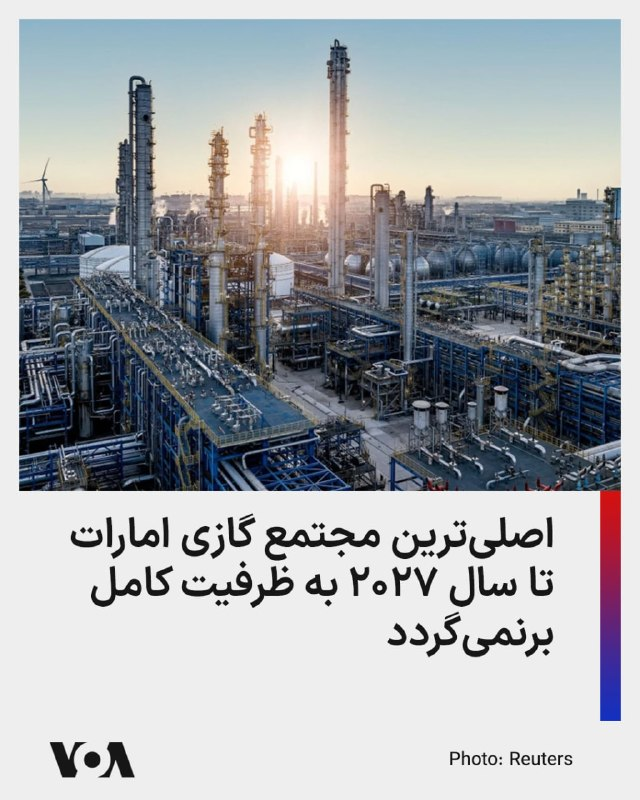
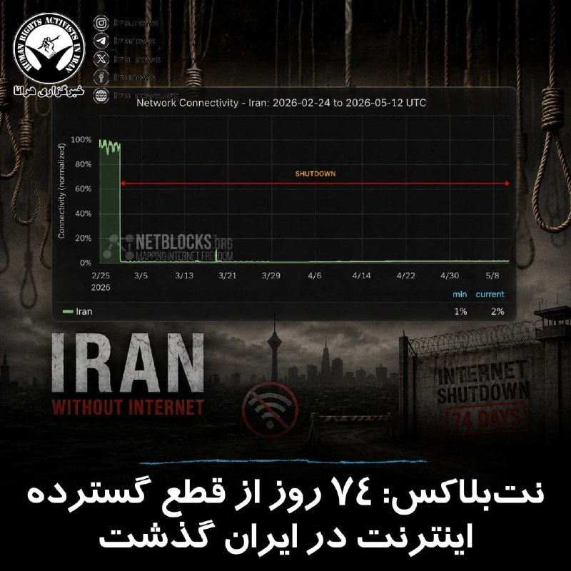

# خواننده تلگرام

<!-- TOP_NAV START -->

<!-- TOP_NAV END -->

<!-- MSG START -->

---
📅 بروزرسانی: 1405/02/22 13:09
---

## VahidOOnLine — post 239671

  <a href="telegram/content/VahidOOnLine_239671_1778578768.mp4" target="_blank">🎬 Download video</a>

روزنامه اسرائیل هیوم گزارش داد هزاران شهروند اسرائیلی پیامک‌هایی تهدیدآمیز به زبان عبری دریافت کرده‌اند که در آنها از مخاطبان خواسته شده با جمهوری اسلامی همکاری اطلاعاتی کنند.

در یکی از این پیامک‌ها آمده است: «به شما قول داده بودیم که به‌زودی ستاره‌هایی را در آسمان شب خواهید دید که ستاره نیستند… به‌زودی خورشید را در آسمان شب خواهید دید، اما…»

بر اساس این گزارش، سازمان ملی سایبری اسرائیل این پیام‌ها را بخشی از تلاش برای ایجاد ترس و اثرگذاری روانی توصیف کرده و از شهروندان خواسته است به پیام‌ها پاسخ ندهند، شماره فرستنده را مسدود کنند و آن را گزارش دهند.
‌🏁 🇬🇧 ManotoTV

🤖 @VahidOOnLine

## VahidOOnLine — post 239670

  

♦️دادگاه عالی جنایی بحرین روز سه‌شنبه ۲۲ اردیبهشت یک زن را به اتهام همکاری اطلاعاتی با سپاه پاسداران به حبس ابد محکوم کرد.
به گزارش دیلی تریبون بحرین، این زن متهم است که در شبکه‌های اجتماعی تصاویری از اهداف و اماکن حیاتی کشورش را با هدف ضربه زدن به امنیت ملی بحرین منتشر می‌کرده است.

این زن همچنین متهم شده است که تصاویری از حملات جمهوری اسلامی به بحرین را همراه با محتوایی در راستای تمجید حکومت ایران منتشر می‌کرده است.
‌🇸🇦 Indypersian

🤖 @VahidOOnLine

## VahidOOnLine — post 239669

  

مسعود پزشکیان، رییس دولت جمهوری اسلامی، گفت: «دولت بنا ندارد برای فعالیت اقتصادی سالم محدودیت ایجاد کند، اما در مقابل نیز اجازه نخواهد داد عده‌ای با سوءاستفاده از شرایط جنگی، معیشت مردم را هدف قرار دهند.»

او یکی از سیاست‌های اساسی دولت چهاردهم در وضعیت کنونی را «کنترل مصرف و جلوگیری از شکل‌گیری تقاضای القایی و کاذب» دانست و افزود: «ایجاد تقاضای غیرواقعی بدون تامین متناسب کالا، منجر به نارضایتی عمومی خواهد شد.»

پزشکیان ادامه داد: «یکی از مهم‌ترین اهداف دشمن در شرایط فعلی، ایجاد اختلال در اقتصاد و فشار بر معیشت مردم است.»
‌🏁 🇬🇧 IranintlTV

🤖 @VahidOOnLine

## DEJradio — post 4583

  <a href="telegram/content/DEJradio_4583_1778578770.webm" target="_blank">🎬 Download video</a>

🚨
⭕️ تا شعاع ۵۰ کیلومتری پایگاه مشترک اسرائیل و آمریکا در عراق کسی حق نزدیک شدن ندارد

شاکر ابوتراب التمیمی، نماینده فراکسیون بدر [وابسته به نیروی قدس سـ.ـپاه] در پارلمان عراق، افشا کرد پایگاه مشترک اسرائیل- آمریکا در صحرای غرب عراق همچنان فعال است و نیروهای امنیتی عراق و آنها «اجازه نزدیک شدن به آن را ندارند».

به گفته التمیمی، «حدود دو ماه پیش اطلاعاتی درباره وجود این کمپ در خاک عراق منتشر شده بود، اما این اردوگاه همچنان پابرجاست و بغداد عملا هیچ کنترلی بر آن ندارد و آمریکا صراحتا به دولت عراق گفته است تا شعاع ۵۰ کیلومتری آن مکان کسی حق تردد و نزدیک شدن به آنجا را ندارد.»

او همچنین گفت، «دولت در ابتدا از این موضوع بی‌اطلاع بود، اما بعدها از مسیر دستگاه‌های امنیتی از وجود این پایگاه مشترک در صحرای غربی مطلع شد».
پیش‌تر وال‌استریت ژورنال به نقل از منابع امنیتی از وجود یک پایگاه مخفی اسرائیلی در صحرای نجف عراق خبر داده بود. طی جنگ ۴۰ روزه این پایگاه پشتیبان حملات به رژیم ایران بود.

#جنگ۴۰روزه #جمهوری_اسلامی
@DEJradio

## IranIntlTV — post 336785

  <a href="telegram/content/IranIntlTV_336785_1778578771.mp4" target="_blank">🎬 Download video</a>

اجلاس دموکراسی کپنهاگ ۲۰۲۶ در دانمارک با شعار «ساختن ائتلافی از دموکراسی‌ها در نظم بی‌نظم نوین جهانی» برگزار می‌شود. مسیح علی‌نژاد، فعال حقوق بشر ایرانی، امسال در فهرست مهمانان اصلی این اجلاس قرار دارد.
مهران عباسیان، خبرنگار ایران‌اینترنشنال، گزارش می‌دهد
@iranintltv

## IranIntlTV — post 336784

🔻ترامپ و شی درباره ایران، تجارت، هوش مصنوعی و تسلیحات هسته‌ای گفت‌وگو خواهند کرد

مقام‌های آمریکایی اعلام کردند دونالد ترامپ، رییس‌جمهوری آمریکا، و شی جین‌پینگ، رییس‌جمهوری چین، در جریان سفر دو روزه ترامپ به چین درباره ایران، تایوان، هوش مصنوعی و تسلیحات هسته‌ای گفت‌وگو خواهند کرد؛ در حالی که دو طرف در حال بررسی تمدید توافق مربوط به مواد معدنی حیاتی هستند.

خبرگزاری رویترز سه‌شنبه ۲۲ اردیبهشت نوشت که رهبران دو اقتصاد بزرگ جهان قرار است پس از بیش از شش ماه نخستین دیدار حضوری خود را برگزار کنند. دیداری که در شرایط تنش میان دو کشور بر سر تجارت، جنگ آمریکا و اسرائیل با حکومت ایران و دیگر اختلافات انجام می‌شود.

ترامپ قرار است چهارشنبه ۲۳ اردیبهشت وارد پکن شود و مذاکرات او با شی، روزهای پنج‌شنبه و جمعه برگزار خواهد شد.

این نخستین سفر ترامپ به چین از سال ۲۰۱۷ است.
توافق‌های احتمالی درباره خرید هواپیما، کشاورزی و تجارت

مقام‌های آمریکایی گفتند آمریکا و چین احتمالا درباره ایجاد سازوکارهایی برای تسهیل تجارت و سرمایه‌گذاری متقابل توافق خواهند کرد و انتظار می‌رود پکن خریدهایی را در حوزه هواپیماهای بوئینگ، محصولات کشاورزی آمریکا و انرژی اعلام کند.

به گفته یکی از این مقام‌ها، احتمال دارد طرح ایجاد «شورای تجارت» و «شورای سرمایه‌گذاری» نیز در این دیدار به‌طور رسمی اعلام شود، اما اجرای این سازوکارها به مذاکرات و اقدامات بعدی نیاز خواهد داشت.

دو کشور همچنین درباره تمدید آتش‌بس در جنگ تجاری خود گفت‌وگو خواهند کرد. توافقی که امکان صادرات مواد معدنی کمیاب از چین به آمریکا را فراهم کرده است.

این مقام آمریکایی گفت هنوز مشخص نیست این توافق در همین هفته تمدید شود یا نه، اما ابراز اطمینان کرد که در نهایت تمدید خواهد شد.

او به خبرنگاران گفت: «این توافق هنوز منقضی نشده است. مطمئنم هر گونه تمدید احتمالی در زمان مناسب اعلام خواهد شد.»

رویترز نوشت که سفارت چین در واشینگتن از اظهار نظر درباره این موضوع خودداری کرد.
ایران، تایوان و تسلیحات هسته‌ای؛ محورهای اختلاف

انتظار می‌رود گفت‌وگوهای ترامپ و شی به موضوعاتی مربوط شود که سال‌ها از محورهای تنش میان واشینگتن و پکن بوده‌اند؛ از جمله ایران، تایوان و تسلیحات هسته‌ای.

پکن روابط خود را با تهران حفظ کرده و همچنان یکی از خریداران اصلی نفت ایران است.

ترامپ تلاش کرده از نفوذ چین برای اعمال فشار بر تهران به‌منظور توافق با واشینگتن و پایان دادن به جنگی استفاده کند که با حملات آمریکا و اسرائیل به ایران در ۹ اسفند ۱۴۰۴ آغاز شد.

دولت ترامپ همچنین درباره روابط چین و روسیه به پکن فشار آورده است.

یکی از مقام‌های آمریکایی گفت: «رییس‌جمهوری چندین بار با شی جین‌پینگ درباره ایران و روسیه گفت‌وگو کرده، از جمله درباره درآمدی که چین در اختیار این دو حکومت قرار می‌دهد، و نیز کالاها و قطعات دو منظوره و حتی احتمال صادرات تسلیحات.»

او افزود: «انتظار دارم این گفت‌وگوها ادامه پیدا کند.»

در مقابل، شی از سیاست واشینگتن درباره تایوان ناراضی است.

آمریکا همچنان مهم‌ترین حامی بین‌المللی و تامین‌کننده تسلیحات برای تایوان به شمار می‌رود. جزیره‌ای که چین آن را بخشی از خاک خود می‌داند.

به گفته مقام‌های آمریکایی، چین در سال‌های اخیر حضور نظامی خود را در اطراف تایوان افزایش داده، اما سیاست آمریکا در این زمینه تغییر نخواهد کرد.
نگرانی آمریکا از پیشرفت هوش مصنوعی در چین

مشاوران ترامپ نگرانی فزاینده‌ای نسبت به مدل‌های پیشرفته هوش مصنوعی در حال توسعه در چین ابراز کرده‌اند.

آنان معتقدند دو کشور باید برای جلوگیری از بروز تنش ناشی از استفاده از این فناوری، «کانال ارتباطی» میان خود ایجاد کنند.

یکی از مقام‌ها گفت: «هنوز مشخص نیست این سازوکار چه شکلی خواهد داشت، اما می‌خواهیم از فرصت دیدار رهبران برای آغاز گفت‌وگو و بررسی امکان ایجاد کانال ارتباطی درباره مسائل مرتبط با هوش مصنوعی استفاده کنیم.»
اختلاف بر سر تسلیحات هسته‌ای

واشینگتن سال‌هاست امیدوار است گفت‌وگوهایی را درباره تسلیحات هسته‌ای با پکن آغاز کند، اما چین همچنان تمایلی به مذاکره درباره زرادخانه هسته‌ای خود نشان نداده است.

به گفته یک مقام آمریکایی، دولت چین به‌صورت خصوصی به واشینگتن اعلام کرده که در مقطع کنونی، «هیچ علاقه‌ای به گفت‌وگو درباره کنترل تسلیحات هسته‌ای یا موضوعات مشابه ندارد».

آخرین دیدار ترامپ و شی، آبان ۱۴۰۴ در کره جنوبی انجام شد. جایی که دو طرف توافق کردند جنگ تجاری شدید میان خود را متوقف کنند. جنگی که طی آن آمریکا تعرفه‌های سه رقمی بر کالاهای چینی وضع کرده بود و پکن نیز تهدید کرده بود صادرات مواد معدنی کمیاب را محدود خواهد کرد.

🔗 وب‌سایت ایران اینترنشنال
@iranintltv

## IranIntlTV — post 336783

  

مسعود پزشکیان، رییس دولت جمهوری اسلامی، گفت: «دولت بنا ندارد برای فعالیت اقتصادی سالم محدودیت ایجاد کند، اما در مقابل نیز اجازه نخواهد داد عده‌ای با سوءاستفاده از شرایط جنگی، معیشت مردم را هدف قرار دهند.»

او یکی از سیاست‌های اساسی دولت چهاردهم در وضعیت کنونی را «کنترل مصرف و جلوگیری از شکل‌گیری تقاضای القایی و کاذب» دانست و افزود: «ایجاد تقاضای غیرواقعی بدون تامین متناسب کالا، منجر به نارضایتی عمومی خواهد شد.»

پزشکیان ادامه داد: «یکی از مهم‌ترین اهداف دشمن در شرایط فعلی، ایجاد اختلال در اقتصاد و فشار بر معیشت مردم است.»
https://iranintl.com/202605122119

## IranIntlTV — post 336782

🔻۸ زندانی سیاسی زن در اوین از حق ملاقات با خانواده محروم شدند

بر اساس اطلاعات رسیده به ایران‌اینترنشنال، شیوا اسماعیلی، گلرخ ایرایی، سکینه پروانه، فروغ تقی‌پور، زهرا صفایی، مرضیه فارسی، الهه فولادی و وریشه مرادی، هشت تن از زندانیان سیاسی زن محبوس در بند زنان زندان اوین، از حق ملاقات با خانواده و وکیلان خود محروم شده‌اند.

اطلاعات رسیده حاکی است این محرومیت‌ها پس از تشدید فضای امنیتی در بند زنان اوین و در پی فشار و برخورد با زندانیانی اعمال شده که در برنامه‌های جمعی، یادبودها و رخدادهای اعتراضی داخل بند، مشارکت داشته‌اند.

یک منبع نزدیک به خانواده‌های زندانیان محبوس در بند زنان اوین به ایران‌اینترنشنال گفت در هفته‌های اخیر ماموران زندان بر خلاف روال پیشین، هر روز در ساعات صبح و گاه شب، به بهانه سرکشی وارد بند شده‌اند و با تردد مداوم خود، فضای بند را بیش از گذشته امنیتی کرده‌اند.

به گفته این منبع آگاه، زندانیان زن اوین در سال‌های گذشته مناسبت‌های سیاسی و عقیدتی را با دورهمی، خواندن متن و مقاله، سرودخوانی و یادآوری نام جان‌باختگان و چهره‌های پیشین و پیشکسوت جنبش‌های اعتراضی گرامی می‌داشتند، اما اخیرا همین برنامه‌ها نیز با دخالت مستقیم ماموران و مسئولان زندان و تهدید شرکت‌کنندگان روبه‌رو شده است.

این منبع مطلع افزود شماری از زندانیانی که به تازگی به بند زنان اوین منتقل شده‌اند و در برخی از این برنامه‌ها حضور پراکنده داشتند نیز از سوی زندانبانان و نیروهای امنیتی تهدید شده‌اند.

یک منبع آگاه دیگر به ایران‌اینترنشنال گفت ماموران زندان در ماه‌های اخیر با ادبیاتی اهانت‌آمیز با زندانیان برخورد کرده و آنان را به انتقال به سلول انفرادی تهدید کرده‌اند.

منبع دیگری که از وضعیت زنان زندانی در اوین مطلع است، به ایران‌اینترنشنال گفت غزل مرزبان، از زنان زندانی در اوین، اخیرا پس از اعتراض به رسیدگی نشدن به وضعیتش، پنج شب به سلول انفرادی منتقل شده است.

بند زنان اوین که از آن با عنوان خط مقدم جنبش «زن، زندگی، آزادی» یاد می‌شود، در سال‌های گذشته یکی از کانون‌های اصلی کنش‌گری زندانیان سیاسی زن بوده است. زندانیان این بند بارها در واکنش به تحولات سیاسی، اجتماعی و مدنی، از جمله اعتراض‌ها و خیزش‌ها، اعدام‌ها، بازداشت‌ها، فقر، فساد و سرکوب معترضان، موضع‌گیری کرده‌اند.

این بند همچنین بارها شاهد حرکت‌های اعتراضی، از جمله تحصن و اعتصاب غذای زندانیان در اعتراض به صدور و اجرای احکام اعدام بوده و زندانیان پس از آن با اقدامات تنبیهی، از جمله محرومیت از حق تماس تلفنی و ملاقات و نیز پرونده‌سازی تازه مواجه شده‌اند.

یک منبع نزدیک به خانواده‌های زندانیان زن اوین گفت افزایش محدودیت‌ها، تهدید به انفرادی و محرومیت از ملاقات، بخشی از تلاش مقام‌های زندان و نهادهای امنیتی برای خاموش کردن صدای اعتراض در این بند است.
محرومیت محترم پرندین از درمان فوری با وجود تومور نزدیک مخچه

بر اساس اطلاعات رسیده به ایران‌اینترنشنال، محترم پرندین، معروف به محشر، هنرمند و نقاش زندانی در اوین که ماه‌هاست با اتهامات سیاسی در حبس است، با وجود ابتلا به دو تومور در ناحیه پشت سر، نزدیک مخچه و گلو و همچنین بیماری حاد قلبی، از اعزام درمانی و جراحی فوری محروم مانده است.

یک منبع مطلع به ایران‌اینترنشنال گفت پزشک زندان جراحی فوری پرندین را ضروری دانسته و درباره خطر تومور نزدیک مخچه هشدار داده است. توموری که باعث اختلال در بینایی، تکلم و حرکات بدنی او شده و به گفته هم‌بندی‌هایش، آثار آن در راه رفتن و صحبت کردنش قابل مشاهده است.

به گفته این منبع آگاه، با وجود تاکید پزشک زندان، مسئولان تاکنون برای اعزام درمانی او همکاری نکرده‌اند و با وجود گذشت بیش از نیمی از ایام حبس و وخامت حال، با آزادی مشروط و مرخصی درمانی‌اش نیز مخالفت کرده‌اند.

این در حالی است که سند لازم برای مرخصی در اختیار دادستانی قرار دارد.

پرندین، مادر یک پسر نوجوان و محصل است و پس از درگذشت همسرش، سرپرستی خانواده را بر عهده دارد. فرزند او نیز به بیماری خاص مبتلاست و در نبود مادر با مشکلات جدی روبه‌رو شده است.
در سال‌های گذشته، گزارش‌های متعددی از محرومیت زندانیان سیاسی در ایران از رسیدگی پزشکی و نقض حق دسترسی آنان به درمان مناسب از سوی مسئولان زندان‌ها منتشر شده است.

شماری از زندانیان سیاسی نیز طی سال‌های اخیر در دوران حبس جان خود را از دست داده‌اند. مرگ‌هایی که خانواده‌ها و نهادهای حقوق بشری، آن‌ها را نتیجه فشار، شکنجه یا محرومیت از خدمات درمانی دانسته‌اند، اما جمهوری اسلامی در قبال آن‌ها مسئولیتی نپذیرفته است.

🔗 وب‌سایت ایران اینترنشنال
@iranintltv

## ManotoTV — post 105336

  <a href="telegram/content/ManotoTV_105336_1778578774.mp4" target="_blank">🎬 Download video</a>

روزنامه اسرائیل هیوم گزارش داد هزاران شهروند اسرائیلی پیامک‌هایی تهدیدآمیز به زبان عبری دریافت کرده‌اند که در آنها از مخاطبان خواسته شده با جمهوری اسلامی همکاری اطلاعاتی کنند.

در یکی از این پیامک‌ها آمده است: «به شما قول داده بودیم که به‌زودی ستاره‌هایی را در آسمان شب خواهید دید که ستاره نیستند… به‌زودی خورشید را در آسمان شب خواهید دید، اما…»

بر اساس این گزارش، سازمان ملی سایبری اسرائیل این پیام‌ها را بخشی از تلاش برای ایجاد ترس و اثرگذاری روانی توصیف کرده و از شهروندان خواسته است به پیام‌ها پاسخ ندهند، شماره فرستنده را مسدود کنند و آن را گزارش دهند.

## FarsiVOA — post 217513

  

شرکت «ادنوک گاز» که بهره‌برداری از تأسیسات حبشان، اصلی‌ترین مجتمع گازی امارات متحده عربی را برعهده دارد، اعلام کرد انتظار می‌رود این مجتمع سال ۲۰۲۷ بتواند ظرفیت کامل خود را بازیابد.

تأسیسات حبشان در جریان جنگ اخیر هدف حملات جمهوری اسلامی قرار گرفت و این حملات یک کشته و هفت زخمی بر جای گذاشت.

ادنوک گاز روز سه‌شنبه در بیانیه‌ای که به مناسبت انتشار نتایج سه‌ماهه خود صادر کرد، نوشت هدف این است که «تا پایان سال ۲۰۲۶ به ۸۰ درصد بازیابی برسیم و بازگشت به ظرفیت کامل در سال ۲۰۲۷ انجام شود.»

مجتمع حبشان در ابوظبی، یکی از بزرگ‌ترین مراکز فرآوری گاز در جهان، اوایل آوریل دوبار هدف حملات جمهوری اسلامی قرار گرفت.

ادنوک گاز که زیرمجموعه شرکت بزرگ اماراتی «ادنوک» است تاکنون توانسته ۶۰ درصد از ظرفیت فرآوری این مجتمع را بازگرداند. سود خالص ادنوک گاز در سه ماه نخست سال، در شرایطی که «اختلالات عمده در بخش انرژی و ترافیک دریایی در تنگه هرمز» وجود داشته، ۱۵ درصد نسبت به سال گذشته کاهش یافته و به ۱.۱ میلیارد دلار رسیده است.

بسته شدن تنگه هرمز باعث اختلال در تأمین و افزایش شدید قیمت‌های انرژی شده است.
@FarsiVOA

## Persian_Trend_Official — post 13967

  

⭕️ فعالیت سنگین نیروی دریایی آمریکا در اطراف تنگه باب‌المندب

این فعالیت سنگین در آب‌های جنوبی یمن و تا فاصله با تنگه باب‌المندب احتمالاً برای پشتیبانی از ناو گروه ضربت هواپیمابر شارل دوگل فرانسه برای خروج از تنگه باب‌المندب است.
ناو هواپیمابر جورج بوش پوشش خروج ناو شارل دوگل را از تنگه باب‌المندب فراهم می‌کند.

📝 Nick

📌 @persian_trend_official
پرشین ترند | متفاوت‌ترین کانال نظامی

## RadioFarda — post 157082

ترامپ می‌گوید خسته نمی‌شود و فشار بر جمهوری اسلامی را تا پیروزی کامل ادامه خواهد داد

🔸دونالد ترامپ، رئیس‌جمهور ایالات متحده، شامگاه دوشنبه ۲۱ اردیبهشت در گفت‌وگو با خبرنگاران بار دیگر پاسخ مقامات جمهوری اسلامی به پیشنهاد صلح آمریکا را «ضعیف» و «کاملاً غیرقابل قبول» خواند و تأکید کرد فشار بر جمهوری اسلامی را تا زمان دستیابی به توافق ادامه خواهد داد و از ادامهٔ جنگ فرسایشی خسته نخواهد شد.

🔸ترامپ در گفت‌وگو با خبرنگاران در کاخ سفید، با اشاره به رد پیشنهاد آمریکا از سوی تهران، گفت: «احمق‌ها نمی‌خواستند قبول کنند. فکر می‌کردند من خسته می‌شوم یا حوصله‌ام سر می‌رود یا تحت فشار قرار می‌گیرم، اما هیچ فشاری وجود ندارد. ما به یک پیروزی کامل خواهیم رسید.»

🔸او همچنین دربارهٔ پیشنهاد ارائه‌شده از سوی جمهوری اسلامی گفت: «به‌نظرم فوق‌العاده ضعیف است. بعد از خواندن مزخرفاتی که برای ما فرستادند، آن را ضعیف‌ترین پاسخ یافتم. من حتی خواندنش را تمام نکردم، گفتم وقتم را برای خواندن آن تلف نمی‌کنم.»

🔸ترامپ در گفت‌وگو با شبکه سی‌بی‌اس هم گفت تهران در برنامه هسته‌ای خود امتیازاتی داده، اما این امتیازها «کافی نبوده» است.

🔸ترامپ یک روز پیش‌تر نیز گفته بود از پاسخ تهران به پیشنهاد آمریکا رضایت ندارد و آن را «کاملاً غیرقابل قبول» می‌داند. همزمان، صداوسیمای جمهوری اسلامی گزارش داد که این پیشنهاد رد شده، زیرا به گفته این رسانه، به معنای «تسلیم کامل» بوده است.

🔸رئیس‌جمهور آمریکا در پاسخ به پرسشی دربارهٔ احتمال تغییر حکومت در ایران هم گفت در جمهوری اسلامی «میانه‌روها» و «دیوانه‌ها» وجود دارند و افزود: «دیوانه‌ها می‌خواهند تا آخر بجنگند.» ترامپ گفت جنگ «خیلی کوتاه» خواهد بود و مدعی شد میانه‌روها در حکومت ایران از تندروها می‌ترسند.

🔸نسخه کامل این گزارش را در وب‌سایت رادیوفردا بخوانید.

@RadioFarda

## Hranews — post 112896

  

نت‌بلاکس، نهاد ناظر بر اختلالات اینترنت در جهان، اعلام کرد که قطع گسترده اینترنت در ایران وارد هفتاد و چهارمین روز خود شده و اکنون از مرز ۱۷۵۲ ساعت گذشته است. این نهاد تاکید کرده که از زمان آغاز این محدودیت‌ها، دسترسی عمومی شهروندان ایران به #اینترنت جهانی همچنان به‌طور گسترده مسدود مانده است.

نت‌بلاکس همچنین با اشاره به همزمانی این محدودیت‌ها با بازداشت و اعدام شماری از فعالان و متخصصان حوزه فناوری در ایران، نوشته است که در حالی‌ که جهان شاهد پیشرفت‌های علمی و فناوری بوده، حکومت ایران به برخوردهای امنیتی با تکنولوژیست‌ها ادامه داده است.

↘️
@hranews_bot تماس ✉️ - @Hranews کانال هرانا 🆑

## manototv — post 105336

  <a href="telegram/content/manototv_105336_1778578777.mp4" target="_blank">🎬 Download video</a>

روزنامه اسرائیل هیوم گزارش داد هزاران شهروند اسرائیلی پیامک‌هایی تهدیدآمیز به زبان عبری دریافت کرده‌اند که در آنها از مخاطبان خواسته شده با جمهوری اسلامی همکاری اطلاعاتی کنند.

در یکی از این پیامک‌ها آمده است: «به شما قول داده بودیم که به‌زودی ستاره‌هایی را در آسمان شب خواهید دید که ستاره نیستند… به‌زودی خورشید را در آسمان شب خواهید دید، اما…»

بر اساس این گزارش، سازمان ملی سایبری اسرائیل این پیام‌ها را بخشی از تلاش برای ایجاد ترس و اثرگذاری روانی توصیف کرده و از شهروندان خواسته است به پیام‌ها پاسخ ندهند، شماره فرستنده را مسدود کنند و آن را گزارش دهند.

## alonews — post 119456

  <a href="telegram/content/alonews_119456_1778578778.webm" target="_blank">🎬 Download video</a>

👈سفیر آمریکا در تل‌آویو می‌گوید اسرائیل سامانه‌های گنبد آهنین را به امارات متحده عربی ارسال کرده است 
✅ @AloNews خبر جنگ

<!-- MSG END -->

<!-- NAV START -->

<!-- NAV END -->
